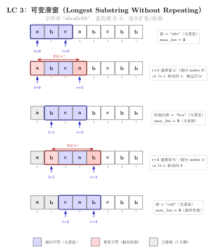
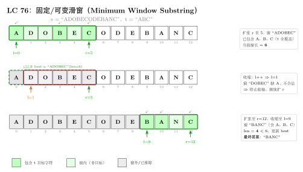

# 03 — Sliding Window（融合版）

> **难度**：★★★☆☆
> **题数**：4
> **核心套路**：可变窗口双指针、哈希计数辅助、固定步长枚举
> **本文件**：覆盖 sliding_window 4 题的算法套路总结 + 典型题精讲 + 自测

---

## 一例速记

> **可变窗口**：left/right 指向窗口两端，right 每步右扩，条件不满足时 left 右缩；维护窗口内的聚合量（sum / 字符计数）随指针移动增量更新，$O(n)$ 时间 $O(1)$ 或 $O(k)$ 空间（209 / 3 / 76）
> **哈希计数辅助**：用 Counter 或 dict 记录窗口内字符频率，"满足条件"等价于 `need == 0` 或 `formed == required`；滑动时 left 缩小只在计数归零后才更新满足数（76 最小覆盖子串）
> **固定窗口枚举**：窗口大小固定为 `len(word) × num_words`，步长为 `len(word)`，每个起点独立用 Counter 比对（30 单词拼接）
> **复杂度对比**：暴力枚举所有子串 $O(n^2)$（甚至 $O(n^2 k)$）→ 滑动窗口 $O(n)$ 或 $O(n \cdot k)$
> **AI 关联**：流式数据处理（实时特征窗口）、在线学习（mini-batch 滑动）、序列模型（时序特征提取）——滑动窗口是有界上下文的工程原型

---

## 思维路径还原

> "看到 **209 Minimum Size Subarray Sum**：找最短连续子数组使之和 ≥ target →
> 子数组长度不固定，但窗口越大越可能满足条件，所以用可变窗口。
> right 右扩时 `window_sum += nums[right]`；当 window_sum >= target 时记录长度 right-left+1，
> 然后 left 右缩并 `window_sum -= nums[left]`，继续尝试缩小；
> 关键：left 缩小不是一次性缩到不满足，而是每次缩一步并立即记录，以捕捉所有满足条件的最短窗口。
>
> 看到 **3 Longest Substring Without Repeating Characters**：最长无重复字符子串 →
> 同样可变窗口，但维护的是"窗口内无重复"的约束。
> 用 set 或 dict 记录窗口内字符，right 扩时若 s[right] 已在窗口中，left 一步一步右缩直到重复消除；
> 每步更新 best = max(best, right - left + 1)。
> 也可用 dict 存字符最近出现下标，left 跳到 `last_seen[s[right]] + 1` 而非逐步缩（效率更高但边界更难想）。
>
> 看到 **76 Minimum Window Substring**：s 中包含 t 所有字符的最短子串 →
> 需要字符频率计数。预处理 `need = Counter(t)`，`required = len(need)` 记录需要满足的不同字符数。
> right 扩时更新 `window[s[right]]++`；若新加字符的频率恰好等于 need 中的需求，formed++；
> 当 formed == required（所有字符均已覆盖），记录当前窗口长度，然后 left 缩：
> `window[s[left]]--`，若某字符频率低于 need，formed--，left 缩到不满足为止。
> 关键：formed 只在频率"恰好满足"或"恰好不满足"时变化，而非每次计数变化都更新。
>
> 看到 **30 Substring with Concatenation of All Words**：找所有起点使连续子串恰好是 words 的拼接 →
> 所有 word 等长（设为 L），窗口总长 = L × len(words)。固定窗口模式：
> 枚举起点 i（0 到 L-1），步长 L 滑动；维护窗口内各词计数，与 `Counter(words)` 比对；
> 当窗口内词数达到 len(words) 且计数匹配，记录左端为答案；left 缩时移除最左词并更新计数。
> 注意：起点只需枚举 0 到 L-1（共 L 个），因为步长为 L，所有起点都能被覆盖。"

---

## 学习目标

- 掌握可变窗口的"右扩左缩"模板及窗口量的增量更新技巧
- 理解哈希计数辅助（formed/required 技巧）在字符覆盖问题中的应用
- 能用固定步长枚举处理等长单词拼接问题
- 识别"子串/子数组 + 最长/最短/恰好满足"的问题与滑动窗口的对应关系
- 理解滑动窗口与流式数据处理、在线学习窗口的工程联系

---

## 几何示意

### 图 可变滑窗（LC 3）



### 图 可变滑窗 + 哈希（LC 76）



---
## 抽象成方法（标准模板代码）

### 套路 1：可变窗口（数值聚合）

适用题：209（最短子数组和 ≥ target）

```python
import math

def min_subarray_len(target: int, nums: list[int]) -> int:
    """可变窗口：找最短子数组使之和 >= target。时间 O(n)，空间 O(1)。"""
    left = 0
    window_sum = 0
    best = math.inf

    for right in range(len(nums)):
        window_sum += nums[right]           # 右扩：增量更新聚合量
        while window_sum >= target:         # 满足条件：尝试缩小
            best = min(best, right - left + 1)
            window_sum -= nums[left]        # 左缩：减去移出元素
            left += 1

    return 0 if best == math.inf else best
```

> 关键规律：`for right` + `while left` 是可变窗口的经典结构；聚合量随指针移动做增量更新（加/减单个元素），避免每次重新扫描整个窗口。

### 套路 2：可变窗口（集合约束）

适用题：3（最长无重复字符子串）

```python
def length_of_longest_substring(s: str) -> int:
    """可变窗口 + set 维护唯一性。时间 O(n)，空间 O(min(n, k))，k 为字符集大小。"""
    left = 0
    window: set[str] = set()
    best = 0

    for right in range(len(s)):
        # 右扩：若字符已在窗口中，左缩直到消除重复
        while s[right] in window:
            window.remove(s[left])
            left += 1
        window.add(s[right])
        best = max(best, right - left + 1)

    return best


# 优化版：dict 记录最近下标，left 跳跃而非逐步缩
def length_of_longest_substring_v2(s: str) -> int:
    """时间 O(n)，空间 O(k)。left 直接跳到重复字符的后一位。"""
    last_seen: dict[str, int] = {}
    left = 0
    best = 0

    for right, ch in enumerate(s):
        if ch in last_seen and last_seen[ch] >= left:
            left = last_seen[ch] + 1    # 跳跃：跳过重复字符
        last_seen[ch] = right
        best = max(best, right - left + 1)

    return best
```

> 注意 v2 中 `last_seen[ch] >= left` 的判断：若上次出现位置在 left 左侧，说明该字符已不在当前窗口中，不需要缩左。

### 套路 3：可变窗口（哈希计数辅助）

适用题：76（最小覆盖子串）

```python
from collections import Counter

def min_window(s: str, t: str) -> str:
    """可变窗口 + 频率计数。时间 O(n + m)，空间 O(k)，k 为字符集大小。"""
    if not t or not s:
        return ""

    need = Counter(t)           # 每个字符的需求量
    required = len(need)        # 需满足的不同字符数
    window: dict[str, int] = {}
    formed = 0                  # 当前已满足需求的不同字符数
    left = 0
    best_len = math.inf
    best_left = 0

    for right in range(len(s)):
        ch = s[right]
        window[ch] = window.get(ch, 0) + 1
        # 若该字符计数恰好达到需求，formed +1
        if ch in need and window[ch] == need[ch]:
            formed += 1

        # 满足覆盖条件：尝试缩小
        while formed == required:
            if right - left + 1 < best_len:
                best_len = right - left + 1
                best_left = left
            lch = s[left]
            window[lch] -= 1
            if lch in need and window[lch] < need[lch]:
                formed -= 1     # 该字符不再满足需求
            left += 1

    return "" if best_len == math.inf else s[best_left: best_left + best_len]
```

### 套路 4：固定步长窗口（等长单词拼接）

适用题：30（Substring with Concatenation of All Words）

```python
def find_substring(s: str, words: list[str]) -> list[int]:
    """固定步长窗口，枚举 L 个起点。时间 O(n * L)，空间 O(L * k)。"""
    if not s or not words:
        return []
    L = len(words[0])       # 每个单词的长度
    num_words = len(words)
    window_size = L * num_words
    word_count = Counter(words)
    result: list[int] = []

    # 起点只需枚举 0..L-1，步长 L 即可覆盖所有位置
    for start in range(L):
        left = start
        current: dict[str, int] = {}
        count = 0           # 窗口内有效词数

        for right_word in range(start, len(s) - L + 1, L):
            word = s[right_word: right_word + L]
            if word in word_count:
                current[word] = current.get(word, 0) + 1
                count += 1
                # 超出该词需求数量：左缩到刚好消除多余
                while current[word] > word_count[word]:
                    left_word = s[left: left + L]
                    current[left_word] -= 1
                    count -= 1
                    left += L
                if count == num_words:
                    result.append(left)
            else:
                # 遇到非法词：重置窗口
                current.clear()
                count = 0
                left = right_word + L

    return result
```

### 套路 5：可变窗口通用框架

适用题：所有可变窗口题的统一模板

```python
def sliding_window_template(data: list, condition_fn, update_fn) -> int:
    """
    可变窗口通用框架（伪代码风格，展示结构）。
    - right 右扩：更新窗口状态
    - 条件满足时：记录答案，left 右缩并更新状态
    时间 O(n)：每个元素最多入窗一次、出窗一次。
    """
    left = 0
    state = {}      # 窗口状态（sum / set / counter 等）
    best = 0        # 或 float('inf')，视题目而定

    for right in range(len(data)):
        update_fn(state, data[right], "add")        # 右扩，更新状态
        while condition_fn(state):                  # 条件满足（或不满足）
            best = max(best, right - left + 1)      # 记录答案
            update_fn(state, data[left], "remove")  # 左缩，更新状态
            left += 1

    return best
```

> 框架变体：①最长问题：条件为"违反约束"时缩左，循环外记录答案；②最短问题：条件为"满足要求"时记录答案并缩左。

### 速查表

| 题型特征 | 套路 | 维护结构 | 时间 | 空间 |
|---|---|---|---|---|
| 最短子数组，和 ≥ target | 可变窗口，满足时缩左记录 | 整数 sum | $O(n)$ | $O(1)$ |
| 最长子串，无重复字符 | 可变窗口，违反时缩左 | set 或 last_seen dict | $O(n)$ | $O(k)$ |
| 最小覆盖子串，含 t 所有字符 | 可变窗口 + formed/required | Counter + formed | $O(n+m)$ | $O(k)$ |
| 等长单词拼接，找所有起点 | 固定步长枚举 L 个起点 | Counter，按词步进 | $O(n \cdot L)$ | $O(k)$ |

---

## 方法变形（4 类）

### 变形 1：最短 vs 最长

- **最短**（209 / 76）：条件"满足"时记录并缩左，找到最小长度。
- **最长**（3）：条件"违反"时缩左，循环外每步记录最大长度。
- **记忆口诀**：最短 → 满足时缩；最长 → 违反时缩。两者 `while` 的触发条件相反，其余结构相同。

### 变形 2：计数辅助的层次

- **简单计数**（3）：set 判断唯一性，$O(1)$ 查询删除。
- **频率计数**（76）：Counter + formed 变量，`formed` 在"恰好满足"和"恰好不满足"时更新，避免每次 O(|t|) 遍历检查是否全覆盖。
- **双 Counter 比对**（30）：窗口内 Counter 与 `word_count` 直接比较，固定窗口所以每次比较 O(k)；优化版用 formed 思路同样可降到 O(1) 更新。

### 变形 3：字符串 vs 数组

- **字符串**（3 / 76 / 30）：字符集有限（128 或 26），$O(k)$ 空间通常可接受；dict 键为字符。
- **整数数组**（209）：窗口聚合量为数值 sum，直接加减，$O(1)$ 空间。
- **混合场景**（438 找所有字母异位词，非本 category）：同 76 的 formed 技巧，但记录所有满足条件的起点。

### 变形 4：AI / 工程类比

- **流式特征窗口**：在线处理时序数据时，只保留最近 W 步的特征；`left` 对应过期时间戳的移除，`right` 对应新数据的加入，与 209 模板完全同构。
- **在线学习 mini-batch**：固定大小批次滑动处理序列样本，对应固定窗口模式（套路 4）。
- **序列模型注意力**：Transformer 的局部注意力（Local Attention）限制每个 token 只关注距离 W 内的上下文，等价于固定窗口滑动扫描。
- **监控告警**：实时统计最近 N 秒的错误率，新事件入窗加计数，超期事件出窗减计数，满足阈值时触发告警——可变窗口的工程实例。

---

## 思考路标（条件反射）

1. 看到 **"最短 / 最小子数组 + 满足条件"** → 可变窗口，满足条件时记录并缩左
2. 看到 **"最长 / 最大子串 + 约束"** → 可变窗口，违反约束时缩左，每步记录最大
3. 看到 **"子串包含某字符集"** → 哈希计数 + formed/required 技巧（76 模板）
4. 看到 **"等长单词拼接 / 词语排列"** → 固定窗口，枚举 L 个起点按词步进（30 模板）
5. 看到 **"子数组 / 子串"** → 首先想滑动窗口；若需要"前缀和"则想前缀和 + 哈希（非本 category）
6. 看到 **"连续"** → 滑动窗口；若不要求连续则用双指针（two_pointers category）
7. 看到 **"字符不重复"** → 可变窗口 + set，或 dict 存最近下标跳跃（3 的两种写法）
8. 看到 **窗口题不知道 while 里记录还是外面记录** → 最短问题在 while 内记录，最长问题在 while 外（for 内）记录
9. 看到 **"至多 k 个不同字符"的最长子串** → 可变窗口，Counter 记频率，`len(window) > k` 时缩左（340，非本 category 扩展）
10. 看到 **"固定窗口 / 固定步长"** → 不需要 while，直接移除最左元素加入新元素，$O(1)$ 更新
11. 看到 **时序数据 / 流式处理** → 联想可变窗口；窗口 = 上下文范围，指针 = 时间戳边界
12. 看到 **"anagram / 字母异位词"** → Counter 比对或 formed 技巧；字符串长度固定时用固定窗口

---

## 易错点

1. **可变窗口聚合量的增量更新**：right 右扩时只加 `nums[right]`，left 左缩时只减 `nums[left]`；不要每次重新求和（否则 $O(n^2)$）。聚合量必须在指针移动的同时同步更新。
2. **76 题 formed 的更新条件**：formed 只在 `window[ch] == need[ch]`（恰好满足）时 +1，在 `window[lch] < need[lch]`（刚刚不满足）时 -1；不要在每次计数变化时都更新 formed，否则逻辑错误。
3. **3 题 v2 的 left 跳跃守卫**：`if ch in last_seen and last_seen[ch] >= left`，缺少 `>= left` 的判断会把左指针跳到已经在窗口左侧的位置，错误地缩小了有效窗口（已过期的下标不应再触发跳跃）。
4. **30 题起点枚举范围**：只需枚举 `range(L)` 共 L 个起点（L = 单词长度），不是枚举所有字符下标；遇到不在 words 中的词时要重置左指针（left = right_word + L），不要只重置计数。
5. **30 题越界**：内层 for 的范围是 `range(start, len(s) - L + 1, L)`，上界 `len(s) - L + 1` 确保切片 `s[right_word: right_word + L]` 不越界；写成 `len(s)` 会产生空字符串或短字符串。
6. **209 题返回值**：若整个数组之和都 < target，best 仍为 `math.inf`，需返回 0；不要直接 `return best` 或 `return int(best)`（浮点数转换不直观），用 `return 0 if best == math.inf else best`。
7. **窗口更新顺序**：right 扩时先更新状态再判断，left 缩时先记录答案再缩（最短问题）或先缩再记录（最长问题）；顺序颠倒会导致边界差 1 的错误。

---

## 典型应用例题

### 例 1：209. Minimum Size Subarray Sum

**题目**：给定正整数数组 `nums` 和正整数 `target`，找到最短的连续子数组使其和 ≥ target，返回其长度；若不存在返回 0。

**思路**：可变窗口。right 右扩加入元素，窗口和满足条件时记录当前长度并尝试缩左（可能找到更短的窗口）。数组元素全为正数，保证左缩不会让窗口和"反弹"再次满足——这是可变窗口有效的单调性前提。

**解**：

```python
# 参考：solutions/sliding_window/p209_minimum_size_subarray_sum.py
import math

def minSubArrayLen(target: int, nums: list[int]) -> int:
    left = 0
    window_sum = 0
    best = math.inf
    for right in range(len(nums)):
        window_sum += nums[right]
        while window_sum >= target:
            best = min(best, right - left + 1)
            window_sum -= nums[left]
            left += 1
    return 0 if best == math.inf else best
```

**分析**：$O(n)$ 时间，每个元素最多被 right 扫过一次、被 left 移出一次，共 $2n$ 步。$O(1)$ 空间。与前缀和 + 二分的 $O(n \log n)$ 方案相比更优（前缀和方案适用于元素可能为负的情况）。

---

### 例 2：76. Minimum Window Substring

**题目**：给定字符串 `s` 和 `t`，找 `s` 中包含 `t` 所有字符（含重复）的最短子串；若不存在返回空串。

**思路**：可变窗口 + formed/required 计数技巧。`required = len(Counter(t))` 表示需要满足的不同字符数，`formed` 追踪当前已满足数；right 扩时更新 formed，formed 达到 required 时记录并缩左，直到 formed 下降。

**解**：

```python
# 参考：solutions/sliding_window/p076_minimum_window_substring.py
from collections import Counter
import math

def minWindow(s: str, t: str) -> str:
    if not t or not s:
        return ""
    need = Counter(t)
    required = len(need)
    window: dict[str, int] = {}
    formed = 0
    left = 0
    best_len = math.inf
    best_left = 0
    for right in range(len(s)):
        ch = s[right]
        window[ch] = window.get(ch, 0) + 1
        if ch in need and window[ch] == need[ch]:
            formed += 1
        while formed == required:
            if right - left + 1 < best_len:
                best_len = right - left + 1
                best_left = left
            lch = s[left]
            window[lch] -= 1
            if lch in need and window[lch] < need[lch]:
                formed -= 1
            left += 1
    return "" if best_len == math.inf else s[best_left: best_left + best_len]
```

**formed 技巧正确性**：`formed` 只在频率"恰好达到需求"（+1）或"恰好低于需求"（-1）时变化，确保每次 O(1) 判断是否满足全覆盖，而不用每次遍历 `need` 做全量比较（那样是 O(|t|)）。

---

### 例 3：3. Longest Substring Without Repeating Characters

**题目**：给定字符串 `s`，找最长不含重复字符的子串，返回其长度。

**思路**：可变窗口，维护"窗口内无重复"的约束。right 扩时若 s[right] 已在窗口中，left 右缩直到消除重复；每步更新最大长度。v2 优化版用 dict 存最近下标，left 跳跃而非逐步缩。

**解**：

```python
# 参考：solutions/sliding_window/p003_longest_substring_without_repeating_characters.py
def lengthOfLongestSubstring(s: str) -> int:
    # 优化版：dict 存最近下标，left 跳跃
    last_seen: dict[str, int] = {}
    left = 0
    best = 0
    for right, ch in enumerate(s):
        if ch in last_seen and last_seen[ch] >= left:
            left = last_seen[ch] + 1   # 跳跃到重复字符的后一位
        last_seen[ch] = right
        best = max(best, right - left + 1)
    return best
```

**两种写法对比**：

| 写法 | 核心结构 | 适用场景 |
|---|---|---|
| set + while 逐步缩 | `while s[right] in window: remove(s[left]); left++` | 更直观，易理解 |
| dict + 跳跃 | `left = max(left, last_seen[ch] + 1)` | 更高效，减少 left 移动次数 |

两种写法时间复杂度同为 $O(n)$，跳跃版常数更小。

---

## 自测题

**自测 1**（209 题 Minimum Size Subarray Sum）—— 给定 `target = 7, nums = [2,3,1,2,4,3]`，找最短连续子数组使和 ≥ 7，答案为 2（子数组 [4,3]）。💡 提示：可变窗口，right 右扩加 nums[right]，窗口和 >= target 时记录长度并 left 右缩；注意全部扫完后可能无解（返回 0）。参考 `solutions/sliding_window/p209_minimum_size_subarray_sum.py`。

**自测 2**（3 题 Longest Substring Without Repeating Characters）—— 给定 `s = "abcabcbb"`，返回最长无重复子串的长度（答案 3，"abc"）。💡 提示：可变窗口 + set（违反时 while 缩左）或 dict 存最近下标（跳跃版）；dict 版注意 `last_seen[ch] >= left` 的守卫条件。参考 `solutions/sliding_window/p003_longest_substring_without_repeating_characters.py`。

**自测 3**（76 题 Minimum Window Substring）—— 给定 `s = "ADOBECODEBANC", t = "ABC"`，返回最小覆盖子串（答案 "BANC"）。💡 提示：need = Counter(t)，formed/required 追踪满足状态；right 扩时若频率恰好满足需求则 formed++；满足全覆盖时记录窗口并缩左，缩到频率不足时 formed--。参考 `solutions/sliding_window/p076_minimum_window_substring.py`。

**自测 4**（30 题 Substring with Concatenation of All Words）—— 给定 `s = "barfoothefoobarman", words = ["foo","bar"]`，返回所有起点下标（答案 [0, 9]）。💡 提示：L = 单词长度 = 3，只需枚举 range(L) 共 3 个起点，内层步长 L 滑动；遇到非法词（不在 words 中）重置计数和左指针。参考 `solutions/sliding_window/p030_substring_with_concatenation_of_all_words.py`。

**自测 5**（综合设计题）—— 给定整数数组 `nums` 和整数 `k`，找最长连续子数组使其中最多有 k 个不同的元素。💡 提示：可变窗口 + Counter，`len(window) > k` 时左缩并减少频率（频率归零时从 Counter 删除该键），每步记录 best = max(best, right - left + 1)。这是 3 题（k=无限）到 76 题（字符集约束）之间的中间形态。

---

## 题目全览（4 题）

| # | 题目 | 套路分类 | 难度 |
|---|---|---|---|
| 209 | Minimum Size Subarray Sum | 可变窗口，数值 sum | Medium |
| 3 | Longest Substring Without Repeating Characters | 可变窗口，set/dict | Medium |
| 76 | Minimum Window Substring | 可变窗口，formed/required | Hard |
| 30 | Substring with Concatenation of All Words | 固定步长枚举，Counter | Hard |

---

## 融合版说明

| 段 | 来源 | 价值 |
|---|---|---|
| 一例速记 | 本文件 | 3 类套路一览 + AI 工程类比 |
| 思维路径还原 | 本文件 | 4 题解题内心独白，含 formed 技巧和固定步长细节 |
| 抽象成方法 | 本文件 | 5 个标准模板代码 + 速查表，可直接运行 |
| 方法变形 | 本文件 | 4 类变体（最短 vs 最长 / 计数层次 / 字符串 vs 数组 / AI 类比） |
| 思考路标 | 本文件 | 12 条题型识别条件反射，含 while 记录位置规则 |
| 易错点 | 本文件 | 7 条高频踩坑，每条对应具体题目 |
| 典型应用例题 | solutions/ | 3 道精讲（209、76、3），代码 + 正确性分析 |
| 自测题 | leetcode | 5 题带 💡 提示，含 1 道综合设计题 |
| 题目全览 | 本文件 | 4 题完整列表，套路分类一览 |
