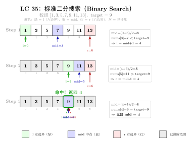
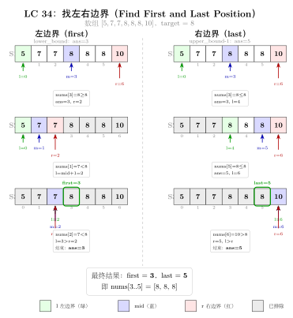

# 04 — Binary Search（融合版）

> **难度**：★★★☆☆
> **题数**：7
> **核心套路**：标准二分、旋转数组二分、边界/区间二分、二分分割
> **本文件**：覆盖 binary_search 7 题的算法套路总结 + 典型题精讲 + 自测

---

## 一例速记

> **标准二分（找位置）**：`l, r = 0, n`，`while l < r`，`mid = l + (r-l)//2`，条件满足时 `r = mid` 否则 `l = mid+1`；返回 `l`（35 插入位置、74 二维矩阵）
> **找峰值/边界（162）**：`while l < r`，比较 `nums[mid]` 与 `nums[mid+1]`，峰在右则 `l = mid+1`，峰在左则 `r = mid`；收敛到 `l` 即峰值下标
> **旋转数组（33 / 153）**：先判断 mid 落在左段还是右段（比较 `nums[mid]` 与 `nums[0]`），再决定往哪侧收缩
> **找第一个 / 最后一个位置（34）**：两次 lower_bound — 第一次不变，第二次对 `target+1` 求 lower_bound 再 `-1`
> **中位数分割（4）**：在较短数组上二分 partition，用"最大左侧 ≤ 最小右侧"的不变式验证分割合法性，$O(\log\min(m,n))$
> **AI 关联**：超参网格搜索 → 单调损失面上的二分；学习率调度（指数/余弦）→ 值域二分寻找最优点

---

## 思维路径还原

> "看到 **35 Search Insert Position**：有序数组中找 target 的插入位置 →
> 就是 lower_bound：找第一个 `≥ target` 的下标，不存在则返回 n。
> `l=0, r=n`（开区间右端 = 数组长度），`while l < r`，`mid = l+(r-l)//2`。
> `nums[mid] >= target` 则目标在左半（含 mid）→ `r = mid`；否则 `l = mid+1`。
> 循环结束 `l == r`，返回 `l`。
>
> 看到 **74 Search a 2D Matrix**：每行升序，每行首元素大于上行尾元素 →
> 矩阵可视为展平的有序数组：把 `mid` 转换为行列 `(mid // cols, mid % cols)` 即可套标准二分。
> 总长 `m × n`，范围 `[0, m*n-1]`；比较 `matrix[mid//n][mid%n]` 与 target。
>
> 看到 **162 Find Peak Element**：`nums[-1] = nums[n] = -∞`，找任意峰值下标 →
> 峰值不唯一；二分关键：`nums[mid] < nums[mid+1]` 说明右边坡度上升，峰在 mid 右侧 → `l = mid+1`；
> 否则峰在 mid 或左侧 → `r = mid`。`while l < r` 收敛后 `l` 即为答案。
>
> 看到 **33 Search in Rotated Sorted Array**：数组旋转后在其中找 target →
> 先判断 mid 落在哪个升序段：`nums[mid] >= nums[0]` 说明 mid 在左段；
> target 在 `[nums[0], nums[mid]]` 范围内则收缩右端，否则收缩左端；
> mid 在右段时对称处理。用 `l <= r`（闭区间）更直观，命中时直接返回 mid。
>
> 看到 **34 Find First and Last Position**：有序数组找 target 第一个/最后一个下标 →
> lower_bound(target) 给第一个 ≥ target 的位置；lower_bound(target+1) - 1 给最后一个 ≤ target 的位置。
> 若 lower_bound(target) 处值不等于 target，则不存在，返回 [-1, -1]。
>
> 看到 **153 Find Minimum in Rotated Sorted Array**：无重复旋转数组找最小值 →
> 最小值就是旋转点左侧的那个元素；`nums[mid] > nums[r]` 说明最小值在右段 → `l = mid+1`；
> 否则最小值在左段（含 mid）→ `r = mid`；`while l < r` 收敛后 `l` 即答案。
>
> 看到 **4 Median of Two Sorted Arrays**：两个有序数组，要求 $O(\log\min(m,n))$ →
> 在较短数组上二分 partition：设左侧共 `(m+n+1)//2` 个元素，枚举 nums1 划分点 `i`，
> 验证 `maxLeft1 <= minRight2` 且 `maxLeft2 <= minRight1`；不满足时调整 i。
> 奇偶通用：总长奇数时中位数 = max(maxLeft1, maxLeft2)，偶数时 = (max + min) / 2。"

---

## 学习目标

- 彻底搞清楚 `l <= r`、`l < r` 两种循环终止条件的适用场景及其对应的返回值
- 掌握 lower_bound / upper_bound 两种边界模板并能用于 34 题
- 能识别旋转数组的"左段/右段"结构并写出正确的分支条件
- 理解"对函数单调性二分"的通用思想（162 峰值、153 最小值）
- 掌握 4 题的分割二分思路，理解 `(m+n+1)//2` 的奇偶统一技巧

---

## 几何示意

### 图 标准二分迭代（LC 35）



### 图 找左右边界（LC 34）



---
## 抽象成方法（标准模板代码）

### 套路 1：lower_bound — 标准左边界二分

适用题：35（插入位置）、74（二维矩阵搜索）、34（第一个位置）

```python
def lower_bound(nums: list[int], target: int) -> int:
    """返回第一个 >= target 的下标；若所有元素 < target 则返回 len(nums)。
    区间语义：[l, r)，循环不变式：答案在 [l, r] 内。
    """
    l, r = 0, len(nums)          # 注意右端是 len(nums)，不是 len(nums)-1
    while l < r:
        mid = l + (r - l) // 2  # 防溢出写法（Python 无溢出但养成习惯）
        if nums[mid] < target:
            l = mid + 1          # mid 不满足，左端右移到 mid+1
        else:
            r = mid              # mid 可能是答案，右端收到 mid
    return l                     # l == r 时退出，l 就是答案


# 35: 搜索插入位置
def searchInsert(nums: list[int], target: int) -> int:
    return lower_bound(nums, target)


# 74: 搜索二维矩阵（每行首元素大于上一行末尾）
def searchMatrix(matrix: list[list[int]], target: int) -> bool:
    m, n = len(matrix), len(matrix[0])
    l, r = 0, m * n
    while l < r:
        mid = l + (r - l) // 2
        row, col = divmod(mid, n)
        if matrix[row][col] < target:
            l = mid + 1
        elif matrix[row][col] > target:
            r = mid
        else:
            return True
    return False
```

> 关键：右端初始化为 `len(nums)` 而非 `len(nums)-1`，使结果自然覆盖"插入到末尾"的情况。

### 套路 2：找第一个 / 最后一个位置（lower_bound + upper_bound）

适用题：34（Find First and Last Position）

```python
def searchRange(nums: list[int], target: int) -> list[int]:
    """时间 O(log n)，两次二分分别找左右边界。"""
    def lower_bound(t: int) -> int:
        """第一个 >= t 的位置。"""
        l, r = 0, len(nums)
        while l < r:
            mid = l + (r - l) // 2
            if nums[mid] < t:
                l = mid + 1
            else:
                r = mid
        return l

    first = lower_bound(target)
    # 若 first 超界或值不匹配，说明 target 不存在
    if first == len(nums) or nums[first] != target:
        return [-1, -1]
    last = lower_bound(target + 1) - 1  # 第一个 > target 的位置减 1
    return [first, last]
```

> `lower_bound(target+1) - 1` 等价于"最后一个 ≤ target 的位置"；比单独写 upper_bound 更简洁。

### 套路 3：找峰值 / 边界（l < r 收敛型）

适用题：162（Find Peak Element）、153（Find Minimum in Rotated Sorted Array）

```python
# 162: 找任意峰值下标
def findPeakElement(nums: list[int]) -> int:
    """时间 O(log n)。nums[-1] = nums[n] = -inf，峰值必然存在。"""
    l, r = 0, len(nums) - 1
    while l < r:
        mid = l + (r - l) // 2
        if nums[mid] < nums[mid + 1]:
            l = mid + 1   # 右坡上升，峰在右侧
        else:
            r = mid       # 峰在 mid 或左侧
    return l              # l == r 时收敛到峰值


# 153: 旋转数组找最小值
def findMin(nums: list[int]) -> int:
    """时间 O(log n)。与右端 nums[r] 比较决定收缩方向。"""
    l, r = 0, len(nums) - 1
    while l < r:
        mid = l + (r - l) // 2
        if nums[mid] > nums[r]:
            l = mid + 1   # mid 在左段，最小值在右段
        else:
            r = mid       # mid 在右段（或未旋转），最小值在 [l, mid]
    return nums[l]
```

> 两题都用 `l < r` 保证收敛时 `l == r`，不需要单独判断返回值。

### 套路 4：旋转数组搜索（l <= r 闭区间型）

适用题：33（Search in Rotated Sorted Array）

```python
def search(nums: list[int], target: int) -> int:
    """时间 O(log n)。先判断 mid 在哪个升序段，再决定收缩方向。"""
    l, r = 0, len(nums) - 1
    while l <= r:
        mid = l + (r - l) // 2
        if nums[mid] == target:
            return mid
        if nums[l] <= nums[mid]:          # mid 在左段（左段有序）
            if nums[l] <= target < nums[mid]:
                r = mid - 1              # target 在左段范围内
            else:
                l = mid + 1
        else:                             # mid 在右段（右段有序）
            if nums[mid] < target <= nums[r]:
                l = mid + 1              # target 在右段范围内
            else:
                r = mid - 1
    return -1
```

> 关键：用 `nums[l] <= nums[mid]` 而非 `nums[mid] > nums[0]`，这样处理 `l == mid` 的情况更安全。

### 套路 5：分割二分（中位数）

适用题：4（Median of Two Sorted Arrays）

```python
def findMedianSortedArrays(nums1: list[int], nums2: list[int]) -> float:
    """时间 O(log min(m,n))。在较短数组上二分 partition。"""
    # 保证 nums1 是较短的数组
    if len(nums1) > len(nums2):
        nums1, nums2 = nums2, nums1
    m, n = len(nums1), len(nums2)
    half = (m + n + 1) // 2    # 左半部分共需的元素数（奇偶通用）

    l, r = 0, m
    while l <= r:
        i = l + (r - l) // 2  # nums1 左侧取 i 个
        j = half - i           # nums2 左侧取 j 个

        maxLeft1  = float('-inf') if i == 0 else nums1[i - 1]
        minRight1 = float('inf')  if i == m else nums1[i]
        maxLeft2  = float('-inf') if j == 0 else nums2[j - 1]
        minRight2 = float('inf')  if j == n else nums2[j]

        if maxLeft1 <= minRight2 and maxLeft2 <= minRight1:
            # 分割合法
            if (m + n) % 2 == 1:
                return float(max(maxLeft1, maxLeft2))
            else:
                return (max(maxLeft1, maxLeft2) + min(minRight1, minRight2)) / 2.0
        elif maxLeft1 > minRight2:
            r = i - 1          # nums1 左侧取多了，收缩
        else:
            l = i + 1          # nums1 左侧取少了，扩大
    raise ValueError("Input arrays are not sorted.")
```

### 速查表

| 题型特征 | 套路 | 终止条件 | 时间 | 空间 |
|---|---|---|---|---|
| 有序数组找插入位置 / 第一个 >= target | lower_bound | `l < r`，返回 `l` | $O(\log n)$ | $O(1)$ |
| 找第一个 / 最后一个位置 | lower_bound × 2 | `l < r` | $O(\log n)$ | $O(1)$ |
| 二维矩阵搜索（行首递增） | 展平为 1D，标准二分 | `l < r` | $O(\log mn)$ | $O(1)$ |
| 找任意峰值 | 比较 mid 与 mid+1 | `l < r`，返回 `l` | $O(\log n)$ | $O(1)$ |
| 旋转数组找最小值 | 与 nums[r] 比较 | `l < r`，返回 `nums[l]` | $O(\log n)$ | $O(1)$ |
| 旋转数组搜索目标值 | 判断左/右段 + 闭区间 | `l <= r`，命中返回 | $O(\log n)$ | $O(1)$ |
| 两有序数组中位数 | 短数组分割二分 | `l <= r` | $O(\log\min(m,n))$ | $O(1)$ |

---

## 方法变形（4 类）

### 变形 1：lower_bound 扩展系列

- **35**（插入位置）：直接返回 `lower_bound(target)`。
- **34**（第一/最后位置）：`lower_bound(target)` + `lower_bound(target+1) - 1`，两次调用复用同一模板。
- **74**（二维矩阵）：下标 `mid` 通过 `divmod(mid, n)` 映射为行列，实质是 1D 标准二分的坐标变换。
- **泛化**：在"单调谓词"（条件从 False 变为 True 且只变一次）上二分答案——适用于"最小化最大值 / 最大化最小值"等优化问题。

### 变形 2：旋转数组系列

- **153**（只找最小值）：不需要知道 target，只需与 `nums[r]` 比较找转折点，用 `l < r` 收敛。
- **33**（找目标值）：需要额外判断 target 在哪个段，用 `l <= r` 闭区间，命中时直接返回。
- **81**（含重复元素，非本 category）：`nums[l] == nums[mid] == nums[r]` 时三端相同无法判断，需 `l++, r--` 线性退化，最坏 $O(n)$。
- 关键区分：153 用右端 `nums[r]` 比较，33 用左端 `nums[l]` 判断左段——两种写法各有优势，保持一致不要混用。

### 变形 3：峰值系列

- **162**（任意峰值）：比较 `nums[mid]` 与 `nums[mid+1]`，单侧比较即可（题目保证边界为 $-\infty$）。
- **852**（山脉数组峰值，非本 category）：同样的 `l < r` 收敛，结构完全一致。
- **对单调函数二分**：若 f(mid) 严格单调（如超参搜索中损失函数），直接套 lower_bound 模板找最优点。
- AI 关联：ternary search（三分搜索）用于找单峰函数极值，是 162 思路在连续域的推广。

### 变形 4：分割 / 分治系列

- **4**（中位数）：分割二分，核心是"左半总数固定"的不变式。
- **对答案二分**（非本 category）：875 Koko Eating Bananas、1011 Capacity To Ship Packages——在"可能的答案值域"上二分，验证函数替代直接搜索。
- **分治归并**：两有序数组合并后取中位数的 $O(m+n)$ 做法是分治基础；4 题要求 $O(\log\min(m,n))$ 才需要分割二分。

---

## 思考路标（条件反射）

1. 看到 **有序数组 + "找位置 / 插入 / 第一个满足条件"** → lower_bound，`l=0, r=n`，`while l < r`，返回 `l`
2. 看到 **"找最后一个位置"** → `lower_bound(target+1) - 1`，复用同一模板
3. 看到 **"二维矩阵 + 每行有序 + 行首递增"** → `divmod(mid, n)` 展平为 1D 二分
4. 看到 **"找任意峰值"** → 比较 `nums[mid]` 与 `nums[mid+1]`，`l < r` 收敛到峰值
5. 看到 **"旋转数组 + 找最小值"** → 与 `nums[r]` 比较，`while l < r`，返回 `nums[l]`
6. 看到 **"旋转数组 + 找目标值"** → 先判断 mid 在哪个升序段，`while l <= r` 闭区间
7. 看到 **"两有序数组 + 中位数 + O(log)"** → 在短数组上分割二分，验证 maxLeft ≤ minRight
8. 看到 **循环写 `l <= r`** → 命中时直接返回，未命中时 `l = mid+1` 或 `r = mid-1`，循环结束表示不存在
9. 看到 **循环写 `l < r`** → 收敛时 `l == r`，该位置即答案；`r = mid`（不减 1），保证不遗漏
10. 看到 **`mid = (l+r)//2`** → 改为 `mid = l + (r-l)//2`（Python 无溢出，但 C++/Java 必须这样写）
11. 看到 **"最小化最大值 / 最大化最小值"** → 对答案值域做二分，写 check 函数判断可行性
12. 看到 **"超参搜索 / 学习率调优"** → 若损失曲线单调，二分搜索最优超参值；若单峰，用三分搜索

---

## 易错点

1. **`l < r` vs `l <= r` 混用**：`l < r` 适合"收敛到唯一点"的场景（结果不需要验证，如找峰值/最小值）；`l <= r` 适合"找目标值、可能不存在"的场景（命中时 `return`，结束时说明不存在）。两种混用会导致死循环或漏判。
2. **`r = mid` vs `r = mid-1`**：使用 `l < r` 时 `r = mid`（不减 1）；使用 `l <= r` 时 `r = mid-1`（减 1）。混淆会导致死循环（当 `l == mid` 时 `r = mid` 不变化，永远循环）。
3. **lower_bound 右端初始化**：应为 `r = len(nums)` 而非 `r = len(nums)-1`；若用后者，"插入末尾"的情况（target 比所有元素大）会返回错误的 `n-1`。
4. **旋转数组的等号处理**：`nums[l] <= nums[mid]` 的等号不能省；若 `l == mid`（即数组只剩两个元素时），没有等号会把 `mid` 归为右段，导致边界判断错误。
5. **34 题不存在的情况**：调用 `lower_bound(target)` 后必须检查 `first == len(nums) or nums[first] != target`；仅靠 `lower_bound` 不能区分"target 不存在"和"target 就在边界"。
6. **4 题分割中 `half = (m+n+1)//2` 的作用**：奇偶通用——奇数总长时左半比右半多 1 个，结果取 maxLeft；偶数时各取一半，结果取 (maxLeft + minRight) / 2。若写成 `(m+n)//2` 奇数情况会少取一个导致错误。
7. **Python 的 `//` 向下取整**：`mid = (l+r)//2` 在 l、r 均为非负数时等价于向下取整，不会在 `l == r-1` 时让 `mid == r`（避免死循环）。但 `(l+r+1)//2` 用于"向上取整 mid"的写法有时用于 `l < r` + `l = mid` 的模板，需明确选哪种。
8. **162 峰值的越界风险**：比较 `nums[mid]` 与 `nums[mid+1]` 时，`l < r` 保证 `mid < r <= len-1`，所以 `mid+1` 不越界；若误用 `l <= r` 则当 `l == r` 时 `mid+1` 可能越界。

---

## 典型应用例题

### 例 1：34. Find First and Last Position of Element in Sorted Array

**题目**：给定升序数组 `nums` 和目标 `target`，找 target 第一次和最后一次出现的下标；若不存在返回 `[-1, -1]`。

**思路**：两次 lower_bound。第一次求 `lower_bound(target)` 得到第一个 `>= target` 的位置，检验值是否等于 target；第二次求 `lower_bound(target+1) - 1` 得到最后一个 `<= target` 的位置。

**解**：

```python
# 参考：solutions/binary_search/p034_find_first_and_last_position_of_element_in_sorted_array.py
def searchRange(nums: list[int], target: int) -> list[int]:
    def lower_bound(t: int) -> int:
        l, r = 0, len(nums)
        while l < r:
            mid = l + (r - l) // 2
            if nums[mid] < t:
                l = mid + 1
            else:
                r = mid
        return l

    first = lower_bound(target)
    if first == len(nums) or nums[first] != target:
        return [-1, -1]
    last = lower_bound(target + 1) - 1
    return [first, last]
```

**分析**：$O(\log n)$ 时间，$O(1)$ 空间。`lower_bound(target+1) - 1` 技巧避免另写 upper_bound 模板，代码精简且不易出错。

---

### 例 2：33. Search in Rotated Sorted Array

**题目**：整数数组在某个轴点旋转，给定 target，返回其下标；若不存在返回 -1。所有元素不重复。

**思路**：旋转后数组分为两个有序段。二分时先用 `nums[l] <= nums[mid]` 判断 mid 落在哪段，再判断 target 是否在该段范围内，据此收缩区间。

**解**：

```python
# 参考：solutions/binary_search/p033_search_in_rotated_sorted_array.py
def search(nums: list[int], target: int) -> int:
    l, r = 0, len(nums) - 1
    while l <= r:
        mid = l + (r - l) // 2
        if nums[mid] == target:
            return mid
        if nums[l] <= nums[mid]:          # 左段有序
            if nums[l] <= target < nums[mid]:
                r = mid - 1
            else:
                l = mid + 1
        else:                             # 右段有序
            if nums[mid] < target <= nums[r]:
                l = mid + 1
            else:
                r = mid - 1
    return -1
```

**分析**：$O(\log n)$。关键是两个嵌套 `if`——外层判断 mid 在哪段，内层判断 target 是否在该有序段的范围内；不满足则 target 必在另一段，向另侧收缩。

---

### 例 3：4. Median of Two Sorted Arrays

**题目**：给定两个升序数组 `nums1`（长 m）和 `nums2`（长 n），找合并后的中位数，时间 $O(\log\min(m,n))$。

**思路**：在较短数组上二分 partition 位置 `i`，nums2 的 partition 自动确定为 `j = half - i`。验证分割合法性：`maxLeft1 <= minRight2` 且 `maxLeft2 <= minRight1`。奇偶统一：左半取 `(m+n+1)//2` 个。

**解**：

```python
# 参考：solutions/binary_search/p004_median_of_two_sorted_arrays.py
def findMedianSortedArrays(nums1: list[int], nums2: list[int]) -> float:
    if len(nums1) > len(nums2):
        nums1, nums2 = nums2, nums1
    m, n = len(nums1), len(nums2)
    half = (m + n + 1) // 2
    l, r = 0, m
    while l <= r:
        i = l + (r - l) // 2
        j = half - i
        maxLeft1  = float('-inf') if i == 0 else nums1[i - 1]
        minRight1 = float('inf')  if i == m else nums1[i]
        maxLeft2  = float('-inf') if j == 0 else nums2[j - 1]
        minRight2 = float('inf')  if j == n else nums2[j]

        if maxLeft1 <= minRight2 and maxLeft2 <= minRight1:
            if (m + n) % 2 == 1:
                return float(max(maxLeft1, maxLeft2))
            return (max(maxLeft1, maxLeft2) + min(minRight1, minRight2)) / 2.0
        elif maxLeft1 > minRight2:
            r = i - 1
        else:
            l = i + 1
    raise ValueError("unreachable")
```

**分析**：$O(\log\min(m,n))$。`float('-inf')` / `float('inf')` 作为哨兵处理边界划分（i=0 或 i=m）时无需特殊分支。合法分割保证了左半最大值 ≤ 右半最小值，即中位数可以直接读出。

---

## 自测题

**自测 1**（35 题 Search Insert Position）—— 有序数组 `[1,3,5,6]`，target=5 返回 2，target=2 返回 1，target=7 返回 4。💡 提示：lower_bound 模板，`l=0, r=len(nums)`，`while l < r`，`nums[mid] < target` 则 `l=mid+1`，否则 `r=mid`，返回 `l`。参考 `solutions/binary_search/p035_search_insert_position.py`。

**自测 2**（74 题 Search a 2D Matrix）—— 矩阵 `[[1,3,5,7],[10,11,16,20],[23,30,34,60]]`，target=3 返回 True，target=13 返回 False。💡 提示：`mid = l+(r-l)//2`，行列 `divmod(mid, n)`，对 `matrix[row][col]` 与 target 做三路比较。参考 `solutions/binary_search/p074_search_a_2d_matrix.py`。

**自测 3**（162 题 Find Peak Element）—— `nums=[1,2,1,3,5,6,4]` 返回 1 或 5（任意峰值下标均可）。💡 提示：`while l < r`，比较 `nums[mid]` 与 `nums[mid+1]`：前者小则峰在右（`l=mid+1`），否则峰在左含 mid（`r=mid`），循环结束返回 `l`。参考 `solutions/binary_search/p162_find_peak_element.py`。

**自测 4**（153 题 Find Minimum in Rotated Sorted Array）—— `nums=[3,4,5,1,2]` 返回 1，`nums=[4,5,6,7,0,1,2]` 返回 0。💡 提示：与 `nums[r]` 比较：`nums[mid] > nums[r]` 则 `l=mid+1`，否则 `r=mid`；收敛后返回 `nums[l]`。参考 `solutions/binary_search/p153_find_minimum_in_rotated_sorted_array.py`。

**自测 5**（34 题 Find First and Last Position）—— `nums=[5,7,7,8,8,10]`，target=8 返回 `[3,4]`，target=6 返回 `[-1,-1]`。💡 提示：两次 lower_bound：`lower_bound(target)` 给首位，`lower_bound(target+1)-1` 给末位；别忘检查首位处的值是否确实等于 target。参考 `solutions/binary_search/p034_find_first_and_last_position_of_element_in_sorted_array.py`。

---

## 题目全览（7 题）

| # | 题目 | 套路分类 | 难度 |
|---|---|---|---|
| 35 | Search Insert Position | lower_bound 标准二分 | Easy |
| 74 | Search a 2D Matrix | 展平 1D + 标准二分 | Medium |
| 162 | Find Peak Element | 单侧比较收敛 | Medium |
| 33 | Search in Rotated Sorted Array | 旋转数组 + 左右段判断 | Medium |
| 153 | Find Minimum in Rotated Sorted Array | 旋转数组 + 右端比较 | Medium |
| 34 | Find First and Last Position | lower_bound × 2 | Medium |
| 4 | Median of Two Sorted Arrays | 分割二分 | Hard |

---

## 融合版说明

| 段 | 来源 | 价值 |
|---|---|---|
| 一例速记 | 本文件 | 7 题 5 类套路一览，含 AI 关联 |
| 思维路径还原 | 本文件 | 6 道题的解题内心独白，含关键决策点 |
| 抽象成方法 | 本文件 | 5 个标准模板代码 + 速查表，可直接运行 |
| 方法变形 | 本文件 | 4 类变体扩展（lower_bound / 旋转 / 峰值 / 分割） |
| 思考路标 | 本文件 | 12 条题型识别条件反射，含边界条件选择 |
| 易错点 | 本文件 | 8 条高频踩坑，覆盖 `l<r` vs `l<=r`、越界等经典 bug |
| 典型应用例题 | solutions/ | 3 道精讲（34、33、4），代码 + 正确性分析 |
| 自测题 | leetcode | 5 题带 💡 提示，链接 solutions 文件 |
| 题目全览 | 本文件 | 7 题完整列表，套路分类一览 |

---

> **跨 category 导航**：
> - 有序数组上的"配对"问题优先考虑双指针 → 见 `02-two-pointers.md`
> - BST 上的搜索利用中序有序性，逻辑类似二分但走树指针 → 见 `05-binary-search-tree.md`
> - "最小化最大值 / 最大化最小值"型 DP → 先写 check 函数再套 lower_bound 对答案二分
