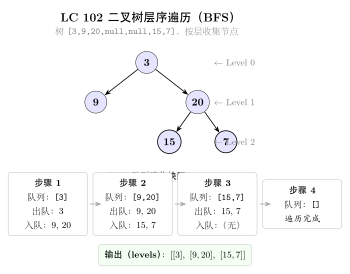
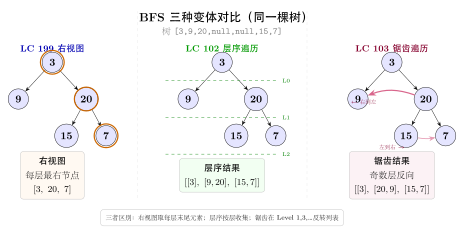

# 06 — Binary Tree BFS（融合版）

> **难度**：★★☆☆☆
> **题数**：4
> **核心套路**：deque 层序遍历、层级标记、之字形反向
> **本文件**：覆盖 binary_tree_bfs 4 题的算法套路总结 + 典型题精讲 + 自测
> **AI 关联**：图神经网络（GNN）消息传递、层级聚合（Layer-wise Aggregation）

---

## 一例速记

> **标准 BFS（102 层序）**：deque + 每层快照，`while deque`，先记 `level_size = len(deque)`，再弹 `level_size` 次，每次把左右孩子入队
> **层级标记（199 右视图）**：BFS 逐层，取**每层最后一个节点**值即为右视图
> **层平均（637）**：BFS 逐层，层内求和 / 层节点数
> **之字形（103 zigzag）**：BFS 逐层，奇数层正向收集、偶数层反向（或 appendleft）

---

## 思维路径还原

> "看到 **二叉树层序输出** → 立刻想到 BFS + deque：
> 根节点入队，每次循环开始先记 `level_size = len(q)`，
> 再循环 `level_size` 次弹节点、记录值、入队左右孩子。
> 这样 deque 里始终存放'当前层未处理节点 + 下一层已入队节点'，
> 每次 snapshot `level_size` 次就切出一层（102）。
>
> 看到 **右视图（199）**：每层只取最后一个节点 —— 直接在层级循环里
> 判断 `i == level_size - 1` 时记录即可；或者在弹节点时直接覆盖 `result`，
> 循环结束时 `result` 就是本层最后一个值。
>
> 看到 **层平均（637）**：每层累计 `total`，弹 `level_size` 次后 `total / level_size`
> 加入结果列表，不需要额外空间。
>
> 看到 **之字形（103）**：奇偶层反向收集。
> 最简洁：用 Python `deque` 的 `appendleft`，偶数层（1-indexed）
> 把新节点从左插入当前层列表；或者层结束后对奇数层 `level.reverse()`。
> 另一种写法：每层用 deque 收集，奇数层从右弹（正序），偶数层从左弹（反序）。"

---

## 学习目标

- 掌握 BFS + deque 的"层级快照"模板，理解 `level_size` 的作用
- 能从层序模板快速衍生出右视图、层平均、之字形等变体
- 理解 BFS 与树深度、层数的关系：第 k 层节点在 BFS 的第 k 轮弹出
- 了解 GNN 层级聚合与树 BFS 的结构对应关系

---

## 几何示意

### 图 层序遍历（LC 102）



### 图 右视图 vs 层序 vs zigzag



---
## 抽象成方法（标准模板代码）

### TreeNode 定义（所有二叉树题共用）

```python
from __future__ import annotations
from collections import deque
from typing import Optional


class TreeNode:
    def __init__(self, val: int = 0,
                 left: Optional[TreeNode] = None,
                 right: Optional[TreeNode] = None):
        self.val = val
        self.left = left
        self.right = right
```

---

### 套路 1：标准 BFS 层序遍历

适用题：102（层序输出每层节点值列表）

```python
def level_order(root: Optional[TreeNode]) -> list[list[int]]:
    """标准 BFS 层序，返回每层节点值的列表。时间 O(n)，空间 O(n)。"""
    if not root:
        return []
    result: list[list[int]] = []
    q: deque[TreeNode] = deque([root])
    while q:
        level_size = len(q)          # 本层节点数——快照关键
        level: list[int] = []
        for _ in range(level_size):
            node = q.popleft()
            level.append(node.val)
            if node.left:
                q.append(node.left)
            if node.right:
                q.append(node.right)
        result.append(level)
    return result
```

> 关键：`level_size = len(q)` 在弹节点之前记录，确保本层只弹 `level_size` 次，
> 下一层节点虽已入队但不在本轮处理范围内。

---

### 套路 2：层级标记——取层首 / 层尾节点

适用题：199（右视图，层尾）；变体：左视图（层首）

```python
def right_side_view(root: Optional[TreeNode]) -> list[int]:
    """每层最后一个节点即右视图。时间 O(n)，空间 O(n)。"""
    if not root:
        return []
    result: list[int] = []
    q: deque[TreeNode] = deque([root])
    while q:
        level_size = len(q)
        for i in range(level_size):
            node = q.popleft()
            if i == level_size - 1:    # 本层最后一个
                result.append(node.val)
            if node.left:
                q.append(node.left)
            if node.right:
                q.append(node.right)
    return result


def average_of_levels(root: Optional[TreeNode]) -> list[float]:
    """每层节点值求平均。时间 O(n)，空间 O(n)。"""
    if not root:
        return []
    result: list[float] = []
    q: deque[TreeNode] = deque([root])
    while q:
        level_size = len(q)
        total = 0.0
        for _ in range(level_size):
            node = q.popleft()
            total += node.val
            if node.left:
                q.append(node.left)
            if node.right:
                q.append(node.right)
        result.append(total / level_size)
    return result
```

---

### 套路 3：之字形（Zigzag）层序

适用题：103（奇数层正向，偶数层反向，1-indexed）

```python
def zigzag_level_order(root: Optional[TreeNode]) -> list[list[int]]:
    """之字形层序：奇数层从左到右，偶数层从右到左。时间 O(n)，空间 O(n)。"""
    if not root:
        return []
    result: list[list[int]] = []
    q: deque[TreeNode] = deque([root])
    left_to_right = True               # 第 1 层（根）正向
    while q:
        level_size = len(q)
        level: list[int] = []
        for _ in range(level_size):
            node = q.popleft()
            level.append(node.val)
            if node.left:
                q.append(node.left)
            if node.right:
                q.append(node.right)
        if not left_to_right:
            level.reverse()            # 偶数层反向
        result.append(level)
        left_to_right = not left_to_right
    return result
```

> 变体：用 `deque` 替代 list 来收集 level，`append` vs `appendleft` 实现同效果，
> 但 `list.reverse()` 更直观，不影响 O(n) 总复杂度。

---

### 速查表

| 题型特征 | 套路 | 时间 | 空间 |
|---|---|---|---|
| 树的层序遍历，每层一个列表 | 标准 BFS + `level_size` 快照 | $O(n)$ | $O(n)$ |
| 右视图 / 左视图（每层首 / 尾节点） | BFS + 层内下标判断 | $O(n)$ | $O(n)$ |
| 每层节点平均值 | BFS + 层内累加 / `level_size` | $O(n)$ | $O(n)$ |
| 之字形层序 | BFS + 奇偶层 reverse | $O(n)$ | $O(n)$ |
| 树的最大宽度（最宽层节点数） | BFS + 记录每层 `level_size` max | $O(n)$ | $O(n)$ |

---

## 方法变形（4 类）

### 变形 1：右视图 / 左视图 / 层末值系列

- **199**（右视图，层尾）：`i == level_size - 1` 时记录，或弹节点时直接 `result[-1] = node.val` 再最终 `result.append`（后者每层只做一次 append）。
- **左视图**（非本 category，但同构）：`i == 0` 时记录，其余不变。
- **最深叶节点**：BFS 遍历完毕时，最后一个弹出的节点即最深（或最深最右）叶节点。

### 变形 2：层统计系列

- **637**（层平均）：层内 `total += node.val`，弹完后 `total / level_size`。
- **层最大值 / 最小值**：替换累加为 `max` / `min` 更新。
- **层节点数最大（最宽层）**：记录每层 `level_size`，取最大值。
- **树的高度（BFS 版）**：BFS 结束时循环了几轮（维护计数器 `depth`），最终 `depth` 即高度。

### 变形 3：之字形扩展

- **103**（之字形，reverse 整层）：最简单，O(n) 额外操作摊销。
- **deque 双端插入**：用 `deque` 存 level，`left_to_right` 为真时 `level.append`，否则 `level.appendleft`；避免 reverse，但代码略复杂。
- **层号直接控制下标**：预分配 `level = [0] * level_size`，奇数层从 0 开始填，偶数层从 `level_size-1` 开始填，每次填一个位置——O(1) 每节点，总 O(n)。

### 变形 4：BFS 遍历图（跨 category）

- 树 BFS 是无环图 BFS 的特例：把 TreeNode 换成图节点，加入 `visited` 集合防止重复访问即可。
- GNN 层级聚合：第 $k$ 层神经元只聚合第 $k-1$ 层邻居的信息，与树 BFS 每层只处理本层节点的思路完全对应。

---

## 思考路标（条件反射）

1. 看到 **"层序 / level order / 每层一个列表"** → BFS + deque，`level_size = len(q)` 快照
2. 看到 **"右视图 / right side view"** → BFS + 每层取最后一个节点（`i == level_size - 1`）
3. 看到 **"层平均 / average of levels"** → BFS + 层内求和再除以 `level_size`
4. 看到 **"之字形 / zigzag"** → BFS + `left_to_right` 标志位 + 偶数层 reverse
5. 看到 **BFS 模板中忘写 `level_size`** → 直接弹完整个 deque，层级边界全部丢失
6. 看到 **"树的高度（BFS 做法）"** → BFS 轮数即高度，`depth` 在每次 while 循环时 +1
7. 看到 **"树的最宽层 / 最大宽度"** → BFS 记录每轮 `level_size`，取 `max`
8. 看到 **"最深叶节点 / 最右节点"** → BFS 遍历到底，最后弹出的即目标
9. 看到 **"逐层处理 + 要知道当前是第几层"** → 维护 `depth` 计数器，与 `level_size` 配合
10. 看到 **BFS + 树** → 根节点入队时就 append，不要先检查 `root.left != None` 才入队（空节点检查在入队时做）
11. 看到 **图 BFS（非树）** → 加 `visited` 集合；树 BFS 因为无环可省略

---

## 易错点

1. **忘记 `level_size` 快照**：若在弹节点的同时入队子节点，直接用 `while q: for _ in range(len(q))` 会在每次 for 循环的 `range` 重新计算 `len(q)`（Python 的 `range` 在创建时求值，此写法实际上是安全的，但初学者常在其他语言中错误地直接循环 `q.size()`，导致将下一层也弹入本层）。**最安全的写法**：在 while 开头立即 `level_size = len(q)` 赋值。
2. **`popleft` 与 `pop` 混淆**：BFS 要用 `deque.popleft()`（队首出队）；误用 `pop()`（栈顶出队）会变成 DFS 先序遍历。
3. **zigzag 的奇偶层定义**：LeetCode 103 要求根节点层（第 1 层）从左到右，第 2 层从右到左。若 `left_to_right` 初始为 `True`，第 1 层不 reverse，第 2 层 reverse —— 确认初始值与 LeetCode 约定一致。
4. **空树处理**：`if not root: return []` 必须在第一行；否则 `deque([root])` 会入队 `None`，后续 `node.left` 会抛 `AttributeError`。
5. **637 整数除法**：Python 3 中 `/` 自动返回 `float`，无需 `float(total) / level_size`；但如果用 `//` 则变成整数除法，结果截断，切勿混用。

---

## 典型应用例题

### 例 1：102. Binary Tree Level Order Traversal

**题目**：给定二叉树根节点 `root`，返回其节点值的层序遍历（每层为一个子列表）。

**思路**：标准 BFS。根节点入队，每轮开始时记录 `level_size = len(q)`，弹 `level_size` 次形成本层快照，左右孩子入队。

**解**：

```python
# 参考：solutions/binary_tree_bfs/p102_binary_tree_level_order_traversal.py
from collections import deque

def levelOrder(root: Optional[TreeNode]) -> list[list[int]]:
    if not root:
        return []
    result: list[list[int]] = []
    q: deque[TreeNode] = deque([root])
    while q:
        level_size = len(q)
        level: list[int] = []
        for _ in range(level_size):
            node = q.popleft()
            level.append(node.val)
            if node.left:
                q.append(node.left)
            if node.right:
                q.append(node.right)
        result.append(level)
    return result
```

**分析**：$O(n)$ 时间（每个节点入队一次、出队一次），$O(n)$ 空间（最宽层至多 $n/2$ 个节点）。`level_size` 快照是核心——它在本层弹节点之前固定，确保本轮循环只处理当前层。

---

### 例 2：199. Binary Tree Right Side View

**题目**：给定二叉树根节点，从右侧看这棵树，返回从上到下每层能看到的节点值（即每层最右侧节点）。

**思路**：BFS 逐层，每层只记录最后一个弹出的节点值。用 `i == level_size - 1` 判断即可，无需额外数据结构。

**解**：

```python
# 参考：solutions/binary_tree_bfs/p199_binary_tree_right_side_view.py
from collections import deque

def rightSideView(root: Optional[TreeNode]) -> list[int]:
    if not root:
        return []
    result: list[int] = []
    q: deque[TreeNode] = deque([root])
    while q:
        level_size = len(q)
        for i in range(level_size):
            node = q.popleft()
            if i == level_size - 1:
                result.append(node.val)
            if node.left:
                q.append(node.left)
            if node.right:
                q.append(node.right)
    return result
```

**分析**：$O(n)$ 时间，$O(n)$ 空间。"右视图"的本质是每层最后弹出的节点——BFS 从左到右入队，故层内最后弹出的就是最右节点。若想得到左视图，把 `i == level_size - 1` 改为 `i == 0` 即可。

---

### 例 3：103. Binary Tree Zigzag Level Order Traversal

**题目**：给定二叉树，返回节点值的之字形层序遍历：第 1 层（根）从左到右，第 2 层从右到左，交替进行。

**思路**：BFS 逐层收集，用 `left_to_right` 布尔标志控制当前层是否需要 `reverse`。每层结束后翻转标志。

**解**：

```python
# 参考：solutions/binary_tree_bfs/p103_binary_tree_zigzag_level_order_traversal.py
from collections import deque

def zigzagLevelOrder(root: Optional[TreeNode]) -> list[list[int]]:
    if not root:
        return []
    result: list[list[int]] = []
    q: deque[TreeNode] = deque([root])
    left_to_right = True
    while q:
        level_size = len(q)
        level: list[int] = []
        for _ in range(level_size):
            node = q.popleft()
            level.append(node.val)
            if node.left:
                q.append(node.left)
            if node.right:
                q.append(node.right)
        if not left_to_right:
            level.reverse()
        result.append(level)
        left_to_right = not left_to_right
    return result
```

**分析**：$O(n)$ 时间（每节点处理一次，`level.reverse()` 对每层摊销 $O(\text{level\_size})$，总和仍 $O(n)$），$O(n)$ 空间。标志位 `left_to_right` 从 `True` 出发，根节点层正向排列符合题意。

---

## 自测题

**自测 1**（102 题 Binary Tree Level Order Traversal）—— 树 `[3,9,20,null,null,15,7]`，输出 `[[3],[9,20],[15,7]]`。💡 提示：while 循环开头立即 `level_size = len(q)`，for 循环 `level_size` 次弹节点，完成后 append 整层列表。参考 `solutions/binary_tree_bfs/p102_binary_tree_level_order_traversal.py`。

**自测 2**（199 题 Binary Tree Right Side View）—— 树 `[1,2,3,null,5,null,4]`，输出 `[1,3,4]`。💡 提示：BFS 逐层，仅在 `i == level_size - 1` 时记录节点值，其余层内节点正常入队子节点即可。参考 `solutions/binary_tree_bfs/p199_binary_tree_right_side_view.py`。

**自测 3**（637 题 Average of Levels in Binary Tree）—— 树 `[3,9,20,15,7]`，输出 `[3.0, 14.5, 11.0]`。💡 提示：每层累加 `total`，弹完 `level_size` 个节点后除以 `level_size`，用 `/` 而非 `//` 保证返回 float。参考 `solutions/binary_tree_bfs/p637_average_of_levels_in_binary_tree.py`。

**自测 4**（103 题 Zigzag Level Order）—— 树 `[3,9,20,null,null,15,7]`，输出 `[[3],[20,9],[15,7]]`。💡 提示：`left_to_right` 初始为 True（根层正向），收集完一层后若 `not left_to_right` 则 `level.reverse()`，最后翻转 `left_to_right`。参考 `solutions/binary_tree_bfs/p103_binary_tree_zigzag_level_order_traversal.py`。

**自测 5**（综合变体）—— 给定二叉树，求每层节点值的最大值（层最大），输出一个列表。💡 提示：把 637 题的 `total += node.val` 改为 `layer_max = max(layer_max, node.val)`，初始值设为 `float('-inf')`；最终 append `layer_max` 而非平均值。不需要单独的 solutions 文件，举一反三练习。

---

## 题目全览（4 题）

| # | 题目 | 套路分类 | 难度 |
|---|---|---|---|
| 102 | Binary Tree Level Order Traversal | 标准 BFS + `level_size` 快照 | Medium |
| 199 | Binary Tree Right Side View | BFS + 层尾节点标记 | Medium |
| 637 | Average of Levels in Binary Tree | BFS + 层内求和 | Easy |
| 103 | Binary Tree Zigzag Level Order Traversal | BFS + 奇偶层 reverse | Medium |

---

## 融合版说明

| 段 | 来源 | 价值 |
|---|---|---|
| 一例速记 | 本文件 | 4 题 3 类套路一览 + AI 关联，扫一眼知道要用什么 |
| 思维路径还原 | 本文件 | 从题目到代码的解题内心独白，模拟实战 |
| 抽象成方法 | 本文件 | 3 个标准模板代码 + 速查表，可直接运行 |
| 方法变形 | 本文件 | 4 类变体扩展，覆盖层统计、视图、zigzag、图 BFS |
| 思考路标 | 本文件 | 11 条题型识别条件反射，含跨 category 跳转 |
| 易错点 | 本文件 | 5 条高频踩坑，覆盖 `level_size`、popleft、奇偶层等 |
| 典型应用例题 | solutions/ | 3 道精讲（102、199、103），代码 + 正确性分析 |
| 自测题 | leetcode | 5 题带 💡 提示，链接 solutions 文件 |
| 题目全览 | 本文件 | 4 题完整列表，套路分类一览 |

---

> **跨 category 导航**：
> - 树的深度 / 路径问题 → 见 `07-binary-tree-dfs.md`（DFS 递归更自然）
> - 图的 BFS 最短路 → 见 `graph_bfs` category（加 `visited` 集合）
> - BST 的中序遍历 → 见 `05-binary-search-tree.md`
