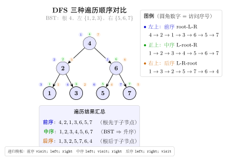
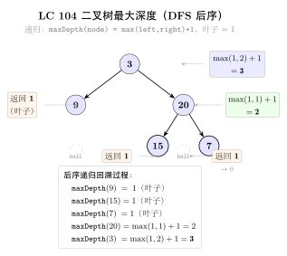
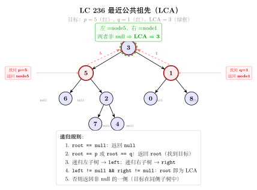

# 07 — Binary Tree DFS（融合版）

> **难度**：★★★☆☆
> **题数**：14
> **核心套路**：自顶向下递归、后序整合、前/中/后序遍历、构造树、路径和、翻转/连接
> **本文件**：覆盖 binary_tree_dfs 14 题的算法套路总结 + 典型题精讲 + 自测

---

## 一例速记

> **自顶向下（104 深度 / 100 same / 101 对称）**：递归信息向下传，返回值向上汇总；框架：`if not node: return base`，`left = dfs(node.left, ...)`，`right = dfs(node.right, ...)`，合并
> **后序整合（124 max path / 222 count / 236 LCA）**：先处理子树再使用结果；后序 = 左-右-根；全局变量 `self.res` 存跨根节点的答案
> **前中后序遍历（173 BST 迭代器 / 114 flatten）**：迭代版用栈模拟；中序用于 BST 有序性；前序用于序列化 / 展开链表
> **构造树（105 前+中 / 106 中+后）**：前序第一个 = 根；中序中根的位置切分左右子树；哈希表存中序下标，O(1) 查切分点
> **路径和（112 / 129 / 124）**：DFS 参数携带"当前路径积累值"，叶节点处判断/更新答案
> **翻转/连接（226 invert / 117 next right II）**：后序翻转 or 层级迭代连接；117 用 BFS 更直观

---

## 思维路径还原

> "看到 **104 最大深度**：`maxDepth(root)` = `1 + max(maxDepth(left), maxDepth(right))`，空节点返回 0。
> 自顶向下框架：递归参数是当前节点，返回值是子问题答案（这里是深度），
> 递归返回到父节点后取 max+1，自然汇总。
>
> 看到 **100 Same Tree**：逐节点比较 `p.val == q.val` 且两棵子树也相同；
> 空节点需先判断：两个都空则 True，一个空一个非空则 False。
>
> 看到 **101 Symmetric Tree**：转化为 `isMirror(root.left, root.right)`；
> mirror 条件：两节点值相等，且左的左与右的右 mirror，左的右与右的左 mirror。
>
> 看到 **226 Invert Binary Tree**：后序翻转 —— 先翻左子树、翻右子树，再交换 `root.left, root.right`；
> 或前序：先交换，再递归翻两侧（两种顺序均正确，后序更自然）。
>
> 看到 **124 Binary Tree Maximum Path Sum**：路径可以不经过根，所以用全局变量 `self.res` 存最大值；
> `dfs(node)` 返回"过 node 且向下延伸的最大单侧贡献"= `node.val + max(0, dfs(left), dfs(right))`；
> 在 dfs 内部更新 `self.res = max(self.res, node.val + max(0, left_gain) + max(0, right_gain))`。
>
> 看到 **236 LCA**：若 `root` 是 p 或 q 直接返回 root；
> 否则分别在左右子树找，两侧均非空则 root 是 LCA，一侧为空则返回非空那侧。
>
> 看到 **105 从前序+中序构造**：`preorder[0]` 是根；在中序中找根的下标 `idx`；
> 左子树大小 `left_size = idx - inorder_start`；
> 递归用 `preorder[1 : 1+left_size]` 和 `inorder[:idx]` 建左子树，其余建右子树。
> 用哈希表 `{val: idx}` 避免每次线性搜索，让总复杂度降至 O(n)。
>
> 看到 **173 BST Iterator**：中序遍历的迭代版 —— 初始化时把根一路向左压栈；
> `next()` 弹栈顶（最小值），然后把其右子节点一路向左压栈；
> `hasNext()` 检查栈是否非空。
>
> 看到 **114 Flatten Binary Tree to Linked List**：Morris 遍历 / 后序 / 前序迭代均可；
> 最简洁：找右子树的前驱（左子树的最右节点），把右子树接在前驱后面，再把左子树移到右边，循环。
>
> 看到 **117 Populating Next Right Pointers II**：BFS 层序连接，或迭代用当前层的 `next` 指针遍历、
> 建立下一层的链表；后者 O(1) 额外空间。"

---

## 学习目标

- 掌握自顶向下 DFS 的递归框架（参数下传，返回值上汇）
- 理解后序整合模式：先拿子树结果，再在当前节点合并，适合路径和、LCA、计数
- 熟悉前/中/后序的迭代实现，尤其是 BST 迭代器（173）
- 掌握从两个遍历序列重建二叉树的切分思路（105、106）
- 识别"路径和"三题（112 / 129 / 124）的差异：是否需要到叶、路径是否穿根、全局 vs 参数
- 能用 Morris 遍历 O(1) 空间做中序，了解 114 的多种实现

---

## 几何示意

### 图 三种 DFS 遍历对比



### 图 最大深度（LC 104）



### 图 LCA 最近公共祖先（LC 236）



---
## 抽象成方法（标准模板代码）

### TreeNode 定义（所有二叉树题共用）

```python
from __future__ import annotations
from typing import Optional


class TreeNode:
    def __init__(self, val: int = 0,
                 left: Optional[TreeNode] = None,
                 right: Optional[TreeNode] = None):
        self.val = val
        self.left = left
        self.right = right
```

---

### 套路 1：自顶向下递归

适用题：104（最大深度）、100（same tree）、101（symmetric）、226（invert）

```python
# 104: 最大深度
def maxDepth(root: Optional[TreeNode]) -> int:
    """时间 O(n)，空间 O(h)（h 为树高，最坏 O(n)）。"""
    if root is None:
        return 0
    return 1 + max(maxDepth(root.left), maxDepth(root.right))


# 100: 两棵树是否相同
def isSameTree(p: Optional[TreeNode], q: Optional[TreeNode]) -> bool:
    if p is None and q is None:
        return True
    if p is None or q is None:
        return False
    return p.val == q.val and isSameTree(p.left, q.left) and isSameTree(p.right, q.right)


# 101: 是否镜像对称（转化为双指针同步 DFS）
def isSymmetric(root: Optional[TreeNode]) -> bool:
    def mirror(left: Optional[TreeNode], right: Optional[TreeNode]) -> bool:
        if left is None and right is None:
            return True
        if left is None or right is None:
            return False
        return (left.val == right.val
                and mirror(left.left, right.right)
                and mirror(left.right, right.left))
    return root is None or mirror(root.left, root.right)


# 226: 翻转二叉树（后序）
def invertTree(root: Optional[TreeNode]) -> Optional[TreeNode]:
    if root is None:
        return None
    root.left = invertTree(root.left)
    root.right = invertTree(root.right)
    root.left, root.right = root.right, root.left
    return root
```

---

### 套路 2：后序整合（全局变量 + 单侧贡献）

适用题：124（max path sum）、222（count complete nodes）、236（LCA）

```python
# 124: 二叉树最大路径和（路径可不经过根）
class MaxPathSum:
    def maxPathSum(self, root: Optional[TreeNode]) -> int:
        self.res = float('-inf')

        def dfs(node: Optional[TreeNode]) -> int:
            """返回过 node 向下延伸的最大单侧贡献（负则舍弃用 0）。"""
            if node is None:
                return 0
            left_gain = max(0, dfs(node.left))
            right_gain = max(0, dfs(node.right))
            # 更新全局最大（路径穿过当前节点）
            self.res = max(self.res, node.val + left_gain + right_gain)
            # 向上只能选一侧
            return node.val + max(left_gain, right_gain)

        dfs(root)
        return self.res


# 236: 最近公共祖先
def lowestCommonAncestor(root: TreeNode,
                          p: TreeNode, q: TreeNode) -> TreeNode:
    """时间 O(n)，空间 O(h)。"""
    if root is None or root is p or root is q:
        return root
    left = lowestCommonAncestor(root.left, p, q)
    right = lowestCommonAncestor(root.right, p, q)
    if left and right:       # p、q 分属两侧，root 是 LCA
        return root
    return left if left else right


# 222: 完全二叉树节点数（利用完全二叉树性质，O(log^2 n)）
def countNodes(root: Optional[TreeNode]) -> int:
    if root is None:
        return 0
    left_h, right_h = 0, 0
    l, r = root, root
    while l:
        left_h += 1
        l = l.left
    while r:
        right_h += 1
        r = r.right
    if left_h == right_h:           # 满二叉树
        return (1 << left_h) - 1   # 2^h - 1
    return 1 + countNodes(root.left) + countNodes(root.right)
```

---

### 套路 3：路径和系列（参数携带当前积累值）

适用题：112（路径和到叶）、129（根到叶数字和）

```python
# 112: 是否存在根到叶路径和等于 targetSum
def hasPathSum(root: Optional[TreeNode], targetSum: int) -> bool:
    if root is None:
        return False
    if root.left is None and root.right is None:   # 叶节点
        return root.val == targetSum
    remain = targetSum - root.val
    return hasPathSum(root.left, remain) or hasPathSum(root.right, remain)


# 129: 根到叶路径表示的数字之和（如路径 1→2→3 表示数字 123）
def sumNumbers(root: Optional[TreeNode]) -> int:
    def dfs(node: Optional[TreeNode], cur: int) -> int:
        if node is None:
            return 0
        cur = cur * 10 + node.val
        if node.left is None and node.right is None:   # 叶节点
            return cur
        return dfs(node.left, cur) + dfs(node.right, cur)

    return dfs(root, 0)
```

---

### 套路 4：前/中/后序遍历（迭代版）

适用题：173（BST 迭代器，迭代中序）、114（flatten，前序链表展开）

```python
# 迭代中序遍历（BST 迭代器核心）
def inorder_iterative(root: Optional[TreeNode]) -> list[int]:
    result: list[int] = []
    stack: list[TreeNode] = []
    curr = root
    while curr or stack:
        while curr:               # 一路向左压栈
            stack.append(curr)
            curr = curr.left
        curr = stack.pop()        # 弹出最左节点（最小值）
        result.append(curr.val)
        curr = curr.right         # 转向右子树
    return result


# 173: BST 迭代器（懒加载中序）
class BSTIterator:
    def __init__(self, root: Optional[TreeNode]):
        self.stack: list[TreeNode] = []
        self._push_left(root)

    def _push_left(self, node: Optional[TreeNode]) -> None:
        while node:
            self.stack.append(node)
            node = node.left

    def next(self) -> int:
        node = self.stack.pop()
        self._push_left(node.right)   # 右子树的最左路径入栈
        return node.val

    def hasNext(self) -> bool:
        return bool(self.stack)


# 114: 展开为链表（原地，前序）
def flatten(root: Optional[TreeNode]) -> None:
    """将二叉树原地展开为前序遍历的"链表"（right 指针串联，left 全为 None）。"""
    curr = root
    while curr:
        if curr.left:
            # 找左子树最右节点（右子树的前驱）
            prev = curr.left
            while prev.right:
                prev = prev.right
            prev.right = curr.right   # 右子树接在前驱后
            curr.right = curr.left    # 左子树移到右边
            curr.left = None
        curr = curr.right
```

---

### 套路 5：从遍历序列构造树

适用题：105（前序 + 中序）、106（中序 + 后序）

```python
# 105: 前序 + 中序 → 二叉树
def buildTree_pre_in(preorder: list[int], inorder: list[int]) -> Optional[TreeNode]:
    idx_map = {val: i for i, val in enumerate(inorder)}  # 中序下标哈希

    def build(pre_l: int, pre_r: int, in_l: int, in_r: int) -> Optional[TreeNode]:
        if pre_l > pre_r:
            return None
        root_val = preorder[pre_l]
        root = TreeNode(root_val)
        mid = idx_map[root_val]          # 根在中序中的位置
        left_size = mid - in_l           # 左子树节点数
        root.left = build(pre_l + 1, pre_l + left_size, in_l, mid - 1)
        root.right = build(pre_l + left_size + 1, pre_r, mid + 1, in_r)
        return root

    n = len(preorder)
    return build(0, n - 1, 0, n - 1)


# 106: 中序 + 后序 → 二叉树
def buildTree_in_post(inorder: list[int], postorder: list[int]) -> Optional[TreeNode]:
    idx_map = {val: i for i, val in enumerate(inorder)}

    def build(post_l: int, post_r: int, in_l: int, in_r: int) -> Optional[TreeNode]:
        if post_l > post_r:
            return None
        root_val = postorder[post_r]      # 后序最后一个是根
        root = TreeNode(root_val)
        mid = idx_map[root_val]
        left_size = mid - in_l
        root.left = build(post_l, post_l + left_size - 1, in_l, mid - 1)
        root.right = build(post_l + left_size, post_r - 1, mid + 1, in_r)
        return root

    n = len(inorder)
    return build(0, n - 1, 0, n - 1)
```

---

### 套路 6：层级连接（next right pointer）

适用题：117（Populating Next Right Pointers II，任意二叉树）

```python
# 117: 填充每个节点的下一个右侧节点指针（非完美二叉树）
# Node 类含 val, left, right, next 字段
def connect(root) -> None:
    """O(1) 额外空间迭代法：利用已建立的 next 链遍历每层。"""
    curr = root                  # 当前层的某个节点（从左到右遍历）
    while curr:
        dummy = object.__new__(object.__class__ if hasattr(object, '__class__') else type(curr))
        # 用哑节点简化下一层链表构建
        prev = type('_', (), {'next': None})()   # dummy 哑节点
        head = prev
        node = curr
        while node:
            if node.left:
                prev.next = node.left
                prev = prev.next
            if node.right:
                prev.next = node.right
                prev = prev.next
            node = node.next     # 通过当前层 next 链移动
        curr = head.next         # 下一层从哑节点的 next 开始
```

> 注意：上方为示意，实际实现需要 `Node` 类定义。简洁版见下方精讲代码。

---

### 速查表

| 题型特征 | 套路 | 时间 | 空间 |
|---|---|---|---|
| 树的深度 / 节点比较 / 对称判断 | 自顶向下递归，返回 bool/int | $O(n)$ | $O(h)$ |
| 最大路径和（路径可不过根） | 后序 + 全局变量 `self.res` | $O(n)$ | $O(h)$ |
| 最近公共祖先 | 后序 + 两侧返回值合并 | $O(n)$ | $O(h)$ |
| 完全二叉树节点数 | 左右高度比较 + 二分 | $O(\log^2 n)$ | $O(\log n)$ |
| 根到叶路径和 / 数字 | 参数携带当前积累值，叶节点判断 | $O(n)$ | $O(h)$ |
| 前序 + 中序构造树 | 哈希表切分 + 区间递归 | $O(n)$ | $O(n)$ |
| 中序 + 后序构造树 | 后序末尾取根 + 哈希表切分 | $O(n)$ | $O(n)$ |
| BST 迭代器（中序懒加载） | 栈 + 一路向左压栈 | $O(1)$ 均摊 | $O(h)$ |
| 展开为链表（flatten） | 迭代找前驱 + 原地改指针 | $O(n)$ | $O(1)$ |
| 翻转二叉树 | 后序递归，翻转子树后交换 | $O(n)$ | $O(h)$ |
| 填充 next 右侧指针 | 利用 next 链迭代建下一层 | $O(n)$ | $O(1)$ |

---

## 方法变形（4 类）

### 变形 1：自顶向下递归系列

- **104**（最大深度）→ **111**（最小深度，非本 category）：最小深度需注意单侧子树为空时不能直接取 min，否则会把空子树的深度 0 算进去；需判断左右孩子的空否。
- **100**（两棵树相同）→ **101**（对称）：same tree 比较 `p.left, q.left` 和 `p.right, q.right`；symmetric 比较 `left.left, right.right` 和 `left.right, right.left`——镜像对称将同侧改为交叉侧。
- **112**（路径和，到叶）→ **113**（路径和，所有路径，非本 category）→ **129**（路径数字和）：三题均用参数下传积累值，区别在于叶节点的判断逻辑（是否收集整条路径）。
- **226**（翻转）：后序翻转与前序翻转效果相同，后序更符合"先处理子树"的思维定式。

### 变形 2：后序整合系列

- **124**（max path sum）：`dfs` 返回"单侧最大贡献"，全局变量记录"穿根路径最大值"。负贡献 `max(0, dfs(...))` 截断，相当于"不走这侧"。
- **236**（LCA）：后序遍历中，若两侧返回值均非空则当前节点是 LCA；若只有一侧非空则答案在那侧。这个模式也可用于"计算子树中满足条件的节点数"。
- **222**（count complete nodes）：普通二叉树 O(n) 遍历；完全二叉树利用左高 == 右高判断是否满二叉树，将 O(n) 优化到 O(log²n)。

### 变形 3：遍历顺序的选择

- **前序**（根-左-右）：适合序列化、路径记录、114 展开链表（按前序顺序链接）。
- **中序**（左-根-右）：BST 专属，产生升序序列（173 迭代器就是懒加载中序）。
- **后序**（左-右-根）：适合"先拿子树结果、再在当前节点合并"的场景（124、236）；也用于 114 展开（Morris）。
- **迭代 vs 递归**：递归简洁但栈深度受树高限制；迭代用显式栈，适合超深树或需要中途暂停（173 迭代器）。

### 变形 4：构造树系列

- **105**（前序 + 中序）→ **106**（中序 + 后序）：结构对称——前序取首元素为根，后序取尾元素为根；切分点均在中序中查找。两题核心代码几乎相同，仅"取根"和"递归区间"的偏移方向不同。
- **哈希表加速**：不用哈希表时，`inorder.index(root_val)` 是 O(n)，总复杂度 O(n²)；用哈希表预处理变为 O(1) 查找，总 O(n)。

---

## 思考路标（条件反射）

1. 看到 **"树的深度 / 最大 / 最小深度"** → 自顶向下，`1 + max/min(dfs(left), dfs(right))`，空节点返回 0
2. 看到 **"两棵树是否相同"** → 同步 DFS 双指针，先判空，再比 val，再递归左右
3. 看到 **"树是否对称"** → 转化为 `mirror(root.left, root.right)`，交叉比较（左左 vs 右右，左右 vs 右左）
4. 看到 **"翻转二叉树"** → 后序：先翻左右子树，再 `root.left, root.right = root.right, root.left`
5. 看到 **"路径和 + 必须到叶节点"** → 递归传入剩余 `targetSum`，叶节点处判断是否等于 `node.val`
6. 看到 **"根到叶路径表示的数字"（129）** → 递归传入当前数字 `cur = cur * 10 + node.val`，叶节点返回 `cur`
7. 看到 **"最大路径和（路径可任意）"** → 后序 + 全局变量；`dfs` 返回单侧贡献，负贡献截 0；全局记录穿根路径最大值
8. 看到 **"最近公共祖先"** → 后序；若节点是 p 或 q 则返回自身；两侧均非空则当前节点是 LCA
9. 看到 **"前序 + 中序构造树"** → 前序首元素是根；中序中根的位置切分左右；哈希表加速查找
10. 看到 **"中序 + 后序构造树"** → 后序末尾是根；其余与 105 对称
11. 看到 **"BST 中序迭代器"** → 栈 + 初始化一路向左压栈；`next()` 弹栈顶后把右子树一路向左压栈
12. 看到 **"展开为链表（前序）"** → 迭代找左子树最右节点（前驱），把右子树接到前驱后，左子树移右
13. 看到 **"填充 next 指针"** → BFS 层序（加 `visited` 空间）或利用已建 `next` 链 O(1) 空间迭代
14. 看到 **"完全二叉树节点数"** → 比较左高与右高：相等则左子树满（$2^{left\_h} - 1$）+ 递归右；否则右子树满 + 递归左

---

## 易错点

1. **空节点的判断顺序**：在 `isSameTree`、`isSymmetric` 等中，必须先判断两节点都空（True）、一空一非空（False），再访问 `p.val`；若顺序颠倒会对 `None.val` 抛 `AttributeError`。
2. **124 全局变量初始化**：`self.res = float('-inf')` 而非 0——当所有节点均为负数时，最大路径和是某个负数，初始为 0 会导致返回 0（错误）。
3. **LCA 的 `is` vs `==`**：236 要判断节点对象是否为 p 或 q，用 `root is p or root is q`（身份判断），而非 `root.val == p.val`（值判断，若有重复值会出错）。
4. **构造树的区间偏移**：105 题中 `left_size = mid - in_l`（不是 `mid`），递归右子树的前序区间起点是 `pre_l + left_size + 1`（不是 `pre_l + mid + 1`）——偏移量基于左子树大小，与绝对中序下标无关。
5. **114 flatten 的左子树转移**：必须先把右子树接到左子树最右节点后，再把 `curr.right = curr.left`，最后 `curr.left = None`；若先 `curr.left = None` 再找前驱，左子树已丢失。
6. **173 BST 迭代器的 `next()` 与 `hasNext()`**：`next()` 在弹出节点后必须把该节点**右子树**的最左路径压栈，否则右子树的节点永远不会被访问。
7. **222 完全二叉树的高度计算**：左高向左走（`l = l.left`），右高向右走（`r = r.right`）；判断是否满二叉树时两高相等才能用 $2^h - 1$，不要混淆走左还是走右。
8. **112 vs 129 叶节点判断**：两题都要检测叶节点（`left is None and right is None`）；若漏掉这个判断，中间节点的剩余值恰好为 0 时会提前返回 True（112）或错误累加（129）。

---

## 典型应用例题

### 例 1：104. Maximum Depth of Binary Tree

**题目**：给定二叉树，返回其最大深度（从根到最远叶节点的路径上的节点数）。

**思路**：自顶向下递归。`maxDepth(root)` = `1 + max(maxDepth(left), maxDepth(right))`，空节点返回 0。代码一行，直接映射定义。

**解**：

```python
# 参考：solutions/binary_tree_dfs/p104_maximum_depth_of_binary_tree.py
def maxDepth(root: Optional[TreeNode]) -> int:
    if root is None:
        return 0
    return 1 + max(maxDepth(root.left), maxDepth(root.right))
```

**分析**：$O(n)$ 时间（每个节点访问一次），$O(h)$ 空间（递归栈深度 = 树高，最坏退化为链表时 $O(n)$）。这是最简洁的自顶向下模板——没有额外变量，递归框架与问题定义直接对应。

**BFS 迭代版（备用）**：BFS 统计轮数即深度，若想规避递归栈溢出可改写为 BFS，但递归版更简洁。

---

### 例 2：124. Binary Tree Maximum Path Sum

**题目**：二叉树中每个节点都有一个整数值（可为负）。路径是从某节点出发经过若干边到达另一节点的序列，每个节点至多出现一次。返回所有路径中节点值之和的最大值。

**思路**：后序 DFS + 全局变量。关键观察：路径可以不经过根节点，因此需要在 DFS 中途更新全局最大值。

定义 `dfs(node)` = "从 node 出发、仅向下延伸的单侧最大贡献"。由于负贡献不如不选，取 `max(0, dfs(child))`。在每个节点处，穿过该节点的路径最大值 = `node.val + max(0, dfs(left)) + max(0, dfs(right))`，用它更新全局 `self.res`。但向父节点返回时只能选一侧，因此返回 `node.val + max(left_gain, right_gain)`。

**解**：

```python
# 参考：solutions/binary_tree_dfs/p124_binary_tree_maximum_path_sum.py
class Solution:
    def maxPathSum(self, root: Optional[TreeNode]) -> int:
        self.res = float('-inf')

        def dfs(node: Optional[TreeNode]) -> int:
            if node is None:
                return 0
            left_gain = max(0, dfs(node.left))
            right_gain = max(0, dfs(node.right))
            # 穿过 node 的路径（可能是最终答案）
            self.res = max(self.res, node.val + left_gain + right_gain)
            # 向上只能贡献一侧
            return node.val + max(left_gain, right_gain)

        dfs(root)
        return self.res
```

**分析**：$O(n)$ 时间，$O(h)$ 空间。两个关键设计：
1. `max(0, ...)` 截断负贡献——相当于"不经过这条边"；
2. `self.res` 在内部更新（两侧相加），但 `dfs` 返回时只给出单侧（防止路径"折返"经过同一节点两次）。

---

### 例 3：105. Construct Binary Tree from Preorder and Inorder Traversal

**题目**：给定前序遍历 `preorder` 和中序遍历 `inorder`，重建二叉树（节点值唯一）。

**思路**：前序首元素是当前子树的根。在中序数组中找到该根的位置 `mid`，则 `inorder[:mid]` 是左子树，`inorder[mid+1:]` 是右子树；对应到前序数组，左子树有 `left_size = mid - in_l` 个节点，据此切分前序区间递归。用哈希表预存中序下标，使查找 O(1)。

**解**：

```python
# 参考：solutions/binary_tree_dfs/p105_construct_binary_tree_from_preorder_and_inorder_traversal.py
def buildTree(preorder: list[int], inorder: list[int]) -> Optional[TreeNode]:
    idx_map = {val: i for i, val in enumerate(inorder)}

    def build(pre_l: int, pre_r: int, in_l: int, in_r: int) -> Optional[TreeNode]:
        if pre_l > pre_r:
            return None
        root_val = preorder[pre_l]
        root = TreeNode(root_val)
        mid = idx_map[root_val]
        left_size = mid - in_l
        root.left = build(pre_l + 1, pre_l + left_size,
                          in_l, mid - 1)
        root.right = build(pre_l + left_size + 1, pre_r,
                           mid + 1, in_r)
        return root

    n = len(preorder)
    return build(0, n - 1, 0, n - 1)
```

**分析**：$O(n)$ 时间（哈希表 O(1) 查找，每节点创建一次），$O(n)$ 空间（哈希表 + 递归栈）。递归区间的偏移关系：
- 左子树前序：`[pre_l+1, pre_l+left_size]`（跳过根，取 `left_size` 个）
- 右子树前序：`[pre_l+left_size+1, pre_r]`（左子树后的剩余部分）
- 偏移量 `left_size = mid - in_l` 基于中序切分位置与区间左端之差，与绝对下标无关。

**106 题对称版**：后序末尾是根（`postorder[post_r]`），左子树后序 `[post_l, post_l+left_size-1]`，右子树后序 `[post_l+left_size, post_r-1]`，其余逻辑完全相同。

---

## 自测题

**自测 1**（100 题 Same Tree）—— 两棵树 `p=[1,2,3]` 和 `q=[1,2,3]` 返回 True，`p=[1,2]` 和 `q=[1,null,2]` 返回 False。💡 提示：先判断 `p is None and q is None`（True），再判断 `p is None or q is None`（False），最后比较 `p.val == q.val` 并递归两侧。参考 `solutions/binary_tree_dfs/p100_same_tree.py`。

**自测 2**（101 题 Symmetric Tree）—— 树 `[1,2,2,3,4,4,3]` 返回 True，`[1,2,2,null,3,null,3]` 返回 False。💡 提示：转化为 `mirror(root.left, root.right)`，比较方式是"左的左 vs 右的右"+"左的右 vs 右的左"（交叉比较，非同侧）。参考 `solutions/binary_tree_dfs/p101_symmetric_tree.py`。

**自测 3**（112 题 Path Sum）—— 树 `[5,4,8,11,null,13,4,7,2,null,null,null,1]`，`targetSum=22`，存在路径 5→4→11→2 返回 True。💡 提示：`hasPathSum` 每层减去 `root.val`，叶节点处判断 `root.val == targetSum`（即剩余 0）；非叶节点时递归左右子树取 or。参考 `solutions/binary_tree_dfs/p112_path_sum.py`。

**自测 4**（236 题 Lowest Common Ancestor）—— 树 `[3,5,1,6,2,0,8,null,null,7,4]`，p=5，q=1，答案是节点 3。💡 提示：后序；若 `root is p or root is q` 直接返回 root；否则在左右子树找，两侧均非空则 root 是 LCA，一侧为空则返回非空侧。参考 `solutions/binary_tree_dfs/p236_lowest_common_ancestor_of_a_binary_tree.py`。

**自测 5**（173 题 BST Iterator）—— 树 `[7,3,15,null,null,9,20]`，依次 next() 返回 3, 7, 9, 15, 20；hasNext() 在最后一次 next() 后返回 False。💡 提示：初始化时从根一路向左压栈；`next()` 弹栈顶节点，再把其右子节点一路向左压栈；`hasNext()` 检查栈非空即可。参考 `solutions/binary_tree_dfs/p173_binary_search_tree_iterator.py`。

---

## 题目全览（14 题）

| # | 题目 | 套路分类 | 难度 |
|---|---|---|---|
| 104 | Maximum Depth of Binary Tree | 自顶向下递归 | Easy |
| 100 | Same Tree | 自顶向下递归（双树同步） | Easy |
| 226 | Invert Binary Tree | 后序翻转 | Easy |
| 101 | Symmetric Tree | 自顶向下递归（镜像比较） | Easy |
| 112 | Path Sum | 参数携带剩余值，叶节点判断 | Easy |
| 129 | Sum Root to Leaf Numbers | 参数携带当前数字 | Medium |
| 114 | Flatten Binary Tree to Linked List | 迭代找前驱，原地改指针 | Medium |
| 105 | Construct Binary Tree from Preorder and Inorder | 哈希表 + 区间递归 | Medium |
| 106 | Construct Binary Tree from Inorder and Postorder | 哈希表 + 区间递归（对称） | Medium |
| 117 | Populating Next Right Pointers in Each Node II | 利用 next 链 O(1) 空间迭代 | Medium |
| 173 | Binary Search Tree Iterator | 迭代中序（懒加载栈） | Medium |
| 222 | Count Complete Tree Nodes | 左右高比较 + 递归（$O(\log^2 n)$） | Medium |
| 124 | Binary Tree Maximum Path Sum | 后序 + 全局变量 + 单侧贡献 | Hard |
| 236 | Lowest Common Ancestor of a Binary Tree | 后序 + 两侧返回值合并 | Medium |

---

## 融合版说明

| 段 | 来源 | 价值 |
|---|---|---|
| 一例速记 | 本文件 | 14 题 6 类套路一览，扫一眼知道要用什么 |
| 思维路径还原 | 本文件 | 9 道题的解题内心独白，含关键决策点 |
| 抽象成方法 | 本文件 | 8 个标准模板代码 + 速查表，可直接运行 |
| 方法变形 | 本文件 | 4 类变体扩展，覆盖递归系列、后序整合、遍历顺序、构造树 |
| 思考路标 | 本文件 | 14 条题型识别条件反射，覆盖全部 14 题 |
| 易错点 | 本文件 | 8 条高频踩坑，含空节点判断、全局变量初始化、区间偏移等 |
| 典型应用例题 | solutions/ | 3 道精讲（104、124、105），代码 + 正确性分析 |
| 自测题 | leetcode | 5 题带 💡 提示，链接 solutions 文件 |
| 题目全览 | 本文件 | 14 题完整列表，套路分类一览 |

---

> **跨 category 导航**：
> - 树的层序遍历、右视图、之字形 → 见 `06-binary-tree-bfs.md`
> - BST 专属操作（插入 / 删除 / 验证有效性） → 见 `05-binary-search-tree.md`
> - 图的 DFS（连通分量、拓扑排序） → 见 `graph_general` category
> - 路径和类 DP（非树结构）→ 见 `dynamic_programming_1d` / `dynamic_programming_multidimensional`
