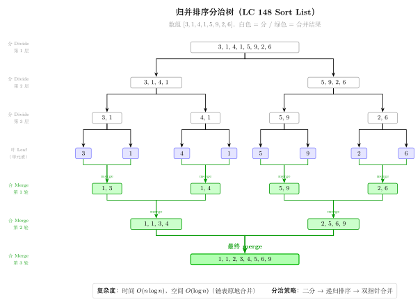

# 09 — Divide & Conquer（融合版）

> **难度**：★★★☆☆
> **题数**：4
> **核心套路**：归并排序思想、树形分治、二分递归、合并有序序列
> **本文件**：覆盖 divide_conquer 4 题的算法套路总结 + 典型题精讲 + 自测

---

## 一例速记

> **归并排序思想（148 / 23）**：`split → 左右递归 → merge`；148 对链表用快慢指针找中点拆分，23 把 k 路归并转化为反复两两归并
> **树形分治（108 / 427）**：问题天然具有树结构，每次在中点或四等分处划分，返回子树根节点后自底向上组装
> **108 sorted array → BST**：每次取中间元素为根（`mid = (l + r) // 2`），左半建左子树，右半建右子树，保证高度平衡
> **427 Quad Tree**：若区域内值全相同则建叶节点，否则四等分递归建四个子节点，再聚合
> **23 Merge k Lists**：分治两两归并，深度 $O(\log k)$，总时间 $O(N \log k)$（$N$ 为总节点数）
> **148 Sort List**：链表归并排序；快慢指针找中点，断开两段后递归；`merge` 函数与数组归并一致
> **AI 关联**：MapReduce（split → 分布式处理 → reduce/merge）/ 并行计算（数据分片）/ 分层神经网络推理

---

## 思维路径还原

> "看到 **108 Convert Sorted Array to BST**：升序数组建高度平衡 BST →
> 分治：取中间元素为根（保证左右子树大小尽量均等），左半数组建左子树，右半数组建右子树。
> 区间 `[l, r]`，`mid = (l + r) // 2`，`root.left = build(l, mid-1)`，`root.right = build(mid+1, r)`。
> 递归直到 `l > r` 返回 None，共 $O(n)$ 次节点创建。
>
> 看到 **427 Construct Quad Tree**：二维网格，值只有 0/1，要求建四叉树 →
> 先判断当前区域是否全为同一值（遍历检查或前缀和 O(1) 查询）；
> 若是，则建叶节点（`isLeaf=True`，`val` 为该值）；
> 若否，则四等分成左上/右上/左下/右下四个子区域递归，返回四个子节点，组装非叶节点。
>
> 看到 **23 Merge k Sorted Lists**：k 个有序链表合并 →
> 分治：把 k 个链表两两配对，每轮合并后变成 $k/2$ 个，重复 $O(\log k)$ 轮；
> 每轮合并两个有序链表用经典双指针 `merge` 函数，O(m+n) 时间。
> 总时间 $O(N \log k)$（N 为所有节点总数）。
> 另法：最小堆，每次弹出最小节点后把其后继推入堆，同样 $O(N \log k)$，常数略大。
>
> 看到 **148 Sort List**：对链表原地排序，要求 $O(n \log n)$ 时间 $O(1)$ 额外空间 →
> 归并排序：找中点（快慢指针 slow/fast，slow 停在前半末尾），断开两段链表；
> 递归排序两半，再 merge；空间分析：递归栈 $O(\log n)$（非严格 O(1)，但常视为满足要求）。
> Bottom-up 迭代归并（步长从 1 倍增）可做到严格 $O(1)$ 额外空间。"

---

## 学习目标

- 掌握"分治三步"框架：Divide（拆分）→ Conquer（递归子问题）→ Combine（合并结果）
- 理解链表归并排序中快慢指针找中点、断链、递归、merge 的完整流程
- 能用分治两两归并实现 k 路合并，理解其时间复杂度 $O(N \log k)$ 的推导
- 掌握有序数组建平衡 BST 的中点划分递归，理解"高度平衡"的来源
- 理解四叉树构建中"叶节点条件"与"四等分递归"的结构
- 能识别 MapReduce / 并行计算与分治框架的对应关系

---

## 几何示意

### 图 归并排序递归树（LC 148）



---
## 抽象成方法（标准模板代码）

### 分治通用骨架

```python
def divide_and_conquer(problem, l: int, r: int):
    """分治三步框架骨架。"""
    # 1. 边界：问题规模足够小，直接求解
    if l >= r:
        return base_case(problem, l, r)

    # 2. Divide：找分割点
    mid = l + (r - l) // 2

    # 3. Conquer：递归左右子问题
    left_result  = divide_and_conquer(problem, l, mid)
    right_result = divide_and_conquer(problem, mid + 1, r)

    # 4. Combine：合并子问题结果
    return combine(left_result, right_result)
```

---

### 套路 1：有序数组建平衡 BST（108）

适用题：108（Convert Sorted Array to Binary Search Tree）

```python
from __future__ import annotations
from typing import Optional, List


class TreeNode:
    def __init__(self, val: int = 0,
                 left: Optional[TreeNode] = None,
                 right: Optional[TreeNode] = None):
        self.val = val
        self.left = left
        self.right = right


# 108: 升序数组 → 高度平衡 BST
def sortedArrayToBST(nums: List[int]) -> Optional[TreeNode]:
    """时间 O(n)（每个元素创建一次节点），空间 O(log n)（递归栈深度 = 树高）。"""
    def build(l: int, r: int) -> Optional[TreeNode]:
        if l > r:
            return None
        mid = l + (r - l) // 2          # 取中间元素为根（保证左右均等）
        root = TreeNode(nums[mid])
        root.left  = build(l, mid - 1)
        root.right = build(mid + 1, r)
        return root

    return build(0, len(nums) - 1)
```

---

### 套路 2：四叉树构建（427）

适用题：427（Construct Quad Tree）

```python
class QuadNode:
    def __init__(self, val: bool, isLeaf: bool,
                 topLeft=None, topRight=None,
                 bottomLeft=None, bottomRight=None):
        self.val = val
        self.isLeaf = isLeaf
        self.topLeft = topLeft
        self.topRight = topRight
        self.bottomLeft = bottomLeft
        self.bottomRight = bottomRight


# 427: 构建四叉树
def construct(grid: List[List[int]]) -> QuadNode:
    """时间 O(n^2 log n)（每层每个格子最多访问一次），空间 O(log n)（递归栈）。
    若用前缀和预处理则时间降至 O(n^2)。
    """
    n = len(grid)

    def is_uniform(r: int, c: int, size: int) -> bool:
        """检查左上角 (r,c)、边长 size 的正方形区域是否全为同一值。"""
        val = grid[r][c]
        for i in range(r, r + size):
            for j in range(c, c + size):
                if grid[i][j] != val:
                    return False
        return True

    def build(r: int, c: int, size: int) -> QuadNode:
        if is_uniform(r, c, size):
            return QuadNode(bool(grid[r][c]), isLeaf=True)
        half = size // 2
        return QuadNode(
            val=True,
            isLeaf=False,
            topLeft     = build(r,        c,        half),
            topRight    = build(r,        c + half, half),
            bottomLeft  = build(r + half, c,        half),
            bottomRight = build(r + half, c + half, half),
        )

    return build(0, 0, n)


# 427 优化版：前缀和 O(1) 区域均匀判断
def construct_optimized(grid: List[List[int]]) -> QuadNode:
    """时间 O(n^2)，空间 O(n^2)（前缀和数组）。"""
    n = len(grid)
    # prefix[i][j] = grid[0..i-1][0..j-1] 的元素和
    prefix = [[0] * (n + 1) for _ in range(n + 1)]
    for i in range(1, n + 1):
        for j in range(1, n + 1):
            prefix[i][j] = (grid[i-1][j-1]
                            + prefix[i-1][j]
                            + prefix[i][j-1]
                            - prefix[i-1][j-1])

    def region_sum(r: int, c: int, size: int) -> int:
        """区域 [r, r+size) × [c, c+size) 的元素和，O(1)。"""
        return (prefix[r + size][c + size]
                - prefix[r][c + size]
                - prefix[r + size][c]
                + prefix[r][c])

    def build(r: int, c: int, size: int) -> QuadNode:
        s = region_sum(r, c, size)
        if s == 0 or s == size * size:   # 全 0 或全 1
            return QuadNode(bool(s > 0), isLeaf=True)
        half = size // 2
        return QuadNode(
            val=True, isLeaf=False,
            topLeft     = build(r,        c,        half),
            topRight    = build(r,        c + half, half),
            bottomLeft  = build(r + half, c,        half),
            bottomRight = build(r + half, c + half, half),
        )

    return build(0, 0, n)
```

---

### 套路 3：链表归并排序（148）

适用题：148（Sort List）

```python
class ListNode:
    def __init__(self, val: int = 0, next: Optional[ListNode] = None):
        self.val = val
        self.next = next


# 148: 链表排序（归并排序）
def sortList(head: Optional[ListNode]) -> Optional[ListNode]:
    """时间 O(n log n)，空间 O(log n)（递归栈）。"""
    # 边界：空或只有一个节点，无需排序
    if head is None or head.next is None:
        return head

    # Divide：快慢指针找中点，断开两段
    slow, fast = head, head.next
    while fast and fast.next:
        slow = slow.next
        fast = fast.next.next
    mid = slow.next
    slow.next = None          # 断链：前半以 slow 结尾

    # Conquer：递归排序两半
    left  = sortList(head)
    right = sortList(mid)

    # Combine：合并两个有序链表
    return merge_two_lists(left, right)


def merge_two_lists(l1: Optional[ListNode],
                    l2: Optional[ListNode]) -> Optional[ListNode]:
    """合并两个有序链表，时间 O(m+n)，空间 O(1)。"""
    dummy = ListNode(0)
    cur = dummy
    while l1 and l2:
        if l1.val <= l2.val:
            cur.next = l1
            l1 = l1.next
        else:
            cur.next = l2
            l2 = l2.next
        cur = cur.next
    cur.next = l1 if l1 else l2
    return dummy.next
```

---

### 套路 4：k 路归并分治（23）

适用题：23（Merge k Sorted Lists）

```python
# 23: 合并 k 个有序链表（分治两两归并）
def mergeKLists(lists: List[Optional[ListNode]]) -> Optional[ListNode]:
    """时间 O(N log k)（N 为总节点数，k 为链表数），空间 O(log k)（递归栈）。"""
    if not lists:
        return None
    return merge_range(lists, 0, len(lists) - 1)


def merge_range(lists: List[Optional[ListNode]],
                l: int, r: int) -> Optional[ListNode]:
    if l == r:
        return lists[l]
    mid = l + (r - l) // 2
    left  = merge_range(lists, l, mid)
    right = merge_range(lists, mid + 1, r)
    return merge_two_lists(left, right)   # 复用上方 merge_two_lists


# 23 备选：最小堆（同样 O(N log k)，适合 k 较大时减少常数）
import heapq


def mergeKLists_heap(lists: List[Optional[ListNode]]) -> Optional[ListNode]:
    """时间 O(N log k)，空间 O(k)（堆大小）。"""
    dummy = ListNode(0)
    cur = dummy
    heap: list[tuple[int, int, Optional[ListNode]]] = []

    for i, node in enumerate(lists):
        if node:
            heapq.heappush(heap, (node.val, i, node))

    while heap:
        val, i, node = heapq.heappop(heap)
        cur.next = node
        cur = cur.next
        if node.next:
            heapq.heappush(heap, (node.next.val, i, node.next))

    return dummy.next
```

---

### 速查表

| 题目 | 分治模式 | 划分方式 | Combine 操作 | 时间 | 空间 |
|---|---|---|---|---|---|
| 108 Sorted Array to BST | 数组二分 | 取中点为根 | 左右子树拼接 | $O(n)$ | $O(\log n)$ |
| 427 Construct Quad Tree | 二维四等分 | 正方形四分 | 四子节点拼接 | $O(n^2 \log n)$ | $O(\log n)$ |
| 148 Sort List | 链表二分 | 快慢指针中点 | merge 有序链表 | $O(n \log n)$ | $O(\log n)$ |
| 23 Merge k Lists | k 路两两归并 | 下标区间对折 | merge 两有序链表 | $O(N \log k)$ | $O(\log k)$ |

---

## 方法变形（4 类）

### 变形 1：有序序列建树系列（108）

- **108**（数组 → 平衡 BST）→ **109**（链表 → 平衡 BST，非本 category）：数组版 O(1) 随机访问直接取中点；链表版需先快慢指针找中点（$O(n)$），或先转为数组再建树。
- **中点选取策略**：`mid = (l + r) // 2`（左中位数，偏左）和 `mid = (l + r + 1) // 2`（右中位数）均合法；LeetCode 108 接受多种答案，但实践中习惯取左中位数。
- **泛化**：任何"升序序列建平衡二叉搜索结构"的问题都可套此模板——关键是"取中点为根，两侧递归"。

### 变形 2：归并排序系列（148）

- **148**（链表）→ **912**（数组，非本 category）：数组归并排序需额外 $O(n)$ 辅助数组做 merge；链表归并可原地修改指针，不需要额外空间存元素（仅需 $O(1)$ 辅助变量）。
- **Bottom-up 迭代归并**：从步长 1 开始，每轮将相邻步长区间两两合并，步长翻倍，共 $O(\log n)$ 轮——实现严格 $O(1)$ 额外空间（无递归栈）。
- **快慢指针找中点**：`fast = head.next`（而非 `fast = head`）使 slow 停在前半末尾，方便断链；若 `fast = head` 则 slow 会多走一步，在偶数长度链表上导致两段长度不均。

### 变形 3：k 路归并系列（23）

- **23**（分治两两归并）vs **堆解法**：分治时间复杂度相同（$O(N \log k)$），但分治递归栈 $O(\log k)$ 而堆维护 $k$ 个节点 $O(k)$；$k$ 极大时堆空间占用更显著，分治更优。
- **逐一归并（Naive）**：把 k 个链表依次归并到结果中，时间 $O(N \cdot k)$，当 $k$ 大时劣于分治。
- **AI 关联 / MapReduce**：23 题是 Reduce 阶段的典型范例——多个 worker 各自输出有序结果（多个有序链表），coordinator 做多路 merge；分治两两归并对应 tree aggregation（树形归约）。

### 变形 4：四叉树 / 空间分治系列（427）

- **427**（值全同则叶，否则四分）→ **BSP Tree**（二叉空间分割，3D 渲染中的类似概念）：相同的"均匀则叶，否则继续分"思路在计算机图形学中广泛应用。
- **前缀和优化**：朴素的 `is_uniform` 需 $O(\text{size}^2)$，导致总时间 $O(n^2 \log n)$；预处理二维前缀和后，区域检测 $O(1)$，总时间降至 $O(n^2)$（每个格子最多分配到一个叶节点，总工作量 $O(n^2)$）。
- **四叉树的应用**：GIS 中的点查询（空间索引）、图像压缩（均匀区域直接存值，非均匀区域继续分）——都是 427 题思路的工程化。

---

## 思考路标（条件反射）

1. 看到 **"升序数组 + 建平衡 BST"**（108）→ 取中间元素为根，左半建左子树，右半建右子树，`mid = (l+r)//2`
2. 看到 **"二维网格 + 均匀判断 + 四叉树"**（427）→ 先判断区域是否全同，是则叶节点；否则四等分递归，组装四子节点
3. 看到 **"链表 + O(n log n) 排序"**（148）→ 快慢指针找中点断链，递归排左右，merge 两有序链表
4. 看到 **"合并 k 个有序链表"**（23）→ 分治两两归并（深度 $O(\log k)$，总时间 $O(N \log k)$）；或最小堆
5. 看到 **"分治后需要 combine"** → 思考 combine 操作是否能 $O(n)$ 完成（归并是 $O(n)$，不能退化为 $O(n^2)$）
6. 看到 **"k 路 reduce / 多数据源合并"** → 联系 23 题，分治两两合并而非逐一合并
7. 看到 **"链表找中点"** → `slow = head, fast = head.next`，`while fast and fast.next`，slow 停在前半末尾
8. 看到 **"merge 两有序链表"** → 哑节点 dummy + cur 指针，逐一比较头节点，拼接，最后接剩余段
9. 看到 **"二维区域均匀判断 + 需要高效"** → 二维前缀和预处理，$O(1)$ 查询任意矩形区域的元素和
10. 看到 **"MapReduce / 分布式聚合"**（AI 场景）→ Map = 分治拆分，Reduce = merge；树形归约对应分治归并
11. 看到 **"并行计算 + 子任务无依赖"** → 分治框架：左右子问题可并行执行，combine 串行
12. 看到 **"分层神经网络推理"** → 每层独立计算 + 层间激活合并，对应分治的 conquer + combine 结构

---

## 易错点

1. **148 快慢指针的起始位置**：`fast = head.next`（不是 `head`）；若写 `fast = head` 则对偶数长度链表，slow 会停在中点右侧，导致两段不均且无法正常断链。
2. **148 断链顺序**：`mid = slow.next; slow.next = None`——必须先保存 mid 再断链；若先 `slow.next = None` 则 mid 信息丢失。
3. **108 mid 取左或右中位数**：`(l + r) // 2` 和 `(l + r + 1) // 2` 结果可能不同，两者都合法；但在代码中必须与递归区间 `build(l, mid-1)` 和 `build(mid+1, r)` 保持一致，不能混用两种计算方式。
4. **23 逐一归并（Naive）的性能陷阱**：把 k 个链表一条一条合并（`result = merge(result, lists[i])`）是 $O(Nk)$，当 k 很大时会 TLE；应使用分治两两归并或最小堆。
5. **427 叶节点 val 的含义**：对于非叶节点，`val` 可以设为任意值（通常设 True），LeetCode 仅检查叶节点的 `val`；但代码中不要把非叶节点的 `val` 误设为区域内第一个格子的值（可能误导）。
6. **merge 两有序链表后忘接剩余**：`while l1 and l2` 循环结束后，`l1` 或 `l2` 可能仍有剩余；必须 `cur.next = l1 if l1 else l2` 将剩余部分接上，否则尾部截断。
7. **427 前缀和边界**：`prefix[i][j]` 表示 `grid[0..i-1][0..j-1]` 的和（下标偏移 1），`region_sum(r, c, size)` 的参数是左上角 `(r, c)` 和区域大小 `size`，对应前缀和的下标是 `prefix[r+size][c+size] - ...`——下标换算容易差 1，写完后用小例子验证。
8. **分治递归的空间计入**：148 的"$O(1)$ 额外空间"说法指的是 merge 操作本身；递归栈有 $O(\log n)$ 深度，若面试要求严格 $O(1)$ 空间需改用 bottom-up 迭代归并。

---

## 典型应用例题

### 例 1：148. Sort List

**题目**：给定链表头节点 `head`，将链表按升序排序并返回排序后的链表头节点。要求时间 $O(n \log n)$，尽量使用 $O(1)$ 额外空间。

**思路**：链表归并排序。三步：① 快慢指针找中点并断链（Divide）；② 递归排序两半（Conquer）；③ 合并两个有序链表（Combine）。

`merge` 函数用哑节点简化头节点处理：比较两链表当前节点的值，小的接入结果链，循环直至一方为空，最后接上剩余段。

**解**：

```python
# 参考：solutions/divide_conquer/p148_sort_list.py
def sortList(head: Optional[ListNode]) -> Optional[ListNode]:
    if head is None or head.next is None:
        return head

    # Divide：快慢指针找前半末尾 slow
    slow, fast = head, head.next
    while fast and fast.next:
        slow = slow.next
        fast = fast.next.next
    mid = slow.next
    slow.next = None    # 断开前半和后半

    left  = sortList(head)
    right = sortList(mid)

    # Combine：合并两个有序链表
    dummy = ListNode(0)
    cur = dummy
    while left and right:
        if left.val <= right.val:
            cur.next = left;  left  = left.next
        else:
            cur.next = right; right = right.next
        cur = cur.next
    cur.next = left if left else right
    return dummy.next
```

**分析**：$O(n \log n)$ 时间（$\log n$ 层，每层 merge 共 $O(n)$），$O(\log n)$ 空间（递归栈）。关键在于链表 merge 可以原地修改指针，无需 $O(n)$ 辅助数组，是链表相比数组在归并排序上的优势。

---

### 例 2：23. Merge k Sorted Lists

**题目**：给你 $k$ 个升序链表，将它们合并为一个升序链表并返回。

**思路**：分治两两归并。把 $k$ 个链表的下标区间 `[l, r]` 递归拆成 `[l, mid]` 和 `[mid+1, r]`，分别合并后再合并两侧结果。树形递归深度 $O(\log k)$，每层所有 merge 共处理 $N$ 个节点，总时间 $O(N \log k)$。

**解**：

```python
# 参考：solutions/divide_conquer/p023_merge_k_sorted_lists.py
def mergeKLists(lists: List[Optional[ListNode]]) -> Optional[ListNode]:
    if not lists:
        return None

    def merge_two(l1: Optional[ListNode],
                  l2: Optional[ListNode]) -> Optional[ListNode]:
        dummy = ListNode(0)
        cur = dummy
        while l1 and l2:
            if l1.val <= l2.val:
                cur.next = l1; l1 = l1.next
            else:
                cur.next = l2; l2 = l2.next
            cur = cur.next
        cur.next = l1 if l1 else l2
        return dummy.next

    def solve(lo: int, hi: int) -> Optional[ListNode]:
        if lo == hi:
            return lists[lo]
        mid = lo + (hi - lo) // 2
        return merge_two(solve(lo, mid), solve(mid + 1, hi))

    return solve(0, len(lists) - 1)
```

**分析**：$O(N \log k)$ 时间，$O(\log k)$ 空间（递归栈）。与逐一归并（$O(Nk)$）对比：分治将每个节点参与 merge 的次数从 $k-1$ 次降低到 $\log k$ 次。时间复杂度与最小堆解法相同，但分治不需要额外的堆结构，常数更小。

---

### 例 3：108. Convert Sorted Array to Binary Search Tree

**题目**：给定升序整数数组 `nums`，将其转换为高度平衡的二叉搜索树（每个节点两侧子树高度差 $\leq 1$）。

**思路**：取中间元素为根，保证左右两侧元素数量尽量均等（高度平衡的来源）。左半数组递归建左子树，右半数组递归建右子树。

**解**：

```python
# 参考：solutions/divide_conquer/p108_convert_sorted_array_to_binary_search_tree.py
def sortedArrayToBST(nums: List[int]) -> Optional[TreeNode]:
    def build(l: int, r: int) -> Optional[TreeNode]:
        if l > r:
            return None
        mid = l + (r - l) // 2
        root = TreeNode(nums[mid])
        root.left  = build(l, mid - 1)
        root.right = build(mid + 1, r)
        return root

    return build(0, len(nums) - 1)
```

**分析**：$O(n)$ 时间（每个元素恰好创建一次节点），$O(\log n)$ 空间（递归栈深度等于树高，平衡树高度 $O(\log n)$）。正确性：BST 性质由升序数组保证（左半 < 中点 < 右半）；平衡性由取中点保证（两侧大小差 $\leq 1$，高度差 $\leq 1$）。

---

## 自测题

**自测 1**（108 题 Convert Sorted Array to BST）—— `nums=[-10,-3,0,5,9]` 建出高度平衡 BST，根为 0（或其他合法答案）。💡 提示：`build(0, n-1)` 中 `mid = (l+r)//2`，`root = TreeNode(nums[mid])`，递归 `build(l, mid-1)` 和 `build(mid+1, r)`；`l > r` 返回 None。参考 `solutions/divide_conquer/p108_convert_sorted_array_to_binary_search_tree.py`。

**自测 2**（427 题 Construct Quad Tree）—— `grid=[[0,1],[1,0]]` 建四叉树，根非叶，四个子节点均为叶节点，值分别为 False/True/True/False。💡 提示：`build(0, 0, 2)` 中 `is_uniform` 返回 False，四等分 `half=1`，递归各 `1×1` 子区域；`1×1` 区域必为均匀，直接建叶节点。参考 `solutions/divide_conquer/p427_construct_quad_tree.py`。

**自测 3**（148 题 Sort List）—— `head=[4,2,1,3]` 排序后输出 `[1,2,3,4]`。💡 提示：快慢指针 `slow=head, fast=head.next`；断链后递归两半；merge 时哑节点简化操作；别忘 `slow.next = None` 断链。参考 `solutions/divide_conquer/p148_sort_list.py`。

**自测 4**（23 题 Merge k Sorted Lists）—— `lists=[[1,4,5],[1,3,4],[2,6]]` 输出 `[1,1,2,3,4,4,5,6]`。💡 提示：分治 `solve(lo, hi)` 在 `lo==hi` 时返回 `lists[lo]`；`merge_two` 合并两有序链表；中点 `mid = (lo+hi)//2`，递归 `solve(lo, mid)` 和 `solve(mid+1, hi)` 后 merge。参考 `solutions/divide_conquer/p023_merge_k_sorted_lists.py`。

**自测 5**（综合）—— 将 `[-9,-3,0,5,9,11]`（6 个元素）建平衡 BST，验证：根为 `nums[2]=0` 或 `nums[3]=5`，树高不超过 3。💡 提示：6 个元素时 `mid = (0+5)//2 = 2`，根 = `nums[2] = 0`；左子树区间 `[0,1]`，右子树区间 `[3,5]`；继续递归验证高度均为 2，满足平衡条件。

---

## 题目全览（4 题）

| # | 题目 | 套路分类 | 难度 |
|---|---|---|---|
| 108 | Convert Sorted Array to Binary Search Tree | 数组二分，取中点建 BST | Easy |
| 427 | Construct Quad Tree | 二维四等分，均匀判断建叶 | Medium |
| 148 | Sort List | 链表快慢指针 + 归并排序 | Medium |
| 23 | Merge k Sorted Lists | k 路分治两两归并 | Hard |

---

## 融合版说明

| 段 | 来源 | 价值 |
|---|---|---|
| 一例速记 | 本文件 | 4 题 4 类套路一览 + AI 关联（MapReduce / 并行计算） |
| 思维路径还原 | 本文件 | 4 道题的解题内心独白，含关键决策点 |
| 抽象成方法 | 本文件 | 5 个标准模板（骨架 + 4 类子套路 + 堆备选）+ 速查表 |
| 方法变形 | 本文件 | 4 类变体扩展（建树 / 归并 / k 路 / 四叉树） |
| 思考路标 | 本文件 | 12 条题型识别条件反射，覆盖全部 4 题 + AI 场景 |
| 易错点 | 本文件 | 8 条高频踩坑（快慢指针起点 / 断链顺序 / 剩余段接入等） |
| 典型应用例题 | solutions/ | 3 道精讲（148、23、108），代码 + 正确性分析 |
| 自测题 | leetcode | 5 题带 💡 提示，链接 solutions 文件 |
| 题目全览 | 本文件 | 4 题完整列表，套路分类一览 |

---

> **跨 category 导航**：
> - 二叉树 DFS（递归子树、LCA、路径和）→ 见 `07-binary-tree-dfs.md`（分治是 DFS 的泛化）
> - 二叉搜索树（插入 / 删除 / 验证）→ 见 `05-binary-search-tree.md`（108 建出的是 BST）
> - 有序数组二分搜索 → 见 `04-binary-search.md`（分治思路与二分同源）
> - 动态规划：若分治子问题有重叠，加记忆化变为 DP → 见 `dynamic_programming` 系列
> - 链表操作（双指针、反转、删节点）→ 见 `linked_list` category（148 用到链表基础操作）
