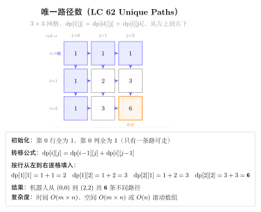
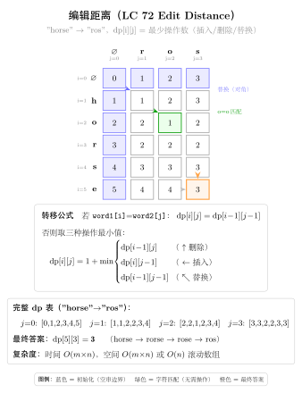
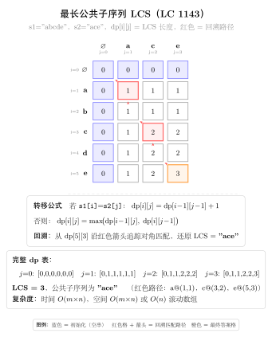

# 11 — Dynamic Programming Multidimensional（融合版）

> **难度**：★★★★★
> **题数**：9
> **核心套路**：二维 DP、双序列对齐、状态机 DP、区间 DP、滚动行压缩
> **本文件**：覆盖 dynamic_programming_multidimensional 9 题的算法套路总结 + 典型题精讲 + 自测

---

## 一例速记

> **DP 三问（多维版）**：①状态 `dp[i][j]` 含义（两个维度各自代表什么）②转移（当前格如何从上/左/左上推出）③初始化（第 0 行/列的边界）
> **63/64 grid path**：`dp[i][j]` = 到达 (i,j) 的路径数/最小代价，从 `dp[i-1][j]` 和 `dp[i][j-1]` 推出，滚动行压缩 O(n) 空间
> **120 三角形**：自底向上，`dp[i][j] = min(dp[i+1][j], dp[i+1][j+1]) + triangle[i][j]`；原地修改或额外 O(n) 数组
> **72 编辑距离**：`dp[i][j]` = `word1[:i]` 到 `word2[:j]` 的最少操作数；字符匹配则继承左上角，否则取三邻 +1
> **97 交错字符串**：`dp[i][j]` = `s1[:i]` 和 `s2[:j]` 能否交错组成 `s3[:i+j]`；两个转移分支取 OR
> **5 最长回文子串**：区间 DP，`dp[i][j]` = `s[i..j]` 是否为回文；也可中心扩展 O(n) 空间
> **123/188 股票多次交易**：状态机 DP，状态 = (天数, 已完成交易次数, 是否持股)，转移为买入/持有/卖出三条边
> **221 最大正方形**：`dp[i][j]` = 以 (i,j) 为右下角的最大全 1 正方形边长；`min(dp[i-1][j], dp[i][j-1], dp[i-1][j-1]) + 1`
> **AI 关联**：BLEU 评分（LCS/n-gram 匹配）= 编辑距离的变体；DTW（动态时间规整）= grid path DP；Needleman-Wunsch = 编辑距离在生物信息学的应用

---

## 思维路径还原

> "看到 **63 Unique Paths II**：带障碍物的 m×n 网格，求左上到右下的不同路径数 →
> `dp[i][j]` = 到达 (i,j) 的路径数；障碍物格子设为 0，跳过不更新。
> 初始化第 0 行/列：遇到障碍则后续全 0（障碍物挡住整行/列）。
> 转移：`dp[i][j] = dp[i-1][j] + dp[i][j-1]`（障碍格直接为 0）。
> 滚动优化：只用一维数组，`dp[j] += dp[j-1]`，原地更新同一行。
>
> 看到 **64 Minimum Path Sum**：m×n 网格每格有代价，求左上到右下的最小代价路径 →
> `dp[i][j] = min(dp[i-1][j], dp[i][j-1]) + grid[i][j]`。
> 第 0 行只能从左来，第 0 列只能从上来，单独初始化前缀和。
> 滚动：一维数组，`dp[j] = min(dp[j], dp[j-1]) + grid[i][j]`，左 `dp[j]` 是更新后的当前行，`dp[j-1]` 同行左邻。
>
> 看到 **120 Triangle**：三角形自顶向下，找最小路径和 →
> 自底向上更省心：`dp[i][j] = min(dp[i+1][j], dp[i+1][j+1]) + triangle[i][j]`，
> 最终 `dp[0][0]` 即答案。可直接原地修改 triangle，O(1) 额外空间。
>
> 看到 **72 Edit Distance**：两个字符串的最少操作数（增删改）→
> `dp[i][j]` = `word1[:i]` 变为 `word2[:j]` 的最少操作数。
> 若 `word1[i-1] == word2[j-1]`：`dp[i][j] = dp[i-1][j-1]`（不需操作）；
> 否则：`dp[i][j] = 1 + min(dp[i-1][j], dp[i][j-1], dp[i-1][j-1])`（删/插/替换）。
> 初始化：`dp[0][j] = j`（空串变为 word2[:j] 需插入 j 次），`dp[i][0] = i`。
>
> 看到 **97 Interleaving String**：判断 s3 是否由 s1 和 s2 交错组成 →
> `dp[i][j]` = `s1[:i]` 和 `s2[:j]` 能否交错组成 `s3[:i+j]`。
> 转移：`dp[i][j] = (dp[i-1][j] and s1[i-1]==s3[i+j-1]) or (dp[i][j-1] and s2[j-1]==s3[i+j-1])`。
> 若 `len(s1)+len(s2) != len(s3)` 直接返回 False。
>
> 看到 **5 Longest Palindromic Substring**：找最长回文子串 →
> 区间 DP：`dp[i][j]` = `s[i..j]` 是否为回文；枚举子串长度 l，
> `dp[i][j] = (s[i]==s[j]) and (l<=2 or dp[i+1][j-1])`。
> 时间 O(n²) 空间 O(n²)；中心扩展可降至 O(1) 空间，同样 O(n²) 时间。
>
> 看到 **123 Best Time III**：最多 2 笔交易，求最大利润 →
> 状态机 DP：4 个状态（持 1 / 卖 1 / 持 2 / 卖 2），每天更新；也可拆成两次 121 题（前缀最大、后缀最大相加）。
>
> 看到 **188 Best Time IV**：最多 k 笔交易 →
> `dp[t][0/1]` = 完成 t 笔交易后不持股/持股的最大利润；外层枚举 t，内层枚举天数；
> 若 k >= n//2 则等价于无限次（贪心）。
>
> 看到 **221 Maximal Square**：二值矩阵中最大全 1 正方形面积 →
> `dp[i][j]` = 以 (i,j) 为右下角的最大正方形边长；
> `dp[i][j] = min(dp[i-1][j], dp[i][j-1], dp[i-1][j-1]) + 1`（当 `matrix[i][j]=='1'`）；
> 答案 = `max(dp[i][j])²`。"

---

## 学习目标

- 掌握二维 DP 的初始化方法（第 0 行/列的前缀积/前缀和）及滚动行压缩
- 理解双序列对齐 DP（编辑距离 / 交错字符串）的二维状态机写法
- 掌握区间 DP（最长回文子串）的枚举顺序：先枚举长度，再枚举起点
- 掌握状态机 DP（股票多次交易）：明确区分"状态 = 系统属性"和"决策 = 边"
- 理解最大正方形的"木桶原理"递推，能从几何直觉推导转移方程
- 能识别"滚动行优化"的适用条件（当前行只依赖上一行），将 O(mn) 空间降至 O(n)
- 理解 DTW / BLEU / Needleman-Wunsch 与编辑距离/LCS 的关联

---

## 几何示意

### 图 二维路径 DP（LC 62）



### 图 编辑距离（LC 72）



### 图 LCS（LC 1143）



---
## 抽象成方法（标准模板代码）

### 模板 1：二维 DP grid（自底向上递推）

适用：63 Unique Paths II、64 Minimum Path Sum

```python
from typing import List

def grid_dp_template(grid: List[List[int]]) -> int:
    """二维 grid DP 骨架（以最小路径和为例）。时间 O(mn)，空间 O(mn)。"""
    m, n = len(grid), len(grid[0])
    dp = [[0] * n for _ in range(m)]
    # --- 初始化边界 ---
    dp[0][0] = grid[0][0]
    for j in range(1, n):
        dp[0][j] = dp[0][j - 1] + grid[0][j]   # 第 0 行只能从左到右
    for i in range(1, m):
        dp[i][0] = dp[i - 1][0] + grid[i][0]   # 第 0 列只能从上到下
    # --- 状态转移 ---
    for i in range(1, m):
        for j in range(1, n):
            dp[i][j] = min(dp[i - 1][j], dp[i][j - 1]) + grid[i][j]
    return dp[m - 1][n - 1]
```

---

### 模板 2：滚动行压缩（O(mn) → O(n) 空间）

适用：63、64、221（凡是"当前格只依赖上一行 + 当前行左侧"的题）

```python
def rolling_row_template(grid: List[List[int]]) -> int:
    """滚动行优化：只保留一行 dp。时间 O(mn)，空间 O(n)。"""
    m, n = len(grid), len(grid[0])
    dp = [0] * n
    # 初始化第 0 行
    dp[0] = grid[0][0]
    for j in range(1, n):
        dp[j] = dp[j - 1] + grid[0][j]
    # 从第 1 行开始滚动更新
    for i in range(1, m):
        dp[0] += grid[i][0]              # 第 0 列只能从上来
        for j in range(1, n):
            # dp[j] 此刻仍是上一行的值（来自上方），dp[j-1] 是本行左侧（已更新）
            dp[j] = min(dp[j], dp[j - 1]) + grid[i][j]
    return dp[n - 1]
```

---

### 模板 3：自顶向下记忆化（双序列）

适用：72 Edit Distance、97 Interleaving String

```python
from functools import lru_cache

def edit_distance_memo(word1: str, word2: str) -> int:
    """72: 自顶向下记忆化。时间 O(mn)，空间 O(mn)。"""
    m, n = len(word1), len(word2)

    @lru_cache(maxsize=None)
    def dp(i: int, j: int) -> int:
        if i == 0:
            return j       # word1 前 0 个字符变为 word2[:j]，需插入 j 次
        if j == 0:
            return i       # word2 前 0 个字符，需删除 i 次
        if word1[i - 1] == word2[j - 1]:
            return dp(i - 1, j - 1)
        return 1 + min(dp(i - 1, j),       # 删除 word1[i-1]
                       dp(i, j - 1),       # 插入 word2[j-1]
                       dp(i - 1, j - 1))   # 替换

    return dp(m, n)
```

---

### 套路 1：二维 grid DP（63 / 64 / 120）

```python
# 63: 带障碍的不同路径数
def uniquePathsWithObstacles(obstacleGrid: List[List[int]]) -> int:
    """时间 O(mn)，空间 O(n)（滚动行）。
    dp[j] = 到达当前行第 j 列的路径数；障碍格置 0 并停止更新。
    """
    m, n = len(obstacleGrid), len(obstacleGrid[0])
    dp = [0] * n
    # 初始化第 0 行：遇到障碍后全为 0
    dp[0] = 1 if obstacleGrid[0][0] == 0 else 0
    for j in range(1, n):
        dp[j] = dp[j - 1] if obstacleGrid[0][j] == 0 else 0
    # 逐行更新
    for i in range(1, m):
        if obstacleGrid[i][0] == 1:
            dp[0] = 0
        for j in range(1, n):
            dp[j] = 0 if obstacleGrid[i][j] == 1 else dp[j] + dp[j - 1]
    return dp[n - 1]


# 64: 最小路径和
def minPathSum(grid: List[List[int]]) -> int:
    """时间 O(mn)，空间 O(n)（滚动行）。
    dp[j] = 到达当前行第 j 列的最小路径和。
    """
    m, n = len(grid), len(grid[0])
    dp = [0] * n
    dp[0] = grid[0][0]
    for j in range(1, n):
        dp[j] = dp[j - 1] + grid[0][j]
    for i in range(1, m):
        dp[0] += grid[i][0]
        for j in range(1, n):
            dp[j] = min(dp[j], dp[j - 1]) + grid[i][j]
    return dp[n - 1]


# 120: 三角形最小路径和（自底向上）
def minimumTotal(triangle: List[List[int]]) -> int:
    """时间 O(n²)，空间 O(n)（原地修改最底行，逐层向上）。
    dp[j] = 从底层到当前位置的最小路径和；自底向上避免正向的路径选择歧义。
    """
    dp = triangle[-1][:]          # 拷贝最后一行作为初始状态
    for i in range(len(triangle) - 2, -1, -1):
        for j in range(len(triangle[i])):
            dp[j] = min(dp[j], dp[j + 1]) + triangle[i][j]
    return dp[0]
```

---

### 套路 2：双序列对齐 DP（72 / 97）

```python
# 72: 编辑距离（自底向上，空间 O(n)）
def minDistance(word1: str, word2: str) -> int:
    """时间 O(mn)，空间 O(n)（滚动行）。
    dp[j] = word1[:i] 变为 word2[:j] 的最少操作数。
    关键：需提前保存 dp[i-1][j-1]（左上角）再更新 dp[j]。
    """
    m, n = len(word1), len(word2)
    dp = list(range(n + 1))         # 初始化：dp[0][j] = j
    for i in range(1, m + 1):
        prev = dp[0]                # prev = dp[i-1][j-1]（左上角）
        dp[0] = i                   # dp[i][0] = i
        for j in range(1, n + 1):
            temp = dp[j]            # 保存 dp[i-1][j] 供下次迭代用作 prev
            if word1[i - 1] == word2[j - 1]:
                dp[j] = prev
            else:
                dp[j] = 1 + min(prev,       # 替换（左上）
                                dp[j],      # 删除（上方，即旧的 dp[i-1][j]）
                                dp[j - 1])  # 插入（左方，即新的 dp[i][j-1]）
            prev = temp
    return dp[n]


# 97: 交错字符串
def isInterleave(s1: str, s2: str, s3: str) -> bool:
    """时间 O(mn)，空间 O(n)（滚动行）。
    dp[j] = s1[:i] 和 s2[:j] 能否交错组成 s3[:i+j]。
    两个分支：来自 s1（上方）或来自 s2（左方）。
    """
    m, n, l = len(s1), len(s2), len(s3)
    if m + n != l:
        return False
    dp = [False] * (n + 1)
    dp[0] = True
    for j in range(1, n + 1):
        dp[j] = dp[j - 1] and s2[j - 1] == s3[j - 1]
    for i in range(1, m + 1):
        dp[0] = dp[0] and s1[i - 1] == s3[i - 1]
        for j in range(1, n + 1):
            dp[j] = ((dp[j]     and s1[i - 1] == s3[i + j - 1]) or
                     (dp[j - 1] and s2[j - 1] == s3[i + j - 1]))
    return dp[n]
```

---

### 套路 3：区间 DP —— 最长回文子串（5）

```python
# 5: 最长回文子串（区间 DP）
def longestPalindrome_dp(s: str) -> str:
    """时间 O(n²)，空间 O(n²)。
    dp[i][j] = s[i..j] 是否为回文；枚举子串长度 l，再枚举起点 i。
    """
    n = len(s)
    dp = [[False] * n for _ in range(n)]
    start, max_len = 0, 1
    # 单字符必然是回文
    for i in range(n):
        dp[i][i] = True
    # 子串长度从 2 开始枚举
    for length in range(2, n + 1):
        for i in range(n - length + 1):
            j = i + length - 1
            if s[i] == s[j]:
                dp[i][j] = (length == 2) or dp[i + 1][j - 1]
                if dp[i][j] and length > max_len:
                    start, max_len = i, length
    return s[start: start + max_len]


# 5: 最长回文子串（中心扩展，O(1) 空间）
def longestPalindrome(s: str) -> str:
    """时间 O(n²)，空间 O(1)。每个字符（奇）/ 每两个相邻字符（偶）作为中心向外扩展。"""
    n = len(s)
    start, max_len = 0, 1

    def expand(l: int, r: int) -> None:
        nonlocal start, max_len
        while l >= 0 and r < n and s[l] == s[r]:
            l -= 1
            r += 1
        length = r - l - 1
        if length > max_len:
            start, max_len = l + 1, length

    for i in range(n):
        expand(i, i)         # 奇数长度
        expand(i, i + 1)     # 偶数长度

    return s[start: start + max_len]
```

---

### 套路 4：状态机 DP —— 股票买卖（123 / 188）

```python
# 123: 至多 2 笔交易（4 状态机）
def maxProfit_k2(prices: List[int]) -> int:
    """时间 O(n)，空间 O(1)。
    4 个状态：buy1（第一次买入后最大净值）、sell1（第一次卖出后）、
              buy2（第二次买入后）、sell2（第二次卖出后）。
    每天用当日价格更新 4 个状态，转移对应买入/持有/卖出。
    """
    buy1 = buy2 = float('-inf')
    sell1 = sell2 = 0
    for price in prices:
        buy1  = max(buy1,  -price)           # 第一次买入：花费 price
        sell1 = max(sell1, buy1 + price)     # 第一次卖出
        buy2  = max(buy2,  sell1 - price)    # 第二次买入（依赖 sell1）
        sell2 = max(sell2, buy2 + price)     # 第二次卖出
    return sell2


# 188: 至多 k 笔交易（通用状态机）
def maxProfit(k: int, prices: List[int]) -> int:
    """时间 O(kn)，空间 O(k)。
    k >= n//2 时等价于无限次交易（贪心）；
    否则 buy[t]、sell[t] 分别为完成 t 次交易时持股/不持股的最大利润。
    """
    n = len(prices)
    if k >= n // 2:                          # 无限次交易：贪心累加上升段
        return sum(max(0, prices[i] - prices[i - 1]) for i in range(1, n))
    buy  = [float('-inf')] * (k + 1)
    sell = [0] * (k + 1)
    for price in prices:
        for t in range(1, k + 1):
            buy[t]  = max(buy[t],  sell[t - 1] - price)
            sell[t] = max(sell[t], buy[t] + price)
    return sell[k]
```

---

### 套路 5：最大正方形（221）

```python
# 221: 最大全 1 正方形
def maximalSquare(matrix: List[List[str]]) -> int:
    """时间 O(mn)，空间 O(n)（滚动行）。
    dp[j] = 以 (i,j) 为右下角的最大全 1 正方形边长。
    转移（木桶原理）：dp[i][j] = min(上方, 左方, 左上方) + 1。
    滚动时需额外保存左上角 prev（= 更新前的 dp[j]）。
    """
    if not matrix:
        return 0
    m, n = len(matrix), len(matrix[0])
    dp = [0] * (n + 1)
    max_side = 0
    for i in range(m):
        prev = 0                     # 对应 dp[i-1][j-1]（左上角）
        for j in range(1, n + 1):
            temp = dp[j]             # 保存 dp[i-1][j] 供下轮循环作为 prev
            if matrix[i][j - 1] == '1':
                dp[j] = min(dp[j],       # 上方
                            dp[j - 1],   # 左方
                            prev) + 1    # 左上角
                max_side = max(max_side, dp[j])
            else:
                dp[j] = 0
            prev = temp
    return max_side * max_side
```

---

### 速查表

| 题目 | dp 定义 | 空间（优化后） | 时间 | 关键转移 |
|---|---|---|---|---|
| 63 Unique Paths II | 到达 (i,j) 的路径数 | O(n) 滚动行 | O(mn) | `dp[j] + dp[j-1]`，障碍置 0 |
| 64 Min Path Sum | 到达 (i,j) 的最小代价 | O(n) 滚动行 | O(mn) | `min(dp[j], dp[j-1]) + grid[i][j]` |
| 120 Triangle | 从底到当前的最小路径 | O(n) 单行 | O(n²) | `min(dp[j], dp[j+1]) + tri[i][j]` |
| 72 Edit Distance | `word1[:i]` 变 `word2[:j]` 的操作数 | O(n) 滚动行 | O(mn) | 匹配继承左上，否则三邻 +1 |
| 97 Interleaving | `s1[:i],s2[:j]` 能否交错成 `s3[:i+j]` | O(n) 滚动行 | O(mn) | 上方 OR 左方 |
| 5 Palindrome | `s[i..j]` 是否回文（或中心扩展） | O(n²) 或 O(1) | O(n²) | 两端相等 + 内部回文 |
| 123 Stock k=2 | 4 状态机：buy1/sell1/buy2/sell2 | O(1) | O(n) | 逐天更新 4 个状态 |
| 188 Stock k=k | `buy[t]/sell[t]` 第 t 次持/不持股 | O(k) | O(kn) | 逐天逐交易数更新 |
| 221 Max Square | 以 (i,j) 为右下角的最大正方形边长 | O(n) 滚动行 | O(mn) | `min(上,左,左上) + 1` |

---

## 方法变形（4 类）

### 变形 1：二维 grid DP 系列

- **63**（有障碍）→ **62**（无障碍，非本 category）：无障碍时 `dp[i][j] = C(m+n-2, m-1)`，组合数公式 O(1)；62 仍用 DP 更直观。
- **64**（最小路径和）→ **174**（地下城（Dungeon Game），非本 category）：从终点向起点做 DP，`dp[i][j] = max(1, min(dp[i+1][j], dp[i][j+1]) - dungeon[i][j])`。
- **120**（三角形）→ **自底向上 vs 自顶向下**：自顶向下需要记录每一行的状态（或用滚动），自底向上每次只用下一行，代码更简洁。
- **DTW（动态时间规整）**（AI 场景）：`dp[i][j] = dist(s1[i], s2[j]) + min(dp[i-1][j], dp[i][j-1], dp[i-1][j-1])`，与编辑距离同构，用于序列对比（语音识别、时序数据）。

### 变形 2：双序列对齐系列

- **72 Edit Distance** → **1143 LCS**（最长公共子序列，非本 category）：`dp[i][j] = dp[i-1][j-1]+1`（匹配）或 `max(dp[i-1][j], dp[i][j-1])`（不匹配）。
- **97 Interleaving** → 若 s3 长度不等于 s1+s2 则直接 False，这是快速过滤的必要前置检查。
- **LCS 与 BLEU 的关系**（AI 场景）：BLEU 分数 = n-gram 精确度的几何平均 × 简洁惩罚，n-gram 匹配本质是 LCS 在 n-gram 级别的推广；MT 系统评价中大量使用。
- **Needleman-Wunsch**（生物信息学）：编辑距离 + 权重（不同替换代价不同）= 序列比对算法，dp 框架完全相同。

### 变形 3：状态机 DP 系列

- **121**（1 次交易）→ **122**（无限次）→ **123**（2 次）→ **188**（k 次）：状态机维度随 k 变化，k=1 时退化为只需追踪 `min_price`；无限次时退化为贪心。
- **309 Cooldown**（非本 category）：状态机增加"冷却"状态，每次卖出后必须等 1 天；三个状态（持股/卖出当天/冷却）。
- **714 With Fee**（非本 category）：买入时多扣一次手续费，`sell = max(sell, buy + price - fee)`。
- **状态机设计原则**：明确区分"状态"（系统当前处于什么情况）和"决策"（今天做什么），每条"决策边"对应一个转移方程，状态数量决定空间复杂度。

### 变形 4：区间 DP / 形状 DP

- **5 Longest Palindrome** → **516 Longest Palindromic Subsequence**（非本 category）：`dp[i][j] = dp[i+1][j-1]+2`（两端匹配）或 `max(dp[i+1][j], dp[i][j-1])`（不匹配）。
- **221 Max Square** → **85 Maximal Rectangle**（非本 category）：以每行为底，维护高度直方图，再用单调栈；221 的木桶转移方程是 85 的特殊化。
- **区间 DP 枚举顺序**：必须先枚举区间长度（从小到大），再枚举起点，确保计算 `dp[i][j]` 时 `dp[i+1][j-1]` 已就绪；若枚举顺序错误则访问未初始化的格。
- **221 木桶原理**：正方形由左方、上方、左上方三个方向"同时约束"，最短那条边决定最大正方形边长，`min(三方向)` 直接体现了这一几何约束。

---

## 思考路标（条件反射）

1. 看到 **"grid + 只能向右/向下 + 计数或最优值"** → 二维 DP，`dp[i][j]` 从上方和左方推出，滚动行 O(n) 空间
2. 看到 **"有障碍的路径计数"** → 障碍格置 0 且不更新，初始化时遇到障碍后续全 0
3. 看到 **"三角形 / 从外到内层层收缩"** → 自底向上 DP，`dp[j] = min(dp[j], dp[j+1]) + val`
4. 看到 **"两个字符串 + 最少操作 / 编辑"** → 编辑距离，`dp[i][j]` 依赖三个方向（上/左/左上）
5. 看到 **"s3 是否由 s1, s2 交错构成"** → 交错字符串 DP，先检查长度，再二维 DP 或滚动行
6. 看到 **"最长回文子串（返回子串本身）"** → 中心扩展 O(1) 空间；若需统计所有回文则用区间 DP
7. 看到 **"股票 + 至多 k 次交易"** → 状态机 DP，维护 `buy[t]` / `sell[t]`；k >= n//2 时贪心
8. 看到 **"买卖股票 + 最多 2 次"（k=2）** → 4 状态变量（buy1/sell1/buy2/sell2），O(1) 空间逐日更新
9. 看到 **"二值矩阵 + 最大全 1 正方形面积"** → 221 木桶DP，`min(上,左,左上)+1`，答案取平方
10. 看到 **"dp[i][j] 依赖 dp[i-1][j-1]"** → 滚动行时需额外变量 `prev` 保存左上角（否则已被覆盖）
11. 看到 **"区间 DP / 子串回文"** → 枚举长度从 1 到 n，确保子问题先于父问题计算
12. 看到 **"BLEU / DTW / Needleman-Wunsch"（AI 场景）** → 对应 LCS/grid DP/编辑距离，调权重或对齐窗口即可适配

---

## 易错点

1. **滚动行中左上角丢失**：`dp[i][j]` 依赖 `dp[i-1][j-1]`；滚动后更新 `dp[j]` 之前，旧的 `dp[j]`（= `dp[i-1][j]`）会被覆盖，而 `dp[i-1][j-1]` 也随之丢失。必须在进入内层循环之前用 `prev` 保存，并在循环体内先 `temp = dp[j]`，处理后 `prev = temp`。
2. **63 题第 0 行初始化中断**：第 0 行遇到障碍后，后续格子全为 0（障碍挡住了唯一路径）；初始化时若未及时截断，会错误地传递路径数。
3. **72 题三方向顺序**：`min(prev, dp[j], dp[j-1])` 中 `prev` = 左上角（替换），`dp[j]` = 上方（删除），`dp[j-1]` = 左方（插入）；混淆方向导致错误的操作语义。
4. **97 题长度检查**：`len(s1) + len(s2) != len(s3)` 时直接返回 False，否则下标计算 `s3[i+j-1]` 会越界。
5. **5 题区间 DP 枚举顺序**：外层必须枚举长度 `length`（从 2 到 n），内层枚举起点 `i`；若外层枚举 `i`、内层枚举 `j`，则 `dp[i+1][j-1]` 尚未填充，读到错误的初始值（False）。
6. **123 题 buy2 依赖 sell1 的顺序**：每天应按 `buy1 → sell1 → buy2 → sell2` 顺序更新；若调换 buy2 和 sell1 的更新顺序，buy2 会使用当天刚更新的 sell1，逻辑上允许同一天内多次操作（不合题意）。
7. **188 题 k 过大时的退化**：`k >= n // 2` 时等价于无限次交易，不退化处理则 `buy/sell` 数组大小为 O(k)，k 可能达到 10^9 导致 MLE；必须提前做贪心处理。
8. **221 题答案取平方**：`max_side` 存的是边长，面积 = `max_side²`；直接返回 `max_side` 是常见笔误。

---

## 典型应用例题

### 例 1：72. Edit Distance

**题目**：给定 `word1` 和 `word2`，求将 word1 转为 word2 所需的最少操作数（插入/删除/替换各算 1 步）。

**思路**：`dp[i][j]` = `word1[:i]` 变为 `word2[:j]` 的最少操作数。字符匹配时不需操作（继承左上角），否则三邻取 min 后 +1。初始化 `dp[i][0] = i`，`dp[0][j] = j`。滚动行 O(n) 空间，需 `prev` 保存左上角。

**解**：

```python
# 参考：solutions/dynamic_programming_multidimensional/p072_edit_distance.py
def minDistance(word1: str, word2: str) -> int:
    m, n = len(word1), len(word2)
    dp = list(range(n + 1))
    for i in range(1, m + 1):
        prev = dp[0]
        dp[0] = i
        for j in range(1, n + 1):
            temp = dp[j]
            if word1[i - 1] == word2[j - 1]:
                dp[j] = prev
            else:
                dp[j] = 1 + min(prev, dp[j], dp[j - 1])
            prev = temp
    return dp[n]
```

**分析**：$O(mn)$ 时间，$O(n)$ 空间。`prev` 是进入当前列之前的 `dp[j]`（= 上一行同列的值，即 `dp[i-1][j-1]` 的角色），这是滚动行中保存左上角的标准写法。

---

### 例 2：123. Best Time to Buy and Sell Stock III

**题目**：最多完成 2 笔交易（同一时刻最多持有一股），求最大利润。

**思路**：4 状态机。`buy1` = 第一次买入后的最大净值，`sell1` = 第一次卖出后，`buy2` = 第二次买入后，`sell2` = 第二次卖出后。每天价格都尝试"更新"每个状态，相当于选择今天是否操作。

**解**：

```python
# 参考：solutions/dynamic_programming_multidimensional/p123_best_time_to_buy_and_sell_stock_iii.py
def maxProfit(prices: List[int]) -> int:
    buy1 = buy2 = float('-inf')
    sell1 = sell2 = 0
    for price in prices:
        buy1  = max(buy1,  -price)
        sell1 = max(sell1, buy1 + price)
        buy2  = max(buy2,  sell1 - price)
        sell2 = max(sell2, buy2 + price)
    return sell2
```

**分析**：$O(n)$ 时间，$O(1)$ 空间。初始化 `buy1 = buy2 = -inf` 表示"尚未发生第一/二次买入"，`sell1 = sell2 = 0` 表示未卖出时利润为 0。每次循环按固定顺序更新，保证 buy2 使用的是"本次循环之前"的 sell1，不会在同一天内完成买卖。

---

### 例 3：221. Maximal Square

**题目**：给定二值字符矩阵，求最大全 1 正方形的面积。

**思路**：`dp[i][j]` = 以 (i,j) 为右下角的最大全 1 正方形边长。若 `matrix[i][j] == '0'` 则 `dp[i][j] = 0`；否则 `dp[i][j] = min(上, 左, 左上) + 1`。木桶原理：三方向的最小值决定了可以形成的正方形大小。

**解**：

```python
# 参考：solutions/dynamic_programming_multidimensional/p221_maximal_square.py
def maximalSquare(matrix: List[List[str]]) -> int:
    m, n = len(matrix), len(matrix[0])
    dp = [0] * (n + 1)
    max_side, prev = 0, 0
    for i in range(m):
        for j in range(1, n + 1):
            temp = dp[j]
            if matrix[i][j - 1] == '1':
                dp[j] = min(dp[j], dp[j - 1], prev) + 1
                max_side = max(max_side, dp[j])
            else:
                dp[j] = 0
            prev = temp
    return max_side * max_side
```

**分析**：$O(mn)$ 时间，$O(n)$ 空间（滚动行）。`prev` 对应左上角 `dp[i-1][j-1]`，在 `j` 循环开始前保存旧的 `dp[j]`，在本列更新后移至下一列时充当新的左上角。

---

## 自测题

**自测 1**（63 题 Unique Paths II）—— `obstacleGrid=[[0,0,0],[0,1,0],[0,0,0]]` 返回 2（障碍在中心）。提示：一维 dp，障碍格直接置 0；第 0 行遇障后续全 0；每行滚动 `dp[j] += dp[j-1]`（障碍则 `dp[j]=0`）。参考 `solutions/dynamic_programming_multidimensional/p063_unique_paths_ii.py`。

**自测 2**（64 题 Minimum Path Sum）—— `grid=[[1,3,1],[1,5,1],[4,2,1]]` 返回 7（路径 1→3→1→1→1）。提示：一维 dp，初始化第 0 行前缀和；滚动时 `dp[0] += grid[i][0]`，`dp[j] = min(dp[j], dp[j-1]) + grid[i][j]`。参考 `solutions/dynamic_programming_multidimensional/p064_minimum_path_sum.py`。

**自测 3**（72 题 Edit Distance）—— `word1="horse", word2="ros"` 返回 3；`word1="", word2="abc"` 返回 3。提示：`dp=list(range(n+1))`；外层 i 循环中 `prev=dp[0]; dp[0]=i`；内层匹配时 `dp[j]=prev`，否则 `dp[j]=1+min(prev,dp[j],dp[j-1])`；循环末 `prev=temp`。参考 `solutions/dynamic_programming_multidimensional/p072_edit_distance.py`。

**自测 4**（123 题 Stock III）—— `prices=[3,3,5,0,0,3,1,4]` 返回 6（买 0 卖 3 + 买 1 卖 4）；`prices=[1,2,3,4,5]` 返回 4。提示：`buy1=buy2=-inf; sell1=sell2=0`；每天按序更新 4 个状态；返回 `sell2`。参考 `solutions/dynamic_programming_multidimensional/p123_best_time_to_buy_and_sell_stock_iii.py`。

**自测 5**（221 题 Maximal Square）—— `matrix=[["1","0","1","0","0"],["1","0","1","1","1"],["1","1","1","1","1"],["1","0","0","1","0"]]` 返回 4（2×2 正方形，面积=4）。提示：`dp=[0]*(n+1); prev=0`；内层 j：`temp=dp[j]`；'1' 则 `dp[j]=min(dp[j],dp[j-1],prev)+1`；'0' 则 `dp[j]=0`；`prev=temp`；答案 `max_side²`。参考 `solutions/dynamic_programming_multidimensional/p221_maximal_square.py`。

---

## 题目全览（9 题）

| # | 题目 | 套路分类 | 难度 |
|---|---|---|---|
| 5 | Longest Palindromic Substring | 区间 DP / 中心扩展 | Medium |
| 63 | Unique Paths II | 二维 grid DP，障碍处理 | Medium |
| 64 | Minimum Path Sum | 二维 grid DP，最小代价 | Medium |
| 72 | Edit Distance | 双序列对齐 DP | Medium |
| 97 | Interleaving String | 双序列对齐 DP | Medium |
| 120 | Triangle | 自底向上 DP，原地优化 | Medium |
| 123 | Best Time to Buy and Sell Stock III | 状态机 DP（4 状态） | Hard |
| 188 | Best Time to Buy and Sell Stock IV | 状态机 DP（通用 k） | Hard |
| 221 | Maximal Square | 二维 DP，木桶原理 | Medium |

---

## 融合版说明

| 段 | 来源 | 价值 |
|---|---|---|
| 一例速记 | 本文件 | 9 题 5 类套路一览 + AI 关联（BLEU/DTW） |
| 思维路径还原 | 本文件 | 9 道题的解题内心独白，含状态定义推导过程 |
| 抽象成方法 | 本文件 | 5 个标准模板（grid/滚动行/记忆化/双序列/状态机/区间/最大正方形）+ 速查表 |
| 方法变形 | 本文件 | 4 类变体（grid/双序列/状态机/区间）及 AI 应用 |
| 思考路标 | 本文件 | 12 条题型识别条件反射，含滚动行/状态机/区间枚举陷阱 |
| 易错点 | 本文件 | 8 条高频踩坑（左上角丢失/枚举顺序/状态机顺序/k 过大退化） |
| 典型应用例题 | solutions/ | 3 道精讲（72、123、221），代码 + 正确性分析 |
| 自测题 | leetcode | 5 题带提示，链接 solutions 文件 |
| 题目全览 | 本文件 | 9 题完整列表，套路分类一览 |

---

> **跨 category 导航**：
> - 一维 DP（线性转移 / LIS / 完全背包）→ 见 `10-dp-1d.md`
> - 回溯加记忆化 = DP 的等价形式，当搜索树有大量重叠子问题时加 `@lru_cache` → 见 `08-backtracking.md`
> - 股票系列状态机与有限自动机（DFA）的联系：状态 = 自动机节点，交易决策 = 转移边，DP = 在 DFA 上找最优路径
> - BLEU 评分（MT 评价）、DTW（语音/时序对齐）、Needleman-Wunsch（生物序列比对）均是本节 grid DP / 编辑距离的直接工程应用
