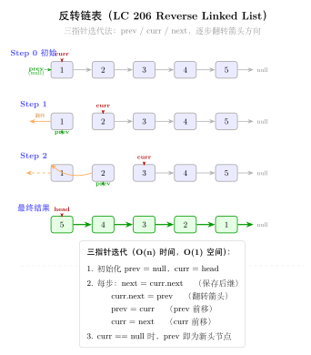
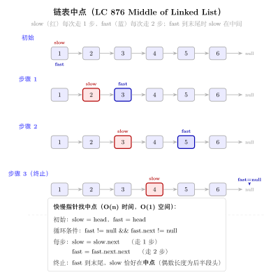
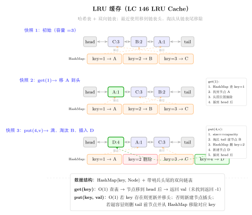

# 12 — Linked List（融合版）

> **难度**：★★★☆☆
> **题数**：11
> **核心套路**：dummy 头节点、快慢指针、迭代/递归翻转、合并、LRU 缓存
> **本文件**：覆盖 linked_list 11 题的算法套路总结 + 典型题精讲 + 自测

---

## 一例速记

> **dummy 头节点（哨兵）**：在真正的头节点前加一个值为 0 的假头 `dummy`，使"对头节点的操作"和"对中间节点的操作"写法统一，消除 null 检查（21 合并 / 82 去重 / 86 分区 / 2 两数相加）
> **快慢指针**：`slow` 每次走 1 步，`fast` 每次走 2 步（或 n 步）；用于找中点（奇数个节点 slow 停在正中，偶数个停在前半末尾）、检测环（141）、找倒数第 k 个节点（19）
> **迭代翻转**：三指针 `prev=None, cur=head`，每步 `nxt=cur.next; cur.next=prev; prev=cur; cur=nxt`（92 区间翻转 / 25 k 组翻转）
> **递归翻转**：`tail = reverse(head.next); head.next.next = head; head.next = None`，尾节点变新头（92 / 25）
> **合并**：21 两路合并 = 比较两头取小，O(m+n)；23 k 路合并 = 最小堆或分治（分治 = 两两归并，O(n log k)）
> **LRU 缓存**（146）：哈希表（key→node）+ 双向链表（按访问顺序），get/put 均 O(1)
> **AI 关联**：streaming 数据窗口 / Token 流中间层可视为带指针的链表；LRU = KV cache 逐出策略（vLLM paged attention 的核心思想）

---

## 思维路径还原

> "看到链表题 **头节点可能被修改（如删除头 / 分区 / 合并）** → 立刻加 dummy 头节点：
> `dummy = ListNode(0); dummy.next = head`，操作完返回 `dummy.next`，
> 永远不用单独处理头节点是否为 None 的情况。
>
> 看到 **'找链表中点'** → 快慢指针：`slow = fast = head`，`while fast and fast.next`，
> 循环结束时 `slow` 停在中点（奇数个节点停在正中，偶数个停在前半末）。
> 876 是纯找中点，翻转链表的第二步也用这个。
>
> 看到 **141 Linked List Cycle**（判断有环）→ 快慢指针：若有环，`fast` 终究追上 `slow`（数学上追及问题）；
> 若无环，`fast` 先到 None。时间 O(n)，空间 O(1)。
>
> 看到 **19 Remove Nth Node From End** → 快慢指针，`fast` 先走 `n` 步，
> 然后 `fast, slow` 同步走，`fast.next == None` 时 `slow` 正好在倒数第 `n+1` 个节点，
> 执行 `slow.next = slow.next.next` 删除目标。配合 dummy 处理删除头节点的情形。
>
> 看到 **翻转整个链表（206 基础题）** → 三指针迭代：`prev=None, cur=head`；
> 循环 `nxt=cur.next; cur.next=prev; prev=cur; cur=nxt`；结束时 `prev` 是新头。
>
> 看到 **92 Reverse Linked List II**（翻转 [left, right] 区间）→ 先走到 `left-1` 的位置（用 dummy 避免越界），
> 记录 `tail_of_left = cur`（翻转后它会变成区间尾），
> 对 `right - left + 1` 个节点执行内层翻转循环，最后重新接线。
>
> 看到 **25 Reverse Nodes in K-Group** → 每次取 k 个，检查剩余是否有 k 个（不足则停止），
> 翻转 k 个，接回主链，`prev` 指针移到翻转后区间的末尾（即原来的头），继续。
>
> 看到 **21 Merge Two Sorted Lists** → dummy 头 + 比较两头取小，O(m+n) 线性合并；
> 23 Merge K Sorted Lists → 最小堆（`heapq.merge` 或 `heap` 维护 k 个头）O(n log k)，
> 或分治：两两合并 log k 轮，每轮 O(n)，总 O(n log k)。
>
> 看到 **2 Add Two Numbers** → dummy 头 + 模拟逐位相加，注意进位 `carry`；
> 两条链表不等长时短的补 0；最后 `carry != 0` 时补一个新节点。
>
> 看到 **61 Rotate List** → 先算链表长度 n，`k = k % n`；尾节点接回头构成环，
> 从新头位置（倒数第 k 个的前一个）断开。快慢指针找断点。
>
> 看到 **82 Remove Duplicates from Sorted List II** → dummy + 双指针：`prev` 指向"确认非重复"的最后一个节点，
> `cur` 向前试探；若发现重复（`cur.val == cur.next.val`），跳过所有同值节点，
> 然后 `prev.next = cur.next`（跳过整个重复块）。
>
> 看到 **86 Partition List** → dummy + 两条子链：`less_dummy` 收集 `< x` 的节点，
> `greater_dummy` 收集 `>= x` 的节点，最后将 less 链的尾接到 greater 链头，
> 返回 `less_dummy.next`。
>
> 看到 **138 Copy List with Random Pointer** → 三步法：
> ①将每个节点的复制节点插到它的后面（形成 A→A'→B→B'→…）；
> ②复制 random 指针（`node.next.random = node.random.next`）；
> ③拆分两条链表，还原原链表。O(n) 时间，O(1) 额外空间（不算输出）。
> 或哈希表：`old→new` 映射，两次遍历，O(n) 空间。
>
> 看到 **146 LRU Cache** → 哈希表 `{key: node}` + 双向链表（表头=最近访问，表尾=最久未访问）；
> get：命中则移到表头，返回值；put：已存在则更新并移到表头；
> 不存在则插入表头，若超容量则删除表尾节点及其哈希表条目。"

---

## 学习目标

- 掌握 dummy 头节点技巧，能识别何时必须使用（头节点可能被删除 / 插入位置在头部）
- 熟练写快慢指针模板：找中点、找环、找倒数第 n 个
- 能徒手写链表区间翻转（迭代版）并正确接线，尤其是 92 和 25 的"接线"步骤
- 理解 23 题的两种解法（堆 vs 分治）并能分析复杂度
- 掌握 LRU Cache 的哈希表 + 双向链表设计，能在 15 分钟内手写完整实现
- 理解 138 三步法的核心思路（利用原链表结构编码 random 关系）

---

## 几何示意

### 图 链表反转（LC 206）



### 图 快慢指针找中点（LC 876）



### 图 LRU 缓存（LC 146）



---
## 抽象成方法（标准模板代码）

### ListNode 定义（所有链表题共用）

```python
from __future__ import annotations
from typing import Optional


class ListNode:
    def __init__(self, val: int = 0, next: Optional[ListNode] = None):
        self.val = val
        self.next = next
```

---

### 套路 1：dummy 头节点（哨兵）

适用题：2、19、21、82、86、92、138

```python
def dummy_head_template(head: Optional[ListNode]) -> Optional[ListNode]:
    """任何可能修改头节点的操作，先加 dummy。"""
    dummy = ListNode(0)
    dummy.next = head
    cur = dummy          # cur 从 dummy 出发，操作 cur.next
    while cur.next:
        # ... 各种操作（插入 / 删除 / 分区 / 进位）
        cur = cur.next
    return dummy.next    # 返回真正的头节点
```

> 关键：`dummy` 的 `next` 始终指向链表真实头，操作完直接返回 `dummy.next`，无需处理头节点特殊情况。

---

### 套路 2：快慢指针

适用题：141（环检测）、19（倒数第 n 个）、876（找中点，非本 category 但同模板）

```python
# 141: 判断链表是否有环
def hasCycle(head: Optional[ListNode]) -> bool:
    """时间 O(n)，空间 O(1)。快指针追上慢指针 ⟺ 有环。"""
    slow = fast = head
    while fast and fast.next:
        slow = slow.next
        fast = fast.next.next
        if slow is fast:
            return True
    return False


# 19: 删除倒数第 n 个节点（配合 dummy）
def removeNthFromEnd(head: Optional[ListNode], n: int) -> Optional[ListNode]:
    """时间 O(L)，空间 O(1)。fast 先走 n 步，然后同步走，fast.next=None 时 slow 在目标前一位。"""
    dummy = ListNode(0, head)
    fast = slow = dummy
    for _ in range(n):         # fast 先走 n 步
        fast = fast.next
    while fast.next:           # 同步走直到 fast 到达最后一个节点
        fast = fast.next
        slow = slow.next
    slow.next = slow.next.next  # 删除目标节点
    return dummy.next


# 找链表中点（通用）
def find_middle(head: Optional[ListNode]) -> Optional[ListNode]:
    """奇数个节点：slow 停在正中；偶数个节点：slow 停在前半末尾。"""
    slow = fast = head
    while fast and fast.next:
        slow = slow.next
        fast = fast.next.next
    return slow
```

---

### 套路 3：迭代翻转（标准版 + 区间版）

适用题：92（区间翻转）、25（k 组翻转）

```python
# 翻转整个链表（基础，206 题）
def reverseList(head: Optional[ListNode]) -> Optional[ListNode]:
    """时间 O(n)，空间 O(1)。三指针原地翻转。"""
    prev, cur = None, head
    while cur:
        nxt = cur.next
        cur.next = prev
        prev = cur
        cur = nxt
    return prev   # prev 是新头


# 92: 翻转 [left, right] 区间
def reverseBetween(head: Optional[ListNode], left: int, right: int) -> Optional[ListNode]:
    """时间 O(n)，空间 O(1)。dummy + 定位 + 区间翻转 + 接线。"""
    dummy = ListNode(0, head)
    pre = dummy
    for _ in range(left - 1):    # pre 走到 left-1 位置
        pre = pre.next
    # tail_of_left 翻转后会变成区间尾
    tail_of_left = pre.next
    prev, cur = None, pre.next
    for _ in range(right - left + 1):   # 翻转 right-left+1 个节点
        nxt = cur.next
        cur.next = prev
        prev = cur
        cur = nxt
    # 接线：pre → (新头=prev) → (中间) → (tail_of_left=区间尾) → cur（后续节点）
    pre.next = prev
    tail_of_left.next = cur
    return dummy.next


# 25: 每 k 个节点一组翻转
def reverseKGroup(head: Optional[ListNode], k: int) -> Optional[ListNode]:
    """时间 O(n)，空间 O(1)。每次检查剩余是否有 k 个，再原地翻转。"""
    dummy = ListNode(0, head)
    group_prev = dummy
    while True:
        # 检查剩余是否有 k 个
        kth = group_prev
        for _ in range(k):
            kth = kth.next
            if not kth:
                return dummy.next
        group_next = kth.next   # 下一组的开头
        # 翻转 [group_prev.next, kth]
        prev, cur = group_next, group_prev.next
        while cur is not group_next:
            nxt = cur.next
            cur.next = prev
            prev = cur
            cur = nxt
        # 接线
        tmp = group_prev.next   # 翻转后变成组尾（原来的组头）
        group_prev.next = kth   # group_prev → kth（翻转后的新组头）
        group_prev = tmp        # 移动 group_prev 到组尾，准备下一组
```

---

### 套路 4：递归翻转（用于 92 / 25 的递归版思路）

```python
def reverseList_recursive(head: Optional[ListNode]) -> Optional[ListNode]:
    """递归翻转整个链表。时间 O(n)，空间 O(n)（递归栈）。"""
    if not head or not head.next:
        return head
    new_head = reverseList_recursive(head.next)
    head.next.next = head    # 让 head.next（原来的下一个）反指 head
    head.next = None         # 断开原来的 head→next 指向
    return new_head
```

> 迭代版优先（O(1) 空间），递归版用于理解"翻转的递归拆解"思路。

---

### 套路 5：合并有序链表

适用题：21（两路）、23（k 路分治）

```python
from typing import Optional, List
import heapq


# 21: 合并两个有序链表
def mergeTwoLists(l1: Optional[ListNode],
                  l2: Optional[ListNode]) -> Optional[ListNode]:
    """时间 O(m+n)，空间 O(1)（不含输出）。"""
    dummy = ListNode(0)
    cur = dummy
    while l1 and l2:
        if l1.val <= l2.val:
            cur.next = l1
            l1 = l1.next
        else:
            cur.next = l2
            l2 = l2.next
        cur = cur.next
    cur.next = l1 or l2   # 把剩余那条直接接上
    return dummy.next


# 23: 合并 k 个有序链表（分治版）
def mergeKLists(lists: List[Optional[ListNode]]) -> Optional[ListNode]:
    """分治：两两合并，log k 轮，每轮 O(n)，总 O(n log k)。"""
    if not lists:
        return None
    while len(lists) > 1:
        merged = []
        for i in range(0, len(lists), 2):
            l1 = lists[i]
            l2 = lists[i + 1] if i + 1 < len(lists) else None
            merged.append(mergeTwoLists(l1, l2))
        lists = merged
    return lists[0]
```

---

### 套路 6：LRU Cache（哈希表 + 双向链表）

适用题：146

```python
class DLinkedNode:
    """双向链表节点。"""
    def __init__(self, key: int = 0, val: int = 0):
        self.key = key
        self.val = val
        self.prev: Optional[DLinkedNode] = None
        self.next: Optional[DLinkedNode] = None


class LRUCache:
    """146: LRU Cache。get / put 均 O(1)。
    数据结构：哈希表（key→node）+ 双向链表（头=最近访问，尾=最久未访问）。
    头尾各设一个哨兵节点，避免边界判断。
    """
    def __init__(self, capacity: int):
        self.cap = capacity
        self.cache: dict[int, DLinkedNode] = {}
        # 哨兵头尾
        self.head = DLinkedNode()
        self.tail = DLinkedNode()
        self.head.next = self.tail
        self.tail.prev = self.head

    # ---- 内部辅助 ----
    def _remove(self, node: DLinkedNode) -> None:
        """从双向链表中删除节点。"""
        node.prev.next = node.next
        node.next.prev = node.prev

    def _add_to_head(self, node: DLinkedNode) -> None:
        """将节点插入到哨兵头的后面（最近访问位置）。"""
        node.prev = self.head
        node.next = self.head.next
        self.head.next.prev = node
        self.head.next = node

    def _move_to_head(self, node: DLinkedNode) -> None:
        self._remove(node)
        self._add_to_head(node)

    def _remove_tail(self) -> DLinkedNode:
        """删除并返回最久未使用的节点（尾哨兵的 prev）。"""
        node = self.tail.prev
        self._remove(node)
        return node

    # ---- 公开接口 ----
    def get(self, key: int) -> int:
        if key not in self.cache:
            return -1
        node = self.cache[key]
        self._move_to_head(node)   # 访问后移到头
        return node.val

    def put(self, key: int, value: int) -> None:
        if key in self.cache:
            node = self.cache[key]
            node.val = value
            self._move_to_head(node)
        else:
            node = DLinkedNode(key, value)
            self.cache[key] = node
            self._add_to_head(node)
            if len(self.cache) > self.cap:
                tail = self._remove_tail()
                del self.cache[tail.key]   # 同步删除哈希表条目
```

---

### 套路 7：三步法复制随机指针链表

适用题：138

```python
class RandomNode:
    def __init__(self, val: int = 0,
                 next: Optional['RandomNode'] = None,
                 random: Optional['RandomNode'] = None):
        self.val = val
        self.next = next
        self.random = random


def copyRandomList(head: Optional[RandomNode]) -> Optional[RandomNode]:
    """O(n) 时间，O(1) 额外空间（不算输出）。
    步骤：
    1. 在每个节点后插入它的副本：A→A'→B→B'→...
    2. 设置副本的 random：node.next.random = node.random.next
    3. 拆分两条链表，恢复原链表。
    """
    if not head:
        return None
    # 步骤 1：插入副本节点
    cur = head
    while cur:
        copy = RandomNode(cur.val, cur.next)
        cur.next = copy
        cur = copy.next
    # 步骤 2：复制 random 指针
    cur = head
    while cur:
        if cur.random:
            cur.next.random = cur.random.next
        cur = cur.next.next
    # 步骤 3：拆分
    cur = head
    new_head = head.next
    while cur:
        copy = cur.next
        cur.next = copy.next
        if copy.next:
            copy.next = copy.next.next
        cur = cur.next
    return new_head
```

---

### 速查表

| 题型特征 | 套路 | 时间 | 空间 |
|---|---|---|---|
| 头节点可能被修改 | dummy 头节点 | O(n) | O(1) |
| 找中点 / 判环 / 倒数第 n | 快慢指针 | O(n) | O(1) |
| 翻转整段 / 区间 | 三指针迭代 | O(n) | O(1) |
| 翻转 k 组 | 迭代 + 接线 | O(n) | O(1) |
| 合并两个有序链表 | dummy + 比较取小 | O(m+n) | O(1) |
| 合并 k 个有序链表 | 分治两两归并 | O(n log k) | O(log k) |
| LRU Cache | 哈希表 + 双向链表 | O(1) | O(cap) |
| 复制带随机指针链表 | 三步法（穿插+复制+拆分） | O(n) | O(1) |

---

## 方法变形（4 类）

### 变形 1：快慢指针的扩展

- **141**（判断有环）→ **142 Linked List Cycle II**（找环的入口）：快慢指针相遇后，将 `slow` 重置到 `head`，`fast` 留在相遇点，两者同速走，再次相遇处即为环入口（Floyd 判圈定理）。
- **找中点**（876）→ 将 `fast` 初始从 `head.next` 出发，则偶数时 `slow` 停在前半末尾；用于链表中间分割。
- **倒数第 n 个**（19）→ 泛化：`fast` 先走 k 步，同步走后 `slow` 在倒数第 `k+1` 个节点，可删除 / 插入。

### 变形 2：翻转系列

- **206**（翻转整个）→ **92**（翻转区间）→ **25**（k 组翻转）：难度递进，但核心三指针翻转子程序不变；差异在"定位区间入口"和"接线"步骤。
- **234 Palindrome Linked List**（非本 category）：找中点 → 翻转后半 → 逐节点比较 → 还原后半（若需保持结构）。
- **递归翻转**：在 LeetCode 25 题中递归版比迭代版更简洁但空间 O(n/k)，面试首选迭代。

### 变形 3：合并 / 拆分

- **21**（两路合并）是 **23**（k 路合并）的基础子程序；分治时每轮调用 log k 次 21 的逻辑。
- **86 Partition List**：不是合并，而是"分裂"——将原链表按阈值分成两条，再拼接；与合并逻辑对称。
- **82 Remove Duplicates II**：去掉所有出现过重复的节点（不保留任何一个）；区别于 83（保留一个）。

### 变形 4：LRU 扩展到 LFU

- **146 LRU**：双向链表按"最近访问时间"排序 → 逐出最旧的。
- **460 LFU Cache**（非本 category）：按"访问频率"排序，同频率按 LRU 规则；用两个哈希表（`key→node` 和 `freq→有序链表`）+ 维护 `min_freq` 变量，get/put 仍 O(1)。
- **AI 场景**：vLLM 的 Paged Attention 用 LRU 决定 KV Cache 的 page 逐出；Transformer 推理的 KV cache 管理本质是 LRU/LFU 变体。

---

## 思考路标（条件反射）

1. 看到 **"head 可能被删除 / 插入在最前面"** → 立刻加 dummy，返回 `dummy.next`
2. 看到 **"找中点 / 判环 / 倒数第 k 个"** → 快慢指针，fast 走 2 步 slow 走 1 步
3. 看到 **"翻转 / reverse"** → 三指针迭代：`prev, cur = None, head`；循环 `nxt=cur.next; cur.next=prev; prev=cur; cur=nxt`
4. 看到 **"区间翻转 [l, r]"** → 先定位到 l-1（用 dummy），记录区间两端，翻转后重新接线（4 根指针）
5. 看到 **"每 k 个翻转"** → 先检查剩余够不够 k 个，不够则停止；再翻转，再移动 group_prev
6. 看到 **"合并 k 个有序链表"** → 分治（两两合并）O(n log k)，优于朴素 O(nk)
7. 看到 **"O(1) get/put 缓存 + 最近最少使用"** → LRU：哈希表 + 双向链表 + 头尾哨兵
8. 看到 **"复制带 random 指针"** → 三步法：穿插副本 → 复制 random → 拆分（O(1) 空间）；或哈希表（O(n) 空间）
9. 看到 **"两数相加 / 进位"** → dummy 头 + 逐位相加 carry，最后检查 `carry != 0` 是否需加节点
10. 看到 **"旋转链表 k 位"** → 计算长度 n，k %= n；接尾到头成环，从 n-k 处断开

---

## 易错点

1. **快慢指针的初始化**：`slow = fast = head` 还是 `slow = head; fast = head.next`？偶数节点找"前半末"用后者，找"后半头"用前者。统一格式：`while fast and fast.next` 是安全写法。
2. **区间翻转接线顺序**（92）：翻转后原头变成区间尾（`tail_of_left`），必须先 `pre.next = prev`（接新头），再 `tail_of_left.next = cur`（接后续）；顺序反了会成环或断链。
3. **25 题检查够不够 k 个**：`kth` 走 k 步若遇到 `None` 则直接 `return dummy.next`，不要翻转残余。
4. **LRU 删除节点忘记同步哈希表**：`_remove_tail()` 删链表节点后，必须 `del self.cache[tail.key]`，否则哈希表和链表不一致。
5. **138 拆分步骤的顺序**：拆分时先处理 `cur.next = copy.next`（恢复原链表），再处理 `copy.next = copy.next.next`（提取副本链），不能颠倒，否则 `copy.next` 丢失。
6. **82 去重 II 漏掉末尾重复块**：用 `while cur.next and cur.val == cur.next.val` 跳过重复，循环结束后 `prev.next = cur.next`（跳过 cur 本身），不是 `prev.next = cur`。
7. **2 题进位在最终节点**：两条链表都遍历完后，若 `carry == 1` 需再 `append(ListNode(1))`，常见漏写。
8. **61 旋转 k 步取模**：`k = k % n`；若 `k == 0` 可提前返回 head；`n` 要先遍历一次链表计算，并记住尾节点以便构成环。

---

## 典型应用例题

### 例 1：92. Reverse Linked List II

**题目**：翻转链表从位置 left 到 right 的节点（1-indexed）。

**思路**：加 dummy 头，先走 `left-1` 步到达区间前驱节点 `pre`；记录 `tail_of_left = pre.next`（翻转后它会成为区间尾），然后对 `right - left + 1` 个节点执行标准三指针翻转；最后 `pre.next = prev`（接新头），`tail_of_left.next = cur`（接后续）。

**解**：

```python
# 参考：solutions/linked_list/p092_reverse_linked_list_ii.py
def reverseBetween(head: Optional[ListNode], left: int, right: int) -> Optional[ListNode]:
    dummy = ListNode(0, head)
    pre = dummy
    for _ in range(left - 1):
        pre = pre.next
    tail_of_left = pre.next
    prev, cur = None, pre.next
    for _ in range(right - left + 1):
        nxt = cur.next
        cur.next = prev
        prev = cur
        cur = nxt
    pre.next = prev
    tail_of_left.next = cur
    return dummy.next
```

**分析**：$O(n)$ 时间，$O(1)$ 空间。`pre` 走 left-1 步 + 翻转 right-left+1 步 = 最多 right 步，且每个节点只访问一次。

---

### 例 2：146. LRU Cache

**题目**：设计 LRU 缓存，容量为 capacity，get/put 均要求 O(1)。

**思路**：O(1) get → 哈希表。O(1) 维护访问顺序 + O(1) 逐出最旧 → 双向链表（插头删尾 O(1)）。两者结合：哈希表存 key→node，双向链表保持访问顺序。头尾各设哨兵节点，省去边界判断。

**解**：见模板代码"套路 6 LRU Cache"。

**分析**：get/put 均 $O(1)$（哈希表查找 + 双向链表插入/删除，均 $O(1)$）；空间 $O(\text{capacity})$（链表 + 哈希表各存至多 capacity 个节点）。

---

### 例 3：25. Reverse Nodes in K-Group

**题目**：每 k 个节点一组翻转链表，不足 k 个的末尾部分保留原顺序。

**思路**：外层循环：每次先探查剩余是否有 k 个（走 k 步，碰到 None 就停），若有则翻转这 k 个，将 group_prev 移到组尾（原来的组头，翻转后变组尾），循环继续。翻转的核心是标准三指针，只是把"下一组的开头"作为 prev 的初始值，这样翻转结束后新组尾自然指向了下一组。

**解**：见模板代码"套路 3 迭代翻转 — reverseKGroup"。

**分析**：每个节点被访问常数次（一次探查，一次翻转），总 $O(n)$；空间 $O(1)$（只用固定数量指针变量）。

---

## 自测题

**自测 1**（141 Linked List Cycle）—— `head=[3,2,0,-4], pos=1`（尾节点连接到 index 1）返回 True；`head=[1], pos=-1` 返回 False。提示：`slow=fast=head`，`while fast and fast.next`，`slow=slow.next; fast=fast.next.next`，若 `slow is fast` 返回 True。参考 `solutions/linked_list/p141_linked_list_cycle.py`。

**自测 2**（19 Remove Nth Node From End）—— `head=[1,2,3,4,5], n=2` 返回 `[1,2,3,5]`；`head=[1], n=1` 返回 `[]`。提示：dummy + fast 先走 n 步，slow=dummy，同步走到 fast.next=None，slow.next=slow.next.next。参考 `solutions/linked_list/p019_remove_nth_node_from_end_of_list.py`。

**自测 3**（21 Merge Two Sorted Lists）—— `l1=[1,2,4], l2=[1,3,4]` 返回 `[1,1,2,3,4,4]`。提示：dummy + cur，while l1 and l2 取小者接上，循环后 `cur.next = l1 or l2`。参考 `solutions/linked_list/p021_merge_two_sorted_lists.py`。

**自测 4**（146 LRU Cache）—— `capacity=2`，put(1,1)、put(2,2)、get(1)=1、put(3,3)（逐出 key=2）、get(2)=-1、get(3)=3。提示：哈希表 + 双向链表 + 头尾哨兵；get/put 每次移到头；超容量时删尾。参考 `solutions/linked_list/p146_lru_cache.py`。

**自测 5**（92 Reverse Linked List II）—— `head=[1,2,3,4,5], left=2, right=4` 返回 `[1,4,3,2,5]`。提示：dummy + pre 走 left-1 步，记 tail_of_left=pre.next，翻转 right-left+1 个，pre.next=prev，tail_of_left.next=cur。参考 `solutions/linked_list/p092_reverse_linked_list_ii.py`。

---

## 题目全览（11 题）

| # | 题目 | 套路分类 | 难度 |
|---|---|---|---|
| 2 | Add Two Numbers | dummy + 逐位进位 | Medium |
| 19 | Remove Nth Node From End of List | 快慢指针 + dummy | Medium |
| 21 | Merge Two Sorted Lists | dummy + 两路合并 | Easy |
| 25 | Reverse Nodes in K-Group | 迭代翻转 + 接线 | Hard |
| 61 | Rotate List | 成环 + 快慢/计数断点 | Medium |
| 82 | Remove Duplicates from Sorted List II | dummy + 跳过重复块 | Medium |
| 86 | Partition List | dummy + 两路分裂拼接 | Medium |
| 92 | Reverse Linked List II | dummy + 区间翻转 | Medium |
| 138 | Copy List with Random Pointer | 三步法（穿插+复制+拆分）| Medium |
| 141 | Linked List Cycle | 快慢指针判环 | Easy |
| 146 | LRU Cache | 哈希表 + 双向链表 | Medium |

---

## 融合版说明

| 段 | 来源 | 价值 |
|---|---|---|
| 一例速记 | 本文件 | 5 大套路一览 + AI 场景关联 |
| 思维路径还原 | 本文件 | 11 道题的解题内心独白，含指针操作决策 |
| 抽象成方法 | 本文件 | 7 个标准模板（dummy/快慢/翻转/递归翻转/合并/LRU/三步法）+ 速查表 |
| 方法变形 | 本文件 | 4 类变体（快慢指针/翻转/合并拆分/LRU→LFU） |
| 思考路标 | 本文件 | 10 条题型识别条件反射，含 AI/ML 场景 |
| 易错点 | 本文件 | 8 条高频踩坑（接线顺序/哈希表同步/拆分顺序等） |
| 典型应用例题 | solutions/ | 3 道精讲（92、146、25），代码 + 正确性分析 |
| 自测题 | leetcode | 5 题带提示，链接 solutions 文件 |
| 题目全览 | 本文件 | 11 题完整列表，套路分类一览 |

---

> **跨 category 导航**：
> - 快慢指针的"找中点"在 234（Palindrome Linked List）中配合翻转使用 → 见本文件套路 2+3
> - 双向链表是 LRU 的底层结构；堆（minheap）是 23 题的另一种实现 → 见 `10-heap.md`（若有）
> - 递归翻转的空间复杂度 O(n) 与 DFS 递归栈同理 → 见 `07-binary-tree-dfs.md`
> - LRU/LFU 是 AI 推理引擎（vLLM、FlashAttention）KV Cache 管理的核心机制
