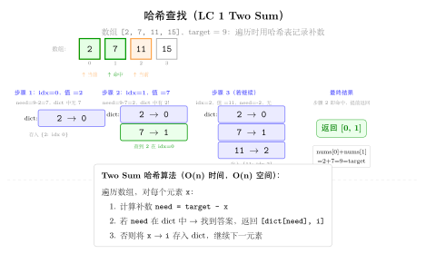
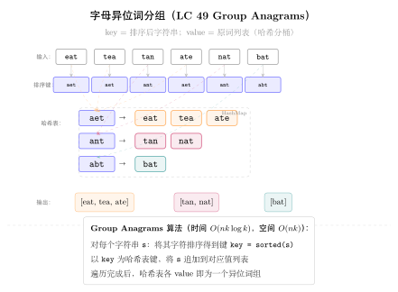

# 14 — Hash Table（融合版）

> **难度**：★★☆☆☆
> **题数**：9
> **核心套路**：两数之和模式、频次计数、滑窗哈希、集合去重 / 路径检测
> **本文件**：覆盖 hash_table 9 题的算法套路总结 + 典型题精讲 + 自测

---

## 一例速记

> **两数之和模式**：哈希表存"已见过的值 → 下标"，遍历时检查 `target - x` 是否在表中，一次扫描完成配对（1）
> **频次计数**：`Counter` 或 `defaultdict(int)` 统计字符/元素出现次数，然后比较两份计数表（242 / 383 / 49 / 205 / 290）
> **字符 26 桶**：全小写字母可用长度 26 的 `list` 代替哈希表，以 `tuple(bucket)` 作为 key（49 group anagrams）
> **滑动窗口 + 哈希 O(1) 查找**：在窗口内维护一个集合 / 字典，检查重复时 O(1)（219）
> **集合去重**：用 `set` 检查"序列的起始点"，避免重复展开，将 O(n²) 降到 O(n)（128）
> **快慢指针 / 集合检环**：判断数列是否进入循环，集合记录已出现的状态（202）
> **双射映射**：双向字典确保一一对应，双向约束必须同时检查（205 同构字符串 / 290 单词模式）
> **AI 关联**：feature hashing（ML 特征降维）/ Bloom Filter（近似集合查询，Redis / 推荐系统去重）/ 词频 TF-IDF

---

## 思维路径还原

> "看到 **'两数之和 / 配对'** → 立刻想哈希表：`seen = {}`，遍历时先查 `target - x` 是否在 seen 里，
> 在则返回 `[seen[target - x], i]`，不在则 `seen[x] = i`。
> 一次扫描，时间 O(n)，空间 O(n)（1 Two Sum）。
>
> 看到 **'判断两个字符串互为 anagram'** → 频次计数：
> `Counter(s) == Counter(t)` 一行搞定（Python 内置）。
> 若不让用库，用长度 26 的 bucket，遍历 s 时 +1，遍历 t 时 -1，最终全零则是 anagram（242）。
>
> 看到 **'Ransom Note'（383）**→ 同频次计数，但方向是单向检测：
> 统计 magazine 的字符频次，然后检查 ransomNote 的每个字符是否都能从 magazine 中"借"到，
> 缺一个字符就返回 False，不需要 Counter 比较。
>
> 看到 **'Group Anagrams'（49）** → 分组：用排序后的字符串或 26-bucket tuple 作 key，
> 相同 key 的字符串归为一组。`defaultdict(list)`，遍历一次，O(n·m log m)（m 为最长串长度）。
>
> 看到 **'同构字符串'（205）** → 双射映射：`s→t` 和 `t→s` 两个字典同时维护，
> 遇到冲突（`s[i]` 已映射到不同的 `t[i]`，或反之）则返回 False。
> 仅单向映射会漏掉 `'ab'/'aa'` 这类反向不一致的情况。
>
> 看到 **'Word Pattern'（290）** → 与 205 几乎完全相同：pattern 字符 ↔ word 双射，
> 用同样的双向字典模板即可，同构字符串的直接复用。
>
> 看到 **'Contains Duplicate II'（219）** → 滑动窗口 + 哈希：
> 维护一个最多 k+1 大小的窗口集合 `window`；遍历时，若 `nums[i]` 在 window 里则找到了距离 ≤ k 的重复，
> 否则将 `nums[i]` 加入 window；若 window 大于 k 则删掉 `nums[i-k]`。O(n) 时间，O(k) 空间。
>
> 看到 **'Happy Number'（202）** → 集合检环：计算平方和序列，用 set 记录已出现的值，
> 若出现重复则说明进入了循环（不会到 1），返回 False；若值变为 1 则返回 True。
> 等价写法：快慢指针（Floyd 判环），慢指针每次算一步，快指针每次算两步，相遇则有环。
>
> 看到 **'Longest Consecutive Sequence'（128）** → 先 O(n) 建 `num_set = set(nums)`，
> 然后遍历 nums，只对"序列起始点"（`num - 1` 不在 set 里的数）展开计数，
> 每次从起始点向后累加连续整数个数，总体 O(n)（每个数最多被访问两次）。"

---

## 学习目标

- 掌握两数之和模式：哈希表 "以空间换时间"，将配对检测从 O(n²) 降到 O(n)
- 熟练用 `Counter` / `defaultdict` / 26-bucket 做频次统计并比较
- 理解"双射映射"约束：同构 / 单词模式需要双向字典，单向不够
- 滑动窗口 + 哈希：维护固定大小的窗口集合，O(1) 查重
- 集合检环（202）与快慢指针检环的等价性
- 128 题的"只从起始点出发"剪枝，将朴素 O(n²) 降到 O(n)

---

## 几何示意

### 图 哈希查找（LC 1 Two Sum）



### 图 哈希分组（LC 49 Group Anagrams）



---
## 抽象成方法（标准模板代码）

### 套路 1：两数之和模式

适用题：1

```python
from typing import List


def twoSum(nums: List[int], target: int) -> List[int]:
    """时间 O(n)，空间 O(n)。一次扫描，哈希表记录已见值→下标。"""
    seen: dict[int, int] = {}   # value -> index
    for i, x in enumerate(nums):
        complement = target - x
        if complement in seen:
            return [seen[complement], i]
        seen[x] = i
    return []   # 题目保证有解，不会到这里
```

> 核心思路：`target - x` 是配对数，若它已在表中则直接返回，否则先记录当前值再继续。
> 无需排序，无需双重循环，一次线性扫描完成。

---

### 套路 2：频次计数（Counter / 26-bucket）

适用题：242、383、49

```python
from collections import Counter, defaultdict


# 242: 判断两个字符串是否互为 anagram
def isAnagram(s: str, t: str) -> bool:
    """时间 O(n)，空间 O(1)（字符集固定为 26 个字母）。"""
    return Counter(s) == Counter(t)


# 242 手写版（面试偶尔要求不用 Counter）
def isAnagram_manual(s: str, t: str) -> bool:
    if len(s) != len(t):
        return False
    bucket = [0] * 26
    for c in s:
        bucket[ord(c) - ord('a')] += 1
    for c in t:
        bucket[ord(c) - ord('a')] -= 1
    return all(x == 0 for x in bucket)


# 383: 判断 ransomNote 能否由 magazine 中的字母构成
def canConstruct(ransomNote: str, magazine: str) -> bool:
    """时间 O(n+m)，空间 O(1)（26个字母）。"""
    mag_count = Counter(magazine)
    for c in ransomNote:
        mag_count[c] -= 1
        if mag_count[c] < 0:
            return False
    return True


# 49: 将字符串数组按 anagram 分组
def groupAnagrams(strs: List[str]) -> List[List[str]]:
    """时间 O(n·m log m)，空间 O(n·m)。排序后的字符串作 key。"""
    groups: dict[str, List[str]] = defaultdict(list)
    for s in strs:
        key = ''.join(sorted(s))   # 排序后作为分组 key
        groups[key].append(s)
    return list(groups.values())


# 49 桶版（不排序，O(n·m)）
def groupAnagrams_bucket(strs: List[str]) -> List[List[str]]:
    """时间 O(n·m)，空间 O(n·m)。26-bucket tuple 作 key，无需排序。"""
    groups: dict[tuple, List[str]] = defaultdict(list)
    for s in strs:
        bucket = [0] * 26
        for c in s:
            bucket[ord(c) - ord('a')] += 1
        groups[tuple(bucket)].append(s)
    return list(groups.values())
```

---

### 套路 3：双射映射（同构 / 单词模式）

适用题：205、290

```python
# 205: 判断两个字符串是否同构
def isIsomorphic(s: str, t: str) -> bool:
    """双向映射，时间 O(n)，空间 O(n)。"""
    s2t: dict[str, str] = {}
    t2s: dict[str, str] = {}
    for cs, ct in zip(s, t):
        if cs in s2t and s2t[cs] != ct:
            return False
        if ct in t2s and t2s[ct] != cs:
            return False
        s2t[cs] = ct
        t2s[ct] = cs
    return True


# 290: 判断 pattern 和 s 是否符合相同的单词模式
def wordPattern(pattern: str, s: str) -> bool:
    """与 isIsomorphic 几乎完全相同，单位从字符变为单词。"""
    words = s.split()
    if len(pattern) != len(words):
        return False
    p2w: dict[str, str] = {}
    w2p: dict[str, str] = {}
    for p, w in zip(pattern, words):
        if p in p2w and p2w[p] != w:
            return False
        if w in w2p and w2p[w] != p:
            return False
        p2w[p] = w
        w2p[w] = p
    return True
```

> 关键：为什么要双向？若只维护 `s→t`，`'ab'/'aa'` 中 `a→a, b→a` 不会报错（两个字符映射到同一目标），
> 但实际上 b 和 a 应该映射到不同字符。双向约束确保"一一对应"（双射）。

---

### 套路 4：滑动窗口哈希（固定大小窗口查重）

适用题：219

```python
def containsNearbyDuplicate(nums: List[int], k: int) -> bool:
    """时间 O(n)，空间 O(k)。维护大小 ≤ k+1 的滑动窗口集合。"""
    window: set[int] = set()
    for i, x in enumerate(nums):
        if x in window:
            return True
        window.add(x)
        if len(window) > k:        # 窗口超过 k 时，删掉最旧的元素
            window.discard(nums[i - k])
    return False
```

> 窗口维护不变式：`window` 里恰好是 `nums[max(0, i-k)..i-1]` 的值集合，
> 检查 `nums[i]` 是否在其中即可判断距离 ≤ k 的重复。

---

### 套路 5：集合检环（Happy Number）

适用题：202

```python
def isHappy(n: int) -> bool:
    """时间 O(log n) 均摊，空间 O(log n)。集合记录已出现的值检测循环。"""
    def next_val(x: int) -> int:
        total = 0
        while x:
            x, d = divmod(x, 10)
            total += d * d
        return total

    seen: set[int] = set()
    while n != 1:
        if n in seen:
            return False    # 出现循环，永远不会到 1
        seen.add(n)
        n = next_val(n)
    return True


# 等价：快慢指针版（Floyd 判环，空间 O(1)）
def isHappy_floyd(n: int) -> bool:
    def next_val(x: int) -> int:
        total = 0
        while x:
            x, d = divmod(x, 10)
            total += d * d
        return total

    slow, fast = n, next_val(n)
    while fast != 1 and slow != fast:
        slow = next_val(slow)
        fast = next_val(next_val(fast))
    return fast == 1
```

---

### 套路 6：集合去重 + 起始点剪枝（最长连续序列）

适用题：128

```python
def longestConsecutive(nums: List[int]) -> int:
    """时间 O(n)，空间 O(n)。只从序列起点出发展开，避免重复。"""
    num_set = set(nums)
    best = 0
    for x in num_set:
        if x - 1 not in num_set:       # x 是某条连续序列的起始点
            length = 1
            while x + length in num_set:
                length += 1
            best = max(best, length)
    return best
```

> 剪枝关键：`if x - 1 not in num_set` 确保只从"起始点"出发，
> 每个数至多被访问两次（一次判断是否起始点，一次在 while 里计数），总体 O(n)。

---

### 速查表

| 题型特征 | 套路 | 时间 | 空间 |
|---|---|---|---|
| 两数之和 / 配对 | 哈希表 seen{value→index} | O(n) | O(n) |
| 字符频次比较 | Counter / 26-bucket | O(n) | O(1) |
| 字母构成判断（单向） | Counter 相减检负 | O(n+m) | O(1) |
| 分组（anagram 分组） | 排序/桶 key + defaultdict | O(nm log m) | O(nm) |
| 同构 / 单词模式 | 双向字典双射 | O(n) | O(n) |
| 距离 k 内重复 | 滑动窗口 set | O(n) | O(k) |
| 序列是否进入循环 | 集合记录已见 / 快慢指针 | O(log n) | O(log n)/O(1) |
| 最长连续序列 | set + 起始点剪枝 | O(n) | O(n) |

---

## 方法变形（4 类）

### 变形 1：两数之和系列

- **1**（Two Sum）→ 哈希表一次扫描，O(n)。
- **167**（Two Sum II，有序数组）→ 双指针对撞，O(n)，O(1) 空间（无需哈希表）。
- **15**（3Sum）→ 排序 + 对每个元素用双指针，O(n²)；去重需跳过相同值。
- **18**（4Sum）→ 3Sum 外再套一层循环，O(n³)；均可用哈希表减一层到 O(n²)。
- 模式识别：若数组**已排序** → 优先双指针；若**未排序** → 哈希表。

### 变形 2：频次计数扩展

- **242**（anagram 判断）→ **49**（anagram 分组）→ **438**（Find All Anagrams in a String，滑窗 + 频次计数）。
- **383**（Ransom Note）→ **76**（Minimum Window Substring，滑窗 + 频次 + 双指针）。
- 26-bucket tuple 作 key 的 O(nm) 方案在字符集固定时比排序 O(nm log m) 更优。

### 变形 3：双射映射扩展

- **205**（Isomorphic Strings）≡ **290**（Word Pattern）：两题解法框架完全相同，仅"单位"不同（字符 vs 单词）。
- 进阶：**726**（Number of Atoms）— 嵌套字符串解析，哈希表统计原子数量，用栈处理括号。
- 双射约束失败场景速记：`'ab'/'aa'`（a→a 且 b→a，反向 a 对应了两个）；`'aa'/'ab'`（a 对应了两个不同字符）。

### 变形 4：图 / 路径中的哈希去重

- **128**（最长连续序列）→ `set` + 起始点剪枝，等价于在图中找最长链而不重复访问节点。
- **202**（Happy Number）→ 功能序列中的环检测，等同于链表判环（Floyd / 集合）。
- **684**（Redundant Connection）→ Union-Find（并查集），哈希表也可记录父节点，但 UF 更优。
- AI 场景：**Bloom Filter** = 多个哈希函数 + bit array，近似实现集合查询，假阳性率可调；用于 Redis 缓存穿透防护、推荐去重。

---

## 思考路标（条件反射）

1. 看到 **"two sum / 配对 / target"** → 哈希表 `seen`，一次扫描，O(n)
2. 看到 **"anagram / 字母重排"** → `Counter` 比较 或 26-bucket
3. 看到 **"group / 分组"** → `defaultdict(list)` + 排序/桶 key
4. 看到 **"同构 / 映射 / 模式匹配"** → 双向字典，两个方向同时检查
5. 看到 **"距离 k 内重复"** → 滑动窗口 `set`，大小 k+1
6. 看到 **"序列是否循环 / 无限循环"** → `seen` 集合 或 Floyd 快慢指针
7. 看到 **"最长连续序列 O(n)"** → `set` + 只从起始点出发展开
8. 看到 **"构成 / 组成 / 字符够不够"** → `Counter` 单向，相减看负
9. 看到 **"字符集为小写字母"** → 考虑 26-bucket 数组替代哈希表，常数更小
10. 看到 **"一一对应 / bijection"** → 双向字典，单向不够

---

## 易错点

1. **两数之和先查后记**：要先检查 `target - x` 是否在 `seen` 里，再把 `x` 加入 `seen`；顺序反了会让 `x` 匹配自身（如 target=6, x=3 时 `3+3=6` 会误返回同一下标两次）。
2. **205 / 290 仅单向映射**：只维护 `s→t` 会漏掉 `'ab'/'aa'` 这类场景（b 和 a 同时映射到 a，违反双射但单向不报错）；必须同时维护 `t→s`。
3. **219 窗口删除时机**：先检查 `x in window`，再加入，最后判断窗口是否超过 k 时删 `nums[i-k]`；顺序混乱会导致误判。
4. **128 遍历 `num_set` 而非 `nums`**：若遍历 `nums` 且有重复元素，仍然正确，但遍历 `num_set` 避免对同一起点多次计数（如 `[0,0,1,2]` 中 0 出现两次，仅需展开一次）。
5. **49 用可变对象作 key**：`list` 不可哈希，必须转成 `tuple(bucket)` 才能作 dict key；排序版用 `''.join(sorted(s))` 得到字符串 key，均可。
6. **202 循环的数不一定立刻变大**：不要以为"数变小就会到1"，实际上会在某个小的循环中来回（如 4→16→37→58→89→145→42→20→4），必须用 set 或快慢指针检环。
7. **383 反向不成立**：canConstruct 是"ransomNote 能否由 magazine 构成"，方向是 magazine 够不够，不要写成比较两者计数相等。
8. **双射与等价类区分**：同构字符串 / 单词模式要求双射（一一对应），而 anagram 要求等价类（相同字母集）；两者解法不同，不要混用。

---

## 典型应用例题

### 例 1：1. Two Sum

**题目**：给定整数数组 `nums` 和目标值 `target`，返回两个下标使 `nums[i] + nums[j] == target`（`i != j`）。

**思路**：哈希表 `seen = {value: index}`，遍历时先查 `target - x` 是否已见过，是则返回；否则记录当前值。一次扫描，O(n)。

**解**：

```python
# 参考：solutions/hash_table/p001_two_sum.py
def twoSum(nums: List[int], target: int) -> List[int]:
    seen: dict[int, int] = {}
    for i, x in enumerate(nums):
        if target - x in seen:
            return [seen[target - x], i]
        seen[x] = i
    return []
```

**分析**：每个元素最多访问一次，哈希表查找/插入 O(1)，总体 $O(n)$ 时间，$O(n)$ 空间。若改为暴力双重循环则 $O(n^2)$，哈希表以空间换时间。

---

### 例 2：49. Group Anagrams

**题目**：给定字符串数组 `strs`，将互为 anagram 的字符串分到同一组，返回所有组。

**思路**：anagram 的充要条件是"字符频次完全相同"。对每个字符串，计算其频次特征（排序后的字符串或 26-bucket tuple）作为 key，`defaultdict(list)` 按 key 收集。

**解**：

```python
# 参考：solutions/hash_table/p049_group_anagrams.py
def groupAnagrams(strs: List[str]) -> List[List[str]]:
    groups: dict[str, List[str]] = defaultdict(list)
    for s in strs:
        key = ''.join(sorted(s))
        groups[key].append(s)
    return list(groups.values())
```

**分析**：设 n 为字符串数量，m 为最长字符串长度。排序版 $O(nm \log m)$；桶版 $O(nm)$（26 个桶，内层循环 m 次），空间均 $O(nm)$。

---

### 例 3：128. Longest Consecutive Sequence

**题目**：给定未排序的整数数组，找到最长连续整数序列的长度，要求 O(n) 时间。

**思路**：先建 `num_set = set(nums)`，O(n)。遍历时，只对"起始点"（`x-1` 不在 set 里）展开计数，避免重复。每个数最多被访问两次，总体 O(n)。

**解**：

```python
# 参考：solutions/hash_table/p128_longest_consecutive_sequence.py
def longestConsecutive(nums: List[int]) -> int:
    num_set = set(nums)
    best = 0
    for x in num_set:
        if x - 1 not in num_set:
            length = 1
            while x + length in num_set:
                length += 1
            best = max(best, length)
    return best
```

**分析**：外层循环遍历 set 中每个数，内层 while 只在起始点触发，所有 while 循环的总步数等于所有连续序列长度之和，即 O(n)。若用排序则 O(n log n)，不满足题意。

---

## 自测题

**自测 1**（1 Two Sum）—— `nums=[2,7,11,15], target=9` 返回 `[0,1]`；`nums=[3,2,4], target=6` 返回 `[1,2]`。提示：`seen = {}`，遍历时查 `target - x` 是否在 seen 里，在则返回，否则 `seen[x] = i`。参考 `solutions/hash_table/p001_two_sum.py`。

**自测 2**（242 Valid Anagram）—— `s='anagram', t='nagaram'` 返回 True；`s='rat', t='car'` 返回 False。提示：`Counter(s) == Counter(t)` 或 26-bucket 两次遍历，s 时 +1，t 时 -1，全零则 True。参考 `solutions/hash_table/p242_valid_anagram.py`。

**自测 3**（49 Group Anagrams）—— `strs=['eat','tea','tan','ate','nat','bat']` 返回 `[['eat','tea','ate'],['tan','nat'],['bat']]`（顺序不限）。提示：`defaultdict(list)`，key 为 `''.join(sorted(s))`，遍历一次，返回 `list(groups.values())`。参考 `solutions/hash_table/p049_group_anagrams.py`。

**自测 4**（205 Isomorphic Strings）—— `s='egg', t='add'` 返回 True；`s='foo', t='bar'` 返回 False；`s='paper', t='title'` 返回 True。提示：双向字典 `s2t, t2s`，zip 遍历，遇到冲突即 False。参考 `solutions/hash_table/p205_isomorphic_strings.py`。

**自测 5**（219 Contains Duplicate II）—— `nums=[1,2,3,1], k=3` 返回 True；`nums=[1,0,1,1], k=1` 返回 True；`nums=[1,2,3,1,2,3], k=2` 返回 False。提示：滑动窗口 `set`，窗口大小 ≤ k，加入前先查，超 k 后删 `nums[i-k]`。参考 `solutions/hash_table/p219_contains_duplicate_ii.py`。

**自测 6**（202 Happy Number）—— `n=19` 返回 True（19→82→68→100→1）；`n=2` 返回 False（进入循环）。提示：`seen = set()`，while n != 1 时检查是否在 seen 里，在则 False；或快慢指针版。参考 `solutions/hash_table/p202_happy_number.py`。

**自测 7**（290 Word Pattern）—— `pattern='abba', s='dog cat cat dog'` 返回 True；`pattern='abba', s='dog cat cat fish'` 返回 False；`pattern='aaaa', s='dog cat cat dog'` 返回 False。提示：与 205 同构，双向字典 `p2w, w2p`，split 后 zip 遍历。参考 `solutions/hash_table/p290_word_pattern.py`。

---

## 题目全览（9 题）

| # | 题目 | 套路分类 | 难度 |
|---|---|---|---|
| 1 | Two Sum | 哈希表 seen{值→下标} | Easy |
| 49 | Group Anagrams | 频次 key + defaultdict 分组 | Medium |
| 128 | Longest Consecutive Sequence | set + 起始点剪枝 | Medium |
| 202 | Happy Number | 集合检环 / 快慢指针 | Easy |
| 205 | Isomorphic Strings | 双向字典双射 | Easy |
| 219 | Contains Duplicate II | 滑动窗口 set | Easy |
| 242 | Valid Anagram | Counter / 26-bucket 频次比较 | Easy |
| 290 | Word Pattern | 双向字典双射（同 205） | Easy |
| 383 | Ransom Note | Counter 单向检负 | Easy |

---

## 融合版说明

| 段 | 来源 | 价值 |
|---|---|---|
| 一例速记 | 本文件 | 4 大套路一览 + AI 场景关联（feature hashing / Bloom Filter） |
| 思维路径还原 | 本文件 | 9 道题的解题内心独白，含关键判断点 |
| 抽象成方法 | 本文件 | 6 个标准模板（两数和/频次/双射/滑窗/检环/起始点剪枝）+ 速查表 |
| 方法变形 | 本文件 | 4 类变体（两数和系列/频次扩展/双射扩展/图路径去重） |
| 思考路标 | 本文件 | 10 条题型识别条件反射 |
| 易错点 | 本文件 | 8 条高频踩坑（先查后记/单向映射/双射混淆等） |
| 典型应用例题 | solutions/ | 3 道精讲（1、49、128），代码 + 复杂度分析 |
| 自测题 | leetcode | 7 题带提示，链接 solutions 文件 |
| 题目全览 | 本文件 | 9 题完整列表，套路分类一览 |

---

> **跨 category 导航**：
> - Two Sum 在数组已排序时优先用双指针（见 `02-two-pointers.md`）
> - 字符频次滑窗 → 见 `03-sliding-window.md`（76 Minimum Window Substring）
> - 集合检环 = 链表判环的函数式版本 → 见 `12-linked-list.md` 快慢指针套路
> - Bloom Filter 的多哈希设计在 AI 推理引擎的 KV Cache 去重中广泛使用
