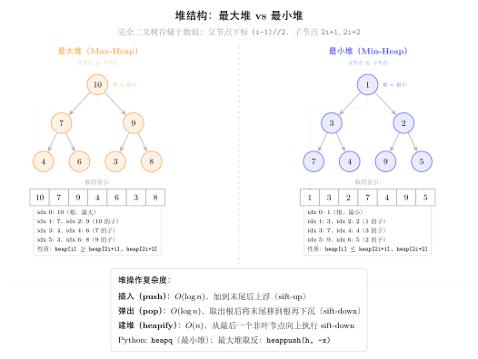
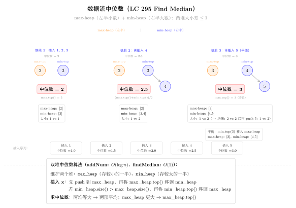

# 16 — Heap（融合版）

> **难度**：★★★☆☆
> **题数**：4
> **核心套路**：Top-K（最小堆选 k 大）、双堆（中位数）、k 路合并、贪心 + 双堆
> **本文件**：覆盖 heap 4 题的算法套路总结 + 典型题精讲 + 自测

---

## 一例速记

> **Python 堆全是最小堆**：`heapq` 只提供最小堆；模拟最大堆需存负值（`-x`），取出时再取反
> **Top-K 最大**：维护大小为 k 的**最小堆**，遍历时若新元素 > 堆顶则替换；堆顶即第 k 大元素（215）
> **Top-K 最小**：直接 `heapq.nsmallest(k, nums)` 或维护大小为 k 的**最大堆**（存负值）
> **双堆中位数**：`lo`（最大堆，存负值，保存较小一半）+ `hi`（最小堆，保存较大一半），平衡两堆大小（295）
> **k 路合并**：最小堆保存 k 个候选（值、来源列表索引、在该列表中的位置），每次弹出最小后推入其下一个候选（373）
> **贪心 + 双堆（IPO）**：先按 capital 排序，动态将"资本够用"的项目 profit 推入最大堆，每次选堆顶最大利润（502）
> **AI 关联**：beam search（维护大小为 k 的候选集）/ 优先级调度（任务队列）/ Top-K 采样（LLM 解码策略）

---

## 思维路径还原

> "看到 **'第 k 大元素'（215）** → 最小堆，大小维护为 k：
> `heap = nums[:k]; heapq.heapify(heap)`，
> 遍历 `nums[k:]` 时，若 `x > heap[0]`，则 `heapq.heapreplace(heap, x)`（弹出堆顶并推入 x）；
> 遍历结束后 `heap[0]` 即第 k 大元素。时间 O(n log k)，空间 O(k)。
>
> 为什么是最小堆？因为我们要"淘汰最小的"，保留最大的 k 个；最小堆的堆顶是当前 k 个里最小的，
> 一旦新元素比堆顶大，就替换（淘汰当前最小，换入更大的），保证堆中始终是最大的 k 个。
>
> 替代方案：快速选择（Quickselect），平均 O(n)，最坏 O(n²)；堆方法 O(n log k) 更稳定。
>
> 看到 **'数据流中位数'（295）** → 双堆：
> `lo`（最大堆，用负值模拟，存较小一半）和 `hi`（最小堆，存较大一半）；
> 维护不变式：`len(lo) == len(hi)` 或 `len(lo) == len(hi) + 1`；
> 每次 addNum：先推入 lo（取反），将 lo 的最大值（即 -heap[0]）推入 hi，
> 若 `len(hi) > len(lo)` 则将 hi 最小值推回 lo（取反）；
> findMedian：偶数时取两堆顶均值，奇数时取 lo 的堆顶（lo 多一个）。
>
> 看到 **'k 对最小和'（373）** → k 路合并：
> 初始化最小堆：对每个 `nums1[i]`，将 `(nums1[i] + nums2[0], i, 0)` 推入堆（仅 nums1 的前 k 个或全部）；
> 然后 pop k 次：弹出 `(sum, i, j)`，加入结果，若 `j+1 < len(nums2)` 则推入 `(nums1[i] + nums2[j+1], i, j+1)`。
> 时间 O(k log k)，空间 O(k)。
>
> 看到 **'IPO 最大化资本'（502）** → 贪心 + 最大堆：
> 按项目 capital 排序；维护最大堆（存负利润）；
> 每次做项目前，把所有 `capital[i] <= w`（当前资本）的项目 profit 推入堆；
> 然后弹出堆顶（最大利润）执行，更新 `w += profit`；
> 重复 k 次。时间 O(n log n + k log n)，空间 O(n)。"

---

## 学习目标

- 熟练掌握 Python `heapq` 的最小堆 API：`heapify`、`heappush`、`heappop`、`heapreplace`、`nlargest`、`nsmallest`
- 理解最大堆的模拟方法（存负值）及取值时的取反
- 掌握 Top-K 最大的"最小堆维护 k 大"范式，以及快速选择的备选思路
- 掌握双堆中位数的不变式设计：两堆大小差 ≤ 1，lo 不少于 hi
- 能写 k 路合并的堆模板：`(候选值, 来源索引, 位置)` 三元组推堆
- 理解 IPO 贪心的"先排序 + 动态解锁 + 最大堆贪心"组合

---

## 几何示意

### 图 最大堆 vs 最小堆



### 图 双堆中位数（LC 295）



---
## 抽象成方法（标准模板代码）

### 套路 1：Top-K 最大（最小堆）

适用题：215

```python
import heapq
from typing import List


def findKthLargest(nums: List[int], k: int) -> int:
    """时间 O(n log k)，空间 O(k)。最小堆维护 k 大元素，堆顶即第 k 大。"""
    heap = nums[:k]
    heapq.heapify(heap)          # O(k) 建堆
    for x in nums[k:]:
        if x > heap[0]:          # 新元素比当前第 k 大还大
            heapq.heapreplace(heap, x)   # 弹出堆顶，推入 x（O(log k)）
    return heap[0]               # 堆顶 = 第 k 大


# 库函数版（更简洁，但内部实现类似）
def findKthLargest_lib(nums: List[int], k: int) -> int:
    return heapq.nlargest(k, nums)[-1]


# 快速选择版（平均 O(n)，最坏 O(n²)）
import random

def findKthLargest_quickselect(nums: List[int], k: int) -> int:
    """随机化快速选择，平均 O(n)。"""
    target = len(nums) - k   # 转换为"第 target 小"（0-indexed）

    def partition(lo: int, hi: int) -> int:
        pivot_idx = random.randint(lo, hi)
        nums[pivot_idx], nums[hi] = nums[hi], nums[pivot_idx]
        pivot = nums[hi]
        store = lo
        for i in range(lo, hi):
            if nums[i] <= pivot:
                nums[i], nums[store] = nums[store], nums[i]
                store += 1
        nums[store], nums[hi] = nums[hi], nums[store]
        return store

    lo, hi = 0, len(nums) - 1
    while lo < hi:
        p = partition(lo, hi)
        if p < target:
            lo = p + 1
        elif p > target:
            hi = p - 1
        else:
            break
    return nums[target]
```

> 选择策略：n 很大而 k 较小时，堆方法 O(n log k) 优于排序 O(n log n)；
> k ≈ n/2 时，快速选择平均 O(n) 更优，但最坏 O(n²)；
> 面试首选堆方法（稳定可控）。

---

### 套路 2：双堆中位数

适用题：295

```python
class MedianFinder:
    """295: Find Median from Data Stream。
    lo: 最大堆（存负值），维护较小一半。
    hi: 最小堆，维护较大一半。
    不变式：len(lo) == len(hi) 或 len(lo) == len(hi) + 1（lo 可以多一个）。
    """
    def __init__(self) -> None:
        self.lo: List[int] = []   # 最大堆（负值）
        self.hi: List[int] = []   # 最小堆

    def addNum(self, num: int) -> None:
        """均摊 O(log n)。先推 lo，平衡后再推 hi，再平衡。"""
        heapq.heappush(self.lo, -num)           # 推入 lo（取负）
        # lo 的最大值必须 <= hi 的最小值
        if self.hi and (-self.lo[0]) > self.hi[0]:
            val = -heapq.heappop(self.lo)
            heapq.heappush(self.hi, val)
        # 平衡大小：lo 最多比 hi 多 1 个
        if len(self.lo) < len(self.hi):
            val = heapq.heappop(self.hi)
            heapq.heappush(self.lo, -val)
        elif len(self.lo) > len(self.hi) + 1:
            val = -heapq.heappop(self.lo)
            heapq.heappush(self.hi, val)

    def findMedian(self) -> float:
        """O(1)。"""
        if len(self.lo) == len(self.hi):
            return (-self.lo[0] + self.hi[0]) / 2.0
        return float(-self.lo[0])   # lo 多一个时，中位数即 lo 堆顶
```

> 不变式关键：lo（最大堆，较小一半）的元素个数 ≥ hi（最小堆，较大一半）的元素个数，
> 且差值 ≤ 1；同时 lo 的最大值 ≤ hi 的最小值（维护有序性）。
> 每次 addNum 先推 lo，再通过至多两次平衡操作恢复不变式，均摊 O(log n)。

---

### 套路 3：k 路合并（最小堆）

适用题：373

```python
def kSmallestPairs(nums1: List[int], nums2: List[int], k: int) -> List[List[int]]:
    """时间 O(k log k)，空间 O(k)。
    思路：nums1[i] + nums2[j] 的最小对 = 在 nums1 每一行中，从 nums2[0] 开始的"k 路合并"。
    初始堆：(nums1[i] + nums2[0], i, 0) 对 i=0..min(k,len(nums1))-1。
    每次弹出后，将该行的下一个候选 (nums1[i] + nums2[j+1], i, j+1) 推入堆。
    """
    if not nums1 or not nums2:
        return []
    heap: List[tuple] = []
    for i in range(min(k, len(nums1))):
        heapq.heappush(heap, (nums1[i] + nums2[0], i, 0))

    result: List[List[int]] = []
    while heap and len(result) < k:
        total, i, j = heapq.heappop(heap)
        result.append([nums1[i], nums2[j]])
        if j + 1 < len(nums2):
            heapq.heappush(heap, (nums1[i] + nums2[j + 1], i, j + 1))
    return result
```

> 理解：把问题看作 `min(k, len(nums1))` 路有序序列的合并（每路是 `nums1[i] + nums2[j]` 按 j 递增的序列），
> 最小堆从每路取一个候选，每次弹出最小值后补充该路下一个候选。

---

### 套路 4：贪心 + 最大堆（IPO）

适用题：502

```python
def findMaximizedCapital(k: int, w: int,
                          profits: List[int], capital: List[int]) -> int:
    """时间 O(n log n + k log n)，空间 O(n)。
    思路：每次从"资本 <= w 的项目"中选利润最大的（贪心），最大堆维护可选项目利润。
    """
    # 按 capital 升序排序，动态解锁可做项目
    projects = sorted(zip(capital, profits))   # [(cap, profit), ...]
    max_heap: List[int] = []   # 最大堆（存负利润）
    i = 0
    for _ in range(k):
        # 解锁所有 capital <= w 的项目，推入最大堆
        while i < len(projects) and projects[i][0] <= w:
            heapq.heappush(max_heap, -projects[i][1])
            i += 1
        if not max_heap:
            break    # 没有可做的项目了
        w += -heapq.heappop(max_heap)   # 取最大利润
    return w
```

> 贪心正确性：每次选能做的利润最大项目，长期资本增长最快。
> "按 capital 排序 + 指针 i 动态解锁"是避免每次都遍历所有项目的关键技巧。

---

### 速查表

| 题型特征 | 套路 | 时间 | 空间 |
|---|---|---|---|
| 第 k 大元素 | 最小堆（大小 k） | O(n log k) | O(k) |
| 第 k 大元素（平均最优） | 快速选择 | O(n) 平均 | O(1) |
| 数据流中位数 | 双堆（lo 最大堆 + hi 最小堆） | O(log n) addNum | O(n) |
| k 对最小和 | k 路合并最小堆 | O(k log k) | O(k) |
| 最大化资本（带约束贪心） | 排序 + 动态解锁 + 最大堆 | O(n log n + k log n) | O(n) |

---

## 方法变形（4 类）

### 变形 1：Top-K 系列

- **215**（第 k 大，无序数组）→ 最小堆 O(n log k)；快速选择 O(n) 平均。
- **703**（数据流第 k 大）→ 持久维护大小为 k 的最小堆，每次 add 后若超过 k 则 heappop。
- **347**（前 k 个高频元素）→ 频次统计 + 最小堆（按频次维护 k 大），O(n log k)；或桶排序 O(n)。
- **973**（最近 K 个点）→ 计算距离后 Top-K，同 215 堆模板，按距离排序。
- 关键区分：Top-K 最大用最小堆（淘汰最小）；Top-K 最小用最大堆（淘汰最大，存负值）。

### 变形 2：双堆扩展

- **295**（中位数）→ 双堆，lo（最大堆）+ hi（最小堆），大小差 ≤ 1。
- **480**（滑动窗口中位数，非 LC150）→ 双堆 + 惰性删除：窗口滑动时，无效元素加入 delay_del 集合，弹堆顶时跳过无效元素。
- **4**（Two Sorted Arrays 中位数）→ 二分法 O(log(m+n))，不用堆；是"静态"中位数，而 295 是"动态流"。
- 双堆不变式强化：`lo` 的元素个数必须 ≥ `hi` 的元素个数，且 `-lo[0] ≤ hi[0]`（有序分割）。

### 变形 3：k 路合并扩展

- **373**（k 对最小和）→ k 路合并，堆存 `(sum, i, j)`。
- **23**（合并 k 个有序链表）→ 堆存 `(node.val, i, node)`，弹出后推入 `node.next`（见 `12-linked-list.md`）。
- **1439**（第 k 小的矩阵得分，非 LC150）→ 同 373，扩展到矩阵行列双索引。
- 通用模板：`(候选值, 来源ID, 位置)` 三元组 + 最小堆，每次弹出后推入该来源的下一个候选。

### 变形 4：贪心 + 堆（约束下的最优选择）

- **502**（IPO）→ 排序 + 动态解锁 + 最大堆贪心。
- **1354**（多次操作后的数组，非 LC150）→ 最大堆 + 贪心。
- **621**（Task Scheduler，非 LC150）→ 最大堆（按频次）+ 模拟冷却期。
- AI 场景：
  - **Beam Search**：LLM 解码时维护 k 条候选序列（最大堆按 log-prob 排序），每步展开取 Top-K，本质是 k 路合并 + 优先队列。
  - **Top-K 采样**：LLM 的 top_k 参数即保留概率最高的 k 个 token（最小堆维护 k 大）。
  - **优先级队列调度**：GPU 任务调度按优先级 + 资源约束，等同于 IPO 问题的多轮贪心。

---

## 思考路标（条件反射）

1. 看到 **"第 k 大 / 前 k 大"** → 最小堆（大小 k），堆顶即第 k 大；O(n log k)
2. 看到 **"第 k 小 / 前 k 小"** → 最大堆（存负值，大小 k），堆顶（取反）即第 k 小
3. 看到 **"数据流 / 动态插入 + 查中位数"** → 双堆（lo 最大堆 + hi 最小堆）
4. 看到 **"k 对最小和 / k 路有序序列合并"** → 最小堆，三元组 `(value, 来源, 位置)`
5. 看到 **"带资本约束 / 条件解锁的最优选择"** → 排序解锁 + 最大堆贪心
6. 看到 **"Python 最大堆"** → 存负值，`heappush(h, -x)`，取出时 `-heappop(h)`
7. 看到 **"k 个候选 / beam"** → 最小堆维护大小 k（若需最大则取负值）
8. 看到 **"频率 Top-K"** → `Counter` 统计 + `heapq.nlargest(k, counter, key=counter.get)`

---

## 易错点

1. **Python 只有最小堆**：`heapq.heappush(h, x)` 是最小堆；模拟最大堆必须存 `-x`，取出后再取反；漏了取反会得到负值结果。
2. **双堆不变式破坏**：addNum 时先推 lo 再平衡，顺序错误会导致不变式破坏；常见错误：推入 hi 后不检查是否 hi > lo 导致大小失衡，findMedian 时堆顶不对。
3. **双堆有序性**：lo（最大堆）的所有元素必须 ≤ hi（最小堆）的所有元素；若推入时没有先将 lo 的最大值与新元素比较，可能破坏有序性，中位数错误。
4. **373 初始化范围**：初始化堆时，对 `nums1` 的前 `min(k, len(nums1))` 个元素（不是全部）配对 `nums2[0]`，避免多余的堆操作。
5. **215 heapreplace vs heappushpop**：`heapreplace(heap, x)` 先弹出再推入（要求 `x >= heap[0]` 时才应替换，否则先检查条件）；`heappushpop(heap, x)` 先推入再弹出（结果始终是推入前后的最小值）。两者语义不同，Top-K 最大场景用 `heapreplace` + 前置条件检查。
6. **502 忘记 break**：若最大堆为空（没有能做的项目）但 k 次还未完成，必须提前 break，否则会从空堆 pop 抛异常。
7. **373 推入下一个候选时检查边界**：`if j + 1 < len(nums2)` 才能推入 `(nums1[i] + nums2[j+1], i, j+1)`；漏了边界检查会越界。
8. **双堆的 len 平衡方向**：设计为 `len(lo) >= len(hi)` 且 `len(lo) - len(hi) <= 1`，findMedian 时奇数个元素取 lo 堆顶；若设计为 `len(hi) >= len(lo)` 方向相反，findMedian 逻辑也要对应调整。

---

## 典型应用例题

### 例 1：215. Kth Largest Element in an Array

**题目**：给定整数数组，找到其中第 k 大的元素（不是第 k 个不同的元素）。

**思路**：维护大小为 k 的最小堆，堆顶是当前"前 k 大"中最小的（即第 k 大）。遍历时，若新元素 > 堆顶，替换堆顶（heapreplace），否则跳过。遍历完毕后堆顶即答案。

**解**：

```python
# 参考：solutions/heap/p215_kth_largest_element_in_an_array.py
def findKthLargest(nums: List[int], k: int) -> int:
    heap = nums[:k]
    heapq.heapify(heap)
    for x in nums[k:]:
        if x > heap[0]:
            heapq.heapreplace(heap, x)
    return heap[0]
```

**分析**：建堆 $O(k)$，遍历 $n-k$ 个元素每次 $O(\log k)$，总体 $O(n \log k)$；空间 $O(k)$。当 $k \ll n$ 时远优于排序 $O(n \log n)$。

---

### 例 2：295. Find Median from Data Stream

**题目**：设计数据结构，支持动态添加数字并随时查询当前中位数。

**思路**：双堆维护数据流的两半：lo（最大堆，较小一半）和 hi（最小堆，较大一半）。不变式：两堆有序分割，且 `len(lo) - len(hi) ∈ {0, 1}`。addNum 时先推 lo，再平衡；findMedian 时根据两堆大小选择。

**解**：见模板代码"套路 2 双堆中位数"。

**分析**：每次 addNum 均摊 $O(\log n)$（至多 2 次堆操作），findMedian $O(1)$；空间 $O(n)$。

---

### 例 3：502. IPO

**题目**：有 n 个项目，第 i 个项目需要 capital[i] 资本才能启动，完成后获得 profit[i]。初始资本为 w，最多做 k 个项目，求最终资本最大值。

**思路**：贪心：每次从"资本足够启动"的项目中选利润最大的。实现：先按 capital 排序；维护最大堆（存负利润）；每次做项目前，将所有 `capital[i] <= w` 的项目推入堆；弹出堆顶（最大利润）并加到 w；重复 k 次。

**解**：见模板代码"套路 4 贪心 + 最大堆"。

**分析**：排序 $O(n \log n)$，k 轮循环中每个项目最多推入堆一次，$O(n \log n)$；总体 $O(n \log n + k \log n)$，空间 $O(n)$。

---

## 自测题

**自测 1**（215 Kth Largest）—— `nums=[3,2,1,5,6,4], k=2` 返回 `5`；`nums=[3,2,3,1,2,4,5,5,6], k=4` 返回 `4`。提示：`heap = nums[:k]; heapify(heap)`，遍历剩余元素，`x > heap[0]` 时 `heapreplace(heap, x)`，返回 `heap[0]`。参考 `solutions/heap/p215_kth_largest_element_in_an_array.py`。

**自测 2**（295 Find Median from Data Stream）—— 依次 addNum(1)、addNum(2)，findMedian 返回 1.5；再 addNum(3)，findMedian 返回 2.0。提示：`lo`（最大堆，存负值）+ `hi`（最小堆），addNum 先推 lo，平衡有序性，再平衡大小；findMedian 根据两堆大小取堆顶。参考 `solutions/heap/p295_find_median_from_data_stream.py`。

**自测 3**（373 K Pairs with Smallest Sums）—— `nums1=[1,7,11], nums2=[2,4,6], k=3` 返回 `[[1,2],[1,4],[1,6]]`；`nums1=[1,1,2], nums2=[1,2,3], k=2` 返回 `[[1,1],[1,1]]`。提示：初始化堆 `(nums1[i]+nums2[0], i, 0)` 对 i<min(k,len(nums1))，pop 后推入 `(nums1[i]+nums2[j+1], i, j+1)`，重复 k 次。参考 `solutions/heap/p373_find_k_pairs_with_smallest_sums.py`。

**自测 4**（502 IPO）—— `k=2, w=0, profits=[1,2,3], capital=[0,1,1]` 返回 `4`（做项目 0 得 1，再做项目 2 得 3，共 4）；`k=3, w=0, profits=[1,2,3], capital=[0,1,2]` 返回 `6`。提示：`projects = sorted(zip(capital, profits))`，`i=0`，每轮将 `capital[i]<=w` 的项目推入最大堆（`-profit`），弹出堆顶更新 `w`，重复 k 次。参考 `solutions/heap/p502_ipo.py`。

---

## 题目全览（4 题）

| # | 题目 | 套路分类 | 难度 |
|---|---|---|---|
| 215 | Kth Largest Element in an Array | 最小堆 Top-K | Medium |
| 295 | Find Median from Data Stream | 双堆（lo 最大堆 + hi 最小堆） | Hard |
| 373 | Find K Pairs with Smallest Sums | k 路合并最小堆 | Medium |
| 502 | IPO | 排序 + 最大堆贪心 | Hard |

---

## 融合版说明

| 段 | 来源 | 价值 |
|---|---|---|
| 一例速记 | 本文件 | 4 大套路一览 + AI 场景关联（beam search / 优先级调度） |
| 思维路径还原 | 本文件 | 4 道题的解题内心独白，含 Python heap 细节 |
| 抽象成方法 | 本文件 | 4 个标准模板（Top-K/双堆/k路合并/贪心堆）+ 快速选择备选 + 速查表 |
| 方法变形 | 本文件 | 4 类变体（Top-K系列/双堆扩展/k路合并扩展/贪心堆扩展）+ AI关联 |
| 思考路标 | 本文件 | 8 条题型识别条件反射 |
| 易错点 | 本文件 | 8 条高频踩坑（最大堆取负/双堆有序性/边界检查等） |
| 典型应用例题 | solutions/ | 3 道精讲（215、295、502），代码 + 复杂度分析 |
| 自测题 | leetcode | 4 题带提示，链接 solutions 文件 |
| 题目全览 | 本文件 | 4 题完整列表，套路分类一览 |

---

> **跨 category 导航**：
> - k 路合并链表（23 题）→ 见 `12-linked-list.md` 套路 5（合并 k 个有序链表）
> - 快速选择与快速排序同根 → 见 `09-divide-conquer.md`
> - 堆排序 + 区间扫描线 → 见 `15-intervals.md`（会议室 II / 天际线）
> - beam search 在 LLM 解码中的应用：k 路候选序列按 log-prob 维护，每步展开取 Top-K，本质是 k 路合并 + 优先队列（373 的直接推广）
