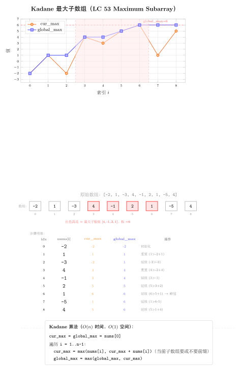

# 17 — Kadane's Algorithm（融合版）

> **难度**：★★★☆☆
> **题数**：2
> **核心套路**：维护 cur_sum + global_max，线性扫描一次完成
> **本文件**：覆盖 kadane 2 题的算法套路总结 + 典型题精讲 + 自测

---

## 一例速记

> **标准 Kadane**：`cur = max(x, cur + x)`（当前子数组和，遇负则"重新开始"）；`ans = max(ans, cur)`（更新全局最大）（53）
> **乘积变体**：乘积中负数会"变号"，需同时维护 `cur_max` 和 `cur_min`（负 × 负 = 正），每步更新时三者取 max/min（152）
> **环形变体**：最大子数组和 = max(线性最大, 总和 - 线性最小)；特例：全为负数时只取线性最大（918）
> **核心直觉**：若已有子数组的和为负，对后续子数组无正贡献，丢弃从下一个元素重新开始
> **AI 关联**：在线极值流（online max/min tracking）/ 时序信号峰值检测 / Streaming 数据的窗口聚合

---

## 思维路径还原

> "看到 **'最大子数组和'（53）** → 标准 Kadane：
> `cur = 0, ans = nums[0]`，遍历每个元素 x：
> `cur = max(x, cur + x)`（cur + x < x 时说明之前的和拖累了，重置）；
> `ans = max(ans, cur)`（更新全局最大）。
> 时间 O(n)，空间 O(1)。
>
> 注意：`ans` 初始化为 `nums[0]` 而非 0，因为数组可能全为负数，答案应是最大的那个负数。
> 等价写法：`cur = max(x, cur + x)` 等同于 `cur = cur + x if cur > 0 else x`。
>
> 看到 **'最大乘积子数组'（152）** → 乘积特殊性：负数 × 负数 = 正数，
> 一个当前最小值（负的）乘以下一个负数可能变成最大值。
> 因此同时维护 `cur_max`（当前子数组最大乘积）和 `cur_min`（当前子数组最小乘积）：
> ```
> new_max = max(x, x * cur_max, x * cur_min)
> new_min = min(x, x * cur_max, x * cur_min)
> cur_max, cur_min = new_max, new_min
> ans = max(ans, cur_max)
> ```
> 注意：计算 new_max 和 new_min 时必须用**旧的** cur_max 和 cur_min，先计算再更新（否则 cur_max 被修改后影响 cur_min 的计算）。
>
> 看到 **'环形数组最大子数组和'（918）** → 两种情况：
> 情况 1：最大子数组不跨越边界 → 就是标准 Kadane 的答案 `max_sum`。
> 情况 2：最大子数组跨越边界（首尾相连）→ 等价于"去掉中间一段连续子数组的最小和"，即 `total - min_sum`（`min_sum` 为最小子数组和，用 Kadane 取 min 版本求得）。
> 最终答案 = `max(max_sum, total - min_sum)`；
> 特殊情况：若所有元素均为负数（`max_sum < 0`），`total - min_sum` 等于 0（去掉全部）会给出错误答案，此时应直接返回 `max_sum`。"

---

## 学习目标

- 熟练写标准 Kadane 模板（`cur = max(x, cur + x)`），注意初始值为 `nums[0]` 而非 0
- 理解"cur 为负时重置"的直觉：负的前缀和对后续子数组无贡献
- 掌握乘积变体（152）：同时维护 cur_max / cur_min，遇负数时两者可能翻转
- 掌握环形变体（918）：两种情况取最大，全负时的特殊处理
- 理解 Kadane 与"在线极值"问题的关联

---

## 几何示意

### 图 Kadane 最大子数组（LC 53）



---
## 抽象成方法（标准模板代码）

### 套路 1：标准 Kadane（最大子数组和）

适用题：53

```python
from typing import List


def maxSubArray(nums: List[int]) -> int:
    """时间 O(n)，空间 O(1)。标准 Kadane 算法。"""
    cur = ans = nums[0]
    for x in nums[1:]:
        cur = max(x, cur + x)    # cur + x < x 时，前缀为负，丢弃重新开始
        ans = max(ans, cur)
    return ans


# 等价写法（更显式地表达"重置"逻辑）
def maxSubArray_v2(nums: List[int]) -> int:
    cur = 0
    ans = nums[0]
    for x in nums:
        cur = cur + x if cur > 0 else x   # 若之前的和为负则抛弃
        ans = max(ans, cur)
    return ans


# DP 写法（dp[i] = 以 nums[i] 结尾的最大子数组和）
def maxSubArray_dp(nums: List[int]) -> int:
    """dp[i] = max(nums[i], dp[i-1] + nums[i])，滚动变量优化为 O(1) 空间。"""
    dp = nums[0]
    ans = dp
    for x in nums[1:]:
        dp = max(x, dp + x)
        ans = max(ans, dp)
    return ans
```

> 初始化：`cur = ans = nums[0]`（不能用 0 初始化 ans，否则全负数数组时 ans 保持 0 而非正确的负数答案）。
> 数学保证：Kadane 正确性来自于"子问题最优性"：以 `nums[i]` 结尾的最大子数组和，等于 `nums[i]` 本身（从 i 重新开始）和前缀最大和加 `nums[i]` 中的较大者。

---

### 套路 2：乘积变体（同时维护 max 和 min）

适用题：152

```python
def maxProduct(nums: List[int]) -> int:
    """时间 O(n)，空间 O(1)。同时维护 cur_max 和 cur_min（负数翻转）。"""
    cur_max = cur_min = ans = nums[0]
    for x in nums[1:]:
        # 先计算新值（必须用旧的 cur_max / cur_min！）
        new_max = max(x, x * cur_max, x * cur_min)
        new_min = min(x, x * cur_max, x * cur_min)
        cur_max, cur_min = new_max, new_min
        ans = max(ans, cur_max)
    return ans


# 另一种等价写法：遇到负数时主动交换 cur_max 和 cur_min
def maxProduct_v2(nums: List[int]) -> int:
    cur_max = cur_min = ans = nums[0]
    for x in nums[1:]:
        if x < 0:
            cur_max, cur_min = cur_min, cur_max   # 负数翻转后大小关系互换
        cur_max = max(x, x * cur_max)
        cur_min = min(x, x * cur_min)
        ans = max(ans, cur_max)
    return ans
```

> 为什么要同时维护 cur_min？因为负数 × 负数 = 正数，一个很小的负值（`cur_min`）乘以下一个负数元素可能变成当前最大值。仅维护 cur_max 会漏掉这条"负 × 负"路径。
> 注意先保存旧值再更新（或用临时变量），避免 `cur_max` 更新后影响 `cur_min` 的计算。

---

### 套路 3：环形变体（两路 Kadane）

适用题：918

```python
def maxSubarraySumCircular(nums: List[int]) -> int:
    """时间 O(n)，空间 O(1)。
    两种情况：
    1. 最大子数组不跨越边界 → 标准 Kadane 的 max_sum
    2. 最大子数组跨越边界 → total - min_sum（去掉中间最小子数组）
    全负数特殊情况：total - min_sum == 0（min_sum == total），返回 max_sum。
    """
    total = 0
    cur_max = cur_min = 0
    max_sum = min_sum = nums[0]

    for x in nums:
        cur_max = max(x, cur_max + x)
        max_sum = max(max_sum, cur_max)
        cur_min = min(x, cur_min + x)
        min_sum = min(min_sum, cur_min)
        total += x

    # 全负数时 total - min_sum == 0，应返回 max_sum（最大的那个负数）
    if max_sum < 0:
        return max_sum
    return max(max_sum, total - min_sum)
```

> 情况 2 的直觉：环形数组中"跨越首尾的子数组"= 整个数组去掉中间某段连续子数组；
> 为使保留部分（首尾）最大，等价于让中间去掉的部分最小，即求最小子数组和 min_sum；
> 跨越情况的最大值 = `total - min_sum`。

---

### 速查表

| 题型特征 | 套路 | 时间 | 空间 |
|---|---|---|---|
| 最大子数组和（线性） | 标准 Kadane（cur + x / x 取大） | O(n) | O(1) |
| 最大子数组乘积 | 双变量 Kadane（cur_max + cur_min）| O(n) | O(1) |
| 环形数组最大子数组和 | 两路 Kadane（max + min），取 max | O(n) | O(1) |
| 最大子数组（含下标） | Kadane + 记录起止下标 | O(n) | O(1) |

---

## 方法变形（3 类）

### 变形 1：Kadane 系列扩展

- **53**（标准）→ **918**（环形）→ 用"total - min_sum"转化环形为线性问题。
- **152**（最大乘积）→ 双变量 Kadane，同时维护 cur_max 和 cur_min。
- **1749**（绝对值最大子数组和，非 LC150）→ 最大子数组和与最小子数组和取绝对值的较大值。
- **363**（矩形区域不超过 K 的最大数值和，非 LC150）→ 将二维问题压缩为一维，枚举上下行边界，对每列前缀和用 Kadane + 有序集合（`SortedList`）。

### 变形 2：带约束的 Kadane

- **标准 Kadane 的限制**：子数组必须连续，长度 ≥ 1。
- 若允许空子数组（长度 ≥ 0），`ans` 初始化为 0 即可（最大和至少为 0）。
- **K 约束**（最大子数组和 ≤ K）→ 不能直接用 Kadane；需前缀和 + 有序集合（`SortedList.bisect_left`），O(n log n)。
- **152 特例（含 0）**：遇到 0 时，`cur_max = max(0, ...)` = 0（乘积清零），`cur_min = min(0, ...)` = 0；0 将乘积链断开，效果类似 Kadane 中负数前缀的重置。

### 变形 3：在线数据流与滑动窗口

- **Kadane 本质是在线算法**：每次 O(1) 处理新元素，适合 streaming 数据。
- **滑动窗口最大子数组**（固定窗口大小，非 LC150）→ 单调队列（deque），O(n)。
- **在线极值流**（AI 特征监控）：实时监控时序数据中的最大连续增益段，Kadane 直接应用；乘积变体用于波动率最大区间检测。
- AI 场景：
  - Transformer 注意力分数的时序片段选择（最大相关性子序列）类 Kadane。
  - 强化学习的奖励函数中，累积最大奖励段的检测等同于 918 的环形变体。
  - 时序异常检测：最大正偏差子数组（Kadane）vs 最大负偏差子数组（取反后 Kadane）。

---

## 思考路标（条件反射）

1. 看到 **"最大子数组和 / maximum subarray"** → 标准 Kadane，`cur = max(x, cur + x)`，`ans = max(ans, cur)`
2. 看到 **"最大子数组乘积 / maximum product"** → 双变量 Kadane，同时维护 `cur_max` 和 `cur_min`
3. 看到 **"环形数组 / circular array"** → 两路 Kadane：`max_sum` 和 `min_sum`；答案 = `max(max_sum, total - min_sum)`；全负时特判
4. 看到 **"ans 初始化为 0"** → 先检查题意：若允许空子数组则初始化 0；若要求非空子数组则初始化 `nums[0]`
5. 看到 **"包含负数的乘积"** → 必须同时跟踪最大值和最小值，负 × 负翻转
6. 看到 **"子数组（连续）"** → Kadane；"子序列（可跳过）"→ DP（不同类问题，不要混用）

---

## 易错点

1. **ans 初始化不能为 0**：全负数数组时，Kadane 的 `cur` 永远不会达到 0，`ans = 0` 是错的；初始化 `ans = nums[0]` 才能正确处理全负数情况。
2. **152 先算再赋值**：`new_max = max(x, x * cur_max, x * cur_min); new_min = ...` 必须用旧值算完 new_max 后才更新 cur_max；否则 `cur_max = max(x, x * cur_max, x * cur_min); cur_min = min(x, x * cur_max, ...)` 中第二行用的 cur_max 已经是更新后的值，导致错误。
3. **918 全负数特判**：若 `max_sum < 0`（所有元素均负），则 `total - min_sum = 0`（min_sum = total），意味着去掉所有元素得 0，但子数组必须非空，因此应返回 `max_sum` 而非 `total - min_sum`。
4. **918 min_sum 初始化**：和 max_sum 一样，`min_sum = nums[0]`（不能为 `float('inf')`，因为 Kadane 变量 `cur_min` 从 0 开始会给出错误的 0 初始值）；但若 cur_max / cur_min 从 0 开始则需注意对应调整。统一在上面模板中 cur_max = cur_min = 0，min_sum = max_sum = nums[0] 是安全写法。
5. **子数组 vs 子序列**：Kadane 解决的是"连续子数组"问题；若题目允许跳过元素（子序列），则应用 DP 而非 Kadane，混用会得到错误答案。
6. **152 含 0 的情况**：遇到 0 时，`x * cur_max = 0`, `x * cur_min = 0`，`max(0, 0, 0) = 0`；cur_max 和 cur_min 都变为 0，等价于从下一个元素重新开始，行为正确，不需要特判。

---

## 典型应用例题

### 例 1：53. Maximum Subarray

**题目**：给定整数数组，找到具有最大和的连续子数组，返回其和。

**思路**：标准 Kadane。维护 `cur`（以当前位置结尾的最大子数组和）和 `ans`（全局最大）。`cur = max(x, cur + x)`：若 `cur + x < x`，说明之前的前缀和为负，拖累了当前，应从当前元素重新开始。

**解**：

```python
# 参考：solutions/kadane/p053_maximum_subarray.py
def maxSubArray(nums: List[int]) -> int:
    cur = ans = nums[0]
    for x in nums[1:]:
        cur = max(x, cur + x)
        ans = max(ans, cur)
    return ans
```

**分析**：$O(n)$ 时间，$O(1)$ 空间。每个元素恰好访问一次，`cur` 和 `ans` 各 O(1) 更新。对比暴力 $O(n^2)$ 和分治 $O(n \log n)$，Kadane 是最优解。

**DP 视角**：令 `dp[i]` = 以 `nums[i]` 结尾的最大子数组和，则 `dp[i] = max(nums[i], dp[i-1] + nums[i])`，答案 = `max(dp)`。Kadane 就是这个 DP 的滚动变量优化版本（`dp[i]` 只依赖 `dp[i-1]`）。

---

### 例 2：918. Maximum Sum Circular Subarray

**题目**：给定一个循环整数数组（首尾相接），找到具有最大和的非空连续子数组（可以跨越首尾），返回最大和。

**思路**：分两种情况：
- 情况 1：最大子数组不跨越边界 → 标准 Kadane 求 max_sum。
- 情况 2：最大子数组跨越边界 → `total - min_sum`（去掉中间最小子数组，用 Kadane 的"取 min"变体求 min_sum）。
答案 = `max(max_sum, total - min_sum)`；若 `max_sum < 0`（全负数），返回 `max_sum`。

**解**：

```python
# 参考：solutions/kadane/p918_maximum_sum_circular_subarray.py
def maxSubarraySumCircular(nums: List[int]) -> int:
    total = 0
    cur_max = cur_min = 0
    max_sum = min_sum = nums[0]
    for x in nums:
        cur_max = max(x, cur_max + x)
        max_sum = max(max_sum, cur_max)
        cur_min = min(x, cur_min + x)
        min_sum = min(min_sum, cur_min)
        total += x
    if max_sum < 0:
        return max_sum
    return max(max_sum, total - min_sum)
```

**分析**：$O(n)$ 时间，$O(1)$ 空间。两路 Kadane 在同一次遍历中完成，无需两次 pass。全负数情况 `total - min_sum = total - total = 0`，这是非法的（空子数组），因此 `max_sum < 0` 时直接返回 `max_sum`。

---

## 自测题

**自测 1**（53 Maximum Subarray）—— `nums=[-2,1,-3,4,-1,2,1,-5,4]` 返回 `6`（子数组 `[4,-1,2,1]`）；`nums=[1]` 返回 `1`；`nums=[5,4,-1,7,8]` 返回 `23`。提示：`cur = ans = nums[0]`，遍历从 `nums[1:]` 开始，`cur = max(x, cur + x)`，`ans = max(ans, cur)`，注意全负数时 ans 应为最大负数。参考 `solutions/kadane/p053_maximum_subarray.py`。

**自测 2**（152 Maximum Product Subarray，同类练习）—— `nums=[2,3,-2,4]` 返回 `6`（子数组 `[2,3]`）；`nums=[-2,0,-1]` 返回 `0`；`nums=[-2,3,-4]` 返回 `24`（子数组 `[-2,3,-4]`）。提示：`cur_max = cur_min = ans = nums[0]`，遍历时先用临时变量保存 `new_max = max(x, x*cur_max, x*cur_min)`，`new_min = min(...)`，同步更新，`ans = max(ans, cur_max)`。

**自测 3**（918 Maximum Sum Circular Subarray）—— `nums=[1,-2,3,-2]` 返回 `3`（子数组 `[3]`）；`nums=[5,-3,5]` 返回 `10`（子数组 `[5,5]`，跨越首尾）；`nums=[-3,-2,-3]` 返回 `-2`（全负数，返回最大负数）。提示：同时跑 max Kadane 和 min Kadane，累加 total；`max_sum < 0` 时返回 `max_sum`，否则返回 `max(max_sum, total - min_sum)`。参考 `solutions/kadane/p918_maximum_sum_circular_subarray.py`。

---

## 题目全览（2 题）

| # | 题目 | 套路分类 | 难度 |
|---|---|---|---|
| 53 | Maximum Subarray | 标准 Kadane | Easy（但思想深刻） |
| 918 | Maximum Sum Circular Subarray | 两路 Kadane（max + min） | Medium |

---

## 融合版说明

| 段 | 来源 | 价值 |
|---|---|---|
| 一例速记 | 本文件 | 3 大变体一览（标准/乘积/环形）+ AI 场景 |
| 思维路径还原 | 本文件 | 3 道题（含 152 乘积变体）的解题内心独白 |
| 抽象成方法 | 本文件 | 3 个标准模板（标准 Kadane/乘积双变量/环形两路）+ 速查表 |
| 方法变形 | 本文件 | 3 类变体（Kadane 系列/带约束/在线数据流）+ AI 关联 |
| 思考路标 | 本文件 | 6 条题型识别条件反射 |
| 易错点 | 本文件 | 6 条高频踩坑（初始化/先算再赋值/全负特判等） |
| 典型应用例题 | solutions/ | 2 道精讲（53、918）+ 乘积变体说明，代码 + DP 视角 |
| 自测题 | leetcode | 3 题带提示（含 152 乘积变体练习），链接 solutions 文件 |
| 题目全览 | 本文件 | 2 题完整列表，套路分类一览 |

---

> **跨 category 导航**：
> - Kadane 本质是 1D DP 的滚动变量优化 → 见 `10-dp-1d.md`（dp[i] 只依赖 dp[i-1]）
> - 环形数组的另一类问题（如环形链表）→ 见 `12-linked-list.md`（快慢指针判环）
> - 滑动窗口最大值（固定窗口大小）→ 见 `03-sliding-window.md`（单调队列）
> - Kadane 在时序信号处理和在线特征监控中是"在线算法"的代表性例子，与 streaming 数据处理框架（Flink、Kafka Streams）的窗口聚合在概念上高度一致
