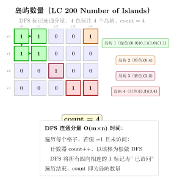
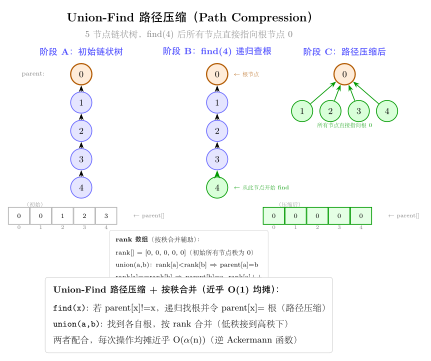

# 19 — Graph General（融合版）

> **难度**：★★★☆☆
> **题数**：6
> **核心套路**：DFS 连通分量 / 岛屿计数、Union-Find、拓扑排序（Kahn / DFS）、带权图 BFS 求比值
> **本文件**：覆盖 graph_general 6 题的算法套路总结 + 典型题精讲 + 自测

---

## 一例速记

> **DFS 连通分量 / 岛屿计数**：遍历所有节点，对未访问的节点做 DFS/BFS，每次启动一次 DFS 即发现一个新连通分量（200 Number of Islands / 130 Surrounded Regions）
> **DFS 标记边界连通**：130 题先从边界的 'O' 出发 DFS 标记"安全"区域，再把未标记的 'O' 变成 'X'（染色法，避免判断每个 'O' 是否连通到边界）
> **Union-Find（并查集）**：路径压缩 + 按秩合并，近乎 $O(1)$ 的 `find` / `union`；用于动态连通性（200 / 547 Friend Circles）
> **克隆图 DFS + 哈希表**：`visited = {old_node: new_node}`，DFS 遍历原图，克隆节点时先查哈希表防止重复克隆（133）
> **拓扑排序 Kahn**：入度数组 + 队列，每次取入度为 0 的节点，处理后减少邻居入度，若最终处理节点数 = 总节点数则无环（207 / 210 Course Schedule）
> **拓扑排序 DFS 三色**：白（未访问）→ 灰（进栈中）→ 黑（已完成），灰色节点再次被访问则有环（207）
> **带权图 BFS / DFS 传递比值**：399 Evaluate Division，将除法关系建成带权有向图（$A/B=k$ 则 $A \to B$ 权 $k$，$B \to A$ 权 $1/k$），DFS/BFS 求路径权重之积
> **AI 关联**：ML 流水线的 DAG 依赖管理（TensorFlow 计算图 / PyTorch autograd）、编译器的指令调度（Toposort）、微服务熔断检测（连通性）

---

## 思维路径还原

> "看到 **'200 岛屿数量'** → DFS/BFS 遍历 + 计数：
> 双重循环扫描 grid，遇到 `'1'` 则岛屿数 +1，然后 DFS 将整个连通的 '1' 区域全部标记为已访问（改为 '0' 或 '#'）。
> 时间 O(m·n)，空间 O(m·n)（递归栈最坏情况全是岛屿）。
>
> 看到 **'130 被围绕的区域'** → 反向思维：不是问哪些 'O' 被围，而是先找哪些 'O' 安全（连通到边界）。
> 从四条边界上的所有 'O' 出发 DFS，标记为临时字符 '#'（安全）；
> 最后遍历全图：'#' 恢复为 'O'（安全的），'O' 改为 'X'（被围的），'X' 保持不变。
>
> 看到 **'133 克隆图'** → DFS + 哈希表：
> `visited = {original_node: cloned_node}` 记录已克隆的节点，防止重复克隆导致死循环。
> DFS 时，若邻居已在 visited 中则直接取克隆节点，否则新建节点后递归克隆其邻居。
>
> 看到 **'547 省份数量'** → 连通分量计数，可用 DFS 或 Union-Find：
> DFS 版：同 200 岛屿，对邻接矩阵的每个未访问节点做 DFS；
> Union-Find 版：遍历边，`union(i, j)`，最后统计根节点数量。
>
> 看到 **'207 / 210 课程表'** → 拓扑排序：
> 207 只问是否有环（能否完成所有课程）→ Kahn 算法，若处理节点总数 < numCourses 则有环；
> 210 还要返回修课顺序 → Kahn 输出处理顺序，若有环返回 []。
>
> 看到 **'399 除法求值'** → 建带权图，DFS 求路径权重积：
> 每个变量是节点，`A/B=k` 建边 `A→B` 权 k，`B→A` 权 1/k。
> 对每个 query `(C, D)`，DFS 从 C 出发找到 D 的路径并累乘权重，找不到则返回 -1.0。"

---

## 学习目标

- 掌握 DFS 连通分量模板：未访问节点启动 DFS，递归标记所有连通点
- 理解"边界逆向标记"技巧（130），避免逐个判断连通性
- 实现路径压缩 + 按秩合并的 Union-Find，熟悉其在连通性问题中的应用
- 掌握 Kahn 拓扑排序（入度队列法）和 DFS 三色法（环检测）
- 理解带权图的构建方式（399），DFS/BFS 在带权图上传递权重

---

## 几何示意

### 图 DFS 连通分量（LC 200 岛屿）



### 图 Union-Find 路径压缩



---
## 抽象成方法（标准模板代码）

### 套路 1：DFS 连通分量（岛屿计数）

适用题：200、547

```python
from typing import List


def num_islands(grid: List[List[str]]) -> int:
    """
    200: DFS 连通分量计数，时间 O(m·n)，空间 O(m·n)（递归栈）。
    """
    if not grid:
        return 0
    m, n = len(grid), len(grid[0])
    count = 0

    def dfs(r: int, c: int) -> None:
        if r < 0 or r >= m or c < 0 or c >= n or grid[r][c] != '1':
            return
        grid[r][c] = '#'   # 标记已访问，避免回头
        for dr, dc in [(-1, 0), (1, 0), (0, -1), (0, 1)]:
            dfs(r + dr, c + dc)

    for r in range(m):
        for c in range(n):
            if grid[r][c] == '1':
                count += 1
                dfs(r, c)
    return count
```

---

### 套路 2：边界逆向 DFS（被围区域）

适用题：130

```python
def solve_surrounded(board: List[List[str]]) -> None:
    """
    130: 将非边界连通的 'O' 改为 'X'，原地修改。时间 O(m·n)，空间 O(m·n)。
    """
    if not board:
        return
    m, n = len(board), len(board[0])

    def dfs(r: int, c: int) -> None:
        if r < 0 or r >= m or c < 0 or c >= n or board[r][c] != 'O':
            return
        board[r][c] = '#'   # 临时标记：安全的 'O'
        for dr, dc in [(-1, 0), (1, 0), (0, -1), (0, 1)]:
            dfs(r + dr, c + dc)

    # 第一步：从四条边界的 'O' 出发，标记所有连通到边界的 'O' 为 '#'
    for r in range(m):
        for c in [0, n - 1]:
            if board[r][c] == 'O':
                dfs(r, c)
    for c in range(n):
        for r in [0, m - 1]:
            if board[r][c] == 'O':
                dfs(r, c)

    # 第二步：恢复与翻转
    for r in range(m):
        for c in range(n):
            if board[r][c] == 'O':
                board[r][c] = 'X'   # 被围，翻转
            elif board[r][c] == '#':
                board[r][c] = 'O'   # 安全，恢复
```

---

### 套路 3：Union-Find（带路径压缩 + 按秩合并）

适用题：200、547

```python
class UnionFind:
    """路径压缩 + 按秩合并，find / union 近乎 O(1)（反阿克曼函数）。"""

    def __init__(self, n: int):
        self.parent = list(range(n))
        self.rank = [0] * n
        self.count = n              # 连通分量数量

    def find(self, x: int) -> int:
        if self.parent[x] != x:
            self.parent[x] = self.find(self.parent[x])   # 路径压缩
        return self.parent[x]

    def union(self, x: int, y: int) -> bool:
        """合并 x 和 y 所在集合，若已在同一集合返回 False。"""
        rx, ry = self.find(x), self.find(y)
        if rx == ry:
            return False
        if self.rank[rx] < self.rank[ry]:
            rx, ry = ry, rx         # 保证 rx 的秩 >= ry
        self.parent[ry] = rx
        if self.rank[rx] == self.rank[ry]:
            self.rank[rx] += 1
        self.count -= 1
        return True

    def connected(self, x: int, y: int) -> bool:
        return self.find(x) == self.find(y)


# 547: 省份数量（邻接矩阵，Union-Find 版）
def find_circle_num(isConnected: List[List[int]]) -> int:
    n = len(isConnected)
    uf = UnionFind(n)
    for i in range(n):
        for j in range(i + 1, n):
            if isConnected[i][j] == 1:
                uf.union(i, j)
    return uf.count
```

---

### 套路 4：克隆图（DFS + 哈希表）

适用题：133

```python
from typing import Optional


class Node:
    def __init__(self, val=0, neighbors=None):
        self.val = val
        self.neighbors = neighbors if neighbors is not None else []


def clone_graph(node: Optional[Node]) -> Optional[Node]:
    """
    133: DFS 克隆图，时间 O(V+E)，空间 O(V)（哈希表 + 递归栈）。
    """
    if not node:
        return None
    visited: dict[Node, Node] = {}

    def dfs(n: Node) -> Node:
        if n in visited:
            return visited[n]
        clone = Node(n.val)
        visited[n] = clone
        for neighbor in n.neighbors:
            clone.neighbors.append(dfs(neighbor))
        return clone

    return dfs(node)
```

---

### 套路 5：拓扑排序 Kahn（入度队列法）

适用题：207、210

```python
from collections import deque


def topo_sort_kahn(num_nodes: int, edges: List[List[int]]) -> List[int]:
    """
    Kahn 拓扑排序：入度为 0 的节点入队，处理后减少邻居入度。
    返回拓扑顺序，若有环则返回空列表。时间 O(V+E)，空间 O(V+E)。
    """
    in_degree = [0] * num_nodes
    graph: List[List[int]] = [[] for _ in range(num_nodes)]
    for u, v in edges:
        graph[v].append(u)          # v 是 u 的先修课，v→u
        in_degree[u] += 1

    queue = deque([i for i in range(num_nodes) if in_degree[i] == 0])
    order: List[int] = []
    while queue:
        node = queue.popleft()
        order.append(node)
        for nxt in graph[node]:
            in_degree[nxt] -= 1
            if in_degree[nxt] == 0:
                queue.append(nxt)

    return order if len(order) == num_nodes else []


# 207: 判断是否可以完成所有课程（是否有环）
def can_finish(numCourses: int, prerequisites: List[List[int]]) -> bool:
    order = topo_sort_kahn(numCourses, prerequisites)
    return len(order) == numCourses


# 210: 返回学习顺序
def find_order(numCourses: int, prerequisites: List[List[int]]) -> List[int]:
    return topo_sort_kahn(numCourses, prerequisites)
```

---

### 套路 6：带权图 DFS（除法求值）

适用题：399

```python
from collections import defaultdict


def calc_equation(equations: List[List[str]], values: List[float],
                  queries: List[List[str]]) -> List[float]:
    """
    399: 建带权有向图，DFS 求路径权重之积。时间 O((V+E)·Q)，空间 O(V+E)。
    V=变量数，E=方程数，Q=查询数。
    """
    # 建图：graph[A][B] = A/B 的值
    graph: dict[str, dict[str, float]] = defaultdict(dict)
    for (A, B), val in zip(equations, values):
        graph[A][B] = val
        graph[B][A] = 1.0 / val

    def dfs(src: str, dst: str, visited: set) -> float:
        if src not in graph or dst not in graph:
            return -1.0
        if src == dst:
            return 1.0
        visited.add(src)
        for neighbor, weight in graph[src].items():
            if neighbor in visited:
                continue
            result = dfs(neighbor, dst, visited)
            if result != -1.0:
                return weight * result
        return -1.0

    return [dfs(A, B, set()) for A, B in queries]
```

---

### 速查表

| 题型特征 | 套路 | 时间 | 空间 |
|---|---|---|---|
| 网格连通分量 / 岛屿计数 | DFS 染色 | $O(mn)$ | $O(mn)$ |
| 边界连通的区域 | 边界逆向 DFS + 恢复 | $O(mn)$ | $O(mn)$ |
| 动态连通性 / 省份计数 | Union-Find（路径压缩）| 近乎 $O(n)$ | $O(n)$ |
| 克隆图（含环）| DFS + 哈希表 | $O(V+E)$ | $O(V)$ |
| 有向图是否有环 | Kahn 拓扑排序 | $O(V+E)$ | $O(V+E)$ |
| 拓扑顺序 | Kahn 输出 order | $O(V+E)$ | $O(V+E)$ |
| 除法关系传递求值 | 带权图 DFS 路径积 | $O((V+E)Q)$ | $O(V+E)$ |

---

## 方法变形（4 类）

### 变形 1：岛屿系列

- **200**（Number of Islands）：DFS 染色，统计启动次数。
- **547**（Number of Provinces）：邻接矩阵版连通分量，DFS 或 Union-Find。
- **130**（Surrounded Regions）：逆向标记边界连通，再批量翻转。
- 共同模式：`visited` 集合（或原地标记）+ 计数 / 染色。

### 变形 2：Union-Find 应用扩展

- **200 / 547**：连通分量计数。
- **684**（Redundant Connection，非本 category）：加边时若 `find(u) == find(v)` 则为冗余边。
- **399**：Union-Find 也可用于 399（带权并查集），但 DFS 更直观。
- 路径压缩确保每次 `find` 后树高度接近 1，单次近乎 $O(1)$。

### 变形 3：拓扑排序扩展

- **207**（能否完成）→ **210**（学习顺序）→ **269**（Alien Dictionary，非本 category）：逐步复杂化，核心都是 Kahn 或 DFS 三色。
- Kahn 更易于检测环（`len(order) != V`）；DFS 三色（WHITE/GRAY/BLACK）更直观但实现略复杂。
- AI 场景：TensorFlow `tf.function` 编译计算图时会做拓扑排序，确保算子按依赖顺序执行。

### 变形 4：带权图扩展

- **399**（除法求值）：DFS 路径权重积。
- 若查询量大可用 Floyd-Warshall 预处理所有点对（$O(V^3)$），以 $O(1)$ 回答每次查询。
- Union-Find 带权版（记录节点到根的权重）也可解决 399，但实现复杂，不推荐面试首选。

---

## 思考路标（条件反射）

1. 看到 **"连通分量 / 岛屿数量"** → DFS 染色 + 计数
2. 看到 **"被围绕的区域 / 边界连通"** → 逆向：先从边界出发标记安全，再处理其余
3. 看到 **"克隆图 / 深拷贝"** → DFS + `visited = {old: new}` 哈希表防止重复克隆
4. 看到 **"动态合并集合 / 检查是否同一组"** → Union-Find（路径压缩 + 按秩合并）
5. 看到 **"有向图 / 依赖关系 / 课程先修"** → 拓扑排序（Kahn 入度队列）
6. 看到 **"是否有环"** → Kahn：处理节点数 < V 则有环；DFS：灰色节点再次被访问则有环
7. 看到 **"等式 / 除法 / 比值传递"** → 带权有向图，DFS 路径积
8. 看到 **"计算图 / 任务调度 / DAG"** → 拓扑排序
9. 看到 **"Union-Find vs DFS"** → 静态图且只需连通性 → Union-Find 更快；需要遍历路径 → DFS

---

## 易错点

1. **200 DFS 标记**：必须在进入 DFS 之前（或进入时）立刻标记已访问，否则 4 个方向的递归会重复访问同一格子导致无限循环或超时。
2. **130 逆向标记顺序**：必须先做边界 DFS 标记（第一步），再做翻转恢复（第二步）；两步不能混在一次遍历中完成，否则翻转会破坏标记。
3. **133 克隆图含环**：图中可能有环，必须在 DFS 进入节点**之前**先创建克隆节点并放入 `visited`，然后再处理邻居；若先处理邻居再放入 visited，遇到环时会死循环。
4. **Kahn 拓扑排序边方向**：207 题 `[a, b]` 表示 b 是 a 的先修课（先上 b 才能上 a），建图时边方向为 `b → a`（`graph[b].append(a)`），入度针对 a。方向搞反会导致结果错误。
5. **210 有环时返回 []**：若 `len(order) < numCourses` 说明有环，返回空列表；常见错误是忘记这个检查，直接返回不完整的 order。
6. **399 未知变量查询**：若 query 中的变量不在图中（从未出现在 equations 里），应返回 -1.0；在 `dfs` 函数起始处检查 `src not in graph or dst not in graph`。
7. **Union-Find 初始化计数**：`count = n` 初始化为所有节点各自独立；每次成功 `union` 时 `count -= 1`；若 `find(x) == find(y)` 则不减（已经同一连通分量）。
8. **547 vs 200 邻接结构**：200 是网格（邻居是上下左右格子），547 是邻接矩阵（`isConnected[i][j] == 1`）；框架相同，邻居获取方式不同。

---

## 典型应用例题

### 例 1：200. Number of Islands

**题目**：给定 `m × n` 的字符网格，`'1'` 为陆地，`'0'` 为水。计算岛屿数量（由 4 连通的 `'1'` 构成的连通分量）。

**思路**：双重循环扫描，遇到 `'1'` 则岛屿数 +1，同时 DFS 将该岛屿的所有格子标记为 `'#'`（已访问）。递归终止条件：越界或当前格子不为 `'1'`。

**解**：

```python
# 参考：solutions/graph_general/p200_number_of_islands.py
def numIslands(grid: List[List[str]]) -> int:
    m, n = len(grid), len(grid[0])
    count = 0

    def dfs(r: int, c: int) -> None:
        if r < 0 or r >= m or c < 0 or c >= n or grid[r][c] != '1':
            return
        grid[r][c] = '#'
        dfs(r - 1, c); dfs(r + 1, c); dfs(r, c - 1); dfs(r, c + 1)

    for r in range(m):
        for c in range(n):
            if grid[r][c] == '1':
                count += 1
                dfs(r, c)
    return count
```

**分析**：每个格子最多被 DFS 访问一次（标记后跳过），时间 $O(mn)$，空间 $O(mn)$（递归栈，最坏情况全为陆地）。

---

### 例 2：207. Course Schedule

**题目**：`numCourses` 门课，`prerequisites[i] = [a, b]` 表示先修 b 才能修 a。判断能否完成所有课程（即有向图是否无环）。

**思路**：Kahn 拓扑排序。建图：`b → a`，计算入度。队列初始放入所有入度为 0 的节点，依次出队、减少邻居入度，入度变 0 的邻居入队。最终处理节点数若等于 `numCourses` 则无环。

**解**：

```python
# 参考：solutions/graph_general/p207_course_schedule.py
def canFinish(numCourses: int, prerequisites: List[List[int]]) -> bool:
    in_degree = [0] * numCourses
    graph = [[] for _ in range(numCourses)]
    for a, b in prerequisites:
        graph[b].append(a)
        in_degree[a] += 1
    queue = deque([i for i in range(numCourses) if in_degree[i] == 0])
    count = 0
    while queue:
        node = queue.popleft()
        count += 1
        for nxt in graph[node]:
            in_degree[nxt] -= 1
            if in_degree[nxt] == 0:
                queue.append(nxt)
    return count == numCourses
```

**分析**：时间 $O(V+E)$，空间 $O(V+E)$，V = numCourses，E = len(prerequisites)。

---

### 例 3：399. Evaluate Division

**题目**：给定等式 `equations[i] = [Ai, Bi]` 和对应的值 `values[i]`（即 $A_i / B_i = \text{values}[i]$），对每个 query `[C, D]` 计算 $C / D$ 的值，无法计算则返回 -1.0。

**思路**：将变量视为节点，等式关系视为带权有向边（双向）。对每个 query，DFS 从源节点出发找目标节点，沿路径累乘权重。

**解**：

```python
# 参考：solutions/graph_general/p399_evaluate_division.py
def calcEquation(equations: List[List[str]], values: List[float],
                 queries: List[List[str]]) -> List[float]:
    graph = defaultdict(dict)
    for (A, B), v in zip(equations, values):
        graph[A][B] = v
        graph[B][A] = 1.0 / v

    def dfs(src: str, dst: str, visited: set) -> float:
        if src not in graph or dst not in graph:
            return -1.0
        if src == dst:
            return 1.0
        visited.add(src)
        for nb, w in graph[src].items():
            if nb not in visited:
                res = dfs(nb, dst, visited)
                if res != -1.0:
                    return w * res
        return -1.0

    return [dfs(A, B, set()) for A, B in queries]
```

**分析**：变量数 V，等式数 E，查询数 Q。每次 DFS $O(V+E)$，总体 $O((V+E)Q)$。若查询量极大可用 Floyd-Warshall 预处理 $O(V^3)$ 后 $O(1)$ 查询。

---

## 自测题

**自测 1**（200 Number of Islands）—— `grid = [['1','1','0'],['0','1','0'],['0','0','1']]` 应返回 2。提示：双重循环，遇到 `'1'` 则 count+1 并 DFS 染色为 `'#'`，DFS 终止条件是越界或非 `'1'`。参考 `solutions/graph_general/p200_number_of_islands.py`。

**自测 2**（130 Surrounded Regions）—— `board = [['X','X','X','X'],['X','O','O','X'],['X','X','O','X'],['X','O','X','X']]`，应将中间的 `'O'` 变为 `'X'`，但边界的 `'O'` 保留。提示：先从边界 `'O'` 出发 DFS 标 `'#'`，再翻转 `'O'` / 恢复 `'#'`。参考 `solutions/graph_general/p130_surrounded_regions.py`。

**自测 3**（133 Clone Graph）—— 给定一个 4 节点环形图，克隆后验证克隆图与原图节点不共用（`id(clone_node) != id(original_node)`）但结构相同。提示：`visited = {}` 先建，DFS 进入时立刻创建克隆节点放入 visited，再遍历邻居。参考 `solutions/graph_general/p133_clone_graph.py`。

**自测 4**（207 Course Schedule）—— `numCourses=2, prerequisites=[[1,0]]` 返回 True；`prerequisites=[[1,0],[0,1]]` 返回 False（环）。提示：Kahn 拓扑排序，处理节点总数是否等于 numCourses。参考 `solutions/graph_general/p207_course_schedule.py`。

**自测 5**（210 Course Schedule II）—— `numCourses=4, prerequisites=[[1,0],[2,0],[3,1],[3,2]]`，有效拓扑顺序为 `[0,1,2,3]` 或 `[0,2,1,3]`。提示：Kahn 算法直接输出 order，若有环返回 []。参考 `solutions/graph_general/p210_course_schedule_ii.py`。

**自测 6**（399 Evaluate Division）—— `equations=[['a','b'],['b','c']], values=[2.0,3.0], queries=[['a','c'],['b','a'],['a','e']]`，期望 `[6.0, 0.5, -1.0]`。提示：建双向带权图，DFS 传递权重积，未知变量返回 -1.0。参考 `solutions/graph_general/p399_evaluate_division.py`。

---

## 题目全览（6 题）

| # | 题目 | 套路分类 | 难度 |
|---|---|---|---|
| 200 | Number of Islands | DFS 连通分量计数 | Medium |
| 130 | Surrounded Regions | 边界逆向 DFS 标记 | Medium |
| 133 | Clone Graph | DFS + 哈希表克隆 | Medium |
| 547 | Number of Provinces | Union-Find / DFS 连通分量 | Medium |
| 207 | Course Schedule | Kahn 拓扑排序（环检测） | Medium |
| 210 | Course Schedule II | Kahn 拓扑排序（输出顺序） | Medium |
| 399 | Evaluate Division | 带权图 DFS 路径积 | Medium |

---

## 融合版说明

| 段 | 来源 | 价值 |
|---|---|---|
| 一例速记 | 本文件 | 6 题套路一览 + AI（DAG / 编译器）关联 |
| 思维路径还原 | 本文件 | 6 道题的解题独白，含关键判断点 |
| 抽象成方法 | 本文件 | 6 个标准模板（DFS / 边界 DFS / Union-Find / 克隆 / Kahn / 带权 DFS）+ 速查表 |
| 方法变形 | 本文件 | 4 类变体（岛屿系列 / UF 扩展 / 拓扑扩展 / 带权图扩展） |
| 思考路标 | 本文件 | 9 条题型识别条件反射 |
| 易错点 | 本文件 | 8 条高频踩坑（环处理 / 边方向 / 标记时机） |
| 典型应用例题 | solutions/ | 3 道精讲（200、207、399），代码 + 分析 |
| 自测题 | leetcode | 6 题带提示，链接 solutions 文件 |
| 题目全览 | 本文件 | 6 题完整列表（含 399 备注） |

---

> **跨 category 导航**：
> - 无权图最短路径 → `18-graph-bfs.md`（BFS 按层扩展）
> - 二叉树的 DFS → `07-binary-tree-dfs.md`（preorder / inorder / postorder）
> - 回溯的 DFS → `08-backtracking.md`（需要撤销选择）
> - TensorFlow / PyTorch 的计算图编译 = 对 DAG 做拓扑排序，算子按依赖顺序执行
