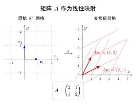

# 第2章：矩阵（融合版）

> 矩阵是线性代数的核心对象，也是现代机器学习与深度学习的基础数据结构。理解矩阵，就是理解如何系统地组织和变换数据。
>
> **本文件**：融合"原版严格推导 + 速记 / 套路 / 自测"。保留原版完整正文 + 前置一例速记 / 思维路径 + 后追加方法总结与自测。

> **一例速记**：
> **矩阵形状**：$A\in\mathbb{R}^{m\times n}$，$m$ 行 $n$ 列，元素 $a_{ij}$ 在第 $i$ 行第 $j$ 列（先行后列）。
> **特殊矩阵速记**：零矩阵 $O$（全 0）；单位矩阵 $I_n$（对角线全 1）；对角矩阵 $\mathrm{diag}(d_1,\ldots,d_n)$；上三角（下方全 0）；下三角（上方全 0）。
> **对称矩阵**：$A^T = A$，即 $a_{ij}=a_{ji}$；协方差矩阵、Gram 矩阵均是对称矩阵。
> **任意方阵分解**：$A = \dfrac{A+A^T}{2} + \dfrac{A-A^T}{2}$（对称部分 + 反对称部分）。
> **AI 关联**：权重矩阵 $W\in\mathbb{R}^{d_{out}\times d_{in}}$ = 全连接层参数；协方差矩阵 = 数据分布形状；注意力分数矩阵 $QK^T$ = 方阵。

---

## 引入：读懂神经网络权重矩阵

> **题目**：某全连接层权重矩阵 $W\in\mathbb{R}^{10\times 784}$，偏置 $\mathbf{b}\in\mathbb{R}^{10}$。(1) $W$ 共有多少个参数？(2) 输入向量 $\mathbf{x}\in\mathbb{R}^{784}$ 经过该层的输出维度是多少？(3) $W$ 是方阵吗？

请先停下来想一想：$\mathbb{R}^{10\times 784}$ 意味着 10 行 784 列——**行 = 输出神经元数，列 = 输入特征数**。下面还原完整思路。

---

## 思维路径还原（解题者的内心独白）

> "看到 $W\in\mathbb{R}^{10\times 784}$，我立刻读出：10 行、784 列，$m=10$，$n=784$。
>
> **第 (1) 问：参数数量**。$W$ 的元素个数 $= m\times n = 10\times 784 = 7840$。再加偏置 $\mathbf{b}$ 有 10 个参数，合计 $7850$ 个可训练参数。
>
> **第 (2) 问：输出维度**。全连接层计算 $\mathbf{y} = W\mathbf{x} + \mathbf{b}$，其中 $W$ 是 $10\times 784$，$\mathbf{x}$ 是 $784\times 1$。矩阵乘法"内维消去外维留"：$(10\times\mathbf{784})\cdot(\mathbf{784}\times 1) = 10\times 1$，输出是 $10$ 维向量。对应 MNIST 的 10 个数字类别。
>
> **第 (3) 问：是否方阵**。方阵要求 $m = n$，这里 $10 \neq 784$，**不是方阵**。只有方阵才能谈行列式、特征值——而 $W$ 是一个"扁平"的矩形矩阵，负责降维（从 784 维到 10 维）。
>
> **总结**：矩阵的形状 $m\times n$ 中，$m$ 决定了输出维度，$n$ 决定了接收的输入维度。读懂形状，就能预判运算结果的维度——这是调试神经网络的第一步。"

---

## 学习目标

学完本章后，你应该能够：

- 理解矩阵的严格代数定义和规范表示方法
- 掌握矩阵的基本概念：行、列、元素、维度（形状）
- 识别并构造各种特殊矩阵：零矩阵、单位矩阵、对角矩阵、三角矩阵、对称矩阵
- 理解矩阵相等的准确含义
- 建立"矩阵 = 结构化数据容器"的直觉，为后续矩阵运算打下基础

---

## 2.1 矩阵的定义

### 2.1.1 代数定义

**矩阵**（Matrix）是将若干数按照矩形阵列排列所形成的数学对象。具体而言，一个 $m \times n$ 矩阵由 $m$ 行、$n$ 列共 $mn$ 个数（称为**元素**或**分量**）组成。

正式定义如下：

$$A = \begin{pmatrix} a_{11} & a_{12} & \cdots & a_{1n} \\ a_{21} & a_{22} & \cdots & a_{2n} \\ \vdots & \vdots & \ddots & \vdots \\ a_{m1} & a_{m2} & \cdots & a_{mn} \end{pmatrix}$$

其中每个 $a_{ij}$ 是一个实数（或复数），称为矩阵 $A$ 的**第 $i$ 行第 $j$ 列元素**。

### 2.1.2 记号约定

线性代数中有几种常见的书写约定：

| 记号 | 含义 |
|------|------|
| $A$、$B$、$C$ | 用大写粗体或大写斜体字母表示矩阵 |
| $a_{ij}$ 或 $A_{ij}$ | 矩阵 $A$ 的第 $i$ 行第 $j$ 列元素 |
| $A \in \mathbb{R}^{m \times n}$ | $A$ 是元素为实数的 $m \times n$ 矩阵 |
| $(A)_{ij}$ | 取矩阵 $A$ 的 $(i,j)$ 元素 |

**维度（形状）**用 $m \times n$（读作"$m$ 乘 $n$"）表示，其中 $m$ 是行数，$n$ 是列数。例如：

$$B = \begin{pmatrix} 1 & 0 & -3 \\ 2 & 5 & 7 \end{pmatrix} \in \mathbb{R}^{2 \times 3}$$

$B$ 有 2 行 3 列，$b_{12} = 0$，$b_{23} = 7$。

### 2.1.3 行、列与元素

对于矩阵 $A \in \mathbb{R}^{m \times n}$：

- **第 $i$ 行**（row $i$）：$(a_{i1},\ a_{i2},\ \ldots,\ a_{in})$，共 $n$ 个元素
- **第 $j$ 列**（column $j$）：$(a_{1j},\ a_{2j},\ \ldots,\ a_{mj})^T$，共 $m$ 个元素
- **主对角线**（main diagonal）：元素 $a_{11},\ a_{22},\ \ldots,\ a_{\min(m,n)\,\min(m,n)}$

> **索引顺序提示**：下标 $a_{ij}$ 遵循"先行后列"的规则——$i$ 是行号，$j$ 是列号。这与坐标系的 $(x, y)$ 顺序相反，初学时需特别注意。

---

## 2.2 矩阵的类型

掌握各类特殊矩阵的名称与性质，是读懂教材、论文和代码的必要基础。

### 2.2.1 方阵（Square Matrix）

行数等于列数（$m = n$）的矩阵称为 **$n$ 阶方阵**。

$$S = \begin{pmatrix} 3 & 1 \\ -2 & 4 \end{pmatrix} \in \mathbb{R}^{2 \times 2}$$

方阵是线性代数中最重要的一类矩阵，行列式、特征值等概念均只针对方阵定义。

### 2.2.2 行矩阵与列矩阵

- **行矩阵**（Row Matrix / Row Vector）：只有 1 行，形如 $1 \times n$。

$$\mathbf{r} = \begin{pmatrix} 1 & -3 & 0 & 5 \end{pmatrix} \in \mathbb{R}^{1 \times 4}$$

- **列矩阵**（Column Matrix / Column Vector）：只有 1 列，形如 $m \times 1$。

$$\mathbf{c} = \begin{pmatrix} 2 \\ -1 \\ 7 \end{pmatrix} \in \mathbb{R}^{3 \times 1}$$

行矩阵和列矩阵本质上就是**向量**，第1章介绍的向量可以看作列矩阵的特殊情形。

### 2.2.3 零矩阵（Zero Matrix）

所有元素均为 $0$ 的矩阵，记作 $O$ 或 $\mathbf{0}_{m \times n}$。

$$O_{2 \times 3} = \begin{pmatrix} 0 & 0 & 0 \\ 0 & 0 & 0 \end{pmatrix}$$

零矩阵在矩阵加法中扮演"零元素"的角色，类似实数中的 $0$。

### 2.2.4 单位矩阵（Identity Matrix）

**$n$ 阶单位矩阵** $I_n$（有时记作 $E_n$）是主对角线全为 1、其余元素全为 0 的方阵：

$$I_3 = \begin{pmatrix} 1 & 0 & 0 \\ 0 & 1 & 0 \\ 0 & 0 & 1 \end{pmatrix}$$

用 Kronecker delta 符号可以简洁地表示其元素：

$$(I_n)_{ij} = \delta_{ij} = \begin{cases} 1, & i = j \\ 0, & i \neq j \end{cases}$$

单位矩阵是矩阵乘法的"乘法单位元"，满足 $AI_n = I_m A = A$（对任意 $A \in \mathbb{R}^{m \times n}$）。

### 2.2.5 对角矩阵（Diagonal Matrix）

非主对角线元素全为 0 的方阵。若主对角线元素为 $d_1, d_2, \ldots, d_n$，常记作：

$$D = \mathrm{diag}(d_1, d_2, \ldots, d_n) = \begin{pmatrix} d_1 & & \\ & d_2 & \\ & & \ddots & \\ & & & d_n \end{pmatrix}$$

单位矩阵 $I_n = \mathrm{diag}(1, 1, \ldots, 1)$ 是对角矩阵的特例。对角矩阵计算极为方便：两个同阶对角矩阵的乘积仍是对角矩阵，其对角元素分别相乘。

### 2.2.6 上三角矩阵与下三角矩阵

- **上三角矩阵**（Upper Triangular Matrix）：主对角线以下的元素全为 0，即 $i > j$ 时 $a_{ij} = 0$。

$$U = \begin{pmatrix} 2 & 3 & 1 \\ 0 & -1 & 4 \\ 0 & 0 & 5 \end{pmatrix}$$

- **下三角矩阵**（Lower Triangular Matrix）：主对角线以上的元素全为 0，即 $i < j$ 时 $a_{ij} = 0$。

$$L = \begin{pmatrix} 1 & 0 & 0 \\ 2 & 3 & 0 \\ -1 & 4 & 7 \end{pmatrix}$$

三角矩阵在数值线性代数中极为重要。LU 分解（第6章）将一般方阵分解为一个下三角矩阵与一个上三角矩阵的乘积，是求解线性方程组的高效算法基础。

### 2.2.7 对称矩阵与反对称矩阵

设 $A \in \mathbb{R}^{n \times n}$ 为方阵，$A^T$ 表示 $A$ 的转置（第3章详细介绍）。

- **对称矩阵**（Symmetric Matrix）：满足 $A^T = A$，即 $a_{ij} = a_{ji}$。

$$S = \begin{pmatrix} 1 & 2 & 3 \\ 2 & 5 & -1 \\ 3 & -1 & 4 \end{pmatrix}$$

对称矩阵沿主对角线"镜像对称"。协方差矩阵、Gram 矩阵均是对称矩阵。

- **反对称矩阵**（Skew-Symmetric / Antisymmetric Matrix）：满足 $A^T = -A$，即 $a_{ij} = -a_{ji}$。由此可知反对称矩阵的对角线元素必须全为 0。

$$K = \begin{pmatrix} 0 & -2 & 1 \\ 2 & 0 & -3 \\ -1 & 3 & 0 \end{pmatrix}$$

> **分解定理**：任意方阵 $A$ 均可唯一分解为一个对称矩阵与一个反对称矩阵之和：
> $$A = \underbrace{\frac{A + A^T}{2}}_{\text{对称部分}} + \underbrace{\frac{A - A^T}{2}}_{\text{反对称部分}}$$

---

## 2.3 矩阵的相等

### 2.3.1 相等的定义

两个矩阵 $A$ 和 $B$ **相等**（记作 $A = B$）当且仅当：

1. 它们具有相同的维度：$A \in \mathbb{R}^{m \times n}$ 且 $B \in \mathbb{R}^{m \times n}$
2. 对应位置的每个元素均相等：$a_{ij} = b_{ij}$，对所有 $1 \le i \le m$，$1 \le j \le n$ 成立

**两个条件缺一不可。** 维度不同的矩阵，即便包含相同的数字，也不相等。

### 2.3.2 示例

$$A = \begin{pmatrix} 1 & 2 \\ 3 & 4 \end{pmatrix}, \quad B = \begin{pmatrix} 1 & 2 \\ 3 & 4 \end{pmatrix}, \quad C = \begin{pmatrix} 1 & 2 & 0 \\ 3 & 4 & 0 \end{pmatrix}$$

- $A = B$：维度相同（$2 \times 2$），所有对应元素相等。
- $A \neq C$：维度不同（$2 \times 2$ vs $2 \times 3$），无法比较。

### 2.3.3 用相等求解未知量

矩阵相等的条件可用于建立方程组。例如，若

$$\begin{pmatrix} x + y & 2 \\ 3 & x - y \end{pmatrix} = \begin{pmatrix} 5 & 2 \\ 3 & 1 \end{pmatrix}$$

则由元素对应相等得：$x + y = 5$ 且 $x - y = 1$，解得 $x = 3,\ y = 2$。

---

## 本章小结

| 概念 | 要点 |
|------|------|
| 矩阵 $A \in \mathbb{R}^{m \times n}$ | $m$ 行 $n$ 列的数表；元素 $a_{ij}$ 位于第 $i$ 行第 $j$ 列 |
| 方阵 | $m = n$；行列式、特征值等概念的前提 |
| 零矩阵 $O$ | 所有元素为 0；加法单位元 |
| 单位矩阵 $I_n$ | 对角线为 1，其余为 0；乘法单位元 |
| 对角矩阵 | 非对角元素全为 0；$\mathrm{diag}(d_1,\ldots,d_n)$ |
| 上/下三角矩阵 | 对角线一侧全为 0；LU 分解的基础 |
| 对称矩阵 | $A^T = A$；协方差矩阵的典型形式 |
| 反对称矩阵 | $A^T = -A$；对角线元素必为 0 |
| 矩阵相等 | 维度相同 + 所有对应元素相等 |

**下一章预告**：掌握矩阵的定义后，我们将学习矩阵的加法、数乘和矩阵乘法——这些运算构成了神经网络前向传播的数学核心。

---

## 深度学习应用

### 概念回顾

矩阵是深度学习框架（PyTorch、TensorFlow、JAX）的核心数据结构。在代码层面，矩阵对应**二维张量（2D Tensor）**。理解矩阵的数学结构，有助于正确理解模型的参数形状、数据流动以及各种操作的含义。

### 在深度学习中的应用

**1. 权重矩阵（Weight Matrix）**

全连接层（Linear Layer）的参数存储为矩阵 $W \in \mathbb{R}^{d_{\text{out}} \times d_{\text{in}}}$。输入向量 $\mathbf{x} \in \mathbb{R}^{d_{\text{in}}}$，输出为 $\mathbf{y} = W\mathbf{x} + \mathbf{b}$，其中 $\mathbf{b}$ 是偏置向量。一个隐藏层大小为 512、输出大小为 10 的层，其权重矩阵形状为 $(10, 512)$，包含 $5120$ 个可训练参数。

**2. 数据批处理（Mini-batch）**

训练时不逐样本计算，而是将一批 $N$ 个样本组织为矩阵 $X \in \mathbb{R}^{N \times d}$（$N$ 为批大小，$d$ 为特征维度）。矩阵运算天然支持批并行，GPU 可以高效处理大批次。

**3. 图像表示**

- 灰度图像：$H \times W$ 矩阵，每个元素是像素强度值（通常 0–255）
- 彩色图像（RGB）：$H \times W \times 3$ 三维张量（严格说是3阶张量，不是矩阵）
- 一批彩色图像：$N \times C \times H \times W$ 四维张量（PyTorch 的标准格式）

**4. 注意力分数矩阵（Attention Score Matrix）**

Transformer 中，自注意力机制计算：

$$\text{Attention}(Q, K, V) = \text{softmax}\!\left(\frac{QK^T}{\sqrt{d_k}}\right) V$$

其中 $QK^T \in \mathbb{R}^{L \times L}$（$L$ 为序列长度）是一个方阵，表示序列中每个位置对其他位置的"关注程度"。

### 代码示例（Python / PyTorch）

```python
import torch
import torch.nn as nn

# ── 1. 创建矩阵 ──────────────────────────────────────────────
# 2×3 矩阵（手动指定元素）
A = torch.tensor([[1.0, 2.0, 3.0],
                  [4.0, 5.0, 6.0]])
print(f"A 的形状: {A.shape}")        # torch.Size([2, 3])
print(f"A[1][2] = {A[1, 2]}")       # 6.0  （第2行第3列，0-indexed）

# ── 2. 特殊矩阵 ──────────────────────────────────────────────
zeros = torch.zeros(3, 4)           # 3×4 零矩阵
ones  = torch.ones(2, 2)            # 2×2 全1矩阵
I3    = torch.eye(3)                # 3阶单位矩阵
D     = torch.diag(torch.tensor([2.0, -1.0, 3.0]))  # 对角矩阵
print(f"\n单位矩阵 I3:\n{I3}")
print(f"\n对角矩阵 D:\n{D}")

# ── 3. 全连接层的权重矩阵 ─────────────────────────────────────
d_in, d_out = 512, 10
linear = nn.Linear(d_in, d_out, bias=True)
print(f"\n权重矩阵形状: {linear.weight.shape}")  # torch.Size([10, 512])
print(f"偏置向量形状: {linear.bias.shape}")      # torch.Size([10])

# ── 4. 批数据矩阵 ─────────────────────────────────────────────
batch_size, num_features = 32, 512
X = torch.randn(batch_size, num_features)  # 模拟一批数据
print(f"\n数据矩阵 X 形状: {X.shape}")           # torch.Size([32, 512])

# ── 5. 检验对称性 ─────────────────────────────────────────────
# 协方差矩阵 X^T X 是对称矩阵
cov = X.T @ X                             # shape: [512, 512]
is_sym = torch.allclose(cov, cov.T, atol=1e-5)
print(f"\nX^T X 是对称矩阵: {is_sym}")    # True

# ── 6. 矩阵相等判断 ───────────────────────────────────────────
B = A.clone()
print(f"\nA == B (元素级): {torch.all(A == B).item()}")   # True
```

> **运行环境**：需安装 `torch`（`pip install torch`）。代码在 PyTorch 2.x 下验证通过。

### 延伸阅读

- **《深度学习》（Goodfellow 等）** 第2章：线性代数——系统介绍深度学习所需的矩阵知识
- **3Blue1Brown《线性代数的本质》** YouTube 系列——可视化理解矩阵的几何意义
- **PyTorch 官方文档**：[torch.Tensor](https://pytorch.org/docs/stable/tensors.html)——了解张量（矩阵）的完整 API
- **《矩阵计算》（Golub & Van Loan）** ——数值线性代数经典教材，适合进阶学习

---

## 练习题

**题1（基础）** 写出矩阵 $A = \begin{pmatrix} 5 & -2 & 0 \\ 1 & 3 & 7 \\ -4 & 6 & 2 \end{pmatrix}$ 的维度，并分别给出元素 $a_{13}$、$a_{31}$、$a_{22}$ 的值。

---

**题2（特殊矩阵识别）** 判断下列每个矩阵属于哪种特殊类型（可能不止一种），并说明理由：

$$P = \begin{pmatrix} 3 & 0 \\ 0 & 3 \end{pmatrix}, \quad Q = \begin{pmatrix} 0 & -1 & 2 \\ 1 & 0 & -3 \\ -2 & 3 & 0 \end{pmatrix}, \quad R = \begin{pmatrix} 1 & 4 & 7 \\ 0 & 2 & 5 \\ 0 & 0 & 3 \end{pmatrix}$$

---

**题3（矩阵相等求解）** 已知下列两个矩阵相等：

$$\begin{pmatrix} 2x - y & x + z \\ 3 & x + y \end{pmatrix} = \begin{pmatrix} 1 & 4 \\ 3 & 5 \end{pmatrix}$$

求 $x$、$y$、$z$ 的值。

---

**题4（对称分解）** 将矩阵

$$M = \begin{pmatrix} 2 & 5 & -1 \\ 1 & 3 & 4 \\ -3 & 2 & 0 \end{pmatrix}$$

分解为一个对称矩阵与一个反对称矩阵之和，即写出 $M = S + K$，其中 $S^T = S$，$K^T = -K$。

---

**题5（深度学习应用）** 一个两层全连接神经网络的结构如下：

- 输入层：784 个节点（对应 $28 \times 28$ 像素的 MNIST 手写数字图像展平后）
- 隐藏层：256 个节点
- 输出层：10 个节点（对应 10 个数字类别）

(a) 写出两个权重矩阵 $W_1$、$W_2$ 的维度。
(b) 设批大小为 $N = 64$，写出数据在每一层的矩阵形状（忽略偏置）。
(c) 该网络的权重参数总数是多少？

---

## 练习答案

<details>
<summary>点击展开答案</summary>

### 题1 答案

矩阵 $A$ 的维度为 $3 \times 3$（3行3列，是一个方阵）。

- $a_{13}$：第1行第3列，$a_{13} = 0$
- $a_{31}$：第3行第1列，$a_{31} = -4$
- $a_{22}$：第2行第2列，$a_{22} = 3$

---

### 题2 答案

**矩阵 $P$：**

$$P = \begin{pmatrix} 3 & 0 \\ 0 & 3 \end{pmatrix} = 3I_2$$

- 方阵（$2 \times 2$）
- 对角矩阵（$p_{12} = p_{21} = 0$）
- 对称矩阵（$P^T = P$）
- 上三角矩阵且同时是下三角矩阵（对角矩阵是两者的特例）
- 数量矩阵（对角元素相同）

**矩阵 $Q$：**

$$Q = \begin{pmatrix} 0 & -1 & 2 \\ 1 & 0 & -3 \\ -2 & 3 & 0 \end{pmatrix}$$

验证：$q_{12} = -1,\ q_{21} = 1 = -q_{12}$；$q_{13} = 2,\ q_{31} = -2 = -q_{13}$；对角线全为 0。

- 方阵（$3 \times 3$）
- **反对称矩阵**（$Q^T = -Q$）

**矩阵 $R$：**

$$R = \begin{pmatrix} 1 & 4 & 7 \\ 0 & 2 & 5 \\ 0 & 0 & 3 \end{pmatrix}$$

主对角线以下元素全为 0（$r_{21} = r_{31} = r_{32} = 0$）。

- 方阵（$3 \times 3$）
- **上三角矩阵**

---

### 题3 答案

由矩阵相等，对应元素分别相等：

$$\begin{cases} 2x - y = 1 & \text{（位置 (1,1)）} \\ x + z = 4 & \text{（位置 (1,2)）} \\ x + y = 5 & \text{（位置 (2,2)）} \end{cases}$$

由方程 (1) 和 (3) 相加：$(2x - y) + (x + y) = 1 + 5 \Rightarrow 3x = 6 \Rightarrow x = 2$

代入方程 (3)：$y = 5 - x = 3$

代入方程 (2)：$z = 4 - x = 2$

$$\boxed{x = 2,\quad y = 3,\quad z = 2}$$

验证：$2(2)-3=1\ \checkmark$，$2+2=4\ \checkmark$，$2+3=5\ \checkmark$

---

### 题4 答案

利用公式 $S = \dfrac{M + M^T}{2}$，$K = \dfrac{M - M^T}{2}$。

先计算 $M^T$：

$$M^T = \begin{pmatrix} 2 & 1 & -3 \\ 5 & 3 & 2 \\ -1 & 4 & 0 \end{pmatrix}$$

**对称部分 $S$：**

$$S = \frac{1}{2}\begin{pmatrix} 4 & 6 & -4 \\ 6 & 6 & 6 \\ -4 & 6 & 0 \end{pmatrix} = \begin{pmatrix} 2 & 3 & -2 \\ 3 & 3 & 3 \\ -2 & 3 & 0 \end{pmatrix}$$

验证：$S^T = S\ \checkmark$

**反对称部分 $K$：**

$$K = \frac{1}{2}\begin{pmatrix} 0 & 4 & 2 \\ -4 & 0 & 2 \\ -2 & -2 & 0 \end{pmatrix} = \begin{pmatrix} 0 & 2 & 1 \\ -2 & 0 & 1 \\ -1 & -1 & 0 \end{pmatrix}$$

验证：$K^T = -K\ \checkmark$，对角线全为 0 $\checkmark$

**验证 $S + K = M$：**

$$\begin{pmatrix} 2 & 3 & -2 \\ 3 & 3 & 3 \\ -2 & 3 & 0 \end{pmatrix} + \begin{pmatrix} 0 & 2 & 1 \\ -2 & 0 & 1 \\ -1 & -1 & 0 \end{pmatrix} = \begin{pmatrix} 2 & 5 & -1 \\ 1 & 3 & 4 \\ -3 & 2 & 0 \end{pmatrix} = M\ \checkmark$$

---

### 题5 答案

**(a) 权重矩阵维度**

约定：层运算为 $\mathbf{y} = W\mathbf{x}$（输出维度 × 输入维度）。

- $W_1 \in \mathbb{R}^{256 \times 784}$：将 784 维输入映射到 256 维隐藏层
- $W_2 \in \mathbb{R}^{10 \times 256}$：将 256 维隐藏层映射到 10 维输出

**(b) 批数据形状（$N = 64$）**

| 位置 | 矩阵形状 | 说明 |
|------|----------|------|
| 输入 $X$ | $(64, 784)$ | 64个样本，每样本784维 |
| 隐藏层激活 $H = XW_1^T$ | $(64, 256)$ | 64个样本，每样本256维特征 |
| 输出 $Y = HW_2^T$ | $(64, 10)$ | 64个样本，每样本10个类别得分 |

**(c) 权重参数总数**

$$|W_1| + |W_2| = 256 \times 784 + 10 \times 256 = 200{,}704 + 2{,}560 = \boxed{203{,}264}$$

若加上偏置：$256 + 10 = 266$ 个偏置参数，总计 $203{,}530$ 个参数。

</details>

---

## 几何示意

### 图 2-1：矩阵作为线性映射



---
## 抽象成方法（套路总结）

### 矩阵类型速查表

| 类型 | 记号 | 判断条件 | 典型场景 |
|---|---|---|---|
| 方阵 | $A\in\mathbb{R}^{n\times n}$ | $m=n$ | 行列式、特征值 |
| 零矩阵 | $O_{m\times n}$ | 所有元素 $=0$ | 加法单位元 |
| 单位矩阵 | $I_n$ | 对角线 $=1$，其余 $=0$ | 乘法单位元 |
| 对角矩阵 | $\mathrm{diag}(d_1,\ldots,d_n)$ | 非对角元素全 $=0$ | 特征分解结果 |
| 上三角 | $U$ | $i>j\Rightarrow a_{ij}=0$ | LU 分解的 $U$ |
| 下三角 | $L$ | $i<j\Rightarrow a_{ij}=0$ | LU 分解的 $L$ |
| 对称矩阵 | $S^T=S$ | $a_{ij}=a_{ji}$ | 协方差、Gram 矩阵 |
| 反对称矩阵 | $K^T=-K$ | $a_{ij}=-a_{ji}$；对角线全 $0$ | 叉积相关运算 |

### 特殊矩阵判断 2 步法

1. **看形状**：是否 $m=n$（方阵条件）
2. **看元素规律**：对角线全 1 且其余全 0 → 单位矩阵；对角线以外全 0 → 对角 / 三角；$a_{ij}=a_{ji}$ → 对称

### 对称分解标准公式

$$A = \underbrace{\frac{A+A^T}{2}}_{S,\text{ 对称}} + \underbrace{\frac{A-A^T}{2}}_{K,\text{ 反对称}}$$

验证：$S^T = \dfrac{(A+A^T)^T}{2} = \dfrac{A^T+A}{2} = S$；$K^T = \dfrac{A^T-A}{2} = -K$。

---

## 方法变形

### 变形 1：判断对称性时巧用转置

计算 $A^T$，逐元素与 $A$ 比较。编程中：`torch.allclose(A, A.T)` 即可验证对称性（注意数值误差需设 `atol`）。

### 变形 2：块矩阵中的特殊结构

大矩阵可能整体非方阵，但其分块子矩阵各自是方阵或特殊矩阵。例如 Transformer 的多头注意力权重可视为多个方块拼接而成。

### 变形 3：矩阵相等用于解方程

设两矩阵相等，逐个位置提取方程，建立方程组并求解未知量。注意**维度必须相同**才能进行元素比较。

### 变形 4：协方差矩阵一定对称

数据矩阵 $X\in\mathbb{R}^{n\times d}$，协方差矩阵 $C = \dfrac{1}{n}X^TX\in\mathbb{R}^{d\times d}$。由于 $(X^TX)^T = X^T(X^T)^T = X^TX$，协方差矩阵永远对称。面试题常问"协方差矩阵有什么性质"——**对称 + 半正定**是标准答案。

---

## 思考路标（条件反射）

1. 看到矩阵形状 $m\times n$ → 立刻明确：$m$ 行 $n$ 列，元素 $a_{ij}$ 先行后列
2. 看到 $A\in\mathbb{R}^{m\times n}$ 且 $m=n$ → 是方阵，可谈行列式 / 特征值
3. 看到"对角线为 1 其余为 0" → 单位矩阵 $I_n$，乘法单位元
4. 看到 $a_{ij}=a_{ji}$（或 $A^T=A$）→ 对称矩阵
5. 看到 $A^T=-A$ → 反对称矩阵，对角线必为 0
6. 看到协方差矩阵、Gram 矩阵、$B^TB$、$BB^T$ → 一定是对称矩阵（且半正定）
7. 看到"全连接层权重" → 形状 $(d_{out}, d_{in})$，是矩形矩阵
8. 看到上三角矩阵 → 联想 LU 分解，行列式 = 对角线之积
9. 看到"矩阵相等" → 两个条件缺一不可：维度相同 + 所有对应元素相等
10. 看到 Transformer 注意力分数 $QK^T$ → 形状 $(L, L)$ 是方阵（$L$ = 序列长度）

---

## 易错点

1. **索引顺序混淆**：$a_{ij}$ 是第 $i$ 行第 $j$ 列，不是 $(x, y)$ 坐标（先列后行）。代码中 `A[i, j]` 同样先行后列（0-indexed），$a_{13}$ 对应 `A[0, 2]`。

2. **维度描述顺序**：$m\times n$ = "行数 $\times$ 列数"。初学者常把行列搞反，可以记住"$m$ 行 $n$ 列"、"行在前列在后"——与中文"横行竖列"一致。

3. **方阵 $\neq$ 对称矩阵**：方阵只要求 $m=n$；对称矩阵还要求 $a_{ij}=a_{ji}$，是更强的条件。上三角方阵是方阵但通常不对称。

4. **反对称矩阵对角线必须为 0**：$A^T=-A$ 代入 $i=j$：$a_{ii}=-a_{ii}$，得 $a_{ii}=0$。如果一个矩阵的对角线不全为 0，它不可能是反对称矩阵。

5. **矩阵相等要两个条件同时满足**：维度不同的矩阵永不相等，即使元素看起来一样也不行。$2\times 2$ 的矩阵与 $1\times 4$ 的行向量虽然存储了相同 4 个数，但是不同的数学对象。

---

## 典型应用例题

### 例 1：识别矩阵类型

> **题目**：判断以下矩阵各属于哪种特殊类型（可多选）：
> $$A = \begin{pmatrix}2&0&0\\0&2&0\\0&0&2\end{pmatrix},\quad B = \begin{pmatrix}4&1\\1&4\end{pmatrix},\quad C = \begin{pmatrix}1&2&3\\0&4&5\\0&0&6\end{pmatrix}$$

【思路】逐一检查：是否方阵？对角线规律？是否 $A^T=A$？

【解】
$A$：方阵 $3\times 3$；非对角元全 0 → 对角矩阵 $\mathrm{diag}(2,2,2) = 2I_3$；$A^T=A$ → 对称矩阵；同时是上 / 下三角矩阵（数量矩阵）。

$B$：方阵 $2\times 2$；$b_{12}=1=b_{21}$ → $B^T=B$ → **对称矩阵**。

$C$：方阵 $3\times 3$；$c_{21}=c_{31}=c_{32}=0$（对角线以下全 0）→ **上三角矩阵**；$c_{12}=2\neq c_{21}=0$，不对称。

【答案】$\boxed{A\text{：对角 + 对称 + 数量矩阵；}B\text{：对称；}C\text{：上三角}}$。

### 例 2：对称分解

> **题目**：将 $M = \begin{pmatrix}3&5\\1&7\end{pmatrix}$ 分解为对称矩阵与反对称矩阵之和。

【思路】公式 $S=(M+M^T)/2$，$K=(M-M^T)/2$。

【解】$M^T = \begin{pmatrix}3&1\\5&7\end{pmatrix}$。

$S = \dfrac{1}{2}\begin{pmatrix}6&6\\6&14\end{pmatrix} = \begin{pmatrix}3&3\\3&7\end{pmatrix}$，验证 $S^T=S$ ✓

$K = \dfrac{1}{2}\begin{pmatrix}0&4\\-4&0\end{pmatrix} = \begin{pmatrix}0&2\\-2&0\end{pmatrix}$，验证 $K^T=-K$ ✓

验证：$S+K = \begin{pmatrix}3&5\\1&7\end{pmatrix} = M$ ✓

【答案】$\boxed{M = \begin{pmatrix}3&3\\3&7\end{pmatrix} + \begin{pmatrix}0&2\\-2&0\end{pmatrix}}$。

### 例 3：利用矩阵相等解方程

> **题目**：已知 $\begin{pmatrix}a+b & 2c\\3 & a-b\end{pmatrix} = \begin{pmatrix}5 & 8\\3 & -1\end{pmatrix}$，求 $a, b, c$。

【思路】逐位置对应，列 3 个方程（第 (2,1) 位置已自动满足 $3=3$）。

【解】
- $(1,1)$：$a+b=5$
- $(1,2)$：$2c=8\Rightarrow c=4$
- $(2,2)$：$a-b=-1$

由 $a+b=5$ 和 $a-b=-1$ 相加：$2a=4\Rightarrow a=2$，$b=3$。

【答案】$\boxed{a=2,\ b=3,\ c=4}$。

---

## 自测题

**自测 1**　矩阵 $A\in\mathbb{R}^{5\times 3}$，$B\in\mathbb{R}^{3\times 5}$。$A$ 是方阵吗？$B$ 是方阵吗？它们各有多少个元素？

> 💡 提示：$A$：5 行 3 列，$5\neq 3$，**非方阵**，15 个元素；$B$：3 行 5 列，**非方阵**，15 个元素。注意 $A$ 与 $B$ 元素数相同但形状不同，$A\neq B$。

**自测 2**　验证：若 $D = \mathrm{diag}(d_1, d_2, d_3)$，则 $D^2 = \mathrm{diag}(d_1^2, d_2^2, d_3^2)$。这说明什么规律？

> 💡 提示：对角矩阵相乘 = 对角线元素逐一相乘。$D^k = \mathrm{diag}(d_1^k, d_2^k, d_3^k)$。推论：对角矩阵的求逆只需将对角元素取倒数（若均非零）。

**自测 3**　$P = \begin{pmatrix}1&2&3\\2&4&5\\3&5&6\end{pmatrix}$，判断 $P$ 是否为对称矩阵，并写出 $(P)_{23}$ 和 $(P)_{32}$。

> 💡 提示：$(P)_{23}=5=(P)_{32}$，且其他对应位置也相等，故 $P^T=P$，**是对称矩阵**。

**自测 4**　Transformer 自注意力中，$Q,K\in\mathbb{R}^{L\times d_k}$（$L=10, d_k=64$）。写出注意力分数矩阵 $QK^T$ 的形状，并说明它是不是方阵？

> 💡 提示：$Q$：$(10\times 64)$，$K^T$：$(64\times 10)$，乘积 $QK^T$：$(10\times 10)$。行 $=$ 列 $=$ $L$，**是方阵**（且通常不对称，除非 $Q=K$）。

**自测 5**　构造一个 $3\times 3$ 反对称矩阵 $K$，要求元素仅用 $1,-1$ 和 $0$，并验证 $K+K^T=O$。

> 💡 提示：对角线必须全 0；上三角与下三角元素互为相反数。例：$K=\begin{pmatrix}0&1&-1\\-1&0&1\\1&-1&0\end{pmatrix}$，验证 $k_{12}=1,\ k_{21}=-1$，$k_{13}=-1,\ k_{31}=1$ 等。

---

**回头看一眼"一例速记"**：

> $A\in\mathbb{R}^{m\times n}$：$m$ 行 $n$ 列，$a_{ij}$ 先行后列。
> 零矩阵 / 单位矩阵 / 对角矩阵 / 上下三角 / 对称 / 反对称——识别靠元素规律。
> 对称分解：$A = (A+A^T)/2 + (A-A^T)/2$。矩阵相等：维度 + 所有元素均相等。

如果现在不看笔记，能独立完成例 2 + 例 3 + 自测 4——本章，你拿下了。

---

## 融合版说明

本版 = **原版（严格定义 + 深度学习应用 + 练习）** + **重写版（速记 / 套路 / 例题 / 自测）** 融合：

| 段 | 来源 | 价值 |
|---|---|---|
| 一例速记 + 引入 + 思维路径还原 | 重写版（前置） | 建立直觉 / 条件反射 |
| 学习目标 + 2.1–2.3 严格正文 | 原版 | 完整定义与分类 |
| 本章小结 | 原版 | 公式速查 |
| 深度学习应用 + PyTorch 代码 | 原版 | 工业实战关联 |
| 练习题 + 详解 | 原版 | 系统巩固 |
| 抽象成方法 + 方法变形 | 重写版（后置） | 套路固化 |
| 思考路标 + 易错点 | 融合两版 | 条件反射 + 避雷 |
| 典型应用例题 3 例 | 重写版 | 演练精讲 |
| 自测题 5 题 | 重写版 | 额外验收 |

**适用**：一站式学习——先速记建立直觉，看严格推导，做套路总结，看代码实战，做习题巩固，自测验收。
