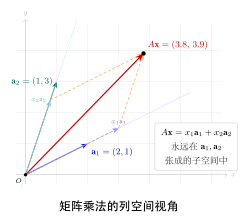

# 第3章：矩阵运算（融合版）

> 矩阵乘法不是逐元素相乘——这个认知跨越是线性代数学习中最重要的一步。
>
> **本文件**：融合"原版严格推导 + 速记 / 套路 / 自测"。保留原版完整正文 + 前置一例速记 / 思维路径 + 后追加方法总结与自测。

> **一例速记**：
> **加法 / 数乘**：逐元素；同形状才能加。$c(A+B)=cA+cB$，$(c+d)A=cA+dA$。
> **矩阵乘法**：$(m\times\mathbf{k})\cdot(\mathbf{k}\times n)=m\times n$；$C_{ij}=\sum_l A_{il}B_{lj}$（第 $i$ 行 $\times$ 第 $j$ 列内积）。**不满足交换律**：$AB\neq BA$（一般）。
> **转置**：行列互换；$(AB)^T = B^TA^T$（顺序反转！）；对称矩阵 $A^T=A$；$BB^T$ 永远对称。
> **迹**：$\mathrm{tr}(A)=\sum_i a_{ii}$；$\mathrm{tr}(AB)=\mathrm{tr}(BA)$；$\|A\|_F^2=\mathrm{tr}(A^TA)$。
> **AI 关联**：前向传播 $\mathbf{y}=W\mathbf{x}$ = 矩阵乘向量；反向传播梯度 = $W^T$；注意力 $QK^T$ 含转置；批处理 $Y=XW^T$ 矩阵乘矩阵。

---

## 引入：矩阵乘法的维度陷阱

> **题目**：设 $A\in\mathbb{R}^{3\times 4}$，$B\in\mathbb{R}^{4\times 2}$，$C\in\mathbb{R}^{2\times 3}$。判断以下哪些乘积有定义，并写出结果形状：(1) $AB$；(2) $BA$；(3) $ABC$；(4) $CA$。

请先停下来想一想：乘积 $PQ$ 有定义的唯一条件是 $P$ 的**列数** $=$ $Q$ 的**行数**。下面把内心独白还原。

---

## 思维路径还原（解题者的内心独白）

> "处理维度问题，我的习惯是把每个矩阵的形状写成"行 $\times$ 列"，然后检查"内维"是否匹配。
>
> **已知**：$A$：$3\times 4$；$B$：$4\times 2$；$C$：$2\times 3$。
>
> **(1) $AB$**：$A$ 的列数 $=4$，$B$ 的行数 $=4$，**内维匹配**。结果形状 $(3\times\mathbf{4})\cdot(\mathbf{4}\times 2) = 3\times 2$。有定义 ✓
>
> **(2) $BA$**：$B$ 的列数 $=2$，$A$ 的行数 $=3$，$2\neq 3$，**内维不匹配**，无定义 ✗。这就是"矩阵乘法不可随意交换"的具体体现——交换之后形状就不对了。
>
> **(3) $ABC$**：先结合律：$(AB)C$。$AB$ 形状 $3\times 2$，$C$ 形状 $2\times 3$，内维 $=2$，匹配。结果 $3\times 3$。有定义 ✓
>
> **(4) $CA$**：$C$ 的列数 $=3$，$A$ 的行数 $=3$，**内维匹配**。结果 $(2\times\mathbf{3})\cdot(\mathbf{3}\times 4) = 2\times 4$。有定义 ✓ 注意 $CA\neq AC$（$AC$ 甚至无定义：$A$ 列数 $4\neq C$ 行数 $2$）。
>
> **关键收获**：$AB$ 有定义不代表 $BA$ 有定义；$AB$ 有定义但形状变了，意味着语义也变了（维度不同的空间之间的映射方向不同）。深度学习里每次写矩阵乘法都要先核对维度。"

---

## 学习目标

完成本章学习后，你将能够：

- 掌握矩阵加法和标量乘法的定义与性质
- 深入理解矩阵乘法的定义、条件和计算方法
- 熟练运用矩阵转置及其代数性质
- 理解矩阵乘法不满足交换律，并能举出反例说明其重要性

---

## 3.1 矩阵加法与标量乘法

### 矩阵加法的定义

两个矩阵相加，要求它们具有**相同的形状**（相同的行数和列数）。设 $A$ 和 $B$ 均为 $m \times n$ 矩阵，则它们的和 $C = A + B$ 也是 $m \times n$ 矩阵，定义为对应元素相加：

$$C_{ij} = A_{ij} + B_{ij}, \quad 1 \le i \le m,\ 1 \le j \le n$$

**示例：**

$$A = \begin{pmatrix} 1 & 2 \\ 3 & 4 \end{pmatrix}, \quad B = \begin{pmatrix} 5 & 6 \\ 7 & 8 \end{pmatrix}$$

$$A + B = \begin{pmatrix} 1+5 & 2+6 \\ 3+7 & 4+8 \end{pmatrix} = \begin{pmatrix} 6 & 8 \\ 10 & 12 \end{pmatrix}$$

若两矩阵形状不同，则加法**无定义**。

### 标量乘法的定义

设 $c$ 为标量（实数），$A$ 为 $m \times n$ 矩阵，则标量乘法 $cA$ 定义为矩阵每个元素都乘以 $c$：

$$(cA)_{ij} = c \cdot A_{ij}$$

**示例：**

$$3 \cdot \begin{pmatrix} 1 & -2 \\ 0 & 4 \end{pmatrix} = \begin{pmatrix} 3 & -6 \\ 0 & 12 \end{pmatrix}$$

### 运算性质

设 $A$、$B$、$C$ 为同形状矩阵，$c$、$d$ 为标量，则：

| 性质 | 公式 |
|------|------|
| 交换律 | $A + B = B + A$ |
| 结合律 | $(A + B) + C = A + (B + C)$ |
| 零矩阵 | $A + O = A$（$O$ 为全零矩阵） |
| 标量分配律（矩阵） | $c(A + B) = cA + cB$ |
| 标量分配律（标量） | $(c + d)A = cA + dA$ |
| 标量结合律 | $c(dA) = (cd)A$ |

这些性质说明，全体 $m \times n$ 矩阵在加法和标量乘法下构成一个**向量空间**。

---

## 3.2 矩阵乘法

矩阵乘法是矩阵运算中最核心、也最容易出错的运算。它的定义与直觉中的"逐元素相乘"截然不同。

### 矩阵乘法的条件（维度匹配）

设 $A$ 为 $m \times k$ 矩阵，$B$ 为 $k \times n$ 矩阵，则乘积 $C = AB$ 存在，且 $C$ 为 $m \times n$ 矩阵。

**关键约束：** $A$ 的列数必须等于 $B$ 的行数（均为 $k$）。

$$\underbrace{A}_{m \times k} \cdot \underbrace{B}_{k \times n} = \underbrace{C}_{m \times n}$$

记忆口诀："内维消去，外维保留"——$(m \times \mathbf{k}) \cdot (\mathbf{k} \times n) = m \times n$。

### 矩阵乘法的定义

乘积矩阵 $C = AB$ 的第 $i$ 行第 $j$ 列元素，等于 $A$ 的第 $i$ 行与 $B$ 的第 $j$ 列的**内积**（点积）：

$$C_{ij} = \sum_{l=1}^{k} A_{il} \cdot B_{lj}$$

### 两个更深的视角：列的线性组合 与 映射的复合

上面的"行点乘列"是计算口径，但它**从哪来、为什么这样定义**？下面两个视角回答这个问题，也是后续章节真正依赖的理解。

**视角一：$A\mathbf{x}$ 是 $A$ 各列的线性组合。** 先看最简单的情形——矩阵乘**向量** $A\mathbf{x}$（即 $B$ 只有一列）。设 $A$ 的列为 $\mathbf{a}_1, \ldots, \mathbf{a}_k$，$\mathbf{x} = (x_1, \ldots, x_k)^T$，按定义逐分量展开即得

$$A\mathbf{x} = x_1\mathbf{a}_1 + x_2\mathbf{a}_2 + \cdots + x_k\mathbf{a}_k.$$

也就是说，**$A\mathbf{x}$ 就是以 $\mathbf{x}$ 的分量为系数、对 $A$ 的列做线性组合**。这是贯穿全书的核心视角：方程组 $A\mathbf{x}=\mathbf{b}$ 有解 $\iff$ $\mathbf{b}$ 落在 $A$ 各列张成的空间（**列空间**）内（第12章），秩、列空间、可解性都建立在它之上。一般的矩阵乘积 $AB$ 不过是把 $B$ 的每一列分别这样变换：$AB = A\,[\mathbf{b}_1\ \cdots\ \mathbf{b}_n] = [A\mathbf{b}_1\ \cdots\ A\mathbf{b}_n]$。



**视角二：矩阵乘法 = 线性映射的复合（行·列规则的来源）。** 为什么乘法偏偏定义成"行点乘列"、还不可交换？因为矩阵代表**线性映射**，而矩阵乘积代表映射的**复合**。设 $B$ 把 $\mathbf{x}$ 映到 $\mathbf{y}=B\mathbf{x}$，$A$ 再把 $\mathbf{y}$ 映到 $\mathbf{z}=A\mathbf{y}$。要让"先 $B$ 后 $A$"这个复合映射 $\mathbf{x}\mapsto A(B\mathbf{x})$ 也由某个矩阵 $C$ 表示，即 $C\mathbf{x}=A(B\mathbf{x})$，把两式代入逐分量计算：

$$z_i = \sum_{l} A_{il}\,y_l = \sum_{l} A_{il}\Big(\sum_{j} B_{lj}\,x_j\Big) = \sum_{j}\Big(\underbrace{\sum_{l} A_{il}B_{lj}}_{C_{ij}}\Big)x_j,$$

于是 $C_{ij}=\sum_{l} A_{il}B_{lj}$——**正是上面的乘法定义**。所以"行·列求和"不是凭空规定，而是"复合两个线性映射"逼出来的结果；又因为映射复合讲先后（先穿袜子再穿鞋 $\ne$ 先穿鞋再穿袜子），这正是 $AB \ne BA$ 的根源。第14章会把这一对应关系讲得更完整。

### 计算示例

设

$$A = \begin{pmatrix} 1 & 2 & 3 \\ 4 & 5 & 6 \end{pmatrix}_{2 \times 3}, \quad B = \begin{pmatrix} 7 & 8 \\ 9 & 10 \\ 11 & 12 \end{pmatrix}_{3 \times 2}$$

则 $C = AB$ 为 $2 \times 2$ 矩阵：

$$C_{11} = 1 \cdot 7 + 2 \cdot 9 + 3 \cdot 11 = 7 + 18 + 33 = 58$$
$$C_{12} = 1 \cdot 8 + 2 \cdot 10 + 3 \cdot 12 = 8 + 20 + 36 = 64$$
$$C_{21} = 4 \cdot 7 + 5 \cdot 9 + 6 \cdot 11 = 28 + 45 + 66 = 139$$
$$C_{22} = 4 \cdot 8 + 5 \cdot 10 + 6 \cdot 12 = 32 + 50 + 72 = 154$$

$$AB = \begin{pmatrix} 58 & 64 \\ 139 & 154 \end{pmatrix}$$

### 矩阵乘法的性质

**结合律：**

$$(AB)C = A(BC)$$

当维度匹配时，矩阵乘法满足结合律，这保证了多个矩阵连乘时计算顺序不影响结果（但计算效率可能不同）。

**分配律：**

$$A(B + C) = AB + AC$$
$$(A + B)C = AC + BC$$

**标量兼容性：**

$$c(AB) = (cA)B = A(cB)$$

**单位矩阵：**

单位矩阵 $I_n$（对角线为1，其余为0的 $n \times n$ 矩阵）满足：

$$AI = A, \quad IA = A$$

### 矩阵乘法不满足交换律

**这是矩阵乘法中最重要的非直觉性质：** $AB \ne BA$（一般情况下）。

**原因一：维度不对称**

若 $A$ 为 $2 \times 3$，$B$ 为 $3 \times 4$，则 $AB$ 为 $2 \times 4$，而 $BA$ 要求 $B$（$3 \times 4$）的列数等于 $A$（$2 \times 3$）的行数，即 $4 = 2$，矛盾，$BA$ **根本无定义**。

**原因二：即使形状允许，结果也通常不同**

设 $A = \begin{pmatrix} 1 & 2 \\ 0 & 0 \end{pmatrix}$，$B = \begin{pmatrix} 0 & 0 \\ 3 & 4 \end{pmatrix}$，则：

$$AB = \begin{pmatrix} 1 \cdot 0 + 2 \cdot 3 & 1 \cdot 0 + 2 \cdot 4 \\ 0 & 0 \end{pmatrix} = \begin{pmatrix} 6 & 8 \\ 0 & 0 \end{pmatrix}$$

$$BA = \begin{pmatrix} 0 & 0 \\ 3 \cdot 1 + 4 \cdot 0 & 3 \cdot 2 + 4 \cdot 0 \end{pmatrix} = \begin{pmatrix} 0 & 0 \\ 3 & 6 \end{pmatrix}$$

显然 $AB \ne BA$。

> **工程意义：** 在神经网络中，权重矩阵的左乘与右乘语义完全不同。乘法顺序写错会导致维度错误或语义错误，是深度学习实现中常见的 bug 来源。

---

## 3.3 矩阵转置

### 转置的定义

矩阵 $A$ 的**转置**记为 $A^T$，将 $A$ 的行与列互换：若 $A$ 为 $m \times n$ 矩阵，则 $A^T$ 为 $n \times m$ 矩阵，且

$$(A^T)_{ij} = A_{ji}$$

**示例：**

$$A = \begin{pmatrix} 1 & 2 & 3 \\ 4 & 5 & 6 \end{pmatrix}_{2 \times 3} \implies A^T = \begin{pmatrix} 1 & 4 \\ 2 & 5 \\ 3 & 6 \end{pmatrix}_{3 \times 2}$$

### 转置的性质

| 性质 | 公式 | 说明 |
|------|------|------|
| 双重转置 | $(A^T)^T = A$ | 转置两次还原 |
| 加法转置 | $(A + B)^T = A^T + B^T$ | 线性性 |
| 标量转置 | $(cA)^T = cA^T$ | 标量提出 |
| 乘积转置 | $(AB)^T = B^T A^T$ | **顺序反转！** |

**乘积转置公式的推导：** 设 $C = AB$，则

$$((AB)^T)_{ij} = C_{ji} = \sum_l A_{jl} B_{li} = \sum_l (B^T)_{il} (A^T)_{lj} = (B^T A^T)_{ij}$$

因此 $(AB)^T = B^T A^T$。对三个矩阵同理：$(ABC)^T = C^T B^T A^T$。

### 对称矩阵与转置

若方阵 $A$ 满足 $A^T = A$，则称 $A$ 为**对称矩阵**，即 $A_{ij} = A_{ji}$。

**示例：**

$$A = \begin{pmatrix} 1 & 2 & 3 \\ 2 & 5 & 6 \\ 3 & 6 & 9 \end{pmatrix}$$

**构造对称矩阵：** 对任意矩阵 $B$，$BB^T$ 和 $B^T B$ 均为对称矩阵（且为半正定矩阵），这在统计和机器学习中极为常见（协方差矩阵即为此形式）。

**证明：** $(BB^T)^T = (B^T)^T B^T = BB^T$ $\checkmark$

---

## 3.4 矩阵的幂

### 方阵的幂

只有**方阵**（$n \times n$ 矩阵）才能定义幂运算，因为方阵与自身的乘积维度匹配：$n \times n$ 乘 $n \times n$ 仍为 $n \times n$。

定义：

$$A^0 = I_n \quad \text{（零次幂为单位矩阵）}$$
$$A^k = \underbrace{A \cdot A \cdots A}_{k \text{ 个}}, \quad k \ge 1$$

### 矩阵幂的运算律

$$A^m \cdot A^n = A^{m+n}$$
$$(A^m)^n = A^{mn}$$

**注意：** 一般情况下 $(AB)^k \ne A^k B^k$，因为矩阵乘法不满足交换律。

### 计算示例

设 $A = \begin{pmatrix} 1 & 1 \\ 0 & 1 \end{pmatrix}$（切变矩阵），计算其幂：

$$A^2 = \begin{pmatrix} 1 & 1 \\ 0 & 1 \end{pmatrix}\begin{pmatrix} 1 & 1 \\ 0 & 1 \end{pmatrix} = \begin{pmatrix} 1 & 2 \\ 0 & 1 \end{pmatrix}$$

$$A^3 = A^2 \cdot A = \begin{pmatrix} 1 & 2 \\ 0 & 1 \end{pmatrix}\begin{pmatrix} 1 & 1 \\ 0 & 1 \end{pmatrix} = \begin{pmatrix} 1 & 3 \\ 0 & 1 \end{pmatrix}$$

规律显现：$A^k = \begin{pmatrix} 1 & k \\ 0 & 1 \end{pmatrix}$，可用数学归纳法严格证明。

---

## 3.5 分块矩阵（选讲）

### 分块矩阵的概念

对于大型矩阵，可以将其划分为若干子矩阵（**块**），每个块视为一个"元素"进行运算。这种技巧在理论分析和高性能计算中都极为重要。

**示例：** 将 $4 \times 4$ 矩阵分成四个 $2 \times 2$ 的块：

$$M = \left(\begin{array}{cc|cc} 1 & 2 & 3 & 4 \\ 5 & 6 & 7 & 8 \\ \hline 9 & 10 & 11 & 12 \\ 13 & 14 & 15 & 16 \end{array}\right) = \begin{pmatrix} A_{11} & A_{12} \\ A_{21} & A_{22} \end{pmatrix}$$

其中 $A_{11} = \begin{pmatrix} 1 & 2 \\ 5 & 6 \end{pmatrix}$，$A_{12} = \begin{pmatrix} 3 & 4 \\ 7 & 8 \end{pmatrix}$，等等。

### 分块矩阵的运算

若分块方式兼容，分块矩阵的乘法可以**按块进行**，就像普通矩阵乘法一样：

$$\begin{pmatrix} A_{11} & A_{12} \\ A_{21} & A_{22} \end{pmatrix} \begin{pmatrix} B_{11} & B_{12} \\ B_{21} & B_{22} \end{pmatrix} = \begin{pmatrix} A_{11}B_{11} + A_{12}B_{21} & A_{11}B_{12} + A_{12}B_{22} \\ A_{21}B_{11} + A_{22}B_{21} & A_{21}B_{12} + A_{22}B_{22} \end{pmatrix}$$

**工程价值：** GPU 计算中的矩阵乘法正是利用分块策略，将大矩阵分批装入共享内存，显著提升计算效率。PyTorch、cuBLAS 等框架底层均依赖此思想。

---

## 3.6 矩阵的迹

### 迹的定义

方阵 $A \in \mathbb{R}^{n \times n}$ 的**迹**（Trace）定义为对角元素之和：

$$\text{tr}(A) = \sum_{i=1}^{n} a_{ii}$$

### 迹的性质

| 性质 | 公式 | 说明 |
|------|------|------|
| 线性性 | $\text{tr}(aA + bB) = a\,\text{tr}(A) + b\,\text{tr}(B)$ | |
| 转置不变 | $\text{tr}(A^T) = \text{tr}(A)$ | |
| **循环置换不变性** | $\text{tr}(ABC) = \text{tr}(BCA) = \text{tr}(CAB)$ | 最重要的性质 |
| 乘积交换 | $\text{tr}(AB) = \text{tr}(BA)$ | 循环置换的特例 |
| 与特征值 | $\text{tr}(A) = \sum_i \lambda_i$ | 所有特征值之和 |
| 与Frobenius范数 | $\|A\|_F^2 = \text{tr}(A^T A)$ | |
| 内积表示 | $\mathbf{x}^T A \mathbf{x} = \text{tr}(A\mathbf{x}\mathbf{x}^T)$ | 矩阵微积分常用 |

**注意**：循环置换不变性要求维度兼容，且只能**循环移位**，不能任意重排：$\text{tr}(ABC) \neq \text{tr}(ACB)$（一般不等）。

**迹在矩阵微积分中的核心作用**：矩阵求导中的"迹技巧"（Trace Trick）可以将标量表达式写成迹的形式以方便求导，在第24章中详细应用。

---

## 本章小结

| 运算 | 条件 | 结果形状 | 是否满足交换律 |
|------|------|----------|----------------|
| $A + B$ | $A$、$B$ 同形 | 与 $A$、$B$ 相同 | 是 |
| $cA$ | 无限制 | 与 $A$ 相同 | — |
| $AB$ | $A$ 的列数 $=$ $B$ 的行数 | $m \times n$（$A$ 为 $m \times k$，$B$ 为 $k \times n$） | **否** |
| $A^T$ | 无限制 | $n \times m$（$A$ 为 $m \times n$） | — |
| $A^k$ | $A$ 必须为方阵 | 与 $A$ 相同 | — |

**核心要点回顾：**

1. 矩阵加法是逐元素的，标量乘法将每个元素同乘一个数。
2. 矩阵乘法 $C_{ij}$ 是 $A$ 第 $i$ 行与 $B$ 第 $j$ 列的内积，要求"内维"匹配。
3. 矩阵乘法满足结合律和分配律，但**不满足交换律**。
4. 转置将行列互换；乘积转置需**反转顺序**：$(AB)^T = B^T A^T$。
5. 对称矩阵满足 $A = A^T$；$BB^T$ 永远是对称矩阵。

---

## 深度学习应用

### 概念回顾

矩阵运算是深度学习的计算基础。神经网络的前向传播、反向传播、注意力机制，本质上都是一系列矩阵运算的组合。理解这些运算，不仅能读懂论文中的数学推导，还能在实现时避免维度错误。

### 在深度学习中的应用

**1. 全连接层的前向传播**

单个样本通过全连接层：

$$\mathbf{y} = W\mathbf{x} + \mathbf{b}$$

其中 $\mathbf{x} \in \mathbb{R}^{d_{in}}$ 为输入，$W \in \mathbb{R}^{d_{out} \times d_{in}}$ 为权重矩阵，$\mathbf{b} \in \mathbb{R}^{d_{out}}$ 为偏置向量，$\mathbf{y} \in \mathbb{R}^{d_{out}}$ 为输出。

**2. 批量处理（Batch Processing）**

实际训练时一次处理 $N$ 个样本（batch），将样本排成行：

$$Y = XW^T + \mathbf{b}$$

其中 $X \in \mathbb{R}^{N \times d_{in}}$（每行是一个样本），$W^T \in \mathbb{R}^{d_{in} \times d_{out}}$，$Y \in \mathbb{R}^{N \times d_{out}}$。此处 $W^T$ 中的转置正是矩阵转置在工程中的直接体现。

**3. 注意力机制中的矩阵乘法**

Transformer 中的缩放点积注意力：

$$\text{Attention}(Q, K, V) = \text{softmax}\!\left(\frac{QK^T}{\sqrt{d_k}}\right)V$$

其中 $Q, K \in \mathbb{R}^{n \times d_k}$，$V \in \mathbb{R}^{n \times d_v}$。$QK^T \in \mathbb{R}^{n \times n}$ 是注意力分数矩阵，衡量每对 token 之间的相关性。

**4. 转置在反向传播中的作用**

前向传播：$\mathbf{y} = W\mathbf{x}$

反向传播中，损失 $L$ 对输入的梯度为：

$$\frac{\partial L}{\partial \mathbf{x}} = W^T \frac{\partial L}{\partial \mathbf{y}}$$

转置矩阵 $W^T$ 将梯度从输出空间"投影"回输入空间。这是链式法则与矩阵转置性质 $(AB)^T = B^T A^T$ 的直接应用。

### 代码示例（Python/PyTorch）

```python
import torch
import torch.nn.functional as F

# ── 示例1：全连接层手动实现 ──────────────────────────────
batch_size, d_in, d_out = 4, 8, 16

X = torch.randn(batch_size, d_in)   # (4, 8)
W = torch.randn(d_out, d_in)        # (16, 8)
b = torch.randn(d_out)              # (16,)

# 等价于 nn.Linear(d_in, d_out) 的前向传播
Y = X @ W.T + b                     # (4, 16)
print(f"输出形状: {Y.shape}")        # torch.Size([4, 16])

# ── 示例2：矩阵乘法不满足交换律的验证 ────────────────────
A = torch.tensor([[1.0, 2], [3, 4]])
B = torch.tensor([[0.0, 1], [1, 0]])

AB = A @ B
BA = B @ A
print(f"AB =\n{AB}")
print(f"BA =\n{BA}")
print(f"AB == BA: {torch.allclose(AB, BA)}")  # False

# ── 示例3：缩放点积注意力 ─────────────────────────────────
def scaled_dot_product_attention(Q, K, V):
    """
    Q: (batch, n, d_k)
    K: (batch, n, d_k)
    V: (batch, n, d_v)
    """
    d_k = Q.shape[-1]
    # QK^T / sqrt(d_k)，维度：(batch, n, n)
    scores = Q @ K.transpose(-2, -1) / (d_k ** 0.5)
    weights = F.softmax(scores, dim=-1)
    # 加权聚合 V，维度：(batch, n, d_v)
    output = weights @ V
    return output, weights

batch, n, d_k, d_v = 2, 5, 8, 16
Q = torch.randn(batch, n, d_k)
K = torch.randn(batch, n, d_k)
V = torch.randn(batch, n, d_v)

output, attn_weights = scaled_dot_product_attention(Q, K, V)
print(f"注意力输出形状: {output.shape}")    # (2, 5, 16)
print(f"注意力权重形状: {attn_weights.shape}")  # (2, 5, 5)

# ── 示例4：转置性质验证 ───────────────────────────────────
A = torch.randn(3, 4)
B = torch.randn(4, 5)

lhs = (A @ B).T          # (AB)^T
rhs = B.T @ A.T          # B^T A^T

print(f"(AB)^T == B^T A^T: {torch.allclose(lhs, rhs)}")  # True
```

### 延伸阅读

- **《Deep Learning》**（Goodfellow et al.）第2章：线性代数基础，详细介绍矩阵运算在深度学习中的角色
- **《Attention Is All You Need》**（Vaswani et al., 2017）：Transformer 原论文，注意力机制的权威来源
- **3Blue1Brown「线性代数的本质」系列**：矩阵乘法的几何直觉（YouTube）
- **fast.ai 线性代数实用课程**：从代码角度理解矩阵运算

---

## 练习题

**练习 3.1（矩阵加法与标量乘法）**

设 $A = \begin{pmatrix} 2 & -1 \\ 0 & 3 \end{pmatrix}$，$B = \begin{pmatrix} 1 & 4 \\ -2 & 1 \end{pmatrix}$，计算 $3A - 2B$。

---

**练习 3.2（矩阵乘法）**

设 $A = \begin{pmatrix} 1 & 0 & 2 \\ -1 & 3 & 1 \end{pmatrix}$，$B = \begin{pmatrix} 3 & 1 \\ 2 & -1 \\ 0 & 4 \end{pmatrix}$，计算 $AB$。并说明 $BA$ 的形状，以及 $AB \ne BA$ 的含义。

---

**练习 3.3（转置性质）**

设 $A = \begin{pmatrix} 1 & 2 \\ 3 & 4 \\ 5 & 6 \end{pmatrix}$，验证 $(A^T)^T = A$，并计算 $A^T A$ 和 $AA^T$，说明它们各自的形状和对称性。

---

**练习 3.4（交换律反例）**

找一对 $2 \times 2$ 矩阵 $A$ 和 $B$（不是单位矩阵，不是零矩阵），满足 $AB = BA$（即它们可交换）。这说明什么？

---

**练习 3.5（应用题：全连接层维度分析）**

一个全连接神经网络层接受形状为 $(32, 128)$ 的输入（批量大小32，特征维度128），权重矩阵 $W$ 使得输出形状为 $(32, 64)$。

(a) $W$ 的形状是多少？
(b) 若用公式 $Y = XW^T + \mathbf{b}$ 计算，$W$ 和 $\mathbf{b}$ 的形状分别是什么？
(c) 写出计算输出形状的推导过程。

---

## 练习答案

<details>
<summary>练习 3.1 答案</summary>

$$3A = 3\begin{pmatrix} 2 & -1 \\ 0 & 3 \end{pmatrix} = \begin{pmatrix} 6 & -3 \\ 0 & 9 \end{pmatrix}$$

$$2B = 2\begin{pmatrix} 1 & 4 \\ -2 & 1 \end{pmatrix} = \begin{pmatrix} 2 & 8 \\ -4 & 2 \end{pmatrix}$$

$$3A - 2B = \begin{pmatrix} 6-2 & -3-8 \\ 0-(-4) & 9-2 \end{pmatrix} = \begin{pmatrix} 4 & -11 \\ 4 & 7 \end{pmatrix}$$

</details>

<details>
<summary>练习 3.2 答案</summary>

$A$ 为 $2 \times 3$，$B$ 为 $3 \times 2$，所以 $AB$ 为 $2 \times 2$：

$$C_{11} = 1 \cdot 3 + 0 \cdot 2 + 2 \cdot 0 = 3$$
$$C_{12} = 1 \cdot 1 + 0 \cdot (-1) + 2 \cdot 4 = 9$$
$$C_{21} = (-1) \cdot 3 + 3 \cdot 2 + 1 \cdot 0 = 3$$
$$C_{22} = (-1) \cdot 1 + 3 \cdot (-1) + 1 \cdot 4 = 0$$

$$AB = \begin{pmatrix} 3 & 9 \\ 3 & 0 \end{pmatrix}$$

而 $BA$ 为 $3 \times 3$ 矩阵（$B$ 为 $3 \times 2$，$A$ 为 $2 \times 3$），形状与 $AB$（$2 \times 2$）不同，因此 $AB \ne BA$ 不仅是数值不等，连**形状都不同**，两者根本无法比较相等性。

</details>

<details>
<summary>练习 3.3 答案</summary>

$A$ 为 $3 \times 2$，$A^T = \begin{pmatrix} 1 & 3 & 5 \\ 2 & 4 & 6 \end{pmatrix}$ 为 $2 \times 3$，$(A^T)^T = A$ 显然成立。

$$A^T A = \begin{pmatrix} 1 & 3 & 5 \\ 2 & 4 & 6 \end{pmatrix}\begin{pmatrix} 1 & 2 \\ 3 & 4 \\ 5 & 6 \end{pmatrix} = \begin{pmatrix} 1+9+25 & 2+12+30 \\ 2+12+30 & 4+16+36 \end{pmatrix} = \begin{pmatrix} 35 & 44 \\ 44 & 56 \end{pmatrix}$$

形状为 $2 \times 2$，对称（$A^T A = (A^T A)^T$）。

$$AA^T = \begin{pmatrix} 1 & 2 \\ 3 & 4 \\ 5 & 6 \end{pmatrix}\begin{pmatrix} 1 & 3 & 5 \\ 2 & 4 & 6 \end{pmatrix} = \begin{pmatrix} 5 & 11 & 17 \\ 11 & 25 & 39 \\ 17 & 39 & 61 \end{pmatrix}$$

形状为 $3 \times 3$，同样对称。这验证了 $B^T B$ 和 $BB^T$ 均为对称矩阵的结论。

</details>

<details>
<summary>练习 3.4 答案</summary>

**一个简单的例子：** 取 $A = \begin{pmatrix} 1 & 0 \\ 0 & 2 \end{pmatrix}$，$B = \begin{pmatrix} 3 & 0 \\ 0 & 5 \end{pmatrix}$（均为对角矩阵）。

$$AB = \begin{pmatrix} 3 & 0 \\ 0 & 10 \end{pmatrix} = BA$$

**结论：** 两个同阶对角矩阵总是可以交换的，因为它们的乘积等于对角线元素逐一相乘，乘法顺序不影响结果。更一般地，"可交换"并不是矩阵的通性，而是需要特殊结构（如均为对角矩阵、共享相同的特征向量等）才能满足的条件。

</details>

<details>
<summary>练习 3.5 答案</summary>

**(a)** 设 $W$ 形状为 $r \times c$。

输入 $X$ 形状为 $(32, 128)$，输出 $Y$ 形状为 $(32, 64)$。

若使用 $Y = XW$，则 $W$ 必须满足 $(32 \times 128)(128 \times ?) = (32 \times 64)$，故 $W$ 的形状为 $\mathbf{128 \times 64}$。

**(b)** 若使用公式 $Y = XW^T + \mathbf{b}$（PyTorch `nn.Linear` 的实际存储方式）：

- $W$ 存储形状为 $64 \times 128$（输出维度 × 输入维度），$W^T$ 形状为 $128 \times 64$
- $\mathbf{b}$ 形状为 $(64,)$（每个输出神经元一个偏置，广播到整个 batch）

**(c)** 维度推导：

$$\underbrace{X}_{32 \times 128} \cdot \underbrace{W^T}_{128 \times 64} = \underbrace{Y'}_{32 \times 64}$$

加上偏置（广播）：

$$\underbrace{Y'}_{32 \times 64} + \underbrace{\mathbf{b}}_{(64,) \to 32 \times 64} = \underbrace{Y}_{32 \times 64}$$

最终输出形状为 $(32, 64)$，符合预期。

</details>

---

## 抽象成方法（套路总结）

### 矩阵运算核心速查

| 运算 | 条件 | 结果形状 | 交换律 |
|---|---|---|---|
| $A+B$ | 同形状 $m\times n$ | $m\times n$ | 是 |
| $cA$ | 无限制 | 与 $A$ 相同 | — |
| $AB$ | $A$：$m\times k$，$B$：$k\times n$ | $m\times n$ | **否** |
| $A^T$ | 无限制 | $n\times m$（$A$ 为 $m\times n$） | — |
| $A^k$ | $A$ 必须方阵 | 与 $A$ 相同 | — |
| $\mathrm{tr}(A)$ | $A$ 必须方阵 | 标量 | $\mathrm{tr}(AB)=\mathrm{tr}(BA)$ |

### 矩阵乘法维度检查 3 步

1. 写出每个矩阵的形状：$A_{m\times k}$，$B_{k\times n}$
2. 检查"内维"是否相等（$A$ 的列 $=$ $B$ 的行）
3. 结果形状 $=$ "外维"：$m\times n$

### 转置公式的记忆法

$(AB)^T = B^T A^T$（**逆序**）；类推到多个：$(ABC)^T = C^T B^T A^T$。

记忆口诀：转置"脱外套"的顺序和穿上时相反——后穿的先脱。

### 迹的 3 大性质

1. **线性**：$\mathrm{tr}(aA+bB) = a\,\mathrm{tr}(A) + b\,\mathrm{tr}(B)$
2. **循环不变**：$\mathrm{tr}(ABC) = \mathrm{tr}(BCA) = \mathrm{tr}(CAB)$（只能**循环**，不能任意重排）
3. **Frobenius 范数**：$\|A\|_F^2 = \mathrm{tr}(A^TA)$

---

## 方法变形

### 变形 1：矩阵乘法顺序错误是深度学习最常见 Bug

前向传播 $\mathbf{y} = W\mathbf{x}$，$W\in\mathbb{R}^{d_{out}\times d_{in}}$，$\mathbf{x}\in\mathbb{R}^{d_{in}}$。若写成 $\mathbf{x}^T W$，则形状变为 $(1\times d_{in})\cdot(d_{out}\times d_{in})$，内维不匹配，PyTorch 报错。始终先写形状，再写乘法。

### 变形 2：批处理时转置列转置

单样本：$\mathbf{y}=W\mathbf{x}$（列向量乘法）；批处理：$Y = XW^T$（行样本矩阵 $\times$ 转置权重）。两种写法等价，但 $W$ 的存储形状和计算中转置方向不同，需对应代码中的 `A @ W.T`。

### 变形 3：证明 $BB^T$ 对称

$(BB^T)^T = (B^T)^T B^T = BB^T$。结论：任意矩阵 $B$ 的 $BB^T$ 和 $B^TB$ 均对称。这是构造协方差矩阵、Gram 矩阵的理论基础。

### 变形 4：利用迹技巧化简矩阵导数

标量 $\mathbf{x}^T A \mathbf{x} = \mathrm{tr}(A\mathbf{x}\mathbf{x}^T)$（利用迹的循环置换）。矩阵微积分中，将标量写成迹的形式可以方便地用矩阵求导公式处理。例如 Frobenius 范数的梯度推导依赖 $\|A\|_F^2 = \mathrm{tr}(A^TA)$。

---

## 思考路标（条件反射）

1. 看到矩阵乘法 $AB$ → 立刻写出形状，检查内维是否匹配
2. 看到 $AB$ → 询问 $BA$ 是否有定义？即使有定义也通常 $\neq AB$
3. 看到 $(AB)^T$ → 立刻改写为 $B^TA^T$（反转顺序）
4. 看到 $BB^T$ 或 $B^TB$ → 一定是对称矩阵（且半正定）
5. 看到 $\mathrm{tr}(AB)$ → 可以换写为 $\mathrm{tr}(BA)$（两个矩阵可交换，但三个不行）
6. 看到 Frobenius 范数 $\|A\|_F$ → 等于 $\sqrt{\mathrm{tr}(A^TA)}$，是"所有元素平方和再开根"
7. 看到"矩阵幂" → 只有方阵才有；$(AB)^k \neq A^k B^k$（乘法不交换）
8. 看到"分块矩阵乘法" → 按块进行，就像普通矩阵乘法，但块之间顺序要对应
9. 看到反向传播梯度 $\partial L/\partial\mathbf{x}$ → 通常含 $W^T$，因为前向 $\mathbf{y}=W\mathbf{x}$
10. 看到 $\mathrm{tr}(A)$ → 联想特征值之和（$=\sum_i\lambda_i$）以及谱分析

---

## 易错点

1. **矩阵乘法当成逐元素相乘**：这是学线性代数最大的误区。$AB$ 的 $(i,j)$ 元素是 $A$ 第 $i$ 行和 $B$ 第 $j$ 列的内积（$k$ 项求和），**不是** $a_{ij}b_{ij}$。逐元素乘法是 Hadamard 积，用 $A\odot B$ 表示（PyTorch 中是 `A * B`）。

2. **转置乘积反转顺序忘了**：$(AB)^T = B^TA^T$，不是 $A^TB^T$。错误写法会导致维度不匹配或错误结论。对三个矩阵 $(ABC)^T = C^TB^TA^T$，每次都要反转。

3. **认为矩阵乘法满足交换律**：$AB=BA$ 只在极特殊情况下成立（如两者均为对角矩阵，或多项式函数关系）。一般情况下 $AB\neq BA$，甚至一个有定义另一个没有定义。

4. **迹的循环置换用错**：$\mathrm{tr}(ABC)=\mathrm{tr}(BCA)=\mathrm{tr}(CAB)$（循环移位），但 $\mathrm{tr}(ABC)\neq\mathrm{tr}(ACB)$（任意重排不成立）。常见错误是把两个矩阵的情形 $\mathrm{tr}(AB)=\mathrm{tr}(BA)$ 错误推广到三个矩阵任意重排。

5. **批处理中混淆 $XW^T$ 和 $WX$**：单样本 $\mathbf{y}=W\mathbf{x}$（$W$：$d_{out}\times d_{in}$，$\mathbf{x}$：$d_{in}\times 1$）；批处理通常写 $Y=XW^T$（$X$：$N\times d_{in}$，$W^T$：$d_{in}\times d_{out}$）。两种写法语义等价，但代码中 `W.T` 不能省略，否则维度直接出错。

---

## 典型应用例题

### 例 1：矩阵乘法计算 + 维度验证

> **题目**：$A=\begin{pmatrix}1&2\\3&4\\5&6\end{pmatrix}$，$B=\begin{pmatrix}1&0\\-1&2\end{pmatrix}$。计算 $AB$，并说明 $BA$ 是否有定义。

【思路】先写形状：$A$：$3\times 2$，$B$：$2\times 2$。$AB$：内维 $=2$，结果 $3\times 2$。

【解】
$C = AB$，$C_{ij} = \sum_l A_{il}B_{lj}$：

$$C_{11}=1\times 1+2\times(-1)=-1,\quad C_{12}=1\times 0+2\times 2=4$$
$$C_{21}=3\times 1+4\times(-1)=-1,\quad C_{22}=3\times 0+4\times 2=8$$
$$C_{31}=5\times 1+6\times(-1)=-1,\quad C_{32}=5\times 0+6\times 2=12$$

$AB = \begin{pmatrix}-1&4\\-1&8\\-1&12\end{pmatrix}$（$3\times 2$）。

$BA$：$B$：$2\times 2$，$A$：$3\times 2$，$B$ 的列数 $2\neq A$ 的行数 $3$，**无定义**。

【答案】$\boxed{AB=\begin{pmatrix}-1&4\\-1&8\\-1&12\end{pmatrix},\ BA\text{ 无定义}}$。

### 例 2：转置性质验证 + Frobenius 范数

> **题目**：$M=\begin{pmatrix}1&2\\3&4\end{pmatrix}$。(1) 验证 $(MM^T)^T=MM^T$；(2) 计算 $\|M\|_F$。

【思路】(1) 用转置公式；(2) 用 $\|M\|_F^2=\mathrm{tr}(M^TM)$ 或直接对所有元素平方求和。

【解】
(1) $MM^T = \begin{pmatrix}1&2\\3&4\end{pmatrix}\begin{pmatrix}1&3\\2&4\end{pmatrix} = \begin{pmatrix}5&11\\11&25\end{pmatrix}$。

观察：对角线为 $5, 25$，非对角元 $=11$（上下对称），故 $(MM^T)^T = MM^T$，对称 ✓。

(2) $\|M\|_F^2 = 1^2+2^2+3^2+4^2 = 1+4+9+16=30$，$\|M\|_F=\sqrt{30}$。

验证：$M^TM=\begin{pmatrix}10&14\\14&20\end{pmatrix}$，$\mathrm{tr}(M^TM)=10+20=30$ ✓。

【答案】$\boxed{\|M\|_F=\sqrt{30}}$；$(MM^T)$ 是对称矩阵。

### 例 3：迹的循环置换 + 深度学习应用

> **题目**：设 $\mathbf{x}\in\mathbb{R}^n$，$A\in\mathbb{R}^{n\times n}$（对称矩阵）。利用迹的性质证明 $\mathbf{x}^TA\mathbf{x} = \mathrm{tr}(A\mathbf{x}\mathbf{x}^T)$。

【思路】$\mathbf{x}^TA\mathbf{x}$ 是标量，标量的迹等于自身；再用循环置换。

【解】
因 $\mathbf{x}^TA\mathbf{x}\in\mathbb{R}$（标量），有 $\mathbf{x}^TA\mathbf{x} = \mathrm{tr}(\mathbf{x}^TA\mathbf{x})$（标量的迹 = 自身）。

利用迹的循环置换（$\mathrm{tr}(PQR)=\mathrm{tr}(RPQ)$，令 $P=\mathbf{x}^T,\ Q=A,\ R=\mathbf{x}$）：

$$\mathrm{tr}(\mathbf{x}^TA\mathbf{x}) = \mathrm{tr}(\mathbf{x}\mathbf{x}^TA) = \mathrm{tr}(A\mathbf{x}\mathbf{x}^T) \quad\square$$

【注】$\mathbf{x}\mathbf{x}^T\in\mathbb{R}^{n\times n}$ 是外积（秩 1 矩阵）；这个恒等式在矩阵微积分中频繁用于推导二次型的梯度。

---

## 自测题

**自测 1**　$A\in\mathbb{R}^{2\times 3}$，$B\in\mathbb{R}^{3\times 4}$，$C\in\mathbb{R}^{4\times 2}$。写出 $ABC$ 的形状，并验证结合律：$(AB)C$ 与 $A(BC)$ 形状是否相同。

> 💡 提示：$AB$：$2\times 4$；$(AB)C$：$2\times 2$。$BC$：$3\times 2$；$A(BC)$：$2\times 2$。两者形状相同 $2\times 2$，结合律成立（值也相同，可代数验证）。

**自测 2**　$A=\begin{pmatrix}1&3\\2&4\end{pmatrix}$，$B=\begin{pmatrix}5&7\\6&8\end{pmatrix}$。计算 $(AB)^T$ 和 $B^TA^T$，验证两者相等。

> 💡 提示：$AB=\begin{pmatrix}23&31\\34&46\end{pmatrix}$，$(AB)^T=\begin{pmatrix}23&34\\31&46\end{pmatrix}$。$B^T=\begin{pmatrix}5&6\\7&8\end{pmatrix}$，$A^T=\begin{pmatrix}1&2\\3&4\end{pmatrix}$，$B^TA^T=\begin{pmatrix}23&34\\31&46\end{pmatrix}$。两者相等 ✓。

**自测 3**　计算 $\mathrm{tr}(AB)$ 和 $\mathrm{tr}(BA)$，其中 $A=\begin{pmatrix}1&0\\2&3\end{pmatrix}$，$B=\begin{pmatrix}4&5\\0&1\end{pmatrix}$。验证 $\mathrm{tr}(AB)=\mathrm{tr}(BA)$。

> 💡 提示：$AB=\begin{pmatrix}4&5\\8&13\end{pmatrix}$，$\mathrm{tr}(AB)=4+13=17$。$BA=\begin{pmatrix}14&20\\2&3\end{pmatrix}$，$\mathrm{tr}(BA)=14+3=17$。相等 ✓。

**自测 4**　Transformer 中，前向传播 $\mathbf{y}=W\mathbf{x}$（$W\in\mathbb{R}^{d_{out}\times d_{in}}$，$\mathbf{x}\in\mathbb{R}^{d_{in}}$），损失 $L$ 对输入的梯度为 $\partial L/\partial\mathbf{x} = W^T(\partial L/\partial\mathbf{y})$。说明 $W^T$ 的形状，以及为什么需要转置。

> 💡 提示：$W^T\in\mathbb{R}^{d_{in}\times d_{out}}$；$\partial L/\partial\mathbf{y}\in\mathbb{R}^{d_{out}}$；乘积形状 $(d_{in}\times\mathbf{d_{out}})\cdot(\mathbf{d_{out}}\times 1)=d_{in}\times 1$，与 $\mathbf{x}$ 维度匹配。**转置的作用**：把梯度从 $d_{out}$ 维的输出空间"投影"回 $d_{in}$ 维的输入空间——维度匹配的保证。

**自测 5**　证明：若 $A$ 是对称矩阵且 $B$ 是对称矩阵，则 $AB$ 是对称矩阵当且仅当 $AB=BA$。

> 💡 提示：$(AB)^T = B^TA^T = BA$（因 $A^T=A$，$B^T=B$）。若 $AB$ 对称则 $(AB)^T=AB$，即 $BA=AB$；反之若 $AB=BA$，则 $(AB)^T=BA=AB$，对称。两个对称矩阵的乘积是对称矩阵 $\Leftrightarrow$ 它们可交换——这是面试常考结论。

---

**回头看一眼"一例速记"**：

> 矩阵加减逐元素、同形状才能加；矩阵乘法内维消去外维留，结果是"行内积列"。
> $(AB)^T=B^TA^T$（反转顺序）；$BB^T$ 永远对称；$AB\neq BA$（一般）。
> $\mathrm{tr}(AB)=\mathrm{tr}(BA)$；$\|A\|_F^2=\mathrm{tr}(A^TA)$；反向传播含 $W^T$。

如果现在不看笔记，能独立完成例 1 + 自测 4 + 自测 5——本章，你拿下了。

---

## 融合版说明

本版 = **原版（严格定义 + 深度学习应用 + 练习）** + **重写版（速记 / 套路 / 例题 / 自测）** 融合：

| 段 | 来源 | 价值 |
|---|---|---|
| 一例速记 + 引入 + 思维路径还原 | 重写版（前置） | 建立直觉 / 条件反射 |
| 学习目标 + 3.1–3.6 严格正文 | 原版 | 完整定义与推导 |
| 本章小结 | 原版 | 公式速查 |
| 深度学习应用 + PyTorch 代码 | 原版 | 工业实战关联 |
| 练习题 + 详解 | 原版 | 系统巩固 |
| 抽象成方法 + 方法变形 | 重写版（后置） | 套路固化 |
| 思考路标 + 易错点 | 融合两版 | 条件反射 + 避雷 |
| 典型应用例题 3 例 | 重写版 | 演练精讲 |
| 自测题 5 题 | 重写版 | 额外验收 |

**适用**：一站式学习——先速记建立直觉，看严格推导，做套路总结，看代码实战，做习题巩固，自测验收。
