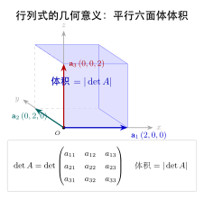

# 第8章：行列式的性质与应用（融合版）

> 行列式不只是一个数——它是矩阵"压缩空间"程度的精确度量，是线性代数中最深刻的不变量之一。
>
> **本文件**：融合"原版严格推导 + 速记 / 套路 / 自测"。保留原版完整正文 + 在最前置一例速记 / 思维路径 + 最后追加方法总结与自测。

> **一例速记**：
> **七条性质**：转置不变 / 行交换变号 / 公因子提取 / 倍加不变 / 零行为零 / 乘积公式 $\det(AB)=\det(A)\det(B)$ / 三角矩阵为对角线之积。
> **乘积公式推论**：$\det(A^{-1})=1/\det(A)$；$\det(kA)=k^n\det(A)$（$n$ 阶）。
> **Cramer 法则**：$x_i=\det(A_i)/\det(A)$，理论工具，复杂度 $O(n^{n+1})$，工程不用。
> **特征值**：$\det(A)=\prod_i\lambda_i$；零特征值等价于奇异。
> **AI 关联**：$\log|\det J|$ 项出现在 VAE 的 ELBO 和 Normalizing Flow 的对数似然中；可逆性 $\det\neq0$ 是 Flow 模型的硬约束。

---

## 引入：一道"乘积行列式"快算题

> **题目**：设 $A$ 是 $3\times3$ 矩阵，$\det(A)=2$，$\det(B)=3$。不计算矩阵乘法，直接给出 $\det(AB)$、$\det(A^{-1}B)$、$\det(2A)$。

请先停下来想一想：你需要真正去乘矩阵吗？还是行列式的性质可以一秒给出答案？

---

## 思维路径还原（解题者的内心独白）

> "题目说'不计算矩阵乘法'，这就是在暗示我用行列式的性质。
>
> **第一问 $\det(AB)$**：乘积公式——$\det(AB)=\det(A)\det(B)=2\times3=6$。无需展开，一行搞定。
>
> **第二问 $\det(A^{-1}B)$**：先用乘积公式拆开，$\det(A^{-1}B)=\det(A^{-1})\det(B)$。再用推论：$\det(A^{-1})=1/\det(A)=1/2$。所以 $\det(A^{-1}B)=\frac{1}{2}\times3=\frac{3}{2}$。
>
> **第三问 $\det(2A)$**：公因子提取推论——$\det(2A)=2^3\det(A)=8\times2=16$。关键是 $n=3$，每行都提出一个 $2$，共三次，所以是 $2^3$ 而不是 $2$！
>
> **常见陷阱**：$\det(2A)$ 写成 $2\det(A)=4$ ——忘记了 $n$ 次方。$n=3$ 矩阵乘以标量 $k$ 时，行列式乘以 $k^3$。
>
> **延伸思考**：如果 $\det(A)=0$，则 $A^{-1}$ 不存在，第二问无意义；$AB$ 必然奇异（$\det(AB)=0$），因为奇异矩阵的像不填满整个空间，加上任何矩阵都还是奇异。这就是为什么可逆性（非零行列式）是线性代数中最基本的条件。"

---

## 学习目标

完成本章学习后，你将能够：

- 掌握行列式的七条基本性质并理解其几何含义
- 利用行列式性质简化高阶行列式的计算
- 理解并计算范德蒙德行列式
- 掌握 Cramer 法则及其适用条件与局限
- 用行列式判断矩阵可逆性，并通过伴随矩阵法求逆
- 理解行列式与特征值的关系
- 掌握行列式在变换体积缩放、概率密度变换和 Normalizing Flows 中的应用

---

## 8.1 行列式的性质

行列式的强大之处在于一组系统的性质，它们既是计算工具，也是几何直觉的来源。以下以 $n$ 阶方阵 $A$ 为对象，逐一介绍这些性质。

### 性质一：转置不变性

$$\det(A^T) = \det(A)$$

**证明思路：** 对行列式的 Leibniz 公式，置换 $\sigma$ 与其逆 $\sigma^{-1}$ 一一对应，两者的符号相同（$\text{sgn}(\sigma) = \text{sgn}(\sigma^{-1})$），且遍历所有置换的乘积之和不变。$\square$

**几何意义：** 行和列的地位是对称的——对行成立的一切性质，对列也同样成立。这一性质使我们可以将所有行性质自动推广到列。

### 性质二：行（列）交换变号

交换矩阵的任意两行（或两列），行列式变号：

$$\det(\ldots, r_i, \ldots, r_j, \ldots) = -\det(\ldots, r_j, \ldots, r_i, \ldots)$$

**推论：** 若矩阵有两行（列）完全相同，则 $\det(A) = 0$。

**证明：** 设两行相同，交换这两行后行列式变号，但矩阵本身未变，故 $\det(A) = -\det(A)$，即 $\det(A) = 0$。$\square$

**示例：**

$$\det\begin{pmatrix} 1 & 2 \\ 3 & 4 \end{pmatrix} = -2, \quad \det\begin{pmatrix} 3 & 4 \\ 1 & 2 \end{pmatrix} = 3 \cdot 2 - 4 \cdot 1 = 2 = -(-2) \quad \checkmark$$

### 性质三：公因子提取

若某一行（列）的所有元素有公因子 $k$，则可将 $k$ 提到行列式外：

$$\det(\ldots, k \cdot r_i, \ldots) = k \cdot \det(\ldots, r_i, \ldots)$$

**推论：** $\det(kA) = k^n \det(A)$（对 $n$ 阶方阵，每一行都提出 $k$，共提 $n$ 次）。

**示例：**

$$\det\begin{pmatrix} 2 & 6 \\ 1 & 4 \end{pmatrix} = 2 \cdot \det\begin{pmatrix} 1 & 3 \\ 1 & 4 \end{pmatrix} = 2 \cdot (4 - 3) = 2$$

**注意：** $\det(A + B) \ne \det(A) + \det(B)$，行列式对整个矩阵**不**是线性的，仅对单独一行（列）是线性的。

### 性质四：行（列）加减不变

将某一行（列）的倍数加到另一行（列）上，行列式**不变**：

$$\det(\ldots, r_i + c \cdot r_j, \ldots, r_j, \ldots) = \det(\ldots, r_i, \ldots, r_j, \ldots)$$

**证明：** 利用行列式对行的线性性：

$$\det(\ldots, r_i + c \cdot r_j, \ldots) = \det(\ldots, r_i, \ldots) + c \cdot \det(\ldots, r_j, \ldots, r_j, \ldots)$$

由于最后一项中有两行相同，其行列式为 $0$，故等于原行列式。$\square$

**计算意义：** 这正是高斯消元的理论基础——对矩阵做初等行变换（倍加型），行列式不变。因此只要追踪交换操作，就能在化简过程中精确计算行列式。

### 性质五：若某行（列）全为零则行列式为零

$$\det(\ldots, \mathbf{0}, \ldots) = 0$$

**证明：** 将全零行提出公因子 $0$，得 $\det = 0 \cdot \det(\ldots) = 0$。$\square$

### 性质六：行列式的乘积公式

$$\det(AB) = \det(A) \cdot \det(B)$$

**这是行列式最重要的性质之一。**

**证明思路（简略）：** 若 $A$ 可逆，可将 $A$ 分解为初等矩阵之积 $A = E_1 E_2 \cdots E_k$，每个初等矩阵对行列式的作用已知（交换乘 $-1$，倍加不变，数乘乘 $c$），利用归纳可得等式成立。若 $A$ 奇异，则 $AB$ 也奇异，两侧均为 $0$。$\square$

**推论：**

$$\det(A^{-1}) = \frac{1}{\det(A)} \quad (\text{当} A \text{可逆时})$$

**证明：** 由 $AA^{-1} = I$，得 $\det(A)\det(A^{-1}) = \det(I) = 1$，因此 $\det(A^{-1}) = 1/\det(A)$。$\square$

### 性质七：三角矩阵的行列式

上三角矩阵（或下三角矩阵）的行列式等于**主对角线元素之积**：

$$\det\begin{pmatrix} a_{11} & * & \cdots & * \\ 0 & a_{22} & \cdots & * \\ \vdots & & \ddots & \vdots \\ 0 & 0 & \cdots & a_{nn} \end{pmatrix} = a_{11} \cdot a_{22} \cdots a_{nn}$$

**计算意义：** 结合性质四（行加减不变），这给出了一种高效的行列式计算路线：通过高斯消元将矩阵化为上三角形，则行列式等于对角线元素之积（需乘上交换次数带来的 $(-1)^k$ 因子）。

---

## 8.2 行列式的计算技巧

### 化为三角形矩阵

**一般步骤：**

1. 对矩阵做初等行变换（允许行交换和倍加），化为上三角矩阵；
2. 记录行交换次数 $k$（每次交换贡献一个 $-1$）；
3. 行列式 = $(-1)^k \times$ 对角线元素之积。

**示例：** 计算

$$\det\begin{pmatrix} 2 & 1 & -1 \\ 0 & 3 & 2 \\ 4 & -1 & 1 \end{pmatrix}$$

$r_3 \leftarrow r_3 - 2r_1$（无交换，$k=0$）：

$$\begin{pmatrix} 2 & 1 & -1 \\ 0 & 3 & 2 \\ 0 & -3 & 3 \end{pmatrix}$$

$r_3 \leftarrow r_3 + r_2$：

$$\begin{pmatrix} 2 & 1 & -1 \\ 0 & 3 & 2 \\ 0 & 0 & 5 \end{pmatrix}$$

$$\det = (-1)^0 \times 2 \times 3 \times 5 = 30$$

### 利用行列式性质简化计算

**技巧一：提取公因子**

若某行（列）有明显公因子，先提出，降低计算复杂度。

**技巧二：制造零元素**

利用倍加变换，使某行（列）有尽可能多的零，然后按该行（列）展开（Laplace 展开）。

**示例：**

$$\det\begin{pmatrix} 1 & 1 & 1 & 1 \\ 1 & 2 & 1 & 1 \\ 1 & 1 & 3 & 1 \\ 1 & 1 & 1 & 4 \end{pmatrix}$$

$c_2 \leftarrow c_2 - c_1$，$c_3 \leftarrow c_3 - c_1$，$c_4 \leftarrow c_4 - c_1$：

$$\det\begin{pmatrix} 1 & 0 & 0 & 0 \\ 1 & 1 & 0 & 0 \\ 1 & 0 & 2 & 0 \\ 1 & 0 & 0 & 3 \end{pmatrix}$$

按第一行展开，得 $\det = 1 \times \det\begin{pmatrix}1&0&0\\0&2&0\\0&0&3\end{pmatrix} = 1 \times 1 \times 2 \times 3 = 6$。

### 范德蒙德行列式

**定义：** $n$ 阶范德蒙德（Vandermonde）行列式定义为：

$$V_n = \det\begin{pmatrix} 1 & x_1 & x_1^2 & \cdots & x_1^{n-1} \\ 1 & x_2 & x_2^2 & \cdots & x_2^{n-1} \\ \vdots & \vdots & \vdots & & \vdots \\ 1 & x_n & x_n^2 & \cdots & x_n^{n-1} \end{pmatrix}$$

**结论：**

$$V_n = \prod_{1 \le i < j \le n} (x_j - x_i)$$

即所有 $x_j - x_i$（$j > i$）的乘积。

**推导思路（以 $n=3$ 为例）：**

$$V_3 = \det\begin{pmatrix} 1 & x_1 & x_1^2 \\ 1 & x_2 & x_2^2 \\ 1 & x_3 & x_3^2 \end{pmatrix}$$

$r_2 \leftarrow r_2 - r_1$，$r_3 \leftarrow r_3 - r_1$：

$$V_3 = \det\begin{pmatrix} 1 & x_1 & x_1^2 \\ 0 & x_2 - x_1 & x_2^2 - x_1^2 \\ 0 & x_3 - x_1 & x_3^2 - x_1^2 \end{pmatrix}$$

注意到 $x_k^2 - x_1^2 = (x_k - x_1)(x_k + x_1)$，从第 $2$、$3$ 行分别提出公因子 $(x_2 - x_1)$ 和 $(x_3 - x_1)$：

$$V_3 = (x_2 - x_1)(x_3 - x_1) \det\begin{pmatrix} 1 & x_1 & x_1^2 \\ 0 & 1 & x_2 + x_1 \\ 0 & 1 & x_3 + x_1 \end{pmatrix}$$

$r_3 \leftarrow r_3 - r_2$：

$$= (x_2 - x_1)(x_3 - x_1) \det\begin{pmatrix} 1 & x_1 & x_1^2 \\ 0 & 1 & x_2 + x_1 \\ 0 & 0 & x_3 - x_2 \end{pmatrix} = (x_2 - x_1)(x_3 - x_1)(x_3 - x_2)$$

**应用：** $V_n \ne 0$ 当且仅当所有 $x_i$ 互不相同。这在多项式插值（Lagrange 插值的唯一性）和编码理论（Reed-Solomon 码）中有核心应用。

---

## 8.3 Cramer 法则

### 内容

设 $A$ 是 $n \times n$ 可逆矩阵（即 $\det(A) \ne 0$），线性方程组 $A\mathbf{x} = \mathbf{b}$ 有唯一解，其第 $i$ 个分量为：

$$x_i = \frac{\det(A_i)}{\det(A)}, \quad i = 1, 2, \ldots, n$$

其中 $A_i$ 是将矩阵 $A$ 的第 $i$ 列替换为 $\mathbf{b}$ 所得到的矩阵：

$$A_i = \begin{pmatrix} | & & | & | & | & & | \\ \mathbf{a}_1 & \cdots & \mathbf{a}_{i-1} & \mathbf{b} & \mathbf{a}_{i+1} & \cdots & \mathbf{a}_n \\ | & & | & | & | & & | \end{pmatrix}$$

### 证明

设 $\mathbf{x} = (x_1, \ldots, x_n)^T$ 是方程组的解，则 $A\mathbf{x} = \mathbf{b}$，即

$$\mathbf{b} = x_1 \mathbf{a}_1 + x_2 \mathbf{a}_2 + \cdots + x_n \mathbf{a}_n$$

将 $\mathbf{b}$ 代入 $A_i$ 的第 $i$ 列，按第 $i$ 列展开行列式，利用行列式的线性性：

$$\det(A_i) = \det(\ldots, \mathbf{a}_{i-1}, x_1\mathbf{a}_1 + \cdots + x_n\mathbf{a}_n, \mathbf{a}_{i+1}, \ldots)$$

由线性性展开，只有 $x_i \mathbf{a}_i$ 项（其余项因有两列相同而为零）：

$$= x_i \det(\mathbf{a}_1, \ldots, \mathbf{a}_{i-1}, \mathbf{a}_i, \mathbf{a}_{i+1}, \ldots, \mathbf{a}_n) = x_i \det(A)$$

因此 $x_i = \det(A_i) / \det(A)$。$\square$

### 计算示例

求解方程组

$$\begin{cases} 2x_1 + x_2 = 5 \\ x_1 + 3x_2 = 10 \end{cases}$$

$A = \begin{pmatrix}2 & 1 \\ 1 & 3\end{pmatrix}$，$\mathbf{b} = \begin{pmatrix}5 \\ 10\end{pmatrix}$，$\det(A) = 6 - 1 = 5$。

$$x_1 = \frac{\det\begin{pmatrix}5 & 1 \\ 10 & 3\end{pmatrix}}{\det(A)} = \frac{15 - 10}{5} = 1, \quad x_2 = \frac{\det\begin{pmatrix}2 & 5 \\ 1 & 10\end{pmatrix}}{\det(A)} = \frac{20 - 5}{5} = 3$$

### 使用条件与局限

**使用条件：** $A$ 必须是可逆方阵（$\det(A) \ne 0$）。对欠定或过定方程组，Cramer 法则不适用。

**局限性：**

| 方面 | 说明 |
|------|------|
| 计算复杂度 | 需计算 $n+1$ 个 $n$ 阶行列式，复杂度 $O(n \cdot n!) \sim O(n^{n+1})$，远高于高斯消元的 $O(n^3)$ |
| 实用性 | 对 $n \ge 4$，计算量急剧增长，工程中从不使用 |
| 理论价值 | 给出解的显式表达式，便于理论分析（如参数方程组的解析性、控制理论等） |

> **工程准则：** Cramer 法则是一个理论工具，实际求解线性方程组请使用高斯消元或 LU 分解。

---

## 8.4 行列式的应用

### 判断矩阵可逆性

**核心定理：** $n$ 阶方阵 $A$ 可逆当且仅当 $\det(A) \ne 0$。

这一结论是第6章"可逆矩阵定理"的重要一条，它将可逆性从"存在逆矩阵"这一定义转化为一个可以直接计算检验的数值条件。

**几何直觉：** $\det(A) = 0$ 意味着 $A$ 将 $n$ 维空间压缩到低维超平面，体积变为零，这一压缩操作不可逆。$\det(A) \ne 0$ 意味着变换保持体积（可能缩放但不归零），因此可逆。

### 计算逆矩阵（伴随矩阵法）

**代数余子式与余子矩阵：**

矩阵 $A$ 的 $(i,j)$ **代数余子式**（cofactor）定义为：

$$C_{ij} = (-1)^{i+j} M_{ij}$$

其中 $M_{ij}$ 是删去第 $i$ 行第 $j$ 列后剩余的 $(n-1)$ 阶子矩阵的行列式（称为**余子式**）。

**Laplace 展开：** 行列式可按任意一行（或列）展开：

$$\det(A) = \sum_{j=1}^n a_{ij} C_{ij} \quad (\text{按第} i \text{行展开})$$

**伴随矩阵（经典伴随矩阵，adjugate）：**

$$\text{adj}(A) = (C_{ij})^T$$

即代数余子式矩阵的转置，第 $(i,j)$ 元素为 $C_{ji}$（注意下标顺序）。

**逆矩阵公式：**

$$A^{-1} = \frac{1}{\det(A)} \text{adj}(A)$$

**$2 \times 2$ 特例：**

$$\begin{pmatrix} a & b \\ c & d \end{pmatrix}^{-1} = \frac{1}{ad-bc}\begin{pmatrix} d & -b \\ -c & a \end{pmatrix}$$

**$3 \times 3$ 示例：** 求

$$A = \begin{pmatrix} 1 & 2 & 0 \\ 0 & 1 & 1 \\ 1 & 0 & 2 \end{pmatrix}$$

的逆矩阵。

先计算 $\det(A)$（按第一列展开）：

$$\det(A) = 1 \cdot \det\begin{pmatrix}1&1\\0&2\end{pmatrix} - 0 + 1 \cdot \det\begin{pmatrix}2&0\\1&1\end{pmatrix} = 1 \cdot 2 + 1 \cdot 2 = 4$$

计算各代数余子式（以 $C_{11}, C_{12}, C_{13}$ 为例）：

$$C_{11} = (+1)\det\begin{pmatrix}1&1\\0&2\end{pmatrix} = 2, \quad C_{21} = (-1)\det\begin{pmatrix}2&0\\0&2\end{pmatrix} = -4, \quad C_{31} = (+1)\det\begin{pmatrix}2&0\\1&1\end{pmatrix} = 2$$

$$C_{12} = (-1)\det\begin{pmatrix}0&1\\1&2\end{pmatrix} = 1, \quad C_{22} = (+1)\det\begin{pmatrix}1&0\\1&2\end{pmatrix} = 2, \quad C_{32} = (-1)\det\begin{pmatrix}1&0\\0&1\end{pmatrix} = -1$$

$$C_{13} = (+1)\det\begin{pmatrix}0&1\\1&0\end{pmatrix} = -1, \quad C_{23} = (-1)\det\begin{pmatrix}1&2\\1&0\end{pmatrix} = 2, \quad C_{33} = (+1)\det\begin{pmatrix}1&2\\0&1\end{pmatrix} = 1$$

$$\text{adj}(A) = \begin{pmatrix} C_{11} & C_{21} & C_{31} \\ C_{12} & C_{22} & C_{32} \\ C_{13} & C_{23} & C_{33} \end{pmatrix} = \begin{pmatrix} 2 & -4 & 2 \\ 1 & 2 & -1 \\ -1 & 2 & 1 \end{pmatrix}$$

$$A^{-1} = \frac{1}{4}\begin{pmatrix} 2 & -4 & 2 \\ 1 & 2 & -1 \\ -1 & 2 & 1 \end{pmatrix}$$

**注意：** 伴随矩阵法理论上很优雅，但计算量为 $O(n^3)$（需计算 $n^2$ 个 $(n-1)$ 阶行列式），不如初等行变换法高效，实际中仅用于理论推导和 $2 \times 2$、$3 \times 3$ 的手算。

### 特征值与行列式

设 $A$ 是 $n \times n$ 方阵，$\lambda_1, \lambda_2, \ldots, \lambda_n$ 是 $A$ 的（含重数的）全部特征值，则：

$$\det(A) = \prod_{i=1}^n \lambda_i = \lambda_1 \lambda_2 \cdots \lambda_n$$

**证明：** 特征值是特征多项式 $\det(\lambda I - A) = 0$ 的根。将 $\det(\lambda I - A)$ 分解为 $(\lambda - \lambda_1)(\lambda - \lambda_2)\cdots(\lambda - \lambda_n)$，令 $\lambda = 0$，得 $\det(-A) = (-1)^n \det(A) = (-1)^n \lambda_1 \lambda_2 \cdots \lambda_n$，化简即得结论。$\square$

**推论：** $A$ 不可逆（奇异）当且仅当 $A$ 至少有一个特征值为零。

**迹与行列式：**

$$\text{tr}(A) = \sum_{i=1}^n a_{ii} = \sum_{i=1}^n \lambda_i$$

行列式和迹分别是特征多项式的常数项（取绝对值）和一次项系数，是矩阵最基本的两个不变量。

### 分块矩阵的行列式与 Schur 补

对分块矩阵 $M = \begin{pmatrix} A & B \\ C & D \end{pmatrix}$，当 $A$ 可逆时：

$$\det(M) = \det(A) \cdot \det(D - CA^{-1}B)$$

其中 $S = D - CA^{-1}B$ 称为 $A$ 的 **Schur 补**（Schur Complement）。

类似地，当 $D$ 可逆时：$\det(M) = \det(D) \cdot \det(A - BD^{-1}C)$。

**特殊情形**：

1. **分块三角矩阵**：若 $C = O$（或 $B = O$），则 $\det(M) = \det(A) \cdot \det(D)$
2. **$2 \times 2$ 分块对角**：$\det\begin{pmatrix} A & O \\ O & D \end{pmatrix} = \det(A) \cdot \det(D)$

**Schur 补的应用**：

- **正定性判别**：$M \succ 0$ 当且仅当 $A \succ 0$ 且 $S = D - CA^{-1}B \succ 0$
- **分块矩阵求逆**：利用 Schur 补可以将大矩阵求逆化为小矩阵求逆
- **条件概率**：多元正态分布的条件分布公式中，条件协方差正是 Schur 补
- **半定规划（SDP）**：约束条件常表述为 Schur 补的正定性

---

## 本章小结

| 性质/结论 | 内容 |
|-----------|------|
| 转置不变 | $\det(A^T) = \det(A)$ |
| 行交换变号 | 交换两行，行列式乘 $-1$ |
| 公因子提取 | $\det(kA) = k^n \det(A)$ |
| 倍加不变 | 行的倍数加到另一行，$\det$ 不变 |
| 乘积公式 | $\det(AB) = \det(A)\det(B)$ |
| 三角矩阵 | $\det$ = 主对角线之积 |
| 范德蒙德 | $V_n = \prod_{j>i}(x_j - x_i)$ |
| 可逆判据 | $A$ 可逆 $\Leftrightarrow$ $\det(A) \ne 0$ |
| 逆矩阵公式 | $A^{-1} = \dfrac{1}{\det(A)}\text{adj}(A)$ |
| Cramer 法则 | $x_i = \det(A_i)/\det(A)$，仅理论适用 |
| 特征值之积 | $\det(A) = \prod_i \lambda_i$ |

**核心要点回顾：**

1. 行列式的七条性质构成完整的计算体系：转置不变让行列对称，交换变号让重复行为零，倍加不变让高斯消元保持行列式值。
2. 范德蒙德行列式 $V_n = \prod_{j>i}(x_j - x_i)$ 是多项式插值唯一性的代数保证。
3. Cramer 法则理论优美，但计算复杂度 $O(n^{n+1})$ 远超高斯消元的 $O(n^3)$，仅供理论分析。
4. 伴随矩阵法给出逆矩阵的显式公式 $A^{-1} = \text{adj}(A)/\det(A)$，实用性受限于计算量。
5. 行列式是特征值之积，零特征值等价于矩阵奇异。

---

## 深度学习应用

### 背景：行列式作为"体积缩放因子"

行列式最本质的几何含义是：矩阵 $A$ 对应的线性变换将 $n$ 维单位超立方体变换后，新体积是原体积的 $|\det(A)|$ 倍。这一性质在深度学习中有三个重要应用场景。

### 变换的体积缩放因子

设线性变换 $\mathbf{y} = A\mathbf{x}$，若 $\mathbf{x}$ 服从均匀分布（在某区域 $\Omega$ 上），则 $\mathbf{y}$ 的分布区域体积是原区域的 $|\det(A)|$ 倍。

更一般地，对于可微变换 $\mathbf{y} = f(\mathbf{x})$，**Jacobi 矩阵**定义为：

$$J = \frac{\partial \mathbf{y}}{\partial \mathbf{x}} = \begin{pmatrix} \frac{\partial y_1}{\partial x_1} & \cdots & \frac{\partial y_1}{\partial x_n} \\ \vdots & \ddots & \vdots \\ \frac{\partial y_n}{\partial x_1} & \cdots & \frac{\partial y_n}{\partial x_n} \end{pmatrix}$$

局部体积缩放因子为 $|\det(J)|$（称为 Jacobi 行列式）。这是多变量微积分换元公式的核心：

$$\int_{f(\Omega)} g(\mathbf{y})\, d\mathbf{y} = \int_\Omega g(f(\mathbf{x})) \left|\det\frac{\partial f}{\partial \mathbf{x}}\right| d\mathbf{x}$$

### 概率密度的变换公式

若随机变量 $\mathbf{x}$ 的概率密度函数为 $p_X(\mathbf{x})$，通过可逆变换 $\mathbf{y} = f(\mathbf{x})$ 得到 $\mathbf{y}$，则 $\mathbf{y}$ 的密度为：

$$p_Y(\mathbf{y}) = p_X(f^{-1}(\mathbf{y})) \cdot \left|\det\frac{\partial f^{-1}}{\partial \mathbf{y}}\right|$$

等价地写为：

$$p_Y(\mathbf{y}) = p_X(\mathbf{x}) \cdot \left|\det\frac{\partial f}{\partial \mathbf{x}}\right|^{-1}$$

其中分母中的 Jacobi 行列式起到"体积补偿"的作用——变换"拉伸"了空间（$|\det J| > 1$），密度就要相应减小。

### Normalizing Flows 中的对数行列式

**Normalizing Flows** 是一类生成模型，通过一系列可逆变换将简单分布（如标准高斯）映射到复杂数据分布。设 $\mathbf{z} \sim p_Z(\mathbf{z})$（简单先验），经过 $K$ 个可逆变换：

$$\mathbf{x} = f_K \circ f_{K-1} \circ \cdots \circ f_1(\mathbf{z})$$

由概率密度变换公式，对数似然为：

$$\log p_X(\mathbf{x}) = \log p_Z(\mathbf{z}) - \sum_{k=1}^K \log \left|\det J_{f_k}(\mathbf{z}_{k-1})\right|$$

**关键挑战：** 每个变换 $f_k$ 必须满足两个条件：
1. **可逆**：使得前向和逆向传播均可计算；
2. **行列式高效**：$\det J_{f_k}$ 能在 $O(n)$ 或 $O(n\log n)$ 而非 $O(n^3)$ 时间内计算。

**两类主流设计：**

**（1）三角 Jacobi（耦合层，如 RealNVP）**

将变量分为两组 $(\mathbf{x}_A, \mathbf{x}_B)$，令

$$\mathbf{y}_A = \mathbf{x}_A, \quad \mathbf{y}_B = \mathbf{x}_B \odot \exp(s(\mathbf{x}_A)) + t(\mathbf{x}_A)$$

其 Jacobi 矩阵是块三角形，行列式等于对角线元素之积：

$$\log|\det J| = \sum_i s_i(\mathbf{x}_A)$$

只需 $O(n)$ 时间。

**（2）自回归变换（如 IAF、MAF）**

$$x_i = \mu_i(x_{1:i-1}) + \sigma_i(x_{1:i-1}) \cdot z_i$$

Jacobi 矩阵为下三角，$\log|\det J| = \sum_i \log \sigma_i$，同样 $O(n)$。

### 代码示例

```python
import numpy as np
import torch
import torch.nn as nn

# ── 示例1：行列式性质验证 ────────────────────────────────────────
A = np.array([[1., 2., 0.],
              [0., 1., 1.],
              [1., 0., 2.]])
B = np.array([[2., -1., 0.],
              [1.,  3., 1.],
              [0.,  1., 2.]])

# 性质六：det(AB) = det(A) * det(B)
det_A  = np.linalg.det(A)
det_B  = np.linalg.det(B)
det_AB = np.linalg.det(A @ B)
print(f"det(A) = {det_A:.4f}")
print(f"det(B) = {det_B:.4f}")
print(f"det(A)*det(B) = {det_A * det_B:.4f}")
print(f"det(AB) = {det_AB:.4f}")
print(f"乘积公式成立: {np.isclose(det_AB, det_A * det_B)}")

# 转置不变性：det(A^T) = det(A)
print(f"det(A^T) = {np.linalg.det(A.T):.4f}, det(A) = {det_A:.4f}")
print(f"转置不变性成立: {np.isclose(np.linalg.det(A.T), det_A)}")

# 行交换变号
A_swap = A[[1, 0, 2], :]  # 交换第0和第1行
print(f"行交换后 det = {np.linalg.det(A_swap):.4f}，应等于 {-det_A:.4f}")

# ── 示例2：通过行化简计算行列式 ───────────────────────────────────
def det_by_elimination(M):
    """通过高斯消元计算行列式（演示用途）"""
    A = M.copy().astype(float)
    n = len(A)
    sign = 1
    for col in range(n):
        # 寻找主元
        pivot_row = np.argmax(np.abs(A[col:, col])) + col
        if abs(A[pivot_row, col]) < 1e-12:
            return 0.0
        if pivot_row != col:
            A[[col, pivot_row]] = A[[pivot_row, col]]
            sign *= -1
        for row in range(col + 1, n):
            factor = A[row, col] / A[col, col]
            A[row] -= factor * A[col]
    diag_product = np.prod(np.diag(A))
    return sign * diag_product

M = np.array([[2., 1., -1.],
              [0., 3.,  2.],
              [4., -1., 1.]])
print(f"\n手动消元: det = {det_by_elimination(M):.4f}")
print(f"numpy 验证: det = {np.linalg.det(M):.4f}")

# ── 示例3：范德蒙德行列式 ────────────────────────────────────────
def vandermonde_det_formula(xs):
    """用公式计算范德蒙德行列式"""
    n = len(xs)
    result = 1.0
    for j in range(n):
        for i in range(j):
            result *= (xs[j] - xs[i])
    return result

def vandermonde_matrix(xs):
    n = len(xs)
    return np.array([[x**k for k in range(n)] for x in xs], dtype=float)

xs = [1.0, 2.0, 3.0, 4.0]
V = vandermonde_matrix(xs)
det_formula = vandermonde_det_formula(xs)
det_numpy   = np.linalg.det(V)
print(f"\n范德蒙德行列式（公式）: {det_formula:.4f}")
print(f"范德蒙德行列式（numpy）: {det_numpy:.4f}")
print(f"两者一致: {np.isclose(det_formula, det_numpy)}")

# ── 示例4：Normalizing Flow（耦合层）中的对数行列式 ───────────────
class AffineCouplingLayer(nn.Module):
    """
    RealNVP 风格的仿射耦合层
    将输入 x 分为两半，下半变换依赖上半：
        y[:d] = x[:d]
        y[d:] = x[d:] * exp(s(x[:d])) + t(x[:d])
    log|det J| = sum(s(x[:d]))，复杂度 O(d)
    """
    def __init__(self, dim, hidden=32):
        super().__init__()
        d = dim // 2
        self.d = d
        # 网络预测缩放 s 和平移 t
        self.scale_net = nn.Sequential(
            nn.Linear(d, hidden), nn.Tanh(),
            nn.Linear(hidden, dim - d)
        )
        self.translate_net = nn.Sequential(
            nn.Linear(d, hidden), nn.Tanh(),
            nn.Linear(hidden, dim - d)
        )

    def forward(self, x):
        """前向变换，返回 (y, log_det_J)"""
        x_A = x[:, :self.d]            # 保持不变的部分
        x_B = x[:, self.d:]            # 被变换的部分
        s = self.scale_net(x_A)        # 缩放参数
        t = self.translate_net(x_A)    # 平移参数
        y_A = x_A
        y_B = x_B * torch.exp(s) + t
        y = torch.cat([y_A, y_B], dim=1)
        # Jacobi 是块三角，log|det J| = sum(s)，复杂度 O(d)
        log_det_J = s.sum(dim=1)
        return y, log_det_J

    def inverse(self, y):
        """逆变换"""
        y_A = y[:, :self.d]
        y_B = y[:, self.d:]
        s = self.scale_net(y_A)
        t = self.translate_net(y_A)
        x_A = y_A
        x_B = (y_B - t) * torch.exp(-s)
        return torch.cat([x_A, x_B], dim=1)

# 演示：验证对数行列式计算
torch.manual_seed(42)
dim = 4
layer = AffineCouplingLayer(dim)

x = torch.randn(3, dim)             # 3 个样本，4 维
y, log_det = layer(x)

# 用 autograd 数值验证 log|det J|
def numerical_log_det(f, x_single):
    """数值计算单样本的 log|det J|"""
    x_var = x_single.unsqueeze(0).requires_grad_(True)
    y_var = f(x_var)[0]
    J = torch.zeros(dim, dim)
    for i in range(dim):
        grad = torch.autograd.grad(y_var[0, i], x_var,
                                   retain_graph=True)[0]
        J[i] = grad.squeeze()
    return torch.log(torch.abs(torch.det(J)))

for i in range(3):
    numerical = numerical_log_det(layer, x[i])
    analytic  = log_det[i]
    print(f"样本 {i}: 解析值 = {analytic:.4f}, 数值验证 = {numerical:.4f}, "
          f"一致: {torch.isclose(analytic, numerical, atol=1e-4).item()}")
```

### 延伸阅读

- **《Deep Learning》**（Goodfellow et al.）第3章：概率与信息论，变量变换公式
- **「Density estimation using Real-valued Non-Volume Preserving (Real NVP) transformations」**（Dinh et al., 2017）：耦合层设计
- **「Normalizing Flows: An Introduction and Review of Current Methods」**（Kobyzev et al., 2020）：综述
- **《Matrix Analysis》**（Horn & Johnson）第0-1章：行列式的严格理论
- **「The Matrix Cookbook」**（Petersen & Pedersen）：行列式公式速查

---

## 几何示意

### 图 8-1：3x3 行列式作为体积



---
## 抽象成方法（套路总结）

### 七条性质速查表

| 性质 | 公式/描述 | 计算用途 |
|---|---|---|
| **转置不变** | $\det(A^T)=\det(A)$ | 行列互换，性质不变 |
| **行交换变号** | 交换两行：$\det\to-\det$ | 记录消元中的符号变化 |
| **公因子提取** | $k\cdot\det(\ldots,r_i,\ldots)=\det(\ldots,kr_i,\ldots)$ | 标量提出；$\det(kA)=k^n\det(A)$ |
| **倍加不变** | $r_i\leftarrow r_i+cr_j$：$\det$ 不变 | 高斯消元的合法性 |
| **零行为零** | 全零行/列：$\det=0$ | 快速判断奇异 |
| **乘积公式** | $\det(AB)=\det(A)\det(B)$ | 拆分复合变换 |
| **三角矩阵** | $\det=\prod_i d_{ii}$ | 消元后直接读结果 |

### 高斯消元求行列式 3 步

1. 对矩阵做初等行变换（允许行交换和倍加），化为上三角矩阵
2. 记录行交换次数 $k$（每次交换贡献符号 $-1$）
3. $\det = (-1)^k \times$ 对角线元素之积

### Normalizing Flow 对数似然公式结构

$$\log p_X(\mathbf{x}) = \log p_Z(\mathbf{z}) - \sum_{k=1}^K \log\vert\det J_{f_k}(\mathbf{z}_{k-1})\vert$$

- 第一项：先验分布对数密度（通常是标准正态，可直接算）
- 第二项：每层变换的 Jacobian 对数行列式之和（设计核心：必须 $O(n)$ 可算）

---

## 方法变形

### 变形 1：$\det(A^k)$ 和 $\det(f(A))$

由乘积公式：$\det(A^k)=(\det A)^k$；$\det(A^{-1})=1/\det(A)$。更一般地，**矩阵多项式的行列式**不能直接提出（$\det(A+B)\neq\det(A)+\det(B)$），必须先化简矩阵再算。

### 变形 2：Cramer 法则的记忆口诀

"分子 = 把右端 $\mathbf{b}$ 替换第 $i$ 列的行列式，分母 = $\det(A)$。"替换的是**第 $i$ 列**，不是第 $i$ 行。$x_i=\det(A_i)/\det(A)$。

### 变形 3：用行列式判断相关性

$n$ 个 $n$ 维向量线性相关 $\Leftrightarrow$ 以它们为列（或行）构成的矩阵行列式为零。常见变形：判断三点是否共线（$2\times2$ 行列式）、四点是否共面（$3\times3$ 行列式）。

### 变形 4：log-det 技巧（深度学习）

在 VAE 和 Flow 中，直接计算 $\det J$ 可能数值溢出（大矩阵的行列式可能极大或极小）。标准做法：
- 用 `torch.linalg.slogdet(J)` 返回 $(sign, \log|\det J|)$，避免溢出
- 对三角 Jacobian，$\log|\det J|=\sum_i \log|J_{ii}|$，直接对角线元素之和

---

## 思考路标（条件反射）

1. 看到 $\det(AB)$ → 立刻用乘积公式 $=\det(A)\det(B)$，不要展开矩阵乘法
2. 看到 $\det(kA)$ → $k^n\det(A)$，指数是矩阵阶数 $n$，不是 $k$
3. 看到 $\det(A^{-1})$ → $1/\det(A)$，直接用推论
4. 看到"行交换" → $\det$ 变号；"倍加" → $\det$ 不变；"行乘以 $k$" → $\det$ 乘以 $k$
5. 看到"$A$ 可逆" → $\det(A)\neq0$；"$A$ 奇异" → $\det(A)=0$
6. 看到"特征值之积" → 等于 $\det(A)$；零特征值 $\Leftrightarrow$ 奇异
7. 看到 Cramer 法则 → 只适用于方程个数 = 未知数个数 且系数矩阵可逆的情形
8. 看到"Flow 模型的损失函数含 $\log|\det J|$" → 这是概率密度变换的 Jacobian 修正项
9. 看到"三角 Jacobian 矩阵" → $\det$ = 对角线之积，$\log\vert\det\vert$ = 对角线对数之和，复杂度 $O(n)$
10. 看到 $\text{tr}(A)$ 和 $\det(A)$ 同时出现 → 分别是特征值之和与特征值之积（特征多项式的系数）

---

## 易错点

1. **$\det(kA)=k\det(A)$ 遗忘 $n$ 次方**：$n$ 阶矩阵的每一行都被乘以 $k$，共 $n$ 行，故 $\det(kA)=k^n\det(A)$。$n=3$ 时是 $k^3$，不是 $k$！这是最高频的计算错误之一。

2. **$\det(A+B)\neq\det(A)+\det(B)$**：行列式对整个矩阵不满足加法线性，只对某一行（列）线性。切勿把乘积公式类比为加法公式。

3. **Cramer 法则适用条件**：必须是 $n\times n$ 可逆系数矩阵。对欠定（方程少）、过定（方程多）、奇异（行列式为零）系统，Cramer 法则不适用——此时无解或无穷解，没有唯一表达式。

4. **伴随矩阵下标转置**：$\text{adj}(A)$ 的 $(i,j)$ 元是 $C_{ji}$（注意是 $j,i$ 不是 $i,j$）。求逆时先写代数余子式矩阵，再转置，再除以 $\det(A)$。

5. **log-det 数值稳定性**：对高维矩阵，直接计算 $\det$ 再取对数极易溢出（$\det$ 可达 $10^{300}$）。工程中应直接用 `slogdet` 或利用三角结构，对角线取对数再求和，而不是先算 $\det$ 再 $\log$。

6. **行变换 vs 列变换的等价性**：由 $\det(A)=\det(A^T)$，对行成立的性质对列也成立。但混用行列操作时要小心：对**同一个矩阵**只能做行操作（高斯消元），或只做列操作，不能混合做后再用乘积法则。

---

## 典型应用例题

### 例 1：利用性质链式化简

> **题目**：设 $A$ 是 $5\times5$ 矩阵，$\det(A)=4$。求 $\det\!\left(3A^{-2}A^T\right)$。

【思路】拆开乘积，逐步用性质。

【解】

$$\det(3A^{-2}A^T)=\det(3A^{-2})\cdot\det(A^T)$$

$$=3^5\det(A^{-2})\cdot\det(A)$$

$$=243\cdot[\det(A^{-1})]^2\cdot\det(A)$$

$$=243\cdot\left(\frac{1}{4}\right)^2\cdot4=243\cdot\frac{1}{16}\cdot4=\frac{243}{4}$$

【答案】$\boxed{243/4}$。

【注】拆分顺序：先用乘积公式把整体拆开，再对每个因子用相应推论。特别注意 $3A^{-2}$ 中标量 $3$ 要提 $n=5$ 次方。

### 例 2：高斯消元法求行列式

> **题目**：用行变换计算
> $$D=\det\begin{pmatrix}1&2&-1\\3&1&2\\2&-1&3\end{pmatrix}$$

【思路】化为上三角，对角线之积，记录交换次数（本题零次）。

【解】

$r_2\leftarrow r_2-3r_1$，$r_3\leftarrow r_3-2r_1$：

$$\begin{pmatrix}1&2&-1\\0&-5&5\\0&-5&5\end{pmatrix}$$

$r_3\leftarrow r_3-r_2$：

$$\begin{pmatrix}1&2&-1\\0&-5&5\\0&0&0\end{pmatrix}$$

对角线之积：$1\times(-5)\times0=0$（无行交换，$k=0$）。

$$D=(-1)^0\times0=0$$

【答案】$\boxed{D=0}$。矩阵奇异——可验证 $r_2=r_3$（消元后两行相同，说明原矩阵行向量线性相关）。

### 例 3：Normalizing Flow 的可逆性与 log-det

> **题目**：RealNVP 的一层仿射耦合变换定义为：$y_1=x_1$，$y_2=e^s\cdot x_2+t$（其中 $s,t$ 是关于 $x_1$ 的函数，视为常数）。(1) 写出 Jacobian 矩阵；(2) 计算 $\log|\det J|$；(3) 说明该变换的可逆条件。

【思路】Jacobian 是偏导矩阵；三角形矩阵行列式 = 对角线之积。

【解】

(1) $J=\begin{pmatrix}\partial y_1/\partial x_1 & \partial y_1/\partial x_2\\\partial y_2/\partial x_1 & \partial y_2/\partial x_2\end{pmatrix}=\begin{pmatrix}1 & 0\\\partial(e^s x_2+t)/\partial x_1 & e^s\end{pmatrix}$

这是一个下三角矩阵（右上角为 0）。

(2) $\det J = 1\times e^s = e^s$，故 $\log|\det J|=s$。

(3) $\det J = e^s > 0$ 对任意有限 $s$ 恒成立——**无论 $s$ 取何值，该层始终可逆**。这正是设计耦合层时选用指数激活 $e^s$ 的原因：保证可逆性的同时使 $s$ 无约束可学习。

【答案】$\log|\det J|=s$，变换恒可逆。

---

## 自测题

**自测 1**　$A$ 是 $4\times4$ 矩阵，$\det(A)=6$。求 $\det(A^T A)$，$\det(A^{-1})$，$\det(-A)$。

> 💡 提示：$\det(A^TA)=\det(A^T)\det(A)=6^2=36$；$\det(A^{-1})=1/6$；$\det(-A)=(-1)^4\det(A)=1\times6=6$（$n=4$，$(-1)^4=1$）。

**自测 2**　$A=\begin{pmatrix}2&0\\0&3\end{pmatrix}$，$B=\begin{pmatrix}1&1\\0&1\end{pmatrix}$。用乘积公式验证 $\det(AB)=\det(A)\det(B)$，无需展开矩阵乘法。

> 💡 提示：$\det(A)=6$，$\det(B)=1$，$\det(AB)=6\times1=6$。可手算 $AB=\begin{pmatrix}2&2\\0&3\end{pmatrix}$，$\det=6$。✓

**自测 3**　方程组 $\begin{cases}x+y=3\\2x-y=0\end{cases}$，用 Cramer 法则求 $x$，写出完整步骤。

> 💡 提示：$A=\begin{pmatrix}1&1\\2&-1\end{pmatrix}$，$\det(A)=-1-2=-3$。$A_1=\begin{pmatrix}3&1\\0&-1\end{pmatrix}$，$\det(A_1)=-3-0=-3$。$x=(-3)/(-3)=1$；类似 $y=2$。

**自测 4**　$A$ 的特征值为 $1, 2, -3$（$3\times3$ 矩阵）。(1) 求 $\det(A)$；(2) $A$ 是否可逆？(3) 求 $\det(A^2)$。

> 💡 提示：(1) $\det(A)=1\times2\times(-3)=-6$；(2) $-6\neq0$，可逆；(3) $\det(A^2)=[\det(A)]^2=36$。

**自测 5**　某 Normalizing Flow 经过 $K=3$ 层变换，每层的 $\log|\det J_k|$ 分别为 $s_1=0.5$，$s_2=-0.3$，$s_3=0.8$。先验分布给出 $\log p_Z(\mathbf{z})=-2.1$。求最终 $\log p_X(\mathbf{x})$。

> 💡 提示：$\log p_X(\mathbf{x})=\log p_Z(\mathbf{z})-\sum_k\log|\det J_k|=-2.1-(0.5-0.3+0.8)=-2.1-1.0=-3.1$。注意符号：对数似然减去各层 Jacobian 对数行列式之和。

---

**回头看一眼"一例速记"**：

> 七条性质：转置不变 / 交换变号 / 公因子 / 倍加不变 / 零行为零 / 乘积 $\det(AB)=\det A\det B$ / 三角矩阵对角线之积。
> 乘积推论：$\det(A^{-1})=1/\det(A)$；$\det(kA)=k^n\det(A)$。
> Cramer 仅理论；Flow 对数似然 = 先验对数 − 各层 $\log|\det J|$ 之和。

如果现在不看笔记，能独立完成例 1 + 例 3 + 自测 1 + 自测 5——本章，你拿下了。

---

## 融合版说明

本版 = **原版（严格推导 + 深度学习应用 + 练习）** + **重写版（速记 / 套路 / 例题 / 自测）** 融合：

| 段落 | 来源 | 价值 |
|---|---|---|
| 一例速记 + 引入 + 思维路径还原 | 重写版（前置） | 建立直觉 / 条件反射 |
| 学习目标 + 8.1–8.4 严格正文 | 原版 | 完整性质与应用推导 |
| 本章小结 | 原版 | 公式速查 |
| 深度学习应用 + 代码 | 原版 | log-det / Flow 实战 |
| 练习题 + 详解 | 原版 | 系统巩固 |
| 抽象成方法 + 方法变形 | 重写版（后置） | 套路固化 |
| 思考路标 + 易错点 | 融合两版 | 条件反射 + 避雷 |
| 典型应用例题 3 例 | 重写版 | 演练精讲 |
| 自测题 5 题 | 重写版 | 额外验收 |

**适用**：一站式学习——先速记建立直觉，看严格推导，做套路总结，看代码实战，做习题巩固，自测验收。

---

## 练习题

**练习 8.1（行列式性质应用）**

设 $A$ 是 $4 \times 4$ 矩阵，$\det(A) = 3$。计算以下各值：

(a) $\det(2A)$

(b) $\det(A^T A)$

(c) $\det(A^{-1})$

(d) $\det(-A)$

---

**练习 8.2（化三角形法计算行列式）**

利用行变换将矩阵化为上三角形，计算下列行列式：

$$D = \det\begin{pmatrix} 0 & 2 & 1 \\ 1 & -1 & 3 \\ 2 & 1 & 0 \end{pmatrix}$$

要求写出每步变换过程，并说明符号的变化。

---

**练习 8.3（范德蒙德行列式）**

(a) 直接展开计算

$$V = \det\begin{pmatrix} 1 & 1 & 1 \\ a & b & c \\ a^2 & b^2 & c^2 \end{pmatrix}$$

验证结果等于 $(b-a)(c-a)(c-b)$。

(b) 设 $x_1, x_2, x_3, x_4$ 是互不相同的实数，写出 $V_4$ 的乘积公式（无需展开计算），并说明：当 $x_i = i-1$（即 $0,1,2,3$）时，$V_4$ 的值是多少？

---

**练习 8.4（Cramer 法则）**

用 Cramer 法则求解方程组：

$$\begin{cases} x_1 - x_2 + 2x_3 = 1 \\ 2x_1 + x_2 - x_3 = 2 \\ x_1 + 3x_2 - x_3 = 4 \end{cases}$$

写出每个行列式的计算过程。

---

**练习 8.5（伴随矩阵法与行列式应用）**

设矩阵

$$A = \begin{pmatrix} 2 & 0 & 1 \\ 1 & 1 & 0 \\ 0 & 1 & 2 \end{pmatrix}$$

(a) 计算 $\det(A)$，判断 $A$ 是否可逆。

(b) 计算所有代数余子式，构造 $\text{adj}(A)$，并用公式求 $A^{-1}$。

(c) 验证 $A \cdot A^{-1} = I$。

(d) 若 $A$ 的特征值之积等于 $\det(A)$，求 $A$ 的特征值之积，并简述其意义。

---

## 练习答案

<details>
<summary>练习 8.1 答案</summary>

**(a)** $\det(2A) = 2^4 \det(A) = 16 \times 3 = 48$

（$n=4$，$\det(kA) = k^n \det(A)$）

**(b)** $\det(A^T A) = \det(A^T)\det(A) = \det(A)^2 = 3^2 = 9$

（利用乘积公式和转置不变性）

**(c)** $\det(A^{-1}) = \dfrac{1}{\det(A)} = \dfrac{1}{3}$

（由 $AA^{-1} = I$ 得 $\det(A)\det(A^{-1}) = 1$）

**(d)** $\det(-A) = (-1)^4 \det(A) = 1 \times 3 = 3$

（$-A = (-1)A$，$n=4$，$(-1)^4 = 1$）

</details>

<details>
<summary>练习 8.2 答案</summary>

原矩阵：

$$\begin{pmatrix} 0 & 2 & 1 \\ 1 & -1 & 3 \\ 2 & 1 & 0 \end{pmatrix}$$

**步骤1：** $r_1 \leftrightarrow r_2$（一次行交换，符号变号，$k=1$）：

$$\begin{pmatrix} 1 & -1 & 3 \\ 0 & 2 & 1 \\ 2 & 1 & 0 \end{pmatrix}$$

**步骤2：** $r_3 \leftarrow r_3 - 2r_1$（倍加，不改变行列式）：

$$\begin{pmatrix} 1 & -1 & 3 \\ 0 & 2 & 1 \\ 0 & 3 & -6 \end{pmatrix}$$

**步骤3：** $r_3 \leftarrow r_3 - \dfrac{3}{2} r_2$（倍加，不改变行列式）：

$$\begin{pmatrix} 1 & -1 & 3 \\ 0 & 2 & 1 \\ 0 & 0 & -\frac{15}{2} \end{pmatrix}$$

对角线元素之积：$1 \times 2 \times \left(-\dfrac{15}{2}\right) = -15$

$$D = (-1)^1 \times (-15) = 15$$

**验证：** 直接按第一列展开原矩阵：

$$D = 0 \cdot (\cdots) - 1 \cdot \det\begin{pmatrix}2&1\\1&0\end{pmatrix} + 2 \cdot \det\begin{pmatrix}2&1\\-1&3\end{pmatrix}$$

$$= 0 - 1 \cdot (0-1) + 2 \cdot (6+1) = 1 + 14 = 15 \quad \checkmark$$

</details>

<details>
<summary>练习 8.3 答案</summary>

**(a)** $r_2 \leftarrow r_2 - a \cdot r_1$，$r_3 \leftarrow r_3 - a^2 \cdot r_1$：

$$\det\begin{pmatrix} 1 & 1 & 1 \\ 0 & b-a & c-a \\ 0 & b^2-a^2 & c^2-a^2 \end{pmatrix}$$

提出公因子：$r_2$ 无公因子，$r_3$ 注意 $b^2-a^2=(b-a)(b+a)$，$c^2-a^2=(c-a)(c+a)$，无法直接提。

展开（按第一列）：

$$= \det\begin{pmatrix} b-a & c-a \\ b^2-a^2 & c^2-a^2 \end{pmatrix}$$

$$= (b-a)(c^2-a^2) - (c-a)(b^2-a^2)$$

$$= (b-a)(c-a)(c+a) - (c-a)(b-a)(b+a)$$

$$= (b-a)(c-a)[(c+a) - (b+a)]$$

$$= (b-a)(c-a)(c-b) \quad \checkmark$$

**(b)** $V_4 = \prod_{1 \le i < j \le 4}(x_j - x_i)$，共 $\binom{4}{2}=6$ 个因子：

$$V_4 = (x_2-x_1)(x_3-x_1)(x_4-x_1)(x_3-x_2)(x_4-x_2)(x_4-x_3)$$

代入 $x_1=0, x_2=1, x_3=2, x_4=3$：

$$V_4 = (1-0)(2-0)(3-0)(2-1)(3-1)(3-2) = 1 \cdot 2 \cdot 3 \cdot 1 \cdot 2 \cdot 1 = 12$$

</details>

<details>
<summary>练习 8.4 答案</summary>

系数矩阵

$$A = \begin{pmatrix}1&-1&2\\2&1&-1\\1&3&-1\end{pmatrix}, \quad \mathbf{b} = \begin{pmatrix}1\\2\\4\end{pmatrix}$$

**计算 $\det(A)$（按第一行展开）：**

$$\det(A) = 1 \cdot \det\begin{pmatrix}1&-1\\3&-1\end{pmatrix} - (-1)\det\begin{pmatrix}2&-1\\1&-1\end{pmatrix} + 2\det\begin{pmatrix}2&1\\1&3\end{pmatrix}$$

$$= 1 \cdot (-1+3) + 1 \cdot (-2+1) + 2 \cdot (6-1) = 2 - 1 + 10 = 11$$

**计算 $\det(A_1)$（用 $\mathbf{b}$ 替换第1列）：**

$$A_1 = \begin{pmatrix}1&-1&2\\2&1&-1\\4&3&-1\end{pmatrix}$$

$$\det(A_1) = 1\cdot\det\begin{pmatrix}1&-1\\3&-1\end{pmatrix} - (-1)\det\begin{pmatrix}2&-1\\4&-1\end{pmatrix} + 2\det\begin{pmatrix}2&1\\4&3\end{pmatrix}$$

$$= 1\cdot(-1+3) + 1\cdot(-2+4) + 2\cdot(6-4) = 2 + 2 + 4 = 8 \quad \Rightarrow \quad x_1 = \frac{8}{11}$$

**计算 $\det(A_2)$（用 $\mathbf{b}$ 替换第2列）：**

$$A_2 = \begin{pmatrix}1&1&2\\2&2&-1\\1&4&-1\end{pmatrix}$$

$$\det(A_2) = 1\cdot\det\begin{pmatrix}2&-1\\4&-1\end{pmatrix} - 1\cdot\det\begin{pmatrix}2&-1\\1&-1\end{pmatrix} + 2\cdot\det\begin{pmatrix}2&2\\1&4\end{pmatrix}$$

$$= 1\cdot(-2+4) - 1\cdot(-2+1) + 2\cdot(8-2) = 2 + 1 + 12 = 15 \quad \Rightarrow \quad x_2 = \frac{15}{11}$$

**计算 $\det(A_3)$（用 $\mathbf{b}$ 替换第3列）：**

$$A_3 = \begin{pmatrix}1&-1&1\\2&1&2\\1&3&4\end{pmatrix}$$

$$\det(A_3) = 1\cdot\det\begin{pmatrix}1&2\\3&4\end{pmatrix} - (-1)\det\begin{pmatrix}2&2\\1&4\end{pmatrix} + 1\cdot\det\begin{pmatrix}2&1\\1&3\end{pmatrix}$$

$$= 1\cdot(4-6) + 1\cdot(8-2) + 1\cdot(6-1) = -2 + 6 + 5 = 9 \quad \Rightarrow \quad x_3 = \frac{9}{11}$$

$$\boxed{x_1 = \frac{8}{11}, \quad x_2 = \frac{15}{11}, \quad x_3 = \frac{9}{11}}$$

</details>

<details>
<summary>练习 8.5 答案</summary>

**(a)** 按第一行展开：

$$\det(A) = 2\det\begin{pmatrix}1&0\\1&2\end{pmatrix} - 0 + 1\det\begin{pmatrix}1&1\\0&1\end{pmatrix} = 2\cdot 2 + 1\cdot 1 = 5$$

$\det(A) = 5 \ne 0$，$A$ 可逆。

**(b)** 计算全部 9 个代数余子式：

$$C_{11} = (+1)\det\begin{pmatrix}1&0\\1&2\end{pmatrix} = 2$$

$$C_{12} = (-1)\det\begin{pmatrix}1&0\\0&2\end{pmatrix} = -2$$

$$C_{13} = (+1)\det\begin{pmatrix}1&1\\0&1\end{pmatrix} = 1$$

$$C_{21} = (-1)\det\begin{pmatrix}0&1\\1&2\end{pmatrix} = -(-1) = 1$$

$$C_{22} = (+1)\det\begin{pmatrix}2&1\\0&2\end{pmatrix} = 4$$

$$C_{23} = (-1)\det\begin{pmatrix}2&0\\0&1\end{pmatrix} = -2$$

$$C_{31} = (+1)\det\begin{pmatrix}0&1\\1&0\end{pmatrix} = -1$$

$$C_{32} = (-1)\det\begin{pmatrix}2&1\\1&0\end{pmatrix} = -(-1) = 1$$

$$C_{33} = (+1)\det\begin{pmatrix}2&0\\1&1\end{pmatrix} = 2$$

伴随矩阵（代数余子式矩阵的转置）：

$$\text{adj}(A) = \begin{pmatrix} C_{11} & C_{21} & C_{31} \\ C_{12} & C_{22} & C_{32} \\ C_{13} & C_{23} & C_{33} \end{pmatrix} = \begin{pmatrix} 2 & 1 & -1 \\ -2 & 4 & 1 \\ 1 & -2 & 2 \end{pmatrix}$$

$$A^{-1} = \frac{1}{5}\begin{pmatrix} 2 & 1 & -1 \\ -2 & 4 & 1 \\ 1 & -2 & 2 \end{pmatrix}$$

**(c)** 验证 $A \cdot A^{-1} = I$：

$$\begin{pmatrix}2&0&1\\1&1&0\\0&1&2\end{pmatrix} \cdot \frac{1}{5}\begin{pmatrix}2&1&-1\\-2&4&1\\1&-2&2\end{pmatrix}$$

$$= \frac{1}{5}\begin{pmatrix} 4+0+1 & 2+0-2 & -2+0+2 \\ 2-2+0 & 1+4+0 & -1+1+0 \\ 0-2+2 & 0+4-4 & 0+1+4 \end{pmatrix} = \frac{1}{5}\begin{pmatrix}5&0&0\\0&5&0\\0&0&5\end{pmatrix} = I \quad \checkmark$$

**(d)** 特征值之积 $= \det(A) = 5$。

含义：$A$ 的三个特征值（计重数）之积为 $5$，反映了矩阵对应的线性变换将单位超立方体的体积放大为 $5$ 倍（有向体积）。由于 $\det(A) > 0$，变换保持方向性（不翻转空间）。

</details>
