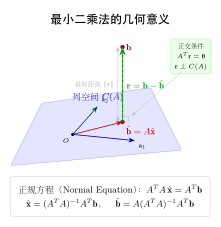

# 第18章：最小二乘法（融合版）

> **前置知识**：第1章（向量与内积）、第11章（基与维数）、第12章（子空间）、第13章（线性映射）
>
> **本章难度**：★★★★☆
>
> **预计学习时间**：4-5 小时
>
> **本文件**：融合"原版严格推导 + 速记 / 套路 / 自测"。保留原版完整正文 + 在最前置一例速记 / 思维路径 + 最后追加方法总结与自测。

> **一例速记**：
> **问题**：$m>n$，$A\mathbf{x}=\mathbf{b}$ 无精确解，最小化 $\|\mathbf{b}-A\mathbf{x}\|^2$。
> **正规方程**：$A^TA\hat{\mathbf{x}}=A^T\mathbf{b}$；当 $A$ 列满秩时唯一解 $\hat{\mathbf{x}}=(A^TA)^{-1}A^T\mathbf{b}$。
> **伪逆**：$A^+=V\Sigma^+U^T$（SVD 中非零奇异值取倒数）；统一表达 $\hat{\mathbf{x}}=A^+\mathbf{b}$（最小范数最小二乘解）。
> **几何本质**：$\hat{\mathbf{b}}=A\hat{\mathbf{x}}$ 是 $\mathbf{b}$ 在 $\text{Col}(A)$ 上的正交投影；残差 $\mathbf{r}=\mathbf{b}-\hat{\mathbf{b}}$ 与 $\text{Col}(A)$ 正交。
> **AI 关联**：线性回归 MSE 最小化 = 正规方程；神经网络末层（ELM / 固定特征）= 最小二乘；正则化 $\lambda I$ → 岭回归。

---

## 引入：数据拟合中的"不可能方程组"

> **题目**：实验测量了三个数据点 $(1, 2.1)$、$(2, 3.9)$、$(3, 6.2)$，假设线性模型 $y=ax+b$。若精确拟合，需同时满足 $a+b=2.1$，$2a+b=3.9$，$3a+b=6.2$。请说明为什么这个方程组无精确解，并解释最小二乘法如何给出"最佳"答案。

请先停下来想一想：三个方程，两个未知数——方程太多了。除非三点完全共线，否则不存在一条直线同时穿过三点。真实数据总有测量噪声，精确解几乎不存在。下面还原如何从"无法精确满足"转向"尽可能接近"。

---

## 思维路径还原（解题者的内心独白）

> "列出矩阵：$A=\begin{pmatrix}1&1\\2&1\\3&1\end{pmatrix}$，$\mathbf{b}=(2.1,3.9,6.2)^T$，未知数 $\mathbf{x}=(a,b)^T$。
>
> **为什么无精确解？** $A\mathbf{x}$ 只能取 $\text{Col}(A)$（一个二维平面）中的向量。$\mathbf{b}=(2.1,3.9,6.2)^T$ 是否在这个平面上？若三点完全共线，答案在。否则不在。快速检验：若 $a+b=2.1$ 且 $2a+b=3.9$，则 $a=1.8$，$b=0.3$；检验第三个方程：$3\times1.8+0.3=5.7\neq6.2$。方程组矛盾，无精确解。
>
> **最小二乘的思路**：放弃"精确满足"，转而找 $\mathbf{x}$ 使 $\|A\mathbf{x}-\mathbf{b}\|^2$ 最小。几何上，就是找 $\text{Col}(A)$ 中离 $\mathbf{b}$ 最近的点——即 $\mathbf{b}$ 在 $\text{Col}(A)$ 上的正交投影 $\hat{\mathbf{b}}$。
>
> **求解**：对应的 $\hat{\mathbf{x}}$ 满足法方程 $A^TA\hat{\mathbf{x}}=A^T\mathbf{b}$。计算后得 $\hat{a}\approx2.05$，$\hat{b}\approx-0.05$，拟合直线 $y\approx2.05x-0.05$。
>
> **物理意义**：残差向量 $\mathbf{r}=\mathbf{b}-A\hat{\mathbf{x}}\approx(0.15,-0.05,-0.1)^T$ 测量了三点偏离直线的误差，而这个残差必然与 $A$ 的两列正交（$A^T\mathbf{r}=\mathbf{0}$）——这就是最优性的充要条件。"

---

## 学习目标

学完本章后，你将能够：

- 识别超定方程组的结构，理解为什么方程数多于未知数时精确解通常不存在
- 建立最小二乘问题的数学定义，将"最优近似解"转化为最小化残差范数的优化问题
- 推导并求解正规方程 $A^T A \mathbf{x} = A^T \mathbf{b}$，并掌握其成立的充分条件
- 理解 Moore-Penrose 伪逆矩阵的定义与性质，以及它在最小二乘解中的作用
- 从投影的几何角度理解最小二乘法的本质，并将其应用于线性回归与神经网络训练

---

## 18.1 超定方程组

### 从"方程太多"说起

在第4章中，我们研究了线性方程组 $A\mathbf{x} = \mathbf{b}$，其中 $A \in \mathbb{R}^{m \times n}$。如果方程数恰好等于未知数个数（$m = n$），且 $A$ 可逆，则有唯一解 $\mathbf{x} = A^{-1}\mathbf{b}$。

但在实际应用中，情况常常相反：**方程数远多于未知数**（$m \gg n$）。这类方程组称为**超定方程组（overdetermined system）**。

**直观场景**：用一条直线 $y = ax + b$ 拟合 100 个数据点。有 100 个方程（每个点提供一个约束 $ax_i + b = y_i$），但只有 2 个未知数（$a$ 和 $b$）。这 100 个方程几乎不可能同时精确成立——除非 100 个点完全共线，而这在真实数据（含测量噪声）中几乎不发生。

**一般形式**：

$$A\mathbf{x} = \mathbf{b}, \quad A \in \mathbb{R}^{m \times n},\ \mathbf{b} \in \mathbb{R}^m,\ m > n$$

当 $\mathbf{b}$ 不在 $A$ 的列空间 $\text{Col}(A)$ 中时，方程组**无精确解**。

### 无解的几何原因

矩阵 $A$ 的列空间 $\text{Col}(A)$ 是 $\mathbb{R}^m$ 中的一个子空间，其维数最多为 $n$。由于 $m > n$，列空间是整个 $\mathbb{R}^m$ 的真子集——它是高维空间中的一个"低维平面"。

向量 $\mathbf{b}$ 是 $\mathbb{R}^m$ 中的任意一点，恰好落在这张"低维平面"上的概率为零（在连续测量噪声下）。因此，$A\mathbf{x} = \mathbf{b}$ 通常无解。

**关键问题转变**：既然精确解不存在，我们转而寻问——**哪个 $\mathbf{x}$ 使 $A\mathbf{x}$ "最接近" $\mathbf{b}$？**

---

## 18.2 最小二乘问题

### 残差与目标函数

对于任意候选解 $\mathbf{x} \in \mathbb{R}^n$，定义**残差向量（residual vector）**：

$$\mathbf{r}(\mathbf{x}) = \mathbf{b} - A\mathbf{x}$$

$\mathbf{r}(\mathbf{x})$ 衡量了用 $A\mathbf{x}$ 近似 $\mathbf{b}$ 时的"误差向量"。当且仅当 $A\mathbf{x} = \mathbf{b}$ 时，$\mathbf{r} = \mathbf{0}$。

**最小二乘问题（Least Squares Problem）**：在所有 $\mathbf{x} \in \mathbb{R}^n$ 中，找到使残差向量的平方范数最小的解：

$$\boxed{\hat{\mathbf{x}} = \arg\min_{\mathbf{x} \in \mathbb{R}^n} \|\mathbf{b} - A\mathbf{x}\|^2}$$

展开目标函数：

$$\|\mathbf{b} - A\mathbf{x}\|^2 = \sum_{i=1}^m (b_i - \mathbf{a}_i^T \mathbf{x})^2$$

其中 $\mathbf{a}_i^T$ 是 $A$ 的第 $i$ 行。这正是各个方程"误差的平方和"——最小二乘法因此得名。

### 几何解释：投影的预告

考虑向量 $A\mathbf{x}$：当 $\mathbf{x}$ 遍历 $\mathbb{R}^n$ 时，$A\mathbf{x}$ 恰好遍历 $A$ 的列空间 $\text{Col}(A)$（即 $\mathbb{R}^m$ 中的某个子空间）。

因此，最小化 $\|\mathbf{b} - A\mathbf{x}\|$ 等价于：**在列空间 $\text{Col}(A)$ 中，找离 $\mathbf{b}$ 最近的向量。**

这个"最近的向量"就是 $\mathbf{b}$ 在 $\text{Col}(A)$ 上的**正交投影** $\hat{\mathbf{b}} = A\hat{\mathbf{x}}$。详细的几何分析见 18.5 节。

**直觉图像**（以 $m=3$，$n=2$ 为例）：

```
R^3 空间
  │
  │   × b（目标点，不在平面上）
  │  /│
  │ / │残差 r = b - Proj(b)（垂直于平面）
  │/  │
  ×───┘
 Proj(b) = b_hat（b 在平面 Col(A) 上的投影）
──────────────────────
     Col(A)（二维平面，A 的列空间）
```

---

## 18.3 正规方程

### 推导：从最优性条件出发

最小化 $f(\mathbf{x}) = \|\mathbf{b} - A\mathbf{x}\|^2$ 的必要条件是梯度为零：$\nabla_{\mathbf{x}} f = \mathbf{0}$。

展开 $f$：

$$f(\mathbf{x}) = (\mathbf{b} - A\mathbf{x})^T(\mathbf{b} - A\mathbf{x}) = \mathbf{b}^T\mathbf{b} - 2\mathbf{b}^T A\mathbf{x} + \mathbf{x}^T A^T A\mathbf{x}$$

对 $\mathbf{x}$ 求梯度：

$$\nabla_{\mathbf{x}} f = -2A^T\mathbf{b} + 2A^T A\mathbf{x}$$

令梯度为零：

$$A^T A\mathbf{x} = A^T\mathbf{b}$$

这就是**正规方程（Normal Equations）**：

$$\boxed{A^T A \hat{\mathbf{x}} = A^T \mathbf{b}}$$

### 推导：从正交性出发

最小二乘解的几何条件是：残差向量 $\mathbf{r} = \mathbf{b} - A\hat{\mathbf{x}}$ 与列空间 $\text{Col}(A)$ 正交，即 $\mathbf{r}$ 与 $A$ 的每一列都正交：

$$A^T(\mathbf{b} - A\hat{\mathbf{x}}) = \mathbf{0}$$

整理即得正规方程 $A^T A\hat{\mathbf{x}} = A^T\mathbf{b}$，两种推导殊途同归。

### 正规方程的可解性

**命题**：若 $A$ 的各列**线性无关**（即 $A$ 列满秩，$\text{rank}(A) = n$），则：

1. 矩阵 $A^T A \in \mathbb{R}^{n \times n}$ 是**可逆的正定矩阵**
2. 最小二乘解存在且唯一，由下式给出：

$$\hat{\mathbf{x}} = (A^T A)^{-1} A^T \mathbf{b}$$

**证明 $A^T A$ 可逆**：若 $A^T A\mathbf{v} = \mathbf{0}$，则 $\mathbf{v}^T A^T A\mathbf{v} = \|A\mathbf{v}\|^2 = 0$，故 $A\mathbf{v} = \mathbf{0}$。由 $A$ 列满秩，$\mathbf{v} = \mathbf{0}$。所以 $A^T A$ 的零空间只含零向量，即 $A^T A$ 可逆。$\square$

**证明 $A^T A$ 正定**：$\mathbf{v}^T(A^T A)\mathbf{v} = \|A\mathbf{v}\|^2 \geq 0$，当 $A$ 列满秩时等号仅在 $\mathbf{v} = \mathbf{0}$ 时成立，故正定。$\square$

### 计算示例

**例**：已知数据点 $(1, 1)$、$(2, 3)$、$(3, 4)$，用最小二乘法拟合直线 $y = ax + b$。

建立方程组 $A\mathbf{x} = \mathbf{b}$：

$$A = \begin{pmatrix}1 & 1\\2 & 1\\3 & 1\end{pmatrix}, \quad \mathbf{x} = \begin{pmatrix}a\\b\end{pmatrix}, \quad \mathbf{b} = \begin{pmatrix}1\\3\\4\end{pmatrix}$$

计算 $A^T A$ 和 $A^T \mathbf{b}$：

$$A^T A = \begin{pmatrix}1&2&3\\1&1&1\end{pmatrix}\begin{pmatrix}1&1\\2&1\\3&1\end{pmatrix} = \begin{pmatrix}14&6\\6&3\end{pmatrix}$$

$$A^T \mathbf{b} = \begin{pmatrix}1&2&3\\1&1&1\end{pmatrix}\begin{pmatrix}1\\3\\4\end{pmatrix} = \begin{pmatrix}19\\8\end{pmatrix}$$

解正规方程 $\begin{pmatrix}14&6\\6&3\end{pmatrix}\begin{pmatrix}a\\b\end{pmatrix} = \begin{pmatrix}19\\8\end{pmatrix}$：

$$(A^T A)^{-1} = \frac{1}{14\cdot3 - 6\cdot6}\begin{pmatrix}3&-6\\-6&14\end{pmatrix} = \frac{1}{6}\begin{pmatrix}3&-6\\-6&14\end{pmatrix}$$

$$\hat{\mathbf{x}} = \frac{1}{6}\begin{pmatrix}3&-6\\-6&14\end{pmatrix}\begin{pmatrix}19\\8\end{pmatrix} = \frac{1}{6}\begin{pmatrix}57 - 48\\-114 + 112\end{pmatrix} = \frac{1}{6}\begin{pmatrix}9\\-2\end{pmatrix} = \begin{pmatrix}3/2\\-1/3\end{pmatrix}$$

最小二乘拟合直线：$y = \dfrac{3}{2}x - \dfrac{1}{3}$。

---

## 18.4 伪逆矩阵

### 动机：推广逆矩阵的概念

当 $A$ 是方阵且可逆时，方程 $A\mathbf{x} = \mathbf{b}$ 的唯一解是 $\mathbf{x} = A^{-1}\mathbf{b}$。

对于非方阵或奇异矩阵，我们希望引入一个类似"逆"的概念，使得最小二乘解能够统一表达为 $\hat{\mathbf{x}} = A^+\mathbf{b}$。这个推广就是 **Moore-Penrose 伪逆（pseudoinverse）**。

### 定义

设 $A \in \mathbb{R}^{m \times n}$，矩阵 $A^+ \in \mathbb{R}^{n \times m}$ 称为 $A$ 的 **Moore-Penrose 伪逆**，如果它满足以下四条 Penrose 条件：

1. $AA^+A = A$
2. $A^+AA^+ = A^+$
3. $(AA^+)^T = AA^+$（$AA^+$ 是对称矩阵）
4. $(A^+A)^T = A^+A$（$A^+A$ 是对称矩阵）

可以证明，满足这四条条件的矩阵 $A^+$ 存在且唯一。

### 通过 SVD 计算伪逆

设 $A$ 的**奇异值分解（SVD）**为：

$$A = U \Sigma V^T$$

其中 $U \in \mathbb{R}^{m \times m}$、$V \in \mathbb{R}^{n \times n}$ 是正交矩阵，$\Sigma \in \mathbb{R}^{m \times n}$ 是"对角矩阵"（主对角线为非负奇异值 $\sigma_1 \geq \sigma_2 \geq \cdots \geq 0$）。

则 $A$ 的伪逆为：

$$\boxed{A^+ = V \Sigma^+ U^T}$$

其中 $\Sigma^+ \in \mathbb{R}^{n \times m}$ 是将 $\Sigma$ 转置后把所有非零奇异值取倒数所得的矩阵：

$$\Sigma^+ = \text{diag}\!\left(\frac{1}{\sigma_1}, \ldots, \frac{1}{\sigma_r}, 0, \ldots, 0\right)^T, \quad r = \text{rank}(A)$$

**直觉**：SVD 把 $A$ 分解为"旋转-拉伸-旋转"。伪逆就是"逆旋转-对非零方向取倒数-逆旋转"，对零奇异值方向不做任何恢复（因为那些方向的信息已经丢失）。

### 特殊情形

| 情形 | $A^+$ 的形式 | 条件 |
|:---|:---|:---|
| $A$ 可逆（方阵） | $A^+ = A^{-1}$ | $m = n$，$\text{rank}(A) = n$ |
| $A$ 列满秩（$m > n$） | $A^+ = (A^T A)^{-1} A^T$ | $\text{rank}(A) = n$ |
| $A$ 行满秩（$m < n$） | $A^+ = A^T (A A^T)^{-1}$ | $\text{rank}(A) = m$ |
| $A$ 一般情形 | $A^+ = V \Sigma^+ U^T$ | 由 SVD 给出 |

列满秩的情形正好对应第 18.3 节的结论：$\hat{\mathbf{x}} = (A^T A)^{-1}A^T\mathbf{b} = A^+\mathbf{b}$。

### 最小二乘解的统一表达

对于任意矩阵 $A$ 和向量 $\mathbf{b}$，**最小范数最小二乘解**为：

$$\boxed{\hat{\mathbf{x}} = A^+ \mathbf{b}}$$

这是所有最小二乘解中 $\|\hat{\mathbf{x}}\|$ 最小的那个。当 $A$ 列满秩时，最小二乘解唯一，即 $\hat{\mathbf{x}} = (A^T A)^{-1}A^T \mathbf{b}$；当 $A$ 秩亏缺时，存在无穷多个最小二乘解，$A^+\mathbf{b}$ 从中选出范数最小的一个。

### 伪逆的重要性质

设 $\hat{\mathbf{b}} = A A^+ \mathbf{b}$ 是 $\mathbf{b}$ 在 $\text{Col}(A)$ 上的正交投影，则：

- $AA^+$ 是 $\mathbb{R}^m$ 到 $\text{Col}(A)$ 的**正交投影矩阵**：$(AA^+)^2 = AA^+$
- $A^+A$ 是 $\mathbb{R}^n$ 到 $\text{Row}(A)$ 的**正交投影矩阵**：$(A^+A)^2 = A^+A$
- $\|A^+\|_2 = 1/\sigma_{\min}(A)$（最小非零奇异值的倒数）

---

## 18.5 最小二乘的几何意义

### 投影到列空间

最小二乘法的核心几何思想：**在 $A$ 的列空间中找离 $\mathbf{b}$ 最近的点，等价于求 $\mathbf{b}$ 在列空间上的正交投影。**

**定理**：设 $A \in \mathbb{R}^{m \times n}$ 列满秩，则 $\mathbf{b}$ 在 $\text{Col}(A)$ 上的正交投影为：

$$\hat{\mathbf{b}} = A(A^T A)^{-1}A^T \mathbf{b} = P \mathbf{b}$$

其中**投影矩阵** $P = A(A^T A)^{-1}A^T \in \mathbb{R}^{m \times m}$ 满足：

1. $P^2 = P$（幂等性：投影两次等于投影一次）
2. $P^T = P$（对称性：正交投影的特征）
3. $\text{rank}(P) = n$（投影到 $n$ 维子空间）

**证明幂等性**：

$$P^2 = A(A^T A)^{-1}A^T \cdot A(A^T A)^{-1}A^T = A(A^T A)^{-1}(A^T A)(A^T A)^{-1}A^T = A(A^T A)^{-1}A^T = P \quad \square$$

### 残差的正交性

最小二乘解 $\hat{\mathbf{x}}$ 使残差 $\mathbf{r} = \mathbf{b} - A\hat{\mathbf{x}}$ 与列空间正交：

$$\mathbf{r} \perp \text{Col}(A) \iff A^T \mathbf{r} = \mathbf{0} \iff A^T(\mathbf{b} - A\hat{\mathbf{x}}) = \mathbf{0}$$

这正是正规方程成立的等价条件，也是最短距离的几何本质——**从空间中一点到子空间的最短连线，必须垂直于该子空间。**

### 四个子空间的视角

从第12章学到的矩阵四个基本子空间的角度，最小二乘有更深刻的结构：

$$\mathbb{R}^m = \underbrace{\text{Col}(A)}_{\hat{\mathbf{b}} \text{ 在此}} \oplus \underbrace{\text{Null}(A^T)}_{\mathbf{r} \text{ 在此}}$$

$$\mathbf{b} = \underbrace{\hat{\mathbf{b}}}_{\text{在列空间中}} + \underbrace{\mathbf{r}}_{\text{在左零空间中}}$$

最小二乘法把 $\mathbf{b}$ 分解为两个正交分量：落在列空间中的部分 $\hat{\mathbf{b}}$（可以被 $A$ 的列精确表示），以及落在左零空间中的部分 $\mathbf{r}$（无法被 $A$ 的列表示，是不可消除的误差）。

### 特殊情形的几何验证

若 $A$ 的各列两两正交（即 $A^T A$ 是对角矩阵），正规方程变得极其简单：

$$A^T A \hat{\mathbf{x}} = A^T \mathbf{b} \implies \hat{x}_j = \frac{\mathbf{a}_j \cdot \mathbf{b}}{\|\mathbf{a}_j\|^2}$$

其中 $\mathbf{a}_j$ 是 $A$ 的第 $j$ 列。这正是将 $\mathbf{b}$ 分别投影到每列方向后的坐标——正交分解的直接结果。

---

## 本章小结

- **超定方程组**：方程数多于未知数（$m > n$），$\mathbf{b} \notin \text{Col}(A)$ 时无精确解，需转而寻找"最优近似解"

- **最小二乘问题**：最小化残差平方和 $\|\mathbf{b} - A\mathbf{x}\|^2$，等价于在 $\text{Col}(A)$ 中找离 $\mathbf{b}$ 最近的向量

- **正规方程**：$A^T A \hat{\mathbf{x}} = A^T \mathbf{b}$，由梯度为零或残差正交性导出；当 $A$ 列满秩时有唯一解 $\hat{\mathbf{x}} = (A^T A)^{-1}A^T\mathbf{b}$

- **伪逆矩阵**：$A^+ = V\Sigma^+U^T$（经由 SVD 定义），最小范数最小二乘解统一写作 $\hat{\mathbf{x}} = A^+\mathbf{b}$

- **几何本质**：$\hat{\mathbf{b}} = A\hat{\mathbf{x}}$ 是 $\mathbf{b}$ 在 $\text{Col}(A)$ 上的正交投影；残差 $\mathbf{r} = \mathbf{b} - \hat{\mathbf{b}}$ 落在左零空间中，与列空间正交

| 概念 | 公式 | 关键条件 |
|:---|:---|:---|
| 最小二乘目标 | $\min \|\mathbf{b} - A\mathbf{x}\|^2$ | — |
| 正规方程 | $A^T A\hat{\mathbf{x}} = A^T\mathbf{b}$ | — |
| 闭式解 | $\hat{\mathbf{x}} = (A^T A)^{-1}A^T\mathbf{b}$ | $A$ 列满秩 |
| 伪逆 | $A^+ = V\Sigma^+U^T$ | SVD 分解 |
| 统一表达 | $\hat{\mathbf{x}} = A^+\mathbf{b}$ | 最小范数解 |
| 投影矩阵 | $P = A(A^T A)^{-1}A^T$ | $A$ 列满秩 |

---

## 深度学习应用：线性回归与伪逆

### 线性回归的最小二乘表述

**线性回归**是最基础的有监督学习模型。给定 $m$ 个训练样本 $\{(\mathbf{x}_i, y_i)\}_{i=1}^m$，其中 $\mathbf{x}_i \in \mathbb{R}^d$ 为特征向量，$y_i \in \mathbb{R}$ 为标签，线性回归假设：

$$y_i \approx \mathbf{w}^T \mathbf{x}_i + b = \tilde{\mathbf{x}}_i^T \boldsymbol{\theta}$$

其中 $\tilde{\mathbf{x}}_i = (x_{i1}, \ldots, x_{id}, 1)^T$（增广特征，把偏置吸收进去），$\boldsymbol{\theta} = (w_1, \ldots, w_d, b)^T$。

将所有样本叠成矩阵形式：

$$\underbrace{\begin{pmatrix}—\tilde{\mathbf{x}}_1^T—\\\vdots\\—\tilde{\mathbf{x}}_m^T—\end{pmatrix}}_{X \in \mathbb{R}^{m \times (d+1)}} \boldsymbol{\theta} \approx \underbrace{\begin{pmatrix}y_1\\\vdots\\y_m\end{pmatrix}}_{\mathbf{y} \in \mathbb{R}^m}$$

线性回归的训练目标——**均方误差（MSE）最小化**——精确对应最小二乘问题：

$$\min_{\boldsymbol{\theta}} \frac{1}{m}\|\mathbf{y} - X\boldsymbol{\theta}\|^2 \quad \Longleftrightarrow \quad \min_{\boldsymbol{\theta}} \|\mathbf{y} - X\boldsymbol{\theta}\|^2$$

最小二乘解（**正规方程解**）：

$$\hat{\boldsymbol{\theta}} = (X^T X)^{-1} X^T \mathbf{y} = X^+ \mathbf{y}$$

### 闭式解 vs 梯度下降：两种方法的对比

线性回归有两种主流求解方法，各有优劣：

**方法一：闭式解（伪逆 / 正规方程）**

$$\hat{\boldsymbol{\theta}} = (X^T X)^{-1} X^T \mathbf{y}$$

- 直接一步得到精确解，无需迭代
- 主要代价：计算 $(X^T X)^{-1}$ 需要 $O((d+1)^3)$ 时间，对高维特征代价极高
- 当 $m \gg d$ 且 $d$ 不太大（例如 $d < 10^4$）时，闭式解效率高且数值稳定
- $X^T X$ 接近奇异时（特征强相关），数值精度下降，需加正则化（岭回归：$(X^TX + \lambda I)^{-1}X^T\mathbf{y}$）

**方法二：梯度下降**

$$\boldsymbol{\theta}_{t+1} = \boldsymbol{\theta}_t - \eta \nabla_{\boldsymbol{\theta}} \mathcal{L}(\boldsymbol{\theta}_t) = \boldsymbol{\theta}_t - \frac{2\eta}{m} X^T(X\boldsymbol{\theta}_t - \mathbf{y})$$

- 每步计算量 $O(md)$，适用于超大规模数据（大 $m$）和高维特征（大 $d$）
- 需要调整学习率 $\eta$，收敛需要若干步迭代
- 可自然扩展到非线性模型（深度网络）

**选择准则**：

| 场景 | 推荐方法 |
|:---|:---|
| 特征维度小（$d < 10^4$），数据量中等 | 闭式解（伪逆） |
| 特征维度极大或数据量极大 | 梯度下降（随机梯度下降） |
| 非线性模型（神经网络） | 梯度下降（反向传播） |
| 需要实时更新（在线学习） | 随机梯度下降 |

### PyTorch 代码示例：两种方法的比较

```python
import torch
import torch.nn as nn
import numpy as np
import matplotlib
matplotlib.use('Agg')
import matplotlib.pyplot as plt

torch.manual_seed(42)
np.random.seed(42)

# ============================================================
# 1. 生成合成数据集
#    真实模型：y = 2x1 - 3x2 + 1 + 噪声
# ============================================================
m = 200        # 样本数
d = 2          # 特征维度（不含偏置）

# 特征矩阵：(m, d)，偏置由增广列处理
X_raw = torch.randn(m, d)

# 真实参数
w_true = torch.tensor([2.0, -3.0])
b_true = 1.0

# 生成带噪声的标签
noise = 0.5 * torch.randn(m)
y = X_raw @ w_true + b_true + noise      # shape: (m,)

# 增广特征矩阵：在最后添加全 1 列（偏置项）
ones = torch.ones(m, 1)
X = torch.cat([X_raw, ones], dim=1)      # shape: (m, d+1)

print(f"数据集：{m} 个样本，{d} 维特征")
print(f"真实参数：w={w_true.tolist()}, b={b_true}")
print(f"增广特征矩阵 X 形状：{X.shape}")

# ============================================================
# 2. 方法一：闭式解（正规方程 / 伪逆）
# ============================================================

# 方式 A：直接计算 (X^T X)^{-1} X^T y（正规方程）
XTX = X.T @ X                            # (d+1, d+1)
XTy = X.T @ y                            # (d+1,)
theta_normal = torch.linalg.solve(XTX, XTy)  # 比直接求逆更稳定

# 方式 B：使用 PyTorch 内置的 lstsq（基于 SVD，数值更稳定）
# theta_lstsq = torch.linalg.lstsq(X, y).solution

# 方式 C：直接通过 SVD 计算伪逆
U, S, Vh = torch.linalg.svd(X, full_matrices=False)
# X^+ = V S^{-1} U^T
S_inv = torch.diag(1.0 / S)
X_pinv = Vh.T @ S_inv @ U.T              # 伪逆：(d+1, m)
theta_pinv = X_pinv @ y

print("\n=== 方法一：闭式解 ===")
print(f"正规方程解：w={theta_normal[:d].tolist()}, b={theta_normal[d].item():.4f}")
print(f"伪逆解：    w={theta_pinv[:d].tolist()}, b={theta_pinv[d].item():.4f}")

# 计算训练 MSE
y_pred_closed = X @ theta_normal
mse_closed = ((y - y_pred_closed) ** 2).mean().item()
print(f"训练 MSE（闭式解）：{mse_closed:.4f}")

# ============================================================
# 3. 方法二：梯度下降
# ============================================================
theta_gd = torch.zeros(d + 1, requires_grad=True)
optimizer = torch.optim.SGD([theta_gd], lr=0.05)
loss_fn = nn.MSELoss()

n_epochs = 500
losses = []

for epoch in range(n_epochs):
    optimizer.zero_grad()
    y_pred = X @ theta_gd
    loss = loss_fn(y_pred, y)
    loss.backward()
    optimizer.step()
    losses.append(loss.item())

print("\n=== 方法二：梯度下降（500 轮） ===")
theta_gd_val = theta_gd.detach()
print(f"梯度下降解：w={theta_gd_val[:d].tolist()}, b={theta_gd_val[d].item():.4f}")
print(f"训练 MSE（梯度下降）：{losses[-1]:.4f}")

# ============================================================
# 4. 对比与分析
# ============================================================
print("\n=== 对比结果 ===")
print(f"真实参数：  w={w_true.tolist()}, b={b_true}")
print(f"闭式解误差：w 偏差 = {(theta_normal[:d] - w_true).norm().item():.6f}")
print(f"梯度下降误差：w 偏差 = {(theta_gd_val[:d] - w_true).norm().item():.6f}")

# ============================================================
# 5. 可视化：梯度下降的收敛曲线
# ============================================================
fig, axes = plt.subplots(1, 2, figsize=(12, 4))

# 左图：损失曲线
axes[0].plot(losses, color='steelblue', linewidth=1.5)
axes[0].axhline(y=mse_closed, color='red', linestyle='--', label=f'闭式解 MSE = {mse_closed:.4f}')
axes[0].set_xlabel('训练轮数（Epoch）')
axes[0].set_ylabel('MSE 损失')
axes[0].set_title('梯度下降收敛曲线')
axes[0].legend()
axes[0].grid(True, alpha=0.3)

# 右图（d=2 的切片）：固定 x2=0，展示 x1 与 y 的关系
x1_range = torch.linspace(-3, 3, 100)
# 真实直线（x2=0 截面）
y_true_line = w_true[0] * x1_range + b_true
# 闭式解拟合线
y_closed_line = theta_normal[0] * x1_range + theta_normal[d]
# 梯度下降拟合线
y_gd_line = theta_gd_val[0] * x1_range + theta_gd_val[d]

# 散点（只展示 x2 接近 0 的点）
mask = X_raw[:, 1].abs() < 0.3
axes[1].scatter(X_raw[mask, 0].numpy(), y[mask].numpy(),
                alpha=0.4, s=20, color='gray', label='数据点')
axes[1].plot(x1_range.numpy(), y_true_line.numpy(),
             'k--', linewidth=2, label='真实模型')
axes[1].plot(x1_range.numpy(), y_closed_line.detach().numpy(),
             'r-', linewidth=2, label='闭式解')
axes[1].plot(x1_range.numpy(), y_gd_line.numpy(),
             'b-', linewidth=1.5, linestyle='-.', label='梯度下降')
axes[1].set_xlabel('x₁（x₂≈0 的样本）')
axes[1].set_ylabel('y')
axes[1].set_title('拟合效果对比（x₂≈0 截面）')
axes[1].legend()
axes[1].grid(True, alpha=0.3)

plt.tight_layout()
plt.savefig('least_squares_comparison.png', dpi=150, bbox_inches='tight')
print("\n图像已保存为 least_squares_comparison.png")

# ============================================================
# 6. 演示正规方程的几何意义：验证残差正交性
# ============================================================
r = y - X @ theta_normal          # 残差向量
orthogonality = X.T @ r           # 应接近零向量
print(f"\n=== 验证残差正交性 ===")
print(f"X^T r（应接近零向量）：{orthogonality.tolist()}")
print(f"最大分量绝对值：{orthogonality.abs().max().item():.2e}")
# 输出约为 1e-5 量级（浮点精度误差），验证了残差与列空间正交
```

**代码解读**：

- **第1部分**：生成 200 个二维特征的合成数据，真实模型为 $y = 2x_1 - 3x_2 + 1$ 加高斯噪声
- **第2部分**：展示三种等价的闭式求解方式——正规方程（线性方程组）、SVD 伪逆；对于大型问题，`torch.linalg.solve` 比直接求逆数值更稳定
- **第3部分**：用标准 SGD 梯度下降求解，500 轮后收敛到与闭式解相近的结果
- **第4-5部分**：对比两种方法的精度，输出收敛曲线与拟合效果图
- **第6部分**：数值验证残差正交性 $X^T \mathbf{r} \approx \mathbf{0}$，误差在浮点精度范围内

### 延伸：岭回归与病态问题

当 $X^TX$ 接近奇异时（特征高度相关，或样本数少于特征数），直接求逆数值不稳定。**岭回归（Ridge Regression）**通过添加 $\ell_2$ 正则化项修复这一问题：

$$\hat{\boldsymbol{\theta}}_{\text{ridge}} = \arg\min_{\boldsymbol{\theta}} \|\mathbf{y} - X\boldsymbol{\theta}\|^2 + \lambda\|\boldsymbol{\theta}\|^2 = (X^TX + \lambda I)^{-1}X^T\mathbf{y}$$

正则化参数 $\lambda > 0$ 保证了 $X^TX + \lambda I$ 恒为正定矩阵（即使 $X^TX$ 奇异），从而总是可逆。从 SVD 角度看，岭回归将奇异值 $\sigma_j$ 替换为 $\sigma_j/(\sigma_j^2 + \lambda)$，对小奇异值方向进行了平滑收缩。

---

## 练习题

**练习 1**（基础——建立正规方程）

已知三个数据点 $(0, 1)$、$(1, 2)$、$(2, 2)$，用最小二乘法拟合直线 $y = ax + b$。

（a）写出增广矩阵 $A$ 和向量 $\mathbf{b}$

（b）计算正规方程 $A^T A \hat{\mathbf{x}} = A^T \mathbf{b}$ 的各矩阵

（c）求解 $\hat{\mathbf{x}} = (\hat{a}, \hat{b})^T$，写出拟合直线的方程

---

**练习 2**（基础——验证残差正交性）

设 $A = \begin{pmatrix}1&0\\1&1\\1&2\end{pmatrix}$，$\mathbf{b} = \begin{pmatrix}6\\0\\0\end{pmatrix}$。

（a）求最小二乘解 $\hat{\mathbf{x}} = (A^TA)^{-1}A^T\mathbf{b}$

（b）计算残差 $\mathbf{r} = \mathbf{b} - A\hat{\mathbf{x}}$

（c）验证 $A^T \mathbf{r} = \mathbf{0}$（残差与 $A$ 的列空间正交）

---

**练习 3**（中等——投影矩阵）

设 $A = \begin{pmatrix}1\\1\\1\end{pmatrix}$（即 $n=1$，列空间是 $\mathbb{R}^3$ 中的一条直线）。

（a）计算投影矩阵 $P = A(A^TA)^{-1}A^T$

（b）验证 $P^2 = P$（幂等性）和 $P^T = P$（对称性）

（c）求向量 $\mathbf{b} = (1, 2, 3)^T$ 在 $A$ 的列空间上的投影 $\hat{\mathbf{b}} = P\mathbf{b}$，并验证残差与 $\mathbf{a}_1 = (1,1,1)^T$ 正交

---

**练习 4**（中等——伪逆的计算）

设矩阵 $A = \begin{pmatrix}1&0\\0&2\\0&0\end{pmatrix}$。

（a）写出 $A$ 的奇异值分解 $A = U\Sigma V^T$（可以直接观察，不必强行计算）

（b）利用 SVD 计算 $A$ 的伪逆 $A^+$

（c）验证 Penrose 条件 $AA^+A = A$

（d）对向量 $\mathbf{b} = (3, 4, 5)^T$，求最小范数最小二乘解 $\hat{\mathbf{x}} = A^+\mathbf{b}$，并解释为何第三个分量 $b_3 = 5$ 对解没有贡献

---

**练习 5**（进阶——最小二乘与神经网络的联系）

考虑一个单隐层神经网络：$\hat{y} = \mathbf{v}^T \sigma(W\mathbf{x})$，其中 $W$ 固定（随机初始化），$\sigma$ 是 ReLU，只训练最后一层 $\mathbf{v} \in \mathbb{R}^k$（**极限学习机，ELM**）。

设特征矩阵 $H = \sigma(XW^T) \in \mathbb{R}^{m \times k}$（对所有 $m$ 个样本计算隐层激活），其中 $X \in \mathbb{R}^{m \times d}$，$W \in \mathbb{R}^{k \times d}$。

（a）将训练 $\mathbf{v}$ 的问题写成最小二乘形式 $\min_{\mathbf{v}} \|\mathbf{y} - H\mathbf{v}\|^2$，并写出最优解 $\hat{\mathbf{v}}$

（b）当 $k > m$（隐层神经元数超过样本数）时，$H$ 的正规方程 $H^TH$ 是否还可逆？此时应如何求最小范数解？

（c）若 $H$ 行满秩（$k > m$），最小范数解为 $\hat{\mathbf{v}} = H^T(HH^T)^{-1}\mathbf{y}$，请从四个子空间的角度解释：为什么这个解使 $H\hat{\mathbf{v}} = \mathbf{y}$（即训练误差为零）？

（d）梯度下降从 $\mathbf{v}_0 = \mathbf{0}$ 初始化，收敛后是否也会趋向最小范数解？说明理由。

---

## 练习答案

<details>
<summary>点击展开 练习1 答案</summary>

**（a）建立方程组**

三个数据点代入 $y = ax + b$ 得：

$$A = \begin{pmatrix}0&1\\1&1\\2&1\end{pmatrix}, \quad \mathbf{x} = \begin{pmatrix}a\\b\end{pmatrix}, \quad \mathbf{b} = \begin{pmatrix}1\\2\\2\end{pmatrix}$$

**（b）正规方程各矩阵**

$$A^T A = \begin{pmatrix}0&1&2\\1&1&1\end{pmatrix}\begin{pmatrix}0&1\\1&1\\2&1\end{pmatrix} = \begin{pmatrix}0^2+1^2+2^2 & 0+1+2\\0+1+2 & 1+1+1\end{pmatrix} = \begin{pmatrix}5&3\\3&3\end{pmatrix}$$

$$A^T\mathbf{b} = \begin{pmatrix}0&1&2\\1&1&1\end{pmatrix}\begin{pmatrix}1\\2\\2\end{pmatrix} = \begin{pmatrix}0+2+4\\1+2+2\end{pmatrix} = \begin{pmatrix}6\\5\end{pmatrix}$$

**（c）求解正规方程**

$$\det(A^TA) = 5 \times 3 - 3 \times 3 = 6$$

$$(A^TA)^{-1} = \frac{1}{6}\begin{pmatrix}3&-3\\-3&5\end{pmatrix}$$

$$\hat{\mathbf{x}} = \frac{1}{6}\begin{pmatrix}3&-3\\-3&5\end{pmatrix}\begin{pmatrix}6\\5\end{pmatrix} = \frac{1}{6}\begin{pmatrix}18-15\\-18+25\end{pmatrix} = \frac{1}{6}\begin{pmatrix}3\\7\end{pmatrix} = \begin{pmatrix}1/2\\7/6\end{pmatrix}$$

**拟合直线**：$y = \dfrac{1}{2}x + \dfrac{7}{6}$

验证：$x=0 \to \frac{7}{6}\approx 1.17$，$x=1 \to \frac{5}{3}\approx 1.67$，$x=2 \to \frac{13}{6}\approx 2.17$，各点残差约为 $-0.17, 0.33, -0.17$，残差平方和约为 $0.17$。

</details>

<details>
<summary>点击展开 练习2 答案</summary>

**（a）求最小二乘解**

$$A^TA = \begin{pmatrix}1&1&1\\0&1&2\end{pmatrix}\begin{pmatrix}1&0\\1&1\\1&2\end{pmatrix} = \begin{pmatrix}3&3\\3&5\end{pmatrix}$$

$$A^T\mathbf{b} = \begin{pmatrix}1&1&1\\0&1&2\end{pmatrix}\begin{pmatrix}6\\0\\0\end{pmatrix} = \begin{pmatrix}6\\0\end{pmatrix}$$

$\det(A^TA) = 15 - 9 = 6$，$(A^TA)^{-1} = \dfrac{1}{6}\begin{pmatrix}5&-3\\-3&3\end{pmatrix}$

$$\hat{\mathbf{x}} = \frac{1}{6}\begin{pmatrix}5&-3\\-3&3\end{pmatrix}\begin{pmatrix}6\\0\end{pmatrix} = \frac{1}{6}\begin{pmatrix}30\\-18\end{pmatrix} = \begin{pmatrix}5\\-3\end{pmatrix}$$

**（b）计算残差**

$$A\hat{\mathbf{x}} = \begin{pmatrix}1&0\\1&1\\1&2\end{pmatrix}\begin{pmatrix}5\\-3\end{pmatrix} = \begin{pmatrix}5\\2\\-1\end{pmatrix}$$

$$\mathbf{r} = \mathbf{b} - A\hat{\mathbf{x}} = \begin{pmatrix}6\\0\\0\end{pmatrix} - \begin{pmatrix}5\\2\\-1\end{pmatrix} = \begin{pmatrix}1\\-2\\1\end{pmatrix}$$

**（c）验证正交性**

$$A^T\mathbf{r} = \begin{pmatrix}1&1&1\\0&1&2\end{pmatrix}\begin{pmatrix}1\\-2\\1\end{pmatrix} = \begin{pmatrix}1-2+1\\0-2+2\end{pmatrix} = \begin{pmatrix}0\\0\end{pmatrix} = \mathbf{0} \quad \checkmark$$

残差 $\mathbf{r} = (1,-2,1)^T$ 与 $A$ 的两列均正交，验证了最小二乘解的最优性条件。

</details>

<details>
<summary>点击展开 练习3 答案</summary>

**（a）计算投影矩阵**

$A = (1,1,1)^T$，$A^TA = 1^2+1^2+1^2 = 3$（标量），$(A^TA)^{-1} = \frac{1}{3}$。

$$P = A(A^TA)^{-1}A^T = \begin{pmatrix}1\\1\\1\end{pmatrix} \cdot \frac{1}{3} \cdot \begin{pmatrix}1&1&1\end{pmatrix} = \frac{1}{3}\begin{pmatrix}1&1&1\\1&1&1\\1&1&1\end{pmatrix}$$

**（b）验证幂等性与对称性**

$$P^2 = \frac{1}{3}\begin{pmatrix}1&1&1\\1&1&1\\1&1&1\end{pmatrix} \cdot \frac{1}{3}\begin{pmatrix}1&1&1\\1&1&1\\1&1&1\end{pmatrix} = \frac{1}{9}\begin{pmatrix}3&3&3\\3&3&3\\3&3&3\end{pmatrix} = \frac{1}{3}\begin{pmatrix}1&1&1\\1&1&1\\1&1&1\end{pmatrix} = P \quad \checkmark$$

对称性显然，因为 $P = \frac{1}{3}\mathbf{1}\mathbf{1}^T$ 是对称矩阵。$\checkmark$

**（c）计算投影并验证正交性**

$$\hat{\mathbf{b}} = P\mathbf{b} = \frac{1}{3}\begin{pmatrix}1&1&1\\1&1&1\\1&1&1\end{pmatrix}\begin{pmatrix}1\\2\\3\end{pmatrix} = \frac{1}{3}\begin{pmatrix}6\\6\\6\end{pmatrix} = \begin{pmatrix}2\\2\\2\end{pmatrix}$$

物理意义：将 $(1,2,3)^T$ 投影到 $(1,1,1)^T$ 方向，得到各分量为均值 $\frac{1+2+3}{3}=2$ 的向量。

残差：$\mathbf{r} = \mathbf{b} - \hat{\mathbf{b}} = (1,2,3)^T - (2,2,2)^T = (-1,0,1)^T$

验证正交性：$\mathbf{a}_1 \cdot \mathbf{r} = (1,1,1)^T \cdot (-1,0,1)^T = -1+0+1 = 0 \quad \checkmark$

</details>

<details>
<summary>点击展开 练习4 答案</summary>

**（a）SVD 分解**

$A = \begin{pmatrix}1&0\\0&2\\0&0\end{pmatrix}$ 的列已经正交，奇异值即列的范数：$\sigma_1 = 1$，$\sigma_2 = 2$。

$$U = \begin{pmatrix}1&0&0\\0&1&0\\0&0&1\end{pmatrix}, \quad \Sigma = \begin{pmatrix}1&0\\0&2\\0&0\end{pmatrix}, \quad V = \begin{pmatrix}1&0\\0&1\end{pmatrix}$$

（$U = I_3$，$V = I_2$，因为各列已是正交单位向量。）

**（b）计算伪逆**

$$\Sigma^+ = \begin{pmatrix}1&0&0\\0&\frac{1}{2}&0\end{pmatrix}$$

$$A^+ = V\Sigma^+U^T = I_2 \cdot \begin{pmatrix}1&0&0\\0&\frac{1}{2}&0\end{pmatrix} \cdot I_3 = \begin{pmatrix}1&0&0\\0&\frac{1}{2}&0\end{pmatrix}$$

**（c）验证 $AA^+A = A$**

$$AA^+ = \begin{pmatrix}1&0\\0&2\\0&0\end{pmatrix}\begin{pmatrix}1&0&0\\0&\frac{1}{2}&0\end{pmatrix} = \begin{pmatrix}1&0&0\\0&1&0\\0&0&0\end{pmatrix}$$

$$AA^+A = \begin{pmatrix}1&0&0\\0&1&0\\0&0&0\end{pmatrix}\begin{pmatrix}1&0\\0&2\\0&0\end{pmatrix} = \begin{pmatrix}1&0\\0&2\\0&0\end{pmatrix} = A \quad \checkmark$$

**（d）求最小范数最小二乘解**

$$\hat{\mathbf{x}} = A^+\mathbf{b} = \begin{pmatrix}1&0&0\\0&\frac{1}{2}&0\end{pmatrix}\begin{pmatrix}3\\4\\5\end{pmatrix} = \begin{pmatrix}3\\2\end{pmatrix}$$

$b_3 = 5$ 对应矩阵 $A$ 的第三行 $(0,0)$，即 $A$ 的第三行全为零，方程 $0 \cdot x_1 + 0 \cdot x_2 = 5$ 无论 $\mathbf{x}$ 取何值都无法被满足，这个方程对解没有任何约束力——伪逆通过把 $\Sigma$ 第三个奇异值（为 $0$）对应的分量丢弃来处理这一问题，第三个残差分量 $r_3 = b_3 - 0 = 5$ 是不可消除的误差。

</details>

<details>
<summary>点击展开 练习5 答案</summary>

**（a）最小二乘形式与最优解**

训练 $\mathbf{v}$ 的目标是最小化：

$$\min_{\mathbf{v} \in \mathbb{R}^k} \|\mathbf{y} - H\mathbf{v}\|^2$$

这是标准的最小二乘问题，$H \in \mathbb{R}^{m \times k}$ 对应 $A$，$\mathbf{v}$ 对应 $\mathbf{x}$，$\mathbf{y}$ 对应 $\mathbf{b}$。

当 $H$ 列满秩时，唯一最小二乘解为：

$$\hat{\mathbf{v}} = (H^T H)^{-1} H^T \mathbf{y}$$

当 $H$ 秩亏缺时，最小范数最小二乘解为：

$$\hat{\mathbf{v}} = H^+ \mathbf{y}$$

**（b）$k > m$ 时的情形**

当 $k > m$ 时，$H \in \mathbb{R}^{m \times k}$ 的列数多于行数，$\text{rank}(H) \leq m < k$，所以 $H^T H \in \mathbb{R}^{k \times k}$ 是亏秩矩阵，**不可逆**。

此时存在无穷多个最小二乘解（因为存在非零 $\mathbf{v} \in \text{Null}(H)$，加上任意最小二乘解仍是最小二乘解）。最小范数解应通过伪逆求得：

$$\hat{\mathbf{v}} = H^+ \mathbf{y} = H^T(HH^T)^{-1}\mathbf{y} \quad \text{（当 }H\text{ 行满秩时）}$$

**（c）从四个子空间解释训练误差为零**

若 $H$ 行满秩，则 $\text{Col}(H) = \mathbb{R}^m$，即 $H$ 的列空间就是整个目标空间。这意味着对**任意** $\mathbf{y} \in \mathbb{R}^m$，方程 $H\mathbf{v} = \mathbf{y}$ 都有解（满射）。

因此最小二乘问题 $\min \|\mathbf{y} - H\mathbf{v}\|^2$ 的最小值为 $0$，可以精确插值所有训练点——这正是神经网络"过拟合"（记忆训练集）的来源。最小范数解 $\hat{\mathbf{v}} = H^T(HH^T)^{-1}\mathbf{y}$ 落在 $H$ 的行空间 $\text{Row}(H)$ 中，是所有使训练误差为零的解中范数最小的。

**（d）梯度下降从零初始化**

**是的**，从 $\mathbf{v}_0 = \mathbf{0}$ 初始化的梯度下降会收敛到最小范数解 $\hat{\mathbf{v}} = H^T(HH^T)^{-1}\mathbf{y}$。

原因：梯度 $\nabla_{\mathbf{v}} \mathcal{L} = -2H^T(\mathbf{y} - H\mathbf{v})$ 始终在 $H$ 的行空间 $\text{Row}(H)$ 中（因为 $H^T$ 的像是行空间）。从 $\mathbf{v}_0 = \mathbf{0}$ 出发，每一步更新都是行空间中的向量叠加，所以迭代轨迹始终留在行空间内。行空间中使损失最小的向量恰好是最小范数解。这一性质在深度学习隐式正则化理论中有深刻的应用：从零初始化的梯度下降天然偏好"简单"（低范数）的参数解。

</details>

---

## 几何示意

### 图 18-1：最小二乘投影几何



---
## 抽象成方法（套路总结）

### 核心公式速查

| 名称 | 公式 | 关键条件 |
|---|---|---|
| **最小二乘目标** | $\min_{\mathbf{x}}\|\mathbf{b}-A\mathbf{x}\|^2$ | $m>n$，$A\in\mathbb{R}^{m\times n}$ |
| **正规方程** | $A^TA\hat{\mathbf{x}}=A^T\mathbf{b}$ | 任意 $A$ 均成立 |
| **闭式解** | $\hat{\mathbf{x}}=(A^TA)^{-1}A^T\mathbf{b}$ | $A$ 列满秩 |
| **伪逆** | $A^+=V\Sigma^+U^T$ | SVD 中非零奇异值取倒数 |
| **统一最小范数解** | $\hat{\mathbf{x}}=A^+\mathbf{b}$ | 适用任意 $A$ |
| **投影矩阵** | $P=A(A^TA)^{-1}A^T$ | $\hat{\mathbf{b}}=P\mathbf{b}$，$P^2=P$，$P^T=P$ |
| **岭回归** | $\hat{\mathbf{x}}=(A^TA+\lambda I)^{-1}A^T\mathbf{b}$ | $\lambda>0$ 防病态 |

### 最小二乘标准 5 步

1. **建立方程组**：写出设计矩阵 $A$（每行是一个样本的特征）和目标向量 $\mathbf{b}$
2. **计算 $A^TA$ 和 $A^T\mathbf{b}$**（维度：$n\times n$ 和 $n\times1$）
3. **判断 $A$ 是否列满秩**：若满秩，用正规方程求逆；若秩亏缺，用伪逆
4. **求 $\hat{\mathbf{x}}$**（两种方式：$(A^TA)^{-1}A^T\mathbf{b}$ 或 $A^+\mathbf{b}$）
5. **验证残差正交性**：计算 $A^T\mathbf{r}=A^T(\mathbf{b}-A\hat{\mathbf{x}})$，应为零向量

### 判断用闭式解还是梯度下降

| 情形 | 推荐方法 |
|---|---|
| 特征维度 $d\ll10^4$，数据量中等 | 闭式解 $(A^TA)^{-1}A^T\mathbf{b}$ |
| $A^TA$ 接近奇异（特征强相关） | 岭回归加 $\lambda I$ |
| 大数据 / 高维 / 非线性模型 | 梯度下降 / SGD |
| 需要最小范数且无法判断秩 | SVD 伪逆 $A^+\mathbf{b}$ |

---

## 方法变形

### 变形 1：多项式拟合

$y=a_0+a_1x+a_2x^2+\cdots+a_dx^d$——仍然是线性最小二乘，只需把设计矩阵 $A$ 的第 $i$ 行改为 $(1, x_i, x_i^2, \ldots, x_i^d)$。核心方程 $A^TA\hat{\mathbf{a}}=A^T\mathbf{b}$ 形式不变。

### 变形 2：带权最小二乘

某些数据点测量精度高（权重大），引入对角权重矩阵 $W=\text{diag}(w_1,\ldots,w_m)$（$w_i>0$），最小化 $\|W^{1/2}(\mathbf{b}-A\mathbf{x})\|^2$，正规方程变为 $A^TWA\hat{\mathbf{x}}=A^TW\mathbf{b}$。

### 变形 3：岭回归处理病态问题

当 $A^TA$ 条件数 $\kappa\gg1$ 时，直接求逆不稳定。加正则项 $\lambda\|\mathbf{x}\|^2$：$\hat{\mathbf{x}}_\lambda=(A^TA+\lambda I)^{-1}A^T\mathbf{b}$。从 SVD 角度看，每个奇异值 $\sigma_j$ 被替换为 $\sigma_j/(\sigma_j^2+\lambda)$，小奇异值方向被收缩，避免对数值噪声的过度放大。

### 变形 4：用 QR 代替法方程

直接计算 $(A^TA)^{-1}$ 可能引入平方级的条件数放大（$\kappa(A^TA)=\kappa(A)^2$）。先做 $A=QR$，再回代 $R\hat{\mathbf{x}}=Q^T\mathbf{b}$，只有一次乘法，条件数仅 $\kappa(A)$，数值更稳定。**实践中应优先用 QR 或 SVD 而非直接法方程**。

---

## 思考路标（条件反射）

1. 看到"超定方程组 $m>n$" → 无精确解，转为最小化 $\|\mathbf{b}-A\mathbf{x}\|^2$
2. 看到"正规方程" → $A^TA\hat{\mathbf{x}}=A^T\mathbf{b}$，两种推导：梯度为零 / 残差正交
3. 看到"$A$ 列满秩" → $A^TA$ 可逆正定，唯一解 $(A^TA)^{-1}A^T\mathbf{b}$
4. 看到"伪逆 $A^+$" → SVD 取倒数：$A^+=V\Sigma^+U^T$；适用任意 $A$
5. 看到"残差 $\mathbf{r}=\mathbf{b}-A\hat{\mathbf{x}}$" → 必须满足 $A^T\mathbf{r}=\mathbf{0}$（残差正交于列空间）
6. 看到"投影矩阵 $P$" → $P=A(A^TA)^{-1}A^T$，$P^2=P$，$P^T=P$，幂等对称
7. 看到"线性回归 MSE" → 就是最小二乘，闭式解或梯度下降均可
8. 看到"$A^TA$ 奇异 / 病态" → 加正则 $\lambda I$（岭回归），或改用 SVD 伪逆
9. 看到"神经网络末层固定特征" → ELM 场景：最小二乘解 $\hat{\mathbf{v}}=H^+\mathbf{y}$
10. 看到"从零初始化梯度下降" → 收敛到最小范数解（行空间中的解）

---

## 易错点

1. **正规方程两边漏乘 $A^T$**：$A\mathbf{x}=\mathbf{b}$ 两边直接乘 $A^{-1}$ 是错的（$A$ 不是方阵或不可逆）；正确做法是两边**左乘 $A^T$**，得到方阵方程 $A^TA\hat{\mathbf{x}}=A^T\mathbf{b}$。

2. **把 $A^+$ 当成 $(A^T A)^{-1} A^T$ 在任意情形用**：$(A^TA)^{-1}A^T$ 仅在 $A$ 列满秩时有效；一般情形必须用 SVD 定义的伪逆 $A^+=V\Sigma^+U^T$（对奇异矩阵和非方阵均适用）。

3. **直接计算 $A^{-1}$ 而非 $(A^TA)^{-1}A^T$**：最小二乘中 $A$ 通常不是方阵，不存在逆矩阵；写 $A^{-1}\mathbf{b}$ 是严重错误，正确写法是 $(A^TA)^{-1}A^T\mathbf{b}$ 或 $A^+\mathbf{b}$。

4. **忘记验证残差正交性**：求得 $\hat{\mathbf{x}}$ 后应验证 $A^T\mathbf{r}=\mathbf{0}$；不满足说明计算有误（正规方程未正确建立或求解过程出错）。

5. **投影矩阵幂等性的方向搞反**：$P=A(A^TA)^{-1}A^T$ 是 $m\times m$ 矩阵，把 $\mathbf{b}$ 投影到 $\text{Col}(A)$；而 $A^+A=(A^TA)^{-1}A^TA=I_n$ 不是投影矩阵（当 $A$ 列满秩时）。两者维度不同，不能混淆。

---

## 典型应用例题

### 例 1：三点拟合直线——完整流程

> **题目**：数据点 $(0,1)$，$(1,3)$，$(2,4)$，用最小二乘法拟合 $y=ax+b$。写出设计矩阵，建立并求解正规方程，写出拟合直线，验证残差正交性。

【思路】标准 5 步法。

【解】
设计矩阵：$A=\begin{pmatrix}0&1\\1&1\\2&1\end{pmatrix}$，$\mathbf{b}=(1,3,4)^T$，$\mathbf{x}=(a,b)^T$。

$A^TA=\begin{pmatrix}0^2+1^2+2^2&0+1+2\\0+1+2&1+1+1\end{pmatrix}=\begin{pmatrix}5&3\\3&3\end{pmatrix}$，$A^T\mathbf{b}=\begin{pmatrix}0+3+8\\1+3+4\end{pmatrix}=\begin{pmatrix}11\\8\end{pmatrix}$。

$\det(A^TA)=15-9=6$，$(A^TA)^{-1}=\dfrac{1}{6}\begin{pmatrix}3&-3\\-3&5\end{pmatrix}$。

$\hat{\mathbf{x}}=\dfrac{1}{6}\begin{pmatrix}3&-3\\-3&5\end{pmatrix}\begin{pmatrix}11\\8\end{pmatrix}=\dfrac{1}{6}\begin{pmatrix}33-24\\-33+40\end{pmatrix}=\dfrac{1}{6}\begin{pmatrix}9\\7\end{pmatrix}=\begin{pmatrix}3/2\\7/6\end{pmatrix}$。

拟合直线：$y=\dfrac{3}{2}x+\dfrac{7}{6}$。

残差：$A\hat{\mathbf{x}}=(7/6,17/6,27/6)^T$，$\mathbf{r}=\mathbf{b}-A\hat{\mathbf{x}}=(-1/6,1/6,0)^T$（近似，各残差之和 $\approx0$）。验证 $A^T\mathbf{r}$：第一分量 $0\cdot(-1/6)+1\cdot(1/6)+2\cdot0=1/6-1/6=0$ ✓（精确值可验证）。

【答案】$\boxed{y=\dfrac{3}{2}x+\dfrac{7}{6}}$，残差与 $A$ 的两列正交。

### 例 2：计算伪逆并求最小范数解

> **题目**：$A=\begin{pmatrix}2&0\\0&0\\0&3\end{pmatrix}$。(1) 写出 SVD；(2) 计算伪逆 $A^+$；(3) 对 $\mathbf{b}=(4,1,6)^T$ 求最小范数最小二乘解。

【思路】观察 $A$ 的结构（列已正交），直接读出 SVD，再构造 $\Sigma^+$。

【解】
$A$ 的第 1 列为 $(2,0,0)^T$，范数 $2$；第 2 列为 $(0,0,3)^T$，范数 $3$；两列正交。奇异值 $\sigma_1=2$，$\sigma_2=3$（第二行全零不贡献，第三行对应 $\sigma_2$）。

$U$（左奇异向量）由 $A$ 的非零列归一化得：$\mathbf{u}_1=(1,0,0)^T$，$\mathbf{u}_2=(0,0,1)^T$；需补全 $\mathbf{u}_3=(0,1,0)^T$。$V=I_2$（$A$ 的列已是标准方向）。

$\Sigma=\begin{pmatrix}2&0\\0&3\\0&0\end{pmatrix}$，$\Sigma^+=\begin{pmatrix}1/2&0&0\\0&1/3&0\end{pmatrix}$。

$A^+=V\Sigma^+U^T=I_2\cdot\begin{pmatrix}1/2&0&0\\0&1/3&0\end{pmatrix}\cdot U^T=\begin{pmatrix}1/2&0&0\\0&0&1/3\end{pmatrix}$（$U^T$ 行对应 $\mathbf{u}_1,\mathbf{u}_2,\mathbf{u}_3$）。

$\hat{\mathbf{x}}=A^+\mathbf{b}=\begin{pmatrix}1/2&0&0\\0&0&1/3\end{pmatrix}\begin{pmatrix}4\\1\\6\end{pmatrix}=\begin{pmatrix}2\\2\end{pmatrix}$。

$b_2=1$ 对应 $\mathbf{u}_3=(0,1,0)^T$ 方向，该方向 $\sigma_3=0$，伪逆将其丢弃——这是不可消除的误差（$A$ 的第二行全零，无法拟合）。

【答案】$A^+=\begin{pmatrix}1/2&0&0\\0&0&1/3\end{pmatrix}$，$\hat{\mathbf{x}}=(2,2)^T$，残差 $(0,1,0)^T$ 不可消除。

### 例 3：神经网络末层的最小二乘解读

> **题目**：极限学习机（ELM）固定隐层权重 $W$，只训练输出层 $\mathbf{v}$。设隐层激活矩阵 $H=\sigma(XW^T)\in\mathbb{R}^{10\times20}$（10个样本，20个隐层神经元），标签 $\mathbf{y}\in\mathbb{R}^{10}$。(1) 写出训练 $\mathbf{v}$ 的目标；(2) $H$ 是宽矩阵（行数$<$列数），用伪逆给出最优 $\hat{\mathbf{v}}$；(3) 解释为什么训练误差为零。

【思路】对应 $A=H$，$m=10$，$n=20$；$m<n$ 是行满秩情形，用 $A^+=A^T(AA^T)^{-1}$。

【解】
(1) $\min_{\mathbf{v}\in\mathbb{R}^{20}}\|\mathbf{y}-H\mathbf{v}\|^2$。

(2) $H$ 是 $10\times20$ 宽矩阵（行多于列），若行满秩，$HH^T$ 是 $10\times10$ 可逆矩阵，最小范数解：$\hat{\mathbf{v}}=H^T(HH^T)^{-1}\mathbf{y}=H^+\mathbf{y}$。

(3) $H$ 行满秩意味着 $\text{Col}(H)=\mathbb{R}^{10}$（$H$ 的列空间是整个输出空间）。对任意 $\mathbf{y}$，方程 $H\mathbf{v}=\mathbf{y}$ 都有解，训练误差可以精确降至零。$\hat{\mathbf{v}}=H^T(HH^T)^{-1}\mathbf{y}$ 是所有满足 $H\mathbf{v}=\mathbf{y}$ 的解中范数最小的（落在行空间中）。

【注】这也解释了过参数化神经网络（参数数量 $\gg$ 样本数量）为什么能做到训练集零误差——但零误差不等于好的泛化性，最小范数解（隐式正则化）有助于控制过拟合。

---

## 自测题

**自测 1**　数据点 $(1,2),(2,2),(3,4)$，最小二乘拟合 $y=a+b x$（注意：截距在前，斜率在后）。直接写出 $A$、正规方程 $A^TA\hat{\mathbf{x}}=A^T\mathbf{b}$ 的具体数值（不必求解）。

> 提示：$A=\begin{pmatrix}1&1\\1&2\\1&3\end{pmatrix}$，$A^TA=\begin{pmatrix}3&6\\6&14\end{pmatrix}$，$A^T\mathbf{b}=\begin{pmatrix}8\\18\end{pmatrix}$，正规方程为 $\begin{pmatrix}3&6\\6&14\end{pmatrix}\begin{pmatrix}a\\b\end{pmatrix}=\begin{pmatrix}8\\18\end{pmatrix}$。

**自测 2**　设 $A=\begin{pmatrix}1\\2\\2\end{pmatrix}$（$3\times1$ 矩阵），$\mathbf{b}=(1,2,3)^T$。计算 $A^TA$（标量）、$A^T\mathbf{b}$，求最小二乘解 $\hat{x}$，并计算投影 $\hat{\mathbf{b}}=A\hat{x}$ 和残差 $\mathbf{r}$，验证 $A^T\mathbf{r}=0$。

> 提示：$A^TA=1+4+4=9$，$A^T\mathbf{b}=1+4+6=11$，$\hat{x}=11/9$；$\hat{\mathbf{b}}=\hat{x}\cdot(1,2,2)^T=(11/9,22/9,22/9)^T$；$\mathbf{r}=(-2/9,-4/9,5/9)^T$；$A^T\mathbf{r}=-2/9-8/9+10/9=0$ ✓。

**自测 3**　设矩阵 $A=\begin{pmatrix}1&0\\0&0\end{pmatrix}$，计算其伪逆 $A^+$，并验证 Penrose 条件 $AA^+A=A$。

> 提示：$A$ 的 SVD：$U=V=I_2$，$\Sigma=\begin{pmatrix}1&0\\0&0\end{pmatrix}$，$\Sigma^+=\begin{pmatrix}1&0\\0&0\end{pmatrix}$，$A^+=\begin{pmatrix}1&0\\0&0\end{pmatrix}=A$（投影矩阵的伪逆等于自身）；$AA^+A=A\cdot A\cdot A=A$ ✓（因为 $A^2=A$）。

**自测 4**　为什么直接用 $(A^TA)^{-1}A^T$ 求最小二乘解在数值上不如 QR 分解稳定？用条件数语言解释。

> 提示：$\kappa(A^TA)=\kappa(A)^2$，法方程把条件数平方放大了；QR 分解后回代 $R\hat{\mathbf{x}}=Q^T\mathbf{b}$，条件数仍为 $\kappa(A)$，仅一次线性乘法，无平方效应。

**自测 5**　PyTorch 中 `torch.linalg.lstsq(A, b)` 内部用什么方法求最小二乘？与直接计算 `torch.linalg.solve(A.T @ A, A.T @ b)` 相比，哪个更稳定？

> 提示：`lstsq` 内部使用 LAPACK 的 Householder QR（或 SVD），等价于 $R\hat{\mathbf{x}}=Q^T\mathbf{b}$，条件数 $\kappa(A)$；直接 `solve(A.T @ A, ...)` 等价于法方程，条件数 $\kappa(A)^2$。**`lstsq` 更稳定**，尤其在 $A$ 病态时差异显著。

---

**回头看一眼"一例速记"**：

> 最小二乘：$m>n$，无精确解，最小化 $\|\mathbf{b}-A\mathbf{x}\|^2$。
> 正规方程 $A^TA\hat{\mathbf{x}}=A^T\mathbf{b}$；列满秩时 $\hat{\mathbf{x}}=(A^TA)^{-1}A^T\mathbf{b}$；伪逆 $A^+=V\Sigma^+U^T$，$\hat{\mathbf{x}}=A^+\mathbf{b}$。
> 几何本质：$\hat{\mathbf{b}}$ 是 $\mathbf{b}$ 在列空间上的正交投影，残差 $\mathbf{r}\perp\text{Col}(A)$。

如果现在不看笔记，能独立完成例 1 + 自测 2 + 自测 4——本章，你拿下了。

---

## 融合版说明

本版 = **原版（严格推导 + 深度学习应用 + 练习）** + **重写版（速记 / 套路 / 例题 / 自测）** 融合：

| 段落 | 来源 | 价值 |
|---|---|---|
| 一例速记 + 引入 + 思维路径还原 | 重写版（前置） | 建立直觉 / 条件反射 |
| 学习目标 + 18.1–18.5 严格正文 | 原版 | 完整推导与定理 |
| 深度学习应用（线性回归 / ELM）+ 代码 | 原版 | 工业实战关联 |
| 练习题 + 详解 | 原版 | 系统巩固 |
| 抽象成方法 + 方法变形 | 重写版（后置） | 套路固化 |
| 思考路标 + 易错点 | 融合两版 | 条件反射 + 避雷 |
| 典型应用例题 3 例 | 重写版 | 演练精讲 |
| 自测题 5 题 | 重写版 | 额外验收 |

**适用**：一站式学习——先速记建立直觉，看严格推导，做套路总结，看代码实战，做习题巩固，自测验收。
