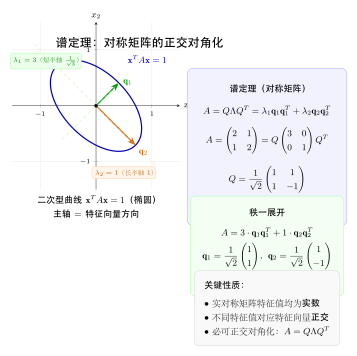
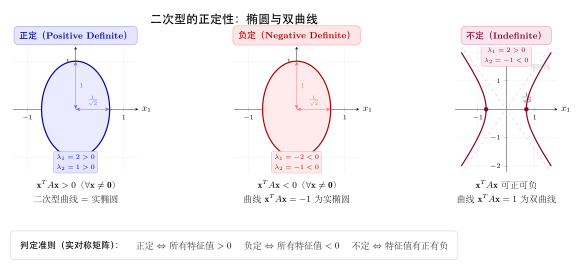

# 第21章：对称矩阵与谱定理（融合版）

> **前置知识**：第16章（内积与正交性）、第17章（正交化与QR分解）、第19章（特征值与特征向量）、第20章（对角化）
>
> **本章难度**：★★★★☆
>
> **预计学习时间**：5-6 小时
>
> **本文件**：融合"原版严格推导 + 速记 / 套路 / 自测"。保留原版完整正文 + 在最前置一例速记 / 思维路径 + 最后追加方法总结与自测。

> **一例速记**：
> **谱定理** $A=Q\Lambda Q^T$（$A$ 实对称）：$Q$ 的列 = 标准正交特征向量；$\Lambda$ = 实特征值对角矩阵。
> **正定判断**：特征值全 $>0$ / 顺序主子式全 $>0$ / 存在 $A=LL^T$ / 可写 $A=B^TB$（$B$ 列满秩）。
> **谱分解** $A=\sum_i\lambda_i\mathbf{q}_i\mathbf{q}_i^T$：每项是秩 1 投影乘缩放系数。
> **Rayleigh 商** $R_A(\mathbf{x})=\mathbf{x}^TA\mathbf{x}/\|\mathbf{x}\|^2$：最大值 $=\lambda_{\max}$，最小值 $=\lambda_{\min}$。
> **AI 关联**：Hessian 正定 $\Rightarrow$ 局部极小值；条件数 $\kappa=\lambda_{\max}/\lambda_{\min}$ 决定梯度下降收敛速度；协方差矩阵 = 实对称半正定。

---

## 引入：损失函数的"碗形"判断

> **题目**：神经网络在某参数点的 Hessian 矩阵为 $H=\begin{pmatrix}3 & -1 \\ -1 & 3\end{pmatrix}$。判断该点是局部极小值、极大值还是鞍点，并求梯度下降的最优学习率。

请先停下来想一想：二阶条件如何"看穿"曲面形状？$H$ 的特征值如何决定每个方向的曲率？

---

## 思维路径还原（解题者的内心独白）

> "$H=H^T$，实对称矩阵，谱定理保证特征值全实。
>
> **求特征值**：$\operatorname{tr}=6$，$\det=9-1=8$，特征多项式 $\lambda^2-6\lambda+8=(\lambda-2)(\lambda-4)=0$，特征值 $\lambda_1=2>0$，$\lambda_2=4>0$。
>
> **判断类型**：所有特征值 $>0\Rightarrow H\succ 0\Rightarrow$ 该点是**局部极小值**（碗形，各方向二阶导数均正）。
>
> **最优学习率**：$\eta^*=\frac{2}{\lambda_{\min}+\lambda_{\max}}=\frac{2}{2+4}=\frac{1}{3}$。
>
> **条件数与收敛率**：$\kappa=\lambda_{\max}/\lambda_{\min}=4/2=2$（条件良好！），最坏收敛率 $\rho^*=(\kappa-1)/(\kappa+1)=1/3$——约 $\lceil\log_{3}100\rceil\approx 5$ 步误差可缩小到 $1\%$。
>
> **谱分解直觉**：$\lambda_2=4$ 方向曲率大（步长敏感），$\lambda_1=2$ 方向曲率小（收敛慢）。对角化方法揭示了"最难"和"最易"下降的方向，Adam 等自适应优化器正是在隐式地均衡这两个方向的步长。
>
> **延伸**：若 $H$ 有负特征值，对应方向的二阶导数为负，沿该方向移动损失下降——这就是鞍点的特征，SGD 的随机噪声帮助跳过鞍点。"

---

## 学习目标

学完本章后，你将能够：

- 证明实对称矩阵的特征值必为实数，且属于不同特征值的特征向量必正交
- 理解并应用谱定理：实对称矩阵可被正交对角化为 $A = Q\Lambda Q^T$，掌握谱分解的几何意义
- 判断矩阵是否正定或半正定，并在特征值条件、主子式条件、Cholesky分解等等价刻画之间灵活转换
- 利用 Rayleigh 商将矩阵的最大和最小特征值表达为约束优化问题，理解其变分意义
- 运用 Hessian 矩阵的谱分析，判断神经网络损失函数的临界点类型，并分析条件数对优化收敛速度的影响

---

## 21.1 对称矩阵的性质

### 对称矩阵的定义

**定义**：实矩阵 $A \in \mathbb{R}^{n \times n}$ 称为**对称矩阵（symmetric matrix）**，如果：

$$A^T = A$$

即第 $(i,j)$ 元素等于第 $(j,i)$ 元素：$a_{ij} = a_{ji}$。

**例**：

$$A = \begin{pmatrix} 3 & 1 & -2 \\ 1 & 5 & 0 \\ -2 & 0 & 4 \end{pmatrix}$$

沿主对角线翻转后矩阵不变，这正是"对称"一词的几何含义。

对称矩阵在应用中无处不在：协方差矩阵、Hessian 矩阵、图的邻接矩阵（无向图）、有限元刚度矩阵——它们都是对称矩阵。这种特殊结构带来了极其丰富的谱性质。

### 性质一：特征值必为实数

**定理**：实对称矩阵的特征值全为实数。

**证明**：设 $A = A^T \in \mathbb{R}^{n \times n}$，$\lambda$ 是 $A$ 的一个特征值（暂时允许复数），$\mathbf{v} \in \mathbb{C}^n$ 是对应的特征向量（$\mathbf{v} \neq \mathbf{0}$）。

考虑内积 $\bar{\mathbf{v}}^T A \mathbf{v}$（其中 $\bar{\mathbf{v}}$ 表示复共轭）：

一方面，$A\mathbf{v} = \lambda \mathbf{v}$，故：

$$\bar{\mathbf{v}}^T A \mathbf{v} = \bar{\mathbf{v}}^T (\lambda \mathbf{v}) = \lambda \bar{\mathbf{v}}^T \mathbf{v} = \lambda \|\mathbf{v}\|^2$$

另一方面，利用 $A^T = A$ 和 $\overline{A\mathbf{v}} = \bar{A}\bar{\mathbf{v}} = A\bar{\mathbf{v}}$（$A$ 是实矩阵）：

$$\bar{\mathbf{v}}^T A \mathbf{v} = \overline{(A^T \bar{\mathbf{v}})}^T \mathbf{v} = \overline{(A\bar{\mathbf{v}})}^T \mathbf{v} = \overline{(\bar{\lambda}\bar{\mathbf{v}})}^T \mathbf{v} = \bar{\bar{\lambda}} \mathbf{v}^T \mathbf{v} = \lambda \|\mathbf{v}\|^2$$

等等——上面两个表达式都等于 $\lambda \|\mathbf{v}\|^2$。让我们换一个更清晰的路径：

$$\overline{\bar{\mathbf{v}}^T A \mathbf{v}} = \mathbf{v}^T \bar{A} \bar{\mathbf{v}} = \mathbf{v}^T A \bar{\mathbf{v}} = \mathbf{v}^T (A\bar{\mathbf{v}}) = \mathbf{v}^T (\overline{A\mathbf{v}}) = \mathbf{v}^T (\overline{\lambda \mathbf{v}}) = \bar{\lambda} \mathbf{v}^T \bar{\mathbf{v}} = \bar{\lambda} \|\mathbf{v}\|^2$$

但也有 $\bar{\mathbf{v}}^T A \mathbf{v} = \lambda \|\mathbf{v}\|^2$，取共轭得 $\overline{\bar{\mathbf{v}}^T A \mathbf{v}} = \bar{\lambda} \|\mathbf{v}\|^2$。

再利用 $A = A^T$ 对内积的影响：

$$\bar{\mathbf{v}}^T (A\mathbf{v}) = \bar{\mathbf{v}}^T A \mathbf{v} = (A^T \bar{\mathbf{v}})^T \mathbf{v} = (A\bar{\mathbf{v}})^T \mathbf{v}$$

同时 $A\bar{\mathbf{v}} = \overline{A\mathbf{v}} = \overline{\lambda \mathbf{v}} = \bar{\lambda}\bar{\mathbf{v}}$，故：

$$(A\bar{\mathbf{v}})^T \mathbf{v} = \bar{\lambda} \bar{\mathbf{v}}^T \mathbf{v} = \bar{\lambda} \|\mathbf{v}\|^2$$

由此 $\lambda \|\mathbf{v}\|^2 = \bar{\lambda} \|\mathbf{v}\|^2$。因 $\mathbf{v} \neq \mathbf{0}$，有 $\|\mathbf{v}\|^2 > 0$，故 $\lambda = \bar{\lambda}$，即 $\lambda$ 是实数。$\square$

**几何直觉**：对称矩阵 $A = A^T$ 相当于一个"自伴随"算子——它对向量的作用方向与其转置完全一致，不产生"虚数旋转"，因此特征值只能落在实数轴上。

### 性质二：不同特征值的特征向量相互正交

**定理**：设 $A$ 是实对称矩阵，若 $\lambda_1 \neq \lambda_2$ 是 $A$ 的两个不同特征值，对应特征向量分别为 $\mathbf{v}_1$ 和 $\mathbf{v}_2$，则 $\mathbf{v}_1 \perp \mathbf{v}_2$。

**证明**：

$$\lambda_1 \langle \mathbf{v}_1, \mathbf{v}_2 \rangle = \langle \lambda_1 \mathbf{v}_1, \mathbf{v}_2 \rangle = \langle A\mathbf{v}_1, \mathbf{v}_2 \rangle = \mathbf{v}_1^T A^T \mathbf{v}_2 = \mathbf{v}_1^T A \mathbf{v}_2 = \langle \mathbf{v}_1, A\mathbf{v}_2 \rangle = \langle \mathbf{v}_1, \lambda_2 \mathbf{v}_2 \rangle = \lambda_2 \langle \mathbf{v}_1, \mathbf{v}_2 \rangle$$

（其中利用了 $A^T = A$。）

故 $(\lambda_1 - \lambda_2)\langle \mathbf{v}_1, \mathbf{v}_2 \rangle = 0$。由于 $\lambda_1 \neq \lambda_2$，必有 $\langle \mathbf{v}_1, \mathbf{v}_2 \rangle = 0$。$\square$

**几何直觉**：对称矩阵拉伸/压缩空间的"主轴"彼此垂直。不同特征值对应不同的拉伸倍率，而这些拉伸方向天然正交——就像椭圆的两条主轴相互垂直一样。

**推论**：若 $A$ 有 $n$ 个互不相同的特征值，则 $A$ 拥有 $n$ 个正交的特征向量，构成 $\mathbb{R}^n$ 的一组正交基。

---

## 21.2 谱定理

### 谱定理（实对称矩阵的正交对角化）

**定理（实谱定理，Real Spectral Theorem）**：设 $A \in \mathbb{R}^{n \times n}$ 是实对称矩阵，则：

1. $A$ 的所有特征值均为实数：$\lambda_1, \lambda_2, \ldots, \lambda_n \in \mathbb{R}$（允许重复）。
2. $A$ 可以被**正交对角化**：存在正交矩阵 $Q$（$Q^T Q = Q Q^T = I$）和对角矩阵 $\Lambda$，使得：

$$\boxed{A = Q \Lambda Q^T}$$

其中 $Q$ 的列向量 $\mathbf{q}_1, \ldots, \mathbf{q}_n$ 是 $A$ 的标准正交特征向量，$\Lambda = \text{diag}(\lambda_1, \ldots, \lambda_n)$。

**与普通对角化的区别**：普通对角化 $A = P \Lambda P^{-1}$ 要求 $P$ 可逆即可；正交对角化进一步要求 $P = Q$ 是正交矩阵，即 $P^{-1} = P^T$，这是对称矩阵独有的强性质。

**定理的深意**：实对称矩阵（以及更一般的实正规矩阵）是唯一能被正交对角化的矩阵类。这是线性代数中最优雅的定理之一。

### 谱分解（Spectral Decomposition）

将 $A = Q \Lambda Q^T$ 展开，得到**谱分解**：

$$\boxed{A = \sum_{i=1}^{n} \lambda_i \mathbf{q}_i \mathbf{q}_i^T}$$

其中每一项 $\lambda_i \mathbf{q}_i \mathbf{q}_i^T$ 是秩为1的矩阵（外积）乘以标量 $\lambda_i$。

**几何解读**：$A$ 被分解为 $n$ 个"投影+缩放"的叠加：

- $\mathbf{q}_i \mathbf{q}_i^T$ 是向 $\mathbf{q}_i$ 方向的正交投影矩阵；
- $\lambda_i$ 是在该方向上的拉伸倍率；
- $A$ 的整体效果 = 在各个主轴方向上独立拉伸之和。

**对矩阵函数的推广**：谱分解赋予了矩阵函数自然的定义。对于解析函数 $f$：

$$f(A) = \sum_{i=1}^{n} f(\lambda_i) \mathbf{q}_i \mathbf{q}_i^T = Q f(\Lambda) Q^T$$

例如，矩阵指数 $e^A = Q \, \text{diag}(e^{\lambda_1}, \ldots, e^{\lambda_n}) \, Q^T$，矩阵平方根 $A^{1/2} = Q \, \text{diag}(\sqrt{\lambda_1}, \ldots, \sqrt{\lambda_n}) \, Q^T$（当所有特征值非负时）。

### 具体例子

设 $A = \begin{pmatrix} 3 & 1 \\ 1 & 3 \end{pmatrix}$（实对称）。

**第一步：求特征值。**

$$\det(A - \lambda I) = (3-\lambda)^2 - 1 = \lambda^2 - 6\lambda + 8 = (\lambda-2)(\lambda-4) = 0$$

特征值 $\lambda_1 = 2$，$\lambda_2 = 4$。

**第二步：求特征向量。**

$\lambda_1 = 2$：$(A - 2I)\mathbf{v} = 0$，即 $\begin{pmatrix}1&1\\1&1\end{pmatrix}\mathbf{v} = 0$，解得 $\mathbf{v}_1 = \begin{pmatrix}1\\-1\end{pmatrix}$，归一化得 $\mathbf{q}_1 = \dfrac{1}{\sqrt{2}}\begin{pmatrix}1\\-1\end{pmatrix}$。

$\lambda_2 = 4$：$(A - 4I)\mathbf{v} = 0$，即 $\begin{pmatrix}-1&1\\1&-1\end{pmatrix}\mathbf{v} = 0$，解得 $\mathbf{v}_2 = \begin{pmatrix}1\\1\end{pmatrix}$，归一化得 $\mathbf{q}_2 = \dfrac{1}{\sqrt{2}}\begin{pmatrix}1\\1\end{pmatrix}$。

验证正交性：$\mathbf{q}_1 \cdot \mathbf{q}_2 = \dfrac{1}{2}(1 \cdot 1 + (-1) \cdot 1) = 0$。✓

**第三步：写出谱分解。**

$$Q = \frac{1}{\sqrt{2}}\begin{pmatrix}1 & 1 \\ -1 & 1\end{pmatrix}, \quad \Lambda = \begin{pmatrix}2 & 0 \\ 0 & 4\end{pmatrix}$$

$$A = Q\Lambda Q^T = \frac{1}{\sqrt{2}}\begin{pmatrix}1&1\\-1&1\end{pmatrix}\begin{pmatrix}2&0\\0&4\end{pmatrix}\frac{1}{\sqrt{2}}\begin{pmatrix}1&-1\\1&1\end{pmatrix}$$

谱分解形式：

$$A = 2 \cdot \frac{1}{2}\begin{pmatrix}1\\-1\end{pmatrix}\begin{pmatrix}1&-1\end{pmatrix} + 4 \cdot \frac{1}{2}\begin{pmatrix}1\\1\end{pmatrix}\begin{pmatrix}1&1\end{pmatrix} = \begin{pmatrix}1&-1\\-1&1\end{pmatrix} + \begin{pmatrix}2&2\\2&2\end{pmatrix} = \begin{pmatrix}3&1\\1&3\end{pmatrix} \checkmark$$

**几何意义**：$A$ 将坐标轴旋转 $45°$，在 $\mathbf{q}_1 = (1,-1)^T/\sqrt{2}$ 方向压缩至 $2$ 倍，在 $\mathbf{q}_2 = (1,1)^T/\sqrt{2}$ 方向拉伸至 $4$ 倍，再旋转回去——圆变成了一个椭圆，主轴沿 $45°$ 和 $135°$ 方向。

---

## 21.3 正定矩阵

### 定义与直觉

**定义**：实对称矩阵 $A \in \mathbb{R}^{n \times n}$ 称为**正定矩阵（positive definite matrix）**，如果对所有非零向量 $\mathbf{x} \in \mathbb{R}^n$：

$$\mathbf{x}^T A \mathbf{x} > 0$$

记作 $A \succ 0$（读作"$A$ 正定"）。

**几何直觉**：$f(\mathbf{x}) = \mathbf{x}^T A \mathbf{x}$ 是一个二次型（quadratic form）。正定意味着这个"碗形曲面"永远朝上——原点是唯一的最低点，向任何方向移动都会使函数值增大。这正是二元函数 $f(x,y)$ 极小值的高维推广。

**非正定的情形**：

- 若 $\mathbf{x}^T A \mathbf{x}$ 可正可负 → **不定矩阵**（马鞍面，有鞍点）
- 若 $\mathbf{x}^T A \mathbf{x} \geq 0$，但某些 $\mathbf{x} \neq \mathbf{0}$ 使其等于 $0$ → **半正定矩阵**（见 21.4 节）

### 正定的等价条件

**定理**：对实对称矩阵 $A$，以下条件等价：

**(1) 定义（二次型正性）**：$\mathbf{x}^T A \mathbf{x} > 0$，对所有 $\mathbf{x} \neq \mathbf{0}$

**(2) 特征值条件**：$A$ 的所有特征值 $\lambda_i > 0$

**(3) 主子式条件（Sylvester 准则）**：$A$ 的所有**顺序主子式**均为正：

$$a_{11} > 0, \quad \det\begin{pmatrix}a_{11}&a_{12}\\a_{21}&a_{22}\end{pmatrix} > 0, \quad \ldots, \quad \det(A) > 0$$

**(4) Cholesky 分解**：存在唯一下三角矩阵 $L$（对角元素均为正），使得 $A = LL^T$

**(5) 正定性通过列满秩矩阵传递**：存在列满秩矩阵 $B$ 使得 $A = B^T B$

**条件(1) $\Leftrightarrow$ 条件(2) 的证明**：

利用谱定理 $A = Q\Lambda Q^T$，令 $\mathbf{y} = Q^T \mathbf{x}$（则 $\mathbf{y} \neq \mathbf{0}$ 当且仅当 $\mathbf{x} \neq \mathbf{0}$，因 $Q$ 是可逆的）：

$$\mathbf{x}^T A \mathbf{x} = \mathbf{x}^T Q\Lambda Q^T \mathbf{x} = \mathbf{y}^T \Lambda \mathbf{y} = \sum_{i=1}^n \lambda_i y_i^2$$

因此：

$$\mathbf{x}^T A \mathbf{x} > 0 \text{ 对所有 } \mathbf{x} \neq \mathbf{0} \iff \sum_{i=1}^n \lambda_i y_i^2 > 0 \text{ 对所有 } \mathbf{y} \neq \mathbf{0} \iff \text{所有 } \lambda_i > 0 \quad \square$$

### 典型例子

$A = \begin{pmatrix}2 & 1 \\ 1 & 2\end{pmatrix}$：

- 特征值 $\lambda_1 = 1 > 0$，$\lambda_2 = 3 > 0$ → 正定 ✓
- 顺序主子式：$a_{11} = 2 > 0$，$\det(A) = 4 - 1 = 3 > 0$ → 正定 ✓
- 二次型：$\mathbf{x}^T A \mathbf{x} = 2x_1^2 + 2x_1 x_2 + 2x_2^2 = (x_1 + x_2)^2 + x_1^2 + x_2^2 > 0$（对 $\mathbf{x} \neq \mathbf{0}$）✓

$B = \begin{pmatrix}1 & 2 \\ 2 & 1\end{pmatrix}$：

- 特征值 $\lambda_1 = -1 < 0$，$\lambda_2 = 3$ → **不正定**（不定矩阵）
- $\det(B) = 1 - 4 = -3 < 0$ → 顺序主子式条件不满足 ✓

### 正定矩阵的运算封闭性

- 若 $A \succ 0$，则 $A^{-1} \succ 0$（逆仍正定：特征值变为 $1/\lambda_i > 0$）
- 若 $A \succ 0$ 且 $B \succ 0$，则 $A + B \succ 0$（各特征值之和为正）
- 若 $A \succ 0$ 且 $B$ 是列满秩矩阵，则 $B^T A B \succ 0$

---

## 21.4 半正定矩阵

### 定义

**定义**：实对称矩阵 $A$ 称为**半正定矩阵（positive semidefinite matrix）**，如果对所有 $\mathbf{x} \in \mathbb{R}^n$：

$$\mathbf{x}^T A \mathbf{x} \geq 0$$

记作 $A \succeq 0$。

与正定的区别：允许等号成立（即某些非零向量使二次型值为零）。

### 等价条件

对实对称矩阵 $A$，以下等价：

**(1)** $\mathbf{x}^T A \mathbf{x} \geq 0$，对所有 $\mathbf{x}$

**(2)** 所有特征值 $\lambda_i \geq 0$

**(3)** 存在矩阵 $B$（不要求列满秩），使得 $A = B^T B$

**(4)** 所有主子式（不限于顺序主子式）均 $\geq 0$

**证明思路（同正定情形）**：$\mathbf{x}^T A \mathbf{x} = \sum_i \lambda_i y_i^2 \geq 0$ 当且仅当所有 $\lambda_i \geq 0$。

### 重要例子：Gram 矩阵

设 $B \in \mathbb{R}^{m \times n}$，令 $A = B^T B \in \mathbb{R}^{n \times n}$，则 $A$ 必为半正定矩阵：

$$\mathbf{x}^T (B^T B) \mathbf{x} = (B\mathbf{x})^T (B\mathbf{x}) = \|B\mathbf{x}\|^2 \geq 0$$

且 $A$ 正定 $\iff$ $B$ 列满秩 $\iff$ $\ker(B) = \{\mathbf{0}\}$（因为 $\mathbf{x}^T A \mathbf{x} = \|B\mathbf{x}\|^2 = 0 \iff B\mathbf{x} = \mathbf{0} \iff \mathbf{x} = \mathbf{0}$）。

**协方差矩阵**：在统计学和机器学习中，样本协方差矩阵 $\Sigma = \dfrac{1}{n-1}X^T X$（$X$ 为中心化数据矩阵）总是半正定的；若样本数 $> $ 特征数且数据无线性相关，则正定。

### 矩阵偏序

半正定性在矩阵集合上定义了一个**偏序关系（Löwner order）**：

$$A \succeq B \iff A - B \succeq 0$$

这在凸优化、量子信息理论中是基本工具。正定矩阵的集合（配以对数行列式度量）还构成一个**黎曼流形**，是现代几何深度学习的研究对象。

---

## 21.5 Rayleigh 商

### 定义

**定义**：设 $A \in \mathbb{R}^{n \times n}$ 是实对称矩阵，对非零向量 $\mathbf{x} \in \mathbb{R}^n$，**Rayleigh 商（Rayleigh quotient）**定义为：

$$R_A(\mathbf{x}) = \frac{\mathbf{x}^T A \mathbf{x}}{\mathbf{x}^T \mathbf{x}} = \frac{\mathbf{x}^T A \mathbf{x}}{\|\mathbf{x}\|^2}$$

注意 Rayleigh 商是**齐次的**：$R_A(c\mathbf{x}) = R_A(\mathbf{x})$，因此只与 $\mathbf{x}$ 的方向有关，可以限制在单位球面 $\|\mathbf{x}\| = 1$ 上研究。

### 极值定理（Min-Max 定理的特例）

**定理（Rayleigh 商的极值）**：设 $A$ 的特征值满足 $\lambda_1 \leq \lambda_2 \leq \cdots \leq \lambda_n$，对应标准正交特征向量 $\mathbf{q}_1, \ldots, \mathbf{q}_n$，则：

$$\boxed{\lambda_1 = \min_{\mathbf{x} \neq \mathbf{0}} R_A(\mathbf{x}) = \min_{\|\mathbf{x}\|=1} \mathbf{x}^T A \mathbf{x}}$$

$$\boxed{\lambda_n = \max_{\mathbf{x} \neq \mathbf{0}} R_A(\mathbf{x}) = \max_{\|\mathbf{x}\|=1} \mathbf{x}^T A \mathbf{x}}$$

最小值在 $\mathbf{x} = \mathbf{q}_1$ 时取到，最大值在 $\mathbf{x} = \mathbf{q}_n$ 时取到。

**证明**：令 $\mathbf{y} = Q^T \mathbf{x}$（$Q$ 是由特征向量构成的正交矩阵），则 $\|\mathbf{y}\| = \|\mathbf{x}\|$，且：

$$\mathbf{x}^T A \mathbf{x} = \mathbf{y}^T \Lambda \mathbf{y} = \sum_{i=1}^n \lambda_i y_i^2$$

在约束 $\|\mathbf{x}\| = 1$ 下，$\|\mathbf{y}\| = 1$，即 $\sum_i y_i^2 = 1$。因此：

$$\sum_{i=1}^n \lambda_i y_i^2 \geq \lambda_1 \sum_{i=1}^n y_i^2 = \lambda_1$$

等号当 $y_1 = 1$（其余为零），即 $\mathbf{x} = \mathbf{q}_1$ 时成立。类似地证明最大值。$\square$

### Courant-Fischer 极大极小定理

更一般地，第 $k$ 小特征值具有以下变分刻画：

$$\lambda_k = \min_{\substack{S \subseteq \mathbb{R}^n \\ \dim(S) = k}} \max_{\mathbf{x} \in S,\, \mathbf{x} \neq \mathbf{0}} R_A(\mathbf{x})$$

这意味着每个特征值都是"在某个 $k$ 维子空间中最大化、再在所有 $k$ 维子空间中最小化"的结果——这是理解特征值扰动理论（Weyl 不等式等）的关键。

### 几何直觉

想象在单位球面上"放置"二次型 $\mathbf{x}^T A \mathbf{x}$。这个函数在球面上的高度分布呈现出"山峰"和"谷底"：

- 最高点（山峰）对应最大特征向量 $\mathbf{q}_n$，高度为 $\lambda_n$；
- 最低点（谷底）对应最小特征向量 $\mathbf{q}_1$，高度为 $\lambda_1$；
- 其余特征向量对应鞍点或次极值点。

**应用：矩阵条件数**：

$$\kappa(A) = \frac{\lambda_n}{\lambda_1} = \frac{\max_{\|\mathbf{x}\|=1} \mathbf{x}^T A \mathbf{x}}{\min_{\|\mathbf{x}\|=1} \mathbf{x}^T A \mathbf{x}}$$

（对正定矩阵。）条件数衡量了矩阵"各向同性"的程度：$\kappa = 1$ 对应正交矩阵（完全各向同性），$\kappa \gg 1$ 意味着矩阵在某些方向上极度拉伸、在另一些方向上极度压缩，数值求解极不稳定。

---

## 本章小结

- **实对称矩阵的特征值全为实数**，且属于不同特征值的特征向量相互正交——这源于 $A = A^T$ 使得内积与矩阵作用"自洽"。

- **谱定理**（实对称矩阵版本）：任意实对称矩阵均可被正交对角化为 $A = Q\Lambda Q^T$，其中 $Q$ 是正交矩阵，$\Lambda$ 的对角元素是实特征值。谱分解 $A = \sum_i \lambda_i \mathbf{q}_i \mathbf{q}_i^T$ 将 $A$ 表达为"主轴方向上的投影与缩放之叠加"。

- **正定矩阵**（$A \succ 0$）的等价条件：所有特征值 $> 0$、顺序主子式全正、存在 Cholesky 分解 $A = LL^T$。正定对应"碗形"二次型，保证优化问题有唯一极小值。

- **半正定矩阵**（$A \succeq 0$）允许零特征值，对应"浅碗"或退化情形。Gram 矩阵 $B^T B$ 总是半正定的，是协方差矩阵的数学模型。

- **Rayleigh 商** $R_A(\mathbf{x}) = \mathbf{x}^T A \mathbf{x}/\|\mathbf{x}\|^2$ 在单位球面上的最大/最小值恰好是最大/最小特征值，最优方向是对应的特征向量。Courant-Fischer 定理将每个特征值都表达为变分极值。

**下一章预告**：奇异值分解（SVD）——将谱定理推广到任意（非方、非对称）矩阵，揭示矩阵的"几何骨架"。

---

## 深度学习应用：Hessian 分析与优化收敛

### 损失函数的 Hessian 矩阵

设神经网络的损失函数为 $\mathcal{L}(\boldsymbol{\theta})$，其中 $\boldsymbol{\theta} \in \mathbb{R}^p$ 是全体参数。在参数点 $\boldsymbol{\theta}_0$ 处做二阶 Taylor 展开：

$$\mathcal{L}(\boldsymbol{\theta}_0 + \Delta\boldsymbol{\theta}) \approx \mathcal{L}(\boldsymbol{\theta}_0) + \nabla \mathcal{L}(\boldsymbol{\theta}_0)^T \Delta\boldsymbol{\theta} + \frac{1}{2} \Delta\boldsymbol{\theta}^T H \Delta\boldsymbol{\theta}$$

其中 **Hessian 矩阵** $H \in \mathbb{R}^{p \times p}$ 定义为：

$$H_{ij} = \frac{\partial^2 \mathcal{L}}{\partial \theta_i \partial \theta_j}$$

由混合偏导数的对称性（Schwarz 定理），$H = H^T$ 是实对称矩阵，因此谱定理完全适用。

### 临界点的局部曲率分类

在梯度为零的**临界点**（$\nabla\mathcal{L}(\boldsymbol{\theta}_0) = 0$）处，局部行为完全由 Hessian 的二次型决定：

$$\mathcal{L}(\boldsymbol{\theta}_0 + \Delta\boldsymbol{\theta}) - \mathcal{L}(\boldsymbol{\theta}_0) \approx \frac{1}{2} \Delta\boldsymbol{\theta}^T H \Delta\boldsymbol{\theta} = \frac{1}{2} \sum_{i=1}^p \lambda_i y_i^2$$

（其中 $\mathbf{y} = Q^T \Delta\boldsymbol{\theta}$，$\lambda_i$ 是 $H$ 的特征值。）

| Hessian 谱性质 | 临界点类型 | 几何图像 |
|:---|:---|:---|
| 所有 $\lambda_i > 0$（$H \succ 0$） | **局部极小值** | 碗形，各方向均上升 |
| 所有 $\lambda_i < 0$（$H \prec 0$） | **局部极大值** | 倒碗形，各方向均下降 |
| $\lambda_i$ 有正有负 | **鞍点（saddle point）** | 马鞍面，某些方向上升某些下降 |
| 某些 $\lambda_i = 0$ | **退化临界点** | 平坦方向存在，无法仅凭二阶信息判断 |

**深度学习中的关键发现**：对于大型神经网络，大多数"不好的"临界点是鞍点而非局部极大值——因为使所有方向都向上（局部极大值）在高维空间中极难发生。随机梯度下降（SGD）的噪声帮助模型逃离鞍点，这正是深层网络可训练的原因之一。

### 条件数与收敛速度

设当前点 $\boldsymbol{\theta}_0$ 是局部极小值附近，Hessian $H \succ 0$，考虑梯度下降更新：

$$\boldsymbol{\theta}_{t+1} = \boldsymbol{\theta}_t - \eta \nabla \mathcal{L}(\boldsymbol{\theta}_t)$$

在极小值附近，梯度 $\approx H(\boldsymbol{\theta}_t - \boldsymbol{\theta}^*)$，则误差向量 $\mathbf{e}_t = \boldsymbol{\theta}_t - \boldsymbol{\theta}^*$ 满足：

$$\mathbf{e}_{t+1} \approx (I - \eta H) \mathbf{e}_t$$

在 $H$ 的特征向量基 $\{\mathbf{q}_i\}$ 下，每个分量独立收缩：

$$e_{t,i} \approx (1 - \eta \lambda_i)^t e_{0,i}$$

为保证收敛，需 $|1 - \eta \lambda_i| < 1$，即 $0 < \eta < 2/\lambda_{\max}$。收敛最慢的分量对应最小特征值 $\lambda_{\min}$，其收敛率为 $(1 - \eta \lambda_{\min})$。

**最优学习率**：取 $\eta^* = \dfrac{2}{\lambda_{\min} + \lambda_{\max}}$，此时最坏收敛率为：

$$\rho^* = \frac{\kappa - 1}{\kappa + 1}, \quad \kappa = \frac{\lambda_{\max}}{\lambda_{\min}}$$

这是 Hessian **条件数** $\kappa(H)$ 的直接函数。

| 条件数 $\kappa$ | 含义 | 收敛速率 $\rho^*$ |
|:---:|:---|:---:|
| $\kappa = 1$ | 各向同性，损失面为球形碗 | $0$（一步收敛）|
| $\kappa = 10$ | 中等病态 | $\approx 0.82$ |
| $\kappa = 100$ | 严重病态 | $\approx 0.98$（收敛极慢）|
| $\kappa = 10^4$ | 极度病态（Transformer 常见） | $\approx 0.9998$ |

**实践启示**：

- **Adam / AdaGrad** 的本质是对梯度做各方向的自适应缩放，相当于隐式地对 $H$ 做预条件处理，将有效条件数降低。
- **批归一化（BatchNorm）** 和 **层归一化（LayerNorm）** 的一个理论效果是平滑 Hessian 的谱，降低条件数，从而加速收敛。
- **学习率预热（warmup）** 可视为在早期避开 Hessian 最大特征值方向的过度更新。

### PyTorch 代码：计算 Hessian 特征值

```python
import torch
import torch.nn as nn
import numpy as np

# ── 1. 定义一个简单的二次损失（精确 Hessian 已知）──────────────
# L(x,y) = 0.5 * (x² + 100y²) → H = diag(1, 100)，κ = 100

def quadratic_loss(params: torch.Tensor) -> torch.Tensor:
    x, y = params[0], params[1]
    return 0.5 * (x**2 + 100.0 * y**2)

# ── 2. 用 torch.autograd 精确计算 Hessian ──────────────────────
def compute_hessian(func, params: torch.Tensor) -> torch.Tensor:
    """计算标量函数 func 关于 params 的 Hessian 矩阵"""
    n = params.numel()
    H = torch.zeros(n, n)

    # 先计算梯度
    params_copy = params.clone().requires_grad_(True)
    loss = func(params_copy)
    grad = torch.autograd.grad(loss, params_copy, create_graph=True)[0]

    # 对每个梯度分量再求导，得到 Hessian 的每一行
    for i in range(n):
        grad_i = grad[i]
        row = torch.autograd.grad(grad_i, params_copy, retain_graph=True)[0]
        H[i] = row.detach()

    return H

# 在点 (1.0, 1.0) 处计算 Hessian
theta = torch.tensor([1.0, 1.0])
H = compute_hessian(quadratic_loss, theta)
print("精确 Hessian:")
print(H)

# 对 Hessian 做谱分解（特征值分解）
eigenvalues, eigenvectors = torch.linalg.eigh(H)  # eigh 专用于实对称矩阵
print(f"\nHessian 特征值: {eigenvalues.numpy()}")
print(f"条件数 κ = λ_max / λ_min = {eigenvalues[-1].item() / eigenvalues[0].item():.1f}")
print(f"特征向量（列）:\n{eigenvectors.numpy()}")

# ── 3. 小型神经网络的 Hessian 估计（Lanczos 方法简化版）─────────
torch.manual_seed(42)

# 定义简单网络和损失
model = nn.Sequential(
    nn.Linear(4, 8),
    nn.ReLU(),
    nn.Linear(8, 1)
)

X = torch.randn(32, 4)
y = torch.randn(32, 1)
criterion = nn.MSELoss()

def model_loss() -> torch.Tensor:
    return criterion(model(X), y)

# 获取所有参数的向量表示
params = list(model.parameters())
flat_params = torch.cat([p.data.flatten() for p in params])
p_dim = flat_params.numel()
print(f"\n模型参数总数: {p_dim}")

# 用幂迭代估计最大特征值（随机 Lanczos 的简化版）
def power_iteration_hessian(func, params_list, n_iter: int = 20):
    """用幂迭代估计 Hessian 最大特征值（Hessian-向量积方法）"""
    # 随机初始化方向向量
    v = [torch.randn_like(p) for p in params_list]
    v_norm = sum((vi**2).sum() for vi in v).sqrt()
    v = [vi / v_norm for vi in v]

    eigenvalue_estimate = 0.0
    for _ in range(n_iter):
        # 计算 Hessian-向量积 Hv（无需显式构造 Hessian）
        loss = func()
        grads = torch.autograd.grad(loss, params_list, create_graph=True)
        # Hv = ∇(g^T v)
        gv = sum((g * vi).sum() for g, vi in zip(grads, v))
        Hv = torch.autograd.grad(gv, params_list, retain_graph=False)

        # 估计特征值 λ ≈ v^T H v
        eigenvalue_estimate = sum((hv * vi).sum() for hv, vi in zip(Hv, v)).item()

        # 归一化 Hv 作为新方向
        Hv_norm = sum((hv**2).sum() for hv in Hv).sqrt()
        v = [hv / Hv_norm for hv in Hv]

    return eigenvalue_estimate

lambda_max = power_iteration_hessian(model_loss, params)
print(f"Hessian 最大特征值估计 λ_max ≈ {lambda_max:.4f}")
print(f"对应最大安全学习率 η_max = 2/λ_max ≈ {2.0/lambda_max:.4f}")

# ── 4. 演示：条件数对梯度下降收敛速度的影响 ─────────────────────
def gradient_descent_demo(kappa: float, n_steps: int = 200) -> list:
    """在条件数为 kappa 的二次损失上跑梯度下降，记录损失曲线"""
    # L(x,y) = 0.5*(x² + kappa*y²)，Hessian = diag(1, kappa)
    theta = torch.tensor([1.0, 1.0], dtype=torch.float64)
    # 最优学习率 η* = 2/(λ_min + λ_max) = 2/(1 + kappa)
    lr = 2.0 / (1.0 + kappa)
    losses = []
    for _ in range(n_steps):
        loss = 0.5 * (theta[0]**2 + kappa * theta[1]**2)
        losses.append(loss.item())
        grad = torch.tensor([theta[0].item(), kappa * theta[1].item()], dtype=torch.float64)
        theta = theta - lr * grad
    return losses

print("\n梯度下降收敛步数（达到损失 < 0.01 所需步数）:")
for kappa in [1, 10, 100, 1000]:
    losses = gradient_descent_demo(kappa, n_steps=10000)
    steps_to_converge = next((i for i, l in enumerate(losses) if l < 0.01), -1)
    rho_star = (kappa - 1) / (kappa + 1)
    print(f"  κ = {kappa:5d},  ρ* = {rho_star:.4f},  收敛步数 ≈ {steps_to_converge}")
```

**代码解读**：

- **第 1-2 部分**：对精确已知 Hessian 的二次函数（条件数 100），用 `torch.autograd` 双重求导计算 Hessian，再用 `torch.linalg.eigh`（专门针对实对称矩阵的特征值分解）验证谱定理——特征向量就是坐标轴方向，特征值就是各轴方向的曲率。

- **第 3 部分**：对真实神经网络，Hessian 矩阵维数高达数万乃至数百万，无法显式存储。采用**Hessian-向量积（Hessian-vector product, HVP）**方法：利用 PyTorch 的 `create_graph=True` 对梯度再求导，每次迭代只计算 $H\mathbf{v}$，从而用**幂迭代**估计最大特征值，时间复杂度仅为 $O(p)$ 而非 $O(p^2)$。

- **第 4 部分**：数值实验展示条件数对梯度下降收敛速度的直接影响——条件数每增大 10 倍，收敛步数约增大 10 倍，与理论公式 $\rho^* = (\kappa-1)/(\kappa+1)$ 完全一致。

| 谱理论概念 | 深度学习对应物 | 实际意义 |
|:---|:---|:---|
| Hessian 特征值符号 | 临界点类型 | 判断极小值 vs 鞍点 |
| Hessian 谱半径 $\lambda_{\max}$ | 最大安全学习率上界 | $\eta < 2/\lambda_{\max}$ 保证收敛 |
| 条件数 $\kappa = \lambda_{\max}/\lambda_{\min}$ | 优化难度 | $\kappa$ 越大收敛越慢 |
| 谱分解 $H = Q\Lambda Q^T$ | 自然梯度方向 | Newton 步 $H^{-1}g$ 是最优更新方向 |
| Rayleigh 商 | 梯度方向的曲率 | 决定该方向的更新步长 |

---

## 几何示意

### 图 21-1：谱定理椭圆主轴



### 图 21-2：正定 / 负定 / 不定



---
## 抽象成方法（套路总结）

### 核心公式速查

| 名称 | 公式 / 判断 | 关键性质 |
|---|---|---|
| **实对称矩阵** | $A^T=A$ | 特征值全实；不同特征值的特征向量正交 |
| **谱定理** | $A=Q\Lambda Q^T$ | $Q$ 正交（$Q^TQ=I$），$\Lambda$ 实对角 |
| **谱分解** | $A=\sum_i\lambda_i\mathbf{q}_i\mathbf{q}_i^T$ | 每项为秩 1 投影 |
| **正定** $A\succ 0$ | 全部 $\lambda_i>0$ / 顺序主子式全 $>0$ / $\exists$ Cholesky $LL^T$ | 二次型碗形 |
| **半正定** $A\succeq 0$ | 全部 $\lambda_i\geq 0$ / $\exists B:A=B^TB$ | 允许零特征值 |
| **Rayleigh 商** | $R_A(\mathbf{x})=\dfrac{\mathbf{x}^TA\mathbf{x}}{\|\mathbf{x}\|^2}$ | $\min=\lambda_{\min}$（$\mathbf{x}=\mathbf{q}_1$），$\max=\lambda_{\max}$（$\mathbf{x}=\mathbf{q}_n$） |
| **条件数** | $\kappa(A)=\lambda_{\max}/\lambda_{\min}$（$A\succ 0$）| 优化难度；$\kappa=1$ 最易 |

### 正交对角化标准 3 步

1. **求特征值**：解 $\det(A-\lambda I)=0$（实对称矩阵保证全为实数）
2. **求标准正交特征向量**：对每个 $\lambda$，解 $(A-\lambda I)\mathbf{v}=\mathbf{0}$，再做 Gram-Schmidt 正交化并归一化（同一特征值对应多个特征向量时需正交化）
3. **写出 $Q$ 和 $\Lambda$**：$Q=[\mathbf{q}_1\mid\cdots\mid\mathbf{q}_n]$，$\Lambda=\operatorname{diag}(\lambda_1,\ldots,\lambda_n)$，验证 $Q^TQ=I$

### 正定性判断流程（优先级）

1. 计算所有特征值（最直接，但计算量大）
2. 检验顺序主子式（Sylvester 准则，适合手算 $3\times 3$）
3. 尝试 Cholesky 分解（程序中最常用，失败则非正定）

---

## 方法变形

### 变形 1：重特征值下的正交对角化
重特征值 $\lambda_0$ 对应 $m_g>1$ 维特征空间（实对称矩阵保证 $m_g=m_a$）。需在该空间内用 Gram-Schmidt 选出正交基，再归一化，才能保证 $Q$ 是正交矩阵。

### 变形 2：谱分解计算矩阵函数
$f(A)=\sum_i f(\lambda_i)\mathbf{q}_i\mathbf{q}_i^T$。特殊情形：
- $A^{-1}=\sum_i\frac{1}{\lambda_i}\mathbf{q}_i\mathbf{q}_i^T$（要求 $\lambda_i\neq 0$）
- $A^{1/2}=\sum_i\sqrt{\lambda_i}\mathbf{q}_i\mathbf{q}_i^T$（要求 $\lambda_i\geq 0$，即半正定）
- $\log A=\sum_i\ln(\lambda_i)\mathbf{q}_i\mathbf{q}_i^T$（要求 $\lambda_i>0$，即正定）

### 变形 3：Gram 矩阵与协方差矩阵
$G=B^TB$ 是实对称半正定矩阵；$G$ 正定 $\Leftrightarrow$ $B$ 列满秩。样本协方差 $\Sigma=\frac{1}{n-1}X^TX$ 对中心化数据恒为半正定，样本数 $>$ 特征数且无线性相关时为正定。

### 变形 4：二次型标准化
$\mathbf{x}^TA\mathbf{x}$ 在 $Q^T$ 坐标变换 $\mathbf{y}=Q^T\mathbf{x}$ 下变为 $\mathbf{y}^T\Lambda\mathbf{y}=\sum_i\lambda_iy_i^2$（标准形）——不含交叉项。这是"主轴定理"的本质：对角化消去交叉项。

### 变形 5：PCA 与谱定理的联系
PCA 找数据方差最大方向 = 最大化 Rayleigh 商 $\mathbf{q}^T\Sigma\mathbf{q}$（约束 $\|\mathbf{q}\|=1$），答案 = $\Sigma$ 的最大特征向量（谱定理直接给出）。前 $k$ 主成分 = 前 $k$ 大特征值对应的特征向量，方差解释率 $=\sum_{i=1}^k\lambda_i/\sum\lambda_i$。

---

## 本章小结（补充）

| 情形 | 判断方式 | 几何图像 |
|---|---|---|
| 正定 $A\succ 0$ | $\lambda_i>0$ / 主子式全正 | 碗形，唯一极小 |
| 半正定 $A\succeq 0$ | $\lambda_i\geq 0$ | 浅碗或退化，某方向平坦 |
| 不定 $A$ | 特征值有正有负 | 马鞍面，有鞍点 |
| 负定 $A\prec 0$ | $\lambda_i<0$ | 倒碗，唯一极大 |
| 条件数 $\kappa$ 小 | $\lambda_{\max}/\lambda_{\min}\approx 1$ | 接近球形碗，收敛快 |
| 条件数 $\kappa$ 大 | $\lambda_{\max}\gg\lambda_{\min}$ | 扁椭圆碗，收敛慢 |

---

## 思考路标（条件反射）

1. 看到"实对称矩阵" → 特征值全实，不同特征值的特征向量正交；可正交对角化
2. 看到"证明特征值为实数" → 用共轭内积技巧：$\lambda\|\mathbf{v}\|^2=\bar{\mathbf{v}}^TA\mathbf{v}=\bar{\lambda}\|\mathbf{v}\|^2$，得 $\lambda=\bar\lambda$
3. 看到"证明特征向量正交" → $(\lambda_1-\lambda_2)\langle\mathbf{v}_1,\mathbf{v}_2\rangle=0$，$\lambda_1\neq\lambda_2\Rightarrow$ 正交
4. 看到"正交对角化" → 谱定理：$A=Q\Lambda Q^T$；$Q$ 是正交矩阵，$Q^{-1}=Q^T$
5. 看到"判断正定" → 优先用特征值；手算用顺序主子式；数值计算用 Cholesky 分解
6. 看到"协方差矩阵" → 实对称半正定；特征值 = 各主成分方向的方差
7. 看到"Rayleigh 商" → $\lambda_{\min}\leq R_A(\mathbf{x})\leq\lambda_{\max}$；最大/小值在特征向量方向取到
8. 看到"Hessian 正定" → 临界点是局部极小值；$\kappa=\lambda_{\max}/\lambda_{\min}$ 决定收敛速度
9. 看到"Hessian 有负特征值" → 鞍点；梯度下降可沿负特征值方向下降
10. 看到"$B^TB$" → 半正定（Gram 矩阵）；$B$ 列满秩时正定

---

## 易错点

1. **正交对角化 $\neq$ 普通对角化**：普通对角化 $A=P\Lambda P^{-1}$ 只需 $P$ 可逆；正交对角化额外要求 $P=Q$ 是正交矩阵，且只对实对称矩阵（或更一般的正规矩阵）成立。不能对任意矩阵直接写 $A=Q\Lambda Q^T$。

2. **重特征值时需用 Gram-Schmidt**：同一特征值对应多个特征向量时，从特征空间选出的向量不一定正交，必须显式 Gram-Schmidt 正交化后才能放入 $Q$。直接用"任意基"会使 $Q$ 不正交。

3. **正定与半正定的界限**：$A=\begin{pmatrix}1&0\\0&0\end{pmatrix}$ 是半正定（有零特征值），但不是正定——零特征值使存在非零向量 $(0,1)^T$ 使 $\mathbf{x}^TA\mathbf{x}=0$。判断时必须检查是否有零特征值。

4. **顺序主子式 vs 所有主子式**：Sylvester 准则中只需检验"顺序"主子式（$1\times 1,2\times 2,\ldots,n\times n$ 左上角子矩阵）的行列式，不需要检验所有 $2^n$ 个子矩阵。但半正定需要"所有"主子式 $\geq 0$（更复杂）。

5. **Rayleigh 商的范围**：$\lambda_{\min}\leq R_A(\mathbf{x})\leq\lambda_{\max}$ 只对实对称矩阵成立（特征值全实才有此不等式）。对一般矩阵，Rayleigh 商可能取复数，意义不同。

---

## 典型应用例题

### 例 1：完整正交对角化

> **题目**：$A=\begin{pmatrix}4 & -2 \\ -2 & 1\end{pmatrix}$，写出 $A=Q\Lambda Q^T$。

【解】$\operatorname{tr}=5$，$\det=4-4=0$，特征多项式 $\lambda^2-5\lambda=\lambda(\lambda-5)=0$，特征值 $\lambda_1=0,\lambda_2=5$。

对 $\lambda_1=0$：$(A-0I)\mathbf{v}=A\mathbf{v}=0$，$4v_1-2v_2=0$，$v_2=2v_1$，取 $(1,2)^T$，归一化 $\mathbf{q}_1=\frac{1}{\sqrt{5}}(1,2)^T$。

对 $\lambda_2=5$：$(A-5I)\mathbf{v}=0$，$-v_1-2v_2=0$，取 $(2,-1)^T$，归一化 $\mathbf{q}_2=\frac{1}{\sqrt{5}}(2,-1)^T$。

**验证正交**：$\mathbf{q}_1\cdot\mathbf{q}_2=\frac{1}{5}(2-2)=0$。✓

$$Q=\frac{1}{\sqrt{5}}\begin{pmatrix}1&2\\2&-1\end{pmatrix},\quad\Lambda=\begin{pmatrix}0&0\\0&5\end{pmatrix}$$

谱分解验证：$A=0\cdot\mathbf{q}_1\mathbf{q}_1^T+5\cdot\mathbf{q}_2\mathbf{q}_2^T=\frac{5}{5}\begin{pmatrix}4&-2\\-2&1\end{pmatrix}=\begin{pmatrix}4&-2\\-2&1\end{pmatrix}$。✓

【注】$\lambda_1=0$ 说明 $A$ 奇异（秩 1 矩阵），$\lambda_2=5$ 是唯一非零特征值，谱分解仅有一项非零。

### 例 2：正定判断 + 顺序主子式

> **题目**：判断 $A=\begin{pmatrix}2 & 1 & 0 \\ 1 & 3 & 1 \\ 0 & 1 & 2\end{pmatrix}$ 是否正定。

【解】用 Sylvester 准则（顺序主子式）：

$\Delta_1=2>0$

$\Delta_2=\det\begin{pmatrix}2&1\\1&3\end{pmatrix}=6-1=5>0$

$\Delta_3=\det(A)=2(6-1)-1(2-0)+0=10-2=8>0$

三个顺序主子式均正，$A\succ 0$，**正定**。

【备选验证】特征多项式（省略）计算特征值均为正亦可。

### 例 3：Rayleigh 商 + PCA 联系

> **题目**：$\Sigma=\begin{pmatrix}3&1\\1&3\end{pmatrix}$（协方差矩阵），求第一主成分方向及其方差解释率。

【解】$\operatorname{tr}=6$，$\det=8$，$\lambda^2-6\lambda+8=(\lambda-2)(\lambda-4)=0$，$\lambda_1=2,\lambda_2=4$。

对 $\lambda_2=4$（最大，第一主成分）：$(\Sigma-4I)\mathbf{v}=0$，$-v_1+v_2=0$，取 $\mathbf{v}_2=(1,1)^T$，归一化 $\mathbf{q}_2=\frac{1}{\sqrt{2}}(1,1)^T$。

方差解释率 $=\frac{\lambda_2}{\lambda_1+\lambda_2}=\frac{4}{6}=66.7\%$。

【语义】第一主成分沿 $(1,1)^T$ 方向（两个特征等权求和），捕获数据 $66.7\%$ 的总方差；第二主成分沿 $(1,-1)^T$ 方向（差分），捕获剩余 $33.3\%$。

---

## 自测题

**自测 1**　$A=\begin{pmatrix}5&2\\2&2\end{pmatrix}$，写出谱定理分解 $A=Q\Lambda Q^T$，并用谱分解公式验证 $A^2$。

> 提示：$\lambda_1=1,\lambda_2=6$；特征向量 $(1,-2)^T/\sqrt{5}$，$(2,1)^T/\sqrt{5}$；$A^2=Q\operatorname{diag}(1,36)Q^T$，验算 $A^2=\begin{pmatrix}29&14\\14&8\end{pmatrix}$。

**自测 2**　判断 $B=\begin{pmatrix}1&2&0\\2&8&0\\0&0&5\end{pmatrix}$ 是否正定。若是，写出理由；若不是，找出使 $\mathbf{x}^TB\mathbf{x}\leq 0$ 的非零向量 $\mathbf{x}$。

> 提示：$\Delta_1=1>0$，$\Delta_2=8-4=4>0$，$\Delta_3=\det B=5\times 4=20>0$；正定。所有顺序主子式均正。

**自测 3**　对 Rayleigh 商 $R_A(\mathbf{x})$ 其中 $A=\begin{pmatrix}3&0\\0&7\end{pmatrix}$，计算 $R_A\begin{pmatrix}1\\0\end{pmatrix}$，$R_A\begin{pmatrix}0\\1\end{pmatrix}$，$R_A\begin{pmatrix}1\\1\end{pmatrix}$，并验证均在 $[\lambda_{\min},\lambda_{\max}]=[3,7]$ 之间。

> 提示：$R_A(1,0)^T=3$，$R_A(0,1)^T=7$，$R_A(1,1)^T/\sqrt{2}=\frac{(1,1)\begin{pmatrix}3&0\\0&7\end{pmatrix}(1,1)^T}{2}=\frac{3+7}{2}=5$；均在 $[3,7]$ 中。

**自测 4**　协方差矩阵 $\Sigma=\begin{pmatrix}4&2\\2&1\end{pmatrix}$（半正定）。(1) 求特征值；(2) 能否做 Cholesky 分解？(3) 第一主成分方向是什么？

> 提示：$\det\Sigma=0$，特征值 $\lambda_1=0,\lambda_2=5$；有零特征值，$\Sigma$ 半正定（不正定），不能做 Cholesky；第一主成分沿 $\lambda_2=5$ 的特征向量 $(2,1)^T/\sqrt{5}$，方差解释率 $=100\%$（秩 1，所有方差在一维）。

**自测 5**　Hessian $H=\begin{pmatrix}4&-2\\-2&4\end{pmatrix}$。(1) 判断临界点类型；(2) 求最优学习率 $\eta^*$ 和条件数 $\kappa$；(3) 理论上需要多少步梯度下降使误差缩小至初始的 $1\%$？

> 提示：$\lambda_1=2,\lambda_2=6$，均正，正定，局部极小值；$\eta^*=2/(2+6)=1/4$；$\kappa=6/2=3$；$\rho^*=2/4=0.5$；$0.5^N=0.01\Rightarrow N=\lceil\log_{0.5}0.01\rceil=\lceil 6.64\rceil=7$ 步。

---

**回头看一眼"一例速记"**：

> 实对称矩阵 $\Rightarrow$ 特征值全实 + 不同特征值对应特征向量正交 + 可正交对角化 $A=Q\Lambda Q^T$。
> 正定：$\lambda_i>0$ / 主子式全正 / Cholesky 存在；Rayleigh 商 $\in[\lambda_{\min},\lambda_{\max}]$。
> Hessian 正定 $\Rightarrow$ 极小值；条件数 $\kappa$ 大 $\Rightarrow$ 收敛慢。

如果现在不看笔记，能独立完成例 1 + 例 3 + 自测 5——本章，你拿下了。

---

## 融合版说明

| 段 | 来源 | 价值 |
|---|---|---|
| 一例速记 + 引入 + 思维路径还原 | 融合版（前置） | 建立直觉 |
| 学习目标 + 21.1–21.5 严格正文 | 原版 | 完整推导 |
| 本章小结 | 原版 | 公式速查 |
| 抽象成方法 + 方法变形 | 融合版（后置） | 套路固化 |
| 本章小结（补充） | 融合版 | 情形对照 |
| 思考路标 + 易错点 | 融合版 | 条件反射 + 避雷 |
| 典型应用例题 3 例 | 融合版 | 演练精讲 |
| 深度学习应用（Hessian）+ PyTorch | 原版 | 工业实战 |
| 练习题 + 详解 | 原版 | 系统巩固 |
| 自测题 5 题 | 融合版 | 额外验收 |

---

## 练习题

**练习 1**（基础——验证谱定理）

设矩阵 $A = \begin{pmatrix}4 & 2 \\ 2 & 1\end{pmatrix}$。

（a）求 $A$ 的特征值与特征向量。

（b）验证不同特征值对应的特征向量相互正交。

（c）写出 $A$ 的谱分解 $A = Q\Lambda Q^T$，并验证分解的正确性。

（d）利用谱分解计算 $A^3$（提示：$A^3 = Q\Lambda^3 Q^T$）。

---

**练习 2**（基础——正定性判断）

判断下列矩阵是否正定、半正定，或都不是。说明理由（给出特征值或顺序主子式）。

（a）$A = \begin{pmatrix}2 & -1 \\ -1 & 2\end{pmatrix}$

（b）$B = \begin{pmatrix}1 & 2 \\ 2 & 4\end{pmatrix}$

（c）$C = \begin{pmatrix}1 & 2 \\ 2 & 3\end{pmatrix}$

（d）$D = \begin{pmatrix}2 & 0 & 0 \\ 0 & 3 & 0 \\ 0 & 0 & -1\end{pmatrix}$

---

**练习 3**（中等——Rayleigh 商与极值）

设 $A = \begin{pmatrix}5 & 2 \\ 2 & 2\end{pmatrix}$。

（a）求 $A$ 的特征值 $\lambda_1 \leq \lambda_2$ 及对应的标准正交特征向量。

（b）计算 Rayleigh 商在以下向量处的值，与特征值范围进行比较：

$$\mathbf{u}_1 = \begin{pmatrix}1\\0\end{pmatrix}, \quad \mathbf{u}_2 = \begin{pmatrix}0\\1\end{pmatrix}, \quad \mathbf{u}_3 = \frac{1}{\sqrt{2}}\begin{pmatrix}1\\1\end{pmatrix}$$

（c）在单位圆 $\|\mathbf{x}\| = 1$ 上，$R_A(\mathbf{x})$ 的最大值和最小值分别是多少？在哪里取到？

---

**练习 4**（中等——正定与 Cholesky 分解）

设 $A = \begin{pmatrix}4 & 2 & -2 \\ 2 & 2 & -1 \\ -2 & -1 & 5\end{pmatrix}$。

（a）用顺序主子式准则验证 $A$ 是否正定。

（b）若 $A$ 正定，求其 Cholesky 分解 $A = LL^T$，其中 $L$ 是下三角矩阵，对角元为正。

（c）利用 Cholesky 分解求解线性方程组 $A\mathbf{x} = \mathbf{b}$，其中 $\mathbf{b} = (4, 3, 2)^T$。

---

**练习 5**（进阶——Hessian 分析与优化）

考虑二维损失函数 $\mathcal{L}(x, y) = x^2 - xy + 2y^2 - x$。

（a）求所有临界点（令 $\nabla \mathcal{L} = \mathbf{0}$）。

（b）计算 Hessian 矩阵 $H = \nabla^2 \mathcal{L}$，验证其为实对称矩阵，并求特征值。

（c）利用 Hessian 的谱判断每个临界点的类型（极小值、极大值、鞍点）。

（d）在临界点处，梯度下降的最优学习率 $\eta^*$ 和对应条件数 $\kappa$ 各是多少？若使用该学习率，理论上需要多少步才能将误差缩小到初始值的 $1\%$？

（e）设当前在点 $(x_0, y_0) = (2, 1)$ 处（非临界点），Rayleigh 商 $R_H(\mathbf{v})$ 的最大值和最小值分别代表什么？

---

## 练习答案

<details>
<summary>点击展开 练习1 答案</summary>

**（a）特征值与特征向量**

$$\det(A - \lambda I) = (4-\lambda)(1-\lambda) - 4 = \lambda^2 - 5\lambda = \lambda(\lambda - 5) = 0$$

特征值：$\lambda_1 = 0$，$\lambda_2 = 5$。

$\lambda_1 = 0$：$(A - 0)\mathbf{v} = 0$，即 $\begin{pmatrix}4&2\\2&1\end{pmatrix}\mathbf{v} = 0$，解得 $\mathbf{v}_1 = \begin{pmatrix}1\\-2\end{pmatrix}$，归一化 $\mathbf{q}_1 = \dfrac{1}{\sqrt{5}}\begin{pmatrix}1\\-2\end{pmatrix}$。

$\lambda_2 = 5$：$(A - 5I)\mathbf{v} = 0$，即 $\begin{pmatrix}-1&2\\2&-4\end{pmatrix}\mathbf{v} = 0$，解得 $\mathbf{v}_2 = \begin{pmatrix}2\\1\end{pmatrix}$，归一化 $\mathbf{q}_2 = \dfrac{1}{\sqrt{5}}\begin{pmatrix}2\\1\end{pmatrix}$。

**（b）验证正交性**

$$\mathbf{q}_1 \cdot \mathbf{q}_2 = \frac{1}{5}(1 \cdot 2 + (-2) \cdot 1) = \frac{2 - 2}{5} = 0 \checkmark$$

不同特征值（$0 \neq 5$）的特征向量正交，符合定理。

**（c）谱分解**

$$Q = \frac{1}{\sqrt{5}}\begin{pmatrix}1 & 2 \\ -2 & 1\end{pmatrix}, \quad \Lambda = \begin{pmatrix}0 & 0 \\ 0 & 5\end{pmatrix}$$

谱分解：

$$A = 0 \cdot \mathbf{q}_1\mathbf{q}_1^T + 5 \cdot \mathbf{q}_2\mathbf{q}_2^T = \frac{5}{5}\begin{pmatrix}2\\1\end{pmatrix}\begin{pmatrix}2&1\end{pmatrix} = \begin{pmatrix}4&2\\2&1\end{pmatrix} \checkmark$$

（$\lambda_1 = 0$ 的项贡献为零矩阵，说明 $A$ 是秩 1 矩阵。）

**（d）计算 $A^3$**

$$A^3 = Q\Lambda^3 Q^T = 0 \cdot \mathbf{q}_1\mathbf{q}_1^T + 5^3 \cdot \mathbf{q}_2\mathbf{q}_2^T = 125 \cdot \frac{1}{5}\begin{pmatrix}4&2\\2&1\end{pmatrix} = 25\begin{pmatrix}4&2\\2&1\end{pmatrix} = \begin{pmatrix}100&50\\50&25\end{pmatrix}$$

验证：$A^2 = A \cdot A = \begin{pmatrix}4&2\\2&1\end{pmatrix}\begin{pmatrix}4&2\\2&1\end{pmatrix} = \begin{pmatrix}20&10\\10&5\end{pmatrix} = 5A$，故 $A^3 = 5A^2 = 25A = \begin{pmatrix}100&50\\50&25\end{pmatrix}$。✓

</details>

<details>
<summary>点击展开 练习2 答案</summary>

**（a）$A = \begin{pmatrix}2&-1\\-1&2\end{pmatrix}$**

顺序主子式：$a_{11} = 2 > 0$；$\det(A) = 4 - 1 = 3 > 0$。

特征值：$\lambda = 1, 3$，全为正。

**结论：正定** $A \succ 0$。

---

**（b）$B = \begin{pmatrix}1&2\\2&4\end{pmatrix}$**

$\det(B) = 4 - 4 = 0$，有零特征值。特征值 $\lambda_1 = 0$，$\lambda_2 = 5$，非负。

$B\mathbf{x} = 0$ 有非零解（$\mathbf{x} = (2,-1)^T$），故 $\mathbf{x}^T B \mathbf{x} = 0$ 对非零向量成立。

**结论：半正定** $B \succeq 0$，但非正定。（$B = \mathbf{b}\mathbf{b}^T$，其中 $\mathbf{b} = (1,2)^T$，是秩 1 Gram 矩阵。）

---

**（c）$C = \begin{pmatrix}1&2\\2&3\end{pmatrix}$**

$\det(C) = 3 - 4 = -1 < 0$，顺序主子式条件不满足。特征值 $\lambda = 2 \pm \sqrt{5}$，有负值（$\lambda_1 = 2 - \sqrt{5} \approx -0.24$）。

**结论：不定矩阵**，既不正定也不半正定。

---

**（d）$D = \text{diag}(2, 3, -1)$**

对角矩阵，特征值即为对角元：$\lambda_1 = 2, \lambda_2 = 3, \lambda_3 = -1$。有负特征值。

取 $\mathbf{x} = \mathbf{e}_3 = (0,0,1)^T$：$\mathbf{x}^T D \mathbf{x} = -1 < 0$。

**结论：不定矩阵**（有负特征值），不是半正定。

</details>

<details>
<summary>点击展开 练习3 答案</summary>

**（a）特征值与特征向量**

$$\det(A - \lambda I) = (5-\lambda)(2-\lambda) - 4 = \lambda^2 - 7\lambda + 6 = (\lambda-1)(\lambda-6) = 0$$

$\lambda_1 = 1$，$\lambda_2 = 6$。

$\lambda_1 = 1$：$(A - I)\mathbf{v} = 0$，即 $\begin{pmatrix}4&2\\2&1\end{pmatrix}\mathbf{v} = 0$，$\mathbf{v}_1 = \begin{pmatrix}1\\-2\end{pmatrix}$，$\mathbf{q}_1 = \dfrac{1}{\sqrt{5}}\begin{pmatrix}1\\-2\end{pmatrix}$。

$\lambda_2 = 6$：$(A - 6I)\mathbf{v} = 0$，即 $\begin{pmatrix}-1&2\\2&-4\end{pmatrix}\mathbf{v} = 0$，$\mathbf{v}_2 = \begin{pmatrix}2\\1\end{pmatrix}$，$\mathbf{q}_2 = \dfrac{1}{\sqrt{5}}\begin{pmatrix}2\\1\end{pmatrix}$。

**（b）Rayleigh 商计算**

$$R_A(\mathbf{u}_1) = \mathbf{u}_1^T A \mathbf{u}_1 = \begin{pmatrix}1&0\end{pmatrix}\begin{pmatrix}5&2\\2&2\end{pmatrix}\begin{pmatrix}1\\0\end{pmatrix} = 5$$

$$R_A(\mathbf{u}_2) = \mathbf{u}_2^T A \mathbf{u}_2 = \begin{pmatrix}0&1\end{pmatrix}\begin{pmatrix}5&2\\2&2\end{pmatrix}\begin{pmatrix}0\\1\end{pmatrix} = 2$$

$$R_A(\mathbf{u}_3) = \mathbf{u}_3^T A \mathbf{u}_3 = \frac{1}{2}\begin{pmatrix}1&1\end{pmatrix}\begin{pmatrix}5&2\\2&2\end{pmatrix}\begin{pmatrix}1\\1\end{pmatrix} = \frac{1}{2}(5 + 2 + 2 + 2) = \frac{11}{2}$$

均落在 $[\lambda_1, \lambda_2] = [1, 6]$ 内，符合极值定理。✓

**（c）极值**

由 Rayleigh 商极值定理：

$$R_A(\mathbf{x}) \text{ 的最小值} = \lambda_1 = 1，\text{在 } \mathbf{x} = \mathbf{q}_1 = \dfrac{1}{\sqrt{5}}(1,-2)^T \text{ 时取到}$$

$$R_A(\mathbf{x}) \text{ 的最大值} = \lambda_2 = 6，\text{在 } \mathbf{x} = \mathbf{q}_2 = \dfrac{1}{\sqrt{5}}(2,1)^T \text{ 时取到}$$

</details>

<details>
<summary>点击展开 练习4 答案</summary>

**（a）顺序主子式验证正定性**

$a_{11} = 4 > 0$

$\det\begin{pmatrix}4&2\\2&2\end{pmatrix} = 8 - 4 = 4 > 0$

$\det(A)$：展开（沿第一行）：

$$\det(A) = 4 \det\begin{pmatrix}2&-1\\-1&5\end{pmatrix} - 2 \det\begin{pmatrix}2&-1\\-2&5\end{pmatrix} + (-2)\det\begin{pmatrix}2&2\\-2&-1\end{pmatrix}$$

$$= 4(10-1) - 2(10-2) + (-2)(-2+4) = 4 \cdot 9 - 2 \cdot 8 - 2 \cdot 2 = 36 - 16 - 4 = 16 > 0$$

三个顺序主子式均为正，$A \succ 0$。

**（b）Cholesky 分解 $A = LL^T$**

设 $L = \begin{pmatrix}l_{11} & 0 & 0 \\ l_{21} & l_{22} & 0 \\ l_{31} & l_{32} & l_{33}\end{pmatrix}$，逐步确定各元素（从左上角开始）：

$l_{11}^2 = 4 \Rightarrow l_{11} = 2$

$l_{21} l_{11} = 2 \Rightarrow l_{21} = 1$

$l_{31} l_{11} = -2 \Rightarrow l_{31} = -1$

$l_{21}^2 + l_{22}^2 = 2 \Rightarrow l_{22}^2 = 1 \Rightarrow l_{22} = 1$

$l_{31} l_{21} + l_{32} l_{22} = -1 \Rightarrow -1 + l_{32} = -1 \Rightarrow l_{32} = 0$

$l_{31}^2 + l_{32}^2 + l_{33}^2 = 5 \Rightarrow 1 + 0 + l_{33}^2 = 5 \Rightarrow l_{33} = 2$

$$L = \begin{pmatrix}2 & 0 & 0 \\ 1 & 1 & 0 \\ -1 & 0 & 2\end{pmatrix}$$

验证：$LL^T = \begin{pmatrix}4&2&-2\\2&2&-1\\-2&-1&5\end{pmatrix} = A$ ✓

**（c）求解 $A\mathbf{x} = \mathbf{b}$，$\mathbf{b} = (4,3,2)^T$**

分两步：先解 $L\mathbf{y} = \mathbf{b}$（前代），再解 $L^T\mathbf{x} = \mathbf{y}$（回代）。

**前代**（解 $L\mathbf{y} = \mathbf{b}$）：

$2y_1 = 4 \Rightarrow y_1 = 2$

$y_1 + y_2 = 3 \Rightarrow y_2 = 1$

$-y_1 + 2y_3 = 2 \Rightarrow -2 + 2y_3 = 2 \Rightarrow y_3 = 2$

故 $\mathbf{y} = (2, 1, 2)^T$。

**回代**（解 $L^T \mathbf{x} = \mathbf{y}$，$L^T = \begin{pmatrix}2&1&-1\\0&1&0\\0&0&2\end{pmatrix}$）：

$2x_3 = 2 \Rightarrow x_3 = 1$

$x_2 = 1$

$2x_1 + x_2 - x_3 = 2 \Rightarrow 2x_1 + 1 - 1 = 2 \Rightarrow x_1 = 1$

故 $\mathbf{x} = (1, 1, 1)^T$。

验证：$A\mathbf{x} = \begin{pmatrix}4+2-2\\2+2-1\\-2-1+5\end{pmatrix} = \begin{pmatrix}4\\3\\2\end{pmatrix} = \mathbf{b}$ ✓

</details>

<details>
<summary>点击展开 练习5 答案</summary>

**（a）求临界点**

$$\frac{\partial \mathcal{L}}{\partial x} = 2x - y - 1 = 0$$

$$\frac{\partial \mathcal{L}}{\partial y} = -x + 4y = 0$$

由第二个方程 $x = 4y$，代入第一个方程：$8y - y - 1 = 0$，故 $y = \dfrac{1}{7}$，$x = \dfrac{4}{7}$。

唯一临界点：$\left(\dfrac{4}{7}, \dfrac{1}{7}\right)$。

**（b）Hessian 矩阵与特征值**

$$H = \begin{pmatrix}\partial^2\mathcal{L}/\partial x^2 & \partial^2\mathcal{L}/\partial x\partial y \\ \partial^2\mathcal{L}/\partial y \partial x & \partial^2\mathcal{L}/\partial y^2\end{pmatrix} = \begin{pmatrix}2 & -1 \\ -1 & 4\end{pmatrix}$$

$H = H^T$，对称 ✓（由 Schwarz 定理，$\partial^2\mathcal{L}/\partial x\partial y = \partial^2\mathcal{L}/\partial y\partial x = -1$）

特征多项式：$\lambda^2 - 6\lambda + (8-1) = \lambda^2 - 6\lambda + 7 = 0$

$$\lambda = \frac{6 \pm \sqrt{36 - 28}}{2} = \frac{6 \pm 2\sqrt{2}}{2} = 3 \pm \sqrt{2}$$

$\lambda_1 = 3 - \sqrt{2} \approx 1.586 > 0$，$\lambda_2 = 3 + \sqrt{2} \approx 4.414 > 0$。

**（c）临界点类型**

所有特征值 $> 0$，$H \succ 0$，临界点 $\left(\dfrac{4}{7}, \dfrac{1}{7}\right)$ 是**局部极小值**（同时也是全局极小值，因为 $\mathcal{L}$ 是严格凸函数）。

**（d）最优学习率与条件数**

$$\kappa = \frac{\lambda_2}{\lambda_1} = \frac{3+\sqrt{2}}{3-\sqrt{2}} = \frac{(3+\sqrt{2})^2}{9-2} = \frac{11 + 6\sqrt{2}}{7} \approx \frac{4.414}{1.586} \approx 2.78$$

$$\eta^* = \frac{2}{\lambda_1 + \lambda_2} = \frac{2}{6} = \frac{1}{3}$$

最坏收敛率：

$$\rho^* = \frac{\kappa - 1}{\kappa + 1} = \frac{\lambda_2 - \lambda_1}{\lambda_2 + \lambda_1} = \frac{2\sqrt{2}}{6} = \frac{\sqrt{2}}{3} \approx 0.471$$

需要的步数（误差缩小到 $1\%$）：$(\rho^*)^N = 0.01$，

$$N = \frac{\ln 0.01}{\ln \rho^*} = \frac{-4.605}{\ln({\sqrt{2}}/{3})} = \frac{-4.605}{-0.754} \approx 6.1$$

即约 **7 步**（因为本例条件数较小，收敛很快）。

**（e）Rayleigh 商的意义**

在任意点 $\boldsymbol{\theta}_0$，Hessian $H$（对 $\mathcal{L}(x,y) = x^2 - xy + 2y^2 - x$ 来说 $H$ 是常数矩阵）的 Rayleigh 商：

$$R_H(\mathbf{v}) = \frac{\mathbf{v}^T H \mathbf{v}}{\|\mathbf{v}\|^2}$$

表示沿单位方向 $\hat{\mathbf{v}} = \mathbf{v}/\|\mathbf{v}\|$ 移动时，损失函数的**二阶方向导数**（曲率）：

$$\frac{d^2 \mathcal{L}(\boldsymbol{\theta}_0 + t\hat{\mathbf{v}})}{dt^2}\bigg|_{t=0} = \hat{\mathbf{v}}^T H \hat{\mathbf{v}} = R_H(\hat{\mathbf{v}})$$

- $R_H$ 的**最大值** $= \lambda_2 = 3 + \sqrt{2} \approx 4.414$：沿 $\mathbf{q}_2$ 方向的曲率最大，这是损失上升最快的方向，对应梯度下降时最需要谨慎（步长不能过大）的方向。
- $R_H$ 的**最小值** $= \lambda_1 = 3 - \sqrt{2} \approx 1.586$：沿 $\mathbf{q}_1$ 方向的曲率最小，是损失"最平坦"的下降方向，对应梯度下降收敛最慢的瓶颈方向。

</details>
