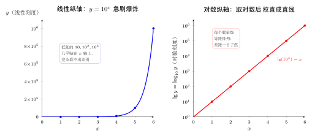

# 第1章：对数为什么出现

> 对数的起点不是公式，而是一个反向问题：如果结果已经知道，指数应该是多少？

## 学习目标

完成本章学习后，你将能够：

1. 说清楚对数解决的基本问题
2. 从指数函数的反向视角理解对数
3. 理解对数为什么适合描述数量级
4. 区分“原始数值”和“对数尺度”
5. 为后续定义与运算律打下直觉基础

---

## 正文内容

### 1.1 从一个反向问题开始

如果

$$
2^3=8
$$

那么我们可以反过来问：

> 以 2 为底，要得到 8，指数应该是多少？

答案是 3。这个“指数位置上的未知数”就是对数要表达的对象：

$$
\log_2 8=3
$$

所以对数不是凭空出现的新符号，而是指数函数的反向语言。

### 1.2 对数回答“需要多少次倍率”

指数表达的是“重复乘同一个倍率”：

$$
10^4=10000
$$

对数表达的是“需要多少层数量级”：

$$
\log_{10}10000=4
$$

这就是为什么对数特别适合处理巨大或极小的数。它关心的不是数值本身，而是这个数位于哪个尺度层级。

### 1.3 一个更完整的反向问题链条

对数最自然的理解方式，是把它放回下面这条链条：

1. 先给定底数 $a$
2. 再做指数运算 $a^y$
3. 得到结果 $x$
4. 如果已知 $a$ 和 $x$，就反问“原来的指数 $y$ 是多少”

于是就有：

$$
a^y=x \iff \log_a x=y
$$

这条链条很重要，因为后面你看到定义域、图像、运算律、方程和不等式时，几乎都可以先翻译回指数语言再理解。

### 1.4 对数不只和十进制有关

很多人第一次接触对数，是从常用对数 $\log_{10}$ 开始，因此容易误以为“对数就是处理 10 的幂”。其实并不是。

例如：

$$
2^5=32 \iff \log_2 32=5
$$

这里对数描述的是“以 2 为倍率，要乘多少次才能到 32”。

再看：

$$
3^4=81 \iff \log_3 81=4
$$

这里描述的是“以 3 为倍率，需要几个层级”。

所以对数的核心不是十进制，而是：**给定一个倍率，问需要多少次才能达到目标。**

### 1.5 为什么对数能压缩尺度

比较下面两组数：

$$
10,\quad 1000,\quad 1000000
$$

取常用对数后变成：

$$
1,\quad 3,\quad 6
$$

原本跨度巨大的数，现在变成了可以直接比较的指数层级。对数没有改变大小顺序，却改变了我们观察差距的方式。

这就是“尺度压缩”的意思：

- 原尺度里看的是绝对大小
- 对数尺度里看的是指数层级

下面这张对比图最能说明问题：左边用普通（线性）纵轴画 $y=10^x$，数值像爆炸一样冲上去，低处的 $10,100,1000$ 全挤在 $x$ 轴附近看不出差别；右边把纵轴换成对数刻度后，同一条曲线被“拉直”成一条均匀上升的直线，每个数量级等距排列，差距一目了然。

### 1.6 对数把乘法关系变成加法关系

假设一个过程先放大 100 倍，再放大 1000 倍，总放大倍数是：

$$
100\cdot1000=100000
$$

在常用对数尺度下：

$$
\log_{10}100+\log_{10}1000=2+3=5
$$

这对应：

$$
\log_{10}(100\cdot1000)=\log_{10}100000=5
$$

乘法关系变成了加法关系。这是对数最核心的结构价值，也是后面对数运算律、信息量和数值计算都会不断回来的主线。

### 1.7 对数的历史背景

对数不是凭空出现的公式，而是为了解决**实际计算困难**而发明的。

**Napier（1614年）**：苏格兰数学家约翰·纳皮尔发明对数的原始动机是简化天文学中的大量乘除运算。在没有计算器的年代，两个六位数的乘法可能需要几分钟；但如果先查对数表，把乘法变成加法，再查反对数表还原结果，只需几十秒。

**Briggs（1624年）**：英国数学家亨利·布里格斯将对数表改为以 10 为底（常用对数），使其与十进制更自然地配合。这版对数表被天文学家和航海家使用了三百多年。

**计算尺（Slide Rule）**：把对数刻度印在两根滑动尺上，就发明了计算尺——工程师和科学家的"口袋计算器"，直到 1970 年代电子计算器普及才退场。计算尺的原理就是 $\log(ab) = \log a + \log b$：两段对数刻度拼接（物理上的加法）就完成了乘法。

**为什么要知道历史**：理解对数的发明动机，可以帮你牢记它的核心价值——**把乘法变成加法、把幂变成乘法**。这不是公式巧合，而是对数被发明出来要解决的原始问题。

---

## 例题

**问题 1**：不用计算器，解释 $\log_{10} 10^7=7$ 的含义。

**思路**：

$10^7$ 表示 1 后面有 7 个 0，也表示从 1 出发连续乘 7 次 10。因此 $\log_{10}10^7$ 回答的是“需要多少个 10 的倍率”，答案就是 7。

**问题 2**：解释 $\log_2 3$ 的含义，虽然它不是整数。

**思路**：

$\log_2 3$ 回答的是：“以 2 为底，要得到 3，指数应该是多少？”

因为

$$
2^1=2<3<4=2^2
$$

所以这个指数介于 1 和 2 之间。也就是说，$\log_2 3$ 仍然有清楚的含义：它表示达到 3 所需要的“2 的层级”，只是这个层级不是整数。

---

## 常见误区与检查清单

- 是否把对数看成孤立公式，而不是指数的反向问题？
- 是否以为对数只和底数 10 有关？
- 是否以为对数只是为了“降低计算难度”？
- 是否忽略了对数表示的是尺度层级？
- 是否把 $\log_{10}1000=3$ 理解为“1000 除以 10 得 3”？

---

## 本章小结

| 主题 | 结论 |
|------|------|
| 基本问题 | 对数回答指数位置上的未知数 |
| 反向关系 | $a^y=x \iff \log_a x=y$ |
| 非整数情形 | 对数不要求结果一定是整数 |
| 尺度压缩 | 大范围数值可变成较小的层级数 |
| 结构转换 | 乘法关系可转成加法关系 |
| 核心直觉 | 对数是一种观察尺度的语言 |

---

## 分级例题精练

> 本节精选 6 道例题，分三档难度：**基础入门 ★** / **高中核心 ★★** / **高阶拓展 ★★★**。每题含【题目】【解】【点评】，建议先自行尝试再看解。

### 例题精练 1（★ 基础入门）

**题目**：把指数式 $2^6=64$ 改写成对数式，并用一句话说明这个对数回答了什么问题。

**解**：

按反向关系 $a^y=x \iff \log_a x=y$，令 $a=2,\ y=6,\ x=64$，得到：

$$
\log_2 64=6
$$

它回答的是：“以 2 为倍率，要乘多少次才能到 64？”答案是 6 次。

**点评**：这是最基本的“指数式 ↔ 对数式”互化。先认清谁是底数、谁是指数、谁是结果，再套反向关系即可。注意对数的值就是那个**指数**，而不是结果 64。

### 例题精练 2（★ 基础入门）

**题目**：不查表，写出 $\log_{10}1000000$ 的值，并解释为什么对数能把这种巨大的数“压缩”成一个小数字。

**解**：

因为 $10^6=1000000$，由反向关系得：

$$
\log_{10}1000000=6
$$

百万这个量被压缩成了 $6$，它表示“1 后面有 6 个 0”，也就是从 1 出发连乘 6 次 10。对数关心的不是数值本身，而是它位于哪个数量级层级，所以巨大的数也只对应一个不大的层级数。

**点评**：常用对数 $\log_{10}$ 直接读出“有几个数量级”。这正是 1.5 节“尺度压缩”的含义：对数没有改变大小顺序，却把绝对大小换成了指数层级，便于比较。

### 例题精练 3（★★ 高中核心）

**题目**：某信号先被放大 $1000$ 倍，再被放大 $100$ 倍。用常用对数说明：总放大倍数对应的层级数，等于两次放大的层级数之和。

**解**：

总放大倍数为：

$$
1000\times100=100000
$$

它的常用对数为 $\log_{10}100000=5$。

而分别计算两次放大的层级数再相加：

$$
\log_{10}1000+\log_{10}100=3+2=5
$$

两者相等，即：

$$
\log_{10}(1000\times100)=\log_{10}1000+\log_{10}100
$$

**点评**：这正是 1.6 节“乘法关系变加法关系”的具体演示，也是计算尺与对数表的工作原理。把连乘的倍率换成相加的层级，是对数最核心的结构价值。

### 例题精练 4（★★ 高中核心）

**题目**：不计算具体小数，判断 $\log_2 50$ 落在哪两个相邻整数之间，并说明理由。

**解**：

寻找把 50 夹在中间的 2 的整数次幂：

$$
2^5=32<50<64=2^6
$$

由于以 2 为底的指数随指数增大而增大，对应的对数也保持同样的大小顺序，所以：

$$
5<\log_2 50<6
$$

即 $\log_2 50$ 介于 5 和 6 之间。

**点评**：这是“非整数对数仍有清楚含义”（1.4、1.7 节例题 2 的思路）的标准估计法——用两边最近的整数次幂夹逼。这种夹逼判断在后面比较对数大小、解对数不等式时会反复用到。

### 例题精练 5（★★ 高中核心）

**题目**：地震里氏震级近似满足“震级每增加 1，释放能量对应的‘振幅’放大约 10 倍”。若 A 地震的振幅是 B 地震的 $10000$ 倍，用对数说明两者震级大约相差多少。

**解**：

设震级差为 $d$。按“震级差 1 对应振幅放大 10 倍”，振幅之比为 $10^{d}$。已知振幅之比为 $10000$，于是：

$$
10^{d}=10000
$$

两边看成反向问题，取常用对数：

$$
d=\log_{10}10000=4
$$

所以 A 比 B 的震级大约高 4 级。

**点评**：这是对数“把指数层级读出来”的真实应用。把“放大多少倍”翻译成“放大几个数量级”，正是对数尺度的用武之地——震级本身就是一种对数尺度。

### 例题精练 6（★★★ 高阶拓展）

**题目**：设 $N>0$ 且 $N\neq1$，已知 $\log_2 N=k$。请仅用 $k$ 表示 $\log_2 N^3$ 与 $\log_2\dfrac{1}{N}$，并从“反向问题”的角度解释结果，不直接套用尚未学到的运算律。

**解**：

由 $\log_2 N=k$ 知 $N=2^{k}$（反向关系）。

对 $N^3$：

$$
N^3=(2^{k})^3=2^{3k}\ \Longrightarrow\ \log_2 N^3=3k
$$

含义是：要从 1 乘到 $N^3$，需要的“2 的层级”恰好是到 $N$ 的层级的 3 倍。

对 $\dfrac1N$：

$$
\frac1N=\frac{1}{2^{k}}=2^{-k}\ \Longrightarrow\ \log_2\frac1N=-k
$$

含义是：取倒数相当于把“放大层级”变成同样多的“缩小层级”，所以层级数变号。

**点评**：本题不依赖运算律，而是直接回到 $a^y=x$ 的定义来推。它揭示了下一章运算律 $\log_a M^r=r\log_a M$、$\log_a\frac1N=-\log_a N$ 的来源——这些规律本质上都是指数运算 $(2^k)^3=2^{3k}$、$1/2^k=2^{-k}$ 的反向翻译。

---

## 练习题

1. 用一句话解释 $\log_2 32=5$ 的含义。
2. 写出 $\log_{10}100000$ 的值，并说明理由。
3. 解释为什么 $\log_3 81=4$ 可以看成一个反向问题。
4. 说明 $\log_2 3$ 为什么有意义，虽然它不是整数。
5. 举一个不是以 10 为底、但仍然适合用对数理解的例子。
6. 说明为什么对数适合描述数量级，而不只是原始数值。

### 练习参考答案

1. "以2为底32的对数是5"意味着：2连乘5次等于32（$2^5=32$）。
2. $\log_{10}100000 = 5$，因为 $10^5 = 100000$。
3. 因为 $\log_3 81$ 在问"3的多少次方等于81"，即从结果反推指数。
4. $\log_2 3$ 表示"2的几次方等于3"。因为 $2^1=2<3<4=2^2$，所以 $1<\log_2 3<2$，是一个无理数但完全有定义。
5. 例如计算机科学中常用 $\log_2 n$ 表示二分查找的次数。
6. 对数把"乘以10"变成"加1"，因此不管原始数字差多少个数量级，对数差只是整数的差——便于在同一尺度下比较。

---

下一章将把这种直觉正式写成定义，并解释为什么底数和真数必须满足严格条件。
