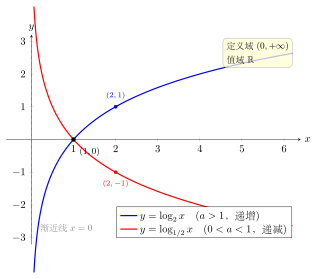

# 第4章：图像、定义域、值域与单调性

> 对数函数的图像不是孤立形状，而是指数函数图像关于直线 $y=x$ 的镜像。

## 学习目标

完成本章学习后，你将能够：

1. 画出 $y=\log_a x$ 的基本图像
2. 解释定义域、值域和渐近线的来源
3. 判断不同底数下对数函数的单调性
4. 从反函数关系理解关键点
5. 用图像辅助解决比较和不等式问题

---

## 正文内容

### 4.1 对数图像从指数图像而来

指数函数

$$
y=a^x
$$

和对数函数

$$
y=\log_a x
$$

互为反函数。因此它们的图像关于直线 $y=x$ 对称。

指数函数经过 $(0,1)$，所以对数函数经过：

$$
(1,0)
$$

指数函数经过 $(1,a)$，所以对数函数经过：

$$
(a,1)
$$

更一般地，如果指数函数经过点 $(u,a^u)$，那么对数函数就经过点 $(a^u,u)$。这说明对数图像上的点，本质上是在把指数图像中的横纵坐标交换。

### 4.2 定义域和值域

因为指数函数的输出永远为正：

$$
a^x>0
$$

所以对数函数的输入必须为正：

$$
\mathrm{Dom}(\log_a x)=(0,+\infty)
$$

指数函数的输入可以是任意实数，所以对数函数的输出也可以是任意实数：

$$
\mathrm{Ran}(\log_a x)=\mathbb R
$$

这不是额外规定，而是反函数关系直接决定的。

### 4.3 竖直渐近线从哪里来

指数函数在某一端会无限接近 0，但不会等于 0。反映到对数函数中，就是：

$$
x=0
$$

是对数函数的竖直渐近线。

这里要分底数讨论：

- 当 $a>1$ 时，指数函数在 $x\to-\infty$ 时趋近于 0，因此

$$
x\to0^+,\quad \log_a x\to-\infty
$$

- 当 $0<a<1$ 时，指数函数在 $x\to+\infty$ 时趋近于 0，因此

$$
x\to0^+,\quad \log_a x\to+\infty
$$

所以虽然两类对数函数都有同一条渐近线 $x=0$，但它们靠近这条渐近线时的方向是不同的。

### 4.4 单调性

| 底数范围 | 指数函数 $a^x$ | 对数函数 $\log_a x$ |
|----------|----------------|---------------------|
| $a>1$ | 递增 | 递增 |
| $0<a<1$ | 递减 | 递减 |

反函数会保留原函数的单调方向。因此底数大于 1 时，对数函数递增；底数在 0 和 1 之间时，对数函数递减。

下图把两类对数函数画在同一坐标系中对照：$y=\log_2 x$（$a>1$，递增）与 $y=\log_{1/2}x$（$0<a<1$，递减）。它们都定义在 $x>0$、值域为 $\mathbb R$、都过点 $(1,0)$，并以 $y$ 轴（$x=0$）为竖直渐近线，区别只在单调方向。

这会直接影响比较大小：

- 若 $a>1$，则 $x_1<x_2 \Rightarrow \log_a x_1<\log_a x_2$
- 若 $0<a<1$，则 $x_1<x_2 \Rightarrow \log_a x_1>\log_a x_2$

### 4.5 正值、负值和零点

对数函数在图像上还体现出一个很实用的判断：

- 当 $x=1$ 时，$\log_a 1=0$
- 当 $a>1$ 时：
  - $x>1$ 时，$\log_a x>0$
  - $0<x<1$ 时，$\log_a x<0$
- 当 $0<a<1$ 时正好相反：
  - $x>1$ 时，$\log_a x<0$
  - $0<x<1$ 时，$\log_a x>0$

这个符号判断在后面对数不等式和参数题里很常用。

---

## 例题

**问题 1**：比较 $\log_2 3$ 与 $\log_2 5$ 的大小。

**解答**：

因为底数 $2>1$，所以 $\log_2 x$ 递增。又因为 $3<5$，所以：

$$
\log_2 3<\log_2 5
$$

**问题 2**：比较 $\log_{1/3}2$ 与 $\log_{1/3}5$ 的大小。

**解答**：

因为底数 $\dfrac13$ 在 0 和 1 之间，所以 $\log_{1/3}x$ 递减。又因为 $2<5$，所以：

$$
\log_{1/3}2>\log_{1/3}5
$$

这正是递减函数比较时方向反过来的体现。

**问题 3**：求函数 $y = \log_2(x-3) + 1$ 的定义域、值域和渐近线。

**解答**：

**定义域**：真数必须为正：$x - 3 > 0$，即 $x > 3$。定义域 $(3, +\infty)$。

**值域**：$\log_2(x-3)$ 的值域是 $\mathbb{R}$，加 1 不改变，故值域 $\mathbb{R}$。

**渐近线**：当 $x \to 3^+$ 时，$\log_2(x-3) \to -\infty$，故竖直渐近线为 $x = 3$。

**图像理解**：$y = \log_2(x-3)+1$ 是 $y = \log_2 x$ 先**右移 3 个单位**（渐近线从 $x=0$ 变为 $x=3$），再**上移 1 个单位**（图像过点 $(4, 1)$ 而非 $(1, 0)$）。

**问题 4**：求函数 $y = \ln\frac{1}{x^2-1}$ 的定义域。

**解答**：

真数为正：$\frac{1}{x^2-1} > 0$，即 $x^2-1 > 0$（分子为正，分母必须为正），即 $|x| > 1$。

定义域：$(-\infty, -1) \cup (1, +\infty)$。

**要点**：复合函数的定义域要从最内层开始逐层检查。

---

## 常见误区与检查清单

- 是否忘记对数函数只在 $x>0$ 上有定义？
- 是否把 $x=0$ 当作函数可以取到的点？
- 是否忽略了 $0<a<1$ 时函数递减？
- 是否忘记图像一定经过 $(1,0)$？
- 是否混淆了“有同一条渐近线”和“靠近渐近线时方向相同”？

---

## 本章小结

| 性质 | 结论 |
|------|------|
| 图像来源 | 与 $y=a^x$ 关于 $y=x$ 对称 |
| 定义域 | $(0,+\infty)$ |
| 值域 | $\mathbb R$ |
| 关键点 | $(1,0)$、$(a,1)$ |
| 渐近线 | $x=0$ |
| 单调性 | $a>1$ 递增；$0<a<1$ 递减 |
| 符号判断 | 由底数范围和 $x$ 与 1 的比较共同决定 |

---

## 分级例题精练

> 本节精选 6 道例题，分三档难度：**基础入门 ★** / **高中核心 ★★** / **高阶拓展 ★★★**。每题含【题目】【解】【点评】，建议先自行尝试再看解。

### 例题精练 1（★ 基础入门）

**题目**：求函数 $y=\log_5(x-1)$ 的定义域，并判断它在定义域上的单调性。

**解**：

定义域要求真数为正：

$$
x-1>0\Rightarrow x>1
$$

故定义域为 $(1,+\infty)$。

底数 $5>1$，所以 $\log_5 t$ 关于 $t$ 递增；而 $t=x-1$ 又随 $x$ 递增，二者同增，故 $y=\log_5(x-1)$ 在 $(1,+\infty)$ 上**递增**。

**点评**：求形如 $y=\log_a(x-h)$ 的定义域，第一步永远是"真数 $>0$"。单调性则看底数：$a>1$ 递增、$0<a<1$ 递减，再结合内层一次函数的增减方向即可。

### 例题精练 2（★★ 高中核心）

**题目**：求函数 $y=\log_2(4-x^2)$ 的定义域和值域。

**解**：

**定义域**：真数为正

$$
4-x^2>0\Rightarrow x^2<4\Rightarrow -2<x<2
$$

定义域为 $(-2,2)$。

**值域**：令 $t=4-x^2$。当 $x\in(-2,2)$ 时，$x^2\in[0,4)$，故 $t=4-x^2\in(0,4]$。

底数 $2>1$，$\log_2 t$ 在 $(0,4]$ 上递增，于是

$$
\log_2 t\le\log_2 4=2,
$$

且当 $t\to0^+$ 时 $\log_2 t\to-\infty$。所以值域为 $(-\infty,2]$。

**点评**：求含对数复合函数的值域，标准做法是"换元定范围、再用单调性传递"。注意内层 $t$ 的取值范围是开闭混合的 $(0,4]$，最大值 $t=4$ 在 $x=0$ 处取到，对应 $y$ 的最大值 $2$。

### 例题精练 3（★★ 高中核心）

**题目**：求函数 $y=\log_{1/2}(x^2-2x-3)$ 的单调递增区间。

**解**：

**定义域**：真数为正

$$
x^2-2x-3>0\Rightarrow (x-3)(x+1)>0\Rightarrow x<-1\ \text{或}\ x>3.
$$

**内层分析**：令 $t=x^2-2x-3=(x-1)^2-4$，对称轴 $x=1$。在定义域 $(-\infty,-1)$ 上 $t$ 随 $x$ 递减；在 $(3,+\infty)$ 上 $t$ 随 $x$ 递增。

**同增异减**：外层 $\log_{1/2}t$ 底数 $0<\tfrac12<1$，是减函数。要使复合函数 $y$ 递增，需要内层 $t$ **递减**（异减得增）。

所以 $y$ 的单调递增区间是 $(-\infty,-1)$。

**点评**：复合函数 $\log_a(f(x))$ 的单调性由"同增异减"决定：外层是减函数时，外层与内层增减方向相反才整体递增。务必先求定义域，单调区间只能在定义域内讨论。

### 例题精练 4（★★ 高中核心）

**题目**：比较下列三个数的大小：$a=\log_2 3$，$b=\log_4 5$，$c=\log_{1/2}\dfrac13$。

**解**：

逐个定位到与 1 的关系：

- $a=\log_2 3$：因 $\log_2 2=1<\log_2 3<\log_2 4=2$，故 $1<a<2$，约 $1.585$。
- $b=\log_4 5$：因 $\log_4 4=1<\log_4 5<\log_4 16=2$，故 $1<b<2$；又 $\log_4 5=\dfrac{\ln 5}{\ln 4}\approx\dfrac{1.609}{1.386}\approx1.161$。
- $c=\log_{1/2}\dfrac13$：由换底 $c=\dfrac{\ln(1/3)}{\ln(1/2)}=\dfrac{-\ln 3}{-\ln 2}=\log_2 3=a\approx1.585$。

故 $b<a=c$，即

$$
\log_4 5<\log_2 3=\log_{1/2}\tfrac13.
$$

**点评**：比较不同底对数，先用"与 1、与 2 的关系"做粗定位，必要时换底求近似值。本题的小陷阱是 $c$：底数与真数同时取倒数，$\log_{1/2}\frac13=\log_2 3$，恰好等于 $a$，体现了 $\log_{1/b}\frac1x=\log_b x$ 的对称性。

### 例题精练 5（★★ 高中核心）

**题目**：某对数函数 $y=\log_a x$ 的图象经过点 $(9,2)$。求 $a$，并判断该函数的单调性；再求 $y=\log_a(2x-1)$ 的定义域。

**解**：

代入 $(9,2)$：

$$
\log_a 9=2\Rightarrow a^2=9\Rightarrow a=3
$$

（底数要求 $a>0$ 且 $a\ne1$，舍去 $a=-3$）。

因 $a=3>1$，故 $y=\log_3 x$ 在 $(0,+\infty)$ 上**递增**。

对 $y=\log_3(2x-1)$，真数为正：

$$
2x-1>0\Rightarrow x>\tfrac12,
$$

定义域为 $\left(\tfrac12,+\infty\right)$。

**点评**：由图象上一点定底数，关键是把"过点"翻译成方程 $\log_a x_0=y_0$，即 $a^{y_0}=x_0$，并用 $a>0,a\ne1$ 筛掉增根。换了真数表达式后，定义域要重新由"真数 $>0$"求。

### 例题精练 6（★★★ 高阶拓展）

**题目**：已知函数 $y=\log_a(2-ax)$ 在区间 $[0,1]$ 上是减函数，求底数 $a$ 的取值范围。

**解**：

记内层 $t=2-ax$。

**第一步：定义域要求。** 在 $[0,1]$ 上需恒有 $t>0$。由于底数 $a>0,a\ne1$，内层 $t=2-ax$ 关于 $x$ 是减函数（系数 $-a<0$），在 $[0,1]$ 上的最小值在 $x=1$ 取得：

$$
t_{\min}=2-a>0\Rightarrow a<2.
$$

**第二步：单调性要求（同增异减）。** 内层 $t=2-ax$ 在 $[0,1]$ 上递减。要使复合函数 $y=\log_a t$ 整体**递减**，需外层 $\log_a t$ 为**增**函数（减 ∘ 增 = 减），即

$$
a>1.
$$

**综合**：$a>1$ 且 $a<2$，故

$$
1<a<2.
$$

**点评**：含参对数复合函数的单调性问题要"两关齐过"——一是定义域上真数恒正（取内层最小值大于 0），二是用同增异减确定外层底数范围。本题内层因 $a>0$ 必为减函数，所以欲整体递减就要外层递增，逼出 $a>1$；与定义域条件 $a<2$ 取交集即得答案。漏掉定义域那一关是最常见的失分点。

---

## 练习题

1. 说明 $y=\log_3 x$ 的定义域和值域。
2. 判断 $y=\log_{1/2}x$ 是递增还是递减，并说明理由。
3. 写出 $y=\log_5x$ 图像上的两个点。
4. 解释为什么对数函数有竖直渐近线 $x=0$。
5. 比较 $\log_{1/3}2$ 与 $\log_{1/3}5$ 的大小。
6. 判断当 $0<x<1$ 时，$\log_2 x$ 与 $\log_{1/2} x$ 的符号分别是什么。
7. 用一句话说明指数图像与对数图像之间的点是如何对应的。

### 练习参考答案

1. 定义域 $(0,+\infty)$，值域 $\mathbb{R}$。
2. 递减。因为 $0 < 1/2 < 1$。
3. $(1, 0)$ 和 $(5, 1)$（或 $(25, 2)$ 等）。
4. 指数函数的值趋向0但不等于0，反函数就是输入趋向0但取不到——形成竖直渐近线。
5. $\log_{1/3}2 > \log_{1/3}5$（递减函数，大真数对应小函数值）。
6. $0<x<1$ 时：$\log_2 x < 0$（递增函数在 $x=1$ 取零，左侧为负），$\log_{1/2}x > 0$（递减函数在 $x=1$ 取零，左侧为正）。
7. 指数图像 $(u, a^u)$ 对应对数图像 $(a^u, u)$——横纵坐标交换，即关于 $y=x$ 对称。

---

下一章将把这些基本图像进一步变形成更复杂的函数，并建立”先找真数为零位置，再看渐近线与平移”的分析流程。
