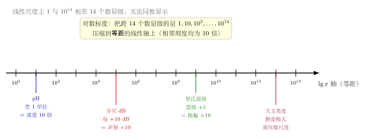

# 第6章：常用对数、自然对数与对数尺度

> 常用对数强调数量级，自然对数连接连续变化；它们是同一种对数语言的不同坐标。

## 学习目标

完成本章学习后，你将能够：

1. 区分常用对数 $\lg x$ 与自然对数 $\ln x$
2. 理解不同底数对数之间只差常数比例
3. 解释分贝、pH、震级等对数尺度的思想
4. 知道自然对数为什么在微积分中重要
5. 用对数尺度描述巨大跨度的数据

---

## 正文内容

### 6.1 常用对数：以 10 为底

常用对数记作：

$$
\lg x=\log_{10}x
$$

它非常适合描述十进制数量级：

$$
\lg 10^n=n
$$

例如：

$$
\lg 1000=3
$$

表示 1000 是 $10^3$ 这个数量级。

### 6.2 自然对数：以 $e$ 为底

自然对数记作：

$$
\ln x=\log_e x
$$

它在微积分中尤其自然，因为：

$$
\frac{d}{dx}\ln x=\frac1x
$$

并且指数函数可以统一写成：

$$
a^x=e^{x\ln a}
$$

这说明自然对数不是“另一种随便选的底数”，而是连接任意指数底数与连续变化的自然坐标。

### 6.3 不同底数只是单位不同

由换底公式：

$$
\log_a x=\frac{\ln x}{\ln a}
$$

可知同一个数的不同底数对数只差一个固定比例。就像长度可以用米、厘米或英寸表示，对数也可以用不同底数表示同一尺度信息。

所以：

- 常用对数更方便看十进制数量级
- 自然对数更方便进入导数、积分和连续增长

数学结构本身并没有变，只是坐标选择不同。

### 6.4 对数尺度的现实例子

很多现实量跨度巨大，用原始尺度很难比较，因此采用对数尺度。

| 场景 | 对数思想 | 更具体地说 |
|------|----------|------------|
| 分贝 | 声强比值取对数 | 若声强变成原来的 10 倍，分贝只增加一个固定量 |
| pH | 氢离子浓度的负常用对数 | 浓度差 10 倍，pH 只差 1 |
| 地震震级 | 振幅或能量的对数尺度 | 强度差一个数量级时，震级只增加固定单位 |
| 天文亮度 | 亮度跨度过大，需要压缩尺度 | 便于比较极亮和极暗天体 |
| 数据可视化 | 半对数图或双对数图显示增长规律 | 便于识别指数模型和幂律模型 |

对数尺度不是为了”让数变小”而已，而是为了比较倍率、数量级和相对变化。

下图直观展示这种"压缩"：原始线性尺度上 $1$ 与 $10^{14}$ 相差 14 个数量级，根本无法同框显示；而在对数标度数轴上，$1,10,10^2,\dots,10^{14}$ 被压成**等距**刻度（相邻刻度恒为 10 倍）。图中还标出了几类现实尺度的位置——pH、分贝、里氏震级、天文亮度——它们都遵循"刻度差 1 个固定量 = 原始量乘以一个固定倍率"。

### 6.5 Benford 定律：对数尺度的惊人预测

在很多真实数据集（人口、GDP、河流长度、股票价格等）中，首位数字的分布并不均匀。以1开头的数据远多于以9开头的：

$$P(\text{首位数字} = d) = \log_{10}\left(1 + \frac{1}{d}\right), \quad d = 1, 2, \ldots, 9$$

| 首位数字 $d$ | 1 | 2 | 3 | 4 | 5 | 6 | 7 | 8 | 9 |
|---|---|---|---|---|---|---|---|---|---|
| 概率 | 30.1% | 17.6% | 12.5% | 9.7% | 7.9% | 6.7% | 5.8% | 5.1% | 4.6% |

**为什么是对数**：如果数据在对数尺度上近似均匀分布，则 $\lg x$ 的小数部分均匀分布在 $[0,1)$ 上。首位数字 $d$ 对应 $\lg x$ 的小数部分落在 $[\lg d, \lg(d+1))$ 中，长度为 $\lg(1+1/d)$。

**应用**：Benford定律在财务审计中用于检测数据造假——人为编造的数字通常不服从这个分布。

### 6.6 半对数图与双对数图的预告

如果一个模型是指数型，例如：

$$
y=Ce^{kx}
$$

那么对 $y$ 取对数后，会得到关于 $x$ 的线性关系。这就是半对数图有用的原因。

如果一个模型是幂律型，例如：

$$
y=Cx^\alpha
$$

那么对两边同时取对数，会得到线性关系。这就是双对数图有用的原因。

这一点会在第10章的线性化建模中正式展开。

---

## 例题

**问题 1**：如果某个量从 $10^3$ 增加到 $10^7$，常用对数增加了多少？

**解答**：

$$
\lg 10^7-\lg 10^3=7-3=4
$$

这表示数量级增加了 4 个十倍层级，也就是整体放大了 $10^4$ 倍。

**问题 2**（pH计算）：已知溶液氢离子浓度 $[\text{H}^+] = 3.2 \times 10^{-5}$ mol/L，求pH值。若pH从5变为3，浓度变化了多少倍？

**解答**：

pH的定义：$\text{pH} = -\lg[\text{H}^+]$。

$$\text{pH} = -\lg(3.2\times10^{-5}) = -(\lg 3.2 + \lg 10^{-5}) = -(0.505 - 5) = 4.495$$

pH从5变为3，意味着 $\Delta\text{pH} = -2$，对应浓度变化 $10^2 = 100$ 倍（酸性增强100倍）。

**要点**：对数尺度中每差1个单位，原始量就差10倍；差2个单位就差100倍。

**问题 3**（分贝计算）：一台机器的声功率是 $10^{-4}$ W，参考功率为 $10^{-12}$ W。求分贝数。若两台相同机器同时运行，分贝数增加多少？

**解答**：

分贝定义：$L = 10\lg\frac{P}{P_0}$。

$$L = 10\lg\frac{10^{-4}}{10^{-12}} = 10\lg 10^8 = 80\text{ dB}$$

两台同时运行：总功率 $2P$，$L_{\text{new}} = 10\lg\frac{2P}{P_0} = L + 10\lg 2 \approx 80 + 3 = 83\text{ dB}$。

**要点**：功率翻倍只增加约3 dB，而非翻倍到160 dB——这就是对数尺度的压缩作用。

---

## 常见误区与检查清单

- 是否把 $\lg x$ 与 $\ln x$ 混淆？
- 是否以为换底会改变数学本质？
- 是否只看原始差值，而忽略倍率变化？
- 是否理解 pH、分贝等不是线性尺度？
- 是否把自然对数理解成“只是另一个记号”，而没有看到它和连续变化的联系？

---

## 本章小结

| 主题 | 结论 |
|------|------|
| 常用对数 | $\lg x=\log_{10}x$，适合十进制数量级 |
| 自然对数 | $\ln x=\log_e x$，适合连续变化和微积分 |
| 换底 | 不同底数只差常数比例 |
| 对数尺度 | 用于比较跨度巨大或按倍率变化的量 |
| 半对数/双对数 | 能把某些非线性模型转成直线 |
| 核心联系 | 常用对数重数量级，自然对数重连续结构 |

---

## 分级例题精练

> 本节精选 6 道例题，分三档难度：**基础入门 ★** / **高中核心 ★★** / **高阶拓展 ★★★**。每题含【题目】【解】【点评】，建议先自行尝试再看解。

### 例题精练 1（★ 基础入门）

**题目**：计算 $\lg 100+\lg 0.001+\ln e^4$。

**解**：

逐项化简：

$$
\lg 100=\lg 10^2=2,\quad \lg 0.001=\lg 10^{-3}=-3,\quad \ln e^4=4.
$$

故原式 $=2+(-3)+4=3$。

**点评**：常用对数 $\lg 10^n=n$、自然对数 $\ln e^n=n$ 是最基本的"识别 10 的幂、$e$ 的幂"技能。把真数写成底数的整数次幂，指数就是答案。

### 例题精练 2（★★ 高中核心）

**题目**（pH 计算）：某溶液的 pH 为 8.5，求其氢离子浓度 $[\text{H}^+]$。另一溶液 pH 为 5.5，问两溶液的氢离子浓度相差多少倍？

**解**：

由定义 $\text{pH}=-\lg[\text{H}^+]$，反解得 $[\text{H}^+]=10^{-\text{pH}}$。

对 pH $=8.5$：

$$
[\text{H}^+]=10^{-8.5}=10^{0.5}\times10^{-9}\approx3.16\times10^{-9}\ \text{mol/L}.
$$

两溶液 pH 相差 $8.5-5.5=3$，浓度之比为

$$
\frac{10^{-5.5}}{10^{-8.5}}=10^{3}=1000.
$$

即 pH 较小（pH $=5.5$）的溶液氢离子浓度是另一溶液的 **1000 倍**。

**点评**：pH 与浓度通过 $[\text{H}^+]=10^{-\text{pH}}$ 互相反演。pH 每减小 1，浓度增大 10 倍；相差 3 个单位就是 $10^3$ 倍。注意 pH 越小酸性越强、$[\text{H}^+]$ 越大。

### 例题精练 3（★★ 高中核心）

**题目**（分贝计算）：音乐会现场声强级为 110 dB，正常谈话约为 60 dB。问音乐会的声强是谈话声强的多少倍？（参考声强 $I_0=10^{-12}\ \text{W/m}^2$）

**解**：

声强级定义 $L=10\lg\dfrac{I}{I_0}$。两声音的声强级之差：

$$
L_1-L_2=10\lg\frac{I_1}{I_0}-10\lg\frac{I_2}{I_0}=10\lg\frac{I_1}{I_2}.
$$

代入 $L_1-L_2=110-60=50$：

$$
50=10\lg\frac{I_1}{I_2}\Rightarrow \lg\frac{I_1}{I_2}=5\Rightarrow \frac{I_1}{I_2}=10^5.
$$

即音乐会声强是谈话声强的 $10^5=100000$ 倍。

**点评**：比较两个声强级时不必各自算回声强，直接作差即可消去参考量 $I_0$，得到 $\Delta L=10\lg\frac{I_1}{I_2}$。声强级每差 10 dB，声强差 10 倍；差 50 dB 就是 $10^5$ 倍——对数尺度把巨大的倍率压缩成了温和的刻度差。

### 例题精练 4（★★ 高中核心）

**题目**（里氏震级）：里氏震级满足 $M=\lg\dfrac{A}{A_0}$，其中 $A$ 是地震波振幅，$A_0$ 是标准参考振幅。一次 7.0 级地震与一次 5.0 级地震相比，振幅之比是多少？已知能量与振幅近似满足 $E\propto A^{3/2}$ 的简化关系，能量之比约为多少？

**解**：

**振幅之比**：由 $M=\lg\dfrac{A}{A_0}$ 得 $\dfrac{A}{A_0}=10^{M}$，故

$$
\frac{A_7}{A_5}=\frac{10^{7.0}}{10^{5.0}}=10^{2}=100.
$$

振幅相差 100 倍。

**能量之比**：在 $E\propto A^{3/2}$ 的简化假设下，

$$
\frac{E_7}{E_5}=\left(\frac{A_7}{A_5}\right)^{3/2}=100^{3/2}=(10^2)^{3/2}=10^{3}=1000.
$$

能量约相差 1000 倍。

**点评**：震级每增加 1 级，振幅放大 10 倍。能量与振幅按幂关系联系，本题用简化模型 $E\propto A^{3/2}$，使震级差 2 对应能量比 $10^{2\times3/2}=10^3$。处理对数尺度题，核心是把"刻度差"还原成"$10$ 的幂之比"。

### 例题精练 5（★★ 高中核心）

**题目**（天文星等）：天体的视星等 $m$ 与亮度 $F$ 满足 $m_1-m_2=-2.5\lg\dfrac{F_1}{F_2}$。已知织女星视星等约为 $0$，而肉眼可见的最暗恒星约为 $6$ 等。求织女星亮度是 6 等星亮度的多少倍？

**解**：

设织女星为天体 1（$m_1=0$），6 等星为天体 2（$m_2=6$）。代入：

$$
m_1-m_2=-2.5\lg\frac{F_1}{F_2}\Rightarrow 0-6=-2.5\lg\frac{F_1}{F_2}.
$$

解得

$$
\lg\frac{F_1}{F_2}=\frac{-6}{-2.5}=2.4\Rightarrow \frac{F_1}{F_2}=10^{2.4}\approx251.
$$

即织女星亮度约为 6 等星的 **251 倍**。

**点评**：星等是"越亮数值越小"的反向对数尺度，公式里的负号正体现这一点。星等每差 5，亮度差 $10^{5/2.5}=10^2=100$ 倍；本题差 6 等，亮度比 $10^{6/2.5}=10^{2.4}\approx251$ 倍。代公式时务必分清谁是 $m_1$、谁是 $F_1$，符号不能错。

### 例题精练 6（★★★ 高阶拓展）

**题目**（跨数量级估算）：人体内某种细菌每 20 分钟分裂一次（数量翻倍）。若初始有 $1$ 个细菌，问大约经过多少小时，细菌数量会超过 $10^{12}$ 个？（取 $\lg 2\approx0.301$）

**解**：

设经过 $n$ 次分裂，数量为 $N=2^n$。要求 $2^n>10^{12}$。两边取常用对数（$\lg$ 递增，不等号方向不变）：

$$
\lg 2^n>\lg 10^{12}\Rightarrow n\lg 2>12.
$$

故

$$
n>\frac{12}{\lg 2}\approx\frac{12}{0.301}\approx39.9.
$$

取最小整数 $n=40$ 次分裂。每次 20 分钟，共

$$
40\times20=800\ \text{分钟}=\frac{800}{60}\approx13.3\ \text{小时}.
$$

约 13.3 小时后细菌数量超过 $10^{12}$。

**点评**：指数增长跨越巨大数量级时，求"何时超过某阈值"的标准手法是两边取对数把指数 $n$ 从指数位置"放下来"。这里 $n>\frac{12}{\lg 2}$，因为要求严格超过 $10^{12}$ 且 $n$ 取整数，需向上取整到 40。对数正是把 $2^{40}\approx1.1\times10^{12}$ 这种跨数量级的比较变得可计算的工具。

---

## 练习题

1. 计算 $\lg 10^6$。
2. 用换底公式写出 $\log_2 x$ 与 $\ln x$ 的关系。
3. 说明为什么 pH 适合用对数尺度。
4. 判断：自然对数只是常用对数的另一种记号。这个说法是否准确？为什么？
5. 举一个适合使用半对数图展示的数据场景。
6. 举一个适合使用双对数图展示的数据场景。
7. 用一句话说明为什么对数尺度更擅长比较“倍数变化”而不是“差值变化”。

### 练习参考答案

1. $\lg 10^6 = 6$。
2. $\log_2 x = \frac{\ln x}{\ln 2}$。
3. pH $= -\lg[\text{H}^+]$，把跨数个数量级的浓度压缩成0-14的简单标尺。
4. 不准确。$\ln x$ 和 $\lg x$ 只差常数倍（$\ln x = \lg x \cdot \ln 10$），但 $\ln$ 在微积分中有特殊地位（$(\ln x)' = 1/x$），不只是换了底数。
5. 如疫情确诊人数随时间的变化（指数增长期，半对数图变直线）。
6. 如城市人口与GDP的关系（幂律关系，双对数图变直线）。
7. $\ln a - \ln b = \ln(a/b)$：对数差直接给出倍率；普通差 $a - b$ 给出绝对增量，不反映相对变化。

---

下一部分将进入方程、不等式和建模，真正把”先条件、后变形、再解释”的流程用起来。
