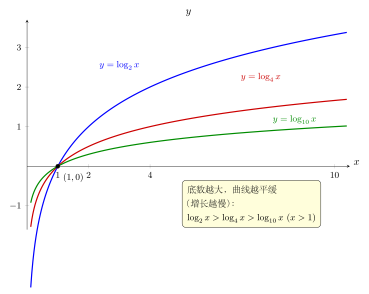

# 第7章：对数化简与结构识别

> 对数化简不是盲目套公式，而是先看定义域，再看能否把结构整理成“积、商、幂”的形式。

## 学习目标

完成本章学习后，你将能够：

1. 按条件先行的方式处理对数化简
2. 识别积、商、幂等可用运算律的结构
3. 避免把和差误化成对数形式
4. 在复杂表达式中保持合法变形
5. 提升对数表达式的整理能力

---

## 正文内容

### 7.1 化简前先写定义域

例如化简

$$
\log_2\frac{x^2-1}{x-1}
$$

时，不能先急着约分。必须先要求真数为正：

$$
\frac{x^2-1}{x-1}>0,\qquad x\neq1
$$

如果忽略这个条件，后面可能把原本不合法的值偷偷带进来。

这就是对数化简与普通代数化简最容易混淆的地方：

- 代数上“能约”
- 不等于对数里“可以直接改写后忘掉原条件”

### 7.2 常见可化简结构

对数最适合处理以下结构：

- 乘积：$\log_a(MN)$
- 商：$\log_a(M/N)$
- 幂：$\log_a(M^r)$
- 可因式分解或可提公因子的表达式

例如：

$$
\log_3(27x^2)=\log_327+2\log_3x=3+2\log_3x
$$

这里要求：

$$
x>0
$$

因为虽然 $x^2$ 对任意实数都非负，但写成 $2\log_3x$ 后，已经把表达式改写成要求 $x>0$ 的形式，所以不能不加条件地乱写。

换底公式（如本章问题 3）让不同底的对数可以互相比较。下图把 $\log_2 x$、$\log_4 x$、$\log_{10}x$ 画在同一坐标里：三条曲线都过定点 $(1,0)$，底数越大曲线越平缓，增长越慢。化简或换底时看清这一族曲线的相对位置，有助于判断结果是否合理。

### 7.3 哪些结构不能乱拆

最常见错误之一是：

$$
\log_a(M+N)\neq\log_aM+\log_aN
$$

同样地：

$$
\log_a(M-N)\neq\log_aM-\log_aN
$$

对数只会把乘法和除法转成加减法，不会把加法和减法直接拆开。

判断一个结构能不能化简，最稳的方法不是背口诀，而是回想：

> 它是否对应指数运算里的乘、除、幂？

如果不是，就要非常谨慎。

### 7.4 一个错误示范

看表达式：

$$
\log(x+2)-\log x
$$

有人会误写成：

$$
\log 2
$$

这是错的。正确做法是：

$$
\log(x+2)-\log x=\log\frac{x+2}{x}
$$

而不是

$$
\log((x+2)-x)
$$

这里再次说明：对数差对应的是**商**，不是括号里的直接相减。

### 7.5 适度化简，而不是过度化简

有时化简目标不是“拆得越碎越好”，而是“结构更清楚”。例如：

$$
\log x+\log(x+1)
$$

合并成

$$
\log(x(x+1))
$$

在解方程时常更方便；但在求导时，保持分开有时反而更清楚。化简要服务于目标，而不是机械追求某一种形式。

---

## 例题

**问题 1**：化简 $\log_2(8x)-\log_2 x$。

**解答**：

先写条件：

$$
x>0
$$

再化简：

$$
\log_2(8x)-\log_2 x=\log_2\frac{8x}{x}=\log_2 8=3
$$

**问题 2**：判断并说明下列变形是否正确：

$$
\log(x+2)-\log x=\log2
$$

**解答**：

不正确。

因为对数差应当合并成商：

$$
\log(x+2)-\log x=\log\frac{x+2}{x}
$$

而不是把真数直接相减。只有当

$$
\frac{x+2}{x}=2
$$

时它才恰好等于 $\log2$，但这不是恒等变形。

**问题 3**（多步化简 + 换底）：化简 $\frac{\log_4 9}{\log_4 3}$。

**解答**：

由换底公式的推论：$\frac{\log_a M}{\log_a N} = \log_N M$。

$$\frac{\log_4 9}{\log_4 3} = \log_3 9 = 2$$

也可以直接展开：$\log_4 9 = \frac{\ln 9}{\ln 4}$，$\log_4 3 = \frac{\ln 3}{\ln 4}$，相除得 $\frac{\ln 9}{\ln 3} = \frac{2\ln 3}{\ln 3} = 2$。

**要点**：对数的商在本质上是一次换底操作。看到 $\frac{\log_a M}{\log_a N}$ 时应优先识别为 $\log_N M$。

---

## 常见误区与检查清单

- 是否跳过定义域检查？
- 是否把和差误拆成对数和差？
- 是否在 $x\le0$ 时仍继续写 $\log x$？
- 是否把”形式更复杂”误认为”更高级”？
- 是否看到对数之商时想到换底？
- 是否在改写后忘记新形式仍要与原条件一致？

---

## 本章小结

| 主题 | 结论 |
|------|------|
| 第一步 | 先检查底数与真数条件 |
| 适合化简的结构 | 积、商、幂 |
| 不可直接化简 | 和、差 |
| 错误高发点 | 约分后忘条件、把和差硬拆 |
| 化简目标 | 让结构更清楚、更适合后续运算 |
| 核心习惯 | 任何对数化简都要带着定义域意识 |

---

## 分级例题精练

> 本节精选 6 道例题，分三档难度：**基础入门 ★** / **高中核心 ★★** / **高阶拓展 ★★★**。每题含【题目】【解】【点评】，建议先自行尝试再看解。

### 例题精练 1（★ 基础入门）

**题目**：化简 $\log_2(4x^3)$，并写出定义域条件（$x>0$）。

**解**：

先定条件。要把 $4x^3$ 作为真数，且后续要写成 $3\log_2 x$ 的形式，需 $x>0$。

按积与幂的运算律：

$$
\log_2(4x^3)=\log_2 4+\log_2 x^3=2+3\log_2 x
$$

**点评**：积化为和、幂化为系数，是最基本的两步。注意写成 $3\log_2 x$ 后已隐含 $x>0$，必须把条件一并写出，这与正文 7.1“化简前先写定义域”一致。

### 例题精练 2（★★ 高中核心）

**题目**：化简 $\log_3 18-\log_3 2+\log_3\dfrac{1}{3}$。

**解**：

三项均为常数对数，先用商与积合并：

$$
\log_3 18-\log_3 2=\log_3\frac{18}{2}=\log_3 9=2
$$

再处理第三项：

$$
\log_3\frac{1}{3}=\log_3 3^{-1}=-1
$$

故原式

$$
=2+(-1)=1
$$

**点评**：差对应商、$\dfrac13$ 写成 $3^{-1}$ 后幂指数下放。这里真数全为正常数，无需定义域讨论，但合并顺序要清楚：先把能凑成整数的项合并最省力。

### 例题精练 3（★★ 高中核心）

**题目**：化简 $\log_a x^2$（$a>0,a\neq1$），并讨论是否等于 $2\log_a x$。

**解**：

$x^2$ 的真数条件只要求 $x\neq0$，即 $x>0$ 或 $x<0$ 都可。

- 当 $x>0$ 时，$|x|=x$，故 $\log_a x^2=2\log_a x$。
- 当 $x<0$ 时，$\log_a x$ 本身无意义，但 $\log_a x^2$ 有意义。此时应写

$$
\log_a x^2=2\log_a|x|
$$

综合两种情形，通用且恒成立的写法是

$$
\log_a x^2=2\log_a|x|\qquad(x\neq0)
$$

**点评**：这是化简里最经典的“定义域陷阱”。直接写 $2\log_a x$ 会丢掉负半轴的合法取值。正文绝对值统一记作 $|x|$。把幂指数下放前，务必检查底数变量是否可能为负。

### 例题精练 4（★★ 高中核心）

**题目**：已知 $\lg 2\approx0.301$，化简并求 $\lg 5$ 与 $\lg 50$ 的近似值。

**解**：

利用 $5=\dfrac{10}{2}$：

$$
\lg 5=\lg\frac{10}{2}=\lg 10-\lg 2=1-0.301=0.699
$$

再利用 $50=\dfrac{100}{2}$：

$$
\lg 50=\lg\frac{100}{2}=\lg 100-\lg 2=2-0.301=1.699
$$

**点评**：常用对数 $\lg$ 的化简核心是把真数拆成 $10$ 的幂与 $2$、$5$ 的组合。$\lg 10=1$、$\lg 100=2$ 是“锚点”，配合 $\lg 2+\lg 5=1$ 可快速换算，这一技巧在后面求位数、首位时反复用到。

### 例题精练 5（★★ 高中核心）

**题目**：化简 $\dfrac{\log_2 3\cdot\log_3 5}{\log_2 5}$。

**解**：

把每个对数换成自然对数（或同一底），$\log_2 3=\dfrac{\ln3}{\ln2}$，$\log_3 5=\dfrac{\ln5}{\ln3}$，$\log_2 5=\dfrac{\ln5}{\ln2}$。

分子

$$
\log_2 3\cdot\log_3 5=\frac{\ln3}{\ln2}\cdot\frac{\ln5}{\ln3}=\frac{\ln5}{\ln2}
$$

故

$$
\frac{\log_2 3\cdot\log_3 5}{\log_2 5}=\frac{\ln5/\ln2}{\ln5/\ln2}=1
$$

**点评**：链式相乘 $\log_2 3\cdot\log_3 5=\log_2 5$ 是换底公式的“连锁约分”形式。看到不同底对数相乘，优先尝试统一换底后约分，往往整段消成简单结果。

### 例题精练 6（★★★ 高阶拓展）

**题目**：化简 $\log_a\dfrac{x^2-4}{x+2}$（$a>0,a\neq1$），写出定义域并给出最简结果。

**解**：

**第 1 步：先定真数条件**，不能急着约分。要求

$$
\frac{x^2-4}{x+2}>0
$$

注意 $x+2=0$ 即 $x=-2$ 必须排除（分母不为零，且 $x=-2$ 时真数无定义）。在 $x\neq-2$ 时

$$
\frac{x^2-4}{x+2}=\frac{(x-2)(x+2)}{x+2}=x-2
$$

于是真数条件化为 $x-2>0$ 且 $x\neq-2$，即

$$
x>2
$$

（$x=-2$ 已不在 $x>2$ 内，自动满足。）

**第 2 步：化简**。在 $x>2$ 的前提下

$$
\log_a\frac{x^2-4}{x+2}=\log_a(x-2)
$$

**最简结果**：$\log_a(x-2)$，定义域 $x>2$。

**点评**：约分 $\dfrac{(x-2)(x+2)}{x+2}=x-2$ 在代数上成立，但 $x=-2$ 处原式无定义而约分后有定义，必须靠定义域把这个“偷带进来”的值挡在外面。这正是正文 7.1 强调的：约分后绝不能忘条件。

---

## 练习题

1. 化简 $\log_5(25x)$，并写出条件。
2. 化简 $\log_3 9+\log_3 x$，并写出条件。
3. 判断 $\log(x+2)-\log x$ 能否化为 $\log2$，并说明理由。
4. 说明为什么化简 $\log(x^2)$ 时要格外小心。
5. 化简前，写出 $\log\frac{x-1}{x+2}$ 的定义域条件。
6. 判断 $\log_a(M-N)$ 是否存在通用拆法，并说明原因。
7. 解释为什么对数化简里“先条件、后整理”比普通代数里更重要。

### 练习参考答案

1. $\log_5(25x) = \log_5 25 + \log_5 x = 2 + \log_5 x$，条件 $x > 0$。
2. $\log_3 9 + \log_3 x = 2 + \log_3 x$，条件 $x > 0$。
3. 不能。$\log(x+2)-\log x = \log\frac{x+2}{x}$，只有当 $\frac{x+2}{x} = 2$（即 $x=2$）时才等于 $\log 2$，这不是恒等变形。
4. $\log(x^2)=2\log|x|$（不是 $2\log x$）。当 $x<0$ 时 $\log x$ 无定义但 $\log(x^2)$ 有定义。
5. $x-1>0$ 且 $x+2>0$，即 $x>1$。
6. 不存在。$\log_a(M-N)$ 不能拆成 $\log_a M - \log_a N$——减法不对应除法。
7. 对数的化简可能改变定义域（如把 $\log(x^2)$ 改成 $2\log x$ 丢失了负半轴），所以必须先保证变形合法。

---

下一章将把这些结构识别能力推进到方程求解中，形成”同底转化—取对数—代换—验根”的标准流程。
