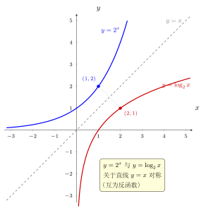

# 第8章：指数方程与对数方程

> 对数最重要的解题功能之一，是把指数位置上的未知数拉回到可计算的代数形式。

## 学习目标

完成本章学习后，你将能够：

1. 用同底转化或取对数解决指数方程
2. 处理基本对数方程
3. 理解验根在对数方程中的必要性
4. 使用代换识别复合结构
5. 区分“形式可解”和“定义域合法”

---

## 正文内容

### 8.1 一个稳定的解题流程

处理指数方程与对数方程时，可以优先按下面顺序思考：

1. 能否同底转化
2. 若不能，是否适合两边取对数
3. 是否存在可代换的复合结构
4. 解出代数结果后，是否需要验根或验范围

这个流程比“看到题马上套公式”更稳定，因为它先判断结构，再选择方法。

### 8.2 同底转化

若方程能化为同一底数，最直接。例如：

$$
2^{x+1}=8=2^3
$$

于是：

$$
x+1=3,\qquad x=2
$$

这类题的关键是先识别右边能否写成同底数幂。

### 8.3 两边取对数

若无法直接同底，可取对数。例如：

$$
3^x=10
$$

两边取自然对数：

$$
x\ln3=\ln10
$$

所以：

$$
x=\frac{\ln10}{\ln3}=\log_3 10
$$

这里“两边取对数”不是魔法，而是在把指数位置上的未知数放到乘法位置上，方便解出。

为什么取对数能“解开”指数？因为指数函数与对数函数互为反函数。下图把 $y=2^{x}$ 与 $y=\log_2 x$ 画在一起：二者关于直线 $y=x$ 对称，$2^x$ 上的点 $(1,2)$ 镜像到 $\log_2 x$ 上就是 $(2,1)$。解 $2^x=b$ 时取 $\log_2$，正是用这条对称关系把指数位置的未知数还原出来。

### 8.4 基本对数方程

例如：

$$
\log_2(x-1)=3
$$

按定义改写：

$$
x-1=2^3=8
$$

得到：

$$
x=9
$$

并检查条件：

$$
x-1>0
$$

成立。

### 8.5 代换与因式分解

有些题不适合直接硬算，而适合先代换。

例如若设

$$
t=\log_2 x
$$

那么像

$$
(\log_2 x)^2-3\log_2 x+2=0
$$

就会变成普通二次方程：

$$
t^2-3t+2=0
$$

解出 $t$ 后，再回到 $x$。

### 8.6 验根为什么重要

看方程：

$$
\log(x-1)+\log(x-3)=\log4
$$

先写条件：

$$
x-1>0,\qquad x-3>0
$$

即

$$
x>3
$$

再合并得：

$$
\log((x-1)(x-3))=\log4
$$

于是：

$$
(x-1)(x-3)=4
$$

即：

$$
x^2-4x-1=0
$$

解得：

$$
x=2\pm\sqrt5
$$

但只有

$$
2+\sqrt5>3
$$

满足原条件，而

$$
2-\sqrt5<3
$$

不满足。

这说明：代数上解得出的根，不一定是对数方程的合法解。

---

## 例题

**问题 1**：解方程 $\log_3 x+\log_3(x-2)=2$。

**解答**：

先写条件：

$$
x>0,\qquad x-2>0
$$

即 $x>2$。

合并：

$$
\log_3(x(x-2))=2
$$

所以：

$$
x(x-2)=3^2=9
$$

即：

$$
x^2-2x-9=0
$$

解得：

$$
x=1\pm\sqrt{10}
$$

只有

$$
x=1+\sqrt{10}
$$

满足 $x>2$。

**问题 2**：解方程 $2^x=7$。

**解答**：

不能直接同底，于是两边取对数：

$$
x\ln2=\ln7
$$

所以：

$$
x=\frac{\ln7}{\ln2}=\log_2 7
$$

**问题 3**（换元型）：解方程 $(\log_2 x)^2 - 3\log_2 x + 2 = 0$。

**解答**：

定义域：$x > 0$。

令 $t = \log_2 x$，方程变为：

$$t^2 - 3t + 2 = 0 \implies (t-1)(t-2) = 0$$

$t = 1$：$\log_2 x = 1$，$x = 2$。

$t = 2$：$\log_2 x = 2$，$x = 4$。

验证：两个都满足 $x > 0$，故 $x = 2$ 或 $x = 4$。

**要点**：看到 $(\log x)^2$ 或 $\log x$ 的二次结构时，换元 $t = \log x$ 是标准策略。

**问题 4**（增根陷阱）：解方程 $\log_2(x+3) + \log_2(x-1) = 3$。

**解答**：

定义域：$x+3 > 0$ 且 $x-1 > 0$，即 $x > 1$。

合并：$\log_2((x+3)(x-1)) = 3$，即 $(x+3)(x-1) = 8$。

展开：$x^2 + 2x - 3 = 8$，$x^2 + 2x - 11 = 0$。

$$x = \frac{-2 \pm \sqrt{4+44}}{2} = -1 \pm 2\sqrt{3}$$

$x_1 = -1 + 2\sqrt{3} \approx 2.46 > 1$ ✓

$x_2 = -1 - 2\sqrt{3} \approx -4.46 < 1$ ✗（不满足定义域，**增根**）

答案：$x = -1 + 2\sqrt{3}$。

**问题 5**（含参指数方程）：求 $4^x - 3 \cdot 2^x + 2 = 0$ 的所有解。

**解答**：

注意 $4^x = (2^x)^2$，令 $t = 2^x > 0$：

$$t^2 - 3t + 2 = 0 \implies (t-1)(t-2) = 0$$

$t = 1$：$2^x = 1$，$x = 0$。

$t = 2$：$2^x = 2$，$x = 1$。

答案：$x = 0$ 或 $x = 1$。注意 $t > 0$ 自动满足，无需额外筛选。

---

## 常见误区与检查清单

- 是否忘记先写定义域？
- 是否把取对数理解成”自动消掉指数”而不写中间步骤？
- 是否忘记对数方程要验根？
- 是否忽略复合结构中的代换可能性？
- 是否把”代数有解”误当成”原方程有解”？
- 是否在看到 $(\log x)^2$ 时想到换元？

---

## 本章小结

| 题型 | 常用方法 |
|------|----------|
| 指数方程 | 同底转化、两边取对数 |
| 对数方程 | 改写成指数式、合并化简 |
| 复杂结构 | 代换、因式分解 |
| 最后检查 | 验根、验定义域、验范围 |
| 核心原则 | 代数正确不等于对数合法 |

---

## 分级例题精练

> 本节精选 6 道例题，分三档难度：**基础入门 ★** / **高中核心 ★★** / **高阶拓展 ★★★**。每题含【题目】【解】【点评】，建议先自行尝试再看解。

### 例题精练 1（★ 基础入门）

**题目**：解方程 $\log_2 x=3$。

**解**：

按对数定义改写成指数式：

$$
x=2^3=8
$$

检验真数：$x=8>0$，合法。故 $x=8$。

**点评**：最简对数方程的标准动作是“按定义改写为指数式”。即使一步就得解，也要养成回头检验真数 $>0$ 的习惯。

### 例题精练 2（★★ 高中核心）

**题目**：解方程 $3^{2x-1}=5$。

**解**：

右边 $5$ 不是 $3$ 的整数次幂，无法同底，故两边取自然对数：

$$
(2x-1)\ln3=\ln5
$$

解出指数位置的未知数：

$$
2x-1=\frac{\ln5}{\ln3}=\log_3 5
$$

故

$$
x=\frac{1+\log_3 5}{2}
$$

**点评**：取对数的作用是把指数位置上的 $2x-1$ 拉到乘法位置。注意整个指数 $2x-1$ 作为整体处理，不要只对 $x$ 取对数。

### 例题精练 3（★★ 高中核心）

**题目**：解方程 $\lg^2 x-\lg x-2=0$（其中 $\lg^2 x$ 表示 $(\lg x)^2$）。

**解**：

定义域：$x>0$。

令 $t=\lg x$，方程化为二次：

$$
t^2-t-2=0\implies(t-2)(t+1)=0
$$

得 $t=2$ 或 $t=-1$。

- $t=2$：$\lg x=2$，$x=10^2=100$。
- $t=-1$：$\lg x=-1$，$x=10^{-1}=\dfrac{1}{10}$。

两者都满足 $x>0$，故 $x=100$ 或 $x=\dfrac{1}{10}$。

**点评**：见到 $\lg x$ 的二次结构就换元化为普通二次方程，这是正文 8.5 的标准策略。换元后两个根都要回代求 $x$，并检验定义域。

### 例题精练 4（★★ 高中核心）

**题目**：解方程 $\log_3(x-2)+\log_3(x-4)=1$。

**解**：

**定义域**：$x-2>0$ 且 $x-4>0$，即 $x>4$。

合并左边：

$$
\log_3[(x-2)(x-4)]=1\implies(x-2)(x-4)=3
$$

展开：

$$
x^2-6x+8=3\implies x^2-6x+5=0\implies(x-1)(x-5)=0
$$

得 $x=1$ 或 $x=5$。

检验定义域 $x>4$：$x=5$ 合法；$x=1$ 不满足，是**增根**，舍去。

故 $x=5$。

**点评**：合并对数前先把定义域写死，合并后解出的根逐一回代。$x=1$ 让 $\log_3(x-2)$、$\log_3(x-4)$ 真数为负，是典型增根，必须剔除。

### 例题精练 5（★★ 高中核心）

**题目**：解方程 $2^{x+1}+2^{x}=12$。

**解**：

提取公因式 $2^x$：

$$
2^x(2+1)=12\implies 3\cdot2^x=12\implies 2^x=4
$$

于是 $2^x=2^2$，得 $x=2$。

**点评**：含同底指数的和，常可先提公因式把它化为最简指数方程。$2^{x+1}=2\cdot2^x$ 的拆分是关键一步，避免盲目取对数。

### 例题精练 6（★★★ 高阶拓展）

**题目**：求方程 $\lg(x-1)+\lg(x+2)=\lg(3x)$ 的所有实数解，并严格剔除增根。

**解**：

**第 1 步：定义域**。需同时满足

$$
x-1>0,\quad x+2>0,\quad 3x>0
$$

即 $x>1$（最强的约束）。

**第 2 步：合并求解**。左边合并：

$$
\lg[(x-1)(x+2)]=\lg(3x)
$$

两边真数相等（$\lg$ 为一一对应）：

$$
(x-1)(x+2)=3x
$$

展开：

$$
x^2+x-2=3x\implies x^2-2x-2=0
$$

解得

$$
x=\frac{2\pm\sqrt{4+8}}{2}=1\pm\sqrt3
$$

**第 3 步：验根**。$x=1+\sqrt3\approx2.73>1$，合法；$x=1-\sqrt3\approx-0.73$，不满足 $x>1$，是增根，舍去。

故唯一解为

$$
x=1+\sqrt3
$$

**点评**：本题三处真数条件取交集得 $x>1$。由 $\lg A=\lg B$ 推 $A=B$ 是合法的（对数单调），但反推出的代数方程会引入增根，必须用定义域逐根检验。这正是正文 8.6 的核心：代数正确不等于对数合法。

---

## 练习题

1. 解方程 $2^x=7$。
2. 解方程 $\log_2(x+3)=4$。
3. 解方程 $\log_5x+\log_5(x-4)=2$。
4. 说明为什么对数方程必须验根。
5. 将方程 $7^x=20$ 的解写成对数形式。
6. 设 $t=\log_3 x$，把 $(\log_3 x)^2-4\log_3 x+3=0$ 化为关于 $t$ 的方程。
7. 举例说明“代数有根但对数无解”是什么意思。

### 练习参考答案

1. $x = \log_2 7 = \frac{\ln 7}{\ln 2} \approx 2.807$。
2. $x+3 = 2^4 = 16$，$x = 13$。
3. 定义域 $x>4$。$\log_5(x(x-4))=2$，$x^2-4x=25$，$x=2+\sqrt{29}$（另一根 $2-\sqrt{29}<0$ 舍去）。
4. 合并或变形可能引入不满足真数条件的"解"。例如 $\log x + \log(x-2) = \log 3$ 合并后 $x(x-2)=3$，$x=3$ 或 $x=-1$，但 $x=-1$ 不满足 $x>0$ 和 $x-2>0$。
5. $x = \log_7 20 = \frac{\ln 20}{\ln 7}$。
6. $t^2-4t+3=0$，$(t-1)(t-3)=0$，$t=1$ 或 $t=3$，回代得 $x=3$ 或 $x=27$。
7. 如第3题中，$x^2-4x-25=0$ 有两个实根，但负根使真数 $x$ 和 $x-4$ 不全为正。

---

下一章将把求解思路推进到不等式与参数题，重点处理底数分情况、单调性和定义域的联立分析。
