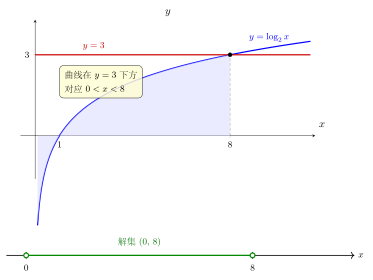

# 第9章：对数不等式与参数分析

> 对数不等式的关键不在“移项”，而在底数决定的单调方向，以及真数条件不能丢。

## 学习目标

完成本章学习后，你将能够：

1. 处理基本对数不等式
2. 区分 $a>1$ 与 $0<a<1$ 时不等号方向的变化
3. 在参数题中同时管理定义域与单调性
4. 理解底数和真数条件对答案的影响
5. 用图像和单调性辅助判断范围

---

## 正文内容

### 9.1 一个参数题模板

对数不等式和参数题最稳定的流程是：

1. 先写真数条件
2. 再看底数范围：是 $a>1$ 还是 $0<a<1$
3. 根据单调性比较真数
4. 最后把结果与定义域联立

很多错误不是算错，而是漏掉了其中某一步。

### 9.2 底数大于 1 的情形

若 $a>1$，则 $\log_a x$ 递增。因此：

$$
\log_a M>\log_a N \iff M>N
$$

前提是：

$$
M>0,\qquad N>0
$$

这时比较对数大小，就等于比较真数大小，不等号方向保持不变。

### 9.3 底数在 0 与 1 之间的情形

若 $0<a<1$，则 $\log_a x$ 递减。因此：

$$
\log_a M>\log_a N \iff M<N
$$

这里最容易出错：比较真数时，不等号方向要反转。

所以对数不等式不是只看“对数”两个字，而是先看底数把函数变成递增还是递减。

### 9.4 带参数的问题

例如要求不等式

$$
\log_a(x-1)>2
$$

的解集，需要分两步：

1. 先写定义域：$x-1>0$
2. 再根据 $a$ 的范围讨论单调性

若 $a>1$，则：

$$
x-1>a^2
$$

即：

$$
x>1+a^2
$$

若 $0<a<1$，则：

$$
x-1<a^2
$$

即：

$$
x<1+a^2
$$

但两种情况都要与 $x>1$ 联立。

### 9.5 图像法与代数法的对照

把不等式

$$
\log_a x>c
$$

看作函数 $y=\log_a x$ 与水平线 $y=c$ 的位置关系，会比死记规则更稳定。

- 代数法强调：递增还是递减、真数如何比较
- 图像法强调：交点在哪、哪一侧满足条件

两种方法本质一致，只是观察角度不同。参数题里，图像法尤其适合帮助你判断分类是否合理。

下图以 $\log_2 x<3$ 为例演示这套“图像 + 数轴”读法：上半部分把 $y=\log_2 x$ 与水平线 $y=3$ 画在一起，二者交于 $(8,3)$；曲线落在水平线下方的那一段（阴影）就对应不等式成立的 $x$ 范围。再结合真数条件 $x>0$，把结果画到数轴上，就得到一个端点开的区间。底数大于 1 时不等号方向不变，因此“曲线在线下方”直接对应 $x$ 落在交点左侧（且大于 0）。

---

## 例题

**问题 1**：解不等式 $\log_2(x+1)\le3$。

**解答**：

先写定义域：

$$
x+1>0 \iff x>-1
$$

因为底数 $2>1$，函数递增，所以：

$$
x+1\le2^3=8
$$

得到：

$$
x\le7
$$

与定义域联立：

$$
-1<x\le7
$$

**问题 2**：解不等式 $\log_{1/2}(x-1)>1$。

**解答**：

先写定义域：

$$
x-1>0 \iff x>1
$$

因为底数 $\dfrac12$ 在 0 和 1 之间，函数递减，所以比较真数时方向反转：

$$
x-1<\left(\frac12\right)^1=\frac12
$$

于是：

$$
x<\frac32
$$

与定义域联立：

$$
1<x<\frac32
$$

**问题 3**（完整含参分类讨论）：解不等式 $\log_a(2x-1) > \log_a(x+2)$，其中 $a > 0, a \neq 1$。

**解答**：

**第1步：定义域**。要求 $2x-1 > 0$ 且 $x+2 > 0$，即 $x > 1/2$（后者 $x > -2$ 被前者包含）。

**第2步：分情况讨论底数**。

**情况一**：$a > 1$（递增）。不等号保持：

$$2x - 1 > x + 2 \implies x > 3$$

与定义域 $x > 1/2$ 联立：$x > 3$。

**情况二**：$0 < a < 1$（递减）。不等号反转：

$$2x - 1 < x + 2 \implies x < 3$$

与定义域 $x > 1/2$ 联立：$\frac{1}{2} < x < 3$。

**总结**：

$$\text{解集} = \begin{cases} (3, +\infty), & a > 1 \\ (\frac{1}{2}, 3), & 0 < a < 1 \end{cases}$$

**要点**：含参对数不等式的标准流程——先定义域、再按底数分类、最后联立。

---

## 常见误区与检查清单

- 是否忘记底数小于 1 时要反向？
- 是否只解出代数范围而忘记定义域？
- 是否在参数题中漏掉分情况讨论？
- 含参题是否把 $a > 1$ 和 $0 < a < 1$ 两种情况都考虑了？
- 是否把不等式机械化处理，而不看函数图像？
- 是否只看真数比较，却没有先确认真数本身为正？

---

## 本章小结

| 情形 | 结论 |
|------|------|
| $a>1$ | $\log_a x$ 递增，不等号方向保持 |
| $0<a<1$ | $\log_a x$ 递减，不等号方向反转 |
| 真数条件 | 必须始终满足 $x>0$ 或相应复合条件 |
| 参数题 | 常需分底数范围与定义域讨论 |
| 最稳方法 | 真数条件 + 单调性 + 联立范围 |
| 图像作用 | 帮助判断分类和区间方向 |

---

## 分级例题精练

> 本节精选 6 道例题，分三档难度：**基础入门 ★** / **高中核心 ★★** / **高阶拓展 ★★★**。每题含【题目】【解】【点评】，建议先自行尝试再看解。

### 例题精练 1（★ 基础入门）

**题目**：解不等式 $\log_2 x<3$。

**解**：

**定义域**：$x>0$。

底数 $2>1$，函数递增，不等号方向保持：

$$
x<2^3=8
$$

与定义域联立：

$$
0<x<8
$$

**点评**：最基本的对数不等式。即使底数大于 1 不需反向，也别忘了先写真数 $x>0$，否则会漏掉左端边界。

### 例题精练 2（★★ 高中核心）

**题目**：解不等式 $\log_{1/3}(2x-1)\ge-1$。

**解**：

**定义域**：$2x-1>0$，即 $x>\dfrac12$。

底数 $\dfrac13\in(0,1)$，函数递减，不等号方向反转：

$$
2x-1\le\left(\frac13\right)^{-1}=3
$$

解得 $2x\le4$，即 $x\le2$。

与定义域联立：

$$
\frac12<x\le2
$$

**点评**：底数小于 1 是最易出错处——比较真数时不等号必须反转，且 $\left(\frac13\right)^{-1}=3$。最后务必与 $x>\frac12$ 取交集。

### 例题精练 3（★★ 高中核心）

**题目**：解不等式 $\log_2(x-1)+\log_2(x+1)<3$。

**解**：

**定义域**：$x-1>0$ 且 $x+1>0$，即 $x>1$。

合并左边（底数 $2>1$）：

$$
\log_2[(x-1)(x+1)]<3\implies(x-1)(x+1)<2^3=8
$$

即

$$
x^2-1<8\implies x^2<9\implies -3<x<3
$$

与定义域 $x>1$ 联立：

$$
1<x<3
$$

**点评**：先合并再用单调性去对数，得到 $x^2<9$。代数解为 $(-3,3)$，但定义域 $x>1$ 砍掉了左半段。合并对数与定义域必须同时管理。

### 例题精练 4（★★ 高中核心）

**题目**：解不等式 $\log_3(x^2-x)\le\log_3(2x+4)$。

**解**：

**定义域**：两真数均为正，$x^2-x>0$ 且 $2x+4>0$。
$x^2-x>0\Rightarrow x<0$ 或 $x>1$；$2x+4>0\Rightarrow x>-2$。
取交集：$-2<x<0$ 或 $x>1$。

底数 $3>1$ 递增，不等号保持：

$$
x^2-x\le2x+4\implies x^2-3x-4\le0\implies(x-4)(x+1)\le0
$$

即 $-1\le x\le4$。

与定义域取交集：

- 与 $-2<x<0$ 交得 $-1\le x<0$；
- 与 $x>1$ 交得 $1<x\le4$。

**解集**：$[-1,0)\cup(1,4]$。

**点评**：真数为二次表达式时，定义域本身就是不等式，需单独解出再与去对数后的结果取交集。本题定义域是两段并集，最易漏掉其中一段。

### 例题精练 5（★★ 高中核心）

**题目**：已知 $\log_a 3<\log_a 5$，求底数 $a$ 的取值范围（$a>0,a\neq1$）。

**解**：

真数 $3,5$ 均为正常数，无需额外定义域。比较 $\log_a 3$ 与 $\log_a 5$：

- 若 $a>1$，函数递增，由 $3<5$ 得 $\log_a 3<\log_a 5$，与条件相符。
- 若 $0<a<1$，函数递减，由 $3<5$ 得 $\log_a 3>\log_a 5$，与条件矛盾。

故

$$
a>1
$$

**点评**：这是“反过来由不等关系定底数”的题型。关键是把已知不等号方向与底数决定的单调方向对照，从而锁定 $a$ 的范围。

### 例题精练 6（★★★ 高阶拓展）

**题目**：已知不等式 $\log_a(x+1)>\log_a(3-x)$ 的解集为 $(1,3)$，求底数 $a$（$a>0,a\neq1$）。

**解**：

**第 1 步：定义域**。$x+1>0$ 且 $3-x>0$，即 $-1<x<3$。

**第 2 步：按底数分类，比较所得解集**。

**情况一**：$a>1$（递增），不等号保持：

$$
x+1>3-x\implies 2x>2\implies x>1
$$

与定义域 $-1<x<3$ 联立得解集 $(1,3)$。

**情况二**：$0<a<1$（递减），不等号反转：

$$
x+1<3-x\implies x<1
$$

与定义域联立得解集 $(-1,1)$。

**第 3 步：对照题给解集**。题目要求解集恰为 $(1,3)$，与情况一吻合，与情况二不符。

故

$$
a>1
$$

**点评**：这是含参不等式的“逆问题”——已知解集反推底数。必须把两种底数情形都解出来，得到两个不同解集，再与题给 $(1,3)$ 比对。只有 $a>1$ 给出 $(1,3)$，从而确定底数范围。正文反复强调的“两种情况都考虑”在此是解题命脉。

---

## 练习题

1. 解不等式 $\log_3 x>2$。
2. 解不等式 $\log_{1/2}x<1$。
3. 解不等式 $\log_2(x-4)\ge0$。
4. 说明为什么 $\log_{1/3}(x+1)>2$ 时要反向比较真数。
5. 设 $a>0,a\neq1$，讨论 $\log_a x>0$ 的解集与 $a$ 的关系。
6. 用图像法解释为什么 $\log_2 x>1$ 的解是 $x>2$。
7. 说明参数题里为什么“真数条件”和“底数分类”缺一不可。

### 练习参考答案

1. $\log_3 x > 2$，底数3>1递增，$x > 3^2 = 9$，定义域 $x>0$ 包含。答：$x > 9$。
2. $\log_{1/2}x < 1$，底数 $0<1/2<1$ 递减，$x > (1/2)^1 = 1/2$。与 $x>0$ 联立：$x > 1/2$。
3. $\log_2(x-4) \geq 0$，底数2>1，$x-4 \geq 2^0 = 1$，$x \geq 5$。与 $x>4$ 联立：$x \geq 5$。
4. 底数 $1/3 < 1$，函数递减，$\log_{1/3}(x+1) > 2$ 变成 $x+1 < (1/3)^2 = 1/9$，不等号反转。
5. $a>1$时：$\log_a x > 0 \iff x > 1$。$0<a<1$时：$\log_a x > 0 \iff x < 1$（再与 $x>0$ 联立得 $0<x<1$）。
6. $\log_2 x = 1$ 对应 $x=2$；$\log_2$ 递增，图像在 $y=1$ 上方的部分对应 $x>2$。
7. 真数条件决定"哪些 $x$ 合法"；底数分类决定"比较时方向是否反转"。二者缺一就可能漏解或得到增根。

---

下一章将把这种分析进一步用于建模，说明为什么对数坐标能把指数关系和幂律关系转成更容易读取参数的直线结构。
