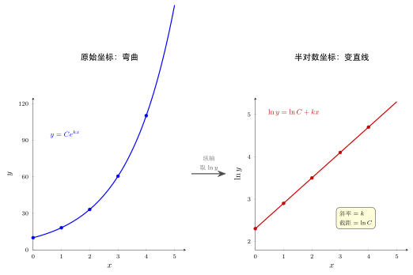

# 第10章：对数建模与线性化

> 对数不仅用于解题，还能把乘法规律、指数规律和幂律规律转换成更容易分析的线性关系。

## 学习目标

完成本章学习后，你将能够：

1. 理解对数在线性化中的作用
2. 区分半对数图与双对数图
3. 用对数分析指数模型和幂律模型
4. 解释倍增时间、半衰期与线性拟合的关系
5. 建立“对数是建模工具”的视角

---

## 正文内容

### 10.1 指数模型为什么适合取对数

设指数模型为：

$$
y=Ce^{kx}
$$

两边取自然对数：

$$
\ln y=\ln C+kx
$$

这说明如果原模型是指数型，那么在 $(x,\ln y)$ 坐标下会变成一条直线。斜率是 $k$，截距是 $\ln C$。

这里的关键不是“把数变小”，而是：

> 对数把乘法型增长结构改写成了加法型的直线结构。

下图直观展示了这一“线性化”：左边在普通坐标 $(x,y)$ 下，指数模型 $y=Ce^{kx}$ 是一条向上弯曲的曲线；把纵轴换成 $\ln y$（即半对数坐标）后，同一组数据被“拉直”成右边的直线，斜率恰为 $k$、截距恰为 $\ln C$。判断数据是否服从指数律，只需看它在半对数坐标里是否接近直线。

### 10.2 从直线参数读回原模型

如果在线性化后得到：

$$
\ln y=\alpha+\beta x
$$

那么原模型就是：

$$
y=e^\alpha e^{\beta x}
$$

也就是：

$$
y=Ce^{kx}

$$

其中：

$$
C=e^\alpha,\qquad k=\beta
$$

所以：

- 斜率读回的是增长率或衰减率
- 截距读回的是初始规模的对数，再指数还原得到原始参数

### 10.3 幂律模型的双对数线性化

若

$$
y=Cx^\alpha
$$

两边取对数：

$$
\ln y=\ln C+\alpha\ln x
$$

因此在 $(\ln x,\ln y)$ 坐标下也是直线。这个思想广泛用于经验建模、数据分析和复杂系统研究。

此时：

- 斜率是 $\alpha$
- 截距是 $\ln C$

所以双对数图最适合识别幂律关系。

### 10.4 半对数图与双对数图

| 图类型 | 横轴 | 纵轴 | 适合识别 |
|--------|------|------|----------|
| 半对数图 | 线性 | 对数 | 指数增长 / 衰减 |
| 双对数图 | 对数 | 对数 | 幂律关系 |

如果数据在半对数图上接近直线，往往意味着原关系接近指数型；如果在双对数图上接近直线，往往意味着原关系接近幂律型。

### 10.5 倍增时间与半衰期

若模型为：

$$
y=Ce^{kx}
$$

当 $k>0$ 时，倍增时间 $T$ 满足：

$$
e^{kT}=2
$$

所以：

$$
T=\frac{\ln2}{k}
$$

当 $k<0$ 时，半衰期 $T_{1/2}$ 满足：

$$
e^{kT_{1/2}}=\frac12
$$

所以：

$$
T_{1/2}=\frac{\ln(1/2)}{k}=-\frac{\ln2}{k}
$$

这说明对数不仅能把模型线性化，还能直接把“达到某个倍数所需时间”写出来。

### 10.6 只能对正数据取对数

无论是建模还是画图，只要要取对数，就必须保证数据为正。

因此：

- 半对数图要求取对数的那个轴对应的数据为正
- 双对数图要求两个轴的数据都为正

这也是为什么某些数据虽然看起来像增长模型，却不能直接拿去做对数线性化。

---

## 例题

**问题 1**：已知细菌数量满足 $N(t)=100e^{0.3t}$，如何在线性坐标中估计增长率？

**思路**：

取自然对数：

$$
\ln N(t)=\ln100+0.3t
$$

因此把 $\ln N$ 对 $t$ 作图，若接近直线，则斜率约为 0.3，这个斜率就是增长率。

**问题 2**：若线性化后得到直线

$$
\ln y=1.2+0.5x
$$

写回原模型。

**解答**：

由截距和斜率可知：

$$
y=e^{1.2}e^{0.5x}
$$

即：

$$
y=Ce^{0.5x},\qquad C=e^{1.2}
$$

**问题 3**（从数据拟合模型）：某放射性物质的剩余量测量如下：

| $t$（年） | 0 | 10 | 20 | 30 | 40 |
|-----------|---|----|----|----|----|
| $N$（克） | 100 | 82 | 67 | 55 | 45 |

判断是否为指数衰减模型，并估计参数。

**解答**：

**第1步**：取自然对数。

| $t$ | 0 | 10 | 20 | 30 | 40 |
|-----|---|----|----|----|----|
| $\ln N$ | 4.605 | 4.407 | 4.205 | 4.007 | 3.807 |

**第2步**：观察 $\ln N$ 对 $t$ 是否近似线性。$\ln N$ 每隔10年大约减少 0.2，非常均匀——确认指数衰减模型合理。

**第3步**：读参数。斜率 $k \approx -0.2/10 = -0.02$（年$^{-1}$），截距 $\ln C \approx 4.605$，故 $C \approx 100$。

**模型**：$N(t) \approx 100e^{-0.02t}$。

**半衰期**：$T_{1/2} = \frac{\ln 2}{0.02} \approx 34.7$ 年。

**要点**：先取对数看是否线性，再读斜率和截距，最后还原到原模型。这就是”线性化”的完整流程。

---

## 常见误区与检查清单

- 是否把”取对数”理解成只是数值变小，而忽略线性化目的？
- 是否混淆半对数图与双对数图？
- 是否把对数差误当成普通差值？
- 是否忘记只有正数据才能直接取对数？
- 是否在线性化后只会读斜率，却不会把截距还原成原模型参数？

---

## 本章小结

| 模型/概念 | 取对数后的形式或含义 |
|------|----------------|
| $y=Ce^{kx}$ | $\ln y=\ln C+kx$ |
| $y=Cx^\alpha$ | $\ln y=\ln C+\alpha\ln x$ |
| 半对数图 | 识别指数规律 |
| 双对数图 | 识别幂律规律 |
| 斜率与截距 | 可读回增长率和初始参数 |
| 倍增时间/半衰期 | 用对数表达达到固定倍率所需时间 |

---

## 分级例题精练

> 本节精选 6 道例题，分三档难度：**基础入门 ★** / **高中核心 ★★** / **高阶拓展 ★★★**。每题含【题目】【解】【点评】，建议先自行尝试再看解。

### 例题精练 1（★ 基础入门）

**题目**：将指数模型 $y=8e^{0.5x}$ 线性化，并写出直线的斜率与截距。

**解**：

两边取自然对数：

$$
\ln y=\ln 8+0.5x
$$

这说明把 $\ln y$ 对 $x$ 作图是一条直线，斜率为 $0.5$，截距为 $\ln 8\approx2.079$。

**点评**：指数模型线性化的核心是“对 $y$ 取对数、$x$ 保持不变”，即半对数处理。斜率读回增长率 $k=0.5$，截距读回 $\ln C$。

### 例题精练 2（★★ 高中核心）

**题目**：某幂律模型 $y=Cx^\alpha$。在双对数坐标下拟合得直线 $\ln y=0.7+2\ln x$。求 $C$ 与 $\alpha$，并写出原模型。

**解**：

对照 $\ln y=\ln C+\alpha\ln x$：

- 斜率即指数：$\alpha=2$。
- 截距即 $\ln C=0.7$，故 $C=e^{0.7}\approx2.014$。

原模型为

$$
y=e^{0.7}x^{2}\approx2.01\,x^{2}
$$

**点评**：双对数图斜率直接给幂指数 $\alpha$，截距给 $\ln C$，需指数还原成 $C$。判断为幂律是因为在 $(\ln x,\ln y)$ 下成直线。

### 例题精练 3（★★ 高中核心）

**题目**：已知正整数 $N=2^{60}$，用 $\lg 2\approx0.3010$ 求 $N$ 的位数。

**解**：

求位数用常用对数。计算

$$
\lg N=\lg 2^{60}=60\lg 2\approx60\times0.3010=18.06
$$

位数等于 $\lfloor\lg N\rfloor+1$。由 $18\le\lg N<19$，得

$$
\text{位数}=18+1=19
$$

故 $2^{60}$ 是 $19$ 位数。

**点评**：求位数的标准方法：$\lg N$ 取整加一。$\lg N\approx18.06$ 落在 $[18,19)$，所以 $19$ 位。这是 $\lg$ 在数量级估计中的典型应用。

### 例题精练 4（★★ 高中核心）

**题目**：某城市人口按 $P(t)=P_0e^{kt}$ 增长，已知 $10$ 年间人口从 $50$ 万增至 $80$ 万。求增长率 $k$ 与倍增时间 $T$。

**解**：

由 $P(10)=P_0e^{10k}$ 得

$$
\frac{P(10)}{P_0}=\frac{80}{50}=1.6=e^{10k}
$$

两边取对数：

$$
10k=\ln 1.6\approx0.470\implies k\approx0.0470\ (\text{年}^{-1})
$$

倍增时间：

$$
T=\frac{\ln 2}{k}\approx\frac{0.693}{0.0470}\approx14.7\ \text{年}
$$

**点评**：先用两时刻之比消去 $P_0$，取对数解出 $k$，再用 $T=\dfrac{\ln2}{k}$ 求倍增时间。取比值的技巧避开了对初值 $P_0$ 的依赖。

### 例题精练 5（★★ 高中核心）

**题目**：测得一组数据如下，判断 $y$ 与 $x$ 更接近幂律 $y=Cx^\alpha$ 还是指数 $y=Ce^{kx}$，并估计参数。

| $x$ | 1 | 2 | 4 | 8 |
|-----|---|---|---|---|
| $y$ | 3 | 12 | 48 | 192 |

**解**：

**试双对数**：每当 $x$ 翻倍，$y$ 变为原来的 $4$ 倍（$3\to12\to48\to192$）。即 $x$ 乘 $2$，$y$ 乘 $4=2^2$，符合幂律 $y\propto x^2$。

验证：取 $\ln$ 后 $\ln y$ 对 $\ln x$ 应成直线。由 $x=1,y=3$ 得 $C=3$；斜率 $\alpha=2$。

$$
y=3x^{2}
$$

校验：$x=2$ 给 $3\times4=12$ ✓，$x=8$ 给 $3\times64=192$ ✓。

**点评**：判别幂律的捷径是看“$x$ 乘倍数时 $y$ 乘的倍数是否为该倍数的固定次幂”。$x$ 翻倍 $y$ 翻 $4$ 倍 $\Rightarrow\alpha=2$。若改为 $x$ 每增加固定量 $y$ 乘固定倍，则是指数律，应用半对数图。

### 例题精练 6（★★★ 高阶拓展）

**题目**：两位同学分别用半对数图和双对数图拟合同一组实验数据。在半对数图（$\ln y$ 对 $x$）上数据明显弯曲，而在双对数图（$\ln y$ 对 $\ln x$）上接近一条直线，斜率约 $1.5$、截距约 $0.4$。请判断模型类型、写出模型，并说明为何不是指数模型。

**解**：

**第 1 步：判别模型**。半对数图弯曲说明 $\ln y$ 不是 $x$ 的线性函数，故**不是**指数模型 $y=Ce^{kx}$（指数模型恰应在半对数图上成直线）。双对数图成直线说明 $\ln y$ 是 $\ln x$ 的线性函数，对应幂律 $y=Cx^\alpha$。

**第 2 步：读参数**。在双对数图上

$$
\ln y=\ln C+\alpha\ln x
$$

斜率 $\alpha\approx1.5$，截距 $\ln C\approx0.4$，故 $C=e^{0.4}\approx1.49$。

**模型**：

$$
y\approx1.49\,x^{1.5}
$$

**第 3 步：解释**。指数模型与幂律模型的判别标准就是“在哪种坐标下变直线”：指数律在半对数图成直线，幂律在双对数图成直线。本题数据只在双对数图成直线，故为幂律而非指数。

**点评**：这道题把正文 10.4 的判别表用反方向考查——给定“哪种图成直线”反推模型类型。要点是牢记两条对应：半对数直线 $\leftrightarrow$ 指数律，双对数直线 $\leftrightarrow$ 幂律。半对数弯曲恰恰否定了指数模型。

---

## 练习题

1. 将模型 $y=5e^{2x}$ 线性化。
2. 将模型 $y=3x^{1.5}$ 线性化。
3. 说明半对数图适合识别哪类模型。
4. 说明双对数图适合识别哪类模型。
5. 用一句话解释为什么对数差比普通差更适合比较增长倍数。
6. 已知 $\ln y=2-0.4x$，写回原模型。
7. 说明为什么做对数线性化前必须先检查数据是否为正。

### 练习参考答案

1. $\ln y = \ln 5 + 2x$，即 $(\ln y)$ 对 $x$ 是直线，斜率2，截距 $\ln 5 \approx 1.609$。
2. $\ln y = \ln 3 + 1.5\ln x$，即 $(\ln y)$ 对 $(\ln x)$ 是直线，斜率1.5，截距 $\ln 3 \approx 1.099$。
3. 指数模型 $y = Ce^{kx}$。取 $\ln y$ 后对 $x$ 作图变直线。
4. 幂律模型 $y = Cx^\alpha$。取 $\ln y$ 对 $\ln x$ 作图变直线。
5. $\ln a - \ln b = \ln(a/b)$ 直接给出倍率；$a - b$ 给出绝对差，不反映相对大小。
6. $y = e^2 \cdot e^{-0.4x} = e^2 e^{-0.4x}$，即 $C = e^2 \approx 7.389$，$k = -0.4$（衰减模型）。
7. $\ln 0$ 无定义；若数据中有零或负值，需先处理（如加偏移）才能取对数。

---

下一章将把这种”连续增长”的语言推进到自然对数与常数 $e$，说明为什么它们在微积分中格外特殊。
