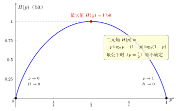

# 第16章：似然、熵与交叉熵

> 从统计推断到机器学习训练，对数经常不直接出现为“函数主题”，而是出现为目标函数的核心骨架。

## 学习目标

完成本章学习后，你将能够：

1. 理解对数似然为什么常优于原始似然
2. 理解熵的基本形式
3. 解释交叉熵与 KL 散度的直觉
4. 理解为什么机器学习喜欢优化 log-loss
5. 建立对数在“加性目标函数”中的视角

---

## 正文内容

### 16.1 似然为什么常取对数

设独立样本的似然为：

$$
L(\theta)=\prod_{i=1}^n p(x_i\mid\theta)
$$

取对数得：

$$
\ell(\theta)=\log L(\theta)=\sum_{i=1}^n\log p(x_i\mid\theta)
$$

这样做有三个好处：

1. 乘积变求和，便于分析
2. 数值更稳定，避免大量小概率连乘下溢
3. 对求导和优化更友好

### 16.2 熵的形式

离散随机变量的熵定义为：

$$
H(X)=-\sum_i p_i\log p_i
$$

它衡量的是平均不确定性。若分布越均匀，不确定性越大，熵通常越高。

从结构上看，熵就是“平均信息量”：

- 单个事件的信息量是 $-\log p_i$
- 按真实概率 $p_i$ 做平均，就得到熵

对最简单的两点分布 $p=(p,\,1-p)$，熵随 $p$ 变化的形状是一条钟形曲线——它在 $p=\tfrac12$（最公平、最不确定）处取得最大值 $1$ bit，在两端 $p=0,1$（完全确定）处为 $0$：

### 16.3 交叉熵

若真实分布为 $p$，模型分布为 $q$，交叉熵写作：

$$
H(p,q)=-\sum_i p_i\log q_i
$$

它衡量“用模型 $q$ 编码真实分布 $p$ 需要多少平均代价”。机器学习中常见的分类损失，本质上就是这种形式。

### 16.4 一个极小数据例子

设二分类真实分布为：

$$
p=(1,0)
$$

也就是第一类是真实类别。

若模型预测：

$$
q=(0.9,0.1)
$$

则交叉熵为：

$$
H(p,q)=-(1\cdot\log 0.9+0\cdot\log 0.1)=-\log0.9
$$

若模型预测更差：

$$
q=(0.1,0.9)
$$

则交叉熵变为：

$$
H(p,q)=-\log0.1
$$

显然后者更大。这说明：

> 模型越把概率压错到真实类别之外，交叉熵惩罚越重。

### 16.5 KL 散度：交叉熵与熵的差

**KL 散度**（Kullback-Leibler Divergence）衡量分布 $q$ 偏离 $p$ 的程度：

$$D_{\mathrm{KL}}(p \| q) = \sum_i p_i \log\frac{p_i}{q_i} = H(p, q) - H(p)$$

**关键性质**：

1. **非负性**：$D_{\mathrm{KL}}(p \| q) \geq 0$，等号当且仅当 $p = q$（Gibbs 不等式）
2. **非对称性**：$D_{\mathrm{KL}}(p \| q) \neq D_{\mathrm{KL}}(q \| p)$，所以 KL 散度不是距离
3. **分解**：$H(p, q) = H(p) + D_{\mathrm{KL}}(p \| q)$

**意义**：最小化交叉熵 $H(p, q)$（$p$ 固定、优化 $q$）等价于最小化 KL 散度 $D_{\mathrm{KL}}(p \| q)$，因为 $H(p)$ 是常数。这就是为什么机器学习中用交叉熵做损失函数——本质上是在让模型分布 $q$ 逼近真实分布 $p$。

**例子**：上面的二分类，$p = (1, 0)$，$q = (0.9, 0.1)$：

$$D_{\mathrm{KL}}(p \| q) = 1 \cdot \log\frac{1}{0.9} + 0 \cdot \log\frac{0}{0.1} = -\log 0.9 \approx 0.105$$

### 16.6 为什么 log-loss 合理

对数损失会对“把高概率给错类别”施加更大惩罚。因为当 $q$ 很小时，$-\log q$ 会迅速变大。这种惩罚符合统计学习中“自信但错误要重罚”的需求。

所以对数在这里不只是方便，而是在塑造一种合理的误差尺度：

- 预测正确且高置信，损失很小
- 预测错误且高置信，损失非常大

---

## 例题

**问题 1**：若模型给真实类别的概率是 0.9 和 0.1，哪一次的对数损失更大？

**分析**：

损失分别为：

$$
-\log0.9,\qquad -\log0.1
$$

显然第二个更大。这说明模型若对真实类别给出极小概率，会受到很重的惩罚。

**问题 2**：为什么最大化似然常等价于最大化对数似然？

**解答**：

因为对数函数在合法范围内单调递增，所以使 $L(\theta)$ 最大的参数，也会使 $\log L(\theta)$ 最大。只是后者更容易分析和计算。

---

## 常见误区与检查清单

- 是否把“取对数”仅理解为数值缩小？
- 是否混淆熵、交叉熵和 KL 散度？
- 是否忘记对数概率必须对应正概率？
- 是否理解 log-loss 惩罚的是“高置信错误”？
- 是否看见了“单个信息量 → 平均信息量 → 模型代价”这条结构链？

---

## 本章小结

| 主题 | 结论 |
|------|------|
| 对数似然 | 把样本概率乘积变成求和 |
| 熵 | $H(X)=-\sum p_i\log p_i$ |
| 交叉熵 | $H(p,q)=-\sum p_i\log q_i$ |
| log-loss | 对错误高置信预测惩罚更大 |
| 统一结构 | 对数把概率目标变成可加目标 |
| 核心联系 | 信息量、熵与交叉熵共享同一对数结构 |

---

## 分级例题精练

> 本节精选 6 道例题，分三档难度：**基础入门 ★** / **高中核心 ★★** / **高阶拓展 ★★★**（本章侧重高中核心与高阶拓展）。每题含【题目】【解】【点评】，建议先自行尝试再看解。

### 例题精练 1（★★ 高中核心）

**题目**：二分类问题中，真实标签 $y=1$，模型预测正类概率 $\hat y=0.8$。二元交叉熵损失为 $\ell=-\big[y\log\hat y+(1-y)\log(1-\hat y)\big]$。分别用自然对数计算 $\hat y=0.8$ 与 $\hat y=0.2$ 时的损失，比较哪个更大。

**解**：因 $y=1$，损失化简为 $\ell=-\log\hat y$。

当 $\hat y=0.8$：

$$
\ell_1=-\ln 0.8\approx 0.223.
$$

当 $\hat y=0.2$：

$$
\ell_2=-\ln 0.2\approx 1.609.
$$

故 $\ell_2>\ell_1$，预测 $0.2$ 时损失更大。

**点评**：当真实类别确定时，二元交叉熵退化为单项 $-\log\hat y$。模型给真实类别的概率越低，损失越大，这正是 §16.6 "自信但错误要重罚"的雏形。

### 例题精练 2（★★ 高中核心）

**题目**：抛一枚硬币 5 次，结果为"正、正、反、正、反"（3 正 2 反）。设正面概率为 $\theta$，写出似然 $L(\theta)$，并将其化为对数似然 $\ell(\theta)$。当 $\theta=0.6$ 时求 $\ell$ 的数值（自然对数）。

**解**：各次独立，似然为概率连乘：

$$
L(\theta)=\theta\cdot\theta\cdot(1-\theta)\cdot\theta\cdot(1-\theta)=\theta^3(1-\theta)^2.
$$

取对数把连乘变连加：

$$
\ell(\theta)=\log L(\theta)=3\log\theta+2\log(1-\theta).
$$

代入 $\theta=0.6$：

$$
\ell(0.6)=3\ln 0.6+2\ln 0.4=3(-0.5108)+2(-0.9163)=-1.532-1.833=-3.365.
$$

**点评**：这是 §16.1 的标准操作：把概率乘积 $\theta^3(1-\theta)^2$ 通过对数变成加性表达 $3\log\theta+2\log(1-\theta)$，求导与数值都更友好。下一题将对它求最大值。

### 例题精练 3（★★ 高中核心）

**题目**：真实分布 $p=(0.7,0.3)$，模型分布 $q=(0.6,0.4)$。计算交叉熵 $H(p,q)=-\sum_i p_i\log_2 q_i$ 与熵 $H(p)=-\sum_i p_i\log_2 p_i$（单位 bit），并验证 $H(p,q)\ge H(p)$。

**解**：先算交叉熵，用 $\log_2 x=\ln x/\ln 2$：

$$
\log_2 0.6=\frac{-0.5108}{0.6931}=-0.7370,\quad \log_2 0.4=\frac{-0.9163}{0.6931}=-1.3219.
$$

$$
H(p,q)=-\big(0.7(-0.7370)+0.3(-1.3219)\big)=0.5159+0.3966=0.9125\text{ bit}.
$$

再算熵：

$$
\log_2 0.7=\frac{-0.3567}{0.6931}=-0.5146,\quad \log_2 0.3=\frac{-1.2040}{0.6931}=-1.7370.
$$

$$
H(p)=-\big(0.7(-0.5146)+0.3(-1.7370)\big)=0.3602+0.5211=0.8813\text{ bit}.
$$

故 $H(p,q)=0.9125\ge H(p)=0.8813$，差值 $D_{\mathrm{KL}}(p\|q)=0.0312$ bit $\ge 0$。

**点评**：本题数值地验证了 §16.5 的分解 $H(p,q)=H(p)+D_{\mathrm{KL}}(p\|q)$ 与非负性。当 $q\ne p$ 时交叉熵严格大于熵，多出来的正是 KL 散度。

### 例题精练 4（★★★ 高阶拓展）

**题目**：（伯努利 MLE）承接例题 2，对 $n$ 次独立抛掷中出现 $k$ 次正面的数据，对数似然 $\ell(\theta)=k\log\theta+(n-k)\log(1-\theta)$。用一阶条件求使 $\ell$ 最大的 $\hat\theta$，并验证它是极大值。

**解**：对 $\theta$ 求导（自然对数）：

$$
\ell'(\theta)=\frac{k}{\theta}-\frac{n-k}{1-\theta}.
$$

令 $\ell'(\theta)=0$：

$$
\frac{k}{\theta}=\frac{n-k}{1-\theta}\ \Longrightarrow\ k(1-\theta)=(n-k)\theta\ \Longrightarrow\ k=n\theta,
$$

故 $\hat\theta=\dfrac{k}{n}$。二阶导数

$$
\ell''(\theta)=-\frac{k}{\theta^2}-\frac{n-k}{(1-\theta)^2}<0,
$$

恒为负，说明 $\ell$ 严格凹，$\hat\theta=k/n$ 是唯一的全局极大值点。

**点评**：这就是"频率即最大似然估计"的严格来源。对例题 2 的 3 正 2 反，$\hat\theta=3/5=0.6$——恰好就是当时代入的值，因为 $0.6$ 正是该数据的 MLE。

### 例题精练 5（★★★ 高阶拓展）

**题目**：（KL 散度非负 / Gibbs 不等式）设 $p,q$ 为同一支撑集上的概率分布。利用 $\ln x\le x-1$（等号当且仅当 $x=1$）证明 $D_{\mathrm{KL}}(p\|q)=\sum_i p_i\ln\dfrac{p_i}{q_i}\ge 0$，并给出等号条件；据此说明"最小化交叉熵等价于最小化 KL 散度"。

**解**：考察其相反数 $-D_{\mathrm{KL}}(p\|q)=\sum_i p_i\ln\dfrac{q_i}{p_i}$。对每项用 $\ln x\le x-1$，取 $x=q_i/p_i$：

$$
\sum_i p_i\ln\frac{q_i}{p_i}\le \sum_i p_i\left(\frac{q_i}{p_i}-1\right)=\sum_i q_i-\sum_i p_i=1-1=0.
$$

故 $-D_{\mathrm{KL}}(p\|q)\le 0$，即 $D_{\mathrm{KL}}(p\|q)\ge 0$。等号成立当且仅当每个 $q_i/p_i=1$，即 $p=q$。

由分解 $H(p,q)=H(p)+D_{\mathrm{KL}}(p\|q)$，当 $p$ 固定时 $H(p)$ 为常数，故

$$
\arg\min_q H(p,q)=\arg\min_q D_{\mathrm{KL}}(p\|q),
$$

且最小值在 $q=p$ 处取得，此时 $H(p,q)=H(p)$。

**点评**：这补全了 §16.5 中"$D_{\mathrm{KL}}\ge 0$（Gibbs 不等式）"的证明，工具与第 15 章证明最大熵的切线不等式 $\ln x\le x-1$ 完全相同。它解释了为什么交叉熵是合理的训练目标：最小化它就是在让 $q$ 逼近真实分布 $p$。

### 例题精练 6（★★★ 高阶拓展）

**题目**：（softmax 交叉熵的梯度）多分类中，logits 为 $z=(z_1,\dots,z_K)$，预测 $q_k=\dfrac{e^{z_k}}{\sum_j e^{z_j}}$，真实为 one-hot 标签 $p$（设真实类别为 $c$，即 $p_c=1$）。损失 $\ell=-\sum_k p_k\log q_k=-\log q_c$。证明 $\dfrac{\partial\ell}{\partial z_k}=q_k-p_k$。

**解**：先写 $\log q_c=z_c-\log\sum_j e^{z_j}$（用了 log-sum-exp 形式），故

$$
\ell=-z_c+\log\sum_j e^{z_j}.
$$

对 $z_k$ 求偏导。第一项 $-z_c$ 对 $z_k$ 的导数为 $-p_k$（仅当 $k=c$ 时为 $-1$，否则 $0$，而 $p_k=[k=c]$）。第二项：

$$
\frac{\partial}{\partial z_k}\log\sum_j e^{z_j}=\frac{e^{z_k}}{\sum_j e^{z_j}}=q_k.
$$

合并：

$$
\frac{\partial\ell}{\partial z_k}=-p_k+q_k=q_k-p_k.
$$

**点评**：这是深度学习中最优雅的结果之一——softmax 接交叉熵后，对 logits 的梯度恰为"预测减真实" $q-p$，形式极简、数值稳定。它把本章的交叉熵与下一章的 log-sum-exp（$\log\sum_j e^{z_j}$ 正是 LSE）直接缝合在一起。

---

## 练习题

1. 说明为什么最大化似然常等价于最大化对数似然。
2. 写出离散熵的定义。
3. 解释交叉熵为什么出现在分类模型中。
4. 判断：当模型给真实类别概率越小，log-loss 越小。是否正确？
5. 用一句话说明对数在统计学习中的作用。
6. 对二分类真实标签 $(1,0)$，比较预测 $(0.8,0.2)$ 和 $(0.2,0.8)$ 的交叉熵大小。
7. 解释为什么本章的目标函数天然会和下一章的数值稳定性联系起来。

---

下一章将进入 `log-sum-exp` 和 softmax，说明当这些对数目标真正落到计算机里时，为什么还需要进一步处理数值稳定性。
