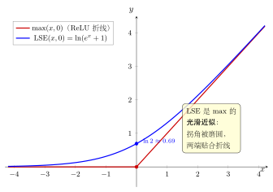

# 第17章：log-sum-exp 与数值稳定性

> 在计算机里，对数不仅帮助理解结构，还帮助避免溢出和下溢。

## 学习目标

完成本章学习后，你将能够：

1. 理解 `log-sum-exp` 的定义
2. 知道为什么直接计算指数和会不稳定
3. 掌握稳定形式的 `log-sum-exp`
4. 理解 softmax 与对数稳定性的联系
5. 把对数看作计算工程中的保护层

---

## 正文内容

### 17.1 问题从哪里来

设有一组数 $x_1,\dots,x_n$，希望计算：

$$
\log\left(\sum_{i=1}^n e^{x_i}\right)
$$

如果某些 $x_i$ 很大，$e^{x_i}$ 可能溢出；如果很小，可能下溢为 0。

所以这里的问题不是公式错了，而是：

> 数学上正确的表达式，直接放进浮点计算时可能已经不稳定。

### 17.2 大数溢出与小数下溢

例如：

- $e^{1000}$ 在普通浮点数里通常大得离谱，可能直接溢出
- $e^{-1000}$ 又可能小到直接下溢成 0

这两种问题都会破坏后续计算：

- 上溢让结果变成无穷大
- 下溢让某些项被错误地当成完全不存在

### 17.3 稳定技巧

令

$$
m=\max_i x_i
$$

则：

$$
\log\left(\sum_i e^{x_i}\right)
=
m+\log\left(\sum_i e^{x_i-m}\right)
$$

因为所有 $x_i-m\le0$，所以指数项不再爆炸。这就是稳定的 `log-sum-exp` 公式。

### 17.4 为什么这个技巧合法

因为：

$$
\sum_i e^{x_i}=e^m\sum_i e^{x_i-m}
$$

再取对数：

$$
\log e^m+\log\left(\sum_i e^{x_i-m}\right)=m+\log\left(\sum_i e^{x_i-m}\right)
$$

本质上只是把共同最大尺度提出去。

所以它不是近似，不是技巧性补丁，而是一个**严格恒等变形**。

顺带一提，log-sum-exp 还有一个几何含义：它是 $\max$ 的**光滑近似**。以两项 $\mathrm{LSE}(x,0)=\ln(e^x+1)$（即 softplus）为例，它把 $\max(x,0)$（ReLU 折线）的尖锐拐角磨成一条光滑曲线，而在两端又紧贴折线：

### 17.5 与 softmax 和交叉熵的关系

softmax 定义为：

$$
\mathrm{softmax}(x_i)=\frac{e^{x_i}}{\sum_j e^{x_j}}
$$

实际计算时常先减去最大值：

$$
\frac{e^{x_i-m}}{\sum_j e^{x_j-m}}
$$

这样结果不变，但更稳定。这里再次体现了对数和指数在计算中的尺度管理作用。

这与上一章的交叉熵直接相关：

- 训练分类模型时常会用到 softmax
- softmax 的输出又会进入交叉熵
- 所以 `log-sum-exp` 稳定性并不是孤立主题，而是机器学习里真实需要的数学结构

---

## 例题

**问题 1**：为什么计算 $\log(e^{1000}+e^{999})$ 时不能直接先算指数？

**解释**：

因为 $e^{1000}$ 在普通浮点数里可能已经溢出。改用稳定形式：

$$
1000+\log(1+e^{-1})
$$

即可安全计算。

**问题 2**（完整数值计算）：用稳定公式计算 $\text{LSE}(100, 98, 95)$。

**解答**：

$m = \max(100, 98, 95) = 100$。

$$\text{LSE} = 100 + \ln(e^{100-100} + e^{98-100} + e^{95-100})$$
$$= 100 + \ln(e^0 + e^{-2} + e^{-5})$$
$$= 100 + \ln(1 + 0.1353 + 0.0067)$$
$$= 100 + \ln(1.1421)$$
$$\approx 100 + 0.1328 = 100.133$$

**对比不稳定做法**：直接算 $e^{100} \approx 2.69 \times 10^{43}$，$e^{98} \approx 3.64 \times 10^{42}$……浮点数能存但已经损失精度。而稳定做法全程只处理$\leq 1$的数，精度完全可控。

**问题 3**（softmax稳定计算）：计算 $\text{softmax}(3, 1, -2)$ 的第一个分量。

**解答**：

$m = 3$，减去最大值后：$\text{softmax}_1 = \frac{e^{3-3}}{e^{3-3}+e^{1-3}+e^{-2-3}} = \frac{1}{1+e^{-2}+e^{-5}}$

$$= \frac{1}{1+0.1353+0.0067} = \frac{1}{1.1421} \approx 0.8756$$

不减去最大值结果完全一样，但当数值很大时（如$x_i$在数百以上）不减就会溢出。

---

## 常见误区与检查清单

- 是否以为数值稳定性只是编程细节，与数学无关？
- 是否忽略指数运算会迅速超出浮点范围？
- 是否忘记减去最大值不会改变 softmax 结果？
- 是否把稳定公式当成近似而不是恒等变换？
- 是否忽略了它与交叉熵、分类模型之间的直接联系？

---

## 本章小结

| 主题 | 结论 |
|------|------|
| `log-sum-exp` | $\log(\sum e^{x_i})$ |
| 数值问题 | 可能出现上溢与下溢 |
| 稳定技巧 | 提取最大值 $m=\max x_i$ |
| 稳定公式 | $m+\log(\sum e^{x_i-m})$ |
| softmax | 常用同样的减最大值技巧 |
| 核心思想 | 对数用于管理尺度，防止数值灾难 |

---

## 分级例题精练

> 本节精选 6 道例题，分三档难度：**基础入门 ★** / **高中核心 ★★** / **高阶拓展 ★★★**（本章侧重高中核心与高阶拓展）。每题含【题目】【解】【点评】，建议先自行尝试再看解。

### 例题精练 1（★★ 高中核心）

**题目**：用稳定形式计算 $\mathrm{LSE}(2,0,-1)=\ln\!\big(e^{2}+e^{0}+e^{-1}\big)$（自然对数），保留 4 位小数。

**解**：取 $m=\max(2,0,-1)=2$，提取公共最大尺度：

$$
\mathrm{LSE}=m+\ln\!\Big(e^{2-2}+e^{0-2}+e^{-1-2}\Big)=2+\ln\!\big(e^{0}+e^{-2}+e^{-3}\big).
$$

代入数值 $e^{0}=1,\ e^{-2}\approx0.1353,\ e^{-3}\approx0.0498$：

$$
\mathrm{LSE}=2+\ln(1.1851)=2+0.1699=2.1699.
$$

**点评**：减最大值后所有指数项都 $\le 1$，不会溢出。这是 §17.3 稳定公式的直接套用：$m+\ln\sum_i e^{x_i-m}$。

### 例题精练 2（★★ 高中核心）

**题目**：计算 $\mathrm{softmax}(2,1,0)$ 的三个分量，用减最大值的稳定形式，保留 4 位小数，并验证三者之和为 1。

**解**：$m=2$，减去后指数为 $e^{0}=1,\ e^{-1}\approx0.3679,\ e^{-2}\approx0.1353$，分母

$$
S=1+0.3679+0.1353=1.5032.
$$

于是

$$
\mathrm{softmax}_1=\frac{1}{1.5032}\approx0.6652,\quad
\mathrm{softmax}_2=\frac{0.3679}{1.5032}\approx0.2447,\quad
\mathrm{softmax}_3=\frac{0.1353}{1.5032}\approx0.0900.
$$

三者之和 $0.6652+0.2447+0.0900=0.9999\approx1$（舍入误差）。

**点评**：§17.5 指出 softmax 分子分母同乘 $e^{-m}$ 不改变比值，但能防止大数溢出。和为 1 是 softmax 作为概率分布的基本性质。

### 例题精练 3（★★ 高中核心）

**题目**：说明为什么直接计算 $\ln(e^{800}+e^{799})$ 会在双精度浮点下失败，并给出稳定形式的精确表达式。

**解**：双精度浮点能表示的最大数约为 $1.8\times10^{308}$，而 $e^{800}\approx10^{347}$ 远超此上限，直接计算 $e^{800}$ 会上溢为 $+\infty$，导致结果变成 $\infty$。

用稳定形式，取 $m=800$：

$$
\ln(e^{800}+e^{799})=800+\ln(e^{0}+e^{-1})=800+\ln(1+e^{-1})=800+\ln(1.3679)\approx800.3133.
$$

全程只对 $\le 1$ 的数取指数，安全可控。

**点评**：这呼应 §17.2 的上溢问题。"数学正确"不等于"数值可算"——减最大值把致命的 $e^{800}$ 化为温和的 $e^{0}$ 与 $e^{-1}$。

### 例题精练 4（★★★ 高阶拓展）

**题目**：（减最大值的恒等性证明）证明对任意常数 $c$ 有 $\ln\sum_i e^{x_i}=c+\ln\sum_i e^{x_i-c}$，从而稳定公式（取 $c=m=\max_i x_i$）是严格恒等式而非近似。再说明 softmax 满足 $\mathrm{softmax}(x_i)=\mathrm{softmax}(x_i-c)$。

**解**：对 LSE，利用 $e^{x_i}=e^{c}\,e^{x_i-c}$：

$$
\sum_i e^{x_i}=\sum_i e^{c}e^{x_i-c}=e^{c}\sum_i e^{x_i-c}.
$$

两边取对数，并用 $\ln(ab)=\ln a+\ln b$：

$$
\ln\sum_i e^{x_i}=\ln e^{c}+\ln\sum_i e^{x_i-c}=c+\ln\sum_i e^{x_i-c}.
$$

此式对一切实数 $c$ 成立，取 $c=m$ 即得稳定公式，过程无任何近似。对 softmax，分子分母同乘 $e^{-c}$：

$$
\frac{e^{x_i-c}}{\sum_j e^{x_j-c}}=\frac{e^{-c}e^{x_i}}{e^{-c}\sum_j e^{x_j}}=\frac{e^{x_i}}{\sum_j e^{x_j}}=\mathrm{softmax}(x_i),
$$

即平移 logits 不改变 softmax 输出。

**点评**：这给出 §17.4 中"严格恒等变形"的完整论证，并揭示一个深层事实：softmax 对 logits 的整体平移不变，所以可以放心地减去任意常数（取 $m$ 只是为了数值安全）。

### 例题精练 5（★★★ 高阶拓展）

**题目**：（LSE 的梯度即 softmax）设 $f(x)=\ln\sum_{j=1}^n e^{x_j}$。证明 $\dfrac{\partial f}{\partial x_k}=\mathrm{softmax}(x_k)$，并据此说明梯度向量的各分量非负且和为 1。

**解**：对 $x_k$ 求偏导，外层是 $\ln(\cdot)$，内层 $\sum_j e^{x_j}$ 对 $x_k$ 的导数为 $e^{x_k}$：

$$
\frac{\partial f}{\partial x_k}=\frac{1}{\sum_j e^{x_j}}\cdot\frac{\partial}{\partial x_k}\sum_j e^{x_j}=\frac{e^{x_k}}{\sum_j e^{x_j}}=\mathrm{softmax}(x_k).
$$

由于每个 $e^{x_k}>0$ 且分母为正，故各分量 $>0$；又

$$
\sum_{k=1}^n\frac{\partial f}{\partial x_k}=\sum_{k=1}^n\frac{e^{x_k}}{\sum_j e^{x_j}}=\frac{\sum_k e^{x_k}}{\sum_j e^{x_j}}=1.
$$

**点评**：这是 LSE 与 softmax 最核心的联系——LSE 是 softmax 的"原函数"，其梯度恰好就是 softmax 概率向量。它解释了为什么 LSE 被称为"光滑的 max"：当某个 $x_k$ 远大于其余时，对应梯度趋于 1，其余趋于 0，正像 $\max$ 的（次）梯度。

### 例题精练 6（★★★ 高阶拓展）

**题目**：（稳定的 log-softmax）训练中常需 $\log$-softmax，即 $\log\mathrm{softmax}(x_k)=\ln\dfrac{e^{x_k}}{\sum_j e^{x_j}}$。推导其数值稳定的计算式，并指出为什么"先算 softmax 再取对数"会损失精度。

**解**：直接展开对数商：

$$
\log\mathrm{softmax}(x_k)=x_k-\ln\sum_j e^{x_j}=x_k-\mathrm{LSE}(x).
$$

把 LSE 写成稳定形式（$m=\max_j x_j$）：

$$
\log\mathrm{softmax}(x_k)=x_k-\Big(m+\ln\sum_j e^{x_j-m}\Big)=(x_k-m)-\ln\sum_j e^{x_j-m}.
$$

若改为"先算 softmax 再取对数"：当某个 $x_k$ 远小于 $m$ 时，$\mathrm{softmax}(x_k)$ 会下溢为 $0$，再取 $\ln 0=-\infty$，精度彻底丢失。而上式中 $(x_k-m)$ 直接保留为一个大负数，$\ln\sum_j e^{x_j-m}$ 项稳定有界，故全程不溢出、不丢精度。

**点评**：本题综合了 §17.3 的稳定 LSE 与 §17.5 的 softmax/交叉熵联系。log-softmax 的稳定式 $(x_k-m)-\ln\sum_j e^{x_j-m}$ 是几乎所有深度学习框架交叉熵损失的底层实现——它避免了"先 softmax 后取对数"的下溢陷阱。

---

## 练习题

1. 写出 `log-sum-exp` 的稳定形式。
2. 说明为什么直接计算 $e^{1000}$ 可能有问题。
3. 解释 softmax 中减去最大值为什么不改变结果。
4. 判断：稳定公式只是近似公式。是否正确？
5. 用一句话概括对数在数值计算中的作用。
6. 说明为什么上溢和下溢都会破坏计算结果。
7. 解释为什么本章和上一章的交叉熵主题是连在一起的。

---

下一章将离开实数范围，讨论复对数为什么会从单值函数变成多值对象。
