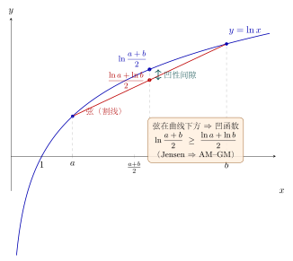

# 第19章：高阶问题与结构连接

> 学完基础公式后，更重要的是看见对数在不同领域里反复出现的同一种结构：尺度、可加性、凹性与反函数。

## 学习目标

完成本章学习后，你将能够：

1. 总结对数在多个领域中的共同结构
2. 理解对数的凹性为何重要
3. 初步认识 Jensen 不等式与平均意义
4. 解释算法复杂度中的对数因素
5. 把零散知识整理成统一框架

---

## 正文内容

### 19.1 用四条线重新组织全书

学到这里，更重要的不是再多记几个例子，而是把前面内容重新压缩成四条结构线：

1. **反函数线**：对数回答指数位置上的未知数
2. **可加化线**：对数把乘法、连乘、倍率关系转成加法和求和
3. **尺度线**：对数把巨大跨度压缩成可比较层级
4. **多值线**：进入复数后，反函数不再能全局保持单值

这样看时，你会发现第1章到第18章并不是并列堆放，而是在反复展开同一个结构。

### 19.2 对数的凹性

函数 $\ln x$ 在 $(0,+\infty)$ 上是凹函数，这意味着它的图像“向下弯”。

凹性的一个重要后果是：

- 先平均再取对数
- 往往大于先取对数再平均

这在概率、信息论和优化里都很重要。

### 19.2b 对数凹性的重要推论

$\ln x$ 的凹性可以产生多个有用的不等式：

**算术-几何平均不等式（AM-GM）从凹性推出**：

由 Jensen 不等式（下面马上讲），对正数 $x_1, \ldots, x_n$：

$$\ln\left(\frac{x_1+\cdots+x_n}{n}\right) \geq \frac{\ln x_1 + \cdots + \ln x_n}{n} = \ln(x_1 \cdots x_n)^{1/n}$$

取指数得到经典的 AM-GM 不等式：

$$\frac{x_1+\cdots+x_n}{n} \geq (x_1 \cdots x_n)^{1/n}$$

**对数凹分布（Log-concave Distributions）**：若概率密度函数 $f(x)$ 满足 $\ln f(x)$ 是凹函数，则称 $f$ 为对数凹分布。正态分布、均匀分布、指数分布、Gamma分布（形状参数 $\geq 1$）都是对数凹的。

对数凹分布有很好的性质：卷积封闭（两个对数凹分布的卷积仍是对数凹的），尾部衰减至少是指数级的。这在概率论和优化中非常有用。

### 19.3 Jensen 不等式的直觉

对于凹函数 $\phi$，有：

$$
\phi(\mathbb E[X])\ge\mathbb E[\phi(X)]
$$

应用到 $\phi(x)=\ln x$，得到：

$$
\ln(\mathbb E[X])\ge\mathbb E[\ln X]
$$

这解释了为什么“平均增长率”和“对数平均增长率”不是一回事，也解释了为什么在随机增长问题里，直接平均和取对数后平均会导出不同结论。

下图直观展示了凹性：$y=\ln x$ 上连接 $a,b$ 两点的弦（割线）整条落在曲线下方。于是在中点 $\frac{a+b}{2}$ 处，曲线上的值 $\ln\frac{a+b}{2}$ 高于弦上的值 $\frac{\ln a+\ln b}{2}$，二者之差就是“凹性间隙”。这正是 Jensen 不等式 $\ln\frac{a+b}{2}\ge\frac{\ln a+\ln b}{2}$，取指数即得 AM–GM。

### 19.4 对数复杂度为什么出现

当一个过程每一步都把问题规模缩小为原来的一定比例时，步骤数往往呈对数级。

例如二分查找每次把区间减半，所以复杂度是：

$$
O(\log n)
$$

这里对数出现的原因，不是公式偶然，而是“重复按比例缩小”的反向提问：

> 要缩小多少次，才能从规模 $n$ 变到 1？

这本质上又回到了第1章的反向问题。

### 19.5 Stirling 近似：对数把阶乘变成可计算的

在算法分析和组合数学中，$n!$ 增长极快，直接计算不现实。**Stirling 近似**给出：

$$n! \approx \sqrt{2\pi n}\left(\frac{n}{e}\right)^n$$

取对数后得到一个实用的近似：

$$\boxed{\ln n! \approx n\ln n - n + \frac{1}{2}\ln(2\pi n)}$$

在大多数场景中，可以进一步简化为 $\ln n! \approx n\ln n - n$。

**应用示例**：

- **算法复杂度**：排序的比较次数下界 $\log_2(n!) \approx n\log_2 n - n\log_2 e \approx n\log_2 n$，说明基于比较的排序至少需要 $O(n\log n)$ 次
- **组合计数**：$\ln\binom{n}{k} = \ln n! - \ln k! - \ln(n-k)!$，Stirling 使得大组合数可以近似估计
- **统计力学**：$\ln\binom{N}{n}$ 在 $N$ 很大时的近似是熵公式的来源

### 19.6 对数螺旋：自然界中的对数几何

**对数螺旋**（Logarithmic Spiral）的极坐标方程为：

$$r = ae^{b\theta}$$

或等价地：$\theta = \frac{1}{b}\ln\frac{r}{a}$（即角度是半径的对数函数）。

**核心性质**：对数螺旋具有**自相似性**——放大任意倍数后形状不变，只是旋转了一个角度。这是因为 $r$ 乘以常数等价于 $\theta$ 加上常数。

**自然界中的例子**：

- **鹦鹉螺壳**：腔室按等比增长，投影轮廓近似对数螺旋
- **向日葵花盘**：种子排列遵循与黄金角相关的螺旋结构
- **台风和星系旋臂**：大尺度流体运动常产生对数螺旋形态
- **猛禽飞行轨迹**：以固定角度逼近猎物时，轨迹是对数螺旋

对数螺旋是"等比增长"在几何上的化身——这又回到了第1章的核心直觉。

### 19.7 离散对数与密码学

在模运算中，"离散对数问题"是这样的：

> 已知 $a, b, p$，求 $x$ 使得 $a^x \equiv b \pmod{p}$。

这本质上就是第1章的"反向问题"——但在模运算下变得极其困难。

**正向容易**：给定 $a, x, p$，计算 $a^x \bmod p$ 可以用快速幂在 $O(\log x)$ 步内完成。

**反向困难**：给定结果 $b$，反推 $x$ 目前没有已知的多项式时间算法（对适当选择的 $p$）。

**密码学应用**：这种"正向容易、反向困难"的不对称性是 **Diffie-Hellman 密钥交换**和 **ElGamal 加密**等现代密码系统的数学基础。Alice 和 Bob 可以在公开信道上安全地建立共享密钥，正是因为窃听者需要解决离散对数问题。

这说明对数的"反向问题"不仅是一个数学概念，在计算复杂性理论中还有深刻的应用价值。

### 19.8 结构连接不是巧合

现在可以把不同章节放到同一张结构图里：

- 第1章：反向问题
- 第3章：乘法变加法
- 第6章：尺度压缩
- 第10章：线性化建模
- 第15–17章：概率、信息量、数值稳定性
- 第18章：单值性在复数中失效

所以对数在很多领域反复出现，并不是因为大家“爱用这个符号”，而是因为这些问题都含有相同的结构：

- 比例
- 连乘
- 倍率
- 层级
- 反向恢复指数位置

---

## 例题

**问题 1**：为什么二分查找里会出现对数？

**解释**：

因为每一步都把候选范围缩小为原来的一半。若经过 $k$ 步后缩到 1 个元素量级，则：

$$
\frac{n}{2^k}\approx1
$$

所以：

$$
2^k\approx n,\qquad k\approx\log_2 n
$$

**问题 2**：为什么说“先平均再取对数”和“先取对数再平均”不是同一件事？

**思路**：

因为 $\ln x$ 是凹函数，Jensen 不等式告诉我们这两个操作次序会产生不同结果。这说明对数不仅改变数值大小，还会改变我们看待平均的方式。

---

## 常见误区与检查清单

- 是否把对数在不同领域中的出现看成巧合？
- 是否只记住复杂度记号，而不知道为何是对数？
- 是否忽略了对数的凹性？
- 是否把“尺度压缩”和“数值变小”混为一谈？
- 是否把高阶章节看成脱离基础章节的新话题？

---

## 本章小结

| 结构 | 体现 |
|------|------|
| 反函数 | 解指数位置未知数 |
| 尺度压缩 | 分贝、pH、震级、数量级 |
| 可加化 | 概率乘积、似然、信息量 |
| 凹性 | 熵、Jensen、不等式 |
| 比例递归 | 二分查找与对数复杂度 |
| 多值延伸 | 复对数中的分支与主值 |

---

## 分级例题精练

> 本节精选 6 道例题，分三档难度：**基础入门 ★** / **高中核心 ★★** / **高阶拓展 ★★★**（本章侧重高阶拓展）。每题含【题目】【解】【点评】，建议先自行尝试再看解。

### 例题精练 1（★★ 高中核心）

**题目**：用 $\ln x$ 的凹性证明对两个正数 $a,b$ 有 $\sqrt{ab}\le\dfrac{a+b}{2}$（二元 AM-GM）。

**解**：

凹函数满足：对任意 $a,b>0$ 与权重 $\tfrac12,\tfrac12$，

$$
\ln\!\Big(\frac{a+b}{2}\Big)\ge\frac{\ln a+\ln b}{2}.
$$

右边写成单一对数：

$$
\frac{\ln a+\ln b}{2}=\frac12\ln(ab)=\ln(ab)^{1/2}=\ln\sqrt{ab}.
$$

于是 $\ln\dfrac{a+b}{2}\ge\ln\sqrt{ab}$。由于 $\ln$ 单调递增，去掉对数即得

$$
\frac{a+b}{2}\ge\sqrt{ab}.
$$

**点评**：这是 19.2b 中一般 AM-GM 的 $n=2$ 特例，把“几何平均 $\le$ 算术平均”翻译成了“先取对数再平均 $\le$ 先平均再取对数”。凹性 + 对数单调性是这类不等式的标准两步走。

### 例题精练 2（★★ 高中核心）

**题目**：用 Stirling 近似 $\ln n!\approx n\ln n-n$ 估计 $\ln(20!)$，并与精确值 $\ln(20!)\approx 42.336$ 比较。

**解**：

取 $n=20$，先用简化式：

$$
\ln(20!)\approx 20\ln 20-20=20\times 2.9957-20\approx 59.915-20=39.915.
$$

再用带修正项的式子 $\ln n!\approx n\ln n-n+\tfrac12\ln(2\pi n)$：

$$
\tfrac12\ln(2\pi\cdot 20)=\tfrac12\ln(125.66)\approx\tfrac12\times 4.834=2.417,
$$

$$
\ln(20!)\approx 39.915+2.417=42.332.
$$

精确值约 $42.336$，带修正项后误差仅约 $0.004$。

**点评**：简化式 $n\ln n-n$ 给出主项但偏小约 $2.4$；那一项 $\tfrac12\ln(2\pi n)$ 正是补回这个差距的关键。Stirling 的威力在于把“连乘到 $20!$”这种不可手算的对象，变成几次对数与乘法。

### 例题精练 3（★★★ 高阶拓展）

**题目**：基于比较的排序，其判定树需区分 $n!$ 种排列。用 Stirling 证明最坏比较次数下界为 $\Omega(n\log n)$，并给出 $\log_2(n!)$ 的主阶系数。

**解**：

一棵二叉判定树若有 $n!$ 个叶子，则其高度（最坏比较次数）至少为 $\lceil\log_2(n!)\rceil$。对 $\log_2(n!)$ 用换底与 Stirling：

$$
\log_2(n!)=\frac{\ln n!}{\ln 2}\approx\frac{n\ln n-n}{\ln 2}.
$$

把 $\ln n=\ln 2\cdot\log_2 n$ 代入分子：

$$
\frac{n\ln n}{\ln 2}=n\log_2 n,\qquad \frac{-n}{\ln 2}=-n\log_2 e,
$$

故

$$
\log_2(n!)\approx n\log_2 n-n\log_2 e.
$$

当 $n\to\infty$，主项是 $n\log_2 n$，低阶项 $n\log_2 e$ 可忽略，因此下界为

$$
\log_2(n!)=\Theta(n\log n),
$$

即任何基于比较的排序最坏情况需要 $\Omega(n\log n)$ 次比较，主阶系数为 $1$。

**点评**：这里换底公式与 Stirling 联手登场——前者把自然对数换成 $\log_2$，后者把 $\ln n!$ 展开。这正是本章“结构连接”的范例：组合计数（$n!$）、对数近似、复杂度下界被一条对数线穿起。

### 例题精练 4（★★★ 高阶拓展）

**题目**：设随机变量 $X$ 取值 $\{1,100\}$，各以概率 $\tfrac12$ 出现。验证 Jensen 不等式 $\ln(\mathbb E[X])\ge\mathbb E[\ln X]$，并解释“算术平均增长率”与“对数（几何）平均增长率”的差距。

**解**：

先算两边。算术期望

$$
\mathbb E[X]=\tfrac12\cdot 1+\tfrac12\cdot 100=50.5,\qquad \ln(\mathbb E[X])=\ln 50.5\approx 3.922.
$$

对数的期望

$$
\mathbb E[\ln X]=\tfrac12\ln 1+\tfrac12\ln 100=\tfrac12\cdot 0+\tfrac12\times 4.605=2.303.
$$

显然 $3.922\ge 2.303$，Jensen 成立，差距约 $1.62$。

进一步，$\exp(\mathbb E[\ln X])=\exp(2.303)=10$，恰是几何平均 $\sqrt{1\times 100}=10$，而算术平均是 $50.5$。

**点评**：几何平均（$10$）远小于算术平均（$50.5$），差距来自 $\ln$ 的凹性。在随机增长（如反复盈亏的投资）里，决定长期命运的是几何平均，所以“对数平均增长率”才是正确的长期视角——这就是 Jensen 不等式背后的实际含义。

### 例题精练 5（★★★ 高阶拓展）

**题目**：在 $\mathbb Z_p^*$（$p=7$）中，以 $g=3$ 为底求 $b=5$ 的离散对数 $x$，即解 $3^x\equiv 5\pmod 7$；并说明为什么“正向快、反向难”支撑了密钥交换。

**解**：

逐次计算 $3$ 的幂模 $7$（正向，快速幂思想）：

$$
3^1=3,\quad 3^2=9\equiv 2,\quad 3^3\equiv 6,\quad 3^4\equiv 18\equiv 4,\quad 3^5\equiv 12\equiv 5.
$$

到 $3^5\equiv 5\pmod 7$，故离散对数 $x=5$。（继续 $3^6\equiv 15\equiv 1$，说明 $3$ 是模 $7$ 的原根，阶为 $6$。）

**反向难**：上面靠枚举找到 $x=5$ 只因 $p$ 极小。当 $p$ 是几百位的大素数时，正向的 $g^x\bmod p$ 仍可用快速幂在 $O(\log x)$ 步算出，但反向求 $x$ 没有已知多项式时间算法。Diffie–Hellman 正利用这种不对称：双方各持私有指数 $a,b$，公开 $g^a,g^b$，共享密钥 $g^{ab}=(g^a)^b=(g^b)^a$ 各自可算，而窃听者要从 $g^a$ 反解 $a$（离散对数），在计算上不可行。

**点评**：离散对数把第 1 章的“反向问题”搬进了模运算，并让正反两向的难度彻底分裂。对数在这里不再是化简工具，而是一道计算复杂性的护城河——这是对数“结构”最出人意料的现身处。

### 例题精练 6（★★★ 高阶拓展）

**题目**：对数螺旋 $r=ae^{b\theta}$ 具有自相似性。证明：把半径整体放大 $\lambda$ 倍（$\lambda>1$）等价于把曲线旋转某固定角度 $\Delta\theta$，并求出 $\Delta\theta$；再说明这与 $\ln$ 的“乘法变加法”有何关联。

**解**：

曲线上一点满足 $r=ae^{b\theta}$。考虑“放大 $\lambda$ 倍”得到的新曲线 $r'=\lambda r=\lambda a e^{b\theta}$。问它是否等于原曲线绕原点旋转 $\Delta\theta$（即把 $\theta$ 换成 $\theta-\Delta\theta$）后的结果：

$$
a e^{b(\theta-\Delta\theta)}=ae^{b\theta}e^{-b\Delta\theta}.
$$

要让它等于 $\lambda a e^{b\theta}$，只需

$$
e^{-b\Delta\theta}=\lambda\ \Longrightarrow\ \Delta\theta=-\frac{\ln\lambda}{b}.
$$

也就是说，放大 $\lambda$ 倍与旋转 $\Delta\theta=-\dfrac{\ln\lambda}{b}$ 完全等价，旋转角只依赖放大倍数，与起点 $\theta$ 无关——这正是自相似性。

**关联**：方程可反解为 $\theta=\dfrac{1}{b}\ln\dfrac{r}{a}$，角度是半径的对数。于是“半径乘以 $\lambda$”对应“角度加上 $\dfrac{\ln\lambda}{b}$”——乘法被对数翻成了加法。这就是为什么等比缩放在对数螺旋上表现为等量旋转。

**点评**：对数螺旋是“乘法变加法”的几何化身：径向的几何级数缩放，被 $\ln$ 翻译成角向的算术级数平移。这把第 3 章的可加化主线、本章的自相似性与自然界形态串到了一起。

---

## 练习题

1. 用自己的话总结对数的四条主线。
2. 说明为什么二分查找复杂度是对数级。
3. 解释对数凹性为什么重要。
4. 举一个“每步按比例缩小”的过程。
5. 说明为什么对数在很多领域反复出现并非巧合。
6. 解释第1章与算法复杂度中的对数为什么本质相关。
7. 说明为什么第18章的复对数多值性也应被看成全书结构的一部分。

---

下一章将用真正的跨章节综合题，把指数增长、线性化、信息量、数值稳定性和复对数放到统一复盘中。
