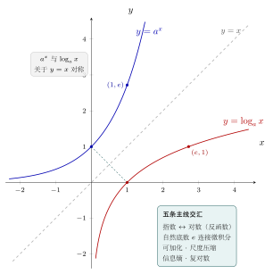

# 第20章：综合复盘与下一步

> 学完对数函数，不是把公式装满，而是形成一种更稳定的判断：什么时候该切换到对数视角。

## 学习目标

完成本章学习后，你将能够：

1. 复盘整套教程的核心主线
2. 识别适合使用对数的典型场景
3. 用综合问题串联各章节知识
4. 建立后续学习路线
5. 把对数函数从“题型”升级为“工具”

---

## 正文内容

### 20.1 本教程的五条主线

全书可以压缩成五条主线：

1. 对数来自指数的逆问题
2. 对数把乘法结构变成加法结构
3. 对数把大尺度压缩成可比较层级
4. 自然对数把对数与微积分连接起来
5. 对数在概率、信息论、计算和复分析中持续出现

如果你现在能用这五条主线解释任何一个章节，那么你已经不只是“学过对数”，而是在用结构看对数。

下图把全书的核心图景收在一张图里：指数函数 $a^x$ 与对数函数 $\log_a x$ 关于直线 $y=x$ 互为镜像（反函数线），自然底数 $e$ 让两条曲线分别过 $(1,e)$ 与 $(e,1)$ 并接通微积分，而可加化、尺度压缩、信息熵、复对数等几条主线都从这对对称曲线出发交汇于此。

### 20.2 面对新问题时该问什么

面对一个新问题时，可以主动问自己：

- 这里是否有重复乘法或按比例变化？
- 是否存在巨大跨度，需要压缩尺度？
- 是否有很多概率连乘或极小数值？
- 是否需要比较增长层级，而不是具体差值？
- 是否存在复指数的反函数问题？

如果这些问题的答案是“是”，对数往往就是自然语言。

## 例题

### 20.3 综合题 A：指数增长、线性化与参数解释

**问题**：某种细胞数量满足指数增长。已知线性化后得到

$$
\ln N(t)=2+0.4t
$$

如何解释模型参数，并写出倍增时间？

**思路**：

由线性化形式读回原模型：

$$
N(t)=e^2e^{0.4t}
$$

所以：

- 初始规模是 $e^2$
- 增长率是 $0.4$

倍增时间满足：

$$
e^{0.4T}=2
$$

所以：

$$
T=\frac{\ln2}{0.4}
$$

这道题同时连接了第10章、第11章和第12章。

### 20.4 综合题 B：概率乘积、对数似然与数值稳定性

**问题**：为什么分类模型训练时，常把很多概率连乘先改写成对数似然，并在实现里使用稳定形式？

**思路**：

因为：

1. 概率连乘会非常小，容易下溢
2. 取对数后，乘积变成求和，便于优化
3. softmax 和交叉熵实现时又会遇到指数和，因此需要 `log-sum-exp` 稳定处理

这道题把第15章、第16章和第17章串成了一条完整链。

### 20.5 综合题 C：从实对数单值到复对数多值

**问题**：为什么实对数是单值的，而复对数会变成多值？

**思路**：

- 在实数范围，指数函数是一一对应的，所以反函数单值
- 在复数范围，指数函数因为周期性失去一一性
- 因而复对数不能全局单值，只能通过主值和分支切割局部选定

这道题把第2章、第4章和第18章连接起来，说明高阶主题并不是脱离基础，而是基础结构在更大范围内发生了变化。

### 20.6 下一步怎么学

如果你想继续深入：

- 学微积分：重点看 $\ln x$ 的积分、级数与微分方程
- 学概率统计：重点看对数似然、熵、KL 散度
- 学机器学习：重点看交叉熵、softmax、数值稳定性
- 学复分析：重点看复对数、分支与解析延拓
- 学算法：重点看递归、分治与对数复杂度

你也可以回过头再看前面的章节：这一次你会更容易发现，很多看似分散的内容其实都在讲同一件事——如何把倍率、层级和连乘结构翻译成可比较、可分析、可计算的形式。

---

## 常见误区与检查清单

- 是否把对数仍当成单独题型，而非通用工具？
- 是否忘记对数最强的地方是结构转换？
- 是否忽略定义域与底数条件这一底线？
- 是否把“高阶应用”理解成和基础完全脱节？
- 是否只会分别做题，却不会把多章内容连成一条线？

---

## 本章小结

| 主线 | 含义 |
|------|------|
| 反函数 | 从指数回到指数位置 |
| 可加化 | 乘法、概率、似然都可转和 |
| 尺度化 | 处理巨大跨度和数量级 |
| 分析化 | 自然对数连接微积分 |
| 拓展化 | 信息、计算、复分析都能继续延展 |

---

## 分级例题精练

> 本节精选 6 道例题，分三档难度：**基础入门 ★** / **高中核心 ★★** / **高阶拓展 ★★★**（本章侧重高阶拓展）。每题含【题目】【解】【点评】，建议先自行尝试再看解。

### 例题精练 1（★★ 高中核心）

**题目**：某菌群按指数增长，线性化后得 $\ln N(t)=3+0.2t$（$t$ 以小时计）。求初始数量、增长率，以及数量翻 $10$ 倍所需时间。

**解**：

由线性化形式回读原模型：

$$
N(t)=e^{3+0.2t}=e^3\,e^{0.2t}.
$$

- 初始数量：$N(0)=e^3\approx 20.1$。
- 连续增长率：$0.2$（每小时）。

设翻 $10$ 倍需时间 $T$，则 $e^{0.2T}=10$，两边取自然对数：

$$
0.2T=\ln 10\ \Longrightarrow\ T=\frac{\ln 10}{0.2}=\frac{2.303}{0.2}\approx 11.5\ \text{小时}.
$$

**点评**：这是综合题 A 的同型练习。要点是“线性化的截距 $=\ln$（初值）、斜率 $=$ 增长率”，并用“取对数解指数方程”求倍增/翻倍时间——把第 10–12 章的线性化与反函数主线一次用全。

### 例题精练 2（★★ 高中核心）

**题目**：判断下列三个新问题各该不该切换到“对数视角”，并各用一句话说明理由：(a) 比较 $2^{40}$ 与 $10^{12}$ 的大小；(b) 求两个相隔 $30$ 元的价格差；(c) 把震级 $6$ 与震级 $4$ 的地震能量作比较。

**解**：

(a) **该用对数**。直接比较数量级困难，取以 $10$ 为底的对数：$\log_{10}2^{40}=40\log_{10}2\approx 40\times 0.301=12.04$，而 $\log_{10}10^{12}=12$。故 $2^{40}>10^{12}$（仅多约 $10\%$）。

(b) **不必用对数**。这是一个绝对差值（线性差），$30$ 元就是 $30$ 元，没有倍率或巨大跨度结构，直接相减即可。

(c) **该用对数**。里氏震级本身就是能量的对数刻度，每差 $1$ 级能量约差 $10^{1.5}\approx 31.6$ 倍，故差 $2$ 级约差 $10^{3}=1000$ 倍。

**点评**：对应 20.2 的自检清单——有“比例/倍率/巨大跨度/数量级比较”就切换对数，纯粹的绝对差值则不需要。判断“何时该用对数”比记公式更接近本教程的目标。

### 例题精练 3（★★★ 高阶拓展）

**题目**：朴素贝叶斯对一条样本算出各类条件概率连乘 $\prod_{i=1}^{n}p_i$。说明为何实现时改用对数似然 $\sum\ln p_i$，并在需要把对数和换回概率比较时为何要用 log-sum-exp 稳定形式。给出 $\log\!\big(e^{-1000}+e^{-1002}\big)$ 的稳定算法。

**解**：

**为何取对数**：若 $n$ 很大且各 $p_i$ 很小，$\prod p_i$ 会迅速下溢到浮点 $0$，丢失全部信息。取对数后

$$
\ln\prod_{i=1}^{n}p_i=\sum_{i=1}^{n}\ln p_i,
$$

把极小乘积变成一串可安全相加的负数，连乘变求和，也便于求导优化。

**为何要 log-sum-exp**：要比较或归一化时需算 $\ln\sum_j e^{s_j}$，其中 $s_j$ 是各类的对数得分。直接对 $s_j=-1000$ 这类取指数会下溢为 $0$。稳定办法是先提取最大值 $m=\max_j s_j$：

$$
\ln\sum_j e^{s_j}=m+\ln\sum_j e^{s_j-m}.
$$

对本题 $s_1=-1000,\ s_2=-1002$，取 $m=-1000$：

$$
\log\!\big(e^{-1000}+e^{-1002}\big)=-1000+\ln\!\big(e^{0}+e^{-2}\big)=-1000+\ln(1+0.1353)=-1000+0.1268\approx -999.87.
$$

每个 $e^{s_j-m}\in(0,1]$，不再下溢。

**点评**：这是综合题 B 的完整实现版，把第 15 章（概率连乘）、第 16 章（对数似然）、第 17 章（数值稳定）串成一条链。核心套路：**连乘→取对数化为求和；求和换回时→提最大值用 log-sum-exp**。

### 例题精练 4（★★★ 高阶拓展）

**题目**：综合复对数与复幂，计算 $(1+i)^{\,i}$ 的主值，给出实部、虚部的近似数值。

**解**：

先求底数 $1+i$ 的主值对数。模与主辐角：

$$
|1+i|=\sqrt{2},\qquad \mathrm{Arg}(1+i)=\frac{\pi}{4}\in(-\pi,\pi].
$$

故

$$
\mathrm{Log}(1+i)=\ln\sqrt{2}+i\frac{\pi}{4}=\tfrac12\ln 2+i\frac{\pi}{4}.
$$

按主值幂 $z^w=e^{w\,\mathrm{Log}\,z}$，取 $w=i$：

$$
i\cdot\mathrm{Log}(1+i)=i\Big(\tfrac12\ln 2+i\tfrac{\pi}{4}\Big)=-\frac{\pi}{4}+i\,\frac{\ln 2}{2}.
$$

于是

$$
(1+i)^{\,i}=e^{-\pi/4}\Big(\cos\tfrac{\ln 2}{2}+i\sin\tfrac{\ln 2}{2}\Big).
$$

数值上 $e^{-\pi/4}\approx 0.4559$，$\tfrac{\ln 2}{2}\approx 0.3466$，$\cos 0.3466\approx 0.9405$，$\sin 0.3466\approx 0.3397$，故

$$
(1+i)^{\,i}\approx 0.4559(0.9405+0.3397\,i)\approx 0.4288+0.1549\,i.
$$

**点评**：复幂的标准三步：求 $\mathrm{Log}\,z$、乘以指数 $w$、再取 $e^{(\cdot)}$。$i\cdot\mathrm{Log}(1+i)$ 里实虚部互换并带符号，是 $i$ 乘法的几何旋转效应。本题把第 18 章复对数与第 14 章复幂收进一题，对应综合题 C 的延伸。

### 例题精练 5（★★★ 高阶拓展）

**题目**：用一条对数线串起“同一个反向问题”：分别指出 (a) 解 $e^{kt}=2$ 的倍增时间、(b) 二分查找的 $O(\log n)$、(c) 离散对数 $g^x\equiv b\pmod p$ 三者中，对数各在回答什么“反向问题”，以及它们为何难度迥异。

**解**：

三者都在问“指数位置上的未知数”，但所处结构不同：

- (a) **连续、可逆**：$e^{kt}=2\Rightarrow t=\dfrac{\ln 2}{k}$。指数函数在实数上一一对应，反函数 $\ln$ 直接给出闭式解，难度最低。
- (b) **离散、单调**：二分查找问“规模 $n$ 要按比例减半多少次到 $1$”，即 $2^k\approx n\Rightarrow k\approx\log_2 n$。仍是反指数，但对象是离散步数，给出复杂度而非精确实数。
- (c) **模运算、不可逆（计算意义）**：$g^x\equiv b\pmod p$ 同样问指数 $x$，但模幂打乱了单调性，没有可用的“解析反函数”，反解在计算上极难——这正是密码学的根基。

**点评**：这道题正是 20.5 的精神：同一个“反向恢复指数位置”的问题，随着定义域从连续实数 → 离散整数 → 模 $p$ 剩余系，难度从“一行闭式解”跃到“没有多项式算法”。看清这条线，就理解了为什么对数会同时出现在微积分、算法与密码学里。

### 例题精练 6（★★★ 高阶拓展）

**题目**：把欧拉恒等式 $e^{i\pi}+1=0$ 当作“五条主线”的交汇点，分别说明它如何同时触及：反函数、可加化、自然底数、复对数多值性。

**解**：

以 $e^{i\pi}=-1$ 为核心，逐线对照：

- **反函数线**：对它取主值对数得 $\mathrm{Log}(-1)=i\pi$，即“指数 $\to$ 对数”的反向，恒等式是 $\mathrm{Log}(-1)=i\pi$ 的指数面孔。
- **可加化线**：复指数把角度相加变成复数相乘，$e^{i\theta_1}e^{i\theta_2}=e^{i(\theta_1+\theta_2)}$；恒等式是 $\theta=\pi$ 时“半圈旋转”的可加结构的端点。
- **自然底数线**：式中底数必须是 $e$——因为只有 $e^{i\theta}$ 的导数自带因子 $i$（增长率与当前值成正比），才让欧拉公式成立，连接了微积分。
- **多值性线**：$\log(-1)=i(\pi+2k\pi)$，主值 $i\pi$ 只是 $k=0$ 的分支；恒等式选定了主支，而它背后是一整族被 $2k\pi i$ 错开的取值。

把四点合起来：$e^{i\pi}+1=0$ 用一个式子同时表达了“最自然的底数 $e$、虚单位 $i$、圆周率 $\pi$、加法单位 $0$、乘法单位 $1$”，并在每条主线上都留下了一个接口。

**点评**：这是整套教程的收束题。欧拉恒等式不是孤立的“最美公式”，而是反函数、可加化、自然底数、复对数多值性这几条线的公共节点。能从一式读出四线，就达到了 20.1 所说的“用结构看对数”。

---

## 练习题

1. 用一段话总结对数函数的核心价值。
2. 给出一个现实问题，并说明为什么适合使用对数。
3. 给出一个计算问题，并说明为什么取对数更稳定。
4. 说明自然对数为什么是连接微积分的关键。
5. 比较实对数单值与复对数多值的根本差别。
6. 用自己的话串联“指数增长—线性化—对数似然—数值稳定性”这条链。
7. 画出你自己的后续学习路线图。

---

恭喜你完成整套教程。接下来不妨回到任意一章，再问自己一次：这里的对数，究竟在解决哪个“反向问题”、压缩哪种“尺度”、或者把哪种“乘法结构”变成了可分析的加法结构？
