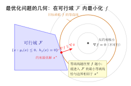

# 第二部分导论：到底什么是"最优化问题"？

> **难度**：★★☆☆☆
> **前置知识**：第1–3章（向量与矩阵、多元微分、凸集与凸函数）
> **定位**：这是第一部分（数学基础）到第二部分（开始真正"求解"）之间的**概念桥梁**。第4章起会逐一讲最优性条件、梯度下降、牛顿法、约束优化……但在动手之前必须先回答一个被很多教材跳过的问题——**这本书反复说的"最优化问题"，作为一个数学对象到底是什么？什么叫"求解"它？**

---

## 学习目标

- 写出最优化问题的**一般形式（标准形）**，并说清 目标函数 / 决策变量 / 约束 三个要素
- 理解**可行集（可行域）** $\mathcal{F}$ 的含义，以及"无约束"只是 $\mathcal{F}=\mathbb{R}^n$ 的特例
- 区分**全局最优解 / 局部最优解 / 最优值**，理解"求解一个问题"到底在求什么
- 知道最优值可能**取不到**（下确界 vs 最小值）、问题可能**无界或不可行**
- 建立一张"问题分类地图"，明白本书各部分（无约束 / 约束 / 凸 / 数值 / 随机）各自在解哪一类问题

---

## 0.1 为什么先要讲"最优化问题"本身

第一部分我们准备了工具：向量与矩阵（第1章）、梯度与 Hessian、Taylor 展开（第2章）、凸集与凸函数（第3章）。这些都是**手段**。但我们还没说清这些手段是用来对付**什么对象**的。

翻开任何一章，你都会看到 $\min f(\mathbf{x})$、最优解 $\mathbf{x}^*$、最优值 $f^*$、"可行域"这些说法——前言的符号表里 $f^*$、$\mathbf{x}^*$ 也赫然在列。可是：

> **引子**：什么叫"求解一个最优化问题"？
> - 是找到一个让 $f$ 最小的点吗？那如果有约束、不是所有点都能取呢？
> - "可行域"是什么？为什么第4章说"本章只讨论无约束情形"——难道还有别的情形没被定义？
> - 找到一个"梯度为零的点"就算解出来了吗？它一定是最小吗？是局部还是全局？

这些问题的答案，都依赖于一个**统一的对象**："最优化问题"的标准形式。本书 24 章本质上都在解同一类对象的不同特例，先把这个对象定义清楚，后面的"最优性条件""约束""对偶"才有共同的落脚点。

---

## 0.2 最优化问题的一般形式（标准形）

一个**最优化问题**（optimization problem）的标准形式是：

$$
\boxed{
\begin{aligned}
\min_{\mathbf{x}\in\mathbb{R}^n}\quad & f(\mathbf{x}) \\
\text{s.t.}\quad & g_i(\mathbf{x}) \le 0, \quad i=1,\dots,m \\
& h_j(\mathbf{x}) = 0, \quad j=1,\dots,p
\end{aligned}}
$$

（"s.t." = subject to，"受约束于"。）它由**三个要素**构成：

- **决策变量**（decision variable）$\mathbf{x}\in\mathbb{R}^n$：我们能自由选择、用来优化的量。在深度学习中就是模型参数 $\boldsymbol\theta$。
- **目标函数**（objective function）$f:\mathbb{R}^n\to\mathbb{R}$：要最小化的量。深度学习中就是损失函数。
- **约束**（constraints）：$m$ 个**不等式约束** $g_i(\mathbf{x})\le 0$ 与 $p$ 个**等式约束** $h_j(\mathbf{x})=0$，限定 $\mathbf{x}$ 的取值范围。

**关于"min"的两点约定**：

- 求**最大**化 $\max f$ 等价于求 $\min (-f)$，所以只需研究最小化，不失一般性。
- 不等式统一写成 "$\le 0$"：$g(\mathbf{x})\ge 0$ 改写为 $-g(\mathbf{x})\le 0$；$g(\mathbf{x})\le c$ 改写为 $g(\mathbf{x})-c\le 0$。这样所有问题都能套进同一个标准形。

---

## 0.3 可行集与"求解"的含义

**可行集 / 可行域**（feasible set/region）是所有满足全部约束的点的集合：

$$
\mathcal{F} = \{\, \mathbf{x}\in\mathbb{R}^n : g_i(\mathbf{x})\le 0\ (\forall i),\ h_j(\mathbf{x})=0\ (\forall j)\,\}.
$$

$\mathcal{F}$ 中的点称为**可行点**。优化只在 $\mathcal{F}$ 内进行——$\mathcal{F}$ 外的点哪怕 $f$ 值再小也"不算数"。

> **无约束是特例**：当没有任何约束时 $\mathcal{F}=\mathbb{R}^n$，整个空间都可行。**这正是第4–6章（无约束优化）研究的情形**——它不是"另一种问题"，而是标准形里 $m=p=0$ 的特例。第4章定义的极小点（$f:\mathbb{R}^n\to\mathbb{R}$ 上的局部/全局极小）就是 $\mathcal{F}=\mathbb{R}^n$ 时的最优解。

有了 $\mathcal{F}$，就能精确定义"解"：

- **全局最优解**（global minimizer）：$\mathbf{x}^*\in\mathcal{F}$，且对**所有** $\mathbf{x}\in\mathcal{F}$ 有 $f(\mathbf{x}^*)\le f(\mathbf{x})$。
- **局部最优解**（local minimizer）：$\mathbf{x}^*\in\mathcal{F}$，且存在邻域 $\|\mathbf{x}-\mathbf{x}^*\|<\epsilon$，在该邻域 $\cap\,\mathcal{F}$ 内 $f(\mathbf{x}^*)\le f(\mathbf{x})$。
- **最优值**（optimal value）：$f^* = \inf_{\mathbf{x}\in\mathcal{F}} f(\mathbf{x})$。

**"求解一个最优化问题" = 找到一个全局最优解 $\mathbf{x}^*\in\mathcal{F}$ 及其最优值 $f^*$**（或在非凸问题中退而求其次找到一个好的局部最优解）。

**三种"解不出"的情形**（理解它们能避免想当然）：

1. **不可行**（infeasible）：约束自相矛盾，$\mathcal{F}=\varnothing$，无解可言。
2. **无界**（unbounded below）：$f$ 在 $\mathcal{F}$ 上可以趋向 $-\infty$，$f^*=-\infty$，没有有限最优值。
3. **下确界取不到**：$f^*$ 是**下确界**而非一定是**最小值**。例如 $\min e^{x}$（$x\in\mathbb{R}$），下确界 $f^*=0$ 但任何 $x$ 都取不到，没有最优解。这就是为什么定义里用 $\inf$ 而不是 $\min$。

---

## 0.4 一张图看懂：约束如何改变"最优解"

约束的存在，常常让最优解从"梯度为零处"挪到**可行域的边界**上。

图中：目标函数 $f$ 的**等高线**是一圈圈同心曲线，越往里 $f$ 越小，圆心是**无约束极小**（$\nabla f=\mathbf{0}$ 处）。但这个无约束极小**落在可行域 $\mathcal{F}$ 之外**——它不可行。于是真正的解是：**能进入 $\mathcal{F}$ 的最小那条等高线，恰好与 $\mathcal{F}$ 的边界相切**，切点就是约束最优解 $\mathbf{x}^*$。

注意切点处的箭头：$-\nabla f$ 与约束的梯度 $\nabla g$ **同向**。这绝非巧合——它正是**第7–9章约束优化**的核心（拉格朗日乘数法与 KKT 条件）的几何起点："在最优解处，目标的下降方向被约束的法向完全顶住，再无可行的下降余地。"

---

## 0.5 问题分类地图：本书各部分在解哪类问题

同一个标准形，按 $f$、约束、变量的不同性质，分成不同难度的子类——**这张地图正好就是本书的结构**：

| 维度 | 区分 | 对应章节 |
|---|---|---|
| 有无约束 | $\mathcal{F}=\mathbb{R}^n$（无约束）vs 有约束 | 第2部分（无约束）／第3部分（约束） |
| 是否凸 | **凸问题**（$f$ 凸、$\mathcal{F}$ 凸）vs 非凸 | 第4部分（凸优化）／第7部分（深度学习非凸） |
| 目标/约束形态 | 线性（LP）、二次（QP）、一般非线性 | 第4部分 §10 |
| 求解手段 | 解析最优性条件 vs 迭代数值方法 | 第2–4部分（理论）／第5部分（数值） |
| 数据是否随机 | 确定性 $f$ vs 期望/有限和 $f(\mathbf{x})=\mathbb{E}_\xi[F(\mathbf{x},\xi)]$ | 第6部分（随机优化） |

**凸问题为什么被单列一部分**？因为它有一条黄金性质（第3、4章）：**凸问题的局部最优解必是全局最优解**。于是"求解"从"全局搜索"简化为"找一个局部最优"。非凸问题（如深度网络）没有这个保证，这正是第7部分要专门处理的困难。

---

## 0.6 小结与衔接

**核心一句话**：一个最优化问题就是"在**可行集 $\mathcal{F}$**（由约束确定）上**最小化目标函数 $f$**"；求解它就是找到 $\mathcal{F}$ 内使 $f$ 最小的**全局最优解 $\mathbf{x}^*$** 与**最优值 $f^*$**。无约束、凸、随机等等，都是这一标准形的特例。

**思考路标（条件反射）**：

- 拿到一个优化任务 → 先问三件事：**决策变量是谁？目标 $f$ 是什么？约束（可行域 $\mathcal{F}$）是什么？**
- 看到"无约束" → 即 $\mathcal{F}=\mathbb{R}^n$，第4–6章的世界；最优解可在内部、梯度为零处找。
- 看到约束 → 最优解可能在**边界**上，梯度未必为零，要用第7–9章的拉格朗日/KKT。
- 看到"求最大" → 立刻转成 $\min(-f)$；看到 $g\ge0$ → 转成 $-g\le0$，套进标准形。
- 听到"解出来了" → 追问：是**全局**还是**局部**？最优值是**取到的最小值**还是只是**下确界**？
- 看到"凸问题" → 想到"局部即全局"，求解大大简化。

**接下来各章**就是沿这张地图展开：

| 部分 | 主题 | 解的是标准形的哪类特例 |
|---|---|---|
| [第2部分 无约束优化](./04-optimality-conditions.md) | 最优性条件、梯度下降、牛顿法 | $\mathcal{F}=\mathbb{R}^n$ |
| [第3部分 约束优化](../part3-constrained/07-equality-constraints.md) | 拉格朗日、KKT、对偶 | 一般 $g_i\le0,\ h_j=0$ |
| [第4部分 凸优化](../part4-convex/10-convex-problems.md) | LP/QP/SOCP/SDP、内点法、近端 | $f$ 凸、$\mathcal{F}$ 凸 |

带着"最优化问题 = 在可行域上最小化目标"这把钥匙，再去读第4章的最优性条件，你看到的就不再是孤立的"梯度为零"，而是"在 $\mathcal{F}=\mathbb{R}^n$ 这一特例下，如何刻画一个点是不是最优解"。
