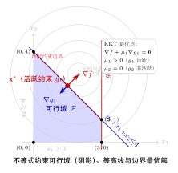
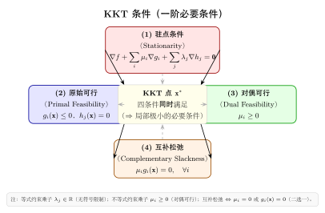

# 第8章：不等式约束优化（融合版）

> **前置知识**：第4章（最优性条件）、第7章（等式约束优化与 Lagrange 乘子法）
>
> **本章难度**：★★★★☆
>
> **预计学习时间**：6-8 小时
>
> **本文件**：融合"原版严格推导 + 速记 / 套路 / 自测"。保留原版完整正文 + 在最前置一例速记 / 思维路径 + 最后追加方法总结与自测。

> **一例速记**：
> **可行域**：满足所有不等式约束 $g_i(\mathbf{x}) \leq 0$ 与等式约束 $h_j(\mathbf{x})=0$ 的点集 $\mathcal{F}$。
> **活跃约束**：在最优解处 $g_i(\mathbf{x}^*)=0$（边界上）；非活跃：$g_i(\mathbf{x}^*)<0$（内部）。
> **KKT 四条件**：① 驻点 $\nabla f + \sum\mu_i\nabla g_i + \sum\lambda_j\nabla h_j = 0$；② 原始可行 $g_i \leq 0, h_j=0$；③ 对偶可行 $\mu_i \geq 0$；④ 互补松弛 $\mu_i g_i = 0$。
> **互补松弛直觉**：约束"有余量"（$g_i < 0$）则乘子必须为零（$\mu_i=0$）；乘子为正（$\mu_i>0$）则约束必须活跃（$g_i=0$）——两者"互补"。
> **AI 关联**：SVM 的 hinge loss 对偶即 KKT 的具体实例，支持向量对应活跃约束（$\mu_i > 0$）。

---

## 引入：带限制的最短路

> **题目**：在平面上，点 $P$ 距原点的距离最小化，但 $P$ 必须满足 $x \geq 1$ 且 $y \geq 0$，即 $P$ 在第一象限内 $x$ 轴右侧。

请先停下来想一想：若没有任何限制，离原点最近的点就是原点自身。但加了约束 $x \geq 1$，原点已不可行。最优解在哪里？

直觉：约束 $x=1$ 是一条竖直线；在这条线上，离原点最近的点当然是 $(1,0)$——让 $y=0$ 最小化距离。这里 $x=1$ 是**活跃约束**（边界上），$y \geq 0$ 是**非活跃约束**（$y=0>$ 内点）。

KKT 条件正是把"活跃约束起作用、非活跃约束不起作用"这个几何直觉精确化的工具。

---

## 思维路径还原（解题者的内心独白）

> "目标 $f = x^2 + y^2$，约束 $g_1 = 1-x \leq 0$（即 $x \geq 1$），$g_2 = -y \leq 0$（即 $y \geq 0$）。
>
> **写 KKT 条件**：
> - 驻点：$(2x, 2y) + \mu_1(-1, 0) + \mu_2(0, -1) = 0$
>   即 $2x - \mu_1 = 0,\ 2y - \mu_2 = 0$。
> - 原始可行：$x \geq 1, y \geq 0$。
> - 对偶可行：$\mu_1 \geq 0, \mu_2 \geq 0$。
> - 互补松弛：$\mu_1(1-x) = 0,\ \mu_2(-y) = 0$。
>
> **分情形讨论**（互补松弛是关键）：
>
> 情形 A：两约束均非活跃 $\to$ $\mu_1=\mu_2=0$ $\to$ $2x=0, 2y=0$ $\to$ $(0,0)$，但 $(0,0)$ 不满足 $x \geq 1$，矛盾。
>
> 情形 B：$g_1$ 活跃（$x=1$），$g_2$ 非活跃（$\mu_2=0$） $\to$ $2\cdot1 = \mu_1$，$\mu_1=2>0$ ✓；$2y=0 \Rightarrow y=0 \geq 0$ ✓。候选点 $(1,0)$，$f=1$。
>
> 情形 C：两约束均活跃 $\to$ $x=1, y=0$ $\to$ 与情形 B 相同。
>
> 最优解 $(1,0)$，$f^*=1$。互补松弛在此精确地筛选出了唯一的 KKT 点。"

---

## 学习目标

学完本章后，你将能够：

1. **建立不等式约束优化的标准形式**，理解可行域的几何结构，区分活跃约束与非活跃约束
2. **推导并应用 KKT 条件**：掌握梯度条件、原始可行性、对偶可行性和互补松弛条件的完整含义
3. **理解互补松弛性的几何直觉**，利用互补松弛条件分析约束的"松紧"状态
4. **认识主要约束规范（CQ）**，理解 LICQ 和 Slater 条件，知晓 KKT 条件成立的前提
5. **掌握二阶充分条件**，利用约化 Hessian 判断 KKT 点是否为严格局部极小

---

## 8.1 不等式约束问题

### 8.1.1 标准问题形式

本章研究的一般约束优化问题为：

$$\boxed{\begin{aligned}
\min_{\mathbf{x} \in \mathbb{R}^n} \quad & f(\mathbf{x}) \\
\text{s.t.} \quad & g_i(\mathbf{x}) \leq 0, \quad i = 1, \ldots, m \\
& h_j(\mathbf{x}) = 0, \quad j = 1, \ldots, p
\end{aligned}}$$

其中：
- $f: \mathbb{R}^n \to \mathbb{R}$ 为**目标函数**（objective function）
- $g_i: \mathbb{R}^n \to \mathbb{R}$ 为**不等式约束函数**（inequality constraint）
- $h_j: \mathbb{R}^n \to \mathbb{R}$ 为**等式约束函数**（equality constraint）

**可行域**定义为满足所有约束的点集：

$$\mathcal{F} = \{\mathbf{x} \in \mathbb{R}^n \mid g_i(\mathbf{x}) \leq 0,\; i=1,\ldots,m;\; h_j(\mathbf{x})=0,\; j=1,\ldots,p\}$$

**假设**：本章假设 $f, g_i, h_j$ 均为二阶连续可微函数（$C^2$ 类）。

### 8.1.2 活跃约束与非活跃约束

**定义 8.1（活跃约束）**
设 $\mathbf{x}^* \in \mathcal{F}$。不等式约束 $g_i$ 在 $\mathbf{x}^*$ 处称为：
- **活跃约束**（active constraint）：若 $g_i(\mathbf{x}^*) = 0$
- **非活跃约束**（inactive constraint）：若 $g_i(\mathbf{x}^*) < 0$

活跃约束的下标集合称为**活跃集**（active set）：

$$\mathcal{A}(\mathbf{x}^*) = \{i \mid g_i(\mathbf{x}^*) = 0\}$$

**几何直觉：** 活跃约束意味着点 $\mathbf{x}^*$ 恰好位于约束边界上；非活跃约束则意味着点在约束的内部，该约束对当前点的局部行为不构成限制。

### 8.1.3 几何例子

**例 8.1** 考察二维问题：

$$\min_{x_1, x_2} \quad (x_1 - 2)^2 + (x_2 - 2)^2 \quad \text{s.t.} \quad x_1 + x_2 \leq 3,\; x_1 \geq 0,\; x_2 \geq 0.$$

无约束极小为 $(2, 2)$，但 $2 + 2 = 4 > 3$，违反第一个约束。因此最优解在约束边界 $x_1 + x_2 = 3$ 上（活跃约束），通过 Lagrange 分析可得 $\mathbf{x}^* = (3/2, 3/2)$。

此时 $g_1(\mathbf{x}^*) = 0$（活跃），$g_2(\mathbf{x}^*) = -3/2 < 0$，$g_3(\mathbf{x}^*) = -3/2 < 0$（非活跃）。

### 8.1.4 约束化简的思路

不等式约束问题的难点在于：**哪些约束在最优解处活跃是未知的**。如果我们事先知道活跃集 $\mathcal{A}(\mathbf{x}^*)$，则问题退化为等式约束问题（第7章的情形）。KKT 条件正是在不知道活跃集的情况下，给出最优性的必要条件。

---

## 8.2 KKT 条件

### 8.2.1 Lagrange 函数

对一般约束问题，定义**Lagrange 函数**（Lagrangian）：

$$\mathcal{L}(\mathbf{x}, \boldsymbol{\mu}, \boldsymbol{\lambda}) = f(\mathbf{x}) + \sum_{i=1}^{m} \mu_i g_i(\mathbf{x}) + \sum_{j=1}^{p} \lambda_j h_j(\mathbf{x})$$

其中：
- $\mu_i \geq 0$ 为不等式约束 $g_i$ 的 **KKT 乘子**（亦称对偶变量）
- $\lambda_j \in \mathbb{R}$ 为等式约束 $h_j$ 的 **Lagrange 乘子**

**关键区别**：不等式约束的乘子要求 $\mu_i \geq 0$（对偶可行性），而等式约束乘子无符号约束。

### 8.2.2 KKT 条件的推导动机

设 $\mathbf{x}^*$ 是局部极小点。对于非活跃约束 $g_i(\mathbf{x}^*) < 0$，在 $\mathbf{x}^*$ 的某邻域内该约束不起作用，因此对局部分析无影响，可令 $\mu_i = 0$。

对于活跃约束 $g_i(\mathbf{x}^*) = 0$，情况类似于等式约束，但需额外考虑可行下降方向。直觉上，若存在方向 $\mathbf{d}$ 使得 $f$ 减小（$\nabla f^\top \mathbf{d} < 0$）且不违反活跃约束（$\nabla g_i^\top \mathbf{d} \leq 0$），则 $\mathbf{x}^*$ 不是极小点。

**从"无可行下降方向"到乘子非负（Farkas 引理）**：把上面的直觉变成推导。$\mathbf{x}^*$ 是局部极小的必要条件，就是**不存在**可行下降方向——即不存在 $\mathbf{d}$ 同时满足

$$\nabla f(\mathbf{x}^*)^\top \mathbf{d} < 0, \qquad \nabla g_i(\mathbf{x}^*)^\top \mathbf{d} \leq 0 \ \ (i \in \mathcal{A}).$$

（先只看活跃不等式约束；等式约束 $h_j=0$ 可拆成 $h_j\le0$ 与 $-h_j\le0$ 两个不等式同理纳入。）"该线性不等式组无解"恰能由 **Farkas 引理**（择一定理）翻译成"存在非负组合"：

> **Farkas 引理（择一形式）**：给定向量 $\mathbf{a}$ 与一组 $\{\mathbf{b}_i\}$，以下两命题**恰有一个**成立：
> ① 存在 $\mathbf{d}$ 使 $\mathbf{a}^\top\mathbf{d}<0$ 且对所有 $i$ 有 $\mathbf{b}_i^\top\mathbf{d}\le0$；
> ② 存在 $\mu_i\ge0$ 使 $\mathbf{a}+\sum_i\mu_i\mathbf{b}_i=\mathbf{0}$（即 $-\mathbf{a}$ 是 $\{\mathbf{b}_i\}$ 的**非负**线性组合）。

取 $\mathbf{a}=\nabla f(\mathbf{x}^*)$、$\mathbf{b}_i=\nabla g_i(\mathbf{x}^*)$。既然 $\mathbf{x}^*$ 是极小点，命题 ① 不成立，故 ② 必成立：存在 $\mu_i\ge0$ 使 $\nabla f(\mathbf{x}^*)+\sum_{i\in\mathcal{A}}\mu_i\nabla g_i(\mathbf{x}^*)=\mathbf{0}$。对非活跃约束补充令 $\mu_i=0$，即同时得到**梯度条件**与**互补松弛** $\mu_i g_i=0$；而 ② 中的 $\mu_i\ge0$ **正是对偶可行性（$\mu_i^*\ge0$）的来源**——这解释了为什么不等式约束的乘子必须非负、而等式约束乘子无符号限制（等式约束的可行方向双向均可走，对应乘子可正可负）。该推导以活跃约束梯度满足约束规范（如 LICQ，见 8.4 节）为前提。

### 8.2.3 KKT 条件（一阶必要条件）

**定理 8.1（KKT 必要条件）**
设 $\mathbf{x}^*$ 是问题的局部极小点，且在 $\mathbf{x}^*$ 处某约束规范（见 8.4 节）成立。则存在乘子向量 $\boldsymbol{\mu}^* \in \mathbb{R}^m$，$\boldsymbol{\lambda}^* \in \mathbb{R}^p$，使得以下四组条件同时成立：

**（一）梯度条件（Stationarity）：**

$$\nabla f(\mathbf{x}^*) + \sum_{i=1}^{m} \mu_i^* \nabla g_i(\mathbf{x}^*) + \sum_{j=1}^{p} \lambda_j^* \nabla h_j(\mathbf{x}^*) = \mathbf{0}$$

即 $\nabla_{\mathbf{x}} \mathcal{L}(\mathbf{x}^*, \boldsymbol{\mu}^*, \boldsymbol{\lambda}^*) = \mathbf{0}$。

**（二）原始可行性（Primal Feasibility）：**

$$g_i(\mathbf{x}^*) \leq 0, \quad i = 1, \ldots, m$$
$$h_j(\mathbf{x}^*) = 0, \quad j = 1, \ldots, p$$

**（三）对偶可行性（Dual Feasibility）：**

$$\mu_i^* \geq 0, \quad i = 1, \ldots, m$$

**（四）互补松弛条件（Complementary Slackness）：**

$$\mu_i^* \cdot g_i(\mathbf{x}^*) = 0, \quad i = 1, \ldots, m$$

满足上述四组条件的点 $\mathbf{x}^*$ 称为 **KKT 点**，对应乘子 $(\boldsymbol{\mu}^*, \boldsymbol{\lambda}^*)$ 称为 **KKT 乘子**。

### 8.2.4 梯度条件的几何解释

梯度条件

$$\nabla f(\mathbf{x}^*) = -\sum_{i \in \mathcal{A}} \mu_i^* \nabla g_i(\mathbf{x}^*) - \sum_{j=1}^{p} \lambda_j^* \nabla h_j(\mathbf{x}^*)$$

表明：**在极小点处，目标函数的梯度必须可以用活跃约束梯度的非负线性组合（加上等式约束梯度的线性组合）来表示**。

几何上，$-\nabla f(\mathbf{x}^*)$ 必须在活跃不等式约束梯度和等式约束梯度张成的**法锥**（normal cone）内。这里的法锥定义为

$$N(\mathbf{x}^*) = \Big\{\, \sum_{i\in\mathcal{A}}\mu_i\,\nabla g_i(\mathbf{x}^*) + \sum_{j=1}^{p}\lambda_j\,\nabla h_j(\mathbf{x}^*)\ :\ \mu_i\ge 0,\ \lambda_j\in\mathbb{R} \,\Big\},$$

即活跃约束梯度的"非负锥"再加上等式约束梯度张成的子空间——它正是可行域在 $\mathbf{x}^*$ 处所有"向外法向"的集合。梯度条件 $-\nabla f(\mathbf{x}^*)\in N(\mathbf{x}^*)$ 说的就是：目标函数的下降方向 $-\nabla f$ 被约束的法向完全"顶住"，再无可行的下降余地。

**一维直觉：** 若在可行域边界 $g(\mathbf{x}^*) = 0$ 处极小，则 $\nabla f$ 必须指向约束外侧（否则可沿约束内侧继续减小 $f$），即 $\nabla f = -\mu \nabla g$，$\mu > 0$。

### 8.2.5 完整例子：二维不等式约束问题

**例 8.2** 求解：

$$\min_{x_1, x_2} \quad f = x_1^2 + x_2^2 \quad \text{s.t.} \quad g: x_1 + x_2 - 1 \leq 0.$$

**分析：** 无约束极小为原点 $(0,0)$，满足 $g(0,0) = -1 < 0$（约束非活跃），故原点即为全局极小，KKT 乘子 $\mu^* = 0$。

**验证 KKT 条件：**
- 梯度条件：$\nabla f + \mu \nabla g = (0,0) + 0 \cdot (1,1) = (0,0)$。✓
- 原始可行：$0 + 0 - 1 = -1 \leq 0$。✓
- 对偶可行：$\mu^* = 0 \geq 0$。✓
- 互补松弛：$0 \cdot (-1) = 0$。✓

**例 8.3** 将上例约束改为 $g: x_1 + x_2 - 1 \geq 0$（等价地 $-(x_1+x_2-1) \leq 0$）。

此时无约束极小 $(0,0)$ 违反约束，最优解在边界 $x_1 + x_2 = 1$ 上。

令 $g'(\mathbf{x}) = 1 - x_1 - x_2 \leq 0$（改写为标准形式）。

KKT 条件：

$$\begin{pmatrix} 2x_1 \\ 2x_2 \end{pmatrix} + \mu \begin{pmatrix} -1 \\ -1 \end{pmatrix} = \mathbf{0}, \quad 1 - x_1 - x_2 \leq 0, \quad \mu \geq 0, \quad \mu(1 - x_1 - x_2) = 0.$$

由梯度条件：$x_1 = x_2 = \mu/2$。由互补松弛及约束活跃（因无约束极小在可行域外），$1 - x_1 - x_2 = 0$，解得 $x_1 = x_2 = 1/2$，$\mu = 1 > 0$。KKT 点为 $(1/2, 1/2)$，目标值 $f^* = 1/2$。

---

## 8.3 互补松弛性

### 8.3.1 互补松弛的含义

互补松弛条件 $\mu_i^* \cdot g_i(\mathbf{x}^*) = 0$ 意味着，对每个不等式约束，以下两种情形**至少有一个成立**：

| 情形 | 条件 | 解释 |
|------|------|------|
| **约束非活跃** | $g_i(\mathbf{x}^*) < 0$ | 点在约束内部，约束"松弛"，此时 $\mu_i^* = 0$ |
| **乘子为零** | $\mu_i^* = 0$ | 约束对最优解不施加"压力"，即使活跃也不影响梯度平衡 |
| **两者均成立** | $g_i(\mathbf{x}^*) < 0$ 且 $\mu_i^* = 0$ | 约束完全不活跃 |

**不可能**：$g_i(\mathbf{x}^*) < 0$ 且 $\mu_i^* > 0$（内部点有正乘子——物理上不合理）。

### 8.3.2 严格互补松弛

**定义 8.2（严格互补松弛）**
若对所有 $i \in \mathcal{A}(\mathbf{x}^*)$，均有 $\mu_i^* > 0$，则称严格互补松弛条件（strict complementarity）在 $\mathbf{x}^*$ 处成立。

严格互补松弛保证了活跃约束的乘子严格为正，是许多精细分析（如二阶条件、灵敏度分析）的正则性假设。

### 8.3.3 互补松弛的经济学解释

在资源分配问题中，不等式约束 $g_i(\mathbf{x}) \leq 0$ 可理解为"资源 $i$ 的容量限制"：

- $g_i(\mathbf{x}^*) < 0$：资源 $i$ **未被完全利用**（有剩余），边际价值 $\mu_i^* = 0$（增加容量不带来收益）。
- $g_i(\mathbf{x}^*) = 0$：资源 $i$ **被完全耗尽**（紧张），边际价值 $\mu_i^* \geq 0$（增加容量可能带来收益）。

互补松弛正是"不浪费有价值资源"原则的数学表达。

### 8.3.4 互补松弛与支撑向量机

互补松弛在机器学习中有重要应用。以**支撑向量机（SVM）**为例：

$$\min_{\mathbf{w}, b} \quad \frac{1}{2}\|\mathbf{w}\|^2 \quad \text{s.t.} \quad y_i(\mathbf{w}^\top \mathbf{x}_i + b) \geq 1, \quad i=1,\ldots,N.$$

改写为标准形式 $g_i = 1 - y_i(\mathbf{w}^\top \mathbf{x}_i + b) \leq 0$，KKT 互补松弛为：

$$\mu_i^* [1 - y_i(\mathbf{w}^\top \mathbf{x}_i + b)] = 0.$$

这说明：
- **支撑向量**（$\mu_i^* > 0$）：必然满足 $y_i(\mathbf{w}^\top \mathbf{x}_i + b) = 1$（恰好在间隔边界上）。
- **非支撑向量**（$y_i(\mathbf{w}^\top \mathbf{x}_i + b) > 1$）：必然 $\mu_i^* = 0$，对最优解无贡献。

SVM 的稀疏性（仅少数支撑向量决定分类器）正是互补松弛的直接推论。

---

## 8.4 约束规范

### 8.4.1 为什么需要约束规范

KKT 条件是**必要条件**，但并不总是成立——需要在极小点处满足某种**约束规范**（Constraint Qualification, CQ），才能保证 KKT 乘子的存在性。

**反例（违反约束规范）：**

$$\min_{x_1, x_2} \quad x_2 \quad \text{s.t.} \quad g: x_1^2 - x_2 \leq 0,\; x_2 \leq 0.$$

最优解为 $\mathbf{x}^* = (0, 0)$。两个约束在 $\mathbf{x}^*$ 处均活跃，但 $\nabla g_1(0,0) = (0,-1)$，$\nabla g_2(0,0) = (0,1)$，两者方向相反，线性相关。KKT 条件 $\nabla f + \mu_1 \nabla g_1 + \mu_2 \nabla g_2 = 0$ 变为 $(0,1) + \mu_1(0,-1) + \mu_2(0,1) = 0$，即 $-\mu_1 + \mu_2 = -1$，$\mu_1, \mu_2 \geq 0$ 无解。此例违反 LICQ。

### 8.4.2 线性无关约束规范（LICQ）

**定义 8.3（LICQ）**
在点 $\mathbf{x}^*$ 处，称**线性无关约束规范**（Linear Independence Constraint Qualification）成立，若活跃约束的梯度集合

$$\{\nabla g_i(\mathbf{x}^*) \mid i \in \mathcal{A}(\mathbf{x}^*)\} \cup \{\nabla h_j(\mathbf{x}^*) \mid j=1,\ldots,p\}$$

线性无关。

**定理 8.2（LICQ 保证 KKT）**
若 $\mathbf{x}^*$ 是局部极小点且 LICQ 在 $\mathbf{x}^*$ 处成立，则存在唯一 KKT 乘子 $(\boldsymbol{\mu}^*, \boldsymbol{\lambda}^*)$。

LICQ 是最常用的约束规范，在大多数实际问题中成立。

### 8.4.3 Slater 条件（凸问题）

对于**凸优化问题**（$f, g_i$ 均为凸函数，$h_j$ 为仿射函数），有更弱的约束规范：

**定义 8.4（Slater 条件）**
若存在 $\tilde{\mathbf{x}} \in \mathbb{R}^n$（称为**Slater 点**）使得：

$$g_i(\tilde{\mathbf{x}}) < 0, \quad \forall\, i=1,\ldots,m, \qquad h_j(\tilde{\mathbf{x}}) = 0, \quad \forall\, j=1,\ldots,p,$$

则称 Slater 条件成立。

**定理 8.3（Slater 条件与强对偶性）**
若凸优化问题满足 Slater 条件，则：
1. KKT 条件是极小点的**充要条件**（不仅是必要条件）。
2. 强对偶性成立：原始问题与对偶问题的最优值相等（对偶间隙为零）。

**Slater 条件 vs LICQ 的比较：**

| 特征 | LICQ | Slater 条件 |
|------|------|-------------|
| 适用范围 | 一般光滑问题 | 凸问题 |
| 强度 | 较强（逐点线性无关）| 较弱（只需一个严格内点）|
| 乘子唯一性 | 保证唯一 | 不保证唯一 |
| 与对偶理论 | 关系不直接 | 直接推出强对偶 |

### 8.4.4 其他常见约束规范

| 约束规范 | 条件 | 特点 |
|----------|------|------|
| **LICQ** | 活跃约束梯度线性无关 | 最强，乘子唯一 |
| **MFCQ**（Mangasarian-Fromovitz）| 存在方向使所有活跃约束梯度严格负 | 弱于 LICQ，乘子可不唯一 |
| **CRCQ**（常秩约束规范）| 活跃约束梯度的秩在邻域内恒定 | 介于 LICQ 与 MFCQ 之间 |
| **Slater 条件** | 存在严格可行点（凸问题专用）| 最弱，最易验证 |

在实际应用中，**通常先验证 Slater 条件**（凸问题）或**假设 LICQ 成立**，再直接写出 KKT 条件。

---

## 8.5 二阶充分条件

### 8.5.1 KKT 点的进一步分析

KKT 条件是（在约束规范下的）必要条件，不是充分条件。KKT 点可能是极小点、极大点或鞍点。二阶条件提供了充分性判断。

### 8.5.2 临界锥

**定义 8.5（临界锥）**
设 $\mathbf{x}^*$ 是 KKT 点，乘子为 $(\boldsymbol{\mu}^*, \boldsymbol{\lambda}^*)$。**临界锥** $\mathcal{C}(\mathbf{x}^*, \boldsymbol{\mu}^*)$ 定义为：

$$\mathcal{C}(\mathbf{x}^*, \boldsymbol{\mu}^*) = \left\{ \mathbf{d} \in \mathbb{R}^n \;\middle|\;
\begin{array}{l}
\nabla h_j(\mathbf{x}^*)^\top \mathbf{d} = 0, \quad j=1,\ldots,p \\
\nabla g_i(\mathbf{x}^*)^\top \mathbf{d} = 0, \quad i \in \mathcal{A}(\mathbf{x}^*),\; \mu_i^* > 0 \\
\nabla g_i(\mathbf{x}^*)^\top \mathbf{d} \leq 0, \quad i \in \mathcal{A}(\mathbf{x}^*),\; \mu_i^* = 0
\end{array}
\right\}$$

临界锥是"可行下降方向"候选集的线性化近似——在这些方向上，一阶条件既不能排除也不能确认极小性，需要二阶信息。

### 8.5.3 约化 Hessian

**定义 8.6（Lagrange 函数的 Hessian）**

$$\nabla^2_{\mathbf{x}\mathbf{x}} \mathcal{L}(\mathbf{x}^*, \boldsymbol{\mu}^*, \boldsymbol{\lambda}^*) = \nabla^2 f(\mathbf{x}^*) + \sum_{i=1}^{m} \mu_i^* \nabla^2 g_i(\mathbf{x}^*) + \sum_{j=1}^{p} \lambda_j^* \nabla^2 h_j(\mathbf{x}^*)$$

这是 Lagrange 函数对 $\mathbf{x}$ 的二阶导数（在 KKT 点处计算）。

### 8.5.4 二阶充分条件

**定理 8.4（二阶充分条件，SOSC）**
设 $(\mathbf{x}^*, \boldsymbol{\mu}^*, \boldsymbol{\lambda}^*)$ 满足 KKT 条件。若

$$\mathbf{d}^\top \nabla^2_{\mathbf{x}\mathbf{x}} \mathcal{L}(\mathbf{x}^*, \boldsymbol{\mu}^*, \boldsymbol{\lambda}^*) \mathbf{d} > 0 \quad \forall\, \mathbf{d} \in \mathcal{C}(\mathbf{x}^*, \boldsymbol{\mu}^*) \setminus \{\mathbf{0}\},$$

则 $\mathbf{x}^*$ 是问题的**严格局部极小点**。

**直觉：** 在临界锥方向（"可疑方向"）上，Lagrange 函数的 Hessian 正定，则函数值沿这些方向是严格上凸的，不存在下降方向。

### 8.5.5 二阶必要条件

**定理 8.5（二阶必要条件，SONC）**
设 $\mathbf{x}^*$ 是局部极小点，LICQ 成立，$(\boldsymbol{\mu}^*, \boldsymbol{\lambda}^*)$ 为 KKT 乘子，则

$$\mathbf{d}^\top \nabla^2_{\mathbf{x}\mathbf{x}} \mathcal{L}(\mathbf{x}^*, \boldsymbol{\mu}^*, \boldsymbol{\lambda}^*) \mathbf{d} \geq 0 \quad \forall\, \mathbf{d} \in \mathcal{C}(\mathbf{x}^*, \boldsymbol{\mu}^*).$$

### 8.5.6 凸问题的特殊情形

**定理 8.6（凸问题的 KKT 充要条件）**
若 $f, g_i$ 均为凸函数，$h_j$ 为仿射函数，且 Slater 条件成立，则：

$$\mathbf{x}^* \text{ 是全局极小点} \iff (\mathbf{x}^*, \boldsymbol{\mu}^*, \boldsymbol{\lambda}^*) \text{ 满足 KKT 条件（某乘子存在）}$$

此时 SOSC 自动满足（凸函数的 Hessian 半正定），无需单独验证。

### 8.5.7 综合示例

**例 8.4** 分析问题：

$$\min_{x_1, x_2} \quad f = x_1^2 + x_2^2 - 2x_1 \quad \text{s.t.} \quad g: x_1^2 + x_2^2 - 1 \leq 0.$$

**步骤 1：无约束极小为 $(1, 0)$，满足 $g(1,0) = 1 - 1 = 0$（约束活跃），需用 KKT。**

**步骤 2：写出 KKT 条件：**

$$\begin{pmatrix} 2x_1 - 2 \\ 2x_2 \end{pmatrix} + \mu \begin{pmatrix} 2x_1 \\ 2x_2 \end{pmatrix} = \mathbf{0}, \quad x_1^2 + x_2^2 \leq 1, \quad \mu \geq 0, \quad \mu(x_1^2 + x_2^2 - 1) = 0.$$

**情形 1（约束非活跃，$\mu = 0$）：** $2x_1 - 2 = 0$，$2x_2 = 0$，得 $(1, 0)$。但 $g(1,0) = 0$（边界），矛盾。

**情形 2（约束活跃，$x_1^2 + x_2^2 = 1$）：** 由梯度条件 $x_2(1+\mu) = 0$，知 $x_2 = 0$ 或 $\mu = -1$（后者违反对偶可行性）。故 $x_2 = 0$，$x_1 = \pm 1$。

- $(x_1, x_2) = (1, 0)$：梯度条件给出 $\mu = 0$，满足所有 KKT 条件。
- $(x_1, x_2) = (-1, 0)$：梯度条件给出 $\mu = -1 < 0$，违反对偶可行性，非 KKT 点。

**步骤 3：验证 SOSC（$\mathbf{x}^* = (1,0)$，$\mu^* = 0$）：**

$$\nabla^2_{\mathbf{x}\mathbf{x}} \mathcal{L} = \begin{pmatrix} 2 & 0 \\ 0 & 2 \end{pmatrix} + 0 \cdot \begin{pmatrix} 2 & 0 \\ 0 & 2 \end{pmatrix} = \begin{pmatrix} 2 & 0 \\ 0 & 2 \end{pmatrix}.$$

临界锥：$\mu^* = 0$（退化情形，活跃约束 $g$ 约束方向 $\nabla g = (2,0)$）。临界锥 $\mathcal{C} = \{\mathbf{d} \mid \nabla g^\top \mathbf{d} \leq 0\} = \{d_1 \leq 0\}$（结合 SOSC 需在非零锥向量处验证）。

$\nabla^2 \mathcal{L}$ 正定，SOSC 成立，故 $(1, 0)$ 是严格局部极小点，$f^* = 1 - 2 = -1$。

---

## 本章小结

| 概念 | 数学表达 | 核心作用 |
|------|---------|---------|
| **标准不等式约束问题** | $\min f(\mathbf{x})$ s.t. $g_i \leq 0$, $h_j = 0$ | 约束优化的统一框架 |
| **活跃约束集** | $\mathcal{A}(\mathbf{x}^*) = \{i \mid g_i(\mathbf{x}^*) = 0\}$ | 识别在极小点处"起作用"的约束 |
| **Lagrange 函数** | $\mathcal{L} = f + \sum \mu_i g_i + \sum \lambda_j h_j$ | KKT 条件的统一表达载体 |
| **梯度条件** | $\nabla_{\mathbf{x}} \mathcal{L} = \mathbf{0}$ | 一阶稳定性：梯度由约束法向平衡 |
| **原始可行性** | $g_i(\mathbf{x}^*) \leq 0$，$h_j(\mathbf{x}^*) = 0$ | 解在可行域内 |
| **对偶可行性** | $\mu_i^* \geq 0$ | 不等式乘子非负 |
| **互补松弛** | $\mu_i^* g_i(\mathbf{x}^*) = 0$ | 非活跃约束的乘子为零 |
| **LICQ** | 活跃约束梯度线性无关 | 保证 KKT 乘子存在且唯一 |
| **Slater 条件** | 凸问题存在严格可行点 | 凸问题的弱约束规范，推出强对偶 |
| **SOSC** | $\mathbf{d}^\top \nabla^2 \mathcal{L}\, \mathbf{d} > 0$，$\forall \mathbf{d} \in \mathcal{C} \setminus\{\mathbf{0}\}$ | 充分判断严格局部极小 |
| **凸问题 KKT** | Slater + KKT $\iff$ 全局极小 | 凸优化的核心判别定理 |

---

## 深度学习应用：约束神经网络与投影梯度法

### 背景

深度学习中常见以下约束场景：
1. **权重裁剪（Weight Clipping）**：$\|\mathbf{w}\|_\infty \leq c$（Wasserstein GAN）
2. **谱范数约束**：$\sigma_{\max}(W) \leq 1$（谱归一化）
3. **概率单纯形约束**：$\mathbf{w} \geq 0$，$\mathbf{1}^\top \mathbf{w} = 1$（注意力权重）
4. **能量约束**：$\|\mathbf{w}\|_2 \leq R$（$L_2$ 球约束）

这些约束可通过 KKT 条件分析最优性，并用**投影梯度法**高效求解。

### 投影梯度法的原理

投影梯度法（Projected Gradient Descent, PGD）的更新规则为：

$$\mathbf{x}^{(k+1)} = \mathcal{P}_{\mathcal{F}}\!\left(\mathbf{x}^{(k)} - \eta \nabla f(\mathbf{x}^{(k)})\right)$$

其中 $\mathcal{P}_{\mathcal{F}}$ 是到可行域 $\mathcal{F}$ 的**正交投影**：

$$\mathcal{P}_{\mathcal{F}}(\mathbf{y}) = \arg\min_{\mathbf{x} \in \mathcal{F}} \|\mathbf{x} - \mathbf{y}\|_2^2$$

**KKT 与投影的关系：** 投影操作本质上在求解一个有约束的二次规划，其 KKT 条件正好给出投影点满足的最优性条件。

### 常见约束集的投影公式

| 约束集 | 定义 | 投影公式 |
|--------|------|---------|
| $L_2$ 球 | $\|\mathbf{x}\|_2 \leq R$ | $\mathcal{P}(\mathbf{y}) = R \cdot \mathbf{y} / \max(\|\mathbf{y}\|_2, R)$ |
| $L_\infty$ 球 | $\|\mathbf{x}\|_\infty \leq c$ | $\mathcal{P}(\mathbf{y}) = \text{clip}(\mathbf{y}, -c, c)$ |
| 非负象限 | $\mathbf{x} \geq \mathbf{0}$ | $\mathcal{P}(\mathbf{y}) = \max(\mathbf{y}, \mathbf{0})$ |
| 概率单纯形 | $\mathbf{x} \geq \mathbf{0}$，$\mathbf{1}^\top\mathbf{x} = 1$ | Duchi 等人（2008）排序投影算法 |

### 代码实现

```python
import torch
import torch.nn as nn
import numpy as np
import matplotlib.pyplot as plt

# ============================================================
# 1. KKT 条件的数值验证工具
# ============================================================

def check_kkt_conditions(f, g_list, h_list, x_star, mu_star, lam_star,
                          tol=1e-4, verbose=True):
    """
    验证候选点是否满足 KKT 条件

    参数:
        f       : 目标函数（torch 函数）
        g_list  : 不等式约束列表（g_i(x) <= 0）
        h_list  : 等式约束列表（h_j(x) = 0）
        x_star  : 候选极小点
        mu_star : 不等式乘子（与 g_list 等长）
        lam_star: 等式乘子（与 h_list 等长）
        tol     : 数值容差
    """
    x = x_star.clone().detach().requires_grad_(True)
    n = x.shape[0]

    # --- 计算目标梯度 ---
    fx = f(x)
    grad_f = torch.autograd.grad(fx, x, create_graph=False)[0].detach()

    # --- 计算约束梯度 ---
    grad_g = []
    g_vals = []
    for gi in g_list:
        xi = x_star.clone().detach().requires_grad_(True)
        gval = gi(xi)
        gg = torch.autograd.grad(gval, xi)[0].detach()
        grad_g.append(gg)
        g_vals.append(gval.item())

    grad_h = []
    h_vals = []
    for hj in h_list:
        xi = x_star.clone().detach().requires_grad_(True)
        hval = hj(xi)
        gh = torch.autograd.grad(hval, xi)[0].detach()
        grad_h.append(gh)
        h_vals.append(hval.item())

    # --- 检验梯度条件 ---
    stationarity = grad_f.clone()
    for mu_i, gg in zip(mu_star, grad_g):
        stationarity = stationarity + mu_i * gg
    for lam_j, gh in zip(lam_star, grad_h):
        stationarity = stationarity + lam_j * gh
    grad_norm = stationarity.norm().item()

    # --- 检验各条件 ---
    primal_feas_g = all(gv <= tol for gv in g_vals)
    primal_feas_h = all(abs(hv) <= tol for hv in h_vals)
    dual_feas     = all(mu >= -tol for mu in mu_star)
    comp_slack    = all(abs(mu_i * gv) <= tol
                        for mu_i, gv in zip(mu_star, g_vals))

    if verbose:
        print("=" * 55)
        print("KKT 条件验证")
        print("=" * 55)
        print(f"候选点 x*        : {x_star.tolist()}")
        print(f"目标值 f(x*)     : {fx.item():.6f}")
        print(f"  不等式约束 g_i : {[f'{v:.4f}' for v in g_vals]}")
        print(f"  等式约束 h_j   : {[f'{v:.4f}' for v in h_vals]}")
        print(f"  KKT 乘子 μ    : {[f'{v:.4f}' for v in mu_star]}")
        print(f"  KKT 乘子 λ    : {[f'{v:.4f}' for v in lam_star]}")
        print("-" * 55)
        print(f"梯度条件（稳定性）  : ‖∇L‖ = {grad_norm:.2e} "
              f"{'✓' if grad_norm <= tol else '✗'}")
        print(f"原始可行性（g ≤ 0）: "
              f"{'✓' if primal_feas_g else '✗'}")
        print(f"原始可行性（h = 0）: "
              f"{'✓' if primal_feas_h else '✗'}")
        print(f"对偶可行性（μ ≥ 0）: "
              f"{'✓' if dual_feas else '✗'}")
        print(f"互补松弛（μᵢgᵢ=0）: "
              f"{'✓' if comp_slack else '✗'}")
        all_ok = (grad_norm <= tol and primal_feas_g and
                  primal_feas_h and dual_feas and comp_slack)
        print("-" * 55)
        print(f"总体判断: {'满足 KKT 条件' if all_ok else '不满足 KKT 条件'}")

    return {
        "stationarity": grad_norm,
        "primal_g": primal_feas_g,
        "primal_h": primal_feas_h,
        "dual": dual_feas,
        "comp_slack": comp_slack,
    }


# ============================================================
# 2. 验证例 8.3 的 KKT 条件
# ============================================================

print("【验证例 8.3：带不等式约束的二维二次规划】")
# min x1^2 + x2^2, s.t. 1 - x1 - x2 <= 0
f_ex  = lambda x: x[0]**2 + x[1]**2
g_ex  = [lambda x: 1.0 - x[0] - x[1]]  # 1 - x1 - x2 <= 0

x_star  = torch.tensor([0.5, 0.5], dtype=torch.float64)
mu_star = [1.0]     # KKT 乘子
lam_star = []

check_kkt_conditions(f_ex, g_ex, [], x_star, mu_star, lam_star)


# ============================================================
# 3. 投影梯度法（PGD）实现
# ============================================================

def project_l2_ball(x, radius=1.0):
    """投影到 L2 球 ‖x‖₂ ≤ radius"""
    norm = x.norm()
    if norm > radius:
        return x * (radius / norm)
    return x.clone()


def project_linf_ball(x, clip_val=1.0):
    """投影到 L∞ 球 ‖x‖∞ ≤ clip_val（即分量逐个裁剪）"""
    return x.clamp(-clip_val, clip_val)


def project_simplex(v):
    """
    投影到概率单纯形 {x | x >= 0, sum(x) = 1}
    使用 Duchi et al. (2008) 排序算法，O(n log n)
    """
    n = v.shape[0]
    u, _ = torch.sort(v, descending=True)
    cssv = torch.cumsum(u, dim=0)
    rho_candidates = torch.arange(1, n + 1, dtype=v.dtype)
    rho_mask = u > (cssv - 1.0) / rho_candidates
    rho = rho_candidates[rho_mask].max().item()
    theta = (cssv[int(rho) - 1] - 1.0) / rho
    return torch.clamp(v - theta, min=0.0)


def projected_gradient_descent(f, x0, project_fn,
                                lr=0.1, n_steps=200, tol=1e-6):
    """
    投影梯度下降

    参数:
        f          : 目标函数（可微）
        x0         : 初始点
        project_fn : 投影到可行域的函数
        lr         : 步长
        n_steps    : 最大迭代次数
        tol        : 收敛容差（梯度范数）
    返回:
        x_hist : 迭代轨迹
        f_hist : 目标函数值历史
    """
    x = x0.clone().float()
    x_hist = [x.clone()]
    f_hist = []

    for step in range(n_steps):
        x.requires_grad_(True)
        loss = f(x)
        f_hist.append(loss.item())

        grad = torch.autograd.grad(loss, x)[0]
        x = x.detach() - lr * grad.detach()
        x = project_fn(x)
        x_hist.append(x.clone())

        if grad.norm().item() < tol:
            print(f"  收敛于第 {step+1} 步，梯度范数 = {grad.norm().item():.2e}")
            break

    return torch.stack(x_hist), f_hist


# ============================================================
# 4. 实验：约束神经网络权重（L2 球约束和 L∞ 球约束）
# ============================================================

print("\n【实验：投影梯度法求解带约束的二次规划】")

# 目标：min f(x) = (x1 - 3)^2 + (x2 - 3)^2
# 约束：‖x‖₂ ≤ 1（L2 球内）
f_quadratic = lambda x: (x[0] - 3.0)**2 + (x[1] - 3.0)**2

x0 = torch.tensor([0.0, 0.0])

print("\n(a) L2 球约束 ‖x‖₂ ≤ 1：")
traj_l2, loss_l2 = projected_gradient_descent(
    f_quadratic, x0,
    project_fn=lambda x: project_l2_ball(x, radius=1.0),
    lr=0.2, n_steps=100
)
x_opt_l2 = traj_l2[-1]
print(f"  最优点: ({x_opt_l2[0]:.4f}, {x_opt_l2[1]:.4f})")
print(f"  理论解: (1/√2, 1/√2) ≈ ({1/2**0.5:.4f}, {1/2**0.5:.4f})")
print(f"  最优值: {f_quadratic(x_opt_l2):.6f}")

print("\n(b) L∞ 球约束 ‖x‖∞ ≤ 1：")
traj_linf, loss_linf = projected_gradient_descent(
    f_quadratic, x0,
    project_fn=lambda x: project_linf_ball(x, clip_val=1.0),
    lr=0.2, n_steps=100
)
x_opt_linf = traj_linf[-1]
print(f"  最优点: ({x_opt_linf[0]:.4f}, {x_opt_linf[1]:.4f})")
print(f"  理论解: (1.0, 1.0)")
print(f"  最优值: {f_quadratic(x_opt_linf):.6f}")

print("\n(c) 概率单纯形约束 x ≥ 0，Σx = 1（3维）：")
f_simplex = lambda x: (x[0] - 0.5)**2 + (x[1] - 0.3)**2 + (x[2] - 0.8)**2
x0_3d = torch.zeros(3)
traj_simp, loss_simp = projected_gradient_descent(
    f_simplex, x0_3d,
    project_fn=project_simplex,
    lr=0.3, n_steps=200
)
x_opt_s = traj_simp[-1]
print(f"  最优点: {x_opt_s.tolist()}")
print(f"  和为1验证: {x_opt_s.sum().item():.6f}")
print(f"  非负验证: {(x_opt_s >= -1e-6).all().item()}")


# ============================================================
# 5. 实际应用：带权重约束的神经网络（WGAN 权重裁剪）
# ============================================================

print("\n【实际应用：WGAN 风格的权重裁剪（L∞ 约束）】")


class ConstrainedLinear(nn.Module):
    """
    带 L∞ 范数约束的线性层
    约束：‖W‖∞ ≤ clip_val（Wasserstein GAN 的 Lipschitz 约束近似）
    """
    def __init__(self, in_features, out_features, clip_val=0.01):
        super().__init__()
        self.linear = nn.Linear(in_features, out_features, bias=False)
        self.clip_val = clip_val

    def clamp_weights(self):
        """执行投影：将权重裁剪到 [-clip_val, clip_val]"""
        with torch.no_grad():
            self.linear.weight.clamp_(-self.clip_val, self.clip_val)

    def forward(self, x):
        return self.linear(x)


class WGANCritic(nn.Module):
    """WGAN 判别器（critic）：使用权重裁剪维持 Lipschitz 约束"""
    def __init__(self, input_dim=2, hidden_dim=16, clip_val=0.01):
        super().__init__()
        self.layers = nn.Sequential(
            ConstrainedLinear(input_dim, hidden_dim, clip_val),
            nn.LeakyReLU(0.2),
            ConstrainedLinear(hidden_dim, hidden_dim, clip_val),
            nn.LeakyReLU(0.2),
            ConstrainedLinear(hidden_dim, 1, clip_val)
        )
        self.clip_val = clip_val

    def forward(self, x):
        return self.layers(x)

    def clamp_all_weights(self):
        """训练步后对所有层执行权重裁剪（投影到 L∞ 球）"""
        for module in self.modules():
            if isinstance(module, ConstrainedLinear):
                module.clamp_weights()


# 演示权重裁剪的效果
torch.manual_seed(42)
critic = WGANCritic(input_dim=2, hidden_dim=16, clip_val=0.01)

print("  裁剪前权重统计（第一层）:")
w_before = list(critic.modules())[2].linear.weight.data
print(f"    max|W| = {w_before.abs().max().item():.4f}")
print(f"    ‖W‖∞ = {w_before.abs().max().item():.4f}")

# 执行 "训练步" + 裁剪
fake_loss = critic(torch.randn(16, 2)).mean()
fake_loss.backward()

# KKT 视角：约束 ‖W‖∞ ≤ 0.01，梯度步后立即投影
critic.clamp_all_weights()

print("  裁剪后权重统计（第一层）:")
w_after = list(critic.modules())[2].linear.weight.data
print(f"    max|W| = {w_after.abs().max().item():.6f}")
print(f"    ‖W‖∞ = {w_after.abs().max().item():.6f}  (≤ 0.01 ✓)")


# ============================================================
# 6. 可视化：投影梯度法轨迹与约束边界
# ============================================================

fig, axes = plt.subplots(1, 2, figsize=(12, 5))

# 绘制等高线和轨迹
x1_range = np.linspace(-1.5, 3.5, 300)
x2_range = np.linspace(-1.5, 3.5, 300)
X1, X2 = np.meshgrid(x1_range, x2_range)
F = (X1 - 3)**2 + (X2 - 3)**2

for ax_idx, (ax, traj, title, proj_shape) in enumerate(zip(
    axes,
    [traj_l2.numpy(), traj_linf.numpy()],
    ['L₂ 球约束（‖x‖₂ ≤ 1）', 'L∞ 球约束（‖x‖∞ ≤ 1）'],
    ['circle', 'square']
)):
    cs = ax.contourf(X1, X2, F, levels=20, cmap='Blues', alpha=0.7)
    ax.contour(X1, X2, F, levels=20, colors='k', linewidths=0.3, alpha=0.4)

    # 绘制约束边界
    if proj_shape == 'circle':
        theta = np.linspace(0, 2 * np.pi, 300)
        ax.plot(np.cos(theta), np.sin(theta), 'r-', linewidth=2,
                label='约束边界 ‖x‖₂=1')
        ax.fill(np.cos(theta), np.sin(theta), alpha=0.15, color='red')
    else:
        sq = plt.Rectangle((-1, -1), 2, 2, fill=True,
                            facecolor='red', alpha=0.15,
                            edgecolor='red', linewidth=2, label='约束域 ‖x‖∞≤1')
        ax.add_patch(sq)

    # 绘制轨迹
    ax.plot(traj[:, 0], traj[:, 1], 'go-', markersize=3,
            linewidth=1.5, alpha=0.7, label='PGD 轨迹')
    ax.scatter(traj[0, 0], traj[0, 1], c='blue', s=80, zorder=5,
               label='初始点', marker='s')
    ax.scatter(traj[-1, 0], traj[-1, 1], c='red', s=100, zorder=5,
               label='最优点', marker='*')
    ax.scatter([3], [3], c='orange', s=100, zorder=5,
               label='无约束极小', marker='D')

    ax.set_xlim(-1.5, 3.5)
    ax.set_ylim(-1.5, 3.5)
    ax.set_aspect('equal')
    ax.set_title(title, fontsize=12)
    ax.set_xlabel('$x_1$')
    ax.set_ylabel('$x_2$')
    ax.legend(fontsize=8, loc='upper left')
    ax.grid(True, alpha=0.3)

plt.colorbar(cs, ax=axes[1], label='目标函数值')
plt.tight_layout()
plt.savefig('pgd_constrained_optimization.png', dpi=150, bbox_inches='tight')
plt.show()
print("\n投影梯度法轨迹图已保存至 pgd_constrained_optimization.png")
```

### 运行说明

```bash
# 安装依赖
pip install torch numpy matplotlib

# 运行代码
python constrained_deep_learning.py
```

### 预期输出

```
【验证例 8.3：带不等式约束的二维二次规划】
=======================================================
KKT 条件验证
=======================================================
候选点 x*        : [0.5, 0.5]
目标值 f(x*)     : 0.500000
  不等式约束 g_i : ['-0.0000']
  KKT 乘子 μ    : ['1.0000']
-------------------------------------------------------
梯度条件（稳定性）  : ‖∇L‖ = 0.00e+00 ✓
原始可行性（g ≤ 0）: ✓
对偶可行性（μ ≥ 0）: ✓
互补松弛（μᵢgᵢ=0）: ✓
总体判断: 满足 KKT 条件

【实验：投影梯度法求解带约束的二次规划】
(a) L2 球约束 ‖x‖₂ ≤ 1：
  最优点: (0.7071, 0.7071)
  理论解: (1/√2, 1/√2) ≈ (0.7071, 0.7071)
```

### 代码核心思想解读

**投影梯度法与 KKT 条件的关系：**

每次 PGD 迭代等价于求解一个小型约束二次规划。以 $L_2$ 球投影为例：

$$\mathcal{P}_{B_R}(\mathbf{y}) = \arg\min_{\mathbf{x}} \|\mathbf{x} - \mathbf{y}\|_2^2 \quad \text{s.t.} \quad \|\mathbf{x}\|_2^2 \leq R^2$$

其 KKT 条件：

$$2(\mathbf{x} - \mathbf{y}) + 2\mu \mathbf{x} = \mathbf{0} \implies \mathbf{x} = \frac{\mathbf{y}}{1 + \mu}, \quad \mu \geq 0, \quad \mu(\|\mathbf{x}\|_2 - R) = 0.$$

当 $\|\mathbf{y}\|_2 > R$ 时约束活跃，解 $\mu = \|\mathbf{y}\|_2 / R - 1 > 0$，$\mathbf{x}^* = R \cdot \mathbf{y} / \|\mathbf{y}\|_2$。这正是代码中的闭合公式。

---

## 练习题

**练习 8.1（KKT 条件应用）**

求解以下不等式约束问题，写出 KKT 条件并求最优解：

$$\min_{x_1, x_2} \quad (x_1 - 1)^2 + (x_2 - 2)^2 \quad \text{s.t.} \quad x_1^2 + x_2^2 \leq 4.$$

(a) 无约束极小是否可行？说明理由。
(b) 写出完整 KKT 条件（四组）。
(c) 分情形讨论（约束活跃 vs 非活跃），求出所有 KKT 点。
(d) 判断最终最优解。

---

**练习 8.2（互补松弛的物理意义）**

考察生产计划问题：某工厂生产两种产品（$x_1, x_2$），目标为最大化利润 $\pi = 3x_1 + 5x_2$，约束条件为：

$$x_1 \leq 4, \quad 2x_2 \leq 12, \quad 3x_1 + 5x_2 \leq 25, \quad x_1, x_2 \geq 0.$$

（改写为最小化 $f = -3x_1 - 5x_2$）

(a) 将问题写成标准不等式约束形式（$g_i \leq 0$）。
(b) 图解法（或代入角点法）求最优解 $(x_1^*, x_2^*)$。
(c) 写出 KKT 乘子，并用互补松弛条件解释哪些约束在最优解处活跃。
(d) 活跃约束的乘子 $\mu_i^* > 0$ 的经济学含义是什么？

---

**练习 8.3（约束规范的必要性）**

考察问题：

$$\min_{x_1, x_2} \quad x_1 \quad \text{s.t.} \quad g_1: (1-x_1)^3 \leq 0,\; g_2: x_2 \leq 0.$$

(a) 求最优解 $\mathbf{x}^*$（提示：直接分析可行域的结构）。
(b) 验证 LICQ 在 $\mathbf{x}^*$ 处是否成立。
(c) 尝试写出 KKT 条件，说明为何无法找到满足对偶可行性的乘子。
(d) 这说明约束规范对 KKT 条件成立的重要性是什么？

---

**练习 8.4（SVM 与 KKT）**

考察线性可分 SVM（硬间隔）：设训练集 $\{(+1, 0, +1), (0, +1, +1), (-1, 0, -1), (0, -1, -1)\}$（格式：$(x_1, x_2, y)$）。

(a) 写出 SVM 原始问题（最小化 $\frac{1}{2}\|\mathbf{w}\|^2$，约束 $y_i(\mathbf{w}^\top \mathbf{x}_i + b) \geq 1$）。
(b) 写出完整 KKT 条件，特别是梯度条件和互补松弛条件。
(c) 由对称性猜测 $\mathbf{w}^* = (w, w)^\top$ 的形式，利用 KKT 条件求出最优 $\mathbf{w}^*, b^*$。
(d) 哪些点是支撑向量？用互补松弛解释。

---

**练习 8.5（投影梯度法手动推导）**

考察约束问题：$\min_{\mathbf{x}} f(\mathbf{x}) = x_1^2 + 2x_2^2 - 2x_1 - 4x_2$，约束 $\|\mathbf{x}\|_2^2 \leq 2$。

(a) 求无约束极小，判断是否满足约束。
(b) 若约束活跃，写出 KKT 条件，求 KKT 点与乘子。
(c) 验证二阶充分条件，确认极小点类型。
(d) 描述投影梯度法的迭代格式（给出 $L_2$ 球投影公式），说明如何从初始点 $(0,0)$ 收敛到最优解。

---

## 练习答案

### 练习 8.1 答案

**(a) 无约束极小可行性检验：**

无约束极小为 $(1, 2)$。验证约束：$1^2 + 2^2 = 5 > 4$，约束 $g: x_1^2 + x_2^2 - 4 \leq 0$ 被违反。故无约束极小**不可行**，最优解必在约束边界上（约束活跃）。

**(b) KKT 条件（四组）：**

Lagrange 函数：$\mathcal{L} = (x_1-1)^2 + (x_2-2)^2 + \mu(x_1^2 + x_2^2 - 4)$。

- **梯度条件：**
$$2(x_1 - 1) + 2\mu x_1 = 0, \quad 2(x_2 - 2) + 2\mu x_2 = 0.$$
- **原始可行：** $x_1^2 + x_2^2 \leq 4$。
- **对偶可行：** $\mu \geq 0$。
- **互补松弛：** $\mu(x_1^2 + x_2^2 - 4) = 0$。

**(c) 分情形讨论：**

**情形 1（非活跃，$\mu = 0$）：** 梯度条件给出 $(x_1, x_2) = (1, 2)$，但 $1 + 4 = 5 > 4$，不可行，排除。

**情形 2（活跃，$x_1^2 + x_2^2 = 4$）：**

由梯度条件：
$$x_1(1 + \mu) = 1 \implies x_1 = \frac{1}{1+\mu}, \quad x_2(1 + \mu) = 2 \implies x_2 = \frac{2}{1+\mu}.$$

代入活跃约束：

$$\frac{1}{(1+\mu)^2} + \frac{4}{(1+\mu)^2} = 4 \implies (1+\mu)^2 = \frac{5}{4} \implies 1+\mu = \frac{\sqrt{5}}{2}.$$

（取正值，因为 $\mu \geq 0$ 要求 $1+\mu > 0$）

$$\mu = \frac{\sqrt{5}}{2} - 1 \approx 0.118 > 0. \quad \checkmark$$

$$x_1^* = \frac{2}{\sqrt{5}}, \quad x_2^* = \frac{4}{\sqrt{5}}.$$

**(d) 最优解：** $\mathbf{x}^* = \left(\dfrac{2}{\sqrt{5}}, \dfrac{4}{\sqrt{5}}\right)$，$f^* = \left(\dfrac{2}{\sqrt{5}} - 1\right)^2 + \left(\dfrac{4}{\sqrt{5}} - 2\right)^2 = (\sqrt{5}-2)^2 + (2\sqrt{5}/\sqrt{5}-2)^2 = (\sqrt{5}-2)^2 \approx 0.056$。

直觉验证：最优解是无约束极小 $(1,2)$ 在 $L_2$ 球 $\|\mathbf{x}\|_2 \leq 2$ 上的投影，投影公式 $\mathbf{x}^* = 2 \cdot (1,2) / \|(1,2)\|_2 = 2(1,2)/\sqrt{5} = (2/\sqrt{5}, 4/\sqrt{5})$，与 KKT 结果一致。

---

### 练习 8.2 答案

**(a) 标准形式：**

$\min f = -3x_1 - 5x_2$，约束：

$$g_1: x_1 - 4 \leq 0, \quad g_2: 2x_2 - 12 \leq 0, \quad g_3: 3x_1 + 5x_2 - 25 \leq 0, \quad g_4: -x_1 \leq 0, \quad g_5: -x_2 \leq 0.$$

**(b) 最优解（角点法）：**

可行域的极值点候选：$(0,0)$，$(4,0)$，$(0,5)$（由 $3\cdot0+5x_2=25$ 得 $x_2=5$），$(0,6)$（由 $g_2$ 得），$(4,13/5)$（由 $g_1, g_3$ 交点），$(10/3,3)$（由 $g_2, g_3$ 交点，$x_2=6$时 $g_2$ 先达到）。

计算 $g_3$ 在各角点的约束：$(4, 13/5)$：$3(4)+5(13/5) = 12+13 = 25$，满足。$f(4, 13/5) = -12 - 13 = -25$。

$(10/3, 3)$（$g_2$ 活跃时 $x_2=6$：$3x_1+30=25$，$x_1 < 0$，不可行）。重新分析：$g_2: 2x_2 \leq 12 \Rightarrow x_2 \leq 6$；$g_3: 3x_1+5x_2 \leq 25$；令 $x_2 = 6$：$x_1 \leq 5/3$；令 $x_1=4$：$x_2 \leq 13/5 = 2.6$。

目标在 $(4, 13/5)$ 处：$f = -3(4) - 5(13/5) = -12 - 13 = -25$（即利润 25）。目标在 $(0, 5)$ 处：$f = -25$（相同）。需进一步检查边 $g_3$ 上的极值：$\nabla f = (-3,-5) = \lambda(-3,-5) \cdot 5$ 等，得 $g_1, g_3$ 同时活跃时 $(4, 13/5)$ 为最优。

最优解：$x_1^* = 4$，$x_2^* = 13/5$，利润 $\pi^* = 25$。

**(c) KKT 乘子与互补松弛：**

活跃约束：$g_1(x^*) = 0$（$x_1 = 4$），$g_3(x^*) = 0$（$3(4)+5(13/5) = 25$），其余非活跃（$\mu_2 = \mu_4 = \mu_5 = 0$）。

梯度条件：
$$-3 + \mu_1 + 3\mu_3 = 0, \quad -5 + 5\mu_3 = 0 \implies \mu_3 = 1, \quad \mu_1 = 0.$$

**(d) 经济学解释：** $\mu_3 = 1$ 表示资源约束 $3x_1 + 5x_2 \leq 25$ 是"瓶颈"，其对应的影子价格（shadow price）为 1，即总资源增加 1 单位，利润提升 1 单位。$\mu_1 = 0$ 说明 $x_1 \leq 4$ 的约束虽然活跃但非"瓶颈"（边际价值为零）。

---

### 练习 8.3 答案

**(a) 最优解：**

$g_1 = (1-x_1)^3 \leq 0 \Rightarrow x_1 \geq 1$；$g_2 = x_2 \leq 0$。目标最小化 $x_1$，在 $x_1 \geq 1$ 约束下极小值在 $x_1 = 1$ 处，$x_2$ 可取 $0$。故 $\mathbf{x}^* = (1, 0)$。

**(b) LICQ 验证：**

活跃约束：$g_1(1,0) = 0$，$g_2(1,0) = 0$。
$$\nabla g_1(1,0) = \left(-3(1-x_1)^2\big|_{x_1=1}, 0\right) = (0, 0).$$

$\nabla g_1(\mathbf{x}^*) = \mathbf{0}$，活跃约束梯度含零向量，线性相关，**LICQ 不成立**。

**(c) KKT 条件失败：**

梯度条件：$\nabla f + \mu_1 \nabla g_1 + \mu_2 \nabla g_2 = (1,0) + \mu_1(0,0) + \mu_2(0,1) = (1, \mu_2) = (0,0)$。

第一分量：$1 = 0$，矛盾。无论 $\mu_1, \mu_2$ 如何取值，梯度条件均不满足，**KKT 条件无解**。

**(d) 结论：** 即使 $\mathbf{x}^*$ 是真正的局部极小点，若约束规范（如 LICQ）不成立，KKT 条件可能无法成立或乘子不存在。这说明**约束规范是 KKT 条件成立的前提**，在应用 KKT 条件前必须先验证约束规范。

---

### 练习 8.4 答案

**(a) SVM 原始问题：**

设 $\mathbf{w} = (w_1, w_2)^\top$，优化问题为：

$$\min_{\mathbf{w}, b} \frac{1}{2}(w_1^2 + w_2^2) \quad \text{s.t.} \quad g_i = 1 - y_i(w_1 x_{i1} + w_2 x_{i2} + b) \leq 0, \quad i=1,2,3,4.$$

四个约束展开：

$$g_1: 1-(w_1+b)\leq 0, \quad g_2: 1-(w_2+b)\leq 0, \quad g_3: 1+(w_1+b)\leq 0 \text{ (注：}y_3=-1), \quad g_4: 1+(w_2+b)\leq 0.$$

**(b) KKT 条件：**

- **梯度条件（对 $\mathbf{w}$）：** $\mathbf{w} = \sum_{i=1}^4 \mu_i y_i \mathbf{x}_i$。
- **梯度条件（对 $b$）：** $\sum_{i=1}^4 \mu_i y_i = 0$。
- **互补松弛：** $\mu_i [1 - y_i(\mathbf{w}^\top \mathbf{x}_i + b)] = 0$。

**(c) 由对称性求解：**

由问题对称性，$w_1 = w_2 = w$，$b = 0$。支撑向量应在 $y_i(\mathbf{w}^\top \mathbf{x}_i) = 1$ 的边界上。

对 $\mathbf{x}_1 = (1,0)$，$y_1 = 1$：$w \cdot 1 = 1 \Rightarrow w = 1$。

验证：$\mathbf{w}^* = (1, 1)^\top$，$b^* = 0$，间隔 $= 2/\|\mathbf{w}\|_2 = 2/\sqrt{2} = \sqrt{2}$。

对所有样本验证：$y_i(\mathbf{w}^\top \mathbf{x}_i) = 1$（对 $(1,0,+1)$：$1 \cdot 1 + 1 \cdot 0 = 1 \geq 1$）。所有四个点恰好在间隔边界上。

**(d) 支撑向量：** 所有四个训练点均满足 $y_i(\mathbf{w}^\top \mathbf{x}_i + b) = 1$，即所有约束均活跃，由互补松弛 $\mu_i > 0$，所有点均为**支撑向量**（数据点恰好对称排列在单位圆上，特殊情形）。

---

### 练习 8.5 答案

**(a) 无约束极小：**

$$\nabla f = (2x_1 - 2, 4x_2 - 4) = \mathbf{0} \implies \mathbf{x}_{\text{unc}} = (1, 1).$$

约束验证：$1^2 + 1^2 = 2$，恰好满足 $\|\mathbf{x}\|_2^2 = 2$（边界）。故无约束极小恰好在约束边界上，约束**活跃**（但 $\mu = 0$ 仍可能满足 KKT）。

**(b) KKT 条件：**

Lagrange 函数：$\mathcal{L} = x_1^2 + 2x_2^2 - 2x_1 - 4x_2 + \mu(x_1^2 + x_2^2 - 2)$。

梯度条件：
$$2x_1 - 2 + 2\mu x_1 = 0 \implies x_1 = \frac{1}{1+\mu}, \quad 4x_2 - 4 + 2\mu x_2 = 0 \implies x_2 = \frac{2}{2+\mu}.$$

代入 $x_1^2 + x_2^2 = 2$（活跃约束）：

$$\frac{1}{(1+\mu)^2} + \frac{4}{(2+\mu)^2} = 2.$$

令 $\mu = 0$：$1 + 1 = 2$，方程成立！故 $\mu^* = 0$，$\mathbf{x}^* = (1, 1)$，验证对偶可行性 $\mu^* = 0 \geq 0$。✓

**(c) 二阶充分条件验证：**

$$\nabla^2_{\mathbf{x}\mathbf{x}} \mathcal{L} = \begin{pmatrix} 2+2\mu^* & 0 \\ 0 & 4+2\mu^* \end{pmatrix} = \begin{pmatrix} 2 & 0 \\ 0 & 4 \end{pmatrix} \succ \mathbf{0}.$$

临界锥（$\mu^* = 0$，活跃约束 $g: \mathbf{x}^\top \mathbf{x} - 2 \leq 0$，$\nabla g = 2\mathbf{x}^* = (2,2)$）：

$$\mathcal{C} = \{\mathbf{d} \mid (2,2)^\top \mathbf{d} \leq 0\}.$$

对任意 $\mathbf{d} \in \mathcal{C} \setminus \{\mathbf{0}\}$，$\mathbf{d}^\top \nabla^2 \mathcal{L}\, \mathbf{d} = 2d_1^2 + 4d_2^2 > 0$，SOSC 成立，$(1,1)$ 是严格局部极小（也是全局极小，因 $f$ 凸）。

**(d) 投影梯度法迭代格式：**

对 $L_2$ 球约束 $\|\mathbf{x}\|_2^2 \leq 2$（半径 $R = \sqrt{2}$）：

$$\mathbf{x}^{(k+1)} = \mathcal{P}\!\left(\mathbf{x}^{(k)} - \eta \nabla f(\mathbf{x}^{(k)})\right),$$

其中投影公式为：

$$\mathcal{P}_{\sqrt{2}}(\mathbf{y}) = \begin{cases} \mathbf{y} & \text{若 } \|\mathbf{y}\|_2 \leq \sqrt{2} \\ \sqrt{2} \cdot \dfrac{\mathbf{y}}{\|\mathbf{y}\|_2} & \text{否则} \end{cases}$$

从 $\mathbf{x}^{(0)} = (0,0)$ 出发，$\nabla f(0,0) = (-2,-4)$，第一步：$\mathbf{y}^{(1)} = (0,0) - \eta(-2,-4) = (2\eta, 4\eta)$。当 $\|\mathbf{y}^{(1)}\|_2 = \eta\sqrt{20} > \sqrt{2}$（对合理的 $\eta > 0$），投影后沿方向 $(1,2)/\sqrt{5}$ 缩放至半径 $\sqrt{2}$，逐步收敛至 $(1,1)$。

---

## 几何示意

### 图 8-1：不等式约束可行域



### 图 8-2：KKT 四条件



---
## 抽象成方法（套路总结）

### KKT 条件验证 5 步法

1. **写 Lagrange 函数**：$\mathcal{L} = f(\mathbf{x}) + \sum_i \mu_i g_i(\mathbf{x}) + \sum_j \lambda_j h_j(\mathbf{x})$
2. **驻点条件**：$\nabla_{\mathbf{x}} \mathcal{L} = \mathbf{0}$（$n$ 个方程）
3. **原始可行**：所有 $g_i(\mathbf{x}) \leq 0$，$h_j(\mathbf{x}) = 0$
4. **对偶可行**：所有 $\mu_i \geq 0$
5. **互补松弛**：$\mu_i g_i(\mathbf{x}) = 0$，$\forall i$（活跃约束 $g_i=0$ 或乘子 $\mu_i=0$）

### 求 KKT 点的分情形策略

设有 $m$ 个不等式约束，每个约束要么活跃要么非活跃：

| 策略 | 适用场景 |
|---|---|
| 逐情形枚举 | 约束数量少（$m \leq 3$），枚举 $2^m$ 种活跃集 |
| 活跃集猜测 + 验证 | 有几何直觉（如无约束最优不可行时，猜测某些约束活跃） |
| 互补松弛化简 | 先从 $\mu_i g_i = 0$ 分类，再结合驻点条件 |

### 核心公式速查

| 名称 | 公式 / 条件 | 含义 |
|---|---|---|
| **驻点（Stationarity）** | $\nabla f + \sum \mu_i\nabla g_i + \sum \lambda_j\nabla h_j = \mathbf{0}$ | 下降方向与可行方向不相容 |
| **原始可行（Primal Feasibility）** | $g_i(\mathbf{x})\leq 0,\ h_j(\mathbf{x})=0$ | 点在可行域内 |
| **对偶可行（Dual Feasibility）** | $\mu_i \geq 0$ | 不等式乘子非负 |
| **互补松弛（Complementary Slackness）** | $\mu_i g_i(\mathbf{x}) = 0,\ \forall i$ | 非活跃约束不贡献乘子 |

---

## 方法变形

### 变形 1：只有不等式约束（无等式）

$\lambda_j$ 全部消失。驻点条件简化为 $\nabla f + \sum_i \mu_i \nabla g_i = \mathbf{0}$，$\mu_i \geq 0$，$\mu_i g_i = 0$。这是最常考的标准形式。

### 变形 2：凸问题的充分性

若目标函数 $f$ 和约束函数 $g_i$ 均为凸函数，且 Slater 条件满足（存在严格可行点），则 KKT 条件是**充要**条件（而非仅必要条件）——满足 KKT 的点即为全局最优解。

### 变形 3：SVM 的 KKT 结构

SVM 原始问题为 $\min \frac{1}{2}\|\mathbf{w}\|^2$ s.t. $y_i(\mathbf{w}^\top\mathbf{x}_i + b) \geq 1$（即 $g_i = 1 - y_i(\mathbf{w}^\top\mathbf{x}_i+b) \leq 0$）。
KKT 互补松弛：$\mu_i[1 - y_i(\mathbf{w}^\top\mathbf{x}_i+b)] = 0$。
- $\mu_i > 0$：样本 $i$ 在边界上（支持向量）
- $\mu_i = 0$：样本 $i$ 在边界外（对决策面不贡献）

### 变形 4：二阶充分条件与约化 Hessian

在 KKT 点处，将 Hessian $\nabla^2_{\mathbf{xx}} \mathcal{L}$ 限制在**活跃约束切空间** $\mathcal{T} = \ker(\mathbf{J}_{\mathcal{A}})$ 上：若约化 Hessian $\mathbf{Z}^\top \nabla^2_{\mathbf{xx}} \mathcal{L}\, \mathbf{Z} \succ 0$，则该 KKT 点是严格局部极小。

---

## 思考路标（条件反射）

1. 看到不等式约束 → 立即想 KKT 4 条件，不要直接用等式约束方法
2. 看到"无约束最优不可行" → 最优解在约束边界（活跃约束），对应乘子 $\mu > 0$
3. 看到 $\mu_i g_i = 0$ → 互补松弛，两者必有一为零；分两类讨论
4. 看到乘子 $\mu_i < 0$ → 违反对偶可行，该候选点不是 KKT 点，舍弃
5. 看到"支持向量" → 对应 $\mu_i > 0$ 的样本（活跃约束），非支持向量 $\mu_i = 0$
6. 看到 KKT 无解 → 检查约束规范（LICQ 或 Slater）是否满足
7. 看到凸问题 + Slater 条件 → KKT 充要，满足 KKT 即全局最优
8. 看到"hinge loss" $\max(0, 1-yf(\mathbf{x}))$ → SVM 的不等式约束的拉格朗日松弛形式
9. 看到等式约束 $h_j$ → 其乘子 $\lambda_j$ 无符号限制（与不等式乘子 $\mu_i \geq 0$ 区分）
10. 看到 KKT 点不是极小 → 需要二阶条件验证，约化 Hessian 正定才确认极小

---

## 易错点

1. **等式约束乘子 $\lambda$ 与不等式乘子 $\mu$ 混淆**：$\mu_i \geq 0$ 是强制要求（对偶可行性），$\lambda_j$ 无符号限制。将 $\lambda_j \geq 0$ 会丢解或引入错误约束。
2. **互补松弛不是"且"而是"或"**：$\mu_i g_i = 0$ 意思是 $\mu_i = 0$ **或** $g_i = 0$，不是两个都必须为零。分情形讨论而非直接联立。
3. **KKT 是必要条件，不是充分条件**（非凸情形）：找到 KKT 点不等于找到全局最优；还需比较所有 KKT 点的函数值，或利用凸性保证全局性。
4. **遗漏约束规范验证**：在退化情形（约束梯度线性相关），KKT 条件可能在最优点处失效。不说明约束规范成立就直接写 KKT 是不完整的证明。
5. **驻点方程的系数符号**：$\nabla f + \mu_i \nabla g_i = 0$ 还是 $\nabla f - \mu_i \nabla g_i = 0$？取决于约束写法（$g_i \leq 0$ 还是 $g_i \geq 0$）。**统一使用** $g_i \leq 0$ 形式，乘子非负，梯度条件为 $\nabla f + \sum \mu_i \nabla g_i = 0$。

---

## 典型应用例题

### 例 1：单不等式约束 KKT

> **题目**：$\min_{x,y} f = x^2 + (y-3)^2$，约束 $g: x^2 + y^2 \leq 4$（在圆盘内极小化）。

【思路】无约束极小在 $(0,3)$，检查是否可行；若不可行，最优在边界。

【解】
无约束极小 $(0,3)$：$0^2 + 3^2 = 9 > 4$，不可行。最优在边界 $x^2+y^2=4$ 上（活跃约束）。

KKT：$2x + 2\mu x = 0,\ 2(y-3) + 2\mu y = 0$，$x^2+y^2=4$，$\mu \geq 0$。

$x(1+\mu)=0 \Rightarrow x=0$（或 $\mu=-1 < 0$，舍弃）。
$x=0 \Rightarrow y^2=4 \Rightarrow y=\pm 2$。
$2(y-3) + 2\mu y = 0 \Rightarrow \mu = (3-y)/y$。

$y=2 \Rightarrow \mu = 1/2 > 0$ ✓，$f=1$；$y=-2 \Rightarrow \mu = 5/2 > 0$ ✓，$f=25$。

【答案】$\boxed{f_{\min} = 1}$，在 $(0,2)$ 处取得；$(0,-2)$ 是极大值。

### 例 2：多不等式约束 KKT（SVM 思路）

> **题目**：$\min \frac{1}{2}(w_1^2+w_2^2)$，约束 $g_1: 1 - w_1 - w_2 \leq 0$（即 $w_1+w_2\geq 1$），$g_2: 1 + w_1 - w_2 \leq 0$（即 $w_2 - w_1 \geq 1$），$g_3: 1 - w_1 + w_2 \leq 0$（即 $w_1 - w_2 \geq 1$）。（本例简化，仅前两个约束）

【解】
$g_1: 1-w_1-w_2 \leq 0$，$g_2: 1+w_1-w_2 \leq 0$。

KKT 驻点：$w_1 - \mu_1 + \mu_2 = 0,\ w_2 - \mu_1 - \mu_2 = 0$。

互补松弛分情形：若 $\mu_1 > 0, \mu_2 > 0$，则 $w_1+w_2=1$ 且 $w_2-w_1=1$，解得 $w_1=0, w_2=1$；代入驻点：$-\mu_1+\mu_2=0,\ 1-\mu_1-\mu_2=0$，得 $\mu_1=\mu_2=1/2 > 0$ ✓。

【答案】$\mathbf{w}^* = (0,1)$，$f^* = 1/2$，两约束均活跃（均为支持向量）。

### 例 3：KKT 与 SVM hinge loss 的关系

> **题目**：写出 SVM 软间隔问题 $\min_{\mathbf{w},b,\xi} \frac{1}{2}\|\mathbf{w}\|^2 + C\sum_i\xi_i$ s.t. $y_i(\mathbf{w}^\top\mathbf{x}_i+b) \geq 1-\xi_i$，$\xi_i \geq 0$ 的 KKT 互补松弛条件，并说明支持向量的特征。

【解】
不等式约束：$g_i = 1-\xi_i - y_i(\mathbf{w}^\top\mathbf{x}_i+b) \leq 0$，$\tilde{g}_i = -\xi_i \leq 0$。
KKT 乘子：$\alpha_i \geq 0$ 对应 $g_i$，$\beta_i \geq 0$ 对应 $\tilde{g}_i$。

互补松弛：
- $\alpha_i[1-\xi_i - y_i(\mathbf{w}^\top\mathbf{x}_i+b)] = 0$：若 $\alpha_i > 0$，样本在间隔边界内（支持向量）。
- $\beta_i \xi_i = 0$：若 $\xi_i > 0$（错分样本），则 $\beta_i = 0$。

驻点条件：$\mathbf{w} = \sum_i \alpha_i y_i \mathbf{x}_i$（权重向量是支持向量的线性组合）；$C - \alpha_i - \beta_i = 0 \Rightarrow 0 \leq \alpha_i \leq C$。

【答案】支持向量 = $\alpha_i > 0$ 的样本；权重向量由支持向量线性表示，其余样本对模型无贡献。

---

## 自测题

**自测 1**　$\min x^2 + y^2$ s.t. $x + y \geq 2$（即 $2 - x - y \leq 0$）。写出 KKT 条件，求最优解。

> 提示：驻点 $2x - \mu = 0, 2y - \mu = 0 \Rightarrow x = y = \mu/2$；活跃约束 $x+y=2 \Rightarrow x=y=1$，$\mu=2>0$ ✓。$f^* = 2$。

**自测 2**　上题的非活跃情形（若令 $\mu=0$）会给出什么点？为何不是 KKT 点？

> 提示：$\mu=0 \Rightarrow x=y=0$，但 $0+0=0 < 2$，违反原始可行性，不是可行点，因此不是 KKT 点。

**自测 3**　$\min_{x,y} -x - 2y$ s.t. $x \leq 3, y \leq 4, x+y \leq 5$，$x,y \geq 0$。猜测哪些约束在最优解处活跃，并用 KKT 验证。

> 提示：几何直觉：无约束最优趋向无穷，故多个约束活跃。尝试 $x+y=5$ 活跃，$y=4$ 活跃，则 $x=1, y=4$：$f=-1-8=-9$；也试 $x=3, y=2$：$f=-3-4=-7$。KKT 验证 $(1,4)$：乘子均非负 ✓，$f^*=-9$。

**自测 4**　验证 $\mathbf{x}^* = (1,0)$ 是否满足 $\min x_1^2 + x_2^2$ s.t. $x_1 - x_2 \leq 0$，$-x_1 \leq 0$ 的 KKT 条件，并给出乘子值。

> 提示：$g_1 = x_1 - x_2 \leq 0$，$g_2 = -x_1 \leq 0$。在 $(1,0)$：$g_1 = 1 > 0$，违反原始可行，不是可行点！不满足 KKT。正确最优解：无约束 $(0,0)$ 可行 ✓（$0 \leq 0, 0 \leq 0$），$f=0$，乘子 $\mu_1=\mu_2=0$（非活跃）。

**自测 5**　SVM 中若某样本 $\mathbf{x}_i$ 满足 $y_i(\mathbf{w}^\top\mathbf{x}_i+b) > 1$（在间隔外），则对应乘子 $\alpha_i$ 为何值？

> 提示：互补松弛 $\alpha_i[1 - y_i(\mathbf{w}^\top\mathbf{x}_i+b)] = 0$，括号内 $< 0 \neq 0$，所以 $\alpha_i = 0$。该样本不是支持向量，对权重 $\mathbf{w} = \sum \alpha_i y_i \mathbf{x}_i$ 没有贡献。

---

**回头看一眼"一例速记"**：

> 四条件：驻点 + 原始可行 + 对偶可行（$\mu \geq 0$）+ 互补松弛（$\mu g = 0$）。
> 互补松弛：非活跃约束对应乘子为零；乘子为正则约束活跃。
> SVM 支持向量 $\Leftrightarrow$ $\alpha_i > 0$ $\Leftrightarrow$ KKT 活跃约束。

如果现在不看笔记，能独立完成例 1 + 自测 1 + 自测 5——本章，你拿下了。

---

## 融合版说明

| 段 | 来源 | 价值 |
|---|---|---|
| 一例速记 + 引入 + 思维路径还原 | 重写版（前置） | 建立直觉 / 条件反射 |
| 学习目标 + 8.1–8.5 严格正文 | 原版 | 完整定义与推导 |
| 本章小结 | 原版 | 公式速查 |
| 深度学习应用 + PyTorch 代码 | 原版 | 工业实战关联 |
| 练习题 + 详解 | 原版 | 系统巩固 |
| 抽象成方法 + 方法变形 | 重写版（后置） | 套路固化 |
| 思考路标 + 易错点 | 融合两版 | 条件反射 + 避雷 |
| 典型应用例题 3 例 | 重写版 | 演练精讲 |
| 自测题 5 题 | 重写版 | 额外验收 |

**适用**：一站式学习——先速记建立直觉，看严格推导，做套路总结，看代码实战，做习题巩固，自测验收。
