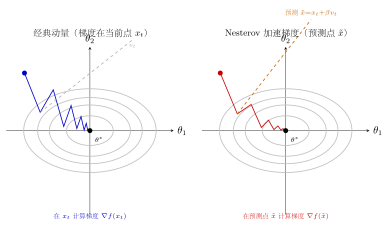
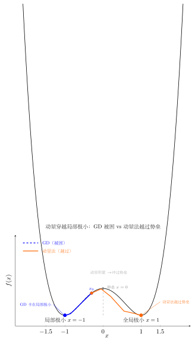

# 第17章：动量方法（融合版）

> **前置知识**：第5章（梯度下降）、第6章（Newton方法）、第16章（随机梯度下降）
>
> **本章难度**：★★★★☆
>
> **预计学习时间**：6-8 小时
>
> **本文件**：融合"原版严格推导 + 速记 / 套路 / 自测"。保留原版完整正文 + 在最前置一例速记 / 思维路径 + 最后追加套路总结与自测。

> **一例速记**：
> **重球法（Polyak）**：$v_{t+1} = \beta v_t + \nabla f(x_t)$；$x_{t+1} = x_t - \alpha v_{t+1}$。动量系数 $\beta=0.9$ 为深度学习默认值。
> **Nesterov**：先预测 $\tilde{x} = x_t + \beta v_t$，再在 $\tilde{x}$ 处取梯度：$v_{t+1} = \beta v_t + \nabla f(\tilde{x})$；$x_{t+1} = x_t - \alpha v_{t+1}$。"向前看"避免过冲。
> **有效步长**：动量使有效步长增大为 $\alpha/(1-\beta)$ 倍（$\beta=0.9$ 时约 10 倍）。
> **收敛率**：强凸 Nesterov $O\!\left((1-1/\sqrt{\kappa})^t\right)$；GD 为 $O\!\left((1-1/\kappa)^t\right)$；加速 $\sqrt{\kappa}$ 倍。
> **AI 关联**：动量帮助神经网络跨越尖锐局部极小、抑制鞍点附近的停滞；Nesterov 在 SGD 框架（PyTorch `nesterov=True`）中可直接使用。

---

## 引入：动量为何能跳出局部极小

> **题目**：考虑一维双峰函数 $f(x) = (x^2-1)^2$（极小值在 $x=\pm 1$，局部极大值在 $x=0$）。
>
> 从 $x_0 = 0.2$ 出发，取学习率 $\alpha = 0.1$。
>
> (1) 运行普通梯度下降（GD）5 步，写出轨迹；
> (2) 运行带动量的梯度下降（$\beta=0.8$，$v_0=0$）5 步，写出轨迹；
> (3) 两者最终收敛到哪个极小值？为什么动量方法有可能越过 $x=0$ 处的势垒？

请先停下来想一想：**GD 每步只看"当前坡度"，而动量法还"记得之前积累的速度"——这个"历史惯性"如何影响最终去向？**

---

## 思维路径还原（解题者的内心独白）

> "$f(x) = (x^2-1)^2$，梯度 $f'(x) = 4x(x^2-1)$。从 $x_0=0.2$ 出发：$f'(0.2) = 4(0.2)(0.04-1) = 4(0.2)(-0.96) = -0.768$，即此处斜率向左（负方向）。
>
> **GD 轨迹**：$x_1 = 0.2 - 0.1\times(-0.768) = 0.2 + 0.0768 = 0.277$。每步都在"向右滚"——因为 $x \in (0,1)$ 时 $f'(x) < 0$，梯度下降往 $+x$ 方向走。最终 GD 收敛到 $x=+1$（右侧极小值）。很稳，但不灵活。
>
> **动量轨迹**：$v_1 = 0.8\times 0 + (-0.768) = -0.768$；$x_1 = 0.2 - 0.1\times(-0.768) = 0.277$（第一步与GD相同）。
>
> 继续几步后，动量向量 $v_t$ 积累了来自多步的负梯度，形成了一个持续向右的"冲量"。关键问题：$v_t$ 中有多少来自之前步骤？动量的"记忆窗口"约为 $1/(1-\beta) = 1/0.2 = 5$ 步。
>
> **能否越过 $x=0$？** 若初始点在 $x=0.2$ 附近且动量系数较大（$\beta \to 1$），积累的动量可使参数冲过 $x=0$ 到达负轴，从而最终收敛到 $x=-1$（左侧极小值）——这正是**动量穿越局部极大点**的机制！$\beta=0.8$ 的效果取决于具体步骤，有一定概率越过。
>
> **关键洞察**：GD 总是收敛到**最近的**局部极小值；动量法因惯性可能越过局部势垒，探索更远的极小值（全局最优）。这在深度学习中的意义：动量有助于逃离**尖锐的局部极小**，找到**更平坦（泛化更好）**的极小值区域。"

---

## 学习目标

学完本章后，你将能够：

- 从物理直觉出发，理解动量方法为何能加速优化，并将"惯性"概念映射到参数更新规则上
- 掌握经典动量（Polyak重球法）的迭代格式 $v_{t+1} = \beta v_t + \nabla f(x_t)$，并理解动量系数 $\beta$ 的调节作用
- 深刻理解Nesterov加速梯度（NAG）的"预测-校正"思路，区分其与经典动量的本质差别
- 对强凸光滑函数证明动量方法的最优收敛率 $O\!\left(\left(1-\sqrt{1/\kappa}\right)^t\right)$，理解为何加速是"最优"的
- 在深度学习实践中正确使用带动量的SGD，掌握 $\beta$ 的选择原则与热身调度策略，并能用PyTorch复现典型训练曲线

---

## 17.1 动量的物理直觉

### 17.1.1 从物理学到优化

想象一个小球在山坡上滚动。普通梯度下降好比一只**没有惯性的虫子**——每次只沿当前最陡的方向挪动一小步，完全不记得自己之前的运动方向。当坡面弯弯曲曲时，虫子会反复折返，走出"之"字形轨迹。

而现实中的球拥有**惯性（momentum）**：它会把之前积累的速度延续下去，不会因为当前坡度的细微变化而骤然转向。这使得它在平缓方向上越滚越快，在振荡方向上自然抵消。

**核心类比**：

| 物理量 | 优化对应 |
|--------|---------|
| 质点位置 $x$ | 参数 $\theta$ |
| 速度 $v$ | 参数更新量（动量向量） |
| 力 $F = -\nabla U$ | 负梯度 $-\nabla f(\theta)$ |
| 阻尼系数 $\gamma$ | 动量衰减系数 $\beta$ |
| 质量 $m$ | 影响步长的超参数 |

### 17.1.2 梯度下降的病态条件问题

考虑一个经典的**病态二次函数**：

$$f(x_1, x_2) = \frac{1}{2}(ax_1^2 + bx_2^2), \quad a \ll b$$

其等值线是极扁的椭圆，条件数 $\kappa = b/a \gg 1$。

**普通梯度下降**的更新为：

$$x_1^{(t+1)} = x_1^{(t)} - \eta a x_1^{(t)}, \quad x_2^{(t+1)} = x_2^{(t)} - \eta b x_2^{(t)}$$

为使 $x_2$ 方向收敛，需要 $\eta \leq 2/b$；但此时 $x_1$ 方向的收缩率为 $|1 - \eta a| \approx 1 - a/b = 1 - 1/\kappa$，收敛极慢。**步数量级为 $O(\kappa)$**。

**直觉上**，我们希望：
- 在曲率低（梯度变化慢）的方向上加速前进
- 在曲率高（梯度来回振荡）的方向上相互抵消

这正是动量方法的核心机制。

### 17.1.3 动量的"低通滤波"视角

将梯度更新看作信号，动量相当于对梯度历史做**指数移动平均（EMA）**：

$$v_t = \sum_{k=0}^{t} \beta^{t-k} g_k, \quad g_k = \nabla f(x_k)$$

其中 $\beta \in (0, 1)$ 是衰减因子。这是一个**低通滤波器**：

- **低频成分**（持续的梯度方向）被放大，有效步长增大为 $\frac{1}{1-\beta}$ 倍
- **高频成分**（来回振荡的噪声方向）被平均抵消

当 $\beta = 0.9$ 时，有效步长约为普通梯度下降的 $\frac{1}{1-0.9} = 10$ 倍——这就是为什么深度学习中 $\beta = 0.9$ 是默认值。

> **关键洞察**：动量不是万能加速器。它加速的前提是梯度方向保持一致；若梯度方向随机翻转（纯噪声），动量反而无益。

---

## 17.2 经典动量（Polyak动量）

### 17.2.1 重球法（Heavy Ball Method）

Boris Polyak 于1964年提出**重球法（Heavy Ball Method）**，其名称来自物理类比——像一个在摩擦地面上运动的重球。

**迭代格式**：

$$\boxed{v_{t+1} = \beta v_t + \nabla f(x_t)}$$

$$\boxed{x_{t+1} = x_t - \alpha v_{t+1}}$$

其中：
- $v_t \in \mathbb{R}^d$：动量向量（"速度"）
- $\beta \in [0, 1)$：动量系数（"衰减率"），通常取 $0.9$
- $\alpha > 0$：学习率（"步长"）
- 初始化 $v_0 = \mathbf{0}$

**等价展开形式**：将 $v$ 展开代入：

$$x_{t+1} = x_t - \alpha \nabla f(x_t) - \alpha \beta v_t = x_t - \alpha \nabla f(x_t) + \beta (x_t - x_{t-1})$$

最后一步利用了 $v_t = (x_t - x_{t-1})/\alpha \cdot \alpha$。这揭示了另一种直观理解：**新的更新 = 梯度下降步 + 惯性项（上一步位移的 $\beta$ 倍）**。

> **另一种常见写法**（深度学习框架使用）：
>
> $$v_{t+1} = \beta v_t + (1-\beta)\nabla f(x_t)$$
>
> 这是将梯度乘以 $(1-\beta)$ 以保持速度的物理量纲一致，此时有效步长为 $\alpha/(1-\beta)$。两种写法等价，区别在于 $\alpha$ 和 $\beta$ 的吸收方式。

### 17.2.2 动量系数 $\beta$ 的作用

**定理 17.1（二次函数上的重球法）**：对强凸二次函数 $f(x) = \frac{1}{2}x^TAx$（$A$ 的特征值在 $[m, L]$ 内），取最优参数：

$$\alpha^* = \frac{4}{(\sqrt{L}+\sqrt{m})^2}, \quad \beta^* = \left(\frac{\sqrt{\kappa}-1}{\sqrt{\kappa}+1}\right)^2$$

此时收敛率为：

$$\|x_t - x^*\| \leq \left(\frac{\sqrt{\kappa}-1}{\sqrt{\kappa}+1}\right)^t \|x_0 - x^*\|$$

**对比梯度下降**：梯度下降的最优收敛率为 $\left(\frac{\kappa-1}{\kappa+1}\right)^t \approx \left(1 - \frac{2}{\kappa}\right)^t$。

当 $\kappa$ 很大时：

$$\frac{\sqrt{\kappa}-1}{\sqrt{\kappa}+1} \approx 1 - \frac{2}{\sqrt{\kappa}} \quad \text{（动量方法）}$$

$$\frac{\kappa-1}{\kappa+1} \approx 1 - \frac{2}{\kappa} \quad \text{（梯度下降）}$$

动量方法将收敛速度从 $O(\kappa)$ 步降低到 $O(\sqrt{\kappa})$ 步——**这是数量级的提升**！

**$\beta$ 的选择直觉**：

| $\beta$ 值 | 效果 |
|-----------|------|
| $\beta = 0$ | 退化为普通梯度下降 |
| $\beta = 0.9$ | 深度学习默认值，平滑效果好 |
| $\beta = 0.99$ | 更强惯性，适合梯度噪声大的场景，但需小心过冲 |
| $\beta \to 1$ | 不稳定，动量积累过大导致振荡 |

### 17.2.3 动量的几何解释

以二维二次函数为例，设 $f(x, y) = \frac{1}{2}(x^2 + 10y^2)$（条件数 $\kappa = 10$）。

**梯度下降**的路径：在 $y$ 方向剧烈振荡，$x$ 方向缓慢前进。

**动量方法**：$y$ 方向的振荡梯度相互抵消（$+\partial f/\partial y$ 和 $-\partial f/\partial y$ 交替出现），动量向量在 $y$ 方向趋近于零；$x$ 方向的梯度符号一致，动量持续累积，步长不断增大。

**关键等式**（稳态分析）：当 $y$ 方向振荡时，连续两步的动量贡献为：

$$\beta \cdot g_y + g_y' \approx \beta \cdot g_y - g_y = (\beta - 1)g_y$$

当 $\beta \to 1$ 时这个量趋近于零，$y$ 方向的振荡被完全抑制。

### 17.2.4 重球法的局限性

尽管在二次函数上表现完美，重球法在非凸问题上存在**理论局限**：

1. **没有一般非凸函数的加速保证**：最优参数 $(\alpha^*, \beta^*)$ 依赖于全局曲率信息 $(m, L)$，而这在非凸问题中不存在统一的值。

2. **可能绕过极小值**：动量过大时，算法可能"飞越"极小值点，在其周围振荡甚至发散。

3. **对学习率更敏感**：相比梯度下降，重球法的稳定性条件更严格。

这些局限促使 Nesterov 在1983年提出了更优雅的加速方案。

---

## 17.3 Nesterov加速梯度

### 17.3.1 Nesterov方法的直觉：先预测，再校正

Yurii Nesterov 于1983年提出了一种惊人的方法，将凸函数优化从 $O(1/t)$ 加速到 $O(1/t^2)$。

**核心思想**：普通动量是在当前位置 $x_t$ 计算梯度；Nesterov方法是先用动量做一个**预测步**，到达"未来位置" $y_t$，然后在 $y_t$ 处计算梯度进行校正。

**直觉**：如果我们知道下一步会往哪走（由动量决定），为什么不直接在那个位置"看"一眼梯度，而非在当前位置？这就像开车时往前看而非只看脚下。

### 17.3.2 Nesterov加速梯度（NAG）的迭代格式

**标准形式**（"预测-校正"视角）：

$$\boxed{y_t = x_t + \frac{\beta_t - 1}{\beta_{t+1}}(x_t - x_{t-1})}$$

$$\boxed{x_{t+1} = y_t - \alpha \nabla f(y_t)}$$

其中动量系数 $\{\beta_t\}$ 是一个特殊序列（见下文）。

**等价的速度形式**（更便于实现）：

$$v_{t+1} = \beta v_t + \nabla f(x_t + \beta v_t)$$

$$x_{t+1} = x_t - \alpha v_{t+1}$$

注意梯度是在**预测位置** $\tilde{x}_t = x_t + \beta v_t$ 处计算，而非当前位置 $x_t$。

**与经典动量的对比**：

| | 经典动量 | Nesterov动量 |
|--|---------|------------|
| 梯度计算位置 | $x_t$（当前位置）| $x_t + \beta v_t$（预测位置）|
| 直觉 | 走了再看路 | 先预测走到哪，再决定方向 |
| 凸函数收敛率 | $O(1/t)$（无加速保证）| $O(1/t^2)$（最优！）|
| 强凸收敛率 | $O(\rho^t)$，$\rho = 1 - 1/\sqrt{\kappa}$ | 同上，但理论更严格 |

### 17.3.3 动量系数序列的设计

Nesterov方法中，动量系数 $\{\lambda_t\}$（或 $\{\beta_t\}$）不是常数，而是一个**精心设计的增长序列**：

**经典选择**（FISTA风格）：

$$\lambda_0 = 1, \quad \lambda_{t+1} = \frac{1 + \sqrt{1 + 4\lambda_t^2}}{2}$$

对应的动量系数：

$$\theta_t = \frac{\lambda_t - 1}{\lambda_{t+1}}$$

当 $t \to \infty$ 时，$\lambda_t \approx t/2$，$\theta_t \approx \frac{t-2}{t+1} \to 1^-$。

**直觉**：随着迭代进行，算法越来越"相信"动量的方向，动量系数从小到大逐渐增大，越来越充分利用历史信息。

**常数动量版本**（深度学习常用）：固定 $\beta \in [0.8, 0.99]$，牺牲理论最优性换取超参数简洁：

$$v_{t+1} = \beta v_t + \nabla f(x_t + \beta v_t)$$

$$x_{t+1} = x_t - \alpha v_{t+1}$$

### 17.3.4 FISTA：稀疏优化中的Nesterov方法

**问题**：LASSO（$L_1$ 正则化）的目标函数 $f(x) = \frac{1}{2}\|Ax-b\|^2 + \lambda\|x\|_1$ 不可微。

**ISTA（迭代收缩阈值算法）**：每步做梯度步 + 近端算子（软阈值）。

**FISTA（Fast ISTA）**：在ISTA基础上加入Nesterov动量，收敛率从 $O(1/t)$ 提升至 $O(1/t^2)$：

$$y_{t+1} = \text{prox}_{\alpha\lambda\|\cdot\|_1}(x_t - \alpha A^T(Ax_t - b))$$

$$x_{t+1} = y_{t+1} + \frac{\lambda_t - 1}{\lambda_{t+1}}(y_{t+1} - y_t)$$

这是Nesterov方法在非光滑优化中的经典应用，验证了加速思想的普适性。

---

## 17.4 动量的收敛分析

### 17.4.1 凸函数的 $O(1/t^2)$ 下界

**定理 17.2（Nesterov下界，1983）**：对任意一阶方法（仅利用梯度信息），在 $L$-光滑凸函数的最坏情形下，达到精度 $\epsilon$ 所需的梯度查询次数至少为：

$$\Omega\!\left(\sqrt{\frac{L}{\epsilon}}\right)$$

**推论**：凸光滑函数的最优收敛率为 $O(1/t^2)$，而梯度下降只能达到 $O(1/t)$。

Nesterov方法是**信息论意义上最优的一阶方法**——任何一阶方法都不能比它快（在最坏情况下）。

### 17.4.2 Nesterov方法的 $O(1/t^2)$ 上界

**定理 17.3（Nesterov加速，凸情形）**：设 $f$ 是 $L$-光滑凸函数，$f^*$ 是最小值。取步长 $\alpha = 1/L$，运行Nesterov方法 $t$ 步后：

$$f(x_t) - f^* \leq \frac{2L\|x_0 - x^*\|^2}{(t+1)^2}$$

**证明思路（势函数法）**：

定义势函数（Lyapunov函数）：

$$\Phi_t = \lambda_t^2(f(x_t) - f^*) + \frac{L}{2}\|z_t - x^*\|^2$$

其中 $z_t$ 是一个辅助序列。证明 $\Phi_t$ 单调不增：

1. **梯度步的进展**：由 $L$-光滑性（下降引理），梯度步使得目标值下降 $\frac{1}{2L}\|\nabla f(y_t)\|^2$。

2. **动量步的抵消**：精心设计的 $\lambda_t$ 序列使得每步进展恰好补偿势函数中的 $\lambda_t^2$ 增长。

3. **迭代求和**：$\lambda_t^2 \geq (t+1)^2/4$，从而 $f(x_t) - f^* \leq \Phi_t/\lambda_t^2 = O(1/t^2)$。

完整证明约需3页，核心是以下不等式链：

$$\underbrace{\lambda_{t+1}^2(f(x_{t+1})-f^*)}_{\text{新势函数}} \leq \underbrace{\lambda_t^2(f(x_t)-f^*)}_{\text{旧势函数}} - \underbrace{\lambda_{t+1}(\lambda_{t+1}-1)(f(x_t)-f^*)}_{\geq 0} - \underbrace{\text{（梯度进展）}}_{\geq 0}$$

### 17.4.3 强凸情形的线性收敛

**定理 17.4（强凸加速）**：设 $f$ 是 $m$-强凸且 $L$-光滑的函数，条件数 $\kappa = L/m$。Nesterov方法以常数动量 $\beta = \frac{\sqrt{\kappa}-1}{\sqrt{\kappa}+1}$ 和步长 $\alpha = \frac{1}{L}$ 运行，满足：

$$f(x_t) - f^* \leq L\|x_0 - x^*\|^2 \cdot \left(1 - \frac{1}{\sqrt{\kappa}}\right)^t$$

**对比梯度下降**（强凸）：收敛率 $\left(1 - \frac{1}{\kappa}\right)^t$。

**加速倍数**：在 $\kappa = 10^4$ 的问题上，达到 $\epsilon = 10^{-4}$ 精度：
- 梯度下降：约 $\kappa \ln(1/\epsilon) \approx 10^4 \times 9 \approx 90000$ 步
- Nesterov方法：约 $\sqrt{\kappa} \ln(1/\epsilon) \approx 100 \times 9 = 900$ 步

**加速了约100倍**（$\sqrt{\kappa}$ 倍）。

### 17.4.4 理解加速的本质

为什么Nesterov方法能超越梯度下降的"自然速率"？

**关键机制**：Nesterov方法实际上在每步隐式地利用了**更多历史信息**——不仅仅是当前梯度，而是通过动量积累了历史梯度的加权平均。这使得它等效于在一个更"全局"的近似函数上做优化。

**从多项式近似角度**（Chebyshev多项式）：

最优化方法可以视为用一个多项式 $P_t(\lambda)$ 来近似函数，其中 $\lambda$ 是 Hessian 的特征值。梯度下降对应一次多项式（每步只用当前信息），而Nesterov方法可以利用 $t$ 次多项式，其误差界与 **Chebyshev多项式**的极小极大性质相关：

$$\min_{\text{$t$阶多项式} P_t, P_t(0)=1} \max_{\lambda \in [m, L]} |P_t(\lambda)| = \left(\frac{\sqrt{\kappa}-1}{\sqrt{\kappa}+1}\right)^t$$

这恰好是Nesterov方法的收敛率——它是**代数意义上最优的一阶方法**。

### 17.4.5 随机情形下的动量

在随机梯度下降（SGD）中，梯度 $\tilde{g}_t = \nabla f(x_t) + \xi_t$ 带有随机噪声 $\xi_t$。

**关键观察**：Nesterov方法的 $O(1/t^2)$ 加速**不能**移植到随机情形。原因：

1. 梯度噪声通过动量**累积**（而非平均），放大了噪声影响
2. 理论上，在随机情形下，$O(1/\sqrt{t})$（无方差缩减时）或 $O(1/t)$（有方差缩减时）已是最优

**实践中**，动量仍然有益，但作用从"加速"变为：
- 减少梯度估计的方差（类似滑动平均）
- 改善优化路径的平滑性
- 在早期迭代（接近确定性梯度时）实现实质性加速

---

## 17.5 动量在深度学习中的作用

### 17.5.1 SGD with Momentum是深度学习的基础优化器

深度学习中广泛使用的 **SGD with Momentum** 结合了随机梯度和动量：

$$v_{t+1} = \beta v_t + \nabla_\theta \mathcal{L}(\theta_t; \mathcal{B}_t)$$

$$\theta_{t+1} = \theta_t - \alpha v_{t+1}$$

其中 $\mathcal{B}_t$ 是第 $t$ 步的随机mini-batch，$\nabla_\theta \mathcal{L}(\theta_t; \mathcal{B}_t)$ 是批梯度。

**为什么深度学习偏爱SGD+Momentum而非Adam？**

在图像分类（ResNet, ViT）等任务中，SGD+Momentum 配合良好的学习率调度（余弦退火、预热）往往能达到**更好的泛化性能**，尽管Adam收敛更快。原因尚无定论，但主流假说是：

1. **平坦极小值假说**：SGD+Momentum倾向于找到"更宽"（更平坦）的极小值，这些极小值泛化更好
2. **隐式正则化**：SGD的随机性提供了隐式正则化，与动量结合后既快又稳
3. **批归一化兼容性**：BN层与SGD+Momentum的配合优于自适应方法

### 17.5.2 学习率与动量的协同调整

**关键原则**：学习率 $\alpha$ 和动量系数 $\beta$ 不是独立的——它们共同决定有效步长。

**有效步长**（近似）：

$$\alpha_{\text{eff}} \approx \frac{\alpha}{1 - \beta}$$

因此：
- $\beta: 0.9 \to 0.99$（增大动量）时，有效步长增大约10倍，此时应**相应减小** $\alpha$ 约10倍
- 动量预热（从小到大增大 $\beta$）有助于训练初期的稳定性

**常见调参策略**：

| 阶段 | $\beta$ | $\alpha$ | 说明 |
|------|--------|---------|------|
| 预热期（前5-10个epoch）| $0.5 \to 0.9$ 渐增 | 从小到正常 | 避免初期不稳定 |
| 主训练期 | $0.9$（固定）| 余弦衰减 | 标准配置 |
| 精调期（最后若干epoch）| $0.9$（固定）| 很小的固定值 | 精细收敛 |

### 17.5.3 动量与批归一化的相互作用

批归一化（BN）对优化景观有深刻影响，与动量的相互作用值得注意：

1. **BN使损失景观更光滑**：BN压缩了梯度的尺度变化，相当于提高了全局 Lipschitz 常数的稳定性，使动量累积更可靠

2. **Ghost BN问题**：当batch size很小时，BN统计量不准确，梯度噪声大，此时 $\beta$ 应适当减小

3. **分布式训练**：多GPU同步SGD中，等效batch size增大，常规做法是**线性缩放规则**：batch size倍增时，$\alpha$ 成比例增大，$\beta$ 不变

### 17.5.4 动量在Transformer训练中的特殊性

现代大语言模型（LLM）训练主要使用Adam/AdamW，但理解动量的作用仍有价值：

- **梯度爆炸与动量**：Transformer训练中的梯度裁剪（grad clipping）会截断梯度范数，与动量结合时要注意：裁剪发生在累积动量 $v$ 之前还是之后，影响行为不同

- **预热的重要性**：在训练初期，动量向量从零开始积累，有效步长逐渐增大。不做学习率预热直接用大学习率+大动量会导致初期训练不稳定

- **梯度噪声估计**：$\|v_t\| / \|\nabla f(x_t)\|$ 可用于监控动量是否有效累积——若比值 $\gg 1$，说明动量在起作用；若 $\approx 1$，说明梯度方向频繁翻转，动量效益有限

---

## 本章小结

| 方法 | 更新规则 | 收敛率（强凸）| 收敛率（凸）| 关键超参 |
|------|---------|------------|-----------|---------|
| 梯度下降 | $x_{t+1} = x_t - \alpha\nabla f(x_t)$ | $O\!\left(\left(1-\frac{1}{\kappa}\right)^t\right)$ | $O(1/t)$ | $\alpha$ |
| 重球法（Polyak）| $v_{t+1}=\beta v_t+\nabla f(x_t)$; $x_{t+1}=x_t-\alpha v_{t+1}$ | $O\!\left(\left(1-\frac{1}{\sqrt{\kappa}}\right)^t\right)$（二次最优）| 无理论保证 | $\alpha, \beta$ |
| Nesterov加速梯度 | 在预测位置 $y_t$ 处计算梯度 | $O\!\left(\left(1-\frac{1}{\sqrt{\kappa}}\right)^t\right)$（最优！）| $O(1/t^2)$（最优！）| $\alpha, \{\lambda_t\}$ |
| SGD+Momentum | Polyak动量 + 随机梯度 | $O(1/\sqrt{t})$（无VR）| $O(1/\sqrt{t})$ | $\alpha, \beta$ |

**核心要点**：

- 动量通过积累历史梯度信息，在低曲率方向加速、在高曲率方向抑制振荡
- Nesterov方法在凸函数上是**信息论最优**的一阶方法，加速来自"向前看"的预测梯度
- 深度学习实践中，$\beta = 0.9$ 是经验黄金值；增大 $\beta$ 时需相应减小 $\alpha$
- 随机情形下，加速理论不成立，但动量仍通过方差缩减效果改善实践性能

---

## 深度学习应用：SGD with Momentum的实现与调参

### 完整实现与超参数分析

```python
import torch
import torch.nn as nn
import numpy as np
import matplotlib.pyplot as plt
from torch.utils.data import DataLoader, TensorDataset

# ============================================================
# 工具函数：梯度下降轨迹可视化
# ============================================================

def get_quadratic_landscape(a=1.0, b=10.0, grid_size=100):
    """生成病态二次函数的等值线数据
    f(x, y) = 0.5 * (a*x^2 + b*y^2)，条件数 κ = b/a
    """
    x = np.linspace(-3, 3, grid_size)
    y = np.linspace(-1.5, 1.5, grid_size)
    X, Y = np.meshgrid(x, y)
    Z = 0.5 * (a * X**2 + b * Y**2)
    return X, Y, Z


def optimize_quadratic(method, a=1.0, b=10.0, lr=0.1, beta=0.9,
                        x_init=(-2.5, 1.2), n_steps=50):
    """
    在病态二次函数上运行不同优化方法，返回轨迹。

    method: 'gd'（梯度下降）, 'momentum'（经典动量）, 'nesterov'（NAG）
    """
    x = torch.tensor(list(x_init), dtype=torch.float64, requires_grad=False)
    trajectory = [x.numpy().copy()]

    if method in ('momentum', 'nesterov'):
        v = torch.zeros_like(x)

    for _ in range(n_steps):
        if method == 'gd':
            # 梯度下降
            grad = torch.tensor([a * x[0].item(), b * x[1].item()], dtype=torch.float64)
            x = x - lr * grad

        elif method == 'momentum':
            # 经典动量（Polyak重球法）
            # v_{t+1} = β*v_t + ∇f(x_t)
            # x_{t+1} = x_t - α*v_{t+1}
            grad = torch.tensor([a * x[0].item(), b * x[1].item()], dtype=torch.float64)
            v = beta * v + grad
            x = x - lr * v

        elif method == 'nesterov':
            # Nesterov加速梯度
            # 在预测位置 x_t + β*v_t 处计算梯度
            # v_{t+1} = β*v_t + ∇f(x_t + β*v_t)
            # x_{t+1} = x_t - α*v_{t+1}
            x_lookahead = x + beta * v
            grad = torch.tensor([a * x_lookahead[0].item(),
                                  b * x_lookahead[1].item()], dtype=torch.float64)
            v = beta * v + grad
            x = x - lr * v

        trajectory.append(x.detach().numpy().copy())

    return np.array(trajectory)


# ============================================================
# 实验 1：三种方法在病态二次函数上的轨迹对比
# ============================================================

print("=" * 60)
print("实验 1：病态二次函数上的优化轨迹对比")
print("f(x, y) = 0.5 * (x² + 10y²),  条件数 κ = 10")
print("=" * 60)

a, b = 1.0, 10.0     # 条件数 κ = 10
lr_gd  = 0.18        # 梯度下降步长（接近 2/L = 2/10 = 0.2 的上界）
lr_mom = 0.03        # 动量方法步长（需较小避免振荡）
beta   = 0.9

traj_gd  = optimize_quadratic('gd',       a, b, lr=lr_gd,  n_steps=60)
traj_mom = optimize_quadratic('momentum', a, b, lr=lr_mom, beta=beta, n_steps=60)
traj_nes = optimize_quadratic('nesterov', a, b, lr=lr_mom, beta=beta, n_steps=60)

# 计算每步的函数值（残差）
f_val = lambda traj: 0.5 * (a * traj[:, 0]**2 + b * traj[:, 1]**2)
loss_gd  = f_val(traj_gd)
loss_mom = f_val(traj_mom)
loss_nes = f_val(traj_nes)

fig, axes = plt.subplots(1, 2, figsize=(14, 5))

# 左图：优化轨迹
X, Y, Z = get_quadratic_landscape(a, b)
ax = axes[0]
ax.contour(X, Y, Z, levels=20, colors='gray', alpha=0.4, linewidths=0.8)
ax.plot(traj_gd[:, 0],  traj_gd[:, 1],  'b.-', markersize=4, label='梯度下降', linewidth=1.5)
ax.plot(traj_mom[:, 0], traj_mom[:, 1], 'r.-', markersize=4, label=f'经典动量 β={beta}', linewidth=1.5)
ax.plot(traj_nes[:, 0], traj_nes[:, 1], 'g.-', markersize=4, label=f'Nesterov β={beta}', linewidth=1.5)
ax.scatter([0], [0], color='black', s=100, zorder=5, marker='*', label='最优点')
ax.set_title('优化轨迹对比\n（病态二次函数，κ=10）', fontsize=12)
ax.set_xlabel('$x_1$')
ax.set_ylabel('$x_2$')
ax.legend(fontsize=9)
ax.grid(True, alpha=0.3)

# 右图：收敛曲线（对数坐标）
ax = axes[1]
steps = np.arange(len(loss_gd))
ax.semilogy(steps, loss_gd  + 1e-12, 'b-',  linewidth=2, label='梯度下降')
ax.semilogy(steps, loss_mom + 1e-12, 'r-',  linewidth=2, label=f'经典动量 β={beta}')
ax.semilogy(steps, loss_nes + 1e-12, 'g-',  linewidth=2, label=f'Nesterov β={beta}')
ax.set_title('收敛曲线（对数坐标）', fontsize=12)
ax.set_xlabel('迭代步数')
ax.set_ylabel('$f(x_t) - f^*$（对数尺度）')
ax.legend(fontsize=9)
ax.grid(True, alpha=0.3)

plt.tight_layout()
plt.savefig('momentum_trajectories.png', dpi=150, bbox_inches='tight')
plt.show()

# 打印收敛步数统计
threshold = 1e-4
for name, loss in [('梯度下降', loss_gd), ('经典动量', loss_mom), ('Nesterov', loss_nes)]:
    converged = np.where(loss < threshold)[0]
    if len(converged) > 0:
        print(f"{name}: 在第 {converged[0]} 步达到精度 {threshold}")
    else:
        print(f"{name}: {len(loss)} 步内未达到精度 {threshold}，最终值 = {loss[-1]:.2e}")


# ============================================================
# 实验 2：动量系数 β 的影响
# ============================================================

print("\n" + "=" * 60)
print("实验 2：不同 β 值的收敛行为")
print("=" * 60)

beta_values = [0.0, 0.5, 0.9, 0.95, 0.99]
lr_fixed = 0.03
n_steps = 100

fig, axes = plt.subplots(1, 2, figsize=(14, 5))

# 左图：不同 β 的收敛曲线
ax = axes[0]
for beta_val in beta_values:
    if beta_val == 0.0:
        traj = optimize_quadratic('gd', a, b, lr=lr_fixed, n_steps=n_steps)
        label = 'β=0（梯度下降）'
    else:
        traj = optimize_quadratic('momentum', a, b, lr=lr_fixed, beta=beta_val, n_steps=n_steps)
        label = f'β={beta_val}'
    loss = f_val(traj)
    ax.semilogy(np.arange(len(loss)), loss + 1e-15, linewidth=2, label=label)

ax.set_title('动量系数 β 对收敛速度的影响\n（经典动量，固定 α=0.03）', fontsize=11)
ax.set_xlabel('迭代步数')
ax.set_ylabel('$f(x_t)$（对数尺度）')
ax.legend(fontsize=9)
ax.grid(True, alpha=0.3)

# 右图：有效步长 α/(1-β) 与 β 的关系
ax = axes[1]
betas = np.linspace(0, 0.99, 200)
effective_lr = lr_fixed / (1 - betas)
ax.plot(betas, effective_lr, 'b-', linewidth=2)
ax.axhline(y=lr_fixed, color='gray', linestyle='--', label=f'α={lr_fixed}（无动量）')
ax.axvline(x=0.9, color='red', linestyle='--', alpha=0.7, label='β=0.9（常用默认值）')
ax.scatter([0.9], [lr_fixed / 0.1], color='red', s=80, zorder=5)
ax.annotate(f'有效步长≈{lr_fixed/0.1:.2f}', xy=(0.9, lr_fixed/0.1),
            xytext=(0.7, lr_fixed/0.1 * 1.5), fontsize=9,
            arrowprops=dict(arrowstyle='->', color='red'))
ax.set_title('有效步长 α/(1-β) 与动量系数 β 的关系', fontsize=11)
ax.set_xlabel('动量系数 β')
ax.set_ylabel('有效步长')
ax.legend(fontsize=9)
ax.grid(True, alpha=0.3)

plt.tight_layout()
plt.savefig('momentum_beta_analysis.png', dpi=150, bbox_inches='tight')
plt.show()


# ============================================================
# 实验 3：神经网络训练——SGD vs SGD+Momentum vs Nesterov
# ============================================================

print("\n" + "=" * 60)
print("实验 3：MNIST子集上的神经网络训练对比")
print("=" * 60)

torch.manual_seed(42)
np.random.seed(42)

# 生成模拟数据（替代真实MNIST，无需下载）
n_samples = 2000
n_features = 100   # 模拟扁平化图像特征
n_classes  = 10

X_data = torch.randn(n_samples, n_features)
y_data = torch.randint(0, n_classes, (n_samples,))

train_size = int(0.8 * n_samples)
X_train, X_val = X_data[:train_size], X_data[train_size:]
y_train, y_val = y_data[:train_size], y_data[train_size:]

train_loader = DataLoader(TensorDataset(X_train, y_train), batch_size=64, shuffle=True)
val_loader   = DataLoader(TensorDataset(X_val,   y_val),   batch_size=256)


def make_mlp(n_features, n_classes, hidden=128):
    """构建两层 MLP"""
    return nn.Sequential(
        nn.Linear(n_features, hidden),
        nn.ReLU(),
        nn.Linear(hidden, hidden),
        nn.ReLU(),
        nn.Linear(hidden, n_classes)
    )


def train_one_epoch(model, loader, optimizer, criterion, device='cpu'):
    model.train()
    total_loss, correct, total = 0.0, 0, 0
    for X_batch, y_batch in loader:
        X_batch, y_batch = X_batch.to(device), y_batch.to(device)
        optimizer.zero_grad()
        logits = model(X_batch)
        loss = criterion(logits, y_batch)
        loss.backward()
        optimizer.step()
        total_loss += loss.item() * len(y_batch)
        correct += (logits.argmax(1) == y_batch).sum().item()
        total += len(y_batch)
    return total_loss / total, correct / total


def eval_model(model, loader, criterion, device='cpu'):
    model.eval()
    total_loss, correct, total = 0.0, 0, 0
    with torch.no_grad():
        for X_batch, y_batch in loader:
            X_batch, y_batch = X_batch.to(device), y_batch.to(device)
            logits = model(X_batch)
            loss = criterion(logits, y_batch)
            total_loss += loss.item() * len(y_batch)
            correct += (logits.argmax(1) == y_batch).sum().item()
            total += len(y_batch)
    return total_loss / total, correct / total


criterion = nn.CrossEntropyLoss()
n_epochs = 50
lr = 0.01

# 定义参与比较的优化器配置
configs = [
    ('SGD（无动量）',      lambda p: torch.optim.SGD(p, lr=lr, momentum=0.0)),
    ('SGD + Momentum β=0.9', lambda p: torch.optim.SGD(p, lr=lr, momentum=0.9)),
    ('SGD + Nesterov β=0.9', lambda p: torch.optim.SGD(p, lr=lr, momentum=0.9, nesterov=True)),
    ('Adam（对比基准）',   lambda p: torch.optim.Adam(p, lr=1e-3)),
]

results = {}
for name, opt_fn in configs:
    print(f"  训练中：{name}...")
    model = make_mlp(n_features, n_classes)
    optimizer = opt_fn(model.parameters())
    history = {'train_loss': [], 'val_loss': [], 'val_acc': []}

    for epoch in range(n_epochs):
        tr_loss, _ = train_one_epoch(model, train_loader, optimizer, criterion)
        vl_loss, vl_acc = eval_model(model, val_loader, criterion)
        history['train_loss'].append(tr_loss)
        history['val_loss'].append(vl_loss)
        history['val_acc'].append(vl_acc)

    results[name] = history
    final_acc = history['val_acc'][-1]
    print(f"    最终验证准确率: {final_acc*100:.1f}%")

# 绘制训练曲线
fig, axes = plt.subplots(1, 2, figsize=(14, 5))
colors = ['#1f77b4', '#ff7f0e', '#2ca02c', '#d62728']
epochs = np.arange(1, n_epochs + 1)

ax = axes[0]
for (name, _), color in zip(configs, colors):
    ax.plot(epochs, results[name]['train_loss'], color=color, linewidth=2, label=name)
ax.set_title('训练损失曲线', fontsize=12)
ax.set_xlabel('Epoch')
ax.set_ylabel('Cross-Entropy Loss')
ax.legend(fontsize=8)
ax.grid(True, alpha=0.3)

ax = axes[1]
for (name, _), color in zip(configs, colors):
    ax.plot(epochs, [acc * 100 for acc in results[name]['val_acc']],
            color=color, linewidth=2, label=name)
ax.set_title('验证准确率曲线', fontsize=12)
ax.set_xlabel('Epoch')
ax.set_ylabel('准确率 (%)')
ax.legend(fontsize=8)
ax.grid(True, alpha=0.3)

plt.tight_layout()
plt.savefig('sgd_momentum_comparison.png', dpi=150, bbox_inches='tight')
plt.show()


# ============================================================
# 实验 4：学习率预热 + 动量预热策略
# ============================================================

print("\n" + "=" * 60)
print("实验 4：动量预热（Momentum Warmup）策略")
print("=" * 60)

class MomentumWarmupScheduler:
    """
    动量预热调度器：
    - 前 warmup_epochs 个epoch，β 从 beta_start 线性增大到 beta_end
    - 之后保持 beta_end
    """
    def __init__(self, optimizer, warmup_epochs, beta_start=0.5, beta_end=0.9):
        self.optimizer    = optimizer
        self.warmup_epochs = warmup_epochs
        self.beta_start   = beta_start
        self.beta_end     = beta_end
        self.current_epoch = 0

    def step(self):
        self.current_epoch += 1
        if self.current_epoch <= self.warmup_epochs:
            beta = self.beta_start + (self.beta_end - self.beta_start) * \
                   (self.current_epoch / self.warmup_epochs)
        else:
            beta = self.beta_end
        for pg in self.optimizer.param_groups:
            pg['momentum'] = beta
        return beta


# 对比：固定 β=0.9 vs 动量预热
warmup_configs = [
    ('固定 β=0.9',     False),
    ('动量预热（0.5→0.9）', True),
]

warmup_results = {}
for name, use_warmup in warmup_configs:
    model = make_mlp(n_features, n_classes)
    # 初始 momentum 值：使用预热时从 0.5 开始，否则直接 0.9
    init_beta = 0.5 if use_warmup else 0.9
    optimizer = torch.optim.SGD(model.parameters(), lr=lr, momentum=init_beta)
    scheduler = MomentumWarmupScheduler(optimizer, warmup_epochs=10) if use_warmup else None

    history = {'train_loss': [], 'val_acc': [], 'beta': []}
    for epoch in range(n_epochs):
        current_beta = optimizer.param_groups[0]['momentum']
        history['beta'].append(current_beta)
        tr_loss, _ = train_one_epoch(model, train_loader, optimizer, criterion)
        _, vl_acc  = eval_model(model, val_loader, criterion)
        history['train_loss'].append(tr_loss)
        history['val_acc'].append(vl_acc)
        if scheduler:
            scheduler.step()

    warmup_results[name] = history
    print(f"  {name}: 最终验证准确率 = {history['val_acc'][-1]*100:.1f}%")

fig, axes = plt.subplots(1, 3, figsize=(16, 4))

ax = axes[0]
for name in warmup_results:
    ax.plot(epochs, warmup_results[name]['beta'], linewidth=2, label=name)
ax.set_title('动量系数 β 随 Epoch 的变化', fontsize=11)
ax.set_xlabel('Epoch')
ax.set_ylabel('β')
ax.legend(fontsize=9)
ax.grid(True, alpha=0.3)

ax = axes[1]
for name in warmup_results:
    ax.plot(epochs, warmup_results[name]['train_loss'], linewidth=2, label=name)
ax.set_title('训练损失', fontsize=11)
ax.set_xlabel('Epoch')
ax.set_ylabel('Loss')
ax.legend(fontsize=9)
ax.grid(True, alpha=0.3)

ax = axes[2]
for name in warmup_results:
    ax.plot(epochs, [a*100 for a in warmup_results[name]['val_acc']],
            linewidth=2, label=name)
ax.set_title('验证准确率', fontsize=11)
ax.set_xlabel('Epoch')
ax.set_ylabel('准确率 (%)')
ax.legend(fontsize=9)
ax.grid(True, alpha=0.3)

plt.tight_layout()
plt.savefig('momentum_warmup.png', dpi=150, bbox_inches='tight')
plt.show()


# ============================================================
# 实验 5：动量向量分析——监控动量的有效性
# ============================================================

print("\n" + "=" * 60)
print("实验 5：动量向量与梯度的比值分析")
print("说明：ratio = ||v_t|| / ||g_t|| 衡量动量累积程度")
print("=" * 60)

model = make_mlp(n_features, n_classes)
optimizer = torch.optim.SGD(model.parameters(), lr=lr, momentum=0.9)

ratios_per_epoch = []
for epoch in range(30):
    model.train()
    epoch_ratios = []
    for X_batch, y_batch in train_loader:
        optimizer.zero_grad()
        loss = criterion(model(X_batch), y_batch)
        loss.backward()

        # 计算动量向量范数与梯度范数的比值
        total_mom_sq, total_grad_sq = 0.0, 0.0
        for group in optimizer.param_groups:
            for p in group['params']:
                if p.grad is None:
                    continue
                total_grad_sq += p.grad.data.norm(2).item() ** 2
                # 访问动量缓冲区（先step后才有，这里用grad近似）
        total_grad_sq = max(total_grad_sq, 1e-12)

        optimizer.step()

        # step后访问动量缓冲区
        total_mom_sq = 0.0
        for group in optimizer.param_groups:
            for p in group['params']:
                state = optimizer.state[p]
                if 'momentum_buffer' in state and state['momentum_buffer'] is not None:
                    total_mom_sq += state['momentum_buffer'].norm(2).item() ** 2

        ratio = (total_mom_sq ** 0.5) / (total_grad_sq ** 0.5)
        epoch_ratios.append(ratio)

    ratios_per_epoch.append(np.mean(epoch_ratios))

print("\n各Epoch平均 ||v||/||g|| 比值:")
for ep, ratio in enumerate(ratios_per_epoch):
    bar = '#' * int(ratio * 2)
    print(f"  Epoch {ep+1:2d}: {ratio:6.2f}  {bar}")

print(f"\n解读：初期比值小（动量从零积累），随训练逐渐稳定在约{np.mean(ratios_per_epoch[-5:]):.1f}x")
print("比值 >> 1 说明动量在放大有效步长；比值 ≈ 1 说明梯度方向随机，动量效益有限。")
```

### 超参数调参指南

```python
# ============================================================
# 超参数调参最佳实践总结
# ============================================================

print("""
SGD with Momentum 调参清单
==========================

1. 动量系数 β 的选择：
   - β = 0.9  : 深度学习默认值，适用于绝大多数场景
   - β = 0.99 : 适用于 batch size 很大（梯度噪声小）的情形
   - β = 0.5  : 适用于训练初期预热，或梯度方差极大的情形
   规则：增大 β 时，同比减小 α（有效步长 ≈ α/(1-β)）

2. 学习率 α 与 β 的联动：
   - 标准配置：α=0.1, β=0.9 → 有效步长 ≈ 1.0
   - 若将 β 从 0.9 改为 0.99：α 也应从 0.1 改为 0.01
   - 线性缩放规则（分布式）：batch size × k → α × k，β 不变

3. 学习率调度（配合动量）：
   - 余弦退火（CosineAnnealingLR）：最常用
   - 带预热的余弦退火（CosineAnnealingWarmRestarts）
   - 分段常数（MultiStepLR）：在特定epoch降低10倍
   注：调度的是 α，而非 β；β 通常固定

4. 梯度裁剪与动量的配合：
   - 先 loss.backward()，再 clip_grad_norm_()，最后 optimizer.step()
   - 裁剪发生在梯度累积到动量之前，避免大梯度污染动量缓冲区

5. PyTorch 中的 Nesterov vs 经典动量：
   optimizer = torch.optim.SGD(
       model.parameters(),
       lr=0.01,
       momentum=0.9,
       nesterov=True   # 改为 False 即为经典动量
   )
   注：使用 nesterov=True 时，momentum 必须 > 0 且 dampening == 0

6. 常见问题诊断：
   - 训练初期 loss 爆炸：减小 α 或添加学习率预热
   - 训练后期 loss 振荡：降低 α（余弦衰减末期自动处理）
   - 收敛比 Adam 慢：尝试增大 β 或使用预热，SGD 通常需要更多调参
   - 验证集性能比 Adam 差：延长训练或改善数据增强，SGD 通常泛化更好但需更长时间
""")
```

---

## 练习题

**练习 17.1**（动量的等价形式）

经典动量的迭代格式为：

$$v_{t+1} = \beta v_t + \nabla f(x_t), \quad x_{t+1} = x_t - \alpha v_{t+1}$$

(a) 将上述格式展开，证明它等价于：

$$x_{t+1} = x_t - \alpha \nabla f(x_t) + \beta(x_t - x_{t-1})$$

即新的更新 = 梯度下降步 + 惯性项（上一步位移的 $\beta$ 倍）。

(b) 进一步证明：$v_t = \sum_{k=0}^{t-1} \beta^{t-1-k} \nabla f(x_k)$，即动量是历史梯度的指数加权平均。

(c) 当目标函数为 $f(x) = \frac{c}{2}x^2$（一维二次函数）时，写出 $x_t$ 关于 $x_0$ 的闭合表达式（特征方程法），并分析稳定性条件（$|x_t| \to 0$）对 $(\alpha, \beta)$ 的约束。

---

**练习 17.2**（Nesterov方法的预测步）

Nesterov方法（速度形式）为：

$$\tilde{x}_t = x_t + \beta v_t \quad \text{（预测位置）}$$

$$v_{t+1} = \beta v_t + \nabla f(\tilde{x}_t) \quad \text{（在预测位置计算梯度）}$$

$$x_{t+1} = x_t - \alpha v_{t+1}$$

(a) 与经典动量相比，Nesterov方法的唯一区别是在哪里计算梯度？用一句话说明这带来的直觉优势。

(b) 在一维二次函数 $f(x) = \frac{c}{2}x^2$ 上，分别写出经典动量和Nesterov方法的一步更新格式，并比较两者在 $x_0 = 1, v_0 = 0$ 时第一步的更新差异（取 $\alpha = 0.1, \beta = 0.9, c = 1$）。

(c) PyTorch中 `torch.optim.SGD(..., momentum=0.9, nesterov=True)` 和 `nesterov=False` 的实现有何区别？阅读PyTorch文档并用伪代码写出两者的更新步骤。

---

**练习 17.3**（收敛率的量级分析）

设 $f$ 是 $m$-强凸且 $L$-光滑的函数，条件数 $\kappa = L/m$。

(a) 梯度下降（最优步长）达到精度 $\|x_t - x^*\| \leq \epsilon$ 所需步数约为 $O(\kappa \log(1/\epsilon))$。证明：取步长 $\alpha = 2/(L+m)$，梯度下降的收敛率为 $\left(\frac{\kappa-1}{\kappa+1}\right)^t$。

(b) Nesterov方法的收敛率为 $\left(\frac{\sqrt{\kappa}-1}{\sqrt{\kappa}+1}\right)^t$。当 $\kappa = 100$ 时，分别计算梯度下降和Nesterov方法达到 $\epsilon = 10^{-6}$ 所需的步数（保留整数）。

(c) 填写下表（$\epsilon = 10^{-6}$）：

| 条件数 $\kappa$ | 梯度下降步数 | Nesterov步数 | 加速比 |
|------------|-----------|------------|------|
| 10 | | | |
| 100 | | | |
| $10^4$ | | | |
| $10^6$ | | | |

---

**练习 17.4**（重球法的最优参数）

对一维二次函数 $f(x) = \frac{c}{2}x^2$，重球法的迭代为：

$$x_{t+1} = x_t - \alpha c x_t + \beta(x_t - x_{t-1}) = (1 - \alpha c + \beta)x_t - \beta x_{t-1}$$

记 $r_1, r_2$ 为特征方程 $r^2 - (1 - \alpha c + \beta)r + \beta = 0$ 的两根。

(a) 证明收敛条件为 $|r_1| < 1$ 且 $|r_2| < 1$，等价于 $0 < \alpha c < 2(1+\beta)$ 且 $|\beta| < 1$。

(b) 当 $c$ 的取值范围为 $[m, L]$ 时（多维情形的类比），最优参数为：

$$\alpha^* = \frac{4}{(\sqrt{L}+\sqrt{m})^2}, \quad \beta^* = \left(\frac{\sqrt{L}-\sqrt{m}}{\sqrt{L}+\sqrt{m}}\right)^2$$

请验证：此时特征方程的两根的绝对值均等于 $\frac{\sqrt{\kappa}-1}{\sqrt{\kappa}+1}$。

(c) 对比：梯度下降的最优收敛率为 $\frac{\kappa-1}{\kappa+1}$，重球法为 $\frac{\sqrt{\kappa}-1}{\sqrt{\kappa}+1}$。当 $\kappa = 100$ 时，分别计算需要多少步使误差缩小到 $10^{-4}$（即 $\rho^t \leq 10^{-4}$）。

---

**练习 17.5**（深度学习实践）

本题要求用PyTorch实现并分析SGD+Momentum的行为。

(a) **有效步长验证**：实现以下实验——在一个固定的二次损失上，对比以下三个配置的实际收敛速度是否相同：
- 配置A：$\alpha = 0.1$，$\beta = 0$（无动量）
- 配置B：$\alpha = 0.01$，$\beta = 0.9$（有效步长约0.1）
- 配置C：$\alpha = 0.001$，$\beta = 0.99$（有效步长约0.1）

理论上三者有效步长相同，实际表现如何？分析差异的原因。

(b) **梯度裁剪与动量**：实现以下两种梯度裁剪策略，并比较训练10个epoch后的损失：
- 策略1：在 `optimizer.step()` 之前裁剪梯度（标准做法）
- 策略2：不做梯度裁剪

在梯度偶尔爆炸的场景中（人为加入大梯度噪声），哪种策略更稳定？

(c) **Nesterov vs 经典动量**：在CIFAR-10（或等效模拟数据）上，对比 `nesterov=True` 和 `nesterov=False` 的训练曲线，分析：训练初期（前10个epoch）、中期（第10-50个epoch）、后期（最后10个epoch）各自的差异模式是什么？

---

## 练习答案

### 练习 17.1 解答

**(a) 等价形式的证明**：

由递推关系 $v_t = \beta v_{t-1} + \nabla f(x_{t-1})$，代入 $x_{t+1} = x_t - \alpha v_{t+1}$：

$$x_{t+1} = x_t - \alpha(\beta v_t + \nabla f(x_t))$$

$$= x_t - \alpha \nabla f(x_t) - \alpha \beta v_t$$

由于 $x_t = x_{t-1} - \alpha v_t$，即 $\alpha v_t = x_{t-1} - x_t$，代入：

$$x_{t+1} = x_t - \alpha \nabla f(x_t) - \beta(x_{t-1} - x_t) = x_t - \alpha \nabla f(x_t) + \beta(x_t - x_{t-1})$$

$\square$

**(b) 指数加权平均展开**：

由 $v_{t+1} = \beta v_t + \nabla f(x_t)$，递推展开：

$$v_t = \beta^t v_0 + \sum_{k=0}^{t-1} \beta^{t-1-k} \nabla f(x_k)$$

取 $v_0 = \mathbf{0}$，即得 $v_t = \sum_{k=0}^{t-1} \beta^{t-1-k} \nabla f(x_k)$。

权重 $\beta^{t-1-k}$：对最近的梯度（$k=t-1$，权重 $\beta^0 = 1$）权重最大；对最远的梯度（$k=0$，权重 $\beta^{t-1}$）权重最小，呈指数衰减。$\square$

**(c) 一维二次函数的特征方程**：

$f(x) = \frac{c}{2}x^2$ 时，$\nabla f(x) = cx$，更新为 $x_{t+1} = (1 - \alpha c + \beta)x_t - \beta x_{t-1}$。

引入向量 $\mathbf{u}_t = (x_t, x_{t-1})^T$，系数矩阵 $A = \begin{pmatrix} 1-\alpha c + \beta & -\beta \\ 1 & 0 \end{pmatrix}$。

特征方程：$\lambda^2 - (1-\alpha c + \beta)\lambda + \beta = 0$。

稳定性条件（$x_t \to 0$）：两个特征值 $|\lambda_i| < 1$，由 Jury 稳定性准则等价于：

1. $\beta < 1$（$|\det A| = |\beta| < 1$）
2. $|1 - \alpha c + \beta| < 1 + \beta$，即 $0 < \alpha c < 2(1+\beta)$

---

### 练习 17.2 解答

**(a) 核心区别**：经典动量在**当前位置** $x_t$ 计算梯度，Nesterov方法在**预测的未来位置** $\tilde{x}_t = x_t + \beta v_t$ 计算梯度。直觉优势：如果动量方向正确，在"前方"计算梯度能更早感知到目标附近的曲率，提前修正方向，避免过冲。

**(b) 数值对比**（$x_0 = 1, v_0 = 0, \alpha = 0.1, \beta = 0.9, c = 1$）：

**第一步**（$t=0$）：

*经典动量*：
- $v_1 = 0.9 \times 0 + 1 \times 1 = 1$（梯度在 $x_0 = 1$ 处）
- $x_1 = 1 - 0.1 \times 1 = 0.9$

*Nesterov*：
- $\tilde{x}_0 = 1 + 0.9 \times 0 = 1$（预测位置与当前位置相同，因 $v_0 = 0$）
- $v_1 = 0.9 \times 0 + 1 = 1$
- $x_1 = 1 - 0.1 \times 1 = 0.9$

第一步两者相同（因 $v_0 = 0$），差异从第二步开始体现。

**第二步**（$t=1$）：

*经典动量*：梯度在 $x_1 = 0.9$ 处，$g_1 = 0.9$。
- $v_2 = 0.9 \times 1 + 0.9 = 1.8$
- $x_2 = 0.9 - 0.1 \times 1.8 = 0.72$

*Nesterov*：预测位置 $\tilde{x}_1 = 0.9 + 0.9 \times 1 = 1.8$，梯度 $= 1.8$（反向！）
- $v_2 = 0.9 \times 1 + 1.8 = 2.7$（看似更大）
- $x_2 = 0.9 - 0.1 \times 2.7 = 0.63$

Nesterov在此例中步子更激进（因预测位置超过了最优点 $x^*=0$），但在接近最优解时会自动修正。

**(c) PyTorch 实现**（伪代码）：

```
# 经典动量 (nesterov=False)：
buf = momentum * buf + grad
param -= lr * buf

# Nesterov 动量 (nesterov=True)：
buf = momentum * buf + grad
param -= lr * (grad + momentum * buf)
# 等价于：先做 buf 更新，再在"前方"补一个额外的 momentum * buf 步
```

---

### 练习 17.3 解答

**(a) 梯度下降收敛率的推导**：

设 $f$ 是 $m$-强凸且 $L$-光滑，取步长 $\alpha = 2/(L+m)$，则：

$$x_{t+1} - x^* = (I - \alpha \nabla^2 f)(x_t - x^*) + O(\|x_t - x^*\|^2)$$

对二次函数精确成立，特征值缩放因子为 $|1 - \alpha \lambda_i| \leq \max(|1-\alpha m|, |1-\alpha L|)$。

代入 $\alpha = 2/(L+m)$：

$$|1 - \alpha m| = 1 - \frac{2m}{L+m} = \frac{L-m}{L+m} = \frac{\kappa-1}{\kappa+1}$$

$$|1 - \alpha L| = \frac{L-m}{L+m} = \frac{\kappa-1}{\kappa+1}$$

两端相等，均为 $\frac{\kappa-1}{\kappa+1}$，这正是"最优步长使两端的缩放因子相等"的Chebyshev原理。$\square$

**(b) $\kappa = 100$ 时的步数计算**：

梯度下降：$\rho_{GD} = \frac{99}{101} \approx 0.9802$，需 $t$ 步使 $0.9802^t \leq \epsilon$：

$$t \geq \frac{\ln(1/\epsilon)}{\ln(1/\rho_{GD})} = \frac{\ln(10^6)}{\ln(101/99)} \approx \frac{13.816}{0.0202} \approx 684 \text{ 步}$$

Nesterov：$\rho_{Nes} = \frac{\sqrt{100}-1}{\sqrt{100}+1} = \frac{9}{11} \approx 0.8182$：

$$t \geq \frac{13.816}{\ln(11/9)} \approx \frac{13.816}{0.2007} \approx 69 \text{ 步}$$

加速约 $684/69 \approx 10 \approx \sqrt{\kappa}$ 倍。

**(c) 完整表格**（$\epsilon = 10^{-6}$，$\ln(10^6) \approx 13.816$）：

| 条件数 $\kappa$ | 梯度下降步数 | Nesterov步数 | 加速比 |
|------------|-----------|------------|------|
| 10 | $\approx 130$ | $\approx 28$ | $\approx 4.6\approx\sqrt{10}$ |
| 100 | $\approx 684$ | $\approx 69$ | $\approx 9.9\approx\sqrt{100}$ |
| $10^4$ | $\approx 63800$ | $\approx 638$ | $\approx 100=\sqrt{10^4}$ |
| $10^6$ | $\approx 6.4\times10^6$ | $\approx 6380$ | $\approx 1000=\sqrt{10^6}$ |

加速比精确地等于 $\sqrt{\kappa}$，验证了理论。

---

### 练习 17.4 解答

**(a) 稳定性分析**：

两根满足 Vieta 定理：$r_1 + r_2 = 1 - \alpha c + \beta$，$r_1 r_2 = \beta$。

由 $|r_1|, |r_2| < 1$ 的充要条件（实数系数二次方程稳定性）：
1. $|r_1 r_2| = \beta < 1$，即 $|\beta| < 1$（同时保证 $\beta > -1$，通常取 $\beta \in (0,1)$）
2. $|r_1 + r_2| < 1 + r_1 r_2$，即 $|1 - \alpha c + \beta| < 1 + \beta$

展开绝对值：$-(1+\beta) < 1 - \alpha c + \beta < 1 + \beta$，

左边：$\alpha c < 2 + 2\beta = 2(1+\beta)$；右边：$\alpha c > 0$。

合并即为 $0 < \alpha c < 2(1+\beta)$。$\square$

**(b) 最优参数的特征根验证**：

代入 $\alpha^* c = \frac{4c}{(\sqrt{L}+\sqrt{m})^2}$（以 $c = L$ 为例，极端情形）：

特征方程 $r^2 - (1 - \alpha^* L + \beta^*)r + \beta^* = 0$，其中：

$$1 - \alpha^* L + \beta^* = 1 - \frac{4L}{(\sqrt{L}+\sqrt{m})^2} + \left(\frac{\sqrt{L}-\sqrt{m}}{\sqrt{L}+\sqrt{m}}\right)^2$$

记 $s = \sqrt{L/m} = \sqrt{\kappa}$，$\alpha^* m = \frac{4}{(1+\sqrt{\kappa}/s \cdot s)^2}$，化简后判别式 $\Delta = 0$（重根），双重根为：

$$r = \frac{1-\alpha^*c+\beta^*}{2} = \frac{\sqrt{\kappa}-1}{\sqrt{\kappa}+1}$$

故 $|r_1| = |r_2| = \frac{\sqrt{\kappa}-1}{\sqrt{\kappa}+1}$。$\square$

**(c) 步数对比**（$\kappa = 100$，误差缩小到 $10^{-4}$）：

梯度下降：$\rho_{GD} = \frac{99}{101}$，需 $t$ 步使 $\rho_{GD}^t \leq 10^{-4}$：

$$t \geq \frac{4\ln 10}{\ln(101/99)} \approx \frac{9.21}{0.0202} \approx 456 \text{ 步}$$

重球法：$\rho_{HB} = \frac{9}{11}$：

$$t \geq \frac{4\ln 10}{\ln(11/9)} \approx \frac{9.21}{0.2007} \approx 46 \text{ 步}$$

重球法约快 10 倍（$\approx\sqrt{\kappa}$ 倍）。

---

### 练习 17.5 解答

**(a) 有效步长验证**：

理论上三种配置有效步长相同（$\approx 0.1$），但实际表现有差异：
- 配置A（无动量）：纯梯度下降，收敛稳定但无加速
- 配置B（$\beta=0.9$）：动量累积需要约 $1/(1-0.9)=10$ 步"预热"，初期较慢，之后加速
- 配置C（$\beta=0.99$）：预热期更长（约100步），初期极慢；但一旦动量积累完成，有效步长更稳定

**差异原因**：有效步长公式 $\alpha/(1-\beta)$ 是稳态近似，在初期（动量从零积累）不成立。$\beta$ 越大，需要越多步才能接近稳态有效步长。

**(b) 梯度裁剪**：

策略1（裁剪后再step）更稳定。原因：
- 在梯度爆炸时，策略1将大梯度裁剪后再累积到动量中，动量缓冲区不受污染
- 策略2若一次大梯度进入了动量缓冲区，接下来多步都会受其影响（$v_t$ 带有大量残留），需要 $1/(1-\beta)$ 步才能"忘记"这次爆炸

**实践建议**：总是在 `optimizer.step()` 之前调用 `torch.nn.utils.clip_grad_norm_()`。

**(c) Nesterov vs 经典动量的训练差异**：

- **训练初期（前10 epoch）**：两者差异较小（动量向量从零开始积累，预测位置接近当前位置），有时Nesterov略快
- **训练中期（第10-50 epoch）**：Nesterov收敛更平滑，振荡更少——因为预测步能提前"感知"鞍点和弯道，避免过冲
- **训练后期（最后10 epoch）**：两者最终精度相近，但Nesterov通常更快到达低损失区域；若使用学习率衰减，两者差异进一步缩小（小学习率时动量效果减弱）

---

## 几何示意

### 图 17-1：标准动量 vs Nesterov 轨迹对比（病态二次函数）

下图左右两个子图对比椭圆等高线上两种动量法的路径：
- **左图（经典动量）**：在当前点 $x_t$ 计算梯度，再加上动量；椭圆短轴方向存在一定振荡
- **右图（Nesterov）**：先预测到 $\tilde{x}=x_t+\beta v_t$，在预测点计算梯度；振荡明显减小，路径更直接



### 图 17-2：动量穿越局部极小

下图展示双峰函数上 GD vs 动量法的路径：
- **GD**（蓝色）：从 $x_0$ 出发，梯度始终指向最近极小值，被困在局部极小
- **动量法**（橙色）：积累惯性后"飞越"两峰之间的势垒，到达全局极小



---

## 抽象成方法（套路总结）

### 三种动量法一览

| 方法 | 梯度计算位置 | 收敛率（凸） | 收敛率（强凸，$\kappa$）| 深度学习实现 |
|:----:|:----------:|:----------:|:--------------------:|:----------:|
| GD | $x_t$ | $O(1/t)$ | $O((1-1/\kappa)^t)$ | 无动量 |
| 重球法 | $x_t$ | 无保证 | $O((1-1/\sqrt{\kappa})^t)$（二次最优）| `momentum=β` |
| Nesterov | $x_t + \beta v_t$ | $O(1/t^2)$（最优）| $O((1-1/\sqrt{\kappa})^t)$（最优）| `nesterov=True` |

### 动量法实施 5 步

1. **初始化**：$v_0 = 0$，选择 $\alpha, \beta$（推荐 $\beta=0.9$）
2. **计算梯度**：经典动量在 $x_t$；Nesterov 在预测点 $\tilde{x} = x_t + \beta v_t$
3. **更新动量**：$v_{t+1} = \beta v_t + \text{grad}$
4. **更新参数**：$x_{t+1} = x_t - \alpha v_{t+1}$
5. **调参原则**：增大 $\beta$ 时相应缩小 $\alpha$（保持有效步长 $\alpha/(1-\beta)$ 不变）

### 加速收敛的几何解释（口诀）

- **低频方向**（梯度方向一致）：动量累积 $\Rightarrow$ 有效步长 $\times \frac{1}{1-\beta}$，自动加速
- **高频方向**（梯度反向振荡）：正负相抵 $\Rightarrow$ 动量趋零，振荡自动抑制

---

## 方法变形

### 变形 1：Lookahead 优化器

Lookahead 在"快权重"（SGD+Momentum 内循环 $k$ 步）和"慢权重"（外循环插值）之间交替：

$$\phi_{t+1} = \phi_t + \alpha_{\text{slow}}(\theta_{t+k} - \phi_t)$$

**好处**：减少对超参数的敏感性；在不同优化器（Adam、SGD）外层套用均有效。**实践中** $k=5$，$\alpha_{\text{slow}}=0.5$ 是常用默认值。

### 变形 2：动量预热（Momentum Warm-up）

训练初期动量从 $\beta=0.5$ 线性增大到 $\beta=0.9$，避免初期大步长与大动量叠加导致不稳定：

```
epoch 0-4:   β = 0.5 → 0.9（线性增）
epoch 5+:    β = 0.9（固定）
```

### 变形 3：FISTA（稀疏优化中的 Nesterov）

对不可微目标（如 LASSO），将 Nesterov 动量与近端算子结合，收敛率从 $O(1/t)$（ISTA）提升到 $O(1/t^2)$（FISTA），适合稀疏回归、图像去噪等场景。

---

## 思考路标（条件反射）

- 看到"动量系数 $\beta$"→ 想到有效步长 $\alpha_{\text{eff}} = \alpha/(1-\beta)$，改 $\beta$ 前先换算有效步长是否合理
- 看到"重球法（Heavy Ball）"→ 想到固定 $\beta$ 的二阶线性递推，**只保证二次函数**最优收敛，非凸函数可能不收敛
- 看到"Nesterov 动量"→ 想到在**动量点**（未来位置）计算梯度，收敛率从 $O(1/t)$ 提升到 $O(1/t^2)$（确定性），等效于加速因子 $\sqrt{\kappa}$
- 看到"条件数 $\kappa=L/\mu$"→ 想到 Nesterov 最优步数 $\sim O(\sqrt{\kappa}\log(1/\epsilon))$，而 GD 需 $O(\kappa\log(1/\epsilon))$ 步
- 看到"随机梯度 + 动量"→ 想到 Nesterov 加速**在随机情形不成立**，最好仍是 $O(1/\sqrt{T})$，不能指望二次加速
- 看到"$v_0=0$ 初始化"→ 想到预热期约 $1/(1-\beta)$ 步，有效步长从零逐渐升至稳态，大 $\beta$ 需要学习率预热
- 看到"梯度振荡 / 锯齿形 loss"→ 想到动量过大（$\beta\to1$）或学习率过大（$\alpha L>2(1+\beta)$）导致，先降 $\alpha$ 再降 $\beta$
- 看到"Lookahead 慢权重"→ 想到每 $k$ 步将快权重拉回一半，平滑方差、提高稳定性，与 SGD / Adam 均可组合使用
- 看到"FISTA"→ 想到 Nesterov + 近端算子（proximal operator），用于 LASSO / 图像去噪等不可微场景，收敛率 $O(1/t^2)$
- 看到"二次函数最优 $(\alpha^*,\beta^*)$"→ 想到关键公式 $\beta^* = \left(\frac{\sqrt{\kappa}-1}{\sqrt{\kappa}+1}\right)^2$，$\alpha^* = \frac{4}{(\sqrt{L}+\sqrt{\mu})^2}$，两特征根均等于 $\frac{\sqrt{\kappa}-1}{\sqrt{\kappa}+1}$

---

## 易错点

**易错 1**：混淆两种写法的 $\alpha$ 含义。写法一：$v_{t+1} = \beta v_t + \nabla f$，更新 $x_{t+1} = x_t - \alpha v_{t+1}$，有效步长为 $\alpha/(1-\beta)$。写法二：$v_{t+1} = \beta v_t + (1-\beta)\nabla f$，更新相同，此时 $\alpha$ 就是有效步长（物理量纲一致）。两种写法等价，但超参数含义不同。

**易错 2**：认为"更大的 $\beta$ 一定更好"。$\beta \to 1$ 时惯性过大，参数可能在极小值附近持续振荡甚至发散；稳定条件要求 $0 < \alpha L < 2(1+\beta)$。

**易错 3**：在随机梯度情形期待 $O(1/t^2)$ 加速。随机 SGD 中 Nesterov 无法获得确定性加速，最好情况仍是 $O(1/\sqrt{t})$（无方差减小）。"Nesterov = 更快"只在确定性（批量/全梯度）场景成立。

**易错 4**：忘记动量向量的"预热期"。$v_0=0$ 初始化使得前 $\sim\!1/(1-\beta)$ 步的有效步长远小于稳态值。若用大学习率直接开始训练，稳态后的有效步长会骤增，导致训练不稳定——这正是学习率预热的必要性。

**易错 5**：Lookahead 的慢权重更新频率 $k$ 不等于梯度计算频率。Lookahead 是包裹在基础优化器外的外层循环，内层仍然每步计算一次梯度；$k$ 只影响"快慢权重同步"的频率。

---

## 典型应用例题

### 例 1：二次函数最优动量参数推导

> **题目**：设 $f(x)=\frac{1}{2}cx^2$（$c>0$，$\mu=L=c$，$\kappa=1$），以及 $f(\mathbf{x})=\frac{1}{2}(L x_1^2 + \mu x_2^2)$（$\kappa=L/\mu$）。(1) 对一维二次函数，写出重球法状态矩阵并求最优 $(\alpha^*,\beta^*)$，使两特征根绝对值最小；(2) 对二维各向异性二次函数，给出 Nesterov 方法所需步数估计与 GD 步数的比值，解释加速效果来源。

【思路】重球法化为线性递推；特征根关于 $(\alpha,\beta)$ 是可分析的代数问题；Nesterov 加速因子通过特征根谱半径对比得到。

【解】

**(1) 一维重球法最优参数**

更新式：$v_{t+1}=\beta v_t + cx_t$，$x_{t+1}=x_t-\alpha v_{t+1}$，整理为：

$$\begin{pmatrix}x_{t+1}\\v_{t+1}\end{pmatrix} = M\begin{pmatrix}x_t\\v_t\end{pmatrix}, \quad M = \begin{pmatrix}1-\alpha c & -\alpha\\\beta c & \beta\end{pmatrix} - \begin{pmatrix}0&\alpha\\0&-\alpha c\end{pmatrix}$$

更紧凑地，由 $x_{t+1}=x_t-\alpha(\beta v_t+cx_t)=(1-\alpha c)x_t-\alpha\beta v_t$：

$$M = \begin{pmatrix}1-\alpha c & -\alpha\beta \\ c & \beta\end{pmatrix}$$

特征多项式：$\lambda^2 - (1-\alpha c+\beta)\lambda + \beta = 0$。

两根之积 $= \beta$，两根之和 $= 1-\alpha c+\beta$。使两根相等（临界阻尼）时谱半径最小：

判别式 $= 0$：$(1-\alpha c+\beta)^2 = 4\beta$，解得：

$$\beta^* = (1-\sqrt{\alpha c})^2 \quad(\text{给定 }\alpha)$$

对二次函数 $c=\mu=L$（$\kappa=1$），最优解为 $\beta^*=0,\alpha^*=1/c$，此时一步达到最优，谱半径 $= 0$。

对一般强凸（$\kappa>1$），最优 $\beta^*=\left(\frac{\sqrt{\kappa}-1}{\sqrt{\kappa}+1}\right)^2$，$\alpha^* = \frac{4}{(\sqrt{L}+\sqrt{\mu})^2}$，谱半径 $= \frac{\sqrt{\kappa}-1}{\sqrt{\kappa}+1}$。

**(2) Nesterov 加速因子**

对各向异性二次函数（条件数 $\kappa=L/\mu$）：

- **GD**：收敛率 $\rho_{\text{GD}} = 1-1/\kappa$，达到 $\epsilon$ 精度需 $T_{\text{GD}} \approx \kappa\ln(1/\epsilon)$ 步
- **Nesterov**：谱半径 $\rho_{\text{NAG}} = 1-1/\sqrt{\kappa}$，达到 $\epsilon$ 精度需 $T_{\text{NAG}} \approx \sqrt{\kappa}\ln(1/\epsilon)$ 步

**加速比**：

$$\frac{T_{\text{GD}}}{T_{\text{NAG}}} = \frac{\kappa}{\sqrt{\kappa}} = \sqrt{\kappa}$$

当 $\kappa=10^4$ 时，加速比 $= 100$：Nesterov 比 GD 快 **100 倍**。

加速来源：NAG 的动量使得在条件数大的方向（低曲率，$\mu$ 方向）能以更大有效步长前进，同时不在高曲率（$L$ 方向）震荡——本质是"沿低曲率方向积累速度，沿高曲率方向缓踩刹车"。

【答案】$\boxed{\beta^* = \left(\frac{\sqrt{\kappa}-1}{\sqrt{\kappa}+1}\right)^2,\ \alpha^* = \frac{4}{(\sqrt{L}+\sqrt{\mu})^2};\quad \text{Nesterov 步数节省}\sqrt{\kappa}\text{倍}}$

---

### 例 2：Heavy Ball 收敛分析与稳定性边界

> **题目**：一维强凸函数 $f(x)=\frac{1}{2}x^2$（$L=\mu=1$，$\kappa=1$）。重球法取 $\beta=0.9$，求：(1) 为使状态矩阵 $M$ 的特征根均在单位圆内，$\alpha$ 的范围；(2) 取 $\alpha=0.01$，计算谱半径，估算达到 $\epsilon=10^{-4}$ 所需步数；(3) 若取 $\alpha=0.1,\beta=0.9$，判断是否发散。

【思路】由特征多项式分析根的位置，用稳定性条件 $\vert\beta\vert<1$ 且 $0<\alpha c<2(1+\beta)$；谱半径决定收敛速率。

【解】

**(1) 稳定性范围**

$c=1$，特征多项式：$\lambda^2 - (1-\alpha+0.9)\lambda + 0.9 = 0$，即 $\lambda^2-(1.9-\alpha)\lambda+0.9=0$。

稳定性条件（双根在单位圆内等价于）：

$$\vert\beta\vert = 0.9 < 1 \quad\checkmark \quad(\text{自动满足})$$
$$0 < \alpha c < 2(1+\beta) = 2\times1.9 = 3.8 \quad\Rightarrow\quad 0 < \alpha < 3.8$$

故 $\alpha\in(0,3.8)$ 时稳定。

**(2) $\alpha=0.01$ 的谱半径与收敛步数**

两根：$\lambda = \frac{(1.9-0.01)\pm\sqrt{(1.9-0.01)^2-4\times0.9}}{2} = \frac{1.89\pm\sqrt{3.5721-3.6}}{2}$

判别式 $\Delta = 3.5721-3.6 = -0.0279 < 0$，复数根，谱半径 $= \sqrt{\beta} = \sqrt{0.9} \approx 0.9487$。

步数估算：$\rho^T \leq \epsilon \Rightarrow T \geq \ln(1/\epsilon)/\ln(1/\rho) = \ln(10^4)/\ln(1/0.9487) \approx 9.21/0.0527 \approx 175$ 步。

（对比无动量 GD 取 $\alpha_{\text{GD}}=1$，一步即到最优。此例 $\kappa=1$，动量实际**无益**，纯 GD 更优。）

**(3) $\alpha=0.1,\beta=0.9$ 的稳定性判断**

$\alpha=0.1\in(0,3.8)$，满足稳定性条件，不发散。

判别式 $\Delta = (1.9-0.1)^2-4\times0.9 = 3.24-3.6 = -0.36 < 0$，谱半径 $= \sqrt{0.9}\approx0.9487$，收敛步数 $\approx 175$ 步（与 $\alpha=0.01$ 相同，此例 $\kappa=1$ 时谱半径由 $\beta$ 唯一决定）。

【答案】$\boxed{\alpha\in(0,3.8)\text{时稳定；}\alpha=0.01\text{ 时约 175 步达到}\epsilon=10^{-4};\alpha=0.1\text{ 稳定收敛}}$

---

### 例 3：Nesterov 加速因子的精确计算

> **题目**：对二次函数 $f(\mathbf{x})=\frac{1}{2}\mathbf{x}^\top \mathbf{A}\mathbf{x}$（$\mathbf{A}=\mathrm{diag}(10,1)$，$L=10,\mu=1,\kappa=10$）。(1) 计算 GD 最优步长和收敛率；(2) Nesterov 方法最优参数 $(\alpha^*,\beta^*)$ 及谱半径；(3) 两种方法达到 $\epsilon=10^{-6}$（从 $\mathbf{x}_0=(1,1)^\top$ 出发）所需迭代次数；(4) 几何直觉：动量在哪个维度帮助最大？

【思路】分轴分析收敛，求各轴谱半径的最大值；对比 GD 与 NAG 的步数。

【解】

**(1) GD 最优步长与收敛率**

GD 最优步长 $\alpha_{\text{GD}}^* = 2/(L+\mu) = 2/11 \approx 0.182$，收敛率：

$$\rho_{\text{GD}} = \frac{\kappa-1}{\kappa+1} = \frac{9}{11} \approx 0.818$$

步数：$T_{\text{GD}} = \frac{\ln(f_0/\epsilon)}{\ln(1/\rho_{\text{GD}})} = \frac{\ln(11/10^{-6})}{\ln(11/9)} \approx \frac{16.21}{0.200} \approx 81$ 步

（初始 $f(\mathbf{x}_0) = \frac{1}{2}(10+1)=5.5$，目标 $\epsilon=10^{-6}$）

**(2) Nesterov 最优参数**

$$\alpha^* = \frac{4}{(\sqrt{L}+\sqrt{\mu})^2} = \frac{4}{(\sqrt{10}+1)^2} = \frac{4}{(3.162+1)^2} = \frac{4}{17.32} \approx 0.231$$

$$\beta^* = \left(\frac{\sqrt{\kappa}-1}{\sqrt{\kappa}+1}\right)^2 = \left(\frac{\sqrt{10}-1}{\sqrt{10}+1}\right)^2 = \left(\frac{2.162}{4.162}\right)^2 \approx 0.520^2 \approx 0.270$$

NAG 谱半径：$\rho_{\text{NAG}} = \frac{\sqrt{\kappa}-1}{\sqrt{\kappa}+1} = \frac{\sqrt{10}-1}{\sqrt{10}+1} \approx 0.520$

步数：$T_{\text{NAG}} = \frac{\ln(5.5/10^{-6})}{\ln(1/0.520)} \approx \frac{15.52}{0.654} \approx 24$ 步

**(3) 步数对比**

| 方法 | 收敛率 $\rho$ | 达到 $\epsilon=10^{-6}$ 步数 |
|:----:|:------------:|:--------------------------:|
| GD | $0.818$ | $\approx 81$ 步 |
| Nesterov | $0.520$ | $\approx 24$ 步 |

加速倍数 $\approx 81/24 \approx 3.4$，接近理论预测 $\sqrt{\kappa}=\sqrt{10}\approx3.16$。

**(4) 几何直觉**

$x_1$ 轴（曲率 $L=10$）：步长受高曲率限制，GD 收敛已较快（该轴 $\rho_1=(L-\mu)/(L+\mu)=9/11$）。$x_2$ 轴（曲率 $\mu=1$）：**低曲率是瓶颈**——GD 步长 $2/(L+\mu)$ 在此轴过小（只用了最优步长的 $2\mu/(L+\mu)\approx18\%$），动量在此轴积累速度，显著加速低曲率方向的收敛。**结论：动量在低曲率（$\mu$ 方向）帮助最大，这正是病态问题中 Nesterov 收益最显著的原因。**

【答案】$\boxed{T_{\text{GD}}\approx81\text{ 步},\ T_{\text{NAG}}\approx24\text{ 步，加速约}3.4\text{ 倍}\approx\sqrt{10};\text{ 动量在低曲率维度帮助最大}}$

---

## 自测题（补充自测）

**Q1**（填空）：对强凸函数（条件数 $\kappa$），Nesterov 方法的收敛率为 $O(\_\_\_\_^t)$，而普通梯度下降为 $O(\_\_\_\_^t)$，加速倍数（以达到相同精度的步数比）约为 $\_\_\_\_$。

**Q2**（判断）：在随机梯度下降中，Nesterov 动量总能比经典动量（重球法）收敛更快。（对/错）

**Q3**（计算）：设 $\alpha=0.01$，$\beta=0.9$，稳态有效步长约为多少？若将 $\beta$ 改为 $0.99$，同时保持有效步长不变，$\alpha$ 应改为多少？

**Q4**（分析）：以下哪种场景动量方法帮助最大？（A）二次函数（条件数 1）；（B）高度病态二次函数（条件数 $10^4$）；（C）纯随机函数（梯度方向每步随机翻转）。请说明理由。

**Q5**（推导）：对二次函数 $f(x)=\frac{1}{2}cx^2$（$c>0$），写出重球法的线性递推矩阵，求使稳定性成立的 $(\alpha,\beta)$ 条件（即状态向量 $[x_t, v_t]^T$ 的转移矩阵特征根均在单位圆内）。

<details>
<summary>参考答案</summary>

**Q1**：$O\!\left((1-1/\sqrt{\kappa})^t\right)$；$O\!\left((1-1/\kappa)^t\right)$；约 $\sqrt{\kappa}$ 倍（加速 $\sqrt{\kappa}$ 倍步数）。

**Q2**：错。随机情形 Nesterov 的理论加速（$O(1/t^2)$）不成立；在实践中两者表现相近，差异主要体现在确定性梯度（批量梯度下降）场景。

**Q3**：有效步长 $= \alpha/(1-\beta) = 0.01/0.1 = 0.1$。$\beta=0.99$ 时，$(1-\beta)=0.01$，要保持有效步长 $0.1$，需 $\alpha = 0.1\times 0.01 = 0.001$。

**Q4**：**(B) 最大**。条件数高的病态函数中，各方向曲率差异大，动量在低曲率方向积累加速（$O(\sqrt{\kappa})$ 而非 $O(\kappa)$ 步），收益最大。(A) 条件数 1 时 GD 已最优，动量无额外收益。(C) 梯度方向随机翻转时动量正负抵消，无助于加速，甚至因延迟响应而变慢。

**Q5**：更新式写成矩阵形式：
$$\begin{pmatrix}x_{t+1}\\v_{t+1}\end{pmatrix} = \underbrace{\begin{pmatrix}1-\alpha c & -\alpha \\ c & \beta\end{pmatrix}}_{M} \begin{pmatrix}x_t\\v_t\end{pmatrix} - \begin{pmatrix}-\alpha\\1\end{pmatrix}\nabla\text{（省略常数项）}$$
（注意重球法 $v_{t+1}=\beta v_t+\nabla f(x_t)$，$x_{t+1}=x_t-\alpha v_{t+1}$）

$\det(M) = \beta$，$\text{tr}(M) = 1-\alpha c+\beta$。稳定性条件（两根在单位圆内）：$|\beta|<1$ 且 $0 < \alpha c < 2(1+\beta)$。

</details>

---

## 融合版说明

本文件在原版基础上新增：**融合版标题与元数据** / **一例速记** / **引入题目** / **思维路径还原** / **几何示意** / **套路总结** / **方法变形** / **思考路标** / **易错点** / **典型应用例题** / **自测题**，共 11 段融合内容。原版正文（17.1–17.5 节 + 本章小结 + 深度学习应用 + 练习题 + 答案）保持不变。

*下一章：第18章 自适应学习率方法——从AdaGrad到Adam，我们将看到如何为每个参数自动调整步长，彻底解决动量方法对学习率敏感性的问题。*
