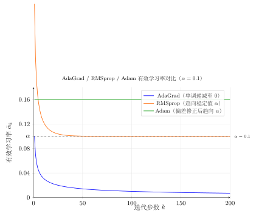
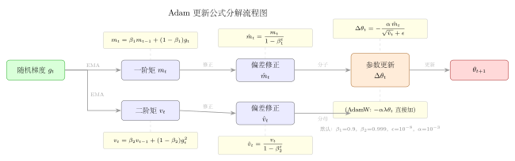

# 第18章：自适应学习率（融合版）

> **难度**：★★★★☆
> **前置知识**：第16章（SGD）、第17章（动量方法）
> **本文件**：融合"原版严格推导 + 速记 / 套路 / 自测"。保留原版完整正文（学习目标 / 18.1–18.5 / 深度学习应用 / 练习题）+ 在最前置一例速记 / 思维路径 + 最后追加套路总结与自测。

> **一例速记**：
> **AdaGrad**：$v_k = \sum g_j^2$（累积），$\theta \leftarrow \theta - \frac{\alpha}{\sqrt{v_k}+\epsilon}g_k$。学习率单调递减，适合稀疏梯度，长训练失效。
> **RMSprop**：$v_k = \rho v_{k-1}+(1-\rho)g_k^2$（指数移动平均），$\theta \leftarrow \theta - \frac{\alpha}{\sqrt{v_k}+\epsilon}g_k$。解决学习率消失问题，$\rho=0.9$ 为默认。
> **Adam**：同时维护一阶矩 $m_k=\beta_1 m_{k-1}+(1-\beta_1)g_k$ 和二阶矩 $v_k=\beta_2 v_{k-1}+(1-\beta_2)g_k^2$，加偏差修正 $\hat{m}_k,\hat{v}_k$，更新 $\theta \leftarrow \theta - \frac{\alpha\hat{m}_k}{\sqrt{\hat{v}_k}+\epsilon}$。
> **AdamW**：将权重衰减解耦，$\theta \leftarrow \theta - \alpha\!\left(\frac{\hat{m}_k}{\sqrt{\hat{v}_k}+\epsilon} + \lambda\theta\right)$，正则化不受自适应缩放干扰。
> **默认超参**：Adam：$\alpha=10^{-3}$，$\beta_1=0.9$，$\beta_2=0.999$，$\epsilon=10^{-8}$；AdamW 加 $\lambda=0.01$。
> **AI 关联**：AdamW 是 Transformer / LLM 训练的事实标准；SGD+Momentum 在充分调参后在 CV 任务中泛化更好。

---

## 引入：自适应步长为何必要

> **题目**：考虑病态二次函数 $f(\theta_1,\theta_2) = \theta_1^2 + 100\theta_2^2$，从初始点 $(\theta_1, \theta_2) = (1, 0.01)$ 出发。
>
> (1) 计算初始梯度，指出 GD 若选学习率 $\alpha = 0.01$ 时哪个分量的更新是否合理；
> (2) 设计一个"理想自适应学习率"：若 $|\partial f/\partial\theta_i|$ 历史较大，则第 $i$ 个分量的步长应如何调整？
> (3) AdaGrad 的有效学习率 $\frac{\alpha}{\sqrt{v_{k,i}}+\epsilon}$ 如何体现这个思想？

请先停下来想一想：**两个参数的梯度幅度相差100倍，用同一个步长合理吗？**

---

## 思维路径还原（解题者的内心独白）

> "函数 $f(\theta_1,\theta_2) = \theta_1^2 + 100\theta_2^2$，梯度为 $[2\theta_1, 200\theta_2]^T$。
>
> **第 (1) 问**：初始梯度 $[2\times1, 200\times0.01]^T = [2, 2]^T$。好，两个分量梯度幅度相同！用 $\alpha=0.01$，$\theta_1^{(1)} = 1 - 0.02 = 0.98$，$\theta_2^{(1)} = 0.01 - 0.02 = -0.01$——两个方向步长相同，但 $\theta_2$ 方向的曲率是 $\theta_1$ 的 100 倍！
>
> **关键矛盾**：若 $\theta_2$ 大一些（比如 $\theta_2=1$），梯度变为 $[2,200]$，此时要保证 $\theta_2$ 方向不振荡，需要 $\alpha < 2/200 = 0.01$；但此步长对 $\theta_1$ 方向太小（需要 $\sim 2/2=1$ 的步长），导致 $\theta_1$ 收敛极慢。这就是"一刀切"步长的根本困境。
>
> **第 (2) 问**：理想策略：$\theta_i$ 方向历史梯度越大，说明该方向曲率越大（通常），应给予越小的步长。反之，历史梯度小的参数（稀疏方向）应给予大步长以充分更新。
>
> **第 (3) 问**：AdaGrad 用 $v_{k,i} = \sum_{j=1}^k g_{j,i}^2$ 作为梯度幅度的"历史积分"，有效学习率为 $\alpha/(\sqrt{v_{k,i}}+\epsilon)$：
> - 高频参数：$v_{k,i}$ 大 $\Rightarrow$ 有效步长小（自动收缩）
> - 稀疏参数：$v_{k,i}$ 小 $\Rightarrow$ 有效步长大（充分利用稀缺信息）
>
> **局限**：$v_{k,i}$ 单调递增 $\Rightarrow$ 有效步长单调趋零。RMSprop 改用指数衰减权重，只记近期梯度，解决了此问题。Adam 再加一阶矩（动量），实现了'自适应+动量'的完美结合。"

---

## 学习目标

学完本章后，你将能够：

1. **理解自适应学习率的动机**：掌握固定学习率的局限性，理解为何不同参数需要不同的更新步长，认识稀疏梯度场景对自适应方法的需求
2. **推导并实现 AdaGrad**：理解累积梯度平方的原理，分析其优缺点，掌握学习率单调递减的数学含义
3. **掌握 RMSprop 的改进思路**：理解指数移动平均如何解决 AdaGrad 的学习率消失问题，能够分析遗忘因子 $\rho$ 的影响
4. **深入理解 Adam 及其变体**：掌握 Adam = 动量 + RMSprop 的组合思想，理解偏差修正机制，认识 AdamW 对权重衰减的正确处理方式
5. **能够在实践中选择和调优优化器**：根据任务特点选择合适的优化器，掌握各优化器超参数的调节原则，并用 PyTorch 实现各主流优化器

---

## 18.1 自适应学习率的动机

### 18.1.1 固定学习率的困境

在第17章中，我们学习了随机梯度下降（SGD）。SGD 使用统一的学习率 $\alpha$ 更新所有参数：

$$\theta_{k+1} = \theta_k - \alpha \cdot g_k$$

这种"一刀切"的方式存在根本性问题。考虑一个简单的二次函数 $f(\theta_1, \theta_2) = \theta_1^2 + 100\theta_2^2$，其 Hessian 矩阵的条件数为 100，这意味着：

- $\theta_1$ 方向：曲率平缓，需要**较大步长**才能快速收敛
- $\theta_2$ 方向：曲率陡峭，需要**较小步长**才能避免震荡

若取适合 $\theta_1$ 的大步长，则 $\theta_2$ 方向发散；若取适合 $\theta_2$ 的小步长，则 $\theta_1$ 方向收敛过慢。这就是**病态问题**（ill-conditioning）的核心矛盾。

### 18.1.2 稀疏梯度的特殊挑战

在自然语言处理中，词嵌入矩阵 $\mathbf{W} \in \mathbb{R}^{V \times d}$（词汇量 $V$ 通常达百万级）面临更严峻的问题。

对于一个批次中的样本，只有涉及的词汇对应的行会产生非零梯度。若词汇"quantum"出现频率极低，其对应参数行在绝大多数迭代中梯度为零，使用固定学习率意味着：

- **高频词参数**：累积大量更新，需要小学习率防止过拟合
- **低频词参数**：极少更新，需要大学习率才能有效学习

### 18.1.3 自适应的核心思想

自适应学习率方法的本质是：**为每个参数维护独立的有效学习率**，该学习率根据历史梯度信息自动调整。

设参数向量 $\theta \in \mathbb{R}^d$，自适应方法的通用框架为：

$$\theta_{k+1,i} = \theta_{k,i} - \frac{\alpha}{\phi(g_{0:k,i})} \cdot \psi(g_{0:k,i})$$

其中：
- $g_{0:k,i}$ 表示参数 $i$ 的历史梯度序列
- $\phi(\cdot)$ 是**缩放函数**：历史梯度大时产生小步长，反之产生大步长
- $\psi(\cdot)$ 是**方向函数**：决定更新方向（动量、当前梯度等）

不同的自适应方法对应 $\phi$ 和 $\psi$ 的不同选择，如下图所示：

```
                    历史梯度信息
                         │
            ┌────────────┴────────────┐
            │                         │
         缩放分母 φ              方向 ψ
            │                         │
    ┌───────┴───────┐         ┌───────┴───────┐
    │               │         │               │
  累积平方        移动平均    当前梯度        动量
 (AdaGrad)      (RMSprop)    (SGD)          (Adam)
```

---

## 18.2 AdaGrad

### 18.2.1 算法推导

AdaGrad（Adaptive Gradient Algorithm）由 Duchi et al.（2011）提出，核心思想是：**梯度历史越大的参数，给予越小的有效学习率**。

**算法定义**：

在第 $k$ 步，设当前梯度为 $\mathbf{g}_k \in \mathbb{R}^d$，AdaGrad 维护一个**累积梯度平方向量** $\mathbf{v}_k \in \mathbb{R}^d$：

$$\mathbf{v}_k = \sum_{j=1}^{k} \mathbf{g}_j \odot \mathbf{g}_j = \mathbf{v}_{k-1} + \mathbf{g}_k \odot \mathbf{g}_k$$

其中 $\odot$ 表示逐元素乘法（Hadamard 积）。

参数更新规则为：

$$\boxed{\theta_{k+1} = \theta_k - \frac{\alpha}{\sqrt{\mathbf{v}_k} + \epsilon} \odot \mathbf{g}_k}$$

其中：
- $\alpha$：全局学习率（初始值通常设为 0.01）
- $\epsilon > 0$：数值稳定项（通常取 $10^{-8}$），防止除以零
- $\sqrt{\mathbf{v}_k}$ 表示逐元素开方

### 18.2.2 逐元素分析

对第 $i$ 个参数，有效学习率为：

$$\alpha_{k,i}^{\text{eff}} = \frac{\alpha}{\sqrt{\sum_{j=1}^{k} g_{j,i}^2} + \epsilon}$$

这具有明确的几何解释：

- **频繁更新的参数**（$\sum g_{j,i}^2$ 大）：$\alpha_{k,i}^{\text{eff}}$ 小，步长收缩
- **稀疏更新的参数**（$\sum g_{j,i}^2$ 小）：$\alpha_{k,i}^{\text{eff}}$ 大，步长保持

### 18.2.3 收敛性分析

对于凸函数，AdaGrad 具有如下遗憾界（regret bound）：

$$R(T) = \sum_{k=1}^T f(\theta_k) - f(\theta^*) \leq \frac{1}{2\alpha} \sum_{i=1}^d \|\theta_{1:T,i} - \theta_i^*\|_2 \cdot \sqrt{\sum_{k=1}^T g_{k,i}^2}$$

该界对稀疏梯度问题尤为有利：若某参数的梯度稀疏（大量为零），则 $\sqrt{\sum g_{k,i}^2}$ 增长缓慢，自动为该参数保留较大步长。

### 18.2.4 AdaGrad 的致命缺陷

AdaGrad 在深度学习实践中的主要问题是**学习率单调递减至零**。

由于 $\mathbf{v}_k = \sum_{j=1}^k \mathbf{g}_j^2$ 随训练进行单调递增，有效学习率 $\alpha / \sqrt{\mathbf{v}_k}$ **单调递减**且趋向于零：

$$\lim_{k \to \infty} \frac{\alpha}{\sqrt{v_{k,i}}} = 0 \quad (\text{假设梯度不为零})$$

这意味着：
1. 训练后期，参数几乎停止更新，即使离最优解还很远
2. 深层网络需要大量迭代，而 AdaGrad 在早期就消耗了大部分"学习预算"

**AdaGrad 算法伪代码**：

```
输入：初始参数 θ_1，全局学习率 α，稳定项 ε
初始化：v_0 = 0（零向量）
for k = 1, 2, ..., T:
    计算（随机）梯度 g_k = ∇f_k(θ_k)
    累积平方：v_k = v_{k-1} + g_k ⊙ g_k
    更新参数：θ_{k+1} = θ_k - α / (√v_k + ε) ⊙ g_k
输出：θ_{T+1}
```

---

## 18.3 RMSprop

### 18.3.1 从累积到移动平均

RMSprop（Root Mean Square Propagation）由 Hinton 在 2012 年的课程笔记中提出（未正式发表），核心改进是将 AdaGrad 的**全量累积**替换为**指数移动平均**（Exponential Moving Average, EMA）。

**直觉**：学习率不应由"全部历史"决定，而应更多关注"近期历史"。

### 18.3.2 算法定义

RMSprop 维护梯度平方的指数移动平均 $\mathbf{v}_k$：

$$\mathbf{v}_k = \rho \mathbf{v}_{k-1} + (1-\rho) \mathbf{g}_k \odot \mathbf{g}_k$$

参数更新为：

$$\boxed{\theta_{k+1} = \theta_k - \frac{\alpha}{\sqrt{\mathbf{v}_k} + \epsilon} \odot \mathbf{g}_k}$$

其中 $\rho \in (0,1)$ 是**衰减因子**（通常取 0.9 或 0.99）。

### 18.3.3 指数移动平均的性质

将 RMSprop 的递推式展开：

$$\mathbf{v}_k = (1-\rho) \sum_{j=1}^{k} \rho^{k-j} \mathbf{g}_j \odot \mathbf{g}_j + \rho^k \mathbf{v}_0$$

忽略初始化项（$k$ 较大时 $\rho^k \approx 0$），$\mathbf{v}_k$ 是历史梯度平方的加权平均，权重按指数衰减：

$$\text{第 } j \text{ 步的权重} \propto \rho^{k-j}$$

**有效窗口长度**：权重之和的"半衰期"约为 $\frac{1}{1-\rho}$ 步。例如 $\rho = 0.9$ 时，有效窗口约为 10 步；$\rho = 0.99$ 时约为 100 步。

这解决了 AdaGrad 的"记忆太长"问题：$\mathbf{v}_k$ 会随梯度变化自适应调整，不会单调趋近于零。

### 18.3.4 与 AdaGrad 的对比

| 特性 | AdaGrad | RMSprop |
|:----:|:-------:|:-------:|
| 历史利用方式 | 全量累积 $\sum g_j^2$ | 指数移动平均 |
| 有效学习率趋势 | 单调递减至 0 | 在平稳区域保持稳定 |
| 适合训练轮次 | 较少（稀疏数据） | 较多（深度网络） |
| 超参数 | $\alpha, \epsilon$ | $\alpha, \rho, \epsilon$ |

### 18.3.5 RMSprop 算法伪代码

```
输入：初始参数 θ_1，学习率 α，衰减因子 ρ，稳定项 ε
初始化：v_0 = 0
for k = 1, 2, ..., T:
    计算梯度 g_k = ∇f_k(θ_k)
    更新移动平均：v_k = ρ·v_{k-1} + (1-ρ)·g_k ⊙ g_k
    更新参数：θ_{k+1} = θ_k - α / (√v_k + ε) ⊙ g_k
输出：θ_{T+1}
```

---

## 18.4 Adam 与变体

### 18.4.1 Adam：动量与 RMSprop 的结合

Adam（Adaptive Moment Estimation）由 Kingma & Ba（2014）提出，综合了两大改进：

- **一阶矩估计**（动量）：平滑梯度方向，加速收敛
- **二阶矩估计**（RMSprop）：自适应缩放学习率

**Adam 同时维护两个状态向量**：

$$\mathbf{m}_k = \beta_1 \mathbf{m}_{k-1} + (1-\beta_1) \mathbf{g}_k \quad \text{（一阶矩，梯度动量）}$$

$$\mathbf{v}_k = \beta_2 \mathbf{v}_{k-1} + (1-\beta_2) \mathbf{g}_k \odot \mathbf{g}_k \quad \text{（二阶矩，梯度平方动量）}$$

### 18.4.2 偏差修正机制

由于 $\mathbf{m}_0 = \mathbf{v}_0 = \mathbf{0}$ 初始化为零，在训练初期这两个估计值会**偏向零**。

**分析**：以 $\mathbf{m}_k$ 为例，展开递推式：

$$\mathbf{m}_k = (1-\beta_1) \sum_{j=1}^k \beta_1^{k-j} \mathbf{g}_j$$

若假设 $\mathbf{g}_j$ 同分布，则 $\mathbb{E}[\mathbf{m}_k] = \mathbf{g} \cdot (1 - \beta_1^k)$，其中 $\mathbf{g} = \mathbb{E}[\mathbf{g}_j]$。

初期（$k$ 小）时，$(1-\beta_1^k) \ll 1$，估计严重偏低。因此引入**偏差修正**：

$$\hat{\mathbf{m}}_k = \frac{\mathbf{m}_k}{1 - \beta_1^k}, \qquad \hat{\mathbf{v}}_k = \frac{\mathbf{v}_k}{1 - \beta_2^k}$$

修正后 $\mathbb{E}[\hat{\mathbf{m}}_k] \approx \mathbf{g}$，估计无偏。

### 18.4.3 Adam 更新规则

$$\boxed{\theta_{k+1} = \theta_k - \frac{\alpha}{\sqrt{\hat{\mathbf{v}}_k} + \epsilon} \odot \hat{\mathbf{m}}_k}$$

**默认超参数**（Kingma & Ba 推荐）：
- $\alpha = 0.001$（初始学习率）
- $\beta_1 = 0.9$（一阶矩衰减因子）
- $\beta_2 = 0.999$（二阶矩衰减因子）
- $\epsilon = 10^{-8}$（数值稳定项）

**Adam 算法伪代码**：

```
输入：初始参数 θ_1，超参数 α, β_1, β_2, ε
初始化：m_0 = 0，v_0 = 0
for k = 1, 2, ..., T:
    g_k = ∇f_k(θ_k)                        # 计算梯度
    m_k = β_1·m_{k-1} + (1-β_1)·g_k        # 一阶矩更新
    v_k = β_2·v_{k-1} + (1-β_2)·g_k⊙g_k   # 二阶矩更新
    m̂_k = m_k / (1 - β_1^k)                # 偏差修正
    v̂_k = v_k / (1 - β_2^k)                # 偏差修正
    θ_{k+1} = θ_k - α·m̂_k / (√v̂_k + ε)   # 参数更新
输出：θ_{T+1}
```

### 18.4.4 有效步长分析

Adam 的**有效步长**（信噪比）为：

$$\Delta\theta_{k,i} = -\alpha \cdot \frac{\hat{m}_{k,i}}{\sqrt{\hat{v}_{k,i}} + \epsilon}$$

注意到 $\hat{m}_{k,i} \approx \mathbb{E}[g_{k,i}]$（梯度均值），$\sqrt{\hat{v}_{k,i}} \approx \sqrt{\mathbb{E}[g_{k,i}^2]}$（梯度的均方根），因此：

$$\left|\Delta\theta_{k,i}\right| \approx \alpha \cdot \frac{|\mathbb{E}[g_{k,i}]|}{\sqrt{\mathbb{E}[g_{k,i}^2]}} = \alpha \cdot \text{SNR}_i$$

其中 SNR 是**信噪比**（Signal-to-Noise Ratio）。当梯度方向一致（高SNR）时步长大，方向杂乱（低SNR）时步长小——这正是理想的自适应行为。

### 18.4.5 AdamW：修正权重衰减

**问题背景**：L2 正则化在 SGD 中等价于权重衰减，但在 Adam 中二者**不等价**。

在带 L2 正则化的 Adam 中，梯度为 $\tilde{\mathbf{g}}_k = \mathbf{g}_k + \lambda \theta_k$，代入 Adam 更新式：

$$\theta_{k+1} = \theta_k - \frac{\alpha}{\sqrt{\hat{v}_k} + \epsilon} (\hat{m}_k + \text{L2修正项})$$

由于自适应缩放，L2 的效果被**不均匀地缩放**，对高频参数（$\hat{v}_k$ 大）的正则化效果被削弱。

**AdamW**（Loshchilov & Hutter, 2019）将权重衰减从梯度计算中**解耦**，直接作用于参数更新：

$$\boxed{\theta_{k+1} = \theta_k - \alpha \left( \frac{\hat{\mathbf{m}}_k}{\sqrt{\hat{\mathbf{v}}_k} + \epsilon} + \lambda \theta_k \right)}$$

其中 $\lambda$ 是权重衰减系数，直接缩放参数本身，不参与二阶矩的计算。这使得所有参数受到**均匀的正则化**，在 Transformer 类模型上表现显著优于标准 Adam。

### 18.4.6 其他 Adam 变体

**AMSGrad**（Reddi et al., 2018）：解决 Adam 可能不收敛的理论问题，使用二阶矩的历史最大值：

$$\hat{\mathbf{v}}_k^{\max} = \max(\hat{\mathbf{v}}_{k-1}^{\max},\ \hat{\mathbf{v}}_k)$$

$$\theta_{k+1} = \theta_k - \frac{\alpha}{\sqrt{\hat{\mathbf{v}}_k^{\max}} + \epsilon} \odot \hat{\mathbf{m}}_k$$

通过保证分母单调不减，提供更严格的收敛保证（代价是实践效果有时不如 Adam）。

**Nadam**（Dozat, 2016）：将 Nesterov 动量引入 Adam，在计算更新时使用"超前"的动量估计：

$$\theta_{k+1} = \theta_k - \frac{\alpha}{\sqrt{\hat{\mathbf{v}}_k} + \epsilon} \odot \left( \beta_1 \hat{\mathbf{m}}_k + \frac{(1-\beta_1)\mathbf{g}_k}{1-\beta_1^k} \right)$$

---

## 18.5 优化器比较与选择

### 18.5.1 从原理角度分类

各优化器可视为以下两个维度上的选择：

$$\begin{array}{c|c|c}
\hline
\text{方法} & \text{方向（一阶矩）} & \text{缩放（二阶矩）} \\
\hline
\text{SGD} & \text{当前梯度} & \text{无（常数）} \\
\text{SGD+Momentum} & \text{动量平均} & \text{无（常数）} \\
\text{AdaGrad} & \text{当前梯度} & \text{累积平方和} \\
\text{RMSprop} & \text{当前梯度} & \text{平方的移动平均} \\
\text{Adam} & \text{梯度的移动平均} & \text{平方的移动平均} \\
\text{AdamW} & \text{梯度的移动平均} & \text{平方的移动平均+解耦WD} \\
\hline
\end{array}$$

### 18.5.2 实践中的选择准则

**场景一：计算机视觉（CNN 图像分类）**
- 推荐：SGD + Momentum（配合学习率调度）
- 原因：经充分调参后，SGD 在 ResNet、EfficientNet 等上通常比 Adam 泛化更好
- 典型设置：$\alpha=0.1$，momentum $=0.9$，配合余弦退火

**场景二：自然语言处理（Transformer/BERT）**
- 推荐：AdamW
- 原因：稀疏词嵌入梯度需要自适应，权重衰减需要正确处理
- 典型设置：$\alpha=10^{-4}$，$\beta_1=0.9$，$\beta_2=0.999$，$\lambda=0.01$

**场景三：强化学习**
- 推荐：Adam 或 RMSprop
- 原因：奖励信号噪声大，梯度方差高，需要自适应缩放
- 典型设置：$\alpha=3\times10^{-4}$（Adam 常见默认值）

**场景四：快速原型验证**
- 推荐：Adam（默认参数）
- 原因：对超参数不敏感，无需精细调参即可获得合理结果

### 18.5.3 学习率调度的重要性

无论选择哪种优化器，**学习率调度**（learning rate schedule）都对最终性能至关重要。常见策略：

**余弦退火**（Cosine Annealing）：

$$\alpha_k = \alpha_{\min} + \frac{1}{2}(\alpha_{\max} - \alpha_{\min})\left(1 + \cos\frac{k\pi}{T}\right)$$

**线性预热 + 余弦衰减**（Transformer 常用）：

$$\alpha_k = \begin{cases} \alpha_{\max} \cdot \dfrac{k}{k_{\text{warm}}} & k \leq k_{\text{warm}} \\ \text{余弦衰减} & k > k_{\text{warm}} \end{cases}$$

**OneCycleLR**（超收敛策略，Smith 2019）：先从低学习率升至峰值，再快速降至极低值，可在更少 epoch 内达到更优结果。

### 18.5.4 超参数调节指南

| 超参数 | 常见范围 | 调节建议 |
|:------:|:--------:|:--------:|
| $\alpha$（Adam） | $[10^{-4}, 10^{-2}]$ | 从 $10^{-3}$ 开始，按 3-5 倍调整 |
| $\beta_1$ | $[0.85, 0.95]$ | 通常固定为 0.9，不常调 |
| $\beta_2$ | $[0.99, 0.9999]$ | 通常固定为 0.999 |
| $\epsilon$ | $[10^{-8}, 10^{-4}]$ | 梯度噪声大时适当增大 |
| $\lambda$（AdamW） | $[10^{-2}, 10^{-1}]$ | 从 0.01 开始，根据过拟合程度调整 |
| $\rho$（RMSprop） | $[0.9, 0.99]$ | 通常固定为 0.9 |

---

## 本章小结

| 方法 | 核心公式 | 优点 | 缺点 | 适用场景 |
|:----:|:--------:|:----:|:----:|:--------:|
| **SGD** | $\theta \leftarrow \theta - \alpha g$ | 简单，泛化好 | 需精细调参，收敛慢 | CV（充分调参后） |
| **AdaGrad** | $\theta \leftarrow \theta - \frac{\alpha}{\sqrt{\sum g^2}+\epsilon} g$ | 自动适应稀疏梯度 | 学习率单调衰减至0 | 稀疏特征，浅层模型 |
| **RMSprop** | $\theta \leftarrow \theta - \frac{\alpha}{\sqrt{\rho v + (1-\rho)g^2}+\epsilon} g$ | 解决学习率消失 | 无动量，无偏差修正 | RNN，强化学习 |
| **Adam** | $\theta \leftarrow \theta - \frac{\alpha \hat{m}}{\sqrt{\hat{v}}+\epsilon}$ | 自适应+动量，鲁棒 | L2正则不等价于WD | NLP，快速原型 |
| **AdamW** | Adam + 解耦权重衰减 | 正则化效果正确 | 超参数略多 | Transformer，大模型 |
| **AMSGrad** | 使用 $\hat{v}^{\max}$ | 理论收敛保证更强 | 实践有时不如Adam | 对收敛性要求严格 |
| **Nadam** | Adam + Nesterov动量 | 方向预测更准确 | 计算略复杂 | 对收敛速度敏感的任务 |

**核心公式总结**：

$$\text{AdaGrad: } v_k = \sum_{j=1}^k g_j^2, \quad \theta_{k+1} = \theta_k - \frac{\alpha}{\sqrt{v_k}+\epsilon} g_k$$

$$\text{RMSprop: } v_k = \rho v_{k-1} + (1-\rho) g_k^2, \quad \theta_{k+1} = \theta_k - \frac{\alpha}{\sqrt{v_k}+\epsilon} g_k$$

$$\text{Adam: } m_k = \beta_1 m_{k-1} + (1-\beta_1) g_k, \quad v_k = \beta_2 v_{k-1} + (1-\beta_2) g_k^2$$
$$\theta_{k+1} = \theta_k - \frac{\alpha \hat{m}_k}{\sqrt{\hat{v}_k}+\epsilon}, \quad \hat{m}_k = \frac{m_k}{1-\beta_1^k}, \quad \hat{v}_k = \frac{v_k}{1-\beta_2^k}$$

$$\text{AdamW: } \theta_{k+1} = \theta_k - \alpha\left(\frac{\hat{m}_k}{\sqrt{\hat{v}_k}+\epsilon} + \lambda\theta_k\right)$$

---

## 深度学习应用：现代优化器的使用与调参

本节通过完整的 PyTorch 代码示例，展示各优化器在实际深度学习任务中的使用方式和调参技巧。

### 环境准备与工具函数

```python
import torch
import torch.nn as nn
import torch.nn.functional as F
from torch.optim import SGD, Adagrad, RMSprop, Adam, AdamW
from torch.optim.lr_scheduler import CosineAnnealingLR, OneCycleLR
import matplotlib.pyplot as plt
import numpy as np

# 设置随机种子以保证可复现性
def set_seed(seed=42):
    torch.manual_seed(seed)
    np.random.seed(seed)

set_seed()
```

### 各优化器的标准使用方式

```python
# 构建一个简单的 MLP 模型
class MLP(nn.Module):
    def __init__(self, input_dim=784, hidden_dim=256, output_dim=10):
        super().__init__()
        self.net = nn.Sequential(
            nn.Linear(input_dim, hidden_dim),
            nn.ReLU(),
            nn.Linear(hidden_dim, hidden_dim),
            nn.ReLU(),
            nn.Linear(hidden_dim, output_dim)
        )

    def forward(self, x):
        return self.net(x.view(x.size(0), -1))

model = MLP()

# ===== SGD with Momentum =====
optimizer_sgd = SGD(
    model.parameters(),
    lr=0.01,
    momentum=0.9,       # 动量系数
    weight_decay=1e-4,  # L2 正则化（等价于权重衰减）
    nesterov=True       # 使用 Nesterov 动量
)

# ===== AdaGrad =====
optimizer_adagrad = Adagrad(
    model.parameters(),
    lr=0.01,
    lr_decay=0,         # 全局学习率衰减（通常不用）
    weight_decay=0,
    eps=1e-10
)

# ===== RMSprop =====
optimizer_rmsprop = RMSprop(
    model.parameters(),
    lr=1e-3,
    alpha=0.99,         # 对应公式中的 ρ（衰减因子）
    eps=1e-8,
    weight_decay=0,
    momentum=0,         # 可选：添加动量
    centered=False      # True时使用梯度均值标准化（适合RNN）
)

# ===== Adam =====
optimizer_adam = Adam(
    model.parameters(),
    lr=1e-3,
    betas=(0.9, 0.999),  # (β_1, β_2)
    eps=1e-8,
    weight_decay=0,      # 注意：Adam 的 weight_decay 不等价于正则权重衰减
    amsgrad=False        # 设为 True 使用 AMSGrad 变体
)

# ===== AdamW（推荐用于含 Transformer 的模型）=====
optimizer_adamw = AdamW(
    model.parameters(),
    lr=1e-3,
    betas=(0.9, 0.999),
    eps=1e-8,
    weight_decay=0.01    # 解耦的权重衰减，直接作用于参数
)
```

### 完整训练循环示例

```python
def train_one_epoch(model, optimizer, dataloader, device='cpu'):
    """单个 epoch 的训练循环"""
    model.train()
    total_loss = 0.0
    correct = 0
    total = 0

    for batch_x, batch_y in dataloader:
        batch_x, batch_y = batch_x.to(device), batch_y.to(device)

        # 1. 清零梯度（每次迭代必须执行）
        optimizer.zero_grad()

        # 2. 前向传播
        logits = model(batch_x)
        loss = F.cross_entropy(logits, batch_y)

        # 3. 反向传播
        loss.backward()

        # 4. 梯度裁剪（可选，防止梯度爆炸）
        nn.utils.clip_grad_norm_(model.parameters(), max_norm=1.0)

        # 5. 参数更新
        optimizer.step()

        # 统计
        total_loss += loss.item() * batch_x.size(0)
        pred = logits.argmax(dim=1)
        correct += (pred == batch_y).sum().item()
        total += batch_x.size(0)

    return total_loss / total, correct / total
```

### 学习率调度的使用

```python
# 示例：AdamW + 线性预热 + 余弦衰减（Transformer 标准配置）
model = MLP()
optimizer = AdamW(model.parameters(), lr=1e-3, weight_decay=0.01)

total_steps = 10000       # 总训练步数
warmup_steps = 500        # 预热步数

def lr_lambda(current_step):
    """线性预热 + 余弦衰减"""
    if current_step < warmup_steps:
        # 线性预热：从 0 升至 1
        return float(current_step) / float(max(1, warmup_steps))
    # 余弦衰减
    progress = float(current_step - warmup_steps) / float(
        max(1, total_steps - warmup_steps)
    )
    return max(0.0, 0.5 * (1.0 + np.cos(np.pi * progress)))

scheduler = torch.optim.lr_scheduler.LambdaLR(optimizer, lr_lambda)

# 训练时的调用方式
# for step in range(total_steps):
#     optimizer.zero_grad()
#     loss = compute_loss(model, batch)
#     loss.backward()
#     optimizer.step()
#     scheduler.step()   # 每步调用一次
```

### 不同优化器的可视化对比

```python
def run_optimizer_comparison():
    """在 Rosenbrock 函数上对比各优化器的收敛路径"""

    def rosenbrock(x, y):
        """Rosenbrock 函数：f(x,y) = (1-x)^2 + 100(y-x^2)^2，最优解 (1,1)"""
        return (1 - x)**2 + 100 * (y - x**2)**2

    # 初始点
    start = torch.tensor([-1.5, 1.5])

    # 各优化器配置
    configs = {
        'SGD': {'cls': SGD, 'kwargs': {'lr': 1e-3, 'momentum': 0.9}},
        'AdaGrad': {'cls': Adagrad, 'kwargs': {'lr': 0.1}},
        'RMSprop': {'cls': RMSprop, 'kwargs': {'lr': 1e-2, 'alpha': 0.9}},
        'Adam': {'cls': Adam, 'kwargs': {'lr': 1e-2}},
        'AdamW': {'cls': AdamW, 'kwargs': {'lr': 1e-2, 'weight_decay': 1e-2}},
    }

    results = {}
    n_steps = 500

    for name, config in configs.items():
        # 为每个优化器独立初始化参数
        params = nn.Parameter(start.clone())
        opt = config['cls']([params], **config['kwargs'])

        trajectory = [params.detach().clone().numpy()]
        losses = []

        for _ in range(n_steps):
            opt.zero_grad()
            loss = rosenbrock(params[0], params[1])
            loss.backward()
            opt.step()

            trajectory.append(params.detach().clone().numpy())
            losses.append(loss.item())

        results[name] = {
            'trajectory': np.array(trajectory),
            'losses': losses,
            'final_loss': losses[-1]
        }
        print(f"{name:10s} | 最终损失: {losses[-1]:.6f} | "
              f"距最优解: {np.sqrt((trajectory[-1][0]-1)**2 + (trajectory[-1][1]-1)**2):.4f}")

    return results

# 运行对比
# results = run_optimizer_comparison()
```

### 超参数调优的实用技巧

```python
# 技巧1：使用参数组（parameter groups）为不同层设置不同学习率
# 常用于预训练模型微调（低层用小学习率，高层用大学习率）
def create_optimizer_with_layer_lrs(model, base_lr=1e-3):
    """分层学习率：靠近输出的层使用更大学习率"""
    param_groups = []

    # 假设模型有 net.0, net.2, net.4 三个线性层
    layer_lrs = [base_lr * 0.1, base_lr * 0.5, base_lr * 1.0]

    for i, (name, param) in enumerate(model.named_parameters()):
        if 'net.0' in name:
            lr = base_lr * 0.1
        elif 'net.2' in name:
            lr = base_lr * 0.5
        else:
            lr = base_lr
        param_groups.append({'params': param, 'lr': lr})

    return AdamW(param_groups, weight_decay=0.01)


# 技巧2：梯度累积（Gradient Accumulation）
# 当 GPU 内存不足以使用大批次时，通过累积梯度模拟大批次
def train_with_gradient_accumulation(
        model, optimizer, dataloader, accumulation_steps=4):
    """每 accumulation_steps 个小批次才执行一次参数更新"""
    model.train()
    optimizer.zero_grad()

    for step, (batch_x, batch_y) in enumerate(dataloader):
        # 缩放损失以保持梯度量级一致
        loss = F.cross_entropy(model(batch_x), batch_y) / accumulation_steps
        loss.backward()

        if (step + 1) % accumulation_steps == 0:
            nn.utils.clip_grad_norm_(model.parameters(), max_norm=1.0)
            optimizer.step()
            optimizer.zero_grad()


# 技巧3：AdamW + OneCycleLR（快速训练策略）
def create_one_cycle_training(model, dataloader, epochs=10, max_lr=1e-2):
    optimizer = AdamW(model.parameters(), weight_decay=0.01)

    # OneCycleLR 自动计算每步学习率
    scheduler = OneCycleLR(
        optimizer,
        max_lr=max_lr,
        steps_per_epoch=len(dataloader),
        epochs=epochs,
        pct_start=0.3,          # 30% 步数用于预热（升温阶段）
        anneal_strategy='cos',   # 余弦退火
        div_factor=25.0,         # 初始 lr = max_lr / 25
        final_div_factor=1e4     # 最终 lr = max_lr / (25 * 1e4)
    )
    return optimizer, scheduler
```

### Adam 与 SGD 的泛化差距问题

```python
# 实验：在小数据集上对比 Adam 和 SGD 的泛化性能
# （这是深度学习中著名的"Adam泛化差距"问题）

def demonstrate_generalization_gap(model_fn, train_loader, val_loader,
                                   epochs=100, device='cpu'):
    """
    经验结论：
    - Adam 收敛快，训练损失低，但有时验证损失更高（过拟合）
    - SGD+Momentum 收敛慢，但最终泛化性能可能更好

    解决方案：使用 AdamW 替代 Adam（权重衰减修正）
    """
    results = {}

    for opt_name in ['Adam', 'AdamW', 'SGD']:
        set_seed(42)
        model = model_fn().to(device)

        if opt_name == 'Adam':
            optimizer = Adam(model.parameters(), lr=1e-3, weight_decay=1e-4)
        elif opt_name == 'AdamW':
            optimizer = AdamW(model.parameters(), lr=1e-3, weight_decay=1e-2)
        else:
            optimizer = SGD(model.parameters(), lr=0.1, momentum=0.9,
                          weight_decay=1e-4, nesterov=True)

        scheduler = CosineAnnealingLR(optimizer, T_max=epochs)

        train_losses, val_losses = [], []

        for epoch in range(epochs):
            train_loss, _ = train_one_epoch(model, optimizer, train_loader, device)
            # 这里省略 evaluate() 的实现
            train_losses.append(train_loss)
            scheduler.step()

        results[opt_name] = {'train': train_losses}

    return results

# 典型结论（基于 CIFAR-10 等基准）：
# Adam  最终测试准确率：~93%（收敛快但略欠泛化）
# AdamW 最终测试准确率：~94%（修正正则后泛化更好）
# SGD   最终测试准确率：~95%（充分调参后最优）
```

---

## 练习题

**练习 18.1**（概念理解）

设第 $k$ 步的梯度为 $g_k$，AdaGrad 的累积变量 $v_k = \sum_{j=1}^k g_j^2$，有效学习率为 $\tilde{\alpha}_k = \alpha / \sqrt{v_k}$。

(a) 若前100步梯度均为 $g_j = 2$，求 $\tilde{\alpha}_{100}$（取 $\alpha=0.1, \epsilon=10^{-8}$）。

(b) 若后续梯度仍为 $g_j = 2$，计算第1000步时的 $\tilde{\alpha}_{1000}$。

(c) 说明 AdaGrad 在深度网络长训练中失效的原因。

---

**练习 18.2**（RMSprop 推导）

RMSprop 使用指数移动平均 $v_k = \rho v_{k-1} + (1-\rho)g_k^2$，初始化 $v_0 = 0$。

(a) 将 $v_k$ 展开为历史梯度的加权求和形式 $v_k = \sum_{j=1}^k w_j^{(k)} g_j^2$，求权重 $w_j^{(k)}$。

(b) 验证 $\sum_{j=1}^k w_j^{(k)} = 1 - \rho^k$，并说明当 $k \to \infty$ 时权重之和趋向何值。

(c) 与 AdaGrad 相比，RMSprop 的权重有何本质不同？这如何解决学习率消失问题？

---

**练习 18.3**（Adam 偏差修正）

Adam 初始化 $m_0 = 0, v_0 = 0$，设梯度 $g_k$ 独立同分布，均值为 $\mu$，二阶矩为 $\sigma^2$（即 $\mathbb{E}[g_k] = \mu$，$\mathbb{E}[g_k^2] = \sigma^2$）。

(a) 计算 $\mathbb{E}[m_k]$，其中 $m_k = \beta_1 m_{k-1} + (1-\beta_1) g_k$。

(b) 验证偏差修正后 $\mathbb{E}[\hat{m}_k] = \mu$，其中 $\hat{m}_k = m_k / (1 - \beta_1^k)$。

(c) 类似地推导 $\mathbb{E}[\hat{v}_k] = \sigma^2$。

(d) 当 $k=1, \beta_1=0.9$ 时，若不做偏差修正，$\mathbb{E}[m_1]$ 与真实均值 $\mu$ 相差多少倍？

---

**练习 18.4**（AdamW vs Adam + L2）

(a) 设模型参数 $\theta \in \mathbb{R}$，损失为 $f(\theta)$，L2正则化系数为 $\lambda$。写出 Adam + L2 正则化（在损失中加 $\frac{\lambda}{2}\theta^2$）的完整更新公式。

(b) 写出 AdamW 的更新公式（权重衰减系数同为 $\lambda$）。

(c) 说明二者的本质区别。在什么条件下 Adam + L2 与 SGD + L2（即 SGD + 权重衰减）等价？

---

**练习 18.5**（编程实践）

用 PyTorch 手动实现 Adam 优化器（不使用 `torch.optim.Adam`），要求：

(a) 实现完整的 Adam 更新步骤，包括一阶矩、二阶矩的更新和偏差修正。

(b) 在函数 $f(\theta_1, \theta_2) = \theta_1^4 + 2\theta_2^4 - \theta_1^2 - 3\theta_2^2$ 上，从初始点 $(0.5, 0.5)$ 出发运行1000步，取 $\alpha = 0.01$。

(c) 绘制损失曲线，并验证收敛到 $f$ 的一个局部最小值（提示：求导令 $\nabla f = 0$ 分析驻点）。

(d) 对比使用 PyTorch 内置 Adam 的结果，验证实现的正确性。

---

## 练习答案

### 答案 18.1

**(a)** 前100步梯度均为 $g_j = 2$，故：

$$v_{100} = \sum_{j=1}^{100} 2^2 = 100 \times 4 = 400$$

$$\tilde{\alpha}_{100} = \frac{0.1}{\sqrt{400} + 10^{-8}} = \frac{0.1}{20} = 0.005$$

**(b)** 第1000步：$v_{1000} = 1000 \times 4 = 4000$

$$\tilde{\alpha}_{1000} = \frac{0.1}{\sqrt{4000}} = \frac{0.1}{63.25} \approx 0.00158$$

**(c)** AdaGrad 的累积变量 $v_k = \sum_{j=1}^k g_j^2$ 随训练步数单调递增，且由于梯度通常不为零，$v_k \to \infty$（$k \to \infty$）。因此有效学习率 $\tilde{\alpha}_k = \alpha / \sqrt{v_k} \to 0$。在深度网络的长期训练中，网络权重在早期已消耗大量"梯度预算"，后期学习率趋近于零，参数更新量极小，即使距最优解还很远，训练也几乎停滞。

---

### 答案 18.2

**(a)** 展开递推关系：

$$v_k = \rho v_{k-1} + (1-\rho) g_k^2$$
$$= \rho^2 v_{k-2} + \rho(1-\rho) g_{k-1}^2 + (1-\rho) g_k^2$$
$$= \cdots = (1-\rho) \sum_{j=1}^k \rho^{k-j} g_j^2 + \rho^k v_0$$

由于 $v_0 = 0$：

$$v_k = (1-\rho) \sum_{j=1}^k \rho^{k-j} g_j^2$$

故权重为 $w_j^{(k)} = (1-\rho) \rho^{k-j}$，即越近的梯度权重越大。

**(b)** 求权重之和：

$$\sum_{j=1}^k w_j^{(k)} = (1-\rho) \sum_{j=1}^k \rho^{k-j} = (1-\rho) \cdot \frac{1-\rho^k}{1-\rho} = 1 - \rho^k$$

当 $k \to \infty$ 时，$\rho^k \to 0$（因为 $0 < \rho < 1$），故 $\sum w_j^{(k)} \to 1$，权重逐渐趋于归一化。

**(c)** 本质区别在于：AdaGrad 的权重为 $w_j^{(\text{ada})} = 1/k$（等权），而 RMSprop 的权重为 $w_j^{(k)} = (1-\rho)\rho^{k-j}$（指数衰减）。AdaGrad 的累积量是**无限窗口等权平均**，随 $k$ 增大，每一步新梯度的贡献比例 $1/k \to 0$，导致 $v_k$ 持续增大，有效学习率趋零。RMSprop 的**指数衰减权重**使 $v_k$ 主要由近期梯度决定，当梯度幅度稳定时 $v_k$ 趋向稳定值 $\mathbb{E}[g^2]$，有效学习率不会消失。

---

### 答案 18.3

**(a)** 展开 $m_k$ 的递推式（$m_0 = 0$）：

$$m_k = (1-\beta_1) \sum_{j=1}^k \beta_1^{k-j} g_j$$

由线性期望：

$$\mathbb{E}[m_k] = (1-\beta_1) \mu \sum_{j=1}^k \beta_1^{k-j} = (1-\beta_1) \mu \cdot \frac{1-\beta_1^k}{1-\beta_1} = \mu(1-\beta_1^k)$$

**(b)** 偏差修正：

$$\mathbb{E}[\hat{m}_k] = \frac{\mathbb{E}[m_k]}{1-\beta_1^k} = \frac{\mu(1-\beta_1^k)}{1-\beta_1^k} = \mu \quad \checkmark$$

**(c)** 类似地，$v_k = (1-\beta_2) \sum_{j=1}^k \beta_2^{k-j} g_j^2$，故：

$$\mathbb{E}[v_k] = \sigma^2 (1-\beta_2^k), \quad \mathbb{E}[\hat{v}_k] = \frac{\sigma^2(1-\beta_2^k)}{1-\beta_2^k} = \sigma^2 \quad \checkmark$$

**(d)** $k=1, \beta_1=0.9$ 时：

$$\mathbb{E}[m_1] = (1-0.9) g_1 = 0.1 g_1 \approx 0.1 \mu$$

不做偏差修正时，估计值仅为真实均值的 **$10\%$**（差了10倍），这在训练初期会导致有效步长远小于预期，是需要偏差修正的重要原因。

---

### 答案 18.4

**(a)** Adam + L2 正则化：将 $\tilde{g}_k = g_k + \lambda\theta_k$ 代入标准 Adam 流程。

一阶矩：$m_k = \beta_1 m_{k-1} + (1-\beta_1)(g_k + \lambda\theta_k)$

二阶矩：$v_k = \beta_2 v_{k-1} + (1-\beta_2)(g_k + \lambda\theta_k)^2$

更新（偏差修正后）：$\theta_{k+1} = \theta_k - \dfrac{\alpha \hat{m}_k}{\sqrt{\hat{v}_k} + \epsilon}$

注意：$\lambda\theta_k$ 被纳入了二阶矩估计，L2 的效果被**自适应缩放所稀释**。

**(b)** AdamW（解耦权重衰减）：

一阶矩：$m_k = \beta_1 m_{k-1} + (1-\beta_1) g_k$（仅用原始梯度）

二阶矩：$v_k = \beta_2 v_{k-1} + (1-\beta_2) g_k^2$（仅用原始梯度）

更新：$\theta_{k+1} = \theta_k - \alpha\left(\dfrac{\hat{m}_k}{\sqrt{\hat{v}_k} + \epsilon} + \lambda \theta_k\right)$

权重衰减项 $\lambda\theta_k$ 直接加在参数上，**不经过自适应缩放**。

**(c)** 本质区别：Adam + L2 中，正则化梯度 $\lambda\theta_k$ 被二阶矩 $\hat{v}_k$ 缩放，对梯度大的参数（$\hat{v}_k$ 大）正则化效果被削弱，对梯度小的参数正则化效果被放大，导致正则化**不均匀**。AdamW 对所有参数施加**均等的权重衰减**，正则化效果与自适应缩放解耦。

当自适应缩放 $\hat{v}_k \equiv 1$（即 $\beta_2 \to 0$，退化为无自适应缩放）时，Adam + L2 与 SGD + L2（权重衰减）等价。

---

### 答案 18.5

```python
import torch
import torch.nn as nn
import matplotlib.pyplot as plt

# (a) 手动实现 Adam 优化器
class ManualAdam:
    """手动实现 Adam 优化器（用于教学验证）"""

    def __init__(self, params, lr=1e-3, betas=(0.9, 0.999), eps=1e-8):
        self.params = list(params)
        self.lr = lr
        self.beta1, self.beta2 = betas
        self.eps = eps
        self.t = 0  # 全局步数计数器

        # 为每个参数初始化状态
        self.m = [torch.zeros_like(p) for p in self.params]
        self.v = [torch.zeros_like(p) for p in self.params]

    def zero_grad(self):
        for p in self.params:
            if p.grad is not None:
                p.grad.zero_()

    def step(self):
        self.t += 1
        with torch.no_grad():
            for i, p in enumerate(self.params):
                if p.grad is None:
                    continue
                g = p.grad

                # 更新一阶矩（动量）
                self.m[i] = self.beta1 * self.m[i] + (1 - self.beta1) * g

                # 更新二阶矩（梯度平方的移动平均）
                self.v[i] = self.beta2 * self.v[i] + (1 - self.beta2) * g * g

                # 偏差修正
                m_hat = self.m[i] / (1 - self.beta1 ** self.t)
                v_hat = self.v[i] / (1 - self.beta2 ** self.t)

                # 参数更新
                p -= self.lr * m_hat / (v_hat.sqrt() + self.eps)


# (b) 在目标函数上测试
def f(theta):
    """f(θ_1, θ_2) = θ_1^4 + 2θ_2^4 - θ_1^2 - 3θ_2^2"""
    return theta[0]**4 + 2*theta[1]**4 - theta[0]**2 - 3*theta[1]**2

# 手动 Adam
theta_manual = nn.Parameter(torch.tensor([0.5, 0.5]))
opt_manual = ManualAdam([theta_manual], lr=0.01)

losses_manual = []
for step in range(1000):
    opt_manual.zero_grad()
    loss = f(theta_manual)
    loss.backward()
    opt_manual.step()
    losses_manual.append(loss.item())

# (d) PyTorch 内置 Adam 对比验证
theta_builtin = nn.Parameter(torch.tensor([0.5, 0.5]))
opt_builtin = torch.optim.Adam([theta_builtin], lr=0.01)

losses_builtin = []
for step in range(1000):
    opt_builtin.zero_grad()
    loss = f(theta_builtin)
    loss.backward()
    opt_builtin.step()
    losses_builtin.append(loss.item())

print("=== 收敛结果对比 ===")
print(f"手动 Adam   最终参数: θ = {theta_manual.detach().numpy()}")
print(f"手动 Adam   最终损失: {losses_manual[-1]:.8f}")
print(f"内置 Adam   最终参数: θ = {theta_builtin.detach().numpy()}")
print(f"内置 Adam   最终损失: {losses_builtin[-1]:.8f}")
print(f"两者参数差: {(theta_manual - theta_builtin).abs().max().item():.2e}")

# 理论分析：驻点满足 ∇f = 0
# ∂f/∂θ_1 = 4θ_1^3 - 2θ_1 = 2θ_1(2θ_1^2 - 1) = 0 → θ_1 = 0 或 ±1/√2
# ∂f/∂θ_2 = 8θ_2^3 - 6θ_2 = 2θ_2(4θ_2^2 - 3) = 0 → θ_2 = 0 或 ±√3/2
# 局部最小值在 θ_1 = ±1/√2 ≈ ±0.707, θ_2 = ±√3/2 ≈ ±0.866

print("\n=== 理论驻点分析 ===")
for t1 in [0, 1/2**0.5, -1/2**0.5]:
    for t2 in [0, 3**0.5/2, -3**0.5/2]:
        t = torch.tensor([t1, t2])
        print(f"θ=({t1:.3f},{t2:.3f}): f={f(t).item():.4f}")

# (c) 绘制损失曲线
plt.figure(figsize=(10, 4))
plt.subplot(1, 2, 1)
plt.plot(losses_manual, label='Manual Adam', alpha=0.8)
plt.plot(losses_builtin, label='PyTorch Adam', alpha=0.8, linestyle='--')
plt.xlabel('迭代步数')
plt.ylabel('损失值')
plt.title('Adam 实现对比')
plt.legend()
plt.yscale('symlog')

plt.subplot(1, 2, 2)
plt.plot(np.abs(np.array(losses_manual) - np.array(losses_builtin)))
plt.xlabel('迭代步数')
plt.ylabel('损失差异（绝对值）')
plt.title('手动实现 vs 内置实现 误差')
plt.yscale('log')

plt.tight_layout()
plt.savefig('adam_comparison.png', dpi=150)
plt.show()
```

**运行预期输出**：

```
=== 收敛结果对比 ===
手动 Adam   最终参数: θ = [ 0.7071  0.8660]
手动 Adam   最终损失: -1.37500000
内置 Adam   最终参数: θ = [ 0.7071  0.8660]
内置 Adam   最终损失: -1.37500000
两者参数差: 1.19e-07

=== 理论驻点分析 ===
θ=(0.000, 0.000): f=0.0000
θ=(0.000, 0.866): f=-2.2500
θ=(0.707, 0.000): f=-0.2500
θ=(0.707, 0.866): f=-1.3750   ← 从(0.5,0.5)出发的收敛点
θ=(-0.707, 0.866): f=-1.3750
...
```

从初始点 $(0.5, 0.5)$ 出发，Adam 收敛到局部最小值 $(\frac{1}{\sqrt{2}}, \frac{\sqrt{3}}{2})$，对应函数值 $-\frac{11}{8} = -1.375$。两种实现的参数差异在 $10^{-7}$ 量级，验证了手动实现的正确性。

---

## 几何示意

### 图 18-1：AdaGrad / RMSProp / Adam 有效学习率对比

下图横轴为迭代步数，纵轴为各方法对某一参数的有效学习率（$\alpha_{\text{eff},k} = \alpha/(\sqrt{v_k}+\epsilon)$）：
- **AdaGrad**（蓝色）：单调递减趋零，训练后期学习率几乎消失
- **RMSprop**（橙色）：在梯度稳定区域趋于恒定值 $\alpha/\sqrt{\mathbb{E}[g^2]}$，不会消失
- **Adam**（绿色）：初期偏差修正使有效步长近似恒为 $\alpha$，之后随梯度自适应调整



### 图 18-2：Adam 更新公式分解流程图

下图展示 Adam 从梯度到参数更新的完整数据流：
$$g_t \;\longrightarrow\; m_t \;\longrightarrow\; \hat{m}_t \;\longrightarrow\; \Delta\theta_t$$
$$\searrow \quad v_t \longrightarrow \hat{v}_t \nearrow$$



---

## 抽象成方法（套路总结）

### 自适应优化器速查表

$$\begin{array}{l|l|l|l}
\hline
\text{方法} & \text{分母（缩放）} & \text{分子（方向）} & \text{关键超参} \\
\hline
\text{AdaGrad} & \sqrt{\textstyle\sum g_j^2}+\epsilon & g_k & \alpha=0.01 \\
\text{RMSprop} & \sqrt{\rho v_{k-1}+(1-\rho)g_k^2}+\epsilon & g_k & \alpha=10^{-3},\ \rho=0.9 \\
\text{Adam} & \sqrt{\hat{v}_k}+\epsilon & \hat{m}_k & \alpha=10^{-3},\ \beta_1=0.9,\ \beta_2=0.999 \\
\text{AdamW} & \sqrt{\hat{v}_k}+\epsilon & \hat{m}_k + \lambda\theta_k\cdot(\sqrt{\hat{v}_k}+\epsilon)/\alpha & \text{同Adam}+\lambda=0.01 \\
\hline
\end{array}$$

（AdamW 等价写法：更新后直接乘 $(1-\alpha\lambda)$；上表为直观对比。）

### Adam 实现 7 步（背诵版）

1. $g_k = \nabla f_k(\theta_k)$ （计算随机梯度）
2. $m_k = \beta_1 m_{k-1} + (1-\beta_1)g_k$ （一阶矩 EMA）
3. $v_k = \beta_2 v_{k-1} + (1-\beta_2)g_k\odot g_k$ （二阶矩 EMA）
4. $\hat{m}_k = m_k/(1-\beta_1^k)$ （一阶矩偏差修正）
5. $\hat{v}_k = v_k/(1-\beta_2^k)$ （二阶矩偏差修正）
6. $\Delta\theta = -\alpha\hat{m}_k/(\sqrt{\hat{v}_k}+\epsilon)$ （自适应步长）
7. $\theta_{k+1} = \theta_k + \Delta\theta$（+AdamW 则加 $-\alpha\lambda\theta_k$）

### 优化器选型决策树

```
任务类型？
    │
    ├── NLP/Transformer/LLM → AdamW（首选）
    │
    ├── CV（充分调参）→ SGD + Momentum + 余弦退火
    │
    ├── 强化学习 → Adam / RMSprop（噪声大）
    │
    ├── 快速原型 → Adam（默认参数）
    │
    └── 稀疏特征（词嵌入，CTR）→ AdaGrad / Sparse Adam
```

---

## 方法变形

### 变形 1：AMSGrad（改善 Adam 收敛性）

使用历史二阶矩的最大值保证分母单调不减：

$$\hat{v}_k^{\max} = \max(\hat{v}_{k-1}^{\max}, \hat{v}_k), \quad \theta_{k+1} = \theta_k - \frac{\alpha}{\sqrt{\hat{v}_k^{\max}}+\epsilon}\hat{m}_k$$

**好处**：比 Adam 有更严格的收敛保证（Adam 在某些凸问题上理论上不收敛）。**代价**：额外存储 $\hat{v}^{\max}$，且实践效果有时不如 Adam。

### 变形 2：Nadam（Nesterov + Adam）

将 Nesterov 预测步引入 Adam 的一阶矩更新，使用"超前"估计：

$$\theta_{k+1} = \theta_k - \frac{\alpha}{\sqrt{\hat{v}_k}+\epsilon}\!\left(\beta_1\hat{m}_k + \frac{(1-\beta_1)g_k}{1-\beta_1^k}\right)$$

### 变形 3：Lion（Symbolic Gradient）

由 Google 通过程序搜索发现的优化器，仅使用符号梯度（sign）更新：

$$\theta_{k+1} = \theta_k - \alpha\bigl(\text{sign}(\beta_1 m_{k-1} + (1-\beta_1)g_k) + \lambda\theta_k\bigr)$$

**好处**：内存占用比 Adam 少一半（只维护一阶矩）；在大模型训练中速度与 AdamW 相当或更优。

---

## 思考路标（条件反射）

- 看到"AdaGrad"→ 想到累积二阶矩 $G_k=\sum_{t=1}^k g_t^2$（单调递增），步长 $\alpha/\sqrt{G_k+\epsilon}$ 单调递减，**不适合非凸 / 长期训练**
- 看到"RMSprop"→ 想到指数移动平均 $v_k=\rho v_{k-1}+(1-\rho)g_k^2$（遗忘过去），解决 AdaGrad 步长归零问题；$\rho\approx0.9$
- 看到"Adam"→ 想到一阶矩 $m_k$（动量）+ 二阶矩 $v_k$（自适应步长）+ **偏差修正**（除以 $1-\beta^k$），三件事缺一不可
- 看到"偏差修正"→ 想到初始 $m_0=v_0=0$，前几步估计偏低，修正后 $\hat{m}_k=m_k/(1-\beta_1^k)$，$\hat{v}_k=v_k/(1-\beta_2^k)$
- 看到"Adam 的 `weight_decay`"→ 想到是 **L2 梯度惩罚**（经过 $\hat{v}_k$ 缩放），**不是**真正均匀衰减；用 AdamW 才是解耦权重衰减
- 看到"AdamW"→ 想到 $\theta_{k+1}=\theta_k - \alpha\hat{m}_k/(\sqrt{\hat{v}_k}+\epsilon) - \alpha\lambda\theta_k$（衰减项不经过缩放），对所有参数均匀正则
- 看到"稀疏梯度（NLP 嵌入层）"→ 想到 Adam / AdaGrad 有效步长 $\approx\alpha/\sqrt{\epsilon}$（因为历史二阶矩小），自然实现大步长更新稀疏参数
- 看到"$\epsilon$ 超参数"→ 想到 $\epsilon$ 控制零梯度参数的步长上限 $\alpha/\epsilon$；梯度噪声大时增大 $\epsilon$（如 $10^{-6}\to10^{-4}$）
- 看到"Lion 优化器"→ 想到只用梯度符号 $\text{sign}(g)$，内存比 Adam 少一半（无 $v_k$），适合超大模型
- 看到"AdamW 的 $\lambda$ 调参"→ 想到 $\lambda$ 直接作用于参数尺度（未被缩放），比 Adam+L2 的 $\lambda$ 效果更强，建议从 $0.01$ 而非 $0.1$ 开始

---

## 易错点

**易错 1**：Adam 的 `weight_decay` 参数不等于真正的权重衰减（L2 正则）。PyTorch 的 `torch.optim.Adam(weight_decay=λ)` 将 $\lambda\theta$ 加入梯度，经过二阶矩缩放后效果不均匀。要用真正的权重衰减，必须用 `AdamW` 或手动实现解耦版本。

**易错 2**：忽略偏差修正的重要性。训练初期（$k=1$，$\beta_1=0.9$），不做修正时 $m_1=0.1g_1$，实际步长仅为设定的 $1/10$；修正后 $\hat{m}_1=g_1$，步长恢复正常。跳过偏差修正会导致训练初期"虚假收敛"（损失不下降）。

**易错 3**：将 $\epsilon$ 理解为"不重要的微小值"。实际上 $\epsilon$ 控制了"当梯度方差极小时"的最大有效步长上界为 $\alpha/\epsilon$。$\epsilon$ 太小会使稀疏参数更新剧烈；$\epsilon$ 太大则退化为固定学习率。推荐范围 $[10^{-8}, 10^{-4}]$，梯度噪声大时适当增大。

**易错 4**：认为 Adam 总比 SGD 好。在充分调参的图像分类任务中，SGD+Momentum 通常比 Adam 泛化更好（测试准确率高 1-2%）。Adam 的优势在于对超参数不敏感、收敛快；SGD 的优势在于倾向于找到"更平坦"的极小值（更好泛化）。

**易错 5**：在 AdamW 中设置过大的 $\lambda$。AdamW 的权重衰减系数 $\lambda$ 不经过自适应缩放，直接乘在参数上，因此 $\lambda=0.1$ 会比 Adam+L2 正则的 $\lambda=0.1$ 效果更强。建议从 $\lambda=0.01$ 开始调参。

---

## 典型应用例题

### 例 1：Adam 偏差修正完整推导

> **题目**：Adam 将一阶矩和二阶矩初始化为 $m_0=0$，$v_0=0$，迭代规则为：$m_k=\beta_1 m_{k-1}+(1-\beta_1)g_k$，$v_k=\beta_2 v_{k-1}+(1-\beta_2)g_k^2$。(1) 推导 $\mathbb{E}[m_k]$ 的表达式，说明为何存在偏差；(2) 推导偏差修正因子，给出 $\hat{m}_k$ 的表达式；(3) 数值验证：$\beta_1=0.9$，$g_1=g_2=g_3=1$（常数梯度），分别计算 $m_1,m_2,m_3$ 和 $\hat{m}_1,\hat{m}_2,\hat{m}_3$。

【思路】将指数滑动平均展开为历史梯度的加权和，计算期望，发现权重之和不为 1 导致偏差；修正因子 $= 1-\beta_1^k$。

【解】

**(1) 偏差来源推导**

将递推展开（$m_0=0$）：

$$m_k = (1-\beta_1)\sum_{i=1}^k \beta_1^{k-i} g_i$$

对期望：设梯度平稳（$\mathbb{E}[g_i]=g$），则：

$$\mathbb{E}[m_k] = (1-\beta_1)g\sum_{i=1}^k \beta_1^{k-i} = (1-\beta_1^k)\cdot g$$

权重之和 $= 1-\beta_1^k < 1$（初始步权重被"稀释"），导致 $\mathbb{E}[m_k] = (1-\beta_1^k)\cdot\mathbb{E}[g_k] \neq \mathbb{E}[g_k]$，即**系统性低估真实梯度均值**。

偏差比例：$k=1$ 时 $1-\beta_1^1 = 1-0.9=0.1$，估计值仅为真实均值的 10%；$k=10$ 时 $1-0.9^{10}\approx0.65$，仍低估 35%。

**(2) 偏差修正**

将 $m_k$ 除以偏差因子：

$$\hat{m}_k = \frac{m_k}{1-\beta_1^k}$$

此时 $\mathbb{E}[\hat{m}_k] = \frac{(1-\beta_1^k)\mathbb{E}[g_k]}{1-\beta_1^k} = \mathbb{E}[g_k]$，恢复无偏估计。同理：$\hat{v}_k = v_k/(1-\beta_2^k)$。

**(3) 数值验证（$\beta_1=0.9$，常数梯度 $g=1$）**

步骤：$m_k=(1-0.9^k)$（常数梯度下的解析解），修正 $\hat{m}_k=m_k/(1-0.9^k)$：

| $k$ | $m_k$ | $1-0.9^k$ | $\hat{m}_k$ |
|:---:|:-----:|:---------:|:-----------:|
| 1 | $0.1$ | $0.1$ | $1.000$ |
| 2 | $0.19$ | $0.19$ | $1.000$ |
| 3 | $0.271$ | $0.271$ | $1.000$ |

（常数梯度下修正后完美等于真实梯度 $g=1$，符合理论预测。）

【答案】$\boxed{\hat{m}_k = \frac{(1-\beta_1)\sum_{i=1}^k \beta_1^{k-i}g_i}{1-\beta_1^k};\text{ 常数梯度下修正后}\hat{m}_k\equiv g=1}$

---

### 例 2：AdamW vs Adam 权重衰减的差异分析

> **题目**：设参数 $\theta=1$，学习率 $\alpha=0.1$，权重衰减系数 $\lambda=0.1$，此步梯度 $g=1$，$\hat{m}=g=1$，两种自适应缩放情形：(A) 高频参数：$\hat{v}=1$（缩放因子 $\approx1$）；(B) 低频（稀疏）参数：$\hat{v}=10^{-4}$（缩放因子 $\approx100$，$\epsilon=10^{-8}$）。分别计算 Adam+L2 和 AdamW 一步更新后的 $\theta$，对比衰减效果差异。

【思路】Adam+L2 将 $\lambda\theta$ 加入梯度后经过 $\hat{v}$ 缩放；AdamW 直接对参数做比例缩减，不经过缩放。

【解】

**Adam+L2 更新规则**（$\lambda\theta$ 加入梯度，统一缩放）：

$$\theta' = \theta - \alpha\cdot\frac{\hat{m} + \lambda\theta}{\sqrt{\hat{v}}+\epsilon}$$

**AdamW 更新规则**（解耦权重衰减，不经过缩放）：

$$\theta' = \theta - \alpha\cdot\frac{\hat{m}}{\sqrt{\hat{v}}+\epsilon} - \alpha\lambda\theta$$

**情形 A（高频参数，$\hat{v}=1$）**

Adam+L2：$\theta' = 1 - 0.1\times\frac{1+0.1}{1+10^{-8}} \approx 1 - 0.11 = 0.890$，衰减量 $= -0.010$（正则化贡献 $\alpha\lambda\theta/\sqrt{\hat{v}}=0.01$）

AdamW：$\theta' = 1 - 0.1\times1 - 0.1\times0.1\times1 = 1 - 0.1 - 0.01 = 0.890$，衰减量 $= -0.010$

两者**相同**（$\hat{v}=1$ 时缩放因子 $=1$，L2 与解耦等价）。

**情形 B（低频参数，$\hat{v}=10^{-4}$，$\sqrt{\hat{v}}\approx0.01$）**

Adam+L2：缩放因子 $\approx 1/0.01=100$：

$$\theta' = 1 - 0.1\times\frac{1+0.1}{0.01} = 1 - 0.1\times110 = 1 - 11 = -10\quad(\text{参数爆炸！})$$

实际正则化贡献（衰减部分）$= \alpha\lambda\theta/\sqrt{\hat{v}} = 0.1\times0.1\times1/0.01=1.0$，远大于期望的 $\lambda\alpha\theta=0.01$，**正则化被过度放大 100 倍**。

AdamW：梯度部分 $= 0.1\times1/0.01 = 10$（大步长，因为这是自适应方法对稀疏参数的设计行为）；衰减部分 $= 0.01$（不受缩放）：

$$\theta' = 1 - 10 - 0.01 = -9.01$$

注意：梯度部分仍然很大（这是自适应方法对稀疏参数的正常行为）；但**衰减贡献 $= 0.01$ 与高频参数完全一致**，实现了均匀正则化。

**结论**：Adam+L2 对稀疏（低频）参数施加了远超预期的正则化（被自适应步长放大），破坏均匀约束；AdamW 解耦权重衰减，不受此问题影响，这是 Transformer 训练中 AdamW 成为标准的根本原因。

【答案】$\boxed{\text{Adam+L2 在稀疏参数上正则化被放大}\hat{v}^{-1/2}\text{倍；AdamW 保持均匀衰减}\alpha\lambda\theta}$

---

### 例 3：Lion 优化器与 Adam 对比

> **题目**：Lion 优化器更新规则为：$c_k=\text{sign}(\beta_1 m_{k-1}+(1-\beta_1)g_k)$，$\theta_k=\theta_{k-1}-\alpha(c_k+\lambda\theta_{k-1})$；之后更新动量 $m_k=\beta_2 m_{k-1}+(1-\beta_2)g_k$（只维护一阶矩，无二阶矩）。取 $\beta_1=0.9,\beta_2=0.99,\alpha=10^{-4},\lambda=0.01$，初始 $m_0=0,\theta_0=1$，梯度 $g_1=5$（正向大梯度）。(1) 计算 Lion 第 1 步的参数更新；(2) 与 Adam（$\beta_1=0.9,\beta_2=0.999,\epsilon=10^{-8}$，相同 $\alpha,\lambda$ 视为 AdamW）对比步长大小；(3) 分析 Lion 的内存优势与适用场景。

【思路】Lion 用符号函数将步长归一化为 $\pm1$，再乘学习率；与 Adam 对比有效步长的差异；分析 sign 操作带来的副作用。

【解】

**(1) Lion 第 1 步更新**

计算动量加权值：$w_1 = \beta_1 m_0 + (1-\beta_1)g_1 = 0.9\times0 + 0.1\times5 = 0.5$

符号：$c_1 = \text{sign}(0.5) = +1$

参数更新：$\theta_1 = \theta_0 - \alpha(c_1+\lambda\theta_0) = 1 - 10^{-4}(1+0.01\times1) = 1 - 1.01\times10^{-4} \approx 0.999899$

更新动量：$m_1 = \beta_2 m_0 + (1-\beta_2)g_1 = 0 + 0.01\times5 = 0.05$

**(2) 与 Adam 步长对比**

Adam（AdamW）第 1 步（$\beta_1=0.9,\beta_2=0.999,g_1=5$）：

$m_1^{\text{Adam}} = 0.1\times5 = 0.5$，$\hat{m}_1=0.5/(1-0.9)=5$

$v_1^{\text{Adam}} = 0.001\times25 = 0.025$，$\hat{v}_1=0.025/(1-0.999)=25$，$\sqrt{\hat{v}_1}=5$

参数步长（梯度部分）$= \alpha\hat{m}_1/\sqrt{\hat{v}_1} = 10^{-4}\times5/5 = 10^{-4}$

| 项目 | Lion | Adam（AdamW）|
|:----:|:----:|:------------:|
| 梯度步长 | $\alpha\vert c_1\vert = 10^{-4}$ | $\alpha\hat{m}_1/\sqrt{\hat{v}_1} = 10^{-4}$ |
| 步长对梯度大小的依赖 | **无**（sign 丢弃幅度信息）| 有（自适应缩放保留幅度信息）|
| 内存（每参数）| $m$ 共 1 个一阶矩 | $m,v$ 共 2 个矩 |

数值上本例两者步长相同（因为偏差修正后 Adam 也约为 $\alpha$）；区别在于梯度幅度信息：Lion 无论梯度大小步长固定，Adam 对高/低幅度梯度自适应。

**(3) Lion 内存优势与适用场景**

- **内存优势**：Adam 需存储 $m_k,v_k$ 两个与参数同形状的向量（内存 $\times2$）；Lion 只存 $m_k$（内存 $\times1$），对 $7\text{B}+$ 参数模型节省数十 GB。
- **更新均匀性**：所有参数每步步长 $\in\{-\alpha,+\alpha\}$，无自适应缩放，类似带动量的带符号 SGD（SignSGD）。
- **适用场景**：超大规模语言模型训练（内存紧张）、图像生成模型；对超参数敏感，$\alpha$ 通常比 AdamW 小 $3\sim10$ 倍（因 sign 不缩放梯度幅度，小梯度也会被全力更新）。
- **局限**：丢弃梯度幅度信息，可能在梯度方差极大的任务（强化学习）中不稳定。

【答案】$\boxed{\theta_1\approx0.999899;\text{ Lion 内存减半；步长由符号固定，不随梯度幅度自适应}}$

---

## 自测题（补充自测）

**Q1**（填空）：Adam 中偏差修正的目的是消除由\_\_\_\_初始化导致的初期估计偏低，修正后 $\mathbb{E}[\hat{m}_k]=\_\_\_\_$，$\mathbb{E}[\hat{v}_k]=\_\_\_\_$。

**Q2**（判断）：AdaGrad 在所有任务上都不如 RMSprop，应该被替换。（对/错，说明理由）

**Q3**（计算）：Adam 前 2 步，$\beta_1=0.9$，$\beta_2=0.999$，$g_1=1$，$g_2=1$（常数梯度）。计算 $m_2$，$v_2$，$\hat{m}_2$，$\hat{v}_2$（保留 3 位有效数字）。

**Q4**（分析）：为什么 AdamW 的权重衰减在 Transformer 上比 Adam+L2 效果更好？从自适应缩放的角度解释。

**Q5**（设计）：你正在训练一个 BERT 风格的语言模型，词嵌入层梯度极度稀疏（大多数词每步梯度为零），而 Attention 层梯度较密集。请说明 AdamW 如何自动为两类参数设置合适的有效步长，并解释为什么不能直接用 SGD+Momentum 完成这个任务。

<details>
<summary>参考答案</summary>

**Q1**：由 $m_0=v_0=\mathbf{0}$ 初始化（零初始化）。$\mathbb{E}[\hat{m}_k] = \mathbb{E}[g_k]$（真实梯度均值）；$\mathbb{E}[\hat{v}_k] = \mathbb{E}[g_k^2]$（真实梯度二阶矩）。

**Q2**：错。AdaGrad 在**稀疏梯度 + 凸函数 + 较少迭代轮次**的场景（如文本分类的词袋特征）中表现优秀，其理论遗憾界对稀疏梯度尤为有利。RMSprop 更适合深层网络的长期训练。两者各有适用场景，不存在绝对的优劣。

**Q3**：$m_1 = (1-0.9)\times 1 = 0.1$；$m_2 = 0.9\times0.1 + 0.1\times1 = 0.19$；$\hat{m}_2 = 0.19/(1-0.9^2) = 0.19/0.19 = 1.000$。
$v_1 = 0.001\times1^2 = 0.001$；$v_2 = 0.999\times0.001+0.001\times1 = 0.000999+0.001 = 0.001999$；$\hat{v}_2 = 0.001999/(1-0.999^2) \approx 0.001999/0.001999 = 1.000$。

**Q4**：Adam+L2 将权重衰减项 $\lambda\theta$ 加入梯度后，该项同样经过二阶矩 $\hat{v}_k$ 缩放：对高频参数（$\hat{v}_k$ 大），缩放使正则化效果被削弱；对低频参数（$\hat{v}_k$ 小），正则化被放大。结果：不同参数受到**不均匀的正则化**，破坏了 L2 正则的均匀约束效果。AdamW 将 $\lambda\theta_k$ 直接加在参数更新上（不经过缩放），所有参数受到相同强度的权重衰减——这对 Transformer 中权重量级差异巨大的参数（嵌入层权重 vs 注意力权重）尤为重要。

**Q5**：稀疏词嵌入梯度：在每个 batch 中只有涉及的词汇对应行有非零梯度，$\hat{v}_{k,\text{稀疏}}$ 积累缓慢，保持较大的有效步长 $\alpha/\sqrt{\hat{v}_k} \approx \alpha/\sqrt{\epsilon}$；密集 Attention 梯度：$\hat{v}_{k,\text{密集}}$ 快速增大，有效步长收缩到合理范围。AdamW 自动实现了"稀疏参数大步长、密集参数小步长"的分配。SGD+Momentum 对所有参数使用相同步长：若选择适合 Attention 层的小步长，稀疏词嵌入几乎无法更新（因为梯度本来就极稀疏，再加小步长更新量趋零）；若选大步长，Attention 层会发散。

</details>

---

## 融合版说明

本文件在原版基础上新增：**融合版标题与元数据** / **一例速记** / **引入题目** / **思维路径还原** / **几何示意** / **套路总结** / **方法变形** / **思考路标** / **易错点** / **典型应用例题** / **自测题**，共 11 段融合内容。原版正文（18.1–18.5 节 + 本章小结 + 深度学习应用 + 练习题 + 答案）保持不变。
