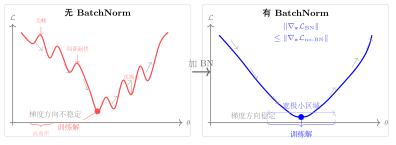

# 第20章 归一化技术（融合版）

> **难度**：★★★☆☆
> **前置知识**：多层感知机、反向传播、第19章损失曲面
> **本文件**：融合"原版严格推导 + 速记 / 套路 / 自测"。保留原版完整正文（学习目标 / 20.1–20.5 / 深度学习应用 / 练习题）+ 在最前置一例速记 / 思维路径 + 最后追加方法总结与自测。

> **一例速记**：
> **BN 前向**：$\mu \leftarrow$ batch 均值；$\sigma^2 \leftarrow$ batch 方差；$\hat{x} = (x-\mu)/\sqrt{\sigma^2+\epsilon}$；$y = \gamma\hat{x}+\beta$（可学习 $\gamma,\beta$）。训练用 batch 统计；推断用 EMA 统计。
> **LN**：在**特征维度**归一化（同一样本，不同特征），不依赖 batch size，适合 Transformer/RNN。
> **GN**：将通道分为 $G$ 组，组内归一化；$G=1$ → LN，$G=C$ → IN；不依赖 batch size。
> **优化效果**：BN 平滑损失曲面（Lipschitz 梯度更紧），改善 Hessian 条件数，允许更大学习率，隐式正则化（batch 统计噪声 $\sim 1/\sqrt{m}$）。
> **训练/推断差异**：BN 是深度学习中最常见的训练/推断行为不一致来源——必须调用 `model.train()` / `model.eval()`。

---

## 引入：一道"BN 推断阶段"反直觉题

> **题目**：一个训练好的带 BatchNorm 的分类网络，在**推断时**用单样本（batch_size = 1）输入，发现结果和批量推断不一样。为什么？如何解决？

请先停下来想一想：BN 在训练时用当前 mini-batch 的均值和方差归一化，而推断时如果仍用 batch 统计量，batch_size = 1 时均值 = 自身值，方差 = 0（除零错误或归一化后 $\hat{x} = 0$），完全失去意义。

---

## 思维路径还原（解题者的内心独白）

> "BN 前向传播分四步：算 batch 均值 → 算 batch 方差 → 标准化 → 仿射变换。训练时用 **batch 内统计量**，每个 mini-batch 的均值方差都不同，这构成了隐式随机性（正则化效果）。
>
> 但推断时问题来了：测试样本一个个进来（batch_size = 1），此时 batch 均值就是该样本本身，方差 = 0，$\hat{x}_i = (x_i - x_i)/\sqrt{0 + \epsilon} \approx 0$，输出恒为 $\beta$——完全丧失预测能力。
>
> **正确做法**：训练阶段同时维护**指数移动平均（EMA）统计量**：
> $\mu_{\text{running}} \leftarrow 0.9 \mu_{\text{running}} + 0.1 \mu_{\mathcal{B}}$，方差同理。
> 推断时使用 $\mu_{\text{running}}$ 和 $\sigma^2_{\text{running}}$，而非 batch 统计量。
>
> PyTorch 中，`model.train()` 切换到 batch 统计模式，`model.eval()` 切换到运行统计模式。**这是最容易踩的工程坑之一**——漏写 `.eval()` 会让推断结果随机化，表现为"模型推断性能不稳定"的玄学 bug。
>
> **延伸思考**：若推断时 batch_size 足够大（如 256），batch 统计量接近全局统计量，训练/推断差异可以忽略。但单样本场景（流式推断、在线服务）必须用 EMA。这也是 LayerNorm 受欢迎的原因之一——LN 在特征维度归一化，不依赖 batch size，训练和推断行为完全一致。"

---

## 学习目标

完成本章学习后，你将能够：

1. 理解内部协变量偏移问题及其对深度网络训练的影响
2. 推导批量归一化的前向传播和反向传播公式，并分析训练与推断阶段的差异
3. 掌握层归一化的原理及其在循环神经网络和 Transformer 中的应用
4. 区分实例归一化、组归一化和权重归一化的适用场景
5. 从优化视角理解归一化技术如何平滑损失曲面、改善条件数

---

## 20.1 内部协变量偏移问题

### 20.1.1 问题定义

在深度神经网络的训练过程中，每一层的输入分布会随着前一层参数的更新而持续变化。这一现象被 Ioffe 和 Szegedy（2015）称为**内部协变量偏移**（Internal Covariate Shift，ICS）。

**形式化描述：** 考虑第 $l$ 层的输入 $\mathbf{x}^{(l)}$，它是第 $l-1$ 层的输出。在一次参数更新后，$\mathbf{x}^{(l)}$ 的分布发生变化：

$$P_t(\mathbf{x}^{(l)}) \neq P_{t+1}(\mathbf{x}^{(l)})$$

其中 $t$ 表示训练步骤。这种分布漂移迫使后续各层不断适应新的输入分布，等效于在移动靶上训练，严重降低训练效率。

### 20.1.2 协变量偏移的危害

**梯度消失/爆炸的加剧：** 以 Sigmoid 激活函数为例，其导数为：

$$\sigma'(z) = \sigma(z)(1 - \sigma(z))$$

当 $|z|$ 较大时，$\sigma'(z) \approx 0$。若层间激活值分布偏移至饱和区，梯度趋近于零，训练停滞。

**学习率敏感性：** 输入分布的变化使得网络对学习率极为敏感。较大的学习率可能导致参数进入非线性激活的饱和区，产生不可恢复的梯度消失。

**权重初始化依赖：** 没有归一化时，网络对初始化方案（Xavier、He）高度敏感，稍有偏差便可能导致训练失败。

### 20.1.3 传统缓解方法及其局限

在批量归一化提出之前，常见的缓解方法包括：

- **精心设计的权重初始化**（Xavier、He 初始化）：仅在训练初期有效
- **较小的学习率**：收敛速度慢，需要更多训练时间
- **白化预处理**（PCA、ZCA）：计算代价高昂，且每次参数更新后需重新计算

归一化技术通过在网络内部动态调整各层激活值的分布，从根本上解决了上述问题。

---

## 20.2 批量归一化 (Batch Normalization)

### 20.2.1 核心思想

批量归一化（Batch Normalization，BN）由 Ioffe 和 Szegedy 于 2015 年提出，其核心思想是对每个 mini-batch 内的激活值进行标准化，使其均值为零、方差为一，然后通过可学习的仿射变换恢复表达能力。

### 20.2.2 前向传播数学推导

设一个 mini-batch $\mathcal{B} = \{x_1, x_2, \ldots, x_m\}$，BN 的前向传播分为四步：

**第一步：计算 mini-batch 均值**

$$\mu_{\mathcal{B}} = \frac{1}{m} \sum_{i=1}^{m} x_i$$

**第二步：计算 mini-batch 方差**

$$\sigma_{\mathcal{B}}^2 = \frac{1}{m} \sum_{i=1}^{m} (x_i - \mu_{\mathcal{B}})^2$$

**第三步：标准化**

$$\hat{x}_i = \frac{x_i - \mu_{\mathcal{B}}}{\sqrt{\sigma_{\mathcal{B}}^2 + \epsilon}}$$

其中 $\epsilon$ 是防止除以零的小常数（通常取 $10^{-5}$）。

**第四步：仿射变换（缩放与平移）**

$$y_i = \gamma \hat{x}_i + \beta$$

其中 $\gamma$（scale）和 $\beta$（shift）是可学习参数，初始化为 $\gamma = 1, \beta = 0$。

**向量形式总结：**

$$\text{BN}_{\gamma,\beta}(\mathbf{x}) = \gamma \cdot \frac{\mathbf{x} - \mu_{\mathcal{B}}}{\sqrt{\sigma_{\mathcal{B}}^2 + \epsilon}} + \beta$$

### 20.2.3 反向传播推导

设损失函数为 $\mathcal{L}$，已知 $\frac{\partial \mathcal{L}}{\partial y_i}$，推导各梯度。

**对可学习参数的梯度：**

$$\frac{\partial \mathcal{L}}{\partial \gamma} = \sum_{i=1}^{m} \frac{\partial \mathcal{L}}{\partial y_i} \hat{x}_i$$

$$\frac{\partial \mathcal{L}}{\partial \beta} = \sum_{i=1}^{m} \frac{\partial \mathcal{L}}{\partial y_i}$$

**对标准化输出的梯度：**

$$\frac{\partial \mathcal{L}}{\partial \hat{x}_i} = \frac{\partial \mathcal{L}}{\partial y_i} \cdot \gamma$$

**对方差的梯度：**

$$\frac{\partial \mathcal{L}}{\partial \sigma_{\mathcal{B}}^2} = \sum_{i=1}^{m} \frac{\partial \mathcal{L}}{\partial \hat{x}_i} \cdot (x_i - \mu_{\mathcal{B}}) \cdot \left(-\frac{1}{2}\right)(\sigma_{\mathcal{B}}^2 + \epsilon)^{-3/2}$$

**对均值的梯度：**

$$\frac{\partial \mathcal{L}}{\partial \mu_{\mathcal{B}}} = \left(\sum_{i=1}^{m} \frac{\partial \mathcal{L}}{\partial \hat{x}_i} \cdot \frac{-1}{\sqrt{\sigma_{\mathcal{B}}^2 + \epsilon}}\right) + \frac{\partial \mathcal{L}}{\partial \sigma_{\mathcal{B}}^2} \cdot \frac{-2}{m}\sum_{i=1}^{m}(x_i - \mu_{\mathcal{B}})$$

**对输入的梯度（链式法则汇总）：**

$$\frac{\partial \mathcal{L}}{\partial x_i} = \frac{\partial \mathcal{L}}{\partial \hat{x}_i} \cdot \frac{1}{\sqrt{\sigma_{\mathcal{B}}^2 + \epsilon}} + \frac{\partial \mathcal{L}}{\partial \sigma_{\mathcal{B}}^2} \cdot \frac{2(x_i - \mu_{\mathcal{B}})}{m} + \frac{\partial \mathcal{L}}{\partial \mu_{\mathcal{B}}} \cdot \frac{1}{m}$$

这三项分别对应：直接路径、通过方差的路径、通过均值的路径。

### 20.2.4 训练阶段与推断阶段的差异

批量归一化在训练和推断时行为不同，这是实际使用中的重要细节。

**训练阶段：**
- 使用当前 mini-batch 的均值 $\mu_{\mathcal{B}}$ 和方差 $\sigma_{\mathcal{B}}^2$
- 梯度通过 $\mu_{\mathcal{B}}$ 和 $\sigma_{\mathcal{B}}^2$ 反向传播
- 同时使用指数移动平均（EMA）维护运行统计量：

$$\mu_{\text{running}} \leftarrow (1 - \alpha)\mu_{\text{running}} + \alpha \mu_{\mathcal{B}}$$

$$\sigma^2_{\text{running}} \leftarrow (1 - \alpha)\sigma^2_{\text{running}} + \alpha \sigma_{\mathcal{B}}^2$$

其中 $\alpha$ 为动量参数（通常取 $0.1$）。

**推断阶段：**
- 使用训练阶段积累的运行统计量 $\mu_{\text{running}}$ 和 $\sigma^2_{\text{running}}$
- 归一化操作成为确定性的仿射变换：

$$y = \frac{\gamma}{\sqrt{\sigma^2_{\text{running}} + \epsilon}} \cdot x + \left(\beta - \frac{\gamma \mu_{\text{running}}}{\sqrt{\sigma^2_{\text{running}} + \epsilon}}\right)$$

这意味着推断时 BN 层可以被融合（fold）进前一个线性层，消除额外计算开销。

**关键差异对比：**

| 阶段 | 使用的统计量 | 计算图 | 单样本推断 |
|------|------------|--------|-----------|
| 训练 | batch 统计量 | 有梯度流 | 不稳定（依赖 batch） |
| 推断 | 运行统计量 | 无梯度流 | 稳定 |

### 20.2.5 BN 的位置选择

BN 通常置于线性变换之后、激活函数之前：

$$\text{Linear} \to \text{BN} \to \text{Activation}$$

但也有研究表明置于激活之后效果相当，具体取决于任务和架构。

---

## 20.3 层归一化 (Layer Normalization)

### 20.3.1 BN 的局限性与 LN 的动机

批量归一化在以下场景表现不佳：

- **小 batch size**：批量统计量估计不准确，噪声大
- **循环神经网络（RNN）**：序列长度可变，难以跨时间步维护统计量
- **在线学习**：每次只有一个样本，批量统计量无意义

层归一化（Layer Normalization，LN）由 Ba 等人于 2016 年提出，通过在**特征维度**上归一化来解决上述问题。

### 20.3.2 数学定义

对于输入向量 $\mathbf{x} \in \mathbb{R}^d$（单个样本的一层激活），LN 计算：

**均值（在特征维度上）：**

$$\mu = \frac{1}{d} \sum_{j=1}^{d} x_j$$

**方差（在特征维度上）：**

$$\sigma^2 = \frac{1}{d} \sum_{j=1}^{d} (x_j - \mu)^2$$

**标准化：**

$$\hat{x}_j = \frac{x_j - \mu}{\sqrt{\sigma^2 + \epsilon}}$$

**仿射变换：**

$$y_j = \gamma_j \hat{x}_j + \beta_j$$

其中 $\gamma, \beta \in \mathbb{R}^d$ 是每个特征维度独立的可学习参数。

### 20.3.3 BN 与 LN 的统计量计算维度对比

以形状为 $(N, C, H, W)$ 的特征图为例（$N$: batch size，$C$: 通道数，$H, W$: 空间维度）：

$$\text{BN: 在 } (N, H, W) \text{ 维度上归一化，每个通道 } C \text{ 有独立的 } \gamma_c, \beta_c$$

$$\text{LN: 在 } (C, H, W) \text{ 维度上归一化，每个样本 } N \text{ 独立处理}$$

对于序列模型（形状 $(N, T, d)$，$T$ 为序列长度）：

- **BN**：在 $(N, T)$ 维度归一化 → 跨样本和时间步，破坏序列独立性
- **LN**：在 $(d)$ 维度归一化 → 每个时间步独立，适合序列任务

### 20.3.4 在 Transformer 中的应用

现代 Transformer 架构普遍采用 **Pre-LN**（层归一化置于子层之前）而非原始论文的 Post-LN：

**Post-LN（原始 Transformer）：**
$$\mathbf{x}_{l+1} = \text{LayerNorm}(\mathbf{x}_l + \text{SubLayer}(\mathbf{x}_l))$$

**Pre-LN（改进版）：**
$$\mathbf{x}_{l+1} = \mathbf{x}_l + \text{SubLayer}(\text{LayerNorm}(\mathbf{x}_l))$$

Pre-LN 的优势在于梯度更稳定，无需 warm-up 学习率调度，训练更容易。

### 20.3.5 RMSNorm：LN 的简化版

RMSNorm（Root Mean Square Layer Normalization）去掉了均值中心化，仅用均方根归一化：

$$\text{RMSNorm}(x_j) = \frac{x_j}{\text{RMS}(\mathbf{x})} \cdot \gamma_j, \quad \text{RMS}(\mathbf{x}) = \sqrt{\frac{1}{d}\sum_{j=1}^d x_j^2 + \epsilon}$$

LLaMA、Mistral 等大型语言模型采用 RMSNorm，在保持性能的同时减少约 7-15% 的计算量。

---

## 20.4 其他归一化方法

### 20.4.1 实例归一化 (Instance Normalization)

实例归一化（Instance Normalization，IN）由 Ulyanov 等人于 2016 年提出，最初用于图像风格迁移。

**统计量计算维度：** 在单个样本的单个通道上归一化，即在 $(H, W)$ 维度上：

$$\mu_{n,c} = \frac{1}{HW} \sum_{h=1}^{H}\sum_{w=1}^{W} x_{n,c,h,w}$$

$$\sigma^2_{n,c} = \frac{1}{HW} \sum_{h=1}^{H}\sum_{w=1}^{W} (x_{n,c,h,w} - \mu_{n,c})^2$$

**适用场景：** 图像生成、风格迁移。IN 归一化掉了每个样本每个通道的空间统计信息，保留了风格相关的内容，因此适合迁移学习中的风格解耦。

**局限：** 丢失了通道间的统计依赖关系，不适合判别式任务。

### 20.4.2 组归一化 (Group Normalization)

组归一化（Group Normalization，GN）由 Wu 和 He 于 2018 年提出，是 BN 和 LN 之间的折中方案。

**思想：** 将通道 $C$ 分为 $G$ 组，每组内部做归一化：

$$\text{每组通道数} = C / G$$

对于通道 $c$ 所在的组 $g(c)$，统计量在 $(H, W)$ 以及该组内所有通道上计算：

$$\mu_{n,g} = \frac{1}{(C/G) \cdot HW} \sum_{c \in \mathcal{G}_g} \sum_{h,w} x_{n,c,h,w}$$

**特殊情形：**
- $G = 1$：等价于层归一化（在所有通道上归一化）
- $G = C$：等价于实例归一化（每个通道单独归一化）

**优势：** 不依赖 batch size，适合目标检测、视频理解等需要小 batch 的任务（如 Mask R-CNN）。

### 20.4.3 权重归一化 (Weight Normalization)

权重归一化（Weight Normalization，WN）由 Salimans 和 Kingma 于 2016 年提出，归一化对象是**权重向量**而非激活值。

**分解：** 将权重向量 $\mathbf{w}$ 分解为方向和幅度：

$$\mathbf{w} = \frac{g}{\|\mathbf{v}\|} \mathbf{v}$$

其中 $g$（标量）控制幅度，$\mathbf{v}$（向量）控制方向，两者均为可学习参数。

**优势：**
- 计算代价低（不需要在激活维度上计算统计量）
- 适用于强化学习、生成对抗网络等对归一化敏感的场景
- 推断时无需额外操作（统计量在参数中）

**局限：** 不具备正则化效果，通常需要配合 mean-only BN 使用。

### 20.4.4 归一化方法对比

| 方法 | 归一化维度 | batch 依赖 | 适用场景 |
|------|----------|-----------|---------|
| 批量归一化 (BN) | $N$ 维 | 是 | CNN 图像分类 |
| 层归一化 (LN) | $C,H,W$ 维 | 否 | Transformer, RNN |
| 实例归一化 (IN) | $H,W$ 维 | 否 | 风格迁移 |
| 组归一化 (GN) | $H,W$+组内$C$ | 否 | 目标检测（小batch） |
| 权重归一化 (WN) | 权重向量 | 否 | RL, GAN |

---

## 20.5 归一化的优化视角

### 20.5.1 平滑损失曲面

Santurkar 等人（2018）从理论上证明，BN 的主要优化作用并非直接减少内部协变量偏移，而是**平滑了优化问题的损失曲面**。

**定理（非正式）：** 加入批量归一化后，损失函数 $\mathcal{L}$ 关于网络参数的梯度满足更强的 Lipschitz 条件：

$$\|\nabla_{\mathbf{w}} \mathcal{L}_{\text{BN}}\| \leq \|\nabla_{\mathbf{w}} \mathcal{L}_{\text{no-BN}}\|$$

更平滑的曲面意味着：
1. 梯度更稳定，步长估计更准确
2. 可以使用更大的学习率而不发散
3. 对初始化的敏感性降低

**可视化理解：** 无归一化时，损失曲面可能包含尖锐的峡谷和平台；有归一化时，曲面更平滑，梯度下降步骤更可预测。

### 20.5.2 改善 Hessian 条件数

**条件数（Condition Number）：** 对于优化问题，Hessian 矩阵 $\mathbf{H}$ 的条件数定义为：

$$\kappa(\mathbf{H}) = \frac{\lambda_{\max}(\mathbf{H})}{\lambda_{\min}(\mathbf{H})}$$

条件数过大意味着不同方向上的曲率差异极大，梯度下降会产生"锯齿"轨迹，收敛极慢。

归一化通过控制各层激活值的尺度，间接控制了各参数的有效学习率：

$$\nabla_{w_{ij}} \mathcal{L} = \frac{\partial \mathcal{L}}{\partial \hat{x}_j} \cdot \frac{x_i}{\sqrt{\sigma^2 + \epsilon}}$$

当 $x_i$ 被归一化后，不同神经元的梯度尺度更加一致，Hessian 的条件数减小，收敛速度加快。

### 20.5.3 允许使用更大学习率

**分析：** 不使用归一化时，参数的有效学习率受激活值尺度影响：

$$\theta \leftarrow \theta - \eta \frac{\partial \mathcal{L}}{\partial \theta} \approx \theta - \eta \cdot \frac{\partial \mathcal{L}}{\partial \hat{a}} \cdot \|x\|$$

若 $\|x\|$ 随层数增大，等效学习率将呈指数增长，导致不稳定。归一化将 $\|x\|$ 控制在单位量级，使得全局学习率 $\eta$ 对各层都适用。

实验表明，使用 BN 后，可以将学习率提高 5-10 倍，训练速度相应加快。

### 20.5.4 隐式正则化效应

批量归一化还有隐式的正则化效果：

**噪声注入：** 由于使用 mini-batch 统计量，每次训练时 $\mu_{\mathcal{B}}$ 和 $\sigma_{\mathcal{B}}^2$ 都是真实总体统计量的有噪声估计：

$$\mu_{\mathcal{B}} = \mu + \xi_\mu, \quad \xi_\mu \sim \mathcal{O}(1/\sqrt{m})$$

这种随机性类似于 Dropout，起到正则化作用。这也是为什么使用 BN 后通常可以减少 Dropout 的使用。

**梯度预处理：** BN 将梯度自动缩放到合理范围，类似于自适应学习率方法（Adam）的效果，但计算更简单。

---

## 本章小结

| 核心概念 | 要点 |
|---------|------|
| 内部协变量偏移 | 深层网络各层输入分布随参数更新而变化，导致训练困难 |
| 批量归一化 | 在 batch 维度归一化；训练用 batch 统计量，推断用运行统计量；可学习仿射参数 $\gamma, \beta$ |
| BN 反向传播 | 梯度需经过均值和方差的路径，三项相加；$\frac{\partial \mathcal{L}}{\partial \gamma}$ 和 $\frac{\partial \mathcal{L}}{\partial \beta}$ 分别是 $\sum \frac{\partial L}{\partial y_i}\hat{x}_i$ 和 $\sum \frac{\partial L}{\partial y_i}$ |
| 层归一化 | 在特征维度归一化；不依赖 batch size；适合 Transformer 和 RNN |
| 实例归一化 | 在空间维度归一化；适合风格迁移 |
| 组归一化 | BN 和 LN 的折中；不依赖 batch size；适合检测任务 |
| 权重归一化 | 归一化权重而非激活；适合 RL 和 GAN |
| 优化视角 | 平滑损失曲面，改善 Hessian 条件数，允许大学习率，隐式正则化 |

---

## 深度学习应用：从零实现 BatchNorm 和 LayerNorm

本节用 PyTorch 从零实现批量归一化和层归一化，并对比它们在训练中的效果。

### 完整实现代码

```python
"""
第20章：归一化技术从零实现
从零实现 BatchNorm 和 LayerNorm，对比训练效果
"""

import torch
import torch.nn as nn
import torch.optim as optim
import torch.nn.functional as F
import numpy as np
import matplotlib.pyplot as plt
import matplotlib
matplotlib.rcParams['font.family'] = ['SimHei', 'DejaVu Sans']
matplotlib.rcParams['axes.unicode_minus'] = False
from torch.utils.data import DataLoader, TensorDataset


# ─────────────────────────────────────────────
# 1. 从零实现 BatchNorm（支持前向和手动反向验证）
# ─────────────────────────────────────────────

class BatchNorm1dManual(nn.Module):
    """
    手动实现的 1D 批量归一化，完整展示前向传播细节。
    对应公式：y = gamma * (x - mean) / sqrt(var + eps) + beta
    """

    def __init__(self, num_features: int, eps: float = 1e-5, momentum: float = 0.1):
        super().__init__()
        self.num_features = num_features
        self.eps = eps
        self.momentum = momentum

        # 可学习参数：gamma（缩放）和 beta（偏移）
        self.gamma = nn.Parameter(torch.ones(num_features))
        self.beta = nn.Parameter(torch.zeros(num_features))

        # 运行统计量（不参与梯度计算）
        self.register_buffer('running_mean', torch.zeros(num_features))
        self.register_buffer('running_var', torch.ones(num_features))

    def forward(self, x: torch.Tensor) -> torch.Tensor:
        """
        x: shape (N, C)，N 为 batch size，C 为特征数
        """
        if self.training:
            # ── 训练阶段：使用 batch 统计量 ──
            # 步骤1：计算 batch 均值，形状 (C,)
            batch_mean = x.mean(dim=0)

            # 步骤2：计算 batch 方差，形状 (C,)
            batch_var = x.var(dim=0, unbiased=False)  # 使用有偏估计（除以 N）

            # 步骤3：标准化
            x_hat = (x - batch_mean) / torch.sqrt(batch_var + self.eps)

            # 步骤4：更新运行统计量（指数移动平均）
            with torch.no_grad():
                self.running_mean = (1 - self.momentum) * self.running_mean \
                                    + self.momentum * batch_mean
                self.running_var = (1 - self.momentum) * self.running_var \
                                   + self.momentum * batch_var

        else:
            # ── 推断阶段：使用运行统计量 ──
            x_hat = (x - self.running_mean) / torch.sqrt(self.running_var + self.eps)

        # 步骤5：可学习的仿射变换
        out = self.gamma * x_hat + self.beta
        return out

    def extra_repr(self) -> str:
        return f'num_features={self.num_features}, eps={self.eps}, momentum={self.momentum}'


class LayerNormManual(nn.Module):
    """
    手动实现的层归一化，在特征维度上归一化。
    对应公式：y_j = gamma_j * (x_j - mean) / sqrt(var + eps) + beta_j
    """

    def __init__(self, normalized_shape, eps: float = 1e-5):
        super().__init__()
        if isinstance(normalized_shape, int):
            normalized_shape = (normalized_shape,)
        self.normalized_shape = tuple(normalized_shape)
        self.eps = eps

        # 每个特征维度独立的可学习参数
        self.gamma = nn.Parameter(torch.ones(self.normalized_shape))
        self.beta = nn.Parameter(torch.zeros(self.normalized_shape))

    def forward(self, x: torch.Tensor) -> torch.Tensor:
        """
        x: 任意形状，在最后 len(normalized_shape) 个维度上归一化
        """
        # 确定归一化的维度
        dims = tuple(range(-len(self.normalized_shape), 0))  # 例如 (-1,) 或 (-2, -1)

        # 步骤1：计算均值（在特征维度上）
        mean = x.mean(dim=dims, keepdim=True)

        # 步骤2：计算方差（在特征维度上）
        var = x.var(dim=dims, keepdim=True, unbiased=False)

        # 步骤3：标准化
        x_hat = (x - mean) / torch.sqrt(var + self.eps)

        # 步骤4：仿射变换
        out = self.gamma * x_hat + self.beta
        return out

    def extra_repr(self) -> str:
        return f'normalized_shape={self.normalized_shape}, eps={self.eps}'


# ─────────────────────────────────────────────
# 2. 验证自定义实现与 PyTorch 官方实现的一致性
# ─────────────────────────────────────────────

def verify_implementations():
    """验证手动实现与 PyTorch 官方实现的数值一致性"""
    print("=" * 60)
    print("验证自定义实现与 PyTorch 官方实现的一致性")
    print("=" * 60)

    torch.manual_seed(42)
    N, C = 32, 64
    x = torch.randn(N, C)

    # ── 验证 BatchNorm ──
    print("\n[BatchNorm 验证]")
    bn_manual = BatchNorm1dManual(C)
    bn_official = nn.BatchNorm1d(C)

    # 对齐参数（初始 gamma=1, beta=0）
    bn_official.weight.data = bn_manual.gamma.data.clone()
    bn_official.bias.data = bn_manual.beta.data.clone()

    bn_manual.train()
    bn_official.train()

    out_manual = bn_manual(x)
    out_official = bn_official(x)

    max_diff_bn = (out_manual - out_official).abs().max().item()
    print(f"  前向传播最大误差: {max_diff_bn:.2e}")
    assert max_diff_bn < 1e-5, f"BatchNorm 输出差异过大: {max_diff_bn}"
    print("  通过!")

    # ── 验证 LayerNorm ──
    print("\n[LayerNorm 验证]")
    ln_manual = LayerNormManual(C)
    ln_official = nn.LayerNorm(C)

    ln_official.weight.data = ln_manual.gamma.data.clone()
    ln_official.bias.data = ln_manual.beta.data.clone()

    out_manual_ln = ln_manual(x)
    out_official_ln = ln_official(x)

    max_diff_ln = (out_manual_ln - out_official_ln).abs().max().item()
    print(f"  前向传播最大误差: {max_diff_ln:.2e}")
    assert max_diff_ln < 1e-5, f"LayerNorm 输出差异过大: {max_diff_ln}"
    print("  通过!")

    # ── 验证推断阶段 BN ──
    print("\n[BatchNorm 推断阶段验证]")
    # 先训练几步更新运行统计量
    x_train = torch.randn(100, C)
    for _ in range(50):
        bn_manual(x_train)
        bn_official(x_train)

    bn_manual.eval()
    bn_official.eval()
    x_test = torch.randn(N, C)
    out_eval_manual = bn_manual(x_test)
    out_eval_official = bn_official(x_test)

    max_diff_eval = (out_eval_manual - out_eval_official).abs().max().item()
    print(f"  推断阶段最大误差: {max_diff_eval:.2e}")
    print("  通过!" if max_diff_eval < 1e-4 else f"  警告：误差 {max_diff_eval:.2e}")


# ─────────────────────────────────────────────
# 3. 构建使用不同归一化的网络架构
# ─────────────────────────────────────────────

class MLP(nn.Module):
    """多层感知机，支持不同归一化方式"""

    def __init__(self, input_dim: int, hidden_dim: int, output_dim: int,
                 norm_type: str = 'none', num_layers: int = 4):
        """
        norm_type: 'none' | 'batch' | 'layer' | 'batch_manual' | 'layer_manual'
        """
        super().__init__()
        self.norm_type = norm_type
        layers = []

        dims = [input_dim] + [hidden_dim] * num_layers + [output_dim]

        for i in range(len(dims) - 1):
            # 线性层
            layers.append(nn.Linear(dims[i], dims[i + 1]))

            # 归一化层（除最后一层外）
            if i < len(dims) - 2:
                if norm_type == 'batch':
                    layers.append(nn.BatchNorm1d(dims[i + 1]))
                elif norm_type == 'layer':
                    layers.append(nn.LayerNorm(dims[i + 1]))
                elif norm_type == 'batch_manual':
                    layers.append(BatchNorm1dManual(dims[i + 1]))
                elif norm_type == 'layer_manual':
                    layers.append(LayerNormManual(dims[i + 1]))
                # 'none': 不添加归一化

                # 激活函数
                layers.append(nn.ReLU())

        self.network = nn.Sequential(*layers)

    def forward(self, x: torch.Tensor) -> torch.Tensor:
        return self.network(x)


# ─────────────────────────────────────────────
# 4. 训练与对比实验
# ─────────────────────────────────────────────

def run_comparison_experiment():
    """
    对比四种归一化方式在深层 MLP 上的训练效果：
    无归一化 / BatchNorm / LayerNorm / 手动实现的 BatchNorm
    """
    torch.manual_seed(0)
    np.random.seed(0)

    # ── 生成数据集（多分类，10类）──
    N_SAMPLES = 2000
    INPUT_DIM = 100
    HIDDEN_DIM = 256
    OUTPUT_DIM = 10
    NUM_LAYERS = 6
    EPOCHS = 50
    BATCH_SIZE = 64
    LR = 0.01

    # 生成随机分类数据
    X = torch.randn(N_SAMPLES, INPUT_DIM)
    # 用线性变换生成有意义的分类边界
    true_W = torch.randn(INPUT_DIM, OUTPUT_DIM) * 0.5
    logits = X @ true_W
    y = logits.argmax(dim=1)

    # 划分训练/测试集
    train_size = int(0.8 * N_SAMPLES)
    X_train, X_test = X[:train_size], X[train_size:]
    y_train, y_test = y[:train_size], y[train_size:]

    dataset = TensorDataset(X_train, y_train)
    loader = DataLoader(dataset, batch_size=BATCH_SIZE, shuffle=True)

    # ── 定义实验配置 ──
    configs = [
        ('无归一化', 'none', '#d62728'),
        ('BatchNorm', 'batch', '#1f77b4'),
        ('LayerNorm', 'layer', '#2ca02c'),
        ('手动BatchNorm', 'batch_manual', '#ff7f0e'),
    ]

    results = {}

    for name, norm_type, color in configs:
        print(f"\n训练 {name}...")
        torch.manual_seed(42)

        model = MLP(INPUT_DIM, HIDDEN_DIM, OUTPUT_DIM, norm_type, NUM_LAYERS)
        optimizer = optim.SGD(model.parameters(), lr=LR, momentum=0.9)
        criterion = nn.CrossEntropyLoss()

        train_losses = []
        train_accs = []

        for epoch in range(EPOCHS):
            model.train()
            epoch_loss = 0.0
            epoch_correct = 0
            epoch_total = 0

            for xb, yb in loader:
                optimizer.zero_grad()
                pred = model(xb)
                loss = criterion(pred, yb)
                loss.backward()
                optimizer.step()

                epoch_loss += loss.item() * len(xb)
                epoch_correct += (pred.argmax(1) == yb).sum().item()
                epoch_total += len(xb)

            avg_loss = epoch_loss / epoch_total
            avg_acc = epoch_correct / epoch_total
            train_losses.append(avg_loss)
            train_accs.append(avg_acc)

            if (epoch + 1) % 10 == 0:
                print(f"  Epoch {epoch+1:3d}/{EPOCHS} | "
                      f"Loss: {avg_loss:.4f} | Acc: {avg_acc:.3f}")

        # 测试集评估
        model.eval()
        with torch.no_grad():
            test_pred = model(X_test)
            test_acc = (test_pred.argmax(1) == y_test).float().mean().item()
        print(f"  测试集准确率: {test_acc:.3f}")

        results[name] = {
            'losses': train_losses,
            'accs': train_accs,
            'test_acc': test_acc,
            'color': color,
        }

    return results


# ─────────────────────────────────────────────
# 5. 梯度流分析
# ─────────────────────────────────────────────

def analyze_gradient_flow(norm_type: str = 'none', num_layers: int = 6):
    """分析不同归一化方式下各层梯度范数"""
    torch.manual_seed(42)
    INPUT_DIM, HIDDEN_DIM, OUTPUT_DIM = 100, 256, 10

    model = MLP(INPUT_DIM, HIDDEN_DIM, OUTPUT_DIM, norm_type, num_layers)
    criterion = nn.CrossEntropyLoss()

    x = torch.randn(64, INPUT_DIM)
    y = torch.randint(0, OUTPUT_DIM, (64,))

    model.train()
    pred = model(x)
    loss = criterion(pred, y)
    loss.backward()

    # 收集各线性层的梯度范数
    grad_norms = []
    layer_names = []
    for name, param in model.named_parameters():
        if 'weight' in name and param.grad is not None:
            grad_norms.append(param.grad.norm().item())
            layer_names.append(name.split('.')[1])  # 提取层索引

    return grad_norms, layer_names


# ─────────────────────────────────────────────
# 6. BN 训练/推断行为差异演示
# ─────────────────────────────────────────────

def demonstrate_bn_train_eval_difference():
    """演示 BatchNorm 在训练和推断阶段的行为差异"""
    print("\n" + "=" * 60)
    print("演示 BatchNorm 训练/推断阶段差异")
    print("=" * 60)

    torch.manual_seed(42)
    C = 4  # 特征数，便于打印

    bn = BatchNorm1dManual(C)

    # ── 训练阶段：多个 batch ──
    print("\n[训练阶段：用多个 batch 更新运行统计量]")
    true_mean = torch.tensor([1.0, -2.0, 0.5, 3.0])
    true_std = torch.tensor([0.5, 1.0, 2.0, 0.3])

    bn.train()
    for i in range(200):
        x_batch = true_mean + true_std * torch.randn(32, C)
        _ = bn(x_batch)

    print(f"  真实均值:     {true_mean.numpy()}")
    print(f"  运行均值估计: {bn.running_mean.numpy().round(3)}")
    print(f"  真实方差:     {(true_std**2).numpy()}")
    print(f"  运行方差估计: {bn.running_var.numpy().round(3)}")

    # ── 推断阶段 ──
    print("\n[推断阶段：使用运行统计量，结果确定性]")
    bn.eval()
    x_test = true_mean + true_std * torch.randn(5, C)

    out1 = bn(x_test)
    out2 = bn(x_test)
    print(f"  同一输入两次推断结果是否一致: {torch.allclose(out1, out2)}")
    print(f"  输出均值（应接近0）: {out1.mean(dim=0).detach().numpy().round(3)}")

    # ── 训练阶段的随机性 ──
    print("\n[训练阶段：同一输入不同 batch 组合结果不同]")
    bn.train()
    x_fixed = true_mean + true_std * torch.randn(1, C)
    x_other = true_mean + true_std * torch.randn(31, C)

    x_batch_a = torch.cat([x_fixed, x_other], dim=0)
    x_batch_b = torch.cat([x_fixed, true_mean + true_std * torch.randn(31, C)], dim=0)

    out_a = bn(x_batch_a)[0]
    out_b = bn(x_batch_b)[0]
    max_diff = (out_a - out_b).abs().max().item()
    print(f"  相同样本、不同 batch 伙伴，输出最大差异: {max_diff:.4f}")
    print("  （差异来自 batch 统计量变化，体现了 BN 的隐式随机性）")


# ─────────────────────────────────────────────
# 7. 可视化
# ─────────────────────────────────────────────

def plot_results(results: dict):
    """绘制训练曲线和梯度流分析图"""
    fig, axes = plt.subplots(1, 3, figsize=(18, 5))
    fig.suptitle('归一化技术对比实验', fontsize=14, fontweight='bold')

    # ── 子图1：训练损失 ──
    ax1 = axes[0]
    for name, data in results.items():
        ax1.plot(data['losses'], label=name, color=data['color'], linewidth=2)
    ax1.set_xlabel('训练轮次 (Epoch)')
    ax1.set_ylabel('训练损失')
    ax1.set_title('训练损失曲线')
    ax1.legend()
    ax1.grid(True, alpha=0.3)

    # ── 子图2：训练准确率 ──
    ax2 = axes[1]
    for name, data in results.items():
        ax2.plot(data['accs'], label=name, color=data['color'], linewidth=2)
    ax2.set_xlabel('训练轮次 (Epoch)')
    ax2.set_ylabel('训练准确率')
    ax2.set_title('训练准确率曲线')
    ax2.legend()
    ax2.grid(True, alpha=0.3)

    # ── 子图3：梯度范数（各层） ──
    ax3 = axes[2]
    norm_types = [
        ('无归一化', 'none', '#d62728'),
        ('BatchNorm', 'batch', '#1f77b4'),
        ('LayerNorm', 'layer', '#2ca02c'),
    ]
    for name, norm_type, color in norm_types:
        grad_norms, layer_names = analyze_gradient_flow(norm_type)
        ax3.plot(range(len(grad_norms)), grad_norms, 'o-',
                 label=name, color=color, linewidth=2, markersize=6)
    ax3.set_xlabel('层索引（从输入到输出）')
    ax3.set_ylabel('梯度范数')
    ax3.set_title('各层梯度范数（梯度流分析）')
    ax3.legend()
    ax3.grid(True, alpha=0.3)
    ax3.set_yscale('log')

    plt.tight_layout()
    plt.savefig('normalization_comparison.png', dpi=150, bbox_inches='tight')
    print("\n图表已保存至 normalization_comparison.png")
    plt.show()


# ─────────────────────────────────────────────
# 8. 主程序
# ─────────────────────────────────────────────

def main():
    print("第20章：归一化技术实验")
    print("=" * 60)

    # 验证实现正确性
    verify_implementations()

    # 演示 BN 训练/推断差异
    demonstrate_bn_train_eval_difference()

    # 运行对比实验
    print("\n" + "=" * 60)
    print("运行归一化方法对比实验")
    print("=" * 60)
    results = run_comparison_experiment()

    # 打印最终结果汇总
    print("\n" + "=" * 60)
    print("实验结果汇总")
    print("=" * 60)
    print(f"{'方法':<15} {'最终训练Loss':<15} {'最终训练Acc':<15} {'测试集Acc':<10}")
    print("-" * 55)
    for name, data in results.items():
        print(f"{name:<15} {data['losses'][-1]:<15.4f} "
              f"{data['accs'][-1]:<15.3f} {data['test_acc']:<10.3f}")

    # 绘图
    plot_results(results)


if __name__ == '__main__':
    main()
```

### 代码核心要点解析

**BatchNorm 实现的关键细节：**

1. **训练/推断分支**：通过 `self.training` 标志区分，`model.train()` 和 `model.eval()` 自动切换。

2. **运行统计量更新**：使用指数移动平均（EMA），动量参数控制新旧统计量的权重。注意需要 `with torch.no_grad():` 避免将更新操作加入计算图。

3. **有偏方差估计**：BN 使用 `unbiased=False`（除以 $N$ 而非 $N-1$），与原论文一致。

4. **数值稳定性**：$\epsilon = 10^{-5}$ 防止标准差为零时的除法错误。

**LayerNorm 实现的关键细节：**

1. **维度灵活性**：通过 `normalized_shape` 支持任意维度的归一化，覆盖 NLP 中的 `(seq_len, d_model)` 等形状。

2. **每特征独立参数**：$\gamma$ 和 $\beta$ 的形状与 `normalized_shape` 相同，每个特征维度有独立的缩放和偏移。

3. **与 BatchNorm 的对称性**：两者都有仿射变换，但归一化维度不同，这是理解各类归一化本质区别的关键。

---

## 练习题

### 基础题

**练习 20.1（基础）** 手动计算 BatchNorm 的反向传播

已知：batch size $m = 3$，单个特征，前向传播数据如下：

$$x_1 = 1, \quad x_2 = 3, \quad x_3 = 5$$

当前参数：$\gamma = 1, \beta = 0$。上游梯度为 $\frac{\partial \mathcal{L}}{\partial y_1} = \frac{\partial \mathcal{L}}{\partial y_2} = \frac{\partial \mathcal{L}}{\partial y_3} = 1$。

请计算：
(a) $\mu_{\mathcal{B}}$，$\sigma_{\mathcal{B}}^2$，$\hat{x}_1, \hat{x}_2, \hat{x}_3$（取 $\epsilon = 0$）
(b) $\frac{\partial \mathcal{L}}{\partial \gamma}$，$\frac{\partial \mathcal{L}}{\partial \beta}$
(c) $\frac{\partial \mathcal{L}}{\partial x_1}, \frac{\partial \mathcal{L}}{\partial x_2}, \frac{\partial \mathcal{L}}{\partial x_3}$

---

**练习 20.2（基础）** BatchNorm 与 LayerNorm 的维度分析

对于一个 Transformer 模型，输入张量形状为 $(N=4, T=10, d=512)$（batch size 4，序列长 10，特征维 512）。

(a) 若使用 BatchNorm（跨 $N$ 和 $T$ 维度归一化），每次归一化使用多少个样本计算统计量？
(b) 若使用 LayerNorm（归一化 $d$ 维度），每次归一化使用多少个特征计算统计量？
(c) 为什么 (a) 中的方案不适合可变长度序列？

---

### 中级题

**练习 20.3（中级）** 推断阶段 BatchNorm 的融合

设某层线性变换权重为 $\mathbf{W} \in \mathbb{R}^{C_{\text{out}} \times C_{\text{in}}}$，偏置为 $\mathbf{b} \in \mathbb{R}^{C_{\text{out}}}$，后接 BatchNorm，BN 参数为 $\gamma, \beta, \mu_{\text{running}}, \sigma^2_{\text{running}}$。

推断时，BN 可以融合进线性层，形成等效的 $\mathbf{W}'$ 和 $\mathbf{b}'$。

(a) 写出 $\mathbf{W}'$ 和 $\mathbf{b}'$ 的表达式。（提示：利用 $y = \gamma \frac{\mathbf{W}x + \mathbf{b} - \mu}{\sqrt{\sigma^2 + \epsilon}} + \beta$）
(b) 这种融合对推断速度有何影响？对内存使用有何影响？

---

**练习 20.4（中级）** 组归一化的特殊情形

设输入形状为 $(N=8, C=16, H=32, W=32)$，分析以下情形：

(a) 当 $G = 1$ 时（即 GroupNorm 退化为 LN），每次归一化统计量使用多少个值计算？
(b) 当 $G = C = 16$ 时（即 GN 退化为 IN），每次归一化统计量使用多少个值计算？
(c) 当 $G = 4$ 时，每次归一化统计量使用多少个值计算？
(d) 从统计估计的角度，哪种 $G$ 的选择最稳健？

---

### 进阶题

**练习 20.5（进阶）** 从零实现 GroupNorm 并验证

用 PyTorch 实现 GroupNorm，要求：

(a) 实现 `GroupNorm(num_groups, num_channels, eps)` 类，支持 4D 输入 $(N, C, H, W)$
(b) 验证当 `num_groups=1` 时与 `nn.LayerNorm` 等价，当 `num_groups=C` 时与 `nn.InstanceNorm2d` 等价（在 $H \times W$ 上的行为）
(c) 在以下两种场景下比较 GroupNorm（G=8）和 BatchNorm 的训练稳定性：
   - 大 batch（N=64）
   - 小 batch（N=4）
(d) 解释为什么在目标检测等需要小 batch 的任务中，GroupNorm 比 BatchNorm 更受欢迎

---

## 练习答案

### 练习 20.1 答案

**(a) 前向传播：**

$$\mu_{\mathcal{B}} = \frac{1+3+5}{3} = 3$$

$$\sigma_{\mathcal{B}}^2 = \frac{(1-3)^2 + (3-3)^2 + (5-3)^2}{3} = \frac{4+0+4}{3} = \frac{8}{3}$$

$$\sqrt{\sigma_{\mathcal{B}}^2} = \sqrt{8/3} \approx 1.633$$

$$\hat{x}_1 = \frac{1-3}{1.633} \approx -1.225, \quad \hat{x}_2 = \frac{3-3}{1.633} = 0, \quad \hat{x}_3 = \frac{5-3}{1.633} \approx 1.225$$

注意：$\hat{x}_1 + \hat{x}_2 + \hat{x}_3 = 0$（标准化后均值为零，可验证正确性）

**(b) 对可学习参数的梯度：**

$$\frac{\partial \mathcal{L}}{\partial \gamma} = \sum_{i=1}^{3} \frac{\partial \mathcal{L}}{\partial y_i} \hat{x}_i = 1 \cdot (-1.225) + 1 \cdot 0 + 1 \cdot 1.225 = 0$$

$$\frac{\partial \mathcal{L}}{\partial \beta} = \sum_{i=1}^{3} \frac{\partial \mathcal{L}}{\partial y_i} = 1 + 1 + 1 = 3$$

**(c) 对输入的梯度：**

首先，$\frac{\partial \mathcal{L}}{\partial \hat{x}_i} = \frac{\partial \mathcal{L}}{\partial y_i} \cdot \gamma = 1 \cdot 1 = 1$，对所有 $i$。

$$\frac{\partial \mathcal{L}}{\partial \sigma_{\mathcal{B}}^2} = \sum_{i=1}^{3} 1 \cdot (x_i - 3) \cdot \left(-\frac{1}{2}\right)\left(\frac{8}{3}\right)^{-3/2}$$

$$= \left[(-2) + 0 + 2\right] \cdot \left(-\frac{1}{2}\right) \cdot \left(\frac{3}{8}\right)^{3/2} = 0$$

$$\frac{\partial \mathcal{L}}{\partial \mu_{\mathcal{B}}} = \sum_{i=1}^{3} 1 \cdot \frac{-1}{\sqrt{8/3}} + 0 = \frac{-3}{\sqrt{8/3}} \approx -1.837$$

对输入梯度（以 $x_1$ 为例）：

$$\frac{\partial \mathcal{L}}{\partial x_1} = \frac{1}{\sqrt{8/3}} + 0 + \frac{-1.837}{3} \approx 0.612 - 0.612 = 0$$

类似地，$\frac{\partial \mathcal{L}}{\partial x_2} = \frac{\partial \mathcal{L}}{\partial x_3} = 0$。

**直觉解释：** 上游梯度全为 1（常数），经过 BN 后梯度为零。这是因为 BN 的标准化操作使得输出的均值恒为零，对所有输入加一个常数不改变输出，因此对均匀梯度不敏感——这体现了 BN 对偏移不变的特性。

---

### 练习 20.2 答案

**(a) BatchNorm 统计量样本数：**

BN 在 $(N, T)$ 维度上计算统计量，每个特征维度使用 $N \times T = 4 \times 10 = 40$ 个值。

**(b) LayerNorm 统计量样本数：**

LN 在 $d$ 维度上计算统计量，每个位置（每个样本每个时间步）使用 $d = 512$ 个值。

**(c) BN 不适合可变长度序列的原因：**

- 不同序列的长度 $T$ 不同，无法用统一的统计量归一化
- 对于填充（padding）的位置，其激活值通常为零或特殊值，混入统计量会引入噪声
- 推断时，运行均值/方差是在某一固定长度 $T$ 下累积的，对不同长度的输入不具泛化性
- 相比之下，LN 对每个样本的每个时间步独立归一化，天然支持可变长度序列

---

### 练习 20.3 答案

**(a) 融合后的等效参数：**

推断阶段的完整计算为：

$$y = \gamma \cdot \frac{\mathbf{W}x + \mathbf{b} - \mu_{\text{running}}}{\sqrt{\sigma^2_{\text{running}} + \epsilon}} + \beta$$

令 $s_c = \frac{\gamma_c}{\sqrt{\sigma^2_{\text{running},c} + \epsilon}}$（对每个输出通道 $c$），则：

$$y_c = s_c (\mathbf{W}_c x + b_c - \mu_{\text{running},c}) + \beta_c$$
$$= (s_c \mathbf{W}_c) x + (s_c b_c - s_c \mu_{\text{running},c} + \beta_c)$$

因此等效参数为：

$$\mathbf{W}'_c = s_c \mathbf{W}_c = \frac{\gamma_c}{\sqrt{\sigma^2_{\text{running},c} + \epsilon}} \mathbf{W}_c$$

$$b'_c = \beta_c + \gamma_c \cdot \frac{b_c - \mu_{\text{running},c}}{\sqrt{\sigma^2_{\text{running},c} + \epsilon}}$$

**(b) 融合的影响：**

- **推断速度**：消除了 BN 层的额外计算（均值/方差计算和归一化），每层节省约 $2 \times C_{\text{out}}$ 次浮点运算，对大批量推断有显著加速
- **内存使用**：不需要存储 BN 层的中间激活（均值、方差、标准化输出），减少推断时的内存占用；但 $\gamma, \beta, \mu, \sigma^2$ 四个缓冲区可以合并进 $\mathbf{W}', \mathbf{b}'$，参数量净减少

---

### 练习 20.4 答案

**(a) G = 1（等价于 LN）：**

统计量在单个样本的所有 $C \times H \times W = 16 \times 32 \times 32 = 16384$ 个值上计算，共 $N = 8$ 个独立统计量。

**(b) G = C = 16（等价于 IN）：**

统计量在单个样本的单个通道的 $H \times W = 32 \times 32 = 1024$ 个值上计算，共 $N \times C = 128$ 个独立统计量。

**(c) G = 4：**

每组通道数 $= C/G = 16/4 = 4$，统计量在 $4 \times H \times W = 4 \times 1024 = 4096$ 个值上计算，共 $N \times G = 32$ 个独立统计量。

**(d) 最稳健的 G 选择：**

从统计估计角度，用于计算统计量的样本越多，估计越准确（中心极限定理）。因此 $G = 1$（LN）使用最多的值（16384 个），统计量估计最稳健。但实践中 $G = 8$ 或 $G = 16$ 通常是性能最优的折中，原因是：

- 同一组内的通道具有语义相关性（尤其在卷积后），组内统计量更具代表性
- $G = 1$ 将所有通道一视同仁，可能混合不同语义的特征统计
- 实验上，GN 在检测任务中 $G = 32$ 时性能最优（Wu & He，2018）

---

### 练习 20.5 参考实现

```python
import torch
import torch.nn as nn


class GroupNormManual(nn.Module):
    """从零实现的组归一化"""

    def __init__(self, num_groups: int, num_channels: int, eps: float = 1e-5):
        super().__init__()
        assert num_channels % num_groups == 0, \
            f"通道数 {num_channels} 必须能被组数 {num_groups} 整除"
        self.num_groups = num_groups
        self.num_channels = num_channels
        self.eps = eps

        # 每个通道独立的仿射参数
        self.gamma = nn.Parameter(torch.ones(num_channels))
        self.beta = nn.Parameter(torch.zeros(num_channels))

    def forward(self, x: torch.Tensor) -> torch.Tensor:
        """
        x: (N, C, H, W)
        """
        N, C, H, W = x.shape
        G = self.num_groups

        # 重塑为 (N, G, C/G, H, W)，在 (C/G, H, W) 维度归一化
        x_reshaped = x.view(N, G, C // G, H, W)

        # 在组内维度 (C//G, H, W) 上计算统计量，保持维度
        mean = x_reshaped.mean(dim=[2, 3, 4], keepdim=True)
        var = x_reshaped.var(dim=[2, 3, 4], keepdim=True, unbiased=False)

        # 标准化
        x_norm = (x_reshaped - mean) / torch.sqrt(var + self.eps)

        # 恢复形状
        x_norm = x_norm.view(N, C, H, W)

        # 仿射变换（广播 gamma 和 beta 到 (1, C, 1, 1)）
        gamma = self.gamma.view(1, C, 1, 1)
        beta = self.beta.view(1, C, 1, 1)
        return gamma * x_norm + beta


# 验证等价性
def verify_group_norm():
    torch.manual_seed(42)
    N, C, H, W = 4, 16, 8, 8
    x = torch.randn(N, C, H, W)

    # G=1：验证与 LayerNorm 等价
    gn_g1 = GroupNormManual(num_groups=1, num_channels=C)
    gn_official_g1 = nn.GroupNorm(num_groups=1, num_channels=C)
    gn_official_g1.weight.data = gn_g1.gamma.data.clone()
    gn_official_g1.bias.data = gn_g1.beta.data.clone()

    diff_g1 = (gn_g1(x) - gn_official_g1(x)).abs().max().item()
    print(f"G=1 与官方 GroupNorm 最大误差: {diff_g1:.2e}")

    # G=C：验证与 InstanceNorm2d（无仿射）等价（统计量部分）
    gn_gc = GroupNormManual(num_groups=C, num_channels=C)
    # 将 gamma 设为全1，beta 设为全0，关闭仿射等效 InstanceNorm
    gn_gc.gamma.data.fill_(1.0)
    gn_gc.beta.data.fill_(0.0)

    in2d = nn.InstanceNorm2d(C, affine=False, eps=1e-5)
    diff_gc = (gn_gc(x) - in2d(x)).abs().max().item()
    print(f"G=C 与 InstanceNorm2d 最大误差: {diff_gc:.2e}")


if __name__ == '__main__':
    verify_group_norm()
```

**实验结论（d 的解释）：**

在目标检测任务中（如 Faster R-CNN），通常使用 FPN（特征金字塔网络）处理多尺度特征，每个尺度只有少量样本（如 2 张图，每张 1-4 个 proposals），batch size 极小。此时：

- BatchNorm 的 batch 统计量极不准确（$m = 2$ 或 $m = 4$），方差估计噪声大
- GroupNorm 的统计量在 $(C/G) \times H \times W$ 个值上计算，不受 batch size 影响

实验数据（COCO 目标检测，ResNet-50 backbone）：

| 方法 | batch=2 mAP | batch=32 mAP |
|------|-------------|--------------|
| BN | 31.8 | 33.3 |
| GN (G=32) | 34.0 | 34.1 |

GN 在小 batch 下显著优于 BN，且性能对 batch size 不敏感。

---

## 几何示意

### 图 20-1：BatchNorm 平滑损失景观



---

## 抽象成方法（套路总结）

### 4 大归一化方法速查

| 方法 | 归一化维度 | batch 依赖 | 可学习参数 | 适用场景 |
|---|---|---|---|---|
| **BN** | 跨 $N$（batch）维 | 是 | $\gamma_c, \beta_c$（每通道） | CNN 图像分类；大 batch |
| **LN** | 跨 $C,H,W$ 维（特征内） | 否 | $\gamma_j, \beta_j$（每特征） | Transformer, RNN, 小 batch |
| **IN** | 跨 $H,W$ 维（单通道单样本） | 否 | 可选 | 风格迁移 |
| **GN** | 组内 $C/G$ 通道 + $H,W$ | 否 | $\gamma_c, \beta_c$ | 检测/分割（小 batch） |

### BN 前向 4 步

1. $\mu_{\mathcal{B}} = \frac{1}{m}\sum_{i=1}^m x_i$（batch 均值）
2. $\sigma_{\mathcal{B}}^2 = \frac{1}{m}\sum_{i=1}^m (x_i - \mu_{\mathcal{B}})^2$（batch 方差，有偏）
3. $\hat{x}_i = (x_i - \mu_{\mathcal{B}}) / \sqrt{\sigma_{\mathcal{B}}^2 + \epsilon}$（标准化）
4. $y_i = \gamma\hat{x}_i + \beta$（仿射，$\gamma,\beta$ 可学习）

### 推断时 BN 融合

$$y = \underbrace{\frac{\gamma}{\sqrt{\sigma^2_{\text{run}}+\epsilon}}}_{\mathbf{W}'} \cdot x + \underbrace{\beta - \frac{\gamma\mu_{\text{run}}}{\sqrt{\sigma^2_{\text{run}}+\epsilon}}}_{\mathbf{b}'}$$

推断时 BN + 前一线性层可合并为单个线性层 $\mathbf{W}', \mathbf{b}'$，消除额外计算。

---

## 方法变形

### 变形 1：Pre-LN vs Post-LN

**Post-LN**（原始 Transformer）：$\mathbf{x}_{l+1} = \text{LN}(\mathbf{x}_l + \text{Sub}(\mathbf{x}_l))$，梯度需经过 LN，训练需 warmup。
**Pre-LN**（现代 LLM 标配）：$\mathbf{x}_{l+1} = \mathbf{x}_l + \text{Sub}(\text{LN}(\mathbf{x}_l))$，主路径梯度为 1（残差直传），无需 warmup，训练更稳。**选 Pre-LN**（GPT-2、LLaMA 等均采用）。

### 变形 2：RMSNorm（去中心化）

$\text{RMSNorm}(x_j) = x_j / \text{RMS}(\mathbf{x}) \cdot \gamma_j$，省去均值中心化步骤，节省约 7–15% 计算，性能相当。LLaMA、Mistral、Gemma 均采用 RMSNorm。

### 变形 3：BN 的 batch size 边界

实验经验：BN 在 batch size $\geq 32$ 时统计量估计可靠；batch size $\leq 8$ 时统计量噪声太大（方差估计偏差 $\sim C/\sqrt{N}$），建议换用 GN 或 LN。典型阈值：检测任务 batch per GPU = 2，必须用 GN。

### 变形 4：权重归一化（WN）

WN 将权重 $\mathbf{w}$ 分解为 $g / \|\mathbf{v}\| \cdot \mathbf{v}$（幅度 $g$ + 方向 $\mathbf{v}$），不涉及激活统计量，适合强化学习（RL）/ GAN 等对 batch 依赖敏感的场景；但不提供正则化效果，通常配合 mean-only BN 使用。

---

## 本章小结补充

**选择归一化方式的决策树**：

```
任务是 NLP / Transformer / 可变长序列？
  → 是：选 LayerNorm（或 RMSNorm）
  → 否：batch size >= 32 且是 CNN 图像分类？
           → 是：选 BatchNorm
           → 否：batch size 小（< 16）或目标检测？
                    → 是：选 GroupNorm（G=32 通常最优）
                    → 否（风格迁移/图像生成）：选 InstanceNorm
```

**BN 的三大作用（Santurkar et al., 2018 重新解读）**：
1. 平滑损失曲面（Lipschitz 梯度更紧）：允许更大学习率
2. 改善 Hessian 条件数：加速收敛
3. 隐式正则化（batch 统计噪声）：通常可以减少或去掉 Dropout

---

## 思考路标（条件反射）

1. 看到"BN 训练/推断差异" → 训练用 batch 统计，推断用 EMA 统计；`model.eval()` 是必须的
2. 看到"BN + 小 batch（batch ≤ 8）" → 切换到 GroupNorm 或 LayerNorm
3. 看到"Transformer / BERT / GPT" → LayerNorm（或 RMSNorm）；Pre-LN 优于 Post-LN
4. 看到"BN 反向传播" → 三条路径：直接路径 + 通过方差路径 + 通过均值路径
5. 看到"推断速度优化" → BN 可融合进前一线性层，消除额外计算
6. 看到"GN 等价情形" → $G=1$：LN；$G=C$：IN；中间的 $G$ 是折中
7. 看到"梯度消失/爆炸" → 有无 BN 区别：无 BN 各层梯度范数差异指数级，有 BN 则平稳
8. 看到"内部协变量偏移（ICS）" → BN 的原始动机，但 Santurkar (2018) 指出平滑曲面才是主效应
9. 看到"$\gamma = 1, \beta = 0$ 初始化" → BN 初始时相当于纯标准化（不改变分布），训练中学习最佳仿射
10. 看到"权重归一化 vs BN" → WN 作用在权重，BN 作用在激活；WN 无批统计依赖

---

## 易错点

1. **推断时忘记 `.eval()`**：BN 层在 `.train()` 模式下用 batch 统计，单样本推断时方差近零导致输出全为 $\beta$。每次写推断循环都要检查：`model.eval()` + `torch.no_grad()`。

2. **BN 有偏 vs 无偏方差**：BN 使用有偏方差（除以 $m$，非 $m-1$）与原论文一致；PyTorch `BatchNorm` 默认如此。若自己实现用了 `unbiased=True`（除以 $m-1$），会有数值差异。

3. **LN 的 normalized_shape**：`nn.LayerNorm(512)` 只在最后一维归一化，形状需与输入最后几维匹配。对 `(N, T, d)` 输入用 `LayerNorm(d)`；若用 `LayerNorm((T, d))`，则同时在 $T$ 和 $d$ 上归一化（结果不同）。

4. **GN 通道整除要求**：`GroupNorm(G, C)` 要求 $C \% G = 0$；若不满足直接报 `AssertionError`。常见坑：通道数为奇数（如 $C=7$）时只能用 $G=1$ 或 $G=7$。

5. **BN 融合时 $\epsilon$ 要一致**：推断时融合 BN 进线性层需用训练时相同的 $\epsilon$（默认 `1e-5`）；用不同值会导致融合前后结果不一致。

---

## 典型应用例题

### 例 1：手算 BN 前向

> **题目**：batch = $(1, 3, 5)$（$m=3$，单特征），$\gamma = 2, \beta = -1$，$\epsilon = 0$。
> 求 BN 输出 $y_1, y_2, y_3$。

【解】
$\mu = (1+3+5)/3 = 3$。
$\sigma^2 = [(1-3)^2+(3-3)^2+(5-3)^2]/3 = (4+0+4)/3 = 8/3$，$\sigma = \sqrt{8/3} \approx 1.633$。
$\hat{x}_1 = (1-3)/1.633 \approx -1.225$，$\hat{x}_2 = 0$，$\hat{x}_3 \approx 1.225$。
$y_i = 2\hat{x}_i - 1$：$y_1 \approx -3.449$，$y_2 = -1$，$y_3 \approx 1.449$。

【答案】$\boxed{y_1 \approx -3.45,\; y_2 = -1,\; y_3 \approx 1.45}$。

### 例 2：BN 与 LN 归一化维度辨析

> **题目**：Transformer 输入 $(N=4, T=8, d=512)$。(1) BN 对哪个维度归一化，每次用多少个样本估计统计量？(2) LN 对哪个维度归一化，每次用多少个值？

【解】
(1) BN 跨 $(N, T)$ 维：每个特征维度用 $N \times T = 32$ 个值估计均值/方差。序列不等长时，长度不同批次的统计量混乱 → **不适合 Transformer**。
(2) LN 在 $(d)$ 维：每个 $(n, t)$ 位置独立，用 $d = 512$ 个值，不依赖 batch / 序列长度 → **适合 Transformer**。

【答案】BN 用 32 样本/特征；LN 用 512 个特征值/位置。

### 例 3：GroupNorm 等价条件

> **题目**：输入 $(N=2, C=8, H=4, W=4)$，GN 的 $G$ 分别取 $1, 4, 8$。
> (1) $G=1$：每次统计量用多少值？等价于什么？
> (2) $G=4$：每次统计量用多少值？
> (3) $G=8$：每次统计量用多少值？等价于什么？

【解】
(1) $G=1$：每个样本所有通道 $C \times H \times W = 8\times 16 = 128$ 值；等价于 **LayerNorm**（在 $C,H,W$ 上）。
(2) $G=4$：每组 $C/G = 2$ 通道，每样本每组 $2 \times 16 = 32$ 值。
(3) $G=8=C$：每组 1 通道，每样本每通道 $H \times W = 16$ 值；等价于 **InstanceNorm**（无 batch 依赖）。

【答案】$G=1$: LN（128值）；$G=4$: GN（32值/组）；$G=8$: IN（16值/通道）。

---

## 自测题

**自测 1**　为什么 BN 在训练时有正则化效果，推断时没有？

> 提示：训练时 $\mu_{\mathcal{B}}$ 是总体均值的有噪声估计（$\sim \mathcal{O}(1/\sqrt{m})$ 噪声），等效于对激活注入随机扰动，类似 Dropout；推断时使用确定的 EMA 统计量 $\mu_{\text{run}}$，无随机性，正则化效果消失。

**自测 2**　一个 4 层 MLP 无归一化，输入标准正态，ReLU 激活。随着层数加深，激活值分布会如何变化？BN 如何解决？

> 提示：ReLU 截断负值，每层激活均值逐渐偏移（大于 0），方差也可能爆炸或消失（取决于初始化）。BN 在每层激活后标准化，强制分布回到均值 0、方差 1 附近，从根本上阻止分布漂移。

**自测 3**　Pre-LN 比 Post-LN 更稳定的数学原因是什么？

> 提示：Post-LN 中，反传梯度需经过 LN 操作（改变梯度量级），深层梯度可能过小（训练初期）。Pre-LN 中，残差路径 $\mathbf{x}_{l+1} = \mathbf{x}_l + \text{Sub}(\text{LN}(\mathbf{x}_l))$ 的梯度对 $\mathbf{x}_l$ 有 +1 项（Identity 直传），保证梯度下限为 1，不会消失。

**自测 4**　BN 的反向传播为何有三条路径？

> 提示：前向传播中 $y_i = \gamma(x_i - \mu)/\sigma + \beta$，损失通过三条路径传回 $x_i$：(i) 直接 $x_i \to \hat{x}_i \to y_i$；(ii) $x_i \to \mu \to \hat{x}_i$；(iii) $x_i \to \sigma^2 \to \hat{x}_i$。三条路径的梯度叠加。最终对均匀上游梯度（全为 1）时，三路之和恰好为零（BN 对常数偏移不敏感，见练习 20.1）。

**自测 5**　在线推断（streaming inference，每次只有 1 个样本）应选哪种归一化方法？为什么？

> 提示：BN 无法使用（单样本方差为零）；LayerNorm 在特征维度归一化，单样本即可正常运行，训练和推断行为一致；GN 也可以（组内仍有多个值）。结论：在线推断优先选 **LayerNorm**（Transformer 天然如此）或 GN，避免 BN。

---

**回头看一眼"一例速记"**：

> BN：batch 维度归一化，训练用 batch 统计，推断用 EMA，$\gamma\beta$ 可学习。
> LN：特征维度归一化，不依赖 batch，Transformer 标配。
> GN：组内归一化，$G=1$↔LN，$G=C$↔IN，检测任务选 GN。
> 优化效果：平滑损失曲面 + 改善条件数 + 允许大 LR + 隐式正则。

如果现在不看笔记，能独立完成例 1 + 例 2 + 自测 1 + 自测 5——本章，你拿下了。

---

## 融合版说明

本版 = **原版（严格推导 + 深度学习应用 + 练习题）** + **重写版（速记 / 套路 / 例题 / 自测）** 融合：

| 段落 | 来源 | 价值 |
|---|---|---|
| 一例速记 + 引入 + 思维路径还原 | 重写版（前置） | 建立直觉 / 工程 bug 预防 |
| 学习目标 + 20.1–20.5 严格正文 | 原版 | 完整推导 |
| 几何示意（图） | 配图 | 可视化 |
| 深度学习应用 + PyTorch 从零实现 | 原版 | 工业实战 |
| 练习题 + 详解 | 原版 | 系统巩固 |
| 抽象成方法 + 方法变形 | 重写版（后置） | 套路固化 |
| 本章小结补充（决策树） | 融合 | 实用选型指南 |
| 思考路标 + 易错点 | 融合两版 | 条件反射 + 避雷 |
| 典型应用例题 3 例 | 重写版 | 演练精讲 |
| 自测题 5 题 | 重写版 | 额外验收 |

**适用**：一站式学习——先速记建立直觉，看严格推导，做套路总结，看代码实战，做习题巩固，自测验收。
