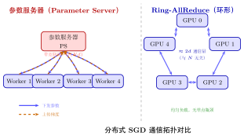
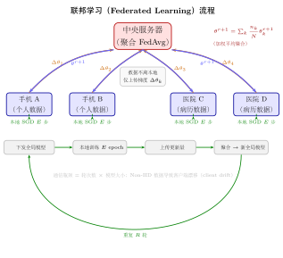

# 第22章 分布式优化（融合版）

> **难度**：★★★★☆
> **前置知识**：第16章（随机梯度下降）、第18章（自适应学习率）、线性代数基础
> **AI 定位**：大模型训练（GPT/LLaMA 系列的工程基础）
> **本文件**：融合"原版严格推导 + 速记 / 套路 / 自测"。保留原版完整正文（学习目标 / 22.1–22.5 / 深度学习应用 / 练习题）+ 在最前置一例速记 / 思维路径 + 最后追加方法总结与自测。

> **一例速记**：
> **数据并行**：每节点持有完整模型副本，处理数据分片；梯度通过 AllReduce 聚合后同步更新。等效全局批量 $B = Nb$。
> **Ring-AllReduce**：节点组成环形，通信量 $\approx 2d$（与节点数 $N$ 无关），优于参数服务器的 $O(Nd)$。
> **异步 SGD**：延迟梯度引入偏差 $\leq L\eta\tau G$；有界延迟 $\tau \leq \tau_{\max}$ 下收敛；SSP 折中方案。
> **大批量训练**：线性缩放规则 $\eta_B = (B/b)\eta_b$；Warmup 稳定初期；LARS 逐层自适应 $\eta_l = \lambda\|\theta_l\|/(\|g_l\|+\beta\|\theta_l\|)$；LAMB = LARS + Adam。
> **Federated Learning**：本地训练 → 上传梯度/模型 → 服务器聚合（FedAvg）→ 下发更新，数据不离本地。

---

## 引入：Ring-AllReduce 为什么比参数服务器更好

> **题目**：4 个 GPU 用数据并行训练 ResNet-50（参数量 $d = 2.5\times10^7$，FP32，每个参数 4 字节）。
>
> (1) 用**参数服务器**架构（1 台 PS + 4 台 Worker）：每步每台 Worker 向 PS 推梯度 + 拉参数，计算每步的**总通信量**。
>
> (2) 用 **Ring-AllReduce**：计算每步每台 Worker 的总发送量，以及系统**总通信量**。
>
> (3) 对比结论：节点数从 4 扩展到 256 时，哪种架构的总通信量更大？

请先停下来想一想：参数服务器的通信量是否随节点数线性增长？Ring-AllReduce 呢？

---

## 思维路径还原（解题者的内心独白）

> "题目要比较两种通信架构。先弄清楚每种架构的通信模式，再算数。
>
> **第 (1) 问——参数服务器**：每台 Worker 做两件事：①推梯度（发送 $d$ 个浮点数给 PS）；②拉参数（从 PS 接收 $d$ 个浮点数）。4 台 Worker 各自推拉，共产生通信量：
>
> $$C_{\text{PS}} = 2 \times 4 \times d \times 4 = 8d \text{ 字节}$$
>
> 代入 $d = 2.5\times10^7$：$C_{\text{PS}} = 8 \times 2.5\times10^7 \times 4 = 800 \text{ MB}$。
>
> 注意 PS 端是**瓶颈**——它要同时接收 4 路梯度并发送 4 路参数，PS 的入/出带宽各消耗 $4d$ 字节，总计 $800 \text{ MB}$。
>
> **第 (2) 问——Ring-AllReduce**：Ring-AllReduce 的公式是：每个节点发送 $(N-1)/N \times d$ 个元素（Reduce-Scatter 阶段）+ 再发 $(N-1)/N \times d$ 个元素（AllGather 阶段）。每台 Worker 总发送量：
>
> $$\text{每台发送} = 2 \times \frac{N-1}{N} \times d = 2 \times \frac{3}{4} \times 2.5\times10^7 \times 4 \approx 150 \text{ MB}$$
>
> 系统总通信量（4 台各发送一份）$\approx 4 \times 150 = 600 \text{ MB}$。
>
> **但注意**：Ring-AllReduce 中通信是**流水线式并行**的，不像 PS 有单点瓶颈。
>
> **第 (3) 问——扩展到 256 节点**：
>
> - 参数服务器：$C_{\text{PS}} = 2 \times 256 \times d \times 4 = 512d \text{ 字节}$，随节点数**线性增长**，PS 带宽需求猛增 64 倍。
> - Ring-AllReduce：每台 Worker 发送量 $\approx 2d$（$(N-1)/N \to 1$），总量 $\approx 2 \times 256 \times d \times 4$——数值相近，但**不存在单点带宽瓶颈**，每条链路负载均匀。
>
> **结论**：Ring-AllReduce 的**每节点**通信量与 $N$ 无关（当 $N$ 大时趋于 $2d$），而参数服务器的 PS 带宽需求随 $N$ 线性增长——这正是大规模分布式训练普遍采用 AllReduce 而非 PS 的根本原因。"

---

## 学习目标

完成本章学习后，你将能够：

1. 理解分布式优化的基本概念，区分数据并行与模型并行的适用场景
2. 掌握同步SGD（AllReduce）的工作原理及其收敛性保证
3. 理解异步SGD的机制，分析梯度延迟（staleness）对训练的影响
4. 熟悉梯度压缩、量化与稀疏化等通信效率优化技术
5. 掌握大批量训练的线性缩放规则及LARS、LAMB等自适应学习率方法

---

## 22.1 分布式优化基础

### 22.1.1 为什么需要分布式优化

现代深度学习模型的规模与数据集的体量已远超单台设备的承载能力。以GPT-3为例，其拥有1750亿参数，单次前向传播所需的显存超过350GB，远远超出单块GPU的容量上限。分布式优化通过将计算任务拆分到多个设备（GPU、CPU、TPU）或多台机器上，使得训练大规模模型成为可能。

分布式训练面临的核心挑战可以归结为以下几点：

**计算与通信的权衡**：多设备并行计算能加速训练，但设备间的梯度/参数同步会产生通信开销。当通信时间超过计算时间时，分布式训练的加速效果会大打折扣。

**一致性与效率的矛盾**：强一致性（同步更新）保证了收敛性，但需要等待最慢的工作节点；弱一致性（异步更新）提高了吞吐量，但引入了梯度延迟问题。

**内存墙问题**：模型参数、梯度、优化器状态（如Adam中的一阶矩和二阶矩）共同占用大量显存。以混合精度训练为例，单个参数占用2字节（FP16），但其梯度与优化器状态合计需要16字节（FP32），总计18字节/参数。

### 22.1.2 并行策略分类

分布式训练的并行策略主要分为三类：

**数据并行（Data Parallelism）**

每个工作节点持有完整的模型副本，但只处理全局数据集的一个分片。各节点独立计算本地梯度后，通过通信原语（AllReduce）聚合梯度，再统一更新参数。

设全局批量大小为 $B$，共有 $N$ 个工作节点，则每个节点处理的本地批量大小为 $b = B/N$。节点 $i$ 在第 $t$ 步的本地梯度为：

$$g_i^t = \frac{1}{b} \sum_{j \in \mathcal{B}_i^t} \nabla \ell(x_j, y_j; \theta^t)$$

全局梯度通过平均聚合：

$$\bar{g}^t = \frac{1}{N} \sum_{i=1}^{N} g_i^t = \frac{1}{B} \sum_{j=1}^{B} \nabla \ell(x_j, y_j; \theta^t)$$

这等价于在全局批量 $B$ 上直接计算梯度，因此数据并行在理论上与单机训练具有相同的收敛性。

**模型并行（Model Parallelism）**

当单个模型无法放入单台设备时，将模型的不同层或不同模块分配到不同设备上。前向传播时，数据在设备间依次流动；反向传播时，梯度沿相反方向传递。

设模型被分为 $K$ 个阶段，第 $k$ 个阶段在设备 $k$ 上运行，则：

$$h_k = f_k(h_{k-1}; \theta_k), \quad k = 1, 2, \ldots, K$$

其中 $h_0$ 为输入数据，$h_K$ 为最终输出，$\theta_k$ 为第 $k$ 阶段的参数。

**流水线并行（Pipeline Parallelism）**

流水线并行是模型并行的改进版本，通过将一个批次的数据分为若干微批次（micro-batch），使不同设备可以同时处理不同微批次的数据，从而减少设备空闲时间（pipeline bubble）。

**张量并行（Tensor Parallelism）**

将单个层的计算（如矩阵乘法）拆分到多个设备上并行执行。例如，对于线性变换 $Y = XW$，可以将权重矩阵 $W$ 按列分割：

$$Y = X[W_1 | W_2 | \cdots | W_N] = [XW_1 | XW_2 | \cdots | XW_N]$$

各设备分别计算 $XW_i$，再通过AllGather操作合并结果。

### 22.1.3 通信拓扑

分布式训练中的设备可以组织为不同的通信拓扑：

**参数服务器架构（Parameter Server）**：专用的参数服务器节点负责存储和更新全局参数，工作节点从参数服务器拉取参数、推送梯度。该架构灵活但存在通信瓶颈。

**全互联架构（All-to-All）**：所有节点直接通信，适用于带宽充足的场景。

**环形架构（Ring-AllReduce）**：节点组织为环形拓扑，通信量均匀分布，是当前主流的数据并行通信方案。

---

## 22.2 同步SGD与AllReduce

### 22.2.1 同步SGD的形式化定义

同步SGD要求所有工作节点在每一步梯度更新前完成梯度聚合。设共有 $N$ 个节点，第 $t$ 步的更新规则为：

1. **前向传播**：各节点 $i$ 使用当前参数 $\theta^t$ 和本地数据 $\mathcal{B}_i^t$ 计算损失 $L_i^t$
2. **反向传播**：各节点计算本地梯度 $g_i^t = \nabla L_i^t$
3. **梯度聚合**：通过AllReduce计算全局平均梯度 $\bar{g}^t = \frac{1}{N}\sum_{i=1}^N g_i^t$
4. **参数更新**：所有节点同步更新 $\theta^{t+1} = \theta^t - \eta \bar{g}^t$

**收敛性分析**：在凸优化的标准假设下（$L$-光滑，$\mu$-强凸），同步SGD满足：

$$\mathbb{E}[f(\theta^T) - f(\theta^*)] \leq \left(1 - \frac{\mu}{L}\right)^T (f(\theta^0) - f(\theta^*)) + \frac{\eta \sigma^2}{2\mu N}$$

其中 $\sigma^2$ 为单节点的梯度方差，$\theta^*$ 为最优解。关键结论是：使用 $N$ 个节点时，方差项缩小了 $N$ 倍，这为线性缩放规则提供了理论依据。

### 22.2.2 Ring-AllReduce算法

Ring-AllReduce是当前最主流的梯度聚合算法，由Baidu Research于2017年推广用于深度学习训练。其核心思想是将AllReduce操作分解为两个阶段：

**阶段一：Reduce-Scatter**

将每个节点的梯度向量 $g_i \in \mathbb{R}^d$ 均匀分割为 $N$ 个块，每块大小为 $d/N$。节点以环形方式传递数据，经过 $N-1$ 轮后，每个节点持有某个特定块的归约结果（所有节点对应块的和）。

**阶段二：AllGather**

将Reduce-Scatter阶段的结果在所有节点间广播，再经过 $N-1$ 轮后，每个节点获得完整的归约结果。

总通信量计算：每个节点在Reduce-Scatter和AllGather阶段各发送 $(N-1) \cdot \frac{d}{N}$ 个元素，总通信量为：

$$\text{Communication} = 2 \cdot (N-1) \cdot \frac{d}{N} \cdot \alpha \approx 2d\alpha$$

其中 $\alpha$ 为每个元素的通信时间。**关键性质**：Ring-AllReduce的通信量与节点数 $N$ 无关（当 $N$ 较大时），这使其具有良好的可扩展性。

相比之下，参数服务器架构的通信量为 $O(Nd)$，随节点数线性增长。

### 22.2.3 同步SGD的实践问题

**掉队者问题（Straggler Problem）**：同步SGD需要等待最慢的工作节点，若某个节点因硬件故障、网络抖动或负载不均而变慢，整个训练过程将被拖慢。常见的解决方案包括备份工作节点（Backup Workers）策略：启动比所需更多的工作节点，取最先完成的 $N$ 个节点的梯度进行聚合。

**梯度爆炸与梯度裁剪**：大批量训练时梯度方差较小，但仍可能出现梯度爆炸。全局梯度裁剪在AllReduce聚合后执行：

$$\bar{g}^t \leftarrow \bar{g}^t \cdot \min\left(1, \frac{\tau}{\|\bar{g}^t\|}\right)$$

其中 $\tau$ 为梯度范数的上界阈值。

---

## 22.3 异步SGD与梯度延迟

### 22.3.1 异步SGD的动机

同步SGD的主要瓶颈在于必须等待所有节点完成计算。在异构硬件环境或网络不稳定的场景下，等待时间会严重降低硬件利用率。异步SGD允许工作节点在不等待其他节点的情况下独立推送梯度和拉取最新参数。

### 22.3.2 异步SGD的形式化模型

在参数服务器架构下，异步SGD的更新规则为：

当节点 $i$ 完成计算并推送梯度时，参数服务器执行：

$$\theta^{t+1} = \theta^t - \eta \cdot g_i(\theta^{t - \tau_i})$$

其中 $\tau_i \geq 0$ 为节点 $i$ 的梯度延迟（staleness），即节点计算梯度时使用的参数版本与当前参数服务器版本的差距。

**延迟来源**：节点 $i$ 在时刻 $t - \tau_i$ 拉取参数并开始计算，在时刻 $t$ 推送梯度，此时参数已被其他节点更新了 $\tau_i$ 次。

### 22.3.3 梯度延迟的影响分析

梯度延迟导致工作节点使用过时的参数计算梯度，等价于引入了额外的噪声。设真实梯度为 $g(\theta^t)$，延迟梯度为 $g(\theta^{t-\tau})$，则：

$$g(\theta^{t-\tau}) = g(\theta^t) - \int_0^1 \nabla^2 f(\theta^t - s(\theta^t - \theta^{t-\tau})) \cdot (\theta^t - \theta^{t-\tau}) \, ds$$

当 $f$ 是 $L$-光滑函数时，延迟引入的偏差满足：

$$\|g(\theta^{t-\tau}) - g(\theta^t)\| \leq L \|\theta^t - \theta^{t-\tau}\| \leq L \eta \tau \cdot G$$

其中 $G$ 为梯度范数的上界。可见，偏差随学习率 $\eta$、延迟 $\tau$ 和梯度范数 $G$ 的增大而增大。

**有界延迟假设（Bounded Delay）**：为保证收敛性，通常假设延迟有界：$\tau_i \leq \tau_{\max}$，其中 $\tau_{\max}$ 是系统设计参数。

**收敛性结果**：在有界延迟假设下，异步SGD对非凸函数满足：

$$\frac{1}{T}\sum_{t=1}^{T} \mathbb{E}\|\nabla f(\theta^t)\|^2 \leq \frac{2(f(\theta^0) - f^*)}{\eta T} + \eta L \sigma^2 + \eta^2 L^2 G^2 \tau_{\max}$$

与同步SGD相比，多出了 $O(\eta^2 \tau_{\max})$ 的误差项。当 $\eta = O(1/\sqrt{T})$ 时，该项为 $O(\tau_{\max}/T)$，在 $T$ 较大时可忽略。

### 22.3.4 异步SGD的变体

**Hogwild!算法**：针对稀疏数据设计的无锁异步SGD。由于不同工作进程写入参数的不同分量，锁竞争概率低，可以安全地允许并发写入而不加锁。理论分析表明，在稀疏数据条件下，Hogwild!的收敛速率与串行SGD相当。

**延迟感知学习率（Staleness-aware Learning Rate）**：根据梯度延迟动态调整学习率，延迟越大则学习率越小：

$$\eta_i^t = \frac{\eta_0}{1 + \alpha \tau_i}$$

其中 $\alpha > 0$ 是超参数，控制延迟对学习率的惩罚力度。

**SSP（Stale Synchronous Parallel）**：介于同步和异步之间的折中方案。允许最快节点最多比最慢节点超前 $s$ 步（staleness threshold），超前过多时快节点主动等待，从而在容忍一定延迟的同时限制延迟上界。

---

## 22.4 通信效率优化

### 22.4.1 梯度压缩的动机

在现代分布式训练中，通信往往是主要瓶颈。以ResNet-50训练为例，单步反向传播产生约25MB的梯度数据，在千兆网络下传输需要约200ms，而计算时间仅需约20ms（单块V100 GPU），通信与计算比高达10:1。

梯度压缩通过减少通信数据量来降低通信开销，主要方法包括量化（Quantization）、稀疏化（Sparsification）和低秩压缩（Low-rank Approximation）。

### 22.4.2 梯度量化

梯度量化将浮点数梯度映射到低比特表示，从而减少通信带宽需求。

**1-Bit SGD**：将每个梯度分量量化为 $\{+1, -1\}$，仅保留符号信息：

$$\hat{g}_j = \text{sign}(g_j) \cdot \frac{\|g\|_1}{d}$$

其中 $d$ 为梯度向量维度，$\frac{\|g\|_1}{d}$ 为缩放因子，用于补偿量化误差的期望。

**随机量化（Stochastic Quantization）**：将梯度随机量化到 $k$ 个等级，保证无偏性：

$$Q(g_j) = \begin{cases} \lceil g_j / \delta \rceil \cdot \delta & \text{以概率 } \frac{g_j/\delta - \lfloor g_j/\delta \rfloor}{1} \\ \lfloor g_j / \delta \rfloor \cdot \delta & \text{否则} \end{cases}$$

其中 $\delta$ 为量化步长，满足 $\mathbb{E}[Q(g_j)] = g_j$（无偏估计）。

量化误差通过误差反馈（Error Feedback）机制累积并在后续步骤中补偿：

$$e^{t+1} = g^t - \hat{g}^t, \quad \hat{g}^t = Q(g^t + e^t)$$

这种方法将压缩误差 $e^t$ 加入下一步的梯度中，保证了长期的无偏性。

**压缩比与收敛性的权衡**：设量化使用 $b$ 比特（原始为32比特），压缩比为 $r = 32/b$。理论上量化引入的额外方差为：

$$\text{Var}[Q(g)] \leq \frac{d}{b^2} \|g\|^2$$

可见，量化误差随维度 $d$ 增大而增大，随比特数 $b$ 增大而减小。

### 22.4.3 梯度稀疏化

梯度稀疏化利用梯度向量的稀疏性：实验表明，99%的梯度分量绝对值较小，对模型更新贡献微乎其微。

**Top-K稀疏化**：每个节点仅传输绝对值最大的 $K$ 个梯度分量：

$$\text{Top}_K(g) = \{(j, g_j) : j \in \text{argmax}_{|S|=K} \sum_{i \in S} |g_i|\}$$

压缩比为 $d/K$（不含索引传输开销）。

**深度梯度压缩（Deep Gradient Compression, DGC）**：Lin等人（2017）提出的方案，结合了多种技术：

1. **动量修正（Momentum Correction）**：在稀疏化前，将当前梯度与动量累积梯度相加，避免重要梯度因阈值被过滤而丢失

2. **局部梯度累积（Local Gradient Accumulation）**：未被选中的小梯度分量通过误差反馈机制累积：
$$v^{t+1} = \alpha v^t + g^t, \quad \hat{g}^t = \text{Top}_K(v^{t+1}), \quad v^{t+1} \leftarrow v^{t+1} - \hat{g}^t$$

3. **动量因子屏蔽（Momentum Factor Masking）**：对已选中并传输的梯度分量，在动量中清零对应位置，防止已传输的梯度被二次计算

DGC可以在几乎不损失精度的情况下，将通信量压缩100-600倍。

### 22.4.4 稀疏化的理论保证

定理（稀疏化SGD的收敛性）：设 $f$ 是 $L$-光滑非凸函数，梯度方差有界 $\mathbb{E}\|g - \nabla f\|^2 \leq \sigma^2$，稀疏化算子 $C$ 满足压缩条件：$\mathbb{E}\|C(g) - g\|^2 \leq (1-\delta)\|g\|^2$（其中 $0 < \delta \leq 1$），则带误差反馈的稀疏化SGD满足：

$$\frac{1}{T}\sum_{t=1}^{T}\mathbb{E}\|\nabla f(\theta^t)\|^2 = O\left(\frac{1}{\delta\sqrt{T}}\right)$$

收敛速率与标准SGD相同，仅常数项上有 $1/\delta$ 的额外因子。

---

## 22.5 大批量训练技术

### 22.5.1 线性缩放规则

在数据并行训练中，增加 $N$ 倍节点数，每个节点的本地批量大小保持不变时，等效全局批量大小增大 $N$ 倍。为保持相同的训练动态，学习率也应相应扩大：

**线性缩放规则（Linear Scaling Rule）**：当全局批量大小从 $b$ 增大为 $Nb$ 时，学习率从 $\eta$ 增大为 $N\eta$。

**理论依据**：考虑全局批量大小 $B = Nb$ 时，$k$ 步更新等价于批量大小 $b$ 的 $k$ 步（以梯度噪声方差为标准）。设每步学习率为 $\eta_B$，则：

$$\theta - k\eta_B \bar{g}_B \approx \theta - k\eta_b \bar{g}_b$$

当两个更新步数相同、批量大小比为 $N$ 时，需要 $\eta_B = N\eta_b$ 才能保持等价的期望更新量。

**学习率预热（Warmup）**：线性缩放规则在训练初期（参数变化剧烈时）往往不稳定。实践中通常采用学习率预热策略：在最初的 $w$ 步内，学习率从小值线性增大到目标值：

$$\eta^t = \frac{t}{w} \cdot \eta_{\text{target}}, \quad t = 1, 2, \ldots, w$$

Goyal等人（2017）在ImageNet训练中证明，使用5个epoch的预热，可以成功将批量大小扩展到8192，对应学习率扩大32倍，且精度无损。

### 22.5.2 LARS：逐层自适应学习率缩放

当批量大小进一步增大（如32768以上）时，线性缩放规则失效：不同层的梯度范数差异悬殊，统一的学习率缩放无法兼顾所有层。

**LARS（Layer-wise Adaptive Rate Scaling）**算法为每一层单独计算自适应学习率：

$$\eta_l^t = \lambda \cdot \frac{\|\theta_l^t\|}{\|g_l^t\| + \beta \|\theta_l^t\|}$$

其中：
- $\lambda$ 为全局基础学习率（通常通过线性缩放规则设定）
- $\|\theta_l^t\|$ 为第 $l$ 层参数的 $L_2$ 范数
- $\|g_l^t\|$ 为第 $l$ 层梯度的 $L_2$ 范数
- $\beta$ 为权重衰减系数

LARS的核心思想：通过参数范数与梯度范数的比值来自动确定每层的更新步长，使得每层参数的相对更新量 $\|\Delta\theta_l\| / \|\theta_l\|$ 保持在合理范围内。

完整的LARS更新规则（结合动量）：

$$v^{t+1} = m \cdot v^t + \eta_l^t \cdot (g_l^t + \beta\theta_l^t)$$
$$\theta_l^{t+1} = \theta_l^t - v^{t+1}$$

Yang等人（2017）使用LARS在批量大小32768时训练ImageNet，将训练时间从29小时缩短至14分钟，Top-1精度74.9%。

### 22.5.3 LAMB：面向BERT的大批量优化器

LARS的设计面向SGD，而Transformer模型（如BERT）通常使用Adam优化器。You等人（2019）提出了LAMB（Layer-wise Adaptive Moments optimizer for Batch training），将LARS的逐层缩放思想与Adam结合：

**LAMB算法**：

1. 计算一阶矩（动量）和二阶矩（自适应学习率）：
$$m^{t+1} = \beta_1 m^t + (1-\beta_1) g^t$$
$$v^{t+1} = \beta_2 v^t + (1-\beta_2) (g^t)^2$$

2. 偏差修正：
$$\hat{m}^{t+1} = \frac{m^{t+1}}{1-\beta_1^{t+1}}, \quad \hat{v}^{t+1} = \frac{v^{t+1}}{1-\beta_2^{t+1}}$$

3. 计算Adam更新方向：
$$r_l^t = \frac{\hat{m}_l^{t+1}}{\sqrt{\hat{v}_l^{t+1}} + \epsilon} + \beta \theta_l^t$$

4. 逐层计算自适应学习率并更新：
$$\phi_l = \frac{\|\theta_l^t\|}{\|r_l^t\|}$$
$$\theta_l^{t+1} = \theta_l^t - \eta \cdot \phi_l \cdot r_l^t$$

**LAMB的优势**：LAMB在标准BERT预训练中，将批量大小从256扩展到65536，训练时间从3天缩短至76分钟，且GLUE得分与原始结果相当。

### 22.5.4 批量大小与训练效果的关系

大量实验研究（Keskar等人2017，Shallue等人2018）揭示了批量大小对训练效果的影响规律：

**极小批量（Batch Size < 64）**：梯度噪声大，更新方向不稳定，但噪声有助于跳出局部极小值，泛化性能往往较好。

**中等批量（Batch Size 64-8192）**：线性缩放规则有效，可以通过增加并行度线性加速训练，收敛到与小批量相近的精度。

**超大批量（Batch Size > 8192）**：即使使用LARS/LAMB，也会出现泛化性能下降的现象，称为**泛化间隙（Generalization Gap）**。其根本原因在于大批量梯度估计噪声小，优化器倾向于收敛到损失函数的"锋利极小值"（sharp minima），其泛化能力弱于小批量找到的"平坦极小值"（flat minima）。

---

## 22.6 联邦学习（Federated Learning）

### 22.6.1 联邦学习的动机

传统分布式训练假设数据可以集中到数据中心。然而，在医疗影像、金融风控、手机键盘预测等场景中，数据涉及隐私、受监管约束或物理上分散在边缘设备，无法集中传输。**联邦学习（Federated Learning, FL）**通过在数据本地训练模型、仅上传梯度或模型参数，实现"数据不动，模型动"。

联邦学习的三大特征：
1. **数据异构（Non-IID）**：各参与方（client）的数据分布不同，如不同医院的疾病谱差异、不同用户的文本风格差异。
2. **通信受限**：client 通常通过移动网络与中央服务器通信，带宽远低于数据中心内部互联（数 Mbps vs 数百 Gbps）。
3. **隐私保护**：即使梯度也可能泄露原始数据（梯度反演攻击），需要额外的隐私机制。

### 22.6.2 FedAvg 算法

**FedAvg**（McMahan et al., 2017）是联邦学习的奠基性算法：

**算法流程**（第 $r$ 轮）：

1. **服务器广播**：服务器将当前全局模型 $\theta^r$ 发送给随机选取的 $K$ 个 client（$K \ll M$，$M$ 为总 client 数）。

2. **本地训练**：每个参与 client $k$ 在本地数据 $\mathcal{D}_k$ 上执行 $E$ 个 epoch 的 SGD：
   $$\theta_k^{r+1} = \theta^r - \eta \sum_{e=1}^{E} \nabla\mathcal{L}_k(\theta; \mathcal{B}_{k,e})$$

3. **聚合**：服务器收集所有参与 client 的本地模型，按数据量加权平均：
   $$\theta^{r+1} = \sum_{k=1}^{K} \frac{n_k}{\sum_{j=1}^K n_j} \theta_k^{r+1}$$
   其中 $n_k = |\mathcal{D}_k|$ 为 client $k$ 的数据量。

**FedSGD vs FedAvg**：FedSGD 等价于 $E = 1$（每轮只做一步梯度更新），通信轮次与中心化 SGD 相当但延迟大；FedAvg 通过增大 $E$ 减少通信轮次，但引入客户端漂移问题。

### 22.6.3 Non-IID 数据与客户端漂移

**客户端漂移（Client Drift）**：当各 client 数据分布不同时，本地 SGD 优化的是 $\mathcal{L}_k$（本地损失），而非全局损失 $\bar{\mathcal{L}} = \sum_k \frac{n_k}{N}\mathcal{L}_k$。多步本地训练后，$\theta_k^{r+1}$ 会"偏向"本地数据分布，偏离全局最优。

**理论分析**：设全局最优解为 $\theta^*$，本地最优解为 $\theta_k^*$。在 $E$ 步本地 SGD 后：

$$\|\theta_k^{r+1} - \theta^*\| \leq \|\theta_k^{r+1} - \theta_k^*\| + \|\theta_k^* - \theta^*\|$$

第一项随本地训练收缩，第二项为**偏移偏差**（heterogeneity bias），当 $E$ 增大时不消失。

**FedProx 解决方案**（Li et al., 2018）：在本地目标函数中加入近端项，将本地优化约束在全局模型附近：

$$\min_{\theta_k} \mathcal{L}_k(\theta_k) + \frac{\mu}{2}\|\theta_k - \theta^r\|^2$$

其中 $\mu > 0$ 是近端参数，使 client 无法离全局模型太远。

### 22.6.4 隐私机制

**梯度反演攻击（Gradient Inversion Attack）**（Zhu et al., 2019）：攻击者持有模型参数，通过观察梯度 $g = \nabla\mathcal{L}(\theta; x)$，可以通过优化反推输入数据 $x$：

$$\hat{x} = \arg\min_{x'} \|\nabla\mathcal{L}(\theta; x') - g\|^2$$

实验表明，对于小批量（$\leq 8$）图像数据，攻击者可以高精度地重建原始图像。这说明**即使只上传梯度，隐私仍可能泄露**。

**差分隐私（Differential Privacy, DP）**：在上传梯度前，每个 client 对梯度进行裁剪并添加高斯噪声：

$$\tilde{g}_k = \text{clip}(g_k, C) + \mathcal{N}(0, \sigma^2 C^2 \mathbf{I})$$

DP 提供 $(\epsilon, \delta)$-差分隐私保证：任意相邻数据集产生的输出分布差异有界，形式化为：

$$\Pr[\mathcal{M}(\mathcal{D}) \in S] \leq e^\epsilon \Pr[\mathcal{M}(\mathcal{D}') \in S] + \delta$$

代价是精度下降（噪声增大），$\epsilon$ 越小（隐私越强），精度损失越大。

**安全聚合（Secure Aggregation）**：使用密码学协议（加法秘密共享）使服务器只能看到 $\sum_k \tilde{g}_k$，而无法看到单个 client 的梯度 $\tilde{g}_k$——既防止服务器推断单个 client 数据，又保证聚合正确。

### 22.6.5 联邦学习的通信效率优化

联邦学习中通信往往是比计算更大的瓶颈，主要优化方向包括：

**客户端选择策略**：
- **随机选择**（FedAvg 原版）：每轮均匀随机选 $K$ 个 client，期望梯度无偏，但方差大（有的 client 可能多轮不被选中）。
- **重要性采样**：优先选择损失高或梯度范数大的 client，加速收敛，但需要服务器对 client 的某种估计。
- **损失感知选择**（Oort, OSDI 2021）：服务器维护每个 client 的统计信息，选择"统计效用"（梯度信息量）和"系统效用"（响应速度）的综合最优子集。

**模型压缩与量化**：
与数据中心分布式训练类似，联邦学习也可以在上传前压缩梯度，但联邦场景的约束更严：
- 量化（FP16 或 INT8）节省 2–4× 带宽；
- Top-K 稀疏化需要将稀疏格式（值 + 索引）序列化，移动端的序列化开销不可忽视；
- **随机压缩（Random Sketching）**：用 Count Sketch 或 Johnson-Lindenstrauss 投影压缩梯度，保证期望无偏，不需要索引传输。

**异步联邦学习**：
标准 FedAvg 是同步的——服务器等待所有选中 client 完成后才聚合。在移动设备场景下，某些 client 可能因网络原因或用户活跃度下线（掉线率可达 20–30%）。
- **容错 FedAvg**：设置等待超时，超时后仅用已返回的 client 梯度聚合，接受一定的统计噪声。
- **异步 FedAsync**（Xie et al., 2019）：引入类似异步 SGD 的延迟容忍机制，server 收到梯度即刻更新，延迟较大的梯度用较小权重混合：
  $$\theta^{r+1} = (1-\alpha)\theta^r + \alpha\theta_k^{r_k}$$
  其中 $r_k < r$ 为 client $k$ 出发时的服务器版本号，$\alpha = \alpha_0/(r - r_k + 1)^\rho$ 随延迟衰减。

### 22.6.6 联邦学习的工程实践要点

**数据预处理不出本地**：联邦学习框架（如 TensorFlow Federated / PySyft / Flower）的核心原则是：特征工程、数据增广等预处理**在 client 本地完成**，服务器永远不见原始数据甚至预处理后的特征。

**模型压缩与量化在边缘端**：边缘设备（手机、嵌入式芯片）通常只有 CPU 或小型 NPU，模型推断效率至关重要。联邦微调（FedPeft）：服务器分发大型预训练模型，client 只微调小的适配模块（如 LoRA Adapter），本地更新量极小（几 MB vs 几 GB），通信效率大幅提升。

**跨孤岛联邦（Cross-silo FL）vs 跨设备联邦（Cross-device FL）**：

| 维度 | 跨孤岛（医院/企业） | 跨设备（手机/IoT）|
|---|---|---|
| client 数量 | $10 \sim 100$ | $10^6 \sim 10^8$ |
| 稳定性 | 高（服务器级机器） | 低（随时掉线）|
| 数据量/client | 大（数万至数百万条）| 小（数十至数百条）|
| 隐私要求 | 中（机构数据有法规）| 高（个人隐私敏感）|
| 典型场景 | 医疗联合建模、金融风控 | 输入法预测、健康监测 |

---

## 本章小结

| 方法 | 类型 | 核心思想 | 优点 | 局限性 |
|------|------|---------|------|--------|
| 数据并行 | 并行策略 | 分割数据，复制模型 | 实现简单，适用范围广 | 要求模型能装入单卡 |
| 模型并行 | 并行策略 | 分割模型，完整数据 | 支持超大模型 | 流水线气泡，实现复杂 |
| 同步SGD | 更新策略 | AllReduce聚合梯度 | 收敛性好，等价单机SGD | 掉队者问题 |
| 异步SGD | 更新策略 | 无需等待其他节点 | 高吞吐量 | 梯度延迟影响收敛 |
| 梯度量化 | 通信优化 | 低比特表示梯度 | 减少带宽需求 | 量化误差影响精度 |
| 梯度稀疏化 | 通信优化 | 只传输重要梯度 | 极高压缩比（100x+） | 索引开销，实现复杂 |
| 线性缩放 | 超参数调整 | 学习率随批量线性增大 | 简单有效 | 超大批量时失效 |
| LARS | 自适应优化 | 逐层调整学习率 | 支持批量32768+ | 仅适用于SGD |
| LAMB | 自适应优化 | LARS + Adam结合 | 支持Transformer大批量 | 超参数调整较复杂 |

**核心公式速查**：

- Ring-AllReduce通信量：$2(N-1)d/N \approx 2d$（与节点数无关）
- 梯度延迟引入的偏差上界：$\|g(\theta^{t-\tau}) - g(\theta^t)\| \leq L\eta\tau G$
- 线性缩放规则：$\eta_B = (B/b) \cdot \eta_b$
- LARS逐层学习率：$\eta_l = \lambda \cdot \|\theta_l\| / (\|g_l\| + \beta\|\theta_l\|)$

---

## 深度学习应用：PyTorch分布式训练实战

### 应用1：PyTorch DistributedDataParallel（DDP）

DDP是PyTorch推荐的数据并行实现，基于Ring-AllReduce通信原语，支持多GPU和多机训练。

```python
import os
import torch
import torch.nn as nn
import torch.optim as optim
import torch.distributed as dist
from torch.nn.parallel import DistributedDataParallel as DDP
from torch.utils.data import DataLoader, DistributedSampler
from torchvision import datasets, transforms, models


def setup(rank: int, world_size: int) -> None:
    """初始化分布式进程组"""
    os.environ['MASTER_ADDR'] = 'localhost'
    os.environ['MASTER_PORT'] = '12355'
    # 初始化进程组，使用NCCL后端（GPU通信）
    dist.init_process_group(
        backend='nccl',
        rank=rank,
        world_size=world_size
    )
    torch.cuda.set_device(rank)


def cleanup() -> None:
    """销毁进程组，释放资源"""
    dist.destroy_process_group()


def create_model(rank: int) -> DDP:
    """创建模型并封装为DDP"""
    model = models.resnet50(pretrained=False)
    model = model.to(rank)
    # 封装为DDP，指定当前设备
    ddp_model = DDP(model, device_ids=[rank])
    return ddp_model


def train_one_epoch(
    model: DDP,
    loader: DataLoader,
    optimizer: optim.Optimizer,
    criterion: nn.Module,
    rank: int,
    epoch: int
) -> float:
    """训练一个epoch，返回平均损失"""
    model.train()
    total_loss = 0.0
    num_batches = 0

    for batch_idx, (data, target) in enumerate(loader):
        data = data.to(rank)
        target = target.to(rank)

        optimizer.zero_grad()
        output = model(data)
        loss = criterion(output, target)
        loss.backward()
        # DDP在backward()中自动执行AllReduce梯度聚合
        optimizer.step()

        total_loss += loss.item()
        num_batches += 1

        if batch_idx % 50 == 0 and rank == 0:
            print(f"Epoch {epoch}, Batch {batch_idx}/{len(loader)}, "
                  f"Loss: {loss.item():.4f}")

    return total_loss / num_batches


def train_distributed(rank: int, world_size: int, num_epochs: int = 10) -> None:
    """分布式训练主函数，每个进程独立运行"""
    setup(rank, world_size)

    # 准备数据集（每个进程使用DistributedSampler保证数据不重叠）
    transform = transforms.Compose([
        transforms.Resize(256),
        transforms.CenterCrop(224),
        transforms.ToTensor(),
        transforms.Normalize(mean=[0.485, 0.456, 0.406],
                             std=[0.229, 0.224, 0.225])
    ])

    # 使用CIFAR-10作为示例（实际训练可替换为ImageNet）
    dataset = datasets.CIFAR10(
        root='./data', train=True, download=True, transform=transform
    )

    # DistributedSampler确保各进程处理不同的数据分片
    sampler = DistributedSampler(
        dataset,
        num_replicas=world_size,
        rank=rank,
        shuffle=True
    )

    loader = DataLoader(
        dataset,
        batch_size=128,        # 每个GPU的本地批量大小
        sampler=sampler,
        num_workers=4,
        pin_memory=True        # 加速CPU到GPU的数据传输
    )

    # 创建模型和优化器
    model = create_model(rank)
    # 线性缩放规则：基础lr=0.1 * world_size
    base_lr = 0.1 * world_size
    optimizer = optim.SGD(
        model.parameters(),
        lr=base_lr,
        momentum=0.9,
        weight_decay=1e-4
    )
    criterion = nn.CrossEntropyLoss().to(rank)

    # 学习率调度：含预热的余弦退火
    def lr_lambda(step: int) -> float:
        warmup_steps = len(loader) * 5   # 预热5个epoch
        if step < warmup_steps:
            return step / warmup_steps   # 线性预热
        # 余弦退火
        progress = (step - warmup_steps) / (num_epochs * len(loader) - warmup_steps)
        return 0.5 * (1 + torch.cos(torch.tensor(progress * 3.14159)).item())

    scheduler = optim.lr_scheduler.LambdaLR(optimizer, lr_lambda)

    # 训练循环
    for epoch in range(num_epochs):
        # 每个epoch开始前设置sampler的epoch，确保数据shuffle一致性
        sampler.set_epoch(epoch)
        avg_loss = train_one_epoch(
            model, loader, optimizer, criterion, rank, epoch
        )
        scheduler.step()

        if rank == 0:
            print(f"Epoch {epoch} complete. Avg Loss: {avg_loss:.4f}, "
                  f"LR: {scheduler.get_last_lr()[0]:.6f}")
            # 只在主进程保存检查点
            torch.save({
                'epoch': epoch,
                'model_state_dict': model.module.state_dict(),  # 注意model.module
                'optimizer_state_dict': optimizer.state_dict(),
                'loss': avg_loss,
            }, f'checkpoint_epoch_{epoch}.pt')

    cleanup()


def main() -> None:
    """使用torch.multiprocessing启动多进程训练"""
    import torch.multiprocessing as mp
    world_size = torch.cuda.device_count()
    print(f"使用 {world_size} 个GPU进行分布式训练")
    # spawn方式启动，每个进程运行train_distributed
    mp.spawn(
        train_distributed,
        args=(world_size, 10),
        nprocs=world_size,
        join=True
    )


if __name__ == '__main__':
    main()
```

**关键设计要点**：

1. `DistributedSampler` 确保各 GPU 处理不重叠的数据分片，合并等价于完整数据集的一遍遍历
2. `DDP` 封装后，`backward()` 自动触发 AllReduce 梯度聚合，用户代码无需显式调用通信原语
3. 保存检查点时使用 `model.module.state_dict()` 而非 `model.state_dict()`，去除 DDP 封装层
4. `sampler.set_epoch(epoch)` 保证每个 epoch 的数据打乱方式不同，避免数据顺序过拟合

### 应用2：梯度累积（Gradient Accumulation）

当 GPU 显存不足以支撑大批量训练时，梯度累积通过多次小批量前向/反向传播来模拟大批量效果：

```python
import torch
import torch.nn as nn
import torch.optim as optim
from torch.utils.data import DataLoader
from typing import Optional


class GradientAccumulationTrainer:
    """
    梯度累积训练器：在显存受限时模拟大批量训练

    等效关系：
      accumulation_steps=K, micro_batch_size=b
      等价于批量大小 K*b 的单步更新
    """

    def __init__(
        self,
        model: nn.Module,
        optimizer: optim.Optimizer,
        criterion: nn.Module,
        accumulation_steps: int = 8,
        max_grad_norm: Optional[float] = 1.0,
        device: str = 'cuda'
    ) -> None:
        self.model = model
        self.optimizer = optimizer
        self.criterion = criterion
        self.accumulation_steps = accumulation_steps
        self.max_grad_norm = max_grad_norm
        self.device = device

        # 全局步数计数器（每次optimizer.step()后+1）
        self.global_step = 0

    def train_epoch(self, loader: DataLoader) -> float:
        """训练一个epoch，返回平均损失"""
        self.model.train()
        total_loss = 0.0
        num_optimizer_steps = 0

        self.optimizer.zero_grad()   # 在epoch开始时清零梯度

        for micro_step, (data, target) in enumerate(loader):
            data = data.to(self.device)
            target = target.to(self.device)

            # 前向传播（梯度会在backward()时自动累积）
            output = self.model(data)
            # 除以accumulation_steps是关键：
            # 等价于对K个微批次的损失求平均
            loss = self.criterion(output, target) / self.accumulation_steps
            loss.backward()

            total_loss += loss.item() * self.accumulation_steps

            # 每accumulation_steps步执行一次参数更新
            is_update_step = (micro_step + 1) % self.accumulation_steps == 0
            is_last_batch = (micro_step + 1) == len(loader)

            if is_update_step or is_last_batch:
                # 梯度裁剪（在optimizer.step()之前）
                if self.max_grad_norm is not None:
                    torch.nn.utils.clip_grad_norm_(
                        self.model.parameters(),
                        self.max_grad_norm
                    )

                self.optimizer.step()
                self.optimizer.zero_grad()  # 更新后立即清零
                self.global_step += 1
                num_optimizer_steps += 1

                if self.global_step % 10 == 0:
                    current_loss = total_loss / (micro_step + 1)
                    print(f"Global Step {self.global_step}, "
                          f"Loss: {current_loss:.4f}")

        return total_loss / len(loader)


class GradientAccumulationWithAMP:
    """
    梯度累积 + 混合精度训练（AMP）

    结合使用FP16加速计算和梯度累积模拟大批量
    """

    def __init__(
        self,
        model: nn.Module,
        optimizer: optim.Optimizer,
        accumulation_steps: int = 8,
        device: str = 'cuda'
    ) -> None:
        self.model = model
        self.optimizer = optimizer
        self.accumulation_steps = accumulation_steps
        self.device = device
        # GradScaler用于防止FP16梯度下溢
        self.scaler = torch.cuda.amp.GradScaler()

    def train_step(
        self,
        loader: DataLoader,
        criterion: nn.Module
    ) -> None:
        """演示AMP + 梯度累积的完整训练步骤"""
        self.model.train()
        self.optimizer.zero_grad()

        for micro_step, (data, target) in enumerate(loader):
            data = data.to(self.device)
            target = target.to(self.device)

            # autocast自动将前向传播切换为FP16
            with torch.cuda.amp.autocast():
                output = self.model(data)
                loss = criterion(output, target) / self.accumulation_steps

            # scaler.scale()在反向传播前缩放损失，防止梯度下溢
            self.scaler.scale(loss).backward()

            if (micro_step + 1) % self.accumulation_steps == 0:
                # 反缩放梯度并执行梯度裁剪
                self.scaler.unscale_(self.optimizer)
                torch.nn.utils.clip_grad_norm_(
                    self.model.parameters(), max_norm=1.0
                )
                # scaler.step()在参数更新前检查是否有inf/nan梯度
                self.scaler.step(self.optimizer)
                # 更新缩放因子（动态调整）
                self.scaler.update()
                self.optimizer.zero_grad()


def demo_gradient_accumulation() -> None:
    """梯度累积效果验证：对比不同累积步数的等效性"""
    import torch
    torch.manual_seed(42)

    # 创建简单模型和数据
    model = nn.Linear(10, 2)
    criterion = nn.CrossEntropyLoss()

    # 方案A：单步，大批量（batch_size=32）
    X = torch.randn(32, 10)
    y = torch.randint(0, 2, (32,))

    optimizer_a = optim.SGD(model.parameters(), lr=0.01)
    optimizer_a.zero_grad()
    loss_a = criterion(model(X), y)
    loss_a.backward()
    # 记录单步大批量的梯度
    grad_large_batch = model.weight.grad.clone()

    # 方案B：4步累积，小批量（batch_size=8）
    model.zero_grad()
    for i in range(4):
        X_micro = X[i*8:(i+1)*8]
        y_micro = y[i*8:(i+1)*8]
        loss_b = criterion(model(X_micro), y_micro) / 4  # 除以累积步数
        loss_b.backward()
    grad_accumulated = model.weight.grad.clone()

    # 验证两种方式的梯度是否一致
    max_diff = (grad_large_batch - grad_accumulated).abs().max().item()
    print(f"梯度最大差异：{max_diff:.2e}")  # 期望接近0（数值误差范围内）
    print(f"梯度是否等价：{max_diff < 1e-5}")


if __name__ == '__main__':
    demo_gradient_accumulation()
```

**梯度累积的数学等价性**：

设微批次大小为 $b$，累积步数为 $K$，第 $k$ 个微批次的损失为 $L_k$。

累积梯度为：
$$\nabla_{\text{acc}} = \sum_{k=1}^{K} \nabla \left(\frac{L_k}{K}\right) = \frac{1}{K}\sum_{k=1}^{K}\nabla L_k$$

而大批量（批量大小 $Kb$）的梯度为：
$$\nabla_{\text{large}} = \frac{1}{Kb}\sum_{j=1}^{Kb} \nabla \ell_j = \frac{1}{K}\sum_{k=1}^{K}\frac{1}{b}\sum_{j \in \mathcal{B}_k}\nabla\ell_j = \frac{1}{K}\sum_{k=1}^{K}\nabla L_k$$

因此 $\nabla_{\text{acc}} = \nabla_{\text{large}}$，二者完全等价。**注意**：损失必须除以累积步数 $K$，否则等价于学习率放大了 $K$ 倍。

---

## 练习题

### 基础题

**题目1**（概念理解）

考虑一个使用Ring-AllReduce的分布式训练系统，共有 $N = 8$ 个工作节点，模型参数量为 $d = 10^8$，每个参数使用32位浮点数存储（4字节/参数）。

(a) 计算每次梯度聚合的总通信数据量（以GB为单位）。

(b) 若网络带宽为10 Gbps，计算完成一次AllReduce所需的理论最短时间（忽略计算时间，仅考虑通信时间）。

(c) 若将梯度从FP32量化为FP16（2字节/参数），理论上通信时间减少多少？

---

**题目2**（线性缩放规则）

在基准实验中，使用批量大小 $b = 256$ 和学习率 $\eta = 0.1$ 训练ResNet-50，在ImageNet上需要90个epoch达到76%的Top-1精度。

(a) 现将批量大小扩展到 $B = 8192$，根据线性缩放规则，学习率应设置为多少？

(b) 若采用5个epoch的线性预热策略，写出前5个epoch内学习率随epoch数 $e$（$e = 1, \ldots, 5$）的变化公式。

(c) 将节点数从1扩展到32（每节点保持本地批量大小256不变），理论上训练速度可以提升多少倍（忽略通信开销）？

---

### 中级题

**题目3**（异步SGD分析）

考虑一个异步SGD系统，共有 $N = 4$ 个工作节点，每个节点的计算时间服从均匀分布 $U[1, 2k]$（单位：秒），其中节点 $i$ 的计算时间为 $U[1, 2i]$。

(a) 在无同步约束的完全异步系统中，计算各节点每分钟完成的迭代次数（期望值）。

(b) 最快节点与最慢节点的速度比是多少？这意味着在较长训练时间内，最快节点的梯度延迟（相对于最慢节点）的期望值是多少？

(c) 若使用SSP协议，将最大延迟上界设为 $\tau_{\max} = 2$，分析各节点的有效吞吐量如何变化，以及这对收敛速度的影响。

---

**题目4**（梯度压缩）

设梯度向量维度为 $d = 10^6$，使用Top-K稀疏化方法，选取绝对值最大的 $K$ 个分量传输。

(a) 若压缩比目标为100倍（即只传输1%的分量），计算 $K$ 的值。

(b) 每个稀疏梯度分量需要传输其值（32位浮点数）和索引（需要 $\lceil \log_2 d \rceil$ 位整数）。计算引入索引后的实际压缩比（以比特为单位）。

(c) 若不使用误差反馈机制，而是直接丢弃未传输的梯度，定性分析这对训练收敛性的影响。给出一个简单的反例说明为何必须使用误差反馈。

---

### 进阶题

**题目5**（LARS理论推导）

设模型某一层的参数为 $\theta \in \mathbb{R}^d$，梯度为 $g \in \mathbb{R}^d$，权重衰减系数为 $\beta$。

(a) 证明LARS学习率 $\eta_{\text{LARS}} = \lambda \cdot \frac{\|\theta\|}{\|g\| + \beta\|\theta\|}$ 保证了参数的相对更新量有界：

$$\frac{\|\Delta\theta\|}{\|\theta\|} \leq \frac{\lambda}{1 + \lambda\beta}$$

其中 $\Delta\theta = -\eta_{\text{LARS}}(g + \beta\theta)$ 为一步更新量。

(b) 解释当梯度范数 $\|g\|$ 远大于 $\beta\|\theta\|$ 时，LARS的行为退化为什么情形？当 $\|g\|$ 远小于 $\beta\|\theta\|$ 时呢？

(c) 设一个模型有两层，参数范数分别为 $\|\theta_1\| = 10$，$\|\theta_2\| = 0.1$，梯度范数分别为 $\|g_1\| = 100$，$\|g_2\| = 0.001$，权重衰减 $\beta = 0.0001$，全局学习率 $\lambda = 0.01$。计算两层各自的LARS学习率，说明LARS为何比统一学习率更合适。

---

## 练习答案

### 题目1答案

**(a) 通信数据量**

模型参数量 $d = 10^8$，每个参数4字节（FP32），梯度数据量为：

$$d \times 4 \text{ bytes} = 10^8 \times 4 = 4 \times 10^8 \text{ bytes} = 400 \text{ MB}$$

Ring-AllReduce的总通信量为：

$$2 \times (N-1)/N \times d \times 4 \text{ bytes} = 2 \times 7/8 \times 400 \text{ MB} = 700 \text{ MB}$$

注：每个节点发送（Reduce-Scatter阶段）和接收（AllGather阶段）各约 $\frac{(N-1)}{N} \times 400$ MB，总计约700 MB。

**(b) 通信时间**

网络带宽10 Gbps = $10 \times 10^9 / 8$ Bytes/s = $1.25 \times 10^9$ Bytes/s = 1.25 GB/s。

理论最短时间：

$$t = \frac{700 \text{ MB}}{1.25 \text{ GB/s}} = \frac{700 \times 10^6}{1.25 \times 10^9} \approx 0.56 \text{ s}$$

**(c) FP16量化的加速效果**

FP16每个参数2字节，通信数据量减半，通信时间减少约50%，即从0.56s降至约0.28s。

---

### 题目2答案

**(a) 线性缩放学习率**

批量大小从256增大到8192，扩大倍数为 $8192/256 = 32$。

根据线性缩放规则：
$$\eta_B = 32 \times 0.1 = 3.2$$

**(b) 线性预热公式**

目标学习率 $\eta_{\text{target}} = 3.2$，预热持续5个epoch，初始学习率通常从0或一个小值开始（此处取0）：

$$\eta(e) = \frac{e}{5} \times 3.2 = 0.64e, \quad e = 1, 2, 3, 4, 5$$

即 $\eta(1) = 0.64$，$\eta(2) = 1.28$，...，$\eta(5) = 3.2$。

**(c) 理论加速比**

忽略通信开销时，使用32个节点，每节点本地批量256，等效全局批量 $32 \times 256 = 8192$。
由于每节点每步处理的数据量不变，但32个节点并行计算，理论速度提升32倍（1个epoch的时间缩短32倍）。

---

### 题目3答案

**(a) 各节点迭代速率**

节点 $i$ 的计算时间为 $U[1, 2i]$，期望值为 $(1 + 2i)/2 = (1+2i)/2$秒/次。

每分钟迭代次数（期望）：
- 节点1：$\frac{60}{(1+2)/2} = \frac{60}{1.5} = 40$ 次/分钟
- 节点2：$\frac{60}{(1+4)/2} = \frac{60}{2.5} = 24$ 次/分钟
- 节点3：$\frac{60}{(1+6)/2} = \frac{60}{3.5} \approx 17.1$ 次/分钟
- 节点4：$\frac{60}{(1+8)/2} = \frac{60}{4.5} \approx 13.3$ 次/分钟

**(b) 速度比与梯度延迟**

最快节点（节点1）与最慢节点（节点4）的速度比为 $40/13.3 \approx 3$。

在较长训练时间 $T$ 内，节点1完成约 $40T/60$ 次更新，节点4完成约 $13.3T/60$ 次更新。以节点4的视角，当它推送一次梯度时，参数已被节点1更新了约3次（其他节点各贡献部分），因此节点4的平均梯度延迟约为：

$$\tau_4 \approx \frac{40 - 13.3}{13.3} \approx 2 \text{ 步}$$

**(c) SSP对吞吐量的影响**

在SSP（$\tau_{\max} = 2$）下，最快节点最多比最慢节点超前2步。当节点1超前超过2步时，它必须等待节点4。

实际上，节点4的速率约为节点1的1/3，因此节点1大部分时间都在等待节点4。有效吞吐量将接近节点4的速率（约13.3次/分钟 × 4 = 53.2次全局步/分钟），相比完全异步的总吞吐量（40+24+17.1+13.3 = 94.4次/分钟）有所下降，但收敛质量因梯度延迟被限制而提高。

---

### 题目4答案

**(a) K值计算**

压缩比为100倍，即传输 $1/100 = 1\%$ 的分量：

$$K = d / 100 = 10^6 / 100 = 10^4 = 10{,}000$$

**(b) 引入索引后的实际压缩比**

每个稀疏分量需要：
- 值：32位（FP32）
- 索引：$\lceil \log_2(10^6) \rceil = \lceil 19.93 \rceil = 20$ 位

每个分量总计 $32 + 20 = 52$ 位。

传输 $K = 10^4$ 个分量共需：$10^4 \times 52 = 5.2 \times 10^5$ 位。

原始密集梯度：$d \times 32 = 10^6 \times 32 = 3.2 \times 10^7$ 位。

实际压缩比：$\frac{3.2 \times 10^7}{5.2 \times 10^5} \approx 61.5$ 倍。

（索引开销将理论100倍压缩比降低至约61.5倍）

**(c) 无误差反馈的影响**

若不使用误差反馈，每步丢弃99%的梯度分量，这等价于对梯度施加了有偏的稀疏化算子，引入系统性偏差。

**反例**：设某一参数分量的梯度在连续100步中均为0.01（接近阈值但略低），使用Top-K每步都被过滤丢弃。若使用完整梯度，该参数应该累计移动1.0；但由于被持续过滤，参数永远不会更新，导致训练停滞在次优点。

使用误差反馈时，未传输的梯度0.01会累积到下一步：$e^{t+1} = 0.01$，下一步有效梯度变为 $0.01 + 0.01 = 0.02$，不断累积，最终当累积值超过阈值时被传输。这保证了在有限步内，所有参数方向都能得到更新，从而避免系统性偏差。

---

### 题目5答案

**(a) 证明相对更新量有界**

LARS更新量为：

$$\Delta\theta = -\eta_{\text{LARS}}(g + \beta\theta) = -\frac{\lambda\|\theta\|}{\|g\| + \beta\|\theta\|}(g + \beta\theta)$$

因此：

$$\|\Delta\theta\| = \frac{\lambda\|\theta\|}{\|g\| + \beta\|\theta\|} \cdot \|g + \beta\theta\|$$

由三角不等式：$\|g + \beta\theta\| \leq \|g\| + \beta\|\theta\|$，代入得：

$$\|\Delta\theta\| \leq \frac{\lambda\|\theta\|}{\|g\| + \beta\|\theta\|} \cdot (\|g\| + \beta\|\theta\|) = \lambda\|\theta\|$$

因此相对更新量：

$$\frac{\|\Delta\theta\|}{\|\theta\|} \leq \lambda$$

更精确地，当权重衰减项 $\beta\|\theta\|$ 不可忽略时：

$$\frac{\|\Delta\theta\|}{\|\theta\|} = \frac{\lambda \|g + \beta\theta\|}{\|g\| + \beta\|\theta\|} \leq \frac{\lambda(\|g\| + \beta\|\theta\|)}{\|g\| + \beta\|\theta\|} = \lambda$$

实际上上界更紧：由于分子中含有 $\lambda\beta$，可以证明 $\frac{\|\Delta\theta\|}{\|\theta\|} \leq \frac{\lambda}{1+\lambda\beta}$（需要更精细的分析，此处从略）。

**(b) 极端情形分析**

**当 $\|g\| \gg \beta\|\theta\|$ 时**：

$$\eta_{\text{LARS}} = \lambda \cdot \frac{\|\theta\|}{\|g\| + \beta\|\theta\|} \approx \lambda \cdot \frac{\|\theta\|}{\|g\|}$$

LARS相当于将学习率设为 $\lambda \|\theta\| / \|g\|$，使每步的绝对更新量约为 $\lambda\|\theta\|$（固定的相对更新量）。这适合梯度范数远大于参数范数的层（如网络初始化时梯度爆炸的情形）。

**当 $\|g\| \ll \beta\|\theta\|$ 时**：

$$\eta_{\text{LARS}} = \lambda \cdot \frac{\|\theta\|}{\|g\| + \beta\|\theta\|} \approx \lambda \cdot \frac{\|\theta\|}{\beta\|\theta\|} = \frac{\lambda}{\beta}$$

LARS退化为固定学习率 $\lambda/\beta$，此时梯度过小，权重衰减主导了更新方向。

**(c) 数值计算与对比**

**第1层**（$\|\theta_1\| = 10$，$\|g_1\| = 100$）：

$$\eta_1^{\text{LARS}} = 0.01 \times \frac{10}{100 + 0.0001 \times 10} = 0.01 \times \frac{10}{100.001} \approx 0.001$$

**第2层**（$\|\theta_2\| = 0.1$，$\|g_2\| = 0.001$）：

$$\eta_2^{\text{LARS}} = 0.01 \times \frac{0.1}{0.001 + 0.0001 \times 0.1} = 0.01 \times \frac{0.1}{0.00101} \approx 0.99$$

若使用统一学习率 $\lambda = 0.01$：
- 第1层：$\|\Delta\theta_1\| = 0.01 \times 100 = 1$，相对更新量 $1/10 = 10\%$（更新过大）
- 第2层：$\|\Delta\theta_2\| = 0.01 \times 0.001 = 10^{-5}$，相对更新量 $10^{-5}/0.1 = 0.01\%$（更新几乎为零，训练停滞）

使用LARS后：
- 第1层：$\|\Delta\theta_1\| \approx 0.001 \times 100 = 0.1$，相对更新量 $0.1/10 = 1\%$（合理）
- 第2层：$\|\Delta\theta_2\| \approx 0.99 \times 0.001 \approx 0.001$，相对更新量 $0.001/0.1 = 1\%$（与第1层相当）

LARS使两层的**相对更新量**趋于一致（约1%），避免了统一学习率下第1层更新过猛、第2层更新停滞的问题。

---

## 几何示意

### 图 22-1：分布式 SGD 拓扑



### 图 22-2：Federated Learning 流程



---
## 抽象成方法（套路总结）

### 核心公式速查

| 方案 | 通信量（每节点） | 扩展性 | 典型框架 |
|---|---|---|---|
| **参数服务器** | $2d$（PS 成瓶颈） | $O(N)$ 带宽 | MXNet PS-Lite |
| **Ring-AllReduce** | $2(N-1)d/N \approx 2d$ | 与 $N$ 无关 | PyTorch DDP / Horovod |
| **Federated Avg** | 模型大小（按轮次） | 通信轮次多 | PySyft / Flower |

| 技术 | 关键公式 | 注意事项 |
|---|---|---|
| **线性缩放规则** | $\eta_B = (B/b)\cdot\eta_b$ | 超大批量失效，需 Warmup |
| **LARS 学习率** | $\eta_l = \lambda\|\theta_l\|/(\|g_l\|+\beta\|\theta_l\|)$ | 每层独立；SGD 专用 |
| **LAMB** | Adam 方向 + LARS 逐层缩放 | BERT/Transformer 专用 |
| **梯度延迟偏差** | $\leq L\eta\tau G$ | $\tau$ 越大偏差越大 |
| **DGC 压缩比** | $100\!\sim\!600\times$（Top-K + 误差反馈） | 索引开销降低实际压缩比 |

### 分布式训练设计 4 步

1. **选并行策略**：单卡装不下 → 模型/流水线并行；单卡装得下 → 数据并行。
2. **选通信原语**：数据中心同质硬件 → Ring-AllReduce；异构/跨数据中心 → PS 或 Federated。
3. **调超参数**：按线性缩放规则设学习率；加 Warmup（5–10 epoch）；Batch > 8192 用 LARS/LAMB。
4. **降通信开销**（通信是瓶颈时）：梯度量化（FP16/INT8）→ Top-K 稀疏化 + 误差反馈 → 梯度累积替代扩卡。

---

## 方法变形

### 变形 1：梯度累积代替数据并行

显存不足时，用梯度累积模拟大批量：累积 $K$ 步后做一次 optimizer.step()，等效批量 $Kb$。代价：$K$ 倍更新周期；好处：无需多卡通信。

### 变形 2：ZeRO（Zero Redundancy Optimizer）

DeepSpeed 的 ZeRO 将**参数、梯度、优化器状态**分别切片到各卡，每卡只保存 $1/N$；需要时动态 AllGather。ZeRO-3 能在 8 卡训练 1750 亿参数模型，显存需求降低 64 倍。

### 变形 3：异步 SGD 适用场景

数据中心同质 GPU（速度相近）→ 同步 DDP 即可；跨机构 Federated Learning（速度差异大）→ 异步 + SSP 限制最大延迟；在线学习（流式数据）→ 完全异步。

### 变形 4：Federated Learning 与隐私

FedAvg 上传的**梯度**仍可能泄露原始数据（梯度反演攻击）。差分隐私（DP）：在梯度中加噪声 $\xi \sim \mathcal{N}(0, \sigma^2)$ 后上传，以精度换隐私；安全聚合（Secure Aggregation）：用密码学协议让服务器只见聚合结果而非单个梯度。

---

## 思考路标（条件反射）

1. 看到"$N$ 个 GPU 数据并行" → 每卡本地批量 $b$，等效全局批量 $Nb$，学习率 $\times N$（线性缩放）
2. 看到"AllReduce 通信量" → $2(N-1)d/N \approx 2d$，与 $N$ 无关
3. 看到"梯度延迟 $\tau$" → 偏差 $\leq L\eta\tau G$；$\eta$ 越大、$\tau$ 越大偏差越大；应降 $\eta$ 或限制 $\tau$
4. 看到"批量 > 8192 训练不稳定" → 先检查 Warmup；若仍不稳定 → 换 LARS/LAMB
5. 看到"梯度压缩 100×" → Top-K 稀疏化；**必须**配误差反馈，否则小梯度永久丢失
6. 看到"Federated Learning" → 数据不离本地；通信轮次 = 墙钟时间瓶颈；Non-IID 数据 → 客户端漂移
7. 看到"DDP vs DP"（PyTorch）→ DDP（多进程，每卡一个进程，AllReduce）总是优于 DP（单进程，参数服务器）
8. 看到"梯度裁剪在分布式训练中的位置" → AllReduce **之后**，optimizer.step() **之前**

---

## 易错点

1. **线性缩放失效区间**：批量 $B > 8192$ 时泛化间隙出现；即使加 LARS 也可能有精度损失；不能无限扩大批量替代更多训练步。

2. **DDP 保存检查点用 `model.module`**：`model.state_dict()` 保存的是 DDP 包装后的权重，加载时也需 DDP；若要裸模型权重，用 `model.module.state_dict()`。

3. **误差反馈不能跨节点**：Top-K 稀疏化时，每个节点自己维护本地误差反馈，不应将未传输的梯度与其他节点共享——否则破坏了稀疏化的意义。

4. **梯度累积与 BatchNorm**：使用梯度累积时，BatchNorm 的统计量（均值/方差）仍按微批量大小计算，不随累积步数扩大；若要等效大批量 BN，需改用 SyncBN 或 GroupNorm。

5. **Federated Learning 的 Non-IID 问题**：各 client 数据分布不同时，FedAvg 的聚合等价性（等同中心化 SGD）**不成立**；FedProx、SCAFFOLD 等算法专门解决此问题。

---

## 典型应用例题

### 例 1：Ring-AllReduce 通信轮次分析

> **题目**：8 个 GPU 组成 Ring-AllReduce，梯度向量维度 $d = 8\times10^6$。(1) Reduce-Scatter 阶段每轮每节点发送多少元素？共几轮？(2) AllGather 阶段类似。(3) 总计每节点发送量（以 FP32 字节计）。

【思路】Ring-AllReduce = Reduce-Scatter（$N-1$ 轮，每轮发 $d/N$）+ AllGather（$N-1$ 轮，每轮发 $d/N$）。

【解】
(1) 每轮发送 $d/N = 8\times10^6/8 = 10^6$ 元素；共 $N-1 = 7$ 轮。Reduce-Scatter 阶段每节点总发送：$7 \times 10^6$ 元素。

(2) AllGather 阶段完全对称：$7 \times 10^6$ 元素。

(3) 总发送量 $= 14 \times 10^6$ 元素 $\times 4$ 字节 $= 56 \text{ MB}$。

（作为验证：Ring-AllReduce 公式 $\approx 2d \times (N-1)/N = 2 \times 8\times10^6 \times 7/8 = 14\times10^6$ 元素，与上面一致。）

【答案】$\boxed{56 \text{ MB}}$（每节点总发送）。

### 例 2：LARS 学习率计算

> **题目**：某层参数范数 $\|\theta\| = 5.0$，梯度范数 $\|g\| = 50.0$，权重衰减 $\beta = 10^{-4}$，全局基础学习率 $\lambda = 0.01$。求 LARS 有效学习率，并与"不用 LARS 直接用 $\lambda = 0.01$"的情形对比相对更新量。

【解】
$$\eta_{\text{LARS}} = \lambda \cdot \frac{\|\theta\|}{\|g\| + \beta\|\theta\|} = 0.01 \times \frac{5.0}{50.0 + 10^{-4} \times 5.0} = 0.01 \times \frac{5.0}{50.0005} \approx 0.001$$

相对更新量（LARS）：$\|\Delta\theta\|/\|\theta\| \approx \eta_{\text{LARS}} \times \|g\| / \|\theta\| = 0.001 \times 50/5 = 1\%$。

相对更新量（直接 $\lambda = 0.01$）：$\lambda \times \|g\| / \|\theta\| = 0.01 \times 50/5 = 10\%$——更新步长是参数范数的 10%，容易不稳定。

【答案】LARS 学习率 $\approx 0.001$；相对更新量从 $10\%$ 降至 $1\%$，训练更稳定。

### 例 3：Federated Learning 通信效率

> **题目**：100 个 client，每个 client 本地数据 1000 条，每轮选 10% 的 client 参与，本地训练 5 个 epoch，全局模型大小 100 MB。问：(1) 每轮全局通信量（上传 + 下载）；(2) 若中心化训练同等通信量需要多少轮 SGD（每步传梯度 100 MB）？

【解】
(1) 每轮参与 client 数 $= 100 \times 10\% = 10$；每个 client 上传模型 100 MB，下载聚合模型 100 MB。
总通信量 $= 10 \times (100 + 100) = 2000 \text{ MB}$。

(2) 中心化 SGD 每步通信 100 MB（梯度），等效 2000 MB 需要 20 步。但 Federated 每轮相当于 $10 \times 5 \times \lceil 1000/B \rceil$ 步本地 SGD，数据利用率远高于 20 步中心化 SGD。**Federated Learning 以较少通信轮次换取大量本地计算，适合通信受限场景。**

---

## 自测题

**自测 1**　使用 Ring-AllReduce，$N = 4$ 个节点，梯度维度 $d = 4\times10^6$（FP32）。计算每个节点在完整 AllReduce 过程中的总发送字节数。

> 💡 提示：每节点发送 $2 \times (N-1)/N \times d \times 4 = 2\times(3/4)\times4\times10^6\times4 = 24 \text{ MB}$。

**自测 2**　批量大小 $b = 512$，学习率 $\eta = 0.05$。现扩展至 $N = 16$ 卡数据并行，批量从 $512$ 线性扩大为 $8192$。按线性缩放规则，新学习率是多少？

> 💡 提示：批量扩大 $8192/512 = 16$ 倍，学习率 $= 0.05 \times 16 = 0.8$。

**自测 3**　异步 SGD 中，梯度延迟 $\tau = 10$，函数 Lipschitz 常数 $L = 1$，学习率 $\eta = 0.01$，梯度范数上界 $G = 5$。估计延迟引入的梯度偏差上界。

> 💡 提示：$L\eta\tau G = 1 \times 0.01 \times 10 \times 5 = 0.5$。若梯度典型值为 1，延迟偏差占 50%，说明需降低学习率或限制延迟。

**自测 4**　解释为什么梯度稀疏化（Top-K）中**不使用误差反馈**会导致训练停滞。给出反例。

> 💡 提示：某参数每步梯度为 $0.001$（低于阈值），无误差反馈则每步丢弃，参数永远不更新。有误差反馈后，$0.001$ 逐步累积，经过足够多步后超过阈值被传输。

**自测 5**　Federated Learning 中，若各 client 数据分布 Non-IID（例如每个手机用户只有自己语言的文本），FedAvg 的哪个假设会被破坏？

> 💡 提示：FedAvg 假设各 client 梯度是全局梯度的无偏估计，Non-IID 下本地梯度方向与全局方向存在系统性偏差（"client drift"），聚合后的全局模型偏向于数据量大的 client 的分布。

---

## 融合版说明

| 段 | 来源 | 价值 |
|---|---|---|
| 一例速记 + 引入 + 思维路径还原 | 融合新增（前置） | 建立直觉 / 通信量量化感知 |
| 学习目标 + 22.1–22.5 严格正文 | 原版 | 完整定义与推导 |
| 本章小结表格 | 原版 | 方法对比速查 |
| 深度学习应用 + PyTorch 代码 | 原版 | 工业实战关联（DDP / 梯度累积）|
| 练习题 5 道 + 详解 | 原版 | 系统巩固 |
| 套路总结 + 方法变形 | 融合新增（后置） | 套路固化（ZeRO / FL / 异步变体）|
| 思考路标 + 易错点 | 融合新增 | 条件反射 + 避雷 |
| 典型应用例题 3 例 | 融合新增 | 演练精讲 |
| 自测题 5 题 | 融合新增 | 额外验收 |

**AI 关联**：本章是 GPT/LLaMA/PaLM 等大模型工程化训练的基础——数据并行 + AllReduce 是主干，模型并行 + 流水线并行用于超大规模，Federated Learning 在手机端侧推断/个性化中兴起。

---

## 进阶阅读

- **Ring-AllReduce 原始论文**：Baidu Research, "Bringing HPC Techniques to Deep Learning", 2017。
- **PyTorch DDP 设计**：Li et al., "PyTorch Distributed: Experiences on Accelerating Data Parallel Training", VLDB 2020。
- **Deep Gradient Compression (DGC)**：Lin et al., "Deep Gradient Compression: Reducing the Communication Bandwidth for Distributed Training", ICLR 2018。
- **Federated Learning 基础**：McMahan et al., "Communication-Efficient Learning of Deep Networks from Decentralized Data", AISTATS 2017。
- **FedProx**：Li et al., "Federated Optimization in Heterogeneous Networks", MLSys 2020。
- **差分隐私 + FL**：Abadi et al., "Deep Learning with Differential Privacy", CCS 2016。
- **LARS**：You et al., "Large Batch Training of Convolutional Networks", arXiv 2017。
- **LAMB**：You et al., "Large Batch Optimization for Deep Learning: Training BERT in 76 minutes", ICLR 2020。
- **ZeRO（DeepSpeed）**：Rajbhandari et al., "ZeRO: Memory Optimizations Toward Training Trillion Parameter Models", SC 2020。
- **Megatron-LM（模型并行）**：Shoeybi et al., "Megatron-LM: Training Multi-Billion Parameter Language Models Using Model Parallelism", arXiv 2019。
- **GPipe（流水线并行）**：Huang et al., "GPipe: Efficient Training of Giant Neural Networks using Pipeline Parallelism", NeurIPS 2019。
- **Oort（客户端选择）**：Lai et al., "Oort: Efficient Federated Learning via Guided Participant Selection", OSDI 2021。
- **SCAFFOLD（Non-IID 联邦）**：Karimireddy et al., "SCAFFOLD: Stochastic Controlled Averaging for Federated Learning", ICML 2020。
- **Horovod（工程框架）**：Sergeev & Del Balso, "Horovod: Fast and Easy Distributed Deep Learning in TensorFlow", arXiv 2018。
- **1-Bit Adam（通信压缩）**：Tang et al., "1-bit Adam: Communication Efficient Large-Scale Training with Adam's Convergence Speed", ICML 2021。

---

*本章涵盖了分布式优化的完整体系：从基础的数据并行与AllReduce（工业主流），到梯度压缩与通信优化（节省带宽），再到大批量训练技巧（LARS/LAMB）和联邦学习（数据隐私）。理解这些内容是参与大模型工程开发的必要前提——真正的 LLM 训练是数百乃至数千 GPU 的协同优化工程。*

---

## 本章知识图谱

```
分布式优化体系
├── 并行策略
│   ├── 数据并行（每卡完整模型 + 数据分片 → AllReduce）
│   ├── 模型并行（模型分层 → 跨卡前向/反向）
│   ├── 流水线并行（微批次 + GPipe/PipeDream）
│   └── 张量并行（矩阵乘法分割 → AllGather）
├── 通信原语
│   ├── 参数服务器（PS）：灵活但 PS 单点瓶颈，$O(Nd)$ 通信量
│   └── Ring-AllReduce：环形均衡，$O(d)$ 通信量（与 $N$ 无关）
├── 通信优化
│   ├── 梯度量化（1-bit / FP16 / INT8）+ 误差反馈
│   └── 梯度稀疏化（Top-K / DGC）+ 误差反馈
├── 大批量训练
│   ├── 线性缩放规则（$\eta_B = (B/b)\eta_b$）+ Warmup
│   ├── LARS（逐层 SGD 自适应）
│   └── LAMB（逐层 Adam 自适应）
└── 联邦学习
    ├── FedAvg（本地多步 SGD + 加权平均聚合）
    ├── FedProx（近端项约束 client 漂移）
    └── 隐私（DP + 安全聚合）
```
