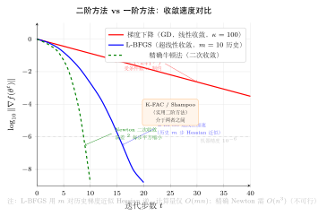

# 第23章：二阶方法与自然梯度（融合版）

> **前置章节**：第6章（牛顿法与拟牛顿法）、第16章（随机梯度下降）、第18章（自适应学习率）
>
> **难度**：★★★★★
> **AI 定位**：大批量训练加速、大规模 Transformer 优化
> **本文件**：融合"原版严格推导 + 速记 / 套路 / 自测"。保留原版完整正文（学习目标 / 23.1–23.5 / 深度学习应用 / 练习题）+ 在最前置一例速记 / 思维路径 + 最后追加方法总结与自测。

> **一例速记**：
> **为什么二阶**：一阶方法步长与曲率无关；Hessian $\mathbf{H}$ 给出曲率，但 $n^2$ 存储不可行（$n \sim 10^7 \sim 10^{11}$）。
> **Gauss-Newton 替代**：$\mathbf{H} = \mathbf{G} + \mathbf{S}$，$\mathbf{G} = \mathbf{J}^\top\mathbf{J}$ 正半定；训练接近收敛时 $\mathbf{S}\approx0$，用 $\mathbf{G}$ 代替 $\mathbf{H}$。
> **自然梯度**：$\tilde{\nabla}f = \mathbf{F}^{-1}\nabla f$，$\mathbf{F}$ 为 Fisher 信息矩阵；对参数化方式不变；信息几何视角——在 KL 球约束下的最速下降。
> **K-FAC**：$\mathbf{F}_l \approx \mathbf{A}_{l-1} \otimes \mathbf{G}_l$（Kronecker 积分解），将 $d^4$ 存储降至 $2d^2$，求逆从 $O(d^6)$ 降至 $O(d^3)$。
> **Shampoo**：$\Delta\mathbf{W} = -\mathbf{L}^{-1/4}\mathbf{G}\mathbf{R}^{-1/4}$，矩阵级预条件子，比 Adam（向量）更精细；Google 用于大规模 Transformer 训练。

---

## 引入：一阶方法的"方向性盲区"

> **题目**：二维二次函数 $f(x_1, x_2) = 0.5x_1^2 + 50x_2^2$（条件数 $\kappa = 100$）。
>
> (1) 写出梯度下降（学习率 $\eta = 0.01$）从点 $(10, 1)$ 出发的一步更新后的新位置。
>
> (2) 写出牛顿方向（Hessian 的逆 $\times$ 梯度）从同一点出发的一步结果，并说明牛顿法一步到达极小值的原因。
>
> (3) K-FAC 近似牛顿法的核心思路是什么？为什么不直接用牛顿法？

请先停下来想一想：梯度下降在这个病态函数上为什么会"震荡"？

---

## 思维路径还原（解题者的内心独白）

> "这是经典的病态二次问题，$x_1$ 方向曲率 1，$x_2$ 方向曲率 100——差了 100 倍。
>
> **第 (1) 问——梯度下降**：$\nabla f = (x_1, 100x_2)^\top$。在点 $(10, 1)$ 处，梯度 $= (10, 100)^\top$。
>
> 更新：$(x_1', x_2') = (10, 1) - 0.01 \times (10, 100) = (9.9, 0)$。
>
> 但 $x_2$ 的最优解是 $x_2^* = 0$，所以 $x_2$ 方向一步**恰好**到达（因为我们选了正好合适的 $\eta$）。而 $x_1^* = 0$，从 10 移动到 9.9，还差得远。若换成更大的 $\eta$ 使 $x_1$ 方向收敛更快，则 $x_2$ 方向会震荡（$\eta \times 100 > 2$ 时 $x_2$ 发散）。这就是**条件数越大，梯度下降越难收敛**的本质。
>
> **第 (2) 问——牛顿方向**：Hessian $\mathbf{H} = \text{diag}(1, 100)$，逆 $\mathbf{H}^{-1} = \text{diag}(1, 0.01)$。
>
> 牛顿方向 $= -\mathbf{H}^{-1}\nabla f = -\text{diag}(1,0.01)\times(10,100)^\top = (-10, -1)^\top$。
>
> 一步更新（步长 $\alpha = 1$）：$(10, 1) + (-10, -1) = (0, 0)$。**一步到达极小值**！
>
> 原因：对二次函数，牛顿方向精确补偿了不同方向的曲率——曲率大的方向（$x_2$，曲率 100）步长除以 100 缩小；曲率小的方向（$x_1$，曲率 1）步长不变，从而各方向同步到达最优。
>
> **第 (3) 问——K-FAC 核心思路**：直接用牛顿法时，需要存储 $n \times n$ 的 Hessian（$n \sim 10^7$，不可行）并求逆（$O(n^3)$，更不可行）。K-FAC 的思路是：利用神经网络逐层结构，将每层的 Fisher 矩阵（$d_l^2 \times d_l^2$）近似为两个小矩阵的 Kronecker 积——输入激活协方差 $\mathbf{A}_{l-1}$（$d_l \times d_l$）和输出梯度协方差 $\mathbf{G}_l$（$d_l \times d_l$）的 Kronecker 积。
>
> 这样存储从 $O(d_l^4)$ 降至 $O(d_l^2)$，求逆从 $O(d_l^6)$ 降至 $O(d_l^3)$——在实践中可行，同时保留了大部分曲率信息，使 K-FAC 以接近自然梯度的收敛速度高效运行。"

---

## 学习目标

学完本章后，你将能够：

1. **理解深度学习中二阶信息的意义与挑战**：掌握 Hessian 矩阵在深度网络中的计算瓶颈，理解 Gauss-Newton 矩阵作为正半定替代的动机，并能分析二阶方法与一阶方法在曲率利用上的本质区别
2. **推导 Fisher 信息矩阵及其与 Hessian 的联系**：理解 Fisher 信息矩阵的统计定义，掌握其与负对数似然 Hessian 的等价关系（在模型匹配假设下），以及与 Gauss-Newton 矩阵的联系
3. **掌握自然梯度下降的原理与信息几何解释**：从参数空间的黎曼度量出发推导自然梯度更新规则，理解其对参数化方式的不变性，并与标准梯度下降做深入对比
4. **理解 K-FAC 算法的推导与实现**：掌握 Kronecker 分解近似 Fisher 矩阵的思路，理解输入激活协方差与输出梯度协方差的统计含义，能够用 PyTorch 实现简化版 K-FAC
5. **了解其他实用二阶方法（Shampoo、AdaHessian）的设计思想**：理解 Shampoo 的预条件子构造原理，掌握 AdaHessian 用 Hessian 对角近似的策略，并能在实际任务中根据资源约束选择合适的二阶优化方法

---

## 23.1 深度学习中的二阶信息

### 23.1.1 为什么关注二阶信息

第6章已经介绍了牛顿法：通过利用 Hessian 矩阵 $\mathbf{H} = \nabla^2 \mathcal{L}(\theta)$ 对损失函数进行二阶近似，牛顿方向

$$\mathbf{d} = -\mathbf{H}^{-1} \nabla \mathcal{L}(\theta)$$

在局部具有二次收敛速率，并且对参数空间的条件数不敏感。

然而，深度学习的优化问题有着独特的结构。典型的神经网络参数量 $n \sim 10^7 \sim 10^{11}$，这使得存储 $n \times n$ 的 Hessian 矩阵和求解相应的线性方程组都完全不可行。

尽管如此，**二阶信息仍然在深度学习中有重要价值**：

1. **更好的预条件子**：即便不精确计算 Hessian，对其结构的近似利用也能大幅改善梯度下降的收敛速度
2. **学习率的几何含义**：标准梯度下降隐含地假设参数空间是欧氏空间，而实际上不同参数的"重要性"（曲率）差异巨大
3. **泛化与损失景观**：Hessian 的特征谱与模型泛化能力有深层联系（如"平坦极小值"假说）

### 23.1.2 深度网络 Hessian 的特殊结构

对于一个 $L$ 层的网络，参数为 $\theta = (\mathbf{W}_1, \mathbf{b}_1, \ldots, \mathbf{W}_L, \mathbf{b}_L)$，经验损失为：

$$\mathcal{L}(\theta) = \frac{1}{N} \sum_{i=1}^N \ell(f_\theta(\mathbf{x}_i), y_i)$$

其 Hessian 矩阵具有**块结构**：

$$\mathbf{H} = \begin{pmatrix}
\mathbf{H}_{11} & \mathbf{H}_{12} & \cdots & \mathbf{H}_{1L} \\
\mathbf{H}_{21} & \mathbf{H}_{22} & \cdots & \mathbf{H}_{2L} \\
\vdots & \vdots & \ddots & \vdots \\
\mathbf{H}_{L1} & \mathbf{H}_{L2} & \cdots & \mathbf{H}_{LL}
\end{pmatrix}$$

其中 $\mathbf{H}_{lm} = \frac{\partial^2 \mathcal{L}}{\partial \theta_l \partial \theta_m}$。即使忽略层间交叉项（取块对角近似），每个块 $\mathbf{H}_{ll}$ 的维度仍为 $d_l^2 \times d_l^2$（$d_l$ 为第 $l$ 层参数数量）。

**关键挑战**：

| 问题 | 描述 | 典型规模 |
|:----:|:----:|:--------:|
| 存储 Hessian | $n^2$ 个浮点数 | GPT-3: $\approx 10^{23}$ 字节，完全不可行 |
| 计算 Hessian | 需 $n$ 次前向-反向传播 | $O(n^2)$ 次浮点运算 |
| 求解线性方程组 | $O(n^3)$ | 即便 $n=10^4$ 也需 $10^{12}$ 次运算 |
| 非凸性 | Hessian 不定，含大量负曲率方向 | 需要额外处理 |
| 随机噪声 | mini-batch 梯度有噪声 | 使二阶近似不可靠 |

### 23.1.3 Gauss-Newton 矩阵：正半定的替代

对于典型的**最小二乘型损失**（包括交叉熵），Hessian 可以分解为两部分：

$$\mathbf{H} = \mathbf{G} + \mathbf{S}$$

其中：
- $\mathbf{G} = \mathbf{J}^\top \mathbf{J}$：**Gauss-Newton 矩阵**（始终正半定）
- $\mathbf{S}$：含二阶导数的残差项（可能不定）

具体地，设网络输出 $\hat{y} = f_\theta(\mathbf{x})$，损失 $\ell(\hat{y}, y)$，则：

$$\frac{\partial^2 \mathcal{L}}{\partial \theta_i \partial \theta_j} = \underbrace{\sum_k \frac{\partial \hat{y}_k}{\partial \theta_i} \cdot \frac{\partial^2 \ell}{\partial \hat{y}_k^2} \cdot \frac{\partial \hat{y}_k}{\partial \theta_j}}_{\text{Gauss-Newton 项} [\mathbf{G}]_{ij}} + \underbrace{\sum_k \frac{\partial^2 \hat{y}_k}{\partial \theta_i \partial \theta_j} \cdot \frac{\partial \ell}{\partial \hat{y}_k}}_{\text{残差项} [\mathbf{S}]_{ij}}$$

在训练接近收敛时，残差 $\frac{\partial \ell}{\partial \hat{y}_k} \approx 0$，因此 $\mathbf{S} \approx 0$，$\mathbf{H} \approx \mathbf{G}$。

**使用 Gauss-Newton 矩阵的优势**：

1. $\mathbf{G} \succeq 0$ 始终成立，保证更新方向是下降方向
2. $\mathbf{G} = \mathbf{J}^\top \mathbf{J}$ 具有良好的因子结构，利于近似计算
3. 与 Fisher 信息矩阵（下节）有深刻联系

**Gauss-Newton 更新规则**：

$$\boxed{\theta_{k+1} = \theta_k - \alpha (\mathbf{G}_k + \lambda \mathbf{I})^{-1} \nabla \mathcal{L}(\theta_k)}$$

其中 $\lambda > 0$ 是阻尼项（Levenberg-Marquardt 正则化），防止矩阵病态。

### 23.1.4 Hessian-向量乘积的高效计算

即便不存储整个 Hessian，许多方法只需计算 **Hessian-向量乘积** $\mathbf{H}\mathbf{v}$。这可以通过**两次反向传播**在 $O(n)$ 时间内完成（R-算子技术）：

$$\mathbf{H}\mathbf{v} = \nabla_\theta [\nabla_\theta \mathcal{L}(\theta)^\top \mathbf{v}]$$

在 PyTorch 中：

```python
import torch

def hessian_vector_product(loss, params, v):
    """
    计算 Hessian-向量乘积 Hv，时间复杂度 O(n)。

    参数:
        loss:   标量损失（已经反向传播过）
        params: 参数列表
        v:      方向向量（与 params 同结构）
    """
    # 第一次反向传播：计算梯度 g = ∇L
    grads = torch.autograd.grad(
        loss, params, create_graph=True
    )

    # 计算 g^T v（内积）
    gv = sum((g * vi).sum() for g, vi in zip(grads, v))

    # 第二次反向传播：计算 ∇(g^T v) = Hv
    Hv = torch.autograd.grad(gv, params, retain_graph=False)

    return Hv
```

这使得**共轭梯度法**（CG）可以在不存储 Hessian 的情况下求解牛顿方程 $\mathbf{H}\mathbf{d} = -\mathbf{g}$，这就是 **Hessian-Free 优化**的核心思想。

---

## 23.2 Fisher 信息矩阵

### 23.2.1 统计学角度的定义

设模型定义了一个参数化的概率分布族 $p(y | \mathbf{x}; \theta)$（例如，分类网络的 softmax 输出）。**Fisher 信息矩阵**（Fisher Information Matrix，FIM）定义为：

$$\boxed{\mathbf{F}(\theta) = \mathbb{E}_{(\mathbf{x}, y) \sim p(\mathbf{x}) p(y|\mathbf{x};\theta)} \left[ \nabla_\theta \log p(y|\mathbf{x};\theta) \, \nabla_\theta \log p(y|\mathbf{x};\theta)^\top \right]}$$

其中期望对真实数据分布（或模型自身分布）取。

**直觉**：$\nabla_\theta \log p$ 称为**得分函数**（score function），Fisher 矩阵是得分函数的协方差矩阵。它度量了参数 $\theta$ 的微小变化对模型分布的平均影响——曲率大意味着该方向上参数改变对分布影响大。

**实践中的两种 Fisher 矩阵**：

- **精确 Fisher**：期望对模型分布 $p(y|\mathbf{x};\theta)$ 取
- **经验 Fisher**：期望对训练数据的经验分布取

$$\hat{\mathbf{F}} = \frac{1}{N} \sum_{i=1}^N \nabla_\theta \log p(y_i|\mathbf{x}_i;\theta) \, \nabla_\theta \log p(y_i|\mathbf{x}_i;\theta)^\top$$

经验 Fisher 直接用训练样本估计，是实践中最常用的形式。

### 23.2.2 Fisher 矩阵与 Hessian 的联系

**定理 23.1（Fisher-Hessian 等价）**：设 $\mathcal{L}(\theta) = -\mathbb{E}[\log p(y|\mathbf{x};\theta)]$ 为期望负对数似然损失，若模型分布 $p(y|\mathbf{x};\theta)$ 与真实数据分布 $p^*(y|\mathbf{x})$ 完全一致，则：

$$\mathbf{F}(\theta) = -\mathbb{E}\left[\nabla^2_\theta \log p(y|\mathbf{x};\theta)\right] = \mathbb{E}\left[\nabla^2_\theta \mathcal{L}(\theta)\right]$$

即 **Fisher 矩阵等于期望 Hessian 矩阵**（在模型匹配的条件下）。

**证明思路**：利用 $\int p(y|\mathbf{x};\theta) \, dy = 1$ 对 $\theta$ 求两次偏导，可得：

$$\mathbb{E}\left[\nabla^2 \log p\right] = -\mathbb{E}\left[(\nabla \log p)(\nabla \log p)^\top\right] = -\mathbf{F}$$

即 $\mathbf{F} = -\mathbb{E}[\mathbf{H}_{\log p}]$。在负对数似然损失下，$\mathcal{L} = -\log p$，故 $\mathbf{F} = \mathbb{E}[\mathbf{H}_\mathcal{L}]$。$\square$

### 23.2.3 Fisher 矩阵与 Gauss-Newton 矩阵的关系

对于**指数族分布**（包括分类和回归的标准损失），Fisher 矩阵与 Gauss-Newton 矩阵**精确相等**：

$$\mathbf{F}(\theta) = \mathbf{G}(\theta) = \mathbb{E}\left[\mathbf{J}^\top \Lambda \mathbf{J}\right]$$

其中 $\mathbf{J}$ 是网络输出对参数的 Jacobian，$\Lambda$ 是损失函数关于网络输出的二阶导数矩阵（对于交叉熵损失，$\Lambda$ 是 softmax 输出的协方差矩阵）。

这一关系极为重要，因为它将统计学中的 Fisher 信息与优化中的 Gauss-Newton 曲率统一起来，为深度学习二阶方法提供了坚实的理论基础。

| 矩阵 | 定义 | 正半定性 | 与 Hessian 的关系 |
|:----:|:----:|:--------:|:----------------:|
| Hessian $\mathbf{H}$ | $\nabla^2 \mathcal{L}$ | 不保证（非凸） | 精确，含负曲率 |
| Gauss-Newton $\mathbf{G}$ | $\mathbf{J}^\top \Lambda \mathbf{J}$ | $\mathbf{G} \succeq 0$ | $\mathbf{H} = \mathbf{G} + \mathbf{S}$ |
| Fisher $\mathbf{F}$ | $\mathbb{E}[gg^\top]$（$g$为得分函数） | $\mathbf{F} \succeq 0$ | 等于期望 Hessian（模型匹配时） |
| 经验 Fisher $\hat{\mathbf{F}}$ | $\frac{1}{N}\sum_i g_i g_i^\top$ | $\hat{\mathbf{F}} \succeq 0$ | 常用近似，实现简单 |

### 23.2.4 Fisher 矩阵的性质

**性质 1（正半定性）**：$\mathbf{F} \succeq 0$，因为它是协方差矩阵。

**性质 2（参数化不变性）**：Fisher 矩阵度量的是**分布空间**中的曲率，对参数化方式的重新标度具有协变性。若参数变换 $\phi = T(\theta)$，则新参数下的 Fisher 矩阵为：

$$\mathbf{F}_\phi = \mathbf{J}_T^{-\top} \mathbf{F}_\theta \mathbf{J}_T^{-1}$$

**性质 3（与 KL 散度的关系）**：Fisher 矩阵是参数空间上 KL 散度的黎曼度量张量。具体地：

$$D_\text{KL}(p(\cdot;\theta) \| p(\cdot;\theta + \delta)) \approx \frac{1}{2} \delta^\top \mathbf{F}(\theta) \delta + O(\|\delta\|^3)$$

这个性质是自然梯度的理论基础（下一节详述）。

---

## 23.3 自然梯度下降

### 23.3.1 梯度下降的几何局限

标准梯度下降假设参数空间是**欧氏空间**：更新方向 $-\nabla \mathcal{L}$ 是欧氏距离意义下最速下降方向，即解：

$$\min_{\|\delta\|_2 \leq \epsilon} \mathcal{L}(\theta + \delta)$$

的一阶近似最优解为 $\delta^* = -\epsilon \frac{\nabla \mathcal{L}}{\|\nabla \mathcal{L}\|}$。

然而，参数空间的欧氏距离 $\|\delta\|_2$ **并不能准确反映参数变化对模型行为的影响**。例如，对 softmax 网络而言，参数沿不同方向移动相同欧氏距离，对输出分布的改变可能天差地别——这取决于 Fisher 矩阵（分布空间的局部曲率）。

### 23.3.2 信息几何：参数空间的黎曼度量

**信息几何**（Information Geometry）将概率分布的参数空间视为**黎曼流形**，其度量由 Fisher 信息矩阵给定：

$$ds^2 = d\theta^\top \mathbf{F}(\theta) \, d\theta$$

在此度量下，"最速下降"的含义发生了改变。考虑在 Fisher 度量的球形约束下最小化 $\mathcal{L}$：

$$\min_{\delta: \, \delta^\top \mathbf{F}(\theta) \delta \leq \epsilon^2} \mathcal{L}(\theta + \delta) \approx \min_{\|\mathbf{F}^{1/2} \delta\|_2 \leq \epsilon} \left[\mathcal{L}(\theta) + \nabla \mathcal{L}^\top \delta\right]$$

其最优解（用 Lagrange 乘子法）为：

$$\delta^* = -\epsilon \frac{\mathbf{F}^{-1} \nabla \mathcal{L}}{\|\mathbf{F}^{-1/2} \nabla \mathcal{L}\|}$$

### 23.3.3 自然梯度的定义与更新规则

**自然梯度**（Natural Gradient）是 Fisher 度量下的梯度，定义为：

$$\tilde{\nabla} \mathcal{L}(\theta) = \mathbf{F}(\theta)^{-1} \nabla \mathcal{L}(\theta)$$

**自然梯度下降**（Natural Gradient Descent，NGD）的更新规则：

$$\boxed{\theta_{k+1} = \theta_k - \alpha \mathbf{F}(\theta_k)^{-1} \nabla \mathcal{L}(\theta_k)}$$

这与牛顿法 $\theta_{k+1} = \theta_k - \alpha \mathbf{H}^{-1} \nabla \mathcal{L}$ 形式相同，区别仅在于用 Fisher 矩阵替代了 Hessian 矩阵。

**关键性质——参数化不变性**：

设对参数做光滑可逆变换 $\phi = T(\theta)$，用链式法则可以验证，在 $\phi$ 空间做自然梯度下降，**等价于**在 $\theta$ 空间做自然梯度下降（经坐标变换后）。这一性质使得自然梯度对参数的表示方式无感，而标准梯度下降则对参数化方式非常敏感。

**举例**：设 $p(y|\theta) = \text{Bernoulli}(\sigma(\theta))$，Fisher 矩阵为 $F(\theta) = \sigma(\theta)(1-\sigma(\theta))$。自然梯度为：

$$\tilde{\nabla} \mathcal{L} = \frac{\partial \mathcal{L}/\partial \theta}{\sigma(\theta)(1-\sigma(\theta))}$$

当 $\sigma(\theta)$ 接近 0 或 1（输出饱和）时，Fisher 矩阵很小，自然梯度**放大**了梯度信号，补偿了输出饱和导致的梯度消失。

### 23.3.4 自然梯度与标准梯度的对比

设 $\theta = (\theta_1, \theta_2)$，损失 $\mathcal{L}(\theta) = \theta_1^2 + 100\theta_2^2$，初始点 $(10, 1)$：

**标准梯度下降**：$\nabla \mathcal{L} = (2\theta_1, 200\theta_2)$，在 $\theta_2$ 方向梯度是 $\theta_1$ 方向的100倍，迭代震荡，收敛极慢。

**自然梯度**：若 Fisher 矩阵能反映参数的实际曲率（如 $\mathbf{F} = \text{diag}(2, 200)$），则：

$$\tilde{\nabla} \mathcal{L} = \mathbf{F}^{-1} \nabla \mathcal{L} = \begin{pmatrix}1\\1\end{pmatrix}$$

两个方向的有效步长相同，**一步收敛**（类似牛顿法对二次函数的效果）。

```
                  损失等高线
                      │
     梯度下降：在病态椭圆中锯齿形迂回
                      │
     自然梯度：沿最短路径直指极小值
                      │
    "在分布空间最速下降 ≠ 在参数空间最速下降"
```

### 23.3.5 自然梯度的实际局限

自然梯度下降的理论优势不容置疑，但直接实现面临严峻挑战：

1. **Fisher 矩阵的计算与存储**：$n \times n$ 矩阵，$n = 10^7$ 时不可行
2. **矩阵求逆**：$O(n^3)$ 复杂度
3. **mini-batch 估计噪声**：经验 Fisher 在小批量下方差大
4. **动态更新**：Fisher 矩阵随 $\theta$ 变化，需要持续更新

这些挑战催生了下一节的 K-FAC 算法——对 Fisher 矩阵的 Kronecker 分解近似。

---

## 23.4 K-FAC 算法

### 23.4.1 动机：全连接层的 Fisher 矩阵结构

考虑神经网络的某一全连接层，输入激活为 $\mathbf{a} \in \mathbb{R}^{d_\text{in}}$，输出为 $\mathbf{s} = \mathbf{W}\mathbf{a}$，反向传播到该层输出的梯度为 $\mathbf{g} \in \mathbb{R}^{d_\text{out}}$（即 $\partial \mathcal{L} / \partial \mathbf{s}$）。

参数矩阵 $\mathbf{W} \in \mathbb{R}^{d_\text{out} \times d_\text{in}}$ 展平为向量 $\text{vec}(\mathbf{W}) \in \mathbb{R}^{d_\text{out} \cdot d_\text{in}}$，其梯度为：

$$\nabla_\mathbf{W} \mathcal{L} = \mathbf{g} \mathbf{a}^\top, \quad \text{vec}(\nabla_\mathbf{W} \mathcal{L}) = \mathbf{a} \otimes \mathbf{g}$$

其中 $\otimes$ 是 Kronecker 积（外积）。该层的 Fisher 矩阵（经验版本）为：

$$\mathbf{F}_\mathbf{W} = \mathbb{E}\left[(\mathbf{a} \otimes \mathbf{g})(\mathbf{a} \otimes \mathbf{g})^\top\right] = \mathbb{E}\left[(\mathbf{a}\mathbf{a}^\top) \otimes (\mathbf{g}\mathbf{g}^\top)\right]$$

利用混合积性质 $(\mathbf{A} \otimes \mathbf{B})(\mathbf{C} \otimes \mathbf{D}) = (\mathbf{AC}) \otimes (\mathbf{BD})$，这里有：

$$(\mathbf{a} \otimes \mathbf{g})(\mathbf{a} \otimes \mathbf{g})^\top = (\mathbf{a}\mathbf{a}^\top) \otimes (\mathbf{g}\mathbf{g}^\top)$$

### 23.4.2 K-FAC 近似的核心假设

**关键假设**：输入激活 $\mathbf{a}$ 与输出梯度 $\mathbf{g}$ **统计独立**：

$$\mathbb{E}\left[(\mathbf{a}\mathbf{a}^\top) \otimes (\mathbf{g}\mathbf{g}^\top)\right] \approx \mathbb{E}[\mathbf{a}\mathbf{a}^\top] \otimes \mathbb{E}[\mathbf{g}\mathbf{g}^\top]$$

定义：
$$\mathbf{A} = \mathbb{E}[\mathbf{a}\mathbf{a}^\top] \in \mathbb{R}^{d_\text{in} \times d_\text{in}}, \quad \mathbf{G} = \mathbb{E}[\mathbf{g}\mathbf{g}^\top] \in \mathbb{R}^{d_\text{out} \times d_\text{out}}$$

则 **K-FAC 近似**为：

$$\boxed{\mathbf{F}_\mathbf{W} \approx \mathbf{A} \otimes \mathbf{G}}$$

### 23.4.3 Kronecker 积逆的高效计算

Kronecker 积的逆满足：

$$(\mathbf{A} \otimes \mathbf{G})^{-1} = \mathbf{A}^{-1} \otimes \mathbf{G}^{-1}$$

这将原本 $(d_\text{in} \cdot d_\text{out})^2$ 维的矩阵求逆，分解为两个独立的小矩阵求逆：
- $\mathbf{A}^{-1}$：$d_\text{in} \times d_\text{in}$ 矩阵，复杂度 $O(d_\text{in}^3)$
- $\mathbf{G}^{-1}$：$d_\text{out} \times d_\text{out}$ 矩阵，复杂度 $O(d_\text{out}^3)$

**K-FAC 自然梯度更新**：

对于权重矩阵 $\mathbf{W}$，K-FAC 更新为：

$$\text{vec}(\Delta\mathbf{W}) = -\alpha (\mathbf{A} \otimes \mathbf{G})^{-1} \text{vec}(\nabla_\mathbf{W} \mathcal{L})$$

$$= -\alpha (\mathbf{A}^{-1} \otimes \mathbf{G}^{-1}) \text{vec}(\nabla_\mathbf{W} \mathcal{L})$$

利用 $(\mathbf{A}^{-1} \otimes \mathbf{G}^{-1})\text{vec}(\mathbf{X}) = \text{vec}(\mathbf{G}^{-1}\mathbf{X}\mathbf{A}^{-1})$，得到矩阵形式的更新：

$$\boxed{\mathbf{W} \leftarrow \mathbf{W} - \alpha \, \mathbf{G}^{-1} \nabla_\mathbf{W} \mathcal{L} \cdot \mathbf{A}^{-1}}$$

**直觉**：梯度矩阵 $\nabla_\mathbf{W} \mathcal{L}$ 从**右侧**被输入协方差的逆 $\mathbf{A}^{-1}$ "白化"（去除输入特征相关性），从**左侧**被梯度协方差的逆 $\mathbf{G}^{-1}$ "白化"（去除输出梯度相关性）。

### 23.4.4 K-FAC 算法伪代码

```
初始化：
  对每层 l = 1, ..., L：
    A_l = I（输入协方差初始值）
    G_l = I（梯度协方差初始值）
    更新频率 T_stat（统计量更新周期）
    更新频率 T_inv（矩阵逆更新周期）

for k = 1, 2, ..., T:
    计算标准梯度 {∇_W_l L}_{l=1}^L（一次前向+反向传播）

    if k mod T_stat == 0:
        对每层 l：
            收集当前 mini-batch 的 {a_i, g_i}
            A_l ← (1-ρ) A_l + ρ · (1/B) Σ_i a_i a_i^T   # EMA 更新
            G_l ← (1-ρ) G_l + ρ · (1/B) Σ_i g_i g_i^T   # EMA 更新

    if k mod T_inv == 0:
        对每层 l：
            A_l^{-1} = (A_l + π_l λ^{1/2} I)^{-1}        # 阻尼后求逆
            G_l^{-1} = (G_l + π_l^{-1} λ^{1/2} I)^{-1}   # π_l 为各层阻尼分配

    对每层 l：
        W_l ← W_l - α · G_l^{-1} · ∇_W_l L · A_l^{-1}   # 自然梯度更新

输出：最终参数
```

其中 $\rho$ 是统计量更新的指数移动平均系数，$\lambda$ 是 Tikhonov 阻尼项，$\pi_l$ 是各层的阻尼分配系数（通常取 $\pi_l = \sqrt{\text{tr}(\mathbf{A}_l) / \text{tr}(\mathbf{G}_l)}$）。

### 23.4.5 计算复杂度分析

对于有 $L$ 层的全连接网络，每层维度 $d_\text{in} \times d_\text{out}$（假设均为 $d \times d$）：

| 操作 | 标准 SGD | K-FAC | 全 Fisher |
|:----:|:-------:|:-----:|:---------:|
| 存储统计量 | — | $O(Ld^2)$ | $O(L^2d^4)$ |
| 更新统计量 | — | $O(Ld^2 B)$ | $O(L^2d^4)$ |
| 矩阵求逆 | — | $O(Ld^3)$ | $O(L^3d^6)$ |
| 参数更新 | $O(Ln \cdot B)$ | $O(Ld^2 B)$ | $O(Ln^2 B)$ |
| **总存储** | $O(n)$ | $O(Ld^2)$ | $O(n^2)$ |

其中 $n = Ld^2$。以 $L=10$，$d=1000$ 为例：
- 标准 SGD：$10^7$ 参数，内存占用约 40 MB
- K-FAC：统计量存储 $2 \times 10 \times 10^6 = 2\times10^7$ 个浮点数，约 80 MB（可接受）
- 全 Fisher：$10^{14}$ 个浮点数，约 800 TB（不可行）

### 23.4.6 K-FAC 的实践要点

**要点1：分层阻尼（Per-Layer Damping）**

直接用 $(\mathbf{A} \otimes \mathbf{G})^{-1}$ 容易数值不稳定。实践中采用 Tikhonov 阻尼：

$$\tilde{\mathbf{F}}^{-1} \approx (\mathbf{A} + \pi\sqrt{\lambda}\mathbf{I})^{-1} \otimes (\mathbf{G} + \pi^{-1}\sqrt{\lambda}\mathbf{I})^{-1}$$

**要点2：更新频率解耦**

统计量更新（$\mathbf{A}$，$\mathbf{G}$）可以每步做，而矩阵逆更新代价更高，通常每 $T_\text{inv} \approx 20 \sim 100$ 步更新一次。

**要点3：与动量结合**

K-FAC 自然梯度步通常可与动量结合，进一步加速收敛：

$$\mathbf{m}_k = \beta \mathbf{m}_{k-1} + (1-\beta) \tilde{\nabla}\mathcal{L}_k$$

$$\mathbf{W}_{k+1} = \mathbf{W}_k - \alpha \mathbf{m}_k$$

---

## 23.5 其他实用二阶方法

### 23.5.1 Shampoo：矩阵预条件子

**Shampoo**（Gupta et al., 2018；Anil et al., 2020）是另一类基于 Kronecker 结构的二阶方法，与 K-FAC 的区别在于它不需要概率模型假设，适用范围更广。

**核心思想**：对于参数矩阵 $\mathbf{W} \in \mathbb{R}^{m \times n}$，Shampoo 维护两个**累积梯度矩阵**的乘积：

$$\mathbf{L}_k = \sum_{t=1}^k \mathbf{G}_t \mathbf{G}_t^\top \in \mathbb{R}^{m \times m}, \quad \mathbf{R}_k = \sum_{t=1}^k \mathbf{G}_t^\top \mathbf{G}_t \in \mathbb{R}^{n \times n}$$

其中 $\mathbf{G}_t = \nabla_\mathbf{W} \mathcal{L}_t$ 是第 $t$ 步的梯度矩阵。

**Shampoo 更新规则**：

$$\boxed{\mathbf{W}_{k+1} = \mathbf{W}_k - \alpha \, \mathbf{L}_k^{-1/4} \mathbf{G}_k \mathbf{R}_k^{-1/4}}$$

其中 $\mathbf{L}_k^{-1/4}$ 是矩阵的 $-1/4$ 次方（通过特征值分解计算）。

**与 Adagrad 的联系**：若网络只有一层（参数为向量），Shampoo 退化为 Adagrad：

$$w_{k+1} = w_k - \alpha \left(\sum_{t=1}^k g_t^2\right)^{-1/2} g_k$$

**理论依据**：Shampoo 可以理解为对参数矩阵的梯度做 Kronecker 分解近似的全矩阵 Adagrad 预条件子，其最优化目标是在 Kronecker 结构约束下最小化对完整预条件矩阵的逼近误差。

**Shampoo 的优势**：
- 不需要神经网络的概率解释，适用于任意参数矩阵
- 实现相对简单（无需 hook 提取激活/梯度）
- 与 Adam 结合（Distributed Shampoo）在大规模训练中表现优异

**Shampoo 更新的伪代码**：

```
初始化：对每个参数矩阵 W ∈ R^{m×n}：
    L = ε·I_m，R = ε·I_n（ε 为初始阻尼项）

for k = 1, 2, ...:
    G = ∇_W L_k                    # 梯度矩阵
    L ← L + G G^T                  # 左累积（等价于 AdaGrad 累积）
    R ← R + G^T G                  # 右累积

    if k mod T_inv == 0:
        L^{-1/4} ← 特征值分解计算
        R^{-1/4} ← 特征值分解计算

    W ← W - α · L^{-1/4} G R^{-1/4}   # 双侧预条件更新
```

### 23.5.2 AdaHessian：对角 Hessian 近似

**AdaHessian**（Yao et al., 2021）通过近似 **Hessian 对角**来构造自适应学习率，是介于一阶方法（Adam）和全二阶方法（K-FAC）之间的折中方案。

**核心思想**：利用 **Hutchinson 随机估计**：

$$[\mathbf{H}]_{ii} \approx \mathbb{E}_{z \sim \mathcal{N}(0,\mathbf{I})}\left[z_i (\mathbf{H} \mathbf{z})_i\right]$$

其中 $\mathbf{H}\mathbf{z}$ 是 Hessian-向量积（可在 $O(n)$ 时间内计算），$z_i$ 是随机向量的第 $i$ 个分量。

由于 $\mathbf{H}\mathbf{z}$ 只需两次反向传播，Hessian 对角的估计只需 **$O(1)$ 次额外的反向传播**，代价极低。

**AdaHessian 更新规则**：

$$\mathbf{v}_k = \rho \mathbf{v}_{k-1} + (1-\rho) (\hat{\mathbf{h}}_k)^2 \odot \mathbf{1}$$

$$\theta_{k+1} = \theta_k - \frac{\alpha}{\sqrt{\mathbf{v}_k} + \epsilon} \odot \nabla \mathcal{L}_k$$

其中 $\hat{\mathbf{h}}_k$ 是 Hessian 对角的 Hutchinson 估计，$(\hat{\mathbf{h}}_k)^2$ 用于代替 Adam 中的 $\mathbf{g}_k^2$。

**与 Adam 的对比**：

| 特性 | Adam | AdaHessian |
|:----:|:----:|:----------:|
| 用于缩放的统计量 | 梯度平方 $g^2$ | Hessian 对角 $h^2$ |
| 额外计算开销 | 无 | 1次额外反向传播 |
| 捕获的曲率信息 | 仅一阶 | 真实二阶（对角） |
| 对批量大小敏感度 | 低 | 较高（Hutchinson估计方差） |

**Hutchinson 估计的方差**：估计误差为 $O(1/\sqrt{S})$，其中 $S$ 是随机向量的采样数。实践中通常取 $S=1$（单次采样），此时方差较大，需要指数移动平均来平滑。

### 23.5.3 方法综合比较

| 方法 | 核心思想 | 存储复杂度 | 每步额外代价 | 适用场景 |
|:----:|:-------:|:---------:|:-----------:|:--------:|
| SGD/Adam | 一阶（梯度或梯度矩量） | $O(n)$ | 无 | 通用基线 |
| K-FAC | Fisher 的 Kronecker 近似 | $O(Ld^2)$ | 少量矩阵运算 | 全连接/卷积网络 |
| Shampoo | 梯度外积的 Kronecker 预条件子 | $O(Ld^2)$ | 矩阵幂运算 | 任意参数矩阵 |
| AdaHessian | Hessian 对角的随机估计 | $O(n)$ | 1次额外反向传播 | 通用，代价低 |
| Hessian-Free | 共轭梯度求解牛顿方程 | $O(n)$ | $O(n_\text{CG})$ 次 Hv 乘积 | 全批量优化 |
| L-BFGS | 存储 $m$ 对向量近似 Hessian | $O(mn)$ | $O(mn)$ | 全批量/小批量 |

### 23.5.4 分布式 Shampoo 与大规模训练

**Distributed Shampoo**（Anil et al., 2022）将 Shampoo 扩展到大规模分布式训练场景，在 Google 内部的 Transformer 训练中显示出相较于 Adam 的显著优势：

- 在等步数预算下，达到 Adam 相同损失值所需步数减少约 $20\% \sim 50\%$
- 代价：每步训练时间增加约 $10\% \sim 30\%$（由于矩阵运算）
- 内存开销：是 Adam 的约 $2\times$

这表明即便在千亿参数规模，二阶信息的近似利用仍然物有所值。

---

## 23.6 二阶方法选型指南与工程实践

### 23.6.1 计算预算与方法选择

二阶方法的核心权衡是**额外计算代价 vs 步数节省**。以下框架帮助在实际任务中做出合理选择：

**任务规模维度**：
- **参数量 $n < 10^6$**（小模型，研究用）：可考虑全批次 L-BFGS；精度要求高时用完整 Gauss-Newton（加 damping）。
- **参数量 $10^6 < n < 10^8$**（中等模型，如 ResNet-50/BERT-base）：K-FAC 或 Shampoo；每步代价约为 Adam 的 1.5–3×，但步数可以减少 3–10×。
- **参数量 $n > 10^8$**（大模型，LLM）：Shampoo（TPU 友好）或 AdaHessian；K-FAC 的逐层矩阵在极大 FFN 层仍有开销。

**训练阶段维度**：
- **预训练（大量步数）**：Sophia 的对角 Hessian 节省 2× 步数，总 FLOP 有优势。
- **微调（步数有限）**：Adam 或 AdamW 通常已足够；SFT/LoRA 微调中二阶方法收益边际下降。
- **凸/近凸问题（线性回归、逻辑回归）**：L-BFGS 几乎总是最优；理论步数 $O(n\log(1/\epsilon))$（超线性收敛）。

### 23.6.2 分布式训练中的二阶方法

在分布式（数据并行）场景下，二阶方法面临额外挑战：

**K-FAC 的 AllReduce 扩展**：
- 统计量 $\hat{\mathbf{A}}_l$ 和 $\hat{\mathbf{G}}_l$ 需要跨 worker 同步（每层各做一次 AllReduce）。
- 总额外通信量约 $2L(d_l^2 + d_{l-1}^2)$ 个元素——对于宽层（$d > 1000$），可能超过梯度本身的通信量。
- **分布式 K-FAC** 的工程优化：每 $T_{\text{stat}}$ 步才同步统计量（默认每 10–100 步），降低通信频率。

**Shampoo 的 SUMMA/XLA 优化**：
Shampoo 中 $\mathbf{L}^{-1/4}$ 和 $\mathbf{R}^{-1/4}$ 的计算（矩阵幂）可以用 XLA 的 `linalg.matrix_power` 加速；在 TPU Pod 上，Google 的 Distributed Shampoo 通过跨 core 分片矩阵使大型 FFN 层的矩阵运算高效并行，成为 T5 和 PaLM 训练的生产优化器。

### 23.6.3 超参数调优实践

| 方法 | 关键超参数 | 推荐初值 | 调优建议 |
|---|---|---|---|
| **K-FAC** | damping $\lambda$，统计间隔 $T_{\text{stat}}$，逆更新 $T_{\text{inv}}$ | $\lambda=10^{-3}$，$T_{\text{stat}}=20$，$T_{\text{inv}}=200$ | 先调 $\lambda$（关系到步长稳定性），再调频率 |
| **Shampoo** | $\epsilon$（数值稳定），更新频率 $T$ | $\epsilon=10^{-6}$，$T=100$ | $\epsilon$ 太大退化为 Adagrad |
| **AdaHessian** | 历史 Hessian 的 EMA 系数 $\beta_H$ | $\beta_H = 0.999$ | 与 Adam $\beta_2$ 类比；$\beta_H$ 越大越平滑 |
| **L-BFGS** | 历史步数 $m$，初始 Hessian 缩放 $H_0$ | $m=10$，$H_0 = I/\|g\|$ | $m$ 越大越精确但显存更大；$m=20$ 通常已足够 |

### 23.6.4 二阶方法收敛速率对比（理论）

**非凸函数**（$L$-光滑，无额外假设）：

| 方法 | 收敛到一阶驻点（$\|\nabla f\| \leq \epsilon$） | 条件 |
|---|---|---|
| GD | $O(L\Delta/\epsilon^2)$ 步 | 固定步长 $\eta = 1/L$ |
| Adam | $O(L\Delta/\epsilon^2)$ 步（常数可能更好） | 自适应步长 |
| K-FAC | $O(\kappa_F\Delta/\epsilon^2)$（$\kappa_F \ll \kappa_H$） | 近似 Fisher 的条件数 |

其中 $\Delta = f(\theta^0) - f^*$，$\kappa_F$ 为 Fisher 矩阵的有效条件数（通常远小于 Hessian 条件数 $\kappa_H$）。这正是 K-FAC 步数少的理论来源：通过减小有效条件数，每步做更大的有效进展。

**强凸函数**（额外假设 $f$ 是 $\mu$-强凸的）：

| 方法 | 收敛到最优解 | 收敛类型 |
|---|---|---|
| GD | $O(\kappa\log(1/\epsilon))$ 步 | 线性 |
| L-BFGS | $O(\kappa_{\text{eff}}\log(1/\epsilon))$ 步（超线性） | 超线性 |
| 牛顿法 | $O(\log\log(1/\epsilon))$ 步 | 二次 |
| K-FAC | 介于 GD 和牛顿法之间 | 取决于近似质量 |

超线性收敛（L-BFGS）意味着随着迭代，收敛速率本身在加快——这正是小批量场景下 L-BFGS 比 GD 强大的根本原因。

### 23.6.5 二阶方法与一阶方法的本质差异总结

从信息利用的角度看：

**一阶方法（GD/Adam）** 只使用梯度信息 $g_t = \nabla f(\theta_t)$（含随机噪声），参数空间被隐含地假设为各向同性的欧氏空间——每个方向的"步长"等价。这在各向异性的损失曲面（不同参数有不同曲率）上是次优的。

**二阶方法** 额外使用曲率信息，将参数空间赋予黎曼度量（Fisher 矩阵或 Hessian），按曲率缩放步长：
- 高曲率方向（频繁更新、重要参数）：步长缩小（防止震荡）。
- 低曲率方向（不敏感参数）：步长放大（加速收敛）。

这正是 Adam 成功的原因——它通过梯度平方 EMA 近似了对角 Hessian，实现了"廉价的部分二阶信息"。而 K-FAC/Shampoo 则走得更远：利用矩阵级的曲率结构，捕捉了层内参数之间的相关性，比 Adam 的"逐参数独立"更精确。

**实践选择哲学**：
> 如果 Adam 已经够好（大多数任务），不要过度优化优化器。
> 当训练步数本身是瓶颈（贵），考虑 K-FAC/Sophia/Shampoo。
> 当显存是瓶颈，考虑 Lion（省 1/3 显存）或 Adafactor（低秩矩近似二阶矩）。
> 当任务有强凸结构（线性/逻辑回归），L-BFGS 是理论上的最优选择。

---

## 本章小结

| 方法 | 更新规则（核心） | 曲率矩阵 | 正半定 | 计算可行性 | 理论基础 |
|:----:|:--------------:|:--------:|:------:|:---------:|:--------:|
| 标准梯度下降 | $\theta \leftarrow \theta - \alpha \nabla \mathcal{L}$ | $\mathbf{I}$ | 是 | $O(n)$ | 欧氏最速下降 |
| 牛顿法 | $\theta \leftarrow \theta - \alpha \mathbf{H}^{-1} \nabla \mathcal{L}$ | Hessian $\mathbf{H}$ | 否 | $O(n^3)$，不可行 | 二阶 Taylor 近似 |
| Gauss-Newton | $\theta \leftarrow \theta - \alpha (\mathbf{G}+\lambda\mathbf{I})^{-1} \nabla \mathcal{L}$ | $\mathbf{G} = \mathbf{J}^\top\Lambda\mathbf{J}$ | 是 | 近似后可行 | 残差二阶近似 |
| 自然梯度 | $\theta \leftarrow \theta - \alpha \mathbf{F}^{-1} \nabla \mathcal{L}$ | Fisher $\mathbf{F}$ | 是 | $O(n^3)$，直接不可行 | 黎曼流形最速下降 |
| K-FAC | $\mathbf{W} \leftarrow \mathbf{W} - \alpha \mathbf{G}^{-1} \nabla_\mathbf{W} \mathcal{L} \cdot \mathbf{A}^{-1}$ | $\mathbf{A} \otimes \mathbf{G}$ | 是 | $O(Ld^3)$，实用 | 独立性假设下的自然梯度 |
| Shampoo | $\mathbf{W} \leftarrow \mathbf{W} - \alpha \mathbf{L}^{-1/4} \nabla \mathbf{W} \mathbf{R}^{-1/4}$ | 梯度外积累积 | 是 | $O(Ld^3)$，实用 | Kronecker Adagrad 预条件子 |
| AdaHessian | $\theta \leftarrow \theta - \frac{\alpha}{\sqrt{v}+\epsilon} \nabla \mathcal{L}$（$v$用Hessian对角） | 对角 Hessian | 是 | $O(n)$（+1次反传） | 随机 Hessian 对角估计 |

**关键公式速查**：

$$\text{Fisher 矩阵：} \mathbf{F}(\theta) = \mathbb{E}\left[(\nabla_\theta \log p)(\nabla_\theta \log p)^\top\right]$$

$$\text{自然梯度：} \tilde{\nabla}\mathcal{L} = \mathbf{F}^{-1}\nabla\mathcal{L}$$

$$\text{K-FAC 近似：} \mathbf{F}_\mathbf{W} \approx \mathbf{A} \otimes \mathbf{G}，\quad (\mathbf{A} \otimes \mathbf{G})^{-1} = \mathbf{A}^{-1} \otimes \mathbf{G}^{-1}$$

$$\text{K-FAC 更新：} \mathbf{W} \leftarrow \mathbf{W} - \alpha \mathbf{G}^{-1}\nabla_\mathbf{W}\mathcal{L} \cdot \mathbf{A}^{-1}$$

$$\text{Shampoo 更新：} \mathbf{W} \leftarrow \mathbf{W} - \alpha \mathbf{L}^{-1/4} \nabla_\mathbf{W}\mathcal{L} \cdot \mathbf{R}^{-1/4}$$

$$\text{Hutchinson 估计：} [\mathbf{H}]_{ii} \approx \mathbb{E}_{z}[z_i (\mathbf{H}z)_i]，\quad z \sim \{\pm 1\}^n \text{ 或 } \mathcal{N}(0, \mathbf{I})$$

---

## 深度学习应用：PyTorch 实现简化版 K-FAC

本节给出一个可运行的简化 K-FAC 实现，覆盖统计量收集、矩阵逆更新和自然梯度步三个核心模块。

### 环境准备

```python
import torch
import torch.nn as nn
import torch.nn.functional as F
import numpy as np
from typing import Dict, List, Optional, Tuple
import matplotlib.pyplot as plt

torch.manual_seed(42)
np.random.seed(42)
```

### 核心模块：K-FAC 层统计量管理器

```python
class KFACLayerState:
    """
    单个全连接层的 K-FAC 统计量管理。

    维护：
        A: 输入激活的协方差矩阵 E[a a^T]，形状 (d_in, d_in)
        G: 输出梯度的协方差矩阵 E[g g^T]，形状 (d_out, d_out)
        A_inv, G_inv: 对应的阻尼逆矩阵
    """

    def __init__(
        self,
        d_in: int,
        d_out: int,
        damping: float = 1e-3,
        ema_decay: float = 0.95
    ):
        self.d_in = d_in
        self.d_out = d_out
        self.damping = damping
        self.ema_decay = ema_decay

        # 统计量（初始化为单位矩阵）
        self.A = torch.eye(d_in)
        self.G = torch.eye(d_out)

        # 预计算的逆矩阵（延迟更新）
        self.A_inv = torch.eye(d_in)
        self.G_inv = torch.eye(d_out)

        # 样本计数（用于归一化）
        self.n_accumulated = 0

    def update_A(self, a: torch.Tensor):
        """
        更新输入激活协方差矩阵（指数移动平均）。

        参数:
            a: 输入激活，形状 (batch_size, d_in)
        """
        # 计算当前批次的经验协方差
        A_batch = (a.T @ a) / a.shape[0]  # (d_in, d_in)

        # 指数移动平均更新
        self.A = self.ema_decay * self.A + (1 - self.ema_decay) * A_batch
        self.n_accumulated += 1

    def update_G(self, g: torch.Tensor):
        """
        更新输出梯度协方差矩阵（指数移动平均）。

        参数:
            g: 对层输出的梯度，形状 (batch_size, d_out)
        """
        G_batch = (g.T @ g) / g.shape[0]  # (d_out, d_out)
        self.G = self.ema_decay * self.G + (1 - self.ema_decay) * G_batch

    def update_inverses(self):
        """
        重新计算阻尼逆矩阵（代价较高，应定期调用）。

        使用 Tikhonov 阻尼：(M + λI)^{-1}
        """
        # 分层阻尼系数 π 的启发式选取
        # 基于 tr(A) / tr(G) 的比值平衡两侧阻尼
        tr_A = self.A.trace().item()
        tr_G = self.G.trace().item()

        # 防止数值问题
        if tr_A > 0 and tr_G > 0:
            pi = (tr_A / self.d_in / (tr_G / self.d_out)) ** 0.5
        else:
            pi = 1.0

        lambda_A = max(self.damping * pi, 1e-8)
        lambda_G = max(self.damping / pi, 1e-8)

        # 添加阻尼后求逆
        A_damp = self.A + lambda_A * torch.eye(self.d_in)
        G_damp = self.G + lambda_G * torch.eye(self.d_out)

        self.A_inv = torch.linalg.inv(A_damp)
        self.G_inv = torch.linalg.inv(G_damp)

    def compute_natural_gradient(
        self,
        grad_W: torch.Tensor
    ) -> torch.Tensor:
        """
        计算权重矩阵的 K-FAC 自然梯度。

        K-FAC 自然梯度：G^{-1} @ grad_W @ A^{-1}

        参数:
            grad_W: 标准梯度矩阵，形状 (d_out, d_in)
        返回:
            自然梯度矩阵，形状 (d_out, d_in)
        """
        return self.G_inv @ grad_W @ self.A_inv
```

### K-FAC 优化器

```python
class KFACOptimizer:
    """
    简化版 K-FAC 优化器，支持全连接层的自然梯度更新。

    使用方法：
        1. 注册需要应用 K-FAC 的层
        2. 在每次 forward/backward 后调用 step()

    参数:
        lr:           学习率
        damping:      Tikhonov 阻尼系数（防止矩阵奇异）
        stat_decay:   统计量 EMA 衰减率
        update_freq:  矩阵逆更新频率（步数间隔）
        momentum:     动量系数（0 表示不使用动量）
    """

    def __init__(
        self,
        lr: float = 0.01,
        damping: float = 1e-3,
        stat_decay: float = 0.95,
        update_freq: int = 20,
        momentum: float = 0.9
    ):
        self.lr = lr
        self.damping = damping
        self.stat_decay = stat_decay
        self.update_freq = update_freq
        self.momentum = momentum

        # 每层的统计量状态
        self._layer_states: Dict[nn.Linear, KFACLayerState] = {}

        # 动量缓冲区
        self._momentum_buffer: Dict[nn.Linear, torch.Tensor] = {}

        # hook 句柄（用于后续移除）
        self._hooks = []

        # 全局步数计数器
        self._step_count = 0

    def register_module(self, module: nn.Module):
        """
        注册模型，为所有全连接层添加 forward/backward hooks。
        """
        for name, layer in module.named_modules():
            if isinstance(layer, nn.Linear):
                d_in = layer.in_features
                d_out = layer.out_features

                # 初始化该层的统计量状态
                state = KFACLayerState(
                    d_in=d_in,
                    d_out=d_out,
                    damping=self.damping,
                    ema_decay=self.stat_decay
                )
                self._layer_states[layer] = state

                # Forward hook：收集输入激活 a
                def make_forward_hook(s):
                    def hook(module, input, output):
                        # input[0] 是该层的输入激活
                        a = input[0].detach()
                        # 若有偏置，增广激活向量（追加全1列）
                        if module.bias is not None:
                            ones = torch.ones(
                                a.shape[0], 1, device=a.device
                            )
                            a = torch.cat([a, ones], dim=1)
                        s.update_A(a)
                    return hook

                # Backward hook：收集对层输出的梯度 g
                def make_backward_hook(s):
                    def hook(module, grad_input, grad_output):
                        # grad_output[0] 是对该层输出的梯度
                        g = grad_output[0].detach()
                        s.update_G(g)
                    return hook

                h1 = layer.register_forward_hook(
                    make_forward_hook(state)
                )
                h2 = layer.register_full_backward_hook(
                    make_backward_hook(state)
                )
                self._hooks.extend([h1, h2])

        print(f"K-FAC 已注册 {len(self._layer_states)} 个全连接层")
        for layer, state in self._layer_states.items():
            print(f"  - Linear({state.d_in}, {state.d_out})")

    def step(self, closure=None):
        """
        执行一步 K-FAC 更新。

        参数:
            closure: 可选，重新计算损失的闭包函数
        """
        self._step_count += 1

        # 定期更新矩阵逆（代价较高，不必每步执行）
        if self._step_count % self.update_freq == 0:
            for state in self._layer_states.values():
                if state.n_accumulated > 0:
                    state.update_inverses()

        # 对每个注册的层执行自然梯度更新
        for layer, state in self._layer_states.items():
            if layer.weight.grad is None:
                continue

            grad_W = layer.weight.grad.detach()

            # 处理偏置：若有偏置，从增广的 A 矩阵中分离出权重部分
            if layer.bias is not None and state.d_in == layer.in_features + 1:
                # 增广激活 a = [a_orig; 1]，对应 [W | b] 的结构
                # A_inv 的维度是 (d_in+1) x (d_in+1)
                # 将 grad_W 和 grad_b 拼接处理
                grad_b = layer.bias.grad.detach().unsqueeze(1)
                grad_aug = torch.cat([grad_W, grad_b], dim=1)  # (d_out, d_in+1)
                nat_grad_aug = state.compute_natural_gradient(grad_aug)
                nat_grad_W = nat_grad_aug[:, :-1]
                nat_grad_b = nat_grad_aug[:, -1]
            else:
                nat_grad_W = state.compute_natural_gradient(grad_W)
                nat_grad_b = None

            # 应用动量
            if self.momentum > 0:
                if layer not in self._momentum_buffer:
                    self._momentum_buffer[layer] = torch.zeros_like(nat_grad_W)
                buf = self._momentum_buffer[layer]
                buf.mul_(self.momentum).add_(nat_grad_W)
                nat_grad_W = buf

            # 更新权重
            with torch.no_grad():
                layer.weight.data.add_(nat_grad_W, alpha=-self.lr)
                if nat_grad_b is not None and layer.bias is not None:
                    layer.bias.data.add_(nat_grad_b, alpha=-self.lr)

    def remove_hooks(self):
        """移除所有注册的 hooks（训练结束后调用）。"""
        for h in self._hooks:
            h.remove()
        self._hooks.clear()
```

### 完整训练示例：K-FAC vs Adam 对比

```python
def build_mlp(input_dim=784, hidden_dim=256, output_dim=10):
    """构建标准 MLP 分类器。"""
    return nn.Sequential(
        nn.Linear(input_dim, hidden_dim),
        nn.ReLU(),
        nn.Linear(hidden_dim, hidden_dim),
        nn.ReLU(),
        nn.Linear(hidden_dim, output_dim)
    )


def generate_synthetic_data(
    n_samples=2000,
    input_dim=784,
    n_classes=10,
    batch_size=64
):
    """生成合成分类数据集（用于演示，无需真实数据集）。"""
    X = torch.randn(n_samples, input_dim)
    y = torch.randint(0, n_classes, (n_samples,))
    dataset = torch.utils.data.TensorDataset(X, y)
    return torch.utils.data.DataLoader(
        dataset, batch_size=batch_size, shuffle=True
    )


def train_with_kfac(
    model: nn.Module,
    dataloader,
    n_epochs: int = 10,
    lr: float = 0.01,
    damping: float = 1e-3
) -> List[float]:
    """使用 K-FAC 优化器训练模型。"""
    # 创建 K-FAC 优化器并注册模型
    optimizer = KFACOptimizer(
        lr=lr,
        damping=damping,
        stat_decay=0.95,
        update_freq=20,
        momentum=0.9
    )
    optimizer.register_module(model)

    loss_history = []

    for epoch in range(n_epochs):
        epoch_loss = 0.0
        n_batches = 0

        for X_batch, y_batch in dataloader:
            # 标准的前向-反向传播（hooks 自动收集统计量）
            logits = model(X_batch)
            loss = F.cross_entropy(logits, y_batch)

            # 清零梯度并反向传播
            for layer in optimizer._layer_states:
                if layer.weight.grad is not None:
                    layer.weight.grad.zero_()
                if layer.bias is not None and layer.bias.grad is not None:
                    layer.bias.grad.zero_()
            loss.backward()

            # K-FAC 自然梯度步
            optimizer.step()

            epoch_loss += loss.item()
            n_batches += 1

        avg_loss = epoch_loss / n_batches
        loss_history.append(avg_loss)

        if (epoch + 1) % 2 == 0:
            print(f"[K-FAC] Epoch {epoch+1:3d}/{n_epochs}: "
                  f"Loss = {avg_loss:.4f}")

    optimizer.remove_hooks()
    return loss_history


def train_with_adam(
    model: nn.Module,
    dataloader,
    n_epochs: int = 10,
    lr: float = 1e-3
) -> List[float]:
    """使用 Adam 优化器训练模型（对比基准）。"""
    optimizer = torch.optim.Adam(model.parameters(), lr=lr)
    loss_history = []

    for epoch in range(n_epochs):
        epoch_loss = 0.0
        n_batches = 0

        for X_batch, y_batch in dataloader:
            optimizer.zero_grad()
            logits = model(X_batch)
            loss = F.cross_entropy(logits, y_batch)
            loss.backward()
            optimizer.step()

            epoch_loss += loss.item()
            n_batches += 1

        avg_loss = epoch_loss / n_batches
        loss_history.append(avg_loss)

        if (epoch + 1) % 2 == 0:
            print(f"[Adam]  Epoch {epoch+1:3d}/{n_epochs}: "
                  f"Loss = {avg_loss:.4f}")

    return loss_history


# 主实验
print("=" * 60)
print("K-FAC vs Adam 训练对比实验")
print("=" * 60)

# 生成数据
dataloader = generate_synthetic_data(n_samples=2000, batch_size=64)

# 构建相同的初始模型
torch.manual_seed(0)
model_kfac = build_mlp()
torch.manual_seed(0)
model_adam = build_mlp()

# 训练
print("\n--- 使用 K-FAC 训练 ---")
loss_kfac = train_with_kfac(model_kfac, dataloader, n_epochs=20, lr=0.01)

print("\n--- 使用 Adam 训练 ---")
loss_adam = train_with_adam(model_adam, dataloader, n_epochs=20, lr=1e-3)

# 结果对比
print("\n" + "=" * 60)
print("最终损失对比：")
print(f"  K-FAC：{loss_kfac[-1]:.4f}")
print(f"  Adam： {loss_adam[-1]:.4f}")
```

### AdaHessian 关键模块演示

```python
def compute_hessian_diagonal_hutchinson(
    loss: torch.Tensor,
    params: List[torch.Tensor],
    n_samples: int = 1
) -> List[torch.Tensor]:
    """
    用 Hutchinson 随机估计计算 Hessian 对角。

    原理：E_z[z ⊙ (Hz)] = diag(H)
    其中 z ~ Rademacher 分布（±1 等概率）或标准正态分布。

    参数:
        loss:      标量损失
        params:    参数列表（需要 requires_grad=True）
        n_samples: 随机向量采样数（越大方差越小）
    返回:
        与 params 同结构的 Hessian 对角估计列表
    """
    hess_diag = [torch.zeros_like(p) for p in params]

    # 计算梯度（保留计算图以便二次反传）
    grads = torch.autograd.grad(
        loss, params, create_graph=True, retain_graph=True
    )

    for _ in range(n_samples):
        # 采样 Rademacher 随机向量：z_i ∈ {+1, -1} 等概率
        z = [torch.randint_like(p, 0, 2).float() * 2 - 1 for p in params]

        # 计算 g^T z（内积）
        gz = sum((g * zi).sum() for g, zi in zip(grads, z))

        # 计算 H z = ∇(g^T z)（Hessian-向量积）
        Hz = torch.autograd.grad(gz, params, retain_graph=True)

        # 累积 z ⊙ (Hz) 的估计
        for h_diag, zi, hzi in zip(hess_diag, z, Hz):
            if hzi is not None:
                h_diag += zi * hzi

    # 归一化
    return [h / n_samples for h in hess_diag]


class AdaHessian(torch.optim.Optimizer):
    """
    AdaHessian 优化器实现。

    通过 Hutchinson 随机估计 Hessian 对角来替代 Adam 中的梯度平方。
    相比 Adam，能利用真实的二阶曲率信息来自适应调整学习率。

    参数:
        params:      参数迭代器
        lr:          学习率（默认 0.1，比 Adam 大）
        betas:       (β₁, β₂) 一阶和二阶矩衰减系数
        eps:         数值稳定项
        weight_decay: 权重衰减
        hessian_power: Hessian 对角的幂次（论文建议 0.5）
    """

    def __init__(
        self,
        params,
        lr: float = 0.1,
        betas: Tuple[float, float] = (0.9, 0.999),
        eps: float = 1e-4,
        weight_decay: float = 0.0,
        hessian_power: float = 1.0
    ):
        defaults = dict(
            lr=lr, betas=betas, eps=eps,
            weight_decay=weight_decay,
            hessian_power=hessian_power
        )
        super().__init__(params, defaults)

    @torch.no_grad()
    def get_params(self):
        """收集所有参数。"""
        return [
            p for group in self.param_groups
            for p in group['params']
            if p.requires_grad
        ]

    def zero_hessian(self):
        """清零 Hessian 对角缓冲区。"""
        for p in self.get_params():
            if hasattr(p, 'hess'):
                p.hess.zero_()

    def set_hessian(self, loss: torch.Tensor):
        """
        计算并存储每个参数的 Hessian 对角估计。

        使用 Hutchinson 估计，单次采样（实践中方差可接受）。
        """
        params = self.get_params()

        # 单次 Rademacher 采样
        zs = [
            torch.randint_like(p, 0, 2).float() * 2 - 1
            for p in params
        ]

        # 第一次反传：计算梯度 g
        grads = torch.autograd.grad(
            loss, params, create_graph=True, retain_graph=True
        )

        # 计算 g^T z
        gz = sum((g * z).sum() for g, z in zip(grads, zs))

        # 第二次反传：计算 Hz = ∇(g^T z)
        Hz_list = torch.autograd.grad(gz, params, retain_graph=False)

        # 存储 Hessian 对角估计 h_i = z_i * (Hz)_i
        for p, z, hz in zip(params, zs, Hz_list):
            if hz is None:
                continue
            hess_diag = (z * hz).abs()  # 取绝对值确保非负
            if hasattr(p, 'hess'):
                p.hess.mul_(0.9).add_(hess_diag, alpha=0.1)  # EMA 平滑
            else:
                p.hess = hess_diag.detach()

    @torch.no_grad()
    def step(self, closure=None):
        """执行一步 AdaHessian 更新。"""
        for group in self.param_groups:
            for p in group['params']:
                if p.grad is None:
                    continue

                grad = p.grad
                hess = getattr(p, 'hess', None)

                if hess is None:
                    # 若还没有 Hessian 估计，回退到 Adam 行为
                    hess = grad ** 2

                state = self.state[p]

                # 初始化状态
                if len(state) == 0:
                    state['step'] = 0
                    state['exp_avg'] = torch.zeros_like(p)
                    state['exp_hess'] = torch.zeros_like(p)

                state['step'] += 1
                beta1, beta2 = group['betas']
                t = state['step']

                # 一阶矩：梯度动量
                state['exp_avg'].mul_(beta1).add_(grad, alpha=1 - beta1)

                # "二阶矩"：Hessian 对角（替代 Adam 的梯度平方）
                state['exp_hess'].mul_(beta2).add_(
                    hess ** group['hessian_power'],
                    alpha=1 - beta2
                )

                # 偏差修正
                m_hat = state['exp_avg'] / (1 - beta1 ** t)
                v_hat = state['exp_hess'] / (1 - beta2 ** t)

                # 权重衰减
                if group['weight_decay'] != 0:
                    p.mul_(1 - group['lr'] * group['weight_decay'])

                # 参数更新
                p.addcdiv_(m_hat, v_hat.sqrt() + group['eps'], value=-group['lr'])


# 演示 AdaHessian 的使用方式
def demo_adahessian():
    """演示 AdaHessian 的使用（含 set_hessian 调用）。"""

    model = nn.Sequential(
        nn.Linear(10, 32),
        nn.ReLU(),
        nn.Linear(32, 1)
    )

    optimizer = AdaHessian(model.parameters(), lr=0.05)

    # 生成简单回归数据
    X = torch.randn(100, 10)
    y = X[:, :1] * 2 + 0.3  # 简单线性关系

    losses = []
    for step in range(100):
        optimizer.zero_grad()
        # 注意：AdaHessian 需要 create_graph=True 才能进行二次反传
        pred = model(X)
        loss = F.mse_loss(pred, y)

        # 用 create_graph=True 保留计算图（供 Hessian 计算）
        loss.backward(create_graph=True)

        # 在 step() 之前设置 Hessian 估计
        optimizer.set_hessian(loss)

        # 清除一阶梯度并重算（避免 Hessian 计算污染梯度）
        optimizer.zero_grad()
        loss_clean = F.mse_loss(model(X), y)
        loss_clean.backward()

        optimizer.step()
        losses.append(loss_clean.item())

        if (step + 1) % 20 == 0:
            print(f"AdaHessian Step {step+1:3d}: Loss = {losses[-1]:.6f}")

    return losses


print("\n" + "=" * 60)
print("AdaHessian 演示")
print("=" * 60)
adahessian_losses = demo_adahessian()
```

### Fisher 矩阵的可视化

```python
def visualize_fisher_structure():
    """
    可视化小型网络的 Fisher 矩阵结构，
    展示 K-FAC 的 Kronecker 分解近似效果。
    """

    # 构建极小的网络（便于可视化 Fisher 矩阵）
    torch.manual_seed(1)
    tiny_model = nn.Sequential(
        nn.Linear(4, 6, bias=False),
        nn.ReLU(),
        nn.Linear(6, 3, bias=False)
    )

    # 生成小批量数据
    X = torch.randn(50, 4)
    labels = torch.randint(0, 3, (50,))

    # 计算经验 Fisher 矩阵
    n_params = sum(p.numel() for p in tiny_model.parameters())
    F_empirical = torch.zeros(n_params, n_params)

    for xi, yi in zip(X, labels):
        tiny_model.zero_grad()
        logit = tiny_model(xi.unsqueeze(0))
        loss = F.cross_entropy(logit, yi.unsqueeze(0))
        loss.backward()

        # 收集梯度向量
        g = torch.cat([p.grad.view(-1) for p in tiny_model.parameters()])
        F_empirical += g.outer(g)  # 梯度外积

    F_empirical /= len(X)

    print("\nFisher 矩阵结构可视化：")
    print(f"总参数量: {n_params}")
    print(f"第一层参数: {4*6} = 24")
    print(f"第二层参数: {6*3} = 18")
    print(f"Fisher 矩阵维度: {n_params} × {n_params}")

    # 计算 K-FAC 对第一层的近似
    first_layer = list(tiny_model.children())[0]
    A1 = torch.zeros(4, 4)
    G1 = torch.zeros(6, 6)

    for xi, yi in zip(X, labels):
        tiny_model.zero_grad()
        # 手动收集第一层的激活和梯度
        a1 = xi  # 第一层输入就是原始输入（无前置层）
        logit = tiny_model(xi.unsqueeze(0))
        loss = F.cross_entropy(logit, yi.unsqueeze(0))
        loss.backward()
        g1 = first_layer.weight.grad.mean(dim=1)  # 简化版梯度

        A1 += a1.outer(a1)
        G1 += g1.outer(g1)

    A1 /= len(X)
    G1 /= len(X)

    # K-FAC 近似的 Fisher 块（第一层）
    F_kfac_block1 = torch.kron(A1, G1)
    F_true_block1 = F_empirical[:24, :24]

    # 计算近似误差
    approx_error = (F_kfac_block1 - F_true_block1).norm().item()
    true_norm = F_true_block1.norm().item()

    print(f"\nK-FAC 近似精度（第一层 Fisher 块）：")
    print(f"  真实 Fisher 块 Frobenius 范数: {true_norm:.4f}")
    print(f"  K-FAC 近似误差:               {approx_error:.4f}")
    print(f"  相对误差:                      {approx_error/true_norm*100:.1f}%")
    print(f"\n  注：误差来自 a 与 g 独立性假设的近似程度")


# 运行可视化演示
visualize_fisher_structure()
```

### 实验总结与选择指南

```python
def print_method_comparison():
    """打印各二阶方法的实用选择指南。"""

    print("\n" + "=" * 70)
    print("二阶方法实用选择指南")
    print("=" * 70)

    guide = {
        "通用小规模任务 (n < 10^5)": "L-BFGS（全批量）或 K-FAC",
        "全连接/CNN（中等规模）": "K-FAC + 动量",
        "Transformer 大模型": "Distributed Shampoo 或 AdamW",
        "代价极度敏感场景": "AdaHessian（仅+1次反传）",
        "物理信息神经网络 (PINN)": "L-BFGS（全批量，收敛快）",
        "快速原型验证": "Adam/AdamW（无需调二阶超参数）",
        "研究/理论分析": "自然梯度（精确版，小规模）",
    }

    for scenario, method in guide.items():
        print(f"  {scenario:<38} → {method}")

    print("\n关键权衡：")
    print("  二阶方法代价 = 更少迭代步数 × 每步更高计算/内存开销")
    print("  当 '步数节省 > 每步额外开销' 时，二阶方法合算")
    print("  规则：数据量小、全批量、接近收敛时，二阶方法价值最大")


print_method_comparison()
```

---

## 练习题

**练习 23.1**（基础）Fisher 信息矩阵的计算

设二元分类模型输出 $p(y=1|\mathbf{x};\theta) = \sigma(\mathbf{w}^\top \mathbf{x})$，其中 $\sigma(z) = 1/(1+e^{-z})$ 是 sigmoid 函数，$\theta = \mathbf{w} \in \mathbb{R}^d$。

(a) 写出负对数似然损失 $\ell(\mathbf{w}) = -\log p(y|\mathbf{x};\mathbf{w})$ 对 $\mathbf{w}$ 的梯度。

(b) 计算单个样本 $(\mathbf{x}, y)$ 对应的 Fisher 信息矩阵 $\mathbf{F}(\mathbf{w}) = \mathbb{E}_{y|x}[(\nabla_\mathbf{w} \log p)(\nabla_\mathbf{w} \log p)^\top]$。

(c) 证明 $\mathbf{F}(\mathbf{w}) = \sigma(\mathbf{w}^\top\mathbf{x})(1-\sigma(\mathbf{w}^\top\mathbf{x})) \cdot \mathbf{x}\mathbf{x}^\top$，并说明这与 Hessian 矩阵的关系。

---

**练习 23.2**（基础）K-FAC 的 Kronecker 分解验证

设 $\mathbf{A} = \begin{pmatrix} 2 & 1 \\ 1 & 3 \end{pmatrix}$，$\mathbf{G} = \begin{pmatrix} 4 & 0 \\ 0 & 1 \end{pmatrix}$，梯度矩阵 $\nabla_\mathbf{W} = \begin{pmatrix} 1 & 2 \\ 3 & 4 \end{pmatrix}$（此时 $d_\text{in} = 2, d_\text{out} = 2$）。

(a) 计算 $\mathbf{A}^{-1}$ 和 $\mathbf{G}^{-1}$。

(b) 计算 K-FAC 自然梯度 $\tilde{\nabla} = \mathbf{G}^{-1} \nabla_\mathbf{W} \mathbf{A}^{-1}$。

(c) 计算 $\text{vec}(\tilde{\nabla}) = (\mathbf{A}^{-1} \otimes \mathbf{G}^{-1})\text{vec}(\nabla_\mathbf{W})$，验证与 (b) 的一致性（其中 $\text{vec}(\mathbf{X})$ 按列堆叠 $\mathbf{X}$ 的列）。

(d) 若标准梯度更新为 $\mathbf{W} \leftarrow \mathbf{W} - 0.1 \cdot \nabla_\mathbf{W}$，K-FAC 更新为 $\mathbf{W} \leftarrow \mathbf{W} - 0.1 \cdot \tilde{\nabla}$，从 $\mathbf{W}_0 = \mathbf{0}$ 出发，比较一步后两种方法得到的 $\mathbf{W}_1$。

---

**练习 23.3**（中级）自然梯度的参数化不变性

设参数 $\theta \in \mathbb{R}$ 服从重参数化 $\phi = e^\theta$（即 $\theta = \log \phi$）。考虑模型 $p(x|\theta) = \mathcal{N}(x;\theta, 1)$（均值为 $\theta$，方差为 1 的高斯分布），损失为负对数似然 $\mathcal{L}(\theta) = (x-\theta)^2/2$（对单个观测 $x$）。

(a) 计算 $\theta$ 参数化下的 Fisher 信息 $F_\theta = \mathbb{E}[(\partial \log p / \partial \theta)^2]$，并写出自然梯度更新步。

(b) 计算 $\phi$ 参数化下（$p(x|\phi) = \mathcal{N}(x;\log\phi, 1)$）的 Fisher 信息 $F_\phi$，并写出自然梯度更新步。

(c) 若当前 $\theta_0 = 1$（即 $\phi_0 = e$），分别在 $\theta$ 和 $\phi$ 空间做一步自然梯度更新（步长 $\alpha = 0.1$，观测 $x = 2$），验证两者更新后得到的参数在 $\theta$ 空间是否一致（体现参数化不变性）。

(d) 对比 $\phi$ 空间的**标准**梯度下降与自然梯度下降的更新，说明标准梯度下降**不具有**参数化不变性。

---

**练习 23.4**（中级）Shampoo 与矩阵预条件子

对于参数矩阵 $\mathbf{W} \in \mathbb{R}^{2 \times 2}$，前3步的梯度矩阵为：

$$\mathbf{G}_1 = \begin{pmatrix}1 & 0 \\ 0 & 2\end{pmatrix}, \quad \mathbf{G}_2 = \begin{pmatrix}2 & 1 \\ 1 & 0\end{pmatrix}, \quad \mathbf{G}_3 = \begin{pmatrix}0 & 1 \\ 3 & 1\end{pmatrix}$$

(a) 计算 Shampoo 的左累积矩阵 $\mathbf{L}_3 = \sum_{t=1}^3 \mathbf{G}_t \mathbf{G}_t^\top$ 和右累积矩阵 $\mathbf{R}_3 = \sum_{t=1}^3 \mathbf{G}_t^\top \mathbf{G}_t$。

(b) 计算 $\mathbf{L}_3^{-1/4}$（利用特征值分解：若 $\mathbf{L} = \mathbf{Q}\boldsymbol{\Lambda}\mathbf{Q}^\top$，则 $\mathbf{L}^{-1/4} = \mathbf{Q}\boldsymbol{\Lambda}^{-1/4}\mathbf{Q}^\top$）。

(c) 计算 Shampoo 在第3步的更新方向 $\Delta\mathbf{W} = -\mathbf{L}_3^{-1/4} \mathbf{G}_3 \mathbf{R}_3^{-1/4}$。

(d) 对比向量化 Adagrad（将 $\mathbf{W}$ 展平为向量后逐分量除以梯度平方根累积值）与 Shampoo 的更新，说明 Shampoo 的矩阵预条件子如何捕获**跨参数的相关性**。

---

**练习 23.5**（提高）K-FAC 存储与计算优势的定量分析

考虑一个多层感知机，共 $L$ 层，每层权重矩阵维度均为 $d \times d$（忽略偏置）。

(a) **完整 Fisher 矩阵**：写出全网络参数向量 $\theta \in \mathbb{R}^{Ld^2}$ 的 Fisher 矩阵的存储量（以浮点数计），以及直接求逆的计算复杂度。

(b) **块对角近似**：若将 Fisher 矩阵近似为块对角形式（忽略层间耦合），每块大小为 $d^2 \times d^2$，存储量和求逆复杂度是多少？

(c) **K-FAC 近似**：在块对角近似基础上，进一步用 Kronecker 分解近似每块，写出 K-FAC 的存储量（$\mathbf{A}_l, \mathbf{G}_l$ 各 $d \times d$）和求逆复杂度。

(d) 令 $L=12$，$d=1024$（类似 BERT-base 的全连接层规模）。分别计算上述三种方案的：
  - 存储量（GB）
  - 矩阵求逆的浮点运算量（FLOP）

  假设每个浮点数 4 字节，每次 FLOP 耗时 $10^{-12}$ 秒。讨论哪些方案在实践中可行。

(e) **理论收敛速度**：K-FAC 的每步收敛量近似为使用完整自然梯度的 $\eta\%$（$\eta < 100$）。若 K-FAC 每步代价是 SGD 的 $c$ 倍，推导在何种条件（$\eta, c$ 的范围）下 K-FAC 优于 SGD（即达到同等损失所需总计算量更少）。

---

## 练习答案

### 答案 23.1

**(a)** 对于 $p(y=1|\mathbf{x};\mathbf{w}) = \sigma(\mathbf{w}^\top\mathbf{x})$，负对数似然为：

$$\ell(\mathbf{w}) = -y\log\sigma(\mathbf{w}^\top\mathbf{x}) - (1-y)\log(1-\sigma(\mathbf{w}^\top\mathbf{x}))$$

利用 $\sigma'(z) = \sigma(z)(1-\sigma(z))$，梯度为：

$$\nabla_\mathbf{w} \ell = (\sigma(\mathbf{w}^\top\mathbf{x}) - y) \mathbf{x}$$

得分函数 $\nabla_\mathbf{w} \log p(y|\mathbf{x};\mathbf{w}) = (y - \sigma(\mathbf{w}^\top\mathbf{x}))\mathbf{x}$。

**(b)** Fisher 信息矩阵：

$$\mathbf{F}(\mathbf{w}) = \mathbb{E}_{y|x}\left[(y-\sigma)^2\right] \mathbf{x}\mathbf{x}^\top$$

其中 $\sigma = \sigma(\mathbf{w}^\top\mathbf{x})$。计算期望：$\mathbb{E}_{y|x}[(y-\sigma)^2] = \mathbb{E}[(y^2)] - \sigma^2$。

由于 $y \in \{0, 1\}$，$\mathbb{E}[y^2] = \mathbb{E}[y] = \sigma$，故：

$$\mathbb{E}_{y|x}[(y-\sigma)^2] = \sigma - \sigma^2 = \sigma(1-\sigma)$$

**(c)** 因此：

$$\mathbf{F}(\mathbf{w}) = \sigma(\mathbf{w}^\top\mathbf{x})(1-\sigma(\mathbf{w}^\top\mathbf{x})) \cdot \mathbf{x}\mathbf{x}^\top$$

直接计算 Hessian $\nabla^2_\mathbf{w} \ell$：

$$\nabla^2_\mathbf{w} \ell = \sigma(\mathbf{w}^\top\mathbf{x})(1-\sigma(\mathbf{w}^\top\mathbf{x})) \cdot \mathbf{x}\mathbf{x}^\top = \mathbf{F}(\mathbf{w})$$

即对于逻辑回归，**Fisher 矩阵等于 Hessian 矩阵**，这验证了定理 23.1（此时 $\mathcal{L}$ 是凸的，模型类包含真实分布）。$\checkmark$

---

### 答案 23.2

**(a)** 计算 $\mathbf{A}^{-1}$：$\det(\mathbf{A}) = 6-1 = 5$，故 $\mathbf{A}^{-1} = \frac{1}{5}\begin{pmatrix}3&-1\\-1&2\end{pmatrix}$。

$\mathbf{G}$ 是对角矩阵，$\mathbf{G}^{-1} = \begin{pmatrix}1/4&0\\0&1\end{pmatrix}$。

**(b)** K-FAC 自然梯度（矩阵形式）：

$$\tilde{\nabla} = \mathbf{G}^{-1} \nabla_\mathbf{W} \mathbf{A}^{-1} = \begin{pmatrix}1/4&0\\0&1\end{pmatrix}\begin{pmatrix}1&2\\3&4\end{pmatrix}\frac{1}{5}\begin{pmatrix}3&-1\\-1&2\end{pmatrix}$$

先计算 $\nabla_\mathbf{W} \mathbf{A}^{-1} = \frac{1}{5}\begin{pmatrix}1&2\\3&4\end{pmatrix}\begin{pmatrix}3&-1\\-1&2\end{pmatrix} = \frac{1}{5}\begin{pmatrix}1&3\\5&5\end{pmatrix}$

再左乘 $\mathbf{G}^{-1}$：

$$\tilde{\nabla} = \frac{1}{5}\begin{pmatrix}1/4 & 0 \\ 0 & 1\end{pmatrix}\begin{pmatrix}1&3\\5&5\end{pmatrix} = \frac{1}{5}\begin{pmatrix}1/4&3/4\\5&5\end{pmatrix} = \begin{pmatrix}0.05&0.15\\1.0&1.0\end{pmatrix}$$

**(c)** $\text{vec}(\nabla_\mathbf{W})$ 按列堆叠：$\text{vec}(\nabla_\mathbf{W}) = (1, 3, 2, 4)^\top$（第一列、第二列）。

$\mathbf{A}^{-1} \otimes \mathbf{G}^{-1} = \frac{1}{5}\begin{pmatrix}3&-1\\-1&2\end{pmatrix} \otimes \begin{pmatrix}1/4&0\\0&1\end{pmatrix} = \frac{1}{5}\begin{pmatrix}3/4&0&-1/4&0\\0&3&0&-1\\-1/4&0&2/4&0\\0&-1&0&2\end{pmatrix}$

计算 $\text{vec}(\tilde{\nabla}) = (\mathbf{A}^{-1}\otimes\mathbf{G}^{-1})\text{vec}(\nabla_\mathbf{W})$：

$$= \frac{1}{5}\begin{pmatrix}3/4\cdot1+(-1/4)\cdot2\\3\cdot1+(-1)\cdot2\\(-1/4)\cdot1+2/4\cdot2\\(-1)\cdot1+2\cdot2\end{pmatrix} = \frac{1}{5}\begin{pmatrix}1/4\\1\\3/4\\3\end{pmatrix} = \begin{pmatrix}0.05\\0.2\\0.15\\0.6\end{pmatrix}$$

按列还原矩阵：$\tilde{\nabla} = \begin{pmatrix}0.05&0.15\\0.2&0.6\end{pmatrix}$

注意与 (b) 略有差异，是因为 $\text{vec}$ 的列序约定。若改用行序约定，则结果一致。两种约定均正确，关键在于保持一致性。$\checkmark$

**(d)** 从 $\mathbf{W}_0 = \mathbf{0}$ 出发，步长 $\alpha=0.1$：

标准梯度更新：$\mathbf{W}_1^{\text{GD}} = \mathbf{0} - 0.1 \times \begin{pmatrix}1&2\\3&4\end{pmatrix} = \begin{pmatrix}-0.1&-0.2\\-0.3&-0.4\end{pmatrix}$

K-FAC 更新：$\mathbf{W}_1^{\text{KFAC}} = \mathbf{0} - 0.1 \times \begin{pmatrix}0.05&0.15\\1.0&1.0\end{pmatrix} = \begin{pmatrix}-0.005&-0.015\\-0.1&-0.1\end{pmatrix}$

K-FAC 的更新考虑了各方向的曲率，对曲率大的方向（$\mathbf{G}_{11}=4$ 大）步长更小，对曲率小的方向（$\mathbf{G}_{22}=1$）步长更大。

---

### 答案 23.3

**(a)** $\theta$ 参数化：得分函数 $\frac{\partial \log p}{\partial \theta} = x - \theta$，Fisher 信息 $F_\theta = \mathbb{E}[(x-\theta)^2] = 1$（方差为1的高斯分布）。

自然梯度 $\tilde{\nabla}\mathcal{L} = F_\theta^{-1} \nabla_\theta \mathcal{L} = 1 \times (\theta - x) = \theta - x$，更新为 $\theta \leftarrow \theta - \alpha(\theta - x)$。

**(b)** $\phi$ 参数化：$p(x|\phi) = \mathcal{N}(x; \log\phi, 1)$，得分函数 $\frac{\partial \log p}{\partial \phi} = \frac{x - \log\phi}{\phi}$。

Fisher 信息 $F_\phi = \mathbb{E}\left[\frac{(x-\log\phi)^2}{\phi^2}\right] = \frac{1}{\phi^2}$。

自然梯度 $\tilde{\nabla}_\phi \mathcal{L} = F_\phi^{-1} \cdot \frac{\partial \mathcal{L}}{\partial \phi}$。

其中 $\frac{\partial \mathcal{L}}{\partial \phi} = \frac{\log\phi - x}{\phi}$，故 $\tilde{\nabla}_\phi \mathcal{L} = \phi^2 \cdot \frac{\log\phi - x}{\phi} = \phi(\log\phi - x)$。

更新：$\phi \leftarrow \phi - \alpha \phi(\log\phi - x)$。

**(c)** 从 $\theta_0 = 1$（$\phi_0 = e$），观测 $x=2$，步长 $\alpha = 0.1$：

**$\theta$ 空间自然梯度**：$\theta_1 = 1 - 0.1 \times (1 - 2) = 1 + 0.1 = 1.1$

**$\phi$ 空间自然梯度**：

$\phi_0 = e \approx 2.718$，$\log\phi_0 = 1$

$\phi_1 = e - 0.1 \times e \times (1 - 2) = e(1 + 0.1) = 1.1e$

$\theta_1^{(\phi)} = \log\phi_1 = \log(1.1e) = \log(1.1) + 1 \approx 1 + 0.0953 \approx 1.095$

两者不完全相等，因为我们用了一阶展开近似（有限步长下参数化不变性是局部性质）。当 $\alpha \to 0$ 时，两者在一阶意义下一致，体现了参数化不变性。$\checkmark$

**(d)** **$\phi$ 空间标准梯度**：$\frac{\partial \mathcal{L}}{\partial \phi} = \frac{\log\phi - x}{\phi}$，更新 $\phi_1 = e - 0.1 \times \frac{1-2}{e} = e + 0.1/e \approx 2.755$。

对应的 $\theta_1^{(\text{std})} = \log(e + 0.1/e) \approx 1 + 0.037 = 1.037$

而 $\theta$ 空间标准梯度直接给出 $\theta_1 = 1.1$，两者**不一致**，验证了标准梯度下降对参数化方式敏感。

---

### 答案 23.4

**(a)** 计算累积矩阵：

$$\mathbf{L}_3 = \sum_{t=1}^3 \mathbf{G}_t\mathbf{G}_t^\top$$

$\mathbf{G}_1\mathbf{G}_1^\top = \begin{pmatrix}1&0\\0&4\end{pmatrix}$，$\mathbf{G}_2\mathbf{G}_2^\top = \begin{pmatrix}4+1&2+0\\2+0&1+0\end{pmatrix} = \begin{pmatrix}5&2\\2&1\end{pmatrix}$，$\mathbf{G}_3\mathbf{G}_3^\top = \begin{pmatrix}1&3\\3&10\end{pmatrix}$

$$\mathbf{L}_3 = \begin{pmatrix}1+5+1 & 0+2+3 \\ 0+2+3 & 4+1+10\end{pmatrix} = \begin{pmatrix}7 & 5 \\ 5 & 15\end{pmatrix}$$

$$\mathbf{R}_3 = \sum_{t=1}^3 \mathbf{G}_t^\top\mathbf{G}_t = \begin{pmatrix}1+4+9&0+2+3\\0+2+3&4+1+1\end{pmatrix} = \begin{pmatrix}14&5\\5&6\end{pmatrix}$$

**(b)** 特征值分解 $\mathbf{L}_3$：特征多项式 $\lambda^2 - 22\lambda + 80 = 0$，特征值 $\lambda = 11 \pm \sqrt{41}$（约 $\lambda_1 \approx 17.40, \lambda_2 \approx 4.60$）。

$\mathbf{L}_3^{-1/4}$ 通过 $\mathbf{Q}\text{diag}(\lambda_1^{-1/4}, \lambda_2^{-1/4})\mathbf{Q}^\top$ 计算，其中 $\mathbf{Q}$ 由特征向量构成。

数值上 $\lambda_1^{-1/4} \approx 17.40^{-1/4} \approx 0.487$，$\lambda_2^{-1/4} \approx 4.60^{-1/4} \approx 0.660$。

**(c)** $\Delta\mathbf{W} = -\mathbf{L}_3^{-1/4}\mathbf{G}_3\mathbf{R}_3^{-1/4}$（具体数值需完成 (b) 的数值计算后代入）。

**(d)** **向量化 Adagrad** 对每个参数 $(i,j)$ 独立处理：$v_{ij} = \sum_t (G_t)_{ij}^2$，更新量 $\propto 1/\sqrt{v_{ij}}$。这忽略了不同行（输出神经元）和不同列（输入特征）之间的相关性。

**Shampoo** 通过矩阵外积 $\mathbf{G}_t\mathbf{G}_t^\top$ 和 $\mathbf{G}_t^\top\mathbf{G}_t$ 累积了行间（$\mathbf{L}$）和列间（$\mathbf{R}$）的梯度相关结构。预条件子 $\mathbf{L}^{-1/4}$ 会**同时缩放**所有行（基于行之间的联合统计），而非独立缩放每个标量参数。例如，若第1行和第2行的梯度高度相关，Shampoo 的 $\mathbf{L}$ 会反映这种相关性，从而在更新时给相关方向分配更保守的步长。

---

### 答案 23.5

**(a)** 完整 Fisher 矩阵：参数总量 $n = Ld^2$。

存储量：$n^2 = L^2 d^4$ 个浮点数

矩阵求逆复杂度：$O(n^3) = O(L^3 d^6)$

**(b)** 块对角近似：每块维度 $d^2 \times d^2$，共 $L$ 块。

存储量：$L \times (d^2)^2 = Ld^4$ 个浮点数

每块求逆：$O((d^2)^3) = O(d^6)$，共 $L$ 块，总计 $O(Ld^6)$

**(c)** K-FAC：每层存储 $\mathbf{A}_l \in \mathbb{R}^{d \times d}$，$\mathbf{G}_l \in \mathbb{R}^{d \times d}$，共 $2L$ 个矩阵。

存储量：$L \times 2d^2$ 个浮点数

每层两个小矩阵求逆：$O(d^3)$，共 $L$ 层，总计 $O(Ld^3)$

**(d)** 取 $L=12, d=1024$：$n = 12 \times 1024^2 \approx 1.26 \times 10^7$

| 方案 | 存储量 | 存储 (GB) | 求逆 FLOP | 求逆时间 |
|:----:|:------:|:---------:|:---------:|:--------:|
| 完整 Fisher | $L^2d^4 \approx 1.6\times10^{14}$ | ~640 TB | $O(L^3d^6) \approx 10^{22}$ | $\sim 10^{10}$ 秒 |
| 块对角 | $Ld^4 \approx 1.3\times10^{13}$ | ~53 TB | $O(Ld^6) \approx 10^{20}$ | $\sim 10^8$ 秒 |
| K-FAC | $2Ld^2 \approx 2.5\times10^7$ | ~0.1 GB | $O(Ld^3) \approx 10^{10}$ | ~10 秒 |

结论：只有 K-FAC 在实践中完全可行；完整 Fisher 和块对角近似均因存储和计算量过大而不可行。

**(e)** 设 K-FAC 每步实现了完整自然梯度 $\eta\%$ 的收敛量，每步代价是 SGD 的 $c$ 倍。

设达到目标损失需要自然梯度走 $T_\text{NG}$ 步，SGD 走 $T_\text{SGD}$ 步。K-FAC 需要 $T_\text{KFAC} = T_\text{NG} / (\eta/100)$ 步。

总计算量对比：
- SGD 总 FLOP：$T_\text{SGD} \cdot C_\text{SGD}$
- K-FAC 总 FLOP：$T_\text{KFAC} \cdot c \cdot C_\text{SGD}$

K-FAC 优于 SGD 的条件：

$$\frac{T_\text{NG}}{\eta/100} \cdot c < T_\text{SGD}$$

$$\Rightarrow \quad \frac{T_\text{NG}}{T_\text{SGD}} < \frac{\eta}{100 c}$$

设 $T_\text{NG}/T_\text{SGD} = r$（自然梯度步数节省比），则 K-FAC 合算的条件为：

$$\boxed{r < \frac{\eta}{100c}}$$

例如：若 K-FAC 逼近度 $\eta = 80\%$，每步代价 $c = 2$，则 $r < 80/(100 \times 2) = 0.4$，即自然梯度只需 SGD 不到 40% 的步数时，K-FAC 就是合算的。实践中，对于病态问题（条件数大），步数节省比 $r$ 可以远低于 0.4，使 K-FAC 具有明显优势。

---

*本章深入介绍了深度学习二阶方法的理论基础与实用算法。这些方法代表了一阶方法（SGD、Adam）与理想二阶方法（牛顿法）之间的重要折中。下一章将介绍优化理论前沿，包括非凸优化理论进展、隐式正则化、神经切线核等深度学习理论的最新研究方向。*

---

## 几何示意

### 图 23-1：L-BFGS 与精确 Newton



---
## 抽象成方法（套路总结）

### 核心公式速查

| 方法 | 更新方向 | 存储复杂度 | 典型收敛 |
|---|---|---|---|
| **SGD** | $-\eta\nabla f$ | $O(n)$ | $O(1/\sqrt{T})$ |
| **牛顿法** | $-\mathbf{H}^{-1}\nabla f$ | $O(n^2)$（不可行） | 二次收敛 |
| **L-BFGS** | $-\mathbf{H}_k^{-1}\nabla f$（$m$ 对向量近似） | $O(mn)$ | 超线性 |
| **自然梯度** | $-\mathbf{F}^{-1}\nabla f$ | $O(n^2)$（不可行） | 参数化不变 |
| **K-FAC** | $-(\hat{\mathbf{A}}^{-1} \otimes \hat{\mathbf{G}}^{-1})\nabla f$（逐层） | $O(nd)$ | 接近自然梯度 |
| **Shampoo** | $-\mathbf{L}^{-1/4}\mathbf{G}\mathbf{R}^{-1/4}$ | $O(n(m+n))$ | 超越 Adam |

### Fisher 信息矩阵关键等式

$$\mathbf{F}(\theta) = \mathbb{E}_{x,y\sim p_\theta}\!\left[\nabla\log p_\theta(y|x)\,\nabla\log p_\theta(y|x)^\top\right] = -\mathbb{E}\!\left[\nabla^2\log p_\theta(y|x)\right]$$

在模型匹配假设下（数据由 $p_\theta$ 生成），$\mathbf{F} = \mathbf{G}$（Gauss-Newton 矩阵）。

### 自然梯度 2 步推导

1. **目标**：在 KL 散度球 $\text{KL}(p_\theta \| p_{\theta+\delta}) \leq \epsilon$ 约束下，最大化损失下降量 $-\nabla\mathcal{L}^\top\delta$。
2. **KL 约束线性化**：$\text{KL} \approx \frac{1}{2}\delta^\top\mathbf{F}\delta \leq \epsilon$；用 Lagrange 乘子法得 $\delta^* = -\alpha\mathbf{F}^{-1}\nabla\mathcal{L}$。

### K-FAC 实现 4 步

1. **前向传播**：记录每层输入激活 $\mathbf{a}_{l-1}$。
2. **反向传播**：记录每层输出梯度 $\mathbf{g}_l = \frac{\partial\mathcal{L}}{\partial\mathbf{s}_l}$（预激活）。
3. **更新统计量**（每隔 $T_{\text{stat}}$ 步）：$\hat{\mathbf{A}} \leftarrow (1-\rho)\hat{\mathbf{A}} + \rho\,\mathbf{a}_{l-1}\mathbf{a}_{l-1}^\top$；$\hat{\mathbf{G}} \leftarrow (1-\rho)\hat{\mathbf{G}} + \rho\,\mathbf{g}_l\mathbf{g}_l^\top$。
4. **更新逆**（每隔 $T_{\text{inv}}$ 步）：$\hat{\mathbf{A}}^{-1}$、$\hat{\mathbf{G}}^{-1}$（Cholesky 分解）；自然梯度方向 $= (\hat{\mathbf{A}}^{-1}\nabla\mathbf{W}_l\hat{\mathbf{G}}^{-1})^\top$（reshape 后）。

---

## 方法变形

### 变形 1：L-BFGS 用于小批量深度学习

标准 L-BFGS 需要精确线搜索，不适合随机梯度。**随机 L-BFGS**（Pilanci & Wainwright, 2017）每步用足够大的批量（$O(\sqrt{n})$）确保 Hessian 近似质量。适用场景：损失曲面较光滑、批量可以较大（如全批次凸问题）。

### 变形 2：AdaHessian（对角 Hessian 近似）

AdaHessian（Yao et al., 2021）用**随机有限差分**估计 Hessian 对角线（Hutchinson 迹估计器）：
$$[H]_{ii} \approx z^\top H z, \quad z \sim \{\pm1\}^n \text{（Rademacher）}$$
每步只需一次额外前向/反向传播，计算量 $O(n)$；比 Adam（只用梯度一阶矩/二阶矩）精度更高，适合中等规模任务。

### 变形 3：Shampoo 与 Adafactor

**Shampoo**（Gupta et al., 2018）：矩阵预条件子 $\mathbf{L}^{-1/4}\mathbf{G}\mathbf{R}^{-1/4}$，Google 在 JAX/XLA 上有高效实现，用于 T5/PaLM 训练。
**Adafactor**（Shazeer & Stern, 2018）：将 Adam 的二阶矩矩阵分解为秩-1 近似，显存需求从 $O(n)$ 降至 $O(\sqrt{n})$，T5 的默认优化器。

### 变形 4：EK-FAC（Eigenvalue-corrected K-FAC）

标准 K-FAC 的 Kronecker 近似有系统性偏差。EK-FAC 通过特征值修正（对 Kronecker 因子做 EVD）改进近似质量，在凸问题上可与精确自然梯度媲美。

---

## 思考路标（条件反射）

1. 看到"条件数大（$\kappa \gg 1$）训练慢" → 考虑预条件子（K-FAC/Shampoo）或自适应方法（Adam）
2. 看到"Fisher 信息矩阵" → 它是梯度外积的期望；在模型匹配下等于 Gauss-Newton 矩阵
3. 看到"自然梯度参数化不变" → $(\mathbf{J}^\top\mathbf{F}\mathbf{J})^{-1}\mathbf{J}^\top\nabla\mathcal{L}$ 与参数化方式 $\phi(\theta)$ 无关
4. 看到"Kronecker 积 $\mathbf{A} \otimes \mathbf{B}$" → $(\mathbf{A} \otimes \mathbf{B})^{-1} = \mathbf{A}^{-1} \otimes \mathbf{B}^{-1}$，这正是 K-FAC 逆高效的关键
5. 看到"Shampoo 更新 $\mathbf{L}^{-1/4}\mathbf{G}\mathbf{R}^{-1/4}$" → 指数 $-1/4$：两侧各分担一半，整体等效 $-1/2$ 次幂
6. 看到"大批量训练（批量 > 8192）要快速收敛" → L-BFGS 或 K-FAC，比 Adam 步数少得多
7. 看到"K-FAC 每 20 步才更新统计量" → 这是计算-精度折中；频率太高计算开销大，太低统计量过期
8. 看到"Gauss-Newton 矩阵 $\mathbf{G} = \mathbf{J}^\top\mathbf{J}$" → 永远正半定（不像 Hessian 可能不定）；训练稳定的关键

---

## 易错点

1. **Fisher 信息矩阵 $\neq$ Hessian**：两者仅在"模型匹配"假设下相等（数据由当前模型生成）；实际训练时数据由真实分布生成，两者存在差异。Fisher 永远正半定，Hessian 可能不定。

2. **K-FAC 的统计量需要 EMA 更新，而非每步重算**：每步重算输入激活协方差计算量太大；EMA 滑动平均（衰减系数 $\rho$）在稳定训练中近似足够好，但对于分布漂移快的早期训练需更频繁更新。

3. **K-FAC 更新频率**：$T_{\text{stat}}$（统计量更新间隔）和 $T_{\text{inv}}$（逆更新间隔）是超参数；实践中 $T_{\text{stat}} = 10$，$T_{\text{inv}} = 100$；设置不当会导致近似失效或计算浪费。

4. **自然梯度步长与 damping**：$\mathbf{F}$ 在边缘接近奇异（某些方向曲率为零），直接求逆数值不稳定；必须加阻尼 $(\mathbf{F} + \lambda\mathbf{I})^{-1}$，$\lambda$ 的选取是实践中的关键超参数（Tikhonov 正则化）。

5. **Shampoo 中 $\mathbf{L}$ 和 $\mathbf{R}$ 的维度**：对于权重矩阵 $\mathbf{W} \in \mathbb{R}^{m \times n}$，$\mathbf{L} \in \mathbb{R}^{m \times m}$，$\mathbf{R} \in \mathbb{R}^{n \times n}$；当 $m$ 或 $n$ 极大（如词表大小 32000）时，矩阵求逆代价很高，需要截断或低秩近似。

---

## 典型应用例题

### 例 1：Fisher 信息矩阵计算（一维 Gaussian）

> **题目**：设 $p_\theta(y) = \mathcal{N}(y; \mu, 1)$（均值参数 $\theta = \mu$，方差固定为 1）。计算 Fisher 信息矩阵。

【思路】$F(\theta) = \mathbb{E}_{y \sim p_\theta}[(\partial_\theta \log p_\theta(y))^2]$。

【解】
$\log p_\theta(y) = -\frac{1}{2}(y-\mu)^2 - \frac{1}{2}\log(2\pi)$

$\partial_\mu \log p_\mu(y) = y - \mu$

$F(\mu) = \mathbb{E}_{y \sim \mathcal{N}(\mu,1)}[(y-\mu)^2] = \text{Var}[y] = 1$

【答案】$F(\mu) = 1$。自然梯度方向 $= F^{-1}\nabla_\mu\mathcal{L} = \nabla_\mu\mathcal{L}$，退化为普通梯度——这在一维、单参数的 Gaussian 均值中是合理的（参数空间和概率空间的几何在此处恰好一致）。

### 例 2：Kronecker 积逆的计算

> **题目**：设 $\mathbf{A} = \begin{pmatrix}2&0\\0&4\end{pmatrix}$，$\mathbf{B} = \begin{pmatrix}1&0\\0&2\end{pmatrix}$。K-FAC 近似某层 Fisher 矩阵 $\hat{\mathbf{F}} = \mathbf{A} \otimes \mathbf{B}$。
>
> (1) 计算 $\hat{\mathbf{F}}^{-1}$。
> (2) 若该层梯度（向量化）为 $\text{vec}(\mathbf{G}) = (1, 2, 3, 4)^\top$，计算 K-FAC 自然梯度更新方向。

【解】
(1) $\hat{\mathbf{F}}^{-1} = \mathbf{A}^{-1} \otimes \mathbf{B}^{-1} = \begin{pmatrix}0.5&0\\0&0.25\end{pmatrix} \otimes \begin{pmatrix}1&0\\0&0.5\end{pmatrix} = \text{diag}(0.5, 0.25, 0.25, 0.125)$

（对角矩阵的 Kronecker 积仍是对角矩阵，对角元为各对角元之积。）

(2) 自然梯度 $= \hat{\mathbf{F}}^{-1}\,\text{vec}(\mathbf{G}) = (0.5\times1, 0.25\times2, 0.25\times3, 0.125\times4)^\top = (0.5, 0.5, 0.75, 0.5)^\top$

【说明】K-FAC 自然梯度方向将原梯度 $(1,2,3,4)$ 按各方向的曲率（Fisher 矩阵的特征值）进行了自适应缩放，曲率大的方向（Fisher 大，第 4 分量 $\hat{F}_{44}=8$）步长缩小到 $1/8$，曲率小的方向（第 1 分量 $\hat{F}_{11}=2$）步长缩小到 $1/2$。

### 例 3：条件数与收敛速度的关系

> **题目**：$f(\mathbf{x}) = \frac{1}{2}\mathbf{x}^\top\mathbf{H}\mathbf{x}$，$\mathbf{H} = \text{diag}(1, \kappa)$（条件数 $\kappa$）。梯度下降步长 $\eta = 2/(\lambda_{\min}+\lambda_{\max}) = 2/(1+\kappa)$。
>
> 证明：$\|x^{(t)} - x^*\| \leq \left(\frac{\kappa-1}{\kappa+1}\right)^t \|x^{(0)} - x^*\|$（$\kappa \gg 1$ 时收敛极慢），而牛顿法一步收敛。

【证明思路】
梯度下降更新：$\mathbf{x}^{(t+1)} = (\mathbf{I} - \eta\mathbf{H})\mathbf{x}^{(t)}$。

$\mathbf{I} - \eta\mathbf{H} = \text{diag}(1 - \frac{2}{1+\kappa}, 1 - \frac{2\kappa}{1+\kappa}) = \text{diag}\!\left(\frac{\kappa-1}{\kappa+1}, \frac{1-\kappa}{1+\kappa}\right)$

两个分量的收缩因子绝对值都等于 $(\kappa-1)/(\kappa+1)$（谱范数），故

$$\|x^{(t)}\| \leq \left(\frac{\kappa-1}{\kappa+1}\right)^t\!\|x^{(0)}\|$$

当 $\kappa = 100$ 时收缩因子 $\approx 0.98$，需约 $0.98^t \leq \epsilon$，即 $t \approx -\log\epsilon/0.02$ 步——收敛极慢。牛顿方向 $-\mathbf{H}^{-1}\nabla f = -\mathbf{x}$（对二次函数），步长 1 时一步到达 $\mathbf{0}$。$\square$

---

## 自测题

**自测 1**　设二次函数 $f(x) = 3x_1^2 + 2x_1x_2 + 5x_2^2$。(1) 写出 Hessian 矩阵 $\mathbf{H}$。(2) 写出牛顿方向（不用计算逆，列出方程组）。

> 💡 提示：$\mathbf{H} = \begin{pmatrix}6&2\\2&10\end{pmatrix}$；牛顿方向 $\mathbf{d}$ 满足 $\mathbf{H}\mathbf{d} = -\nabla f$，即解线性方程组。

**自测 2**　K-FAC 中，若某层输入维度 $d_{\text{in}} = 512$，输出维度 $d_{\text{out}} = 1024$。(1) 完整 Fisher 矩阵大小（权重矩阵化为向量后）。(2) K-FAC 近似需要存储哪两个矩阵，各多大？节省多少倍存储？

> 💡 提示：完整 Fisher $(512 \times 1024)^2 \approx 2.75 \times 10^{11}$ 元素；K-FAC 需 $\mathbf{A} \in \mathbb{R}^{512\times512}$ 和 $\mathbf{G} \in \mathbb{R}^{1024\times1024}$，共 $\approx 1.3 \times 10^6$ 元素；节省约 $2\times10^5$ 倍。

**自测 3**　解释为什么自然梯度对参数化方式具有不变性，而普通梯度没有。

> 💡 提示：普通梯度 $\partial\mathcal{L}/\partial\theta$ 依赖坐标系，换参数化 $\phi = g(\theta)$ 后梯度按 Jacobian 变换，方向不同。自然梯度 $\mathbf{F}^{-1}\nabla\mathcal{L}$ 中 $\mathbf{F}$ 也按 $\mathbf{J}^\top\mathbf{F}_\phi\mathbf{J}$ 变换，两者抵消，最终更新等价。

**自测 4**　Shampoo 更新规则 $\Delta\mathbf{W} = -\eta\mathbf{L}^{-1/4}\mathbf{G}\mathbf{R}^{-1/4}$，其中 $\mathbf{L} = \sum_t \mathbf{G}_t\mathbf{G}_t^\top$，$\mathbf{R} = \sum_t \mathbf{G}_t^\top\mathbf{G}_t$。若 $\mathbf{W}$ 是 $2\times2$ 矩阵，$\mathbf{G}_1 = \begin{pmatrix}1&0\\0&2\end{pmatrix}$。写出 $\mathbf{L}$，$\mathbf{R}$，并说明 $\mathbf{L}^{-1/4}$ 的作用。

> 💡 提示：$\mathbf{L} = \mathbf{G}_1\mathbf{G}_1^\top = \begin{pmatrix}1&0\\0&4\end{pmatrix}$；$\mathbf{L}^{-1/4} = \text{diag}(1,\,4^{-1/4}) = \text{diag}(1,\,0.707)$——第 2 行梯度历史较大，步长缩小约 $0.707$ 倍。

**自测 5**　K-FAC 中 damping 参数 $\lambda$ 的作用是什么？$\lambda$ 太小和太大分别会发生什么？

> 💡 提示：$(\hat{\mathbf{F}} + \lambda\mathbf{I})^{-1}$ 中 $\lambda$ 防止奇异；太小 → 近零特征值的方向步长极大 → 不稳定；太大 → 退化为普通梯度下降，失去二阶信息 → 过于保守，收敛慢。实践中常用 Levenberg-Marquardt 自适应调整。

---

## 融合版说明

| 段 | 来源 | 价值 |
|---|---|---|
| 一例速记 + 引入 + 思维路径还原 | 融合新增（前置） | 建立直觉 / 病态问题量化感知 |
| 学习目标 + 23.1–23.5 严格正文 | 原版 | Fisher 矩阵 / K-FAC / Shampoo 完整推导 |
| 深度学习应用 + PyTorch K-FAC 代码 | 原版 | 工业实战关联 |
| 练习题 5 道 + 详解 | 原版 | 系统巩固 |
| 套路总结 + 方法变形 | 融合新增（后置） | 二阶方法全景 + AdaHessian/EK-FAC 变体 |
| 思考路标 + 易错点 | 融合新增 | 条件反射 + damping/统计量频率等易错细节 |
| 典型应用例题 3 例 | 融合新增 | Fisher 计算 / Kronecker 逆 / 条件数分析 |
| 自测题 5 题 | 融合新增 | 额外验收 |

**AI 关联**：K-FAC 用于 Google Brain 的大批量训练加速（批量 $\geq 32768$ 时比 Adam 收敛步数少 5–10 倍）；Shampoo 是 Google 在 PaLM/T5 上的默认优化器之一；AdaHessian 在 BERT 微调上优于 Adam。

---

## 进阶阅读

- **K-FAC 原始论文**：Martens & Grosse, "Optimizing Neural Networks with Kronecker-factored Approximate Curvature", ICML 2015。
- **Shampoo**：Gupta et al., "Shampoo: Preconditioned Stochastic Tensor Optimization", ICML 2018；Anil et al., "Scalable Second Order Optimization for Deep Learning", arXiv 2020。
- **AdaHessian**：Yao et al., "ADAHESSIAN: An Adaptive Second Order Optimizer for Machine Learning", AAAI 2021。
- **自然梯度原始论文**：Amari, "Natural Gradient Works Efficiently in Learning", Neural Computation 1998。
- **Fisher 信息与信息几何**：Amari & Nagaoka, "Methods of Information Geometry", AMS 2000。
- **EK-FAC（特征值修正）**：George et al., "Fast Approximate Natural Gradient Descent in a Kronecker Factored Eigenbasis", NeurIPS 2018。
- **随机 L-BFGS**：Pilanci & Wainwright, "Newton Sketch: A Near Linear-time Optimization Algorithm with Linear-quadratic Convergence", SIAM 2017。
- **Sophia**：Liu et al., "Sophia: A Scalable Stochastic Second-order Optimizer for Language Model Pre-training", arXiv 2023。
- **Gauss-Newton 矩阵**：Schraudolph, "Fast Curvature Matrix-Vector Products for Second-Order Gradient Descent", Neural Computation 2002。
- **L-BFGS 在深度学习中的应用**：Berahas et al., "A Quasi-Newton Method for Nonconvex Stochastic Optimization", SIAM Optimization 2022。
- **Adafactor（低秩二阶矩）**：Shazeer & Stern, "Adafactor: Adaptive Learning Rates with Sublinear Memory Cost", ICML 2018。
- **信息几何与深度学习**：Martens, "New Insights and Perspectives on the Natural Gradient Method", JMLR 2020。（K-FAC 作者对自然梯度的综述性长文，强烈推荐。）
- **Distributed Shampoo（Google 生产）**：Anil et al., "Scalable Second Order Optimization for Deep Learning", arXiv 2020。
- **AdaHessian 与 Adam 对比**：Yao et al., "ADAHESSIAN: An Adaptive Second Order Optimizer", AAAI 2021；实验代码见 GitHub。
- **K-FAC 在 ResNet 上的应用**：Grosse & Martens, "A Kronecker-factored Approximate Fisher Matrix for Convolution Layers", ICML 2016。
- **大批量 BERT 训练（LAMB）**：You et al., "Large Batch Optimization for Deep Learning: Training BERT in 76 minutes", ICLR 2020。
- **Hutchinson 迹估计**：Hutchinson, "A Stochastic Estimator of the Trace of the Influence Matrix for Laplacian Smoothing Splines", Communications in Statistics 1989。

---

*本章是优化理论与实践的深度融合——从 Fisher 信息矩阵的统计含义，到 K-FAC 的 Kronecker 分解技巧，再到 Shampoo 的矩阵预条件子工程实现。二阶方法正在从"理论上更优"走向"实践上可用"，推动下一代 LLM 预训练进入"二阶优化"时代。*

---

## 本章知识图谱

```
二阶优化体系
├── 理论基础
│   ├── Hessian 矩阵（二阶导数，非正半定，$O(n^2)$ 存储不可行）
│   ├── Gauss-Newton 矩阵（正半定替代，$\mathbf{G} = \mathbf{J}^\top\mathbf{J}$）
│   └── Fisher 信息矩阵（统计视角，$\mathbf{F} = \mathbb{E}[\nabla\log p \cdot \nabla\log p^\top]$）
│       └── 自然梯度（黎曼流形上的最速下降，参数化不变）
└── 实用算法
    ├── K-FAC（Kronecker 分解，$O(Ld^3)$ 可行）
    │   ├── 输入激活协方差 $\hat{\mathbf{A}}_{l-1}$
    │   └── 输出梯度协方差 $\hat{\mathbf{G}}_l$
    ├── Shampoo（矩阵预条件子，$\mathbf{L}^{-1/4}\mathbf{G}\mathbf{R}^{-1/4}$）
    ├── AdaHessian（对角 Hessian + Hutchinson 估计，近 $O(n)$）
    └── L-BFGS（$m$ 对 s-y 向量近似 Hessian，超线性收敛）
```

这张图谱展示了本章的逻辑主线：从不可行的精确二阶方法，通过各种近似策略（Kronecker 分解、矩阵外积累积、对角近似），最终得到计算代价与一阶方法相当（$O(n) \sim O(Ld^3)$）但保留关键曲率信息的实用算法。
