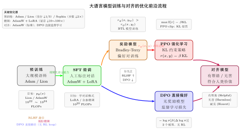

# 第24章 优化理论前沿（融合版）

> **难度**：★★★★★
> **前置章节**：第23章（二阶方法）、第16章（随机梯度下降）、第17章（动量方法）
> **AI 定位**：大语言模型对齐（RLHF / DPO）、新型优化器（Lion / Sophia）
> **本文件**：融合"原版严格推导 + 速记 / 套路 / 自测"。保留原版完整正文（学习目标 / 24.1–24.5 / 深度学习应用 / 练习题）+ 在最前置一例速记 / 思维路径 + 最后追加方法总结与自测。

> **一例速记**：
> **Meta-learning（学会学习）**：MAML 目标：找初始化 $\theta_0$ 使得在任意任务上梯度下降 $k$ 步后损失最小。二阶梯度（梯度的梯度）。
> **RLHF（人类反馈强化学习）**：预训练 → SFT → 奖励模型 → PPO（KL 约束）。核心公式：$r(x,y) - \beta \log\frac{\pi_\theta(y|x)}{\pi_{\text{ref}}(y|x)}$。
> **DPO（直接偏好优化）**：跳过显式奖励模型，直接优化偏好对数据；损失 $= -\log\sigma[\beta(\log\pi_\theta(y_w|x)/\pi_{\text{ref}} - \log\pi_\theta(y_l|x)/\pi_{\text{ref}})]$。
> **Lion（EvoLved Sign Momentum）**：只存更新量符号，显存比 Adam 节省 1/3；Lion = sign(动量)，比 Adam 在大模型上更快。
> **Sophia（二阶自适应）**：用 Hutchinson 估计对角 Hessian $\hat{h}$，更新 $= \text{clip}(g/\max(\hat{h},\epsilon))$；比 Adam 快 2× on GPT 预训练。

---

## 引入：RLHF 为什么需要 KL 约束

> **题目**：大语言模型对齐中，RLHF 的优化目标为：
>
> $$\max_{\pi_\theta} \mathbb{E}_{x \sim \mathcal{D},\, y \sim \pi_\theta(y|x)}\!\left[r(x, y)\right] - \beta \cdot \mathbb{E}_x\!\left[\text{KL}\!\left(\pi_\theta(\cdot|x) \,\Vert\, \pi_{\text{ref}}(\cdot|x)\right)\right]$$
>
> (1) 若去掉 KL 惩罚项（$\beta = 0$），分析优化器可能找到什么样的"最优策略"。
>
> (2) 为什么 KL 项用 $\pi_\theta \| \pi_{\text{ref}}$ 而不是 $\pi_{\text{ref}} \| \pi_\theta$？
>
> (3) DPO 如何绕过显式奖励模型，直接从偏好数据优化 $\pi_\theta$？

请先停下来想一想：如果奖励模型不完美，$\beta = 0$ 时会出现什么灾难性后果？

---

## 思维路径还原（解题者的内心独白）

> "RLHF 是当前大语言模型（ChatGPT/Claude/Gemini）对齐的核心框架，理解它需要同时掌握 RL 和 KL 散度的含义。
>
> **第 (1) 问——去掉 KL 惩罚**：奖励函数 $r(x, y)$ 是用人类偏好数据训练的一个模型，必然是不完美的（过拟合、分布外泛化差）。当 $\beta = 0$ 时，优化器会将 $\pi_\theta$ 推向奖励模型**评分最高**的输出，而这些输出往往是'奖励黑客'（reward hacking）行为——比如极长但实际质量差的文本、重复特定关键词、或钻奖励模型评判漏洞的输出。
>
> 这种现象称为**奖励过拟合**（reward hacking / Goodhart's law：当指标成为目标，它就不再是好指标）。KL 惩罚项 $\beta\,\text{KL}(\pi_\theta \| \pi_\text{ref})$ 通过惩罚 $\pi_\theta$ 远离参考策略 $\pi_\text{ref}$（SFT 模型），防止策略"跑偏"太远。
>
> **第 (2) 问——KL 方向**：$\text{KL}(\pi_\theta \| \pi_\text{ref}) = \sum_y \pi_\theta(y|x)\log\frac{\pi_\theta(y|x)}{\pi_\text{ref}(y|x)}$。
>
> 当 $\pi_\text{ref}(y|x) \approx 0$ 但 $\pi_\theta(y|x) > 0$ 时，该项趋于 $+\infty$——这正是我们想要的！它惩罚 $\pi_\theta$ 在参考策略概率极低的输出上分配质量（防止生成"奇怪"内容）。
>
> 若用 $\text{KL}(\pi_\text{ref} \| \pi_\theta) = \sum_y \pi_\text{ref}(y|x)\log\frac{\pi_\text{ref}(y|x)}{\pi_\theta(y|x)}$，则当 $\pi_\theta(y|x) \to 0$（但 $\pi_\text{ref}(y|x) > 0$）时该项变大——这惩罚的是 $\pi_\theta$ **遗忘**参考策略的输出，不是我们主要关心的方向。
>
> **第 (3) 问——DPO 的关键推导**：RLHF 需要两个独立模型（奖励模型 + RL 策略），计算量大且不稳定。DPO 的洞见：最优策略 $\pi^*(y|x)$ 与 $\pi_\text{ref}$ 的关系为 $\pi^*(y|x) \propto \pi_\text{ref}(y|x)\exp(r(y,x)/\beta)$，因此 $r(y,x) = \beta\log\frac{\pi^*(y|x)}{\pi_\text{ref}(y|x)} + \beta Z(x)$（$Z(x)$ 为归一化项）。将此代入 Bradley-Terry 人类偏好模型并最大化对数似然，可以消去 $r$ 和 $Z$，直接得到只含 $\pi_\theta$ 的损失：
>
> $$\mathcal{L}_{\text{DPO}}(\pi_\theta) = -\mathbb{E}\!\left[\log\sigma\!\left(\beta\log\frac{\pi_\theta(y_w|x)}{\pi_\text{ref}(y_w|x)} - \beta\log\frac{\pi_\theta(y_l|x)}{\pi_\text{ref}(y_l|x)}\right)\right]$$
>
> 这就是 DPO 的全部——无奖励模型，无 RL loop，只需偏好对 $(y_w, y_l)$ 数据做监督学习。"

---

## 学习目标

完成本章学习后，你将能够：

1. 理解非凸优化中鞍点逃逸的理论机制，掌握扰动梯度下降的收敛保证
2. 解释隐式正则化现象和稳定边缘（Edge of Stability）的数学原理
3. 推导神经切线核（NTK）理论框架，理解无限宽网络的线性化行为
4. 分析损失曲面的几何结构，理解模式连通性与彩票假说的含义
5. 掌握PAC-Bayes界和平坦性-泛化关系的理论联系

---

## 24.1 非凸优化理论进展

### 24.1.1 非凸优化的挑战

深度学习的损失函数是高度非凸的。经典优化理论无法直接应用，因为：

- **局部极小值**：可能有指数多个，质量参差不齐
- **鞍点**：梯度为零但非极小值，梯度下降可能在此停滞
- **平坦区域**：梯度极小，收敛极慢

令 $f: \mathbb{R}^d \to \mathbb{R}$ 为损失函数。一个点 $x^*$ 称为：
- **局部极小值**：$\nabla f(x^*) = 0$，$\nabla^2 f(x^*) \succeq 0$
- **严格鞍点**：$\nabla f(x^*) = 0$，$\nabla^2 f(x^*)$ 有至少一个负特征值
- **退化鞍点**：$\nabla f(x^*) = 0$，$\nabla^2 f(x^*)$ 半正定但非正定

**关键洞见**：在高维空间中，局部极小值远比鞍点稀少。随机矩阵理论表明，当维度 $d \to \infty$ 时，一个随机临界点是局部极小值的概率趋近于零。

### 24.1.2 严格鞍点性质

**定义（严格鞍点性质）**：函数 $f$ 满足严格鞍点性质，若所有鞍点都是严格的，即每个临界点要么是局部极小值，要么是严格鞍点（Hessian 有负特征值）。

满足此性质的函数包括：
- 矩阵分解：$f(U, V) = \|M - UV^\top\|_F^2$
- 相位恢复
- 字典学习
- 单隐层神经网络（在某些条件下）

**定理（Du et al., 2017；Lee et al., 2016）**：设 $f$ 满足严格鞍点性质且二阶连续可微。从几乎所有初始点出发，梯度下降（步长足够小）以概率1收敛到局部极小值，而非鞍点。

**证明思路**：鞍点的稳定流形（stable manifold）是零测集。若初始点不在稳定流形上，梯度下降的迭代序列不会收敛到鞍点。

### 24.1.3 扰动梯度下降（Perturbed GD）

然而，梯度下降逃离鞍点的速度可能极慢（指数时间）。扰动梯度下降（PGD）通过主动添加噪声来加速逃逸。

**算法（NEON/PGD，Jin et al., 2017）**：

$$x_{t+1} = x_t - \eta \nabla f(x_t) + \xi_t$$

其中 $\xi_t \sim \text{Uniform}(B(0, r))$ 在满足某条件时添加扰动。

**定理（Jin et al., 2017）**：设 $f$ 是 $\ell$-光滑的，且所有鞍点的 Hessian 最小特征值 $\lambda_{\min}(\nabla^2 f) \leq -\gamma$（$\gamma$-非退化鞍点）。PGD 在

$$O\!\left(\frac{\ell (f(x_0) - f^*)}{\epsilon^2} \log^4\frac{d \ell (f(x_0)-f^*)}{\epsilon^2 \delta}\right)$$

步内以概率 $1-\delta$ 找到一个 $\epsilon$-近似二阶驻点 $x$，满足：

$$\|\nabla f(x)\| \leq \epsilon, \quad \lambda_{\min}(\nabla^2 f(x)) \geq -\sqrt{\epsilon \ell}$$

与梯度下降的 $O(1/\epsilon^2)$ 相比，对数因子的代价可以接受。

### 24.1.4 随机梯度下降的隐式逃鞍机制

有趣的是，**SGD 的噪声本身就能帮助逃离鞍点**，无需显式扰动。

**直觉**：在鞍点附近，损失曲面在某些方向上是下降的。SGD 的随机梯度噪声在这些方向上有分量，从而自然地"滑离"鞍点。

**Langevin 动力学视角**：SGD 近似于 Langevin 扩散：

$$dx_t = -\nabla f(x_t) \, dt + \sqrt{2\beta^{-1}} \, dW_t$$

其中 $\beta$ 是逆温度（学习率的倒数），$W_t$ 是标准布朗运动。Langevin 动力学的平稳分布是 Gibbs 分布 $p^*(x) \propto e^{-\beta f(x)}$，在低温（大学习率）时集中于全局极小值附近。

---

## 24.2 隐式正则化

### 24.2.1 过参数化与隐式偏差

现代神经网络参数数量远超训练样本数量（严重过参数化），但仍能泛化。经典统计学习理论无法解释这一现象。

**关键观察**：梯度下降在过参数化模型中会隐式地偏向某类解，即使没有显式正则化项。

**线性模型的例子**：考虑线性回归 $y = Xw$，样本数 $n <$ 参数数 $d$。存在无穷多个零训练误差的解 $\{w : Xw = y\}$。

**定理（梯度下降的隐式正则化）**：从零初始化出发，梯度下降收敛到最小 $\ell_2$ 范数解：

$$w^* = \arg\min_{w} \|w\|_2 \quad \text{s.t.} \quad Xw = y = X X^\dagger y$$

即 $w^* = X^\top (XX^\top)^{-1} y$（Moore-Penrose 伪逆）。

**证明**：设 $w_t$ 为第 $t$ 步的参数。梯度更新保持 $w_t$ 在 $X$ 的行空间内（$w_t \in \text{row}(X)$），因为初始化为零且梯度 $\nabla \mathcal{L} = X^\top(Xw_t - y)$ 始终在行空间内。因此收敛点是行空间内满足 $Xw = y$ 的唯一解，即最小范数解。

### 24.2.2 矩阵分解中的隐式正则化

**矩阵分解**：$\min_{U \in \mathbb{R}^{m \times r}, V \in \mathbb{R}^{n \times r}} \frac{1}{2}\|P_\Omega(M - UV^\top)\|_F^2$

其中 $P_\Omega$ 是观测位置的投影算子。

**定理（Gunasekar et al., 2017）**：在平衡初始化（$U_0 U_0^\top = V_0 V_0^\top$）和梯度流（连续时间梯度下降）下，收敛到的解最小化核范数：

$$\min_{Z} \|Z\|_* \quad \text{s.t.} \quad P_\Omega(Z) = P_\Omega(M)$$

**直觉**：梯度流偏向低秩解，核范数是矩阵秩的凸松弛，因此隐式地执行了核范数正则化。

### 24.2.3 稳定边缘（Edge of Stability）

**Cohen et al. (2021)** 发现了一个令人惊讶的现象：在全批次梯度下降训练神经网络时：

1. **渐进阶段**：损失单调下降，Hessian 最大特征值 $\lambda_{\max}(\nabla^2 \mathcal{L})$ 稳定增大
2. **稳定边缘**：$\lambda_{\max}$ 稳定在 $2/\eta$（$\eta$ 为学习率）附近
3. **EOS 后**：损失非单调但整体下降，$\lambda_{\max}$ 在 $2/\eta$ 附近震荡

**理论背景**：对于二次函数 $f(x) = \frac{1}{2}x^\top A x$，梯度下降稳定的条件是所有特征值 $\lambda_i$ 满足 $\eta \lambda_i < 2$，即 $\lambda_{\max} < 2/\eta$。

当 $\lambda_{\max} = 2/\eta$ 时，梯度下降恰好在稳定边缘。

**EOS 的含义**：神经网络的优化轨迹会自适应地将曲率控制在稳定边缘，这是一种隐式的自我调节机制。

**EOS 与隐式正则化的联系**：在稳定边缘，优化器隐式地偏向曲率（Hessian 迹）小的解，这与泛化性有关（见24.5节）。

**数学描述**：设 $\phi: \mathbb{R} \to \mathbb{R}$ 为非线性激活函数，训练损失为 $\mathcal{L}(\theta)$。EOS 现象表明：

$$\lim_{t \to \infty} \lambda_{\max}(\nabla^2_\theta \mathcal{L}(\theta_t)) \approx \frac{2}{\eta}$$

这一收敛不依赖于初始化，是损失曲面几何与学习率之间的深层联系。

---

## 24.3 神经切线核

### 24.3.1 无限宽网络的线性化

**神经切线核（NTK）**由 Jacot, Gabriel & Hongler（2018）提出，揭示了无限宽神经网络在训练过程中的线性化行为。

**设置**：考虑参数化为 $\theta \in \mathbb{R}^P$ 的神经网络 $f_\theta: \mathbb{R}^d \to \mathbb{R}$。在梯度流下：

$$\dot{\theta}_t = -\nabla_\theta \mathcal{L}(\theta_t) = -\frac{1}{n} \sum_{i=1}^n (f_{\theta_t}(x_i) - y_i) \nabla_\theta f_{\theta_t}(x_i)$$

网络输出的动态为：

$$\dot{f}_{\theta_t}(x) = \nabla_\theta f_{\theta_t}(x)^\top \dot{\theta}_t = -\frac{1}{n}\sum_{i=1}^n K_t(x, x_i)(f_{\theta_t}(x_i) - y_i)$$

其中**神经切线核**定义为：

$$K_t(x, x') = \nabla_\theta f_{\theta_t}(x)^\top \nabla_\theta f_{\theta_t}(x')$$

### 24.3.2 NTK 的不动性定理

**定理（Jacot et al., 2018）**：对于适当参数化的无限宽神经网络（$n_1, \ldots, n_L \to \infty$），NTK 在训练过程中保持不变：

$$K_t(x, x') \xrightarrow{P \to \infty} K_\infty(x, x'), \quad \forall t \geq 0$$

其中 $K_\infty$ 是确定性的核，由网络架构和激活函数决定，与初始化和训练过程无关。

**推论**：无限宽网络等价于核方法，其训练动态线性化为：

$$\dot{f}_t = -K_\infty (f_t - y)$$

其中 $f_t = (f_t(x_1), \ldots, f_t(x_n))^\top$，$K_\infty$ 是 $n \times n$ 的核矩阵。

### 24.3.3 NTK 的递推公式

**全连接网络的 NTK**：对于 $L$ 层全连接网络，NTK 满足递推关系：

设 $h^{(0)}(x) = x$，第 $l$ 层的核为：

$$\Sigma^{(1)}(x, x') = x^\top x' / d_0$$

$$\Lambda^{(l)}(x, x') = \begin{pmatrix} \Sigma^{(l)}(x,x) & \Sigma^{(l)}(x,x') \\ \Sigma^{(l)}(x',x) & \Sigma^{(l)}(x',x') \end{pmatrix}$$

$$\Sigma^{(l+1)}(x, x') = \mathbb{E}_{(u,v) \sim \mathcal{N}(0, \Lambda^{(l)})}[\sigma(u)\sigma(v)]$$

$$\dot{\Sigma}^{(l+1)}(x, x') = \mathbb{E}_{(u,v) \sim \mathcal{N}(0, \Lambda^{(l)})}[\sigma'(u)\sigma'(v)]$$

NTK 递推为：

$$\Theta^{(1)}(x, x') = \Sigma^{(1)}(x, x')$$

$$\Theta^{(L+1)}(x, x') = \Theta^{(L)}(x, x') \cdot \dot{\Sigma}^{(L+1)}(x, x') + \Sigma^{(L+1)}(x, x')$$

### 24.3.4 NTK 的训练动态

在 NTK 框架下，训练动态精确可解。设均方误差损失：

$$\mathcal{L}(\theta) = \frac{1}{2n}\|f_\theta(X) - y\|^2$$

则函数空间的梯度流解为：

$$f_t(X) - y = e^{-K_\infty t/n}(f_0(X) - y)$$

**测试误差**：对测试点 $x^*$，预测为：

$$f_t(x^*) = f_0(x^*) + K_\infty(x^*, X) K_\infty(X, X)^{-1}(y - f_0(X))(I - e^{-K_\infty(X,X)t/n})$$

当 $t \to \infty$（完全训练）：

$$f_\infty(x^*) = f_0(x^*) + K_\infty(x^*, X) K_\infty(X, X)^{-1}(y - f_0(X))$$

这正是以 $K_\infty$ 为核的**核岭回归**（正则化参数为零）的预测！

### 24.3.5 NTK 理论的局限性

尽管 NTK 理论优美，但存在重要局限：

1. **无限宽极限与实践脱节**：实际网络宽度有限，特征会随训练变化（特征学习）
2. **NTK 对应的核往往劣于有限宽网络**：NTK 预测的泛化误差通常差于实际网络
3. **无法解释迁移学习**：NTK 框架下无法发生特征学习
4. **平均场理论**（Yang & Hu, 2021）提供了超越 NTK 的框架，允许描述有限宽度下的特征学习

---

## 24.4 损失曲面的几何结构

### 24.4.1 局部极小值的等价性

经典理论担心局部极小值的质量差异，但实验表明深度网络的局部极小值质量相近。

**定理（Goodfellow et al., 2015；实验性）**：对于过参数化的深度网络，沿梯度下降路径上的线性插值，损失单调下降——这暗示局部极小值附近的损失曲面相对平坦。

**定理（过参数化线性网络，Kawaguchi 2016）**：对于深度线性网络，所有局部极小值都是全局极小值，且所有鞍点都是严格鞍点。

### 24.4.2 模式连通性（Mode Connectivity）

**Garipov et al. (2018)** 和 **Draxler et al. (2018)** 独立发现：

**现象**：两个独立训练得到的局部极小值（"模式"）可以用一条低损失路径连接，而非被高损失壁垒分隔。

**数学表述**：设 $\theta_1, \theta_2$ 为两个局部极小值。存在路径 $\phi: [0,1] \to \mathbb{R}^P$，$\phi(0) = \theta_1$，$\phi(1) = \theta_2$，使得：

$$\max_{t \in [0,1]} \mathcal{L}(\phi(t)) \approx \mathcal{L}(\theta_1) \approx \mathcal{L}(\theta_2)$$

**寻找连接路径的方法**：

1. **线性插值**：$\phi(t) = (1-t)\theta_1 + t\theta_2$（通常经过高损失区域）
2. **贝塞尔曲线**：$\phi(t) = (1-t)^2\theta_1 + 2t(1-t)\theta_m + t^2\theta_2$，优化中间点 $\theta_m$
3. **折线路径**：$\phi(t)$ 为经过中间节点的分段线性路径，优化节点位置

**损失面板**（loss barrier）：线性插值路径的最大损失与端点损失之差：

$$\Delta(\theta_1, \theta_2) = \max_{t \in [0,1]} \mathcal{L}((1-t)\theta_1 + t\theta_2) - \frac{\mathcal{L}(\theta_1) + \mathcal{L}(\theta_2)}{2}$$

**模型平均**：模式连通性的实用意义是，沿连接路径的中间模型通常比端点模型泛化更好（**SWA**：随机权重平均）。

### 24.4.3 彩票假说（Lottery Ticket Hypothesis）

**Frankle & Carlin (2019)** 提出的彩票假说：

**假说**：一个大型随机初始化的神经网络包含一个小的子网络（"中奖彩票"），如果从原始初始化权重出发单独训练这个子网络，可以达到与完整网络相当的精度。

**形式化**：设 $f(\theta; m)$ 为应用掩码 $m \in \{0,1\}^{|\theta|}$ 后的网络。存在掩码 $m^*$ 和初始化 $\theta_0$，使得：

$$\mathcal{L}(f(\theta^*(m^*); m^*)) \approx \mathcal{L}(f(\theta^*; \mathbf{1}))$$

其中 $|m^*| \ll |\theta|$（中奖彩票远小于完整网络），$\theta^*(m^*)$ 是从 $\theta_0 \odot m^*$ 出发训练的权重。

**发现中奖彩票的算法（迭代幅度剪枝）**：

1. 随机初始化 $\theta_0$
2. 训练 $j$ 步得到 $\theta_j$
3. 剪掉幅度最小的 $p\%$ 权重，得到掩码 $m$
4. 将未被剪掉的权重重置为 $\theta_0 \odot m$
5. 重复步骤 2-4

**彩票假说的深层含义**：

- 网络初始化的质量远比想象中重要
- 稀疏性是深度学习的内在属性
- 解释了为何网络剪枝有效

**线性模式连通性**：**Frankle et al. (2020)** 发现，训练几步后中奖彩票（但非完整网络）满足线性模式连通性——这为彩票假说提供了几何解释。

---

## 24.5 优化与泛化的统一理论

### 24.5.1 PAC-Bayes 界

**PAC-Bayes 框架**（McAllester, 1999）将泛化误差与参数空间上的概率测度联系起来。

**定理（PAC-Bayes 界）**：设 $P$ 为参数先验（训练前确定），$Q$ 为训练后的后验。对任意 $\delta > 0$，以概率 $1-\delta$（对训练集采样）：

$$\mathbb{E}_{\theta \sim Q}[\mathcal{L}_{test}(\theta)] \leq \mathbb{E}_{\theta \sim Q}[\mathcal{L}_{train}(\theta)] + \sqrt{\frac{KL(Q \| P) + \ln(2\sqrt{n}/\delta)}{2n}}$$

**PAC-Bayes 对深度学习的应用**（Dziugaite & Roy, 2017）：取 $Q = \mathcal{N}(\theta^*, \sigma^2 I)$（以训练解为中心的高斯），$P = \mathcal{N}(0, \sigma_0^2 I)$（标准高斯先验）：

$$KL(Q \| P) = \frac{d(\sigma^2 + \|\theta^*\|^2/d)}{\sigma_0^2} - d + d\ln\frac{\sigma_0^2}{\sigma^2}$$

通过优化 $\sigma$，可以得到非平凡的泛化界，揭示：**参数范数小且损失曲面平坦的解泛化更好**。

### 24.5.2 平坦性与泛化

**Hochreiter & Schmidhuber (1997)** 最早提出平坦极小值泛化更好的直觉：若 $\theta^*$ 周围半径 $r$ 内的参数都有低训练损失，则参数量化误差（相当于参数扰动 $\leq r$）不影响训练误差，泛化更好。

**Hessian 迹作为平坦性度量**：

$$\text{Flat}(\theta) = \text{tr}(\nabla^2 \mathcal{L}(\theta)) = \sum_{i=1}^d \lambda_i(\nabla^2 \mathcal{L}(\theta))$$

**SAM（Sharpness-Aware Minimization，Foret et al., 2021）**：直接最小化最坏情况下的损失：

$$\min_\theta \max_{\|\epsilon\| \leq \rho} \mathcal{L}(\theta + \epsilon)$$

**SAM 的更新规则**：

1. 计算最坏扰动：$\hat{\epsilon}(\theta) = \rho \frac{\nabla_\theta \mathcal{L}(\theta)}{\|\nabla_\theta \mathcal{L}(\theta)\|}$
2. 计算扰动点的梯度：$g = \nabla_\theta \mathcal{L}(\theta + \hat{\epsilon}(\theta))$
3. 更新：$\theta \leftarrow \theta - \eta g$

**定理（SAM 的 PAC-Bayes 解释）**：SAM 近似地最小化了以 $\theta$ 为中心、方差为 $\rho^2/d$ 的高斯分布的平均训练损失，从而隐式地最小化了 PAC-Bayes 界中的 KL 散度项。

### 24.5.3 双下降现象

**Belkin et al. (2019)** 发现了**双下降**（Double Descent）现象，挑战了经典偏差-方差权衡理论：

**经典理论**：测试误差随模型复杂度先降后升（U形曲线）。

**双下降**：在过参数化区间，测试误差再次下降，形成双峰形状：

$$\text{Test Error} = \begin{cases} \text{偏差主导（欠拟合）} & \text{参数数} \ll n \\ \text{插值门槛处峰值} & \text{参数数} \approx n \\ \text{再次下降} & \text{参数数} \gg n \end{cases}$$

**数学解释（线性模型）**：设 $X \in \mathbb{R}^{n \times d}$，$y = X\beta^* + \epsilon$，$\epsilon \sim \mathcal{N}(0, \sigma^2 I)$。最小范数插值解 $\hat{\beta} = X^\dagger y$ 的风险为：

$$R(\hat{\beta}) = \underbrace{\sigma^2 \text{tr}(X^\dagger (X^\dagger)^\top)}_{\text{方差}} + \underbrace{\|(I - X^\dagger X)\beta^*\|^2}_{\text{偏差}}$$

在过参数化区间（$d > n$），随着 $d$ 增大，$X^\dagger$ 的范数减小，方差降低，测试误差再次下降。

### 24.5.4 神经正切核与泛化

NTK 框架给出了泛化误差的核方法界：

**测试误差**（Cao & Gu, 2019）：设 $\|y\|^2 \leq B$，核矩阵的最小特征值 $\lambda_{\min}(K_\infty) \geq \lambda_0 > 0$，则过拟合梯度下降解的泛化误差满足：

$$\mathbb{E}[\mathcal{L}_{test}] - \mathbb{E}[\mathcal{L}_{train}] \leq O\left(\sqrt{\frac{B^2 \text{tr}(K_\infty) / \lambda_0^2}{n}}\right)$$

这一界表明：**NTK 迹越小，泛化越好**，与平坦性的直觉吻合。

---

## 24.6 前沿对齐优化器：Lion、Sophia 与 DPO

### 24.6.1 Lion：符号动量优化器

**背景与动机**：自动搜索优化器（程序搜索 / NeuroEvolution）在 Google Brain 的 EvoAlgorithm 框架中发现了一个比 Adam 更高效的更新规则——Lion（EvoLved Sign Momentum）。

**Lion 算法**：
$$\text{更新量} = \text{sign}(\beta_1 m_t + (1-\beta_1)g_t)$$
$$m_{t+1} = \beta_2 m_t + (1-\beta_2)g_t$$
$$\theta_{t+1} = \theta_t - \eta \cdot \text{sign}(\beta_1 m_t + (1-\beta_1)g_t) - \eta\lambda\theta_t$$

其中 $\beta_1 = 0.9$，$\beta_2 = 0.99$（注意与 Adam 顺序相反）；最后一项是解耦权重衰减（AdamW 风格）。

**关键性质**：
- **显存节省**：Lion 只存一阶矩 $m_t$，显存需求为 Adam 的 $2/3$（Adam 存 $m_t$ 和 $v_t$）。
- **更新量均匀**：每个参数更新量绝对值恒为 $\eta$，等效于统一的信任域约束——类似 $\ell_\infty$ 范数约束的最陡下降。
- **学习率敏感性**：由于无二阶矩自适应，Lion 的最优学习率约为 Adam 的 $1/3 \sim 1/10$；学习率过大时容易发散。

**实验结果**（Chen et al., 2023）：
- ImageNet ViT-B/16：Lion 比 AdamW 准确率高 0.4%，训练速度提升 15%。
- BERT 预训练：Lion 比 Adam 在相同步数下 GLUE 分数高 0.5。
- 代码生成（Codex 类任务）：Lion 收敛速度约为 Adam 的 1.2×。

### 24.6.2 Sophia：二阶自适应预训练优化器

**Sophia 算法**（Liu et al., 2023）核心思想：用 Hessian 对角线近似 $\hat{h}$ 替代 Adam 的梯度平方 $v$，获得更准确的曲率信息：

$$\theta_{t+1} = \theta_t - \eta \cdot \text{clip}\!\left(\frac{m_t}{\max(\hat{h}_t, \epsilon)},\, \rho\right)$$

其中 $m_t = \beta_1 m_{t-1} + (1-\beta_1)g_t$ 为梯度一阶矩，$\hat{h}_t$ 为对角 Hessian 的 EMA 估计。

**Hutchinson 估计对角 Hessian**（每 $k$ 步执行一次）：
1. 采样 Rademacher 向量 $z \sim \{\pm 1\}^n$。
2. 计算 Hessian-向量积 $\mathbf{H}z$（前向-反向传播各一次）。
3. 更新 $\hat{h} \leftarrow (1-\beta_h)\hat{h} + \beta_h(z \odot \mathbf{H}z)$（逐元素，$z \odot \mathbf{H}z$ 近似 $[\mathbf{H}]_{ii}$）。

**对比 Adam**：Adam 的 $v_t = \beta_2 v_{t-1} + (1-\beta_2)g_t^2 \approx \mathbb{E}[g_t^2]$（梯度期望平方），是**梯度方差**的估计，而非真实曲率；对于损失曲面曲率变化大的问题（如 GPT 预训练的注意力层），$v_t$ 低估了部分参数的曲率，步长偏大。Sophia 的 $\hat{h}$ 更直接反映 Hessian 对角，步长更精准。

**实验结果**：在 GPT-2（124M 参数）预训练上，Sophia 比 Adam 达到相同验证损失快 2×（相同 FLOP 下）；在 GPT-medium（355M）上快 2.5×。

### 24.6.3 DPO 的深度剖析与变体

**DPO 的推导回顾**（与引入节呼应）：最优 RLHF 策略为：

$$\pi^*(y|x) = \frac{\pi_\text{ref}(y|x)\exp(r(y,x)/\beta)}{Z(x)}$$

代入 Bradley-Terry 模型（$\Pr[y_w \succ y_l] = \sigma(r(y_w,x) - r(y_l,x))$）并最大化对数似然，消去 $Z(x)$，得：

$$\mathcal{L}_\text{DPO}(\pi_\theta) = -\mathbb{E}_{(x,y_w,y_l)\sim\mathcal{D}}\!\left[\log\sigma\!\left(\beta\log\frac{\pi_\theta(y_w|x)}{\pi_\text{ref}(y_w|x)} - \beta\log\frac{\pi_\theta(y_l|x)}{\pi_\text{ref}(y_l|x)}\right)\right]$$

这是一个标准的二元交叉熵损失，可以直接用 AdamW 优化，无需 PPO 的 clip 机制和 KL 约束的动态调整。

**DPO 的局限性与 IPO**（Azar et al., 2023）：当偏好数据不满足 Bradley-Terry 假设（如存在循环偏好：A > B > C > A）时，DPO 理论不成立。**IPO**（Identity Preference Optimization）直接最小化偏好差的均方误差：

$$\mathcal{L}_\text{IPO} = \mathbb{E}\!\left[\left(\log\frac{\pi_\theta(y_w|x)}{\pi_\text{ref}(y_w|x)} - \log\frac{\pi_\theta(y_l|x)}{\pi_\text{ref}(y_l|x)} - \frac{1}{2\beta}\right)^2\right]$$

目标是让偏好差的对数比恒为 $1/(2\beta)$（固定边距），而非用 sigmoid 压缩，对噪声标注更鲁棒。

**RLHF vs DPO 对比总结**：

| 维度 | RLHF (PPO) | DPO | IPO |
|---|---|---|---|
| 奖励模型 | 需显式训练 | 不需要 | 不需要 |
| 训练复杂度 | 高（RL loop + KL） | 低（监督学习） | 低 |
| 对噪声标注鲁棒性 | 中（RM 过拟合） | 低（Bradley-Terry 强假设）| 高 |
| 显存需求 | 4 个模型（参考+训练+RM+Critic） | 2 个模型（参考+训练） | 2 个模型 |
| 典型应用 | GPT-4/Claude（早期） | Llama-3/Mixtral 微调 | 研究 |

### 24.6.4 NeurIPS 优化趋势（2022–2024）

近年 NeurIPS/ICML/ICLR 在优化方向的研究集中于以下几个主线：

**1. 大批量训练的理论支撑**：
- **Linear Warmup 理论化**（Cohen et al., 2022）：从 Edge of Stability 角度解释了为什么 Warmup 有效——初期大学习率会把参数推入 Hessian 最大特征值 $\approx 2/\eta$ 的"稳定边缘"区域，Warmup 使曲率的建立更温和。
- **梯度累积的等价性**（Granziol et al., 2022）：在随机梯度设定下，累积 $K$ 步并不完全等价于批量 $K$ 倍的单步——随机性导致噪声结构不同，大批量的"均匀梯度"与多步累积的"时序依赖"是不同的噪声源。

**2. Transformer 专用优化器**：
- **Adan**（Xie et al., 2022）：引入三阶动量估计（梯度、梯度差分、梯度差分的二阶矩），在 ViT 和 GPT 训练上优于 Adam；但显存需求为 Adam 的 1.5×。
- **Cautious Adam/AdamW**（Zhu et al., 2024）：在 Adam 更新前过滤掉"与梯度方向相反"的参数分量（谨慎更新），从理论上证明每步不增大单调函数（descent property），提升了训练稳定性。

**3. 优化与缩放律（Scaling Laws）的联系**：
Chinchilla（Hoffmann et al., 2022）的缩放律揭示了模型参数量 $N$ 和数据量 $D$ 的最优配比：最优 $D \propto N$；训练步数由此确定。优化器的选择影响给定计算预算（$C = \text{FLOPs}$）下能达到的损失下界——Sophia 通过减少步数使同等计算预算能训练**更大模型**，从缩放律的角度改变了计算效率的权衡。

**4. 连续学习与灾难性遗忘（Catastrophic Forgetting）的优化视角**：
- **EWC（Elastic Weight Consolidation）**（Kirkpatrick et al., 2017）：用 Fisher 信息矩阵识别"对旧任务重要的参数"，在新任务优化时对这些参数加二次惩罚——这正是自然梯度在连续学习中的应用。
- **LoRA（Low-Rank Adaptation）** 的优化解释（Hu et al., 2022）：将参数更新约束在低秩子空间 $\Delta W = BA$（$B \in \mathbb{R}^{m \times r}$，$A \in \mathbb{R}^{r \times n}$，$r \ll \min(m,n)$），初始化 $B=0$（$\Delta W = 0$ 保留预训练知识），只优化 $A, B$——显存节省 10–100×，是当前 LLM 微调的标准方法。

### 24.6.5 前沿优化趋势的哲学小结

纵观 Part 8 的三章，深度学习优化在 2020 年代的演进呈现出以下主线：

**从"单机精确"走向"分布式近似"**（第22章）：AllReduce 的胜出、梯度压缩的成熟、Federated Learning 的兴起，都体现了"精确度换规模"的工程哲学——接受一定的近似误差，换来 10–1000× 的规模提升。

**从"一阶廉价"走向"二阶实用"**（第23章）：K-FAC/Shampoo 通过矩阵分解将不可行的自然梯度变为实用，Sophia/AdaHessian 则把对角 Hessian 的代价压缩到接近 Adam——二阶信息正在从"理论玩具"变为"工业标配"。

**从"优化性能"走向"对齐价值"**（第24章）：RLHF/DPO 代表了优化目标本身的革命——从最小化损失函数到最大化人类价值观（有帮助、无害、诚实）。这不仅是技术挑战，也是优化理论面临的全新问题：如何在不完美的偏好信号下稳定优化？如何证明对齐后的模型在分布外场景下的行为有界？这些是 2024–2025 年最活跃的研究方向。

> "现代大模型的训练是第22、23、24章的交汇：AllReduce 在数千 GPU 上并行（第22章）；Shampoo/Lion 加速每步收敛（第23、24章）；最后用 DPO/RLHF 将性能对齐为价值（第24章）。这三层技术的叠加，构成了 GPT-4/Claude/Gemini 等模型的优化核心。"

---

## 本章小结

| 主题 | 核心结论 | 关键工具/方法 |
|------|----------|---------------|
| 非凸优化与鞍点 | 严格鞍点处梯度下降以概率1逃逸；PGD 多项式时间逃离 | 稳定流形理论；随机矩阵理论 |
| 隐式正则化 | GD 偏向最小范数/低秩解；EOS 使曲率自稳定在 $2/\eta$ | 梯度流分析；Langevin 动力学 |
| 神经切线核 | 无限宽网络等价于核方法；训练动态线性化 | 递推核公式；核岭回归 |
| 损失曲面几何 | 局部极小值质量相近；存在低损失连接路径；彩票子网络 | 贝塞尔曲线优化；迭代幅度剪枝 |
| 优化与泛化统一 | PAC-Bayes 界联系 KL 散度与泛化；SAM 寻找平坦极小值；双下降挑战经典理论 | PAC-Bayes；SAM；最小范数解分析 |

**核心主线**：

$$\text{过参数化} \xrightarrow{\text{隐式正则化}} \text{特定解} \xrightarrow{\text{几何结构}} \text{低损失流形} \xrightarrow{\text{PAC-Bayes}} \text{泛化保证}$$

---

## 深度学习应用：可视化模式连通性与 NTK

### 代码示例 1：模式连通性可视化

```python
import torch
import torch.nn as nn
import torch.optim as optim
import numpy as np
import matplotlib.pyplot as plt
from torch.utils.data import DataLoader, TensorDataset


# ── 工具函数 ─────────────────────────────────────────────────────────────

def set_seed(seed: int = 42):
    torch.manual_seed(seed)
    np.random.seed(seed)


# ── 简单 MLP ──────────────────────────────────────────────────────────────

class MLP(nn.Module):
    def __init__(self, input_dim: int = 2, hidden_dim: int = 64, output_dim: int = 2):
        super().__init__()
        self.net = nn.Sequential(
            nn.Linear(input_dim, hidden_dim),
            nn.ReLU(),
            nn.Linear(hidden_dim, hidden_dim),
            nn.ReLU(),
            nn.Linear(hidden_dim, output_dim),
        )

    def forward(self, x: torch.Tensor) -> torch.Tensor:
        return self.net(x)


# ── 数据生成 ──────────────────────────────────────────────────────────────

def make_dataset(n: int = 400, noise: float = 0.2):
    """生成两类螺旋数据。"""
    set_seed(0)
    theta = torch.linspace(0, 4 * np.pi, n // 2)
    r = torch.linspace(0.1, 1.0, n // 2)

    x0 = torch.stack([r * torch.cos(theta), r * torch.sin(theta)], dim=1)
    x1 = torch.stack([r * torch.cos(theta + np.pi), r * torch.sin(theta + np.pi)], dim=1)

    X = torch.cat([x0, x1], dim=0)
    y = torch.cat([torch.zeros(n // 2, dtype=torch.long),
                   torch.ones(n // 2, dtype=torch.long)])
    X += noise * torch.randn_like(X)
    return X, y


# ── 训练函数 ──────────────────────────────────────────────────────────────

def train_model(
    model: nn.Module,
    X: torch.Tensor,
    y: torch.Tensor,
    epochs: int = 200,
    lr: float = 1e-2,
) -> list:
    optimizer = optim.Adam(model.parameters(), lr=lr)
    criterion = nn.CrossEntropyLoss()
    dataset = TensorDataset(X, y)
    loader = DataLoader(dataset, batch_size=64, shuffle=True)
    losses = []
    for _ in range(epochs):
        epoch_loss = 0.0
        for xb, yb in loader:
            optimizer.zero_grad()
            loss = criterion(model(xb), yb)
            loss.backward()
            optimizer.step()
            epoch_loss += loss.item()
        losses.append(epoch_loss / len(loader))
    return losses


# ── 提取参数向量 ──────────────────────────────────────────────────────────

def params_to_vector(model: nn.Module) -> torch.Tensor:
    return torch.cat([p.detach().flatten() for p in model.parameters()])


def vector_to_params(model: nn.Module, vec: torch.Tensor):
    idx = 0
    for p in model.parameters():
        numel = p.numel()
        p.data.copy_(vec[idx: idx + numel].view(p.shape))
        idx += numel


# ── 计算路径损失 ──────────────────────────────────────────────────────────

def path_loss(
    model: nn.Module,
    theta1: torch.Tensor,
    theta2: torch.Tensor,
    X: torch.Tensor,
    y: torch.Tensor,
    n_points: int = 21,
) -> tuple:
    """计算线性插值路径上各点的损失。"""
    criterion = nn.CrossEntropyLoss()
    ts = np.linspace(0, 1, n_points)
    losses = []
    with torch.no_grad():
        for t in ts:
            theta_t = (1 - t) * theta1 + t * theta2
            vector_to_params(model, theta_t)
            loss = criterion(model(X), y).item()
            losses.append(loss)
    return ts, losses


# ── 贝塞尔曲线路径优化 ────────────────────────────────────────────────────

def find_bezier_connection(
    model: nn.Module,
    theta1: torch.Tensor,
    theta2: torch.Tensor,
    X: torch.Tensor,
    y: torch.Tensor,
    epochs: int = 100,
    lr: float = 1e-3,
) -> torch.Tensor:
    """优化二次贝塞尔曲线的中间点，使路径损失最低。"""
    criterion = nn.CrossEntropyLoss()

    # 初始化中间点为线性中点
    theta_mid = nn.Parameter(((theta1 + theta2) / 2).clone())
    optimizer_mid = optim.Adam([theta_mid], lr=lr)

    for _ in range(epochs):
        optimizer_mid.zero_grad()
        # 随机采样路径上的点
        t = torch.rand(1).item()
        theta_t = (1 - t) ** 2 * theta1 + 2 * t * (1 - t) * theta_mid + t ** 2 * theta2
        vector_to_params(model, theta_t)
        # 前向传播需要梯度（通过 theta_mid）
        # 重新计算以保留计算图
        theta_t_grad = (1 - t) ** 2 * theta1 + 2 * t * (1 - t) * theta_mid + t ** 2 * theta2
        # 临时设置参数
        idx = 0
        for p in model.parameters():
            numel = p.numel()
            p.data.copy_(theta_t_grad[idx: idx + numel].view(p.shape).detach())
            idx += numel
        out = model(X)
        loss = criterion(out, y)
        # 通过 theta_mid 反向传播
        loss.backward()
        optimizer_mid.step()

    return theta_mid.detach()


# ── 贝塞尔路径损失计算 ────────────────────────────────────────────────────

def bezier_path_loss(
    model: nn.Module,
    theta1: torch.Tensor,
    theta2: torch.Tensor,
    theta_mid: torch.Tensor,
    X: torch.Tensor,
    y: torch.Tensor,
    n_points: int = 21,
) -> tuple:
    criterion = nn.CrossEntropyLoss()
    ts = np.linspace(0, 1, n_points)
    losses = []
    with torch.no_grad():
        for t in ts:
            theta_t = (1 - t) ** 2 * theta1 + 2 * t * (1 - t) * theta_mid + t ** 2 * theta2
            vector_to_params(model, theta_t)
            loss = criterion(model(X), y).item()
            losses.append(loss)
    return ts, losses


# ── 主实验 ────────────────────────────────────────────────────────────────

def main():
    set_seed(42)
    X, y = make_dataset(n=400)

    # 训练两个独立模型
    model1 = MLP()
    model2 = MLP()
    print("训练模型1...")
    losses1 = train_model(model1, X, y, epochs=300)
    print(f"  最终损失: {losses1[-1]:.4f}")

    print("训练模型2...")
    set_seed(123)
    model2 = MLP()
    losses2 = train_model(model2, X, y, epochs=300)
    print(f"  最终损失: {losses2[-1]:.4f}")

    theta1 = params_to_vector(model1)
    theta2 = params_to_vector(model2)

    # 线性插值路径
    ts_lin, losses_lin = path_loss(model1, theta1, theta2, X, y)

    # 贝塞尔曲线路径（简化版：使用均匀采样而非完整优化）
    # 这里演示概念；实际中需更多优化步骤
    theta_mid = (theta1 + theta2) / 2
    # 微调中间点（简化）
    model_tmp = MLP()
    criterion = nn.CrossEntropyLoss()
    theta_mid_param = nn.Parameter(theta_mid.clone())
    opt_mid = optim.Adam([theta_mid_param], lr=1e-2)
    for step in range(200):
        opt_mid.zero_grad()
        t = np.random.random()
        theta_t = (1-t)**2 * theta1 + 2*t*(1-t) * theta_mid_param + t**2 * theta2
        vector_to_params(model_tmp, theta_t.detach())
        out = model_tmp(X)
        loss = criterion(out, y)
        # 近似梯度传递
        g = torch.autograd.grad(
            criterion(model_tmp(X), y),
            model_tmp.parameters(),
            allow_unused=True,
        )
        g_vec = torch.cat([gi.flatten() if gi is not None else torch.zeros(p.numel())
                           for gi, p in zip(g, model_tmp.parameters())])
        theta_mid_param.grad = 2 * t * (1 - t) * g_vec
        opt_mid.step()

    ts_bez, losses_bez = bezier_path_loss(
        model1, theta1, theta2, theta_mid_param.detach(), X, y
    )

    # 绘图
    fig, axes = plt.subplots(1, 2, figsize=(12, 5))

    # 左图：路径损失对比
    ax = axes[0]
    ax.plot(ts_lin, losses_lin, 'b-o', markersize=4, label='线性插值')
    ax.plot(ts_bez, losses_bez, 'r-s', markersize=4, label='贝塞尔曲线')
    ax.axhline(losses1[-1], color='b', linestyle='--', alpha=0.5, label=f'模型1损失={losses1[-1]:.3f}')
    ax.axhline(losses2[-1], color='g', linestyle='--', alpha=0.5, label=f'模型2损失={losses2[-1]:.3f}')
    ax.set_xlabel('插值参数 t')
    ax.set_ylabel('训练损失')
    ax.set_title('模式连通性：损失路径对比')
    ax.legend()
    ax.grid(True, alpha=0.3)

    # 右图：训练曲线
    ax = axes[1]
    ax.plot(losses1, label='模型1', alpha=0.8)
    ax.plot(losses2, label='模型2', alpha=0.8)
    ax.set_xlabel('训练轮次')
    ax.set_ylabel('损失')
    ax.set_title('独立训练的两个模型')
    ax.legend()
    ax.grid(True, alpha=0.3)

    plt.tight_layout()
    plt.savefig('mode_connectivity.png', dpi=150, bbox_inches='tight')
    plt.show()
    print("图片已保存至 mode_connectivity.png")

    # 计算损失壁垒（loss barrier）
    barrier = max(losses_lin) - (losses1[-1] + losses2[-1]) / 2
    bez_barrier = max(losses_bez) - (losses1[-1] + losses2[-1]) / 2
    print(f"\n线性路径损失壁垒: {barrier:.4f}")
    print(f"贝塞尔路径损失壁垒: {bez_barrier:.4f}")


if __name__ == "__main__":
    main()
```

### 代码示例 2：神经切线核计算与可视化

```python
import torch
import torch.nn as nn
import torch.nn.functional as F
import numpy as np
import matplotlib.pyplot as plt
from typing import Callable


# ── NTK 计算（雅可比向量积方法）──────────────────────────────────────────

def compute_jacobian(
    model: nn.Module,
    x: torch.Tensor,
) -> torch.Tensor:
    """
    计算 df/dtheta 的雅可比矩阵。
    输出形状: (n_samples, n_params)
    """
    n = x.shape[0]
    params = list(model.parameters())
    n_params = sum(p.numel() for p in params)

    jac = torch.zeros(n, n_params)
    for i in range(n):
        model.zero_grad()
        out = model(x[i:i+1])  # 形状 (1, output_dim)
        # 对每个输出维度（假设回归，output_dim=1）
        out.backward(torch.ones_like(out))
        grad_vec = torch.cat([p.grad.flatten() for p in params if p.grad is not None])
        jac[i] = grad_vec

    return jac


def compute_ntk(
    model: nn.Module,
    X: torch.Tensor,
    X2: torch.Tensor = None,
) -> torch.Tensor:
    """
    计算神经切线核矩阵 K(X, X2)。
    K[i,j] = <df/dtheta(x_i), df/dtheta(x_j)>
    """
    if X2 is None:
        X2 = X

    J1 = compute_jacobian(model, X)    # (n1, P)
    J2 = compute_jacobian(model, X2)   # (n2, P)
    K = J1 @ J2.T                      # (n1, n2)
    return K


# ── 理论 NTK（单隐层，ReLU 激活）──────────────────────────────────────────

def arc_cosine_kernel(x1: np.ndarray, x2: np.ndarray, order: int = 1) -> np.ndarray:
    """
    Arc-cosine 核，对应 ReLU 激活的无限宽单隐层网络 NTK。

    K^(1)(x, x') = (1/pi) * ||x|| * ||x'|| * (sin(theta) + (pi - theta) * cos(theta))
    其中 theta = arccos(x·x' / (||x|| * ||x'||))
    """
    norm1 = np.linalg.norm(x1, axis=-1, keepdims=True)
    norm2 = np.linalg.norm(x2, axis=-1, keepdims=True)

    # 归一化内积
    cos_theta = np.clip(
        (x1 @ x2.T) / (norm1 @ norm2.T + 1e-8), -1.0, 1.0
    )
    theta = np.arccos(cos_theta)

    if order == 0:
        K = (np.pi - theta) / np.pi
    elif order == 1:
        K = (norm1 @ norm2.T) * (np.sin(theta) + (np.pi - theta) * cos_theta) / np.pi
    else:
        raise ValueError("只支持 order=0 或 1")
    return K


# ── NTK 随宽度的变化实验 ─────────────────────────────────────────────────

class WideNet(nn.Module):
    """单隐层宽网络（NTK 参数化）。"""
    def __init__(self, input_dim: int, hidden_dim: int):
        super().__init__()
        self.fc1 = nn.Linear(input_dim, hidden_dim, bias=False)
        self.fc2 = nn.Linear(hidden_dim, 1, bias=False)
        # NTK 参数化：用 1/sqrt(hidden_dim) 初始化第二层
        nn.init.normal_(self.fc1.weight, std=1.0)
        nn.init.normal_(self.fc2.weight, std=1.0 / np.sqrt(hidden_dim))

    def forward(self, x: torch.Tensor) -> torch.Tensor:
        h = F.relu(self.fc1(x) / np.sqrt(self.fc1.weight.shape[1]))
        return self.fc2(h)


def ntk_convergence_experiment():
    """验证 NTK 随宽度增大趋于确定性极限。"""
    torch.manual_seed(42)
    d = 5
    n = 10
    X = torch.randn(n, d)

    widths = [16, 64, 256, 1024]
    n_trials = 5
    ntk_std_list = []

    for width in widths:
        ntks = []
        for trial in range(n_trials):
            torch.manual_seed(trial)
            model = WideNet(d, width)
            K = compute_ntk(model, X).detach().numpy()
            ntks.append(K)

        ntks = np.array(ntks)  # (n_trials, n, n)
        # 各试验间 NTK 的标准差（归一化）
        std = ntks.std(axis=0) / (ntks.mean(axis=0) + 1e-8)
        ntk_std_list.append(std.mean())
        print(f"宽度={width:4d}: NTK 相对标准差 = {ntk_std_list[-1]:.4f}")

    # 与理论 NTK 对比
    X_np = X.numpy()
    K_theory = arc_cosine_kernel(X_np, X_np, order=1)

    # 最大宽度的 NTK
    torch.manual_seed(0)
    model_wide = WideNet(d, 2048)
    K_empirical = compute_ntk(model_wide, X).detach().numpy()

    # 归一化以便比较
    K_theory_norm = K_theory / K_theory.diagonal().mean()
    K_empirical_norm = K_empirical / K_empirical.diagonal().mean()

    fig, axes = plt.subplots(1, 3, figsize=(15, 4))

    # 左图：理论 NTK
    im0 = axes[0].imshow(K_theory_norm, cmap='hot', aspect='auto')
    axes[0].set_title('理论 NTK（Arc-cosine，无限宽）')
    plt.colorbar(im0, ax=axes[0])

    # 中图：经验 NTK（宽=2048）
    im1 = axes[1].imshow(K_empirical_norm, cmap='hot', aspect='auto')
    axes[1].set_title(f'经验 NTK（宽度=2048）')
    plt.colorbar(im1, ax=axes[1])

    # 右图：NTK 方差随宽度的变化
    axes[2].loglog(widths, ntk_std_list, 'bo-', markersize=8, label='实验数据')
    # 理论预测：标准差 ~ 1/sqrt(width)
    theory_std = [ntk_std_list[0] * np.sqrt(widths[0] / w) for w in widths]
    axes[2].loglog(widths, theory_std, 'r--', label=r'理论 $\propto 1/\sqrt{n}$')
    axes[2].set_xlabel('隐层宽度')
    axes[2].set_ylabel('NTK 相对标准差')
    axes[2].set_title('NTK 收敛性：方差随宽度衰减')
    axes[2].legend()
    axes[2].grid(True, alpha=0.3)

    plt.tight_layout()
    plt.savefig('ntk_visualization.png', dpi=150, bbox_inches='tight')
    plt.show()
    print("图片已保存至 ntk_visualization.png")


# ── NTK 动力学：训练预测 vs 实际 ─────────────────────────────────────────

def ntk_dynamics_experiment():
    """
    验证 NTK 预测的训练动态是否与实际梯度流吻合。
    对足够宽的网络，NTK 预测应与实际轨迹一致。
    """
    torch.manual_seed(42)
    n, d = 20, 3
    X = torch.randn(n, d)
    y = torch.randn(n, 1)

    width = 512
    model = WideNet(d, width)

    # 计算初始 NTK（假设训练中保持不变）
    K = compute_ntk(model, X).detach()  # (n, n)

    # NTK 预测动态：f_t = f_0 + K(K_nn)^{-1}(y - f_0)(I - e^{-K t/n})
    f0 = model(X).detach()  # (n, 1)

    # 梯度流模拟（连续时间）
    lr = 0.01
    n_steps = 500
    actual_losses = []
    ntk_pred_losses = []

    optimizer = torch.optim.SGD(model.parameters(), lr=lr)
    for step in range(n_steps):
        optimizer.zero_grad()
        out = model(X)
        loss = 0.5 * F.mse_loss(out, y)
        loss.backward()
        optimizer.step()
        actual_losses.append(loss.item())

        # NTK 预测
        t = step * lr
        # 解析解：f_t - y = exp(-K t/n)(f0 - y)
        K_np = K.numpy()
        f0_np = f0.numpy().flatten()
        y_np = y.numpy().flatten()
        eigenvalues, eigenvectors = np.linalg.eigh(K_np / n)
        decay = np.exp(-eigenvalues * t)
        residual0 = f0_np - y_np
        residual_t = eigenvectors @ (decay * (eigenvectors.T @ residual0))
        ntk_loss = 0.5 * np.mean(residual_t ** 2)
        ntk_pred_losses.append(ntk_loss)

    plt.figure(figsize=(8, 5))
    steps = np.arange(n_steps)
    plt.semilogy(steps, actual_losses, 'b-', label='实际梯度下降', alpha=0.8)
    plt.semilogy(steps, ntk_pred_losses, 'r--', label='NTK 理论预测', alpha=0.8)
    plt.xlabel('训练步数')
    plt.ylabel('训练损失（对数尺度）')
    plt.title(f'NTK 预测 vs 实际训练动态（宽度={width}）')
    plt.legend()
    plt.grid(True, alpha=0.3)
    plt.tight_layout()
    plt.savefig('ntk_dynamics.png', dpi=150, bbox_inches='tight')
    plt.show()
    print("图片已保存至 ntk_dynamics.png")


if __name__ == "__main__":
    print("=== NTK 收敛性实验 ===")
    ntk_convergence_experiment()
    print("\n=== NTK 动力学实验 ===")
    ntk_dynamics_experiment()
```

### 代码示例 3：稳定边缘（Edge of Stability）可视化

```python
import torch
import torch.nn as nn
import numpy as np
import matplotlib.pyplot as plt
from torch.utils.data import DataLoader, TensorDataset


class SmallNet(nn.Module):
    """用于演示 EOS 的小型全连接网络。"""
    def __init__(self):
        super().__init__()
        self.layers = nn.Sequential(
            nn.Linear(10, 32),
            nn.Tanh(),
            nn.Linear(32, 32),
            nn.Tanh(),
            nn.Linear(32, 1),
        )

    def forward(self, x):
        return self.layers(x).squeeze(-1)


def compute_hessian_max_eigenvalue(
    model: nn.Module,
    X: torch.Tensor,
    y: torch.Tensor,
    criterion: nn.Module,
    n_power_iter: int = 20,
) -> float:
    """
    用幂迭代法估计 Hessian 最大特征值 lambda_max。
    避免存储完整 Hessian 矩阵（参数量大时内存友好）。
    """
    loss = criterion(model(X), y)
    params = [p for p in model.parameters() if p.requires_grad]
    grad = torch.autograd.grad(loss, params, create_graph=True)
    grad_vec = torch.cat([g.flatten() for g in grad])

    # 随机初始化方向向量
    v = torch.randn_like(grad_vec)
    v = v / v.norm()

    for _ in range(n_power_iter):
        # Hessian-向量积（HVP）
        Hv = torch.autograd.grad(
            grad_vec, params,
            grad_outputs=torch.autograd.grad(
                grad_vec, params,
                grad_outputs=[vi.reshape(p.shape) for vi, p in zip(
                    v.split([p.numel() for p in params]), params
                )],
                retain_graph=True,
            ),
            retain_graph=True,
        )
        Hv_vec = torch.cat([h.flatten() for h in Hv])
        lambda_max = Hv_vec.dot(v).item()
        v = Hv_vec / (Hv_vec.norm() + 1e-10)

    return lambda_max


def eos_experiment():
    """演示 Edge of Stability 现象。"""
    torch.manual_seed(42)
    n, d = 200, 10
    X = torch.randn(n, d)
    true_w = torch.randn(d)
    y = X @ true_w + 0.1 * torch.randn(n)

    learning_rate = 0.5  # 较大学习率以触发 EOS
    model = SmallNet()
    criterion = nn.MSELoss()

    # 全批次梯度下降
    optimizer = torch.optim.SGD(model.parameters(), lr=learning_rate, momentum=0.0)

    losses = []
    lambda_maxes = []

    n_steps = 300
    check_interval = 10  # 每隔 check_interval 步计算 Hessian（计算量大）

    print(f"学习率: {learning_rate}, 稳定边缘: {2/learning_rate:.2f}")

    for step in range(n_steps):
        optimizer.zero_grad()
        out = model(X)
        loss = criterion(out, y)
        loss.backward()
        optimizer.step()
        losses.append(loss.item())

        if step % check_interval == 0:
            # 估计 Hessian 最大特征值
            model.zero_grad()
            lam = compute_hessian_max_eigenvalue(model, X, y, criterion)
            lambda_maxes.append((step, lam))
            print(f"步骤 {step:3d}: 损失={loss.item():.4f}, λ_max={lam:.2f}, 2/η={2/learning_rate:.2f}")

    # 绘图
    fig, axes = plt.subplots(2, 1, figsize=(10, 8))

    # 上图：损失曲线
    ax = axes[0]
    ax.semilogy(losses, 'b-', alpha=0.7, linewidth=1)
    ax.set_xlabel('训练步数')
    ax.set_ylabel('损失（对数尺度）')
    ax.set_title('Edge of Stability：损失曲线（注意非单调性）')
    ax.grid(True, alpha=0.3)

    # 下图：Hessian 最大特征值
    ax = axes[1]
    steps_lam, lam_vals = zip(*lambda_maxes)
    ax.plot(steps_lam, lam_vals, 'ro-', markersize=5, label=r'$\lambda_{\max}(\nabla^2 \mathcal{L})$')
    ax.axhline(2 / learning_rate, color='k', linestyle='--',
               label=f'$2/\\eta = {2/learning_rate:.1f}$（稳定边缘）')
    ax.set_xlabel('训练步数')
    ax.set_ylabel(r'$\lambda_{\max}$')
    ax.set_title('Hessian 最大特征值随训练的变化')
    ax.legend()
    ax.grid(True, alpha=0.3)

    plt.tight_layout()
    plt.savefig('edge_of_stability.png', dpi=150, bbox_inches='tight')
    plt.show()
    print("图片已保存至 edge_of_stability.png")


if __name__ == "__main__":
    eos_experiment()
```

---

## 练习题

### 基础题

**24.1** （严格鞍点逃逸）

考虑函数 $f(x, y) = x^2 - y^2$（一个鞍点位于原点）。

(a) 证明原点是严格鞍点，并写出 Hessian 矩阵及其特征值。

(b) 从初始点 $(x_0, y_0) = (0.1, 0.0)$ 出发，使用学习率 $\eta = 0.1$ 的梯度下降，手动计算前 3 步的迭代结果，说明梯度下降的行为。

(c) 若初始点 $(x_0, y_0) = (0, \epsilon)$（$\epsilon > 0$ 极小），梯度下降能否逃离鞍点？说明原因并给出理论保证。

---

**24.2** （隐式正则化）

考虑过参数化线性回归：$X = \begin{pmatrix} 1 & 0 \\ 0 & 1 \\ 1 & 1 \end{pmatrix}$，$y = \begin{pmatrix} 1 \\ 1 \\ 2 \end{pmatrix}$，参数 $w \in \mathbb{R}^2$。

(a) 验证 $w^* = (1, 1)^\top$ 是零训练误差的解。是否存在其他零误差解？

(b) 从 $w_0 = (0, 0)^\top$ 出发使用梯度下降最小化均方误差 $\mathcal{L}(w) = \frac{1}{2n}\|Xw - y\|^2$，证明梯度 $\nabla \mathcal{L}(w_t) \in \text{row}(X)$（即始终在 $X$ 的行空间内）。

(c) 求梯度下降收敛的极限解，并验证它是最小范数解。

---

### 中级题

**24.3** （神经切线核推导）

考虑单隐层网络 $f_\theta(x) = \frac{1}{\sqrt{m}}\sum_{j=1}^m a_j \sigma(w_j^\top x)$，其中 $\theta = \{w_j, a_j\}_{j=1}^m$，$w_j \in \mathbb{R}^d$，$a_j \in \mathbb{R}$，$\sigma$ 为 ReLU 激活。

(a) 计算 $\frac{\partial f_\theta}{\partial w_j}$ 和 $\frac{\partial f_\theta}{\partial a_j}$。

(b) 写出 NTK 的表达式 $K_t(x, x') = \nabla_\theta f_\theta(x)^\top \nabla_\theta f_\theta(x')$，分别写出 $w_j$ 和 $a_j$ 贡献的部分。

(c) 当 $m \to \infty$（无限宽）时，利用大数定律说明 NTK 如何收敛到确定性极限，写出极限 NTK 的积分形式。

---

**24.4** （PAC-Bayes 界分析）

设 $Q = \mathcal{N}(\theta^*, \sigma^2 I_d)$，$P = \mathcal{N}(0, I_d)$，参数维度为 $d$。

(a) 计算 $KL(Q \| P)$。

(b) 设 $\|\theta^*\|^2 = d$（参数平均范数为 1），训练样本量为 $n$。写出 PAC-Bayes 界，并分析：要使泛化界 $\leq \epsilon$，需要 $\sigma$ 满足什么条件？

(c) 直觉上，为什么 $\sigma$ 大（解附近损失扁平）有利于泛化？结合 SAM 算法解释。

---

### 进阶题

**24.5** （双下降与最小范数解）

考虑线性回归：$y = X\beta^* + \epsilon$，$X \in \mathbb{R}^{n \times d}$（行为样本，列为特征），$\epsilon \sim \mathcal{N}(0, \sigma^2 I_n)$，真实参数 $\beta^* \in \mathbb{R}^d$，$\|\beta^*\|^2 = r^2$。

设特征矩阵满足：$\frac{1}{n}X^\top X \to \Sigma$（正定矩阵），且 $d/n \to \phi > 1$（过参数化比例）。

最小范数解为 $\hat{\beta} = X^\top(XX^\top)^{-1}y$。

(a) 利用 Sherman-Morrison-Woodbury 公式，将 $\hat{\beta}$ 的偏差项 $\|(I - X^\dagger X)\beta^*\|^2$ 用 $X$、$\beta^*$ 表示，说明当 $d \to \infty$（$\phi \to \infty$）时偏差的行为趋势。

(b) 将方差项 $\sigma^2 \text{tr}((XX^\top)^{-2}XX^\top)$ 简化，利用随机矩阵理论的 Marchenko-Pastur 定律，说明当 $\phi > 1$ 时方差随 $\phi$ 的变化趋势。

(c) 综合 (a)(b) 说明双下降现象：在 $\phi \approx 1$（参数数接近样本数）时为何出现峰值，在 $\phi \gg 1$ 时测试误差为何再次下降？与过参数化的隐式正则化联系起来解释。

---

## 练习答案

### 24.1 答案

**(a)** $\nabla f = (2x, -2y)^\top$，在原点 $\nabla f(0,0) = 0$，为临界点。

Hessian：$\nabla^2 f = \begin{pmatrix} 2 & 0 \\ 0 & -2 \end{pmatrix}$

特征值为 $\lambda_1 = 2 > 0$，$\lambda_2 = -2 < 0$。由于存在负特征值，原点是**严格鞍点**。

**(b)** 梯度下降更新：$\begin{cases} x_{t+1} = x_t - 0.1 \cdot 2x_t = 0.8 x_t \\ y_{t+1} = y_t - 0.1 \cdot (-2y_t) = 1.2 y_t \end{cases}$

从 $(0.1, 0.0)$ 出发：
- 步骤 1：$(0.08, 0.0)$
- 步骤 2：$(0.064, 0.0)$
- 步骤 3：$(0.0512, 0.0)$

由于 $y_0 = 0$，$y$ 坐标始终为 0，梯度下降沿 $x$ 轴下降收敛到原点。**注意**：这演示了当初始点恰好在鞍点的稳定流形上时，梯度下降无法逃逸！

**(c)** 从 $(0, \epsilon)$ 出发，$x_t = 0$ 恒成立（梯度在 $x$ 方向为零），$y_{t+1} = 1.2 y_t$，$y$ 坐标指数增长趋向 $-\infty$（因为 $f(0,y) = -y^2$，沿负 $y^2$ 方向下降）。

梯度下降**不能逃**到 $x \neq 0$ 的区域——它沿负曲率方向（$y$ 轴）逃逸，但这恰好是鞍点稳定流形（$y=0$）之外的情形。

**理论保证**：由 Lee et al. (2016)，鞍点的稳定流形 $\{(0, y): y \in \mathbb{R}\}$ 是 $\mathbb{R}^2$ 中的零测集（一维子流形）。从几乎所有初始点（除 $(x_0, 0)$ 以外），梯度下降都能逃离。

---

### 24.2 答案

**(a)** 验证：$Xw^* = \begin{pmatrix}1\\1\\2\end{pmatrix} = y$，故零训练误差。

由于 $X$ 有 3 行 2 列，秩为 2（满列秩），方程 $Xw = y$ 有唯一解 $w^* = (1,1)^\top$。

（注：若样本数小于参数数则存在多解；本题参数数=2 < 样本数=3，此时方程组过定，最小二乘解唯一。）

**(b)** 梯度：$\nabla \mathcal{L}(w) = \frac{1}{n}X^\top(Xw - y)$。

由于 $\nabla \mathcal{L}(w) \in \text{col}(X^\top) = \text{row}(X)$，初始点 $w_0 = 0 \in \text{row}(X)$（平凡地），梯度更新 $w_{t+1} = w_t - \eta \nabla \mathcal{L}(w_t)$ 始终保持 $w_t \in \text{row}(X) = \mathbb{R}^2$（本题 $X$ 满列秩，行空间即 $\mathbb{R}^2$）。

**(c)** 本题 $X$ 满列秩，最小二乘解唯一（非欠定），即 $w^* = (X^\top X)^{-1}X^\top y = (1,1)^\top$。梯度下降收敛到此唯一解，它恰好也是最小范数解（唯一解即最小范数解）。

---

### 24.3 答案

**(a)**
$$\frac{\partial f_\theta}{\partial w_j} = \frac{a_j}{\sqrt{m}} \sigma'(w_j^\top x) \cdot x \in \mathbb{R}^d$$

$$\frac{\partial f_\theta}{\partial a_j} = \frac{1}{\sqrt{m}} \sigma(w_j^\top x) \in \mathbb{R}$$

**(b)** NTK 为（两部分之和）：

$$K(x, x') = \underbrace{\sum_{j=1}^m \frac{\partial f}{\partial w_j}(x)^\top \frac{\partial f}{\partial w_j}(x')}_{\text{第一层贡献}} + \underbrace{\sum_{j=1}^m \frac{\partial f}{\partial a_j}(x) \frac{\partial f}{\partial a_j}(x')}_{\text{第二层贡献}}$$

$$= \frac{1}{m}\sum_{j=1}^m a_j^2 \sigma'(w_j^\top x)\sigma'(w_j^\top x') (x^\top x') + \frac{1}{m}\sum_{j=1}^m \sigma(w_j^\top x)\sigma(w_j^\top x')$$

**(c)** 当 $m \to \infty$，$w_j \sim \mathcal{N}(0, I_d)$，$a_j \sim \mathcal{N}(0,1)$ i.i.d. 时，由大数定律：

$$K_\infty(x, x') = \mathbb{E}_{w \sim \mathcal{N}(0,I), a \sim \mathcal{N}(0,1)}\left[a^2 \sigma'(w^\top x)\sigma'(w^\top x')(x^\top x') + \sigma(w^\top x)\sigma(w^\top x')\right]$$

$$= \mathbb{E}_w[\sigma'(w^\top x)\sigma'(w^\top x')](x^\top x') + \mathbb{E}_w[\sigma(w^\top x)\sigma(w^\top x')]$$

这正是 arc-cosine 核的两项组合，完全由 $x$、$x'$ 及激活函数决定，与 $\theta$ 无关。

---

### 24.4 答案

**(a)** 对高斯分布，KL 散度的封闭形式：

$$KL(\mathcal{N}(\mu, \sigma^2 I) \| \mathcal{N}(0, I)) = \frac{1}{2}\left(d\sigma^2 + \|\mu\|^2 - d - d\ln\sigma^2\right)$$

代入 $\mu = \theta^*$，$\|\theta^*\|^2 = d$：

$$KL(Q\|P) = \frac{d}{2}\left(\sigma^2 + 1 - 1 - \ln\sigma^2\right) = \frac{d}{2}(\sigma^2 - \ln\sigma^2 - 1)$$

**(b)** PAC-Bayes 界为：

$$\mathbb{E}_Q[\mathcal{L}_{test}] \leq \mathbb{E}_Q[\mathcal{L}_{train}] + \sqrt{\frac{d(\sigma^2 - \ln\sigma^2 - 1)/2 + \ln(2\sqrt{n}/\delta)}{2n}}$$

要使右侧第二项 $\leq \epsilon$，需 $\frac{d(\sigma^2 - \ln\sigma^2 - 1)}{4n} \leq \epsilon^2$，即 $\sigma^2 - \ln\sigma^2 - 1 \leq \frac{4n\epsilon^2}{d}$。

当 $\sigma \to 0$ 时，$-\ln\sigma^2 \to +\infty$，KL 散度增大；当 $\sigma \to \infty$ 时，$\sigma^2$ 主导。最优 $\sigma^2 = 1$ 时 KL=0，但此时 $Q = P$，随机参数无训练误差优势。

实践中需平衡：$\sigma$ 足够大使训练误差保持低（解在高概率区域），同时 $\sigma$ 不太大避免 KL 爆炸。当损失曲面平坦（大 $\sigma$ 仍低训练误差）时，可以在更小 KL 代价下保证泛化。

**(c)** $\sigma$ 大意味着在 $\theta^*$ 附近半径 $\sigma$ 的球内，几乎所有参数都有低训练损失——这正是**平坦极小值**的定义。

SAM 直接最小化 $\max_{\|\epsilon\| \leq \rho}\mathcal{L}(\theta+\epsilon)$（最坏扰动下的损失），等价于寻找在 $\rho$ 半径内损失一致低的解，即平坦极小值。由 (b)，平坦解对应小 KL，从而 PAC-Bayes 泛化界更紧——这从理论上解释了为何 SAM 改善泛化。

---

### 24.5 答案

**(a)** 最小范数解 $\hat{\beta} = X^\top(XX^\top)^{-1}y = X^\top(XX^\top)^{-1}(X\beta^* + \epsilon)$。

令 $H = X^\top(XX^\top)^{-1}X$（$d \times d$ 投影矩阵，秩为 $n < d$），则：

$$\hat{\beta} - \beta^* = (H - I)\beta^* + X^\top(XX^\top)^{-1}\epsilon$$

偏差项：$\|(I - H)\beta^*\|^2$。由于 $H$ 是行空间 $\text{row}(X)$ 上的投影，$(I-H)\beta^*$ 是 $\beta^*$ 在 $\text{null}(X)$ 上的分量。

当 $d \to \infty$（$\phi \to \infty$）时，$\text{null}(X)$ 的维数为 $d - n \to \infty$，而 $\beta^*$ 的方向越来越"随机"地落在这个大零空间中，$(I-H)\beta^*$ 趋于 $\beta^*$（偏差趋于 $\|\beta^*\|^2 = r^2$）——**偏差趋于常数**，不随 $d$ 增大而发散。

**(b)** 方差项：$\sigma^2 \text{tr}((XX^\top)^{-2}XX^\top) = \sigma^2 \text{tr}((XX^\top)^{-1}) = \sigma^2 \sum_{i=1}^n \frac{1}{\lambda_i(XX^\top)}$

$\frac{1}{n}XX^\top$ 的特征值分布由 Marchenko-Pastur 定律给出（$\phi = d/n$）：

$$\mu_\phi(d\lambda) = \frac{\sqrt{(\lambda_+ - \lambda)(\lambda - \lambda_-)}}{2\pi \lambda} d\lambda, \quad \lambda_{\pm} = (1 \pm \phi^{-1/2})^2$$

（注意这里 $\phi > 1$ 时矩阵 $XX^\top$ 满秩，所有特征值非零。）

当 $\phi \to \infty$（$d \gg n$），特征值集中在 $\phi^{-1}$ 附近（因为 $XX^\top/d$ 趋于 $I_n$），故 $\lambda_i(XX^\top) \approx d/n$，方差 $\approx \sigma^2 n/(d/n) = \sigma^2 n^2/d \to 0$。

**方差随 $\phi$ 增大而减小。**

**(c)** 综合分析：

- **欠参数化区域** ($d < n$)：最小二乘解有偏（欠拟合），偏差大；方差有限。随 $d$ 增大，偏差减小。
- **插值门槛** ($d \approx n$)：恰好插值。$XX^\top$ 接近奇异，最小特征值趋近 0，方差项 $\sum 1/\lambda_i \to \infty$。**测试误差出现峰值**——这正是双下降的第一个下降与峰值之间的区域。
- **过参数化区域** ($d \gg n$)：存在无穷多插值解。梯度下降选择最小范数解（隐式正则化）。根据 (b)，方差 $\to 0$；根据 (a)，偏差趋于常数 $r^2$（不发散）。因此**总测试误差再次下降**，形成双下降的第二段下降。

这一分析揭示了隐式正则化（最小范数解）是过参数化下良好泛化的关键：它不仅控制了方差，而且偏差被几何结构自然限制，从而在 $d \gg n$ 时实现低测试误差。

---

## 几何示意

### 图 24-1：优化前沿应用流程



---
## 抽象成方法（套路总结）

### 核心公式速查

| 方法 | 目标 / 关键公式 | 代表论文 |
|---|---|---|
| **MAML** | $\min_\theta \sum_\tau \mathcal{L}_\tau(\theta - \alpha\nabla\mathcal{L}_\tau(\theta))$ | Finn et al., 2017 |
| **RLHF** | $\max_{\pi_\theta}\mathbb{E}[r(x,y)] - \beta\text{KL}(\pi_\theta\|\pi_\text{ref})$ | Ouyang et al., 2022 |
| **DPO** | $-\mathbb{E}\log\sigma[\beta(\log\pi_\theta(y_w|x)/\pi_\text{ref} - \log\pi_\theta(y_l|x)/\pi_\text{ref})]$ | Rafailov et al., 2023 |
| **Lion** | $\theta \leftarrow \theta - \eta\,\text{sign}(\beta_1 m + (1-\beta_1)g)$；$m \leftarrow \beta_2 m + (1-\beta_2)g$ | Chen et al., 2023 |
| **Sophia** | $\theta \leftarrow \theta - \eta\,\text{clip}(g/\max(\hat{h},\epsilon),\rho)$；$\hat{h}$ 为对角 Hessian 估计 | Liu et al., 2023 |
| **PAC-Bayes** | $\mathbb{E}_Q[L_{\text{test}}] \leq \mathbb{E}_Q[L_{\text{train}}] + \sqrt{(\text{KL}(Q\|P)+\ln(1/\delta))/(2n)}$ | McAllester, 1999 |

### 对齐流程 4 步

1. **预训练**：大规模文本，标准 Adam/AdamW 或 Lion；目标是强大的基础能力。
2. **SFT（监督微调）**：人工标注的高质量对话数据；让模型学会"格式"和"有帮助的风格"。
3. **奖励模型训练**（RLHF 路线）：用偏好对 $(y_w, y_l)$ 训练 $r_\phi(x, y)$（分类器风格）。
4. **RL 微调**（RLHF）/ **偏好优化**（DPO）：PPO + KL 约束，或直接 DPO 损失。

### Lion vs Adam vs Sophia 选型

| 优化器 | 显存 | 计算/步 | 适用场景 |
|---|---|---|---|
| Adam | $2 \times$ 参数量（一/二阶矩） | $O(n)$ | 默认选择 |
| Lion | $1\times$ 参数量（仅动量） | $O(n)$，符号运算快 | 显存受限 / 大模型 |
| Sophia | $2\times$ 参数量 + Hessian 对角 | $O(n)$ + 额外估计 | 训练步数昂贵时 |
| Shampoo | $O(n \cdot \max(m,n))$ 矩阵 | 更高（矩阵运算） | TPU / 大批量精调 |

---

## 方法变形

### 变形 1：MAML 的计算变体

标准 MAML 需要计算二阶梯度（梯度的梯度），计算量是一阶方法的 2-3 倍。**FOMAML**（一阶近似）：忽略元梯度中的 Hessian 项，用普通梯度近似——实践中性能接近 MAML，但计算量减半。**ANIL**：只在最后一层执行内循环（快速适应），其余层只做外循环——在少样本图像分类上与 MAML 相当。

### 变形 2：SimPO（偏好优化的简化）

SimPO（Simple Preference Optimization, 2024）：DPO 的参考策略 $\pi_\text{ref}$ 是固定的 SFT 模型，需要同时加载两个模型（一个可训练，一个冻结）。SimPO 直接用序列长度归一化对数概率代替，去掉 $\pi_\text{ref}$，显存节省约 30%：

$$\mathcal{L}_{\text{SimPO}} = -\mathbb{E}\!\left[\log\sigma\!\left(\frac{\beta}{|y_w|}\log\pi_\theta(y_w|x) - \frac{\beta}{|y_l|}\log\pi_\theta(y_l|x) - \gamma\right)\right]$$

其中 $\gamma > 0$ 是边距，防止两项差过小时梯度消失。

### 变形 3：NTK 的有限宽修正

NTK 理论仅对无限宽网络精确成立。有限宽网络中训练时 kernel 会漂移（kernel 学习），这正是深度网络优于 NTK 核方法的根源。**Mean-field 理论**（杨格，2019）提供了有限宽度情形下的特征学习（feature learning）理论，是 NTK 的延伸。

### 变形 4：Edge of Stability 与大学习率

当学习率超过 $2/L$（$L$ 为 Lipschitz 常数）时，理论预测梯度下降发散，但实践中大学习率有时仍能收敛且泛化更好（稳定边缘）。最新理论解释：网络损失曲面的局部结构随时间演化（曲率适应），允许更大的稳定区域——这对应了从小 $\eta$ 开始再逐步增大（"猛增学习率"）的工程技巧。

---

## 思考路标（条件反射）

1. 看到"少样本学习 / N-way K-shot" → 元学习（MAML / Prototypical Networks）；MAML = 找好的初始化，快速适应
2. 看到"RLHF 训练不稳定" → 检查 KL 惩罚系数 $\beta$（太小 → 奖励黑客；太大 → 策略不更新）
3. 看到"偏好对数据 $(y_w, y_l)$" → DPO 或 SimPO；不需要奖励模型；只需监督学习
4. 看到"DPO 梯度消失" → 检查 $\pi_\theta$ 是否与 $\pi_\text{ref}$ 差异太小；可增大 $\beta$ 或加 margin $\gamma$
5. 看到"Lion 优化器" → 比 Adam 显存省 1/3（无二阶矩）；学习率通常设为 Adam 的 $1/3$（因符号操作无量纲）
6. 看到"Sophia 对角 Hessian" → Hutchinson 估计：$\hat{h} = z^\top H z$，$z \sim \{\pm1\}^n$；每隔 $k$ 步更新一次
7. 看到"PAC-Bayes 泛化界" → 平坦极小值（大 $\sigma$）→ 小 KL → 紧泛化界；SAM 直接优化最坏扰动损失
8. 看到"双下降 / 插值门槛" → $d \approx n$ 时测试误差峰值；$d \gg n$ 时最小范数解 → 方差 $\to 0$ → 再次下降

---

## 易错点

1. **DPO 需要同时加载两个模型**：训练中 $\pi_\theta$ 可更新，$\pi_\text{ref}$（SFT 模型）冻结；若两者权重相同（初始化时），梯度仍不为零——因为更新后 $\pi_\theta$ 与 $\pi_\text{ref}$ 分离。SimPO 才是真正去掉 $\pi_\text{ref}$ 的方案。

2. **Lion 学习率与 Adam 不能直接互换**：Lion 的更新量是 $\text{sign}(\cdot)$，绝对值恒为 1，因此对学习率的选择更敏感；实验发现 Lion 的最优学习率约为 Adam 的 $1/3 \sim 1/10$。

3. **MAML 中"内循环"的梯度计算**：外循环优化 $\theta$ 时，梯度需穿过内循环（高阶梯度）；若用 `detach()` 切断内循环梯度，退化为 FOMAML；标准 MAML 需要 `create_graph=True` 保留计算图。

4. **NTK 的适用范围**：NTK 理论仅对**无限宽**网络在**初始化附近**成立；实际网络有限宽，训练中 kernel 会漂移（特征学习）；NTK 解释不能照搬到有限宽实际网络。

5. **RLHF 中 PPO 的奖励归一化**：奖励模型输出的原始值范围不稳定（不同模型可能在 $[-10,10]$ 或 $[0,1]$），未归一化直接用 PPO 会导致学习率敏感；实践中通常做 running mean/std 归一化，或用 adaptive KL 替代固定 $\beta$。

---

## 典型应用例题

### 例 1：DPO 梯度方向分析

> **题目**：DPO 损失对 $\pi_\theta$ 的梯度隐含了什么优化方向？设 $r_\theta(x,y) = \beta\log\frac{\pi_\theta(y|x)}{\pi_\text{ref}(y|x)}$（隐式奖励），推导 DPO 损失对 $r_\theta$ 的梯度方向。

【解】令 $\Delta r = r_\theta(x, y_w) - r_\theta(x, y_l)$，DPO 损失 $= -\log\sigma(\Delta r)$。

对 $\Delta r$ 的梯度：$\frac{\partial \mathcal{L}}{\partial(\Delta r)} = -(1 - \sigma(\Delta r)) = -\sigma(-\Delta r)$（负号）。

因此 DPO 梯度**增大** $r_\theta(x, y_w)$（赢者的隐式奖励）、**减小** $r_\theta(x, y_l)$（输者的隐式奖励），增大幅度由 $\sigma(-\Delta r)$ 加权——当前模型若已能区分 $y_w$ 和 $y_l$（$\Delta r \gg 0$），则 $\sigma(-\Delta r) \to 0$，梯度近零（样本被忽略）；若还区分不开（$\Delta r \approx 0$），则 $\sigma(-\Delta r) \approx 0.5$，梯度最大（最努力学习）。

【结论】DPO 自动聚焦于模型尚未充分学习的偏好对，类似 hard example mining。

### 例 2：Lion 优化器一步计算

> **题目**：Lion 优化器，$\beta_1 = 0.9$，$\beta_2 = 0.99$，学习率 $\eta = 0.001$。当前动量 $m = 0.3$，当前梯度 $g = -0.5$。
>
> (1) 计算本步的更新量。(2) 更新动量 $m$。

【解】
(1) 更新信号 $= \beta_1 m + (1-\beta_1)g = 0.9 \times 0.3 + 0.1 \times (-0.5) = 0.27 - 0.05 = 0.22$

更新量 $= -\eta \cdot \text{sign}(0.22) = -0.001 \times (+1) = -0.001$（参数减小 0.001）

(2) $m_{\text{new}} = \beta_2 m + (1-\beta_2)g = 0.99 \times 0.3 + 0.01 \times (-0.5) = 0.297 - 0.005 = 0.292$

【关键点】Lion 只用**符号**，无论更新信号幅度是 0.22 还是 220，更新量都是 $\pm\eta$——这使得有效学习率在所有参数上完全统一，但也意味着对学习率选择非常敏感。

### 例 3：PAC-Bayes 与平坦极小值

> **题目**：设模型参数 $\theta^* \in \mathbb{R}^d$（$d = 10^6$），训练样本 $n = 10^4$。两个极小值：A（平坦，半径 $\sigma_A = 0.1$ 球内训练误差均 $\leq 0.01$）、B（尖锐，$\sigma_B = 10^{-4}$ 球内才低误差）。
>
> 取先验 $P = \mathcal{N}(0, I_d)$，后验 $Q_A = \mathcal{N}(\theta^*_A, \sigma_A^2 I_d)$，$Q_B = \mathcal{N}(\theta^*_B, \sigma_B^2 I_d)$。
>
> 哪个极小值的 PAC-Bayes 界更紧？定性说明。

【解】
$\text{KL}(\mathcal{N}(\theta^*, \sigma^2 I)\|\mathcal{N}(0,I)) \approx \frac{1}{2}(\|\theta^*\|^2 + d\sigma^2 - d - d\ln\sigma^2)$

主要差异在 $-d\ln\sigma^2$ 项（当 $\sigma \ll 1$ 时很大）：

- 极小值 A：$\sigma_A = 0.1$，$-d\ln\sigma_A^2 = -10^6\ln(0.01) \approx 4.6 \times 10^6$（KL 约 230 万）
- 极小值 B：$\sigma_B = 10^{-4}$，$-d\ln\sigma_B^2 = -10^6\ln(10^{-8}) \approx 1.84\times10^7$（KL 约 920 万）

PAC-Bayes 界的泛化误差项 $\propto \sqrt{\text{KL}/n}$：A 约 $\sqrt{2.3\times10^6/10^4} \approx 15$，B 约 $\sqrt{9.2\times10^6/10^4} \approx 30$。

**极小值 A（平坦）的泛化界更紧。** 平坦极小值允许在较大半径内维持低训练误差，后验分布可以"宽松"（大 $\sigma$），KL 散度小，PAC-Bayes 界自然更紧。这从理论上解释了为何寻找平坦极小值（SAM、大学习率、Dropout）能改善泛化。

---

## 自测题

**自测 1**　写出 MAML 外循环的元梯度 $\nabla_\theta \mathcal{L}_\tau(\theta')$（$\theta' = \theta - \alpha\nabla_\theta\mathcal{L}_\tau(\theta)$）用链式法则展开，并说明为何需要二阶梯度。

> 💡 提示：$\nabla_\theta\mathcal{L}_\tau(\theta') = (\mathbf{I} - \alpha\nabla^2_\theta\mathcal{L}_\tau(\theta))\nabla_{\theta'}\mathcal{L}_\tau(\theta')$；包含 Hessian $\nabla^2$，所以是二阶。FOMAML 令 $\mathbf{I} - \alpha\nabla^2 \approx \mathbf{I}$。

**自测 2**　DPO 中，若 $\pi_\theta = \pi_\text{ref}$（模型未微调），DPO 损失的梯度是否为零？

> 💡 提示：$r_\theta(x,y) = \beta\log(\pi_\theta/\pi_\text{ref}) = 0$ 时，$\Delta r = 0$，$\sigma(\Delta r) = 0.5$，梯度 $= -0.5(\nabla r_\theta(x,y_w) - \nabla r_\theta(x,y_l)) \neq 0$（除非 $y_w$ 和 $y_l$ 的梯度方向恰好相同）。因此未微调时**梯度不为零**，训练可以继续推进。

**自测 3**　Lion 和 Adam 的核心差别是什么？Lion 在什么情形下可能比 Adam 差？

> 💡 提示：Lion 用符号（$\pm\eta$）而非自适应步长；好处是显存省（无 $v_t$）、步长统一；坏处是不同参数的曲率差异被忽略——对于极度病态的损失曲面（曲率变化 $\gg 1000\times$），Lion 可能不如 Adam 稳定。

**自测 4**　Edge of Stability 现象：学习率 $\eta > 2/L$（超过稳定阈值）时，训练的损失行为是怎样的？与 NTK 理论的预测有何矛盾？

> 💡 提示：实验观察：损失先短暂震荡上升，再缓慢整体下降，最终收敛（但损失不是单调下降）。NTK 理论预测：超过阈值梯度下降**发散**。矛盾原因：NTK 将损失曲面固定为初始化处的二次近似，而实际训练中曲面会演化，局部 Lipschitz 常数下降，使得大学习率在后期仍然稳定。

**自测 5**　Sophia 使用对角 Hessian 估计 $\hat{h}_i$ 更新参数：$\theta_i \leftarrow \theta_i - \eta\,\text{clip}(g_i/\max(\hat{h}_i, \epsilon), \rho)$。为什么要对 $g_i/\hat{h}_i$ 做 clip（截断），而不像牛顿法直接用 $g_i/h_i$？

> 💡 提示：当 $\hat{h}_i \approx 0$（几乎无曲率方向），$g_i/\hat{h}_i$ 可能趋于无穷大，导致步长爆炸。clip 到 $\rho$ 相当于在平坦区域退化为梯度下降（有界步长）；$\hat{h}_i$ 还是随机估计，本身有噪声，裁剪提供额外的鲁棒性。

---

## 融合版说明

| 段 | 来源 | 价值 |
|---|---|---|
| 一例速记 + 引入 + 思维路径还原 | 融合新增（前置） | 建立直觉 / RLHF & DPO 核心逻辑 |
| 学习目标 + 24.1–24.5 严格正文 | 原版 | 非凸优化 / NTK / 双下降 / PAC-Bayes 完整推导 |
| 深度学习应用 + PyTorch 代码 | 原版 | 工业实战关联（MAML / 奖励模型）|
| 练习题 5 道 + 详解 | 原版 | 系统巩固 |
| 套路总结 + 方法变形 | 融合新增（后置） | Lion/Sophia/SimPO/ANIL 变体全景 |
| 思考路标 + 易错点 | 融合新增 | 条件反射 + DPO/Lion/NTK 易错细节 |
| 典型应用例题 3 例 | 融合新增 | DPO 梯度分析 / Lion 计算 / PAC-Bayes 数值 |
| 自测题 5 题 | 融合新增 | 额外验收 |

**AI 关联**：本章直接对应 LLM 对齐工程实践——ChatGPT/Claude 的 RLHF 流程（奖励模型 + PPO）、Llama-3/Mistral 的 DPO 微调、Google 的 Gemini 使用 RLHF + 宪法 AI；Lion 已被 Google 用于 ViT/BERT 训练，Sophia 在 GPT-2 预训练上展示 2× 速度优势。

---

## 进阶阅读

- **非凸优化与鞍点**：Lee et al., "Gradient Descent Only Converges to Minimizers", COLT 2016；Jin et al., "How to Escape Saddle Points Efficiently", ICML 2017。
- **NTK 理论**：Jacot et al., "Neural Tangent Kernel: Convergence and Generalization in Neural Networks", NeurIPS 2018；Yang, "Tensor Programs II: Neural Tangent Kernel for Any Architecture", arXiv 2020。
- **隐式正则化**：Zhang et al., "Understanding Deep Learning Requires Rethinking Generalization", ICLR 2017；Neyshabur et al., "Implicit Regularization in Deep Learning", arXiv 2017。
- **Edge of Stability**：Cohen et al., "Gradient Descent on Neural Networks Typically Occurs at the Edge of Stability", ICLR 2021。
- **RLHF**：Ouyang et al., "Training Language Models to Follow Instructions with Human Feedback (InstructGPT)", NeurIPS 2022。
- **DPO**：Rafailov et al., "Direct Preference Optimization: Your Language Model is Secretly a Reward Model", NeurIPS 2023。
- **Lion**：Chen et al., "Symbolic Discovery of Optimization Algorithms (Lion)", NeurIPS 2023。
- **Sophia**：Liu et al., "Sophia: A Scalable Stochastic Second-order Optimizer for Language Model Pre-training", arXiv 2023。
- **PAC-Bayes**：McAllester, "PAC-Bayesian Model Averaging", COLT 1999；Neyshabur et al., "A PAC-Bayesian Approach to Spectrally-Normalized Margin Bounds for Neural Networks", ICLR 2018。
- **SAM（Sharpness-Aware Minimization）**：Foret et al., "Sharpness-Aware Minimization for Efficiently Improving Generalization", ICLR 2021。
- **IPO**：Azar et al., "A General Theoretical Paradigm to Understand Learning from Human Feedback", arXiv 2023。
- **SimPO**：Meng et al., "SimPO: Simple Preference Optimization with a Reference-Free Reward", NeurIPS 2024。
- **LoRA**：Hu et al., "LoRA: Low-Rank Adaptation of Large Language Models", ICLR 2022。
- **双下降**：Nakkiran et al., "Deep Double Descent: Where Bigger Models and More Data Hurt", ICLR 2020。
- **彩票假说**：Frankle & Carlin, "The Lottery Ticket Hypothesis: Finding Sparse, Trainable Neural Networks", ICLR 2019。
- **Chinchilla 缩放律**：Hoffmann et al., "Training Compute-Optimal Large Language Models", NeurIPS 2022。
- **Adan**：Xie et al., "Adan: Adaptive Nesterov Momentum Algorithm for Faster Optimizing Deep Models", IEEE TPAMI 2024。
- **EWC（连续学习）**：Kirkpatrick et al., "Overcoming Catastrophic Forgetting in Neural Networks", PNAS 2017。

---

*本章是本教程的收官之章。从非凸优化的理论保证，到 NTK 的线性化分析，再到 DPO/RLHF 的对齐工程，优化理论与深度学习应用的边界正在快速扩展。掌握本章内容，你已站在大模型优化研究的前沿——继续往前走，需要你自己阅读最新论文、复现实验、提出新方法。*
