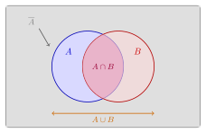
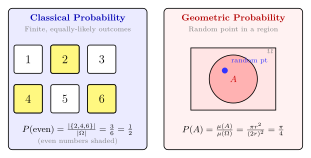

# 第 1 章 随机事件（融合版）

> **难度**：★☆☆☆☆
> **前置知识**：高中集合论基础、基本排列组合
> **本文件**：融合"原版严格推导 + 速记 / 套路 / 自测"。保留原版完整正文（学习目标 / 1.1–1.5 / 深度学习应用 / 练习题）+ 在最前置速记与引入 + 中间插入几何示意 + 最后追加思维训练。

---

## 一例速记

> **事件运算**：$A \cup B$（并，至少一个发生），$A \cap B = AB$（交，同时发生），$\bar{A} = \Omega - A$（对立，A 不发生）。
> **德摩根**：$\overline{A \cup B} = \bar{A} \cap \bar{B}$；$\overline{A \cap B} = \bar{A} \cup \bar{B}$。
> **三公理**：$P(A) \geq 0$；$P(\Omega) = 1$；$A_i$ 两两互斥时 $P\!\left(\bigcup A_i\right) = \sum P(A_i)$。
> **古典概型**：$P(A) = \dfrac{| A|}{|\Omega|}$（有限等可能）。
> **加法公式**：$P(A \cup B) = P(A) + P(B) - P(AB)$；对立：$P(\bar{A}) = 1 - P(A)$。
> **容斥推广**：$P(A \cup B \cup C) = P(A)+P(B)+P(C)-P(AB)-P(AC)-P(BC)+P(ABC)$。

---

## 引入：反直觉的生日悖论

> **题目**：某大学课堂有 23 名同学。请问：这 23 人中至少有两人生日相同的概率，超过 50% 还是低于 50%？（一年按 365 天计，每天等可能。）

大多数人的直觉是"23 人才 365 天的零头，概率肯定很低"。

答案是：**超过 50%**——准确值约 $50.7\%$。

直觉为什么出错？因为我们把"某人和你生日相同"（$22/365 \approx 6\%$）和"23 人中任意两人"混淆了。后者需要考虑的配对数高达 $\binom{23}{2} = 253$ 对，每对发生"生日相同"的机会都在累积。

这道题揭示了两件事：**样本空间的结构**（每人的生日是独立的均匀随机变量）和**对立事件技巧**（直接算"至少两人相同"很难，先算"全部不同"再取补集）。这正是本章的两个核心工具。

---

## 思维路径还原（解题者的内心独白）

> "第一步——**列样本空间**。23 人各自的生日可以是 1 到 365 的任意整数，彼此独立，所以总的排列数是 $365^{23}$。样本空间是等可能的，可以用古典概型。
>
> 第二步——**识别"至少"信号，转对立事件**。'至少两人相同'的对立事件是'所有人生日互不相同'，记作 $\bar{B}$。直接数 $B$ 的元素极复杂（需要枚举所有至少一对重合的情况），但 $\bar{B}$ 简单得多：第1人可选365天，第2人只能选剩余364天，……，第23人选 $365-22=343$ 天，有序排列数为 $365 \times 364 \times \cdots \times 343$。
>
> 第三步——**套古典概型公式**。
> $$P(\bar{B}) = \frac{365 \times 364 \times \cdots \times 343}{365^{23}}$$
>
> 计算这个连乘积：$\frac{364}{365} \approx 0.9973$，$\frac{363}{365} \approx 0.9945$，……每一项都比 1 稍小，23 项连乘下来大约是 $0.493$。
>
> 第四步——**套对立公式**。$P(B) = 1 - P(\bar{B}) \approx 1 - 0.493 = 0.507 > 50\%$。
>
> 第五步——**自检**。结果在 $[0,1]$ 内，且直觉上 23 人 253 对，超过 50% 合理。如果 $n=1$，$P(\bar{B})=1$，$P(B)=0$，也符合特殊情形。结论：本题的关键技巧是**对立事件 + 古典概型**，任何含'至少'字样的问题都应先考虑这条路。"

---

## 学习目标

完成本章学习后，你将能够：

- 理解随机试验、样本空间和样本点的基本概念，能够对具体问题建立概率模型
- 掌握随机事件的集合语言，熟练进行事件的并、交、补等运算
- 理解 Kolmogorov 公理化体系，从公理出发推导概率的基本性质
- 应用古典概型公式计算有限等可能样本空间中的概率
- 了解随机性在深度学习中的角色，掌握设置随机种子保证实验可重复性的方法

---

## 1.1 随机试验与样本空间

### 1.1.1 什么是随机试验

在日常生活和科学研究中，我们经常面对结果不确定的试验或观测。概率论研究的核心对象就是这类**随机试验**（Random Experiment）。

一个随机试验具备以下三个特征：

1. **可重复性**：试验可以在相同条件下重复进行
2. **结果多样性**：每次试验可能出现多个不同的结果
3. **随机性**：试验前无法确定本次结果是哪一个

**典型例子：**

- 掷一枚均匀硬币，观察正面（H）还是反面（T）
- 掷一颗均匀六面骰子，观察朝上的点数
- 从一批产品中随机抽取一件，检查是合格品还是次品
- 测量某工厂某天的日产量

### 1.1.2 样本空间

随机试验所有可能结果组成的集合称为**样本空间**（Sample Space），记作 $\Omega$。样本空间中的每一个元素称为**样本点**（Sample Point），记作 $\omega$。

$$\Omega = \{\omega \mid \omega \text{ 是试验的一个可能结果}\}$$

**例 1.1** 掷一枚硬币的样本空间为：

$$\Omega_1 = \{H, T\}$$

**例 1.2** 掷一颗骰子的样本空间为：

$$\Omega_2 = \{1, 2, 3, 4, 5, 6\}$$

**例 1.3** 掷两枚硬币的样本空间为：

$$\Omega_3 = \{HH, HT, TH, TT\}$$

**例 1.4** 测量某元件的寿命（单位：小时），样本空间为：

$$\Omega_4 = \{t \mid t \geq 0\} = [0, +\infty)$$

样本空间可以是有限集、可列无限集，也可以是不可列无限集（如连续区间）。

---

## 1.2 随机事件

### 1.2.1 事件的定义

**随机事件**（Random Event）是样本空间 $\Omega$ 的子集，即满足某一条件的样本点的集合。通常用大写字母 $A, B, C, \ldots$ 表示。

- **必然事件**：$\Omega$ 本身，每次试验必然发生，记作 $\Omega$
- **不可能事件**：空集 $\emptyset$，每次试验必然不发生，记作 $\emptyset$
- **基本事件**：只含一个样本点的事件 $\{\omega\}$

**例 1.5** 掷骰子试验中，设 $A$ = "出现偶数点"，则：

$$A = \{2, 4, 6\} \subseteq \Omega_2$$

### 1.2.2 事件的关系与运算

事件本质上是集合，因此集合的关系和运算都可以用于事件。

**（1）包含关系**

若事件 $A$ 发生必然导致事件 $B$ 发生，则称 $B$ 包含 $A$，记作 $A \subseteq B$。

$$A \subseteq B \iff (\omega \in A \Rightarrow \omega \in B)$$

**（2）事件的并（Union）**

$A$ 与 $B$ 的**并事件** $A \cup B$ 表示"$A$ 或 $B$ 至少有一个发生"：

$$A \cup B = \{\omega \mid \omega \in A \text{ 或 } \omega \in B\}$$

推广到有限多个事件：$A_1 \cup A_2 \cup \cdots \cup A_n = \bigcup_{i=1}^{n} A_i$

**（3）事件的交（Intersection）**

$A$ 与 $B$ 的**交事件** $A \cap B$（也写作 $AB$）表示"$A$ 与 $B$ 同时发生"：

$$A \cap B = \{\omega \mid \omega \in A \text{ 且 } \omega \in B\}$$

**（4）事件的差（Difference）**

$A$ 与 $B$ 的**差事件** $A - B$ 表示"$A$ 发生但 $B$ 不发生"：

$$A - B = \{\omega \mid \omega \in A \text{ 且 } \omega \notin B\} = A \cap \bar{B}$$

**（5）互斥事件（Mutually Exclusive）**

若 $A \cap B = \emptyset$，则称 $A$ 与 $B$ **互斥**（不相容），即两者不能同时发生。

**（6）对立事件（Complement）**

$A$ 的**对立事件**（余事件）$\bar{A}$ 表示"$A$ 不发生"：

$$\bar{A} = \Omega - A = \{\omega \mid \omega \notin A\}$$

$A$ 与 $\bar{A}$ 满足：$A \cup \bar{A} = \Omega$，$A \cap \bar{A} = \emptyset$

**运算规律**（德摩根定律）：

$$\overline{A \cup B} = \bar{A} \cap \bar{B}$$

$$\overline{A \cap B} = \bar{A} \cup \bar{B}$$

直觉理解："$A$ 或 $B$ 都不发生"等价于"$A$ 不发生且 $B$ 不发生"。

---

## 1.3 概率的公理化定义

### 1.3.1 Kolmogorov 公理体系

20世纪初，苏联数学家 **Andrey Kolmogorov** 于1933年建立了概率论的公理化体系，奠定了现代概率论的数学基础。

**定义（概率的公理化定义）**

设 $\Omega$ 是样本空间，对于每个事件 $A$，定义一个实数 $P(A)$，若满足以下三条公理，则称 $P(A)$ 为事件 $A$ 的**概率**：

**公理一（非负性）**：对任意事件 $A$，有

$$P(A) \geq 0$$

**公理二（规范性）**：必然事件的概率为1，即

$$P(\Omega) = 1$$

**公理三（可列可加性）**：若 $A_1, A_2, \ldots$ 两两互斥，则

$$P\left(\bigcup_{i=1}^{\infty} A_i\right) = \sum_{i=1}^{\infty} P(A_i)$$

这三条公理简洁而深刻：非负性确保概率是有意义的度量，规范性给出刻度，可加性是概率最核心的运算规则。

### 1.3.2 频率诠释

公理体系是抽象的数学定义。在实际应用中，我们通过**频率**来理解和估计概率。

将一个随机试验重复进行 $n$ 次，事件 $A$ 发生了 $n_A$ 次，则 $A$ 的**频率**为：

$$f_n(A) = \frac{n_A}{n}$$

当 $n$ 很大时，频率趋于稳定，接近一个固定值，这个值就是概率 $P(A)$：

$$P(A) \approx f_n(A) \quad (n \text{ 足够大时})$$

这一规律称为**大数定律**，后续章节将给出严格证明。

---

## 1.4 古典概型

### 1.4.1 古典概型的定义

若随机试验满足以下两个条件，则称为**古典概型**（Classical Probability Model）：

1. **有限性**：样本空间只含有限个样本点，即 $|\Omega| = n < +\infty$
2. **等可能性**：每个样本点出现的可能性相同，即每个基本事件的概率为 $\dfrac{1}{n}$

在古典概型中，若事件 $A$ 包含 $k$ 个样本点，则：

$$\boxed{P(A) = \frac{k}{n} = \frac{| A|}{|\Omega|} = \frac{\text{A 包含的样本点数}}{\text{样本空间的样本点总数}}}$$

### 1.4.2 古典概型例题

**例 1.6** 掷一枚均匀骰子，求"出现偶数点"的概率。

**解：** $\Omega = \{1,2,3,4,5,6\}$，$|\Omega| = 6$

$A = \{2,4,6\}$，$| A| = 3$

$$P(A) = \frac{3}{6} = \frac{1}{2}$$

**例 1.7（生日问题）** $n$ 个人中至少两人生日相同的概率是多少？（假设一年365天，每天等可能）

**解：** 设 $B$ = "至少两人生日相同"，$\bar{B}$ = "所有人生日各不相同"。

总的分配方式：$365^n$（每人可在365天中任选）

所有人生日各不同的方式：$365 \times 364 \times \cdots \times (365-n+1) = \dfrac{365!}{(365-n)!}$

$$P(\bar{B}) = \frac{365 \times 364 \times \cdots \times (365-n+1)}{365^n}$$

$$P(B) = 1 - P(\bar{B})$$

当 $n = 23$ 时，$P(B) \approx 0.507 > 50\%$，这一反直觉的结论称为**生日悖论**。

---

## 1.5 概率的基本性质

由 Kolmogorov 公理可以推导出概率的一系列基本性质。

#### 性质一：不可能事件的概率

$$P(\emptyset) = 0$$

**证明：** 令 $A_i = \emptyset$，$i = 1, 2, \ldots$，则 $A_i$ 两两互斥，且 $\bigcup_{i=1}^{\infty} A_i = \emptyset$。

由公理三：$P(\emptyset) = \sum_{i=1}^{\infty} P(\emptyset) = n \cdot P(\emptyset)$，故 $P(\emptyset) = 0$。

#### 性质二：有限可加性

若 $A_1, A_2, \ldots, A_n$ 两两互斥，则：

$$P\left(\bigcup_{i=1}^{n} A_i\right) = \sum_{i=1}^{n} P(A_i)$$

#### 性质三：对立事件

$$P(\bar{A}) = 1 - P(A)$$

**证明：** $A \cup \bar{A} = \Omega$，且 $A \cap \bar{A} = \emptyset$，故：

$$P(A) + P(\bar{A}) = P(\Omega) = 1$$

这是概率计算中的重要技巧：**正难则反**，当直接计算 $P(A)$ 困难时，先算 $P(\bar{A})$。

#### 性质四：概率的范围

$$0 \leq P(A) \leq 1$$

**证明：** 由非负性知 $P(A) \geq 0$。由 $A \subseteq \Omega$ 及单调性知 $P(A) \leq P(\Omega) = 1$。

#### 性质五：单调性

若 $A \subseteq B$，则 $P(A) \leq P(B)$，且 $P(B-A) = P(B) - P(A)$。

**证明：** $B = A \cup (B-A)$，且 $A \cap (B-A) = \emptyset$，故 $P(B) = P(A) + P(B-A) \geq P(A)$。

#### 性质六：加法公式

$$P(A \cup B) = P(A) + P(B) - P(A \cap B)$$

**证明：** $A \cup B = A \cup (B - A)$，$A$ 与 $B-A$ 互斥，故：

$$P(A \cup B) = P(A) + P(B - A) = P(A) + P(B) - P(AB)$$

**推广（容斥原理）**：

$$P(A \cup B \cup C) = P(A) + P(B) + P(C) - P(AB) - P(AC) - P(BC) + P(ABC)$$

一般地，对 $n$ 个事件：

$$P\!\left(\bigcup_{i=1}^{n} A_i\right) = \sum_{i} P(A_i) - \sum_{i<j} P(A_i A_j) + \sum_{i<j<k} P(A_i A_j A_k) - \cdots + (-1)^{n-1} P(A_1 A_2 \cdots A_n)$$

**例 1.8** 设 $P(A) = 0.4$，$P(B) = 0.5$，$P(AB) = 0.2$，求 $P(A \cup B)$。

$$P(A \cup B) = 0.4 + 0.5 - 0.2 = 0.7$$

---

## 几何示意

### 图 1-1：Venn 图（事件运算与补集）



Venn 图直观展示了样本空间 $\Omega$（外框）、事件 $A$（左圆）与 $B$（右圆）的包含关系。重叠区域为 $A \cap B$，两圆合并为 $A \cup B$，左圆以外区域为 $\bar{A}$。德摩根定律在图中清晰可见：$\overline{A \cup B}$ 是两圆以外的空白，等于 $\bar{A} \cap \bar{B}$。

### 图 1-2：古典概型 vs 几何概型对比



左侧为古典概型：有限个等可能样本点，概率 = 计数比。右侧为几何概型：样本空间是连续区域，概率 = 面积比（或长度、体积比）。两者的核心差别在于度量方式——离散数个数，连续量测度。

---

## 抽象成方法（套路总结）

### 6 大核心公式速查

| 名称 | 公式 | 关键条件 |
|------|------|----------|
| **古典概型** | $P(A) = \vert A\vert / \vert\Omega\vert$ | 有限等可能 |
| **对立公式** | $P(\bar{A}) = 1 - P(A)$ | 任意事件 |
| **加法公式** | $P(A \cup B) = P(A)+P(B)-P(AB)$ | 任意两事件 |
| **互斥加法** | $P(A \cup B) = P(A)+P(B)$ | $AB = \emptyset$ 时 |
| **差事件** | $P(A-B) = P(A) - P(AB)$ | $A \supseteq B$ 时化为 $P(A)-P(B)$ |
| **容斥原理** | $P\!\left(\bigcup_{i=1}^n A_i\right) = \sum P(A_i) - \sum P(A_iA_j) + \cdots$ | $n$ 个任意事件 |

### 解题 3 步流程

1. **建模**：明确样本空间 $\Omega$，判断是否等可能（古典概型）
2. **识别信号**：含"至少"→对立事件；含"或"→并事件加法公式；含"且"→交事件
3. **套公式 + 自检**：结果是否在 $[0, 1]$ 内；特殊情形（$n=0$ 或 $n$ 极大）是否退化正确

---

## 方法变形

### 变形 1：条件概率转联合概率

题目给出 $P(A \mid B)$ 时，转换为 $P(AB) = P(A \mid B) \cdot P(B)$，再代入加法公式（后续章节详述）。

### 变形 2：加法公式扩展

三事件容斥：$P(A \cup B \cup C) = P(A)+P(B)+P(C)-P(AB)-P(AC)-P(BC)+P(ABC)$。

遇到多事件"至少一个发生"时，优先用对立事件：$P\!\left(\bigcup A_i\right) = 1 - P\!\left(\bigcap \bar{A}_i\right)$，后者往往更易计算。

### 变形 3：对立事件（正难则反）

凡含"至少一个""至多一个""不全……"等词，首先写出对立事件再取补。

$$P(\text{至少一个}) = 1 - P(\text{全不发生})$$

### 变形 4：互斥分拆

若 $B_1, B_2, \ldots, B_n$ 构成 $\Omega$ 的一个划分（两两互斥且并为 $\Omega$），则

$$P(A) = \sum_{i=1}^{n} P(A B_i)$$

（全概率公式的雏形，后续章节严格证明）

---

## 本章小结

| 概念 | 数学表示 | 直觉含义 |
|------|----------|----------|
| 样本空间 | $\Omega$ | 所有可能结果的集合 |
| 随机事件 | $A \subseteq \Omega$ | 满足某条件的结果的集合 |
| 概率 | $P: 2^\Omega \to [0,1]$ | 事件发生可能性的度量 |
| 古典概型 | $P(A) = \vert A\vert/\vert\Omega\vert$ | 有限等可能情形 |
| 加法公式 | $P(A \cup B) = P(A)+P(B)-P(AB)$ | 避免重复计算的修正 |
| 对立公式 | $P(\bar{A}) = 1 - P(A)$ | 正难则反 |

**核心思想**：概率是对随机性的数学度量。Kolmogorov 三条公理是整座概率大厦的基石——非负、规范、可加，从这三条出发可以推导出概率论的全部性质。

---

## 思考路标（条件反射）

1. 看到"随机试验" → 立刻列出**样本空间** $\Omega$（不列全则概率算错）
2. 看到"事件运算" → 翻译成集合语言：并 $\cup$、交 $\cap$、补 $\bar{\cdot}$
3. 看到"概率三公理" → 非负 / 规范 $P(\Omega)=1$ / 可列可加（互斥才可加！）
4. 看到"有限等可能" → **古典概型**：$P(A)=| A|/|\Omega|$；先数 $|\Omega|$，再数 $| A|$
5. 看到"连续区域上的随机点" → **几何概型**：$P(A)=\mu(A)/\mu(\Omega)$（选对度量：长度 / 面积 / 体积）
6. 看到"独立 vs 互斥" → 独立：$P(AB)=P(A)P(B)$；互斥：$P(AB)=0$（两者不同！）
7. 看到"至少一个" / "至多一个" → 优先用**对立事件**（正难则反）
8. 看到"$P(A\cup B)$" → 加法公式 $P(A)+P(B)-P(AB)$；互斥时才能直接相加
9. 看到 $A \subseteq B$ → 单调性 $P(A)\leq P(B)$，且 $P(B-A)=P(B)-P(A)$
10. 看到"德摩根" → $\overline{A \cup B} = \bar{A}\cap\bar{B}$；多事件时逐步展开，不要跳步
11. 看到"计算结果 $> 1$ 或 $< 0$" → 必然出错，检查是否漏减 $P(AB)$ 或用了非互斥加法

---

## 易错点

1. **独立和互斥混淆**：互斥指 $P(AB)=0$（不能同时发生），独立指 $P(AB)=P(A)P(B)$（互不影响）。两个正概率事件若互斥，则必然不独立（因为 $P(A)P(B) > 0 \neq 0 = P(AB)$）。

2. **概率不能随意相加**：$P(A\cup B)=P(A)+P(B)$ 仅在 $A,B$ **互斥**时成立；一般情形须减去 $P(AB)$，否则将重叠部分计算了两次。

3. **几何概型选错度量**：问题涉及"长度"用长度，涉及"面积"用面积，涉及"体积"用体积，选错度量则答案系统性偏差。

4. **样本空间未列全**：古典概型中遗漏样本点会导致 $|\Omega|$ 偏小，概率偏大。务必穷举或用乘法原理计总数，尤其是有序 vs 无序的区分。

5. **概率值超出 $[0,1]$**：计算结果若超出此范围必然出错，可用于自检。常见原因是忘记减 $P(AB)$（结果 $>1$）或搞反了对立事件（结果为负）。

6. **对立事件 vs 互斥事件**：$A$ 与 $\bar{A}$ 是对立事件（互斥且并为 $\Omega$，概率之和等于1）；$A$ 与 $B$ 互斥仅代表 $AB=\emptyset$，$P(A)+P(B)$ 不一定等于1。

---

## 典型应用例题

### 例 1：古典概型 + 容斥

> **题目**：从 $1$ 到 $100$ 中随机取一个整数，求该数能被 $3$ 或 $5$ 整除的概率。

【思路】能被 $3$ 或 $5$ 整除对应集合的并，直接数元素个数，注意用容斥避免重复计数。

【解】$|\Omega| = 100$。

设 $A$ = "被 $3$ 整除"，$B$ = "被 $5$ 整除"，$AB$ = "被 $15$ 整除"。

$| A| = \lfloor 100/3 \rfloor = 33$，$| B| = \lfloor 100/5 \rfloor = 20$，$| AB| = \lfloor 100/15 \rfloor = 6$。

$$P(A \cup B) = \frac{33+20-6}{100} = \frac{47}{100} = 0.47$$

【答案】$\boxed{P = 0.47}$

【注】若不减 $| AB|=6$，会将能被 $15$ 整除的数计两次，得到错误答案 $53/100$。容斥原理是"避免重复"的核心工具。

---

### 例 2：对立事件（正难则反）

> **题目**：一枚均匀硬币连掷 $5$ 次，求至少出现 $1$ 次正面的概率。

【思路】"至少一次"→取对立事件"全部反面"，远比直接枚举简单。

【解】$|\Omega| = 2^5 = 32$（每次两种结果，共5次）。

对立事件 $\bar{A}$ = "5次全为反面"：只有1种结果，$P(\bar{A}) = 1/32$。

$$P(A) = 1 - P(\bar{A}) = 1 - \frac{1}{32} = \frac{31}{32} \approx 0.969$$

【答案】$\boxed{P = 31/32 \approx 96.9\%}$

【注】若直接计算"至少1次正面"，需要枚举恰好1次、2次……5次正面的情形并求和，步骤繁琐且容易出错。对立事件把5步变为1步。

---

### 例 3：加法公式 + 德摩根

> **题目**：设 $P(A) = 0.6$，$P(B) = 0.4$，$P(AB) = 0.2$。求：
> (1) $P(A \cup B)$；(2) $P(\bar{A} \cup \bar{B})$；(3) $P(\bar{A}B)$。

【思路】三问分别用加法公式、德摩根定律、差事件性质。

【解】

(1) 加法公式：

$$P(A \cup B) = 0.6 + 0.4 - 0.2 = 0.8$$

(2) 由德摩根：$\bar{A} \cup \bar{B} = \overline{AB}$，故

$$P(\bar{A} \cup \bar{B}) = P(\overline{AB}) = 1 - P(AB) = 1 - 0.2 = 0.8$$

(3) $\bar{A}B = B - AB$（$B$ 发生但 $A$ 不发生）：

$$P(\bar{A}B) = P(B) - P(AB) = 0.4 - 0.2 = 0.2$$

【答案】$\boxed{P(A \cup B) = 0.8,\quad P(\bar{A}\cup\bar{B}) = 0.8,\quad P(\bar{A}B) = 0.2}$

【注】第(2)问中 $\bar{A}\cup\bar{B} = \overline{AB}$ 是德摩根的直接应用，不要展开成 $1-P(A)+1-P(B)-\cdots$，容易算错。

---

## 深度学习应用：随机种子与可重复性

### 深度学习中的随机性来源

深度学习训练过程充满了随机性，理解这些随机性对于调试和复现实验结果至关重要。从概率论的角度看，每一次训练都是一次随机试验。

主要的随机性来源包括：

**（1）权重初始化**

神经网络的权重通常从某个概率分布中随机采样进行初始化。例如 Xavier 初始化：

$$W_{ij} \sim \mathcal{U}\!\left(-\sqrt{\frac{6}{n_{in}+n_{out}}},\ \sqrt{\frac{6}{n_{in}+n_{out}}}\right)$$

不同的初始权重会导致模型收敛到不同的局部最小值，最终精度可能相差数个百分点。

**（2）数据打乱（Shuffling）**

训练前通常将数据集随机打乱，使得每个 epoch 中 mini-batch 的组成不同。数据顺序的随机性影响梯度估计的方差，进而影响收敛速度和最终性能。

**（3）Dropout 正则化**

Dropout 在训练时以概率 $p$ 随机将神经元置零：

$$h_i' = \begin{cases} 0 & \text{以概率 } p \\ \dfrac{h_i}{1-p} & \text{以概率 } 1-p \end{cases}$$

每次前向传播都是一次新的随机试验，产生不同的网络结构。

**（4）数据增强**

随机裁剪、翻转、颜色抖动等数据增强操作引入额外随机性，提升模型泛化能力。

**（5）采样算法**

随机梯度下降（SGD）中 mini-batch 的随机采样、Dropout mask 的随机生成等均依赖随机数生成器。

### 为什么需要随机种子

如果不固定随机种子，同一份代码每次运行的结果可能截然不同，这给以下场景带来严重问题：

- **调试**：无法判断性能变化来自代码修改还是随机波动
- **论文复现**：读者无法复现你的实验结果
- **模型比较**：不公平的随机初始化使得比较失去意义
- **生产部署**：难以确保模型行为的一致性

固定随机种子相当于固定了随机试验的"轨迹"，使得整个随机过程变得确定性可重复。

### PyTorch 中设置随机种子

深度学习框架通常有多个独立的随机数生成器，需要分别设置：

```python
import torch
import numpy as np
import random
import os


def set_seed(seed: int = 42) -> None:
    """
    设置所有随机数生成器的种子，确保实验可重复性。

    Args:
        seed: 随机种子值，默认为 42（约定俗成的选择）
    """
    # Python 内置随机模块
    random.seed(seed)

    # NumPy 随机数生成器（影响数据处理、增强等）
    np.random.seed(seed)

    # PyTorch CPU 随机数生成器
    torch.manual_seed(seed)

    # PyTorch GPU 随机数生成器（单卡）
    torch.cuda.manual_seed(seed)

    # PyTorch GPU 随机数生成器（多卡）
    torch.cuda.manual_seed_all(seed)

    # 确保 cuDNN 使用确定性算法（可能略微降低速度）
    torch.backends.cudnn.deterministic = True
    torch.backends.cudnn.benchmark = False

    # 设置环境变量（部分操作系统层面的随机性）
    os.environ["PYTHONHASHSEED"] = str(seed)

    print(f"随机种子已设置为: {seed}")


# 演示随机种子的效果
def demo_reproducibility():
    print("=== 不固定种子 ===")
    for i in range(3):
        x = torch.randn(3)
        print(f"  第{i+1}次: {x.tolist()}")

    print("\n=== 固定种子（每次运行结果相同）===")
    for i in range(3):
        set_seed(42)
        x = torch.randn(3)
        print(f"  第{i+1}次: {x.tolist()}")

    print("\n=== 种子相同，序列确定 ===")
    set_seed(42)
    for i in range(3):
        x = torch.randn(3)
        print(f"  第{i+1}次: {x.tolist()}")


if __name__ == "__main__":
    demo_reproducibility()
```

**示例输出：**

```
=== 不固定种子 ===
  第1次: [0.312, -1.847, 0.563]
  第2次: [-0.791,  0.234, 1.102]
  第3次: [ 1.445, -0.089, -0.723]

=== 固定种子（每次运行结果相同）===
随机种子已设置为: 42
  第1次: [0.3367, -0.1288, 0.2345]
随机种子已设置为: 42
  第1次: [0.3367, -0.1288, 0.2345]
随机种子已设置为: 42
  第1次: [0.3367, -0.1288, 0.2345]

=== 种子相同，序列确定 ===
随机种子已设置为: 42
  第1次: [0.3367, -0.1288, 0.2345]
  第2次: [0.2303, -1.1229, -0.1863]
  第3次: [2.2082, -0.6380,  0.4617]
```

### DataLoader 的确定性设置

```python
def seed_worker(worker_id: int) -> None:
    """DataLoader 多进程 worker 的种子设置函数。"""
    worker_seed = torch.initial_seed() % (2**32)
    np.random.seed(worker_seed)
    random.seed(worker_seed)


# 创建可重复的 DataLoader
generator = torch.Generator()
generator.manual_seed(42)

dataloader = torch.utils.data.DataLoader(
    dataset,
    batch_size=32,
    shuffle=True,
    num_workers=4,
    worker_init_fn=seed_worker,   # 初始化每个 worker 的种子
    generator=generator,           # 控制 shuffle 的随机性
)
```

### 实践建议

1. **在训练脚本最开始调用 `set_seed()`**，在导入之后、任何计算之前
2. **记录种子值**：将种子作为超参数记录在实验配置文件中
3. **多种子验证**：为了确保结论的可靠性，用多个不同种子运行实验，报告均值和标准差
4. **注意局限性**：即使固定种子，某些 CUDA 操作在不同硬件/驱动版本下仍可能产生微小差异
5. **调试与发布分离**：调试时固定种子，发布模型时也保存种子以供复现

> **概率论视角**：固定随机种子等价于"选择了一条确定的概率路径"。概率空间 $(\Omega, \mathcal{F}, P)$ 中，样本点 $\omega \in \Omega$ 代表一次完整的随机试验结果。随机种子本质上是在伪随机数生成器的序列上选定了一个起点，使得对应的 $\omega$ 在每次运行时相同。

---

## 练习题

**习题 1.1**（基础）掷两枚均匀骰子，设 $A$ = "两枚点数之和为7"，$B$ = "两枚点数之和为偶数"，$C$ = "至少有一枚点数为6"。

（1）写出 $\Omega$，$A$，$B$，$C$ 的具体元素；
（2）判断 $A$ 与 $B$ 是否互斥；
（3）求 $P(A)$，$P(B)$，$P(C)$。

---

**习题 1.2**（基础）设事件 $A$，$B$ 满足 $P(A) = 0.6$，$P(B) = 0.4$，$P(AB) = 0.2$。

（1）求 $P(A \cup B)$；
（2）求 $P(\bar{A} \cup \bar{B})$；
（3）求 $P(\bar{A}B)$（$B$ 发生但 $A$ 不发生的概率）。

---

**习题 1.3**（中级）一个班级有30名同学，其中18人喜欢数学，15人喜欢编程，8人两者都喜欢。随机选取一名同学，求：

（1）该同学喜欢数学或编程（至少之一）的概率；
（2）该同学既不喜欢数学也不喜欢编程的概率；
（3）该同学只喜欢数学（不喜欢编程）的概率。

---

**习题 1.4**（中级）将3封信随机投入编号为1、2、3的3个信箱，每封信投入每个信箱等可能。求：

（1）3个信箱各有1封信的概率；
（2）恰好有1个信箱为空的概率；
（3）至少有1个信箱为空的概率。

---

**习题 1.5**（提高）某深度学习团队用两种优化器（Adam 和 SGD）分别训练同一个模型，各训练10次（每次不同随机种子）。已知 Adam 每次训练达到目标精度的概率为0.8，SGD 为0.6。

（1）若随机选取一次 Adam 的训练结果，求该次达到目标精度的概率（验证理解）；
（2）用容斥原理，求10次 Adam 训练中"第1次和第2次都达标"的概率（假设各次独立，后续章节会给出更简洁的乘法公式）；
（3）设 $A_i$ = "Adam第 $i$ 次训练达标"，用集合语言描述事件"10次中至少有1次达标"，并指出该事件的对立事件。

---

## 练习答案

<details>
<summary><strong>习题 1.1 详解</strong></summary>

**（1）** 掷两枚骰子，样本空间共 $6 \times 6 = 36$ 个样本点：

$$\Omega = \{(i,j) \mid i, j \in \{1,2,3,4,5,6\}\}$$

$A$ = "两数之和为7"：$A = \{(1,6),(2,5),(3,4),(4,3),(5,2),(6,1)\}$，$| A|=6$

$B$ = "两数之和为偶数"（奇+奇或偶+偶）：

$$B = \{(1,1),(1,3),(1,5),(2,2),(2,4),(2,6),(3,1),(3,3),(3,5),(4,2),(4,4),(4,6),(5,1),(5,3),(5,5),(6,2),(6,4),(6,6)\}$$

$| B| = 18$

$C$ = "至少有一枚点数为6"：共 $6+6-1=11$ 个，$| C|=11$

**（2）** 注意 $A$ 中的点对形如 $(奇, 偶)$ 或 $(偶, 奇)$，两数之和均为奇数。因此 $A \cap B = \emptyset$，$A$ 与 $B$ **互斥**。

**（3）**

$$P(A) = \frac{6}{36} = \frac{1}{6}$$

$$P(B) = \frac{18}{36} = \frac{1}{2}$$

$$P(C) = \frac{11}{36}$$

</details>

<details>
<summary><strong>习题 1.2 详解</strong></summary>

已知：$P(A) = 0.6$，$P(B) = 0.4$，$P(AB) = 0.2$

**（1）** 加法公式：

$$P(A \cup B) = P(A) + P(B) - P(AB) = 0.6 + 0.4 - 0.2 = 0.8$$

**（2）** 由德摩根定律：$\bar{A} \cup \bar{B} = \overline{AB}$

$$P(\bar{A} \cup \bar{B}) = P(\overline{AB}) = 1 - P(AB) = 1 - 0.2 = 0.8$$

**（3）** $\bar{A}B = B - AB$（$B$ 发生但 $A$ 不发生）

由单调性：$P(B - AB) = P(B) - P(AB) = 0.4 - 0.2 = 0.2$

</details>

<details>
<summary><strong>习题 1.3 详解</strong></summary>

设 $M$ = "喜欢数学"，$C$ = "喜欢编程"，总人数 $n = 30$。

已知：$| M| = 18$，$| C| = 15$，$| MC| = 8$

**（1）** 容斥原理：$| M \cup C| = 18 + 15 - 8 = 25$

$$P(M \cup C) = \frac{25}{30} = \frac{5}{6} \approx 0.833$$

**（2）** 两者都不喜欢 = $\overline{M \cup C}$：

$$P(\overline{M \cup C}) = 1 - \frac{25}{30} = \frac{5}{30} = \frac{1}{6} \approx 0.167$$

**（3）** 只喜欢数学 = $M - C = M\bar{C}$：$| M - C| = | M| - | MC| = 18 - 8 = 10$

$$P(M\bar{C}) = \frac{10}{30} = \frac{1}{3} \approx 0.333$$

</details>

<details>
<summary><strong>习题 1.4 详解</strong></summary>

3封信投入3个信箱，总方案数 $|\Omega| = 3^3 = 27$（每封信3种选择，独立）。

**（1）** "3个信箱各有1封信"相当于3封信与3个信箱的全排列：

$$| A| = 3! = 6$$

$$P(A) = \frac{6}{27} = \frac{2}{9} \approx 0.222$$

**（2）** "恰好有1个信箱为空"：先选哪1个信箱为空（$\binom{3}{1} = 3$ 种），剩余2个信箱各至少有1封信，且信箱之间不同时为空。

3封信投2个信箱，各箱至少1封：总投法 $2^3 = 8$，两箱都空（不可能），只有一箱非空：$2$ 种。

各至少有1封：$8 - 2 = 6$ 种。

$$| B| = 3 \times 6 = 18$$

$$P(B) = \frac{18}{27} = \frac{2}{3} \approx 0.667$$

**（3）** "至少有1个信箱为空" = 对立事件"3个信箱都不空" 的补：

$$P(\text{至少1个空}) = 1 - P(\text{全不空}) = 1 - \frac{6}{27} = 1 - \frac{2}{9} = \frac{7}{9} \approx 0.778$$

</details>

<details>
<summary><strong>习题 1.5 详解</strong></summary>

**（1）** 直接由题设：Adam 每次达标概率为 $P(A_i) = 0.8$。

这是概率的直接给定，无需计算。若用频率角度理解：若大量重复训练，约80%次能达标。

**（2）** $A_1 \cap A_2$ = "第1次和第2次都达标"。

此处假设各次训练独立（后续独立性章节将严格定义）：

$$P(A_1 \cap A_2) = P(A_1) \times P(A_2) = 0.8 \times 0.8 = 0.64$$

用容斥原理验证思路：$P(A_1 \cup A_2) = 0.8 + 0.8 - 0.64 = 0.96$，这是"至少一次达标"的概率，符合直觉（应该大于单次0.8）。

**（3）** "10次中至少1次达标"的集合表示：

$$D = \bigcup_{i=1}^{10} A_i = A_1 \cup A_2 \cup \cdots \cup A_{10}$$

对立事件 $\bar{D}$ = "10次全部未达标"：

$$\bar{D} = \overline{\bigcup_{i=1}^{10} A_i} = \bigcap_{i=1}^{10} \bar{A}_i = \bar{A}_1 \cap \bar{A}_2 \cap \cdots \cap \bar{A}_{10}$$

即"每一次都未达标"。由德摩根定律，"至少一个发生"的对立事件是"每个都不发生"。

（数值参考：$P(\bar{D}) = 0.2^{10} \approx 1.024 \times 10^{-7}$，几乎不可能全部失败。）

</details>

---

## 自测题

**自测 1**　掷两枚均匀硬币，设 $A$ = "至少一枚正面"，$B$ = "两枚相同"。求 $P(A)$，$P(B)$，$P(AB)$，并判断 $A$ 与 $B$ 是否互斥。

> 💡 提示：$\Omega = \{HH, HT, TH, TT\}$，$A = \{HH, HT, TH\}$，$B = \{HH, TT\}$，$AB = \{HH\}$。$P(A)=3/4$，$P(B)=1/2$，$P(AB)=1/4 \neq 0$，不互斥。

**自测 2**　设 $P(A) = 0.5$，$P(B) = 0.3$，且 $A, B$ 互斥。求 $P(A \cup B)$，$P(\bar{A} \cap \bar{B})$，$P(\bar{A}B)$。

> 💡 提示：互斥时 $P(A \cup B) = 0.5+0.3 = 0.8$；$P(\bar{A}\cap\bar{B}) = 1 - P(A\cup B) = 0.2$（德摩根）；$\bar{A}B = B - AB = B$（互斥时 $AB=\emptyset$），所以 $P(\bar{A}B) = P(B) = 0.3$。

**自测 3**　从 $\{1,2,3,\ldots,10\}$ 中随机取两个不同的数（无序），求两数之和为奇数的概率。

> 💡 提示：总数 $\binom{10}{2}=45$。两数之和为奇数当且仅当一奇一偶：奇数 $\{1,3,5,7,9\}$ 共 5 个，偶数 5 个，选法 $5\times 5=25$。$P = 25/45 = 5/9$。

**自测 4**　设 $A \subseteq B$，$P(A) = 0.3$，$P(B) = 0.6$。求 $P(A \cup B)$，$P(B - A)$，$P(\bar{A} \cup B)$。

> 💡 提示：$A \subseteq B$ 时 $A \cup B = B$，$P(A\cup B)=0.6$；$P(B-A)=P(B)-P(A)=0.3$；$\bar{A}\cup B = \bar{A} \cup B$（注意 $A \subseteq B$ 意味着 $\bar{A}\cup B = \Omega$），所以 $P(\bar{A}\cup B)=1$。

**自测 5**　某城市某天下雨概率 $0.4$，堵车概率 $0.5$，下雨且堵车概率 $0.3$。求：(1) 下雨或堵车的概率；(2) 晴天（不下雨）且不堵车的概率；(3) 下雨但不堵车的概率。

> 💡 提示：设 $R$ = "下雨"，$J$ = "堵车"。(1) $P(R\cup J)=0.4+0.5-0.3=0.6$；(2) $P(\bar{R}\cap\bar{J})=1-P(R\cup J)=0.4$（德摩根）；(3) $P(R\bar{J})=P(R)-P(RJ)=0.4-0.3=0.1$。

---

**回头看一眼"一例速记"**：

> 事件运算 = 集合运算；德摩根：补号入括号并变交。
> 三公理：非负、规范、互斥可加。
> 古典概型：$P(A) = | A|/|\Omega|$。
> 加法公式减交集；对立公式正难则反。

如果现在不看笔记，能独立完成例 2（对立事件）+ 例 3（加法+德摩根）+ 自测 3 + 自测 5——本章，你拿下了。

---

## 融合版说明

本版 = **原版（严格大学教材 + 深度学习应用）** + **速记 / 套路 / 例题 / 自测** 融合：

| 段落 | 来源 | 价值 |
|------|------|------|
| 一例速记 + 引入（生日悖论）+ 思维路径还原 | 新增前置 | 建立直觉 / 条件反射 |
| 学习目标 + 1.1–1.5 严格正文 | 原版完整保留 | 公理推导 / 完整定理 |
| 几何示意（Venn 图 + 概型对比） | 配套 SVG 插图 | 可视化事件运算 |
| 抽象成方法 + 方法变形 | 新增中间段 | 套路速查 / 举一反三 |
| 本章小结 | 原版完整保留 | 公式速查表 |
| 思考路标（11条）+ 易错点（6条） | 融合新增 | 快速反应 / 避雷 |
| 典型应用例题 3 例 | 新增演练 | 解题流程示范 |
| 深度学习应用 + PyTorch 代码 | 原版完整保留 | 工业实战 |
| 练习题 5 题 + 详细答案 | 原版完整保留 | 系统巩固 |
| 自测题 5 题（含提示折叠） | 新增验收 | 自我检测 |
| 结尾速记 + 融合版说明表 | 新增收尾 | 一站式复盘 |

**适用**：一站式学习——先速记建立直觉，读严格推导，做套路总结，看代码实战，做习题巩固，自测验收。
