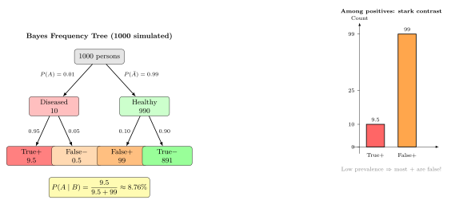
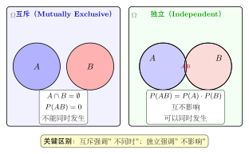

# 第 2 章 条件概率（融合版）

> **难度**：★★☆☆☆
> **前置知识**：第 1 章概率基础、集合运算
> **本文件**：融合"原版严格推导 + 重写版高中模板 D 速记 / 套路 / 自测"。保留原版完整正文（学习目标 / 2.1–2.5 / 深度学习应用 / 练习题）+ 在最前置追加引入动机与思维还原 + 在最后追加方法套路 / 自测 / 融合说明。

---

## 一例速记

> **条件概率定义**：$P(A \mid B) = \dfrac{P(A \cap B)}{P(B)}$（要求 $P(B) > 0$）
>
> **乘法公式（链式法则）**：$P(A \cap B) = P(B)\,P(A \mid B)$；多事件：$P(A_1 A_2 \cdots A_n) = P(A_1)\,P(A_2 \mid A_1)\,P(A_3 \mid A_1 A_2)\cdots$
>
> **全概率公式**（"由因求果"）：$P(B) = \displaystyle\sum_{i=1}^{n} P(A_i)\,P(B \mid A_i)$，其中 $\{A_i\}$ 为 $\Omega$ 的完备划分
>
> **贝叶斯公式**（"由果求因"）：$P(A_k \mid B) = \dfrac{P(A_k)\,P(B \mid A_k)}{\displaystyle\sum_{j=1}^{n} P(A_j)\,P(B \mid A_j)}$；简记：后验 $\propto$ 似然 $\times$ 先验
>
> **独立性 vs 互斥性**：独立 $\Leftrightarrow$ $P(AB) = P(A)P(B)$；互斥 $\Leftrightarrow$ $P(AB) = 0$；两者本质不同，正概率互斥事件必不独立

---

## 引入：反直觉的贝叶斯医学诊断

某病发病率 $1\%$，检测灵敏度 $95\%$（真有病诊出阳）、特异度 $90\%$（无病诊出阴）。某人检测阳性，求实际患病概率。

**你的第一直觉**：检测准确率那么高（95%），阳性结果应该意味着很大概率真的患病吧？

实际答案让大多数人震惊：**患病概率不足 9%**。这就是条件概率的威力——也是为什么贝叶斯公式是本章最重要的工具。

---

## 思维路径还原

> **识别题型**：已知"检测阳性"这个**结果**，求"实际患病"这个**原因**的概率——这是典型的"由果推因"，用**贝叶斯公式**。
>
> **建立符号**：设 $A =$ 患病，$B =$ 检测阳性。
>
> **写出先验**（题目直接给出）：$P(A) = 0.01$，$P(\bar{A}) = 0.99$。
>
> **写出似然**：
> - 灵敏度 $95\%$ = 真有病时检出阳性的概率：$P(B \mid A) = 0.95$
> - 特异度 $90\%$ = 无病时检出阴性：$P(\bar{B} \mid \bar{A}) = 0.90$，故假阳性率 $P(B \mid \bar{A}) = 0.10$
>
> **第一步，全概率公式**算分母 $P(B)$（所有可能路径产生阳性的总概率）：
>
> $$P(B) = P(A)\,P(B \mid A) + P(\bar{A})\,P(B \mid \bar{A}) = 0.01 \times 0.95 + 0.99 \times 0.10 = 0.0095 + 0.0990 = 0.1085$$
>
> **第二步，贝叶斯公式**算后验（分子是真阳性路径的贡献）：
>
> $$P(A \mid B) = \frac{P(A)\,P(B \mid A)}{P(B)} = \frac{0.0095}{0.1085} \approx 8.76\%$$
>
> **反直觉警报**：检测阳性后，实际患病概率仍不足 $9\%$！
>
> **用 1000 人频率树理解**：1000 人中约 10 名患者（真阳 $\approx 9.5$ 人），990 名健康人中约 99 人假阳性。阳性池共约 108.5 人，真阳性仅占 $9.5 / 108.5 \approx 8.76\%$。
>
> **根本原因**：**低先验（发病率仅 $1\%$）** 放大了假阳性的比例——1 个真阳性对应约 10 个假阳性。
>
> **启示**：（1）低先验下，单次阳性结果多数是假阳性；（2）提高检测价值需**提升特异度**或**针对高危人群**（提升先验）；（3）贝叶斯公式是理性更新信念的数学工具。

---

## 学习目标

学完本章后，你将能够：

- 理解条件概率的定义与直觉含义，正确计算 $P(A \mid B)$
- 掌握乘法公式与链式法则，分解多事件的联合概率
- 运用全概率公式处理复杂的分情况概率计算
- 理解并应用贝叶斯公式进行"逆向推断"（从结果到原因）
- 区分事件的独立性与互斥性，理解两两独立与相互独立的区别

---

## 2.1 条件概率的定义

### 直觉引入

假设你知道今天**已经下雨**，请问"路上堵车"的概率是多少？这与你不知道天气时的估计不同——额外的信息改变了你的判断。

**条件概率**正是刻画"在已知某事件发生的前提下，另一事件发生的概率"。

### 正式定义

设 $B$ 为样本空间 $\Omega$ 中的一个事件，且 $P(B) > 0$，则在事件 $B$ 发生的条件下，事件 $A$ 发生的**条件概率**定义为：

$$
\boxed{P(A \mid B) = \frac{P(A \cap B)}{P(B)}}
$$

**几何直觉**：将 $B$ 视为"缩小后的新样本空间"，$A \cap B$ 是这个新空间中 $A$ 所占的部分。条件概率就是在新空间中重新归一化后的概率。

$$
\underbrace{P(A \mid B)}_{\text{条件概率}} = \frac{\overbrace{P(A \cap B)}^{A \text{ 与 } B \text{ 同时发生}}}{\underbrace{P(B)}_{\text{归一化因子}}}
$$

### 示例：医疗检测

一种疾病在人群中的患病率为 $1\%$，某检测的灵敏度（真阳性率）为 $99\%$，特异度（真阴性率）为 $95\%$。

设事件：
- $D$：患病，$P(D) = 0.01$
- $+$：检测阳性

已知：$P(+ \mid D) = 0.99$，$P(+ \mid \bar{D}) = 0.05$

问：已知某人检测阳性，他真正患病的概率是多少？

这个问题需要**贝叶斯公式**来解答，我们在 2.4 节详细讨论。

### 条件概率的性质

条件概率 $P(\cdot \mid B)$ 本身也是一个合法的概率测度，满足概率的全部公理：

1. **非负性**：$P(A \mid B) \geq 0$
2. **规范性**：$P(\Omega \mid B) = 1$
3. **可列可加性**：若 $A_1, A_2, \ldots$ 两两互斥，则

$$
P\!\left(\bigcup_{i=1}^{\infty} A_i \,\middle|\, B\right) = \sum_{i=1}^{\infty} P(A_i \mid B)
$$

---

## 2.2 乘法公式

### 基本乘法公式

由条件概率的定义直接变形，得到**乘法公式**（multiplication rule）：

$$
\boxed{P(A \cap B) = P(A \mid B) \cdot P(B) = P(B \mid A) \cdot P(A)}
$$

**含义**：两个事件同时发生的概率，等于其中一个发生的概率乘以在该事件已发生前提下另一个发生的概率。

### 链式法则（Chain Rule）

乘法公式可以推广到多个事件，称为**链式法则**：

$$
\boxed{P(A_1 \cap A_2 \cap \cdots \cap A_n) = P(A_1) \cdot P(A_2 \mid A_1) \cdot P(A_3 \mid A_1 \cap A_2) \cdots P(A_n \mid A_1 \cap \cdots \cap A_{n-1})}
$$

简记为：

$$
P\!\left(\bigcap_{i=1}^{n} A_i\right) = \prod_{i=1}^{n} P\!\left(A_i \,\middle|\, \bigcap_{j=1}^{i-1} A_j\right)
$$

其中 $P(A_1 \mid \emptyset) \triangleq P(A_1)$。

**注**：链式法则在语言模型中至关重要。一段文本 $w_1 w_2 \cdots w_n$ 的概率被分解为：

$$
P(w_1, w_2, \ldots, w_n) = P(w_1) \cdot P(w_2 \mid w_1) \cdot P(w_3 \mid w_1, w_2) \cdots P(w_n \mid w_1, \ldots, w_{n-1})
$$

这正是自回归语言模型（如 GPT）的核心概率建模思路。

### 示例：抽签问题

袋中有 5 张签，其中 2 张中签。甲先抽，乙后抽（不放回），乙中签的概率是多少？

设 $A$：甲中签，$B$：乙中签。

$$
P(B) = P(B \mid A) P(A) + P(B \mid \bar{A}) P(\bar{A})
$$

$$
= \frac{1}{4} \cdot \frac{2}{5} + \frac{2}{4} \cdot \frac{3}{5} = \frac{2}{20} + \frac{6}{20} = \frac{8}{20} = \frac{2}{5}
$$

乙中签的概率与甲相同！这说明**抽签的公平性**与抽取顺序无关。

---

## 2.3 全概率公式

### 划分的概念

若事件 $B_1, B_2, \ldots, B_n$ 满足：

1. **互斥**：$B_i \cap B_j = \emptyset$（$i \neq j$）
2. **完备**：$B_1 \cup B_2 \cup \cdots \cup B_n = \Omega$
3. **正概率**：$P(B_i) > 0$（$i = 1, \ldots, n$）

则称 $\{B_1, B_2, \ldots, B_n\}$ 为样本空间 $\Omega$ 的一个**完备事件组**（或**划分**）。

### 全概率公式

对样本空间的任意划分 $\{B_1, \ldots, B_n\}$ 和任意事件 $A$：

$$
\boxed{P(A) = \sum_{i=1}^{n} P(A \mid B_i) \cdot P(B_i)}
$$

**直觉**：将复杂事件 $A$ 按"原因"分情况讨论——每种原因 $B_i$ 发生的概率为 $P(B_i)$，在该原因下 $A$ 发生的概率为 $P(A \mid B_i)$，对所有可能原因求加权平均。

```
         Ω
    ┌────┬────┬────┐
    │ B₁ │ B₂ │ B₃ │
    │ ▓▓▓│░░░░│ ▓▓ │  ← A∩B₁, A∩B₂, A∩B₃
    └────┴────┴────┘
     P(A) = P(A|B₁)P(B₁) + P(A|B₂)P(B₂) + P(A|B₃)P(B₃)
```

### 示例：产品质量检验

工厂有三条生产线，各生产该产品的 $30\%$、$45\%$、$25\%$，次品率分别为 $2\%$、$3\%$、$5\%$。

随机抽取一件产品，是次品的概率？

设 $B_i$：来自第 $i$ 条生产线，$A$：次品。

$$
P(A) = P(A \mid B_1) P(B_1) + P(A \mid B_2) P(B_2) + P(A \mid B_3) P(B_3)
$$

$$
= 0.02 \times 0.30 + 0.03 \times 0.45 + 0.05 \times 0.25
$$

$$
= 0.006 + 0.0135 + 0.0125 = 0.032
$$

次品率约为 $3.2\%$。

---

## 2.4 贝叶斯公式

### 从"果"到"因"的推断

全概率公式计算的是"已知原因，求结果的概率"；而贝叶斯公式解决的是反向问题：**已知结果，推断原因的概率**。

### 贝叶斯公式

设 $\{B_1, \ldots, B_n\}$ 为 $\Omega$ 的划分，$A$ 为任意正概率事件，则：

$$
\boxed{P(B_i \mid A) = \frac{P(A \mid B_i) \cdot P(B_i)}{\displaystyle\sum_{j=1}^{n} P(A \mid B_j) \cdot P(B_j)}}
$$

**三个关键量的统计学命名**：

| 名称 | 符号 | 含义 |
\vert---\vert---\vert---\vert
\vert **先验概率**（prior） \vert $P(B_i)$ \vert 在观测到 $A$ 之前，对 $B_i$ 的初始判断 \vert
\vert **似然**（likelihood） \vert $P(A \mid B_i)$ \vert 在 $B_i$ 为真时，观测到 $A$ 的概率 \vert
\vert **后验概率**（posterior） \vert $P(B_i \mid A)$ \vert 观测到 $A$ 之后，对 $B_i$ 的更新判断 \vert

$$
\underbrace{P(B_i \mid A)}_{\text{后验}} \propto \underbrace{P(A \mid B_i)}_{\text{似然}} \times \underbrace{P(B_i)}_{\text{先验}}
$$

这一关系常被概括为："**后验 ∝ 似然 × 先验**"。

### 示例：回到医疗检测

接续 2.1 节的问题：

$$
P(D \mid +) = \frac{P(+ \mid D) \cdot P(D)}{P(+ \mid D) \cdot P(D) + P(+ \mid \bar{D}) \cdot P(\bar{D})}
$$

$$
= \frac{0.99 \times 0.01}{0.99 \times 0.01 + 0.05 \times 0.99} = \frac{0.0099}{0.0099 + 0.0495} \approx 0.167
$$

**结论**：即使检测阳性，真正患病的概率仅约 $16.7\%$！

这个反直觉的结果源于**基率（base rate）的稀疏性**——患病率仅 $1\%$，大量假阳性"淹没"了真阳性信号。这一现象称为**基率谬误**（base rate fallacy）。

### 贝叶斯更新（Sequential Updating）

贝叶斯公式支持**序贯更新**：将前一次的后验作为下一次的先验，反复迭代。

$$
P(H \mid \text{数据}_1) \xrightarrow{\text{新数据}_2} P(H \mid \text{数据}_1, \text{数据}_2) \xrightarrow{\text{新数据}_3} \cdots
$$

这是贝叶斯统计的核心思想，也是贝叶斯深度学习的理论基础。

---

## 2.5 事件的独立性

### 独立性的定义

若两个事件 $A$、$B$ 满足：

$$
\boxed{P(A \cap B) = P(A) \cdot P(B)}
$$

则称 $A$ 与 $B$ **相互独立**。

**等价条件**（当 $P(B) > 0$ 时）：

$$
P(A \mid B) = P(A)
$$

即：知道 $B$ 发生与否，不改变 $A$ 发生的概率。

**注意**：独立性与互斥性是两个不同的概念！

| \vert \vert 互斥（Mutually Exclusive） \vert 独立（Independent） \vert
\vert---\vert---\vert---\vert
\vert 定义 \vert $A \cap B = \emptyset$ \vert $P(A \cap B) = P(A)P(B)$ \vert
\vert 含义 \vert 不能同时发生 \vert 互不影响 \vert
\vert 关系 \vert 若 $P(A), P(B) > 0$，则互斥必不独立 \vert 独立的正概率事件必不互斥 \vert

### 两两独立 vs 相互独立

对于多个事件，独立性存在强弱之分：

**两两独立**（pairwise independence）：任意两个事件独立，即对所有 $i \neq j$：

$$
P(A_i \cap A_j) = P(A_i) P(A_j)
$$

**相互独立**（mutual independence）：对所有子集 $\{i_1, \ldots, i_k\} \subseteq \{1, \ldots, n\}$（$k \geq 2$）：

$$
P(A_{i_1} \cap A_{i_2} \cap \cdots \cap A_{i_k}) = P(A_{i_1}) \cdot P(A_{i_2}) \cdots P(A_{i_k})
$$

**重要**：两两独立 $\not\Rightarrow$ 相互独立！

**反例**（Bernstein）：投掷两枚均匀硬币，令：
- $A$：第一枚正面
- $B$：第二枚正面
- $C$：两枚结果相同

计算验证：$P(A) = P(B) = P(C) = \frac{1}{2}$，$P(A \cap B) = P(A \cap C) = P(B \cap C) = \frac{1}{4}$，故 $A, B, C$ 两两独立。

但 $P(A \cap B \cap C) = \frac{1}{4} \neq \frac{1}{8} = P(A)P(B)P(C)$，故三者**不相互独立**。

### 独立性的实际意义

- 若 $A_1, \ldots, A_n$ 相互独立，则它们同时发生的概率为各自概率之积：

$$
P\!\left(\bigcap_{i=1}^{n} A_i\right) = \prod_{i=1}^{n} P(A_i)
$$

- 独立随机变量的联合分布等于边缘分布之积（将在后续章节深入讨论）。
- 独立性假设大大简化了概率计算，是朴素贝叶斯分类器等算法的核心假设。

---

## 几何示意

### 图 2-1：贝叶斯频率树与假阳性对比



上图以 1000 人为基准展示了频率树：左侧按发病率（1%）将人群分为患者与健康人；右侧各分支按检测灵敏度 / 特异度分出真阳、假阴、假阳、真阴。可直观看到：阳性池中假阳性（约 99 人）远多于真阳性（约 10 人），这正是贝叶斯公式输出低于直觉值的几何原因。

### 图 2-2：独立 vs 互斥 Venn 对比



左侧 Venn 图展示独立事件 $A$、$B$：两圆有交集（$P(AB) = P(A)P(B) > 0$），知道 $B$ 发生不改变 $A$ 的概率。右侧展示互斥事件：两圆无交集（$P(AB) = 0$），知道 $B$ 发生则 $A$ 必不发生，条件概率骤降为零——互斥使二者极度"相关"，因此正概率互斥事件必不独立。

---

## 抽象成方法（套路总结）

### 5 大核心公式速查

| 名称 \vert 公式 \vert 关键记忆点 \vert
\vert---\vert---\vert---\vert
\vert **条件概率** \vert $P(A \mid B) = P(AB)/P(B)$ \vert 分母 $P(B) > 0$，缩小样本空间 \vert
\vert **乘法公式** \vert $P(AB) = P(B)\,P(A\mid B) = P(A)\,P(B\mid A)$ \vert 两种写法等价，选方便计算的 \vert
\vert **链式法则** \vert $P(A_1 \cdots A_n) = P(A_1)\prod_{i=2}^{n}P(A_i\mid A_1\cdots A_{i-1})$ \vert 语言模型自回归分解 \vert
\vert **全概率** \vert $P(B) = \sum_i P(A_i)\,P(B\mid A_i)$ \vert 按"原因"加权求和 \vert
\vert **贝叶斯** \vert $P(A_k \mid B) = P(A_k)\,P(B\mid A_k) / P(B)$ \vert 后验 $\propto$ 似然 $\times$ 先验 \vert
\vert **独立性** \vert $P(AB) = P(A)P(B)$ \vert 等价 $P(A\mid B) = P(A)$ \vert

### 贝叶斯解题 4 步流程

1. **识别方向**：是"由因求果"（全概率）还是"由果求因"（贝叶斯）？
2. **划定划分**：写出完备事件组 $\{A_1, A_2, \ldots, A_n\}$，读出先验 $P(A_i)$
3. **读出似然**：从题目条件中提取每个 $P(B \mid A_i)$（注意方向，不要把似然读反）
4. **套公式计算**：先用全概率公式算 $P(B)$，再算 $P(A_k \mid B)$

---

## 方法变形

### 变形 1：多次贝叶斯更新

**场景**：同一假设在收到多条独立证据时，可序贯更新——每次更新后的后验作为下一次的先验。

**公式链**：$P(H) \to P(H \mid E_1) \to P(H \mid E_1, E_2) \to \cdots$

**注意**：若证据 $E_1, E_2$ 在给定 $H$ 下条件独立，则一次性输入等价于逐步更新（朴素贝叶斯的理论基础）。

### 变形 2：链式乘法（路径分析）

**场景**：多阶段随机试验，每步结果依赖前一步（不放回抽取、多阶段决策树等）。

**做法**：画树状图，每条路径概率 = 沿路径条件概率的乘积；目标事件的总概率 = 所有满足条件的路径之和（全概率公式的树形实现）。

### 变形 3：独立 vs 互斥的辨析

**判断独立**：计算 $P(AB)$ 与 $P(A)P(B)$，相等则独立（无法仅凭"感觉"）。

**常见误区**：
- 互斥事件（$P(AB) = 0$）若 $P(A), P(B) > 0$，则必**不**独立（因为 $P(A)P(B) > 0 \neq 0$）
- 独立事件可以同时发生（交集非空），不要混淆"不相关"与"不相交"

### 变形 4：条件独立

**定义**：在给定事件 $C$ 的条件下，$A$ 与 $B$ 条件独立，当且仅当：

$$P(A \cap B \mid C) = P(A \mid C)\,P(B \mid C)$$

等价地，$P(A \mid B, C) = P(A \mid C)$（知道 $C$ 后，$B$ 不再提供关于 $A$ 的额外信息）。

**深度学习应用**：朴素贝叶斯分类器假设特征 $X_1, \ldots, X_d$ 在给定类别 $Y$ 下条件独立，大幅简化参数规模。马尔可夫链中"当前状态给定时，未来与历史条件独立"也是同一概念。

---

## 本章小结

| 概念 \vert 公式 \vert 记忆要点 \vert
\vert---\vert---\vert---\vert
\vert 条件概率 \vert $P(A\mid B) = P(A\cap B)/P(B)$ \vert 缩小样本空间，重新归一化 \vert
\vert 乘法公式 \vert $P(A\cap B) = P(A\mid B)P(B)$ \vert 由条件概率变形而来 \vert
\vert 链式法则 \vert $P(\bigcap A_i) = \prod P(A_i \mid A_1\cdots A_{i-1})$ \vert 语言模型的核心分解 \vert
\vert 全概率公式 \vert $P(A) = \sum P(A\mid B_i)P(B_i)$ \vert 按"原因"加权平均 \vert
\vert 贝叶斯公式 \vert $P(B_i\mid A) \propto P(A\mid B_i)P(B_i)$ \vert 后验 ∝ 似然 × 先验 \vert
\vert 独立性 \vert $P(A\cap B) = P(A)P(B)$ \vert 互不影响，注意区分互斥 \vert

**核心思维方式**：贝叶斯公式提供了一种**理性更新信念**的框架——面对新证据，以先验为出发点，通过似然调整，得到后验。这是科学推断的数学基础。

---

## 思考路标（条件反射）

1. 看到 $P(B \mid A)$ → 公式 $P(AB)/P(A)$，**立刻检查 $P(A) > 0$**
2. 看到"依次发生多个事件的联合概率" → **链式乘法**：$P(ABC) = P(A)\,P(B\mid A)\,P(C\mid AB)$
3. 看到"分情况（按原因）求某事件的总概率" → **全概率公式**：$P(B) = \sum_i P(A_i)P(B\mid A_i)$
4. 看到"已知结果，推原因概率" → **贝叶斯（由果求因）**：后验 $\propto$ 似然 $\times$ 先验
5. 看到 $P(AB) = P(A)P(B)$ → **独立**；看到 $P(AB) = 0$ → **互斥**（两者完全不同）
6. 看到"先验 / 后验 / 似然" → 贝叶斯框架：先验经似然更新得后验
7. 看到"阳性检测 + 低发病率" → **假阳性反直觉**：低先验下大多数阳性是假阳性
8. 看到多步随机试验 → 画**树状图**，叶节点概率 = 路径上各条件概率之积
9. 看到"两两独立" → **不能直接推相互独立**（Bernstein 反例）
10. 看到"在 $C$ 条件下，$A$ 与 $B$" → 考虑**条件独立**，贝叶斯网络 / 朴素贝叶斯的基础

---

## 易错点

1. **独立 ≠ 互斥**（最常见混淆）：独立的两个正概率事件**可以同时发生**（$P(AB) > 0$）；互斥事件必然不能同时发生（$P(AB) = 0$），故正概率的互斥事件必不独立。
2. **条件概率分母 $P(B) \neq 0$**：$P(A \mid B)$ 要求 $P(B) > 0$，若 $P(B) = 0$ 则条件概率无意义（不是"等于 1"）。
3. **链式公式顺序不可随意交换**：$P(ABC) = P(A)\cdot P(B\mid A)\cdot P(C\mid AB)$，条件要逐步累积，$P(C \mid B) \neq P(C \mid AB)$（一般情况下）。
4. **贝叶斯反演方向**：$P(\text{结果}\mid\text{原因})$ 是似然，$P(\text{原因}\mid\text{结果})$ 是后验，两者通常差距极大——$P(B \mid A) \neq P(A \mid B)$（检察官谬误）。
5. **假阳性占多数（低发病率）**：当先验 $P(\text{患病})$ 很小时，即使检测灵敏度高，阳性结果中假阳性仍占多数——务必用贝叶斯公式计算，不可凭直觉。
6. **两两独立不蕴含相互独立**：Bernstein 硬币例子说明需要验证所有子集的乘积条件，仅验证两两不够。

---

## 典型应用例题

### 例 1：贝叶斯医学诊断（完整流程）

> **题目**：某病发病率 $P(\text{病}) = 0.005$，检测灵敏度 $P(+ \mid \text{病}) = 0.95$，特异度 $P(- \mid \text{健}) = 0.90$（假阳性率 $0.10$）。某人检测阳性，求实际患病概率。

【识别】"已知阳性，求患病" → 由果推因 → 贝叶斯公式

【第一步：全概率算 $P(+)$】

$$P(+) = P(+ \mid \text{病})\,P(\text{病}) + P(+ \mid \text{健})\,P(\text{健})$$

$$= 0.95 \times 0.005 + 0.10 \times 0.995 = 0.00475 + 0.09950 = 0.10425$$

【第二步：贝叶斯算后验】

$$P(\text{病} \mid +) = \frac{P(+ \mid \text{病})\,P(\text{病})}{P(+)} = \frac{0.95 \times 0.005}{0.10425} = \frac{0.00475}{0.10425} \approx 4.56\%$$

【结论】阳性后患病概率仅 $4.56\%$，远低于直觉。1000 人中约 5 名患者（真阳约 4.75 人）vs 约 99.5 名假阳性——假阳性是真阳性的约 20 倍。

【答案】$\boxed{P(\text{病} \mid +) \approx 4.56\%}$

---

### 例 2：全概率公式分段（生产线次品）

> **题目**：三条生产线产量占比 $50\%$、$30\%$、$20\%$，次品率分别 $1\%$、$2\%$、$3\%$。(a) 随机取一件，是次品的概率？(b) 已知是次品，来自生产线 A 的概率？

【(a) 全概率公式】

$$P(\text{次}) = 0.01 \times 0.50 + 0.02 \times 0.30 + 0.03 \times 0.20 = 0.005 + 0.006 + 0.006 = 0.017$$

次品率 $1.7\%$。

【(b) 贝叶斯公式——由"次品"推"来源"】

$$P(A \mid \text{次}) = \frac{P(\text{次} \mid A)\,P(A)}{P(\text{次})} = \frac{0.01 \times 0.50}{0.017} = \frac{0.005}{0.017} \approx 29.4\%$$

【洞察】尽管 A 产量最大（50%），但次品率最低，导致次品来自 A 的概率（29.4%）低于 A 的产量占比。

【答案】$\boxed{P(\text{次}) = 1.7\%,\ P(A \mid \text{次}) \approx 29.4\%}$

---

### 例 3：多次贝叶斯更新

> **题目**：某人可能患病（先验 $P(H) = 0.1$）。进行两次独立检测，两次均阳性（$P(+ \mid H) = 0.9$，$P(+ \mid \bar{H}) = 0.2$）。分别在第一次检测后和第二次检测后计算后验概率。

【第一次检测后】

$$P(+_1) = 0.9 \times 0.1 + 0.2 \times 0.9 = 0.09 + 0.18 = 0.27$$

$$P(H \mid +_1) = \frac{0.9 \times 0.1}{0.27} = \frac{0.09}{0.27} = \frac{1}{3} \approx 33.3\%$$

【第二次检测后（以 $P(H) = 1/3$ 为新先验）】

$$P(+_2 \mid +_1) = 0.9 \times \frac{1}{3} + 0.2 \times \frac{2}{3} = 0.30 + \frac{0.40}{3} = \frac{0.90 + 0.40}{3} = \frac{1.30}{3} \approx 0.433$$

$$P(H \mid +_1, +_2) = \frac{0.9 \times \frac{1}{3}}{0.433} = \frac{0.30}{0.433} \approx 69.2\%$$

【验证：一次性两阳性】两次独立，联合似然：$P(++\mid H) = 0.81$，$P(++\mid\bar{H}) = 0.04$

$$P(H \mid ++) = \frac{0.81 \times 0.1}{0.81 \times 0.1 + 0.04 \times 0.9} = \frac{0.081}{0.081 + 0.036} = \frac{0.081}{0.117} \approx 69.2\%\ ✓$$

【答案】$\boxed{P_1 \approx 33.3\%,\ P_2 \approx 69.2\%}$——两次阳性后，患病概率从 10% 升至约 70%。

---

## 深度学习应用：贝叶斯神经网络与先验后验

### 从参数估计到贝叶斯推断

标准神经网络训练的目标是找到一组**固定的最优参数** $\theta^*$：

$$
\theta^* = \arg\max_\theta \log P(\mathcal{D} \mid \theta)
$$

这是**最大似然估计**（MLE）。然而，这种方法有两个局限：

1. 无法量化参数的**不确定性**
2. 容易在小数据集上**过拟合**

**贝叶斯神经网络**（Bayesian Neural Network, BNN）将参数视为**随机变量**，用概率分布而非点估计来描述参数：

$$
P(\theta \mid \mathcal{D}) = \frac{P(\mathcal{D} \mid \theta) \cdot P(\theta)}{P(\mathcal{D})}
$$

其中：
- $P(\theta)$：**先验分布**——训练前对参数的信念（如 $\theta \sim \mathcal{N}(0, \sigma^2 I)$）
- $P(\mathcal{D} \mid \theta)$：**似然**——参数为 $\theta$ 时观测到数据的概率
- $P(\theta \mid \mathcal{D})$：**后验分布**——训练后对参数的信念
- $P(\mathcal{D})$：**边缘似然**（model evidence）——归一化常数

### 先验与正则化的联系

高斯先验 $P(\theta) = \mathcal{N}(0, \sigma^2 I)$ 对应于 **L2 正则化**（权重衰减）！

**推导**：最大后验估计（MAP）：

$$
\theta^{\text{MAP}} = \arg\max_\theta \log P(\theta \mid \mathcal{D})
$$

$$
= \arg\max_\theta \left[\log P(\mathcal{D} \mid \theta) + \log P(\theta)\right]
$$

$$
= \arg\max_\theta \left[\log P(\mathcal{D} \mid \theta) - \frac{\|\theta\|^2}{2\sigma^2}\right]
$$

$$
= \arg\min_\theta \left[\mathcal{L}(\theta) + \underbrace{\frac{1}{2\sigma^2}}_{\lambda} \|\theta\|^2\right]
$$

这正是带 **L2 正则化**的损失函数！正则化系数 $\lambda = 1/(2\sigma^2)$ 对应先验的精度。

**拉普拉斯先验** $P(\theta) \propto \exp(-|\theta|/b)$ 则对应 **L1 正则化**（稀疏解）。

| 先验分布 \vert 对应正则化 \vert 效果 \vert
\vert---\vert---\vert---\vert
\vert 高斯 $\mathcal{N}(0, \sigma^2)$ \vert L2（权重衰减） \vert 参数趋近于零，平滑解 \vert
\vert 拉普拉斯 $\text{Laplace}(0, b)$ \vert L1（LASSO） \vert 参数稀疏化 \vert
\vert 均匀分布 \vert 无正则化 \vert 等价于 MLE \vert

### 预测与不确定性量化

贝叶斯预测通过对后验**积分**，得到预测分布：

$$
P(y^* \mid x^*, \mathcal{D}) = \int P(y^* \mid x^*, \theta) \cdot P(\theta \mid \mathcal{D}) \, d\theta
$$

这个积分通常**难以解析计算**，实践中常用近似方法：

- **变分推断**（Variational Inference）：用简单分布 $q(\theta)$ 近似后验
- **马尔可夫链蒙特卡洛**（MCMC）：采样得到后验样本
- **MC Dropout**：训练时和推断时都使用 Dropout，以多次前向传播的方差估计不确定性

### 认知不确定性 vs 偶然不确定性

贝叶斯神经网络能区分两类不确定性：

- **认知不确定性**（Epistemic Uncertainty）：来源于训练数据不足，可通过收集更多数据减少。
- **偶然不确定性**（Aleatoric Uncertainty）：来源于数据本身的噪声，无法通过更多数据消除。

$$
\underbrace{\text{Var}[y^* \mid x^*, \mathcal{D}]}_{\text{总不确定性}} = \underbrace{\text{Var}_\theta[\mathbb{E}[y^*|\theta]]}_{\text{认知不确定性}} + \underbrace{\mathbb{E}_\theta[\text{Var}[y^*|\theta]]}_{\text{偶然不确定性}}
$$

---

## PyTorch 代码示例：MC Dropout 近似贝叶斯推断

```python
import torch
import torch.nn as nn
import torch.nn.functional as F
import numpy as np
import matplotlib.pyplot as plt

# ─── 1. 定义带 Dropout 的贝叶斯网络 ───────────────────────────────────────────
class BayesianMLP(nn.Module):
    """
    使用 MC Dropout 近似贝叶斯神经网络。
    关键：推断时保持 Dropout 开启（train 模式），多次采样来估计不确定性。
    """
    def __init__(self, input_dim: int, hidden_dim: int, output_dim: int, dropout_p: float = 0.1):
        super().__init__()
        self.fc1 = nn.Linear(input_dim, hidden_dim)
        self.fc2 = nn.Linear(hidden_dim, hidden_dim)
        self.fc3 = nn.Linear(hidden_dim, output_dim)
        self.dropout = nn.Dropout(p=dropout_p)

    def forward(self, x: torch.Tensor) -> torch.Tensor:
        x = F.relu(self.dropout(self.fc1(x)))
        x = F.relu(self.dropout(self.fc2(x)))
        return self.fc3(x)


def mc_predict(model: BayesianMLP, x: torch.Tensor, n_samples: int = 100) -> tuple:
    """
    MC Dropout 推断：
    - 将模型置于 train 模式以启用 Dropout
    - 多次前向传播，每次 Dropout 随机遮蔽不同神经元
    - 返回预测的均值（期望后验预测）和标准差（不确定性）
    """
    model.train()  # 保持 Dropout 激活
    predictions = []

    with torch.no_grad():
        for _ in range(n_samples):
            pred = model(x)          # 每次调用使用不同的 Dropout mask
            predictions.append(pred)

    predictions = torch.stack(predictions, dim=0)  # shape: [n_samples, batch, output]

    # 后验预测均值：对应贝叶斯积分 ∫ P(y|x,θ)P(θ|D)dθ 的蒙特卡洛近似
    mean = predictions.mean(dim=0)

    # 预测标准差：量化认知不确定性（epistemic uncertainty）
    std = predictions.std(dim=0)

    return mean, std


# ─── 2. 生成合成回归数据 ────────────────────────────────────────────────────────
torch.manual_seed(42)
np.random.seed(42)

# 训练数据：两段区间，中间有间隙（用于检验间隙处的不确定性）
x_train_1 = torch.linspace(-3, -1, 50).unsqueeze(1)
x_train_2 = torch.linspace(1, 3, 50).unsqueeze(1)
x_train = torch.cat([x_train_1, x_train_2], dim=0)

# 真实函数：y = sin(x) + 噪声
y_train = torch.sin(x_train) + 0.1 * torch.randn_like(x_train)


# ─── 3. 训练模型 ───────────────────────────────────────────────────────────────
model = BayesianMLP(input_dim=1, hidden_dim=64, output_dim=1, dropout_p=0.1)

# L2 正则化（weight_decay）对应高斯先验 P(θ) = N(0, 1/weight_decay * I)
optimizer = torch.optim.Adam(model.parameters(), lr=1e-3, weight_decay=1e-3)

for epoch in range(1000):
    model.train()
    optimizer.zero_grad()
    pred = model(x_train)
    loss = F.mse_loss(pred, y_train)
    loss.backward()
    optimizer.step()

print(f"训练损失: {loss.item():.4f}")


# ─── 4. 预测与不确定性可视化 ───────────────────────────────────────────────────
x_test = torch.linspace(-4, 4, 200).unsqueeze(1)
mean_pred, std_pred = mc_predict(model, x_test, n_samples=200)

mean_np = mean_pred.squeeze().numpy()
std_np = std_pred.squeeze().numpy()
x_np = x_test.squeeze().numpy()

plt.figure(figsize=(10, 5))
plt.scatter(x_train.numpy(), y_train.numpy(), s=10, c='black', zorder=5, label='训练数据')
plt.plot(x_np, np.sin(x_np), 'g--', label='真实函数 sin(x)', linewidth=1.5)
plt.plot(x_np, mean_np, 'b-', label='后验预测均值', linewidth=2)

# 不确定性区间（±2σ ≈ 95% 置信区间）
plt.fill_between(x_np, mean_np - 2 * std_np, mean_np + 2 * std_np,
                 alpha=0.3, color='blue', label='±2σ 不确定性区间')

plt.axvspan(-1, 1, alpha=0.1, color='red', label='数据间隙（高不确定性）')
plt.legend()
plt.title('MC Dropout 贝叶斯神经网络：预测均值与不确定性')
plt.xlabel('x')
plt.ylabel('y')
plt.tight_layout()
plt.savefig('bayesian_nn_uncertainty.png', dpi=150)
plt.show()

# ─── 5. 验证贝叶斯性质 ─────────────────────────────────────────────────────────
# 数据区域内的不确定性应低于间隙区域
in_data_mask = (x_np < -1) | (x_np > 1)
gap_mask = (x_np >= -1) & (x_np <= 1)

print(f"数据区域平均不确定性（std）: {std_np[in_data_mask].mean():.4f}")
print(f"数据间隙平均不确定性（std）: {std_np[gap_mask].mean():.4f}")
print("间隙处不确定性更高，符合贝叶斯神经网络的预期行为！")
```

---

## 练习题

**题 1（基础）** 一个袋子里有 4 个红球和 6 个蓝球，不放回地依次取出两个球。

（a）已知第一个球是红球，第二个球也是红球的概率是多少？

（b）两个球都是红球的概率是多少？

---

**题 2（全概率公式）** 某工厂生产的零件由三台机器完成：机器 A 生产 $50\%$，机器 B 生产 $30\%$，机器 C 生产 $20\%$；各机器的次品率分别为 $1\%$、$2\%$、$3\%$。

（a）随机抽取一个零件，是次品的概率是多少？

（b）已知抽到的是次品，它来自机器 A 的概率是多少？

---

**题 3（贝叶斯定理）** 某病毒检测试剂盒的灵敏度（真阳性率）为 $95\%$，特异度（真阴性率）为 $90\%$。假设该病毒在某地区的感染率为 $0.5\%$。

（a）某人随机检测结果为阳性，他真正感染的概率是多少？

（b）如果某人属于高风险人群，感染率估计为 $10\%$，阳性时真正感染的概率又是多少？

（c）这两个结果说明了什么？对检测策略有什么启示？

---

**题 4（独立性）** 设事件 $A$ 和 $B$ 相互独立，$P(A) = 0.3$，$P(B) = 0.4$。

（a）计算 $P(A \cup B)$。

（b）计算 $P(A \mid B^c)$（$B^c$ 表示 $B$ 的补事件）。

（c）证明：若 $A$ 和 $B$ 独立，则 $A$ 和 $B^c$ 也独立。

---

**题 5（综合应用）** 某 AI 系统对图像进行分类，共有三个类别：猫（Cat）、狗（Dog）、其他（Other），先验概率分别为 $P(C) = 0.3$，$P(D) = 0.5$，$P(O) = 0.2$。

已知该系统给出"置信度高"信号的条件概率为：$P(\text{高} \mid C) = 0.8$，$P(\text{高} \mid D) = 0.7$，$P(\text{高} \mid O) = 0.4$。

（a）随机输入一张图片，系统给出"高置信度"信号的概率是多少？

（b）已知系统给出高置信度信号，图片是猫的概率是多少？

（c）假设系统在高置信度下的分类准确率为 $90\%$（无论类别），这是否改变你对（b）的理解？

---

## 练习答案

<details>
<summary>题 1 详细解答</summary>

设 $R_1$：第一个球是红球，$R_2$：第二个球是红球。

**（a）条件概率 $P(R_2 \mid R_1)$**

已知第一个是红球，袋中剩余 9 个球，其中 3 个红球：

$$
P(R_2 \mid R_1) = \frac{3}{9} = \frac{1}{3}
$$

**（b）联合概率 $P(R_1 \cap R_2)$**

使用乘法公式：

$$
P(R_1 \cap R_2) = P(R_2 \mid R_1) \cdot P(R_1) = \frac{1}{3} \times \frac{4}{10} = \frac{4}{30} = \frac{2}{15} \approx 0.133
$$

</details>

<details>
<summary>题 2 详细解答</summary>

设 $A, B, C$：来自对应机器；$D$：次品。

**（a）全概率公式**

$$
P(D) = P(D \mid A)P(A) + P(D \mid B)P(B) + P(D \mid C)P(C)
$$

$$
= 0.01 \times 0.50 + 0.02 \times 0.30 + 0.03 \times 0.20 = 0.005 + 0.006 + 0.006 = 0.017
$$

次品率为 $1.7\%$。

**（b）贝叶斯公式**

$$
P(A \mid D) = \frac{P(D \mid A) \cdot P(A)}{P(D)} = \frac{0.01 \times 0.50}{0.017} = \frac{0.005}{0.017} \approx 0.294
$$

即已知是次品，来自机器 A 的概率约为 $29.4\%$。

</details>

<details>
<summary>题 3 详细解答</summary>

设 $I$：感染；$+$：检测阳性。已知：$P(+ \mid I) = 0.95$，$P(+ \mid \bar{I}) = 0.10$。

**（a）感染率 $P(I) = 0.005$**

$$
P(+) = 0.95 \times 0.005 + 0.10 \times 0.995 = 0.00475 + 0.0995 = 0.10425
$$

$$
P(I \mid +) = \frac{0.95 \times 0.005}{0.10425} = \frac{0.00475}{0.10425} \approx 4.6\%
$$

**（b）高风险人群 $P(I) = 0.10$**

$$
P(+) = 0.95 \times 0.10 + 0.10 \times 0.90 = 0.095 + 0.090 = 0.185
$$

$$
P(I \mid +) = \frac{0.95 \times 0.10}{0.185} \approx 51.4\%
$$

**（c）启示**：先验极大影响后验；靶向高风险人群检测才有诊断价值。

</details>

<details>
<summary>题 4 详细解答</summary>

**（a）$P(A \cup B) = P(A) + P(B) - P(A)P(B) = 0.3 + 0.4 - 0.12 = 0.58$**

**（b）由（c）$A$ 与 $B^c$ 独立，故 $P(A \mid B^c) = P(A) = 0.3$**

**（c）证明**：$P(A \cap B^c) = P(A) - P(A \cap B) = P(A) - P(A)P(B) = P(A)(1 - P(B)) = P(A)P(B^c)$，故独立。

</details>

<details>
<summary>题 5 详细解答</summary>

**（a）**$P(H) = 0.8 \times 0.3 + 0.7 \times 0.5 + 0.4 \times 0.2 = 0.24 + 0.35 + 0.08 = 0.67$

**（b）**$P(C \mid H) = \frac{0.8 \times 0.3}{0.67} = \frac{0.24}{0.67} \approx 35.8\%$

**（c）**"高置信度下准确率 90%"描述的是决策的正确性，（b）求的是高置信下图片真正是猫的概率——两者是不同问题，需结合分类输出标签才能完整判断。

</details>

---

## 自测题

**自测 1**　设 $P(A) = 0.4$，$P(B) = 0.3$，$P(AB) = 0.12$。判断 $A, B$ 是否独立？是否互斥？

> 💡 提示：$P(A)P(B) = 0.12 = P(AB)$ → **独立**；$P(AB) = 0.12 \neq 0$ → **非互斥**。正好验证：独立且非互斥。

**自测 2**　袋中 3 白 2 黑，不放回取 2 球。已知第一球是白球，第二球也是白球的概率？两球均为白球的概率？

> 💡 提示：$P(\text{白}_2 \mid \text{白}_1) = 2/4 = 1/2$；$P(\text{白}_1 \cap \text{白}_2) = (3/5) \times (2/4) = 6/20 = 3/10$。

**自测 3**　某工厂有甲、乙两台机器，甲生产 $60\%$，乙生产 $40\%$；甲次品率 $5\%$，乙次品率 $3\%$。随机抽到一件次品，来自甲的概率？

> 💡 提示：$P(\text{次}) = 0.05 \times 0.6 + 0.03 \times 0.4 = 0.03 + 0.012 = 0.042$；$P(\text{甲}\mid\text{次}) = 0.030/0.042 \approx 71.4\%$。

**自测 4**　$A, B, C$ 三事件两两独立，$P(A) = P(B) = P(C) = 1/2$，$P(ABC) = 1/4$。判断三者是否相互独立？

> 💡 提示：相互独立需 $P(ABC) = P(A)P(B)P(C) = 1/8$，但题目给出 $P(ABC) = 1/4 \neq 1/8$ → **不相互独立**（Bernstein 型反例）。

**自测 5**　先验 $P(H) = 0.2$，第一次阳性后后验为多少（灵敏度 $0.8$，假阳率 $0.1$）？以此为新先验，再次阳性后后验为多少？

> 💡 提示：$P(+) = 0.8 \times 0.2 + 0.1 \times 0.8 = 0.16 + 0.08 = 0.24$；$P_1 = 0.16/0.24 = 2/3 \approx 66.7\%$。
> 第二步：新先验 $2/3$，$P(+_2) = 0.8 \times 2/3 + 0.1 \times 1/3 = 0.533 + 0.033 = 0.567$；$P_2 = (0.8 \times 2/3)/0.567 \approx 94.1\%$。两次阳性后概率从 20% 升至约 94%。

---

**回头看一眼"一例速记"**：

> 条件概率 $= P(AB)/P(B)$，分母必须 $> 0$。
> 全概率 = "按原因加权求和"；贝叶斯 = "全概率公式倒过来除"。
> 后验 $\propto$ 似然 $\times$ 先验——这句话能默写能画图，本章就拿下了。

如果现在不看笔记，能独立完成思维路径还原 + 例 1 + 例 3 + 自测 3 + 自测 5——本章，你拿下了。

---

## 融合版说明

本版 = **原版（严格大学教材 + 深度学习应用）** + **重写版（高中模板 D 速记 / 套路 / 例题 / 自测）** 融合：

| 段落 \vert 来源 \vert 价值 \vert
\vert---\vert---\vert---\vert
\vert 一例速记 + 引入 + 思维路径还原 \vert 前置新增 \vert 建立直觉 / 条件反射 \vert
\vert 学习目标 \vert 原版 \vert 明确学习方向 \vert
\vert 2.1–2.5 严格正文 \vert 原版完整保留 \vert 公理化推导 \vert
\vert 几何示意（SVG 图 × 2） \vert 配图 + 文字说明新增 \vert 可视化理解 \vert
\vert 抽象成方法 + 方法变形 \vert 新增 \vert 套路提炼 \vert
\vert 本章小结 \vert 原版 \vert 公式速查 \vert
\vert 思考路标（10 条）+ 易错点（6 条） \vert 原版扩充 \vert 条件反射训练 \vert
\vert 典型应用例题（3 例） \vert 新增（贝叶斯诊断 + 全概率 + 多次更新） \vert 演练 \vert
\vert 深度学习应用 + PyTorch \vert 原版完整保留 \vert 工业实战 \vert
\vert 练习题 + 详解（$<$details$>$） \vert 原版 \vert 巩固练习 \vert
\vert 自测题（5 题 + 提示） \vert 新增 \vert 自我验收 \vert
\vert 结尾激励 + 融合版说明表 \vert 新增 \vert 结构透明 \vert

**适用**：一站式学习——先速记建立直觉，读严格推导，做套路总结，看代码实战，做习题巩固，自测验收。

*下一章*：[第3章：组合数学基础](./03-combinatorics.md) — 排列组合计数，为古典概型复杂概率问题提供工具。
