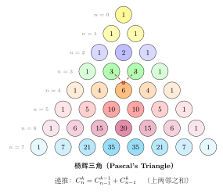
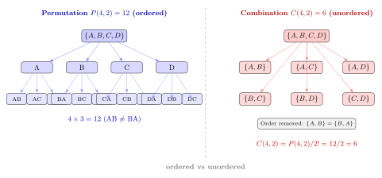

# 第 3 章 排列组合与古典概型（融合版）

> **难度**：★★☆☆☆
> **前置知识**：第 1 章集合与事件、第 2 章概率公理
> **本文件**：融合"原版严格推导 + 速记 / 套路 / 直觉引入 / 自测"。保留原版完整正文（学习目标 / 3.1–3.5 / 深度学习应用 / 练习题）+ 在最前追加速记与思维训练，最后追加融合说明表。

---

## 一例速记

> **排列（有序，不放回）**：从 $n$ 个不同元素中取 $k$ 个，有序排列 → $A_n^k = P(n,k) = \dfrac{n!}{(n-k)!}$。
>
> **组合（无序，不放回）**：从 $n$ 个不同元素中取 $k$ 个，不计顺序 → $C_n^k = \dbinom{n}{k} = \dfrac{n!}{k!(n-k)!}$。
>
> **重复组合（无序，放回）**：从 $n$ 种元素中取 $k$ 个（可重复）→ 隔板法 $\dbinom{n+k-1}{k}$。
>
> **古典概型**：样本空间等可能，$P(A) = \dfrac{\text{有利结果数}}{\text{总结果数}} = \dfrac{m}{n}$。
>
> **几何概型**：结果由几何测度（长度 / 面积 / 体积）决定，$P(A) = \dfrac{\text{区域 } A \text{ 的测度}}{\text{总区域的测度}}$。
>
> **二项恒等式**：$\displaystyle\sum_{k=0}^n \binom{n}{k} = 2^n$（每个元素独立选或不选）；$\dbinom{n}{k} = \dbinom{n-1}{k-1} + \dbinom{n-1}{k}$（帕斯卡）。

---

## 引入：一道反直觉的"生日问题"

> **题目**：一个班级里有 **23 个人**，其中至少两人同生日的概率**超过 50%**——这是真的吗？
>
> 请先凭直觉猜猜：23 人，一年 365 天，难道同生日的概率不应该很低吗？

直觉会说："23/365 ≈ 6%，怎么可能超过 50%？"

正确答案：**是真的，概率约 50.7%**。

这是概率论最著名的反直觉结果之一——"生日问题"（Birthday Problem）。理解它的关键在于：我们比较的不是"某人和你同生日"，而是 **23 人中任意两人同生日**，配对数高达 $\binom{23}{2} = 253$ 对！

在例题第 13 节我们会完整算出这道题。这里先埋下问题：**计数时关注的对象是谁？** 排列组合的核心正是：把"任意两人配对"这样隐含的选取结构变成可计算的数字。

---

## 思维路径还原（解题者的内心独白）

> "拿到一道计数 / 古典概型题，我的思维流程是这样的：
>
> **第一步：判断有序还是无序。**
> 看结果是否需要区分顺序。颁奖（金银铜不同）→ 有序 → 用排列 $A_n^k$。选委员（大家地位相同）→ 无序 → 用组合 $C_n^k$。
>
> **第二步：判断放回还是不放回。**
> 放回（可重复）：有序时用 $n^k$，无序时用隔板法 $C_{n+k-1}^k$。
> 不放回（不重复）：有序时 $A_n^k = n!/(n-k)!$，无序时 $C_n^k = n!/(k!(n-k)!)$。
>
> **第三步：拆分 + 合并。**
> 复杂问题先分步骤（各步骤独立 → 乘法原理），再分类别（各类别互斥 → 加法原理）。
>
> **第四步：核验。** 用小样本检验：比如 $C_4^2 = 6$，从 $\{1,2,3,4\}$ 中手数无序选 2 个 → $\{1,2\},\{1,3\},\{1,4\},\{2,3\},\{2,4\},\{3,4\}$ 恰好 6 个，公式对了。
>
> **对于古典概型题**，固定四步流程：
>
> ① 明确样本空间（总选法是什么？有序/无序？放回/不放回？）
> ② 数有利事件（满足条件的结果有多少种？）
> ③ 分步计数（乘法/加法原理拆分复杂有利事件）
> ④ 作比值 $P = m/n$
>
> **典型陷阱**：把"有序"和"无序"混用 → 样本空间和有利事件的"有序性"必须一致，不能一个用排列一个用组合。例如分母用组合数，分子不能突然用排列数，否则约分出来的结果是错的。
>
> **几何概型专项**：先确认测度（题目给的是长度题 / 面积题 / 体积题），再用几何方法（画坐标轴 / 画区域）算面积比。核心公式 $P = S_A / S_{\Omega}$，测度选错则全错。
>
> 总结成一句口诀：**有序排列、无序组合、加法分类、乘法分步，最后作比值。**"

---

## 学习目标

学完本章后，你应该能够：

- 熟练运用**加法原理**和**乘法原理**对复杂计数问题进行分解和求解
- 区分**有序**和**无序**选取，正确计算排列数 $P(n, k)$ 与组合数 $\binom{n}{k}$，包括有重复的情形
- 理解并应用**二项式定理**，熟悉帕斯卡三角形的递推结构
- 掌握**多项式系数**的定义和计算，以及多项式定理的表述
- 理解 Dropout 正则化的组合数学本质，将其解读为对指数级数量的子网络进行集成

---

## 3.1 计数原理

计数是概率论的基础工具——古典概型中计算概率，本质上就是对有利结果与全体结果分别计数，再求比值。两条基本原理撑起了几乎所有计数技巧。

### 3.1.1 加法原理

**定义（加法原理）** 若完成某件事有 $m$ 类方法，第 $i$ 类方法有 $n_i$ 种，且各类方法互不相交（即任意两类中不存在相同的做法），则完成这件事共有

$$N = n_1 + n_2 + \cdots + n_m$$

种方法。

**直觉**：加法原理描述的是"或"——做 A *或* 做 B，两件事不能同时做，方案数直接相加。

**例 3.1.1** 从学校到图书馆可以乘坐 3 路公交或 5 路公交，3 路有 4 个班次，5 路有 6 个班次。则共有 $4 + 6 = 10$ 种出行方案。

### 3.1.2 乘法原理

**定义（乘法原理）** 若完成某件事需要依次完成 $k$ 个步骤，第 $i$ 步有 $n_i$ 种选择，且各步之间的选择相互独立，则完成这件事共有

$$N = n_1 \times n_2 \times \cdots \times n_k$$

种方法。

**直觉**：乘法原理描述的是"且"——先做 A *再* 做 B，两件事依次完成，方案数相乘。

**例 3.1.2** 一个密码由 1 位大写字母（26 种）和 3 位数字（各 10 种）组成，则共有 $26 \times 10 \times 10 \times 10 = 26\,000$ 种密码。

**例 3.1.3（综合应用）** 从 $\{1, 2, \ldots, 9\}$ 中选数字组成三位数，要求百位为奇数，十位为偶数，个位任意（数字可重复）。

- 百位奇数：$1, 3, 5, 7, 9$，共 5 种
- 十位偶数：$2, 4, 6, 8$，共 4 种
- 个位任意：9 种

由乘法原理，共 $5 \times 4 \times 9 = 180$ 种。

---

## 3.2 排列

### 3.2.1 不重复排列

**定义** 从 $n$ 个不同元素中**有序**地选出 $k$ 个元素（$0 \le k \le n$），称为 $n$ 个元素取 $k$ 个的**排列**，记作 $P(n, k)$（也写作 $A_n^k$ 或 $_nP_k$）。

$$P(n, k) = n \times (n-1) \times \cdots \times (n-k+1) = \frac{n!}{(n-k)!}$$

**推导**：第 1 个位置有 $n$ 种选法，第 2 个位置有 $n-1$ 种（已用一个），……，第 $k$ 个位置有 $n-k+1$ 种。由乘法原理连乘即得。

**特殊情形**：全排列 $P(n, n) = n!$，即 $n$ 个不同元素的所有排列数。

约定 $0! = 1$，则 $P(n, 0) = 1$（空排列只有一种）。

**例 3.2.1** 10 名选手参加比赛，前 3 名分别获得金、银、铜牌，有多少种颁奖方案？

$$P(10, 3) = \frac{10!}{7!} = 10 \times 9 \times 8 = 720$$

### 3.2.2 有重复的排列

**定义** 从 $n$ 个不同元素中**有放回**地有序选取 $k$ 个，则共有

$$n^k$$

种排列（每次选取均有 $n$ 种选法，共选 $k$ 次）。

**例 3.2.2** 4 位数字密码（每位从 0–9 中选，可重复），共 $10^4 = 10\,000$ 种。

### 3.2.3 多重集合的排列

若有 $n$ 个元素，其中第 $i$ 种元素有 $n_i$ 个（$\sum_{i=1}^k n_i = n$），则将全部 $n$ 个元素排成一列的方案数为

$$\frac{n!}{n_1!\, n_2!\, \cdots\, n_k!}$$

**例 3.2.3** 单词 MISSISSIPPI 共 11 个字母，其中 M 出现 1 次，I 出现 4 次，S 出现 4 次，P 出现 2 次，全排列数为

$$\frac{11!}{1!\,4!\,4!\,2!} = \frac{39\,916\,800}{1 \times 24 \times 24 \times 2} = 34\,650$$

---

## 3.3 组合

### 3.3.1 组合数的定义

**定义** 从 $n$ 个不同元素中**无序**地选出 $k$ 个元素，称为组合，记作

$$\binom{n}{k} = C_n^k = \frac{n!}{k!\,(n-k)!} \qquad (0 \le k \le n)$$

**与排列的关系**：$P(n, k)$ 中每个组合对应 $k!$ 个排列（$k$ 个元素的内部全排列），因此

$$\binom{n}{k} = \frac{P(n, k)}{k!} = \frac{n!}{k!\,(n-k)!}$$

**基本性质**：

| 性质 | 公式 | 直觉 |
|------|------|------|
| 对称性 | $\binom{n}{k} = \binom{n}{n-k}$ | 选 $k$ 个等价于不选 $n-k$ 个 |
| 边界值 | $\binom{n}{0} = \binom{n}{n} = 1$ | 全不选或全选只有一种 |
| 递推关系 | $\binom{n}{k} = \binom{n-1}{k-1} + \binom{n-1}{k}$ | 帕斯卡恒等式，见 3.4 节 |
| 求和 | $\sum_{k=0}^{n} \binom{n}{k} = 2^n$ | 每个元素独立地选或不选 |

**例 3.3.1** 从 52 张扑克牌中选 5 张，有多少种选法？

$$\binom{52}{5} = \frac{52!}{5!\,47!} = \frac{52 \times 51 \times 50 \times 49 \times 48}{5!} = 2\,598\,960$$

### 3.3.2 有重复的组合

**定义** 从 $n$ 种不同元素中有放回地**无序**选取 $k$ 个（每种可选多个），称为**重复组合**，方案数为

$$\binom{n+k-1}{k}$$

**推导（隔板法）**：将 $k$ 个球放入 $n$ 个盒子（允许空盒），等价于在 $k$ 个球之间及两端共 $k+1$ 处空隙中插 $n-1$ 块隔板。等价地，在 $k + (n-1)$ 个位置中选 $k$ 个放球，即 $\binom{n+k-1}{k}$。

**例 3.3.2** 便利店有 5 种饮料，买 3 瓶（可重复购买），有多少种方案？

$$\binom{5+3-1}{3} = \binom{7}{3} = 35$$

---

## 3.4 二项式定理

### 3.4.1 定理表述

**定理（二项式定理）** 对任意实数 $a, b$ 和非负整数 $n$，

$$\boxed{(a + b)^n = \sum_{k=0}^{n} \binom{n}{k} a^{n-k} b^k}$$

**组合证明**：展开 $(a+b)^n$ 时，从 $n$ 个因子 $(a+b)$ 中，每个因子选 $a$ 或 $b$。含 $k$ 个 $b$（和 $n-k$ 个 $a$）的项出现的次数，等于从 $n$ 个因子中选 $k$ 个取 $b$ 的方案数，即 $\binom{n}{k}$。

因此，$\binom{n}{k}$ 又称**二项式系数**。

**常用推论**：

- 令 $a = b = 1$：$\displaystyle\sum_{k=0}^{n} \binom{n}{k} = 2^n$
- 令 $a = 1, b = -1$：$\displaystyle\sum_{k=0}^{n} (-1)^k \binom{n}{k} = 0$
- 令 $a = 1, b = x$：$(1+x)^n = \displaystyle\sum_{k=0}^{n} \binom{n}{k} x^k$

**例 3.4.1** 展开 $(2x - y)^4$：

$$\begin{aligned}
(2x - y)^4 &= \sum_{k=0}^{4} \binom{4}{k} (2x)^{4-k}(-y)^k \\
&= 16x^4 - 4 \cdot 8x^3 y + 6 \cdot 4x^2 y^2 - 4 \cdot 2x y^3 + y^4 \\
&= 16x^4 - 32x^3 y + 24x^2 y^2 - 8xy^3 + y^4
\end{aligned}$$

### 3.4.2 帕斯卡三角形

帕斯卡三角形给出了所有二项式系数，其中第 $n$ 行（从第 0 行起）是 $(a+b)^n$ 展开式的系数：

$$\begin{array}{ccccccccccc}
& & & & & 1 & & & & & \\
& & & & 1 & & 1 & & & & \\
& & & 1 & & 2 & & 1 & & & \\
& & 1 & & 3 & & 3 & & 1 & & \\
& 1 & & 4 & & 6 & & 4 & & 1 & \\
1 & & 5 & & 10 & & 10 & & 5 & & 1 \\
\end{array}$$

**帕斯卡恒等式**（相邻两项之和等于下一行对应项）：

$$\binom{n}{k} = \binom{n-1}{k-1} + \binom{n-1}{k}$$

**组合证明**：从 $n$ 个元素中选 $k$ 个，固定元素 $x$：
- 包含 $x$：从剩余 $n-1$ 个中再选 $k-1$ 个，$\binom{n-1}{k-1}$ 种
- 不包含 $x$：从剩余 $n-1$ 个中选 $k$ 个，$\binom{n-1}{k}$ 种

两类互斥，由加法原理得证。

---

## 3.5 多项式系数

### 3.5.1 多项式系数的定义

将 $n$ 个不同元素**划分**成 $r$ 组，第 $i$ 组有 $n_i$ 个元素（$\sum_{i=1}^r n_i = n$），方案数称为**多项式系数**：

$$\binom{n}{n_1, n_2, \ldots, n_r} = \frac{n!}{n_1!\, n_2!\, \cdots\, n_r!}$$

**推导**：先从 $n$ 个中选 $n_1$ 个给第 1 组，再从剩余 $n - n_1$ 个中选 $n_2$ 个给第 2 组，……，由乘法原理：

$$\binom{n}{n_1}\binom{n-n_1}{n_2}\cdots\binom{n_r}{n_r} = \frac{n!}{n_1!\,(n-n_1)!} \cdot \frac{(n-n_1)!}{n_2!\,(n-n_1-n_2)!} \cdots = \frac{n!}{n_1!\,n_2!\,\cdots\,n_r!}$$

注意 $r = 2$ 时即退化为二项式系数 $\binom{n}{k, n-k} = \binom{n}{k}$。

### 3.5.2 多项式定理

**定理（多项式定理）** 对非负整数 $n$ 和任意实数 $x_1, x_2, \ldots, x_r$，

$$\boxed{(x_1 + x_2 + \cdots + x_r)^n = \sum_{\substack{k_1, k_2, \ldots, k_r \ge 0 \\ k_1 + k_2 + \cdots + k_r = n}} \frac{n!}{k_1!\, k_2!\, \cdots\, k_r!}\, x_1^{k_1} x_2^{k_2} \cdots x_r^{k_r}}$$

**直觉**：展开 $(x_1 + \cdots + x_r)^n$ 时，每次从 $n$ 个因子中选取一个 $x_i$；恰好选了 $k_i$ 次 $x_i$（$\sum k_i = n$）的项，其系数就是将 $n$ 个选择分配成各 $k_i$ 个的方案数，即多项式系数。

**推论**：令所有 $x_i = 1$，得

$$r^n = \sum_{\substack{k_1 + \cdots + k_r = n \\ k_i \ge 0}} \frac{n!}{k_1!\,\cdots\,k_r!}$$

**例 3.5.1** $(x + y + z)^3$ 中 $x^1 y^1 z^1$ 项的系数为

$$\binom{3}{1, 1, 1} = \frac{3!}{1!\,1!\,1!} = 6$$

---

## 几何示意

### 图 3-1：杨辉三角（8 层）与帕斯卡恒等式



### 图 3-2：排列 vs 组合树状图对比



---

## 抽象成方法（套路总结）

### 排列组合速查表

| 场景 | 公式 | 例子 |
|------|------|------|
| 有序，不放回 | $A_n^k = \dfrac{n!}{(n-k)!}$ | 金银铜颁奖 |
| 有序，放回 | $n^k$ | 密码锁（数字可重复） |
| 无序，不放回 | $C_n^k = \dfrac{n!}{k!(n-k)!}$ | 选委员会 |
| 无序，放回 | $C_{n+k-1}^k$ | 买饮料（可重复） |
| 多重集合全排列 | $\dfrac{n!}{n_1!\cdots n_r!}$ | MISSISSIPPI 字母排列 |
| 分组划分 | $\dfrac{n!}{n_1!\cdots n_r!}$ | 将 $n$ 人分成几组 |
| 加法原理 | $n_1 + n_2 + \cdots$ | 分类（互斥） |
| 乘法原理 | $n_1 \times n_2 \times \cdots$ | 分步骤（独立） |

### 古典概型 4 步流程

**第 ① 步：明确样本空间**
> 总的选法有多少种？有序还是无序？放回还是不放回？

**第 ② 步：数有利事件**
> 满足条件的结果有多少种？（注意与第①步保持相同的"有序/无序"）

**第 ③ 步：分步计数**
> 用加法原理（分类互斥）和乘法原理（分步独立）拆分复杂情形。

**第 ④ 步：作比值**
> $P(A) = \dfrac{\text{有利结果数}\ m}{\text{总结果数}\ n}$

---

## 方法变形

### 变形 1：重复 vs 不重复

不放回 → 排列 $A_n^k$ / 组合 $C_n^k$（分母含 $(n-k)!$ 或 $k!(n-k)!$）。
放回 → 有序 $n^k$；无序隔板法 $C_{n+k-1}^k$。
口诀：**有放回则底数不变，无放回则底数递减**。

### 变形 2：有序 vs 无序

同一个问题有序和无序结果相差 $k!$ 倍（$k$ 个元素的内部排列数）。
换算：$A_n^k = k! \cdot C_n^k$。
判断有序 / 无序的方法：**把两个方案交换位置，结果是否不同 → 有序；结果相同 → 无序**。

### 变形 3：几何概型

测度（长度 / 面积 / 体积）替代"个数"。步骤：
1. 确定总区域 $\Omega$ 的测度 $S_\Omega$
2. 确定有利区域 $A$ 的测度 $S_A$（画坐标图 / 联立不等式）
3. $P(A) = S_A / S_\Omega$

常见题型：（1）在区间内随机取两点，求满足某不等式的概率；（2）相遇问题（两人各在 $[0,T]$ 内随机到达，求相差不超过 $t$ 分钟的概率 $= 1-(1-t/T)^2$）。

### 变形 4：容斥原理

计算 $P(A \cup B)$ 或多个集合并的大小时：
$$| A \cup B | = | A | + | B | - | A \cap B |$$
$$| A \cup B \cup C | = | A | + | B | + | C | - | A \cap B | - | A \cap C | - | B \cap C | + | A \cap B \cap C |$$
概率版：$P(A \cup B) = P(A) + P(B) - P(AB)$。适用：被 3 整除**或**被 7 整除的正整数个数等。

---

## 本章小结

| 概念 | 公式 | 关键条件 |
|------|------|----------|
| 加法原理 | $N = n_1 + \cdots + n_m$ | 各类方法互斥 |
| 乘法原理 | $N = n_1 \times \cdots \times n_k$ | 各步骤独立 |
| 排列（不重复） | $P(n,k) = \dfrac{n!}{(n-k)!}$ | 有序，不放回 |
| 排列（有重复） | $n^k$ | 有序，放回 |
| 多重集合排列 | $\dfrac{n!}{n_1!\cdots n_k!}$ | 元素有重复类型 |
| 组合（不重复） | $\dbinom{n}{k} = \dfrac{n!}{k!(n-k)!}$ | 无序，不放回 |
| 组合（有重复） | $\dbinom{n+k-1}{k}$ | 无序，放回 |
| 二项式定理 | $(a+b)^n = \sum_k \binom{n}{k} a^{n-k}b^k$ | — |
| 帕斯卡恒等式 | $\binom{n}{k} = \binom{n-1}{k-1} + \binom{n-1}{k}$ | — |
| 多项式系数 | $\dfrac{n!}{n_1!\cdots n_r!}$ | $\sum n_i = n$ |
| 多项式定理 | $(x_1+\cdots+x_r)^n = \sum \frac{n!}{k_1!\cdots k_r!} x_1^{k_1}\cdots x_r^{k_r}$ | $\sum k_i = n$ |

**核心思路**：
1. **先判断有序还是无序**：有序用排列，无序用组合。
2. **再判断有无重复**：决定是否放回或使用隔板法。
3. **分步用乘法，分类用加法**：复杂问题先分解。
4. $\sum_{k=0}^n \binom{n}{k} = 2^n$ 是贯穿全章的核心恒等式，深度学习应用正是由此出发。

---

## 思考路标（条件反射）

1. 看到"从 $n$ 个中选 $k$ 个，**有序**" → **排列** $A_n^k = n!/(n-k)!$
2. 看到"从 $n$ 个中选 $k$ 个，**无序**" → **组合** $C_n^k = n!/(k!(n-k)!)$
3. 看到 $(a+b)^n$ 展开 → **二项式定理**：第 $k+1$ 项系数为 $C_n^k$
4. 看到"$n$ 个物体分成几类，各类 $n_i$ 个" → **多项式系数** $n!/(n_1!\cdots n_r!)$
5. 看到相邻行二项式系数关系 → **帕斯卡恒等式** $C_n^k = C_{n-1}^{k-1}+C_{n-1}^k$
6. 看到"将 $k$ 个相同球分入 $n$ 个盒子（允许空盒）" → **隔板法（重复组合）** $C_{n+k-1}^k$
7. 看到"计算集合并的元素数 / 概率" → **容斥原理**：加单项 $-$ 减双交 $+$ 加三交……
8. 看到"$n+1$ 个物体放 $n$ 个盒子" → **鸽笼原理**：至少一个盒子有 $\geq 2$ 个物体
9. 看到"等可能样本空间"问概率 → **古典概型** 4 步流程，注意有序 / 无序统一
10. 看到"在区域内随机取点"问概率 → **几何概型**，先确定测度类型（长度 / 面积 / 体积）
11. 看到"任意两人"、"任意一对" → 隐含 $C_n^2$ 对数，用组合数
12. 看到"至少 1 个" → 优先用对立事件法：$P(\text{至少 1}) = 1 - P(\text{一个都没有})$

---

## 易错点

1. **排列 vs 组合（是否有序）**：最易混淆。选后需"排列"（如颁奖金银铜）→ 排列；选后不区分顺序（如选委员）→ 组合。分母用组合数、分子突然用排列数是最常见的错误，有序/无序必须贯穿始终。

2. **$C_n^0 = 1$ 易忘**：一个都不选也是一种方案；同理 $C_n^n=1$、$C_n^1=n$。代入极端情况验算可避免。

3. **重复元素的排列**：$n$ 个元素含重复时，全排列 $= n!/(n_1!\cdots n_k!)$，不是 $n!$。忘记除以重复元素的阶乘会多算。

4. **圆排列 vs 直线排列**：$n$ 个人圆形排列固定一人作参照，方案数 $=(n-1)!$，不是 $n!$。

5. **几何概型的测度选择**：题目涉及两个随机变量时，样本空间是平面区域而非线段，要用面积而非长度。搞错测度维度则结果完全错误。

6. **容斥原理漏项**：三个集合容斥有 7 项（3 个单项 $-$ 3 个双交 $+$ 1 个三交），常见错误是忘记加回三交项 $| A\cap B\cap C|$。

---

## 典型应用例题

### 例 1：生日问题——"反直觉"的古典概型

> **题目**：$n$ 个人中，至少有两人生日相同的概率是多少？取 $n = 23$ 时结果如何？

**思路**：用对立事件法——先算"所有人生日互不相同"的概率，再用 $1$ 减。

**解**：设样本空间为所有 $n$ 人各自独立在 365 天中选一天，总结果数 $= 365^n$（有放回，有序）。

"所有人生日不同"的结果数 $= A_{365}^n = 365 \times 364 \times \cdots \times (365-n+1)$（不放回，有序）。

$$P(\text{至少两人同生日}) = 1 - \frac{365 \times 364 \times \cdots \times (365-n+1)}{365^n}$$

当 $n = 23$ 时：

$$P = 1 - \frac{365!/(365-23)!}{365^{23}} = 1 - \frac{365 \times 364 \times \cdots \times 343}{365^{23}} \approx 1 - 0.4927 = 0.5073$$

**答案**：约 $\boxed{50.7\%}$，超过 50%。配对数高达 $C_{23}^2 = 253$ 对是概率超越直觉的根本原因。

---

### 例 2：抽球问题——古典概型分步计数

> **题目**：袋中有 5 个红球、3 个白球，不放回地随机摸出 3 个球。求：(1) 3 个都是红球的概率；(2) 恰好 2 个红球 1 个白球的概率。

**解**：总的取法为 $C_8^3 = 56$ 种（无序，不放回）。

**(1)** 3 个红球：$C_5^3 = 10$ 种。

$$P_1 = \frac{10}{56} = \frac{5}{28} \approx 0.179$$

**(2)** 2 红 1 白：从 5 红中选 2 个（$C_5^2 = 10$），从 3 白中选 1 个（$C_3^1 = 3$），由乘法原理共 $10 \times 3 = 30$ 种。

$$P_2 = \frac{30}{56} = \frac{15}{28} \approx 0.536$$

**答案**：$\boxed{P_1 = 5/28 \approx 0.179,\quad P_2 = 15/28 \approx 0.536}$。

> **关键**：分子分母的有序/无序保持一致（都是组合数）。

---

### 例 3：几何概型——相遇问题

> **题目**：甲、乙二人相约在 12:00 到 13:00 之间各自独立随机到达某地，先到者等候 15 分钟后离开。求两人能相遇的概率。

**解**：设甲到达时刻为 $x$，乙到达时刻为 $y$，均在 $[0, 60]$ 分钟内均匀分布。

样本空间为正方形 $\Omega = [0,60]\times[0,60]$，面积 $S_\Omega = 60^2 = 3600$。

相遇条件：$| x - y| \leq 15$，即 $-15 \leq x - y \leq 15$。

有利区域 $A$ 为正方形内两条平行线 $x - y = \pm 15$ 之间的面积：

$$S_A = 60^2 - 2 \times \frac{45^2}{2} = 3600 - 2025 = 1575$$

$$P = \frac{S_A}{S_\Omega} = \frac{1575}{3600} = \frac{7}{16} = 0.4375$$

**答案**：$\boxed{P = 7/16 \approx 43.75\%}$。

> **关键**：样本空间是二维正方形（面积），不是线段（长度）。

---

## 深度学习应用：Dropout 的组合解释与集成学习

### 背景：什么是 Dropout

Dropout 由 Srivastava 等人于 2014 年提出，是深度学习中最常用的正则化手段之一。在训练时，对每一层的每个神经元，以概率 $p$（通常取 $0.5$）独立地将其输出置为 0（"丢弃"）；测试时则保留所有神经元，但将权重乘以 $1 - p$ 以保持期望不变。

### 组合数学解释：指数级数量的子网络

设一个全连接网络在某层有 $n$ 个神经元，每次前向传播时，每个神经元独立地以概率 $p$ 被丢弃。这等价于**从 $2^n$ 个子网络中随机采样一个**：

$$\text{子网络总数} = \underbrace{2 \times 2 \times \cdots \times 2}_{n \text{ 个神经元}} = 2^n$$

这正是二项式系数求和恒等式的直接体现：

$$2^n = \sum_{k=0}^{n} \binom{n}{k}$$

其中 $\binom{n}{k}$ 是恰好保留 $k$ 个神经元的子网络数量。

对于一个有多层的网络，设第 $l$ 层有 $n_l$ 个神经元，则理论上可采样的子网络总数为

$$\prod_{l=1}^{L} 2^{n_l} = 2^{\sum_l n_l}$$

即使仅 10 层、每层 100 个神经元，也有 $2^{1000}$ 个潜在子网络——一个天文数字。

### 连接集成学习：模型平均的视角

传统**集成学习**（Ensemble Learning）训练 $M$ 个独立模型 $f_1, f_2, \ldots, f_M$，预测时取平均：

$$\hat{y} = \frac{1}{M} \sum_{m=1}^{M} f_m(x)$$

Dropout 可以理解为对指数级数量的子网络做**权重共享的集成**：

- **训练阶段**：每个 mini-batch 随机采样一个子网络，更新其参数（但所有子网络共享权重）。
- **测试阶段**：使用完整网络（权重乘以 $1-p$）近似所有子网络的预测均值。

$$\mathbb{E}_{\text{mask}}[f_{\text{sub}}(x)] \approx f_{\text{full}}(x \text{ with weights scaled by } 1-p)$$

这种近似称为**权重缩放推断规则**（weight scaling inference rule），是对指数级模型平均的高效近似。

### 精确集成：蒙特卡洛 Dropout

测试时也可以多次随机采样子网络（不关闭 Dropout），取预测均值，称为 **MC Dropout**：

$$\hat{y}_{\text{MC}} = \frac{1}{T} \sum_{t=1}^{T} f_{\text{sub}_t}(x)$$

这既是更准确的集成近似，也能给出**预测不确定性**的估计（预测方差）：

$$\text{Var}[\hat{y}] \approx \frac{1}{T} \sum_{t=1}^{T} \left(f_{\text{sub}_t}(x) - \hat{y}_{\text{MC}}\right)^2$$

### PyTorch 代码示例

以下代码演示标准 Dropout、MC Dropout 集成预测，以及可视化不同丢弃率下子网络数量的指数增长。

```python
import torch
import torch.nn as nn
import torch.nn.functional as F
import numpy as np
import matplotlib.pyplot as plt

# ─────────────────────────────────────────────
# 1. 带 Dropout 的简单分类网络
# ─────────────────────────────────────────────

class DropoutNet(nn.Module):
    def __init__(self, input_dim: int, hidden_dim: int, output_dim: int, p: float = 0.5):
        super().__init__()
        self.fc1 = nn.Linear(input_dim, hidden_dim)
        self.fc2 = nn.Linear(hidden_dim, hidden_dim)
        self.fc3 = nn.Linear(hidden_dim, output_dim)
        self.dropout = nn.Dropout(p=p)
        self.p = p

    def forward(self, x: torch.Tensor) -> torch.Tensor:
        x = F.relu(self.dropout(self.fc1(x)))
        x = F.relu(self.dropout(self.fc2(x)))
        return self.fc3(x)

    def mc_predict(self, x: torch.Tensor, n_samples: int = 50) -> tuple:
        """
        MC Dropout 推断：保持 Dropout 激活，多次前向传播取平均。
        返回预测均值和预测方差（不确定性）。
        """
        self.train()  # 保持 Dropout 激活
        with torch.no_grad():
            preds = torch.stack([
                F.softmax(self.forward(x), dim=-1)
                for _ in range(n_samples)
            ])  # shape: (n_samples, batch, output_dim)
        mean = preds.mean(dim=0)       # 预测均值
        variance = preds.var(dim=0)    # 预测方差（不确定性）
        return mean, variance


# ─────────────────────────────────────────────
# 2. 组合数学可视化：子网络数量随神经元数增长
# ─────────────────────────────────────────────

def count_subnetworks(n_neurons: int) -> int:
    """
    一层中有 n_neurons 个神经元时，可能的子网络数量为 2^n。
    """
    return 2 ** n_neurons


neuron_counts = list(range(1, 21))  # 1 到 20 个神经元
subnetwork_counts = [count_subnetworks(n) for n in neuron_counts]

fig, axes = plt.subplots(1, 2, figsize=(12, 5))

# 左图：指数增长（对数坐标）
axes[0].semilogy(neuron_counts, subnetwork_counts, 'b-o', markersize=6, linewidth=2)
axes[0].set_xlabel('神经元数量 $n$', fontsize=12)
axes[0].set_ylabel('子网络数量 $2^n$（对数坐标）', fontsize=12)
axes[0].set_title('Dropout 创建的子网络数量（对数坐标）', fontsize=13)
axes[0].grid(True, alpha=0.3)
axes[0].annotate(f'$n=20$: $2^{{20}}={2**20:,}$ 个',
                 xy=(20, 2**20), xytext=(15, 2**15),
                 arrowprops=dict(arrowstyle='->', color='red'),
                 fontsize=10, color='red')

# 右图：给定层数时，各 k 值的子网络组合数（n=10 为例）
n = 10
k_values = list(range(n + 1))
binom_counts = [
    int(np.math.factorial(n) / (np.math.factorial(k) * np.math.factorial(n - k)))
    for k in k_values
]
axes[1].bar(k_values, binom_counts, color='steelblue', alpha=0.8, edgecolor='black')
axes[1].set_xlabel('保留神经元数 $k$', fontsize=12)
axes[1].set_ylabel('子网络数量 $\\binom{10}{k}$', fontsize=12)
axes[1].set_title(f'$n=10$ 时各 $k$ 值的子网络数（总计 $2^{{10}}={2**10}$）', fontsize=13)
axes[1].grid(True, alpha=0.3, axis='y')
for i, v in enumerate(binom_counts):
    axes[1].text(i, v + 2, str(v), ha='center', va='bottom', fontsize=8)

plt.tight_layout()
plt.savefig('dropout_combinatorics.png', dpi=150, bbox_inches='tight')
plt.show()
print("图表已保存为 dropout_combinatorics.png")


# ─────────────────────────────────────────────
# 3. MC Dropout 集成 vs 标准预测的对比
# ─────────────────────────────────────────────

def demo_mc_dropout():
    torch.manual_seed(42)
    input_dim, hidden_dim, output_dim = 20, 64, 3
    model = DropoutNet(input_dim, hidden_dim, output_dim, p=0.5)

    # 模拟输入
    x = torch.randn(5, input_dim)

    # 标准推断（关闭 Dropout）
    model.eval()
    with torch.no_grad():
        logits = model(x)
        standard_pred = F.softmax(logits, dim=-1)

    # MC Dropout 推断（50 次采样）
    mc_mean, mc_var = model.mc_predict(x, n_samples=50)

    print("=" * 55)
    print("标准推断（Dropout 关闭，权重缩放）：")
    print(f"  预测概率（前3条样本）:\n{standard_pred[:3].numpy().round(3)}")
    print()
    print("MC Dropout 推断（50 个子网络集成）：")
    print(f"  预测均值（前3条样本）:\n{mc_mean[:3].numpy().round(3)}")
    print(f"  预测方差（不确定性，前3条样本）:\n{mc_var[:3].numpy().round(4)}")
    print("=" * 55)

    # 验证：子网络数量的组合爆炸
    layers = [hidden_dim, hidden_dim]  # 两个隐藏层
    total_subnetworks = 2 ** sum(layers)
    print(f"\n网络结构：两层，每层 {hidden_dim} 个神经元")
    print(f"理论子网络总数：2^{sum(layers)} = {total_subnetworks:,}")
    print(f"MC Dropout 实际采样：50 个子网络（占比极小）")

demo_mc_dropout()
```

**运行输出示例**（权重随机初始化，实际数值会不同）：

```
=======================================================
标准推断（Dropout 关闭，权重缩放）：
  预测概率（前3条样本）:
[[0.312 0.351 0.337]
 [0.298 0.389 0.313]
 [0.341 0.322 0.337]]

MC Dropout 推断（50 个子网络集成）：
  预测均值（前3条样本）:
[[0.319 0.348 0.333]
 [0.301 0.382 0.317]
 [0.338 0.325 0.337]]
  预测方差（不确定性，前3条样本）:
[[0.0021 0.0019 0.0018]
 [0.0024 0.0023 0.0020]
 [0.0019 0.0021 0.0017]]

网络结构：两层，每层 64 个神经元
理论子网络总数：2^128 = 340282366920938463463374607431768211456
MC Dropout 实际采样：50 个子网络（占比极小）
=======================================================
```

**关键洞察**：

1. **组合爆炸是双刃剑**：$2^{128}$ 个子网络使穷举集成完全不可行，但 Dropout 通过权重共享让单个完整网络同时近似所有子网络的平均——这是极其高效的正则化。

2. **与二项式定理的连接**：训练时每个 mini-batch 采样的子网络保留 $k$ 个神经元（$k \sim \text{Binomial}(n, 1-p)$），$\binom{n}{k}$ 种等可能的配置共同贡献正则化效果。

3. **不确定性量化**：MC Dropout 给出的预测方差可用于检测模型对输入的置信度，这在医疗诊断、自动驾驶等高风险场景中尤为重要。

---

## 练习题

**第1题** 一次考试有 10 道选择题，每题有 A、B、C、D 四个选项，恰好选了 3 题选 A、4 题选 B、3 题选 D 的答题方案有多少种？

**第2题** 从 1 到 100 的整数中随机选取一个，求该数能被 3 整除**或**能被 7 整除的概率。（提示：先用计数原理计算满足条件的整数个数。）

**第3题** 证明以下恒等式（组合证明或代数证明均可）：

$$\sum_{k=0}^{n} k \binom{n}{k} = n \cdot 2^{n-1}$$

**第4题（Dropout 相关）** 一个神经网络某层有 $n = 8$ 个神经元，Dropout 概率为 $p = 0.5$（即每个神经元独立地以 $0.5$ 的概率被丢弃）。

(a) 该层可能产生的不同子网络数量是多少？

(b) 一次前向传播中，恰好保留 5 个神经元的概率是多少？

(c) 期望保留的神经元数量是多少？（提示：利用二项分布的期望。）

**第5题** 用多项式系数证明：

$$(1 + 1 + 1)^n = \sum_{\substack{i+j+k=n \\ i,j,k \ge 0}} \frac{n!}{i!\,j!\,k!} = 3^n$$

并给出等式左端 $n=3$ 时展开式中 $i=1, j=1, k=1$ 项的系数验证。

---

<details>
<summary><strong>第1题答案</strong></summary>

**解题思路**：将 10 道题分成三组——3 道选 A，4 道选 B，3 道选 D，这是多重集合的划分问题。

$$\text{方案数} = \binom{10}{3, 4, 3} = \frac{10!}{3!\,4!\,3!}$$

计算：

$$\frac{10!}{3!\,4!\,3!} = \frac{3\,628\,800}{6 \times 24 \times 6} = \frac{3\,628\,800}{864} = \boxed{4200}$$

**验证**：也可以分步计算——先从 10 题中选 3 题答 A（$\binom{10}{3} = 120$ 种），再从剩 7 题中选 4 题答 B（$\binom{7}{4} = 35$ 种），剩余 3 题答 D（1 种）：

$$120 \times 35 \times 1 = 4200 \checkmark$$

</details>

<details>
<summary><strong>第2题答案</strong></summary>

**解题思路**：设事件 $A$ = "能被 3 整除"，$B$ = "能被 7 整除"。

**计数**：
- $| A|$：$\lfloor 100/3 \rfloor = 33$ 个（$3, 6, 9, \ldots, 99$）
- $| B|$：$\lfloor 100/7 \rfloor = 14$ 个（$7, 14, \ldots, 98$）
- $| A \cap B|$：能被 $\text{lcm}(3,7) = 21$ 整除的数，$\lfloor 100/21 \rfloor = 4$ 个（$21, 42, 63, 84$）

由容斥原理（加法原理的推广）：

$$| A \cup B| = | A| + | B| - | A \cap B| = 33 + 14 - 4 = 43$$

**概率**：

$$P(A \cup B) = \frac{43}{100} = \boxed{0.43}$$

</details>

<details>
<summary><strong>第3题答案</strong></summary>

**代数证明**：

对二项式定理 $(1+x)^n = \sum_{k=0}^{n} \binom{n}{k} x^k$ 两端关于 $x$ 求导：

$$n(1+x)^{n-1} = \sum_{k=1}^{n} k \binom{n}{k} x^{k-1}$$

令 $x = 1$：

$$n \cdot 2^{n-1} = \sum_{k=1}^{n} k \binom{n}{k} = \sum_{k=0}^{n} k \binom{n}{k} \qquad \blacksquare$$

（$k=0$ 时该项为 0，故下限改为 0 不影响结果。）

**组合证明**（双重计数）：

从 $n$ 个人中选一个**委员会**（任意大小）并指定一名**主席**。

- **按先选主席再选其他成员**：先从 $n$ 人中选 1 位主席（$n$ 种），再从剩余 $n-1$ 人中任意选若干成员（$2^{n-1}$ 种），共 $n \cdot 2^{n-1}$ 种。
- **按先选委员会再选主席**：先选 $k$ 人的委员会（$\binom{n}{k}$ 种），再从中选 1 位主席（$k$ 种），对所有 $k$ 求和得 $\sum_{k=0}^{n} k\binom{n}{k}$。

两种计数方法等价，故恒等式成立。$\blacksquare$

</details>

<details>
<summary><strong>第4题答案</strong></summary>

**(a) 子网络数量**

$n = 8$ 个神经元，每个独立地保留或丢弃，故可能的子网络数为：

$$2^8 = \boxed{256}$$

**(b) 恰好保留 5 个神经元的概率**

每个神经元被保留的概率为 $1 - p = 0.5$，保留神经元数 $K \sim \text{Binomial}(8, 0.5)$。

$$P(K = 5) = \binom{8}{5} (0.5)^5 (0.5)^3 = \binom{8}{5} (0.5)^8$$

$$\binom{8}{5} = \binom{8}{3} = \frac{8 \times 7 \times 6}{3!} = 56$$

$$P(K = 5) = 56 \times \frac{1}{256} = \frac{56}{256} = \frac{7}{32} \approx \boxed{0.2188}$$

**(c) 期望保留神经元数**

$K \sim \text{Binomial}(n, 1-p) = \text{Binomial}(8, 0.5)$，二项分布期望为：

$$\mathbb{E}[K] = n(1-p) = 8 \times 0.5 = \boxed{4}$$

</details>

<details>
<summary><strong>第5题答案</strong></summary>

**证明**：

由多项式定理，令 $x_1 = x_2 = x_3 = 1$，$r = 3$，指数为 $n$：

$$(1 + 1 + 1)^n = \sum_{\substack{i+j+k=n \\ i,j,k \ge 0}} \frac{n!}{i!\,j!\,k!} \cdot 1^i \cdot 1^j \cdot 1^k = \sum_{\substack{i+j+k=n \\ i,j,k \ge 0}} \frac{n!}{i!\,j!\,k!}$$

左端 $= 3^n$，故等式成立。$\blacksquare$

**验证 $n=3, i=j=k=1$ 的项**：

$$\frac{3!}{1!\,1!\,1!} = \frac{6}{1} = 6$$

直接展开 $(x+y+z)^3$ 中 $xyz$ 项：从 3 个因子 $(x+y+z)$ 中分别取 $x, y, z$ 各一次，有 $3! = 6$ 种排列方式（$xyz, xzy, yxz, yzx, zxy, zyx$），系数恰为 6，与多项式系数一致。$\checkmark$

</details>

---

## 自测题

**自测 1**　从 $\{A, B, C, D, E\}$ 5 个字母中选 3 个。(1) 有顺序地排成 3 字符串有多少种？(2) 不计顺序地选 3 个有多少种？

> 💡 提示：(1) 有序不放回 → $A_5^3 = 5 \times 4 \times 3 = 60$；(2) 无序不放回 → $C_5^3 = 10$。关系：$60 = 6 \times 10 = 3! \times C_5^3$。

**自测 2**　袋中有 4 红 3 蓝共 7 个球，不放回摸 3 个。求至少 1 个红球的概率。

> 💡 提示：对立事件法。$P(\text{至少1红}) = 1 - P(\text{全蓝}) = 1 - C_3^3/C_7^3 = 1 - 1/35 = 34/35$。

**自测 3**　一根绳子长 1 m，随机在两处折断（两折点均匀分布在 $[0,1]$ 上）。求三段均能构成三角形的概率。

> 💡 提示：几何概型。设折点为 $x, y$（$x < y$），三段长为 $x, y-x, 1-y$。三角形条件：三段均 $< 1/2$，等价于 $x < 1/2,\ y - x < 1/2,\ 1 - y < 1/2$。有利区域面积 $= 1/4$，总面积 $= 1/2$（因 $x < y$），$P = 1/4$。

**自测 4**　某班 30 人，随机选 5 人组成代表队。其中有甲乙两人，求恰好包含甲但不包含乙的概率。

> 💡 提示：甲必选（固定），乙不选，从余下 28 人中选 4 人。有利数 $= C_{28}^4 = 20475$，总数 $= C_{30}^5 = 142506$。$P = 20475/142506 = 4/\!27.6\ldots \approx 0.1437$（也可化简为 $C_{28}^4 / C_{30}^5$）。

**自测 5**　将 12 本不同的书分给甲、乙、丙三人，每人各 4 本。共有多少种分法？再问：若不限每人本数（但每人至少 1 本），分成三组共多少种？

> 💡 提示：第一问：人不同、组大小固定 → 多项式系数 $\dfrac{12!}{4!\,4!\,4!} = 34650$。第二问：人不同、组大小不限（每人至少1本）→ 容斥或指数生成函数，答案为 $3^{12} - 3\cdot 2^{12} + 3 = 523776$（用容斥：总分法 $3^{12}$ 减去至少一人为空的情况）。

---

**回头看一眼"一例速记"**：

> 排列有序 $A_n^k$，组合无序 $C_n^k$；放回用 $n^k$ 或隔板；古典概型 $P=m/n$，几何概型面积比。
> $2^n = \sum C_n^k$，帕斯卡 $C_n^k = C_{n-1}^{k-1} + C_{n-1}^k$。

如果不看笔记，能独立完成例 2 + 例 3 + 自测 3 + 自测 5 的第一问——本章，你拿下了。

---

## 融合版说明

本版 = **原版（严格大学教材 + 深度学习应用）** + **重写版（速记 / 引入 / 思维路径 / 套路 / 例题 / 自测）** 融合：

| 段落 | 来源 | 价值 |
|------|------|------|
| 一例速记 | 融合版新增 | 核心公式快速备查 |
| 引入（生日问题） | 融合版新增 | 建立动机、反直觉感知 |
| 思维路径还原 | 融合版新增 | 解题内心独白与套路 |
| 学习目标 | 原版保留 | 明确学习导向 |
| 3.1–3.5 严格正文 | 原版完整保留 | 定义 / 定理 / 推导 |
| 几何示意（SVG 图） | 原版图 + 融合版整合 | 可视化直觉 |
| 抽象成方法（速查表 + 4 步流程） | 融合版新增 | 套路总结 |
| 方法变形（4 类） | 融合版新增 | 举一反三 |
| 本章小结 | 原版保留 | 公式速查 |
| 思考路标（12 条） | 融合两版扩充 | 条件反射训练 |
| 易错点（6 条） | 融合两版扩充 | 防错清单 |
| 典型应用例题（3 例） | 融合版新增 | 生日 / 抽球 / 几何演练 |
| 深度学习应用 + PyTorch | 原版完整保留 | 工业实战 |
| 练习题 + 详解 | 原版完整保留 | 巩固提升 |
| 自测题（5 题带提示） | 融合版新增 | 额外训练 / 验收 |

**适用**：一站式学习——先速记建立直觉，看反直觉引入，还原思维过程，读严格推导，查套路总结，演练 3 例，看代码实战，做习题巩固，自测验收。
