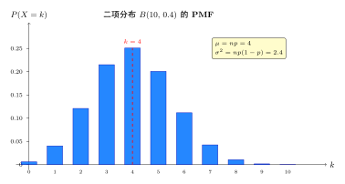
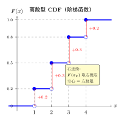
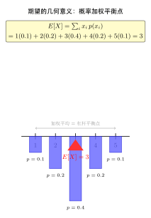

# 第 4 章 离散随机变量（融合版）

> **难度**：★★☆☆☆
> **前置知识**：第 1–3 章概率基础
> **本文件**：融合"原版严格推导 + 速记 / 套路 / 反直觉动机 / 自测"。保留原版完整正文（学习目标 / 4.1–4.6 / 深度学习应用 / 练习题）+ 在最前置 + 最后追加思维训练。

> **一例速记**：
> **PMF**：$p(x) = P(X = x) \geq 0$，$\sum_i p(x_i) = 1$（归一化是首要验证步骤）。
> **CDF**：$F(x) = \sum_{x_i \leq x} p(x_i)$，**阶梯函数**，右连续，跳跃高度 = PMF 值。
> **期望**：$E[X] = \sum_i x_i p(x_i)$（加权平均 / 杠杆平衡点）。
> **方差**：$\text{Var}(X) = E[X^2] - (E[X])^2 = \sum_i (x_i - EX)^2 p(x_i)$（优先用前者计算）。
> **常见分布速记**：伯努利 $B(p)$：$EX = p$，$\text{Var} = p(1-p)$；二项 $B(n,p)$：$EX = np$，$\text{Var} = np(1-p)$；几何 $G(p)$（首次成功）：$EX = 1/p$，$\text{Var} = (1-p)/p^2$；泊松 $\text{Poi}(\lambda)$：$EX = \lambda$，$\text{Var} = \lambda$。

---

## 引入：一道反直觉的"期望无穷"题（圣彼得堡悖论）

> **题目（圣彼得堡悖论）**：
> 掷一枚公平硬币，首次出现正面时游戏结束。若第 $k$ 次首次出现正面，你获得 $2^k$ 元。
> 请问：你愿意花多少钱参与这个游戏？

请先停下来想一想：**这个游戏的期望收益是多少？**

直觉答案：几元？十几元？毕竟大多数情况下几次就结束了。

用期望公式算一算：

$$E[\text{收益}] = \sum_{k=1}^{\infty} 2^k \cdot P(\text{第 } k \text{ 次首次正面}) = \sum_{k=1}^{\infty} 2^k \cdot \frac{1}{2^k} = \sum_{k=1}^{\infty} 1 = +\infty$$

**期望是无穷大**——理论上你应该愿意花任意多的钱参与！但实际上没有人愿意花超过几十元。这就是**圣彼得堡悖论**，揭示了三个深刻问题：

1. **期望不是决策的唯一依据**：人们的风险偏好、边际效用递减导致与数学期望的偏离。
2. **无限级数收敛与否决定期望是否有意义**：本例每项等于 1，级数发散。
3. **离散随机变量的取值可以是可数无穷多个**：$k \in \{1, 2, 3, \ldots\}$，这正是"可数无穷"。

这道题还与**几何分布**直接相关：第 $k$ 次首次正面的概率 $P(X = k) = (1-p)^{k-1}p$（这里 $p=1/2$），其期望为 $1/p = 2$——但支付函数 $2^k$ 增长太快，把期望"拉爆"了。

---

## 思维路径还原（解题者的内心独白）

> "看到圣彼得堡游戏，关键是识别分布结构。
>
> **第一步：识别随机变量 $X$ 的分布**。$X$ = 首次正面时的投掷次数，$P(X = k) = (1/2)^k$，$k = 1, 2, 3, \ldots$ 这是**几何分布**，$p = 1/2$。
>
> **第二步：写出收益函数**。收益 $Y = 2^X$，所以要算 $E[2^X]$。直接用 LOTUS（无意识统计学家定理）：
> $$E[Y] = \sum_{k=1}^{\infty} 2^k \cdot P(X = k) = \sum_{k=1}^{\infty} 2^k \cdot \frac{1}{2^k} = \sum_{k=1}^{\infty} 1$$
>
> **第三步：判断级数收敛性**。每一项都是 1，级数发散 → $E[Y] = +\infty$。
>
> **关键反思**：期望无穷≠不可能，只是加权平均不存在有限值。这告诉我们：
> - 期望存在要求级数（离散）或积分（连续）绝对收敛
> - $E[g(X)] = \sum g(x_i) p(x_i)$ 中，若 $g$ 增长太快，期望可发散
> - **不要**用 $g(E[X])$ 替代 $E[g(X)]$——这里 $g(E[X]) = 2^{E[X]} = 2^2 = 4$，而实际是 $+\infty$
>
> **延伸**：如果把收益改成 $\min(2^k, M)$（截断版），期望变为 $\sum_{k=1}^{\log_2 M} 1 + M \cdot P(X > \log_2 M)$，随 $M$ 缓慢增长（约 $\log_2 M$）。这解释了为什么实际愿意支付的金额远小于理论期望——人们隐式地对极端场景打了折扣。"

---

## 学习目标

- 理解随机变量的概念及其作为样本空间到实数映射的本质
- 掌握离散随机变量的概率质量函数（PMF）和累积分布函数（CDF）
- 熟练计算离散随机变量的期望和方差
- 理解期望和方差的基本性质
- 建立离散随机变量与深度学习分类任务的联系

---

## 4.1 随机变量的概念

### 定义

**随机变量**（Random Variable）是定义在样本空间 $\Omega$ 上的实值函数：

$$X: \Omega \to \mathbb{R}$$

它将每个样本点 $\omega \in \Omega$ 映射到一个实数 $X(\omega)$。

### 直观理解

随机变量是对随机试验结果的数值化描述。例如：

| 随机试验 | 样本空间 $\Omega$ | 随机变量 $X$ |
\vert----------\vert-------------------\vert--------------\vert
| 掷一枚硬币 | $\{正面, 反面\}$ | 正面记1，反面记0 |
| 掷两枚骰子 | $\{(i,j): 1 \leq i,j \leq 6\}$ | $X = i + j$（点数之和） |
| 射击比赛 | 各种命中情况 | 命中环数 |

### 随机变量的分类

- **离散随机变量**：取值为有限个或可数无穷个
- **连续随机变量**：取值为某个区间内的任意实数

本章聚焦于离散随机变量。

---

## 4.2 离散随机变量与概率质量函数

### 定义

设 $X$ 是离散随机变量，其可能取值为 $x_1, x_2, x_3, \ldots$，则 $X$ 的**概率质量函数**（Probability Mass Function, PMF）定义为：

$$p(x) = P(X = x), \quad x \in \{x_1, x_2, \ldots\}$$

### PMF的性质

1. **非负性**：$p(x) \geq 0$ 对所有 $x$ 成立
2. **归一化**：$\sum_{i} p(x_i) = 1$
3. **概率计算**：$P(X \in A) = \sum_{x_i \in A} p(x_i)$

### 例4.1：掷骰子

掷一枚均匀骰子，$X$ 表示出现的点数。

$$p(x) = \frac{1}{6}, \quad x \in \{1, 2, 3, 4, 5, 6\}$$

验证归一化：$\sum_{x=1}^{6} p(x) = 6 \times \frac{1}{6} = 1$ ✓

### 例4.2：二项分布预览

掷 $n$ 次硬币，$X$ 表示正面出现的次数，正面概率为 $p$：

$$p(k) = \binom{n}{k} p^k (1-p)^{n-k}, \quad k = 0, 1, \ldots, n$$

---

## 4.3 累积分布函数

### 定义

随机变量 $X$ 的**累积分布函数**（Cumulative Distribution Function, CDF）定义为：

$$F(x) = P(X \leq x) = \sum_{x_i \leq x} p(x_i)$$

### CDF的性质

1. **单调不减**：若 $x_1 < x_2$，则 $F(x_1) \leq F(x_2)$
2. **右连续**：$\lim_{x \to a^+} F(x) = F(a)$
3. **边界条件**：$\lim_{x \to -\infty} F(x) = 0$，$\lim_{x \to +\infty} F(x) = 1$

### 离散CDF的特点

对于离散随机变量，CDF是**阶梯函数**，在每个可能取值处有跳跃。

### CDF与PMF的关系

$$p(x_i) = F(x_i) - F(x_{i-1}) = P(X \leq x_i) - P(X < x_i)$$

### 例4.3：计算概率

设 $X$ 的PMF为：$p(1) = 0.2, p(2) = 0.3, p(3) = 0.3, p(4) = 0.2$

CDF为：
- $F(1) = 0.2$
- $F(2) = 0.5$
- $F(3) = 0.8$
- $F(4) = 1.0$

$P(2 \leq X \leq 3) = F(3) - F(1) = 0.8 - 0.2 = 0.6$

---

## 4.4 期望

### 定义

离散随机变量 $X$ 的**期望**（Expectation）或**均值**定义为：

$$E[X] = \sum_{i} x_i \cdot p(x_i)$$

期望是随机变量取值的加权平均，权重为对应的概率。

### 函数的期望

若 $g(X)$ 是 $X$ 的函数，则：

$$E[g(X)] = \sum_{i} g(x_i) \cdot p(x_i)$$

### 期望的性质

设 $a, b$ 为常数，$X, Y$ 为随机变量：

1. **常数的期望**：$E[a] = a$
2. **线性性**：$E[aX + b] = aE[X] + b$
3. **可加性**：$E[X + Y] = E[X] + E[Y]$（总是成立！）
4. **独立变量的乘积**：若 $X, Y$ 独立，则 $E[XY] = E[X]E[Y]$

### 例4.4：骰子期望

$$E[X] = \sum_{x=1}^{6} x \cdot \frac{1}{6} = \frac{1+2+3+4+5+6}{6} = \frac{21}{6} = 3.5$$

### 例4.5：二项分布期望

设 $X \sim \text{Binomial}(n, p)$，可以证明：

$$E[X] = np$$

**证明思路**：将 $X$ 写成 $n$ 个独立伯努利变量的和，利用期望的可加性。

---

## 4.5 方差与标准差

### 方差的定义

随机变量 $X$ 的**方差**（Variance）定义为：

$$\text{Var}(X) = E[(X - \mu)^2]$$

其中 $\mu = E[X]$ 是期望。方差度量随机变量偏离均值的程度。

### 方差的计算公式

$$\text{Var}(X) = E[X^2] - (E[X])^2$$

**证明**：
$$\text{Var}(X) = E[(X-\mu)^2] = E[X^2 - 2\mu X + \mu^2] = E[X^2] - 2\mu E[X] + \mu^2 = E[X^2] - \mu^2$$

### 标准差

**标准差**（Standard Deviation）是方差的平方根：

$$\sigma = \sqrt{\text{Var}(X)}$$

标准差与随机变量具有相同的量纲，更便于解释。

### 方差的性质

1. **非负性**：$\text{Var}(X) \geq 0$
2. **常数的方差**：$\text{Var}(a) = 0$
3. **线性变换**：$\text{Var}(aX + b) = a^2 \text{Var}(X)$
4. **独立变量的和**：若 $X, Y$ 独立，则 $\text{Var}(X + Y) = \text{Var}(X) + \text{Var}(Y)$

### 例4.6：骰子方差

$E[X^2] = \sum_{x=1}^{6} x^2 \cdot \frac{1}{6} = \frac{1+4+9+16+25+36}{6} = \frac{91}{6}$

$\text{Var}(X) = \frac{91}{6} - \left(\frac{7}{2}\right)^2 = \frac{91}{6} - \frac{49}{4} = \frac{182 - 147}{12} = \frac{35}{12} \approx 2.92$

$\sigma = \sqrt{\frac{35}{12}} \approx 1.71$

---

## 4.6 矩母函数与特征函数

### 矩母函数（Moment Generating Function）

**定义** 随机变量 $X$ 的**矩母函数**（MGF）定义为：

$$M_X(t) = E[e^{tX}] = \sum_i e^{tx_i} p(x_i)$$

其中 $t$ 是实数参数，要求 $E[e^{tX}]$ 在包含 $0$ 的某个开区间内有限。

**名称由来**：MGF 之所以叫"矩母函数"，是因为对 $M_X(t)$ 求 $n$ 阶导数并令 $t=0$，恰好得到 $X$ 的 $n$ 阶矩：

$$M_X^{(n)}(0) = E[X^n]$$

**推导**：将 $e^{tX}$ 展开为幂级数 $e^{tX} = \sum_{n=0}^{\infty} \frac{(tX)^n}{n!}$，求期望后得 $M_X(t) = \sum_{n=0}^{\infty} \frac{E[X^n]}{n!} t^n$，对 $t$ 求 $n$ 次导后令 $t=0$ 即得。

### MGF 的核心性质

1. **唯一性**：若 $M_X(t) = M_Y(t)$ 在某开区间 $(-h, h)$ 上成立，则 $X$ 与 $Y$ 同分布
2. **独立变量的 MGF**：若 $X, Y$ 独立，则 $M_{X+Y}(t) = M_X(t) \cdot M_Y(t)$
3. **线性变换**：$M_{aX+b}(t) = e^{bt} M_X(at)$

### 例4.7：伯努利分布的 MGF

设 $X \sim \text{Bernoulli}(p)$，则：

$$M_X(t) = E[e^{tX}] = e^{t \cdot 0}(1-p) + e^{t \cdot 1} p = (1-p) + pe^t$$

验证：$M_X'(t) = pe^t$，$M_X'(0) = p = E[X]$ ✓

$M_X''(t) = pe^t$，$M_X''(0) = p = E[X^2]$，$\text{Var}(X) = p - p^2 = p(1-p)$ ✓

### 例4.8：泊松分布的 MGF

设 $X \sim \text{Poisson}(\lambda)$，则：

$$M_X(t) = \sum_{k=0}^{\infty} e^{tk} \frac{\lambda^k e^{-\lambda}}{k!} = e^{-\lambda} \sum_{k=0}^{\infty} \frac{(\lambda e^t)^k}{k!} = e^{-\lambda} \cdot e^{\lambda e^t} = e^{\lambda(e^t - 1)}$$

验证：$M_X'(t) = \lambda e^t \cdot e^{\lambda(e^t-1)}$，$M_X'(0) = \lambda = E[X]$ ✓

### 特征函数简介

当 MGF 不存在时（如柯西分布），可以使用**特征函数**（Characteristic Function）：

$$\varphi_X(t) = E[e^{itX}]$$

其中 $i = \sqrt{-1}$。特征函数**对任何分布都存在**（因为 $|e^{itX}| = 1$），且同样具有唯一确定分布的性质。特征函数将在极限定理（第10-11章）中发挥关键作用。

---

## 几何示意

### 图 4-1：二项分布 PMF（$B(10, 0.4)$ 柱状图）



### 图 4-2：离散 CDF（阶梯函数）



### 图 4-3：期望几何意义（加权平均 = 平衡点）



---

## 抽象成方法（套路总结）

### 5 大核心公式速查

| 名称 | 公式 | 关键性质 |
\vert---\vert---\vert---\vert
| **PMF** | $p(x) \geq 0$，$\sum_i p(x_i) = 1$ | 先验证归一化 |
| **CDF** | $F(x) = \sum_{x_i \leq x} p(x_i)$ | 阶梯函数，右连续 |
| **区间概率** | $P(a < X \leq b) = F(b) - F(a)$ | 离散型需注意端点 |
| **期望** | $E[X] = \sum_i x_i p(x_i)$ | 线性 $E(aX+b) = aE(X)+b$ |
| **方差** | $\text{Var}(X) = E[X^2] - (E[X])^2$ | $\text{Var}(aX+b) = a^2\text{Var}(X)$ |

### 求期望与方差 3 步流程

1. **列 PMF 表格**：写出所有可能取值 $x_i$ 及对应概率 $p(x_i)$，验证 $\sum p_i = 1$
2. **算 $E[X]$ 和 $E[X^2]$**：$E[X] = \sum x_i p_i$，$E[X^2] = \sum x_i^2 p_i$
3. **套公式**：$\text{Var}(X) = E[X^2] - (E[X])^2$，$\sigma = \sqrt{\text{Var}(X)}$

### 常见分布参数速查

| 分布 | PMF $p(k)$ | $E[X]$ | $\text{Var}(X)$ |
\vert---\vert---\vert---\vert---\vert
| 伯努利 $B(p)$ | $p^k(1-p)^{1-k}$，$k\in\{0,1\}$ | $p$ | $p(1-p)$ |
| 二项 $B(n,p)$ | $\binom{n}{k}p^k(1-p)^{n-k}$ | $np$ | $np(1-p)$ |
| 几何 $G(p)$ | $(1-p)^{k-1}p$，$k=1,2,\ldots$ | $1/p$ | $(1-p)/p^2$ |
| 泊松 $\text{Poi}(\lambda)$ | $e^{-\lambda}\lambda^k/k!$，$k=0,1,\ldots$ | $\lambda$ | $\lambda$ |

---

## 方法变形

### 变形 1：PMF 分段定义

PMF 可按区间分段定义（如 $p(k) = ck$ 对 $k=1,\ldots,n$，其他为 0）。**求和时逐段处理**，不要漏掉任何取值。

### 变形 2：含参数 PMF 求归一化常数

用 $\sum_i p(x_i) = 1$ 解出未知常数。例：$p(k) = c/k!$ 对 $k = 0,1,2,\ldots$ → $c \cdot e = 1$ → $c = e^{-1}$，这正是泊松分布 $\lambda=1$ 的形式。

### 变形 3：$E(g(X))$ 用 LOTUS

不必先求 $g(X)$ 的分布，直接 $E[g(X)] = \sum_i g(x_i) p(x_i)$。**注意 $E[g(X)] \neq g(E[X])$**（除非 $g$ 是线性函数）。经典错误：$E[X^2] \neq (E[X])^2$，差值恰好是 $\text{Var}(X)$。

### 变形 4：矩母函数（生成函数）法

对于验证分布或求高阶矩，用 MGF：$M_X(t) = E[e^{tX}]$，$M_X^{(n)}(0) = E[X^n]$。独立变量之和的 MGF = 各 MGF 之积，可快速得到和分布。

---

## 本章小结

| 概念 | 定义/公式 |
\vert------\vert-----------\vert
| 随机变量 | $X: \Omega \to \mathbb{R}$ |
| PMF | $p(x) = P(X = x)$ |
| CDF | $F(x) = P(X \leq x)$ |
| 期望 | $E[X] = \sum_i x_i p(x_i)$ |
| 方差 | $\text{Var}(X) = E[X^2] - (E[X])^2$ |
| 标准差 | $\sigma = \sqrt{\text{Var}(X)}$ |
| 矩母函数 | $M_X(t) = E[e^{tX}]$，$M_X^{(n)}(0) = E[X^n]$ |

**核心要点**：
- 随机变量将随机试验的结果数值化
- PMF描述离散随机变量的完整概率分布
- 期望是概率加权平均，具有线性性
- 方差度量分布的离散程度
- 矩母函数是求矩、证明分布唯一性和研究独立变量之和的强力工具

---

## 思考路标（条件反射）

1. 看到 PMF $p(x)$ → 首先验证 $\sum_i p(x_i) = 1$（归一化），$p(x) \geq 0$（非负）
2. 看到 CDF 离散随机变量 → **阶梯函数**：右连续，在每个取值处跳跃，跳跃高度 = PMF
3. 看到"求期望" → **加权平均**：$E[X] = \sum_i x_i p(x_i)$，几何意义是杠杆平衡点
4. 看到"求方差" → 优先用 **$E(X^2) - (EX)^2$**：$\text{Var}(X) = E[X^2] - (E[X])^2$
5. 看到"求标准差" → $\sigma = \sqrt{\text{Var}(X)}$（与 $X$ 同量纲）
6. 看到"$n$ 阶矩" → $E[X^n]$，矩母函数 $M_X^{(n)}(0) = E[X^n]$
7. 看到"线性变换 $aX+b$" → $E(aX+b) = aE(X)+b$；$\text{Var}(aX+b) = a^2 \text{Var}(X)$（$b$ 消失！）
8. 看到"$Y = g(X)$ 求期望" → 直接用 $E[g(X)] = \sum_i g(x_i) p(x_i)$，**不要先求 $g(E[X])$**
9. 看到"二项分布 $B(n,p)$" → $EX = np$，$\text{Var} = np(1-p)$；可分解为 $n$ 个独立伯努利之和
10. 看到"泊松分布 $\text{Poi}(\lambda)$" → $EX = \text{Var}(X) = \lambda$，MGF $= e^{\lambda(e^t-1)}$
11. 看到"几何分布"（首次成功）→ $EX = 1/p$，具有**无记忆性**：$P(X > m+n \mid X > m) = P(X > n)$
12. 看到"独立变量的和" → 期望可加（始终），方差可加（独立时），MGF 相乘（独立时）

---

## 易错点

1. **PMF 求和必为 1**（验证步骤不可省）：拿到 PMF 先算 $\sum p_i$；含参数时解方程确定参数值。
2. **CDF 是右连续阶梯函数**：$F(x)$ 在跳跃点 $x_k$ 处的值是 $F(x_k)$（取右极限），$F(x_k^-) = F(x_k) - p(x_k)$；离散型"$\leq$"与"$<$"不等价——$P(X < k) = F(k^-) \neq F(k)$。
3. **方差非负，两公式等价**：$E(X-\mu)^2 \geq 0$；用 $E[X^2]-(EX)^2$ 计算时若结果为负则必有计算错误。
4. **线性变换方差中平方系数**：$\text{Var}(aX+b) = a^2\text{Var}(X)$，平移 $b$ 不改变离散程度，系数 $a$ 要平方。
5. **$E[g(X)] \neq g(E[X])$（一般情况）**：Jensen 不等式仅在 $g$ 为线性时取等；常见误用：$E[X^2] \neq (E[X])^2$，$E[1/X] \neq 1/E[X]$。
6. **几何分布 vs 负二项分布**：几何分布是"首次成功所需试验次数"，负二项分布是"第 $r$ 次成功所需试验次数"；两者的参数化方式（从 0 还是从 1 计数）在不同教材中可能不同，使用前务必确认定义。
7. **泊松近似的条件**：二项分布 $B(n,p)$ 在 $n$ 大、$p$ 小、$\lambda = np$ 适中时近似为 $\text{Poi}(\lambda)$——粗略标准是 $n \geq 20, p \leq 0.05$；$p$ 接近 1 时不适用泊松近似。

---

## 典型应用例题

### 例 1：PMF 归一化 + 算期望方差

> **题目**：设离散随机变量 $X$ 的 PMF 为 $p(k) = c \cdot k$，$k = 1, 2, 3, 4$，其他取值概率为 0。
> (1) 求常数 $c$；(2) 计算 $E[X]$ 和 $\text{Var}(X)$；(3) 求 $P(X \geq 3)$。

【思路】先用归一化求 $c$，再套 3 步流程。

【解】

**(1)** 由归一化条件：
$$\sum_{k=1}^{4} c \cdot k = c(1+2+3+4) = 10c = 1 \implies c = \frac{1}{10}$$

**(2)** 期望：
$$E[X] = \sum_{k=1}^{4} k \cdot \frac{k}{10} = \frac{1}{10}(1+4+9+16) = \frac{30}{10} = 3$$

$E[X^2] = \sum_{k=1}^{4} k^2 \cdot \frac{k}{10} = \frac{1}{10}(1+8+27+64) = \frac{100}{10} = 10$

$$\text{Var}(X) = E[X^2] - (E[X])^2 = 10 - 9 = 1$$

**(3)** $P(X \geq 3) = p(3) + p(4) = \frac{3}{10} + \frac{4}{10} = \frac{7}{10} = 0.7$

【答案】$\boxed{c = 1/10,\ E[X] = 3,\ \text{Var}(X) = 1,\ P(X \geq 3) = 0.7}$

---

### 例 2：二项分布概率计算

> **题目**：某产品次品率为 0.1。质检员随机抽取 10 件产品，$X$ 为次品数。
> (1) $X$ 服从什么分布？写出 PMF；
> (2) 计算恰好有 2 件次品的概率；
> (3) 计算次品数不超过 1 件的概率；
> (4) 求 $E[X]$ 和 $\text{Var}(X)$。

【思路】识别为二项分布 $B(10, 0.1)$，套公式。

【解】

**(1)** $X \sim B(10, 0.1)$，PMF：
$$p(k) = \binom{10}{k}(0.1)^k(0.9)^{10-k}, \quad k = 0, 1, \ldots, 10$$

**(2)** $P(X = 2) = \binom{10}{2}(0.1)^2(0.9)^8 = 45 \times 0.01 \times 0.4305 \approx 0.1937$

**(3)** $P(X \leq 1) = P(X=0) + P(X=1)$
$$= (0.9)^{10} + 10 \times 0.1 \times (0.9)^9 \approx 0.3487 + 0.3874 = 0.7361$$

**(4)** $E[X] = np = 10 \times 0.1 = 1$，$\text{Var}(X) = np(1-p) = 10 \times 0.1 \times 0.9 = 0.9$

【答案】$\boxed{P(X=2) \approx 0.194,\ P(X \leq 1) \approx 0.736,\ E[X]=1,\ \text{Var}(X)=0.9}$

---

### 例 3：泊松分布排队模型

> **题目**：某银行窗口每小时平均到来 6 位顾客，顾客到来服从泊松分布。
> (1) 写出 1 小时内到来顾客数 $X$ 的 PMF；
> (2) 求 1 小时内恰好来 4 位顾客的概率；
> (3) 求 1 小时内顾客数超过 8 位的概率（精确到 0.001）；
> (4) 若要以 90% 的概率保证窗口不积压，窗口每小时最多能服务多少位顾客？

【思路】$X \sim \text{Poi}(6)$，$P(X = k) = e^{-6} \cdot 6^k / k!$。

【解】

**(1)** $X \sim \text{Poi}(6)$：$p(k) = \frac{e^{-6} \cdot 6^k}{k!}$，$k = 0, 1, 2, \ldots$

**(2)** $P(X = 4) = \frac{e^{-6} \cdot 6^4}{4!} = \frac{0.002479 \times 1296}{24} \approx 0.1339$

**(3)** $P(X > 8) = 1 - P(X \leq 8) = 1 - \sum_{k=0}^{8} \frac{e^{-6} \cdot 6^k}{k!}$

逐项计算（$e^{-6} \approx 0.002479$）：

| $k$ | $6^k/k!$ | $p(k)$ | 累积 $F(k)$ |
\vert---\vert---\vert---\vert---\vert
| 0 | 1 | 0.00248 | 0.00248 |
| 1 | 6 | 0.01487 | 0.01735 |
| 2 | 18 | 0.04462 | 0.06197 |
| 3 | 36 | 0.08924 | 0.15121 |
| 4 | 54 | 0.13385 | 0.28506 |
| 5 | 64.8 | 0.16063 | 0.44569 |
| 6 | 64.8 | 0.16063 | 0.60630 |
| 7 | 55.5 | 0.13768 | 0.74398 |
| 8 | 41.7 | 0.10326 | 0.84724 |

$P(X > 8) = 1 - 0.847 \approx 0.153$

**(4)** 需找最小 $m$ 使 $P(X \leq m) \geq 0.9$。由上表，$P(X \leq 9) \approx 0.847 + 0.069 = 0.916 > 0.9$，所以 $m = 9$。

【答案】$\boxed{P(X=4) \approx 0.134,\ P(X>8) \approx 0.153,\ m = 9}$

---

## 深度学习应用：分类任务与Softmax输出

### 分类问题的概率视角

在深度学习分类任务中，模型的目标是预测输入属于各个类别的**概率分布**——这正是一个离散随机变量的PMF！

设有 $K$ 个类别，模型输出是一个概率向量：

$$\mathbf{p} = (p_1, p_2, \ldots, p_K), \quad \sum_{k=1}^{K} p_k = 1$$

### Softmax函数

神经网络最后一层通常输出**logits**（未归一化的分数）$\mathbf{z} = (z_1, z_2, \ldots, z_K)$。

**Softmax函数**将logits转换为概率分布：

$$p_k = \text{Softmax}(z_k) = \frac{e^{z_k}}{\sum_{j=1}^{K} e^{z_j}}$$

**性质**：
- 输出非负：$p_k > 0$
- 归一化：$\sum_k p_k = 1$
- 保序：$z_i > z_j \Rightarrow p_i > p_j$

### 交叉熵损失

给定真实标签 $y$（one-hot编码）和预测概率 $\hat{\mathbf{p}}$，**交叉熵损失**定义为：

$$\mathcal{L} = -\sum_{k=1}^{K} y_k \log \hat{p}_k = -\log \hat{p}_y$$

其中 $y$ 是真实类别的索引。

**概率解释**：交叉熵损失是负对数似然，最小化它等价于最大化正确类别的预测概率。

### 温度缩放

Softmax的"尖锐程度"可以通过温度参数 $T$ 控制：

$$p_k = \frac{e^{z_k/T}}{\sum_{j} e^{z_j/T}}$$

- $T \to 0$：分布趋于one-hot（确定性）
- $T = 1$：标准Softmax
- $T \to \infty$：分布趋于均匀（最大不确定性）

### PyTorch代码示例

```python
import torch
import torch.nn as nn
import torch.nn.functional as F

# 1. Softmax将logits转换为概率分布（PMF）
logits = torch.tensor([2.0, 1.0, 0.1])
probs = F.softmax(logits, dim=0)
print(f"Logits: {logits}")
print(f"Probabilities (PMF): {probs}")
print(f"Sum of probabilities: {probs.sum():.4f}")  # 验证归一化

# 2. 验证PMF性质
print(f"\nPMF性质验证:")
print(f"  非负性: {(probs >= 0).all()}")
print(f"  归一化: {probs.sum().item():.6f}")

# 3. 计算期望（预测类别的期望索引）
classes = torch.tensor([0.0, 1.0, 2.0])
expected_class = (probs * classes).sum()
print(f"\n期望类别索引: {expected_class:.4f}")

# 4. 交叉熵损失
true_label = torch.tensor([0])  # 真实类别是0
logits_batch = logits.unsqueeze(0)  # (1, 3)

# 方法1：使用CrossEntropyLoss（接受logits）
criterion = nn.CrossEntropyLoss()
loss1 = criterion(logits_batch, true_label)

# 方法2：手动计算 -log(p_true)
loss2 = -torch.log(probs[0])

print(f"\n交叉熵损失:")
print(f"  nn.CrossEntropyLoss: {loss1.item():.4f}")
print(f"  手动计算 -log(p_0): {loss2.item():.4f}")

# 5. 温度缩放的效果
print("\n温度缩放效果:")
for T in [0.5, 1.0, 2.0, 5.0]:
    probs_T = F.softmax(logits / T, dim=0)
    print(f"  T={T}: {probs_T.numpy().round(3)}")

# 6. 完整的分类网络示例
class SimpleClassifier(nn.Module):
    def __init__(self, input_dim, num_classes):
        super().__init__()
        self.fc1 = nn.Linear(input_dim, 64)
        self.fc2 = nn.Linear(64, num_classes)

    def forward(self, x):
        x = F.relu(self.fc1(x))
        logits = self.fc2(x)  # 输出logits
        return logits

    def predict_proba(self, x):
        """返回概率分布（PMF）"""
        logits = self.forward(x)
        return F.softmax(logits, dim=-1)

# 创建模型并演示
model = SimpleClassifier(input_dim=10, num_classes=3)
x = torch.randn(5, 10)  # 5个样本，10维特征

logits = model(x)
probs = model.predict_proba(x)

print(f"\n分类网络输出:")
print(f"  Logits shape: {logits.shape}")
print(f"  Probs shape: {probs.shape}")
print(f"  样本0的PMF: {probs[0].detach().numpy().round(3)}")
print(f"  验证归一化: {probs.sum(dim=1).detach().numpy()}")
```

**输出**：
```
Logits: tensor([2.0000, 1.0000, 0.1000])
Probabilities (PMF): tensor([0.6590, 0.2424, 0.0986])
Sum of probabilities: 1.0000

PMF性质验证:
  非负性: True
  归一化: 1.000000

期望类别索引: 0.4396

交叉熵损失:
  nn.CrossEntropyLoss: 0.4170
  手动计算 -log(p_0): 0.4170

温度缩放效果:
  T=0.5: [0.844 0.114 0.042]
  T=1.0: [0.659 0.242 0.099]
  T=2.0: [0.506 0.307 0.188]
  T=5.0: [0.387 0.338 0.275]
```

### 关键联系

| 概率论概念 | 深度学习对应 |
\vert-----------\vert-------------\vert
| 离散随机变量 | 类别标签 |
| PMF | Softmax输出 |
| 期望 | 预测的平均类别 |
| 熵 | 预测的不确定性 |
| 对数似然 | 负交叉熵损失 |

---

## 练习题

**练习 4.1**（基础）

设离散随机变量 $X$ 的PMF为：

| $x$ | -1 | 0 | 1 | 2 |
\vert-----\vert-----\vert---\vert---\vert---\vert
| $p(x)$ | 0.1 | 0.3 | 0.4 | 0.2 |

(a) 验证这是一个有效的PMF
(b) 计算 $P(X \geq 0)$
(c) 写出CDF $F(x)$

**练习 4.2**（计算）

设 $X$ 的PMF为 $p(k) = c \cdot k$，$k = 1, 2, 3, 4$，其他值概率为0。

(a) 求常数 $c$
(b) 计算 $E[X]$ 和 $\text{Var}(X)$

**练习 4.3**（理解）

证明：对于任意随机变量 $X$ 和常数 $a, b$：

$$\text{Var}(aX + b) = a^2 \text{Var}(X)$$

**练习 4.4**（应用）

一个三分类问题，Softmax输出为 $\mathbf{p} = (0.7, 0.2, 0.1)$。

(a) 若真实标签是类别0，计算交叉熵损失
(b) 若真实标签是类别2，损失是多少？
(c) 解释为什么错误预测的损失更高

**练习 4.5**（深度学习）

考虑温度缩放 Softmax：$p_k = \frac{e^{z_k/T}}{\sum_j e^{z_j/T}}$

(a) 证明当 $T \to 0^+$ 时，分布趋于将所有概率集中在最大logit对应的类别
(b) 证明当 $T \to \infty$ 时，分布趋于均匀分布
(c) 在知识蒸馏中，为什么使用较高的温度？

---

## 练习答案

<details>
<summary>点击展开 练习 4.1 答案</summary>

**(a)** 验证PMF有效性：
- 非负性：$0.1, 0.3, 0.4, 0.2 \geq 0$ ✓
- 归一化：$0.1 + 0.3 + 0.4 + 0.2 = 1.0$ ✓

**(b)** $P(X \geq 0) = P(X=0) + P(X=1) + P(X=2) = 0.3 + 0.4 + 0.2 = 0.9$

**(c)** CDF:
$$F(x) = \begin{cases}
0 & x < -1 \\
0.1 & -1 \leq x < 0 \\
0.4 & 0 \leq x < 1 \\
0.8 & 1 \leq x < 2 \\
1.0 & x \geq 2
\end{cases}$$

</details>

<details>
<summary>点击展开 练习 4.2 答案</summary>

**(a)** 由归一化条件：
$$\sum_{k=1}^{4} c \cdot k = c(1+2+3+4) = 10c = 1$$
$$c = \frac{1}{10} = 0.1$$

**(b)** 期望：
$$E[X] = \sum_{k=1}^{4} k \cdot \frac{k}{10} = \frac{1}{10}(1+4+9+16) = \frac{30}{10} = 3$$

$E[X^2] = \sum_{k=1}^{4} k^2 \cdot \frac{k}{10} = \frac{1}{10}(1+8+27+64) = \frac{100}{10} = 10$

方差：
$$\text{Var}(X) = E[X^2] - (E[X])^2 = 10 - 9 = 1$$

</details>

<details>
<summary>点击展开 练习 4.3 答案</summary>

设 $\mu = E[X]$，则 $E[aX+b] = aE[X] + b = a\mu + b$。

$$\text{Var}(aX+b) = E[(aX+b - (a\mu+b))^2]$$
$$= E[(aX - a\mu)^2]$$
$$= E[a^2(X - \mu)^2]$$
$$= a^2 E[(X-\mu)^2]$$
$$= a^2 \text{Var}(X)$$

注意常数 $b$ 只是平移，不影响离散程度，因此不出现在方差中。

</details>

<details>
<summary>点击展开 练习 4.4 答案</summary>

**(a)** 真实标签是类别0：
$$\mathcal{L} = -\log p_0 = -\log 0.7 \approx 0.357$$

**(b)** 真实标签是类别2：
$$\mathcal{L} = -\log p_2 = -\log 0.1 \approx 2.303$$

**(c)** 交叉熵损失 $-\log p$ 是 $p$ 的递减函数：
- 当预测正确时，$p$ 大（如0.7），$-\log p$ 小
- 当预测错误时，$p$ 小（如0.1），$-\log p$ 大

这使得模型受到惩罚以增加正确类别的预测概率。当 $p \to 0$ 时，损失 $\to \infty$，强烈惩罚过于自信的错误预测。

</details>

<details>
<summary>点击展开 练习 4.5 答案</summary>

**(a)** 当 $T \to 0^+$：

设 $z_{max} = \max_k z_k$ 对应类别 $k^*$。

$$p_k = \frac{e^{z_k/T}}{\sum_j e^{z_j/T}} = \frac{e^{(z_k - z_{max})/T}}{\sum_j e^{(z_j - z_{max})/T}}$$

当 $T \to 0^+$：
- 若 $k = k^*$：分子分母主项都是1，$p_{k^*} \to 1$
- 若 $k \neq k^*$：$z_k - z_{max} < 0$，$e^{(z_k-z_{max})/T} \to 0$，故 $p_k \to 0$

**(b)** 当 $T \to \infty$：

所有 $z_k/T \to 0$，$e^{z_k/T} \to 1$。

$$p_k \to \frac{1}{K}$$

分布趋于均匀。

**(c)** 知识蒸馏中使用较高温度的原因：
- 低温时，teacher模型输出接近one-hot，几乎没有"暗知识"
- 高温"软化"概率分布，揭示类别间的相似性结构
- 例如：数字识别中，7和1的相似性在低温时被掩盖，高温时体现为7类有较高的1类概率
- 这种软标签包含了teacher学到的类间关系，有助于student学习

</details>

---

## 自测题（补充自测）

**自测 1**　$p(k) = c \cdot (1/2)^k$，$k = 1, 2, 3, \ldots$（无穷个取值）。求归一化常数 $c$ 和 $E[X]$。

> 💡 提示：$\sum_{k=1}^{\infty} (1/2)^k = 1$，故 $c = 1$。$E[X] = \sum k (1/2)^k = 2$（等比-等差级数公式）。这是参数 $p=1/2$ 的几何分布，$EX = 1/p = 2$ ✓。

**自测 2**　$X \sim B(12, 1/3)$。求 $E[X]$，$\text{Var}(X)$，以及 $P(X = 4)$（精确表达式即可）。

> 💡 提示：$E[X] = np = 4$，$\text{Var}(X) = np(1-p) = 8/3$。$P(X=4) = \binom{12}{4}(1/3)^4(2/3)^8$。

**自测 3**　$X \sim \text{Poi}(3)$。求 $P(X = 0)$，$P(X \geq 1)$ 和 $E[X^2]$。

> 💡 提示：$P(X=0) = e^{-3}$，$P(X \geq 1) = 1 - e^{-3}$。$E[X^2] = \text{Var}(X) + (E[X])^2 = 3 + 9 = 12$（注意 $\text{Var} = \lambda$ 对泊松分布）。

**自测 4**　设 $X \sim G(p)$（几何分布，$P(X=k) = (1-p)^{k-1}p$，$k=1,2,\ldots$）。证明无记忆性：$P(X > m+n \mid X > m) = P(X > n)$。

> 💡 提示：$P(X > k) = (1-p)^k$（尾概率是等比数列）。$P(X > m+n \mid X > m) = P(X > m+n)/P(X > m) = (1-p)^{m+n}/(1-p)^m = (1-p)^n = P(X>n)$。

**自测 5**　$X$ 的 PMF 为 $p(-1) = 1/4$，$p(0) = 1/2$，$p(1) = 1/4$。计算 $E[X]$，$\text{Var}(X)$ 和 $E[e^X]$（用 MGF 方法验证）。

> 💡 提示：$E[X] = 0$（对称分布）；$E[X^2] = (-1)^2 \cdot 1/4 + 0 + 1^2 \cdot 1/4 = 1/2$，$\text{Var}(X) = 1/2$。$E[e^X] = e^{-1}/4 + 1/2 + e/4 = (e + e^{-1})/4 + 1/2 = \cosh(1)/2 + 1/2 \approx 1.272$。MGF 验证：$M_X(t) = e^{-t}/4 + 1/2 + e^t/4 = \cosh(t)/2 + 1/2$，$M_X(1) = \cosh(1)/2 + 1/2$ ✓。

---

**回头看一眼"一例速记"**：

> PMF 非负 + 归一；CDF 阶梯函数，右连续，跳跃高度 = PMF。
> $E[X] = \sum x_i p_i$（加权平均）；$\text{Var}(X) = E[X^2] - (EX)^2$（优先此公式）。
> 常见分布：伯努利 / 二项 / 几何 / 泊松，记住 $E$ 和 $\text{Var}$ 各自的参数公式。

如果现在不看笔记，能独立完成例 1 + 例 3 + 自测 3 + 自测 4——本章，你拿下了。

---

## 融合版说明

本版 = **原版（严格大学教材 + 深度学习应用）** + **重写版（速记 / 套路 / 反直觉动机 / 例题 / 自测）** 融合：

| 段落 | 来源 | 价值 |
\vert---\vert---\vert---\vert
| 一例速记 + 引入（圣彼得堡悖论）+ 思维路径还原 | 重写版（前置）| 建立直觉 / 反射 |
| 学习目标 + 4.1–4.6 严格正文 | 原版 | 完整推导 |
| 几何示意（3张SVG图）| PM2 配图 | 可视化 |
| 抽象成方法 + 方法变形 | 重写版（中间）| 套路总结 |
| 本章小结 | 原版 | 公式速查 |
| 思考路标（12条）+ 易错点（7条）| 融合两版 | 条件反射 |
| 典型应用例题 3 例 | 重写版 | 演练 |
| 深度学习应用 + PyTorch | 原版 | 工业实战 |
| 练习题 + 详解 | 原版 | 巩固 |
| 自测题 5 题 | 重写版 | 额外训练 |

**适用**：一站式学习——先速记建立直觉，看严格推导，做套路总结，看代码实战，做习题巩固，自测验收。
