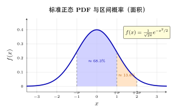
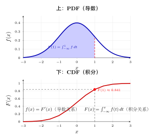
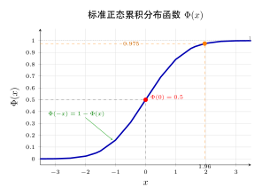

# 第 5 章 连续随机变量（融合版）

> **难度**：★★☆☆☆
> **前置知识**：第 4 章离散随机变量、微积分基础
> **本文件**：融合"原版严格推导 + 重写版高中模板 D 速记 / 套路 / 自测"。保留原版完整正文（学习目标 / 5.1–5.7 / 深度学习应用 / 练习题）+ 在最前置 + 最后追加思维训练。

> **一例速记**：
> **PDF 与 CDF**：$f(x) \geq 0$，$\int_{-\infty}^{+\infty} f(x)\,dx = 1$；$F(x) = \int_{-\infty}^x f(t)\,dt$，$F$ 单调不减、右连续、$F(\pm\infty)=0/1$。
> **区间概率**：$P(a < X \leq b) = F(b) - F(a) = \int_a^b f(x)\,dx$。**单点概率为零**：$P(X=a)=0$，但 $a$ 仍可取。
> **期望方差**：$E(X) = \int x f(x)\,dx$，$\text{Var}(X) = E(X^2) - (EX)^2$。线性：$E(aX+b)=aE+b$，$\text{Var}(aX+b)=a^2\text{Var}$。
> **函数变换**：$Y = g(X)$，$g$ 严格单调可微 → $f_Y(y) = f_X(g^{-1}(y)) \cdot \vert (g^{-1})'(y) \vert$（一维 Jacobian）。
> **三大姊妹**：标准正态 $Z\sim N(0,1)$；指数 $\text{Exp}(\lambda)$ 无记忆性；均匀 $U(a,b)$。

---

## 引入：一道反直觉的"单点概率"题

> **题目**：设 $X$ 服从 $U(0, 1)$（均匀分布）。求：
> (1) $P(X = 0.5)$；
> (2) $P(0.3 < X < 0.5)$；
> (3) $P(X \leq 0.5)$。

请先停下来想一想：**$P(X = 0.5)$ 等于什么？**

直觉答案：$1/\infty = 0$？或者就等于 $0.5$（"50% 概率"的错觉）？

正确答案：$P(X = 0.5) = 0$。这正是**连续与离散的本质差别**——连续随机变量的"单点概率必为零"，但**单点仍是可能取值**。这种"既不为零却也不取得概率"的现象是初学者最容易卡住的地方。下面把内心独白完整还原。

---

## 思维路径还原（解题者的内心独白）

> "看到 $X \sim U(0, 1)$，立刻想 PDF：$f(x) = 1$（$x \in [0,1]$），其他为 $0$。
>
> **第 (1) 问 $P(X = 0.5)$**：要计算单点处的概率。在连续型场景，单点 $\{0.5\}$ 是**测度为零**的集合——它没有"长度"。
>
> 用积分定义验证：$P(X = 0.5) = \int_{0.5}^{0.5} f(x)\,dx = 0$。✓
>
> 但这**不意味着 $X$ 不能取 $0.5$**——只是 $0.5$ 这一点本身的"概率密度" $f(0.5) = 1$，需要乘上一段"长度"才能变成概率。这是连续型的**反直觉之一**。
>
> **第 (2) 问 $P(0.3 < X < 0.5)$**：用 PDF 积分 $\int_{0.3}^{0.5} 1\,dx = 0.2$。✓
>
> **第 (3) 问 $P(X \leq 0.5)$**：用 CDF $F(0.5) = \int_0^{0.5} 1\,dt = 0.5$。注意由于 $P(X = 0.5) = 0$，所以 $P(X \leq 0.5) = P(X < 0.5) = 0.5$——**离散型严格区分而连续型不区分**。
>
> **延伸思考**：如果题目改成"$P(X = 0.5 \text{ 或 } X = 0.7)$"，答案仍是 $0 + 0 = 0$。但"$P(X \in [0, 0.5] \cup [0.7, 1])$"则是 $0.5 + 0.3 = 0.8$。连续型概率只对"区间 / 集合"有意义，单点是测度零。
>
> 这就是连续型概率论与勒贝格测度的桥梁——但在工程实践中，**只要记住"单点为零、区间积分"两条规则就够了**。"

---

## 学习目标

- 理解连续随机变量与离散随机变量的本质区别
- 掌握概率密度函数（PDF）的定义和性质
- 熟练计算连续随机变量的期望和方差
- 理解累积分布函数（CDF）与 PDF 的关系
- 建立连续随机变量与深度学习回归任务的联系

---

## 5.1 连续随机变量的定义

### 从离散到连续

离散随机变量取有限或可数个值，而**连续随机变量**可以取某个区间内的任意实数值。

**关键区别**：对于连续随机变量，任意单点的概率为零：

$$P(X = x) = 0, \quad \forall x \in \mathbb{R}$$

### 直观理解

想象一个飞镖投掷实验：
- 飞镖落在靶上的精确位置是连续的
- 落在任何特定点（如正中心）的概率是 0
- 但落在某个区域（如红心圈内）的概率是正的

### 为什么单点概率为零？

区间 $[a, b]$ 包含无穷多个点。如果每个点都有正概率，总概率会超过 1。因此，连续随机变量必须用**概率密度**而非**概率质量**来描述。

---

## 5.2 概率密度函数

### 定义

连续随机变量 $X$ 的**概率密度函数**（Probability Density Function, PDF）$f(x)$ 满足：

$$P(a \leq X \leq b) = \int_{a}^{b} f(x) \, dx$$

### PDF 的性质

1. **非负性**：$f(x) \geq 0$ 对所有 $x$ 成立
2. **归一化**：$\int_{-\infty}^{+\infty} f(x) \, dx = 1$
3. **注意**：$f(x)$ 本身**不是概率**，可以大于 1

### PDF 的几何解释

- PDF 曲线下的面积表示概率
- $f(x)$ 在点 $x$ 处的值表示概率的"密度"
- 面积 = 概率，但高度 ≠ 概率

### 例 5.1：均匀分布

若 $X$ 在区间 $[a, b]$ 上均匀分布，其 PDF 为：

$$f(x) = \begin{cases}
\frac{1}{b-a} & a \leq x \leq b \\
0 & \text{其他}
\end{cases}$$

**验证归一化**：$\int_a^b \frac{1}{b-a} dx = \frac{b-a}{b-a} = 1$ ✓

**计算概率**：$P(X \leq \frac{a+b}{2}) = \int_a^{(a+b)/2} \frac{1}{b-a} dx = \frac{1}{2}$

### 例 5.2：指数分布

指数分布的 PDF 为（$\lambda > 0$）：

$$f(x) = \begin{cases}
\lambda e^{-\lambda x} & x \geq 0 \\
0 & x < 0
\end{cases}$$

**验证归一化**：$\int_0^{\infty} \lambda e^{-\lambda x} dx = [-e^{-\lambda x}]_0^{\infty} = 1$ ✓

---

## 5.3 累积分布函数

### 定义

连续随机变量的**累积分布函数**（CDF）定义为：

$$F(x) = P(X \leq x) = \int_{-\infty}^{x} f(t) \, dt$$

### CDF 的性质

1. **单调不减**：若 $x_1 < x_2$，则 $F(x_1) \leq F(x_2)$
2. **连续性**：连续随机变量的 CDF 是连续函数
3. **边界条件**：$\lim_{x \to -\infty} F(x) = 0$，$\lim_{x \to +\infty} F(x) = 1$

### PDF 与 CDF 的关系

$$f(x) = \frac{d}{dx} F(x) = F'(x)$$

（在 $F$ 可导的点处）

### 用 CDF 计算概率

$$P(a < X \leq b) = F(b) - F(a)$$

由于 $P(X = a) = 0$，有：

$$P(a < X \leq b) = P(a \leq X \leq b) = P(a < X < b) = P(a \leq X < b)$$

### 例 5.3：指数分布的 CDF

$$F(x) = \int_0^x \lambda e^{-\lambda t} dt = 1 - e^{-\lambda x}, \quad x \geq 0$$

$P(X > t) = 1 - F(t) = e^{-\lambda t}$（生存函数）

---

## 5.4 期望与方差

### 期望的定义

连续随机变量 $X$ 的期望定义为：

$$E[X] = \int_{-\infty}^{+\infty} x \cdot f(x) \, dx$$

### 函数的期望（LOTUS）

若 $g(X)$ 是 $X$ 的函数：

$$E[g(X)] = \int_{-\infty}^{+\infty} g(x) \cdot f(x) \, dx$$

（Law of Unconscious Statistician——不必先求 $f_Y$）

### 方差的定义

$$\text{Var}(X) = E[(X - \mu)^2] = \int_{-\infty}^{+\infty} (x - \mu)^2 f(x) \, dx$$

等价公式：

$$\text{Var}(X) = E[X^2] - (E[X])^2$$

### 期望和方差的性质

与离散情况完全相同：

- $E[aX + b] = aE[X] + b$
- $\text{Var}(aX + b) = a^2 \text{Var}(X)$

### 例 5.4：均匀分布的期望和方差

$X \sim \text{Uniform}(a, b)$：

$$E[X] = \frac{1}{b-a} \cdot \frac{x^2}{2} \Big|_a^b = \frac{a+b}{2}$$

$$E[X^2] = \frac{a^2 + ab + b^2}{3}$$

$$\text{Var}(X) = \frac{a^2+ab+b^2}{3} - \left(\frac{a+b}{2}\right)^2 = \frac{(b-a)^2}{12}$$

### 例 5.5：指数分布的期望和方差

$X \sim \text{Exp}(\lambda)$（通过分部积分）：

$$E[X] = \frac{1}{\lambda}, \quad \text{Var}(X) = \frac{1}{\lambda^2}$$

---

## 5.5 随机变量函数的分布

### 5.5.1 CDF 法（万能方法）

**基本思路**：先求 $Y$ 的 CDF $F_Y(y) = P(Y \leq y) = P(g(X) \leq y)$，再对 $y$ 求导得到 PDF。

**例 5.6** 设 $X \sim \mathcal{N}(0, 1)$，求 $Y = X^2$ 的 PDF。

**解**：当 $y \leq 0$ 时，$F_Y(y) = 0$。当 $y > 0$ 时：

$$F_Y(y) = P(X^2 \leq y) = P(-\sqrt{y} \leq X \leq \sqrt{y}) = 2\Phi(\sqrt{y}) - 1$$

求导：

$$f_Y(y) = \frac{1}{\sqrt{2\pi y}} e^{-y/2}, \quad y > 0$$

这正是**自由度为 1 的卡方分布** $\chi^2(1)$ 的 PDF。

### 5.5.2 公式法（单调函数）

**定理**：设 $X$ 的 PDF 为 $f_X(x)$，$y = g(x)$ 是**严格单调**的可微函数，反函数为 $x = g^{-1}(y)$，则 $Y = g(X)$ 的 PDF 为：

$$\boxed{f_Y(y) = f_X(g^{-1}(y)) \cdot \left|\frac{d\,g^{-1}(y)}{dy}\right|}$$

**直觉**：概率"密度"在变量变换时，需要乘以 Jacobian 的绝对值来补偿坐标伸缩。

**例 5.7** $X \sim \text{Exp}(\lambda)$，$Y = \sqrt{X}$，则 $f_Y(y) = 2\lambda y \, e^{-\lambda y^2}, y > 0$。

**例 5.8** $X \sim \mathcal{N}(\mu, \sigma^2)$，$Y = e^X$（对数正态分布）：

$$f_Y(y) = \frac{1}{\sqrt{2\pi}\sigma y} \exp\left(-\frac{(\ln y - \mu)^2}{2\sigma^2}\right), \quad y > 0$$

### 5.5.3 非单调函数

当 $g(x)$ 不单调时，分段处理：

$$f_Y(y) = \sum_{k} f_X(x_k) \cdot \left|\frac{dx_k}{dy}\right|$$

其中 $x_k$ 是方程 $g(x_k) = y$ 的各个根。例 5.6 中 $Y = X^2$ 就是这种情况（$X^2 = y$ 有两根 $\pm\sqrt{y}$）。

---

## 5.6 矩母函数（连续情形）

### 定义

$$M_X(t) = E[e^{tX}] = \int_{-\infty}^{+\infty} e^{tx} f(x) \, dx$$

性质与离散情形完全一致：$M_X^{(n)}(0) = E[X^n]$。

### 例 5.9：正态分布 MGF

$X \sim \mathcal{N}(\mu, \sigma^2)$ → $M_X(t) = \exp(\mu t + \frac{\sigma^2 t^2}{2})$。

**应用**：独立正态之和仍正态——若 $X_i \sim \mathcal{N}(\mu_i, \sigma_i^2)$ 独立，则 $S = \sum a_i X_i \sim \mathcal{N}(\sum a_i \mu_i, \sum a_i^2 \sigma_i^2)$。

### 例 5.10：指数分布 MGF

$X \sim \text{Exp}(\lambda)$ → $M_X(t) = \frac{\lambda}{\lambda - t}$（$t < \lambda$）。

### 常见分布的 MGF

| 分布 | MGF $M_X(t)$ | 存在条件 |
|---|---|---|
| Bernoulli$(p)$ | $(1-p) + pe^t$ | 所有 $t$ |
| Binomial$(n,p)$ | $[(1-p) + pe^t]^n$ | 所有 $t$ |
| Poisson$(\lambda)$ | $e^{\lambda(e^t-1)}$ | 所有 $t$ |
| Exp$(\lambda)$ | $\frac{\lambda}{\lambda-t}$ | $t < \lambda$ |
| $\mathcal{N}(\mu,\sigma^2)$ | $e^{\mu t + \sigma^2 t^2/2}$ | 所有 $t$ |
| Gamma$(\alpha,\beta)$ | $\left(\frac{\beta}{\beta-t}\right)^\alpha$ | $t < \beta$ |

---

## 5.7 常用连续分布预览

### 正态分布

$$f(x) = \frac{1}{\sqrt{2\pi}\sigma} \exp\left(-\frac{(x-\mu)^2}{2\sigma^2}\right)$$

- 参数：均值 $\mu$，标准差 $\sigma$
- 记作：$X \sim \mathcal{N}(\mu, \sigma^2)$
- 特殊：$\mathcal{N}(0, 1)$ 是**标准正态**，CDF 记 $\Phi(x)$

### 标准化

若 $X \sim \mathcal{N}(\mu, \sigma^2)$，则：

$$Z = \frac{X - \mu}{\sigma} \sim \mathcal{N}(0, 1)$$

### 分位数

随机变量 $X$ 的 **$p$ 分位数**（$0 < p < 1$）是满足 $F(x_p) = p$ 的值：
- **中位数** $m$：$F(m) = 0.5$
- **四分位数**：$Q_1, Q_2, Q_3$

中位数 vs 期望：期望受极端值影响，中位数更稳健。

### 偏度与峰度

- **偏度** $\gamma_1 = E[(X-\mu)^3]/\sigma^3$：对称为 0，右偏 > 0，左偏 < 0
- **峰度** $\gamma_2 = E[(X-\mu)^4]/\sigma^4 - 3$：减 3 是为了以正态为基准；$\gamma_2 > 0$ 尖峰重尾。

---

## 几何示意

### 图 5-1：连续 PDF（标准正态钟形 + 阴影面积）



### 图 5-2：PDF 与 CDF 对应关系



### 图 5-3：标准正态 $\Phi$ 函数图象



---

## 抽象成方法（套路总结）

### 5 大核心公式速查

| 名称 | 公式 | 关键性质 |
|---|---|---|
| **PDF** | $f(x) \geq 0$，$\int_{-\infty}^{+\infty} f = 1$ | $f$ 可 $>1$（不是概率） |
| **CDF** | $F(x) = \int_{-\infty}^x f(t)\,dt$ | 单调不减，右连续 |
| **区间概率** | $P(a < X \leq b) = F(b) - F(a)$ | 单点 $P(X=a)=0$ |
| **期望** | $E(X) = \int x f(x)\,dx$ | 线性 $E(aX+b)=aE(X)+b$ |
| **方差** | $\text{Var}(X) = E(X^2) - (EX)^2$ | $\text{Var}(aX+b)=a^2\text{Var}(X)$ |

### 函数变换标准 3 步（$Y = g(X)$）

1. **求 $Y$ 的取值范围**：根据 $X$ 范围和 $g$ 推出
2. **求 $F_Y(y) = P(Y \leq y) = P(g(X) \leq y)$**：化为 $X$ 的不等式
3. **求 $f_Y(y) = F_Y'(y)$**：求导得密度

**当 $g$ 严格单调可微**，可直接用 Jacobian 公式：
$$f_Y(y) = f_X(g^{-1}(y)) \cdot \vert (g^{-1})'(y) \vert$$

---

## 方法变形

### 变形 1：分段 PDF

PDF 可分段定义。**积分时按分段处理**，不要全区间积。

### 变形 2：含参数 PDF 求常数

用归一化 $\int f = 1$ 解出未知常数。例：$f = cx$ 在 $[0,2]$ → $c = 1/2$。

### 变形 3：求中位数 / 分位数

中位数 $m$ 满足 $F(m) = 1/2$。例：$X\sim\text{Exp}(1)$ 中位数 $= \ln 2$。

### 变形 4：$E(g(X))$ 用 LOTUS

不必先求 $f_Y$。直接 $E(g(X)) = \int g(x) f_X(x)\,dx$。**注意 $E(g(X)) \neq g(E(X))$**（除非 $g$ 线性）。

---

## 本章小结

| 概念 | 定义 / 公式 |
|---|---|
| PDF | $f(x)$，$P(a \leq X \leq b) = \int_a^b f(x)dx$ |
| CDF | $F(x) = P(X \leq x) = \int_{-\infty}^x f(t)dt$ |
| PDF-CDF 关系 | $f(x) = F'(x)$ |
| 期望 | $E[X] = \int x f(x) dx$ |
| 方差 | $\text{Var}(X) = E[X^2] - (E[X])^2$ |
| 均匀分布 | $E = \frac{a+b}{2}$，$\text{Var} = \frac{(b-a)^2}{12}$ |
| 指数分布 | $E = \frac{1}{\lambda}$，$\text{Var} = \frac{1}{\lambda^2}$ |
| 变量变换（单调） | $f_Y(y) = f_X(g^{-1}(y)) \cdot \vert dg^{-1}/dy\vert$ |
| 矩母函数 | $M_X(t) = E[e^{tX}]$，$M_X^{(n)}(0) = E[X^n]$ |

**核心要点**：
- 连续随机变量用密度函数描述，面积等于概率
- 单点概率为零，只有区间概率有意义
- 期望和方差概念与离散一致，求和变积分

---

## 思考路标（条件反射）

1. 看到"连续型" → 想 PDF $f$ 和 CDF $F$，区分单点与区间
2. 看到 $P(X = a)$ 对连续型 → 立刻为 $0$
3. 看到 $P(a < X < b)$ → 积分 $\int_a^b f\,dx$ 或 $F(b) - F(a)$
4. 看到 PDF 求常数 → 用归一化 $\int f = 1$
5. 看到 $E(X^2)$ → 不能写成 $(EX)^2$（差一个 $\text{Var}$）
6. 看到 $Y = g(X)$ 求分布 → CDF 法 3 步；$g$ 单调时用 Jacobian
7. 看到 $E(g(X))$ → 用 LOTUS $\int g\cdot f$，**不要**先求 $f_Y$
8. 看到"无记忆性" → 指数分布（连续型唯一）
9. 看到 $N(\mu, \sigma^2)$ → 标准化 $Z = (X-\mu)/\sigma$
10. 看到对称分布求 $P(X < -a)$ → $\Phi(-a) = 1 - \Phi(a)$

## 易错点

1. **PDF 可以 $> 1$**：$f(x)$ 是密度而非概率，$f(x) > 1$ 完全合法（如 $U(0, 0.5)$ 时 $f = 2$）；概率是面积，不是高度。
2. **$P(X = a) = 0$ 但 $a$ 可以被取到**：单点概率为零意味着该点处"质量"无穷小，不是说 $a$ 不可能出现；区间端点是否含入不影响概率计算。
3. **函数变换必须乘 Jacobian**：$Y = g(X)$ 时 $f_Y(y) \neq f_X(g^{-1}(y))$，漏掉 $\vert dg^{-1}/dy\vert$ 是最常见失误；$g$ 非单调时还需分段并求和。
4. **期望积分收敛性**：$E[X]$ 存在要求 $\int \vert x\vert f(x)\,dx < \infty$；柯西分布没有期望（积分发散）。
5. **标准正态查表方向**：$\Phi(x)$ 表给出 $P(Z \leq x)$；求 $P(Z > x)$ 用 $1 - \Phi(x)$；求 $P(Z \leq -x)$ 用 $\Phi(-x) = 1 - \Phi(x)$。

---

## 典型应用例题

### 例 1：归一化求常数 + 算概率

> **题目**：$f(x) = c x^2$（$0 \leq x \leq 2$，其它 $0$）。求 (1) $c$；(2) $P(1 < X < 1.5)$；(3) $E(X)$。

【思路】先用归一化求 $c$，再用积分算其它。

【解】
(1) $\int_0^2 c x^2\,dx = \frac{8c}{3} = 1 \Rightarrow c = 3/8$。
(2) $P(1 < X < 1.5) = \frac{3}{8}\int_1^{1.5} x^2\,dx = \frac{1}{8}(3.375 - 1) = 19/64 \approx 0.297$。
(3) $E(X) = \frac{3}{8}\int_0^2 x^3\,dx = \frac{3}{8}\cdot 4 = 1.5$。

【答案】$\boxed{c = 3/8,\ P = 19/64,\ E(X) = 3/2}$。

### 例 2：函数变换 $Y = X^2$

> **题目**：$X \sim U(0, 1)$，$Y = X^2$。求 $f_Y(y)$。

【思路】$g(x) = x^2$ 在 $[0,1]$ 单调可微 → CDF 法或 Jacobian。

【解】CDF 法：$F_Y(y) = P(X^2 \leq y) = P(X \leq \sqrt{y}) = \sqrt{y}$（$y \in [0, 1]$）。

求导 $f_Y(y) = \frac{1}{2\sqrt{y}}$。

【答案】$\boxed{f_Y(y) = \frac{1}{2\sqrt{y}},\ y \in (0, 1]}$。

【注】$y\to 0^+$ 时 $f_Y\to\infty$——**PDF 可无界**，只要积分为 1。

### 例 3：标准化 + 正态查表

> **题目**：$X \sim N(60, 100)$（$\mu=60, \sigma=10$）。求 $P(50 \leq X \leq 70)$ 和 $P(X > 80)$。

【思路】标准化 $Z = (X - 60)/10 \sim N(0, 1)$。

【解】
(1) $P(50 \leq X \leq 70) = P(-1 \leq Z \leq 1) = 2\Phi(1) - 1 \approx 0.683$（$\pm 1\sigma$ 经验法则）
(2) $P(X > 80) = P(Z > 2) = 1 - \Phi(2) \approx 0.0228$

【答案】$\boxed{P_1 \approx 0.683,\ P_2 \approx 0.023}$。

---

## 深度学习应用：回归任务与损失函数

### 回归问题的概率视角

在深度学习回归任务中，假设目标变量 $y$ 是连续随机变量，模型预测其条件分布：

$$y \mid \mathbf{x} \sim p(y \mid \mathbf{x}; \theta)$$

### 高斯假设与 MSE 损失

最常见的假设是目标变量服从**高斯分布**：

$$y \mid \mathbf{x} \sim \mathcal{N}(\mu(\mathbf{x}), \sigma^2)$$

**负对数似然**：

$$-\log p(y \mid \mathbf{x}) = \frac{(y - \mu(\mathbf{x}))^2}{2\sigma^2} + \frac{1}{2}\log(2\pi\sigma^2)$$

忽略常数项，最大化似然等价于最小化：

$$\mathcal{L} = (y - \hat{y})^2$$

这正是**均方误差**（MSE）损失！

### 拉普拉斯假设与 MAE 损失

若假设目标服从**拉普拉斯分布** $f(y) = \frac{1}{2b}\exp(-\vert y - \mu\vert / b)$，则负对数似然 $\propto \vert y - \hat{y}\vert$，即**平均绝对误差**（MAE）。

### 异方差回归

如果预测方差也依赖于输入，让网络同时输出 $\mu(\mathbf{x})$ 和 $\sigma^2(\mathbf{x})$：

$$\mathcal{L} = \frac{(y - \mu)^2}{2\sigma^2} + \frac{1}{2}\log \sigma^2$$

### PyTorch 代码示例

```python
import torch
import torch.nn as nn
import numpy as np

# 1. MSE 损失的概率解释
torch.manual_seed(42)
x = torch.linspace(0, 10, 100).unsqueeze(1)
y_true = 2 * x + 1 + torch.randn_like(x) * 2  # 线性 + 高斯噪声

class LinearRegression(nn.Module):
    def __init__(self):
        super().__init__()
        self.linear = nn.Linear(1, 1)
    def forward(self, x):
        return self.linear(x)

model = LinearRegression()
criterion = nn.MSELoss()
optimizer = torch.optim.SGD(model.parameters(), lr=0.01)

for epoch in range(100):
    pred = model(x)
    loss = criterion(pred, y_true)
    optimizer.zero_grad()
    loss.backward()
    optimizer.step()

print(f"训练后 MSE: {loss.item():.4f}")
print(f"估计的噪声方差 σ² ≈ MSE = {loss.item():.4f}")

# 2. MSE vs MAE 比较（异常值场景）
y_outlier = y_true.clone()
y_outlier[50] = 100
mse_loss = nn.MSELoss()(model(x), y_outlier)
mae_loss = nn.L1Loss()(model(x), y_outlier)
print(f"有异常值时 MSE: {mse_loss.item():.4f}（被异常值放大）")
print(f"有异常值时 MAE: {mae_loss.item():.4f}（更鲁棒）")

# 3. 异方差回归网络
class HeteroscedasticRegression(nn.Module):
    """同时预测均值和方差的网络"""
    def __init__(self, input_dim, hidden_dim):
        super().__init__()
        self.shared = nn.Sequential(nn.Linear(input_dim, hidden_dim), nn.ReLU())
        self.mu_head = nn.Linear(hidden_dim, 1)
        self.logvar_head = nn.Linear(hidden_dim, 1)
    def forward(self, x):
        h = self.shared(x)
        return self.mu_head(h), self.logvar_head(h)
    def negative_log_likelihood(self, y_true, mu, log_var):
        var = torch.exp(log_var)
        return (0.5 * ((y_true - mu)**2 / var + log_var)).mean()

# 异方差数据：方差随 x 增加
x_hetero = torch.linspace(0, 10, 200).unsqueeze(1)
noise_std = 0.5 + 0.3 * x_hetero
y_hetero = 2 * x_hetero + 1 + torch.randn_like(x_hetero) * noise_std

model_h = HeteroscedasticRegression(1, 32)
opt = torch.optim.Adam(model_h.parameters(), lr=0.01)

for epoch in range(500):
    mu, log_var = model_h(x_hetero)
    loss = model_h.negative_log_likelihood(y_hetero, mu, log_var)
    opt.zero_grad()
    loss.backward()
    opt.step()

print(f"异方差损失: {loss.item():.4f}")
```

### 关键联系

| 概率论概念 | 深度学习对应 |
|---|---|
| 连续随机变量 | 回归目标 |
| 高斯分布 | MSE 损失的隐含假设 |
| 拉普拉斯分布 | MAE 损失的隐含假设 |
| 负对数似然 | 损失函数 |
| 方差 | 预测不确定性 |
| CDF | 分位数回归 |

---

## 练习题

**练习 5.1**（基础）

设连续随机变量 $X$ 的 PDF 为：

$$f(x) = \begin{cases}
cx^2 & 0 \leq x \leq 1 \\
0 & \text{其他}
\end{cases}$$

(a) 求常数 $c$
(b) 求 CDF $F(x)$
(c) 计算 $P(0.5 \leq X \leq 1)$

**练习 5.2**（计算）

设 $X \sim \text{Uniform}(0, 1)$，令 $Y = -\ln X$。

(a) 求 $Y$ 的 CDF
(b) 求 $Y$ 的 PDF
(c) $Y$ 服从什么分布？

**练习 5.3**（理解）

证明：若 $X$ 是连续随机变量，$F$ 是其 CDF，则 $Y = F(X) \sim \text{Uniform}(0, 1)$。

（提示：这是概率积分变换，是逆变换采样的理论基础）

**练习 5.4**（应用）

一个回归模型的 MSE 损失为 4.0。

(a) 若假设目标变量服从高斯分布，估计噪声标准差
(b) 若要使 95% 的预测误差落在 $\pm k$ 范围内，$k$ 应该是多少？
(c) 为什么 MSE 损失对异常值敏感？

**练习 5.5**（深度学习）

考虑异方差回归的负对数似然损失：

$$\mathcal{L} = \frac{1}{2}\left(\frac{(y - \mu)^2}{\sigma^2} + \log \sigma^2\right)$$

(a) 若 $\sigma^2$ 固定，这简化为什么损失？
(b) 对 $\sigma^2$ 求导，找到最优 $\sigma^2$ 表达式
(c) 为什么需要 $\log \sigma^2$ 项？

---

## 练习答案

<details>
<summary>点击展开 练习 5.1 答案</summary>

**(a)** 由归一化条件 $\int_0^1 cx^2 dx = \frac{c}{3} = 1$ → $c = 3$。

**(b)** $F(x) = x^3$（$0 \leq x \leq 1$），$F(x) = 0$（$x < 0$），$F(x) = 1$（$x > 1$）。

**(c)** $P(0.5 \leq X \leq 1) = F(1) - F(0.5) = 1 - 0.125 = 0.875$。

</details>

<details>
<summary>点击展开 练习 5.2 答案</summary>

**(a)** $F_Y(y) = P(-\ln X \leq y) = P(X \geq e^{-y}) = 1 - e^{-y}$（$y \geq 0$）。

**(b)** $f_Y(y) = e^{-y}$（$y \geq 0$）。

**(c)** $Y \sim \text{Exp}(1)$。这是逆变换采样的经典应用。

</details>

<details>
<summary>点击展开 练习 5.3 答案</summary>

设 $Y = F(X)$。对 $0 \leq y \leq 1$：

$$P(Y \leq y) = P(F(X) \leq y) = P(X \leq F^{-1}(y)) = F(F^{-1}(y)) = y$$

这正是 $U(0, 1)$ 的 CDF。

**意义**：任何连续分布通过其 CDF 变换为均匀分布；反之，给定均匀采样可用 $F^{-1}$ 生成任意分布的样本（逆变换采样）。

</details>

<details>
<summary>点击展开 练习 5.4 答案</summary>

**(a)** MSE $= \sigma^2 = 4$ → $\sigma = 2$。

**(b)** $k = 1.96\sigma = 3.92$（95% 区间）。

**(c)** MSE $= (y-\hat{y})^2$ 平方放大误差：误差 2 时损失 4，误差 10 时损失 100。源于高斯分布的轻尾——大偏差概率指数级衰减。MAE 线性惩罚对应重尾的拉普拉斯分布，对异常值更鲁棒。

</details>

<details>
<summary>点击展开 练习 5.5 答案</summary>

**(a)** $\sigma^2$ 固定时 $\mathcal{L} = \frac{(y-\mu)^2}{2\sigma^2} + \text{const}$，等价于 MSE。

**(b)** $\frac{\partial\mathcal{L}}{\partial\sigma^2} = -\frac{(y-\mu)^2}{2\sigma^4} + \frac{1}{2\sigma^2} = 0$ → $\sigma^2 = (y-\mu)^2$。最优方差等于残差平方。

**(c)** 没有 $\log\sigma^2$ 项时，损失变 $\frac{(y-\mu)^2}{\sigma^2}$，模型可让 $\sigma^2 \to \infty$ 让损失趋零（平凡解）。$\log\sigma^2$ 惩罚过大方差，迫使在准确预测和确定预测之间平衡。

</details>

---

## 自测题（补充自测）

**自测 1**　$f(x) = kx$（$0 < x < 4$，其它 0）。求 $k$，$E(X)$，$\text{Var}(X)$。

> 💡 提示：$k=1/8$，$E(X)=8/3$，$\text{Var}(X) = 8 - 64/9 = 8/9$。

**自测 2**　$X \sim \text{Exp}(2)$。求 $P(X > 1)$ 和 $P(X > 1.5 \mid X > 1)$。

> 💡 提示：$P(X>1)=e^{-2}\approx 0.135$。条件概率 $=P(X>0.5)=e^{-1}\approx 0.368$（无记忆性）。

**自测 3**　$X \sim N(0, 1)$，$Y = X^2$。证明 $Y \sim \chi^2_1$。

> 💡 提示：CDF 法。$F_Y(y) = 2\Phi(\sqrt{y}) - 1$，求导 $f_Y(y) = \frac{1}{\sqrt{2\pi y}}e^{-y/2}$（即 $\chi^2_1$）。

**自测 4**　柯西分布 $f(x) = \frac{1}{\pi(1+x^2)}$。求 $E(X)$。

> 💡 提示：$\int x f$ 不绝对收敛（虽然主值为 0），所以 **$E(X)$ 不存在**。柯西是"无均值无方差"经典反例——CLT 不适用。

**自测 5**　$X \sim U(-1, 1)$，$Y = e^X$。求 $f_Y(y)$ 和 $E(Y)$。

> 💡 提示：$Y = e^X$ 单调，$g^{-1}(y) = \ln y$，$y \in (1/e, e)$。$f_Y(y) = \frac{1}{2y}$。$E(Y) = \frac{e - e^{-1}}{2} \approx 1.175 \neq e^{E(X)} = 1$（非线性变换下期望不可换）。

---

**回头看一眼"一例速记"**：

> PDF 非负 + 归一；CDF 单调不减且 $0\to 1$。
> 单点为零、区间积分；$E$ 是 $\int xf$，$\text{Var} = E(X^2) - (EX)^2$。
> 函数变换 $Y=g(X)$：CDF 法（万能）或 Jacobian（单调时）。

如果现在不看笔记，能独立完成例 1 + 例 3 + 自测 3 + 自测 5——本章，你拿下了。

---

## 融合版说明

本版 = **原版（严格大学教材 + 深度学习应用）** + **重写版（高中模板 D 速记 / 套路 / 例题 / 自测）** 融合：

| 段落 | 来源 | 价值 |
|---|---|---|
| 一例速记 + 引入 + 思维路径还原 | 重写版（前置）| 建立直觉 / 反射 |
| 学习目标 + 5.1-5.7 严格正文 | 原版 | 完整推导 |
| 几何示意（图） | PM2 配图 | 可视化 |
| 抽象成方法 + 方法变形 | 重写版（中间） | 套路总结 |
| 本章小结 | 原版 | 公式速查 |
| 思考路标 + 易错点 | 融合两版 | 条件反射 |
| 典型应用例题 3 例 | 重写版 | 演练 |
| 深度学习应用 + PyTorch | 原版 | 工业实战 |
| 练习题 + 详解 | 原版 | 巩固 |
| 自测题 5 题 | 重写版 | 额外训练 |

**适用**：一站式学习——先速记建立直觉，看严格推导，做套路总结，看代码实战，做习题巩固，自测验收。
