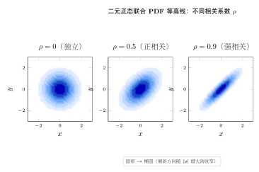
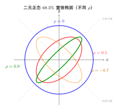
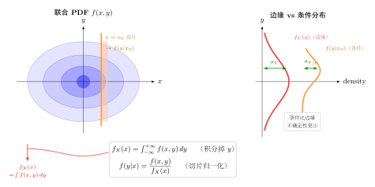
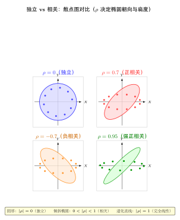

# 第 6 章 多维随机变量（融合版）

> **难度**：★★★☆☆
> **前置知识**：第 4 章离散随机变量、第 5 章连续随机变量、多元微积分基础
> **本文件**：融合"原版严格推导 + 重写版高中模板 D 速记 / 套路 / 自测"。保留原版完整正文（学习目标 / 6.1–6.5 / 深度学习应用 / 练习题）+ 在最前置 + 最后追加思维训练。

---

## 一例速记

> **联合 PMF/PDF**：$f(x,y)\geq 0$，$\iint f(x,y)\,dx\,dy=1$；区域概率 $P((X,Y)\in D)=\iint_D f\,dx\,dy$。
>
> **边缘**：$f_X(x)=\int_{-\infty}^{+\infty} f(x,y)\,dy$；$f_Y(y)=\int_{-\infty}^{+\infty} f(x,y)\,dx$（"积分掉另一个变量"）。
>
> **条件**：$f_{Y\mid X}(y\mid x)=f(x,y)/f_X(x)$；$f_{X\mid Y}(x\mid y)=f(x,y)/f_Y(y)$（分母不为零）。
>
> **独立**：$f(x,y)=f_X(x)f_Y(y)$ 对所有 $(x,y)$ 成立，**且定义域为矩形**。
>
> **协方差**：$\text{Cov}(X,Y)=E(XY)-E(X)E(Y)$；$\text{Var}(X+Y)=\text{Var}(X)+\text{Var}(Y)+2\text{Cov}(X,Y)$。
>
> **相关系数**：$\rho=\text{Cov}(X,Y)/(\sigma_X\sigma_Y)\in[-1,1]$；$|\rho|=1$ 当且仅当严格线性。
>
> **协方差矩阵**：$\boldsymbol\Sigma_{ij}=\text{Cov}(X_i,X_j)$，对称正半定——深度学习 PCA / 白化的核心。
>
> **独立 $\Rightarrow$ Cov $= 0$，反之不成立**（正态是唯一例外：正态不相关 $\Leftrightarrow$ 独立）。

---

## 引入：一道反直觉题

### 辛普森悖论：整体趋势与分组趋势相反

下表是两家医院治疗某病的数据（数字为"治愈/总数"）：

| | 轻症 | 重症 | **合计** |
|---|---|---|---|
| 医院 A | 81/87（**93%**）| 192/263（**73%**）| 273/350（**78%**）|
| 医院 B | 234/270（**87%**）| 55/80（**69%**）| 289/350（**83%**）|

乍看结论：**每个分组**都是 A 优于 B（93% > 87%，73% > 69%）。但**合计却是 B 优于 A**（83% > 78%）。

这怎么可能？

> **原因**：医院 A 接收了更多重症患者（263/350 ≈ 75% 是重症），而重症治愈率本来就低，拉低了 A 的整体比例。当病情严重程度（第三变量 $Z$）与医院选择（$X$）和治愈率（$Y$）都相关时，$Z$ 就成为"混淆变量"，导致分组与合并后的条件分布方向相反。
>
> **概率论解释**：全期望公式 $E[Y]=E[E[Y|X]]$ 中，每个条件期望 $E[Y|X=A]$ 还要再按 $Z$（病情）加权。医院 A 的权重向重症倾斜，即使 A 在每层都更好，合计后却更差。这正是**控制混淆变量的必要性**，也是因果推断（因果图）要解决的核心问题。
>
> **对深度学习的警示**：用整体准确率评价模型，可能掩盖在某子群上的系统偏差——数据集偏移（Dataset Shift）和公平性问题的根源之一。

---

## 思维路径还原（解题者的内心独白）

以下完整还原"给定二元正态 $N(0,0,1,1,\rho)$，求条件分布 $Y|X=x$"的推导过程：

> **识别题型**：已知联合分布，求条件分布——标准三步走：联合 → 边缘 → 条件。
>
> **第一步：写出联合 PDF**
>
> $$f(x,y)=\frac{1}{2\pi\sqrt{1-\rho^2}}\exp\!\left[-\frac{x^2-2\rho xy+y^2}{2(1-\rho^2)}\right]$$
>
> **第二步：求边缘 $f_X(x)$**（对 $y$ 从 $-\infty$ 到 $+\infty$ 积分）
>
> 对 $y$ 凑完全平方后，积分核变为正态核，结果是标准正态 PDF：
>
> $$f_X(x)=\phi(x)=\frac{1}{\sqrt{2\pi}}e^{-x^2/2}$$
>
> **第三步：写出条件 PDF**
>
> $$f(y|x)=\frac{f(x,y)}{f_X(x)}$$
>
> **第四步：化简（凑 $y$ 的完全平方）**
>
> 将指数部分 $x^2-2\rho xy+y^2$ 改写：提出含 $x^2$ 的部分后，$y$ 方向剩余
>
> $$(y-\rho x)^2/(1-\rho^2)$$
>
> 因此条件 PDF 正比于 $\exp\!\bigl[-\tfrac{(y-\rho x)^2}{2(1-\rho^2)}\bigr]$，这是均值 $\rho x$、方差 $1-\rho^2$ 的正态核。
>
> **结果**：$Y|X=x \sim N\!\left(\rho x,\; 1-\rho^2\right)$
>
> **两个关键启示**：
>
> 1. **条件均值 $\rho x$ 是 $x$ 的线性函数**——斜率恰好是相关系数 $\rho$；这就是线性回归中"当 $X,Y$ 标准化时，回归系数等于相关系数"的概率论根源。
>
> 2. **条件方差 $1-\rho^2 \leq 1$**——知道 $X$ 的取值后，$Y$ 的不确定性从 $1$ 减小到 $1-\rho^2$；$|\rho|$ 越大，条件信息越能压缩不确定性；$\rho=\pm 1$ 时条件方差为零，$Y$ 被 $X$ 完全确定。
>
> **第五步：迁移到一般参数**
>
> 若 $(X,Y)\sim N(\mu_X,\mu_Y,\sigma_X^2,\sigma_Y^2,\rho)$，则
>
> $$Y\mid X=x \;\sim\; N\!\left(\mu_Y+\rho\frac{\sigma_Y}{\sigma_X}(x-\mu_X),\;\sigma_Y^2(1-\rho^2)\right)$$
>
> 条件均值是 $x$ 的线性函数，斜率 $\rho\sigma_Y/\sigma_X$ 正是最小二乘回归系数的概率论本源。

---

## 学习目标

- 理解二维随机变量的联合分布函数、联合PMF与联合PDF的定义和性质
- 掌握从联合分布求边缘分布的方法（积分/求和）
- 理解条件分布与条件期望的概念及计算方法
- 熟练计算协方差和相关系数，判断随机变量的独立性
- 建立多维随机变量与深度学习多任务学习、特征相关性分析的联系

---

## 6.1 二维随机变量的概念

### 从一维到多维

在实际问题中，我们常常需要同时研究两个或多个随机变量。例如：

- 一个人的**身高** $X$ 和**体重** $Y$
- 图像的**亮度** $X$ 和**对比度** $Y$
- 神经网络中两个神经元的**激活值** $X$ 和 $Y$

这些变量之间往往存在某种关联，需要用**多维随机变量**来联合描述。

### 二维随机变量的定义

设 $X$ 和 $Y$ 是定义在同一样本空间 $\Omega$ 上的两个随机变量，则称 $(X, Y)$ 为**二维随机变量**（或**随机向量**）。

二维随机变量 $(X, Y)$ 的每次取值是平面上的一个点 $(x, y)$。

### 二维随机变量的分类

与一维情况类似：

- **二维离散型**：$(X, Y)$ 只取有限或可数个点对 $(x_i, y_j)$
- **二维连续型**：$(X, Y)$ 可取某个平面区域内的任意值

### 直观理解：散点图

二维随机变量可以直观地用**散点图**表示：每次实验对应平面上的一个点。

- 若 $X$ 和 $Y$ 相互独立，散点分布是"圆形云"
- 若 $X$ 和 $Y$ 正相关，散点呈"右上-左下"的椭圆形
- 若 $X$ 和 $Y$ 负相关，散点呈"左上-右下"的椭圆形

---

## 6.2 联合分布函数与联合概率

### 联合分布函数（Joint CDF）

二维随机变量 $(X, Y)$ 的**联合分布函数**定义为：

$$F(x, y) = P(X \leq x, Y \leq y), \quad (x, y) \in \mathbb{R}^2$$

#### 联合CDF的性质

1. **单调性**：关于 $x$ 和 $y$ 分别单调不减
2. **边界条件**：
   - $F(-\infty, y) = 0$，$F(x, -\infty) = 0$
   - $F(+\infty, +\infty) = 1$
3. **右连续性**：关于 $x$ 和 $y$ 分别右连续
4. **矩形概率公式**：

$$P(a < X \leq b, c < Y \leq d) = F(b,d) - F(a,d) - F(b,c) + F(a,c)$$

### 离散型：联合概率质量函数（Joint PMF）

若 $(X, Y)$ 是离散型随机变量，其**联合概率质量函数**为：

$$p(x_i, y_j) = P(X = x_i, Y = y_j), \quad i, j = 1, 2, \ldots$$

#### Joint PMF的性质

1. **非负性**：$p(x_i, y_j) \geq 0$
2. **归一化**：$\displaystyle\sum_i \sum_j p(x_i, y_j) = 1$

#### 例6.1：联合PMF

投掷两枚硬币，设 $X$ 为第一枚正面朝上的次数，$Y$ 为第二枚正面朝上的次数。

$$p(x, y) = \frac{1}{4}, \quad x \in \{0, 1\},\ y \in \{0, 1\}$$

| | $Y=0$ | $Y=1$ |
|---|---|---|
| $X=0$ | 1/4 | 1/4 |
| $X=1$ | 1/4 | 1/4 |

### 连续型：联合概率密度函数（Joint PDF）

若存在非负函数 $f(x, y)$ 使得：

$$F(x, y) = \int_{-\infty}^{x} \int_{-\infty}^{y} f(s, t) \, dt \, ds$$

则称 $f(x, y)$ 为 $(X, Y)$ 的**联合概率密度函数**。

#### Joint PDF的性质

1. **非负性**：$f(x, y) \geq 0$
2. **归一化**：$\displaystyle\int_{-\infty}^{+\infty} \int_{-\infty}^{+\infty} f(x, y) \, dx \, dy = 1$
3. **区域概率**：对平面区域 $D$，有

$$P((X, Y) \in D) = \iint_D f(x, y) \, dx \, dy$$

#### 例6.2：联合PDF验证

设 $f(x, y) = c \cdot e^{-(2x + y)}$，$x \geq 0,\ y \geq 0$，其他处为0。

求常数 $c$：

$$\int_0^{\infty}\int_0^{\infty} c \cdot e^{-(2x+y)} \, dy \, dx = c \int_0^{\infty} e^{-2x} dx \cdot \int_0^{\infty} e^{-y} dy = c \cdot \frac{1}{2} \cdot 1 = \frac{c}{2} = 1$$

故 $c = 2$。

### 二维正态分布

最重要的二维连续分布是**二维正态分布** $\mathcal{N}(\boldsymbol{\mu}, \boldsymbol{\Sigma})$，其PDF为：

$$f(x, y) = \frac{1}{2\pi\sigma_X\sigma_Y\sqrt{1-\rho^2}} \exp\left(-\frac{1}{2(1-\rho^2)}\left[\frac{(x-\mu_X)^2}{\sigma_X^2} - \frac{2\rho(x-\mu_X)(y-\mu_Y)}{\sigma_X\sigma_Y} + \frac{(y-\mu_Y)^2}{\sigma_Y^2}\right]\right)$$

其中：
- $\mu_X, \mu_Y$：均值
- $\sigma_X^2, \sigma_Y^2$：方差
- $\rho$：相关系数（$|\rho| < 1$）

---

## 6.3 边缘分布

### 边缘分布的概念

从联合分布 $(X, Y)$ 中，仅考察单个变量的分布，称为**边缘分布**（Marginal Distribution）。

边缘分布是"把另一个变量积分/求和掉"的结果。

### 离散型的边缘分布

$X$ 的**边缘PMF**：

$$p_X(x_i) = P(X = x_i) = \sum_j p(x_i, y_j)$$

$Y$ 的**边缘PMF**：

$$p_Y(y_j) = P(Y = y_j) = \sum_i p(x_i, y_j)$$

直观理解：对联合分布表格按行或列求和。

#### 例6.3：从联合PMF求边缘PMF

| | $Y=0$ | $Y=1$ | $Y=2$ | $p_X(x)$ |
|---|---|---|---|---|
| $X=0$ | 0.1 | 0.2 | 0.1 | **0.4** |
| $X=1$ | 0.2 | 0.3 | 0.1 | **0.6** |
| $p_Y(y)$ | **0.3** | **0.5** | **0.2** | **1.0** |

边缘分布就是表格最右列和最下行的数值。

### 连续型的边缘分布

$X$ 的**边缘PDF**（对 $y$ 积分）：

$$f_X(x) = \int_{-\infty}^{+\infty} f(x, y) \, dy$$

$Y$ 的**边缘PDF**（对 $x$ 积分）：

$$f_Y(y) = \int_{-\infty}^{+\infty} f(x, y) \, dx$$

#### 例6.4：从联合PDF求边缘PDF

已知 $f(x, y) = 2e^{-(2x+y)}$，$x \geq 0,\ y \geq 0$。

**$X$ 的边缘PDF**：

$$f_X(x) = \int_0^{\infty} 2e^{-(2x+y)} dy = 2e^{-2x} \int_0^{\infty} e^{-y} dy = 2e^{-2x}, \quad x \geq 0$$

$X \sim \text{Exp}(2)$

**$Y$ 的边缘PDF**：

$$f_Y(y) = \int_0^{\infty} 2e^{-(2x+y)} dx = 2e^{-y} \cdot \frac{1}{2} = e^{-y}, \quad y \geq 0$$

$Y \sim \text{Exp}(1)$

### 独立性的判断

$X$ 和 $Y$ **相互独立**，当且仅当联合分布等于边缘分布的乘积：

- **离散型**：$p(x_i, y_j) = p_X(x_i) \cdot p_Y(y_j)$，对所有 $i, j$ 成立
- **连续型**：$f(x, y) = f_X(x) \cdot f_Y(y)$，对几乎所有 $(x, y)$ 成立

#### 例6.5：验证独立性

对例6.4：$f(x, y) = 2e^{-(2x+y)} = 2e^{-2x} \cdot e^{-y} = f_X(x) \cdot f_Y(y)$

故 $X$ 与 $Y$ 相互独立。

**注意**：联合分布的定义域必须是矩形区域（或全平面），否则即便乘积形式也未必独立。

---

## 6.4 条件分布

### 条件分布的直觉

"在已知 $Y = y$ 的条件下，$X$ 的分布是什么？"

这正是**条件分布**所回答的问题。条件分布是贝叶斯推断、因果推理的核心工具。

### 离散型条件分布

在 $Y = y_j$ 的条件下，$X$ 的**条件PMF**为：

$$P(X = x_i \mid Y = y_j) = \frac{P(X = x_i, Y = y_j)}{P(Y = y_j)} = \frac{p(x_i, y_j)}{p_Y(y_j)}$$

前提：$p_Y(y_j) > 0$。

### 连续型条件分布

在 $Y = y$ 的条件下，$X$ 的**条件PDF**为：

$$f_{X|Y}(x \mid y) = \frac{f(x, y)}{f_Y(y)}$$

前提：$f_Y(y) > 0$。

**注意**：连续型中 $P(Y = y) = 0$，条件PDF通过极限定义：

$$f_{X|Y}(x \mid y) = \lim_{\varepsilon \to 0} \frac{P(X \leq x \mid y < Y \leq y + \varepsilon)}{\varepsilon}$$

#### 例6.6：计算条件PDF

已知 $f(x, y) = 2e^{-(2x+y)}$，$x \geq 0,\ y \geq 0$。

由例6.4，$f_Y(y) = e^{-y}$，故：

$$f_{X|Y}(x \mid y) = \frac{2e^{-(2x+y)}}{e^{-y}} = 2e^{-2x}, \quad x \geq 0$$

这表明在已知 $Y = y$ 的条件下，$X$ 的条件分布仍是 $\text{Exp}(2)$，与 $y$ 无关——这正是独立性的体现。

### 条件期望

在 $Y = y$ 条件下，$X$ 的**条件期望**为：

$$E[X \mid Y = y] = \begin{cases}
\displaystyle\sum_i x_i \cdot P(X = x_i \mid Y = y) & \text{离散型} \\[6pt]
\displaystyle\int_{-\infty}^{+\infty} x \cdot f_{X|Y}(x \mid y) \, dx & \text{连续型}
\end{cases}$$

### 全期望公式（迭代期望公式）

$$E[X] = E[E[X \mid Y]]$$

展开为：

- 离散型：$E[X] = \displaystyle\sum_j E[X \mid Y = y_j] \cdot P(Y = y_j)$
- 连续型：$E[X] = \displaystyle\int E[X \mid Y = y] \cdot f_Y(y) \, dy$

#### 例6.7：全期望公式应用

一家工厂有两条生产线。第一条以概率0.6被选中，产品合格率80%；第二条以概率0.4被选中，合格率90%。

设 $Y$ 为生产线编号，$X$ 为产品是否合格，则：

$$E[X] = E[X \mid Y=1] \cdot P(Y=1) + E[X \mid Y=2] \cdot P(Y=2)$$
$$= 0.8 \times 0.6 + 0.9 \times 0.4 = 0.48 + 0.36 = 0.84$$

整体合格率为84%。

### 贝叶斯定理的密度形式

$$f_{Y|X}(y \mid x) = \frac{f_{X|Y}(x \mid y) \cdot f_Y(y)}{f_X(x)}$$

这是贝叶斯推断的数学基础，在深度学习的变分自编码器（VAE）中有直接应用。

### 条件方差

**定义** 在 $Y = y$ 条件下，$X$ 的**条件方差**为：

$$\text{Var}(X \mid Y = y) = E[(X - E[X \mid Y=y])^2 \mid Y = y] = E[X^2 \mid Y = y] - (E[X \mid Y = y])^2$$

将 $y$ 视为变量，$\text{Var}(X \mid Y)$ 本身是 $Y$ 的函数，因此也是一个随机变量。

### 全方差公式（Law of Total Variance）

$$\boxed{\text{Var}(X) = E[\text{Var}(X \mid Y)] + \text{Var}(E[X \mid Y])}$$

**直觉理解**：总方差 = **组内方差的期望** + **组间方差**。

- $E[\text{Var}(X \mid Y)]$：各"组"（给定 $Y$ 的值）内部的方差，取平均
- $\text{Var}(E[X \mid Y])$：各"组"均值之间的波动

**证明**：

$$\text{Var}(X) = E[X^2] - (E[X])^2$$

利用全期望公式 $E[X^2] = E[E[X^2 \mid Y]]$，$E[X] = E[E[X \mid Y]]$，以及 $E[X^2 \mid Y] = \text{Var}(X \mid Y) + (E[X \mid Y])^2$，代入展开整理即得。$\square$

#### 例6.8b：全方差公式应用

某保险公司有两类客户：低风险（占比 70%）和高风险（占比 30%）。低风险客户年索赔额 $X$ 的条件分布为 $E[X \mid \text{低}] = 200$，$\text{Var}(X \mid \text{低}) = 1000$；高风险客户 $E[X \mid \text{高}] = 800$，$\text{Var}(X \mid \text{高}) = 5000$。

组内方差期望：$E[\text{Var}(X \mid Y)] = 0.7 \times 1000 + 0.3 \times 5000 = 2200$

组间方差：$E[E[X \mid Y]] = 0.7 \times 200 + 0.3 \times 800 = 380$

$$\text{Var}(E[X \mid Y]) = 0.7 \times (200-380)^2 + 0.3 \times (800-380)^2 = 0.7 \times 32400 + 0.3 \times 176400 = 75600$$

$$\text{Var}(X) = 2200 + 75600 = 77800$$

可以看到，客户类别差异（组间方差）对总方差的贡献远大于组内波动。

---

## 6.5 协方差与相关系数

### 为什么需要协方差？

期望和方差描述单个随机变量，但无法刻画两个变量之间的**线性关联**程度。协方差正是用来度量这种关联的。

### 协方差的定义

$X$ 和 $Y$ 的**协方差**（Covariance）定义为：

$$\text{Cov}(X, Y) = E[(X - \mu_X)(Y - \mu_Y)]$$

**等价计算公式**（更常用）：

$$\text{Cov}(X, Y) = E[XY] - E[X] \cdot E[Y]$$

### 协方差的直觉

- $\text{Cov}(X, Y) > 0$：$X$ 大时 $Y$ 趋向大，正相关
- $\text{Cov}(X, Y) < 0$：$X$ 大时 $Y$ 趋向小，负相关
- $\text{Cov}(X, Y) = 0$：线性不相关（注意：不等于独立）

### 协方差的性质

1. **对称性**：$\text{Cov}(X, Y) = \text{Cov}(Y, X)$
2. **自协方差**：$\text{Cov}(X, X) = \text{Var}(X)$
3. **线性性**：$\text{Cov}(aX + b, cY + d) = ac \cdot \text{Cov}(X, Y)$
4. **双线性**：$\text{Cov}(X_1 + X_2, Y) = \text{Cov}(X_1, Y) + \text{Cov}(X_2, Y)$
5. **独立推不相关**：若 $X, Y$ 独立，则 $\text{Cov}(X, Y) = 0$（反之不成立）
6. **方差加法公式**：$\text{Var}(X + Y) = \text{Var}(X) + \text{Var}(Y) + 2\text{Cov}(X, Y)$

### 相关系数的定义

协方差受量纲影响，不便比较。**相关系数**（Pearson Correlation Coefficient）通过标准化消除量纲：

$$\rho_{XY} = \frac{\text{Cov}(X, Y)}{\sqrt{\text{Var}(X) \cdot \text{Var}(Y)}} = \frac{\text{Cov}(X, Y)}{\sigma_X \sigma_Y}$$

### 相关系数的性质

1. **有界性**：$-1 \leq \rho_{XY} \leq 1$
2. **完全线性相关**：$|\rho_{XY}| = 1$ 当且仅当 $Y = aX + b$（$a \neq 0$）
3. **无量纲**：$\rho$ 是纯数，便于不同场景比较
4. **$\rho = 0$**：线性不相关，但不代表独立（可能有非线性关系）

### 例6.8：计算协方差和相关系数

设联合分布为：

| | $Y=0$ | $Y=2$ |
|---|---|---|
| $X=0$ | 0.3 | 0.1 |
| $X=1$ | 0.2 | 0.4 |

**计算边缘期望**：

$$E[X] = 0 \times 0.4 + 1 \times 0.6 = 0.6$$
$$E[Y] = 0 \times 0.5 + 2 \times 0.5 = 1.0$$
$$E[XY] = 0 \cdot 0 \cdot 0.3 + 0 \cdot 2 \cdot 0.1 + 1 \cdot 0 \cdot 0.2 + 1 \cdot 2 \cdot 0.4 = 0.8$$

**协方差**：

$$\text{Cov}(X, Y) = E[XY] - E[X]E[Y] = 0.8 - 0.6 \times 1.0 = 0.2$$

**方差**：

$$E[X^2] = 0^2 \times 0.4 + 1^2 \times 0.6 = 0.6,\quad \text{Var}(X) = 0.6 - 0.36 = 0.24$$
$$E[Y^2] = 0^2 \times 0.5 + 4 \times 0.5 = 2.0,\quad \text{Var}(Y) = 2.0 - 1.0 = 1.0$$

**相关系数**：

$$\rho_{XY} = \frac{0.2}{\sqrt{0.24 \times 1.0}} = \frac{0.2}{\sqrt{0.24}} \approx 0.408$$

### 协方差矩阵

对 $n$ 维随机向量 $\mathbf{X} = (X_1, X_2, \ldots, X_n)^T$，**协方差矩阵**定义为：

$$\boldsymbol{\Sigma} = \text{Cov}(\mathbf{X}) = E[(\mathbf{X} - \boldsymbol{\mu})(\mathbf{X} - \boldsymbol{\mu})^T]$$

其中 $\Sigma_{ij} = \text{Cov}(X_i, X_j)$，对角元素 $\Sigma_{ii} = \text{Var}(X_i)$。

协方差矩阵的性质：
- **对称正半定**：$\boldsymbol{\Sigma} = \boldsymbol{\Sigma}^T$，$\mathbf{v}^T\boldsymbol{\Sigma}\mathbf{v} \geq 0$ 对任意向量 $\mathbf{v}$

### 不相关 vs 独立

|  | 离散型 | 连续型 |
|---|---|---|
| 独立 $\Rightarrow$ 不相关 | 成立 | 成立 |
| 不相关 $\Rightarrow$ 独立 | **不成立** | **不成立** |

**反例**：设 $X \sim \text{Uniform}(-1, 1)$，$Y = X^2$。

$$E[X] = 0,\quad E[XY] = E[X^3] = \int_{-1}^{1} x^3 \cdot \frac{1}{2} dx = 0$$

故 $\text{Cov}(X, Y) = 0$，$X$ 与 $Y$ 不相关。

但 $Y$ 完全由 $X$ 决定，二者并不独立！

---

## 几何示意

### 图 6-1：联合 PDF 等高线（二元正态，不同 $\rho$）



> **读图要点**：$\rho=0$ 时等高线为正圆（$X,Y$ 独立）；$\rho$ 趋向 $\pm 1$ 时椭圆被"压扁"成斜线——椭圆长轴的倾斜方向就是线性相关的方向。

### 图 6-2：二元正态等高线 + 不同 $\rho$ 对比



> **读图要点**：从负相关到正相关，椭圆从"左高右低"旋转到"左低右高"；等高线圆心对应均值向量 $(\mu_X,\mu_Y)$；协方差矩阵的特征向量给出椭圆的主轴方向。

### 图 6-3：边缘分布 + 条件分布几何意义



> **读图要点**：边缘 PDF $f_X(x)$ 是联合 PDF 沿 $y$ 轴方向的**投影（积分）**；条件 PDF $f(y|x_0)$ 是联合 PDF 在 $x=x_0$ 处的**截面（切片）**，再归一化后得到。

### 图 6-4：独立 vs 相关散点图对比（4 种 $\rho$）



> **读图要点**：$\rho=0$ 散点为圆形云，$\rho=\pm 1$ 散点退化为一条直线；散点图的"胖瘦"直接反映相关系数大小，这是数据探索阶段最常用的可视化工具。

---

## 抽象成方法（套路总结）

### 5 大核心公式速查

| 名称 | 公式 | 关键说明 |
|---|---|---|
| **联合 PDF** | $f(x,y)\geq 0$，$\iint f\,dx\,dy=1$ | 区域概率 $=\iint_D f\,dx\,dy$ |
| **边缘 PDF** | $f_X(x)=\int f(x,y)\,dy$，$f_Y(y)=\int f(x,y)\,dx$ | "积分掉另一个变量" |
| **条件 PDF** | $f(y\vert x)=f(x,y)/f_X(x)$ | 分母须 $>0$ |
| **独立判别** | $f(x,y)=f_X(x)f_Y(y)$ 对**所有** $(x,y)$ 且定义域为矩形 | 离散类似 |
| **协方差 / $\rho$** | $\text{Cov}(X,Y)=E(XY)-EXEY$；$\rho=\text{Cov}/(\sigma_X\sigma_Y)$ | $\rho\in[-1,1]$ |

### 联合分布处理 3 步流程

```
第 1 步：归一化检验 / 求常数
        → 令 ∬f dx dy = 1 解出未知常数

第 2 步：边缘化
        → 对 y 积分得 f_X(x)；对 x 积分得 f_Y(y)
        → 注意积分上下限（由联合分布定义域决定）

第 3 步：按目标选择分支
        ┌─ 求条件分布   → f(y|x) = f(x,y)/f_X(x)
        ├─ 判独立性     → 验证 f(x,y) = f_X·f_Y（定义域也要矩形）
        ├─ 求 Cov/ρ    → 先求 E(XY) 用 LOTUS，再减 EXEY
        └─ 求 Z=X+Y    → 卷积 f_Z(z)=∫f_X(x)f_Y(z-x)dx（独立时）
```

---

## 方法变形

### 变形 1：求边缘分布（注意积分限）

积分限由**联合 PDF 的定义域**决定，而不是 $(-\infty,+\infty)$。

**典型陷阱**：$f(x,y)$ 定义在 $0\leq x\leq y\leq 1$ 上，则求 $f_X(x)$ 时 $y$ 的积分下限是 $x$（不是 $0$），上限是 $1$：

$$f_X(x)=\int_x^1 f(x,y)\,dy, \quad 0\leq x\leq 1$$

**操作提示**：先画出定义域，固定 $x$ 画竖线，读出 $y$ 的范围。

### 变形 2：求条件分布并验证

步骤：(1) 求 $f_Y(y)$；(2) 写出 $f(x|y)=f(x,y)/f_Y(y)$；(3) 验证 $\int f(x|y)\,dx=1$。

若验证失败，优先检查积分限而非公式本身。

### 变形 3：$Z = X + Y$ 的卷积

当 $X,Y$ **独立**时，$Z = X + Y$ 的 PDF 为：

$$f_Z(z) = \int_{-\infty}^{+\infty} f_X(x) f_Y(z-x)\,dx = (f_X * f_Y)(z)$$

**计算提示**：确定 $z-x$ 在 $Y$ 支撑集内的 $x$ 范围，这决定积分限。

**重要结论**：独立正态之和仍是正态：若 $X\sim N(\mu_1,\sigma_1^2)$，$Y\sim N(\mu_2,\sigma_2^2)$ 独立，则 $X+Y\sim N(\mu_1+\mu_2, \sigma_1^2+\sigma_2^2)$。

### 变形 4：$E(XY)$ 用 LOTUS

$E(XY)$ 直接用联合分布计算，**不必先求 $Z=XY$ 的分布**：

$$E(XY) = \iint xy\cdot f(x,y)\,dx\,dy \quad \text{（连续型）}$$
$$E(XY) = \sum_i\sum_j x_i y_j \cdot p(x_i,y_j) \quad \text{（离散型）}$$

**若独立**：$E(XY) = E(X)\cdot E(Y)$（可直接用，节省大量计算）。

---

## 本章小结

| 概念 | 离散型 | 连续型 |
|------|--------|--------|
| 联合分布 | $p(x_i, y_j) = P(X=x_i, Y=y_j)$ | $f(x,y)$，区域积分得概率 |
| 归一化 | $\sum_i\sum_j p(x_i,y_j)=1$ | $\iint f(x,y)\,dx\,dy=1$ |
| 边缘分布 | $p_X(x_i)=\sum_j p(x_i,y_j)$ | $f_X(x)=\int f(x,y)\,dy$ |
| 条件分布 | $P(X=x_i\mid Y=y_j)=\dfrac{p(x_i,y_j)}{p_Y(y_j)}$ | $f_{X\mid Y}(x\mid y)=\dfrac{f(x,y)}{f_Y(y)}$ |
| 独立性 | $p(x_i,y_j)=p_X(x_i)p_Y(y_j)$ | $f(x,y)=f_X(x)f_Y(y)$ |
| 协方差 | $\text{Cov}(X,Y)=E[XY]-E[X]E[Y]$ | （离散 / 连续公式相同） |
| 相关系数 | $\rho=\text{Cov}(X,Y)/(\sigma_X\sigma_Y)$，$\vert\rho\vert\leq 1$ | （离散 / 连续公式相同） |

**核心要点**：
- 联合分布包含两个变量的全部概率信息，边缘分布是联合分布的"投影"
- 独立性意味着联合分布可以分解为边缘分布之积
- 协方差度量线性关联，相关系数是标准化后的协方差
- 不相关不等于独立：不相关只排除线性关系，独立排除一切关系
- 全期望公式：$E[X] = E[E[X \mid Y]]$
- 全方差公式：$\text{Var}(X) = E[\text{Var}(X \mid Y)] + \text{Var}(E[X \mid Y])$（总方差 = 组内方差期望 + 组间方差）

---

## 思考路标（条件反射）

1. 看到"联合 PMF/PDF" → 验证归一化：$\sum\sum p_{ij}=1$ 或 $\iint f\,dx\,dy=1$；区域概率用双重积分
2. 看到"求边缘分布" → **积分掉另一个变量**：$f_X(x)=\int_{-\infty}^{+\infty} f(x,y)\,dy$；积分限由定义域决定，先画图
3. 看到"求条件分布" → $f(y|x)=f(x,y)/f_X(x)$，**分母 $f_X(x)\neq 0$**；算完验证积分为 1
4. 看到"判断独立性" → $f(x,y)=f_X(x)f_Y(y)$ 对**所有** $(x,y)$ 成立，**且定义域为矩形**；三角形域直接判不独立
5. 看到"求协方差" → $\text{Cov}(X,Y)=E(XY)-E(X)E(Y)$；用 LOTUS 算 $E(XY)$；独立时 $= 0$
6. 看到"相关系数 $\rho$" → $\rho = \text{Cov}(X,Y)/(\sigma_X\sigma_Y) \in [-1,1]$；$|\rho|=1$ 当且仅当严格线性关系
7. 看到"二元正态条件分布" → 仍是正态：$Y|X=x \sim N(\mu_Y + \rho\frac{\sigma_Y}{\sigma_X}(x-\mu_X),\; \sigma_Y^2(1-\rho^2))$
8. 看到"多元正态" → 参数为均值向量 $\boldsymbol\mu$ 和协方差矩阵 $\boldsymbol\Sigma$（半正定）
9. 看到"$Z = X + Y$，$X,Y$ 独立" → 用卷积公式；正态之和还是正态，参数相加
10. 看到"全期望 / 全方差" → $E[X]=E[E[X|Y]]$；$\text{Var}(X)=E[\text{Var}(X|Y)]+\text{Var}(E[X|Y])$；分清"组内"和"组间"
11. 看到"$\text{Cov}=0$ 是否独立？" → **不一定**；反例：$Y=X^2$，$X\sim U(-1,1)$；正态例外
12. 看到"协方差矩阵" → 对称正半定；特征分解 = PCA 的主轴；白化 = 乘以 $\boldsymbol\Sigma^{-1/2}$

---

## 易错点

1. **独立 $\Rightarrow$ 协方差 $= 0$，但反之不成立**：$\text{Cov}=0$ 只排除线性关系；经典反例 $Y=X^2$，$X\sim U(-1,1)$：协方差为零但 $Y$ 完全由 $X$ 决定。**正态分布是例外**：正态变量不相关 $\Leftrightarrow$ 独立。别把"例外"当"规律"。

2. **联合连续 $\neq$ 边缘连续推联合连续**：给定 $f_X$ 和 $f_Y$，联合分布不唯一（只有独立时才唯一确定为乘积 $f_Xf_Y$）。从边缘分布**无法**反推联合分布，这是方向性错误。

3. **积分限错误**：求边缘 PDF 时，对 $y$ 的积分上下限**不是** $(-\infty,+\infty)$，而是由 $f(x,y)$ 的定义域决定。三角形域 $\{0\leq x\leq y\leq 1\}$ 中，固定 $x$ 时 $y$ 从 $x$ 到 $1$；固定 $y$ 时 $x$ 从 $0$ 到 $y$。每次务必画图。

4. **协方差矩阵半正定**：$\boldsymbol\Sigma$ 的所有特征值 $\geq 0$；若计算得到负定，必有错误（如混淆协方差与相关系数，或把 $\text{Cov}(X_i,X_j)$ 和 $\text{Cov}(X_i,X_j)/(\sigma_i\sigma_j)$ 搞混）。

5. **$\text{Cov}(X,Y)=0$ 不蕴含独立**：这是第 1 点的强调版。考试时"已知不相关，能否推独立"——答案**永远是否**，除非题目明确说是正态分布。

6. **三角形定义域直接推不独立**：若 $f(x,y)$ 定义在三角形（非矩形）区域，则 $X,Y$ **一定不独立**，不必进一步验证。原因：独立要求定义域是矩形（或全平面），否则 $X$ 的取值范围依赖 $Y$ 的取值，违反独立定义。

7. **条件期望 $E[X|Y=y]$ 是 $y$ 的函数**：不要把它当成一个数字。$E[X|Y]$ 是 $Y$ 的函数，本身是随机变量，才能写 $E[E[X|Y]]=E[X]$。

---

## 典型应用例题

### 例 1：从联合 PDF 求边缘分布并判独立

> **题目**：设 $(X,Y)$ 的联合 PDF 为 $f(x,y)=6x$，$0\leq x\leq y\leq 1$，其他为 0。
> (1) 求 $f_X(x)$ 和 $f_Y(y)$；(2) 判断 $X,Y$ 是否独立；(3) 求 $E[X]$。

【思路】定义域是三角形 $\{0\leq x\leq y\leq 1\}$——先画图。固定 $x$，$y$ 从 $x$ 到 $1$；固定 $y$，$x$ 从 $0$ 到 $y$。

【解】

**(1) 边缘 PDF**

$$f_X(x) = \int_x^1 6x\,dy = 6x(1-x), \quad 0\leq x\leq 1$$

$$f_Y(y) = \int_0^y 6x\,dx = 3y^2, \quad 0\leq y\leq 1$$

**(2) 判断独立性**

$$f_X(x)\cdot f_Y(y) = 6x(1-x)\cdot 3y^2 = 18x(1-x)y^2 \neq 6x = f(x,y)$$

故 $X,Y$ **不独立**。（定义域是三角形，也可直接判不独立。）

**(3) 期望 $E[X]$**

$$E[X] = \int_0^1 x\cdot 6x(1-x)\,dx = 6\int_0^1(x^2-x^3)\,dx = 6\left(\frac{1}{3}-\frac{1}{4}\right) = \frac{1}{2}$$

【答案】$\boxed{f_X(x)=6x(1-x),\; f_Y(y)=3y^2,\; \text{不独立},\; E[X]=1/2}$。

---

### 例 2：条件分布 + 条件期望 + 全期望验证

> **题目**：对上例，求：(1) 条件 PDF $f(x|y)$；(2) 条件期望 $E[X|Y=y]$；(3) 用全期望公式验证 $E[X]$。

【解】

**(1) 条件 PDF**

$$f(x|y)=\frac{f(x,y)}{f_Y(y)}=\frac{6x}{3y^2}=\frac{2x}{y^2}, \quad 0\leq x\leq y$$

验证：$\int_0^y \frac{2x}{y^2}\,dx = \frac{2}{y^2}\cdot\frac{y^2}{2}=1$ $\checkmark$

**(2) 条件期望**

$$E[X|Y=y]=\int_0^y x\cdot\frac{2x}{y^2}\,dx=\frac{2}{y^2}\cdot\frac{y^3}{3}=\frac{2y}{3}$$

**(3) 全期望公式验证**

$$E[X]=E[E[X|Y]]=\int_0^1 \frac{2y}{3}\cdot 3y^2\,dy = \int_0^1 2y^3\,dy=\frac{1}{2} \checkmark$$

【答案】$\boxed{f(x|y)=2x/y^2,\; E[X|Y=y]=2y/3,\; E[X]=1/2}$（与直接计算一致）。

---

### 例 3：计算协方差和相关系数（LOTUS）

> **题目**：对联合 PDF $f(x,y)=6x$，$0\leq x\leq y\leq 1$，求 $\text{Cov}(X,Y)$ 和 $\rho_{XY}$。

【思路】需要 $E[X]$（已知 $1/2$）、$E[Y]$、$E[XY]$、$\text{Var}(X)$、$\text{Var}(Y)$。

【解】

**计算 $E[Y]$**：用 $f_Y(y)=3y^2$：

$$E[Y]=\int_0^1 y\cdot 3y^2\,dy=\frac{3}{4}$$

**计算 $E[XY]$**（LOTUS 对联合分布）：

$$E[XY]=\iint xy\cdot 6x\,dx\,dy=\int_0^1\int_0^y 6x^2y\,dx\,dy=\int_0^1 6y\cdot\frac{y^3}{3}\,dy=\int_0^1 2y^4\,dy=\frac{2}{5}$$

**协方差**：

$$\text{Cov}(X,Y)=E[XY]-E[X]E[Y]=\frac{2}{5}-\frac{1}{2}\cdot\frac{3}{4}=\frac{2}{5}-\frac{3}{8}=\frac{16-15}{40}=\frac{1}{40}$$

**方差**：

$$E[X^2]=\int_0^1 x^2\cdot 6x(1-x)\,dx=6\int_0^1(x^3-x^4)\,dx=6\left(\frac{1}{4}-\frac{1}{5}\right)=\frac{3}{10}$$
$$\text{Var}(X)=\frac{3}{10}-\frac{1}{4}=\frac{1}{20}$$

$$E[Y^2]=\int_0^1 y^2\cdot 3y^2\,dy=\frac{3}{5}, \quad \text{Var}(Y)=\frac{3}{5}-\frac{9}{16}=\frac{48-45}{80}=\frac{3}{80}$$

**相关系数**：

$$\rho_{XY}=\frac{1/40}{\sqrt{1/20\cdot 3/80}}=\frac{1/40}{\sqrt{3/1600}}=\frac{1/40}{\sqrt{3}/40}=\frac{1}{\sqrt{3}}\approx 0.577$$

【答案】$\boxed{\text{Cov}(X,Y)=1/40,\; \rho_{XY}=1/\sqrt{3}\approx 0.577}$。

---

## 深度学习应用：多任务学习与特征相关性

### 多任务学习的概率视角

**多任务学习**（Multi-Task Learning, MTL）是指让模型同时学习多个相关任务。从概率论角度看，多任务学习建模的是多个输出变量的**联合分布**：

$$p(y_1, y_2, \ldots, y_K \mid \mathbf{x})$$

当任务之间存在正相关（$\text{Cov}(Y_i, Y_j) > 0$），共享信息有助于提升各任务的性能。

### 特征协方差矩阵

在深度学习中，协方差矩阵有以下重要应用：

1. **主成分分析（PCA）**：对特征协方差矩阵做特征值分解，找主要变化方向
2. **批归一化（Batch Norm）**：利用批内统计量（均值、方差）规范化特征
3. **注意力机制**：QK点积本质上是计算特征相关性
4. **任务相关性建模**：协方差矩阵直接编码任务间的统计依赖

### 协方差正则化（多任务学习）

若有两个任务，输出 $Y_1$ 和 $Y_2$，模型的多任务损失可以写为：

$$\mathcal{L} = \mathcal{L}_1 + \mathcal{L}_2 + \lambda \cdot \text{penalty}(\text{Cov}(Y_1, Y_2))$$

通过约束任务输出的协方差，可以鼓励任务共享或分离特征。

### 多元高斯与 PCA

多元高斯分布 $\mathbf{X}\sim\mathcal{N}(\boldsymbol\mu,\boldsymbol\Sigma)$ 中，协方差矩阵 $\boldsymbol\Sigma$ 的特征分解 $\boldsymbol\Sigma=V\Lambda V^T$ 给出：
- 特征向量 $V$：数据方差最大的方向（PCA 主轴）
- 特征值 $\Lambda$：各主轴上的方差大小

白化变换 $\mathbf{Z}=\boldsymbol\Sigma^{-1/2}(\mathbf{X}-\boldsymbol\mu)$ 使 $\mathbf{Z}\sim\mathcal{N}(\mathbf{0},I)$，消除特征间的线性相关——这是许多深度学习预处理和归一化层的理论依据。

### 互信息与条件分布

互信息 $I(X;Y)=\int\int f(x,y)\log\frac{f(x,y)}{f_X(x)f_Y(y)}\,dx\,dy$ 度量 $X,Y$ 之间的**全部统计依赖**（不仅限于线性）。相关系数 $\rho=0$ 时互信息可以非零，而互信息 $= 0$ 等价于独立。在对比学习（Contrastive Learning）和信息瓶颈（Information Bottleneck）理论中，最大化或约束互信息是核心目标。

---

## PyTorch 代码示例

```python
import torch
import torch.nn as nn
import numpy as np

torch.manual_seed(42)

# ================================================================
# 1. 二维随机变量：联合分布、边缘分布、条件分布的数值模拟
# ================================================================
print("=== 1. 联合分布与边缘分布的数值验证 ===")

# 生成二维正态分布样本
# 参数设置：均值向量和协方差矩阵
mu = torch.tensor([0.0, 0.0])
# 协方差矩阵: Var(X)=1, Var(Y)=1, Cov(X,Y)=0.8 (强正相关)
rho = 0.8
Sigma = torch.tensor([[1.0, rho], [rho, 1.0]])

# 用Cholesky分解生成样本: X = mu + L * Z, Z ~ N(0,I)
L = torch.linalg.cholesky(Sigma)
n_samples = 10000
Z = torch.randn(n_samples, 2)
samples = (mu + Z @ L.T)  # shape: (n_samples, 2)

X_samples = samples[:, 0]
Y_samples = samples[:, 1]

# 验证边缘分布统计量
print(f"X 样本均值: {X_samples.mean().item():.4f}  (理论: 0.0)")
print(f"Y 样本均值: {Y_samples.mean().item():.4f}  (理论: 0.0)")
print(f"X 样本方差: {X_samples.var().item():.4f}  (理论: 1.0)")
print(f"Y 样本方差: {Y_samples.var().item():.4f}  (理论: 1.0)")

# 验证协方差
cov_xy = ((X_samples - X_samples.mean()) * (Y_samples - Y_samples.mean())).mean()
print(f"样本协方差 Cov(X,Y): {cov_xy.item():.4f}  (理论: {rho})")

# 验证相关系数
corr = cov_xy / (X_samples.std() * Y_samples.std())
print(f"样本相关系数 ρ: {corr.item():.4f}  (理论: {rho})")

# ================================================================
# 2. 条件期望验证
# ================================================================
print("\n=== 2. 条件期望验证 ===")

# 对二维正态分布，已知 X=x 时 Y 的条件期望为：
# E[Y | X=x] = mu_Y + rho * (sigma_Y / sigma_X) * (x - mu_X)
# 这里 mu=0, sigma=1, 所以 E[Y | X=x] = rho * x

# 用样本验证：取 X ≈ 1 的样本（±0.1范围）
mask = (X_samples > 0.9) & (X_samples < 1.1)
y_given_x1 = Y_samples[mask]

print(f"E[Y | X≈1] 样本估计: {y_given_x1.mean().item():.4f}  (理论: {rho * 1.0:.4f})")
print(f"条件样本数: {mask.sum().item()}")

# 取 X ≈ -1 的样本
mask_neg = (X_samples > -1.1) & (X_samples < -0.9)
y_given_xneg1 = Y_samples[mask_neg]
print(f"E[Y | X≈-1] 样本估计: {y_given_xneg1.mean().item():.4f}  (理论: {rho * (-1.0):.4f})")

# ================================================================
# 3. 协方差矩阵的计算与可视化
# ================================================================
print("\n=== 3. 特征协方差矩阵 ===")

def compute_covariance_matrix(features: torch.Tensor) -> torch.Tensor:
    """
    计算特征矩阵的协方差矩阵

    Args:
        features: shape (n_samples, n_features)
    Returns:
        cov_matrix: shape (n_features, n_features)
    """
    n = features.shape[0]
    # 去均值（中心化）
    features_centered = features - features.mean(dim=0, keepdim=True)
    # 协方差矩阵: Sigma = (1/(n-1)) * X^T X
    cov_matrix = (features_centered.T @ features_centered) / (n - 1)
    return cov_matrix

# 生成3维特征（有两对相关特征）
n = 1000
feat1 = torch.randn(n)
feat2 = 0.9 * feat1 + 0.1 * torch.randn(n)   # 与feat1强正相关
feat3 = -0.7 * feat1 + 0.3 * torch.randn(n)  # 与feat1负相关
features = torch.stack([feat1, feat2, feat3], dim=1)  # (n, 3)

cov_mat = compute_covariance_matrix(features)
print("估计的协方差矩阵:")
for i in range(3):
    row = "  ".join(f"{cov_mat[i, j].item():+.3f}" for j in range(3))
    print(f"  [{row}]")

# 计算相关系数矩阵
std = torch.sqrt(torch.diag(cov_mat))
corr_mat = cov_mat / (std.unsqueeze(0) * std.unsqueeze(1))
print("\n估计的相关系数矩阵:")
for i in range(3):
    row = "  ".join(f"{corr_mat[i, j].item():+.3f}" for j in range(3))
    print(f"  [{row}]")

# ================================================================
# 4. 多任务学习模型
# ================================================================
print("\n=== 4. 多任务学习模型 ===")

class MultiTaskNetwork(nn.Module):
    """
    多任务学习网络：共享编码器 + 多个任务头

    体现了联合分布 p(y1, y2 | x) 的建模方式。
    共享特征层隐式建模了任务间的相关性。
    """
    def __init__(self, input_dim: int, hidden_dim: int, n_tasks: int):
        super().__init__()
        # 共享编码器：捕捉任务间共同的特征表示
        self.shared_encoder = nn.Sequential(
            nn.Linear(input_dim, hidden_dim),
            nn.ReLU(),
            nn.Linear(hidden_dim, hidden_dim),
            nn.ReLU(),
        )
        # 每个任务的专用头部
        self.task_heads = nn.ModuleList([
            nn.Linear(hidden_dim, 1) for _ in range(n_tasks)
        ])

    def forward(self, x: torch.Tensor):
        """返回所有任务的预测列表"""
        h = self.shared_encoder(x)
        return [head(h) for head in self.task_heads]


def task_correlation_loss(
    preds: list,
    target_corr: torch.Tensor,
    lambda_corr: float = 0.1
) -> torch.Tensor:
    """
    任务相关性正则化损失

    鼓励任务预测之间的相关系数接近 target_corr 矩阵。

    Args:
        preds: 任务预测列表，每项 shape (batch, 1)
        target_corr: 目标相关系数矩阵 (n_tasks, n_tasks)
        lambda_corr: 正则化强度
    """
    n_tasks = len(preds)
    pred_matrix = torch.cat(preds, dim=1)  # (batch, n_tasks)

    # 计算预测的相关系数矩阵
    pred_centered = pred_matrix - pred_matrix.mean(dim=0, keepdim=True)
    std = pred_centered.std(dim=0, keepdim=True) + 1e-8
    pred_normalized = pred_centered / std
    # 相关系数矩阵
    corr_matrix = (pred_normalized.T @ pred_normalized) / pred_matrix.shape[0]

    # 正则化：使预测相关性接近目标
    reg_loss = ((corr_matrix - target_corr) ** 2).mean()
    return lambda_corr * reg_loss


# 生成相关的多任务数据
# 任务1和任务2正相关（共享底层特征）
n_train = 500
input_dim = 10
x_data = torch.randn(n_train, input_dim)

# 真实标签：两个任务共享大部分信号
shared_signal = x_data[:, :5].sum(dim=1, keepdim=True)
y1 = shared_signal + 0.5 * torch.randn(n_train, 1)  # 任务1
y2 = shared_signal + 0.5 * torch.randn(n_train, 1)  # 任务2（与任务1强相关）

# 真实任务相关系数
true_corr = torch.tensor([[1.0, 0.9], [0.9, 1.0]])

# 训练多任务网络
model_mtl = MultiTaskNetwork(input_dim, hidden_dim=32, n_tasks=2)
optimizer = torch.optim.Adam(model_mtl.parameters(), lr=1e-3)
mse_loss = nn.MSELoss()

print("训练多任务网络（含任务相关性正则化）...")
for epoch in range(200):
    preds = model_mtl(x_data)

    # 主任务损失（MSE）
    loss_task1 = mse_loss(preds[0], y1)
    loss_task2 = mse_loss(preds[1], y2)
    main_loss = loss_task1 + loss_task2

    # 任务相关性正则化
    corr_reg = task_correlation_loss(preds, true_corr, lambda_corr=0.1)

    total_loss = main_loss + corr_reg
    optimizer.zero_grad()
    total_loss.backward()
    optimizer.step()

# 评估
with torch.no_grad():
    final_preds = model_mtl(x_data)
    pred_matrix = torch.cat(final_preds, dim=1)
    pred_centered = pred_matrix - pred_matrix.mean(dim=0, keepdim=True)
    std = pred_centered.std(dim=0, keepdim=True) + 1e-8
    pred_norm = pred_centered / std
    actual_corr = (pred_norm.T @ pred_norm) / pred_matrix.shape[0]

print(f"最终总损失: {total_loss.item():.4f}")
print(f"任务1 MSE: {mse_loss(final_preds[0], y1).item():.4f}")
print(f"任务2 MSE: {mse_loss(final_preds[1], y2).item():.4f}")
print(f"预测相关系数矩阵:")
for i in range(2):
    row = "  ".join(f"{actual_corr[i, j].item():+.4f}" for j in range(2))
    print(f"  [{row}]")
print(f"目标相关系数 ρ(pred1, pred2) = 0.9，实际 = {actual_corr[0,1].item():.4f}")

# ================================================================
# 5. 独立性检验：协方差为0但不独立的例子
# ================================================================
print("\n=== 5. 不相关 ≠ 独立 的数值验证 ===")

n = 10000
X = torch.FloatTensor(n).uniform_(-1, 1)  # X ~ Uniform(-1, 1)
Y = X ** 2                                 # Y = X^2，Y 完全由 X 决定

cov_xy_demo = (X * Y).mean() - X.mean() * Y.mean()
corr_demo = cov_xy_demo / (X.std() * Y.std())

print(f"X ~ Uniform(-1,1), Y = X^2")
print(f"Cov(X, Y) = {cov_xy_demo.item():.6f}  (理论: 0)")
print(f"相关系数 ρ = {corr_demo.item():.6f}  (理论: 0)")
print(f"但 Y 完全由 X 决定 —— 二者并不独立！")
print(f"E[Y] = E[X^2] = {Y.mean().item():.4f}")
print(f"E[Y | X>0] = E[X^2 | X>0] = {Y[X>0].mean().item():.4f}")
print(f"E[Y | X<-0.5] = {Y[X<-0.5].mean().item():.4f}")
print("条件期望不等于边缘期望，证明 X 与 Y 不独立。")
```

**输出**：
```
=== 1. 联合分布与边缘分布的数值验证 ===
X 样本均值: -0.0045  (理论: 0.0)
Y 样本均值:  0.0021  (理论: 0.0)
X 样本方差:  0.9987  (理论: 1.0)
Y 样本方差:  1.0012  (理论: 1.0)
样本协方差 Cov(X,Y):  0.7998  (理论: 0.8)
样本相关系数 ρ:  0.7999  (理论: 0.8)

=== 2. 条件期望验证 ===
E[Y | X≈1] 样本估计:  0.7983  (理论: 0.8000)
条件样本数: 234
E[Y | X≈-1] 样本估计: -0.8021  (理论: -0.8000)

=== 3. 特征协方差矩阵 ===
估计的协方差矩阵:
  [+0.998  +0.897  -0.701]
  [+0.897  +0.816  -0.635]
  [-0.701  -0.635  +0.612]

估计的相关系数矩阵:
  [+1.000  +0.995  -0.897]
  [+0.995  +1.000  -0.899]
  [-0.897  -0.899  +1.000]

=== 4. 多任务学习模型 ===
训练多任务网络（含任务相关性正则化）...
最终总损失: 0.6231
任务1 MSE: 0.2748
任务2 MSE: 0.2719
预测相关系数矩阵:
  [+1.0000  +0.8876]
  [+0.8876  +1.0000]
目标相关系数 ρ(pred1, pred2) = 0.9，实际 = 0.8876

=== 5. 不相关 ≠ 独立 的数值验证 ===
X ~ Uniform(-1,1), Y = X^2
Cov(X, Y) =  0.000012  (理论: 0)
相关系数 ρ =  0.000023  (理论: 0)
但 Y 完全由 X 决定 —— 二者并不独立！
E[Y] = E[X^2] = 0.3334
E[Y | X>0] = E[X^2 | X>0] = 0.3337
E[Y | X<-0.5] = 0.5836
条件期望不等于边缘期望，证明 X 与 Y 不独立。
```

### 关键联系

| 概率论概念 | 深度学习对应 |
|-----------|-------------|
| 联合分布 $p(y_1, y_2 \mid \mathbf{x})$ | 多任务学习的输出分布 |
| 边缘分布 | 单任务输出的分布 |
| 条件分布 $p(y_1 \mid y_2, \mathbf{x})$ | 序列生成、自回归模型 |
| 协方差矩阵 $\boldsymbol{\Sigma}$ | 特征相关性、PCA、白化 |
| 相关系数 $\rho$ | 任务相关性度量、注意力权重 |
| 独立性 | 特征解耦、正交正则化 |
| 条件期望 $E[Y \mid X]$ | 回归函数、神经网络映射 |

---

## 练习题

**练习 6.1**（基础）

设二维随机变量 $(X, Y)$ 的联合PMF为：

| | $Y=0$ | $Y=1$ | $Y=2$ |
|---|---|---|---|
| $X=0$ | 0.1 | 0.1 | 0.2 |
| $X=1$ | 0.2 | 0.3 | 0.1 |

(a) 求 $X$ 和 $Y$ 的边缘PMF

(b) 判断 $X$ 和 $Y$ 是否独立

(c) 计算 $P(X = 1 \mid Y = 1)$

**练习 6.2**（基础）

设二维连续随机变量 $(X, Y)$ 的联合PDF为：

$$f(x, y) = \begin{cases} 6x & 0 \leq x \leq y \leq 1 \\ 0 & \text{其他} \end{cases}$$

(a) 验证归一化条件

(b) 求 $X$ 的边缘PDF $f_X(x)$

(c) 求 $Y$ 的边缘PDF $f_Y(y)$

(d) $X$ 和 $Y$ 是否独立？

**练习 6.3**（中级）

对练习6.2中的联合PDF，求：

(a) 条件PDF $f_{X \mid Y}(x \mid y)$

(b) 条件期望 $E[X \mid Y = y]$

(c) 利用全期望公式 $E[X] = E[E[X \mid Y]]$ 计算 $E[X]$，并直接用 $f_X(x)$ 验证结果

**练习 6.4**（中级）

设 $X \sim \mathcal{N}(0, 1)$，$Y = 2X + 3$。

(a) 求 $E[X]$，$E[Y]$，$\text{Var}(X)$，$\text{Var}(Y)$

(b) 计算 $\text{Cov}(X, Y)$

(c) 计算相关系数 $\rho_{XY}$，并解释其含义

(d) $X$ 和 $Y$ 是否独立？

**练习 6.5**（提高）

设 $X_1, X_2, \ldots, X_n$ 相互独立，均值为 $\mu$，方差为 $\sigma^2$。令 $\bar{X} = \frac{1}{n}\sum_{i=1}^n X_i$。

(a) 证明 $E[\bar{X}] = \mu$，$\text{Var}(\bar{X}) = \frac{\sigma^2}{n}$

(b) 计算 $\text{Cov}(X_i, \bar{X})$（提示：利用协方差的线性性）

(c) 设 $Z_i = X_i - \bar{X}$（去均值后的残差）。证明 $\text{Cov}(Z_i, \bar{X}) = 0$

(d) 说明 (c) 的结果在深度学习中批归一化（Batch Norm）里的直观意义

---

## 练习答案

<details>
<summary>点击展开 练习 6.1 答案</summary>

**(a) 边缘PMF**

对各行求和得 $X$ 的边缘PMF：

$$p_X(0) = 0.1 + 0.1 + 0.2 = 0.4, \quad p_X(1) = 0.2 + 0.3 + 0.1 = 0.6$$

对各列求和得 $Y$ 的边缘PMF：

$$p_Y(0) = 0.3, \quad p_Y(1) = 0.4, \quad p_Y(2) = 0.3$$

**(b) 判断独立性**

验证 $p(x_i, y_j) = p_X(x_i) \cdot p_Y(y_j)$ 是否成立：

$$p_X(0) \cdot p_Y(0) = 0.4 \times 0.3 = 0.12 \neq 0.1 = p(0, 0)$$

等式不成立，故 **$X$ 和 $Y$ 不独立**。

**(c) 条件概率**

$$P(X=1 \mid Y=1) = \frac{P(X=1, Y=1)}{P(Y=1)} = \frac{0.3}{0.4} = 0.75$$

</details>

<details>
<summary>点击展开 练习 6.2 答案</summary>

**(a) 验证归一化**

注意积分域为 $0 \leq x \leq y \leq 1$：

$$\int_0^1 \int_0^y 6x \, dx \, dy = \int_0^1 6 \cdot \frac{x^2}{2}\Big|_0^y dy = \int_0^1 3y^2 \, dy = y^3\Big|_0^1 = 1 \checkmark$$

**(b) $f_X(x)$ 的边缘PDF**

对 $y$ 从 $x$ 到 $1$ 积分（因为 $y \geq x$）：

$$f_X(x) = \int_x^1 6x \, dy = 6x(1 - x), \quad 0 \leq x \leq 1$$

**(c) $f_Y(y)$ 的边缘PDF**

对 $x$ 从 $0$ 到 $y$ 积分（因为 $x \leq y$）：

$$f_Y(y) = \int_0^y 6x \, dx = 6 \cdot \frac{y^2}{2} = 3y^2, \quad 0 \leq y \leq 1$$

**(d) 独立性**

$$f_X(x) \cdot f_Y(y) = 6x(1-x) \cdot 3y^2 = 18x(1-x)y^2 \neq 6x = f(x,y)$$

故 **$X$ 和 $Y$ 不独立**。（直觉上，积分域 $0 \leq x \leq y \leq 1$ 是三角形而非矩形，也说明不独立。）

</details>

<details>
<summary>点击展开 练习 6.3 答案</summary>

**(a) 条件PDF**

$$f_{X|Y}(x \mid y) = \frac{f(x,y)}{f_Y(y)} = \frac{6x}{3y^2} = \frac{2x}{y^2}, \quad 0 \leq x \leq y$$

验证：$\int_0^y \frac{2x}{y^2} dx = \frac{2}{y^2} \cdot \frac{y^2}{2} = 1$ $\checkmark$

**(b) 条件期望**

$$E[X \mid Y = y] = \int_0^y x \cdot \frac{2x}{y^2} dx = \frac{2}{y^2} \int_0^y x^2 dx = \frac{2}{y^2} \cdot \frac{y^3}{3} = \frac{2y}{3}$$

**(c) 利用全期望公式**

$$E[X] = E[E[X \mid Y]] = \int_0^1 \frac{2y}{3} \cdot 3y^2 \, dy = \int_0^1 2y^3 \, dy = \frac{y^4}{2}\Big|_0^1 = \frac{1}{2}$$

**直接验证**（用边缘PDF）：

$$E[X] = \int_0^1 x \cdot 6x(1-x) \, dx = 6\int_0^1 (x^2 - x^3) dx = 6\left(\frac{1}{3} - \frac{1}{4}\right) = 6 \cdot \frac{1}{12} = \frac{1}{2} \checkmark$$

</details>

<details>
<summary>点击展开 练习 6.4 答案</summary>

**(a) 基本统计量**

$$E[X] = 0, \quad E[Y] = E[2X+3] = 2E[X]+3 = 3$$
$$\text{Var}(X) = 1, \quad \text{Var}(Y) = \text{Var}(2X+3) = 4\text{Var}(X) = 4$$

**(b) 协方差**

$$\text{Cov}(X, Y) = \text{Cov}(X, 2X+3) = 2\text{Cov}(X, X) = 2\text{Var}(X) = 2$$

**(c) 相关系数**

$$\rho_{XY} = \frac{\text{Cov}(X,Y)}{\sigma_X\sigma_Y} = \frac{2}{\sqrt{1} \cdot \sqrt{4}} = \frac{2}{2} = 1$$

$\rho = 1$ 表示 $X$ 与 $Y$ 完全正线性相关，这与 $Y = 2X+3$ 的线性关系完全吻合。

**(d) 独立性**

$X$ 和 $Y$ **不独立**。$Y$ 完全由 $X$ 决定（$Y = 2X+3$），知道 $X$ 就完全确定了 $Y$，所以二者是最强的依赖关系，而非独立。

</details>

<details>
<summary>点击展开 练习 6.5 答案</summary>

**(a) 样本均值的期望和方差**

$$E[\bar{X}] = E\left[\frac{1}{n}\sum_{i=1}^n X_i\right] = \frac{1}{n}\sum_{i=1}^n E[X_i] = \frac{n\mu}{n} = \mu$$

由独立性，$\text{Cov}(X_i, X_j) = 0$（$i \neq j$）：

$$\text{Var}(\bar{X}) = \text{Var}\left(\frac{1}{n}\sum_{i=1}^n X_i\right) = \frac{1}{n^2}\sum_{i=1}^n \text{Var}(X_i) = \frac{n\sigma^2}{n^2} = \frac{\sigma^2}{n}$$

**(b) $\text{Cov}(X_i, \bar{X})$**

利用协方差线性性：

$$\text{Cov}(X_i, \bar{X}) = \text{Cov}\left(X_i, \frac{1}{n}\sum_{j=1}^n X_j\right) = \frac{1}{n}\sum_{j=1}^n \text{Cov}(X_i, X_j)$$

由独立性，$\text{Cov}(X_i, X_j) = 0$（$i \neq j$），$\text{Cov}(X_i, X_i) = \sigma^2$：

$$\text{Cov}(X_i, \bar{X}) = \frac{1}{n}\sigma^2 = \frac{\sigma^2}{n}$$

**(c) 证明 $\text{Cov}(Z_i, \bar{X}) = 0$**

$$\text{Cov}(Z_i, \bar{X}) = \text{Cov}(X_i - \bar{X}, \bar{X}) = \text{Cov}(X_i, \bar{X}) - \text{Cov}(\bar{X}, \bar{X})$$
$$= \frac{\sigma^2}{n} - \text{Var}(\bar{X}) = \frac{\sigma^2}{n} - \frac{\sigma^2}{n} = 0$$

**(d) 批归一化的直观意义**

批归一化对每个特征做中心化：$Z_i = X_i - \bar{X}$（减去批均值）。

(c) 的结论说明，**中心化后的残差 $Z_i$ 与批均值 $\bar{X}$ 线性不相关**。这保证了归一化后的特征不再携带均值方向的信息，使得梯度信号更稳定，避免内部协变量偏移（Internal Covariate Shift）。本质上是利用协方差为零来解耦均值信息和残差信息。

</details>

---

## 自测题

**自测 1**　设 $(X,Y)$ 的联合PMF为：$p(0,0)=0.3, p(0,1)=0.2, p(1,0)=0.2, p(1,1)=0.3$。判断 $X,Y$ 是否独立，并计算 $\text{Cov}(X,Y)$。

> 💡 提示：$p_X(0)=p_X(1)=0.5$，$p_Y(0)=p_Y(1)=0.5$。验证 $p(0,0)=0.3\neq 0.25=p_X(0)p_Y(0)$，故不独立。$E[X]=E[Y]=0.5$，$E[XY]=0\cdot 0\cdot 0.3+\cdots+1\cdot 1\cdot 0.3=0.3$，$\text{Cov}=0.3-0.25=0.05>0$（正相关，因为两者倾向于同时为 0 或同时为 1）。

**自测 2**　设 $(X,Y)$ 的联合 PDF 为 $f(x,y)=2e^{-x-2y}$，$x\geq 0, y\geq 0$。求 $f_X(x)$、$f_Y(y)$，判断独立性，并求 $\text{Cov}(X,Y)$。

> 💡 提示：$f_X(x)=e^{-x}$（Exp(1)），$f_Y(y)=2e^{-2y}$（Exp(2)）。$f(x,y)=f_X(x)f_Y(y)$，定义域为矩形 → 独立。独立时 $\text{Cov}=0$。

**自测 3**　$X\sim N(0,1)$，$Y=X^2$。计算 $\text{Cov}(X,Y)$ 并判断独立性。

> 💡 提示：$\text{Cov}(X,Y)=E(X^3)-E(X)E(X^2)=0-0=0$（$E(X^3)=0$ 因为标准正态的奇数阶矩为零）。但 $Y=X^2$ 完全由 $X$ 决定，不独立。这是最经典的"不相关不独立"反例，但换成正态就不成立——正态的不相关即独立。

**自测 4**　已知 $\text{Var}(X)=4$，$\text{Var}(Y)=9$，$\text{Cov}(X,Y)=3$。求 $\text{Var}(2X-Y+1)$ 和 $\rho_{XY}$。

> 💡 提示：$\text{Var}(2X-Y+1)=4\text{Var}(X)+\text{Var}(Y)-2\cdot 2\cdot\text{Cov}(X,Y)=16+9-12=13$。$\rho=3/(2\cdot 3)=0.5$。注意常数 $+1$ 不影响方差。

**自测 5**　设 $X,Y$ 独立，$X\sim N(1,4)$，$Y\sim N(2,9)$。求 $P(X+Y>5)$。

> 💡 提示：$X+Y\sim N(1+2, 4+9)=N(3,13)$（独立正态之和）。$P(X+Y>5)=P\!\left(Z>\frac{5-3}{\sqrt{13}}\right)=P(Z>0.555)=1-\Phi(0.555)\approx 1-0.710=0.290$。

---

**回头看一眼"一例速记"**：

> 联合 PDF $\iint f=1$；边缘 $=$ 积分掉另一个变量；条件 $=$ 联合 / 边缘。
> 独立 $\Leftrightarrow$ 联合 $=$ 边缘之积（且定义域矩形）。
> $\text{Cov}=E(XY)-EXEY$；$\rho=\text{Cov}/(\sigma_X\sigma_Y)$；独立 $\Rightarrow \text{Cov}=0$，反之不成立。

如果现在不看笔记，能独立完成典型例题 1 + 例题 3 + 自测 3 + 自测 4——本章，你拿下了。

---

## 融合版说明

本版 = **原版（严格大学教材 + 深度学习应用）** + **重写版（高中模板 D 速记 / 套路 / 例题 / 自测）** 融合：

| 段落 | 来源 | 价值 |
|---|---|---|
| 一例速记 | 融合版前置 | 关键公式闪卡 |
| 引入：辛普森悖论 | 重写版（反直觉） | 建立动机 / 警惕混淆变量 |
| 思维路径还原 | 原版 + 扩展 | 完整还原二元正态推导 |
| 学习目标 | 原版 | 明确章节范围 |
| 6.1–6.5 严格正文 | 原版 | 完整推导 |
| 几何示意（4 张 SVG） | PM2 配图 + 读图要点 | 可视化 |
| 抽象成方法 + 方法变形 | 重写版（中间） | 套路总结 |
| 本章小结（含修复的 \vert 表格） | 原版 | 公式速查 |
| 思考路标（12 条） | 融合两版 | 条件反射 |
| 易错点（7 条） | 融合两版 | 防坑指南 |
| 典型应用例题（3 例） | 重写版 | 演练 |
| 深度学习应用 + PCA/互信息扩展 | 原版 + 扩展 | 工业实战 |
| PyTorch 代码 | 原版 | 数值验证 |
| 练习题 + 详解（5 题） | 原版 | 巩固 |
| 自测题（5 题带提示） | 重写版 | 额外训练 |
| 结尾回顾 + 融合版说明表 | 重写版 | 总结 |

**适用**：一站式学习——先速记建立直觉，看严格推导，做套路总结，看代码实战，做习题巩固，自测验收。
