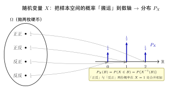
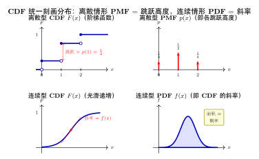

# 第三部分导论：分布到底是什么？

> **难度**：★★☆☆☆
> **前置知识**：第4章离散随机变量、第5章连续随机变量、第6章多维随机变量
> **定位**：这是第二部分（随机变量）到第三部分（常见分布族）之间的**概念桥梁**。第7–9章会逐一介绍伯努利、二项、泊松、正态、Gamma…… 这些"具名分布"，但在动手之前，必须先回答一个被很多教材跳过的问题——**"分布"本身，到底是什么数学对象？**

---

## 学习目标

- 说清"分布"是一个**独立于随机变量的数学对象**：它是随机变量在取值空间上**诱导出的概率分配**
- 理解 $P_X = P\circ X^{-1}$（诱导/推前概率）的直观含义，以及"两个随机变量同分布"到底意味着什么
- 理解**累积分布函数（CDF）是刻画任意分布的统一语言**，并掌握"满足三条性质的函数 $\Leftrightarrow$ 一个分布"的一一对应
- 看懂 PMF 与 PDF 只是 CDF 在离散 / 连续两种情形下的**特例表达**
- 理解"**分布族**"是带参数的一组分布，从而明白第7–9章在按什么逻辑组织
- 通过二项分布与均匀分布两个范例，掌握"**推导一个分布**"的标准动作

---

## 0.1 为什么要单独讲"分布"

在第二部分，我们学了不少东西：离散随机变量有概率质量函数（PMF）$p(x)$，连续随机变量有概率密度函数（PDF）$f(x)$，两者都有累积分布函数（CDF）$F(x)=P(X\le x)$。我们也反复使用一句话——"$X$ **服从**某某分布"，记作 $X\sim B(n,p)$、$X\sim N(\mu,\sigma^2)$。

但请停下来想一个问题：

> **引子**：甲在抛一枚均匀硬币，正面记 $X=1$、反面记 $X=0$；乙在一副扑克里随机抽一张，红色记 $Y=1$、黑色记 $Y=0$。这是两个**完全不同的随机试验**——样本空间不同（$\{$正,反$\}$ vs 52 张牌）、随机变量的定义也不同。可我们却会说："$X$ 和 $Y$ **服从同一个分布**。"
>
> 凭什么？它们到底"同"在哪里？

答案是：它们作为函数、作为试验都不同，但**"取值 1 的概率都是 $\tfrac12$、取值 0 的概率都是 $\tfrac12$"这件事相同**。这个"概率在各个取值上怎么分配"的规则，就是**分布**。

换句话说，第二部分我们总是盯着"某个具体随机变量"看它的 PMF/PDF/CDF；而**"分布"是把视线从随机变量本身移开，只关注它把概率分配到取值空间各处的那张"分配方案"**。这张方案可以脱离具体试验、脱离具体的 $X$ 而独立存在——这正是为什么我们能把它们抽出来、起名字、编成"分布族"，专门用第7–9章三章来研究。

---

## 0.2 从随机变量到分布：被"诱导"出来的概率分配

回忆随机变量的本质（第4章）：一个随机变量 $X$ 是从样本空间到实数的一个函数

$$X:\ \Omega \longrightarrow \mathbb{R},\qquad \omega \mapsto X(\omega).$$

样本空间 $\Omega$ 上原本带着一个概率 $P$（它告诉我们每个"原始结果" $\omega$ 发生的可能性）。随机变量 $X$ 就像一台**"搬运机"**：它把 $\Omega$ 上的概率，沿着函数 $X$ **搬运到数轴 $\mathbb{R}$ 上**。

搬运后，数轴上每个区域 $B$（比如一个区间）就有了一个概率：**"$X$ 落进 $B$ 的概率"**。它等于"那些被 $X$ 送进 $B$ 的原始结果 $\omega$"的总概率：

$$P_X(B) \;=\; P(X\in B) \;=\; P\big(\{\omega\in\Omega:\ X(\omega)\in B\}\big).$$

我们把这个定义在取值空间上的 $P_X$ 叫做 **$X$ 的分布**（distribution），也叫 **$X$ 的概率律**（the *law* of $X$）。用更紧凑的记号：

$$\boxed{\,P_X = P\circ X^{-1}\,}$$

这里 $X^{-1}(B)=\{\omega:X(\omega)\in B\}$ 是 $B$ 的**原像**——"哪些 $\omega$ 会被搬到 $B$ 里"。这种由 $X$ 把 $P$ "推到前面"得到的 $P_X$，数学上称为**诱导概率**或**推前测度（pushforward）**。这一句话就是"分布"的精确数学含义。

> **关键转变（务必体会）**：一旦得到 $P_X$，我们就可以**彻底忘掉** $\Omega$、忘掉 $X$ 这个函数本身，只保留 $P_X$——一张"数轴上各处概率多少"的分配表。**分布 = 这张分配表。**

现在回头看 0.1 的引子就一目了然了。甲的 $\Omega=\{$正,反$\}$、乙的 $\Omega=$ 52 张牌，$X$ 与 $Y$ 是不同的函数；但它们诱导出的分配表

$$P_X(\{1\})=P_Y(\{1\})=\tfrac12,\qquad P_X(\{0\})=P_Y(\{0\})=\tfrac12$$

**完全相同**。所以：

> **同分布的定义**：称 $X$ 与 $Y$ **同分布**（记作 $X \stackrel{d}{=} Y$），当且仅当 $P_X = P_Y$，即对一切区域 $B$ 都有 $P(X\in B)=P(Y\in B)$。底层的 $\Omega$、$P$、函数本身是否相同，**一概无关**。

这个"只看分配、不看出身"的视角，是整个第三部分乃至后面统计学的思维基础。

---

## 0.3 CDF：刻画任意分布的统一语言

$P_X$ 虽然定义清楚，但直接用它并不方便——它要对**所有可能的区域 $B$** 都给出概率，信息量太大、没法"写下来"。我们需要一个**有限、可书写的描述**，能完整决定整个 $P_X$。这个描述就是**累积分布函数**：

$$F(x) \;=\; P_X\big((-\infty,x]\big) \;=\; P(X\le x).$$

它只是一个一元实函数，却足以**恢复一切区间的概率**。例如对任意 $a<b$：

$$P(a < X \le b) \;=\; F(b)-F(a).$$

> **为什么"一个一元函数"就够了？** 区间 $(-\infty,x]$ 这一族集合，通过取差、取并、取极限，可以"拼出"我们关心的几乎所有区域。所以只要知道每个 $(-\infty,x]$ 的概率（也就是知道 $F$），整张分配表 $P_X$ 就被唯一确定了。这是把"对所有 $B$ 指定概率"压缩成"一个函数 $F$"的关键。

**CDF 的三条刻画性质**（与第4、5章一致）：

1. **单调不减**：$x_1<x_2 \Rightarrow F(x_1)\le F(x_2)$；
2. **右连续**：$\displaystyle\lim_{x\to a^+}F(x)=F(a)$；
3. **两端极限**：$\displaystyle\lim_{x\to-\infty}F(x)=0,\quad \lim_{x\to+\infty}F(x)=1$。

最深刻的一点是**这三条不仅是必要的，而且是充分的**：

> **分布 $\Leftrightarrow$ CDF 一一对应定理**：任何满足上述三条性质的函数 $F$，都**唯一对应**一个分布 $P_X$；反过来，每个分布也唯一确定它的 $F$。

这正是"分布的数学意义"落到实处的地方——**研究一个分布，等价于研究一个满足三条性质的函数 $F$**。我们不必每次都回到抽象的 $P_X=P\circ X^{-1}$，只要交出一个合格的 $F$（或下一节的 PMF/PDF），就完整地"给出了一个分布"。

---

## 0.4 PMF 与 PDF：CDF 的两种特例表达

既然 CDF 能刻画一切分布，那第二部分熟悉的 PMF 和 PDF 是什么？答案是：它们是 CDF 在**两种典型情形**下的"局部细节",描述同一个 $F$ 的两种等价方式。

**离散情形——CDF 是阶梯函数。** 若 $X$ 只在可数个点 $x_1,x_2,\dots$ 取值，则 $F$ 在每个 $x_i$ 处**向上跳一格**，跳跃的高度恰好是该点的概率：

$$p(x_i) \;=\; F(x_i)-F(x_i^-) \;=\; P(X=x_i).$$

这些跳跃高度的集合 $\{p(x_i)\}$ 就是 **PMF**。"分配表"在这里是离散的：概率像砝码一样**集中堆在一个个点**上。

**连续情形——CDF 是光滑（可导）函数。** 若 $F$ 处处连续且几乎处处可导，则它没有跳跃，概率不再堆在点上，而是**抹开成一条密度**。此时

$$f(x) \;=\; F'(x),\qquad\text{反过来}\qquad F(x)=\int_{-\infty}^{x} f(t)\,dt.$$

导数 $f$ 就是 **PDF**。它不是"某点的概率"（连续情形下单点概率为 0），而是"概率的**密集程度**"——某处 $f$ 越大，概率在那附近堆得越密。

| 描述方式 | 离散分布 | 连续分布 | 统一身份 |
|---|---|---|---|
| **CDF** $F(x)$ | 阶梯函数 | 光滑递增曲线 | 都是 $P(X\le x)$，永远存在 |
| **逐点细节** | PMF $p(x_i)=$ 跳跃高度 | PDF $f(x)=F'(x)=$ 斜率 | 都是"分配"的局部刻画 |
| **求区间概率** | 求和 $\sum_{a<x_i\le b}p(x_i)$ | 积分 $\int_a^b f(x)\,dx$ | 都等于 $F(b)-F(a)$ |
| **归一化** | $\sum_i p(x_i)=1$ | $\int_{-\infty}^{+\infty}f(x)\,dx=1$ | 都等于 $F(+\infty)-F(-\infty)=1$ |

**一句话总结**：CDF 是"分布"的通用身份证，离散世界用 PMF（跳跃高度）、连续世界用 PDF（斜率/密度）去描述同一张身份证的细节。三者描述的是**同一个分布**。

---

## 0.5 分布族：参数化的"一组分布"

到此我们知道"一个分布"是什么了。但第7–9章的标题是"分布**族**"——这是更进一步的抽象。

回到 0.1 的硬币：$P(X=1)=p$ 时，取不同的 $p$（$0<p<1$）就得到**不同的分布**。$p=0.5$ 是均匀硬币，$p=0.9$ 是偏心硬币——它们的 CDF 不同、是不同的分布，但**结构完全一样**，都长成 $P(X=1)=p,\ P(X=0)=1-p$ 的样子。把这一整族分布打包，就是**伯努利分布族**：

$$\big\{\,\text{Bernoulli}(p)\ :\ p\in(0,1)\,\big\}.$$

一般地：

> **分布族**（family of distributions）是由一个**参数** $\theta$ 索引的一组分布
> $$\{\,F(\cdot\,;\theta)\ :\ \theta\in\Theta\,\},$$
> 其中 $\theta$ 取自参数空间 $\Theta$。给定一个具体的 $\theta$，就锁定族里的一个具体分布。

- $\text{Bernoulli}(p)$：参数 $\theta=p$；
- $B(n,p)$：参数 $\theta=(n,p)$；
- $N(\mu,\sigma^2)$：参数 $\theta=(\mu,\sigma^2)$，连续两个参数，对应一整片正态曲线。

**为什么值得专门研究这些"具名分布族"？** 因为它们各自对应一类**反复出现的随机生成机制**：数固定次数试验中的成功数 → 二项族；数稀有事件的发生数 → 泊松族；大量微小因素叠加 → 正态族……现实中绝大多数随机现象，都能对号入座到某个分布族，然后**只剩下"估计参数 $\theta$"这一件事**——这也正是第五、六部分（统计推断）的出发点。第7–9章的任务，就是把最常用的这些族，连同它们的生成机制、PMF/PDF、期望方差、相互关系，一次讲清。

---

## 0.6 推导过程范例：一个分布是怎么"被推出来"的

理论说完，看两个范例，体会"**推导一个分布**"具体在做什么——本质上就是：**从一个随机生成机制出发，算出它把概率分配到每个取值上各是多少。**

### 范例一（离散）：二项分布从生成机制推出 PMF

**第 1 步——写清生成机制。** 独立重复做 $n$ 次伯努利试验，每次成功概率 $p$。令 $X=$ 成功的总次数。取值空间是 $\{0,1,2,\dots,n\}$。

**第 2 步——算每个取值的概率。** 求 $P(X=k)$。某一种"恰好 $k$ 次成功"的具体序列（比如前 $k$ 次成功、后 $n-k$ 次失败），因各次独立，其概率是

$$\underbrace{p\cdot p\cdots p}_{k\text{ 个}}\cdot \underbrace{(1-p)\cdots(1-p)}_{n-k\text{ 个}}=p^k(1-p)^{n-k}.$$

而"恰好 $k$ 次成功"对应的不同序列有 $\binom{n}{k}$ 种（从 $n$ 个位置里选 $k$ 个放成功），每种概率都相同，故相加：

$$\boxed{\,P(X=k)=\binom{n}{k}p^k(1-p)^{n-k},\quad k=0,1,\dots,n.\,}$$

这张"$k\mapsto P(X=k)$"的表，就是二项分布的 PMF——**分布到此就被"推出来"了**。

**第 3 步——验证归一化（确认它真是一个分布）。** 由二项式定理，

$$\sum_{k=0}^{n}\binom{n}{k}p^k(1-p)^{n-k}=\big(p+(1-p)\big)^n=1.\ \checkmark$$

总概率为 1，三条性质中最关键的一条得到满足，确认这是一个合法分布。

### 范例二（连续）：均匀分布从"等可能落点"推出 PDF

**生成机制**：在区间 $[a,b]$ 上"完全随机、无偏好"地取一个点 $X$。"无偏好"意味着 $X$ 落在任何子区间的概率，**只与该子区间的长度成正比**，与位置无关。

**推 CDF**：对 $a\le x\le b$，落在 $[a,x]$ 的概率正比于长度 $x-a$，且落在整个 $[a,b]$ 的概率为 1，于是

$$F(x)=P(X\le x)=\frac{x-a}{b-a},\quad a\le x\le b.$$

**求导得 PDF**：

$$f(x)=F'(x)=\frac{1}{b-a},\quad a\le x\le b\ \ (\text{区间外为 }0).$$

得到一个"平台"形状的密度——这正是均匀分布 $U(a,b)$。**归一化检验**：$\int_a^b \frac{1}{b-a}\,dx=1$ $\checkmark$。

> **范例的共同套路**：① 说清生成机制与取值空间 → ② 用古典概率 / 独立性 / 几何概率算出 PMF 或 CDF → ③ 验证归一化。第7–9章每个具名分布，本质上都走这同一条推导路径，只是机制和算法各不相同。

---

## 0.7 小结与衔接

**核心一句话**：**分布 = 随机变量诱导在取值空间上的那张"概率分配表"$P_X=P\circ X^{-1}$；它被 CDF 完整刻画，离散时细化为 PMF、连续时细化为 PDF；带参数打包成一组，就是分布族。**

**思考路标（条件反射）**：

- 看到"$X\sim$ 某分布" → 想的是它的**分配表 $P_X$ / CDF**，而不是某个具体试验；
- 看到"求 $X$ 的分布" → 落实为**求出 CDF $F(x)$，或求出 PMF / PDF**；
- 看到"证 $X,Y$ 同分布" → 证 $F_X\equiv F_Y$（或 $P_X=P_Y$），**与底层试验无关**；
- 看到"给一个函数，问是不是某分布的 CDF" → 查**三条性质**（单调不减、右连续、两端 0/1）；
- 看到一个**带参数**的分布名（如 $N(\mu,\sigma^2)$） → 意识到这是**一族**分布，具体哪条由参数 $\theta$ 锁定；
- 看到"推导某分布的 PMF/PDF" → 套**三步**：写生成机制 → 算每点/区间概率 → 验归一化。

**接下来三章**，就是把最常用的分布族逐一"对号入座、连同生成机制一起推清楚"：

| 章节 | 主题 | 这些分布是哪种"分配表" |
|---|---|---|
| [第7章 离散分布族](./07-discrete-distributions.md) | 伯努利、二项、泊松、几何、负二项、超几何 | 概率堆在离散点上的 PMF |
| [第8章 连续分布族](./08-continuous-distributions.md) | 均匀、指数、正态、Gamma、Beta | 概率抹成密度的 PDF |
| [第9章 多维分布](./09-multivariate-distributions.md) | 多项、多元正态、Dirichlet | 多个变量联合的分配表 |

带着"分布 = 概率分配表"这把钥匙，再去读第7章的伯努利分布，你看到的就不再是一条孤立公式，而是"一台 0/1 搬运机诱导出的、最简单的那张分配表"。
