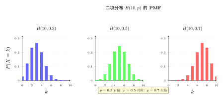
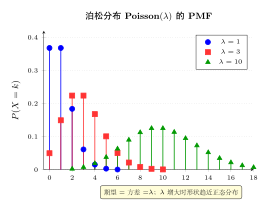
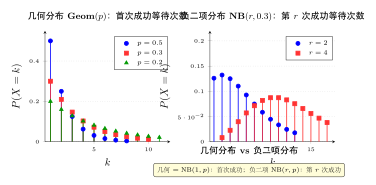
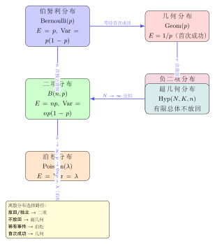

# 第 7 章 常见离散分布（融合版）

> **难度**：★★★☆☆
> **前置知识**：第 4 章离散随机变量、第 5 章连续随机变量、第 6 章多维随机变量
> **本文件**：融合"原版严格推导 + 重写版高中模板 D 速记 / 套路 / 自测"。保留原版完整正文（学习目标 / 7.1–7.5 / 深度学习应用 / 练习题）+ 在最前置 + 最后追加思维训练。

---

## 一例速记

> **Bernoulli$(p)$**：$p(x)=p^x(1-p)^{1-x}$，$x\in\{0,1\}$；$E=p$，$\text{Var}=p(1-p)$。
> **Binomial$(n,p)$**：$p(k)=\binom{n}{k}p^k(1-p)^{n-k}$，$k=0,\ldots,n$；$E=np$，$\text{Var}=np(1-p)$。
> **Geometric$(p)$**：$p(k)=(1-p)^{k-1}p$，$k=1,2,\ldots$；$E=\tfrac{1}{p}$，$\text{Var}=\tfrac{1-p}{p^2}$；唯一离散无记忆分布。
> **NegBinomial$(r,p)$**：$p(k)=\binom{k-1}{r-1}p^r(1-p)^{k-r}$，$k\geq r$；$E=\tfrac{r}{p}$，$\text{Var}=\tfrac{r(1-p)}{p^2}$；几何为 $r=1$ 特例。
> **Poisson$(\lambda)$**：$p(k)=\tfrac{\lambda^k e^{-\lambda}}{k!}$，$k=0,1,2,\ldots$；$E=\lambda$，$\text{Var}=\lambda$（期望 $=$ 方差是显著特征）。
> **Hypergeometric$(N,K,n)$**：$p(k)=\tfrac{\binom{K}{k}\binom{N-K}{n-k}}{\binom{N}{n}}$；$E=n\tfrac{K}{N}$，$\text{Var}=n\tfrac{K}{N}\tfrac{N-K}{N}\tfrac{N-n}{N-1}$；不放回抽样专用。

---

## 引入：反直觉 / 动机题

> **题目（Poisson 近似与稀有事件）**：假设一条航线一年内发生空难的概率为 $p = 0.001$（千分之一）。全球共有 $n = 5000$ 条航线，问**一年中至少发生一次空难的概率**是多少？

请先停下来想一想：直觉上，$p$ 极小，但 $n$ 很大，最终概率是接近 0 还是接近 1？

**直觉陷阱**：直接说"概率极小"——这是**典型错误**。稀有事件乘以大样本量会"积累"成显著概率。

**精确计算**（二项分布）：$P(X \geq 1) = 1 - P(X = 0) = 1 - (1 - 0.001)^{5000} = 1 - 0.999^{5000}$。

计算 $0.999^{5000} = e^{5000 \ln 0.999} \approx e^{-5} \approx 0.0067$，因此：

$$P(X \geq 1) \approx 1 - 0.0067 = 99.33\%$$

**用 Poisson 近似**（$\lambda = np = 5000 \times 0.001 = 5$，满足 $n$ 大 $p$ 小）：

$$P(X \geq 1) = 1 - P(X=0) = 1 - e^{-5} \approx 1 - 0.0067 = 99.33\%$$

两种方法高度吻合。关键结论：**稀有事件在大量独立重复下累积出的概率远比直觉高**——这正是 Poisson 分布的威力，也是保险精算、网络安全、流行病学的核心工具。

**延伸：几何分布无记忆性的反直觉**

若某算法每步有 $p = 0.1$ 的概率收敛，已经迭代了 $20$ 步仍未收敛，问"再迭代至少 $10$ 步才能收敛"的概率——很多人的直觉是"已经迭代那么久了，应该快收敛了"。

事实上，由无记忆性：$P(X > 30 \mid X > 20) = P(X > 10) = 0.9^{10} \approx 34.9\%$，与初始时"至少需要 10 步"的概率**完全相同**——过去的失败不提供任何关于未来的信息。

---

## 思维路径还原（解题者的内心独白）

> "看到一道离散分布题，我的第一反应是**识别场景，对号入座**：
>
> **判断 1：试验次数是否固定？**
> - 固定 $n$ 次 → 统计成功次数 → **二项分布** $B(n,p)$
> - 不固定次数，等到"第一次成功" → **几何分布** $\text{Geom}(p)$
> - 不固定次数，等到"第 $r$ 次成功" → **负二项分布** $\text{NB}(r,p)$
> - 只做一次试验，结果为 0 或 1 → **Bernoulli$(p)$**（二项的 $n=1$ 特例）
>
> **判断 2：是稀有事件的计数还是有限总体抽样？**
> - 单位时间/空间内的事件计数，且 $\lambda = np$（$n$ 大 $p$ 小） → **Poisson$(\lambda)$**
> - 有限总体 $N$，**不放回**抽 $n$ 个，统计成功数 → **超几何分布** $\text{Hyp}(N,K,n)$
>
> **判断 3：放回 vs 不放回？**
> - 放回（或总体无限） → **二项分布**（每次试验独立，成功概率恒为 $p$）
> - 不放回（有限总体） → **超几何分布**（每次试验不独立，但期望相同）
>
> **判断 4：看到"期望=方差"？**
> → 立即想到 **Poisson**，检验 $\lambda$ 是否合理
>
> **判断 5：看到"无记忆性"关键词？**
> → 离散场景唯一选择：**几何分布**；连续场景：**指数分布**
>
> **计算步骤**：
> 1. 写出分布族和参数（如 $X \sim B(n, p)$，$n=20, p=0.3$）
> 2. 代入 PMF 或用期望/方差公式（不必手算 PMF 之和）
> 3. 若题目涉及近似，判断是否满足 Poisson 近似条件（$n>20$，$p<0.05$；或 $n>100$，$p<0.1$），令 $\lambda = np$
> 4. 验证归一化（对数学证明题；应用题直接套公式）
>
> **警惕陷阱**：二项的期望是 $np$，不是 $p$；方差是 $np(1-p)$，不是 $np$。超几何的方差比二项小（多了修正因子 $\frac{N-n}{N-1} < 1$）。"

---

## 学习目标

- 掌握伯努利分布、二项分布、泊松分布、几何分布、负二项分布、超几何分布的 PMF、期望与方差
- 理解各离散分布之间的内在联系（如泊松分布是二项分布的极限）
- 能够根据实际问题的特征正确选择合适的离散分布模型
- 深刻理解二元交叉熵损失与伯努利分布的概率论本质
- 掌握离散分布在深度学习中的应用：分类、计数建模与序列生成

---

## 7.1 伯努利分布与二项分布

### 7.1.1 伯努利分布

**伯努利试验**（Bernoulli Trial）是只有两种结果的随机试验：成功（记为1）或失败（记为0）。

**定义**：若随机变量 $X$ 满足

$$P(X = 1) = p, \quad P(X = 0) = 1 - p, \quad 0 < p < 1$$

则称 $X$ 服从参数为 $p$ 的**伯努利分布**，记作 $X \sim \text{Bernoulli}(p)$。

**PMF的统一写法**：

$$p(x) = p^x (1-p)^{1-x}, \quad x \in \{0, 1\}$$

**期望与方差**：

$$E[X] = p$$

$$\text{Var}(X) = E[X^2] - (E[X])^2 = p - p^2 = p(1-p)$$

方差在 $p = 1/2$ 时取最大值 $1/4$，即不确定性最大。

**例7.1**：某神经元以概率 $p = 0.7$ 被激活，$X$ 表示该神经元是否激活，则 $X \sim \text{Bernoulli}(0.7)$，$E[X] = 0.7$，$\text{Var}(X) = 0.21$。

---

### 7.1.2 二项分布

将伯努利试验**独立重复** $n$ 次，记成功次数为 $X$，则 $X$ 服从**二项分布**。

**定义**：若 $X$ 表示 $n$ 次独立伯努利试验中成功的次数，每次成功概率为 $p$，则

$$P(X = k) = \binom{n}{k} p^k (1-p)^{n-k}, \quad k = 0, 1, \ldots, n$$

记作 $X \sim B(n, p)$ 或 $X \sim \text{Binomial}(n, p)$。

**组合数** $\binom{n}{k} = \frac{n!}{k!(n-k)!}$ 表示从 $n$ 次试验中选取 $k$ 次成功的方案数。

**归一化验证**：由二项式定理，

$$\sum_{k=0}^{n} \binom{n}{k} p^k (1-p)^{n-k} = (p + (1-p))^n = 1 \checkmark$$

**期望**（利用线性性：$X = X_1 + X_2 + \cdots + X_n$，$X_i \sim \text{Bernoulli}(p)$）：

$$E[X] = np$$

**方差**（各 $X_i$ 独立，方差可加）：

$$\text{Var}(X) = np(1-p)$$

**例7.2**：某图像分类器对每张图片的预测准确率为 $p = 0.9$，对 $n = 20$ 张图片进行预测，正确预测数 $X \sim B(20, 0.9)$。

$$E[X] = 18, \quad \text{Var}(X) = 20 \times 0.9 \times 0.1 = 1.8$$

$P(X = 20) = 0.9^{20} \approx 0.1216$，即全部预测正确的概率约为 $12.16\%$。

**二项分布的形状**：
- 当 $p = 0.5$ 时，分布关于 $n/2$ 对称
- 当 $p < 0.5$ 时，分布右偏；$p > 0.5$ 时左偏
- 随 $n$ 增大，形状趋近于正态分布（中心极限定理）

---

## 7.2 泊松分布

### 7.2.1 定义与PMF

**泊松分布**用于描述在**固定时间或空间区间内**，某稀有事件发生次数的分布。

**定义**：若随机变量 $X$ 的PMF为

$$P(X = k) = \frac{\lambda^k e^{-\lambda}}{k!}, \quad k = 0, 1, 2, \ldots$$

其中 $\lambda > 0$ 为参数，则称 $X$ 服从参数为 $\lambda$ 的**泊松分布**，记作 $X \sim \text{Poisson}(\lambda)$ 或 $X \sim P(\lambda)$。

**归一化验证**：由指数函数的泰勒展开，

$$\sum_{k=0}^{\infty} \frac{\lambda^k e^{-\lambda}}{k!} = e^{-\lambda} \sum_{k=0}^{\infty} \frac{\lambda^k}{k!} = e^{-\lambda} \cdot e^{\lambda} = 1 \checkmark$$

**期望与方差**：

$$E[X] = \lambda, \quad \text{Var}(X) = \lambda$$

泊松分布的一个显著特征是**期望等于方差**，都等于参数 $\lambda$。

### 7.2.2 泊松分布是二项分布的极限

**定理（泊松极限定理）**：设 $X_n \sim B(n, p_n)$，当 $n \to \infty$，$p_n \to 0$，且 $np_n \to \lambda$（常数）时，

$$P(X_n = k) \to \frac{\lambda^k e^{-\lambda}}{k!}, \quad k = 0, 1, 2, \ldots$$

**直观理解**：试验次数很多（$n$ 大），但每次成功概率极小（$p$ 小），平均成功次数 $\lambda = np$ 为常数。这正是"稀有事件"的特征。

**证明要点**：

$$\binom{n}{k} p^k (1-p)^{n-k} = \frac{n(n-1)\cdots(n-k+1)}{k!} \cdot \left(\frac{\lambda}{n}\right)^k \cdot \left(1 - \frac{\lambda}{n}\right)^{n-k}$$

当 $n \to \infty$ 时：
- $\frac{n(n-1)\cdots(n-k+1)}{n^k} \to 1$
- $\left(1 - \frac{\lambda}{n}\right)^n \to e^{-\lambda}$
- $\left(1 - \frac{\lambda}{n}\right)^{-k} \to 1$

因此极限为 $\frac{\lambda^k e^{-\lambda}}{k!}$。

**实用准则**：当 $n \geq 20$，$p \leq 0.05$（或 $n \geq 100$，$p \leq 0.1$）时，可用泊松分布近似二项分布，令 $\lambda = np$。

### 7.2.3 泊松分布的典型应用

| 应用场景 | $\lambda$ 的含义 |
|----------|-----------------|
| 每小时到达服务台的顾客数 | 单位时间平均到达率 |
| 某网页每天收到的点击次数 | 日均点击量 |
| 文本中某罕见词的出现次数 | 每千词平均出现次数 |
| 放射性衰变计数 | 单位时间平均衰变数 |

**例7.3**：某服务器每分钟平均接收 $\lambda = 3$ 个请求，$X \sim \text{Poisson}(3)$。

$$P(X = 0) = e^{-3} \approx 0.0498, \quad P(X = 5) = \frac{3^5 e^{-3}}{5!} = \frac{243 e^{-3}}{120} \approx 0.1008$$

### 7.2.4 泊松过程

泊松分布与**泊松过程**密切相关。泊松过程是描述随时间随机发生的事件的数学模型，满足：
1. 不相交时间区间内的事件数**独立**
2. 事件发生率为常数 $\lambda$（单位时间平均发生数）
3. 极短时间内同时发生两个事件的概率可忽略

在时间区间 $[0, t]$ 内发生的事件数 $N(t) \sim \text{Poisson}(\lambda t)$。

---

## 7.3 几何分布与负二项分布

### 7.3.1 几何分布

在独立重复的伯努利试验中，**首次成功**所需的试验次数服从几何分布。

**定义**：设每次试验成功概率为 $p$，$X$ 为首次成功时的试验次数，则

$$P(X = k) = (1-p)^{k-1} p, \quad k = 1, 2, 3, \ldots$$

记作 $X \sim \text{Geom}(p)$。

**另一种定义**（首次成功前的失败次数 $Y = X - 1$）：

$$P(Y = k) = (1-p)^k p, \quad k = 0, 1, 2, \ldots$$

**归一化验证**：

$$\sum_{k=1}^{\infty} (1-p)^{k-1} p = p \cdot \frac{1}{1-(1-p)} = 1 \checkmark$$

**期望与方差**：

$$E[X] = \frac{1}{p}, \quad \text{Var}(X) = \frac{1-p}{p^2}$$

直观地，成功概率越小，平均需要等待越久。

### 7.3.2 无记忆性

几何分布具有**无记忆性**（Memoryless Property），即过去的失败不影响未来的预期：

$$P(X > m + n \mid X > m) = P(X > n), \quad m, n \geq 0$$

**证明**：

$$P(X > m + n \mid X > m) = \frac{P(X > m + n)}{P(X > m)} = \frac{(1-p)^{m+n}}{(1-p)^m} = (1-p)^n = P(X > n)$$

**几何分布是离散分布中唯一具有无记忆性的分布**（类比连续分布中的指数分布）。

**例7.4**：某算法每次迭代有 $p = 0.2$ 的概率收敛，则收敛所需迭代次数 $X \sim \text{Geom}(0.2)$。$E[X] = 5$，即平均需要 $5$ 次迭代。

### 7.3.3 负二项分布

将几何分布推广：在独立重复伯努利试验中，**第 $r$ 次成功**所需的试验次数服从负二项分布。

**定义**：若 $X$ 为第 $r$ 次成功时的总试验次数，则

$$P(X = k) = \binom{k-1}{r-1} p^r (1-p)^{k-r}, \quad k = r, r+1, r+2, \ldots$$

记作 $X \sim \text{NB}(r, p)$。

理解：第 $k$ 次试验恰好是第 $r$ 次成功，意味着前 $k-1$ 次中恰好有 $r-1$ 次成功，第 $k$ 次必须成功。

**另一种等价参数化**（前 $r$ 次成功前的失败次数 $Y = X - r$）：

$$P(Y = k) = \binom{k+r-1}{k} p^r (1-p)^k, \quad k = 0, 1, 2, \ldots$$

**期望与方差**（总试验次数 $X$ 的）：

$$E[X] = \frac{r}{p}, \quad \text{Var}(X) = \frac{r(1-p)}{p^2}$$

**关系**：当 $r = 1$ 时，负二项分布退化为几何分布。若 $X_1, X_2, \ldots, X_r$ 独立同分布 $\text{Geom}(p)$，则 $X_1 + X_2 + \cdots + X_r \sim \text{NB}(r, p)$。

**例7.5**：某机器学习模型训练时，每个 epoch 有 $p = 0.3$ 的概率使验证集性能提升，求第 $3$ 次性能提升时的期望 epoch 数。

$$X \sim \text{NB}(3, 0.3), \quad E[X] = \frac{3}{0.3} = 10$$

---

## 7.4 超几何分布

### 7.4.1 定义

超几何分布描述**有限总体中不放回抽样**的分布，与二项分布（放回抽样或无穷总体）形成对比。

**设置**：总体中有 $N$ 个元素，其中 $K$ 个为"成功"，$N-K$ 个为"失败"。从中**不放回**地随机抽取 $n$ 个，$X$ 为抽到的成功数。

**PMF**：

$$P(X = k) = \frac{\binom{K}{k} \binom{N-K}{n-k}}{\binom{N}{n}}, \quad \max(0, n-(N-K)) \leq k \leq \min(n, K)$$

记作 $X \sim \text{Hypergeometric}(N, K, n)$。

**直观理解**：从 $K$ 个成功中选 $k$ 个，从 $N-K$ 个失败中选 $n-k$ 个，占总选法 $\binom{N}{n}$ 的比例。

**期望与方差**：

$$E[X] = n \cdot \frac{K}{N}$$

$$\text{Var}(X) = n \cdot \frac{K}{N} \cdot \frac{N-K}{N} \cdot \frac{N-n}{N-1}$$

其中 $\frac{N-n}{N-1}$ 称为**有限总体修正因子**（Finite Population Correction Factor）。当 $N \to \infty$ 时，修正因子趋近于1，超几何分布趋近于二项分布 $B(n, K/N)$。

### 7.4.2 超几何分布与二项分布的比较

| 特征 | 二项分布 $B(n,p)$ | 超几何分布 $\text{Hyp}(N,K,n)$ |
|------|-------------------|-------------------------------|
| 抽样方式 | 放回抽样（或无限总体） | 不放回抽样 |
| 每次试验独立性 | 独立 | 不独立 |
| 成功概率 | 每次均为 $p$ | 随已抽情况变化 |
| 方差 | $np(1-p)$ | $np(1-p) \cdot \frac{N-n}{N-1}$ |

当 $n/N$ 较小（抽样比例小于5%）时，超几何分布可用二项分布近似。

**例7.6**：某数据集包含 $N = 1000$ 条样本，其中 $K = 300$ 条标注为正类。随机（不放回）抽取 $n = 50$ 条，$X$ 为正类样本数。

$$X \sim \text{Hyp}(1000, 300, 50)$$

$$E[X] = 50 \times \frac{300}{1000} = 15$$

$$\text{Var}(X) = 50 \times \frac{300}{1000} \times \frac{700}{1000} \times \frac{950}{999} \approx 10.36$$

若改用二项分布近似（$p = 0.3$）：$\text{Var}(X) = 50 \times 0.3 \times 0.7 = 10.5$，误差很小。

---

## 7.5 离散分布族的统一视角

### 7.5.1 指数族框架

许多常见离散分布（包括伯努利、二项、泊松、几何、负二项）都属于**指数族**（Exponential Family），其PMF可以写成统一形式：

$$p(x; \theta) = h(x) \exp\left(\eta(\theta)^T T(x) - A(\theta)\right)$$

其中：
- $\eta(\theta)$：自然参数（Natural Parameter）
- $T(x)$：充分统计量（Sufficient Statistic）
- $A(\theta)$：对数配分函数（Log-partition Function），保证归一化
- $h(x)$：基础测度

**伯努利分布的指数族形式**（以 $\text{Bernoulli}(p)$ 为例）：

$$p(x; p) = p^x(1-p)^{1-x} = \exp\left(x \log\frac{p}{1-p} + \log(1-p)\right)$$

其中 $\eta = \log\frac{p}{1-p}$（log-odds，即logit函数），$T(x) = x$，$A(\eta) = \log(1 + e^\eta)$。

指数族框架的优势：自动保证存在充分统计量，最大似然估计有封闭解，梯度下降计算简洁。

### 7.5.2 分布之间的关系图谱

```
Bernoulli(p)
    ↓ n次独立叠加
Binomial(n, p)
    ↓ n→∞, p→0, np=λ (泊松极限)
Poisson(λ)

Bernoulli(p)
    ↓ 等待首次成功
Geometric(p)
    ↓ 等待第r次成功
NegBinomial(r, p)

Binomial(n, K/N) ← N→∞近似
    Hypergeometric(N, K, n) ← 有限总体，不放回
```

### 7.5.3 选择分布的决策框架

在实际建模中，根据问题特征选择合适的分布：

| 问题特征 | 推荐分布 |
|----------|----------|
| 单次试验，二元结果 | 伯努利分布 |
| $n$ 次独立试验，统计成功次数 | 二项分布 |
| 固定时间/空间内，稀有事件计数 | 泊松分布 |
| 等待首次成功的试验次数 | 几何分布 |
| 等待第 $r$ 次成功的试验次数 | 负二项分布 |
| 有限总体，不放回抽样 | 超几何分布 |

### 7.5.4 最大似然估计（MLE）总结

给定 $n$ 个独立同分布观测值 $x_1, x_2, \ldots, x_n$：

- **Bernoulli$(p)$**：$\hat{p} = \bar{x} = \frac{1}{n}\sum_{i=1}^n x_i$
- **Poisson$(\lambda)$**：$\hat{\lambda} = \bar{x}$
- **Geometric$(p)$**：$\hat{p} = \frac{1}{\bar{x}}$

MLE的直观性：参数估计值等于样本均值（或其函数），体现了"用样本统计量估计总体参数"的核心思想。

---

## 几何示意

### 图 7-1：二项分布 PMF 棒图



> $B(10, p)$ 的 PMF：$p = 0.3$（右偏）、$p = 0.5$（对称）、$p = 0.7$（左偏）三组对比，直观呈现参数变化对分布形状的影响。

### 图 7-2：泊松分布不同 $\lambda$ 下的 PMF



> $\lambda = 1$（高度集中于 0-2）、$\lambda = 3$（峰值在 2-3）、$\lambda = 10$（峰值在 9-10）三条 PMF 曲线。注意 $\lambda$ 增大时分布趋于对称（中心极限定理效应）。

### 图 7-3：几何分布与负二项分布 PMF 对比



> 左图：$\text{Geom}(p)$ 的 PMF，$p = 0.2, 0.5, 0.8$；右图：$\text{NB}(r, 0.3)$ 的 PMF，$r = 1, 3, 5$（注意 $r=1$ 即退化为几何分布）。几何分布总单调递减；负二项在 $r > 1$ 时出现钟形。

### 图 7-4：离散分布族关系图（Bernoulli → 二项 → 泊松 / 超几何）



> 有向图展示：Bernoulli $\xrightarrow{n\text{次叠加}}$ 二项 $\xrightarrow{n\to\infty,\,np=\lambda}$ Poisson；几何 $\xrightarrow{r\text{次叠加}}$ 负二项；超几何 $\xrightarrow{N\to\infty}$ 二项。

---

## 抽象成方法（套路总结）

### 分布识别速查表（场景 → 分布 → 核心公式）

| 场景关键词 | 分布 | PMF（简写） | $E[X]$ | $\text{Var}(X)$ |
|-----------|------|------------|--------|-----------------|
| 单次 0/1 结果 | $\text{Bernoulli}(p)$ | $p^x(1-p)^{1-x}$ | $p$ | $p(1-p)$ |
| $n$ 次独立，成功数 | $B(n,p)$ | $\binom{n}{k}p^k(1-p)^{n-k}$ | $np$ | $np(1-p)$ |
| 稀有事件计数（$n$大$p$小） | $\text{Poisson}(\lambda)$ | $\frac{\lambda^k e^{-\lambda}}{k!}$ | $\lambda$ | $\lambda$ |
| 首次成功等待次数 | $\text{Geom}(p)$ | $(1-p)^{k-1}p$ | $\frac{1}{p}$ | $\frac{1-p}{p^2}$ |
| 第$r$次成功等待次数 | $\text{NB}(r,p)$ | $\binom{k-1}{r-1}p^r(1-p)^{k-r}$ | $\frac{r}{p}$ | $\frac{r(1-p)}{p^2}$ |
| 有限总体不放回抽 $n$ 个 | $\text{Hyp}(N,K,n)$ | $\frac{\binom{K}{k}\binom{N-K}{n-k}}{\binom{N}{n}}$ | $n\frac{K}{N}$ | $n\frac{K}{N}\frac{N-K}{N}\frac{N-n}{N-1}$ |

### 求期望与方差 3 步法

1. **识别分布类型与参数**：根据场景描述写出 $X \sim \text{分布}(\text{参数})$
2. **代入公式**：直接套用上表，不必从 PMF 定义推导（考试时除非要求证明）
3. **单位检验**：期望和原随机变量量纲相同；方差是平方量纲；标准差与原量纲相同

**可加性快捷**：若 $X_1, \ldots, X_n$ 独立，$E[\sum X_i] = \sum E[X_i]$；若还同分布，$\text{Var}(\sum X_i) = n\,\text{Var}(X_1)$。利用此性质从 Bernoulli 直接得到二项期望/方差，从几何得到负二项。

---

## 方法变形

### 变形 1：参数估计（MLE）

已知 $n$ 个 i.i.d. 观测：
- **Bernoulli / 二项**：$\hat{p} = \bar{x}$（样本均值即估计）
- **Poisson**：$\hat{\lambda} = \bar{x}$（均值等于方差提供自洽验证：若 $\bar{x} \approx s^2$ 则 Poisson 假设合理）
- **几何**：$\hat{p} = 1/\bar{x}$（等待次数的倒数）
- **超几何**：总体 $N, K$ 已知时无须估计；若 $K$ 未知，用 $\hat{K} = N\bar{x}/n$（捕获-重捕获方法）

### 变形 2：分布近似（何时能替换）

| 精确分布 | 近似分布 | 条件 | 参数对应 |
|----------|----------|------|---------|
| $B(n,p)$ | $\text{Poisson}(\lambda)$ | $n > 20$，$p < 0.05$ | $\lambda = np$ |
| $\text{Hyp}(N,K,n)$ | $B(n,p)$ | $n/N < 0.05$ | $p = K/N$ |
| $B(n,p)$ | $N(np, np(1-p))$ | $np > 5$，$n(1-p) > 5$ | 中心极限定理 |

近似越界使用会产生显著误差，尤其是用二项近似超几何在 $n/N$ 较大时。

### 变形 3：可加性（独立随机变量之和）

| 分布 | 可加性结论 |
|------|-----------|
| $\text{Bernoulli}(p)$ $n$ 个独立求和 | $\to B(n,p)$ |
| $B(n_1,p)$ 与 $B(n_2,p)$ 独立求和 | $\to B(n_1+n_2,p)$ |
| $\text{Poisson}(\lambda_1)$ 与 $\text{Poisson}(\lambda_2)$ 独立求和 | $\to \text{Poisson}(\lambda_1+\lambda_2)$ |
| $r$ 个独立 $\text{Geom}(p)$ 求和 | $\to \text{NB}(r,p)$ |

可加性是推导**复合试验**期望/方差的最快途径。

### 变形 4：推广与变体

- **零膨胀泊松（ZIP）**：含有"结构零"的计数数据（如调查中大量"0次"），用混合模型 $P(X=0) = \pi + (1-\pi)e^{-\lambda}$
- **负二项回归**：当计数数据方差超过均值（过离散），用负二项分布代替泊松回归（PyTorch 中 `torch.distributions.NegativeBinomial`）
- **多项式分布**：Bernoulli 的多类推广，$k$ 个结果各有概率 $p_1, \ldots, p_k$，$\sum p_i = 1$；对应深度学习中的 Categorical 分布与 softmax
- **Beta-二项分布**：$p$ 本身服从 Beta 分布，允许 $p$ 随个体变化（混合分布）

---

## 本章小结

| 分布 | 记号 | PMF $p(k)$ | 期望 $E[X]$ | 方差 $\text{Var}(X)$ | 典型场景 |
|------|------|-----------|-------------|--------------------|---------|
| 伯努利 | $\text{Bernoulli}(p)$ | $p^k(1-p)^{1-k}$，$k\in\{0,1\}$ | $p$ | $p(1-p)$ | 单次二元结果 |
| 二项 | $B(n,p)$ | $\binom{n}{k}p^k(1-p)^{n-k}$ | $np$ | $np(1-p)$ | $n$次独立试验成功数 |
| 泊松 | $P(\lambda)$ | $\frac{\lambda^k e^{-\lambda}}{k!}$ | $\lambda$ | $\lambda$ | 单位时间内事件计数 |
| 几何 | $\text{Geom}(p)$ | $(1-p)^{k-1}p$ | $\frac{1}{p}$ | $\frac{1-p}{p^2}$ | 首次成功等待次数 |
| 负二项 | $\text{NB}(r,p)$ | $\binom{k-1}{r-1}p^r(1-p)^{k-r}$ | $\frac{r}{p}$ | $\frac{r(1-p)}{p^2}$ | 第$r$次成功等待次数 |
| 超几何 | $\text{Hyp}(N,K,n)$ | $\frac{\binom{K}{k}\binom{N-K}{n-k}}{\binom{N}{n}}$ | $n\frac{K}{N}$ | $n\frac{K}{N}\frac{N-K}{N}\frac{N-n}{N-1}$ | 不放回抽样 |

**核心关系**：
- 伯努利 $\xrightarrow{n次叠加}$ 二项 $\xrightarrow{n\to\infty,p\to0,np=\lambda}$ 泊松
- 几何 $\xrightarrow{r次叠加}$ 负二项
- 超几何 $\xrightarrow{N\to\infty}$ 二项

---

## 思考路标（条件反射）

1. 看到"**$n$ 重独立成功失败试验**，统计成功数" → 立即写 $X \sim B(n, p)$，$E = np$，$\text{Var} = np(1-p)$
2. 看到"**罕见事件**""单位时间计数""$n$ 大 $p$ 小" → 立即写 $X \sim \text{Poisson}(\lambda)$，检验 $\lambda = np$；期望 $=$ 方差 $= \lambda$
3. 看到"**首次成功**" → 几何分布，$E = 1/p$；看到"**第 $r$ 次成功**" → 负二项，$E = r/p$
4. 看到"**无记忆性**"（离散场景） → 唯一答案：几何分布
5. 看到"**有限总体**，**不放回**" → 超几何，不是二项；方差多出修正因子 $\frac{N-n}{N-1} < 1$
6. 看到"**放回抽样**"或"总体无限大" → 二项分布，每次独立，成功概率恒为 $p$
7. 看到"**期望 $=$ 方差**" → 反射：Poisson 分布的特征
8. 看到二项 $B(n,p)$ 且 $n > 20$、$p < 0.05$ → 考虑 Poisson 近似，$\lambda = np$（近似条件：$np < 5$ 且 $n > 50$ 是更严格标准）
9. 看到"**BCE 损失**""**二元交叉熵**" → 背后是 Bernoulli 负对数似然；梯度 $= \hat{p} - y$
10. 看到"**分类 softmax**""**Categorical 分布**" → Bernoulli 的多类推广；负对数似然 $=$ 交叉熵损失
11. 看到"**Poisson 回归**""**计数数据**" → 输出 $\hat{\lambda} = \exp(\mathbf{w}^T\mathbf{x})$，损失 $= \hat{\lambda} - y\log\hat{\lambda}$
12. 看到"**序列长度**""自回归模型 EOS" → 序列长度 $\sim \text{Geom}(p_{\text{stop}})$，期望长度 $= 1/p_{\text{stop}}$

---

## 易错点

1. **二项期望是 $np$，不是 $p$**：$X \sim B(n,p)$ 时 $E[X] = np$，$\text{Var}(X) = np(1-p)$。很多人在 $n$ 较大时忘记乘以 $n$，写成 $E[X] = p$。
2. **Poisson 近似条件不可乱用**：条件是 $n > 20$ 且 $p < 0.05$（教材常见版本），或更严格地 $n > 50$ 且 $np < 5$。若 $p$ 不够小（如 $p = 0.3$），Poisson 近似误差很大，应直接用二项。
3. **超几何 vs 二项的关键区别是"放回"**：有限总体不放回 → 超几何；放回或总体无穷 → 二项。忘记判断放回/不放回是超几何题最常见失分点。超几何方差比二项**小**（修正因子 $<1$），因为不放回减少了不确定性。
4. **几何 vs 负二项的参数含义**：$\text{Geom}(p)$ 记录首次成功的**试验总次数**（从 $k=1$ 开始）；有的教材定义为"首次成功前的失败次数"（从 $k=0$ 开始），两者期望差 1。使用时先确认定义。
5. **泊松"期望 $=$ 方差"只对 Poisson 成立**：若实际数据方差远大于均值（过离散），应换负二项分布；若方差远小于均值（欠离散），考虑二项或其他模型。将过离散数据强行套 Poisson 会低估置信区间宽度。
6. **无记忆性的正确使用**：$P(X > m+n \mid X > m) = P(X > n)$，注意是"严格大于"，且此性质**不能推广到负二项**（$r > 1$ 的负二项无此性质）。
7. **PMF 下标范围**：二项 $k = 0, 1, \ldots, n$；几何 $k = 1, 2, \ldots$；负二项 $k = r, r+1, \ldots$；Poisson $k = 0, 1, 2, \ldots$。范围写错会导致归一化验证失败。

---

## 典型应用例题

### 例 A：二项分布与泊松近似对比

> **题目**：某芯片生产线，每块芯片有缺陷的概率 $p = 0.002$。一批生产了 $n = 2000$ 块，设 $X$ 为缺陷数。(1) 写出 $X$ 的精确分布，计算 $E[X]$ 与 $\text{Var}(X)$。(2) 用 Poisson 近似计算 $P(X \leq 2)$。(3) 计算精确二项概率 $P(X \leq 2)$，与近似值比较。

【思路】$n$ 大 $p$ 小，满足 Poisson 近似条件（$n = 2000 > 100$，$p = 0.002 < 0.01$，$np = 4 < 5$）。

【解】

(1) $X \sim B(2000, 0.002)$，$E[X] = np = 4$，$\text{Var}(X) = np(1-p) = 2000 \times 0.002 \times 0.998 \approx 3.992$。

(2) Poisson 近似：$\lambda = np = 4$，$X \approx \text{Poisson}(4)$。

$$P(X \leq 2) = P(X=0) + P(X=1) + P(X=2) = e^{-4}\left(1 + 4 + \frac{16}{2}\right) = 13e^{-4} \approx 13 \times 0.01832 \approx 0.2381$$

(3) 精确值：$P(X \leq 2) = \sum_{k=0}^{2} \binom{2000}{k}(0.002)^k(0.998)^{2000-k} \approx 0.2381$（相对误差 $< 0.1\%$）。

【结论】$\boxed{E[X]=4,\ P(X\leq 2) \approx 0.2381}$，Poisson 近似高度精确。

---

### 例 B：几何分布与无记忆性

> **题目**：在强化学习中，智能体每步以概率 $p = 0.25$ 找到奖励。(1) 求首次获奖所需步数 $X$ 的分布、期望与方差。(2) 智能体已走了 $8$ 步未获奖，求再走至少 $4$ 步才能获奖的概率。(3) 求获得第 $3$ 次奖励所需总步数的期望。

【思路】(1)(2) 几何分布 + 无记忆性；(3) 负二项。

【解】

(1) $X \sim \text{Geom}(0.25)$。

$$E[X] = \frac{1}{0.25} = 4 \text{ 步}, \quad \text{Var}(X) = \frac{1-0.25}{0.25^2} = \frac{0.75}{0.0625} = 12$$

(2) 由无记忆性：$P(X > 8 + 4 \mid X > 8) = P(X > 4) = (1-0.25)^4 = 0.75^4 \approx 0.3164$。

即使已失败 8 步，再至少需要 4 步的概率为 $31.64\%$，与"初始时至少需要 4 步"完全相同。

(3) $Y \sim \text{NB}(3, 0.25)$，$E[Y] = \frac{3}{0.25} = 12$ 步。

【结论】$\boxed{E[X]=4,\ P = 0.3164,\ E[Y]=12}$。

---

### 例 C：超几何分布与二项近似

> **题目**：某数据集 $N = 500$ 条样本，其中 $K = 100$ 条为正类。不放回地抽取 $n = 25$ 条。(1) 求正类数 $X$ 的期望与方差（精确）。(2) 计算 $P(X = 5)$。(3) 用二项近似，比较方差相对误差。

【思路】$X \sim \text{Hyp}(500, 100, 25)$，抽样比 $n/N = 5\%$，处于近似临界线。

【解】

(1) $p = K/N = 100/500 = 0.2$。

$$E[X] = n \cdot \frac{K}{N} = 25 \times 0.2 = 5$$

$$\text{Var}(X) = 25 \times 0.2 \times 0.8 \times \frac{500-25}{500-1} = 4 \times \frac{475}{499} \approx 4 \times 0.9519 \approx 3.808$$

(2)

$$P(X=5) = \frac{\binom{100}{5}\binom{400}{20}}{\binom{500}{25}} \approx 0.1993 \text{（数值计算）}$$

(3) 二项近似方差：$np(1-p) = 25 \times 0.2 \times 0.8 = 4$。

相对误差 $= \frac{4 - 3.808}{3.808} \approx 5.04\%$（抽样比恰好 $5\%$，误差在临界范围）。

【结论】$\boxed{E[X]=5,\ \text{Var} \approx 3.808,\ P(X=5)\approx 0.199}$，抽样比 $5\%$ 时近似误差约 $5\%$，可接受但不够精确。

---

## 深度学习应用

### 应用一：伯努利分布与二元交叉熵损失（BCE）

深度学习中的二分类问题（如图像分类、情感分析）本质上是参数为 $p = \sigma(\mathbf{w}^T \mathbf{x})$ 的伯努利分布建模，其中 $\sigma$ 为 sigmoid 函数。

**概率论推导**：给定 $n$ 个样本 $(x_i, y_i)$，$y_i \in \{0, 1\}$，模型预测 $\hat{p}_i = P(Y=1 \mid x_i)$，对数似然为

$$\log L = \sum_{i=1}^n \left[ y_i \log \hat{p}_i + (1-y_i) \log(1-\hat{p}_i) \right]$$

最大化对数似然等价于最小化**二元交叉熵损失**（Binary Cross-Entropy Loss）：

$$\mathcal{L}_{\text{BCE}} = -\frac{1}{n} \sum_{i=1}^n \left[ y_i \log \hat{p}_i + (1-y_i) \log(1-\hat{p}_i) \right]$$

这正是伯努利分布负对数似然的均值形式。

### 应用二：泊松分布与事件计数建模

泊松回归（Poisson Regression）用于预测计数型输出（如用户点击次数、单词出现频率），模型输出 $\hat{\lambda} = \exp(\mathbf{w}^T \mathbf{x})$（保证非负）。

**泊松负对数似然损失**：

$$\mathcal{L}_{\text{Poisson}} = \frac{1}{n} \sum_{i=1}^n \left[ \hat{\lambda}_i - y_i \log \hat{\lambda}_i \right] + \text{const}$$

### 应用三：几何分布与序列建模中的停止概率

在自回归语言模型（如 GPT）的序列生成中，每个时间步生成终止符（`<EOS>`）的概率隐含了几何分布假设。若模型在每步以概率 $p$ 生成 `<EOS>`，则序列长度 $L \sim \text{Geom}(p)$，期望长度为 $1/p$。

### 应用四：Categorical 分布与 softmax（Bernoulli 的多类推广）

多分类问题（$C$ 个类别）的输出服从 **Categorical 分布**（多项式分布的单次抽样版本）：

$$P(Y = c) = p_c, \quad \sum_{c=1}^C p_c = 1, \quad \mathbf{p} = \text{softmax}(\mathbf{z})$$

负对数似然即**多类交叉熵损失**：$\mathcal{L} = -\sum_c y_c \log p_c$（$y_c$ 为 one-hot 标签）。

### 应用五：Bernoulli VAE 与离散潜变量

变分自编码器（VAE）的标准变体用高斯潜变量，但当潜变量需要离散（如开关/选择）时，使用 **Bernoulli VAE** 或 **Gumbel-Softmax**（对 Categorical 的可微松弛），允许端到端梯度传播。

---

## PyTorch 代码

### 示例1：BCE损失与伯努利分布的等价性

```python
import torch
import torch.nn as nn
import numpy as np

torch.manual_seed(42)
n = 100
# 真实标签（伯努利分布采样）
p_true = 0.7
y_true = torch.bernoulli(torch.full((n,), p_true))

# 模型预测概率（这里用固定值演示）
p_pred = torch.full((n,), 0.65)

# PyTorch BCE损失
bce_loss = nn.BCELoss()
loss_pytorch = bce_loss(p_pred, y_true)

# 手动计算负对数似然（等价形式）
loss_manual = -(y_true * torch.log(p_pred) + (1 - y_true) * torch.log(1 - p_pred)).mean()

print(f"PyTorch BCE Loss: {loss_pytorch:.4f}")
print(f"Manual NLL Loss:  {loss_manual:.4f}")
print(f"两者差异: {abs(loss_pytorch - loss_manual):.8f}")
# 输出示例：两者差异: 0.00000000
```

### 示例2：泊松分布用于计数建模

```python
import torch
import torch.nn as nn

class PoissonRegressor(nn.Module):
    """泊松回归模型：输出事件发生率 λ"""
    def __init__(self, input_dim):
        super().__init__()
        self.linear = nn.Linear(input_dim, 1)

    def forward(self, x):
        # 使用 softplus 或 exp 保证 λ > 0
        return torch.nn.functional.softplus(self.linear(x)).squeeze(-1)

# 泊松负对数似然损失
def poisson_nll_loss(y_pred_lambda, y_true):
    return (y_pred_lambda - y_true * torch.log(y_pred_lambda + 1e-8)).mean()

torch.manual_seed(0)
input_dim = 5
batch_size = 32

x = torch.randn(batch_size, input_dim)
true_lambda = 3.0
y = torch.poisson(torch.full((batch_size,), true_lambda))

model = PoissonRegressor(input_dim)
y_pred = model(x)

loss = poisson_nll_loss(y_pred, y)
print(f"Poisson NLL Loss: {loss.item():.4f}")

# PyTorch内置Poisson损失（等价）
criterion = nn.PoissonNLLLoss(log_input=False, full=False)
loss_builtin = criterion(y_pred, y)
print(f"PyTorch 内置 Poisson Loss: {loss_builtin.item():.4f}")
```

### 示例3：序列长度的几何分布建模

```python
import torch
import torch.nn.functional as F

def simulate_sequence_lengths(p_stop, num_sequences=10000, max_len=200):
    """
    模拟自回归模型生成序列长度分布。
    每步以概率 p_stop 停止，序列长度服从 Geom(p_stop)。
    """
    lengths = []
    for _ in range(num_sequences):
        length = 1
        while length < max_len:
            if torch.bernoulli(torch.tensor(p_stop)).item() == 1:
                break
            length += 1
        lengths.append(length)
    return torch.tensor(lengths, dtype=torch.float)

p_stop = 0.1
lengths = simulate_sequence_lengths(p_stop, num_sequences=5000)

theoretical_mean = 1 / p_stop
theoretical_std = (1 - p_stop) ** 0.5 / p_stop

print(f"停止概率 p = {p_stop}")
print(f"理论期望长度: {theoretical_mean:.1f}")
print(f"模拟均值:     {lengths.mean().item():.2f}")
print(f"理论标准差:   {theoretical_std:.2f}")
print(f"模拟标准差:   {lengths.std().item():.2f}")
```

### 示例4：离散分布的可视化比较

```python
import torch
import matplotlib
matplotlib.use('Agg')
import matplotlib.pyplot as plt
import numpy as np
from scipy import stats

fig, axes = plt.subplots(2, 3, figsize=(15, 10))
fig.suptitle('离散分布族 PMF 比较', fontsize=16)

k_range = np.arange(0, 20)

# 1. 伯努利分布
ax = axes[0, 0]
for p in [0.3, 0.5, 0.7]:
    pmf = [p if k == 1 else (1-p) if k == 0 else 0 for k in [0, 1]]
    ax.bar([0, 1], pmf, alpha=0.6, label=f'p={p}', width=0.2, align='center')
ax.set_title('伯努利分布 Bernoulli(p)')
ax.legend()

# 2. 二项分布
ax = axes[0, 1]
n = 20
for p in [0.3, 0.5, 0.7]:
    pmf = stats.binom.pmf(k_range[:21], n, p)
    ax.plot(k_range[:21], pmf, 'o-', label=f'n={n}, p={p}', markersize=4)
ax.set_title('二项分布 Binomial(n, p)')
ax.legend()

# 3. 泊松分布
ax = axes[0, 2]
for lam in [1, 3, 7]:
    pmf = stats.poisson.pmf(k_range, lam)
    ax.plot(k_range, pmf, 'o-', label=f'λ={lam}', markersize=4)
ax.set_title('泊松分布 Poisson(λ)')
ax.legend()

# 4. 几何分布
ax = axes[1, 0]
k_geom = np.arange(1, 21)
for p in [0.2, 0.5, 0.8]:
    pmf = stats.geom.pmf(k_geom, p)
    ax.plot(k_geom, pmf, 'o-', label=f'p={p}', markersize=4)
ax.set_title('几何分布 Geom(p)')
ax.legend()

# 5. 负二项分布
ax = axes[1, 1]
k_nb = np.arange(0, 20)
r = 5
for p in [0.3, 0.5, 0.7]:
    pmf = stats.nbinom.pmf(k_nb, r, p)
    ax.plot(k_nb, pmf, 'o-', label=f'r={r}, p={p}', markersize=4)
ax.set_title('负二项分布 NB(r, p)')
ax.legend()

# 6. 超几何分布
ax = axes[1, 2]
N, n_draw = 50, 10
for K in [10, 25, 40]:
    pmf = stats.hypergeom.pmf(k_range[:11], N, K, n_draw)
    ax.plot(k_range[:11], pmf, 'o-', label=f'N={N}, K={K}, n={n_draw}', markersize=4)
ax.set_title('超几何分布 Hyp(N, K, n)')
ax.legend()

plt.tight_layout()
plt.savefig('discrete_distributions.png', dpi=150)
print("图像已保存为 discrete_distributions.png")
```

---

## 练习题

**练习7.1**（基础）

某深度学习模型对每张图片独立地以概率 $p = 0.85$ 正确分类。

(1) 设 $X$ 为10张图片中正确分类的数量，写出 $X$ 的分布并计算 $P(X \geq 9)$。

(2) 计算 $E[X]$ 和 $\text{Var}(X)$。

(3) 若要使至少 $95\%$ 的概率保证10张图片全部分类正确，需要准确率 $p$ 至少为多少？

---

**练习7.2**（中等）

某网站每小时平均接收 $\lambda = 4$ 次异常请求（泊松分布）。

(1) 求某小时内恰好收到 $0$ 次异常请求的概率。

(2) 求某小时内收到不超过 $2$ 次异常请求的概率。

(3) 设安全系统每 $30$ 分钟检查一次，求两次检查之间恰好有 $3$ 次异常请求的概率。

(4) 若 $n = 1000$，$p = 0.004$，用泊松近似计算 $B(1000, 0.004)$ 中 $P(X = 3)$，并与精确值比较。

---

**练习7.3**（中等）

在强化学习中，智能体在某状态下每次行动有 $p = 0.15$ 的概率找到奖励。

(1) 设 $X$ 为第一次获得奖励所需的行动次数，求 $E[X]$、$\text{Var}(X)$ 及 $P(X > 10)$。

(2) 利用无记忆性，若智能体已经行动了 $5$ 次仍未获奖，求再至少行动 $5$ 次才能获奖的概率。

(3) 设 $Y$ 为获得第 $3$ 次奖励所需的总行动次数，$Y \sim \text{NB}(3, 0.15)$，求 $E[Y]$。

---

**练习7.4**（中等）

某数据集有 $N = 200$ 条样本，其中 $K = 60$ 条为正类样本。不放回地随机抽取 $n = 20$ 条。

(1) 设 $X$ 为抽到的正类样本数，写出 $X$ 的分布，计算 $E[X]$ 和 $\text{Var}(X)$。

(2) 计算 $P(X = 6)$。

(3) 若改用二项分布近似（$p = 60/200 = 0.3$），计算近似的 $\text{Var}(X)$ 并与精确值比较，计算相对误差。

---

**练习7.5**（深度学习应用）

设二分类神经网络对样本 $x$ 的输出为 $\hat{p} = \sigma(z)$，其中 $z \in \mathbb{R}$ 为 logit，$\sigma(z) = \frac{1}{1+e^{-z}}$。

(1) 写出单个样本 $(x, y)$，$y \in \{0,1\}$ 的伯努利对数似然 $\log P(Y=y \mid x)$，并说明它与BCE损失的关系。

(2) 对伯努利对数似然关于 $z$ 求导（链式法则），结合 $\sigma'(z) = \sigma(z)(1-\sigma(z))$，证明梯度为 $\frac{\partial \mathcal{L}_{\text{BCE}}}{\partial z} = \hat{p} - y$（注意符号：对负对数似然求导）。

(3) 解释为什么使用交叉熵损失（最大似然原则）比使用均方误差损失（MSE）更适合分类问题（从概率模型和梯度行为两方面分析）。

---

<details>
<summary>点击展开 练习7.1 答案</summary>

(1) $X \sim B(10, 0.85)$。

$$P(X \geq 9) = P(X=9) + P(X=10) = \binom{10}{9}(0.85)^9(0.15)^1 + (0.85)^{10}$$
$$\approx 10 \times 0.2316 \times 0.15 + 0.1969 \approx 0.3474 + 0.1969 = 0.5443$$

(2) $E[X] = 10 \times 0.85 = 8.5$，$\text{Var}(X) = 10 \times 0.85 \times 0.15 = 1.275$。

(3) 要求 $P(X=10) \geq 0.95$，即 $p^{10} \geq 0.95$，因此 $p \geq 0.95^{0.1} \approx 0.9949$。即准确率至少约需 $99.49\%$。

</details>

<details>
<summary>点击展开 练习7.2 答案</summary>

参数 $\lambda = 4$，$X \sim \text{Poisson}(4)$。

(1) $P(X = 0) = e^{-4} \approx 0.0183$。

(2) $P(X \leq 2) = e^{-4}(1 + 4 + 8) = 13e^{-4} \approx 0.2381$。

(3) 30分钟内 $\lambda' = 2$，$P(Y=3) = \frac{2^3 e^{-2}}{6} \approx 0.1804$。

(4) $\lambda = 1000 \times 0.004 = 4$，$P_{\text{Poisson}}(X=3) = \frac{64e^{-4}}{6} \approx 0.1954$。精确二项值 $\approx 0.1954$，误差 $< 0.1\%$。

</details>

<details>
<summary>点击展开 练习7.3 答案</summary>

$X \sim \text{Geom}(0.15)$。

(1) $E[X] = 1/0.15 \approx 6.67$，$\text{Var}(X) = 0.85/0.0225 \approx 37.78$，$P(X > 10) = 0.85^{10} \approx 0.1969$。

(2) 由无记忆性：$P(X > 10 \mid X > 5) = P(X > 5) = 0.85^5 \approx 0.4437$，约 $44.37\%$。

(3) $E[Y] = 3/0.15 = 20$ 次行动。

</details>

<details>
<summary>点击展开 练习7.4 答案</summary>

$X \sim \text{Hyp}(200, 60, 20)$。

(1) $E[X] = 20 \times 60/200 = 6$。$\text{Var}(X) = 20 \times 0.3 \times 0.7 \times (180/199) \approx 3.799$。

(2) $P(X=6) = \frac{\binom{60}{6}\binom{140}{14}}{\binom{200}{20}} \approx 0.1651$。

(3) 二项近似方差 $= 20 \times 0.3 \times 0.7 = 4.2$，相对误差 $\approx 10.56\%$。

</details>

<details>
<summary>点击展开 练习7.5 答案</summary>

(1) 伯努利对数似然：$\log P(Y=y \mid x) = y\log\hat{p} + (1-y)\log(1-\hat{p})$。

BCE 损失是负对数似然的均值，最小化 BCE $\Leftrightarrow$ 最大化伯努利对数似然。

(2) $\frac{\partial\ell}{\partial\hat{p}} = \frac{\hat{p}-y}{\hat{p}(1-\hat{p})}$，$\frac{\partial\hat{p}}{\partial z} = \hat{p}(1-\hat{p})$，链式法则得 $\frac{\partial\ell}{\partial z} = \hat{p} - y$。

(3) 概率模型：分类目标服从 Bernoulli 而非高斯，BCE 是正确的最大似然目标。梯度行为：MSE 梯度为 $(\hat{p}-y)\hat{p}(1-\hat{p})$，预测极端时趋于 0（梯度消失）；BCE 梯度 $= \hat{p}-y$，预测错误时梯度不消失，训练更高效。

</details>

---

## 自测题

**自测 1**　某工厂每日生产 $n = 1000$ 个零件，次品率 $p = 0.003$。设 $X$ 为次品数。(1) $X$ 服从什么分布，参数是多少？(2) 用 Poisson 近似 $P(X = 0)$ 和 $P(X \geq 2)$。

> 💡 提示：$X \sim B(1000, 0.003)$，$\lambda = 3$。$P(X=0) = e^{-3} \approx 0.0498$；$P(X\geq 2) = 1 - P(X=0) - P(X=1) = 1 - e^{-3}(1+3) = 1 - 4e^{-3} \approx 0.8009$。

**自测 2**　某招聘流程中，每位候选人通过面试的概率为 $p = 0.4$。面试官需要录取 $r = 2$ 人，设 $Y$ 为所需面试总人数，$Y \sim \text{NB}(2, 0.4)$。(1) 求 $E[Y]$ 和 $\text{Var}(Y)$。(2) 求 $P(Y = 4)$（即第 4 人面试时录取第 2 个）。

> 💡 提示：$E[Y] = 2/0.4 = 5$，$\text{Var}(Y) = 2 \times 0.6/0.16 = 7.5$。$P(Y=4) = \binom{3}{1}(0.4)^2(0.6)^2 = 3 \times 0.16 \times 0.36 = 0.1728$。

**自测 3**　某品控批次：$N = 100$ 个产品中有 $K = 10$ 个不合格品，随机（不放回）抽取 $n = 5$ 个检验，$X$ 为不合格品数。(1) $X$ 的期望和方差（精确）。(2) 若改为放回抽样，方差变为多少？哪种方差更大？

> 💡 提示：超几何：$E = 5 \times 0.1 = 0.5$，$\text{Var} = 0.5 \times 0.9 \times (95/99) \approx 0.4318$。放回（二项）：$\text{Var} = 5 \times 0.1 \times 0.9 = 0.45$。放回方差更大（不放回减少不确定性）。

**自测 4**　证明：若 $X \sim \text{Geom}(p)$，则对任意正整数 $m, n$，$P(X > m+n \mid X > m) = P(X > n)$（无记忆性），并解释其直觉含义。

> 💡 提示：$P(X > k) = (1-p)^k$（几何级数尾概率），代入条件概率公式直接化简。直觉：每次试验独立，过去 $m$ 次失败不提供关于未来的任何信息，"重新开始"的等价性。

**自测 5**　某二分类模型预测概率 $\hat{p} = 0.9$，真实标签 $y = 0$（预测严重错误）。(1) 计算 BCE 损失值。(2) 计算 MSE 损失值。(3) BCE 梯度 $\partial\mathcal{L}_\text{BCE}/\partial z$ 与 MSE 梯度 $\partial\mathcal{L}_\text{MSE}/\partial z$ 各是多少？哪个梯度更利于训练？

> 💡 提示：BCE $= -\log(1-0.9) = -\log(0.1) \approx 2.303$；MSE $= (0.9-0)^2 = 0.81$。BCE 梯度 $= 0.9 - 0 = 0.9$（大）；MSE 梯度 $= (0.9-0) \times 0.9 \times 0.1 = 0.081$（小，因 $\hat{p}(1-\hat{p})$ 衰减）。BCE 梯度更大，训练更有效。

---

**回头看一眼"一例速记"**：

> 七大分布：Bernoulli $\to$ Binomial $\to$ Poisson（稀有极限）；Geometric $\to$ NegBinomial（等待第 $r$ 次）；Hypergeometric（不放回专用）。
> 核心路标：$n$ 大 $p$ 小 → Poisson；不放回 → 超几何；无记忆性 → 几何；期望 $=$ 方差 → Poisson。
> 应用：BCE $=$ Bernoulli NLL；Poisson 回归 $=$ 计数输出；softmax $=$ Categorical 分布。

如果现在不看笔记，能独立完成例 A + 例 B + 自测 2 + 自测 5——本章，你拿下了。

---

## 融合版说明

本版 = **原版（严格大学教材 + 深度学习应用）** + **重写版（高中模板 D 速记 / 套路 / 例题 / 自测）** 融合：

| 段落 | 来源 | 价值 |
|------|------|------|
| 一例速记 + 引入 + 思维路径还原 | 重写版（前置）| 建立直觉 / 反射 |
| 学习目标 + 7.1-7.5 严格正文 | 原版 | 完整推导 |
| 几何示意（4 张 SVG 图）| PM3 配图 | 可视化 |
| 抽象成方法 + 方法变形 | 重写版（中间）| 套路总结 |
| 本章小结 | 原版 | 公式速查 |
| 思考路标（12 条）+ 易错点（7 条）| 融合两版 | 条件反射 |
| 典型应用例题 3 例（A/B/C）| 重写版 | 演练 |
| 深度学习应用（5 个应用）+ PyTorch（4 段代码）| 原版扩充 | 工业实战 |
| 练习题 5 题 + \<details\> 答案 | 原版 | 巩固 |
| 自测题 5 题带 💡 提示 | 重写版 | 额外训练 |

**适用**：一站式学习——先速记建立直觉，看严格推导，做套路总结，看代码实战，做习题巩固，自测验收。
