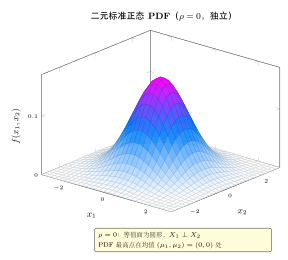
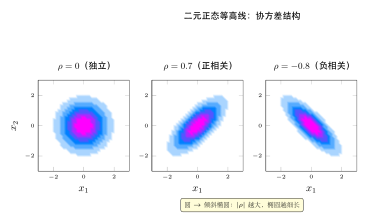
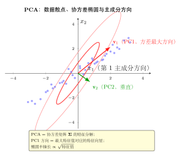

# 第 9 章 多维分布与抽样分布（融合版）

> **难度**：★★★★☆
> **前置知识**：第 5 章连续随机变量、第 8 章多元正态分布初步、线性代数基础（矩阵、行列式、正定矩阵）
> **本文件**：融合"原版严格推导 + 重写版高中模板 D 速记 / 套路 / 自测"。保留原版完整正文（学习目标 / 9.1–9.5 / 深度学习应用 / 练习题）+ 在最前置速记 / 引入 / 思维路径还原 + 中间插入几何示意 / 抽象方法 / 方法变形 + 最后追加思维训练与自测。

> **一例速记**：
> **多元正态 PDF**：$f(\mathbf{x}) = \frac{1}{(2\pi)^{d/2}\vert\boldsymbol{\Sigma}\vert^{1/2}}\exp\!\bigl(-\tfrac{1}{2}(\mathbf{x}-\boldsymbol{\mu})^\top\boldsymbol{\Sigma}^{-1}(\mathbf{x}-\boldsymbol{\mu})\bigr)$，$\mathbf{X}\sim\mathcal{N}(\boldsymbol{\mu},\boldsymbol{\Sigma})$；协方差矩阵 $\boldsymbol{\Sigma}$ 必须对称半正定。
> **线性变换封闭**：$\mathbf{A}\mathbf{X}+\mathbf{b}\sim\mathcal{N}(\mathbf{A}\boldsymbol{\mu}+\mathbf{b},\mathbf{A}\boldsymbol{\Sigma}\mathbf{A}^\top)$；条件分布仍是正态：$\mathbf{X}_1\vert\mathbf{X}_2\sim\mathcal{N}(\boldsymbol{\mu}_{1\vert 2},\boldsymbol{\Sigma}_{1\vert 2})$。
> **样本均值**：$X_i\stackrel{\text{i.i.d.}}{\sim}\mathcal{N}(\mu,\sigma^2)$ $\Rightarrow$ $\bar{X}\sim\mathcal{N}(\mu,\sigma^2/n)$；$E[\bar{X}]=\mu$，$\text{Var}(\bar{X})=\sigma^2/n$。
> **样本方差**：$(n-1)S^2/\sigma^2\sim\chi^2(n-1)$；$\bar{X}$ 与 $S^2$ 独立（**仅正态总体**）。
> **三大抽样分布**：$\chi^2(n)=\sum Z_i^2$（$Z_i$ 独立标准正态）；$T=\frac{Z}{\sqrt{\chi^2(n)/n}}\sim t(n)$；$F=\frac{\chi^2(m)/m}{\chi^2(n)/n}\sim F(m,n)$；$T^2\sim F(1,n)$。

---

## 引入：样本均值与样本方差真的独立吗？

> **题目**：设 $X_1, X_2, \ldots, X_n$ 是来自 $\mathcal{N}(\mu, \sigma^2)$ 的样本，$\bar{X} = \frac{1}{n}\sum X_i$，$S^2 = \frac{1}{n-1}\sum(X_i - \bar{X})^2$。请问：$\bar{X}$ 与 $S^2$ 独立吗？

请先停下来想一想：**$\bar{X}$ 是样本均值，$S^2$ 度量数据散布。两者直觉上"各管一件事"，但它们都由同一组数据计算而来，怎么可能独立？**

这是概率论中最美妙的反直觉结论之一：**对正态总体，$\bar{X}$ 与 $S^2$ 确实相互独立，但对非正态总体（如均匀分布），这一结论通常不成立。**

正态分布的对称性与旋转不变性，使得"均值方向"（$1/\sqrt{n}$ 方向）与"方差超平面"（正交补空间）天然解耦——这正是 Cochran 定理的核心。

第二个反直觉：多元正态的条件分布 $\mathbf{X}_1\vert\mathbf{X}_2=\mathbf{x}_2$ 仍是正态，且条件均值是 $\mathbf{x}_2$ 的**线性函数**——这就是高斯过程、卡尔曼滤波、线性回归的理论基础。

---

## 思维路径还原（解题者的内心独白）

> **问题**：证明正态总体下 $\bar{X}$ 与 $S^2$ 独立，并确定 $(n-1)S^2/\sigma^2$ 的分布。
>
> "先标准化：令 $Y_i = (X_i - \mu)/\sigma \stackrel{\text{i.i.d.}}{\sim} \mathcal{N}(0,1)$，则问题归结为标准正态情形。
>
> 第一步：**平方和分解**。注意恒等式：
>
> $$\sum_{i=1}^n Y_i^2 = \sum_{i=1}^n (Y_i - \bar{Y})^2 + n\bar{Y}^2$$
>
> 左边 $\sim\chi^2(n)$，右边第二项 $= \bigl(\sqrt{n}\,\bar{Y}\bigr)^2$，而 $\sqrt{n}\,\bar{Y}\sim\mathcal{N}(0,1)$，故第二项 $\sim\chi^2(1)$。
>
> 第二步：**正交变换视角**。构造正交矩阵 $Q$ 使得第一行为 $(1/\sqrt{n}, \ldots, 1/\sqrt{n})$，令 $\mathbf{W} = Q\mathbf{Y}$，则 $W_1 = \sqrt{n}\,\bar{Y}$，$W_2, \ldots, W_n$ 与 $W_1$ 独立（正态向量正交变换后各分量独立）。
>
> 第三步：**由 Cochran 定理**，$\sum_{i=1}^n (Y_i-\bar{Y})^2 = \sum_{j=2}^n W_j^2 \sim\chi^2(n-1)$，且与 $W_1$（即 $\bar{Y}$）独立。
>
> 第四步：**翻译回原始变量**。$(n-1)S^2/\sigma^2 = \sum(Y_i-\bar{Y})^2 \sim\chi^2(n-1)$；$\bar{X}=\mu+\sigma\bar{Y}$ 是 $\bar{Y}$ 的函数，$S^2$ 是 $W_2,\ldots,W_n$ 的函数，两者独立。
>
> **关键坑点**：自由度是 $n-1$ 而非 $n$——少的那个 $1$ 被用来估计均值 $\bar{Y}$（约束 $\sum(Y_i-\bar{Y})=0$，降低了一个自由度）。
>
> **延伸**：当 $\sigma^2$ 未知时，用 $S$ 代替 $\sigma$，得 $\frac{\bar{X}-\mu}{S/\sqrt{n}}\sim t(n-1)$——这是 $t$ 统计量的来源，也是为什么小样本推断需要用 $t$ 分布而非正态。"

---

## 学习目标

- 掌握多项分布的定义、性质及与二项分布的关系
- 理解多元正态分布的几何意义与协方差矩阵的作用
- 了解 Dirichlet 分布作为多项分布的共轭先验的重要地位
- 初步认识 Wishart 分布及其在协方差矩阵建模中的作用
- 掌握分布变换与采样方法，建立与深度学习（Softmax、VAE）的联系
- 理解抽样分布的概念，掌握三大抽样分布（$\chi^2$、$t$、$F$）及正态总体的四个关键定理

---

## 9.1 多项分布

### 从二项分布推广到多项分布

二项分布描述 $n$ 次独立伯努利试验中"成功"次数的分布——每次试验只有两个结果。当每次试验有 $k$ 个可能结果时，自然推广到**多项分布**（Multinomial Distribution）。

**场景**：投掷一枚有 $k$ 个面的骰子 $n$ 次，第 $i$ 面出现的概率为 $p_i$，$\sum_{i=1}^k p_i = 1$。令 $X_i$ 表示第 $i$ 面出现的次数，则随机向量 $(X_1, X_2, \ldots, X_k)$ 服从多项分布。

### 定义

若随机向量 $\mathbf{X} = (X_1, \ldots, X_k)$ 满足 $\sum_{i=1}^k X_i = n$，且联合概率质量函数为：

$$P(X_1 = x_1, \ldots, X_k = x_k) = \frac{n!}{x_1! x_2! \cdots x_k!} \prod_{i=1}^k p_i^{x_i}$$

其中 $x_i \geq 0$ 为整数，$\sum_{i=1}^k x_i = n$，$p_i > 0$，$\sum_{i=1}^k p_i = 1$，则称 $\mathbf{X}$ 服从**多项分布**，记作：

$$\mathbf{X} \sim \text{Multinomial}(n, \mathbf{p}), \quad \mathbf{p} = (p_1, \ldots, p_k)$$

### 直觉理解：多项式系数

分子 $n!$ 是全排列数，分母 $x_1! \cdots x_k!$ 消除了同类元素的重复，因此多项式系数 $\frac{n!}{x_1!\cdots x_k!}$ 表示将 $n$ 次试验分配给 $k$ 个结果的方式数。每种分配方案的概率是 $\prod_i p_i^{x_i}$，两者相乘得到联合概率。

### 均值与协方差

**边缘分布**：每个 $X_i$ 的边缘分布是二项分布：

$$X_i \sim \text{Binomial}(n, p_i)$$

因此：

$$E[X_i] = np_i, \quad \text{Var}(X_i) = np_i(1-p_i)$$

**协方差**：不同类别之间存在负相关（增加一个类别的计数必然减少其他类别）：

$$\text{Cov}(X_i, X_j) = -np_ip_j, \quad i \neq j$$

**推导**：由于 $\sum_i X_i = n$ 是常数，有 $\text{Var}\!\left(\sum_i X_i\right) = 0$，展开得：

$$\sum_i \text{Var}(X_i) + 2\sum_{i < j} \text{Cov}(X_i, X_j) = 0$$

代入各方差并整理可得上式。

### 例9.1：分类投票

某次选举有三位候选人，支持率分别为 $p_1 = 0.5, p_2 = 0.3, p_3 = 0.2$，随机调查 10 人，求恰好 5 人选1号、3 人选2号、2 人选3号的概率。

$$P(5,3,2) = \frac{10!}{5!\,3!\,2!} \times 0.5^5 \times 0.3^3 \times 0.2^2 = 252 \times 0.03125 \times 0.027 \times 0.04 \approx 0.0851$$

### 特殊情形

- $k = 2$ 时，多项分布退化为**二项分布**
- $n = 1$ 时，多项分布退化为**类别分布**（Categorical Distribution），是 softmax 输出对应的分布

---

## 9.2 多元正态分布

### 定义

$d$ 维随机向量 $\mathbf{X} = (X_1, \ldots, X_d)^\top$ 服从**多元正态分布**（Multivariate Normal Distribution），若其概率密度函数为：

$$f(\mathbf{x}) = \frac{1}{(2\pi)^{d/2} \vert\boldsymbol{\Sigma}\vert^{1/2}} \exp\!\left(-\frac{1}{2}(\mathbf{x} - \boldsymbol{\mu})^\top \boldsymbol{\Sigma}^{-1} (\mathbf{x} - \boldsymbol{\mu})\right)$$

记作 $\mathbf{X} \sim \mathcal{N}(\boldsymbol{\mu}, \boldsymbol{\Sigma})$，其中：
- $\boldsymbol{\mu} \in \mathbb{R}^d$：均值向量
- $\boldsymbol{\Sigma} \in \mathbb{R}^{d \times d}$：协方差矩阵（对称正定）
- $\vert\boldsymbol{\Sigma}\vert$：$\boldsymbol{\Sigma}$ 的行列式

### 协方差矩阵的几何含义

协方差矩阵 $\boldsymbol{\Sigma}$ 完全刻画了各分量之间的线性相关结构：

$$\Sigma_{ij} = \text{Cov}(X_i, X_j) = E[(X_i - \mu_i)(X_j - \mu_j)]$$

**几何理解**：指数项中的马氏距离 $(\mathbf{x} - \boldsymbol{\mu})^\top \boldsymbol{\Sigma}^{-1} (\mathbf{x} - \boldsymbol{\mu})$ 等于常数的等值面是一个**椭球体**。$\boldsymbol{\Sigma}$ 的特征向量给出椭球的方向，特征值给出各方向的"伸展程度"。

**三种典型情形**：

| 协方差矩阵形式 | 含义 | 等值面形状 |
\|--------------|------|----------|
\| $\boldsymbol{\Sigma} = \sigma^2 \mathbf{I}$ | 各维独立且方差相同 | 球形 |
\| $\boldsymbol{\Sigma} = \text{diag}(\sigma_1^2, \ldots, \sigma_d^2)$ | 各维独立但方差不同 | 轴对齐椭球 |
\| 一般正定矩阵 | 各维相关 | 旋转椭球 |

### 重要性质

**性质1（线性变换封闭性）**：若 $\mathbf{X} \sim \mathcal{N}(\boldsymbol{\mu}, \boldsymbol{\Sigma})$，$\mathbf{A} \in \mathbb{R}^{m \times d}$ 为矩阵，$\mathbf{b} \in \mathbb{R}^m$，则：

$$\mathbf{A}\mathbf{X} + \mathbf{b} \sim \mathcal{N}(\mathbf{A}\boldsymbol{\mu} + \mathbf{b},\; \mathbf{A}\boldsymbol{\Sigma}\mathbf{A}^\top)$$

**性质2（边缘分布）**：多元正态的任意边缘分布仍是正态分布。将 $\mathbf{X}$ 分块为 $(\mathbf{X}_1, \mathbf{X}_2)$：

$$\mathbf{X}_1 \sim \mathcal{N}(\boldsymbol{\mu}_1, \boldsymbol{\Sigma}_{11})$$

**性质3（条件分布）**：给定 $\mathbf{X}_2 = \mathbf{x}_2$ 时，$\mathbf{X}_1$ 的条件分布仍是正态分布：

$$\mathbf{X}_1 \mid \mathbf{X}_2 = \mathbf{x}_2 \sim \mathcal{N}\!\left(\boldsymbol{\mu}_{1\vert 2},\; \boldsymbol{\Sigma}_{1\vert 2}\right)$$

其中：

$$\boldsymbol{\mu}_{1\vert 2} = \boldsymbol{\mu}_1 + \boldsymbol{\Sigma}_{12}\boldsymbol{\Sigma}_{22}^{-1}(\mathbf{x}_2 - \boldsymbol{\mu}_2)$$

$$\boldsymbol{\Sigma}_{1\vert 2} = \boldsymbol{\Sigma}_{11} - \boldsymbol{\Sigma}_{12}\boldsymbol{\Sigma}_{22}^{-1}\boldsymbol{\Sigma}_{21}$$

**性质4（独立性与不相关等价）**：对于正态分布，**不相关**等价于**独立**（这在一般分布中不成立）。

### 例9.2：二元正态分布

最常用的特例：$d = 2$，令 $\boldsymbol{\mu} = (0, 0)^\top$，

$$\boldsymbol{\Sigma} = \begin{pmatrix} \sigma_1^2 & \rho\sigma_1\sigma_2 \\ \rho\sigma_1\sigma_2 & \sigma_2^2 \end{pmatrix}$$

其中 $\rho \in (-1, 1)$ 是相关系数。PDF 为：

$$f(x_1, x_2) = \frac{1}{2\pi\sigma_1\sigma_2\sqrt{1-\rho^2}} \exp\!\left(-\frac{1}{2(1-\rho^2)}\left[\frac{x_1^2}{\sigma_1^2} - \frac{2\rho x_1 x_2}{\sigma_1\sigma_2} + \frac{x_2^2}{\sigma_2^2}\right]\right)$$

- $\rho > 0$：$X_1$ 与 $X_2$ 正相关，椭球沿 $45°$ 方向倾斜
- $\rho = 0$：独立，等值面为轴对齐椭圆
- $\rho < 0$：负相关，椭球沿 $-45°$ 方向倾斜

### 从标准正态生成多元正态

设 $\mathbf{Z} \sim \mathcal{N}(\mathbf{0}, \mathbf{I})$，对 $\boldsymbol{\Sigma}$ 做 Cholesky 分解 $\boldsymbol{\Sigma} = \mathbf{L}\mathbf{L}^\top$，则：

$$\mathbf{X} = \boldsymbol{\mu} + \mathbf{L}\mathbf{Z} \sim \mathcal{N}(\boldsymbol{\mu}, \boldsymbol{\Sigma})$$

这是从多元正态分布采样的标准算法。

---

## 9.3 Dirichlet 分布

### 动机：概率向量的分布

在贝叶斯统计中，我们常需要对"概率参数"本身建立先验。例如，骰子每面的概率 $\mathbf{p} = (p_1, \ldots, p_k)$ 满足 $p_i \geq 0$，$\sum_i p_i = 1$，即 $\mathbf{p}$ 位于 $k-1$ 维**单纯形**（simplex）上。**Dirichlet 分布**正是定义在单纯形上的连续分布。

### 定义

若 $k$ 维随机向量 $\mathbf{p} = (p_1, \ldots, p_k)$ 满足 $p_i > 0$，$\sum_i p_i = 1$，且概率密度函数为：

$$f(\mathbf{p};\, \boldsymbol{\alpha}) = \frac{\Gamma\!\left(\sum_{i=1}^k \alpha_i\right)}{\prod_{i=1}^k \Gamma(\alpha_i)} \prod_{i=1}^k p_i^{\alpha_i - 1}$$

则称 $\mathbf{p}$ 服从参数为 $\boldsymbol{\alpha} = (\alpha_1, \ldots, \alpha_k)$（$\alpha_i > 0$）的 **Dirichlet 分布**，记作：

$$\mathbf{p} \sim \text{Dir}(\boldsymbol{\alpha})$$

归一化常数中的 Gamma 函数 $\Gamma(n) = (n-1)!$（整数时）确保 PDF 积分为1。

### 参数的直觉

将 $\alpha_i$ 理解为"伪计数"：$\alpha_i$ 越大，$p_i$ 趋近越大；令 $\alpha_0 = \sum_i \alpha_i$（称为**浓度参数**）：

- $\alpha_0$ 大：分布集中在均值附近（确定性强）
- $\alpha_0$ 小（接近0）：分布集中在单纯形顶点（稀疏性强）
- $\boldsymbol{\alpha} = \mathbf{1}$（均匀先验）：单纯形上的均匀分布

### 均值与方差

$$E[p_i] = \frac{\alpha_i}{\alpha_0}, \quad \alpha_0 = \sum_{j=1}^k \alpha_j$$

$$\text{Var}(p_i) = \frac{\alpha_i(\alpha_0 - \alpha_i)}{\alpha_0^2(\alpha_0 + 1)}$$

$$\text{Cov}(p_i, p_j) = \frac{-\alpha_i \alpha_j}{\alpha_0^2(\alpha_0 + 1)}, \quad i \neq j$$

### Dirichlet 是多项分布的共轭先验

这是 Dirichlet 分布最重要的性质。设先验 $\mathbf{p} \sim \text{Dir}(\boldsymbol{\alpha})$，观测到 $n$ 次试验中第 $i$ 类出现 $x_i$ 次（即 $\mathbf{x} \sim \text{Multinomial}(n, \mathbf{p})$），则后验为：

$$\mathbf{p} \mid \mathbf{x} \sim \text{Dir}(\boldsymbol{\alpha} + \mathbf{x})$$

**推导**：

$$p(\mathbf{p} \mid \mathbf{x}) \propto p(\mathbf{x} \mid \mathbf{p}) \cdot p(\mathbf{p}) \propto \prod_i p_i^{x_i} \cdot \prod_i p_i^{\alpha_i - 1} = \prod_i p_i^{(\alpha_i + x_i) - 1}$$

这正是 $\text{Dir}(\boldsymbol{\alpha} + \mathbf{x})$ 的核密度。共轭性意味着先验与后验属于同一分布族，大大简化了贝叶斯推断。

### 特殊情形

- $k = 2$：Dirichlet 分布退化为 **Beta 分布** $\text{Beta}(\alpha_1, \alpha_2)$
- 对称情形 $\boldsymbol{\alpha} = \alpha \mathbf{1}$：称为**对称 Dirichlet 分布**

### 例9.3：文本主题建模

在 LDA（潜在狄利克雷分配）中，每篇文档的主题分布 $\theta_d \sim \text{Dir}(\alpha \mathbf{1})$，每个主题的词分布 $\phi_k \sim \text{Dir}(\beta \mathbf{1})$。Dirichlet 先验的稀疏性（$\alpha < 1$ 时）促使文档只集中在少数主题上。

---

## 9.4 Wishart 分布简介

### 动机：协方差矩阵的分布

多元正态分布中，协方差矩阵 $\boldsymbol{\Sigma}$ 是未知参数。在贝叶斯框架下，需要对正定矩阵建立先验。**Wishart 分布**是正定矩阵上的分布，是 $\boldsymbol{\Sigma}$ 或 $\boldsymbol{\Sigma}^{-1}$（精度矩阵）的共轭先验。

### 从卡方分布到 Wishart 分布

**类比**：若 $Z \sim \mathcal{N}(0,1)$，则 $Z^2 \sim \chi^2(1)$；若 $Z_1, \ldots, Z_\nu \stackrel{\text{i.i.d.}}{\sim} \mathcal{N}(0,1)$，则$\sum_i Z_i^2 \sim \chi^2(\nu)$。

推广到多维：若 $\mathbf{z}_1, \ldots, \mathbf{z}_\nu \stackrel{\text{i.i.d.}}{\sim} \mathcal{N}(\mathbf{0}, \boldsymbol{\Sigma})$，令：

$$\mathbf{W} = \sum_{i=1}^{\nu} \mathbf{z}_i \mathbf{z}_i^\top$$

则 $\mathbf{W}$ 服从 **Wishart 分布**，记作 $\mathbf{W} \sim \mathcal{W}_d(\nu, \boldsymbol{\Sigma})$，其中 $d$ 是维度，$\nu \geq d$ 是**自由度**。

### 概率密度函数

$$f(\mathbf{W}) = \frac{\vert\mathbf{W}\vert^{(\nu - d - 1)/2} \exp\!\left(-\frac{1}{2}\text{tr}(\boldsymbol{\Sigma}^{-1}\mathbf{W})\right)}{2^{\nu d/2} \vert\boldsymbol{\Sigma}\vert^{\nu/2} \Gamma_d(\nu/2)}$$

其中 $\Gamma_d(\cdot)$ 是多元 Gamma 函数，$\text{tr}(\cdot)$ 是矩阵的迹。

### 均值与关键性质

$$E[\mathbf{W}] = \nu \boldsymbol{\Sigma}$$

**与卡方分布的关系**：$d = 1$ 时，$\mathcal{W}_1(\nu, \sigma^2)$ 对应 $\sigma^2 \chi^2(\nu)$。

**逆 Wishart 分布**：若 $\mathbf{W} \sim \mathcal{W}_d(\nu, \boldsymbol{\Sigma})$，则 $\mathbf{W}^{-1} \sim \mathcal{W}^{-1}_d(\nu, \boldsymbol{\Sigma}^{-1})$，称为**逆 Wishart 分布**，常用作 $\boldsymbol{\Sigma}$ 的共轭先验。

### 贝叶斯多元正态模型

**模型设定**：

$$\boldsymbol{\Sigma}^{-1} \sim \mathcal{W}_d(\nu_0, \mathbf{V}_0^{-1}), \quad \mathbf{x}_i \mid \boldsymbol{\mu}, \boldsymbol{\Sigma} \stackrel{\text{i.i.d.}}{\sim} \mathcal{N}(\boldsymbol{\mu}, \boldsymbol{\Sigma})$$

**后验**（观测 $n$ 个样本后）：

$$\boldsymbol{\Sigma}^{-1} \mid \{\mathbf{x}_i\} \sim \mathcal{W}_d\!\left(\nu_0 + n,\; \left(\mathbf{V}_0 + \sum_{i=1}^n (\mathbf{x}_i - \boldsymbol{\mu})(\mathbf{x}_i - \boldsymbol{\mu})^\top\right)^{-1}\right)$$

Wishart 分布在高斯过程、贝叶斯线性回归、多元时间序列等模型中均有重要应用。

---

## 9.5 分布变换与采样

### 分布变换的一般理论

设 $\mathbf{X} \sim f_{\mathbf{X}}(\mathbf{x})$，$\mathbf{Y} = g(\mathbf{X})$ 是可逆变换，令 $\mathbf{x} = g^{-1}(\mathbf{y})$，则 $\mathbf{Y}$ 的 PDF 为：

$$\boxed{f_{\mathbf{Y}}(\mathbf{y}) = f_{\mathbf{X}}\!\left(g^{-1}(\mathbf{y})\right) \cdot \left\vert\det\mathbf{J}_{g^{-1}}(\mathbf{y})\right\vert}$$

其中 $\mathbf{J}_{g^{-1}}$ 是逆变换的 **Jacobian 矩阵**（各偏导数组成的矩阵），行列式的绝对值 $\vert\det \mathbf{J}\vert$ 是体积缩放因子。

**Jacobian 矩阵** 的具体形式：设 $\mathbf{x} = (x_1, \ldots, x_n)$，$\mathbf{y} = (y_1, \ldots, y_n)$，则：

$$\mathbf{J}_{g^{-1}} = \begin{pmatrix} \frac{\partial x_1}{\partial y_1} & \cdots & \frac{\partial x_1}{\partial y_n} \\ \vdots & \ddots & \vdots \\ \frac{\partial x_n}{\partial y_1} & \cdots & \frac{\partial x_n}{\partial y_n} \end{pmatrix}$$

**直觉**：Jacobian 行列式度量变换在局部的"体积伸缩"比例。概率密度 = 概率质量/体积，因此变换后需要除以伸缩比例。

### 例9.4b：二维变量变换

设 $(X, Y)$ 的联合 PDF 为 $f_{X,Y}(x,y)$，令 $U = X + Y$，$V = X - Y$。

逆变换：$X = (U+V)/2$，$Y = (U-V)/2$。Jacobian 行列式：

$$\left\vert\det\begin{pmatrix} \partial x/\partial u & \partial x/\partial v \\ \partial y/\partial u & \partial y/\partial v \end{pmatrix}\right\vert = \left\vert\det\begin{pmatrix} 1/2 & 1/2 \\ 1/2 & -1/2 \end{pmatrix}\right\vert = \left\vert-\frac{1}{2}\right\vert = \frac{1}{2}$$

$$f_{U,V}(u, v) = f_{X,Y}\!\left(\frac{u+v}{2}, \frac{u-v}{2}\right) \cdot \frac{1}{2}$$

**应用**：若只需要 $U = X+Y$ 的分布，对 $v$ 积分即得**卷积公式**：

$$f_U(u) = \int_{-\infty}^{+\infty} f_{X,Y}\!\left(\frac{u+v}{2}, \frac{u-v}{2}\right) \cdot \frac{1}{2} \, dv$$

当 $X, Y$ 独立时简化为 $f_U(u) = \int f_X(x) f_Y(u-x) dx$（即 $f_X * f_Y$）。

### 常用变换技术

#### 1. Cholesky 变换（多元正态采样）

目标：从 $\mathcal{N}(\boldsymbol{\mu}, \boldsymbol{\Sigma})$ 采样。

步骤：
1. 对 $\boldsymbol{\Sigma}$ 做 Cholesky 分解：$\boldsymbol{\Sigma} = \mathbf{L}\mathbf{L}^\top$
2. 生成 $\mathbf{z} \sim \mathcal{N}(\mathbf{0}, \mathbf{I})$
3. 返回 $\mathbf{x} = \boldsymbol{\mu} + \mathbf{L}\mathbf{z}$

**验证**：$\text{Cov}(\mathbf{L}\mathbf{z}) = \mathbf{L}\,\text{Cov}(\mathbf{z})\,\mathbf{L}^\top = \mathbf{L}\mathbf{I}\mathbf{L}^\top = \boldsymbol{\Sigma}$ ✓

#### 2. Box-Muller 变换（从均匀分布生成正态）

从 $U_1, U_2 \sim \text{Uniform}(0,1)$ 生成两个独立标准正态：

$$Z_1 = \sqrt{-2\ln U_1}\cos(2\pi U_2), \quad Z_2 = \sqrt{-2\ln U_1}\sin(2\pi U_2)$$

**Jacobian 推导**：令 $R = \sqrt{-2\ln U_1}$，$\Theta = 2\pi U_2$，则 $R^2 \sim \text{Exp}(1/2)$（即 $\chi^2(2)$），$(R\cos\Theta, R\sin\Theta)$ 服从二维标准正态。

#### 3. Dirichlet 分布的 Gamma 采样

从 $\text{Dir}(\boldsymbol{\alpha})$ 采样的方法：
1. 独立采样 $Y_i \sim \text{Gamma}(\alpha_i, 1)$，$i = 1, \ldots, k$
2. 归一化：$p_i = Y_i / \sum_j Y_j$

则 $(p_1, \ldots, p_k) \sim \text{Dir}(\boldsymbol{\alpha})$。

**直觉**：Gamma 分布的归一化保持了各分量的相对比例，且自然落在单纯形上。

#### 4. 重参数化技巧（Reparameterization Trick）

在变分推断和 VAE 中，需要对随机变量求梯度。核心思想是将随机性与参数分离：

**问题**：$\mathbf{z} \sim q_\phi(\mathbf{z})$，无法直接对 $\phi$ 求梯度（采样不可微）。

**解决**：引入辅助噪声 $\boldsymbol{\epsilon} \sim p(\boldsymbol{\epsilon})$（与 $\phi$ 无关），通过可微变换 $\mathbf{z} = g_\phi(\boldsymbol{\epsilon})$：

$$\nabla_\phi E_{q_\phi}[f(\mathbf{z})] = \nabla_\phi E_{p(\boldsymbol{\epsilon})}[f(g_\phi(\boldsymbol{\epsilon}))] = E_{p(\boldsymbol{\epsilon})}[\nabla_\phi f(g_\phi(\boldsymbol{\epsilon}))]$$

对于正态分布：$\boldsymbol{\epsilon} \sim \mathcal{N}(\mathbf{0}, \mathbf{I})$，$\mathbf{z} = \boldsymbol{\mu}_\phi + \boldsymbol{\sigma}_\phi \odot \boldsymbol{\epsilon}$。

### 正规化流（Normalizing Flows）简介

通过一系列可逆变换将简单分布（如高斯）变换为复杂分布。设 $\mathbf{z}_0 \sim p_0(\mathbf{z}_0)$，经过 $T$ 步变换 $\mathbf{z}_T = f_T \circ \cdots \circ f_1(\mathbf{z}_0)$，则：

$$\ln p_T(\mathbf{z}_T) = \ln p_0(\mathbf{z}_0) - \sum_{t=1}^T \ln\left\vert\det\frac{\partial f_t}{\partial \mathbf{z}_{t-1}}\right\vert$$

每步需要计算 Jacobian 行列式，实际设计中（如 RealNVP）通过特殊结构使其高效计算。

---

## 几何示意

### 图 9-1：二元正态密度曲面



二元标准正态 PDF 的三维曲面。当 $\rho=0$（独立）时，等值线为轴对齐椭圆；当 $\rho\neq 0$ 时，曲面"扭转"反映分量间的线性相关。

### 图 9-2：协方差椭圆与主轴方向



三种相关结构（$\rho=0, 0.7, -0.8$）下二元正态的等高线：椭圆长轴方向对应 $\boldsymbol{\Sigma}$ 最大特征值的特征向量，即 PCA 第一主成分方向；椭圆轴长比例等于特征值之比的平方根。

### 图 9-3：抽样分布密度（$\chi^2$、$t$、$F$）



三大抽样分布的密度曲线对比：$\chi^2$ 分布右偏且仅取正值；$t$ 分布对称但比正态有更厚的尾部（自由度越小尾越厚）；$F$ 分布取正值，形状随 $(m,n)$ 变化。

---

## 抽象成方法（套路总结）

### 5 大核心公式速查

| 名称 \| 公式 \| 关键性质 |
\|---|---|---|
\| **多元正态 PDF** \| $f(\mathbf{x}) = \frac{1}{(2\pi)^{d/2}\vert\boldsymbol{\Sigma}\vert^{1/2}}\exp\bigl(-\tfrac{1}{2}(\mathbf{x}-\boldsymbol{\mu})^\top\boldsymbol{\Sigma}^{-1}(\mathbf{x}-\boldsymbol{\mu})\bigr)$ \| $\boldsymbol{\Sigma}$ 对称半正定 |
\| **线性变换** \| $\mathbf{A}\mathbf{X}+\mathbf{b}\sim\mathcal{N}(\mathbf{A}\boldsymbol{\mu}+\mathbf{b},\mathbf{A}\boldsymbol{\Sigma}\mathbf{A}^\top)$ \| 仿射变换封闭 |
\| **样本均值分布** \| $\bar{X}\sim\mathcal{N}(\mu,\sigma^2/n)$ \| $E[\bar{X}]=\mu$，$\text{Var}(\bar{X})=\sigma^2/n$ |
\| **样本方差分布** \| $(n-1)S^2/\sigma^2\sim\chi^2(n-1)$ \| 自由度 $n-1$，与 $\bar{X}$ 独立（仅正态） |
\| **$t$ 统计量** \| $T=\frac{\bar{X}-\mu}{S/\sqrt{n}}\sim t(n-1)$ \| $\sigma$ 未知时用 $S$ 代替 |

### 三大抽样分布定义速查

| 分布 \| 定义 \| 期望 \| 方差 |
\|---|---|---|---|
\| $\chi^2(n)$ \| $\sum_{i=1}^n Z_i^2$，$Z_i\stackrel{\text{i.i.d.}}{\sim}\mathcal{N}(0,1)$ \| $n$ \| $2n$ |
\| $t(n)$ \| $\frac{Z}{\sqrt{\chi^2(n)/n}}$，$Z\perp\chi^2$ \| $0$（$n>1$）\| $\frac{n}{n-2}$（$n>2$）|
\| $F(m,n)$ \| $\frac{\chi^2(m)/m}{\chi^2(n)/n}$，两者独立 \| $\frac{n}{n-2}$（$n>2$）\| — |

### 抽样分布构造 3 步

1. **确定总体**：$X\sim\mathcal{N}(\mu,\sigma^2)$，i.i.d. 样本 $X_1,\ldots,X_n$
2. **写出统计量**：$\bar{X}$、$S^2$，或两者的线性组合
3. **套用定理**：$\bar{X}$ 用定理一；$S^2$ 用定理二（$\chi^2$）；$\sigma$ 未知用定理四（$t$）；两样本方差比用 $F$

---

## 方法变形

### 变形1：线性变换与 $\boldsymbol{\Sigma}$ 对角化

$\boldsymbol{\Sigma}$ 有谱分解 $\boldsymbol{\Sigma} = Q\Lambda Q^\top$（$Q$ 正交，$\Lambda$ 对角）。令 $\mathbf{W} = Q^\top(\mathbf{X}-\boldsymbol{\mu})$，则各分量独立：$W_i \sim \mathcal{N}(0, \lambda_i)$。**主成分分析（PCA）** 正是用此分解将数据投影到主轴坐标系。

**应用**：计算 $\mathbf{X}$ 落在椭球 $\{(\mathbf{x}-\boldsymbol{\mu})^\top\boldsymbol{\Sigma}^{-1}(\mathbf{x}-\boldsymbol{\mu})\leq c^2\}$ 的概率，转化为 $\sum W_i^2/\lambda_i \leq c^2$，即 $\chi^2(d)$ 分布的分位数问题。

### 变形2：$\boldsymbol{\Sigma}$ 分块与条件分布

将 $\mathbf{X}$ 分块为 $(\mathbf{X}_1, \mathbf{X}_2)$，协方差矩阵分块：

$$\boldsymbol{\Sigma} = \begin{pmatrix}\boldsymbol{\Sigma}_{11} & \boldsymbol{\Sigma}_{12}\\ \boldsymbol{\Sigma}_{21} & \boldsymbol{\Sigma}_{22}\end{pmatrix}$$

条件分布 $\mathbf{X}_1\vert\mathbf{X}_2=\mathbf{x}_2$ 的均值是 $\mathbf{x}_2$ 的线性函数（"线性预测"），条件协方差与 $\mathbf{x}_2$ 无关。**高斯过程**回归、**卡尔曼滤波**的更新步骤均基于此公式。

### 变形3：抽样定理推广（两正态总体）

设 $X\sim\mathcal{N}(\mu_1,\sigma_1^2)$（样本量 $m$）和 $Y\sim\mathcal{N}(\mu_2,\sigma_2^2)$（样本量 $n$）独立，则：

- $\bar{X}-\bar{Y}\sim\mathcal{N}(\mu_1-\mu_2,\,\sigma_1^2/m+\sigma_2^2/n)$
- 若 $\sigma_1^2=\sigma_2^2=\sigma^2$（未知），合并方差 $S_p^2=\frac{(m-1)S_X^2+(n-1)S_Y^2}{m+n-2}\sim\sigma^2\chi^2(m+n-2)/(m+n-2)$，则 $\frac{(\bar{X}-\bar{Y})-(\mu_1-\mu_2)}{S_p\sqrt{1/m+1/n}}\sim t(m+n-2)$
- 方差比 $S_X^2/S_Y^2\sim F(m-1,n-1)$（当 $\sigma_1^2=\sigma_2^2$ 时），用于方差齐性检验

### 变形4：非正态总体与 CLT

对非正态总体，$\bar{X}$ 和 $S^2$ 不独立，且 $(n-1)S^2/\sigma^2$ 不服从 $\chi^2(n-1)$。但由中心极限定理，当 $n$ 大时：

$$\frac{\bar{X}-\mu}{\sigma/\sqrt{n}}\xrightarrow{d}\mathcal{N}(0,1), \quad \frac{\bar{X}-\mu}{S/\sqrt{n}}\xrightarrow{d}\mathcal{N}(0,1)$$

此时 $t$ 分布近似标准正态（$n\geq 30$ 通常足够）。

---

## 本章小结

| 分布 \| 支撑集 \| 参数 \| 均值 \| 关键性质 |
\|------|--------|------|------|---------|
\| $\text{Multinomial}(n, \mathbf{p})$ \| 非负整数向量，和为 $n$ \| $n$, $\mathbf{p}$ \| $n\mathbf{p}$ \| 二项分布推广，$\text{Cov}(X_i,X_j) = -np_ip_j$ |
\| $\mathcal{N}(\boldsymbol{\mu}, \boldsymbol{\Sigma})$ \| $\mathbb{R}^d$ \| $\boldsymbol{\mu}$, $\boldsymbol{\Sigma}$ \| $\boldsymbol{\mu}$ \| 线性变换封闭，条件/边缘仍正态 |
\| $\text{Dir}(\boldsymbol{\alpha})$ \| $k{-}1$ 维单纯形 \| $\boldsymbol{\alpha}$ \| $\alpha_i / \alpha_0$ \| 多项分布的共轭先验 |
\| $\mathcal{W}_d(\nu, \boldsymbol{\Sigma})$ \| $d{\times}d$ 正定矩阵 \| $\nu$, $\boldsymbol{\Sigma}$ \| $\nu\boldsymbol{\Sigma}$ \| 精度矩阵的共轭先验 |
\| $\chi^2(n)$ \| $(0,+\infty)$ \| $n$（自由度）\| $n$ \| $E=n$，$\text{Var}=2n$，右偏 |
\| $t(n)$ \| $\mathbb{R}$ \| $n$（自由度）\| $0$ \| 对称，尾比正态厚；$n\to\infty\Rightarrow\mathcal{N}(0,1)$ |
\| $F(m,n)$ \| $(0,+\infty)$ \| $m$,$n$（自由度）\| $\frac{n}{n-2}$ \| $T^2\sim F(1,n)$；$1/F\sim F(n,m)$ |

**核心要点**：
- 多项分布是分类问题的基础，与 softmax 输出天然对应
- 多元正态分布由均值向量和协方差矩阵完全刻画，线性变换封闭性是深度学习中的重要工具
- Dirichlet 分布是概率向量的"元分布"，共轭性使贝叶斯更新具有解析形式
- 分布变换通过 Jacobian 行列式联系变量，重参数化技巧是 VAE 等生成模型的理论基础
- 三大抽样分布由标准正态导出；正态总体下 $\bar{X}$ 与 $S^2$ 独立是数理统计推断的核心

---

## 思考路标（条件反射）

1. **联合分布** → 联合 PDF $f(\mathbf{x})$；边缘 $f_i(x_i)=\int\cdots\int f(\mathbf{x})\,d\mathbf{x}_{-i}$；条件 $f(\mathbf{x}_1\vert\mathbf{x}_2)=f(\mathbf{x})/f_2(\mathbf{x}_2)$
2. **多元正态 $\mathcal{N}(\boldsymbol\mu,\boldsymbol\Sigma)$** → 由均值向量和协方差矩阵完全确定；等值面为椭球；马氏距离度量"标准化距离"
3. **协方差矩阵 $\boldsymbol\Sigma$** → 必须对称半正定（$\mathbf{v}^\top\boldsymbol\Sigma\mathbf{v}\geq 0$）；特征值 $\geq 0$；对角化 $\Leftrightarrow$ 主轴分解
4. **多元正态的边缘** → 任意子集仍服从多元正态（维度降低，直接读 $\boldsymbol\mu_1$、$\boldsymbol\Sigma_{11}$）
5. **多元正态的条件** → $\mathbf{X}_1\vert\mathbf{X}_2=\mathbf{x}_2\sim\mathcal{N}(\boldsymbol\mu_{1\vert 2},\boldsymbol\Sigma_{1\vert 2})$（仍是正态，均值是 $\mathbf{x}_2$ 的线性函数）
6. **仿射变换封闭** → $\mathbf{A}\mathbf{X}+\mathbf{b}\sim\mathcal{N}(\mathbf{A}\boldsymbol\mu+\mathbf{b},\mathbf{A}\boldsymbol\Sigma\mathbf{A}^\top)$
7. **正态独立 iff $\rho=0$** → 多元正态中不相关等价于独立（一般分布中此结论不成立）
8. **PCA 与协方差** → PCA 是协方差矩阵 $\boldsymbol\Sigma$ 的特征分解；PC1 方向 = 最大特征值的特征向量；解释方差比 = 特征值之比
9. **看到正态 i.i.d. 样本 + $\bar{X}$** → 立刻想 $\bar{X}\sim\mathcal{N}(\mu,\sigma^2/n)$；$\sigma$ 已知用正态，$\sigma$ 未知用 $t(n-1)$
10. **看到 $(n-1)S^2/\sigma^2$** → 立刻是 $\chi^2(n-1)$；与 $\bar{X}$ 独立（仅限正态总体）
11. **看到"方差之比"** → 想 $F$ 分布；$F_{1-\alpha}(m,n)=1/F_\alpha(n,m)$ 可将下分位点转为上分位点
12. **非正态总体 + 大样本** → CLT 使 $\bar{X}$ 近似正态；$t$ 统计量近似 $\mathcal{N}(0,1)$（$n\geq 30$ 通常够）

---

## 易错点

1. **$\boldsymbol{\Sigma}$ 必须半正定** → 若构造的协方差矩阵有负特征值，不是合法分布参数；行列式为负说明矩阵不合法（合法矩阵行列式 $\geq 0$）

2. **$\bar{X}$ 的方差是 $\sigma^2/n$ 而非 $\sigma^2$** → 常见错误：将总体方差 $\sigma^2$ 当作 $\bar{X}$ 的方差；正确：$\text{Var}(\bar{X})=\sigma^2/n$（样本均值方差缩小 $n$ 倍）

3. **$S^2$ 自由度是 $n-1$ 而非 $n$** → $(n-1)S^2/\sigma^2\sim\chi^2(n-1)$；用 $\frac{n-1}{\sigma^2}$ 而非 $\frac{n}{\sigma^2}$ 乘 $S^2$；分母写 $n-1$ 是为了无偏（$E[S^2]=\sigma^2$）

4. **$\bar{X}$ 与 $S^2$ 独立仅对正态总体成立** → 对均匀分布、指数分布等非正态总体，$\bar{X}$ 与 $S^2$ 一般相关；不要在非正态场合套用正态独立性定理

5. **边缘正态不等于联合正态** → 反例：$X,Y$ 各自边缘均为 $\mathcal{N}(0,1)$，但联合分布可能不是二元正态（如 $X,Y$ 是某种非线性依赖）；仅当$(X,Y)$的任意线性组合仍正态时才是联合正态

6. **条件分布均值公式中 $\boldsymbol{\Sigma}_{12}\boldsymbol{\Sigma}_{22}^{-1}$ 的顺序** → $\boldsymbol{\mu}_{1\vert 2}=\boldsymbol{\mu}_1+\boldsymbol{\Sigma}_{12}\boldsymbol{\Sigma}_{22}^{-1}(\mathbf{x}_2-\boldsymbol{\mu}_2)$；$\boldsymbol{\Sigma}_{12}$ 在左，$\boldsymbol{\Sigma}_{22}^{-1}$ 在右；矩阵乘法不可交换

---

## 典型应用例题

### 例 1：多元正态条件分布

**题目**：设 $(X_1, X_2)^\top \sim \mathcal{N}(\boldsymbol{\mu}, \boldsymbol{\Sigma})$，其中

$$\boldsymbol{\mu} = \begin{pmatrix}1\\3\end{pmatrix}, \quad \boldsymbol{\Sigma} = \begin{pmatrix}4 & 2\\ 2 & 9\end{pmatrix}$$

给定 $X_2 = 6$，求 $X_1$ 的条件分布。

**思路**：直接套用条件分布公式，识别 $\boldsymbol{\Sigma}_{12}=2$，$\boldsymbol{\Sigma}_{22}=9$，$\boldsymbol{\Sigma}_{11}=4$。

**解**：

$$\mu_{1\vert 2} = 1 + 2 \cdot \frac{1}{9}(6 - 3) = 1 + \frac{6}{9} = \frac{5}{3}$$

$$\sigma^2_{1\vert 2} = 4 - 2 \cdot \frac{1}{9} \cdot 2 = 4 - \frac{4}{9} = \frac{32}{9}$$

$$X_1 \mid X_2 = 6 \sim \mathcal{N}\!\left(\frac{5}{3},\; \frac{32}{9}\right)$$

**解读**：观测到 $X_2=6>3=\mu_2$，正相关（$\rho=2/\sqrt{4\times 9}=1/3>0$）使得 $X_1$ 的条件期望从 $1$ 升至 $5/3$；条件方差 $32/9 < 4=\text{Var}(X_1)$，观测降低了不确定性。

【答案】$\boxed{X_1 \mid X_2 = 6 \sim \mathcal{N}(5/3,\; 32/9)}$

### 例 2：样本均值的分布与概率计算

**题目**：某工厂产品重量 $X\sim\mathcal{N}(500, 25)$（单位：克）。随机抽取 $n=100$ 件，求样本均值 $\bar{X}$ 落在 $[499, 501]$ 内的概率。

**思路**：先确定 $\bar{X}$ 的分布，再标准化查正态表。

**解**：

$$\bar{X} \sim \mathcal{N}\!\left(500,\; \frac{25}{100}\right) = \mathcal{N}(500,\; 0.25)$$

即 $\bar{X}$ 的标准差为 $\sigma_{\bar{X}} = \sqrt{0.25} = 0.5$。

$$P(499 \leq \bar{X} \leq 501) = P\!\left(\frac{499-500}{0.5} \leq Z \leq \frac{501-500}{0.5}\right) = P(-2 \leq Z \leq 2)$$

$$= 2\Phi(2) - 1 \approx 2 \times 0.9772 - 1 = 0.9544$$

**解读**：个体重量在 $500 \pm 25$ 克范围内约 68% 概率（$1\sigma$），但 100 件样本均值在 $500 \pm 1$ 克（即 $2\sigma_{\bar{X}}$）内概率高达 95.4%——这正是大样本使估计更精确的直观体现。

【答案】$\boxed{P \approx 0.9544}$

### 例 3：样本方差的分布

**题目**：设 $X_i \stackrel{\text{i.i.d.}}{\sim} \mathcal{N}(\mu, 9)$，$n = 16$。求 $P(S^2 > 15)$ 和使 $P(S^2 \leq c) = 0.95$ 的 $c$。

**思路**：利用 $(n-1)S^2/\sigma^2 \sim \chi^2(n-1)$ 将 $S^2$ 问题转化为 $\chi^2$ 问题。

**解**：$\sigma^2=9$，$n-1=15$，故 $\frac{15 S^2}{9} = \frac{5S^2}{3} \sim \chi^2(15)$。

**第一问**：

$$P(S^2 > 15) = P\!\left(\frac{5S^2}{3} > 25\right) = P(\chi^2(15) > 25)$$

查 $\chi^2(15)$ 表，$P(\chi^2(15) > 24.996) \approx 0.05$，故 $P(S^2 > 15) \approx 0.05$。

**第二问**：

$$P(S^2 \leq c) = P\!\left(\chi^2(15) \leq \frac{5c}{3}\right) = 0.95$$

查表 $\chi^2_{0.05}(15) = 24.996$（上 5% 分位点），故 $\frac{5c}{3} = 24.996$，$c = \frac{3 \times 24.996}{5} \approx 14.998 \approx 15$。

【答案】$\boxed{P(S^2>15)\approx 0.05,\quad c\approx 15}$

---

## 深度学习应用

### 应用一：Softmax 与多项分布

神经网络分类任务中，最后一层输出 logits $\mathbf{o} = (o_1, \ldots, o_k)$，经过 **softmax** 变换得到概率分布：

$$p_i = \frac{e^{o_i}}{\sum_{j=1}^k e^{o_j}}, \quad \sum_i p_i = 1$$

输出向量 $(p_1, \ldots, p_k)$ 正好落在 $k-1$ 维单纯形上，与多项分布的参数空间完全一致。

**交叉熵损失的概率解释**：设真实标签为 $\mathbf{y}$（one-hot 向量），分类问题等价于假设：

$$\mathbf{y} \mid \mathbf{x} \sim \text{Multinomial}(1, \mathbf{p}(\mathbf{x};\theta))$$

最大化对数似然即最小化**交叉熵损失**：

$$\mathcal{L}_{\text{CE}} = -\sum_{i=1}^k y_i \log p_i = -\log p_{y^*}$$

其中 $y^*$ 是真实类别。

**标签平滑（Label Smoothing）**：软化 one-hot 目标，相当于给真实分布加入均匀先验：

$$\tilde{y}_i = (1 - \epsilon) y_i + \frac{\epsilon}{k}$$

这等价于在 Dirichlet 分布视角下引入均匀先验 $\text{Dir}(\epsilon \mathbf{1} / k)$，改善过拟合。

### 应用二：VAE 潜在空间与多元正态分布

**变分自编码器**（Variational Autoencoder, VAE）将多元正态分布作为潜在空间的先验，是重参数化技巧的经典应用。

#### VAE 模型结构

$$p(\mathbf{z}) = \mathcal{N}(\mathbf{0}, \mathbf{I}) \quad \text{（潜在空间先验）}$$

$$p_\theta(\mathbf{x} \mid \mathbf{z}) \quad \text{（解码器，生成分布）}$$

$$q_\phi(\mathbf{z} \mid \mathbf{x}) = \mathcal{N}(\boldsymbol{\mu}_\phi(\mathbf{x}), \text{diag}(\boldsymbol{\sigma}^2_\phi(\mathbf{x}))) \quad \text{（编码器，近似后验）}$$

#### ELBO 目标函数

由于真实后验 $p(\mathbf{z} \mid \mathbf{x})$ 不可解析计算，VAE 最大化**证据下界**（ELBO）：

$$\mathcal{L}_{\text{ELBO}} = E_{q_\phi(\mathbf{z}\vert\mathbf{x})}\!\left[\log p_\theta(\mathbf{x} \mid \mathbf{z})\right] - D_{\text{KL}}\!\left(q_\phi(\mathbf{z} \mid \mathbf{x}) \;\|\; p(\mathbf{z})\right)$$

- **重构项**：解码器能从潜在编码重建输入
- **KL 散度项**：近似后验向标准正态靠近，正则化潜在空间

#### KL 散度的解析解

当两个分布均为正态时，KL 散度有解析表达式。设 $q = \mathcal{N}(\boldsymbol{\mu}, \text{diag}(\boldsymbol{\sigma}^2))$，$p = \mathcal{N}(\mathbf{0}, \mathbf{I})$，则：

$$D_{\text{KL}}(q \| p) = \frac{1}{2} \sum_{j=1}^d \left(\mu_j^2 + \sigma_j^2 - \ln \sigma_j^2 - 1\right)$$

### 应用三：多元高斯与协方差估计（深度学习中的 $\boldsymbol{\Sigma}$）

在深度学习中，协方差矩阵的估计与应用随处可见：

**批归一化（Batch Norm）**：计算每个 mini-batch 的均值和方差（对角协方差），用于标准化激活值——本质上是对多元正态的对角协方差进行估计。

**高斯混合模型（GMM）**：$p(\mathbf{x}) = \sum_k \pi_k \mathcal{N}(\mathbf{x};\boldsymbol{\mu}_k,\boldsymbol{\Sigma}_k)$，用 EM 算法迭代估计各分量的均值和协方差矩阵。

**中心极限定理的桥梁**：样本均值 $\bar{\mathbf{X}}$ 在大样本下近似多元正态，协方差矩阵为 $\boldsymbol{\Sigma}/n$——这是各种统计检验和置信区域的理论基础。

---

## PyTorch 代码

```python
import torch
import torch.nn as nn
import torch.nn.functional as F
from torch.distributions import MultivariateNormal, Dirichlet
import numpy as np

# ============================================================
# 第一部分：Softmax 与多项分布
# ============================================================
print("=" * 55)
print("第一部分：Softmax 与多项分布")
print("=" * 55)

torch.manual_seed(42)

# 模拟分类器 logits
logits = torch.tensor([2.0, 1.0, 0.5, -0.5])  # 4 类
probs = F.softmax(logits, dim=0)
print(f"Logits:  {logits.numpy()}")
print(f"Softmax: {probs.numpy().round(4)}")
print(f"概率和:  {probs.sum().item():.6f}")

# 从 Multinomial 采样（模拟100次试验）
dist = torch.distributions.Multinomial(total_count=100, probs=probs)
sample = dist.sample()
print(f"\n100次多项采样: {sample.int().numpy()}")
print(f"经验频率:      {(sample / 100).numpy().round(3)}")

# 交叉熵损失的概率解释
y_true = torch.tensor([1, 0, 0, 0])  # 类别0的 one-hot 编码
log_probs = F.log_softmax(logits, dim=0)
ce_loss = F.cross_entropy(logits.unsqueeze(0), torch.tensor([0]))
manual_nll = -log_probs[0]
print(f"\n交叉熵损失（PyTorch）: {ce_loss.item():.6f}")
print(f"手动计算 -log(p_0):   {manual_nll.item():.6f}")

# 标签平滑
epsilon = 0.1
k = 4
smoothed_labels = (1 - epsilon) * F.one_hot(
    torch.tensor(0), k).float() + epsilon / k
print(f"\n标签平滑 (ε={epsilon}):")
print(f"  原始 one-hot:   {F.one_hot(torch.tensor(0), k).numpy()}")
print(f"  平滑后目标:     {smoothed_labels.numpy().round(3)}")


# ============================================================
# 第二部分：Dirichlet 分布采样与可视化
# ============================================================
print("\n" + "=" * 55)
print("第二部分：Dirichlet 分布")
print("=" * 55)

# 不同浓度参数的 Dirichlet 分布
configs = [
    ([0.1, 0.1, 0.1], "稀疏（α=0.1）：集中在顶点"),
    ([1.0, 1.0, 1.0], "均匀（α=1.0）：单纯形均匀分布"),
    ([5.0, 5.0, 5.0], "集中（α=5.0）：集中在中心"),
    ([2.0, 5.0, 1.0], "非对称（α=[2,5,1]）：偏向类别2"),
]

for alpha, desc in configs:
    alpha_tensor = torch.tensor(alpha)
    dist = Dirichlet(alpha_tensor)
    samples = dist.sample((5000,))
    mean = samples.mean(0)
    theoretical_mean = alpha_tensor / alpha_tensor.sum()
    print(f"\n{desc}")
    print(f"  理论均值:   {theoretical_mean.numpy().round(3)}")
    print(f"  经验均值:   {mean.numpy().round(3)}")

# 贝叶斯多项参数估计：Dirichlet-Multinomial 共轭更新
print("\n--- Dirichlet-Multinomial 共轭更新 ---")
# 先验：均匀 Dirichlet（伪计数各为1）
alpha_prior = torch.tensor([1.0, 1.0, 1.0])
# 观测计数：在3类中观测到 [10, 3, 7] 次
observed_counts = torch.tensor([10.0, 3.0, 7.0])
# 后验：直接加上观测计数
alpha_posterior = alpha_prior + observed_counts
posterior_mean = alpha_posterior / alpha_posterior.sum()
print(f"先验 α:          {alpha_prior.numpy()}")
print(f"观测计数:        {observed_counts.int().numpy()}")
print(f"后验 α:          {alpha_posterior.numpy()}")
print(f"后验均值 (MAP):  {posterior_mean.numpy().round(4)}")
print(f"MLE 估计:        {(observed_counts / observed_counts.sum()).numpy().round(4)}")


# ============================================================
# 第三部分：VAE 实现（多元正态潜在空间 + 重参数化）
# ============================================================
print("\n" + "=" * 55)
print("第三部分：VAE 与多元正态潜在空间")
print("=" * 55)


class Encoder(nn.Module):
    """编码器：将输入映射为潜在空间的均值和对数方差"""
    def __init__(self, input_dim, hidden_dim, latent_dim):
        super().__init__()
        self.fc1 = nn.Linear(input_dim, hidden_dim)
        self.fc_mu = nn.Linear(hidden_dim, latent_dim)
        self.fc_logvar = nn.Linear(hidden_dim, latent_dim)

    def forward(self, x):
        h = F.relu(self.fc1(x))
        mu = self.fc_mu(h)
        log_var = self.fc_logvar(h)
        return mu, log_var


class Decoder(nn.Module):
    """解码器：将潜在向量重建为输入"""
    def __init__(self, latent_dim, hidden_dim, output_dim):
        super().__init__()
        self.fc1 = nn.Linear(latent_dim, hidden_dim)
        self.fc2 = nn.Linear(hidden_dim, output_dim)

    def forward(self, z):
        h = F.relu(self.fc1(z))
        return torch.sigmoid(self.fc2(h))


class VAE(nn.Module):
    def __init__(self, input_dim=784, hidden_dim=256, latent_dim=16):
        super().__init__()
        self.encoder = Encoder(input_dim, hidden_dim, latent_dim)
        self.decoder = Decoder(latent_dim, hidden_dim, input_dim)
        self.latent_dim = latent_dim

    def reparameterize(self, mu, log_var):
        """
        重参数化技巧：z = μ + σ ⊙ ε，ε ~ N(0,I)
        将随机性转移到与参数无关的 ε，使梯度可以流过 μ 和 log_var
        """
        std = torch.exp(0.5 * log_var)      # σ = exp(log_var / 2)
        eps = torch.randn_like(std)          # ε ~ N(0,I)
        return mu + std * eps                # 可微的 z

    def forward(self, x):
        mu, log_var = self.encoder(x)
        z = self.reparameterize(mu, log_var)
        x_recon = self.decoder(z)
        return x_recon, mu, log_var

    def elbo_loss(self, x, x_recon, mu, log_var):
        """
        ELBO = E[log p(x|z)] - KL(q(z|x) || p(z))
        重构项使用二元交叉熵，KL项有解析解
        """
        # 重构损失（对应 p(x|z) 为伯努利分布）
        recon_loss = F.binary_cross_entropy(x_recon, x, reduction='sum')

        # KL 散度：KL(N(μ,σ²I) || N(0,I)) 的解析解
        # = 0.5 * sum(μ² + σ² - log(σ²) - 1)
        kl_loss = -0.5 * torch.sum(1 + log_var - mu.pow(2) - log_var.exp())

        return recon_loss + kl_loss, recon_loss, kl_loss

    def sample(self, num_samples):
        """从先验 N(0,I) 采样并解码"""
        z = torch.randn(num_samples, self.latent_dim)
        return self.decoder(z)


# 训练 VAE（使用随机生成的数据模拟 MNIST）
input_dim, hidden_dim, latent_dim = 784, 256, 16
batch_size, num_epochs = 64, 30

vae = VAE(input_dim, hidden_dim, latent_dim)
optimizer = torch.optim.Adam(vae.parameters(), lr=1e-3)

# 模拟数据（真实场景中替换为 MNIST 数据集）
torch.manual_seed(0)
fake_data = torch.rand(512, input_dim)
dataset = torch.utils.data.TensorDataset(fake_data)
loader = torch.utils.data.DataLoader(dataset, batch_size=batch_size, shuffle=True)

print(f"VAE 结构：输入{input_dim}→隐层{hidden_dim}→潜在{latent_dim}维")
print(f"参数量：{sum(p.numel() for p in vae.parameters()):,}")

losses = []
for epoch in range(num_epochs):
    epoch_loss = 0.0
    for (batch,) in loader:
        optimizer.zero_grad()
        x_recon, mu, log_var = vae(batch)
        loss, recon_loss, kl_loss = vae.elbo_loss(batch, x_recon, mu, log_var)
        loss.backward()
        optimizer.step()
        epoch_loss += loss.item()
    losses.append(epoch_loss / len(loader))

print(f"\n训练完成（{num_epochs} 轮）")
print(f"初始 ELBO 损失: {losses[0]:.2f}")
print(f"最终 ELBO 损失: {losses[-1]:.2f}")

# 多元正态分布的协方差矩阵可视化
print("\n--- 多元正态采样验证 ---")
mu_mv = torch.zeros(2)
# 构造相关系数 ρ=0.8 的协方差矩阵
rho = 0.8
Sigma = torch.tensor([[1.0, rho], [rho, 1.0]])
L = torch.linalg.cholesky(Sigma)          # Cholesky 分解
z_std = torch.randn(10000, 2)
samples_mv = (L @ z_std.T).T + mu_mv      # Cholesky 变换

empirical_cov = torch.cov(samples_mv.T)
print(f"目标协方差矩阵:\n  [[1.0, {rho}], [{rho}, 1.0]]")
print(f"经验协方差矩阵:\n  {empirical_cov.numpy().round(3)}")

# ============================================================
# 第四部分：抽样分布验证
# ============================================================
print("\n" + "=" * 55)
print("第四部分：抽样分布数值验证")
print("=" * 55)

torch.manual_seed(123)
n_sim = 50000
n_sample = 20  # 样本量

# 验证 (n-1)S^2/sigma^2 ~ chi^2(n-1)
sigma2 = 4.0  # 总体方差
X_pop = torch.randn(n_sim, n_sample) * sigma2**0.5  # 正态总体
S2_all = X_pop.var(dim=1, unbiased=True)  # 样本方差（除以 n-1）
stat_all = (n_sample - 1) * S2_all / sigma2  # (n-1)S^2/sigma^2

print(f"\n(n-1)S^2/σ² 的分布验证（n={n_sample}, σ²={sigma2}）:")
print(f"  理论期望（χ²({n_sample-1}) 的期望）: {n_sample-1}")
print(f"  经验期望: {stat_all.mean().item():.4f}")
print(f"  理论方差: {2*(n_sample-1)}")
print(f"  经验方差: {stat_all.var().item():.4f}")

# 验证 t 统计量
X_pop2 = torch.randn(n_sim, n_sample)  # mu=0, sigma=1
t_stat = X_pop2.mean(dim=1) / (X_pop2.std(dim=1, unbiased=True) / n_sample**0.5)
print(f"\nt 统计量验证（μ=0, σ=1, n={n_sample}）:")
print(f"  理论均值（t({n_sample-1}) 的均值）: 0.0")
print(f"  经验均值: {t_stat.mean().item():.4f}")
print(f"  理论方差（n/(n-2)={n_sample/(n_sample-2):.4f}）")
print(f"  经验方差: {t_stat.var().item():.4f}")
```

---

## 练习题

**练习 9.1**（多项分布）

某语言模型对下一个词的预测概率为 $\mathbf{p} = (0.4, 0.3, 0.2, 0.1)$（对应词汇 A、B、C、D）。在 5 次独立采样中：

(a) 求恰好采样到 2 次 A、2 次 B、1 次 C、0 次 D 的概率

(b) 求采样到 A 的次数 $X_1$ 的期望和方差

(c) 求 $\text{Cov}(X_1, X_2)$，并说明负协方差的直觉含义

**练习 9.2**（多元正态分布）

设 $\mathbf{X} \sim \mathcal{N}(\boldsymbol{\mu}, \boldsymbol{\Sigma})$，其中：

$$\boldsymbol{\mu} = \begin{pmatrix}1\\2\end{pmatrix}, \quad \boldsymbol{\Sigma} = \begin{pmatrix}4 & 2\\2 & 1\end{pmatrix}$$

(a) 验证 $\boldsymbol{\Sigma}$ 是否正定

(b) 求 $X_1$ 和 $X_2$ 的边缘分布

(c) 给定 $X_2 = 3$，求 $X_1$ 的条件分布 $X_1 \mid X_2 = 3$

(d) 求相关系数 $\rho(X_1, X_2)$

**练习 9.3**（Dirichlet 分布）

考虑三类文档分类任务，先验为 $\text{Dir}(2, 2, 2)$，观测了 100 篇文档：类别1有 50 篇，类别2有 30 篇，类别3有 20 篇。

(a) 写出后验分布

(b) 计算后验均值，并与 MLE 估计比较

(c) 若先验改为 $\text{Dir}(0.1, 0.1, 0.1)$（稀疏先验），后验均值如何变化？说明稀疏先验的效果

**练习 9.4**（分布变换）

设 $\mathbf{Z} \sim \mathcal{N}(\mathbf{0}, \mathbf{I}_2)$，对 $\boldsymbol{\Sigma} = \begin{pmatrix}4&2\\2&2\end{pmatrix}$ 做 Cholesky 分解 $\boldsymbol{\Sigma} = \mathbf{L}\mathbf{L}^\top$，令 $\mathbf{X} = \boldsymbol{\mu} + \mathbf{L}\mathbf{Z}$，其中 $\boldsymbol{\mu} = (1, 0)^\top$。

(a) 计算 Cholesky 因子 $\mathbf{L}$（下三角矩阵）

(b) 证明 $\mathbf{X} \sim \mathcal{N}(\boldsymbol{\mu}, \boldsymbol{\Sigma})$

(c) 用重参数化技巧写出从 $\mathcal{N}(\boldsymbol{\mu}, \boldsymbol{\Sigma})$ 采样的 PyTorch 代码（两行以内）

**练习 9.5**（VAE 与 KL 散度）

VAE 的 KL 散度项为 $D_{\text{KL}}(q_\phi \| p) = \frac{1}{2}\sum_j(\mu_j^2 + \sigma_j^2 - \ln\sigma_j^2 - 1)$，其中 $q_\phi = \mathcal{N}(\boldsymbol{\mu}, \text{diag}(\boldsymbol{\sigma}^2))$，$p = \mathcal{N}(\mathbf{0}, \mathbf{I})$。

(a) 从 KL 散度的积分定义 $D_{\text{KL}}(q \| p) = \int q(\mathbf{z}) \ln \frac{q(\mathbf{z})}{p(\mathbf{z})} d\mathbf{z}$ 出发，推导上述解析公式（一维情形即可）

(b) 当 $\boldsymbol{\mu} = \mathbf{0}$，$\boldsymbol{\sigma} = \mathbf{1}$ 时，KL 散度等于多少？这说明什么？

(c) 训练中若 KL 权重过大（称为"KL 坍塌"），编码器会退化为什么行为？如何从概率论角度理解？

**练习 9.6**（抽样分布）

设 $X_i \stackrel{\text{i.i.d.}}{\sim} \mathcal{N}(5, 16)$，$n=25$。

(a) 求 $P(4 \leq \bar{X} \leq 6)$

(b) 求 $P\!\left(\frac{(n-1)S^2}{\sigma^2} \leq 35\right)$，指出服从何种分布

(c) 若 $\sigma^2$ 未知，写出检验 $\mu=5$ 的 $t$ 统计量，并说明其分布

<details>
<summary>点击展开 练习 9.1 答案</summary>

**(a)** 多项概率计算：

$$P(2,2,1,0) = \frac{5!}{2!\,2!\,1!\,0!} \times 0.4^2 \times 0.3^2 \times 0.2^1 \times 0.1^0$$

$$= \frac{120}{2 \times 2 \times 1 \times 1} \times 0.16 \times 0.09 \times 0.2 \times 1 = 30 \times 0.002880 \approx 0.0864$$

**(b)** $X_1 \sim \text{Binomial}(5, 0.4)$：

$$E[X_1] = 5 \times 0.4 = 2, \quad \text{Var}(X_1) = 5 \times 0.4 \times 0.6 = 1.2$$

**(c)** 协方差：

$$\text{Cov}(X_1, X_2) = -np_1p_2 = -5 \times 0.4 \times 0.3 = -0.6$$

**直觉含义**：每次试验选择 A 就不能选择 B，二者竞争有限的 $n$ 次机会。一个数量增多必然挤占另一个的份额，故协方差为负。

</details>

<details>
<summary>点击展开 练习 9.2 答案</summary>

**(a)** 正定性验证：

特征值 $\lambda_1, \lambda_2$ 满足 $\det(\boldsymbol{\Sigma} - \lambda\mathbf{I}) = 0$：

$(4-\lambda)(1-\lambda) - 4 = \lambda^2 - 5\lambda = \lambda(\lambda-5) = 0$

$\lambda_1 = 0$，$\lambda_2 = 5$。由于 $\lambda_1 = 0$，$\boldsymbol{\Sigma}$ **半正定而非正定**，行列式 $\vert\boldsymbol{\Sigma}\vert = 4 \times 1 - 2 \times 2 = 0$，$X_1$ 与 $X_2$ 完全线性相关（$X_2 = X_1/2$），此协方差矩阵对应退化的多元正态分布。

**(b)** 边缘分布：

$$X_1 \sim \mathcal{N}(1, 4), \quad X_2 \sim \mathcal{N}(2, 1)$$

**(c)** 条件分布（使用公式）：

$$\mu_{1\vert 2} = 1 + \frac{2}{1}(3 - 2) = 3$$

$$\sigma^2_{1\vert 2} = 4 - \frac{2 \times 2}{1} = 0$$

$$X_1 \mid X_2 = 3 \sim \mathcal{N}(3, 0) \equiv 3 \quad \text{（退化，即 } X_1 = 2X_2 - 1\text{）}$$

**(d)** 相关系数：

$$\rho = \frac{\text{Cov}(X_1,X_2)}{\sqrt{\text{Var}(X_1)\text{Var}(X_2)}} = \frac{2}{\sqrt{4 \times 1}} = 1$$

完全正相关，验证了退化情形。

</details>

<details>
<summary>点击展开 练习 9.3 答案</summary>

**(a)** 后验分布：

先验 $\boldsymbol{\alpha} = (2, 2, 2)$，观测计数 $\mathbf{x} = (50, 30, 20)$，由共轭性：

$$\mathbf{p} \mid \mathbf{x} \sim \text{Dir}(52, 32, 22)$$

**(b)** 后验均值与 MLE 比较：

$$\text{后验均值} = \frac{(52, 32, 22)}{52+32+22} = \frac{(52,32,22)}{106} \approx (0.491, 0.302, 0.208)$$

$$\text{MLE} = \frac{(50,30,20)}{100} = (0.500, 0.300, 0.200)$$

贝叶斯估计向先验均值 $(1/3, 1/3, 1/3)$ 轻微收缩，差异随样本量增大而趋近于0。

**(c)** 稀疏先验 $\text{Dir}(0.1, 0.1, 0.1)$ 的后验：

$$\mathbf{p} \mid \mathbf{x} \sim \text{Dir}(50.1, 30.1, 20.1)$$

$$\text{后验均值} \approx \frac{(50.1, 30.1, 20.1)}{100.3} \approx (0.4995, 0.3001, 0.2004)$$

几乎等于 MLE。**稀疏先验效果**：$\alpha_i \to 0$ 时先验接近于"不提供信息"，后验几乎由数据决定；同时稀疏先验鼓励 $p_i$ 向0或1的极端值集中，在主题模型中产生稀疏的主题-词分布。

</details>

<details>
<summary>点击展开 练习 9.4 答案</summary>

**(a)** Cholesky 分解 $\boldsymbol{\Sigma} = \mathbf{L}\mathbf{L}^\top$，$\mathbf{L}$ 为下三角矩阵：

$$\mathbf{L} = \begin{pmatrix} l_{11} & 0 \\ l_{21} & l_{22} \end{pmatrix}$$

由 $\mathbf{L}\mathbf{L}^\top = \boldsymbol{\Sigma}$：

- $l_{11}^2 = 4 \Rightarrow l_{11} = 2$
- $l_{21} \cdot l_{11} = 2 \Rightarrow l_{21} = 1$
- $l_{21}^2 + l_{22}^2 = 2 \Rightarrow l_{22} = 1$

$$\mathbf{L} = \begin{pmatrix}2 & 0 \\ 1 & 1\end{pmatrix}$$

验证：$\mathbf{L}\mathbf{L}^\top = \begin{pmatrix}2&0\\1&1\end{pmatrix}\begin{pmatrix}2&1\\0&1\end{pmatrix} = \begin{pmatrix}4&2\\2&2\end{pmatrix} = \boldsymbol{\Sigma}$ ✓

**(b)** 证明：

$$E[\mathbf{X}] = \boldsymbol{\mu} + \mathbf{L} \underbrace{E[\mathbf{Z}]}_{=\mathbf{0}} = \boldsymbol{\mu}$$

$$\text{Cov}(\mathbf{X}) = \mathbf{L}\,\text{Cov}(\mathbf{Z})\,\mathbf{L}^\top = \mathbf{L}\mathbf{I}\mathbf{L}^\top = \mathbf{L}\mathbf{L}^\top = \boldsymbol{\Sigma}$$

又因为 $\mathbf{Z}$ 是正态的，其线性变换 $\mathbf{X} = \boldsymbol{\mu} + \mathbf{L}\mathbf{Z}$ 也是正态的，故 $\mathbf{X} \sim \mathcal{N}(\boldsymbol{\mu}, \boldsymbol{\Sigma})$。

**(c)** PyTorch 代码（重参数化）：

```python
L = torch.linalg.cholesky(Sigma)
x = mu + L @ torch.randn(2)
```

</details>

<details>
<summary>点击展开 练习 9.5 答案</summary>

**(a)** 一维推导（$q = \mathcal{N}(\mu, \sigma^2)$，$p = \mathcal{N}(0, 1)$）：

$$D_{\text{KL}}(q \| p) = \int q(z)\left[\ln q(z) - \ln p(z)\right] dz$$

$$= \int q(z)\left[-\frac{(z-\mu)^2}{2\sigma^2} - \frac{1}{2}\ln(2\pi\sigma^2) + \frac{z^2}{2} + \frac{1}{2}\ln(2\pi)\right] dz$$

$$= E_q\left[\frac{z^2}{2} - \frac{(z-\mu)^2}{2\sigma^2}\right] - \frac{1}{2}\ln\sigma^2$$

计算 $E_q[z^2] = \mu^2 + \sigma^2$，$E_q[(z-\mu)^2] = \sigma^2$：

$$= \frac{\mu^2 + \sigma^2}{2} - \frac{\sigma^2}{2\sigma^2} - \frac{1}{2}\ln\sigma^2 = \frac{1}{2}(\mu^2 + \sigma^2 - 1 - \ln\sigma^2)$$

将各维度求和得多维公式：$D_{\text{KL}} = \frac{1}{2}\sum_j(\mu_j^2 + \sigma_j^2 - \ln\sigma_j^2 - 1)$。

**(b)** 当 $\boldsymbol{\mu} = \mathbf{0}$，$\boldsymbol{\sigma} = \mathbf{1}$ 时：

$$D_{\text{KL}} = \frac{1}{2}\sum_j(0 + 1 - 0 - 1) = 0$$

KL 散度为零意味着 $q_\phi(\mathbf{z} \mid \mathbf{x}) = p(\mathbf{z}) = \mathcal{N}(\mathbf{0}, \mathbf{I})$，即近似后验恰好等于先验，编码器未从输入中提取任何信息。

**(c)** KL 坍塌分析：

若 KL 权重过大，优化器发现令编码器输出 $\boldsymbol{\mu} \to \mathbf{0}$，$\boldsymbol{\sigma} \to \mathbf{1}$ 可以快速降低 KL 项。此时编码器退化为**恒输出标准正态**，$\mathbf{z}$ 与输入 $\mathbf{x}$ 无关，解码器退化为无条件生成模型（忽略潜在编码）。

**概率论角度**：KL 坍塌等价于后验完全被先验主导，数据未能更新潜在变量的后验。解决方案包括：$\beta$-VAE（动态调整 KL 权重）、Free Bits 方法（为每维 KL 设置下界），本质上是在先验正则化与数据编码能力之间寻求平衡。

</details>

<details>
<summary>点击展开 练习 9.6 答案</summary>

**(a)** $X_i\sim\mathcal{N}(5,16)$，$n=25$，$\sigma=4$，$\sigma_{\bar{X}}=4/5=0.8$。

$$P(4\leq\bar{X}\leq 6) = P\!\left(\frac{4-5}{0.8}\leq Z\leq\frac{6-5}{0.8}\right) = P(-1.25\leq Z\leq 1.25)$$
$$= 2\Phi(1.25)-1 \approx 2\times 0.8944 - 1 = 0.7888$$

**(b)** $(n-1)S^2/\sigma^2 = 24S^2/16 \sim\chi^2(24)$。

$$P\!\left(\frac{24S^2}{16}\leq 35\right) = P(\chi^2(24)\leq 35) \approx 0.94$$

（查 $\chi^2(24)$ 表：$\chi^2_{0.05}(24)=36.415$，$\chi^2_{0.10}(24)=33.196$，故约 $0.94$。）

**(c)** $t$ 统计量：

$$T = \frac{\bar{X}-5}{S/\sqrt{25}} = \frac{\bar{X}-5}{S/5} \sim t(24)$$

$\sigma^2$ 未知时用样本标准差 $S$ 代替 $\sigma$，自由度为 $n-1=24$。

</details>

---

## 自测题

**自测 1**　设 $\mathbf{X}\sim\mathcal{N}(\mathbf{0},\boldsymbol{\Sigma})$，$\boldsymbol{\Sigma}=\begin{pmatrix}2&1\\1&2\end{pmatrix}$。求 $\boldsymbol{\Sigma}$ 的特征值和特征向量，并说明等值面（等概率密度面）的形状。

> 💡 提示：$\lambda_1=3$（特征向量 $(1,1)/\sqrt{2}$），$\lambda_2=1$（特征向量 $(1,-1)/\sqrt{2}$）。等值面是椭圆，长轴沿 $45°$ 方向，半轴长比 $\sqrt{3}:\sqrt{1}=\sqrt{3}:1$。正相关（$\rho=1/2$）使椭圆向右倾。

**自测 2**　$X_i\stackrel{\text{i.i.d.}}{\sim}\mathcal{N}(0,4)$，$n=16$。求 $P(\bar{X}>1)$ 和 $P(S^2>8)$。

> 💡 提示：$\bar{X}\sim\mathcal{N}(0,4/16)=\mathcal{N}(0,0.25)$，$P(\bar{X}>1)=P(Z>2)=1-\Phi(2)\approx 0.0228$。$(n-1)S^2/\sigma^2=15S^2/4\sim\chi^2(15)$，$P(S^2>8)=P(\chi^2(15)>30)\approx 0.012$（查表 $\chi^2_{0.01}(15)=30.578$）。

**自测 3**　解释为什么样本方差用 $n-1$ 而不是 $n$ 做分母。若用 $n$，期望等于什么？

> 💡 提示：$E\!\left[\frac{1}{n}\sum(X_i-\bar{X})^2\right]=\frac{n-1}{n}\sigma^2\neq\sigma^2$（有偏）。用 $n-1$ 是因为 $\bar{X}$ "消耗"了一个自由度，$n$ 个偏差 $X_i-\bar{X}$ 满足一个约束 $\sum(X_i-\bar{X})=0$，只有 $n-1$ 个自由分量。

**自测 4**　$T\sim t(5)$ 与 $Z\sim\mathcal{N}(0,1)$ 相比，哪个尾部更厚？为什么在小样本假设检验中需要 $t$ 分布而非正态？

> 💡 提示：$t(5)$ 尾部更厚（峰度更高），$P(\vert T\vert>2)>P(\vert Z\vert>2)$。原因：用 $S$ 代替 $\sigma$ 引入了额外的随机性——$S$ 本身也是一个随机变量，放大了总不确定性。自由度越小，尾越厚；$n\to\infty$ 时 $t(n)\to\mathcal{N}(0,1)$（$S\to\sigma$）。

**自测 5**　多元正态的条件分布公式 $\boldsymbol{\mu}_{1\vert 2}=\boldsymbol{\mu}_1+\boldsymbol{\Sigma}_{12}\boldsymbol{\Sigma}_{22}^{-1}(\mathbf{x}_2-\boldsymbol{\mu}_2)$ 与线性回归的最优线性预测有什么关系？

> 💡 提示：令 $\mathbf{B}=\boldsymbol{\Sigma}_{12}\boldsymbol{\Sigma}_{22}^{-1}$，则 $E[\mathbf{X}_1\vert\mathbf{X}_2]=\boldsymbol{\mu}_1+\mathbf{B}(\mathbf{X}_2-\boldsymbol{\mu}_2)$——这正是 $\mathbf{X}_1$ 对 $\mathbf{X}_2$ 的总体回归方程，回归系数矩阵 $\mathbf{B}=\boldsymbol{\Sigma}_{12}\boldsymbol{\Sigma}_{22}^{-1}$。高斯过程回归、卡尔曼滤波的"更新"步骤均是此式的直接应用。

---

**回头看一眼"一例速记"**：

> 多元正态 PDF：$\boldsymbol{\Sigma}$ 对称半正定；马氏距离等值面是椭球。
> 线性变换封闭；条件分布均值是 $\mathbf{x}_2$ 的线性函数，与 $\mathbf{x}_2$ 无关的条件协方差。
> $\bar{X}\sim\mathcal{N}(\mu,\sigma^2/n)$；$(n-1)S^2/\sigma^2\sim\chi^2(n-1)$；两者独立（仅正态）。
> $\chi^2$、$t$、$F$ 三大分布均由标准正态导出；$T^2\sim F(1,n)$；$F_{1-\alpha}(m,n)=1/F_\alpha(n,m)$。

如果现在不看笔记，能独立完成例题2 + 例题3 + 自测2 + 自测5——本章，你拿下了。

---

## 融合版说明

本版 = **原版（严格大学教材 + 深度学习应用）** + **重写版（高中模板 D 速记 / 套路 / 例题 / 自测）** 融合：

| 段落 \| 来源 \| 价值 |
\|---|---|---|
\| 一例速记 + 引入 + 思维路径还原 \| 重写版（前置）\| 建立直觉 / 反直觉 / 内心独白 |
\| 学习目标（扩充）\| 原版 + 融合 \| 明确目标 |
\| 9.1–9.5 严格正文 \| 原版 \| 完整推导（多项/多元正态/Dirichlet/Wishart/变换）|
\| 几何示意（3 张 SVG）\| 配图 \| 可视化密度面/椭圆/抽样分布 |
\| 抽象成方法 + 三大抽样分布速查 \| 重写版（中间）\| 公式速查 + 构造 3 步 |
\| 方法变形（4 类）\| 融合两版 \| 推广应用 |
\| 本章小结（扩充 $\chi^2/t/F$）\| 原版 + 融合 \| 公式速查 |
\| 思考路标（12 条）\| 融合两版 \| 条件反射 |
\| 易错点（6 条）\| 融合两版 \| 防坑 |
\| 典型应用例题 3 例 \| 重写版 \| 演练（条件/均值/方差）|
\| 深度学习应用（扩充 GMM/CLT）\| 原版 + 融合 \| 工业实战 |
\| PyTorch 代码（扩充抽样分布验证）\| 原版 + 融合 \| 数值验证 |
\| 练习题 6 题 + 详解 \| 原版（+练习9.6）\| 巩固 |
\| 自测题 5 题 \| 重写版 \| 额外训练 |

**适用**：一站式学习——先速记建立直觉，看反直觉引入，读严格正文，看几何示意，套方法变形，做典型例题，看代码验证，做习题巩固，自测验收。
