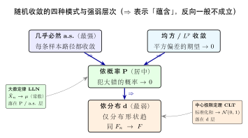

# 第四部分导论：什么是收敛与极限定理？

> **难度**：★★☆☆☆
> **前置知识**：第4–6章随机变量与分布、第7–9章常见分布
> **定位**：这是第三部分（分布）到第四部分（极限定理）之间的**概念桥梁**。第10–12章会讲大数定律、中心极限定理、各种收敛性，但在动手之前要先回答一个被很多教材跳过的问题——**当我们说"随机变量序列 $X_n$ 收敛"时，到底在说什么？为什么一个数列的极限不够用，需要好几种不同的"收敛模式"？**

---

## 学习目标

- 理解第四部分研究的对象：不是单个随机变量，而是**随机变量序列** $X_1,X_2,\dots$（如样本均值 $\bar X_n$）在 $n\to\infty$ 时的**极限行为**
- 说清"随机序列收敛"为什么不能照搬普通数列极限——随机量"靠近"有多种合理含义
- 直观掌握四种收敛模式（几乎必然 / 依概率 / 依分布 / 均方）及其**强弱层次**
- 看懂两类极限定理在回答不同问题：**大数定律**管"中心在哪"、**中心极限定理**管"围绕中心怎么涨落"
- 学会"读"一个极限定理：随机量序列 + 收敛模式 + 极限对象

---

## 0.1 为什么需要"极限定理"这一部分

前三部分我们盯着**有限**的对象：一个随机变量、它的分布、几个随机变量的联合分布。但现实里最有用的问题往往是"**当试验次数或样本量 $n$ 越来越大时会怎样**"：

- 抛硬币，正面频率为什么会**稳定**到 $0.5$？
- 用样本均值 $\bar X_n$ 估计真实均值 $\mu$，为什么 $n$ 越大估计越准？
- 大量独立的小随机因素叠加起来，为什么总会冒出一条**钟形曲线**（正态分布）？

这些问题的共同点是：研究的不再是某个固定的随机变量，而是**一整列随机变量** $X_1,X_2,X_3,\dots$（例如 $\bar X_1,\bar X_2,\dots$），并追问"当 $n\to\infty$ 时它趋向什么"。**这正是第四部分的主题——随机序列的极限。**

> **引子**：你说"样本均值 $\bar X_n$ 收敛到 $\mu$"。但 $\bar X_n$ 是个**随机变量**——每跑一次实验它都给出不同的值，谈何"收敛到一个数"？普通数列 $a_n\to a$ 的定义（任给 $\varepsilon$，存在 $N$，$n>N$ 时 $|a_n-a|<\varepsilon$）在这里直接套用会出问题：$|\bar X_n-\mu|$ 本身是随机的，它"小于 $\varepsilon$"这件事只能**以某个概率**发生。
>
> 那"随机序列收敛"到底该怎么定义？

答案是：**有好几种都合理、但强弱不同的定义**。理解它们的区别，是读懂大数定律与中心极限定理的前提。

---

## 0.2 随机序列的收敛，为什么不能照搬数列极限

普通数列 $a_n$ 的每一项是一个**确定的数**，"靠近 $a$"只有一种含义。但随机序列 $X_n$ 的每一项是一个**随机变量**（一个函数 $X_n:\Omega\to\mathbb{R}$）。"$X_n$ 靠近 $X$"就有了**多个互不等价**的合理解释，取决于你关心的是哪一面：

1. **逐条样本路径**：固定一个试验结果 $\omega$，得到一条普通实数列 $X_1(\omega),X_2(\omega),\dots$；要求"几乎每一条这样的路径都像普通数列那样收敛"。这是最严格的 → **几乎必然收敛（a.s.）**。
2. **犯大错的概率**：不追究每条路径，只要求"$X_n$ 偏离 $X$ 超过 $\varepsilon$"这个**坏事件的概率随 $n$ 趋于零"。偶尔出大错没关系，只要越来越罕见 → **依概率收敛（P）**。
3. **平均的平方误差**：要求 $E[(X_n-X)^2]\to 0$，即"平方偏差的期望"趋零 → **均方收敛 / $L^p$ 收敛**。
4. **只看分布形状**：根本不要求 $X_n$ 和 $X$ "靠在一起"，甚至不必定义在同一个概率空间上；只要求 $X_n$ 的**分布**趋于 $X$ 的分布（分布函数 $F_n(x)\to F(x)$）→ **依分布收敛（d）**。

> **关键体会**：这四种"收敛"问的是不同的问题——是"每条路径都收敛"，还是"出错概率趋零"，还是"平均误差趋零"，还是"仅仅分布趋同"？正因为随机量比确定数多了"概率"这一维，"靠近"才会分裂成这几种模式。本导论只讲直觉，**严格定义与等价刻画见 [第12章](./12-convergence-theory.md)**。

---

## 0.3 四种收敛模式与强弱层次

这四种模式不是平行的，而是有明确的**强弱蕴含关系**：强的成立必然推出弱的，反之一般不成立。

$$
\text{几乎必然 (a.s.)} \ \Longrightarrow\ \text{依概率 (P)} \ \Longrightarrow\ \text{依分布 (d)},\qquad
\text{均方 ($L^2$)} \ \Longrightarrow\ \text{依概率 (P)}.
$$

| 模式 | 一句话直觉 | 强弱 |
|---|---|---|
| **几乎必然 a.s.** | 除一个零概率例外集外，**每条样本路径**都像普通数列一样收敛 | 最强 |
| **均方 / $L^p$** | 平方偏差的期望 $E[(X_n-X)^2]\to 0$（关心"平均能量"） | 强（蕴含 P） |
| **依概率 P** | "偏离超过 $\varepsilon$"这个**坏事件的概率** $\to 0$；偶尔出错但越来越罕见 | 居中 |
| **依分布 d** | 仅**分布形状**趋同 $F_n(x)\to F(x)$；不要求随机变量本身接近 | 最弱 |

**为什么"反之一般不成立"很重要**：例如存在依概率收敛却不几乎必然收敛的序列（典型的"打字机序列"反例，见 [第12章](./12-convergence-theory.md)），所以不能把"依概率"随意升级成"几乎必然"。选对收敛模式，是叙述和使用极限定理时的关键。

---

## 0.4 两类极限定理：各回答什么问题

有了"收敛模式"这把尺子，第10–11章的两大定理就能各归其位——它们回答的是关于 $\bar X_n$ 的**两个不同问题**：

**大数定律（LLN，第10章）——中心在哪？**
样本均值 $\bar X_n$ 会**收敛到一个常数**（真实均值 $\mu$）：

$$\bar X_n \xrightarrow{P}\mu\ (\text{弱大数定律}),\qquad \bar X_n \xrightarrow{a.s.}\mu\ (\text{强大数定律}).$$

它用的是**依概率 / 几乎必然**收敛——回答"平均值会不会稳定、稳定到哪"。这是频率稳定性、蒙特卡洛积分、统计估计的理论根基。

**中心极限定理（CLT，第11章）——围绕中心怎么涨落？**
$\bar X_n$ 收敛到常数后，再放大来看它的**随机涨落**：把 $\bar X_n-\mu$ 按 $\sqrt n$ 标准化，其**分布**趋于正态：

$$\frac{\bar X_n-\mu}{\sigma/\sqrt n}\ \xrightarrow{d}\ \mathcal{N}(0,1).$$

它用的是**依分布**收敛——回答"涨落的形状长什么样"。答案惊人地普适：无论原始分布是什么，涨落总趋于正态。

> 一句话对照：**LLN 说"平均值会稳定到 $\mu$"，CLT 说"它围绕 $\mu$ 的涨落是正态形状的"。前者关于位置（依概率/a.s.），后者关于分布（依分布）——正好分处强弱层次的两端。**

---

## 0.5 怎么"读"一个极限定理

掌握上面的语言后，几乎所有极限定理都能拆成同一个模板：

$$\underbrace{X_n}_{\text{哪个随机量序列}}\ \xrightarrow{\ \underbrace{?}_{\text{哪种收敛模式}}\ }\ \underbrace{X}_{\text{极限对象（常数还是某分布）}}$$

读定理时，依次问三件事：

1. **谁在收敛？** 是 $\bar X_n$、部分和 $S_n$、标准化后的 $\frac{S_n-n\mu}{\sigma\sqrt n}$，还是经验分布？
2. **哪种模式？** 箭头上是 $\xrightarrow{P}$、$\xrightarrow{a.s.}$ 还是 $\xrightarrow{d}$？这决定了结论有多强、能怎么用。
3. **极限是什么？** 收敛到一个**常数**（如 LLN 的 $\mu$），还是收敛到一个**分布**（如 CLT 的 $\mathcal{N}(0,1)$）？依分布收敛的极限通常是个分布而非数。

---

## 0.6 小结与衔接

**核心一句话**：第四部分研究**随机变量序列的极限**；因为随机量带着"概率"这一维，"收敛"分裂为强弱不同的几种模式（a.s. $\Rightarrow$ P $\Rightarrow$ d，$L^p\Rightarrow$ P）；大数定律用强模式说"均值稳定到常数"，中心极限定理用最弱的依分布说"涨落是正态形状"。

**思考路标（条件反射）**：

- 看到"$X_n$ 收敛" → 先问"**哪种收敛模式**"，不要默认是数列极限；
- 看到 $\xrightarrow{P}$ / $\xrightarrow{a.s.}$ → 极限通常是个**常数**，想到**大数定律**类结论；
- 看到 $\xrightarrow{d}$ → 极限通常是个**分布**，想到**中心极限定理**类结论，且"分布趋同 $\ne$ 随机变量本身接近"；
- 想"把依概率升级成几乎必然" → **停**，反向一般不成立，需额外条件（见第12章）；
- 看到 $E[(X_n-X)^2]\to 0$ → 这是**均方收敛**，它蕴含依概率收敛。

**接下来三章**：

| 章节 | 主题 | 核心收敛模式 |
|---|---|---|
| [第10章 大数定律](./10-law-of-large-numbers.md) | 切比雪夫不等式、弱/强大数定律 | 依概率 P、几乎必然 a.s. |
| [第11章 中心极限定理](./11-central-limit-theorem.md) | CLT 各形式、正态近似 | 依分布 d |
| [第12章 收敛性理论](./12-convergence-theory.md) | 四种收敛的严格定义、相互关系、Slutsky/$\delta$ 方法 | 全部，含反例 |

带着"收敛分强弱、定理在回答不同问题"这把钥匙，再去读第10章的大数定律，你看到的就不再是一堆相似的极限式，而是"$\bar X_n$ 在不同强度意义下稳定到 $\mu$"的层层递进。
