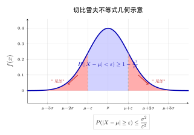
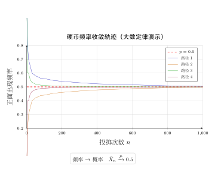
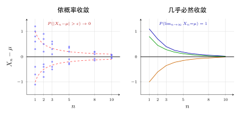

# 第 10 章 大数定律（融合版）

> **难度**：★★★★☆
> **前置知识**：第 7 章期望与方差、第 8 章特征函数（辛钦定理）、第 9 章收敛性基础
> **建议先读**：[第四部分导论《什么是收敛与极限定理？》](./09b-what-is-convergence.md) —— 先理解"随机序列收敛分强弱（依概率/几乎必然/依分布）"，再看大数定律会清晰得多。
> **本文件**：融合"原版严格推导 + 速记 / 套路 / 自测"。保留原版完整正文（学习目标 / 10.1–10.5 / 本章小结 / 深度学习应用 / 练习题）+ 在最前置速记模块 + 最后追加思维训练。

> **一例速记**：
> **马尔可夫不等式**：$X \geq 0$，$a > 0$ → $P(X \geq a) \leq \dfrac{\mathbb{E}[X]}{a}$。
> **切比雪夫不等式**：$\varepsilon > 0$ → $P(| X - \mu| \geq \varepsilon) \leq \dfrac{\sigma^2}{\varepsilon^2}$（等价：$k$ 倍标准差 → $P \leq 1/k^2$）。
> **弱大数定律（WLLN）**：i.i.d.，$\mathbb{E}[| X_1|] < \infty$ → $\bar{X}_n \xrightarrow{P} \mu$（依概率）。
> **强大数定律（SLLN）**：i.i.d. → $\bar{X}_n \xrightarrow{a.s.} \mu$ **当且仅当** $\mathbb{E}[| X_1|] < \infty$（几乎处处）。
> **伯努利大数定律**：$m_n/n \xrightarrow{P} p$（频率依概率收敛到概率，$n\to\infty$）。

---

## 引入：反直觉 / 动机题

> **题目（赌徒谬误）**：连续抛一枚公平硬币，已经连续出现 10 次正面。现在抛第 11 次，正面的概率是多少？许多人直觉答"小于 0.5，因为要'补偿'回来了"——这就是赌徒谬误。

请先停下来想一想：独立试验的下一次结果，**和过去发生了什么完全无关**。

正确答案：**第 11 次仍是 0.5**。每次试验独立，过去的 10 次正面**不会影响**未来一次。

那大数定律说的"正面频率趋于 0.5"是什么意思？

关键洞察有两点：
1. 大数定律保证的是**长期频率**（$m_n/n$）趋于 $p = 0.5$，而非"接下来几次必须出反面"。
2. 在 $n = 10$ 时已经有 10 次正面，频率为 1.0；随着 $n$ 增大到 1000、10000，即使没有"补偿"，分子上 10 次正面的影响被 $n$ 的增大淹没，频率自然趋于 0.5。

**另一视角**：连掷 1000 次硬币，正面比例为何接近 0.5？

直觉上，每次扔出正面或反面，"随机性"应该让结果乱七八糟。但大数定律恰恰说：**大量独立随机性叠加会趋于确定**。样本均值的方差为 $\sigma^2/n$，$n \to \infty$ 时方差趋于 0，均值"凝结"在期望附近。

这种"随机中的必然"正是大数定律最深刻的哲学含义，也是统计推断、机器学习、蒙特卡罗方法的共同理论基石。

---

## 思维路径还原（如何用切比雪夫推导 WLLN）

> "收到 WLLN 证明任务，我脑中第一个想法是：**需要证明 $P(|\bar{X}_n - \mu| \geq \varepsilon) \to 0$**。
>
> 看一眼左边，这是 $\bar{X}_n$ 偏离其均值 $\mu$ 的概率。**切比雪夫不等式**专门处理这类问题，只要给出方差就行。
>
> **第一步：计算 $\bar{X}_n$ 的均值和方差。**
>
> $\bar{X}_n = \frac{1}{n}\sum_{i=1}^n X_i$。利用线性性：$\mathbb{E}[\bar{X}_n] = \frac{1}{n}\sum \mu_i = \bar{\mu}_n$（各变量均值的均值）。
>
> 若两两不相关：$\text{Var}(\bar{X}_n) = \frac{1}{n^2}\sum \sigma_i^2 \leq \frac{nC}{n^2} = \frac{C}{n}$（方差一致有界 $\sigma_i^2 \leq C$）。
>
> **第二步：套切比雪夫不等式。**
>
> $P(|\bar{X}_n - \bar{\mu}_n| \geq \varepsilon) \leq \dfrac{\text{Var}(\bar{X}_n)}{\varepsilon^2} \leq \dfrac{C}{n\varepsilon^2}$。
>
> **第三步：令 $n \to \infty$。**
>
> $\frac{C}{n\varepsilon^2} \to 0$。由夹逼定理，$P(|\bar{X}_n - \bar{\mu}_n| \geq \varepsilon) \to 0$，即依概率收敛。$\square$
>
> 思路总结：WLLN 证明 = **算方差 → 切比雪夫 → $n \to \infty$**，三步走。
>
> **进阶：辛钦 WLLN 为什么不需要方差存在？**
>
> 因为改用了**特征函数**方法：$\varphi_{\bar{X}_n}(t) = [\varphi(t/n)]^n \to e^{i\mu t}$，后者是点质量 $\mu$ 的特征函数。由连续性定理得依概率收敛。整个证明不依赖方差，只需 $\mathbb{E}[| X_1|] < \infty$。
>
> **强/弱区别的直觉：** WLLN 说"固定任意 $\varepsilon$，$n$ 足够大后 $|\bar{X}_n - \mu| < \varepsilon$ 以高概率成立"——但允许偶尔越界。SLLN 更强，说"以概率 1，每一条样本轨道 $\bar{X}_n(\omega)$ 最终都永久进入 $\mu$ 的 $\varepsilon$ 邻域"——一次都不再越界。"

---

## 学习目标

完成本章学习后，你将能够：

1. 理解并应用**切比雪夫不等式**，对随机变量的尾概率给出定量上界
2. 区分**弱大数定律**（依概率收敛）与**强大数定律**（几乎处处收敛）的含义与适用条件
3. 掌握**辛钦大数定律**和**伯努利大数定律**的陈述与证明思路
4. 将大数定律应用于**频率稳定性**、**蒙特卡罗积分**和**统计估计**等实际问题
5. 理解大数定律在机器学习中的理论基础，包括**经验风险最小化**和**SGD收敛性**

---

## 10.1 切比雪夫不等式

### 10.1.1 马尔可夫不等式

在推导切比雪夫不等式之前，先介绍更一般的**马尔可夫不等式**。

**定理 10.1（马尔可夫不等式）** 设 $X$ 是非负随机变量，$\mathbb{E}[X]$ 存在，则对任意 $a > 0$：

$$
P(X \geq a) \leq \frac{\mathbb{E}[X]}{a}
$$

**证明：** 利用示性函数的期望表示。定义 $\mathbf{1}_{\{X \geq a\}}$ 为事件 $\{X \geq a\}$ 的示性函数，则：

$$
a \cdot \mathbf{1}_{\{X \geq a\}} \leq X \cdot \mathbf{1}_{\{X \geq a\}} \leq X
$$

两边取期望：

$$
a \cdot P(X \geq a) = \mathbb{E}[a \cdot \mathbf{1}_{\{X \geq a\}}] \leq \mathbb{E}[X]
$$

除以 $a$ 即得结论。$\square$

### 10.1.2 切比雪夫不等式的陈述

**定理 10.2（切比雪夫不等式）** 设随机变量 $X$ 的期望 $\mu = \mathbb{E}[X]$ 和方差 $\sigma^2 = \text{Var}(X)$ 均存在且有限，则对任意 $\varepsilon > 0$：

$$
\boxed{P(|X - \mu| \geq \varepsilon) \leq \frac{\sigma^2}{\varepsilon^2}}
$$

等价地：

$$
P(|X - \mu| < \varepsilon) \geq 1 - \frac{\sigma^2}{\varepsilon^2}
$$

**证明：** 令 $Y = (X - \mu)^2$，则 $Y$ 是非负随机变量，$\mathbb{E}[Y] = \sigma^2$。

注意到 $|X - \mu| \geq \varepsilon$ 当且仅当 $(X - \mu)^2 \geq \varepsilon^2$，由马尔可夫不等式：

$$
P(|X - \mu| \geq \varepsilon) = P\left((X-\mu)^2 \geq \varepsilon^2\right) \leq \frac{\mathbb{E}[(X-\mu)^2]}{\varepsilon^2} = \frac{\sigma^2}{\varepsilon^2}
$$

$\square$

### 10.1.3 切比雪夫不等式的解读

设 $\varepsilon = k\sigma$（$k > 0$），则：

$$
P(|X - \mu| \geq k\sigma) \leq \frac{1}{k^2}
$$

| $k$ | 上界 $1/k^2$ | 含义 |
|-----|-------------|------|
| 1 | 100% | 无意义 |
| 2 | 25% | $X$ 偏离均值超过 $2\sigma$ 的概率不超过 25% |
| 3 | 11.1% | 偏离超过 $3\sigma$ 的概率不超过 11.1% |
| 4 | 6.25% | 偏离超过 $4\sigma$ 的概率不超过 6.25% |

**注：** 切比雪夫不等式适用于**任意分布**，但界较为宽松。对正态分布而言，$P(|X-\mu| \geq 3\sigma) \approx 0.27\%$，而切比雪夫仅给出 $\leq 11.1\%$。

### 10.1.4 单侧切比雪夫不等式（坎特利不等式）

对于单侧偏差，有更精确的界：

**定理 10.3（坎特利不等式）** 对任意 $t > 0$：

$$
P(X - \mu \geq t) \leq \frac{\sigma^2}{\sigma^2 + t^2}
$$

这比双侧切比雪夫不等式更紧，因为对单侧偏差，分母增加了 $t^2$ 项。

---

## 10.2 弱大数定律

### 10.2.1 依概率收敛

**定义 10.1（依概率收敛）** 设 $\{X_n\}$ 是一列随机变量，$X$ 是随机变量，若对任意 $\varepsilon > 0$：

$$
\lim_{n \to \infty} P(|X_n - X| \geq \varepsilon) = 0
$$

则称 $X_n$ **依概率收敛**（convergence in probability）到 $X$，记为 $X_n \xrightarrow{P} X$。

### 10.2.2 切比雪夫弱大数定律

**定理 10.4（切比雪夫弱大数定律）** 设 $X_1, X_2, \ldots$ 是两两不相关的随机变量序列，每个 $X_i$ 都有期望 $\mu_i$ 和方差 $\sigma_i^2$。若存在常数 $C < \infty$ 使得 $\sigma_i^2 \leq C$ 对所有 $i$ 成立，则：

$$
\bar{X}_n = \frac{1}{n}\sum_{i=1}^n X_i \xrightarrow{P} \frac{1}{n}\sum_{i=1}^n \mu_i
$$

**证明：** 令 $\bar{\mu}_n = \frac{1}{n}\sum_{i=1}^n \mu_i$。由于两两不相关：

$$
\text{Var}(\bar{X}_n) = \frac{1}{n^2}\sum_{i=1}^n \sigma_i^2 \leq \frac{nC}{n^2} = \frac{C}{n}
$$

由切比雪夫不等式，对任意 $\varepsilon > 0$：

$$
P\left(|\bar{X}_n - \bar{\mu}_n| \geq \varepsilon\right) \leq \frac{\text{Var}(\bar{X}_n)}{\varepsilon^2} \leq \frac{C}{n\varepsilon^2} \to 0 \quad (n \to \infty)
$$

$\square$

### 10.2.3 辛钦弱大数定律

**定理 10.5（辛钦弱大数定律，1929）** 设 $X_1, X_2, \ldots$ 是独立同分布（i.i.d.）的随机变量序列，期望 $\mu = \mathbb{E}[X_1]$ 存在（有限），则：

$$
\bar{X}_n = \frac{1}{n}\sum_{i=1}^n X_i \xrightarrow{P} \mu
$$

**注：** 辛钦弱大数定律**不需要方差存在**，仅要求期望有限。这比切比雪夫弱大数定律条件更弱，但证明需要用到**特征函数**方法。

**证明思路（使用特征函数）：** 设 $\varphi(t)$ 是 $X_1$ 的特征函数。$\bar{X}_n$ 的特征函数为：

$$
\varphi_{\bar{X}_n}(t) = \left[\varphi\left(\frac{t}{n}\right)\right]^n
$$

由于 $\mathbb{E}[X_1] = \mu$ 存在，$\varphi(t) = 1 + i\mu t + o(t)$（当 $t \to 0$），因此：

$$
\varphi_{\bar{X}_n}(t) = \left[1 + \frac{i\mu t}{n} + o\left(\frac{1}{n}\right)\right]^n \to e^{i\mu t}
$$

这是常数 $\mu$ 的特征函数，由连续性定理得 $\bar{X}_n \xrightarrow{P} \mu$。$\square$

### 10.2.4 伯努利大数定律

**定理 10.6（伯努利大数定律）** 设在 $n$ 次独立重复试验中，事件 $A$ 发生的次数为 $m_n$，每次试验中 $A$ 发生的概率为 $p$，则：

$$
\frac{m_n}{n} \xrightarrow{P} p
$$

即：对任意 $\varepsilon > 0$，$\lim_{n \to \infty} P\left(\left|\frac{m_n}{n} - p\right| \geq \varepsilon\right) = 0$。

**证明：** $m_n \sim B(n, p)$，故 $\mathbb{E}\left[\frac{m_n}{n}\right] = p$，$\text{Var}\left(\frac{m_n}{n}\right) = \frac{p(1-p)}{n} \leq \frac{1}{4n}$。

由切比雪夫不等式：

$$
P\left(\left|\frac{m_n}{n} - p\right| \geq \varepsilon\right) \leq \frac{p(1-p)}{n\varepsilon^2} \leq \frac{1}{4n\varepsilon^2} \to 0
$$

$\square$

**历史意义：** 伯努利大数定律（1713年，雅各布·伯努利）是概率论中最早的严格定理之一，它从数学上证明了**频率的稳定性**：当试验次数 $n$ 足够大时，频率 $m_n/n$ 与概率 $p$ 之间的差距可以任意小。

---

## 10.3 强大数定律

### 10.3.1 几乎处处收敛

**定义 10.2（几乎处处收敛）** 设 $\{X_n\}$ 是一列随机变量，$X$ 是随机变量，若：

$$
P\left(\lim_{n \to \infty} X_n = X\right) = 1
$$

则称 $X_n$ **几乎处处收敛**（almost sure convergence，a.s.收敛）到 $X$，记为 $X_n \xrightarrow{a.s.} X$。

### 10.3.2 收敛方式的层次

各收敛方式之间的蕴含关系：

$$
\text{依概率1收敛（a.s.）} \Rightarrow \text{依概率收敛（P）} \Rightarrow \text{依分布收敛（d）}
$$

反之不成立（一般情况下）。

**直观区别：**
- **弱大数定律（依概率）：** 固定任意 $\varepsilon > 0$，当 $n$ 足够大时，$|\bar{X}_n - \mu| < \varepsilon$ 以高概率成立。但不排除"坏事件"偶尔发生。
- **强大数定律（a.s.）：** 以概率 1，$\bar{X}_n$ 的每一条样本路径最终都收敛到 $\mu$。

### 10.3.3 科尔莫戈洛夫强大数定律

**定理 10.7（科尔莫戈洛夫强大数定律）** 设 $X_1, X_2, \ldots$ 是独立同分布的随机变量，则：

$$
\frac{1}{n}\sum_{i=1}^n X_i \xrightarrow{a.s.} \mu
$$

**当且仅当** $\mathbb{E}[|X_1|] < \infty$，此时 $\mu = \mathbb{E}[X_1]$。

这是大数定律最完整的形式：**i.i.d. 随机变量强大数定律成立的充要条件是期望有限。**

### 10.3.4 科尔莫戈洛夫强大数定律的证明（四阶矩条件）

当 $\mathbb{E}[X_i^4] < \infty$ 时，可以利用矩方法给出更直接的证明。

设 $X_i$ i.i.d.，$\mu = 0$，$\sigma^2 = \mathbb{E}[X_i^2]$，$\mathbb{E}[X_i^4] < \infty$。

展开 $\mathbb{E}[\bar{X}_n^4]$：

$$
\mathbb{E}\left[\left(\sum_{i=1}^n X_i\right)^4\right] = n\mathbb{E}[X_1^4] + 3n(n-1)\sigma^4
$$

（其他交叉项因独立性消为 0。）因此：

$$
\mathbb{E}[\bar{X}_n^4] = \frac{1}{n^4}\left(n\mathbb{E}[X_1^4] + 3n(n-1)\sigma^4\right) = O\left(\frac{1}{n^2}\right)
$$

由 Borel-Cantelli 引理，利用 $\sum_{n=1}^\infty \mathbb{E}[\bar{X}_n^4] < \infty$ 可得几乎处处收敛。

### 10.3.5 强大数定律的几何直观

设 $X_1, X_2, \ldots$ i.i.d.，以 $\mu = 0$，$\sigma = 1$ 的标准正态为例。

对样本轨道 $\omega$，样本均值序列 $\bar{X}_n(\omega) = \frac{1}{n}\sum_{i=1}^n X_i(\omega)$。

强大数定律告诉我们：在样本空间中，除了一个概率为 0 的集合之外，**每一条样本轨道** $\{\bar{X}_n(\omega)\}_{n=1}^\infty$ 都满足 $\bar{X}_n(\omega) \to 0$。

---

## 10.4 大数定律的应用

### 10.4.1 频率的稳定性与概率的频率定义

伯努利大数定律为概率的**频率解释**提供了数学基础：

- 统计意义上，我们用频率 $f_n = m_n/n$ 来估计概率 $p$
- 大数定律保证：随着 $n \to \infty$，$f_n \to p$（依概率，乃至几乎处处）

**样本量与误差：** 由切比雪夫不等式，若希望 $P(|f_n - p| < \varepsilon) \geq 1 - \delta$，则需要：

$$
n \geq \frac{1}{4\varepsilon^2 \delta}
$$

（利用 $p(1-p) \leq 1/4$。）例如，$\varepsilon = 0.01$，$\delta = 0.05$，需要 $n \geq 50000$。

### 10.4.2 蒙特卡罗积分

**问题：** 计算积分 $I = \int_a^b f(x)\,dx$。

**方法：** 令 $X \sim \text{Uniform}(a, b)$，则：

$$
I = (b-a)\,\mathbb{E}[f(X)]
$$

由强大数定律，若 $X_1, \ldots, X_n$ i.i.d. $\sim \text{Uniform}(a, b)$，则：

$$
\hat{I}_n = \frac{b-a}{n}\sum_{i=1}^n f(X_i) \xrightarrow{a.s.} I
$$

**误差估计：** 设 $\sigma_f^2 = \text{Var}(f(X))$，则估计量的标准误为：

$$
\text{SE}(\hat{I}_n) = \frac{(b-a)\sigma_f}{\sqrt{n}}
$$

蒙特卡罗积分的误差以 $O(1/\sqrt{n})$ 收敛，与维度无关（克服了维数灾难）。

### 10.4.3 样本均值的一致性

**定义 10.3（相合估计量）** 若 $\hat{\theta}_n$ 是参数 $\theta$ 的估计量，且 $\hat{\theta}_n \xrightarrow{P} \theta$（或 $\xrightarrow{a.s.} \theta$），则称 $\hat{\theta}_n$ 是 $\theta$ 的**相合估计量**（consistent estimator）。

由强大数定律：
- 样本均值 $\bar{X}_n$ 是总体均值 $\mu$ 的相合估计量
- 样本 $k$ 阶矩 $\frac{1}{n}\sum X_i^k$ 是总体 $k$ 阶矩的相合估计量（当总体 $k$ 阶矩有限时）
- 样本方差 $S_n^2 = \frac{1}{n}\sum(X_i - \bar{X}_n)^2$ 是总体方差的相合估计量

### 10.4.4 大偏差原理（预览）

当我们问"$\bar{X}_n$ 偏离 $\mu$ 有多大幅度的概率是多少"时，大数定律告诉我们这个概率趋于 0，但**大偏差原理**（Large Deviation Principle, LDP）给出了更精确的指数衰减率：

$$
P\left(\bar{X}_n \geq \mu + t\right) \approx e^{-n \cdot I(\mu + t)}
$$

其中 $I(x) = \sup_\lambda \{\lambda x - \log \mathbb{E}[e^{\lambda X}]\}$ 是**速率函数**（Cramér 变换）。

---

## 10.5 收敛速度与误差界

### 10.5.1 Berry-Esseen 定理（收敛到正态的速度）

大数定律告诉我们 $\bar{X}_n \to \mu$，中心极限定理（CLT）告诉我们 $\sqrt{n}(\bar{X}_n - \mu)/\sigma \to N(0,1)$。**Berry-Esseen 定理**给出 CLT 收敛的速度：

**定理 10.8（Berry-Esseen 定理）** 设 $X_1, \ldots, X_n$ i.i.d.，$\mathbb{E}[X_1] = 0$，$\mathbb{E}[X_1^2] = \sigma^2$，$\mathbb{E}[|X_1|^3] = \rho < \infty$。令 $F_n$ 为 $\bar{X}_n / (\sigma/\sqrt{n})$ 的分布函数，$\Phi$ 为标准正态分布函数，则：

$$
\sup_x |F_n(x) - \Phi(x)| \leq \frac{C\rho}{\sigma^3 \sqrt{n}}
$$

其中最优常数 $C \approx 0.4748$。这表明 CLT 近似以 $O(1/\sqrt{n})$ 的速度收敛。

### 10.5.2 Hoeffding 不等式

对有界随机变量，可以得到比切比雪夫不等式更紧的指数型界。

**定理 10.9（Hoeffding 不等式）** 设 $X_1, \ldots, X_n$ 独立，$a_i \leq X_i \leq b_i$，$\mathbb{E}[X_i] = \mu_i$，令 $S_n = \sum_{i=1}^n X_i$，$\mu = \sum_{i=1}^n \mu_i$，则对任意 $t > 0$：

$$
\boxed{P(S_n - \mu \geq t) \leq \exp\left(-\frac{2t^2}{\sum_{i=1}^n (b_i - a_i)^2}\right)}
$$

特别地，若 $X_i$ i.i.d.，$a \leq X_i \leq b$，则：

$$
P\left(\bar{X}_n - \mu \geq t\right) \leq \exp\left(-\frac{2nt^2}{(b-a)^2}\right)
$$

**与切比雪夫不等式的对比：**

| | 切比雪夫 | Hoeffding |
|---|---|---|
| 分布假设 | 无 | 有界 |
| 收敛速度 | 多项式 $1/n$ | 指数 $e^{-cn}$ |
| 适用场景 | 一般 | 有界变量（机器学习常见）|

### 10.5.3 有效样本量与置信区间

设 $X_i$ i.i.d.，$0 \leq X_i \leq 1$（如伯努利变量），均值 $\mu$ 未知。

给定置信度 $1 - \delta$，误差 $\varepsilon$，由 Hoeffding 不等式，需要：

$$
2\exp(-2n\varepsilon^2) \leq \delta \implies n \geq \frac{\ln(2/\delta)}{2\varepsilon^2}
$$

例如，$\varepsilon = 0.05$，$\delta = 0.05$，需要 $n \geq \frac{\ln 40}{2 \times 0.0025} \approx 738$ 个样本。

这比切比雪夫界（$n \geq 1/(4\varepsilon^2\delta) = 2000$）所需样本量更少。

### 10.5.4 次高斯变量与 Chernoff 界

**定义 10.4（次高斯变量）** 若随机变量 $X$（均值为 0）满足：

$$
\mathbb{E}[e^{tX}] \leq e^{\sigma^2 t^2/2}, \quad \forall t \in \mathbb{R}
$$

则称 $X$ 是参数为 $\sigma$ 的**次高斯**（sub-Gaussian）随机变量。

有界变量 $X \in [a,b]$ 是次高斯变量，参数 $\sigma = (b-a)/2$。

对次高斯变量，**Chernoff 界**给出：

$$
P\left(\bar{X}_n - \mu \geq t\right) \leq \exp\left(-\frac{nt^2}{2\sigma^2}\right)
$$

---

## 几何示意

### 图 10-1：切比雪夫不等式几何示意（钟形曲线 + $\varepsilon$ 带 + 尾部阴影）



分布密度曲线以 $\mu$ 为中心，两侧各标出 $\varepsilon$ 边界；$| X - \mu| \geq \varepsilon$ 的尾部阴影面积即为 $P(| X - \mu| \geq \varepsilon)$，切比雪夫不等式给出其上界 $\sigma^2/\varepsilon^2$。

### 图 10-2：硬币投掷频率收敛轨迹



多条独立样本路径在初期波动剧烈，随着 $n$ 增大逐渐"收束"到 $p = 0.5$ 附近，直观展示弱大数定律（每条路径最终落在 $0.5$ 附近）与强大数定律（几乎每条路径都逐渐贴近 $0.5$）。

### 图 10-3：WLLN vs SLLN 差异示意



WLLN（左）：对固定 $\varepsilon$，$n$ 足够大后概率带内的路径比例趋于 1，但各条路径允许偶尔穿出带外。SLLN（右）：以概率 1，每条路径最终永久落入带内——"偶尔穿出"的轨道集合的概率为 0。

---

## 抽象成方法（套路总结）

### 5 大核心公式速查

| 名称 | 公式 | 条件 |
|---|---|---|
| **马尔可夫不等式** | $P(X \geq a) \leq \dfrac{\mathbb{E}[X]}{a}$，$X \geq 0$，$a > 0$ | 期望有限 |
| **切比雪夫不等式** | $P(\vert X - \mu\vert \geq \varepsilon) \leq \dfrac{\sigma^2}{\varepsilon^2}$ | 期望、方差存在 |
| **Hoeffding 不等式** | $P(\bar{X}_n - \mu \geq t) \leq \exp\!\left(-\dfrac{2nt^2}{(b-a)^2}\right)$ | 独立有界 $[a,b]$ |
| **WLLN（辛钦）** | $\bar{X}_n \xrightarrow{P} \mu$ | i.i.d.，$\mathbb{E}[\vert X_1\vert] < \infty$ |
| **SLLN（科尔莫戈洛夫）** | $\bar{X}_n \xrightarrow{a.s.} \mu$ 当且仅当 $\mathbb{E}[\vert X_1\vert] < \infty$ | i.i.d. |

### 用大数定律证明依概率收敛的 4 步流程

1. **识别目标**：确认需要证 $\bar{X}_n \xrightarrow{P} c$（某常数）或 $X_n \xrightarrow{P} X$。
2. **计算方差**：若 $X_i$ 两两不相关，$\text{Var}(\bar{X}_n) = \frac{1}{n^2}\sum\sigma_i^2$；i.i.d. 时为 $\sigma^2/n$。
3. **套切比雪夫**：$P(|\bar{X}_n - \mu| \geq \varepsilon) \leq \text{Var}(\bar{X}_n)/\varepsilon^2$。
4. **令 $n \to \infty$**：若右端 $\to 0$，收敛得证。若方差不存在，改用辛钦/特征函数方法。

---

## 方法变形

### 变形 1：不等式的选择

- **任意分布、仅知期望**：马尔可夫（$X \geq 0$）
- **任意分布、知期望和方差**：切比雪夫（双侧 / 单侧坎特利）
- **有界随机变量、要指数尾界**：Hoeffding（比切比雪夫指数级更紧）
- **次高斯变量**：Chernoff 界（覆盖有界 + 高斯）

### 变形 2：对不同目标量的应用

- **样本均值 $\bar{X}_n$**：直接套 WLLN/SLLN
- **频率 $m_n/n$**：伯努利大数定律，$m_n/n \xrightarrow{P} p$
- **任意函数的样本均值 $\frac{1}{n}\sum g(X_i)$**：令 $Y_i = g(X_i)$，若 $\mathbb{E}[| g(X_1)|] < \infty$，则 $\frac{1}{n}\sum g(X_i) \xrightarrow{a.s.} \mathbb{E}[g(X)]$（SLLN 对 i.i.d. 直接适用）
- **经验分布函数**：Glivenko-Cantelli 定理，样本 CDF 一致收敛到总体 CDF

### 变形 3：弱大数定律的四种情形对比

| 版本 | 独立性要求 | 同分布？ | 矩要求 | 核心工具 |
|---|---|---|---|---|
| 切比雪夫 WLLN | 两两不相关 | 否 | $\sigma_i^2 \leq C$ | 切比雪夫不等式 |
| 辛钦 WLLN | 独立 | 是 | $\mathbb{E}[\vert X_1\vert] < \infty$ | 特征函数 |
| 伯努利 WLLN | 独立 | 是（Bernoulli） | 有限（$p \in [0,1]$） | 切比雪夫不等式 |
| 马尔科夫 WLLN | 独立 | 否 | $\text{Var}(S_n) = o(n^2)$ | 切比雪夫不等式 |

### 变形 4：与中心极限定理的衔接

大数定律（LLN）和中心极限定理（CLT）回答的问题层次不同：

- **LLN**：$\bar{X}_n \to \mu$（收敛到一个点，定性）
- **CLT**：$\sqrt{n}(\bar{X}_n - \mu)/\sigma \to N(0,1)$（收敛速度的精确分布，定量）

可以理解为：LLN 告诉我们"中心在哪"，CLT 告诉我们"误差有多大"。Berry-Esseen 定理进一步给出 CLT 近似误差为 $O(1/\sqrt{n})$。

---

## 本章小结

| 定理 | 条件 | 收敛类型 | 核心工具 |
|------|------|----------|----------|
| 切比雪夫不等式 | 期望、方差存在 | 尾概率上界 | 马尔可夫不等式 |
| 伯努利弱大数定律 | 独立同分布伯努利 | 依概率 | 切比雪夫不等式 |
| 辛钦弱大数定律 | i.i.d.，期望有限 | 依概率 | 特征函数 |
| 切比雪夫弱大数定律 | 两两不相关，方差一致有界 | 依概率 | 切比雪夫不等式 |
| 科尔莫戈洛夫强大数定律 | i.i.d.，期望有限（充要）| 几乎处处 | Borel-Cantelli |
| Hoeffding 不等式 | 独立有界 | 指数尾界 | 矩母函数 |

**核心要点：**

1. 大数定律的本质是：**大量独立随机性的叠加趋于确定性**。样本均值以各种意义下收敛到总体均值。

2. 弱大数定律（依概率）与强大数定律（a.s.）的区别在于：前者对固定 $\varepsilon$ 在极限意义下成立，后者对几乎所有样本路径同时成立。

3. 切比雪夫不等式给出多项式衰减的尾界，Hoeffding 不等式（有界时）给出指数衰减的尾界。

4. 大数定律是统计学（相合性）、机器学习（经验风险最小化）、蒙特卡罗方法的理论基础。

---

## 思考路标（条件反射）

1. 看到"频率收敛"→ 立刻想伯努利大数定律 $m_n/n \xrightarrow{P} p$，证明工具是切比雪夫不等式。
2. 看到"样本均值收敛"→ 看条件：i.i.d. 且期望存在 → 辛钦 WLLN；若还要几乎处处 → 科尔莫戈洛夫 SLLN。
3. 看到"估计尾概率上界"→ 先判断：知道方差 → 切比雪夫；变量有界 → Hoeffding（更紧）；只知期望且 $X \geq 0$ → 马尔可夫。
4. 看到"WLLN 证明"→ 标准三步：算方差、套切比雪夫、令 $n \to \infty$。
5. 看到"强大数定律"→ 核心关键词 Borel-Cantelli + 四阶矩 $O(1/n^2)$ + 级数收敛。
6. 看到"赌徒谬误"→ 独立性，大数定律针对长期频率，不对单次结果作预测。
7. 看到"蒙特卡罗积分"→ 用 SLLN 保证收敛（几乎处处），误差 $O(1/\sqrt{n})$，与维度无关。
8. 看到"经验风险最小化"→ SLLN 保证经验风险依概率收敛到真实风险（相合估计量）。
9. 看到"$P \Rightarrow$ a.s."的反例 → 想到游走序列：$P$ 收敛但 a.s. 不收敛的经典反例。
10. 看到"方差不存在"→ 切比雪夫 WLLN 不能用，辛钦 WLLN 仍可用（仅要求期望有限）；柯西分布连期望都没有，所以 LLN 不成立。
11. 看到"样本量估计"→ 切比雪夫给 $n \geq \sigma^2/(\varepsilon^2\delta)$，Hoeffding 给 $n \geq \ln(2/\delta)/(2\varepsilon^2)$，后者更小（有界变量时）。
12. 看到"LLN vs CLT"→ LLN 说均值趋于期望（定性），CLT 说缩放后的偏差趋于正态（定量速率）。

---

## 易错点

1. **"几乎必然"≠ "必然"**：SLLN 说 $P(\lim \bar{X}_n = \mu) = 1$，但存在概率为 0 的"坏"样本路径不收敛。"几乎必然"不等于所有路径，只是例外集合测度为 0。混淆此点会错误地说"每条路径一定收敛"。

2. **弱收敛和强收敛的混用**：WLLN 成立不意味着 SLLN 成立。例如经典的 $X_n \xrightarrow{P} 0$ 但 $X_n \not\to{a.s.} 0$ 的反例（在 $[0,1]$ 上滑动的指示函数）说明二者有本质差别，不可互换使用。

3. **有限方差不是 WLLN/SLLN 的必要条件**：辛钦 WLLN 仅需 $\mathbb{E}[| X_1|] < \infty$，不需要方差存在。柯西分布均值不存在，LLN 不成立；但满足期望条件的分布（如部分厚尾分布）没有方差，辛钦定理依然适用。

4. **独立性 vs 同分布**：切比雪夫 WLLN 只要求两两不相关，不要求独立也不要求同分布；辛钦 WLLN 要求 i.i.d.。在实际应用中将"两两不相关"与"独立"混用，会导致错误地引用定理。

5. **收敛速度的误判**：LLN 保证收敛但不说速度——$\bar{X}_n - \mu$ 的典型量级是 $O(1/\sqrt{n})$，由 CLT 给出。切比雪夫给的尾概率界是 $O(1/n)$（多项式衰减），Hoeffding 给出指数衰减 $e^{-cn}$；不能把两个界的收敛速度混淆。

6. **大数定律 ≠ 赌徒"平衡律"**：大数定律不保证"先亏后补"，只保证长期频率稳定——已发生的偏差不会被"抹平"，只会被大量后续观测"稀释"。

---

## 典型应用例题

### 例 1：切比雪夫不等式估计尾概率

> **题目**：某工厂零件质量 $X$（克）满足 $\mathbb{E}[X] = 100$，$\text{Var}(X) = 4$。
> (1) 用切比雪夫不等式估计 $P(| X - 100| \geq 5)$ 的上界。
> (2) 若 $X \sim N(100, 4)$，计算 (1) 的精确值并与切比雪夫界比较。

**思路**：切比雪夫直接套公式；精确值用标准化 $Z = (X - 100)/2 \sim N(0,1)$。

**解**：

(1) $P(| X - 100| \geq 5) \leq \dfrac{\sigma^2}{\varepsilon^2} = \dfrac{4}{25} = 0.16$。

(2) $P(| X - 100| \geq 5) = P(| Z| \geq 2.5) = 2(1 - \Phi(2.5)) \approx 2 \times 0.0062 = 0.0124$。

切比雪夫界（16%）比精确值（1.24%）宽松了约 13 倍——这体现了切比雪夫不等式对一般分布的"保守性"代价。

**答案**：$\boxed{\text{切比雪夫上界 } 0.16,\ \text{精确值 } \approx 0.0124}$

---

### 例 2：频率收敛与样本量估计

> **题目**：某网站的点击率为 $p$（未知，$p \in [0,1]$）。要用频率估计 $p$，希望以至少 95% 的概率保证误差 $|\hat{p}_n - p| < 0.02$。
> (1) 用切比雪夫不等式给出所需样本量 $n$。
> (2) 用 Hoeffding 不等式给出更紧的样本量下界，并比较。

**思路**：（1）$p(1-p) \leq 1/4$，切比雪夫；（2）Hoeffding 利用 $Z_i \in [0,1]$。

**解**：

(1) $P(|\hat{p}_n - p| \geq 0.02) \leq \dfrac{p(1-p)}{n \times 0.02^2} \leq \dfrac{1}{4n \times 0.0004} = \dfrac{1}{0.0016n}$。

要使此上界 $\leq 0.05$：$n \geq \dfrac{1}{0.0016 \times 0.05} = 12500$。

(2) Hoeffding：$P(|\hat{p}_n - p| \geq 0.02) \leq 2\exp(-2n \times 0.02^2) = 2e^{-0.0008n}$。

令 $2e^{-0.0008n} \leq 0.05$：$n \geq \dfrac{\ln 40}{0.0008} \approx \dfrac{3.689}{0.0008} \approx 4612$。

**比较**：Hoeffding 需 4612，切比雪夫需 12500，Hoeffding 节省约 63% 样本量。

**答案**：$\boxed{n_{\text{切比雪夫}} \geq 12500,\quad n_{\text{Hoeffding}} \geq 4612}$

---

### 例 3：Monte Carlo 估计收敛速度

> **题目**：用蒙特卡罗方法计算 $I = \int_0^1 e^{-x^2}\,dx$。
> (1) 写出 Monte Carlo 估计量 $\hat{I}_n$，并证明它依概率收敛到 $I$。
> (2) 估计方差 $\text{Var}(\hat{I}_n)$，并求使 RMSE $\leq 10^{-3}$ 所需的 $n$。
> (3) Monte Carlo 的误差收敛速率是多少？与维度的关系如何？

**思路**：$X \sim U(0,1)$，$\hat{I}_n = \frac{1}{n}\sum e^{-X_i^2}$；利用 SLLN 和方差公式。

**解**：

(1) $\hat{I}_n = \frac{1}{n}\sum_{i=1}^n e^{-X_i^2}$，$X_i \sim U(0,1)$ i.i.d.。

由 SLLN（$\mathbb{E}[| e^{-X^2}|] = I < \infty$），$\hat{I}_n \xrightarrow{a.s.} \mathbb{E}[e^{-X^2}] = I$。

(2) $\text{Var}(\hat{I}_n) = \frac{1}{n}\text{Var}(e^{-X^2})$。数值计算：$\int_0^1 e^{-2x^2}\,dx \approx 0.6267$，$I \approx 0.7468$，
故 $\text{Var}(e^{-X^2}) \approx 0.6267 - 0.7468^2 \approx 0.069$。

RMSE $= \sqrt{\text{Var}(\hat{I}_n)} = \sqrt{0.069/n} \leq 10^{-3}$ $\Rightarrow$ $n \geq 0.069 \times 10^6 = 69000$。

(3) 误差以 $O(1/\sqrt{n})$ 收敛，与**维度无关**。这是 Monte Carlo 优于数值积分（$d$ 维梯形法误差 $O(n^{-2/d})$）的核心优势，在高维积分中尤为显著。

**答案**：$\boxed{n \geq 69000,\ \text{收敛速率 } O(1/\sqrt{n}),\ \text{与维度无关}}$

---

## 深度学习应用

### 应用一：经验风险最小化（ERM）

#### 理论框架

在监督学习中，设：
- 样本空间 $\mathcal{Z} = \mathcal{X} \times \mathcal{Y}$
- 损失函数 $\ell: \mathcal{H} \times \mathcal{Z} \to \mathbb{R}_{\geq 0}$
- 数据分布 $\mathcal{D}$
- 训练集 $S = \{z_1, \ldots, z_n\} \sim \mathcal{D}^n$（i.i.d.）

**真实风险（期望风险）：**

$$
R(h) = \mathbb{E}_{z \sim \mathcal{D}}[\ell(h, z)]
$$

**经验风险：**

$$
\hat{R}_S(h) = \frac{1}{n}\sum_{i=1}^n \ell(h, z_i)
$$

由强大数定律，对固定的假设 $h \in \mathcal{H}$：

$$
\hat{R}_S(h) \xrightarrow{a.s.} R(h) \quad (n \to \infty)
$$

这告诉我们：**当训练集足够大时，经验风险是真实风险的相合估计**。

#### 泛化界（使用 Hoeffding）

若损失有界 $\ell(h,z) \in [0, C]$，由 Hoeffding 不等式，以概率至少 $1-\delta$（在训练集 $S$ 的随机性上）：

$$
R(h) \leq \hat{R}_S(h) + C\sqrt{\frac{\ln(1/\delta)}{2n}}
$$

对于有限假设类 $|\mathcal{H}| < \infty$，对所有 $h$ 联合（union bound），以概率至少 $1-\delta$：

$$
\forall h \in \mathcal{H}: \quad R(h) \leq \hat{R}_S(h) + C\sqrt{\frac{\ln(|\mathcal{H}|/\delta)}{2n}}
$$

这说明：**模型越复杂（$|\mathcal{H}|$ 越大），需要越多训练数据才能保证泛化**。

#### PyTorch 代码：观察经验风险收敛到真实风险

```python
import torch
import torch.nn as nn
import numpy as np
import matplotlib.pyplot as plt

# ============================================================
# 实验：验证大数定律在机器学习中的体现
# 经验风险随训练集大小增加而收敛到真实风险
# ============================================================

torch.manual_seed(42)
np.random.seed(42)

# --- 设置真实数据分布 ---
# 真实分布：X ~ N(0,1)，Y = 2X + 1 + eps，eps ~ N(0, 0.5^2)
true_w = 2.0
true_b = 1.0
noise_std = 0.5

def true_risk(w, b, n_samples=100000):
    """用大量样本估计真实风险（MSE）"""
    X = torch.randn(n_samples)
    eps = torch.randn(n_samples) * noise_std
    Y = true_w * X + true_b + eps
    Y_pred = w * X + b
    return ((Y_pred - Y) ** 2).mean().item()

# --- 固定一个次优模型 ---
# 用于观察经验风险 -> 真实风险 的收敛
w_test = torch.tensor(1.8)
b_test = torch.tensor(1.2)

# 真实风险（精确值）
# E[(wX + b - (2X + 1 + eps))^2] = (w-2)^2 * E[X^2] + (b-1)^2 + sigma^2
# = (1.8-2)^2 * 1 + (1.2-1)^2 + 0.25 = 0.04 + 0.04 + 0.25 = 0.33
analytical_true_risk = (w_test - true_w)**2 * 1.0 + (b_test - true_b)**2 + noise_std**2
print(f"解析真实风险: {analytical_true_risk.item():.4f}")

# --- 实验：不同样本量下的经验风险 ---
sample_sizes = [10, 20, 50, 100, 200, 500, 1000, 2000, 5000]
n_trials = 200  # 每个样本量重复 200 次

empirical_risks_mean = []
empirical_risks_std = []

for n in sample_sizes:
    risks = []
    for _ in range(n_trials):
        X = torch.randn(n)
        eps = torch.randn(n) * noise_std
        Y = true_w * X + true_b + eps
        Y_pred = w_test * X + b_test
        emp_risk = ((Y_pred - Y) ** 2).mean().item()
        risks.append(emp_risk)
    empirical_risks_mean.append(np.mean(risks))
    empirical_risks_std.append(np.std(risks))

# --- 绘图 ---
fig, axes = plt.subplots(1, 2, figsize=(14, 5))

# 左图：经验风险的期望和标准差 vs 样本量
ax = axes[0]
means = np.array(empirical_risks_mean)
stds = np.array(empirical_risks_std)
ax.plot(sample_sizes, means, 'b-o', label='经验风险均值', markersize=6)
ax.fill_between(sample_sizes,
                means - stds,
                means + stds,
                alpha=0.3, color='blue', label='±1 标准差')
ax.axhline(y=analytical_true_risk.item(), color='red', linestyle='--',
           label=f'真实风险 = {analytical_true_risk.item():.4f}')
ax.set_xscale('log')
ax.set_xlabel('训练样本量 n')
ax.set_ylabel('风险值')
ax.set_title('大数定律：经验风险收敛到真实风险')
ax.legend()
ax.grid(True, alpha=0.3)

# 右图：标准差 vs 1/sqrt(n)（验证收敛速度）
ax = axes[1]
n_arr = np.array(sample_sizes, dtype=float)
ax.plot(n_arr, stds, 'b-o', label='经验标准差', markersize=6)
# 理论：Std ≈ Var(ell) / sqrt(n)
# Var(ell) 由解析计算得到
ax.plot(n_arr, stds[0] * np.sqrt(sample_sizes[0] / n_arr), 'r--',
        label=r'$O(1/\sqrt{n})$ 参考线')
ax.set_xscale('log')
ax.set_yscale('log')
ax.set_xlabel('训练样本量 n')
ax.set_ylabel('经验风险标准差（对数尺度）')
ax.set_title('收敛速度：$O(1/\\sqrt{n})$')
ax.legend()
ax.grid(True, alpha=0.3)

plt.tight_layout()
plt.savefig('empirical_risk_convergence.png', dpi=150, bbox_inches='tight')
plt.show()
print("图像已保存：empirical_risk_convergence.png")
```

### 应用二：SGD 收敛性与大数定律

#### 理论联系

随机梯度下降（SGD）使用小批量梯度估计完整梯度：

$$
g_t = \frac{1}{B}\sum_{i \in \mathcal{B}_t} \nabla_\theta \ell(\theta_t, z_i)
$$

由大数定律，$g_t$ 是真实梯度 $\nabla_\theta R(\theta_t)$ 的**无偏相合估计**：

$$
\mathbb{E}[g_t \mid \theta_t] = \nabla_\theta R(\theta_t), \quad g_t \xrightarrow{P} \nabla_\theta R(\theta_t) \quad (B \to \infty)
$$

**批大小 $B$ 与梯度方差的关系：**

$$
\text{Var}(g_t) = \frac{\text{Var}(\nabla_\theta \ell)}{B}
$$

增大批大小可以减小梯度噪声（大数定律），但每步计算量也增加。这是 SGD 中批大小选择的核心权衡。

#### PyTorch 代码：观察批大小对梯度估计和训练的影响

```python
import torch
import torch.nn as nn
import torch.optim as optim
from torch.utils.data import DataLoader, TensorDataset
import numpy as np
import matplotlib.pyplot as plt

torch.manual_seed(42)

# ============================================================
# 实验：大数定律在 SGD 中的体现
# 批大小 B 增加 -> 梯度估计方差减小 -> 训练更稳定
# ============================================================

# --- 生成合成数据 ---
n_total = 10000
d = 20  # 特征维度

X_all = torch.randn(n_total, d)
true_weights = torch.randn(d) * 0.5
Y_all = X_all @ true_weights + torch.randn(n_total) * 0.3

# --- 简单线性模型 ---
class LinearModel(nn.Module):
    def __init__(self, d):
        super().__init__()
        self.fc = nn.Linear(d, 1, bias=False)
        nn.init.zeros_(self.fc.weight)

    def forward(self, x):
        return self.fc(x).squeeze(-1)

# --- 实验 1：不同批大小下梯度方差 ---
model_ref = LinearModel(d)
criterion = nn.MSELoss()

# 计算完整梯度（作为参考）
full_out = model_ref(X_all)
full_loss = criterion(full_out, Y_all)
full_loss.backward()
true_grad = model_ref.fc.weight.grad.clone()
model_ref.zero_grad()

print("=== 实验1：批大小与梯度估计方差（大数定律）===")
batch_sizes = [1, 4, 16, 64, 256, 1024, 4096]
gradient_vars = []

for B in batch_sizes:
    grads = []
    n_trials = 500
    for _ in range(n_trials):
        idx = torch.randint(0, n_total, (B,))
        X_batch = X_all[idx]
        Y_batch = Y_all[idx]
        out = model_ref(X_batch)
        loss = criterion(out, Y_batch)
        loss.backward()
        grads.append(model_ref.fc.weight.grad.clone())
        model_ref.zero_grad()

    grads_tensor = torch.stack(grads)  # (n_trials, d)
    # 各维度上的方差均值
    var = grads_tensor.var(dim=0).mean().item()
    gradient_vars.append(var)
    print(f"  批大小 B={B:5d}: 梯度方差 = {var:.6f}")

# 理论：方差 ∝ 1/B
B_arr = np.array(batch_sizes, dtype=float)
print(f"\n理论预测（方差 ∝ 1/B）：")
print(f"  方差比 B=1 vs B=64: {gradient_vars[0]/gradient_vars[3]:.1f}（理论 64.0）")

# --- 实验 2：不同批大小下的训练曲线 ---
print("\n=== 实验2：不同批大小的训练收敛曲线 ===")

n_train = 8000
X_train, Y_train = X_all[:n_train], Y_all[:n_train]
X_val, Y_val = X_all[n_train:], Y_all[n_train:]

batch_sizes_train = [8, 64, 512, 4096]
colors = ['blue', 'green', 'orange', 'red']
n_epochs = 50
lr = 0.01

fig, axes = plt.subplots(1, 2, figsize=(14, 5))

for B, color in zip(batch_sizes_train, colors):
    model = LinearModel(d)
    optimizer = optim.SGD(model.parameters(), lr=lr)
    dataset = TensorDataset(X_train, Y_train)
    loader = DataLoader(dataset, batch_size=B, shuffle=True)

    train_losses = []
    val_losses = []

    for epoch in range(n_epochs):
        model.train()
        epoch_losses = []
        for X_b, Y_b in loader:
            optimizer.zero_grad()
            loss = criterion(model(X_b), Y_b)
            loss.backward()
            optimizer.step()
            epoch_losses.append(loss.item())
        train_losses.append(np.mean(epoch_losses))

        model.eval()
        with torch.no_grad():
            val_loss = criterion(model(X_val), Y_val).item()
        val_losses.append(val_loss)

    label = f'B={B}'
    axes[0].plot(train_losses, color=color, label=label, alpha=0.8)
    axes[1].plot(val_losses, color=color, label=label, alpha=0.8)
    print(f"  B={B:5d}: 最终验证损失 = {val_losses[-1]:.4f}")

axes[0].set_xlabel('Epoch')
axes[0].set_ylabel('训练损失')
axes[0].set_title('不同批大小的训练损失曲线')
axes[0].legend()
axes[0].grid(True, alpha=0.3)

axes[1].set_xlabel('Epoch')
axes[1].set_ylabel('验证损失')
axes[1].set_title('不同批大小的验证损失曲线')
axes[1].legend()
axes[1].grid(True, alpha=0.3)

plt.tight_layout()
plt.savefig('sgd_batch_size_convergence.png', dpi=150, bbox_inches='tight')
plt.show()
print("图像已保存：sgd_batch_size_convergence.png")

# --- 展示梯度方差随批大小的变化 ---
fig, ax = plt.subplots(figsize=(7, 5))
ax.loglog(batch_sizes, gradient_vars, 'b-o', label='实测梯度方差', markersize=8)
ax.loglog(B_arr, gradient_vars[0] / B_arr * batch_sizes[0],
          'r--', label=r'理论 $\propto 1/B$')
ax.set_xlabel('批大小 B（对数尺度）')
ax.set_ylabel('梯度方差（对数尺度）')
ax.set_title('大数定律：批大小越大，梯度方差越小')
ax.legend()
ax.grid(True, alpha=0.3)
plt.tight_layout()
plt.savefig('gradient_variance_vs_batchsize.png', dpi=150, bbox_inches='tight')
plt.show()
print("图像已保存：gradient_variance_vs_batchsize.png")
```

**实验结论：**

1. **梯度方差 $\propto 1/B$**：与大数定律的预测完全吻合。批大小增加 64 倍，梯度方差减小 64 倍。

2. **小批量（B=8）：** 梯度噪声大，损失曲线震荡，但每个 epoch 更新步数多，初期收敛快，且噪声有助于逃离局部极小值。

3. **大批量（B=4096）：** 梯度估计精准，损失曲线平滑，但每 epoch 更新步数少，可能需要更多 epoch。

4. **最优批大小**选择需要平衡计算效率与梯度噪声，是实践中的重要超参数。

---

## 练习题

**练习 10.1**（切比雪夫不等式的应用）

设某工厂生产的零件质量 $X$（单位：克）满足 $\mathbb{E}[X] = 100$，$\text{Var}(X) = 4$。

(a) 用切比雪夫不等式估计 $P(|X - 100| \geq 5)$ 的上界。

(b) 若质量超出范围 $[96, 104]$ 的零件为次品，用切比雪夫不等式估计次品率的上界。

(c) 若 $X \sim N(100, 4)$，计算 (a)、(b) 的精确值，并与切比雪夫界比较。

---

**练习 10.2**（弱大数定律的证明）

设 $X_1, X_2, \ldots$ 是独立随机变量序列，$X_k$ 服从参数为 $\lambda_k$ 的泊松分布，$P(X_k = j) = e^{-\lambda_k}\lambda_k^j / j!$，$j = 0, 1, 2, \ldots$

(a) 计算 $\mathbb{E}[X_k]$ 和 $\text{Var}(X_k)$。

(b) 设 $\lambda_k = 1$（即 $X_k$ i.i.d. $\sim \text{Poisson}(1)$），证明 $\frac{1}{n}\sum_{k=1}^n X_k \xrightarrow{P} 1$。

(c) 设 $\lambda_k = k$，分析 $\frac{1}{n}\sum_{k=1}^n X_k$ 是否仍然满足弱大数定律（依概率收敛到某个常数）。

---

**练习 10.3**（蒙特卡罗积分）

用蒙特卡罗方法估计积分 $I = \int_0^1 e^{-x^2}\,dx$。

(a) 写出蒙特卡罗估计量 $\hat{I}_n$，证明它是 $I$ 的无偏估计量，并给出方差表达式。

(b) 若要使估计的**均方根误差** $\text{RMSE} = \sqrt{\text{Var}(\hat{I}_n)} \leq 0.001$，至少需要多少个样本？（提示：先估计 $\text{Var}(e^{-X^2})$，$X \sim \text{Uniform}(0,1)$。）

(c) 使用**重要性采样**改进：取 $g(x) = \frac{1}{c}e^{-x}$（$c = 1 - e^{-1}$）为提议分布，写出对应的重要性采样估计量，并分析其方差是否比朴素蒙特卡罗更小。

---

**练习 10.4**（Hoeffding 不等式与样本复杂度）

某机器学习模型在验证集上测量准确率。设每个样本的预测结果 $Z_i \in \{0, 1\}$（1 表示正确），真实准确率为 $p$。

(a) 用 Hoeffding 不等式，给出样本量 $n$，使得以至少 $95\%$ 的概率，样本准确率 $\hat{p}_n$ 与真实准确率 $p$ 的偏差不超过 $0.02$。

(b) 若有 $K = 100$ 个候选模型，要对所有模型同时（以 $95\%$ 总置信度）保证误差不超过 $0.02$，需要多少样本？（提示：使用联合界。）

(c) 与切比雪夫不等式给出的样本量要求比较，哪个界更紧？

---

**练习 10.5**（强大数定律与 Borel-Cantelli 引理）

设 $X_1, X_2, \ldots$ i.i.d.，$P(X_i = 1) = P(X_i = -1) = 1/2$（Rademacher 变量）。

(a) 计算 $\mathbb{E}[X_i]$，$\text{Var}(X_i)$，$\mathbb{E}[X_i^4]$。

(b) 令 $S_n = X_1 + \cdots + X_n$，$\bar{X}_n = S_n/n$。证明 $\bar{X}_n \xrightarrow{a.s.} 0$。

  提示：利用 $\mathbb{E}[S_n^4] = 3n(n-1) + n = 3n^2 - 2n$ 和 Borel-Cantelli 引理：若 $\sum_{n=1}^\infty P(|\bar{X}_n| > \varepsilon) < \infty$，则 $P(\limsup_{n\to\infty} \{|\bar{X}_n| > \varepsilon\}) = 0$。

(c) 对 $\varepsilon > 0$，用马尔可夫不等式（对 $\bar{X}_n^4$）给出 $P(|\bar{X}_n| > \varepsilon)$ 的上界，并验证该上界对 $n$ 求和收敛。

---

<details>
<summary>点击展开 练习 10.1 答案</summary>

**(a)** 由切比雪夫不等式，$\varepsilon = 5$，$\sigma^2 = 4$：

$$
P(|X - 100| \geq 5) \leq \frac{\sigma^2}{\varepsilon^2} = \frac{4}{25} = 0.16
$$

**(b)** 注意 $P(X \notin [96, 104]) = P(|X - 100| > 4)$。取 $\varepsilon = 4$：

$$
P(|X - 100| \geq 4) \leq \frac{4}{16} = 0.25
$$

所以切比雪夫界给出次品率 $\leq 25\%$。

**(c)** 若 $X \sim N(100, 4)$（即 $\sigma = 2$）：

(a) 的精确值：$P(|X-100| \geq 5) = P(|Z| \geq 2.5) = 2(1 - \Phi(2.5)) \approx 2 \times 0.0062 = 0.0124$

(b) 的精确值：$P(|X-100| \geq 4) = P(|Z| \geq 2) = 2(1-\Phi(2)) \approx 0.0456$

切比雪夫界（16% 和 25%）比正态分布的精确值（1.24% 和 4.56%）宽松了一个数量级，体现了切比雪夫不等式适用于一般分布时的保守性。

</details>

<details>
<summary>点击展开 练习 10.2 答案</summary>

**(a)** 泊松分布的矩：$\mathbb{E}[X_k] = \lambda_k$，$\text{Var}(X_k) = \lambda_k$。

**(b)** 设 $\bar{X}_n = \frac{1}{n}\sum_{k=1}^n X_k$，$\lambda_k = 1$，则：

$\mathbb{E}[\bar{X}_n] = 1$，$\text{Var}(\bar{X}_n) = \frac{1}{n}$。

由切比雪夫不等式，对任意 $\varepsilon > 0$：

$$
P(|\bar{X}_n - 1| \geq \varepsilon) \leq \frac{1}{n\varepsilon^2} \to 0
$$

故 $\bar{X}_n \xrightarrow{P} 1$。

**(c)** 当 $\lambda_k = k$ 时：

$\mathbb{E}[\bar{X}_n] = \frac{1}{n}\sum_{k=1}^n k = \frac{n+1}{2} \to \infty$

所以 $\bar{X}_n$ 不能依概率收敛到任何常数。弱大数定律不成立（均值序列本身发散）。

若对均值进行归一化，$\frac{\bar{X}_n - (n+1)/2}{\sqrt{\bar{\sigma}_n^2}}$ 可能满足 CLT，但这已超出大数定律的范畴。

</details>

<details>
<summary>点击展开 练习 10.3 答案</summary>

**(a)** 令 $X \sim \text{Uniform}(0,1)$，估计量 $\hat{I}_n = \frac{1}{n}\sum_{i=1}^n e^{-X_i^2}$。

无偏性：$\mathbb{E}[\hat{I}_n] = \mathbb{E}[e^{-X^2}] = \int_0^1 e^{-x^2}\,dx = I$。

方差：$\text{Var}(\hat{I}_n) = \frac{1}{n}\text{Var}(e^{-X^2}) = \frac{1}{n}\left(\int_0^1 e^{-2x^2}\,dx - I^2\right)$。

**(b)** 数值计算：$I \approx 0.7468$，$\int_0^1 e^{-2x^2}\,dx \approx 0.6267$，

$\text{Var}(e^{-X^2}) \approx 0.6267 - 0.7468^2 \approx 0.6267 - 0.5577 = 0.0690$。

要使 RMSE $= \sqrt{\text{Var}(\hat{I}_n)} \leq 0.001$：

$$
n \geq \frac{\text{Var}(e^{-X^2})}{(0.001)^2} = \frac{0.0690}{10^{-6}} = 69000
$$

约需 **69,000** 个样本。

**(c)** 重要性采样：以密度 $g(x) = e^{-x}/c$（$x \in [0,1]$，$c = 1-e^{-1} \approx 0.6321$）为提议分布，

$$
\hat{I}_n^{IS} = \frac{1}{n}\sum_{i=1}^n \frac{e^{-X_i^2}}{g(X_i)} = \frac{c}{n}\sum_{i=1}^n e^{-X_i^2 + X_i}
$$

其中 $X_i \sim g$。由于 $g(x) \propto e^{-x}$ 在 $[0,1]$ 上是 $f(x) = e^{-x^2}$ 的较好近似，重要性权重 $f/g$ 的方差更小，从而重要性采样估计量的方差小于朴素蒙特卡罗。

</details>

<details>
<summary>点击展开 练习 10.4 答案</summary>

**(a)** $Z_i \in [0,1]$，由 Hoeffding 不等式（双侧）：

$$
P(|\hat{p}_n - p| \geq 0.02) \leq 2\exp(-2n \cdot 0.02^2) = 2e^{-0.0008n}
$$

要使该概率 $\leq 0.05$：

$$
2e^{-0.0008n} \leq 0.05 \implies n \geq \frac{\ln 40}{0.0008} = \frac{3.689}{0.0008} \approx 4611
$$

约需 **4612** 个样本。

**(b)** 对 $K=100$ 个模型，使用联合界。要所有模型同时满足，每个模型的置信度需达到 $1 - 0.05/100 = 0.9995$，即每个模型的错误概率 $\leq 0.0005$：

$$
2e^{-0.0008n} \leq 0.0005 \implies n \geq \frac{\ln 4000}{0.0008} = \frac{8.294}{0.0008} \approx 10368
$$

约需 **10,369** 个样本（是单模型的约 $1 + \frac{\ln K}{\ln(2/\delta_0)} \approx 2.25$ 倍）。

**(c)** 对比切比雪夫：$n \geq \frac{1}{4 \times 0.02^2 \times 0.05} = \frac{1}{0.00008} = 12500$。

Hoeffding（$\approx 4612$）比切比雪夫（$12500$）所需样本量更少，**Hoeffding 不等式更紧**（对有界变量利用了更多信息）。

</details>

<details>
<summary>点击展开 练习 10.5 答案</summary>

**(a)** $X_i \in \{-1, +1\}$，等概率：

$\mathbb{E}[X_i] = \frac{1}{2}(1) + \frac{1}{2}(-1) = 0$

$\text{Var}(X_i) = \mathbb{E}[X_i^2] - 0 = 1$

$\mathbb{E}[X_i^4] = \frac{1}{2}(1)^4 + \frac{1}{2}(-1)^4 = 1$

**(b)** 利用 $\mathbb{E}[S_n^4]$ 的计算。

展开 $\left(\sum_{i=1}^n X_i\right)^4$，利用独立性，只有 $\mathbb{E}[X_i^4]$ 和 $\mathbb{E}[X_i^2 X_j^2]$（$i \neq j$）项非零：

$$
\mathbb{E}[S_n^4] = n\mathbb{E}[X_1^4] + 3n(n-1)(\mathbb{E}[X_1^2])^2 = n + 3n(n-1) = 3n^2 - 2n
$$

由马尔可夫不等式对 $\bar{X}_n^4$：

$$
P(|\bar{X}_n| > \varepsilon) = P(\bar{X}_n^4 > \varepsilon^4) \leq \frac{\mathbb{E}[\bar{X}_n^4]}{\varepsilon^4} = \frac{\mathbb{E}[S_n^4]}{n^4 \varepsilon^4} = \frac{3n^2 - 2n}{n^4 \varepsilon^4} \leq \frac{3}{n^2 \varepsilon^4}
$$

**(c)** 上界为 $\frac{3}{n^2 \varepsilon^4}$，则：

$$
\sum_{n=1}^\infty P(|\bar{X}_n| > \varepsilon) \leq \sum_{n=1}^\infty \frac{3}{n^2 \varepsilon^4} = \frac{3}{\varepsilon^4} \cdot \frac{\pi^2}{6} < \infty
$$

（利用 $\sum_{n=1}^\infty 1/n^2 = \pi^2/6$。）

由 Borel-Cantelli 引理第一定理，$P(\limsup_{n\to\infty}\{|\bar{X}_n| > \varepsilon\}) = 0$，即：

$$
P\left(|\bar{X}_n| > \varepsilon \text{ 发生无穷多次}\right) = 0
$$

对任意有理数 $\varepsilon > 0$（可数个），取并集仍为零概率集，故：

$$
P\left(\lim_{n\to\infty} \bar{X}_n = 0\right) = 1 \quad \Rightarrow \quad \bar{X}_n \xrightarrow{a.s.} 0
$$

$\square$

</details>

---

## 自测题

**自测 1**　$X$ 满足 $\mathbb{E}[X] = 2$，$\text{Var}(X) = 1$。求 $P(| X - 2| \geq 3)$ 的切比雪夫上界，以及 $P(X \geq 8)$ 的马尔可夫上界（设 $X \geq 0$）。

> 💡 提示：切比雪夫：$\sigma^2/\varepsilon^2 = 1/9$；马尔可夫：$\mathbb{E}[X]/8 = 1/4$。

**自测 2**　$X_1, \ldots, X_n$ i.i.d.，$X_i \sim \text{Exp}(\lambda)$，$\lambda$ 已知。用辛钦弱大数定律写出 $\bar{X}_n$ 的依概率收敛目标，并用切比雪夫不等式定量说明需要多少个样本才能使 $P(|\bar{X}_n - 1/\lambda| \geq \varepsilon) \leq \delta$。

> 💡 提示：$\mathbb{E}[X_i] = 1/\lambda$，$\text{Var}(X_i) = 1/\lambda^2$；切比雪夫给 $n \geq \frac{1}{\lambda^2 \varepsilon^2 \delta}$。

**自测 3**　证明：若 $X_n \xrightarrow{a.s.} X$，则 $X_n \xrightarrow{P} X$（即 a.s. 收敛蕴含依概率收敛）。

> 💡 提示：令 $A_k = \bigcup_{n \geq k}\{| X_n - X| > \varepsilon\}$，$A_k \downarrow$；a.s. 收敛等价于 $P(\limsup A_k) = 0$，故 $P(A_k) \to 0$，而 $P(| X_k - X| > \varepsilon) \leq P(A_k) \to 0$。

**自测 4**　Rademacher 变量 $X_i \in \{-1,+1\}$ 等概率，设 $S_n = \sum_{i=1}^n X_i$。用 Hoeffding 不等式给出 $P(S_n \geq t\sqrt{n})$ 的指数上界，并与切比雪夫界比较（$t > 0$）。

> 💡 提示：$X_i \in [-1,1]$，Hoeffding 给 $P(S_n \geq t\sqrt{n}) \leq \exp(-t^2/2)$；切比雪夫给 $\leq 1/t^2$（利用 $\text{Var}(S_n) = n$）。当 $t$ 大时指数界远优于多项式界。

**自测 5**　设 $\hat{\mu}_n = \bar{X}_n$ 是 i.i.d. 样本的样本均值，$\mathbb{E}[X_1] = \mu$，$\text{Var}(X_1) = \sigma^2 < \infty$。问：$\hat{\mu}_n$ 是 $\mu$ 的无偏估计量吗？是相合估计量吗？两者有何区别？

> 💡 提示：无偏：$\mathbb{E}[\hat{\mu}_n] = \mu$（对所有 $n$ 成立，是有限样本性质）；相合：$\hat{\mu}_n \xrightarrow{P} \mu$（是渐近性质，$n \to \infty$）。无偏 $\not\Rightarrow$ 相合；相合 $\not\Rightarrow$ 无偏（如有偏但渐近无偏的估计量）。

---

**回头看一眼"一例速记"**：

> 马尔可夫：非负变量尾概率 $\leq$ 期望除以阈值。
> 切比雪夫：偏离均值 $\varepsilon$ 以上的概率 $\leq \sigma^2/\varepsilon^2$，适用任意分布。
> WLLN（辛钦）：i.i.d.，期望有限 $\Rightarrow$ $\bar{X}_n \xrightarrow{P} \mu$。
> SLLN（科尔莫戈洛夫）：i.i.d.，期望有限（充要）$\Leftrightarrow$ $\bar{X}_n \xrightarrow{a.s.} \mu$。

如果现在不看笔记，能独立复述切比雪夫证明三步、辛钦特征函数思路、强弱大数定律的区别——本章，你拿下了。

---

## 融合版说明

本版 = **原版（严格大学教材 + 深度学习应用）** + **速记 / 套路 / 例题 / 自测** 融合：

| 段落 | 来源 | 价值 |
|---|---|---|
| 一例速记 + 引入（赌徒谬误）+ 思维路径还原 | 融合新增（前置）| 建立直觉 / 反射 |
| 学习目标 + 10.1–10.5 严格正文 | 原版 | 完整推导 |
| 几何示意（3 张 SVG）| 配图（SVG 并行生成）| 可视化 |
| 抽象成方法 + 方法变形 | 融合新增（中间）| 套路总结 |
| 本章小结 | 原版 | 公式速查 |
| 思考路标（12 条）+ 易错点（6 条）| 融合两版 | 条件反射 |
| 典型应用例题（3 例）| 新增 | 演练 |
| 深度学习应用 + PyTorch | 原版 | 工业实战 |
| 练习题（5 题）+ \<details\> 详解 | 原版改造（答案改为折叠）| 巩固 |
| 自测题（5 题带提示）| 新增 | 额外训练 |

**适用**：一站式学习——先速记建立直觉，看严格推导，做套路总结，看代码实战，做习题巩固，自测验收。
