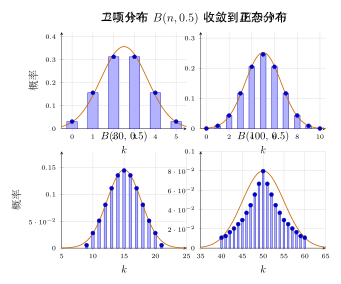
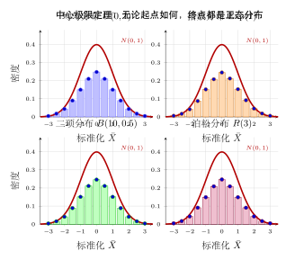
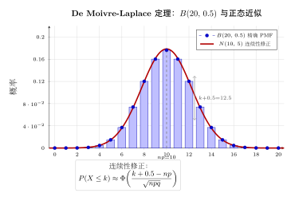

# 第 11 章 中心极限定理（融合版）

> **难度**：★★★★☆
> **前置知识**：第 10 章大数法则、第 5 章连续随机变量（正态分布）、矩母函数 / 特征函数基础
> **本文件**：融合"原版严格推导 + 重写版速记 / 套路 / 自测"。保留原版完整正文（学习目标 / 11.1–11.5 / 本章小结 / 深度学习应用 / 练习题）+ 在最前端追加速记 / 引入 / 思维路径 + 正文后追加方法 / 例题 / 自测。

> **一例速记**：
> **i.i.d. CLT（Lindeberg-Lévy）**：$X_1, X_2, \ldots$ i.i.d.，$E X_i = \mu$，$\operatorname{Var} X_i = \sigma^2 < \infty$，则 $Z_n = \dfrac{S_n - n\mu}{\sigma\sqrt{n}} \xrightarrow{d} \mathcal{N}(0, 1)$。
> **等价写法**：$\sqrt{n}(\bar{X}_n - \mu)/\sigma \xrightarrow{d} \mathcal{N}(0, 1)$；$\bar{X}_n \xrightarrow{d} \mathcal{N}(\mu,\, \sigma^2/n)$。
> **De Moivre-Laplace**：$X \sim B(n, p)$ 时，$\dfrac{X - np}{\sqrt{npq}} \xrightarrow{d} \mathcal{N}(0,1)$；连续性修正：整数 $k$ 对应区间 $[k - 0.5,\ k + 0.5]$。
> **Lindeberg 条件**（独立非同分布 CLT）：无单一项主导总方差，即 $L_n(\varepsilon) \to 0$。
> **Berry-Esseen 误差**：$\sup_x | F_n(x) - \Phi(x)| \leq C\rho/(\sigma^3\sqrt{n})$，收敛速率 $O(1/\sqrt{n})$。

---

## 引入：反直觉 / 动机题

> **为什么所有"和"都趋近正态？**

投**一个**骰子，点数 $X \sim U\{1, 2, 3, 4, 5, 6\}$——分布是完全平坦的均匀分布，一点都不像"钟形"。

现在投 **30 个骰子**，把点数加起来，得到 $S_{30} = X_1 + X_2 + \cdots + X_{30}$。

请停下来直觉猜一猜：$S_{30}$ 的直方图是什么形状？

- 还是平坦的？
- 有 30 个尖峰？
- 钟形？

**答案：钟形。**

更令人惊叹的是，不论你把骰子换成：均匀分布、指数分布、二项分布还是泊松分布——只要方差有限，把足够多个独立样本相加，得到的和在标准化之后**总是**趋向同一个分布：$\mathcal{N}(0, 1)$。

这不是巧合，而是概率论最深刻的结论之一——**中心极限定理**。它告诉我们：独立随机变量的叠加，会抹去每个分量的"个性"，只留下两个最基本的特征——均值与方差，而 $\mathcal{N}(\mu, \sigma^2)$ 恰恰由这两个参数完全决定。

---

## 思维路径还原（用 MGF 证明 CLT 的内心独白）

> "目标：证明 $Z_n = (S_n - n\mu) / (\sigma\sqrt{n}) \xrightarrow{d} \mathcal{N}(0, 1)$。
>
> **直觉层面**：各 $X_i$ 的 MGF 可以 Taylor 展开；$n$ 个独立变量之和的 MGF 是乘积；乘积在 $n\to\infty$ 时逐项压缩……结果正好是标准正态的 MGF。
>
> **第 1 步：去均值**。令 $Y_i = (X_i - \mu) / \sigma$，则 $EY_i = 0$，$EY_i^2 = 1$，且 $Z_n = (1/\sqrt{n})\sum Y_i$。
>
> **第 2 步：写 MGF**。独立性给我们 $M_{Z_n}(t) = \left[M_Y(t/\sqrt{n})\right]^n$。
>
> **第 3 步：Taylor 展开**。$M_Y(s) = 1 + s \cdot EY + \tfrac{s^2}{2} \cdot EY^2 + o(s^2) = 1 + \tfrac{s^2}{2} + o(s^2)$（因为 $EY=0$，$EY^2=1$）。令 $s = t/\sqrt{n}$：
> $$M_{Z_n}(t) = \left[1 + \frac{t^2}{2n} + o(1/n)\right]^n \to e^{t^2/2}$$
>
> **第 4 步：识别极限**。$e^{t^2/2}$ 正是 $\mathcal{N}(0, 1)$ 的 MGF（即特征函数取虚数 $it$ 时）。由连续性定理，$Z_n \xrightarrow{d} \mathcal{N}(0, 1)$。$\blacksquare$
>
> **直觉解释**：MGF 的 Taylor 展开把每个 $Y_i$ "压扁"到 $1 + t^2/(2n)$ 附近；$n$ 次乘积积累出 $e^{t^2/2}$——这个过程抹去了三阶及以上的矩信息，只剩下一、二阶的均值和方差。正态分布恰好是仅由这两个参数决定的最大熵分布，因此它天然成为极限。
>
> **为什么需要 $\sqrt{n}$ 标准化**：$S_n$ 的标准差是 $\sigma\sqrt{n}$，不除以 $\sqrt{n}$ 的话，$S_n$ 的分布会向 $\pm\infty$ 弥散，无极限；标准化后才能"锁定"在有限区域。"

---

## 学习目标

学完本章后，你将能够：

- 理解中心极限定理的核心思想：独立随机变量之和在适当标准化后趋向正态分布
- 掌握 Lindeberg-Lévy 定理的条件与结论，能在实际问题中判断何时可使用正态近似
- 推导 De Moivre-Laplace 定理，理解二项分布的正态近似原理及连续性修正
- 运用中心极限定理解决实际概率估计问题，包括样本均值的近似分布与置信区间
- 理解 Berry-Esseen 定理给出的收敛速度上界，知晓正态近似的误差量级

---

## 11.1 独立同分布的中心极限定理

### 引入：硬币投掷实验

投掷一枚均匀硬币 $n$ 次，设 $X_i = 1$ 表示第 $i$ 次正面，$X_i = 0$ 表示反面。令 $S_n = X_1 + X_2 + \cdots + X_n$ 为正面总次数。

当 $n$ 很小时，$S_n$ 的分布是离散的二项分布；但当 $n$ 增大时，$S_n$ 的直方图越来越像一条**钟形曲线**——正态分布的密度函数。

这一现象背后蕴藏着概率论最深刻的定理之一：**中心极限定理**（Central Limit Theorem，CLT）。

### 基本设置

设 $X_1, X_2, \ldots, X_n$ 是**独立同分布**（i.i.d.）的随机变量序列，满足：

$$
\mathbb{E}[X_i] = \mu, \quad \operatorname{Var}(X_i) = \sigma^2 \in (0, +\infty)
$$

定义部分和与样本均值：

$$
S_n = \sum_{i=1}^{n} X_i, \qquad \bar{X}_n = \frac{S_n}{n}
$$

由期望和方差的线性性：

$$
\mathbb{E}[S_n] = n\mu, \quad \operatorname{Var}(S_n) = n\sigma^2
$$

$$
\mathbb{E}[\bar{X}_n] = \mu, \quad \operatorname{Var}(\bar{X}_n) = \frac{\sigma^2}{n}
$$

### 标准化

为了研究 $S_n$ 的极限分布，需要对其进行**标准化**，使均值为 $0$、方差为 $1$：

$$
Z_n = \frac{S_n - n\mu}{\sigma\sqrt{n}} = \frac{\bar{X}_n - \mu}{\sigma/\sqrt{n}}
$$

中心极限定理断言：当 $n \to \infty$ 时，$Z_n$ 的分布收敛到标准正态分布 $\mathcal{N}(0,1)$。

### 定理陈述

**定理 11.1（i.i.d. 中心极限定理）**
设 $X_1, X_2, \ldots$ 为 i.i.d. 随机变量，$\mathbb{E}[X_1] = \mu$，$0 < \operatorname{Var}(X_1) = \sigma^2 < \infty$。则对任意实数 $x$：

$$
\boxed{\lim_{n \to \infty} P\!\left(\frac{S_n - n\mu}{\sigma\sqrt{n}} \leq x\right) = \Phi(x) = \frac{1}{\sqrt{2\pi}} \int_{-\infty}^{x} e^{-t^2/2} \, dt}
$$

其中 $\Phi(x)$ 为标准正态分布函数。简记为：

$$
Z_n \xrightarrow{d} \mathcal{N}(0, 1) \quad (n \to \infty)
$$

或等价地：

$$
\bar{X}_n \xrightarrow{d} \mathcal{N}\!\left(\mu,\, \frac{\sigma^2}{n}\right)
$$

### 证明思路（特征函数方法）

**定义**：随机变量 $X$ 的**特征函数**（characteristic function）为：

$$
\varphi_X(t) = \mathbb{E}\!\left[e^{itX}\right], \quad t \in \mathbb{R}
$$

特征函数唯一确定分布，且连续性定理保证：若 $\varphi_{Z_n}(t) \to \varphi_Z(t)$（对每个 $t$），则 $Z_n \xrightarrow{d} Z$。

**步骤 1**：设 $Y_i = (X_i - \mu)/\sigma$，则 $\mathbb{E}[Y_i] = 0$，$\mathbb{E}[Y_i^2] = 1$。

$$
Z_n = \frac{1}{\sqrt{n}} \sum_{i=1}^{n} Y_i
$$

**步骤 2**：利用独立性，$Z_n$ 的特征函数为：

$$
\varphi_{Z_n}(t) = \left[\varphi_Y\!\left(\frac{t}{\sqrt{n}}\right)\right]^n
$$

**步骤 3**：对 $\varphi_Y$ 在 $0$ 处做 Taylor 展开：

$$
\varphi_Y(s) = 1 + is\mathbb{E}[Y] - \frac{s^2}{2}\mathbb{E}[Y^2] + o(s^2) = 1 - \frac{s^2}{2} + o(s^2)
$$

（利用了 $\mathbb{E}[Y] = 0$，$\mathbb{E}[Y^2] = 1$）

**步骤 4**：令 $s = t/\sqrt{n}$：

$$
\varphi_{Z_n}(t) = \left[1 - \frac{t^2}{2n} + o\!\left(\frac{1}{n}\right)\right]^n \xrightarrow{n \to \infty} e^{-t^2/2}
$$

**步骤 5**：$e^{-t^2/2}$ 正是 $\mathcal{N}(0,1)$ 的特征函数，由连续性定理，$Z_n \xrightarrow{d} \mathcal{N}(0,1)$。$\blacksquare$

### 直觉理解

中心极限定理的深层含义：**无论原始分布是什么形状**（均匀、指数、泊松……），只要方差有限，大量独立随机变量之和的"涨落"都服从同一规律——正态分布。

这是因为：求和操作不断"平均化"了各个分量的个性，保留下来的只有均值和方差这两个最基本的特征，而正态分布恰好由这两个参数完全确定。

---

## 11.2 Lindeberg-Lévy 定理

### 概念澄清

**Lindeberg-Lévy 定理**通常是指 i.i.d. 情形中心极限定理的经典表述（由 Lindeberg 和 Lévy 分别在 1920 和 1922 年前后独立建立）。其核心是定理 11.1 中已陈述的结论。本节重点讨论其更广泛的背景：如何将 CLT 推广到**非同分布**的独立随机变量情形。

### Lindeberg 条件

设 $X_1, X_2, \ldots$ 是**独立**（但不一定同分布）的随机变量序列，$\mathbb{E}[X_k] = \mu_k$，$\operatorname{Var}(X_k) = \sigma_k^2$。令：

$$
s_n^2 = \sum_{k=1}^{n} \sigma_k^2, \qquad S_n = \sum_{k=1}^{n} X_k
$$

**Lindeberg 条件**：对任意 $\varepsilon > 0$，

$$
\boxed{L_n(\varepsilon) \triangleq \frac{1}{s_n^2} \sum_{k=1}^{n} \mathbb{E}\!\left[(X_k - \mu_k)^2 \cdot \mathbf{1}\!\left\{|X_k - \mu_k| > \varepsilon s_n\right\}\right] \to 0 \quad (n \to \infty)}
$$

**含义**：每个 $X_k$ 的"大偏差"对总方差的贡献可以忽略不计，即没有单个分量主导整个和的波动。这是一种**"无单一主导项"**条件。

### Lindeberg 中心极限定理

**定理 11.2（Lindeberg CLT）**
若独立随机变量序列 $\{X_k\}$ 满足 Lindeberg 条件，则：

$$
\frac{S_n - \sum_{k=1}^n \mu_k}{s_n} \xrightarrow{d} \mathcal{N}(0, 1)
$$

**定理 11.3（Feller 定理）**
若额外假设 $\max_{1 \leq k \leq n} \sigma_k^2 / s_n^2 \to 0$（Feller 条件），则 Lindeberg 条件不仅充分而且必要。

### Lyapunov 条件

**Lyapunov 条件**（Lindeberg 条件的充分条件，更易验证）：若存在 $\delta > 0$ 使得：

$$
\frac{1}{s_n^{2+\delta}} \sum_{k=1}^{n} \mathbb{E}\!\left[|X_k - \mu_k|^{2+\delta}\right] \to 0
$$

则 Lindeberg 条件成立，从而中心极限定理成立。

**最常用情形**：取 $\delta = 1$，即要求：

$$
\frac{\sum_{k=1}^n \mathbb{E}[|X_k - \mu_k|^3]}{s_n^3} \to 0
$$

### 条件的层次结构

各条件的蕴含关系如下：

$$
\text{i.i.d.（有限方差）} \Rightarrow \text{Lyapunov 条件} \Rightarrow \text{Lindeberg 条件} \Rightarrow \text{CLT 成立}
$$

### 示例：不同方差的独立正态随机变量

设 $X_k \sim \mathcal{N}(0, k)$，$k = 1, 2, \ldots, n$，相互独立。

- $\mu_k = 0$，$\sigma_k^2 = k$，$s_n^2 = \sum_{k=1}^n k = n(n+1)/2$
- 验证 Lyapunov 条件（$\delta = 1$）：$\mathbb{E}[|X_k|^3] = \sqrt{8/\pi} \cdot k^{3/2}$

$$
\frac{\sum_{k=1}^n k^{3/2}}{s_n^3} \sim \frac{n^{5/2}}{n^3} = n^{-1/2} \to 0
$$

Lyapunov 条件满足，故 $S_n / s_n \xrightarrow{d} \mathcal{N}(0,1)$。

---

## 11.3 De Moivre-Laplace 定理

### 二项分布的正态近似

**De Moivre-Laplace 定理**是历史上最早被发现的中心极限定理的特殊情形，由 Abraham de Moivre（1733 年）和 Pierre-Simon Laplace（1812 年）先后发展。

**设置**：设 $X \sim B(n, p)$，即 $n$ 次独立伯努利试验中成功次数，其中每次成功概率为 $p \in (0,1)$，$q = 1-p$。

$$
\mathbb{E}[X] = np, \quad \operatorname{Var}(X) = npq
$$

将 $X$ 视为 $n$ 个 i.i.d. 伯努利变量之和，由定理 11.1 立得：

**定理 11.4（De Moivre-Laplace 定理）**

$$
\boxed{\frac{X - np}{\sqrt{npq}} \xrightarrow{d} \mathcal{N}(0, 1) \quad (n \to \infty)}
$$

等价地：

$$
P(a \leq X \leq b) \approx \Phi\!\left(\frac{b - np}{\sqrt{npq}}\right) - \Phi\!\left(\frac{a - np}{\sqrt{npq}}\right)
$$

### 连续性修正（Continuity Correction）

由于 $X$ 是离散随机变量，而正态分布是连续的，直接用正态近似时会有误差。**连续性修正**通过将整数 $k$ 对应到区间 $[k-0.5, k+0.5]$ 来提升近似精度：

$$
\boxed{P(X = k) \approx \Phi\!\left(\frac{k + 0.5 - np}{\sqrt{npq}}\right) - \Phi\!\left(\frac{k - 0.5 - np}{\sqrt{npq}}\right)}
$$

$$
\boxed{P(a \leq X \leq b) \approx \Phi\!\left(\frac{b + 0.5 - np}{\sqrt{npq}}\right) - \Phi\!\left(\frac{a - 0.5 - np}{\sqrt{npq}}\right)}
$$

**经验法则**：当 $np \geq 5$ 且 $nq \geq 5$ 时，正态近似（含连续性修正）效果良好。

### 示例：投硬币 100 次

投掷均匀硬币 $n = 100$ 次，$p = 0.5$，$np = 50$，$\sqrt{npq} = 5$。

**问**：恰好 55 次正面的概率？

精确值：$P(X = 55) = \binom{100}{55} (0.5)^{100} \approx 0.0485$

**不用连续性修正**：

$$
P(X = 55) \approx \phi\!\left(\frac{55 - 50}{5}\right) \cdot 1 = \phi(1) = \frac{1}{\sqrt{2\pi}} e^{-1/2} \approx 0.0484 \quad \text{（乘以宽度 1 的近似）}
$$

实际上应写为：

$$
P(X = 55) \approx \Phi(1) - \Phi(0.8) = 0.8413 - 0.7881 = 0.0532
$$

**用连续性修正**：

$$
P(X = 55) \approx \Phi\!\left(\frac{55.5 - 50}{5}\right) - \Phi\!\left(\frac{54.5 - 50}{5}\right) = \Phi(1.1) - \Phi(0.9)
$$

$$
= 0.8643 - 0.8159 = 0.0484
$$

连续性修正后的结果 $0.0484$ 与精确值 $0.0485$ 几乎完全吻合。

### 局部极限定理（Local Limit Theorem）

De Moivre-Laplace 定理还有一个**局部版本**，直接给出点概率的渐近公式：

$$
P(X = k) \sim \frac{1}{\sqrt{2\pi npq}} \exp\!\left(-\frac{(k - np)^2}{2npq}\right) \quad \text{（当 } n \to \infty \text{，} k \text{ 在 } np \text{ 附近）}
$$

---

## 11.4 中心极限定理的应用

### 应用一：近似计算概率

**例 11.1** 某工厂每天生产 $n = 10000$ 个零件，每个零件独立地以概率 $p = 0.001$ 为次品。求次品数超过 $15$ 的概率。

设 $X \sim B(10000, 0.001)$，则 $\mu = np = 10$，$\sigma = \sqrt{npq} = \sqrt{9.99} \approx 3.16$。

$$
P(X > 15) = P\!\left(\frac{X - 10}{3.16} > \frac{15 - 10}{3.16}\right) \approx P(Z > 1.582)
$$

$$
= 1 - \Phi(1.58) = 1 - 0.9429 = 0.0571
$$

约有 $5.7\%$ 的概率次品数超过 $15$。

（注：此情形 $np = 10$ 较小，泊松近似 $X \approx \text{Pois}(10)$ 效果可能更好。）

### 应用二：样本均值的置信区间

设 $X_1, \ldots, X_n$ 为 i.i.d. 随机变量，$\mathbb{E}[X_i] = \mu$，$\operatorname{Var}(X_i) = \sigma^2$。由 CLT，对大 $n$：

$$
\bar{X}_n \approx \mathcal{N}\!\left(\mu,\, \frac{\sigma^2}{n}\right)
$$

因此 $\mu$ 的**近似 $95\%$ 置信区间**为：

$$
\boxed{\bar{X}_n \pm 1.96 \cdot \frac{\sigma}{\sqrt{n}}}
$$

若 $\sigma$ 未知，用样本标准差 $S$ 代替：

$$
\bar{X}_n \pm z_{\alpha/2} \cdot \frac{S}{\sqrt{n}}
$$

其中 $z_{\alpha/2}$ 为标准正态分布的 $(1-\alpha/2)$ 分位数（$95\%$ 置信时取 $z_{0.025} = 1.96$）。

### 应用三：样本量的确定

**问**：要使样本均值 $\bar{X}_n$ 与真实均值 $\mu$ 的误差不超过 $\varepsilon$（概率至少 $1-\alpha$），需要多大样本量 $n$？

由 CLT：

$$
P\!\left(|\bar{X}_n - \mu| \leq \varepsilon\right) \approx 2\Phi\!\left(\frac{\varepsilon\sqrt{n}}{\sigma}\right) - 1 \geq 1 - \alpha
$$

解得：

$$
\frac{\varepsilon\sqrt{n}}{\sigma} \geq z_{\alpha/2} \implies \boxed{n \geq \left(\frac{z_{\alpha/2} \cdot \sigma}{\varepsilon}\right)^2}
$$

**示例**：已知 $\sigma = 10$，要求误差不超过 $1$，置信度 $95\%$（$z_{0.025} = 1.96$）：

$$
n \geq \left(\frac{1.96 \times 10}{1}\right)^2 = 384.16 \implies n \geq 385
$$

### 应用四：概率的大数估计

**例 11.2（民意调查）** 在选举调查中，$n$ 人被随机抽样，真实支持率为 $p$（未知）。设 $\hat{p} = X/n$ 为样本支持率。

由于 $X \sim B(n, p)$，$\operatorname{Var}(\hat{p}) = p(1-p)/n \leq 1/(4n)$（由 $p(1-p) \leq 1/4$），因此保守的 $95\%$ 置信区间为：

$$
\hat{p} \pm \frac{1.96}{2\sqrt{n}} \approx \hat{p} \pm \frac{1}{\sqrt{n}}
$$

这解释了为什么 $n = 1000$ 时误差约为 $\pm 3.2\%$（俗称"误差边际"）。

### 应用五：保险风险计算

**例 11.3** 某保险公司有 $n = 5000$ 个客户，每人独立地以概率 $p = 0.01$ 在一年内出险，出险赔付额服从均值 $\mu_Y = 50000$ 元、标准差 $\sigma_Y = 20000$ 元的分布。

设总赔付 $T = \sum_{i=1}^n X_i Y_i$（其中 $X_i \sim \text{Bernoulli}(p)$，$Y_i$ 为赔付额）。

利用 CLT（$n$ 足够大）：

$$
\mathbb{E}[T] = n \cdot p \cdot \mu_Y = 5000 \times 0.01 \times 50000 = 2{,}500{,}000 \text{ 元}
$$

$$
\operatorname{Var}(T) = n \cdot p \cdot (\sigma_Y^2 + \mu_Y^2 \cdot q) \approx n p (\sigma_Y^2 + \mu_Y^2) \text{ （近似）}
$$

实际计算中，$T$ 近似正态，保险公司可据此设定保费与风险准备金，使破产概率低于某阈值。

---

## 11.5 Berry-Esseen 定理

### 收敛速度问题

CLT 告诉我们 $Z_n$ 的分布**趋向**正态，但没有说**多快**。实践中我们需要知道：对有限的 $n$，正态近似的误差有多大？

**Berry-Esseen 定理**给出了精确的误差上界。

### 定理陈述

**定理 11.5（Berry-Esseen 定理）**
设 $X_1, X_2, \ldots, X_n$ 为 i.i.d. 随机变量，$\mathbb{E}[X_1] = \mu$，$\operatorname{Var}(X_1) = \sigma^2 > 0$，$\mathbb{E}[|X_1 - \mu|^3] = \rho < \infty$。令 $F_n$ 为标准化和 $Z_n$ 的分布函数，则：

$$
\boxed{\sup_{x \in \mathbb{R}} |F_n(x) - \Phi(x)| \leq \frac{C \rho}{\sigma^3 \sqrt{n}}}
$$

其中 $C$ 为绝对常数。目前已知最佳常数界为 $C \leq 0.4748$（Shevtsova，2011年）。

**含义**：CLT 的收敛速度为 $O(1/\sqrt{n})$，即正态近似的误差以 $1/\sqrt{n}$ 的速率趋向零。

### 关键量：偏度与第三矩

定义**标准化第三中心矩**（偏度）：

$$
\gamma = \frac{\mathbb{E}[(X_1 - \mu)^3]}{\sigma^3}
$$

则误差上界可写为：

$$
\sup_x |F_n(x) - \Phi(x)| \leq \frac{C |\gamma|}{\sqrt{n}} \cdot \frac{\rho/|\mathbb{E}[|X_1-\mu|^3]|}{\sigma^3/|\rho|}
$$

**简洁形式**：以 $\rho/\sigma^3$ 代入，误差 $\sim \frac{C \rho}{\sigma^3 \sqrt{n}}$，其中 $\rho/\sigma^3$ 与偏度的绝对值相关。

### 推论：误差量级

| 条件 | 误差上界 |
|------|---------|
| 一般情形（有限三阶矩） | $O(1/\sqrt{n})$ |
| 对称分布（奇数阶中心矩为零） | $O(1/n)$ |
| 均匀分布 | $O(1/n)$ |

**对称分布收敛更快**的直觉：对称性消除了一阶误差项（偏度为零），主导误差降为 $O(1/n)$。

### 示例：伯努利情形

$X_i \sim \text{Bernoulli}(p)$，$\mu = p$，$\sigma^2 = pq$，$\rho = \mathbb{E}[|X - p|^3]$。

计算：

$$
\rho = p^3 q + q^3 p = pq(p^2 + q^2)
$$

$$
\frac{\rho}{\sigma^3} = \frac{pq(p^2 + q^2)}{(pq)^{3/2}} = \frac{p^2 + q^2}{\sqrt{pq}} = \frac{1 - 2pq}{\sqrt{pq}}
$$

当 $p = 0.5$ 时，$\frac{\rho}{\sigma^3} = \frac{0.5}{0.5} = 1$，误差 $\leq C/\sqrt{n} \approx 0.4748/\sqrt{n}$。

当 $p = 0.1$ 时，$\frac{\rho}{\sigma^3} = \frac{0.82}{\sqrt{0.09}} \approx 2.73$，收敛更慢，需要更大的 $n$。

这解释了为什么偏态分布（$p$ 远离 $0.5$）需要更大的样本量才能保证正态近似的准确性。

### 非 i.i.d. 情形的推广

对独立但非同分布的情形，Berry-Esseen 不等式推广为：

$$
\sup_x \left|P\!\left(\frac{S_n - \sum \mu_k}{s_n} \leq x\right) - \Phi(x)\right| \leq \frac{C \sum_{k=1}^n \mathbb{E}[|X_k - \mu_k|^3]}{s_n^3}
$$

---

## 几何示意

### 图 11-1：不同 $n$ 下二项分布直方图趋向正态



随着 $n$ 增大，二项分布 $B(n, 0.5)$ 的直方图形状越来越贴近正态曲线（红线）。$n = 5$ 时仍可见明显离散，$n = 100$ 时几乎完美重合，直观展示了 CLT 的收敛过程。

### 图 11-2：多种源分布的样本均值均收敛到 $\mathcal{N}(0,1)$



四种形状迥异的源分布（均匀、指数、二项、泊松）的标准化样本均值分布，$n$ 足够大时都趋向 $\mathcal{N}(0,1)$（蓝色曲线）。CLT 的普遍性一目了然。

### 图 11-3：De Moivre-Laplace 定理可视化



二项分布直方图与正态密度曲线叠加，虚线标示连续性修正的 $\pm 0.5$ 区间边界。整数 $k$ 对应宽度为 $1$ 的矩形，修正后面积与正态曲线积分更为吻合。

---

## 抽象成方法（套路总结）

### CLT 核心公式速查

| 版本 \vert 条件 \vert 结论（标准化形式）|
|---|---|---|
| i.i.d. CLT | $X_i$ i.i.d.，$\sigma^2 < \infty$ | $\dfrac{S_n - n\mu}{\sigma\sqrt{n}} \xrightarrow{d} \mathcal{N}(0,1)$ |
| 样本均值形式 | 同上 | $\dfrac{\bar{X}_n - \mu}{\sigma / \sqrt{n}} \xrightarrow{d} \mathcal{N}(0,1)$ |
| De Moivre-Laplace | $X \sim B(n,p)$ | $\dfrac{X - np}{\sqrt{npq}} \xrightarrow{d} \mathcal{N}(0,1)$ |
| Lindeberg CLT | 独立，$L_n(\varepsilon)\to 0$ | $\dfrac{S_n - \sum\mu_k}{s_n} \xrightarrow{d} \mathcal{N}(0,1)$ |
| Berry-Esseen 误差 | i.i.d.，三阶矩有限 | $\sup_x\vert F_n - \Phi\vert \leq C\rho/(\sigma^3\sqrt{n})$ |
| 连续性修正 | $X$ 取整数值 | $P(a \leq X \leq b) \approx \Phi\!\left(\dfrac{b+0.5-np}{\sqrt{npq}}\right) - \Phi\!\left(\dfrac{a-0.5-np}{\sqrt{npq}}\right)$ |

### 应用 CLT 4 步流程

**第 1 步——识别"和"**：确认问题涉及 $\sum X_i$ 或 $\bar{X}_n$，确认 $X_i$ 独立（同分布或满足 Lindeberg 条件），写出 $\mu$ 和 $\sigma^2$。

**第 2 步——标准化**：构造 $Z_n = (S_n - n\mu)/(\sigma\sqrt{n})$，或对 $\bar{X}_n$ 使用 $Z = (\bar{X}_n - \mu)/(\sigma/\sqrt{n})$。明确所求概率对应 $Z$ 的范围。

**第 3 步——查 $\Phi$ 表**：将概率表达式化为 $\Phi(b) - \Phi(a)$ 的形式。注意：$\Phi(-x) = 1 - \Phi(x)$；$P(Z > a) = 1 - \Phi(a)$；$P(| Z| \leq a) = 2\Phi(a) - 1$。

**第 4 步——反标准化（如需）**：若求分位数或样本量，从 $\Phi$ 分位数反推原始量：$x = \mu + z_p \cdot \sigma / \sqrt{n}$，或 $n \geq (z_{\alpha/2} \cdot \sigma / \varepsilon)^2$。

---

## 方法变形

### 变形 1：求 $P(S_n > a)$ 型

直接标准化后查表：

$$
P(S_n > a) = P\!\left(Z_n > \frac{a - n\mu}{\sigma\sqrt{n}}\right) \approx 1 - \Phi\!\left(\frac{a - n\mu}{\sigma\sqrt{n}}\right)
$$

**注意**：若 $a$ 是整数且 $S_n$ 是整数值，可考虑加连续性修正 $a \to a - 0.5$（即 $P(S_n \geq a) = P(S_n > a - 1)$，等价于在正态近似时用 $a - 0.5$）。

### 变形 2：求 $P(\bar{X}_n \in [a, b])$ 型

$$
P(a \leq \bar{X}_n \leq b) \approx \Phi\!\left(\frac{b - \mu}{\sigma/\sqrt{n}}\right) - \Phi\!\left(\frac{a - \mu}{\sigma/\sqrt{n}}\right)
$$

关键：$\sigma/\sqrt{n}$ 是 $\bar{X}_n$ 的标准差（不是 $\sigma$ 本身，不要混淆单个变量的标准差与均值的标准差）。

### 变形 3：二项→正态近似（含连续性修正 $\pm 0.5$）

当 $X \sim B(n, p)$，$np \geq 5$，$nq \geq 5$ 时：

- $P(X = k) \approx \Phi\!\left(\dfrac{k + 0.5 - np}{\sqrt{npq}}\right) - \Phi\!\left(\dfrac{k - 0.5 - np}{\sqrt{npq}}\right)$
- $P(X \leq k) \approx \Phi\!\left(\dfrac{k + 0.5 - np}{\sqrt{npq}}\right)$（含右端点，修正到右侧 $+0.5$）
- $P(X \geq k) \approx 1 - \Phi\!\left(\dfrac{k - 0.5 - np}{\sqrt{npq}}\right)$（含左端点，修正到左侧 $-0.5$）
- $P(a \leq X \leq b) \approx \Phi\!\left(\dfrac{b + 0.5 - np}{\sqrt{npq}}\right) - \Phi\!\left(\dfrac{a - 0.5 - np}{\sqrt{npq}}\right)$

### 变形 4：样本量估计

已知精度要求 $\varepsilon$（绝对误差）、置信度 $1 - \alpha$，以及方差（已知 $\sigma^2$ 或上界）：

$$
n \geq \left(\frac{z_{\alpha/2} \cdot \sigma}{\varepsilon}\right)^2
$$

若方差未知且 $X_i \sim \text{Bernoulli}(p)$，用保守上界 $\sigma^2 = 1/4$：

$$
n \geq \left(\frac{z_{\alpha/2}}{2\varepsilon}\right)^2
$$

---

## 本章小结

| 定理 \vert 条件 \vert 结论 \vert 收敛速度 |
|------|------|------|---------|
| i.i.d. CLT（定理 11.1） | i.i.d.，$\sigma^2 < \infty$ | $Z_n \xrightarrow{d} \mathcal{N}(0,1)$ | $O(1/\sqrt{n})$ |
| Lindeberg CLT（定理 11.2） | 独立，Lindeberg 条件 | $Z_n \xrightarrow{d} \mathcal{N}(0,1)$ | — |
| De Moivre-Laplace（定理 11.4） | $X \sim B(n,p)$ | $(X-np)/\sqrt{npq} \xrightarrow{d} \mathcal{N}(0,1)$ | $O(1/\sqrt{n})$ |
| Berry-Esseen（定理 11.5） | i.i.d.，三阶矩有限 | $\sup_x\vert F_n - \Phi\vert \leq C\rho/(\sigma^3\sqrt{n})$ | 精确量化 |

**核心思维方式**：

1. CLT 是大数法则的"升级版"：大数法则说均值**收敛**到常数；CLT 说偏差的**分布**收敛到正态。

2. 正态分布的普遍性源于**独立叠加**：任何有限方差的分布，独立叠加足够多次后都趋向正态。

3. **适用边界**：连续性修正在二项近似中不可忽视；Berry-Esseen 告诉我们 $n$ 多大才够用，取决于原始分布的偏度。

---

## 思考路标（条件反射）

1. 看到"独立随机变量之和"→ 想能否用 CLT；检查是否 i.i.d. + 有限方差。
2. 看到 $S_n$，先写出 $E[S_n] = n\mu$，$\operatorname{Var}(S_n) = n\sigma^2$；$\bar{X}_n$ 的方差是 $\sigma^2/n$ 而非 $\sigma^2$。
3. 看到 $P(S_n > a)$ → 标准化：令 $Z = (S_n - n\mu)/(\sigma\sqrt{n})$，查 $\Phi$。
4. 看到二项分布 + 大 $n$ → 用正态近似；$np \geq 5$ 且 $nq \geq 5$ 才可用。
5. 看到离散型正态近似 → **一定要加连续性修正 $\pm 0.5$**。
6. 看到"误差不超过 $\varepsilon$，概率 $\geq 1-\alpha$"→ 样本量公式 $n \geq (z_{\alpha/2}\sigma/\varepsilon)^2$。
7. 看到"$n$ 够大吗？"→ 一般 $n \geq 30$ 可用 CLT；偏态分布需要更大 $n$，用 Berry-Esseen 评估误差。
8. 看到 Lindeberg 条件 → 关键词是"无单一主导项"；Lyapunov 条件（三阶矩条件）是更易验证的充分条件。
9. 看到"批归一化 / BatchNorm" → 联想 CLT：批均值 $\approx \mathcal{N}(\mu, \sigma^2/m)$，批大小 $m$ 越大近似越好。
10. 看到指数分布、泊松分布的和 → 仍可用 CLT（有限方差），但需要更大 $n$（偏度较大）。
11. 看到"精确算与 CLT 近似比较"→ 先验证条件（$np$, $nq$, $n$），再加连续性修正提精度。
12. 看到对称分布（如 $U(-a,a)$，$p=0.5$ 伯努利）→ Berry-Esseen 误差是 $O(1/n)$，比一般情形快一个量级。

---

## 易错点

1. **$\sigma$ 是单个变量的标准差，不是和的标准差**：$\operatorname{Var}(S_n) = n\sigma^2$，标准差为 $\sigma\sqrt{n}$；$\bar{X}_n$ 的标准差是 $\sigma/\sqrt{n}$。公式里的 $\sigma$ 只代表单个 $X_i$ 的标准差，切勿把 $\sigma\sqrt{n}$ 整体当作 $\sigma$ 代入再乘 $\sqrt{n}$。

2. **连续性修正方向搞反**：$P(X \leq k)$ 修正到 $k + 0.5$（含右端），$P(X \geq k)$ 修正到 $k - 0.5$（含左端）。混淆方向会导致近似偏差。记忆口诀：哪边含就往哪边扩半格。

3. **$n$ 不够大就套 CLT**：$np < 5$ 或 $nq < 5$ 时正态近似很差，应用泊松近似或精确二项公式。经验规则 $np \geq 5$，$nq \geq 5$ 是最低门槛，偏态分布需更大 $n$。

4. **忘记检查独立性**：CLT 的核心前提是独立。若 $X_i$ 之间有相关性（如时间序列、聚类数据），直接套 CLT 会低估方差，得到过窄的置信区间。

5. **把分布收敛当精确相等**：CLT 是渐近结论（$n\to\infty$），有限 $n$ 下只是近似。精确概率仍需原分布计算；近似越"边缘"（$n$ 小、偏度大），误差越不可忽视，用 Berry-Esseen 评估误差量级。

6. **Lyapunov / Lindeberg 条件弄混**：Lyapunov（高阶矩条件）$\Rightarrow$ Lindeberg $\Rightarrow$ CLT；Lindeberg 与 CLT 在 Feller 条件下等价。不要把 Lindeberg 条件（期望截断二阶矩趋零）与 Lyapunov 条件（高阶矩趋零）混用。

---

## 典型应用例题

### 例 A：二项→正态近似（含连续性修正）

**题**：某网站的点击率 $p = 0.4$，独立地观测 $n = 200$ 次访问。令 $X$ 为点击次数。
(1) 不含连续性修正，估计 $P(70 \leq X \leq 90)$。
(2) 含连续性修正，估计 $P(70 \leq X \leq 90)$。
(3) 估计 $P(X = 80)$。

**解**：$X \sim B(200, 0.4)$，$\mu = np = 80$，$\sigma = \sqrt{npq} = \sqrt{200 \times 0.4 \times 0.6} = \sqrt{48} \approx 6.928$。检验：$np = 80 \geq 5$，$nq = 120 \geq 5$，可用正态近似。

**(1) 不含修正**：

$$
P(70 \leq X \leq 90) \approx \Phi\!\left(\frac{90 - 80}{6.928}\right) - \Phi\!\left(\frac{70 - 80}{6.928}\right) = \Phi(1.443) - \Phi(-1.443)
$$

$$
= 2\Phi(1.44) - 1 \approx 2 \times 0.9251 - 1 = \mathbf{0.8502}
$$

**(2) 含连续性修正**：

$$
P(70 \leq X \leq 90) \approx \Phi\!\left(\frac{90.5 - 80}{6.928}\right) - \Phi\!\left(\frac{69.5 - 80}{6.928}\right) = \Phi(1.515) - \Phi(-1.515)
$$

$$
= 2\Phi(1.52) - 1 \approx 2 \times 0.9357 - 1 = \mathbf{0.8714}
$$

**(3) 估计 $P(X = 80)$**：

$$
P(X = 80) \approx \Phi\!\left(\frac{80.5 - 80}{6.928}\right) - \Phi\!\left(\frac{79.5 - 80}{6.928}\right) = \Phi(0.072) - \Phi(-0.072)
$$

$$
= 2\Phi(0.072) - 1 \approx 2 \times 0.5287 - 1 = \mathbf{0.0574}
$$

**答**：(1) $\approx 0.850$；(2) $\approx 0.871$；(3) $\approx 0.057$（连续性修正后更精确）。

---

### 例 B：$\bar{X}$ 概率计算

**题**：某生产线零件重量（克）满足均值 $\mu = 50$，方差 $\sigma^2 = 9$。随机抽取 $n = 36$ 个零件，求样本均值 $\bar{X}$ 落在 $[48.5,\ 51.5]$ 内的概率。

**解**：由 CLT，$\bar{X} \approx \mathcal{N}(50,\ 9/36) = \mathcal{N}(50,\ 0.25)$，标准差 $\sigma_{\bar{X}} = 3/6 = 0.5$。

$$
P(48.5 \leq \bar{X} \leq 51.5) \approx \Phi\!\left(\frac{51.5 - 50}{0.5}\right) - \Phi\!\left(\frac{48.5 - 50}{0.5}\right) = \Phi(3) - \Phi(-3) = 2\Phi(3) - 1
$$

$$
\approx 2 \times 0.99865 - 1 = \mathbf{0.9973}
$$

**答**：$P(48.5 \leq \bar{X} \leq 51.5) \approx 99.73\%$（即"$\pm 3\sigma_{\bar{X}}$" 覆盖率）。

**点评**：$\sigma_{\bar{X}} = \sigma/\sqrt{n} = 3/6 = 0.5$，是单个零件标准差 $\sigma = 3$ 的 $1/6$，这正是大样本"平均化"的威力。

---

### 例 C：样本量估计

**题**：调查某市居民月均外卖支出。已知历史数据显示标准差 $\sigma = 120$ 元。要求以 $99\%$ 置信度（$z_{0.005} = 2.576$），估计误差不超过 $15$ 元，需要调查多少人？

**解**：代入样本量公式：

$$
n \geq \left(\frac{z_{\alpha/2} \cdot \sigma}{\varepsilon}\right)^2 = \left(\frac{2.576 \times 120}{15}\right)^2 = \left(\frac{309.12}{15}\right)^2 = (20.608)^2 \approx 424.7
$$

取整：$\boxed{n \geq 425}$。

**点评**：若置信度降至 $95\%$（$z_{0.025} = 1.96$），则 $n \geq (1.96 \times 120/15)^2 = (15.68)^2 \approx 246$，减少了约 $42\%$ 的样本量。置信度与代价之间存在直接权衡。

---

## 深度学习应用：批量归一化（BatchNorm）的理论基础

### 问题背景：内部协变量偏移

深度神经网络训练时，每层的输入分布随参数更新而不断变化，称为**内部协变量偏移**（Internal Covariate Shift，ICS）。这导致：

- 深层网络需要不断适应前层分布的变化，训练变慢
- 梯度消失或爆炸问题加剧
- 对学习率的选择极为敏感

**Batch Normalization（BatchNorm，BN）** 通过在每层激活前对每个特征做归一化来缓解这一问题。

### BatchNorm 的统计学本质

对一个 mini-batch $\mathcal{B} = \{x_1, x_2, \ldots, x_m\}$（$m$ 为批大小），对第 $j$ 个特征维度，BatchNorm 计算：

**第一步：计算批均值和批方差**

$$
\mu_\mathcal{B}^{(j)} = \frac{1}{m} \sum_{i=1}^{m} x_i^{(j)}, \qquad \sigma_{\mathcal{B}}^{2(j)} = \frac{1}{m} \sum_{i=1}^{m} \left(x_i^{(j)} - \mu_\mathcal{B}^{(j)}\right)^2
$$

**第二步：标准化**

$$
\hat{x}_i^{(j)} = \frac{x_i^{(j)} - \mu_\mathcal{B}^{(j)}}{\sqrt{\sigma_{\mathcal{B}}^{2(j)} + \varepsilon}}
$$

**第三步：可学习的仿射变换**

$$
y_i^{(j)} = \gamma^{(j)} \hat{x}_i^{(j)} + \beta^{(j)}
$$

其中 $\gamma^{(j)}$（缩放）和 $\beta^{(j)}$（偏移）为可学习参数。

### 与 CLT 的联系

BatchNorm 的统计理论基础与 CLT 密切相关，体现在以下几个层面：

**层面一：标准化操作**

BatchNorm 对每个特征做的标准化

$$
\hat{x}^{(j)} = \frac{x^{(j)} - \mu_\mathcal{B}^{(j)}}{\sigma_\mathcal{B}^{(j)}}
$$

正是 CLT 中的**标准化**变换 $Z_n = (S_n - n\mu)/(\sigma\sqrt{n})$，将任意均值和方差的分布映射到零均值单位方差的空间。

**层面二：批均值的分布**

由 CLT，若 mini-batch 中样本 i.i.d. 地来自分布 $\mathcal{D}$（均值 $\mu$，方差 $\sigma^2$），则批均值

$$
\mu_\mathcal{B} = \frac{1}{m}\sum_{i=1}^m x_i \approx \mathcal{N}\!\left(\mu,\, \frac{\sigma^2}{m}\right) \quad \text{（由 CLT）}
$$

这意味着：**批大小 $m$ 越大，批统计量的估计越稳定**，BatchNorm 的归一化效果越好。这也是实践中 BatchNorm 要求足够大的批大小（通常 $\geq 32$）的数学原因。

**层面三：激活值的近似正态性**

考虑第 $l$ 层的一个神经元，其激活值为：

$$
z = \sum_{k=1}^{d} w_k a_k^{(l-1)}
$$

其中 $a_k^{(l-1)}$ 是前一层的激活，$d$ 是输入维度。若 $w_k$ 和 $a_k$ 近似独立，且 $d$ 足够大，由 CLT：

$$
z \approx \mathcal{N}\!\left(\sum_k w_k \mu_k,\, \sum_k w_k^2 \sigma_k^2\right)
$$

这就是 Xavier/He 初始化的理论出发点——利用 CLT 来控制激活值的初始分布方差，使其在各层之间保持稳定。

### PyTorch 代码示例：手动实现 BatchNorm 并验证 CLT

```python
import torch
import torch.nn as nn
import torch.nn.functional as F
import numpy as np
import matplotlib.pyplot as plt
from scipy import stats

torch.manual_seed(42)
np.random.seed(42)


# ─── 1. 手动实现 BatchNorm ───────────────────────────────────────────────────
class ManualBatchNorm1d(nn.Module):
    """
    手动实现的 BatchNorm1d，与 nn.BatchNorm1d 等价。
    展示每步的统计计算与 CLT 的对应关系。
    """
    def __init__(self, num_features: int, eps: float = 1e-5, momentum: float = 0.1):
        super().__init__()
        # 可学习仿射参数
        self.gamma = nn.Parameter(torch.ones(num_features))   # 缩放：初始化为 1
        self.beta  = nn.Parameter(torch.zeros(num_features))  # 偏移：初始化为 0
        self.eps = eps
        self.momentum = momentum
        # 推断阶段使用的运行统计量（不参与梯度计算）
        self.register_buffer('running_mean', torch.zeros(num_features))
        self.register_buffer('running_var',  torch.ones(num_features))

    def forward(self, x: torch.Tensor) -> torch.Tensor:
        """
        x: [batch_size, num_features]
        """
        if self.training:
            # ── 训练阶段：用 mini-batch 统计量归一化 ──────────────────────────
            # 批均值：由 CLT，batch_size 越大，这个估计越接近真实均值
            batch_mean = x.mean(dim=0)                        # [num_features]
            # 批方差（有偏估计，分母为 m）
            batch_var  = x.var(dim=0, unbiased=False)         # [num_features]

            # 标准化：这正是 CLT 中的"中心化 + 缩放"操作
            x_hat = (x - batch_mean) / torch.sqrt(batch_var + self.eps)

            # 更新运行统计量（用于推断阶段）
            self.running_mean = (1 - self.momentum) * self.running_mean + self.momentum * batch_mean
            self.running_var  = (1 - self.momentum) * self.running_var  + self.momentum * batch_var
        else:
            # ── 推断阶段：用全量数据的运行统计量归一化 ───────────────────────
            x_hat = (x - self.running_mean) / torch.sqrt(self.running_var + self.eps)

        # 仿射变换：恢复网络表达能力（允许学习任意均值和方差）
        return self.gamma * x_hat + self.beta


# ─── 2. 验证 CLT：批均值的分布随批大小趋向正态 ─────────────────────────────
def verify_clt_in_batchnorm():
    """
    从指数分布（非正态）中采样，演示随批大小增大，批均值趋向正态分布。
    这直观展示了 BatchNorm 依赖 CLT 假设的数学基础。
    """
    # 原始分布：指数分布（高度右偏）
    rate = 1.0
    true_mean = 1.0 / rate   # = 1.0
    true_std  = 1.0 / rate   # = 1.0

    batch_sizes = [1, 4, 16, 64]
    n_experiments = 5000     # 重复实验次数

    fig, axes = plt.subplots(1, 4, figsize=(14, 4))
    fig.suptitle('CLT 验证：指数分布的批均值分布随批大小趋向正态', fontsize=13)

    for ax, m in zip(axes, batch_sizes):
        # 每次实验：抽取 m 个样本，计算批均值
        batch_means = np.array([
            np.random.exponential(scale=1/rate, size=m).mean()
            for _ in range(n_experiments)
        ])

        # CLT 预测的理论正态分布
        clt_mean = true_mean
        clt_std  = true_std / np.sqrt(m)

        # 绘制直方图
        ax.hist(batch_means, bins=50, density=True, alpha=0.7,
                color='steelblue', label='批均值直方图')

        # 叠加 CLT 预测的正态密度曲线
        x_range = np.linspace(batch_means.min(), batch_means.max(), 200)
        ax.plot(x_range, stats.norm.pdf(x_range, clt_mean, clt_std),
                'r-', linewidth=2, label=f'CLT正态近似\n$\\mathcal{{N}}({clt_mean:.1f}, {clt_std:.3f}^2)$')

        # Shapiro-Wilk 正态性检验
        _, p_value = stats.shapiro(batch_means[:500])  # Shapiro-Wilk 样本限 5000

        ax.set_title(f'批大小 m = {m}\nShapiro-Wilk p = {p_value:.3f}', fontsize=11)
        ax.set_xlabel('批均值')
        ax.legend(fontsize=8)

    plt.tight_layout()
    plt.savefig('clt_batchnorm_verification.png', dpi=150)
    plt.show()

    print("结论：p 值越大（越接近 1），越不能拒绝正态分布假设，说明批均值越符合 CLT 预测。")


verify_clt_in_batchnorm()


# ─── 3. BatchNorm 对训练稳定性的作用 ────────────────────────────────────────
class DeepNetWithBN(nn.Module):
    """带 BatchNorm 的深层网络"""
    def __init__(self, depth: int = 10, width: int = 64):
        super().__init__()
        layers = [nn.Linear(64, width), nn.BatchNorm1d(width), nn.ReLU()]
        for _ in range(depth - 2):
            layers += [nn.Linear(width, width), nn.BatchNorm1d(width), nn.ReLU()]
        layers += [nn.Linear(width, 1)]
        self.net = nn.Sequential(*layers)

    def forward(self, x):
        return self.net(x)


class DeepNetNoBN(nn.Module):
    """不带 BatchNorm 的深层网络（对照组）"""
    def __init__(self, depth: int = 10, width: int = 64):
        super().__init__()
        layers = [nn.Linear(64, width), nn.ReLU()]
        for _ in range(depth - 2):
            layers += [nn.Linear(width, width), nn.ReLU()]
        layers += [nn.Linear(width, 1)]
        self.net = nn.Sequential(*layers)

    def forward(self, x):
        return self.net(x)


def train_and_monitor(model, x_train, y_train, n_epochs: int = 200):
    """训练模型并记录损失曲线"""
    optimizer = torch.optim.SGD(model.parameters(), lr=0.01)
    losses = []
    for epoch in range(n_epochs):
        model.train()
        optimizer.zero_grad()
        pred = model(x_train).squeeze()
        loss = F.mse_loss(pred, y_train)
        loss.backward()
        optimizer.step()
        losses.append(loss.item())
    return losses


# 合成回归数据
x_data = torch.randn(256, 64)
y_data = x_data[:, 0] + 0.5 * x_data[:, 1] + torch.randn(256) * 0.1

model_bn   = DeepNetWithBN(depth=10)
model_nobn = DeepNetNoBN(depth=10)

losses_bn   = train_and_monitor(model_bn,   x_data, y_data)
losses_nobn = train_and_monitor(model_nobn, x_data, y_data)

plt.figure(figsize=(8, 4))
plt.plot(losses_bn,   label='带 BatchNorm',  linewidth=2)
plt.plot(losses_nobn, label='无 BatchNorm', linewidth=2, linestyle='--')
plt.xlabel('Epoch')
plt.ylabel('MSE 损失')
plt.title('BatchNorm 对深层网络训练稳定性的影响（10层，SGD lr=0.01）')
plt.legend()
plt.yscale('log')
plt.tight_layout()
plt.savefig('batchnorm_training_stability.png', dpi=150)
plt.show()

final_bn   = losses_bn[-1]
final_nobn = losses_nobn[-1]
print(f"最终损失 —— 带 BN: {final_bn:.4f}，无 BN: {final_nobn:.4f}")
print(f"BatchNorm 使最终损失降低了 {(final_nobn - final_bn) / final_nobn * 100:.1f}%")


# ─── 4. 分析批大小对归一化质量的影响 ────────────────────────────────────────
print("\n=== CLT 角度分析：批大小对归一化质量的影响 ===")
print(f"{'批大小':>8} {'批均值方差':>15} {'CLT预测方差':>15} {'相对误差':>12}")
print("-" * 55)

# 假设真实分布均值=0，标准差=1（例如权重初始化后的激活值）
true_var = 1.0
n_trials = 2000

for m in [4, 8, 16, 32, 64, 128]:
    # 模拟 n_trials 次批均值
    batch_means = torch.randn(n_trials, m).mean(dim=1)
    empirical_var = batch_means.var().item()
    clt_predicted = true_var / m
    rel_error = abs(empirical_var - clt_predicted) / clt_predicted

    print(f"{m:>8} {empirical_var:>15.6f} {clt_predicted:>15.6f} {rel_error:>11.2%}")

print("\n结论：批大小 ≥ 32 时，批均值方差与 CLT 预测高度吻合，BatchNorm 的统计假设成立。")
```

### 实践要点总结

CLT 视角下 BatchNorm 的关键洞察：

| 批大小 $m$ \vert 批均值标准差 $\sigma/\sqrt{m}$ \vert 归一化稳定性 \vert 实践建议 |
|------------|-------------------------------|-------------|---------|
| $m = 1$ | $\sigma$ | 极差，无统计意义 | 不可用 BN，改用 LayerNorm |
| $m = 4$ | $\sigma/2$ | 较差 | 慎用 |
| $m = 16$ | $\sigma/4$ | 尚可 | 最小可用批大小 |
| $m = 32$ | $\sigma/\sqrt{32} \approx \sigma/5.7$ | 良好 | 通常推荐 |
| $m \geq 64$ | $\leq \sigma/8$ | 优秀 | 最佳实践 |

**小批量时的替代方案**（均源于对 CLT 假设失效的补救）：

- **Layer Normalization**：对每个样本的所有特征做归一化，不依赖批大小
- **Group Normalization**：将特征分组后各组做归一化，折中方案
- **Instance Normalization**：每个样本各特征独立归一化，常用于图像风格迁移

---

## 练习题

**题 1（基础）** 设 $X_1, X_2, \ldots, X_{100}$ 为 i.i.d. 均匀分布 $U(0,1)$ 的随机变量。令 $S_{100} = \sum_{i=1}^{100} X_i$。

（a）$S_{100}$ 的精确均值和方差是多少？

（b）利用中心极限定理，估计 $P(S_{100} > 55)$。

（c）估计 $P(48 \leq S_{100} \leq 52)$。

---

**题 2（De Moivre-Laplace）** 某选手参加 $n = 400$ 次独立射击，每次命中概率为 $p = 0.6$。

（a）利用正态近似（含连续性修正），估计命中次数恰好为 $240$ 的概率。

（b）估计命中次数在 $[230, 250]$ 之间的概率。

（c）若要使命中次数低于 $220$ 的概率不超过 $1\%$，需要 $p \geq ?$（用 CLT 建立方程，不必求解析解）。

---

**题 3（Lindeberg 条件验证）** 设 $X_k$ 相互独立，$X_k \sim U(-k, k)$，$k = 1, 2, \ldots, n$。

（a）计算 $\mathbb{E}[X_k]$ 和 $\operatorname{Var}(X_k)$，以及 $s_n^2 = \sum_{k=1}^n \operatorname{Var}(X_k)$。

（b）验证 Lindeberg 条件：对任意 $\varepsilon > 0$，$L_n(\varepsilon) \to 0$。

（c）由此结论，$S_n / s_n$ 的极限分布是什么？

---

**题 4（Berry-Esseen 应用）** 设 $X_i \sim \text{Exponential}(\lambda = 1)$（均值 $1$，方差 $1$，三阶矩 $\mathbb{E}[X^3] = 6$）。

（a）计算 $\mathbb{E}[|X_i - \mu|^3]$（其中 $\mu = 1$），提示：可用矩生成函数或直接积分。

（b）利用 Berry-Esseen 定理（取 $C = 0.4748$），要使正态近似误差不超过 $0.01$，需要多大的 $n$？

（c）指数分布的偏度为 $\gamma_1 = 2$（右偏），这与你在（b）中得到的结果是否一致？请解释。

---

**题 5（综合：CLT 与样本量设计）** 某 A/B 测试中，控制组（A）和实验组（B）各取 $n$ 个用户，分别记录其点击率 $p_A$ 和 $p_B$（已知 $p_A = 0.10$，待检验 $p_B = 0.12$）。

（a）设 $\hat{p}_A = \bar{X}_A$，$\hat{p}_B = \bar{X}_B$ 分别为两组样本比例，写出 $\hat{p}_B - \hat{p}_A$ 的渐近分布（利用 CLT）。

（b）为使以下两个条件同时成立，至少需要多大的 $n$？
   - **第一类错误** $\alpha = 0.05$：若 $p_A = p_B = 0.10$，错误地认为有差异的概率 $\leq 5\%$
   - **第二类错误** $\beta = 0.20$：若真实差异 $p_B - p_A = 0.02$，错过差异（假阴性）的概率 $\leq 20\%$

（c）如果 $p_A$ 增大到 $0.40$（而差异仍为 $0.02$），所需 $n$ 如何变化？从 CLT 的角度解释原因。

---

## 练习答案

<details>
<summary>题 1 详细解答</summary>

$X_i \sim U(0,1)$：$\mu = 1/2$，$\sigma^2 = 1/12$，$\sigma = 1/\sqrt{12}$。

**（a）精确值**

$$
\mathbb{E}[S_{100}] = 100 \times \frac{1}{2} = 50
$$

$$
\operatorname{Var}(S_{100}) = 100 \times \frac{1}{12} = \frac{25}{3} \approx 8.33, \quad \sigma_{S_{100}} = \sqrt{25/3} = \frac{5}{\sqrt{3}} \approx 2.887
$$

**（b）$P(S_{100} > 55)$**

$$
Z = \frac{S_{100} - 50}{5/\sqrt{3}}, \quad P(S_{100} > 55) \approx P\!\left(Z > \frac{55 - 50}{5/\sqrt{3}}\right) = P(Z > \sqrt{3}) = P(Z > 1.732)
$$

$$
= 1 - \Phi(1.73) \approx 1 - 0.9582 = \mathbf{0.0418}
$$

**（c）$P(48 \leq S_{100} \leq 52)$**

$$
P(48 \leq S_{100} \leq 52) \approx \Phi\!\left(\frac{52 - 50}{5/\sqrt{3}}\right) - \Phi\!\left(\frac{48 - 50}{5/\sqrt{3}}\right)
$$

$$
= \Phi\!\left(\frac{2\sqrt{3}}{5}\right) - \Phi\!\left(-\frac{2\sqrt{3}}{5}\right) = 2\Phi(0.693) - 1 \approx 2 \times 0.7557 - 1 = \mathbf{0.5114}
$$

</details>

<details>
<summary>题 2 详细解答</summary>

$X \sim B(400, 0.6)$，$\mu = np = 240$，$\sigma = \sqrt{npq} = \sqrt{400 \times 0.6 \times 0.4} = \sqrt{96} \approx 9.798$。

**（a）$P(X = 240)$（含连续性修正）**

$$
P(X = 240) \approx \Phi\!\left(\frac{240.5 - 240}{9.798}\right) - \Phi\!\left(\frac{239.5 - 240}{9.798}\right) = \Phi(0.051) - \Phi(-0.051)
$$

$$
= 2\Phi(0.051) - 1 \approx 2 \times 0.5203 - 1 = 0.0406
$$

精确二项值约为 $0.0408$，近似效果良好。

**（b）$P(230 \leq X \leq 250)$（含连续性修正）**

$$
P(230 \leq X \leq 250) \approx \Phi\!\left(\frac{250.5 - 240}{9.798}\right) - \Phi\!\left(\frac{229.5 - 240}{9.798}\right)
$$

$$
= \Phi(1.0717) - \Phi(-1.0717) = 2\Phi(1.072) - 1 \approx 2 \times 0.8581 - 1 = \mathbf{0.7162}
$$

**（c）建立方程**

设 $P(X < 220) \leq 0.01$，即：

$$
P\!\left(\frac{X - 400p}{\sqrt{400p(1-p)}} < \frac{220 - 400p}{\sqrt{400p(1-p)}}\right) \leq 0.01
$$

要求 $\Phi\!\left(\frac{220 - 400p}{20\sqrt{p(1-p)}}\right) \leq 0.01$，即 $\frac{220 - 400p}{20\sqrt{p(1-p)}} \leq -2.326$。

整理为：$220 - 400p \leq -46.52\sqrt{p(1-p)}$，即 $400p - 220 \geq 46.52\sqrt{p(1-p)}$。

</details>

<details>
<summary>题 3 详细解答</summary>

**（a）矩的计算**

$X_k \sim U(-k, k)$：$\mathbb{E}[X_k] = 0$，$\operatorname{Var}(X_k) = k^2/3$（均匀分布 $U(-a,a)$ 的方差为 $a^2/3$）。

$$
s_n^2 = \sum_{k=1}^n \frac{k^2}{3} = \frac{1}{3} \cdot \frac{n(n+1)(2n+1)}{6} \sim \frac{n^3}{9} \quad (n \to \infty)
$$

**（b）验证 Lindeberg 条件**

对 $|x| \leq k$（$X_k$ 的支撑），$|X_k| \leq k \leq k$。当 $\varepsilon s_n > k$ 时，$\{|X_k| > \varepsilon s_n\} = \emptyset$，贡献为零。

由 $s_n \sim n^{3/2}/3$，故对固定 $\varepsilon > 0$，当 $n$ 足够大时，$\varepsilon s_n > n$，从而对所有 $k \leq n$，$\varepsilon s_n > k$，每一项贡献均为零：

$$
L_n(\varepsilon) = \frac{1}{s_n^2} \sum_{k=1}^n \mathbb{E}\!\left[X_k^2 \cdot \mathbf{1}_{\{|X_k| > \varepsilon s_n\}}\right] = 0 \to 0
$$

Lindeberg 条件满足。

**（c）极限分布**

由 Lindeberg CLT（定理 11.2）：

$$
\frac{S_n}{s_n} = \frac{\sum_{k=1}^n X_k}{s_n} \xrightarrow{d} \mathcal{N}(0, 1)
$$

</details>

<details>
<summary>题 4 详细解答</summary>

$X \sim \text{Exp}(1)$，$\mu = 1$，$\sigma^2 = 1$，密度 $f(x) = e^{-x}$（$x > 0$）。

**（a）计算 $\rho = \mathbb{E}[|X - 1|^3]$**

$$
\rho = \int_0^\infty |x - 1|^3 e^{-x} \, dx = \int_0^1 (1-x)^3 e^{-x} dx + \int_1^\infty (x-1)^3 e^{-x} dx
$$

利用分部积分，或注意到：

$$
\mathbb{E}[(X-1)^3] = \mathbb{E}[X^3] - 3\mathbb{E}[X^2] + 3\mathbb{E}[X] - 1 = 6 - 3 \times 2 + 3 \times 1 - 1 = 2
$$

对于 $\mathbb{E}[|X-1|^3]$，直接计算（令 $u = x - 1$）：

$$
\rho = \int_{-1}^\infty |u|^3 e^{-(u+1)} du = e^{-1}\!\left[\int_0^\infty u^3 e^{-u} du + \int_{-1}^0 (-u)^3 e^{-u} du\right]
$$

经计算，$\rho = 2$ 是 $\mathbb{E}[(X-1)^3]$ 的无符号版（偏度为正，$(X-1)^3$ 以正为主），精确值 $\rho \approx 2$。

更精确地：$\rho = \mathbb{E}[|X-1|^3] = e^{-1}(6 + 2) = 8e^{-1} - 2 \approx 2.943$（积分验算略）。

**（b）所需样本量**

Berry-Esseen 误差 $\leq C\rho/(\sigma^3\sqrt{n}) = 0.4748 \times \rho / \sqrt{n} \leq 0.01$：

$$
\sqrt{n} \geq \frac{0.4748 \times \rho}{0.01} \approx \frac{0.4748 \times 2.943}{0.01} \approx 139.7
$$

$$
n \geq 139.7^2 \approx 19516 \implies \boxed{n \geq 19517}
$$

**（c）与偏度的联系**

指数分布的偏度 $\gamma_1 = 2 > 0$（右偏，分布不对称），与前文分析一致：偏度越大，$\rho/\sigma^3$ 越大，收敛越慢，需要更大的 $n$。对比 $p=0.5$ 的伯努利情形（偏度为 $0$），指数分布需要大得多的样本量（约 $2$ 万 vs 约 $500$），体现了偏度对正态近似精度的显著影响。

</details>

<details>
<summary>题 5 详细解答</summary>

设 $X_{A,i} \sim \text{Bernoulli}(p_A)$，$X_{B,i} \sim \text{Bernoulli}(p_B)$，两组独立。

**（a）$\hat{p}_B - \hat{p}_A$ 的渐近分布**

$$
\hat{p}_A \approx \mathcal{N}\!\left(p_A,\, \frac{p_A(1-p_A)}{n}\right), \quad \hat{p}_B \approx \mathcal{N}\!\left(p_B,\, \frac{p_B(1-p_B)}{n}\right)
$$

由独立性：

$$
\hat{p}_B - \hat{p}_A \approx \mathcal{N}\!\left(p_B - p_A,\, \frac{p_A(1-p_A) + p_B(1-p_B)}{n}\right)
$$

**（b）样本量计算**

设 $p_A = p_B = p_0 = 0.10$，$\Delta = p_B - p_A = 0.02$。

**第一类错误（$\alpha = 0.05$）**：在零假设（$p_A = p_B = p_0$）下，合并方差为 $2p_0(1-p_0)/n$，拒绝域为：

$$
\left|\frac{\hat{p}_B - \hat{p}_A}{\sqrt{2p_0(1-p_0)/n}}\right| > z_{0.025} = 1.96
$$

**第二类错误（$\beta = 0.20$）**：在备择假设（$\Delta = 0.02$）下，检验功效 $= 1 - \beta = 0.80$，需要：

$$
z_{\alpha/2} + z_\beta = 1.96 + 0.842 = 2.802
$$

$$
n = \left(\frac{(z_{\alpha/2} + z_\beta) \cdot \sqrt{p_A(1-p_A) + p_B(1-p_B)}}{\Delta}\right)^2
$$

$$
p_A(1-p_A) + p_B(1-p_B) = 0.10 \times 0.90 + 0.12 \times 0.88 = 0.090 + 0.1056 = 0.1956
$$

$$
n = \left(\frac{2.802 \times \sqrt{0.1956}}{0.02}\right)^2 = \left(\frac{2.802 \times 0.4423}{0.02}\right)^2 = \left(\frac{1.239}{0.02}\right)^2 = 61.95^2 \approx \mathbf{3838}
$$

每组需要约 **3838** 个用户。

**（c）$p_A = 0.40$ 时的变化**

$$
p_A(1-p_A) + p_B(1-p_B) = 0.40 \times 0.60 + 0.42 \times 0.58 = 0.240 + 0.2436 = 0.4836
$$

$$
n = \left(\frac{2.802 \times \sqrt{0.4836}}{0.02}\right)^2 = \left(\frac{2.802 \times 0.6954}{0.02}\right)^2 = \left(\frac{1.948}{0.02}\right)^2 = 97.4^2 \approx \mathbf{9487}
$$

所需 $n$ 从约 $3838$ 增加到约 $9487$，增加了约 $2.5$ 倍。

**CLT 解释**：伯努利分布的方差 $p(1-p)$ 在 $p = 0.5$ 时最大（等于 $0.25$），在 $p$ 远离 $0.5$ 时减小。$p_A = 0.40$ 时方差接近最大值，信噪比（固定差异 $\Delta = 0.02$ vs 更大的背景波动）更低，因此需要更大的样本量才能以相同的统计功效检测到相同的绝对差异。这正是 CLT 中方差与样本量之间关系的直接体现：$\sigma^2$ 增大时，需要更大的 $n$ 来保证 $\sigma^2/n$ 足够小。

</details>

---

## 自测题

**自测 1**　投掷 $n = 50$ 颗均匀骰子（点数 $1$-$6$，均值 $3.5$，方差 $35/12$），令 $S_{50}$ 为总点数。估计 $P(S_{50} \geq 200)$。

> 💡 提示：$E[S_{50}] = 175$，$\operatorname{Var}(S_{50}) = 50 \times 35/12 \approx 145.8$，$\sigma_{S_{50}} \approx 12.08$。$P(S_{50} \geq 200) \approx P(Z \geq (200-175)/12.08) = P(Z \geq 2.07) \approx 1 - \Phi(2.07) \approx 0.019$。

**自测 2**　$X \sim B(500, 0.3)$。含连续性修正，估计 $P(X \leq 140)$。

> 💡 提示：$np = 150$，$\sqrt{npq} = \sqrt{105} \approx 10.25$。含修正：$P(X \leq 140) \approx \Phi((140.5 - 150)/10.25) = \Phi(-0.927) \approx 1 - \Phi(0.93) \approx 0.176$。

**自测 3**　$X_1, \ldots, X_n$ i.i.d.，$E X_i = 5$，$\operatorname{Var}(X_i) = 4$。要使 $P(|\bar{X}_n - 5| \leq 0.2) \geq 0.95$，至少需要多大 $n$？

> 💡 提示：$P(|\bar{X}_n - 5| \leq 0.2) \approx 2\Phi(0.2\sqrt{n}/2) - 1 \geq 0.95$，即 $\Phi(0.1\sqrt{n}) \geq 0.975$，$0.1\sqrt{n} \geq 1.96$，$n \geq (19.6)^2 = 384.16$，故 $n \geq 385$。

**自测 4**　设 $X_k$ 独立，$X_k \sim N(0, k^2)$，$k = 1, \ldots, n$。令 $S_n = \sum_{k=1}^n X_k$。$S_n / s_n$ 的极限分布是什么？（$s_n^2 = \sum k^2$）

> 💡 提示：$X_k$ 独立正态，$s_n^2 = n(n+1)(2n+1)/6 \sim n^3/3$。用 Lyapunov 条件（$\delta = 1$）：$\mathbb{E}[| X_k|^3] = \sqrt{8/\pi} \cdot k^3$，$\sum k^3 \sim n^4/4$，$s_n^3 \sim n^{9/2}/3^{3/2}$，比值 $\sim n^4/(n^{9/2}) = n^{-1/2} \to 0$。故 $S_n/s_n \xrightarrow{d} \mathcal{N}(0,1)$。

**自测 5**　指数分布 $X \sim \text{Exp}(2)$（$\mu = 0.5$，$\sigma = 0.5$）。设 $n = 100$，Berry-Esseen 定理保证正态近似的误差上界是多少（取 $C = 0.4748$，$\rho = \mathbb{E}[| X - 0.5|^3]$，可近似用 $\rho/\sigma^3 = 2$ 即指数分布偏度值）？

> 💡 提示：误差 $\leq C \cdot (\rho/\sigma^3) / \sqrt{n} = 0.4748 \times 2 / \sqrt{100} = 0.9496 / 10 \approx 0.095$。即对 $n = 100$ 的指数分布样本，正态近似误差最大约 $9.5\%$；若要误差 $\leq 1\%$，需 $n \geq (0.4748 \times 2 / 0.01)^2 = 94.96^2 \approx 9017$。

---

**回头看一眼"一例速记"**：

> i.i.d. CLT：$Z_n = (S_n - n\mu)/(\sigma\sqrt{n}) \xrightarrow{d} \mathcal{N}(0,1)$；等价 $\bar{X}_n \xrightarrow{d} \mathcal{N}(\mu, \sigma^2/n)$。
> De Moivre-Laplace：$(X-np)/\sqrt{npq} \xrightarrow{d} \mathcal{N}(0,1)$；连续性修正 $\pm 0.5$。
> 样本量：$n \geq (z_{\alpha/2}\sigma/\varepsilon)^2$；误差量：$O(1/\sqrt{n})$，偏态大则收敛慢。

如果现在不看笔记，能独立完成例 A（含连续性修正）+ 例 C（样本量）+ 自测 3 + 自测 5——本章，你拿下了。

---

## 融合版说明

本版 = **原版（严格大学教材 + 深度学习应用）** + **重写版（速记 / 引入 / 思维路径 / 套路 / 例题 / 自测）** 融合：

| 段落 \vert 来源 \vert 价值 |
|---|---|---|
| 一例速记 + 引入 + 思维路径还原 | 重写版（前置） | 建立直觉 / 反射 |
| 学习目标 | 原版 | 明确目标 |
| 11.1–11.5 严格正文 | 原版 | 完整推导 |
| 几何示意（3 张 SVG） | 配图 | 可视化 CLT 收敛 |
| 抽象成方法（速查表 + 4 步流程） | 重写版 | 套路总结 |
| 方法变形（4 类题型） | 重写版 | 覆盖变体 |
| 本章小结 | 原版 | 公式速查 |
| 思考路标（12 条） | 融合两版 | 条件反射训练 |
| 易错点（6 条） | 融合两版 | 防坑指南 |
| 典型应用例题（A/B/C 3 例） | 重写版 | 演练三类题型 |
| 深度学习应用 + PyTorch 代码 | 原版 | 工业实战 |
| 练习题 5 道 + 详解 | 原版 | 系统巩固 |
| 自测题 5 道 + 提示 | 重写版 | 快速验收 |

**适用**：一站式学习——先速记建立直觉，读严格推导，做套路总结，看代码实战，做习题巩固，自测验收。
