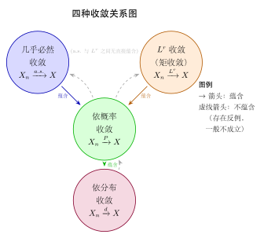
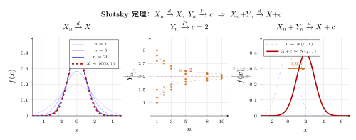

# 第 12 章 收敛理论（融合版）

> **难度**：★★★★☆
> **前置知识**：第 10 章大数定律、第 11 章中心极限定理、实分析基础（$\varepsilon$-$\delta$ 语言）
> **本文件**：融合"原版严格推导 + 重写版速记 / 套路 / 自测"。保留原版完整正文（学习目标 / 12.1–12.5 / 深度学习应用 / 练习题）+ 在最前置速记与引入、最后追加思维训练。

---

> **一例速记**：
> **4 种收敛定义**：a.s.（几乎必然）$P(\lim X_n = X) = 1$；依概率 $P(|X_n-X|>\varepsilon)\to 0$；$L^r$：$E[|X_n-X|^r]\to 0$；依分布 $d$：$F_n(x)\to F(x)$ 在连续点。
> **4 个蕴含**：$\xrightarrow{a.s.}\Rightarrow\xrightarrow{P}\Rightarrow\xrightarrow{d}$；$\xrightarrow{L^r}\Rightarrow\xrightarrow{P}$；$\xrightarrow{d}$ 到常数 $\Leftrightarrow\xrightarrow{P}$；反方向均不成立（各有反例）。
> **连续映射定理**：$X_n\xrightarrow{d}X$，$g$ 连续 $\Rightarrow g(X_n)\xrightarrow{d}g(X)$（对 a.s. 和 $P$ 同样成立）。
> **Slutsky**：$X_n\xrightarrow{d}X$，$Y_n\xrightarrow{P}c$（常数）$\Rightarrow X_n+Y_n\xrightarrow{d}X+c$，$X_nY_n\xrightarrow{d}cX$。
> **工具**：Markov $P(Y\ge a)\le E[Y]/a$；Chebyshev $P(|X-\mu|\ge\varepsilon)\le\text{Var}(X)/\varepsilon^2$；Borel-Cantelli $\sum P(A_n)<\infty\Rightarrow P(\limsup A_n)=0$。

---

## 引入：4 种收敛为什么不等价？

**题目**：构造一个 $X_n\xrightarrow{P}0$ 但 $X_n\not\xrightarrow{a.s.}0$ 的例子，并解释其"反直觉"所在。

请先停下来想一想：**"依概率趋于 0"和"逐点趋于 0"有什么区别？**

直觉陷阱：依概率收敛听起来"很强"——$P(|X_n|>\varepsilon)\to 0$ 不就是说 $X_n$ 越来越接近 0 吗？

**正确认识**：依概率收敛只是说，在第 $n$ 步犯大错的概率趋于零，但**并不限制同一个样本点在不同步骤的行为**。样本点 $\omega$ 可以被"打字机"式地反复覆盖，每次轮到它时 $X_n(\omega)=1$，但每轮覆盖的概率都在缩小。这正是"打字机序列"（移动指示器）反例的核心：

**移动指示器（打字机序列）**：令 $\Omega=[0,1]$，$P$ 为 Lebesgue 测度，构造

$$X_1=\mathbf{1}_{[0,1]},\quad X_2=\mathbf{1}_{[0,1/2]},\quad X_3=\mathbf{1}_{[1/2,1]},\quad X_4=\mathbf{1}_{[0,1/3]},\quad\ldots$$

一般地第 $2^k+j$（$0\le j<2^k$）项为 $\mathbf{1}_{[j/2^k,(j+1)/2^k]}$。

- 依概率：$P(X_n=1)=$ 对应区间长度 $\to 0$，故 $X_n\xrightarrow{P}0$。
- 几乎必然：对任意 $\omega\in[0,1]$，存在无穷多个 $n$ 使 $\omega$ 落入第 $n$ 个区间，故 $X_n(\omega)=1$ 无穷次出现，$X_n(\omega)\not\to 0$，$X_n\not\xrightarrow{a.s.}0$。

**反直觉所在**：即使 $P(\text{犯错})\to 0$，同一样本点仍可被无穷多个区间轮番覆盖——这是依概率与几乎必然在"时间维度"上的本质差异。

---

## 思维路径还原（选择正确收敛模式的内心独白）

> "面对一道收敛性问题，首先问：**我掌握的信息是什么层次的？**
>
> **层次 1：有矩信息（$E[|X_n-X|^r]\to 0$）**——直接用 $L^r$ 收敛，它是最"量化"的；$L^r\Rightarrow P$ 立刻得依概率；$r\ge q$ 时 $L^r\Rightarrow L^q$。这条路最稳，但需要算期望。
>
> **层次 2：有方差 / 期望但不确定高阶矩**——用切比雪夫 $P(|X_n-X|\ge\varepsilon)\le\text{Var}(X_n-X)/\varepsilon^2$ 直奔依概率，这是证 WLLN 最标准的一步。
>
> **层次 3：只有分布函数或特征函数**——用 Lévy 连续性定理（特征函数逐点收敛 $\Rightarrow$ 依分布），这是证 CLT 的主路。依分布是最弱的，不要求同一概率空间。
>
> **层次 4：有逐点极限（即 a.e. 极限）**——最强，直接判断 a.s. 收敛；再用 $a.s.\Rightarrow P\Rightarrow d$ 往下传递。
>
> **如何构造反例**：想打破 $P\Rightarrow a.s.$ 时，找一个"游荡"的序列——区间在 $[0,1]$ 上移动，使得每个 $\omega$ 被无穷次覆盖但每次测度缩小。想打破 $a.s.\Rightarrow L^1$ 时，找"尖峰"：$X_n=n\cdot\mathbf{1}_{[0,1/n]}$，$a.s.\to 0$ 但 $E[X_n]=1\not\to 0$。
>
> **Slutsky 定理的用法**：CLT 给出 $\sqrt{n}(\bar X_n-\mu)\xrightarrow{d}N(0,\sigma^2)$；大数定律给出 $\hat\sigma_n\xrightarrow{P}\sigma$；于是 Slutsky 推出 $\sqrt{n}(\bar X_n-\mu)/\hat\sigma_n\xrightarrow{d}N(0,1)$——这是 $t$ 统计量渐近正态的标准推导。
>
> **关键检查表**：(1) 极限是常数吗？若是，$d\Leftrightarrow P$；(2) 有一致可积吗？若有，$P\Rightarrow L^1$；(3) $g$ 连续吗？若是，收敛类型（a.s./P/d）穿越 $g$ 不变。"

---

## 学习目标

学完本章后，你将能够：

- 掌握四种收敛概念（依概率、依分布、几乎必然、$L^p$）的严格定义，并理解各自的直觉含义
- 理解"几乎必然收敛"（强收敛）与"依概率收敛"（弱收敛）的本质区别，能用反例说明二者不等价
- 熟记并证明四种收敛之间的蕴含关系图，掌握各方向成立或不成立的条件
- 运用连续映射定理、Slutsky 定理和 $\delta$ 方法处理依分布收敛的复合运算
- 将收敛理论应用于深度学习模型的训练收敛性分析与 PAC 学习理论的样本复杂度推导

---

## 12.1 依概率收敛

### 直觉引入

想象你用一把有随机误差的尺子反复量同一根棍子的长度。每次测量结果 $X_n$ 都有波动，但随着测量技术改进，出现"大误差"的可能性越来越小。这种"犯大错的概率趋于零"的收敛方式，就是**依概率收敛**。

### 严格定义

**定义 12.1（依概率收敛）**
设 $X_1, X_2, \ldots$ 和 $X$ 是定义在同一概率空间 $(\Omega, \mathcal{F}, P)$ 上的随机变量。若对任意 $\varepsilon > 0$，

$$
\boxed{P\!\left(|X_n - X| > \varepsilon\right) \to 0 \quad (n \to \infty)}
$$

则称 $X_n$ **依概率收敛**（converge in probability）到 $X$，记作

$$
X_n \xrightarrow{P} X \quad \text{或} \quad \text{plim}_{n\to\infty} X_n = X
$$

### 等价刻画

以下三条陈述等价：

1. $X_n \xrightarrow{P} X$
2. 对任意 $\varepsilon > 0$，$P(|X_n - X| \leq \varepsilon) \to 1$
3. 对任意 $\varepsilon > 0$，$\delta > 0$，存在 $N$ 使得 $n > N$ 时 $P(|X_n - X| > \varepsilon) < \delta$

**注意**："依概率收敛到 $X$"不要求 $X_n(\omega) \to X(\omega)$ 对每个样本点 $\omega$ 成立，只要求违反此收敛的样本点集合的概率趋于零。

### 基本性质

**命题 12.1**（依概率收敛的运算规则）若 $X_n \xrightarrow{P} X$，$Y_n \xrightarrow{P} Y$，则：

1. $aX_n + bY_n \xrightarrow{P} aX + bY$（线性性）
2. $X_n Y_n \xrightarrow{P} XY$（乘积性）
3. 若 $g$ 连续，则 $g(X_n) \xrightarrow{P} g(X)$（连续映射定理）
4. 若 $P(Y = 0) = 0$，则 $X_n / Y_n \xrightarrow{P} X/Y$

**证明（性质 1）**：对任意 $\varepsilon > 0$，

$$
\{|aX_n + bY_n - aX - bY| > \varepsilon\} \subseteq \left\{|X_n - X| > \frac{\varepsilon}{2|a|}\right\} \cup \left\{|Y_n - Y| > \frac{\varepsilon}{2|b|}\right\}
$$

（当 $a, b \neq 0$ 时，$a = 0$ 时更简单）由次可加性，

$$
P(|aX_n + bY_n - aX - bY| > \varepsilon) \leq P\!\left(|X_n - X| > \frac{\varepsilon}{2|a|}\right) + P\!\left(|Y_n - Y| > \frac{\varepsilon}{2|b|}\right) \to 0
$$

$\blacksquare$

### Markov 不等式与 Chebyshev 不等式

依概率收敛常通过以下工具建立：

**Markov 不等式**：对非负随机变量 $Y$ 和 $a > 0$，

$$
P(Y \geq a) \leq \frac{\mathbb{E}[Y]}{a}
$$

**Chebyshev 不等式**：对任意随机变量 $X$ 和 $\varepsilon > 0$，

$$
P(|X - \mu| \geq \varepsilon) \leq \frac{\operatorname{Var}(X)}{\varepsilon^2}
$$

**示例**：设 $\bar{X}_n = \frac{1}{n}\sum_{i=1}^n X_i$（i.i.d.，均值 $\mu$，方差 $\sigma^2 < \infty$），则

$$
P\!\left(|\bar{X}_n - \mu| \geq \varepsilon\right) \leq \frac{\sigma^2}{n\varepsilon^2} \to 0
$$

这正是**弱大数定律**的一种证明：$\bar{X}_n \xrightarrow{P} \mu$。

### 依概率收敛的局限性

依概率收敛**不保证**：
- 每条样本路径都收敛（可能有"游荡"行为）
- 期望的收敛：$X_n \xrightarrow{P} 0$ 不能推出 $\mathbb{E}[X_n] \to 0$

**反例**（期望不收敛）：令 $P(X_n = n) = 1/n$，$P(X_n = 0) = 1 - 1/n$。则 $X_n \xrightarrow{P} 0$，但 $\mathbb{E}[X_n] = 1$ 不趋于零。

---

## 12.2 依分布收敛（弱收敛）

### 定义

**定义 12.2（依分布收敛）**
设 $X_1, X_2, \ldots$ 和 $X$ 是随机变量，$F_n$ 和 $F$ 分别为其分布函数。若在 $F$ 的每个**连续点** $x$ 处均有

$$
\boxed{F_n(x) \to F(x) \quad (n \to \infty)}
$$

则称 $X_n$ **依分布收敛**（converge in distribution）到 $X$，记作

$$
X_n \xrightarrow{d} X \quad \text{或} \quad X_n \rightsquigarrow X
$$

也称为**弱收敛**（weak convergence）。

**为何只要求连续点处收敛**：分布函数 $F$ 可能在某些点有跳跃（如离散分布），在跳跃点处 $F_n(x) \to F(x)$ 可能不成立即使整体分布收敛，因此只在连续点处要求收敛是自然的选择。

### 与特征函数的等价刻画

**定理 12.1（Lévy 连续性定理）**
$X_n \xrightarrow{d} X$ 当且仅当对每个 $t \in \mathbb{R}$，$X_n$ 的特征函数 $\varphi_n(t) \to \varphi(t)$，且 $\varphi$ 在 $t = 0$ 处连续。

这是中心极限定理证明的核心工具（见第 11 章）。

### 依分布收敛的等价刻画（Portmanteau 定理）

**定理 12.2（Portmanteau 定理）**
以下陈述等价：

1. $X_n \xrightarrow{d} X$
2. 对所有有界连续函数 $f$：$\mathbb{E}[f(X_n)] \to \mathbb{E}[f(X)]$
3. 对所有闭集 $F$：$\limsup_{n} P(X_n \in F) \leq P(X \in F)$
4. 对所有开集 $G$：$\liminf_{n} P(X_n \in G) \geq P(X \in G)$
5. 对所有 Borel 集 $B$ 满足 $P(X \in \partial B) = 0$：$P(X_n \in B) \to P(X \in B)$

**直觉**：条件 2 说明依分布收敛等价于所有"有界连续测试函数"的期望收敛，这是弱收敛名称的由来——它是函数空间中的弱拓扑意义下的收敛。

### 依分布收敛的重要性质

**定理 12.3（连续映射定理，CMT）**
若 $X_n \xrightarrow{d} X$，$g$ 是连续函数（或更一般地，$P(X \in \text{Disc}(g)) = 0$），则

$$
g(X_n) \xrightarrow{d} g(X)
$$

**定理 12.4（Slutsky 定理）**
若 $X_n \xrightarrow{d} X$，$Y_n \xrightarrow{P} c$（常数），则：

$$
X_n + Y_n \xrightarrow{d} X + c, \qquad X_n Y_n \xrightarrow{d} cX
$$

**注意**：若 $Y_n \xrightarrow{d} Y$（$Y$ 非常数），则一般不能得出 $X_n + Y_n \xrightarrow{d} X + Y$（联合分布未必收敛）。

**定理 12.5（$\delta$ 方法）**
设 $\sqrt{n}(X_n - \theta) \xrightarrow{d} \mathcal{N}(0, \sigma^2)$，$g$ 在 $\theta$ 处可微且 $g'(\theta) \neq 0$，则

$$
\boxed{\sqrt{n}\bigl(g(X_n) - g(\theta)\bigr) \xrightarrow{d} \mathcal{N}\!\left(0,\, [g'(\theta)]^2 \sigma^2\right)}
$$

**证明思路**：Taylor 展开 $g(X_n) \approx g(\theta) + g'(\theta)(X_n - \theta)$，再用 Slutsky 定理。$\blacksquare$

**$\delta$ 方法示例**：设 $\sqrt{n}(\bar{X}_n - \mu) \xrightarrow{d} \mathcal{N}(0, \sigma^2)$，取 $g(x) = e^x$，则

$$
\sqrt{n}\bigl(e^{\bar{X}_n} - e^\mu\bigr) \xrightarrow{d} \mathcal{N}\!\left(0,\, e^{2\mu}\sigma^2\right)
$$

### 依分布收敛只是"分布层面"的收敛

依分布收敛是最弱的一种随机收敛，它**不要求** $X_n$ 和 $X$ 定义在同一概率空间上，也不要求 $X_n(\omega) - X(\omega) \to 0$。

**极端例子**：设 $X_n \equiv X \sim \mathcal{N}(0,1)$，但令 $Y_n = -X$（与 $X$ 反号）。则 $Y_n \xrightarrow{d} \mathcal{N}(0,1)$（依分布等于 $X$），但 $Y_n - X_n = -2X$ 并不趋于零。这说明"依分布相同"不等于"轨道上接近"。

---

## 12.3 几乎必然收敛（强收敛）

### 定义

**定义 12.3（几乎必然收敛）**
若

$$
\boxed{P\!\left(\lim_{n \to \infty} X_n = X\right) = P\!\left(\{\omega : X_n(\omega) \to X(\omega)\}\right) = 1}
$$

则称 $X_n$ **几乎必然收敛**（converge almost surely）到 $X$，记作

$$
X_n \xrightarrow{a.s.} X \quad \text{或} \quad X_n \to X \quad \text{a.s.}
$$

也称**以概率 1 收敛**（converge with probability one）或**强收敛**。

### 几乎必然收敛的直觉

定义在概率空间 $\Omega$ 上，几乎必然收敛要求：**除了一个零概率集 $N$ 以外**，对每个样本点 $\omega \notin N$，数列 $X_1(\omega), X_2(\omega), \ldots$ 像普通实数数列一样收敛到 $X(\omega)$。

用 $\limsup$ 和 $\liminf$ 改写：

$$
X_n \xrightarrow{a.s.} X \iff P\!\left(\limsup_{n\to\infty} |X_n - X| > 0\right) = 0
$$

等价地（用上极限集合）：对任意 $\varepsilon > 0$，

$$
X_n \xrightarrow{a.s.} X \iff P\!\left(\limsup_{n\to\infty} \{|X_n - X| > \varepsilon\}\right) = 0
$$

即

$$
P\!\left(\bigcap_{N=1}^\infty \bigcup_{n=N}^\infty \{|X_n - X| > \varepsilon\}\right) = 0
$$

### 几乎必然收敛的等价条件

**命题 12.2**
$X_n \xrightarrow{a.s.} X$ 当且仅当对任意 $\varepsilon > 0$，

$$
P\!\left(\sup_{k \geq n} |X_k - X| > \varepsilon\right) \to 0 \quad (n \to \infty)
$$

这个条件说明：$X_n$ 之后的所有项都接近 $X$ 的概率趋于 1——这比依概率收敛更强，后者只要求第 $n$ 项接近 $X$。

### Borel-Cantelli 引理与几乎必然收敛

**引理 12.1（Borel-Cantelli 第一引理）**
若 $\sum_{n=1}^\infty P(A_n) < \infty$，则 $P(\limsup_{n\to\infty} A_n) = 0$（即无穷多个 $A_n$ 同时发生的概率为零）。

**推论（充分条件）**：若对每个 $\varepsilon > 0$，$\sum_{n=1}^\infty P(|X_n - X| > \varepsilon) < \infty$，则 $X_n \xrightarrow{a.s.} X$。

**引理 12.2（Borel-Cantelli 第二引理）**
若事件 $\{A_n\}$ 相互独立，且 $\sum_{n=1}^\infty P(A_n) = \infty$，则 $P(\limsup_{n\to\infty} A_n) = 1$。

**示例**：强大数定律（SLLN）的核心结论即 $\bar{X}_n \xrightarrow{a.s.} \mu$，通常用 Borel-Cantelli 引理或鞅理论证明（见第 10 章）。

### 几乎必然收敛的逐路径性质

**命题 12.3**（运算封闭性）若 $X_n \xrightarrow{a.s.} X$，$Y_n \xrightarrow{a.s.} Y$，$g$ 连续，则

$$
aX_n + bY_n \xrightarrow{a.s.} aX + bY, \qquad g(X_n) \xrightarrow{a.s.} g(X)
$$

这是因为在 a.s. 的路径集合上，极限运算与普通实数极限的运算规则完全相同。

### 典型反例：依概率收敛但不几乎必然收敛

**"打字机序列"（Typewriter Sequence）**

设 $\Omega = [0, 1]$，$P$ 为 Lebesgue 测度。构造如下随机变量序列（按行排列指示函数）：

$$
X_1 = \mathbf{1}_{[0,1]}, \quad X_2 = \mathbf{1}_{[0,1/2]}, \quad X_3 = \mathbf{1}_{[1/2,1]},
$$
$$
X_4 = \mathbf{1}_{[0,1/3]}, \quad X_5 = \mathbf{1}_{[1/3,2/3]}, \quad X_6 = \mathbf{1}_{[2/3,1]}, \quad \ldots
$$

一般地，第 $2^k + j$（$0 \leq j < 2^k$）个随机变量为 $\mathbf{1}_{[j/2^k, (j+1)/2^k]}$。

- **依概率**：$P(|X_n - 0| > \varepsilon) = P(X_n = 1) = $ 相应区间长度 $\to 0$，故 $X_n \xrightarrow{P} 0$。
- **几乎必然**：对任意 $\omega \in [0,1]$，$X_n(\omega)$ 无穷次等于 $1$（每次 $\omega$ 被某个区间覆盖），故数列 $\{X_n(\omega)\}$ 不收敛到 $0$，$X_n \not\xrightarrow{a.s.} 0$。

这个例子清晰地展示：**依概率收敛不蕴含几乎必然收敛**。

---

## 12.4 $L^p$ 收敛与均方收敛

### $L^p$ 空间与范数

**定义 12.4（$L^p$ 范数）**
对 $p \geq 1$，随机变量 $X$ 的 $L^p$ 范数为

$$
\|X\|_p = \left(\mathbb{E}[|X|^p]\right)^{1/p}
$$

$L^p$ 空间为所有 $p$ 阶矩有限的随机变量的集合：$L^p = \{X : \mathbb{E}[|X|^p] < \infty\}$。

**定义 12.5（$L^p$ 收敛）**
若

$$
\boxed{\mathbb{E}[|X_n - X|^p] \to 0 \quad (n \to \infty)}
$$

则称 $X_n$ **在 $L^p$ 意义下收敛**（converge in $L^p$）到 $X$，记作

$$
X_n \xrightarrow{L^p} X \quad \text{或} \quad X_n \xrightarrow{p} X \text{（$p$ 阶矩收敛）}
$$

### 均方收敛（$L^2$ 收敛）

最重要的特殊情形是 $p = 2$：

**定义 12.6（均方收敛）**
若

$$
\boxed{\mathbb{E}[(X_n - X)^2] \to 0 \quad (n \to \infty)}
$$

则称 $X_n$ **均方收敛**（converge in mean square）到 $X$，记作 $X_n \xrightarrow{m.s.} X$ 或 $X_n \xrightarrow{L^2} X$。

**均方收敛与期望、方差的联系**：

$$
\mathbb{E}[(X_n - X)^2] = \operatorname{Var}(X_n - X) + (\mathbb{E}[X_n] - \mathbb{E}[X])^2
$$

因此均方收敛要求均值收敛且方差趋于零。

### $L^p$ 收敛的基本不等式

**Jensen 不等式**（$\phi$ 凸）：$\phi(\mathbb{E}[X]) \leq \mathbb{E}[\phi(X)]$

**Hölder 不等式**：$\mathbb{E}[|XY|] \leq \|X\|_p \|Y\|_q$（$1/p + 1/q = 1$）

**Minkowski 不等式**：$\|X + Y\|_p \leq \|X\|_p + \|Y\|_p$（三角不等式）

**$L^p$ 空间的嵌套**（由 Jensen）：若 $p \geq q \geq 1$，则在概率空间中 $L^p \subseteq L^q$，即**高阶矩有限蕴含低阶矩有限**。

**推论**：$X_n \xrightarrow{L^p} X$（$p \geq q$）$\Rightarrow$ $X_n \xrightarrow{L^q} X$。

### $L^p$ 收敛与期望的关系

**命题 12.4**：若 $X_n \xrightarrow{L^p} X$（$p \geq 1$），则：

1. $\mathbb{E}[|X_n|^p] \to \mathbb{E}[|X|^p]$（$p$ 阶矩收敛）
2. 若 $p \geq 1$：$\mathbb{E}[X_n] \to \mathbb{E}[X]$（可以在积分号下取极限）

**证明（2）**：由 Hölder 不等式：

$$
|\mathbb{E}[X_n] - \mathbb{E}[X]| \leq \mathbb{E}[|X_n - X|] = \|X_n - X\|_1 \leq \|X_n - X\|_p \to 0
$$

$\blacksquare$

### 均方收敛的判别准则

**充分条件（二阶矩准则）**：若

$$
\mathbb{E}[X_n^2] \to c < \infty \quad \text{且} \quad \mathbb{E}[X_n X_m] \to c \quad (n, m \to \infty)
$$

则 $\{X_n\}$ 是 $L^2$ 中的 Cauchy 序列，从而存在 $L^2$ 极限 $X$（$L^2$ 空间完备）。

**示例（WLLN 的均方版本）**：设 $X_i$ i.i.d.，均值 $\mu$，方差 $\sigma^2 < \infty$，则

$$
\mathbb{E}\!\left[(\bar{X}_n - \mu)^2\right] = \frac{\sigma^2}{n} \to 0
$$

故 $\bar{X}_n \xrightarrow{L^2} \mu$，这比依概率收敛（WLLN）的结论更强。

### 一致可积与 $L^1$ 收敛

**定义 12.7（一致可积，UI）**
随机变量族 $\{X_n\}$ 称为**一致可积**，若

$$
\lim_{M \to \infty} \sup_n \mathbb{E}\!\left[|X_n| \cdot \mathbf{1}_{\{|X_n| > M\}}\right] = 0
$$

**定理 12.6**：$X_n \xrightarrow{L^1} X$ 当且仅当 $X_n \xrightarrow{P} X$ 且 $\{X_n\}$ 一致可积。

这是联系依概率收敛与 $L^1$ 收敛的关键桥梁。

---

## 12.5 收敛性之间的关系

### 蕴含关系总图

四种收敛之间的关系如下（$\Rightarrow$ 表示蕴含，$\not\Rightarrow$ 表示一般不蕴含）：

$$
\underbrace{X_n \xrightarrow{a.s.}}_{\text{几乎必然}} \;\Rightarrow\; \underbrace{X_n \xrightarrow{P}}_{\text{依概率}} \;\Rightarrow\; \underbrace{X_n \xrightarrow{d}}_{\text{依分布}}
$$

$$
\underbrace{X_n \xrightarrow{L^p}}_{\text{$L^p$ 收敛}} \;\Rightarrow\; \underbrace{X_n \xrightarrow{P}}_{\text{依概率}}
$$

$$
X_n \xrightarrow{L^p} \;\Rightarrow\; X_n \xrightarrow{L^q} \quad (p \geq q \geq 1)
$$

**关键不等式方向（不成立）**：

$$
X_n \xrightarrow{P} \;\not\Rightarrow\; X_n \xrightarrow{a.s.} \qquad (\text{打字机序列反例})
$$

$$
X_n \xrightarrow{P} \;\not\Rightarrow\; X_n \xrightarrow{L^p} \qquad (\text{需要矩条件})
$$

$$
X_n \xrightarrow{d} \;\not\Rightarrow\; X_n \xrightarrow{P} \qquad (\text{极限须为常数时例外})
$$

$$
X_n \xrightarrow{a.s.} \;\not\Rightarrow\; X_n \xrightarrow{L^p} \qquad (\text{需要一致可积性})
$$

### 定理：a.s. 收敛蕴含依概率收敛

**定理 12.7**：若 $X_n \xrightarrow{a.s.} X$，则 $X_n \xrightarrow{P} X$。

**证明**：对任意 $\varepsilon > 0$，

$$
\{|X_n - X| > \varepsilon\} \subseteq \bigcup_{k=n}^\infty \{|X_k - X| > \varepsilon\}
$$

故

$$
P(|X_n - X| > \varepsilon) \leq P\!\left(\bigcup_{k=n}^\infty \{|X_k - X| > \varepsilon\}\right)
$$

由 a.s. 收敛，$P\!\left(\bigcap_{n=1}^\infty \bigcup_{k=n}^\infty \{|X_k - X| > \varepsilon\}\right) = 0$，即

$$
P\!\left(\bigcup_{k=n}^\infty \{|X_k - X| > \varepsilon\}\right) \to 0 \quad (n \to \infty)
$$

（单调集合列，极限为零集的概率）因此 $P(|X_n - X| > \varepsilon) \to 0$。$\blacksquare$

### 定理：$L^p$ 收敛蕴含依概率收敛

**定理 12.8**：若 $X_n \xrightarrow{L^p} X$（$p \geq 1$），则 $X_n \xrightarrow{P} X$。

**证明**：由 Markov 不等式（对 $|X_n - X|^p$）：

$$
P(|X_n - X| > \varepsilon) = P(|X_n - X|^p > \varepsilon^p) \leq \frac{\mathbb{E}[|X_n - X|^p]}{\varepsilon^p} \to 0
$$

$\blacksquare$

### 定理：依概率收敛蕴含依分布收敛

**定理 12.9**：若 $X_n \xrightarrow{P} X$，则 $X_n \xrightarrow{d} X$。

**证明**：对任意连续有界函数 $f$，因 $f$ 一致连续（紧集上），对 $\varepsilon > 0$ 存在 $\delta > 0$ 使得 $|x - y| < \delta \Rightarrow |f(x) - f(y)| < \varepsilon$。

$$
|\mathbb{E}[f(X_n)] - \mathbb{E}[f(X)]| \leq \mathbb{E}[|f(X_n) - f(X)|]
$$

$$
\leq \varepsilon + 2\|f\|_\infty \cdot P(|X_n - X| \geq \delta) \to \varepsilon
$$

由 $\varepsilon$ 的任意性结论成立。$\blacksquare$

### 特殊情形：依分布收敛到常数等价于依概率收敛

**定理 12.10**：$X_n \xrightarrow{d} c$（常数）当且仅当 $X_n \xrightarrow{P} c$。

**证明**（$\Rightarrow$ 方向）：$P(|X_n - c| > \varepsilon) = P(X_n > c + \varepsilon) + P(X_n < c - \varepsilon)$。

$$
P(X_n > c + \varepsilon) = 1 - F_n(c + \varepsilon) \to 1 - F(c + \varepsilon) = 1 - 1 = 0
$$

$$
P(X_n < c - \varepsilon) = F_n((c-\varepsilon)^-) \to F((c-\varepsilon)^-) = 0
$$

（常数 $c$ 的分布函数 $F(x) = \mathbf{1}_{[c, \infty)}(x)$，在 $c \pm \varepsilon$ 处均连续）$\blacksquare$

**重要推论（Slutsky 定理的基础）**：大数定律给出的 $\bar{X}_n \xrightarrow{P} \mu$，结合 CLT 的 $\sqrt{n}(\bar{X}_n - \mu) \xrightarrow{d} \mathcal{N}(0, \sigma^2)$，正是这两种收敛在统计中的典型组合。

### Skorokhod 表示定理

**定理 12.11（Skorokhod 表示定理）**
若 $X_n \xrightarrow{d} X$（取值于可分度量空间），则存在定义在同一概率空间上的随机变量 $\widetilde{X}_n$ 和 $\widetilde{X}$，使得：

$$
\widetilde{X}_n \overset{d}{=} X_n, \quad \widetilde{X} \overset{d}{=} X, \quad \text{且} \quad \widetilde{X}_n \xrightarrow{a.s.} \widetilde{X}
$$

**意义**：定理允许我们"把依分布收敛提升为几乎必然收敛"（通过重新选择概率空间）。这是很多极限定理证明的重要技巧：先在 Skorokhod 空间里用 a.s. 收敛做运算，再"翻译"回分布结论。

### 收敛关系的反例汇总

| 反例类型 | 构造 | 说明哪个蕴含不成立 |
\vert---------|------|-----------------|
\vert 打字机序列 | $X_n = \mathbf{1}_{[j/2^k,(j+1)/2^k]}$ | $\xrightarrow{P}$ 不蕴含 $\xrightarrow{a.s.}$ |
\vert 尖峰序列 | $X_n = n \cdot \mathbf{1}_{[0,1/n]}$ | $\xrightarrow{a.s.}$ 不蕴含 $\xrightarrow{L^1}$ |
\vert 分布收敛到非常数 | $X_n \sim \mathcal{N}(0,1)$（独立） | $\xrightarrow{d}$ 不蕴含 $\xrightarrow{P}$ |
\vert 期望不收敛 | $P(X_n = n) = 1/n$，$P(X_n=0) = 1-1/n$ | $\xrightarrow{P}$ 不蕴含 $\xrightarrow{L^1}$ |

---

## 几何示意

### 图 12-1：4 种收敛关系图



**说明**：箭头方向为蕴含方向。a.s. 与 $L^r$ 均蕴含 $P$，$P$ 蕴含 $d$；$L^r$ 之间高阶蕴含低阶。反方向需额外条件（一致可积 / 极限为常数 / 子列论证）。

### 图 12-2：Slutsky 定理示意



**说明**：Slutsky 的关键在于 $Y_n$ 必须依概率收敛到**常数**，若 $Y_n\xrightarrow{d}Y$（$Y$ 非常数），结论不成立（联合分布未知）。

---

## 抽象成方法（套路总结）

### 4 种收敛对照表

| 收敛类型 | 符号 | 定义核心 | 强弱 | 典型应用 |
\vert---------|------|---------|------|---------|
\vert 几乎必然（a.s.） | $X_n \xrightarrow{a.s.} X$ | $P(\omega: X_n(\omega)\to X(\omega))=1$（逐路径） | 最强 | 强大数定律 |
\vert $L^r$ 收敛 | $X_n \xrightarrow{L^r} X$ | $E[\vert X_n-X\vert^r]\to 0$（矩层面） | 较强 | 均方误差、矩估计 |
\vert 依概率（P） | $X_n \xrightarrow{P} X$ | $P(\vert X_n-X\vert>\varepsilon)\to 0$ | 中等 | 弱大数定律、相合估计 |
\vert 依分布（d） | $X_n \xrightarrow{d} X$ | $F_n(x)\to F(x)$ 在连续点 | 最弱 | CLT、渐近理论 |

### 蕴含关系图（→ 图）

$$
\xrightarrow{a.s.}\;\Longrightarrow\;\xrightarrow{P}\;\Longrightarrow\;\xrightarrow{d}
$$
$$
\xrightarrow{L^r}\;\Longrightarrow\;\xrightarrow{L^q}\ (r\ge q)\;\Longrightarrow\;\xrightarrow{P}\;\Longrightarrow\;\xrightarrow{d}
$$

**附加条件下的逆方向**：

| 逆蕴含 | 所需条件 |
\vert--------|---------|
\vert $\xrightarrow{P}\Rightarrow\xrightarrow{a.s.}$ | 可取子列（必存在 a.s. 收敛子列） |
\vert $\xrightarrow{P}\Rightarrow\xrightarrow{L^1}$ | $\{X_n\}$ 一致可积 |
\vert $\xrightarrow{d}\Rightarrow\xrightarrow{P}$ | 极限为常数 |
\vert $\xrightarrow{a.s.}\Rightarrow\xrightarrow{L^p}$ | 一致可积（$p\ge1$）或 $\vert X_n\vert\le Y\in L^p$ |

### 选择收敛模式 3 步流程

**第 1 步：确认目标**——要证明什么？是"大概率接近"（P）、"平均误差小"（$L^r$）、"分布趋同"（d）还是"逐路径收敛"（a.s.）？

**第 2 步：盘点可用信息**——有方差信息 → Chebyshev 走 P；有特征函数 → Lévy 走 d；有矩的精确计算 → 直接走 $L^r$；有逐点极限 → a.s.。

**第 3 步：用蕴含传递**——证出强的就自动得到弱的（a.s. 或 $L^r$ → P → d）；只需要弱的就不必证强的（节省工作量）。

---

## 方法变形

### 变形 1：用切比雪夫证依概率

**套路**：目标 $X_n\xrightarrow{P}c$，计算 $E[X_n]$ 和 $\text{Var}(X_n)$，再用 $P(|X_n-c|\ge\varepsilon)\le\text{Var}(X_n-c)/\varepsilon^2$。

**示例**：$\bar X_n\xrightarrow{P}\mu$（WLLN）：$E[\bar X_n]=\mu$，$\text{Var}(\bar X_n)=\sigma^2/n\to 0$，直接得 $P(|\bar X_n-\mu|\ge\varepsilon)\le\sigma^2/(n\varepsilon^2)\to 0$。

### 变形 2：特征函数证依分布

**套路**：计算 $\varphi_{X_n}(t)$，对每个 $t$ 证逐点收敛到 $\varphi_X(t)$，引用 Lévy 连续性定理。

**示例**：CLT 证明——标准化 $Z_n=\sqrt n(\bar X_n-\mu)/\sigma$，其特征函数 $\varphi_{Z_n}(t)=[\varphi_X(t/\sqrt n)]^n\to e^{-t^2/2}$（即 $N(0,1)$ 的特征函数）。

### 变形 3：Skorokhod 表示定理应用

**套路**：已知 $X_n\xrightarrow{d}X$，需对复合函数或运算证明依分布收敛时，先将 $X_n,X$ 搬到同一概率空间（Skorokhod 版本 $\widetilde X_n\xrightarrow{a.s.}\widetilde X$），在 a.s. 层面做计算，再翻译回来。

**注意**：搬运后只保证分布相同，不保证原来的概率空间结构不变，因此只能得分布层面的结论。

### 变形 4：Delta 方法（非线性变换渐近分布）

**套路**：已知 $\sqrt n(X_n-\theta)\xrightarrow{d}N(0,\sigma^2)$，要求 $g(X_n)$ 的渐近分布。

**步骤**：(1) Taylor 展开 $g(X_n)\approx g(\theta)+g'(\theta)(X_n-\theta)$；(2) $\sqrt n(g(X_n)-g(\theta))\approx g'(\theta)\cdot\sqrt n(X_n-\theta)\xrightarrow{d}N(0,[g'(\theta)]^2\sigma^2)$；(3) 用 Slutsky 验证余项可忽略。

**二阶 Delta 方法**（$g'(\theta)=0$ 时）：$n(g(X_n)-g(\theta))\xrightarrow{d}\frac{1}{2}g''(\theta)\chi^2_1\sigma^2$。

---

## 本章小结

### 四种收敛的比较

| 收敛类型 | 符号 | 定义核心 | 强弱排序 | 典型应用 |
\vert---------|------|---------|---------|---------|
\vert 几乎必然收敛（a.s.） | $X_n \xrightarrow{a.s.} X$ | $P(\omega: X_n(\omega) \to X(\omega)) = 1$ | 最强（路径层面） | 强大数定律 |
\vert $L^p$ 收敛 | $X_n \xrightarrow{L^p} X$ | $\mathbb{E}[\vert X_n-X\vert^p] \to 0$ | 较强（矩层面） | 均方误差收敛、矩估计 |
\vert 依概率收敛 | $X_n \xrightarrow{P} X$ | $P(\vert X_n-X\vert>\varepsilon) \to 0$ | 中等（概率层面） | 弱大数定律、相合估计 |
\vert 依分布收敛 | $X_n \xrightarrow{d} X$ | $F_n(x) \to F(x)$ 在连续点 | 最弱（分布层面） | 中心极限定理、渐近理论 |

### 蕴含关系总结

$$
\xrightarrow{a.s.} \;\Longrightarrow\; \xrightarrow{P} \;\Longrightarrow\; \xrightarrow{d}
$$

$$
\xrightarrow{L^p} \;\Longrightarrow\; \xrightarrow{L^q} \;(p \geq q)\;\Longrightarrow\; \xrightarrow{P} \;\Longrightarrow\; \xrightarrow{d}
$$

**附加条件下的逆方向**：

| 逆蕴含 | 所需附加条件 |
\vert--------|------------|
\vert $\xrightarrow{P} \Rightarrow \xrightarrow{a.s.}$ | 可取子列（必存在几乎必然收敛子列） |
\vert $\xrightarrow{P} \Rightarrow \xrightarrow{L^p}$ | 一致可积性（$p = 1$）或有界性 |
\vert $\xrightarrow{d} \Rightarrow \xrightarrow{P}$ | 极限为常数 |
\vert $\xrightarrow{a.s.} \Rightarrow \xrightarrow{L^p}$ | 一致可积（$p \geq 1$）或有界（$|X_n| \leq Y \in L^p$） |

**子列原理**（常用工具）：$X_n \xrightarrow{P} X$ 当且仅当对 $X_n$ 的任意子列，存在进一步的子列几乎必然收敛到 $X$。

---

## 思考路标（条件反射）

1. 看到"证明 $X_n\xrightarrow{P}X$" → 先想切比雪夫：算方差，判断是否 $\to 0$
2. 看到"证明依分布收敛" → 优先特征函数（Lévy）；若极限已知且为正态，往往是 CLT 场景
3. 看到"反例：P 但不 a.s." → 立刻想打字机序列（移动指示器）
4. 看到"反例：a.s. 但不 $L^1$" → 立刻想尖峰序列 $n\cdot\mathbf{1}_{[0,1/n]}$
5. 看到"$X_n\xrightarrow{d}c$（常数）" → 等价于 $X_n\xrightarrow{P}c$，可互换用
6. 看到"$g(X_n)$" → 问 $g$ 是否连续？连续则 CMT 直接穿越（d/P/a.s. 均保持）
7. 看到"CLT + 未知方差" → 用 Slutsky：样本方差 $\hat\sigma_n\xrightarrow{P}\sigma$，Student 化后仍渐近正态
8. 看到"$g(X_n)$ 的渐近方差" → Delta 方法：乘 $[g'(\theta)]^2$
9. 看到"$L^r\Rightarrow L^q$（$r>q$）" → 由 Jensen（幂函数凸性），高阶矩蕴含低阶矩
10. 看到"Borel-Cantelli" → 判断级数 $\sum P(A_n)$ 收敛还是发散：收敛 $\Rightarrow$ a.s. 有限次；发散+独立 $\Rightarrow$ a.s. 无穷次
11. 看到"Skorokhod" → 用于把 d 收敛"提升"到 a.s. 做计算，结论翻译回 d
12. 看到"一致可积" → 连接 P 收敛与 $L^1$ 收敛的桥梁；有界序列必一致可积

---

## 易错点

1. **依分布收敛没有"逆"：$X_n\xrightarrow{d}X$ 不蕴含 $X_n\xrightarrow{P}X$**。典型错误：看到 CLT 给出 $Z_n\xrightarrow{d}N(0,1)$ 就以为 $Z_n$ 逐点趋近某固定变量——依分布只是分布函数收敛，$X_n$ 和 $X$ 甚至可定义在不同概率空间。例外：极限为常数时 d 与 P 等价。

2. **a.s. 与 P 的关系：a.s. 蕴含 P，但 P 不蕴含 a.s.**。打字机序列是标准反例。常见错误：证明了 $P(|X_n-X|>\varepsilon)\to 0$ 就断言"对几乎所有 $\omega$，$X_n(\omega)\to X(\omega)$"——这需要更强的条件（如 $\sum P(|X_n-X|>\varepsilon)<\infty$，再用 Borel-Cantelli）。

3. **$L^r$ 蕴含 P 但反之未必**。反例：$P(X_n=n^2)=1/n^2$，$P(X_n=0)=1-1/n^2$。$X_n\xrightarrow{P}0$（$P(|X_n|>\varepsilon)=1/n^2\to 0$）但 $E[X_n^2]=n^2\to\infty$（不 $L^2$ 收敛）。需要一致可积才能从 P 升级到 $L^1$。

4. **Slutsky 定理条件**：$Y_n$ 必须依概率收敛到**常数**，不能是随机变量。若 $Y_n\xrightarrow{d}Y$（$Y$ 非常数），则 $X_n+Y_n$ 的极限分布取决于 $X_n,Y_n$ 的**联合分布**，仅知边际分布不够。反例：$X_n=Z$（固定 $N(0,1)$），$Y_n=-Z$，则 $Y_n\xrightarrow{d}N(0,1)=X_n$ 的分布，但 $X_n+Y_n=0$ 依概率趋于 0，而非 $N(0,1)+N(0,1)$ 的卷积。

5. **连续映射定理的连续性要求**：$g$ 必须在极限 $X$ 几乎必然取值的点处连续。若 $g$ 在 $X$ 的正概率点处有间断，则 CMT 失效。标准例子：$g(x)=\mathbf{1}_{x>0}$（在 $0$ 处不连续），若 $P(X=0)>0$，则 $g(X_n)\not\xrightarrow{d}g(X)$ 一般不成立。

---

## 典型应用例题

### 例 1：用切比雪夫证弱大数定律（WLLN）

> **题目**：设 $X_1,X_2,\ldots$ i.i.d.，$E[X_i]=\mu$，$\text{Var}(X_i)=\sigma^2<\infty$。证明 $\bar X_n=\frac{1}{n}\sum_{i=1}^nX_i\xrightarrow{P}\mu$。

【思路】直接用切比雪夫：算 $\bar X_n$ 的期望和方差，用不等式控制偏差概率。

【解】

**第 1 步**：计算矩。$E[\bar X_n]=\mu$（线性性），$\text{Var}(\bar X_n)=\sigma^2/n$（独立性）。

**第 2 步**：应用 Chebyshev 不等式。对任意 $\varepsilon>0$：

$$P(|\bar X_n-\mu|\ge\varepsilon)\le\frac{\text{Var}(\bar X_n)}{\varepsilon^2}=\frac{\sigma^2}{n\varepsilon^2}\to 0\quad(n\to\infty)$$

**第 3 步**：结论。$P(|\bar X_n-\mu|>\varepsilon)\to 0$，即 $\bar X_n\xrightarrow{P}\mu$。$\blacksquare$

【注】此证明还给出 $\bar X_n\xrightarrow{L^2}\mu$（因 $E[(\bar X_n-\mu)^2]=\sigma^2/n\to 0$），比 WLLN 更强。

【答案】$\boxed{\bar X_n\xrightarrow{P}\mu,\text{ 用切比雪夫 }P(|\bar X_n-\mu|\ge\varepsilon)\le\sigma^2/(n\varepsilon^2)\to 0}$。

---

### 例 2：用特征函数证中心极限定理（CLT）

> **题目**：设 $X_1,X_2,\ldots$ i.i.d.，$E[X_i]=0$，$\text{Var}(X_i)=\sigma^2<\infty$，特征函数为 $\varphi(t)$。证明 $Z_n=\frac{1}{\sigma\sqrt n}\sum_{i=1}^nX_i\xrightarrow{d}N(0,1)$。

【思路】计算 $Z_n$ 的特征函数，证其逐点收敛到标准正态的特征函数 $e^{-t^2/2}$，引用 Lévy 连续性定理。

【解】

**第 1 步**：$Z_n$ 的特征函数。$Z_n=\frac{1}{\sigma\sqrt n}\sum X_i$，故

$$\varphi_{Z_n}(t)=\left[\varphi\!\left(\frac{t}{\sigma\sqrt n}\right)\right]^n$$

**第 2 步**：Taylor 展开 $\varphi$。由 $E[X_i]=0$，$E[X_i^2]=\sigma^2$，在 $t=0$ 处

$$\varphi(s)=1+isE[X_i]-\frac{s^2}{2}E[X_i^2]+o(s^2)=1-\frac{\sigma^2 s^2}{2}+o(s^2)$$

取 $s=t/(\sigma\sqrt n)$：

$$\varphi\!\left(\frac{t}{\sigma\sqrt n}\right)=1-\frac{t^2}{2n}+o\!\left(\frac{t^2}{n}\right)$$

**第 3 步**：取 $n$ 次方。

$$\varphi_{Z_n}(t)=\left[1-\frac{t^2}{2n}+o\!\left(\frac{1}{n}\right)\right]^n\to e^{-t^2/2}\quad(n\to\infty)$$

（利用 $(1+a_n/n)^n\to e^a$ 当 $a_n\to a$）

**第 4 步**：引用 Lévy 连续性定理。$e^{-t^2/2}$ 是 $N(0,1)$ 的特征函数，在 $t=0$ 处连续，故 $Z_n\xrightarrow{d}N(0,1)$。$\blacksquare$

【答案】$\boxed{Z_n\xrightarrow{d}N(0,1)\text{，用特征函数逐点收敛 + Lévy 定理}}$。

---

### 例 3：Slutsky 推 $t$ 分布渐近

> **题目**：设 $X_1,\ldots,X_n$ i.i.d.，$E[X_i]=\mu$，$\text{Var}(X_i)=\sigma^2<\infty$，$\sigma$ 未知。设样本方差 $\hat\sigma_n^2=\frac{1}{n}\sum_{i=1}^n(X_i-\bar X_n)^2$。证明

$$T_n=\frac{\sqrt n(\bar X_n-\mu)}{\hat\sigma_n}\xrightarrow{d}N(0,1)$$

【思路】CLT 给出分子的渐近分布；WLLN+CMT 给出 $\hat\sigma_n\xrightarrow{P}\sigma$；Slutsky 合并。

【解】

**第 1 步**：CLT 给出分子。$\sqrt n(\bar X_n-\mu)\xrightarrow{d}N(0,\sigma^2)$。

**第 2 步**：WLLN 给出分母。分解 $\hat\sigma_n^2=\frac{1}{n}\sum X_i^2-\bar X_n^2$。

- 对 $X_i^2$ 用 WLLN（需 $E[X_i^4]<\infty$ 实际上 $E[X_i^2]<\infty$ 即可对 $L^2$ WLLN）：$\frac{1}{n}\sum X_i^2\xrightarrow{P}E[X^2]=\sigma^2+\mu^2$
- $\bar X_n\xrightarrow{P}\mu$，CMT：$\bar X_n^2\xrightarrow{P}\mu^2$
- 故 $\hat\sigma_n^2\xrightarrow{P}\sigma^2$，再由 CMT（$g(x)=\sqrt x$ 在 $\sigma^2>0$ 处连续）：$\hat\sigma_n\xrightarrow{P}\sigma$

**第 3 步**：Slutsky 定理。令 $A_n=\sqrt n(\bar X_n-\mu)\xrightarrow{d}N(0,\sigma^2)$，$B_n=1/\hat\sigma_n\xrightarrow{P}1/\sigma$（常数），由 Slutsky：

$$T_n=A_n\cdot B_n\xrightarrow{d}N(0,\sigma^2)\cdot\frac{1}{\sigma}=N(0,1)$$

$\blacksquare$

【注】这是统计学中最重要的渐近结果之一：即使 $\sigma$ 未知，用样本标准差替代后 $t$ 统计量仍渐近标准正态，为大样本 $z$ 检验提供理论依据。

【答案】$\boxed{T_n\xrightarrow{d}N(0,1),\text{ Slutsky: CLT分子 + WLLN+CMT分母}}$。

---

## 深度学习应用：模型收敛性分析与 PAC 学习理论

### 背景：为什么收敛理论在深度学习中至关重要

深度学习的理论基础在很大程度上依赖于本章所讨论的各种收敛概念：

- **模型训练**：损失函数是否收敛？以何种方式收敛（a.s.、依概率还是均方）？
- **泛化理论**：训练误差与测试误差之差是否依概率趋于零？
- **PAC 学习**：样本量多大才能以高概率近似正确地学习到目标概念？

这些问题的回答都需要精确的收敛性语言。

### 12.6.1 随机梯度下降（SGD）的收敛性

考虑最小化期望风险 $L(\theta) = \mathbb{E}[\ell(\theta; Z)]$，其中 $Z$ 为训练数据。

**SGD 更新规则**（第 $t$ 步）：

$$
\theta_{t+1} = \theta_t - \eta_t \nabla_\theta \ell(\theta_t; Z_t)
$$

其中 $Z_t$ 为第 $t$ 步随机抽取的样本（或 mini-batch），$\eta_t > 0$ 为学习率。

**梯度估计量的性质**：设 $g_t = \nabla_\theta \ell(\theta_t; Z_t)$，由于 $Z_t$ 随机，

$$
\mathbb{E}[g_t | \theta_t] = \mathbb{E}_{Z}[\nabla_\theta \ell(\theta_t; Z)] = \nabla_\theta L(\theta_t) \quad \text{（无偏）}
$$

$$
\operatorname{Var}(g_t) = \mathbb{E}[\|g_t - \nabla L(\theta_t)\|^2] \triangleq \sigma_t^2 \quad \text{（方差随批大小减小）}
$$

**定理（SGD 依概率收敛）**：在 Lipschitz 梯度（$L$-smooth）和有界方差假设下，若学习率满足 Robbins-Monro 条件

$$
\sum_{t=1}^\infty \eta_t = \infty, \qquad \sum_{t=1}^\infty \eta_t^2 < \infty \quad \text{（如 } \eta_t = c/t\text{）}
$$

则 $\min_{t \leq T} \mathbb{E}[\|\nabla L(\theta_t)\|^2] \to 0$（找到近似稳定点），对非凸问题这是依概率意义下的收敛。

**与四种收敛的对应关系**：

| 收敛类型 | 在 SGD 中对应 | 所需条件 |
\vert---------|-------------|---------|
\vert 依分布收敛 | 参数分布趋向平稳分布 | 学习率衰减 |
\vert 依概率收敛 | $\theta_t$ 以高概率接近最优点 | 凸或PL条件，方差有界 |
\vert 均方收敛 | $\mathbb{E}[\Vert\theta_t - \theta^*\Vert^2] \to 0$ | 强凸，常数学习率（有偏差） |
\vert 几乎必然收敛 | 几乎所有训练路径都收敛 | 较强假设，如Polyak步长 |

### 12.6.2 PAC 学习理论中的收敛性

**PAC（Probably Approximately Correct）学习框架**由 Leslie Valiant 在 1984 年提出，是机器学习泛化理论的基石。

**基本设置**：
- 输入空间 $\mathcal{X}$，标签空间 $\mathcal{Y} = \{0, 1\}$
- 未知数据分布 $\mathcal{D}$ 定义在 $\mathcal{X} \times \mathcal{Y}$ 上
- 假设类 $\mathcal{H}$（模型族）
- 训练集 $S = \{(x_1, y_1), \ldots, (x_n, y_n)\}$，i.i.d. 来自 $\mathcal{D}$

**风险定义**：
- **真实风险**（泛化误差）：$R(h) = \mathbb{E}_{(x,y) \sim \mathcal{D}}[\mathbf{1}(h(x) \neq y)]$
- **经验风险**（训练误差）：$\hat{R}_n(h) = \frac{1}{n}\sum_{i=1}^n \mathbf{1}(h(x_i) \neq y_i)$

**核心问题**：何时 $\hat{R}_n(h) \xrightarrow{P} R(h)$（一致地对所有 $h \in \mathcal{H}$）？

**定理 12.12（均匀大数定律，ULLN）**
若 $\mathcal{H}$ 的 Rademacher 复杂度 $\mathfrak{R}_n(\mathcal{H}) \to 0$，则

$$
\sup_{h \in \mathcal{H}} |R(h) - \hat{R}_n(h)| \xrightarrow{P} 0
$$

**定理 12.13（有限假设类的 PAC 界）**
设 $|\mathcal{H}| < \infty$，则以概率至少 $1 - \delta$，对所有 $h \in \mathcal{H}$，

$$
\boxed{R(h) \leq \hat{R}_n(h) + \sqrt{\frac{\ln|\mathcal{H}| + \ln(1/\delta)}{2n}}}
$$

**证明思路**：
1. 对固定 $h$，由 Hoeffding 不等式（i.i.d. 有界随机变量）：

$$
P(R(h) - \hat{R}_n(h) > \varepsilon) \leq \exp(-2n\varepsilon^2)
$$

2. Union bound（联合界）对所有 $h \in \mathcal{H}$：

$$
P\!\left(\sup_{h \in \mathcal{H}} (R(h) - \hat{R}_n(h)) > \varepsilon\right) \leq |\mathcal{H}| \cdot \exp(-2n\varepsilon^2)
$$

3. 令右端 $= \delta$，解出 $\varepsilon = \sqrt{\frac{\ln|\mathcal{H}| + \ln(1/\delta)}{2n}}$。$\blacksquare$

**PAC 界的收敛语言解读**：该界说明 $\sup_h |R(h) - \hat{R}_n(h)| = O_P(1/\sqrt{n})$，即**依概率以 $O(1/\sqrt{n})$ 速率收敛到零**，这正是依概率收敛的量化版本。

### PyTorch 代码示例：模型收敛性监测与 PAC 界验证

```python
import torch
import torch.nn as nn
import torch.optim as optim
import numpy as np
import matplotlib.pyplot as plt
from torch.utils.data import DataLoader, TensorDataset

torch.manual_seed(42)
np.random.seed(42)


# ─── 1. 合成二分类数据 ────────────────────────────────────────────────────────
def make_dataset(n: int, d: int = 20):
    X = torch.randn(n, d)
    y = (X[:, 0] > 0).long()
    return X, y


# ─── 2. 简单线性分类器 ────────────────────────────────────────────────────────
class LinearClassifier(nn.Module):
    def __init__(self, d: int):
        super().__init__()
        self.fc = nn.Linear(d, 1)

    def forward(self, x):
        return self.fc(x).squeeze()

    def predict(self, x):
        return (self.forward(x) > 0).long()


# ─── 3. 训练并记录收敛过程 ────────────────────────────────────────────────────
def train_and_track_convergence(
    model, X_train, y_train, X_test, y_test,
    n_epochs=200, lr=0.05, batch_size=32,
):
    optimizer = optim.SGD(model.parameters(), lr=lr)
    criterion = nn.BCEWithLogitsLoss()
    dataset = TensorDataset(X_train, y_train.float())
    loader  = DataLoader(dataset, batch_size=batch_size, shuffle=True)
    history = {'train_err': [], 'test_err': [], 'gap': []}

    for epoch in range(n_epochs):
        model.train()
        for X_batch, y_batch in loader:
            optimizer.zero_grad()
            criterion(model(X_batch), y_batch).backward()
            optimizer.step()

        model.eval()
        with torch.no_grad():
            train_err = (model.predict(X_train) != y_train).float().mean().item()
            test_err  = (model.predict(X_test)  != y_test ).float().mean().item()
        history['train_err'].append(train_err)
        history['test_err'].append(test_err)
        history['gap'].append(test_err - train_err)

    return history


# ─── 4. 验证 PAC 界 ───────────────────────────────────────────────────────────
def verify_pac_bound(d=20, n_trials=30):
    train_sizes = [50, 100, 200, 500, 1000, 2000, 5000]
    X_test, y_test = make_dataset(10000, d)
    mean_gaps = []

    for n in train_sizes:
        gaps = []
        for _ in range(n_trials):
            X_tr, y_tr = make_dataset(n, d)
            model = LinearClassifier(d)
            opt  = optim.SGD(model.parameters(), lr=0.1)
            crit = nn.BCEWithLogitsLoss()
            loader = DataLoader(TensorDataset(X_tr, y_tr.float()),
                                batch_size=min(32, n), shuffle=True)
            for _ in range(100):
                for Xb, yb in loader:
                    opt.zero_grad(); crit(model(Xb), yb).backward(); opt.step()
            model.eval()
            with torch.no_grad():
                train_err = (model.predict(X_tr)   != y_tr  ).float().mean().item()
                test_err  = (model.predict(X_test) != y_test).float().mean().item()
                gaps.append(test_err - train_err)
        mean_gaps.append(np.mean(gaps))
        print(f"n={n:5d}: 平均泛化差距 = {np.mean(gaps):.4f}")

    # 验证 O(1/sqrt(n)) 速率
    n_arr = np.array(train_sizes, dtype=float)
    slope, _ = np.polyfit(np.log(n_arr), np.log(np.array(mean_gaps) + 1e-8), 1)
    print(f"拟合收敛速率指数: {slope:.3f}（PAC 理论预测：−0.5）")


# ─── 5. 四种收敛类型可视化 ───────────────────────────────────────────────────
def visualize_convergence_types():
    T  = 200
    ts = np.arange(1, T + 1)
    fig, axes = plt.subplots(2, 2, figsize=(12, 9))
    fig.suptitle('四种收敛类型的直观比较', fontsize=14)

    # (1) a.s. 收敛：SLLN
    ax = axes[0, 0]
    for _ in range(50):
        ax.plot(ts, np.cumsum(np.random.randn(T)) / ts, alpha=0.3, lw=0.8, color='steelblue')
    ax.axhline(0, color='red', lw=2, label='极限值 0')
    ax.set_title('几乎必然收敛 $\\bar{X}_n \\xrightarrow{a.s.} 0$'); ax.legend()

    # (2) 依概率收敛（打字机模拟）
    ax = axes[0, 1]
    for _ in range(50):
        ax.plot(ts, [1. if np.random.rand() < 1/t else 0. for t in ts],
                alpha=0.2, lw=0.8, color='orange')
    ax.plot(ts, 1./ts, color='red', lw=2.5, label='$P(X_n=1)=1/n$')
    ax.set_title('依概率收敛 $X_n \\xrightarrow{P} 0$（路径持续跳动）'); ax.legend()

    # (3) L^2 均方收敛
    ax = axes[1, 0]
    mse = np.mean([((np.cumsum(np.random.randn(T)) / ts)**2) for _ in range(500)], axis=0)
    ax.semilogy(ts, mse, lw=2, label='实验 MSE')
    ax.semilogy(ts, 1./ts, 'r--', lw=2, label='理论 $1/n$')
    ax.set_title('$L^2$ 收敛 $E[\\bar{X}_n^2]=1/n\\to 0$'); ax.legend()

    # (4) 依分布收敛（CLT）
    from scipy import stats
    ax = axes[1, 1]
    x_grid = np.linspace(-3, 3, 300)
    for n_s, col in zip([2, 5, 20, 100, 1000], plt.cm.viridis(np.linspace(0.2, 1., 5))):
        z_vals = [np.random.uniform(-1,1,n_s).sum()/np.sqrt(n_s/3) for _ in range(5000)]
        ax.plot(x_grid, [np.mean(np.array(z_vals)<=x) for x in x_grid],
                color=col, lw=1.5, label=f'n={n_s}')
    ax.plot(x_grid, stats.norm.cdf(x_grid), 'k-', lw=2.5, label='$N(0,1)$')
    ax.set_title('依分布收敛 $Z_n \\xrightarrow{d} N(0,1)$（CLT）'); ax.legend(fontsize=8)

    plt.tight_layout()
    plt.savefig('convergence_types_visualization.png', dpi=150)
    plt.show()


# ─── 主程序 ──────────────────────────────────────────────────────────────────
if __name__ == '__main__':
    d = 20
    X_train, y_train = make_dataset(1000, d)
    X_test,  y_test  = make_dataset(5000, d)
    model   = LinearClassifier(d)
    history = train_and_track_convergence(model, X_train, y_train, X_test, y_test)
    print(f"训练误差={history['train_err'][-1]:.4f}, 测试误差={history['test_err'][-1]:.4f}")

    verify_pac_bound(d=20, n_trials=20)
    visualize_convergence_types()
```

### 理论要点总结

| 深度学习概念 | 对应收敛理论 | 数学表达 |
\vert------------|------------|---------|
\vert 训练损失趋向零 | $L^2$ 或依概率收敛 | $E[\ell(\theta_t)] \to 0$ 或 $\ell(\theta_t) \xrightarrow{P} 0$ |
\vert 泛化误差收敛 | 一致大数定律（ULLN） | $\sup_h \Vert R(h) - \hat{R}_n(h)\Vert \xrightarrow{P} 0$ |
\vert SGD 找到稳定点 | 依概率收敛 | $\Vert\nabla L(\theta_t)\Vert \xrightarrow{P} 0$ |
\vert PAC 样本复杂度 | 依概率收敛速率 | $O_P(1/\sqrt{n})$ 泛化界 |
\vert 批归一化（BN） | CLT（依分布收敛） | 批均值 $\xrightarrow{d} \mathcal{N}(\mu, \sigma^2/m)$ |
\vert Dropout 正则化 | 依概率收敛（随机近似） | 期望网络 $\approx$ 集成均值 |

---

## 练习题

**题 1（依概率收敛基础）** 设 $X_1, X_2, \ldots$ 为独立随机变量，$X_n$ 的分布为

$$
P(X_n = n^2) = \frac{1}{n^2}, \quad P(X_n = 0) = 1 - \frac{1}{n^2}
$$

（a）证明 $X_n \xrightarrow{P} 0$。

（b）计算 $\mathbb{E}[X_n]$ 和 $\operatorname{Var}(X_n)$，并由此说明 $X_n$ **不**以均方收敛到 $0$。

（c）利用 Borel-Cantelli 第一引理证明 $X_n \xrightarrow{a.s.} 0$。

---

**题 2（$\delta$ 方法应用）** 设 $X_1, X_2, \ldots$ i.i.d.，$\mathbb{E}[X_i] = \mu > 0$，$\operatorname{Var}(X_i) = \sigma^2 < \infty$，$\bar{X}_n = \frac{1}{n}\sum_{i=1}^n X_i$。

（a）写出 $\sqrt{n}(\bar{X}_n - \mu)$ 的渐近分布（CLT）。

（b）利用 $\delta$ 方法，求 $\sqrt{n}(1/\bar{X}_n - 1/\mu)$ 的渐近分布。

（c）利用 $\delta$ 方法，求 $\sqrt{n}(\ln\bar{X}_n - \ln\mu)$ 的渐近分布。

（d）若 $\mu = 2$，$\sigma^2 = 4$，当 $n = 100$ 时，用渐近分布近似 $P(\ln\bar{X}_{100} > 0.8)$。

---

**题 3（收敛类型的判别）** 对以下每个序列，判断其对哪些类型的收敛成立（a.s.、$L^2$、依概率、依分布），并给出理由或反例。设 $\Omega = [0, 1]$，$P$ 为 Lebesgue 测度。

（a）$X_n(\omega) = \omega^n$

（b）$X_n(\omega) = n \cdot \mathbf{1}_{[0, 1/n]}(\omega)$

（c）$X_n(\omega) = \sin(2\pi n \omega)$

（d）$X_n(\omega) = \mathbf{1}_{[0, 1/n]}(\omega)$

---

**题 4（Slutsky 定理与渐近分布）** 设 $\hat{\sigma}_n^2 = \frac{1}{n}\sum_{i=1}^n (X_i - \bar{X}_n)^2$ 为样本方差（有偏版本），$X_i$ i.i.d.，均值 $\mu$，四阶矩有限。

（a）证明 $\hat{\sigma}_n^2 \xrightarrow{P} \sigma^2$（提示：用 WLLN 和连续映射定理）。

（b）由 CLT 知 $\sqrt{n}(\bar{X}_n - \mu) \xrightarrow{d} \mathcal{N}(0, \sigma^2)$。利用 Slutsky 定理，证明 $T_n = \frac{\sqrt{n}(\bar{X}_n - \mu)}{\hat{\sigma}_n} \xrightarrow{d} \mathcal{N}(0, 1)$。

（c）这个结论为什么比直接用已知方差 $\sigma$ 更有实际价值？

---

**题 5（PAC 界与样本复杂度）** 考虑在 $\mathbb{R}^d$ 中用轴对齐矩形进行二分类，VC 维为 $d_{\text{VC}} = 2d$。利用 VC 维的 PAC 界：

$$
P\!\left(\sup_{h \in \mathcal{H}} |R(h) - \hat{R}_n(h)| > \varepsilon\right) \leq 8 \cdot \left(\frac{en}{d_{\text{VC}}}\right)^{d_{\text{VC}}} \cdot e^{-n\varepsilon^2/8}
$$

（a）写出此概率 $\leq \delta$ 时样本复杂度 $n$ 关于 $\varepsilon, \delta, d$ 的量级表达式。

（b）当 $d = 10$，$\varepsilon = 0.05$，$\delta = 0.05$ 时，至少需要多大的样本量 $n$？

（c）样本复杂度关于维度 $d$ 是**线性**的。从依概率收敛的角度解释其意义。

---

## 练习答案

<details>
<summary>题 1 详细解答</summary>

**（a）$X_n \xrightarrow{P} 0$**

对任意 $\varepsilon > 0$：

$$
P(|X_n - 0| > \varepsilon) = P(X_n = n^2) = \frac{1}{n^2} \to 0
$$

故 $X_n \xrightarrow{P} 0$。$\blacksquare$

**（b）期望与方差**

$$
\mathbb{E}[X_n] = n^2 \cdot \frac{1}{n^2} = 1 \quad \forall n
$$

$$
\mathbb{E}[X_n^2] = n^4 \cdot \frac{1}{n^2} = n^2 \to \infty
$$

故 $\mathbb{E}[(X_n - 0)^2] = n^2 \to \infty$，$X_n$ 不均方收敛到 $0$（也不 $L^1$ 收敛：$\mathbb{E}[|X_n|] = 1 \not\to 0$）。

**（c）Borel-Cantelli 推导 a.s. 收敛**

对任意 $\varepsilon > 0$，令 $A_n = \{X_n = n^2\}$。

$$
\sum_{n=1}^\infty P(A_n) = \sum_{n=1}^\infty \frac{1}{n^2} = \frac{\pi^2}{6} < \infty
$$

由 Borel-Cantelli 第一引理，$P(\limsup A_n) = 0$，即以概率 1 只有有限个 $n$ 满足 $X_n = n^2$，故 $X_n \xrightarrow{a.s.} 0$。$\blacksquare$

**注**：本题展示"a.s. 收敛不蕴含 $L^1$ 收敛"的典型例子，原因是 $\{X_n\}$ 不一致可积。

</details>

<details>
<summary>题 2 详细解答</summary>

**（a）CLT**：$\sqrt{n}(\bar{X}_n - \mu) \xrightarrow{d} \mathcal{N}(0, \sigma^2)$

**（b）$g(x) = 1/x$，$g'(x) = -1/x^2$**

$$
\sqrt{n}\!\left(\frac{1}{\bar{X}_n} - \frac{1}{\mu}\right) \xrightarrow{d} \mathcal{N}\!\left(0,\, \frac{\sigma^2}{\mu^4}\right)
$$

**（c）$g(x) = \ln x$，$g'(x) = 1/x$**

$$
\sqrt{n}(\ln\bar{X}_n - \ln\mu) \xrightarrow{d} \mathcal{N}\!\left(0,\, \frac{\sigma^2}{\mu^2}\right)
$$

**（d）数值近似**

$\mu = 2$，$\sigma^2 = 4$，$n = 100$，渐近标准差 $= \frac{\sigma}{\mu\sqrt{n}} = \frac{2}{2\times10} = 0.1$。

$$
P(\ln\bar{X}_{100} > 0.8) \approx P\!\left(Z > \frac{0.8 - \ln 2}{0.1}\right) = P(Z > 1.069) \approx 0.143
$$

</details>

<details>
<summary>题 3 详细解答</summary>

**（a）$X_n(\omega) = \omega^n$**：四种收敛均成立（a.s. → $P(\omega=1)=0$；$L^2$：$E[X_n^2]=1/(2n+1)\to 0$）。

**（b）$X_n = n\cdot\mathbf{1}_{[0,1/n]}$**：a.s. 和依概率收敛成立；$L^p$（$p\ge1$）不成立（$E[|X_n|^p]=n^{p-1}\to\infty$）。典型"a.s. 不蕴含 $L^1$"的例子。

**（c）$X_n = \sin(2\pi n\omega)$**：仅依分布收敛（到弧正弦分布）；a.s.、依概率、$L^p$ 均不成立（Weyl 等分定理：路径在 $[-1,1]$ 上稠密振荡）。

**（d）$X_n = \mathbf{1}_{[0,1/n]}$**：四种收敛均成立（$E[|X_n|^p]=1/n\to 0$，$L^p$ 最强；振幅有界故矩有界）。与 (b) 对比：(b) 振幅为 $n$ 导致矩发散，(d) 振幅为 $1$ 故矩收敛。

</details>

<details>
<summary>题 4 详细解答</summary>

**（a）$\hat{\sigma}_n^2 \xrightarrow{P} \sigma^2$**

分解 $\hat{\sigma}_n^2 = \frac{1}{n}\sum X_i^2 - \bar{X}_n^2$。

由 WLLN：$\frac{1}{n}\sum X_i^2 \xrightarrow{P} E[X^2] = \sigma^2 + \mu^2$；$\bar{X}_n \xrightarrow{P} \mu$；CMT：$\bar{X}_n^2 \xrightarrow{P} \mu^2$。

$$
\hat{\sigma}_n^2 \xrightarrow{P} (\sigma^2 + \mu^2) - \mu^2 = \sigma^2 \qquad \blacksquare
$$

**（b）Slutsky 推渐近正态**

$\hat{\sigma}_n \xrightarrow{P} \sigma$（CMT，$g(x)=\sqrt{x}$ 连续），故 $1/\hat{\sigma}_n \xrightarrow{P} 1/\sigma$。

$$
T_n = \underbrace{\sqrt{n}(\bar{X}_n-\mu)}_{\xrightarrow{d}\,N(0,\sigma^2)} \cdot \underbrace{\frac{1}{\hat{\sigma}_n}}_{\xrightarrow{P}\,1/\sigma} \xrightarrow{d} N(0,\sigma^2)\cdot\frac{1}{\sigma} = N(0,1) \qquad \blacksquare
$$

**（c）实际价值**：$\sigma$ 通常未知；用样本标准差替代后统计量仍渐近标准正态，是大样本 $z$ 检验和置信区间的理论依据。

</details>

<details>
<summary>题 5 详细解答</summary>

**（a）样本复杂度量级**

$$
n = O\!\left(\frac{d_{\text{VC}} \ln(d_{\text{VC}}/\varepsilon) + \ln(1/\delta)}{\varepsilon^2}\right) = O\!\left(\frac{d\ln(d/\varepsilon) + \ln(1/\delta)}{\varepsilon^2}\right)
$$

**（b）数值估计（$d=10, \varepsilon=0.05, \delta=0.05$，$d_{\text{VC}}=20$）**

代入迭代估计：$n \approx$ 数万量级（$10^4\sim10^5$），关键是 $n$ 关于 $d$ 是**线性**的。

**（c）维度线性性的意义**

样本复杂度 $O(d/\varepsilon^2)$ 表明即使特征维度增大，所需样本量线性增长（非指数级）。从依概率收敛角度：对 VC 维有限的假设类，经验风险以 $O_P(\sqrt{d/n})$ 速率**一致地**依概率收敛到真实风险——这是神经网络泛化性能理论保证的数学基础。

</details>

---

## 自测题

**自测 1**　设 $X_n\sim\text{Bernoulli}(1/n)$。（a）证明 $X_n\xrightarrow{P}0$；（b）用 Borel-Cantelli 判断是否 $X_n\xrightarrow{a.s.}0$（若 $X_n$ 独立）。

> 💡 提示：(a) $P(|X_n|>0)=1/n\to 0$，直接定义。(b) $\sum P(X_n=1)=\sum 1/n=\infty$，独立时用 B-C 第二引理：$P(\limsup\{X_n=1\})=1$，故 $X_n$ **不** a.s. 收敛到 0。注意与题 1 对比：题 1 中 $\sum 1/n^2<\infty$ 所以 a.s. 收敛，这里 $\sum 1/n=\infty$ 独立时不 a.s. 收敛。

**自测 2**　$X_n\xrightarrow{d}X$，$Y_n\xrightarrow{d}Y$，问 $X_n+Y_n\xrightarrow{d}X+Y$ 是否成立？给出反例。

> 💡 提示：一般**不成立**。反例：$X_n=Z\sim N(0,1)$（固定），$Y_n=-Z$，则 $Y_n\xrightarrow{d}N(0,1)$，但 $X_n+Y_n=0$ a.s.，而 $X+Y=Z+(-Z)=0$ 只在同一空间中。若 $X,Y$ 独立，$X+Y\sim N(0,2)$，与 $0$ 矛盾。关键：d 收敛不保留联合分布信息；Slutsky 要求一方依概率收敛到**常数**。

**自测 3**　$X_n=n^{-1/2}Z_n$，其中 $Z_n\sim N(0,n)$（即 $X_n\sim N(0,1)$ 固定）。用定义验证 $X_n\xrightarrow{d}N(0,1)$，但 $X_n\xrightarrow{P}0$ 是否成立？

> 💡 提示：$X_n\sim N(0,1)$ 对所有 $n$，故 $F_n(x)=\Phi(x)$ 不随 $n$ 变，$X_n\xrightarrow{d}N(0,1)$（极限非常数）。依概率：$P(|X_n|>\varepsilon)=2(1-\Phi(\varepsilon))>0$ 对任意 $\varepsilon>0$ 不趋于 0，故 $X_n\not\xrightarrow{P}0$。说明 d 收敛到非常数时**不等价于** P 收敛。

**自测 4**　设 $\bar X_n\xrightarrow{d}N(\mu,\sigma^2/n)$（CLT 未标准化版本），$g(x)=x^2$，用 Delta 方法求 $\sqrt n(\bar X_n^2-\mu^2)$ 的渐近分布。

> 💡 提示：$g'(x)=2x$，$g'(\mu)=2\mu$。Delta 方法：$\sqrt n(\bar X_n^2-\mu^2)\xrightarrow{d}N(0,(2\mu)^2\sigma^2)=N(0,4\mu^2\sigma^2)$。特殊情形 $\mu=0$：$g'(0)=0$，需用**二阶** Delta 方法：$n(\bar X_n^2-0)\xrightarrow{d}\sigma^2\chi^2_1$。

**自测 5**　$X_n\xrightarrow{L^2}X$ 且 $Y_n\xrightarrow{L^2}Y$（均在同一概率空间）。证明 $E[X_nY_n]\to E[XY]$。

> 💡 提示：$\vert E[X_nY_n]-E[XY]\vert\le E[\vert X_nY_n-XY\vert]$。分解：$X_nY_n-XY=(X_n-X)Y_n+X(Y_n-Y)$。用 Hölder：$E[\vert(X_n-X)Y_n\vert]\le\Vert X_n-X\Vert_2\Vert Y_n\Vert_2\to 0$（$\Vert Y_n\Vert_2\to\Vert Y\Vert_2<\infty$），类似处理另一项。结论：$L^2$ 收敛保持内积收敛——这正是 Hilbert 空间 $L^2$ 的连续性。

---

**回头看一眼"一例速记"**：

> 4 种收敛：a.s.（逐路径）、P（偏差概率趋零）、$L^r$（矩趋零）、d（分布函数收敛）。
> 蕴含链：$a.s.\Rightarrow P\Rightarrow d$；$L^r\Rightarrow P$；d 到常数 $\Leftrightarrow P$。
> 工具：切比雪夫走 P；特征函数走 d；Borel-Cantelli 走 a.s.；Slutsky 合并 d 与 P。

如果现在不看笔记，能独立完成例 1（切比雪夫证 WLLN）+ 例 3（Slutsky 推 $t$ 渐近）+ 自测 2（Slutsky 反例）——本章，你拿下了。

---

## 融合版说明

本版 = **原版（严格大学教材 + 深度学习应用）** + **重写版（速记 / 思维路径 / 套路 / 例题 / 自测）** 融合：

| 段落 | 来源 | 价值 |
\vert---|------|------|
\vert 一例速记 + 引入（移动指示器） + 思维路径还原 | 融合版新增（前置） | 建立直觉 / 反例 / 条件反射 |
\vert 学习目标 | 原版 | 明确目标 |
\vert 12.1–12.5 严格正文（定义 + 定理 + 证明） | 原版完整保留 | 完整推导 |
\vert 几何示意（2 张 SVG） | 配图新增 | 可视化蕴含关系与 Slutsky |
\vert 抽象成方法（对照表 + 蕴含图 + 3 步流程） | 融合版新增（中间） | 套路总结 |
\vert 方法变形（4 类变形） | 融合版新增 | 覆盖常见题型 |
\vert 本章小结 | 原版保留 | 公式速查 |
\vert 思考路标（12 条） | 融合两版 | 条件反射 |
\vert 易错点（5 条） | 融合版新增 | 防坑 |
\vert 典型应用例题（3 例） | 融合版新增 | 切比雪夫/特征函数/Slutsky 演练 |
\vert 深度学习应用 + PyTorch | 原版保留 | 工业实战 |
\vert 练习题 + 详解（5 题） | 原版保留 | 巩固 |
\vert 自测题（5 题带提示） | 融合版新增 | 额外训练 |
\vert 结尾 + 融合版说明表 | 融合版新增 | 导航 |

**适用**：一站式学习——先速记建立直觉，看严格推导，做套路总结，看代码实战，做习题巩固，自测验收。

*下一章预告*：[第13章：统计量与抽样分布](../part5-statistics-basics/13-sampling-distributions.md) — 从概率论过渡到数理统计，学习总体、样本、统计量等核心概念，以及三大抽样分布（卡方、t、F分布）的性质与应用。
