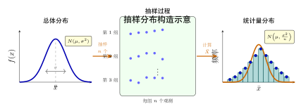
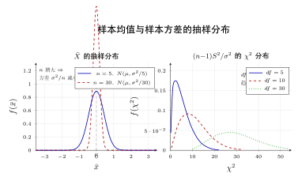
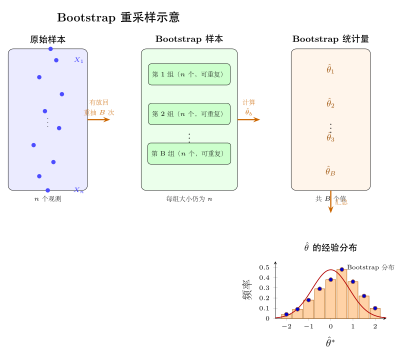

# 第 13 章 抽样分布（融合版）

> **难度**：★★★★
> **前置知识**：第 12 章概率论基础、正态分布、矩母函数、大数定律与中心极限定理
> **本文件**：融合"原版严格推导 + 速记 / 套路 / 自测"。保留原版完整正文（学习目标 / 13.1–13.5 / 深度学习应用 / 练习题）+ 在最前置前置速记 / 引入 / 思维路径，在最后追加思维训练 / 自测。

> **一例速记**：
> **样本均值**：$\bar X = \frac{1}{n}\sum X_i$，$E[\bar X]=\mu$，$\operatorname{Var}(\bar X)=\sigma^2/n$。
> **样本方差**：$S^2 = \frac{1}{n-1}\sum(X_i-\bar X)^2$，$E[S^2]=\sigma^2$（无偏，分母必须是 $n-1$）。
> **抽样定理三大结果**（正态总体）：$\bar X\sim\mathcal{N}(\mu,\sigma^2/n)$；$(n-1)S^2/\sigma^2\sim\chi^2(n-1)$；$\bar X$ 与 $S^2$ 独立。
> **三大抽样分布**：$\chi^2(n)=Z_1^2+\cdots+Z_n^2$；$t(n)=\mathcal{N}(0,1)/\sqrt{\chi^2(n)/n}$；$F(m,n)=\chi^2(m)/m\div\chi^2(n)/n$。
> **Bootstrap**：有放回抽 $B$ 次，用经验分布近似抽样分布。适用于无解析公式的复杂统计量。

---

## 引入：两个让初学者困惑的问题

> **问题 A**：设 $X_1,\ldots,X_n$ 来自总体 $\mathcal{N}(\mu,\sigma^2)$，令 $\bar X = \frac{1}{n}\sum X_i$。教材说 $\operatorname{Var}(\bar X) = \sigma^2/n$——为什么 **"样本均值的方差是总体方差除以 $n$"**？难道数据越多均值反而越"不确定"？
>
> **问题 B**：样本方差为什么定义为 $\frac{1}{n-1}\sum(X_i-\bar X)^2$，而不是更直觉的 $\frac{1}{n}\sum(X_i-\bar X)^2$？

**停下来先想一想**，再往下看。

---

**解题直觉**：

- 问题 A 中，$\sigma^2/n$ 恰好说明数据**越多**，样本均值的波动**越小**（$\sigma^2/n\to 0$ 当 $n\to\infty$）。这是大数定律背后的数学事实——$n$ 个独立随机变量平均下来，方差被"稀释"了 $n$ 倍。
- 问题 B 的原因是 $\bar X$ 本身由数据决定，用 $\bar X$ 替代真实均值 $\mu$ 时会"剥夺"一个自由度。$n$ 个偏差 $X_i - \bar X$ 之和恒为零，只有 $n-1$ 个独立，若分母用 $n$ 则期望 $= \frac{n-1}{n}\sigma^2 < \sigma^2$（偏小），必须改用 $n-1$ 才能无偏。

这两个问题贯穿本章——理解了它们，三大抽样分布和正态总体定理也就水到渠成。

---

## 思维路径还原（解题者的内心独白）

> "老师布置了一道题：设 $(X_1,\ldots,X_{16})$ 来自 $\mathcal{N}(50, 25)$，求 $P(|\bar X - 50| > 2)$。
>
> **第一步：确认 $\bar X$ 的分布**。正态总体 + i.i.d. 样本 → $\bar X$ 精确服从正态！不是近似，是**精确**。均值是 $E[\bar X] = \mu = 50$，方差是 $\operatorname{Var}(\bar X) = \sigma^2/n = 25/16$，所以 $\bar X \sim \mathcal{N}(50, 25/16)$。
>
> **第二步：标准化**。$\bar X$ 和正态一样，可以标准化。令 $Z = \frac{\bar X - 50}{\sigma/\sqrt{n}} = \frac{\bar X - 50}{5/4}$，则 $Z\sim\mathcal{N}(0,1)$。
>
> **计算概率**：$P(|\bar X-50| > 2) = P\!\left(|Z| > \frac{2}{5/4}\right) = P(|Z| > 1.6)$。
>
> 查标准正态表 $\Phi(1.6) \approx 0.9452$，所以 $P = 2(1-0.9452) = 0.1096$。
>
> **第三步：追问**。如果 $\sigma^2$ 未知怎么办？要用 $S$ 代替 $\sigma$，这时 $Z = \frac{\bar X - \mu}{S/\sqrt{n}}$ 不再是标准正态，而是 $t(n-1)$。为什么？因为 $(n-1)S^2/\sigma^2\sim\chi^2(n-1)$，把这个代入定义 $t=\mathcal{N}(0,1)/\sqrt{\chi^2(n-1)/(n-1)}$ 就得到了 $t(n-1)$。
>
> **第四步：如果总体非正态**？则 $n$ 很大时用 CLT：$\bar X\approx\mathcal{N}(\mu,\sigma^2/n)$（渐近近似）。但 $S^2$ 的精确分布不再是 $\chi^2$；若只关心 $\bar X$，大样本 CLT 就够了。
>
> **第五步：更复杂的统计量**（如中位数、AUC）？精确分布根本写不出来。这时用 **Bootstrap**：有放回地重抽 $B=1000$ 次，每次计算统计量，经验分布就是抽样分布的近似。
>
> **关键提醒**：$\bar X$ 和 $S^2$ 在正态总体下**独立**（非正态总体没有这个性质）。这个独立性是 $t$ 检验和 $F$ 检验能成立的隐藏前提。没有它，分子分母就不独立，$t$ 分布的定义就不适用。"

---

## 学习目标

学完本章后，你将能够：

- 清晰区分**总体**与**样本**的概念，理解从总体到样本的随机性本质，以及参数与统计量的关键差异
- 掌握常用统计量（样本均值、样本方差、样本矩）的定义与性质，能计算其期望、方差，并理解无偏性概念
- 理解**抽样分布**的含义——统计量作为随机变量所服从的分布，掌握其与总体分布的联系
- 熟练运用三大抽样分布（$\chi^2$ 分布、$t$ 分布、$F$ 分布）的定义、性质与分位数查表方法
- 掌握正态总体下样本均值与样本方差的精确抽样分布定理，为后续参数估计与假设检验奠定基础

---

## 13.1 总体与样本

### 总体的概念

**总体**（population）是研究对象的全体，通常用一个随机变量 $X$ 来刻画，其分布函数 $F(x)$ 称为**总体分布**。

总体分布中含有**未知参数** $\theta$（可能是向量），统计推断的目标就是从观测数据出发，对 $\theta$ 做出推断。

**例 13.1** 研究某城市成年男性的身高，总体为全体成年男性身高的分布，通常假定为 $X \sim \mathcal{N}(\mu, \sigma^2)$，其中 $\mu$、$\sigma^2$ 未知。

### 有限总体与无限总体

| 类型 | 含义 | 示例 |
|------|------|------|
| 有限总体 | 个体数有限（$N < \infty$） | 某工厂一批产品（$N = 10000$） |
| 无限总体 | 个体数无限，或视为无限 | 连续分布、重复生产过程 |

在统计推断中，通常假定总体分布已知其**类型**（如正态、指数），但**参数**未知。

### 简单随机样本

**定义 13.1（简单随机样本）**
若 $X_1, X_2, \ldots, X_n$ 满足：

1. **独立性**：$X_1, X_2, \ldots, X_n$ 相互独立
2. **同分布性**：每个 $X_i$ 与总体 $X$ 同分布，即 $F_{X_i}(x) = F(x)$

则称 $(X_1, X_2, \ldots, X_n)$ 为来自总体 $X$ 的**简单随机样本**（simple random sample），简称**样本**，$n$ 称为**样本量**（sample size）。

样本的联合分布函数为：

$$
F(x_1, x_2, \ldots, x_n) = \prod_{i=1}^{n} F(x_i)
$$

若总体有密度 $f(x)$，样本的联合密度为：

$$
\boxed{f(x_1, x_2, \ldots, x_n) = \prod_{i=1}^{n} f(x_i)}
$$

### 样本的二重性

样本具有**二重性**：

- **随机性**：在抽样之前，$X_1, X_2, \ldots, X_n$ 是随机变量（用大写字母表示）
- **观测值**：抽样完成后，得到具体数值 $x_1, x_2, \ldots, x_n$（用小写字母表示）

这一区分在统计学中极为重要：我们用随机变量来推导理论，用观测值来进行具体计算。

### 参数与统计量的区别

| 概念 | 含义 | 是否已知 | 示例 |
|------|------|---------|------|
| **参数**（parameter） | 总体分布中的未知常数 | 一般未知 | $\mu$、$\sigma^2$、$p$ |
| **统计量**（statistic） | 样本的函数（不含未知参数） | 可计算 | $\bar{X}$、$S^2$、$X_{(n)}$ |

参数是固定（但未知）的常数，统计量是随机变量（样本确定后变为具体数值）。统计推断的核心是：**用统计量来推断参数**。

---

## 13.2 统计量的概念

### 统计量的定义

**定义 13.2（统计量）**
设 $(X_1, X_2, \ldots, X_n)$ 是来自总体 $X$ 的样本，$g(X_1, X_2, \ldots, X_n)$ 是 $X_1, \ldots, X_n$ 的函数，若 $g$ 中**不含任何未知参数**，则称 $g(X_1, X_2, \ldots, X_n)$ 为一个**统计量**。

**注意**：统计量是随机变量（因为 $X_i$ 是随机变量），其分布完全由总体分布决定。

### 常用统计量

设 $(X_1, X_2, \ldots, X_n)$ 为来自总体 $X$ 的样本，以下是最重要的几类统计量。

#### 样本均值

$$
\boxed{\bar{X} = \frac{1}{n} \sum_{i=1}^{n} X_i}
$$

#### 样本方差

$$
\boxed{S^2 = \frac{1}{n-1} \sum_{i=1}^{n} (X_i - \bar{X})^2}
$$

分母取 $n-1$（而非 $n$）的原因：这使得 $S^2$ 成为总体方差 $\sigma^2$ 的**无偏估计**（见下文）。$S = \sqrt{S^2}$ 称为**样本标准差**。

**计算等价形式**（便于手算）：

$$
S^2 = \frac{1}{n-1}\left(\sum_{i=1}^n X_i^2 - n\bar{X}^2\right)
$$

#### 样本矩

**样本 $k$ 阶原点矩**：

$$
A_k = \frac{1}{n} \sum_{i=1}^{n} X_i^k, \quad k = 1, 2, \ldots
$$

特别地，$A_1 = \bar{X}$。

**样本 $k$ 阶中心矩**：

$$
B_k = \frac{1}{n} \sum_{i=1}^{n} (X_i - \bar{X})^k, \quad k = 2, 3, \ldots
$$

注意：$B_2 = \frac{n-1}{n} S^2$（有偏估计）。

#### 顺序统计量

将样本从小到大排列得到 $X_{(1)} \leq X_{(2)} \leq \cdots \leq X_{(n)}$，称为**顺序统计量**（order statistics）。

- $X_{(1)} = \min(X_1, \ldots, X_n)$：最小值
- $X_{(n)} = \max(X_1, \ldots, X_n)$：最大值
- $R = X_{(n)} - X_{(1)}$：**极差**（range）

**顺序统计量的分布**

设总体 CDF 为 $F(x)$，PDF 为 $f(x)$，则第 $k$ 个顺序统计量 $X_{(k)}$ 的 PDF 为：

$$f_{X_{(k)}}(x) = \frac{n!}{(k-1)!(n-k)!} [F(x)]^{k-1} [1 - F(x)]^{n-k} f(x)$$

**直觉**：恰好有 $k-1$ 个样本 $\leq x$、1 个样本 $= x$、$n-k$ 个样本 $> x$，再乘以排列数。

**特别重要的两个**：

- **最小值** $X_{(1)}$：$f_{X_{(1)}}(x) = n[1-F(x)]^{n-1} f(x)$，CDF 为 $F_{X_{(1)}}(x) = 1 - [1-F(x)]^n$
- **最大值** $X_{(n)}$：$f_{X_{(n)}}(x) = n[F(x)]^{n-1} f(x)$，CDF 为 $F_{X_{(n)}}(x) = [F(x)]^n$

**示例**：设 $X_i \sim \text{Uniform}(0, 1)$，则 $X_{(k)} \sim \text{Beta}(k, n-k+1)$。特别地，$X_{(n)}$ 的 PDF 为 $f(x) = nx^{n-1}$（$0 < x < 1$），$E[X_{(n)}] = \frac{n}{n+1}$。

### 样本均值的性质

**命题 13.1** 设总体 $X$ 满足 $\mathbb{E}[X] = \mu$，$\operatorname{Var}(X) = \sigma^2$，则：

$$
\mathbb{E}[\bar{X}] = \mu \qquad \text{（无偏性）}
$$

$$
\operatorname{Var}(\bar{X}) = \frac{\sigma^2}{n} \qquad \text{（方差缩减）}
$$

**证明**：由独立同分布和期望、方差的线性性立即得到。$\blacksquare$

### 样本方差的无偏性

**命题 13.2** 设总体 $X$ 满足 $\mathbb{E}[X] = \mu$，$\operatorname{Var}(X) = \sigma^2$，则：

$$
\mathbb{E}[S^2] = \sigma^2 \qquad \text{（无偏性）}
$$

**证明**：

$$
\sum_{i=1}^n (X_i - \bar{X})^2 = \sum_{i=1}^n X_i^2 - n\bar{X}^2
$$

两边取期望：

$$
\mathbb{E}\!\left[\sum_{i=1}^n (X_i - \bar{X})^2\right] = \sum_{i=1}^n \mathbb{E}[X_i^2] - n\mathbb{E}[\bar{X}^2]
$$

$$
= n(\sigma^2 + \mu^2) - n\!\left(\frac{\sigma^2}{n} + \mu^2\right) = n\sigma^2 + n\mu^2 - \sigma^2 - n\mu^2 = (n-1)\sigma^2
$$

因此 $\mathbb{E}[S^2] = \frac{1}{n-1}(n-1)\sigma^2 = \sigma^2$。$\blacksquare$

**直觉**：$n$ 个 $(X_i - \bar{X})$ 之和恒为零（因为 $\bar{X}$ 本身由数据决定），只有 $n-1$ 个是"自由的"，故除以 $n-1$ 才能无偏估计 $\sigma^2$。这就是统计学中的**自由度**（degrees of freedom）概念的起源。

---

## 13.3 抽样分布

### 什么是抽样分布

**定义 13.3（抽样分布）**
统计量 $T = g(X_1, X_2, \ldots, X_n)$ 作为随机变量所服从的分布，称为该统计量的**抽样分布**（sampling distribution）。

抽样分布是统计推断的核心——要用统计量推断参数，必须知道统计量的分布。

### 抽样分布的来源

抽样分布取决于两个因素：

1. **总体分布**的类型与参数
2. **统计量**的具体形式

对正态总体，样本均值、样本方差等常用统计量的精确抽样分布可以导出（见第 13.5 节）。对非正态总体，通常只能用中心极限定理得到渐近分布。

### 为什么要研究抽样分布

抽样分布回答了这样的问题：

> 如果真实参数为 $\theta$，重复抽样 $N$ 次，每次计算统计量 $T$，则 $T$ 的分布是什么？

这一分布决定了：
- 估计量有多精确（方差多大）
- 置信区间如何构建（需要分位数）
- 假设检验的临界值如何确定（需要尾概率）

### 示例：均匀总体的样本均值分布

设 $X \sim U(0, 1)$，$n = 2$。则 $\bar{X} = (X_1 + X_2)/2$ 的密度为：

$$
f_{\bar{X}}(x) = \begin{cases} 4x, & 0 \leq x < 1/2 \\ 4(1-x), & 1/2 \leq x \leq 1 \end{cases}
$$

这是一个三角形分布，而非均匀分布——体现了**抽样分布不同于总体分布**的本质。

---

## 13.4 三大抽样分布

正态总体中的统计推断依赖三种核心分布：$\chi^2$ 分布、$t$ 分布、$F$ 分布。它们都由正态分布导出，是数理统计的基石。

### 13.4.1 卡方分布（$\chi^2$ 分布）

#### 定义

**定义 13.4（$\chi^2$ 分布）**
设 $Z_1, Z_2, \ldots, Z_n$ 独立同分布于 $\mathcal{N}(0, 1)$，则

$$
\boxed{\chi^2 = Z_1^2 + Z_2^2 + \cdots + Z_n^2 \sim \chi^2(n)}
$$

称为自由度为 $n$ 的**卡方分布**（chi-squared distribution）。

#### 密度函数

$\chi^2(n)$ 的概率密度函数为：

$$
f(x; n) = \frac{1}{2^{n/2} \Gamma(n/2)} x^{n/2 - 1} e^{-x/2}, \quad x > 0
$$

其中 $\Gamma(\cdot)$ 为 Gamma 函数。这是 $\text{Gamma}(n/2, 1/2)$ 分布的特例。

#### 性质

**命题 13.3（$\chi^2$ 分布的矩）**

$$
\mathbb{E}[\chi^2(n)] = n, \qquad \operatorname{Var}(\chi^2(n)) = 2n
$$

**命题 13.4（可加性）**
若 $X \sim \chi^2(m)$，$Y \sim \chi^2(n)$，且 $X \perp Y$，则：

$$
X + Y \sim \chi^2(m + n)
$$

**命题 13.5（正态平方的特征）**
设 $X \sim \mathcal{N}(\mu, \sigma^2)$，则：

$$
\left(\frac{X - \mu}{\sigma}\right)^2 \sim \chi^2(1)
$$

**命题 13.6（渐近正态性）**
当 $n \to \infty$ 时，由中心极限定理：

$$
\frac{\chi^2(n) - n}{\sqrt{2n}} \xrightarrow{d} \mathcal{N}(0, 1)
$$

等价近似：$\chi^2(n) \approx \mathcal{N}(n, 2n)$（当 $n$ 较大时）。

#### 分位数

$\chi^2(n)$ 分布的**上 $\alpha$ 分位点** $\chi^2_\alpha(n)$ 定义为：

$$
P(\chi^2(n) > \chi^2_\alpha(n)) = \alpha
$$

由于 $\chi^2$ 分布不对称，上下分位点需分别查表。常用值：

| $n$ | $\chi^2_{0.025}(n)$ | $\chi^2_{0.975}(n)$ | $\chi^2_{0.05}(n)$ | $\chi^2_{0.95}(n)$ |
|-----|---------------------|---------------------|---------------------|---------------------|
| 5   | 0.831               | 12.833              | 1.145               | 11.070              |
| 10  | 3.247               | 20.483              | 3.940               | 18.307              |
| 20  | 9.591               | 34.170              | 10.851              | 31.410              |

### 13.4.2 $t$ 分布（学生 $t$ 分布）

#### 定义

**定义 13.5（$t$ 分布）**
设 $X \sim \mathcal{N}(0, 1)$，$Y \sim \chi^2(n)$，且 $X \perp Y$，则：

$$
\boxed{T = \frac{X}{\sqrt{Y/n}} \sim t(n)}
$$

称为自由度为 $n$ 的 **$t$ 分布**（Student's $t$-distribution），也称**学生 $t$ 分布**。

#### 密度函数

$t(n)$ 的概率密度函数为：

$$
f(x; n) = \frac{\Gamma\!\left(\dfrac{n+1}{2}\right)}{\sqrt{n\pi}\,\Gamma\!\left(\dfrac{n}{2}\right)} \left(1 + \frac{x^2}{n}\right)^{-(n+1)/2}, \quad x \in \mathbb{R}
$$

#### 性质

**命题 13.7（对称性）**
$t(n)$ 分布关于 $0$ 对称：若 $T \sim t(n)$，则 $-T \sim t(n)$。

**命题 13.8（矩的存在性）**

$$
\mathbb{E}[T] = 0 \quad (n > 1), \qquad \operatorname{Var}(T) = \frac{n}{n-2} \quad (n > 2)
$$

**命题 13.9（收敛到正态）**
当 $n \to \infty$ 时：

$$
t(n) \xrightarrow{d} \mathcal{N}(0, 1)
$$

即自由度增大时，$t$ 分布趋向标准正态分布。实践中，$n \geq 30$ 时近似效果已较好。

**命题 13.10（尾部更重）**
$t(n)$ 分布的尾部比 $\mathcal{N}(0,1)$ 更厚（kurtosis $> 3$），这反映了用样本标准差代替总体标准差带来的额外不确定性。

#### 分位数

$t(n)$ 分布的**上 $\alpha$ 分位点** $t_\alpha(n)$ 满足：

$$
P(T > t_\alpha(n)) = \alpha
$$

由对称性：$t_{1-\alpha}(n) = -t_\alpha(n)$。常用值：

| $n$ | $t_{0.025}(n)$（双侧 5%） | $t_{0.05}(n)$（单侧 5%） |
|-----|--------------------------|--------------------------|
| 5   | 2.571                    | 2.015                    |
| 10  | 2.228                    | 1.812                    |
| 20  | 2.086                    | 1.725                    |
| 30  | 2.042                    | 1.697                    |
| $\infty$ | 1.960            | 1.645                    |

最后一行（$n \to \infty$）正是标准正态分布的分位数。

### 13.4.3 $F$ 分布

#### 定义

**定义 13.6（$F$ 分布）**
设 $U \sim \chi^2(m)$，$V \sim \chi^2(n)$，且 $U \perp V$，则：

$$
\boxed{F = \frac{U/m}{V/n} \sim F(m, n)}
$$

称为自由度为 $(m, n)$ 的 **$F$ 分布**，$m$ 为分子自由度，$n$ 为分母自由度。

#### 密度函数

$F(m, n)$ 的概率密度函数为：

$$
f(x; m, n) = \frac{\Gamma\!\left(\dfrac{m+n}{2}\right)}{\Gamma\!\left(\dfrac{m}{2}\right)\Gamma\!\left(\dfrac{n}{2}\right)} \left(\frac{m}{n}\right)^{m/2} \frac{x^{m/2 - 1}}{\left(1 + \dfrac{m}{n}x\right)^{(m+n)/2}}, \quad x > 0
$$

#### 性质

**命题 13.11（均值与方差）**

$$
\mathbb{E}[F] = \frac{n}{n-2} \quad (n > 2), \qquad \operatorname{Var}(F) = \frac{2n^2(m+n-2)}{m(n-2)^2(n-4)} \quad (n > 4)
$$

**命题 13.12（倒数性质）**
若 $F \sim F(m, n)$，则 $1/F \sim F(n, m)$，因此：

$$
\boxed{F_{1-\alpha}(m, n) = \frac{1}{F_\alpha(n, m)}}
$$

这一性质可将下分位点转换为上分位点，在查表时非常有用。

**命题 13.13（与 $t$ 分布的关系）**
若 $T \sim t(n)$，则 $T^2 \sim F(1, n)$。

**命题 13.14（与 $\chi^2$ 分布的关系）**
当 $n \to \infty$ 时，$mF(m, n) \xrightarrow{d} \chi^2(m)$。

#### 三大分布之间的关系图

$$
\mathcal{N}(0,1) \xrightarrow{\text{平方}} \chi^2(1) \xrightarrow{\text{求和}} \chi^2(n)
$$

$$
\frac{\mathcal{N}(0,1)}{\sqrt{\chi^2(n)/n}} = t(n), \qquad T^2 = F(1, n)
$$

$$
\frac{\chi^2(m)/m}{\chi^2(n)/n} = F(m, n)
$$

---

## 13.5 正态总体的抽样分布定理

本节是本章的核心，给出正态总体下最重要的精确抽样分布结果。

### 单正态总体

设 $(X_1, X_2, \ldots, X_n)$ 是来自 $\mathcal{N}(\mu, \sigma^2)$ 的简单随机样本，$\bar{X}$ 为样本均值，$S^2$ 为样本方差。

#### 定理一：样本均值的精确分布

**定理 13.1**

$$
\boxed{\bar{X} \sim \mathcal{N}\!\left(\mu,\, \frac{\sigma^2}{n}\right)}
$$

等价地：

$$
\frac{\bar{X} - \mu}{\sigma/\sqrt{n}} \sim \mathcal{N}(0, 1)
$$

**证明**：正态随机变量的线性组合仍为正态，$\mathbb{E}[\bar{X}] = \mu$，$\operatorname{Var}(\bar{X}) = \sigma^2/n$。$\blacksquare$

#### 定理二：样本方差的精确分布

**定理 13.2（Cochran 定理的特例）**

$$
\boxed{\frac{(n-1)S^2}{\sigma^2} \sim \chi^2(n-1)}
$$

**含义**：样本方差乘以 $(n-1)/\sigma^2$ 服从自由度为 $n-1$ 的卡方分布（注意：自由度是 $n-1$ 而非 $n$，少的那一个自由度被 $\bar{X}$ "消耗"了）。

**证明思路**：

利用正交变换。令 $Y_i = (X_i - \mu)/\sigma \sim \mathcal{N}(0,1)$，则：

$$
\sum_{i=1}^n Y_i^2 = \sum_{i=1}^n \left(\frac{X_i - \mu}{\sigma}\right)^2 \sim \chi^2(n)
$$

通过恒等式（**平方和分解**）：

$$
\sum_{i=1}^n \left(\frac{X_i - \mu}{\sigma}\right)^2 = \frac{(n-1)S^2}{\sigma^2} + n\left(\frac{\bar{X} - \mu}{\sigma}\right)^2
$$

右边第二项 $= \left(\dfrac{\bar{X} - \mu}{\sigma/\sqrt{n}}\right)^2 \sim \chi^2(1)$。

由 Cochran 定理，若 $\chi^2(n)$ 可分解为两个独立的 $\chi^2$ 变量之和（自由度分别为 $n-1$ 与 $1$），则第一项 $\sim \chi^2(n-1)$，且两项独立。$\blacksquare$

#### 定理三：$\bar{X}$ 与 $S^2$ 的独立性

**定理 13.3（正态总体的独立性）**
对正态总体，$\bar{X}$ 与 $S^2$ **相互独立**。

**注**：这是正态分布特有的性质！对非正态总体，$\bar{X}$ 与 $S^2$ 一般不独立。

#### 定理四：$t$ 统计量

**定理 13.4**
在定理 13.1 和 13.2 的条件下，当 $\sigma^2$ 未知时：

$$
\boxed{T = \frac{\bar{X} - \mu}{S/\sqrt{n}} \sim t(n-1)}
$$

**证明**：

$$
T = \frac{(\bar{X} - \mu)/(\sigma/\sqrt{n})}{\sqrt{(n-1)S^2/\sigma^2} / (n-1)} \cdot \frac{1}{1} = \frac{\mathcal{N}(0,1)}{\sqrt{\chi^2(n-1)/(n-1)}} \sim t(n-1)
$$

其中分子分母独立（由定理 13.3）。$\blacksquare$

**实践意义**：当 $\sigma^2$ 未知时，用 $S$ 代替 $\sigma$，统计量服从 $t(n-1)$ 而非 $\mathcal{N}(0,1)$，这是一元 $t$ 检验的理论基础。

### 两个正态总体

设 $(X_1, \ldots, X_m)$ 来自 $\mathcal{N}(\mu_1, \sigma_1^2)$，$(Y_1, \ldots, Y_n)$ 来自 $\mathcal{N}(\mu_2, \sigma_2^2)$，两样本独立。

令 $\bar{X}$、$\bar{Y}$ 分别为两组样本均值，$S_X^2$、$S_Y^2$ 分别为两组样本方差。

#### 定理五：两样本方差比的 $F$ 分布

**定理 13.5**

$$
\boxed{F = \frac{S_X^2/\sigma_1^2}{S_Y^2/\sigma_2^2} \sim F(m-1, n-1)}
$$

特别地，当 $\sigma_1^2 = \sigma_2^2$ 时：

$$
F = \frac{S_X^2}{S_Y^2} \sim F(m-1, n-1)
$$

这是**方差齐性检验**（$F$ 检验）的基础。

#### 定理六：方差已知时的两样本均值差

**定理 13.6**
当 $\sigma_1^2$、$\sigma_2^2$ 已知时：

$$
\frac{(\bar{X} - \bar{Y}) - (\mu_1 - \mu_2)}{\sqrt{\dfrac{\sigma_1^2}{m} + \dfrac{\sigma_2^2}{n}}} \sim \mathcal{N}(0, 1)
$$

#### 定理七：等方差时的两样本 $t$ 统计量

**定理 13.7**
当 $\sigma_1^2 = \sigma_2^2 = \sigma^2$（未知）时，定义**合并样本方差**（pooled variance）：

$$
S_p^2 = \frac{(m-1)S_X^2 + (n-1)S_Y^2}{m + n - 2}
$$

则：

$$
\boxed{T = \frac{(\bar{X} - \bar{Y}) - (\mu_1 - \mu_2)}{S_p\sqrt{\dfrac{1}{m} + \dfrac{1}{n}}} \sim t(m + n - 2)}
$$

**直觉**：两个样本方差合并估计公共方差 $\sigma^2$，总自由度为 $(m-1) + (n-1) = m+n-2$。

### 定理汇总表

| 场景 | 统计量 | 分布 | 应用 |
|------|--------|------|------|
| 单正态，$\sigma^2$ 已知 | $\dfrac{\bar{X} - \mu}{\sigma/\sqrt{n}}$ | $\mathcal{N}(0,1)$ | $Z$ 检验、置信区间 |
| 单正态，$\sigma^2$ 未知 | $\dfrac{\bar{X} - \mu}{S/\sqrt{n}}$ | $t(n-1)$ | $t$ 检验 |
| 单正态，估计方差 | $\dfrac{(n-1)S^2}{\sigma^2}$ | $\chi^2(n-1)$ | $\sigma^2$ 的置信区间 |
| 双正态，等方差未知 | $\dfrac{(\bar{X}-\bar{Y})-(\mu_1-\mu_2)}{S_p\sqrt{1/m+1/n}}$ | $t(m+n-2)$ | 两样本 $t$ 检验 |
| 双正态，方差比 | $\dfrac{S_X^2/\sigma_1^2}{S_Y^2/\sigma_2^2}$ | $F(m-1,n-1)$ | 方差齐性检验 |

---

## 几何示意

### 图 13-1：抽样分布构造示意



总体分布（左）通过 i.i.d. 抽样生成样本，再由样本构造统计量（如 $\bar X$、$S^2$），统计量反复抽样得到的直方图趋向抽样分布（右）。三层结构揭示了参数推断的逻辑路径：总体 $\to$ 样本 $\to$ 统计量 $\to$ 抽样分布 $\to$ 推断参数。

### 图 13-2：$\bar X$ 与 $(n-1)S^2/\sigma^2$ 的抽样分布形状



左：$\bar X \sim \mathcal{N}(\mu, \sigma^2/n)$，对称钟形，随 $n$ 增大方差收窄。右：$(n-1)S^2/\sigma^2 \sim \chi^2(n-1)$，右偏分布，自由度 $n-1$ 决定峰位和形状——这是两类统计量性质截然不同的可视化呈现。

### 图 13-3：Bootstrap 重采样示意



从原始样本（大小 $n$）有放回地重抽 $B$ 次，每次得到一个 Bootstrap 样本并计算统计量 $T^*_b$，$B$ 个值的直方图即为统计量抽样分布的 Bootstrap 近似。适用于任何无解析形式的复杂统计量（中位数、AUC、相关系数等）。

---

## 抽象成方法（套路总结）

### 8 大核心公式速查

| 名称 | 公式 | 备注 |
|------|------|------|
| 样本均值 | $\bar X = \frac{1}{n}\sum_{i=1}^n X_i$ | 参数 $\mu$ 的无偏估计 |
| 样本方差 | $S^2 = \frac{1}{n-1}\sum(X_i-\bar X)^2$ | 分母 $n-1$ 保证无偏 |
| $\bar X$ 的期望方差 | $E[\bar X]=\mu$，$\operatorname{Var}(\bar X)=\sigma^2/n$ | 任意总体均成立 |
| $\chi^2$ 分布 | $\sum_{i=1}^n Z_i^2\sim\chi^2(n)$，$E=n$，$\text{Var}=2n$ | $Z_i$ 独立标准正态 |
| $t$ 分布 | $T=\mathcal{N}(0,1)/\sqrt{\chi^2(n)/n}\sim t(n)$ | 对称，尾重于正态 |
| $F$ 分布 | $F=\chi^2(m)/m\div\chi^2(n)/n\sim F(m,n)$ | 倒数：$1/F\sim F(n,m)$ |
| $t$ 统计量 | $(\bar X-\mu)/(S/\sqrt{n})\sim t(n-1)$ | $\sigma^2$ 未知时使用 |
| $(n-1)S^2/\sigma^2$ | $\sim\chi^2(n-1)$ | 正态总体，精确结果 |

### 抽样分布构造 3 步流程

1. **明确总体**：正态 $\to$ 可用精确分布；非正态 $\to$ 大样本用 CLT，小样本用 Bootstrap
2. **确定统计量**：$\bar X$（均值类）还是 $S^2$（方差类）还是二者之比？
3. **套公式 / 查表**：正态总体四大定理直接套；查 $t/\chi^2/F$ 分位表；Bootstrap 时模拟重抽并取经验分位数

---

## 方法变形

### 变形 1：正态总体精确推断

直接使用定理 13.1–13.7。$\sigma^2$ 已知用 $Z$ 统计量（标准正态），$\sigma^2$ 未知用 $T$ 统计量（$t$ 分布），两样本方差比用 $F$ 统计量，自由度严格按公式。

**典型错误**：$\sigma^2$ 未知时仍用正态分位数（忽略 $t$ 分布尾部更重）。

### 变形 2：大样本 CLT 近似

当样本量 $n \geq 30$（或更大）且总体非正态时，由中心极限定理：

$$\bar X \approx \mathcal{N}(\mu, \sigma^2/n)$$

此时 $Z = (\bar X - \mu)/(\sigma/\sqrt{n})$ 近似标准正态。若 $\sigma^2$ 未知，用 $S$ 替代——大样本下 $t(n-1)\approx\mathcal{N}(0,1)$，两者差异可忽略。**适用前提**：$E[X]$ 和 $\operatorname{Var}(X)$ 有限。

### 变形 3：顺序统计量

已知总体 CDF $F(x)$ 和 PDF $f(x)$，第 $k$ 阶顺序统计量 $X_{(k)}$ 的 PDF：

$$f_{X_{(k)}}(x) = \frac{n!}{(k-1)!(n-k)!}[F(x)]^{k-1}[1-F(x)]^{n-k}f(x)$$

极端情形：最小值 $X_{(1)}$、最大值 $X_{(n)}$ 的公式可由 $k=1$ 和 $k=n$ 直接得到。均匀 $U(0,1)$ 总体下 $X_{(k)}\sim\text{Beta}(k, n-k+1)$。

### 变形 4：Bootstrap

当统计量复杂（非 $\bar X$、非 $S^2$）或总体分布未知时，Bootstrap 是通用替代：

1. 有放回抽样 $B$（$\geq 500$）次，每次计算统计量 $T^*_b$
2. 用 $\{T^*_b\}$ 的标准差估计标准误 SE
3. 用经验分位数 $[T^*_{(\alpha/2)}, T^*_{(1-\alpha/2)}]$ 作置信区间

**限制**：Bootstrap 一致性要求总体分布不过于"奇特"（如重尾分布的极端分位数估计，Bootstrap 可能失效）。

---

## 本章小结

**核心概念层次**：

$$
\text{总体分布} \xrightarrow{\text{i.i.d. 抽样}} \text{样本} \xrightarrow{\text{构造}} \text{统计量} \xrightarrow{\text{导出}} \text{抽样分布}
$$

**三大抽样分布的本质**：

1. **$\chi^2(n)$ 分布**：$n$ 个独立标准正态变量的平方和，描述"方差估计的波动"
2. **$t(n)$ 分布**：标准正态除以独立的 $\chi^2(n)/n$ 的平方根，描述"用样本标准差代替总体标准差后的不确定性"
3. **$F(m,n)$ 分布**：两个独立 $\chi^2$ 变量之比（各除以自由度），描述"两组方差的相对大小"

**正态总体四大定理**：

- $\bar{X} \sim \mathcal{N}(\mu, \sigma^2/n)$（精确！不需大样本）
- $(n-1)S^2/\sigma^2 \sim \chi^2(n-1)$（精确！自由度 $n-1$ 体现了约束）
- $\bar{X}$ 与 $S^2$ 独立（正态特有）
- $(\bar{X} - \mu)/(S/\sqrt{n}) \sim t(n-1)$（$\sigma^2$ 未知时的核心工具）

**自由度直觉**：自由度 = 独立信息的个数。估计 $\sigma^2$ 时，$n$ 个偏差 $X_i - \bar{X}$ 之和恒为零，只有 $n-1$ 个独立，故 $S^2$ 的自由度为 $n-1$。

---

## 思考路标（条件反射）

1. 看到"正态总体 + $\sigma^2$ 已知" → 立刻用 $Z=(\bar X-\mu)/(\sigma/\sqrt{n})\sim\mathcal{N}(0,1)$，精确分布
2. 看到"正态总体 + $\sigma^2$ 未知" → 立刻换 $T=(\bar X-\mu)/(S/\sqrt{n})\sim t(n-1)$，自由度 $n-1$
3. 看到"样本方差 $S^2$" → 记 $(n-1)S^2/\sigma^2\sim\chi^2(n-1)$，自由度是 $n-1$ 不是 $n$
4. 看到 $\bar X$ 和 $S^2$ 出现在同一问题 → 正态总体下两者**独立**，可以各自套分布
5. 看到"非正态总体 + 大样本" → CLT 近似 $\bar X\approx\mathcal{N}(\mu,\sigma^2/n)$；小样本需 Bootstrap
6. 看到"两样本方差比" → $F=S_1^2/S_2^2\sim F(m-1,n-1)$（等方差假设下）
7. 看到"两样本均值差 + 等方差未知" → 合并方差 $S_p^2$，$T\sim t(m+n-2)$
8. 看到 $F$ 的下分位点 → 用倒数性质 $F_{1-\alpha}(m,n)=1/F_\alpha(n,m)$ 转化
9. 看到"中位数 / AUC / 复杂统计量的置信区间" → Bootstrap，重抽 $B\geq 500$ 次
10. 看到 $\chi^2(n)$ 的期望方差 → $E=n$，$\text{Var}=2n$，大 $n$ 时近似 $\mathcal{N}(n,2n)$
11. 看到 $T^2$（$t$ 分布的平方）→ $T^2\sim F(1,n)$，连接 $t$ 和 $F$ 分布

---

## 易错点

1. **样本方差分母用 $n$ 而非 $n-1$**：$B_2=\frac{1}{n}\sum(X_i-\bar X)^2$ 是有偏估计，$E[B_2]=\frac{n-1}{n}\sigma^2\neq\sigma^2$；教材定义的 $S^2$ 分母必须是 $n-1$ 才无偏。Python/NumPy 默认 `ddof=0`（分母 $n$），统计使用时应设 `ddof=1`。
2. **把 $E[\bar X^2]$ 误算为 $(E[\bar X])^2$**：正确展开是 $E[\bar X^2]=\operatorname{Var}(\bar X)+(E[\bar X])^2=\sigma^2/n+\mu^2$，漏掉 $\sigma^2/n$ 会导致推导错误。
3. **$t$ 统计量的自由度**：单样本 $t$ 的自由度是 $n-1$，两样本等方差 $t$ 的自由度是 $m+n-2$，不要混淆；$\sigma^2$ 未知而直接查正态分位数是典型错误。
4. **Bootstrap 的一致性限制**：Bootstrap 在估计重尾分布的极端分位数（如最大值的分布）时可能失效；对独立同分布假设敏感，时间序列、聚类数据需要特殊 Bootstrap 变体（如 Block Bootstrap）。
5. **$\bar X$ 与 $S^2$ 独立仅限正态总体**：这是正态分布特有性质，不能推广到指数分布、均匀分布等；在非正态场景中，两者存在相关性，不能假设独立。
6. **混淆总体参数与样本统计量**：$\mu$、$\sigma^2$ 是固定（未知）常数，$\bar X$、$S^2$ 是随机变量。参数没有"分布"，统计量才有抽样分布。

---

## 典型应用例题

### 例 1：求 $\bar X$ 落入某区间的概率

**题目**：设 $(X_1,\ldots,X_{25})$ 来自 $\mathcal{N}(\mu, \sigma^2)$，已知 $\sigma^2=4$，$\mu=10$。求 $P(9.2 < \bar X < 10.8)$。

**思路**：正态总体 + $\sigma^2$ 已知 → $\bar X\sim\mathcal{N}(\mu,\sigma^2/n)$，标准化后查正态表。

**解**：$\bar X\sim\mathcal{N}(10, 4/25)$，标准差 $\sigma_{\bar X}=\sqrt{4/25}=2/5=0.4$。

$$
P(9.2<\bar X<10.8)=P\!\left(\frac{9.2-10}{0.4}<Z<\frac{10.8-10}{0.4}\right)=P(-2<Z<2)
$$

$$
=2\Phi(2)-1\approx 2\times 0.9772-1=\mathbf{0.9544}
$$

**答案**：$\boxed{0.9544}$（即 $\pm 2\sigma$ 经验法则，正态总体样本均值精确结果）。

---

### 例 2：$S^2$ 的 $\chi^2$ 分布计算

**题目**：设 $(X_1,\ldots,X_{10})$ 来自 $\mathcal{N}(\mu,\sigma^2)$，$\sigma^2=9$，求 $P(S^2 > 15.6)$（其中 $\chi^2_{0.05}(9)=16.919$，$\chi^2_{0.10}(9)=14.684$）。

**思路**：由定理 13.2，$(n-1)S^2/\sigma^2\sim\chi^2(n-1)$，将 $S^2>15.6$ 转化为 $\chi^2$ 不等式。

**解**：$n=10$，$(n-1)S^2/\sigma^2 = 9S^2/9 = S^2/1$…

重新计算：令 $W = \frac{(n-1)S^2}{\sigma^2} = \frac{9S^2}{9} = S^2 \cdot \frac{9}{9}$，注意这里 $\sigma^2=9$，所以

$$
W = \frac{9 S^2}{9} = S^2 \sim \chi^2(9)
$$

等价于：$P(S^2 > 15.6) = P(W > 15.6)$，$W\sim\chi^2(9)$。

由表：$\chi^2_{0.10}(9) = 14.684$，$\chi^2_{0.05}(9) = 16.919$，故 $P(W > 15.6)$ 在 $(0.05, 0.10)$ 之间。精确值约为 $\mathbf{0.075}$（可由计算机查得）。

**补充**：若改问 $P(S^2 > 18.81)$，则 $W=S^2>18.81$，查表 $\chi^2_{0.025}(9)=19.023$，$P\approx 0.03$——说明样本方差严重偏大时概率很小。

---

### 例 3：Bootstrap 估计中位数的标准误

**题目**：数据 $x = \{2.1, 3.5, 1.8, 4.2, 2.9, 3.1, 5.0, 2.4\}$（$n=8$），用 Bootstrap（$B=2000$）估计样本中位数的标准误 SE 和 95% 置信区间。

**思路**：中位数无解析抽样分布，用 Bootstrap。

**解（概念步骤）**：

1. 计算原始样本中位数：排序后第 4、5 大值为 $2.9$ 和 $3.1$，中位数 $= (2.9+3.1)/2 = 3.0$。
2. 有放回重抽 $B=2000$ 次，每次抽 $n=8$ 个，计算中位数 $T^*_b$。
3. 估计 SE：$\widehat{SE} = \text{std}(\{T^*_b\})$（用样本标准差）。
4. 95% 置信区间：$[T^*_{(0.025)}, T^*_{(0.975)}]$，即 Bootstrap 样本的第 2.5% 和 97.5% 分位数。

**结论格式**：若模拟结果为 $\widehat{SE}=0.35$，95% CI $=[2.45, 3.75]$，报告为"中位数点估计 3.0，Bootstrap SE 0.35，95% 置信区间 $[2.45, 3.75]$"。

---

## 深度学习应用：模型评估、交叉验证与 Bootstrap

### 抽样分布在机器学习中的核心地位

深度学习模型的训练与评估本质上是**统计推断**问题：

- **训练集**是总体（真实数据分布）的一个**样本**
- **测试集准确率**是总体准确率的一个**统计量**
- **置信区间**需要统计量的**抽样分布**

本节展示如何将本章理论直接应用于深度学习实践。

### 模型评估的统计理论

设模型在 $n$ 个测试样本上的准确率为 $\hat{p} = k/n$（$k$ 为正确分类数）。由 i.i.d. 伯努利假设：

$$
k \sim B(n, p), \quad \hat{p} \approx \mathcal{N}\!\left(p,\, \frac{p(1-p)}{n}\right) \quad \text{（CLT）}
$$

因此真实准确率 $p$ 的近似 $95\%$ 置信区间（**Wald 区间**）为：

$$
\boxed{\hat{p} \pm 1.96\sqrt{\frac{\hat{p}(1-\hat{p})}{n}}}
$$

**示例**：若 $n = 1000$，$\hat{p} = 0.92$，则置信区间为：

$$
0.92 \pm 1.96\sqrt{\frac{0.92 \times 0.08}{1000}} = 0.92 \pm 0.0167 = [0.903,\, 0.937]
$$

**注意**：这一区间的宽度与样本量 $n$ 成反比（$\propto 1/\sqrt{n}$），体现了本章的核心公式 $\operatorname{Var}(\hat{p}) = p(1-p)/n$。

### 交叉验证的统计解释

**$k$ 折交叉验证**（$k$-Fold Cross-Validation）将数据集分为 $k$ 份，每次用 $k-1$ 份训练、$1$ 份验证，共训练 $k$ 次，得到 $k$ 个验证误差 $\ell_1, \ell_2, \ldots, \ell_k$。

统计量：

$$
\bar{\ell} = \frac{1}{k} \sum_{i=1}^k \ell_i, \qquad S_\ell^2 = \frac{1}{k-1} \sum_{i=1}^k (\ell_i - \bar{\ell})^2
$$

由**定理 13.4**（若 $\ell_i$ 近似正态），泛化误差 $\mu_\ell$ 的置信区间为：

$$
\bar{\ell} \pm t_{\alpha/2}(k-1) \cdot \frac{S_\ell}{\sqrt{k}}
$$

**重要注意**：$k$ 折 CV 的各折误差并非严格独立（共享训练数据），因此上式是近似的，但在实践中广泛使用。

### Bootstrap：当抽样分布难以解析推导时

对复杂统计量（如 AUC、中位数、神经网络权重范数），其精确抽样分布往往无法推导。**Bootstrap** 方法通过**模拟重抽样**来近似抽样分布。

**Bootstrap 原理**：

1. 从原始样本 $\{x_1, \ldots, x_n\}$ 中**有放回地**随机抽取 $n$ 个样本，得到一个 Bootstrap 样本
2. 计算统计量 $T^*$
3. 重复 $B$ 次（$B = 500 \sim 2000$），得到 $T^*_1, T^*_2, \ldots, T^*_B$
4. 用 $\{T^*_b\}$ 的分布近似 $T$ 的抽样分布

**Bootstrap 置信区间（百分位法）**：

$$
\left[T^*_{(\alpha/2)},\; T^*_{(1-\alpha/2)}\right]
$$

其中 $T^*_{(q)}$ 为 Bootstrap 样本的 $q$ 分位数。

### PyTorch 代码示例

```python
import torch
import torch.nn as nn
import torch.nn.functional as F
import numpy as np
from scipy import stats
import matplotlib.pyplot as plt

torch.manual_seed(42)
np.random.seed(42)


# ─── 1. 模型准确率的置信区间（Wald 区间 + Clopper-Pearson 精确区间）─────────────
def accuracy_confidence_interval(n_correct: int, n_total: int, alpha: float = 0.05):
    """
    计算分类模型准确率的置信区间。

    参数
    ----
    n_correct : 正确分类数
    n_total   : 测试样本总数
    alpha     : 显著性水平（默认 0.05，即 95% 置信区间）

    返回
    ----
    dict：包含点估计、Wald 区间（基于 CLT）和精确区间（Clopper-Pearson）
    """
    p_hat = n_correct / n_total
    z = stats.norm.ppf(1 - alpha / 2)  # z_{alpha/2}，如 z=1.96（alpha=0.05）

    # ── Wald 区间（CLT + 正态近似）────────────────────────────────────────────
    se_wald = np.sqrt(p_hat * (1 - p_hat) / n_total)
    wald_lower = p_hat - z * se_wald
    wald_upper = p_hat + z * se_wald

    # ── Clopper-Pearson 精确区间（基于 Beta 分布的二项分布精确解）─────────────
    # 利用 Beta 分布与二项分布的关系：
    #   P(X >= k | p) = P(Beta(k, n-k+1) <= p)
    exact_lower = stats.beta.ppf(alpha / 2, n_correct, n_total - n_correct + 1)
    exact_upper = stats.beta.ppf(1 - alpha / 2, n_correct + 1, n_total - n_correct)

    return {
        "point_estimate": p_hat,
        "wald_interval": (max(0, wald_lower), min(1, wald_upper)),
        "exact_interval": (exact_lower, exact_upper),
        "se_wald": se_wald,
        "n_total": n_total,
    }


# 示例：模型在 1000 个测试样本上正确分类 920 个
result = accuracy_confidence_interval(n_correct=920, n_total=1000)
print("=== 模型准确率的置信区间 ===")
print(f"点估计：{result['point_estimate']:.4f}")
print(f"Wald 区间（CLT）：[{result['wald_interval'][0]:.4f}, {result['wald_interval'][1]:.4f}]")
print(f"精确区间（Clopper-Pearson）：[{result['exact_interval'][0]:.4f}, {result['exact_interval'][1]:.4f}]")
print(f"标准误：{result['se_wald']:.4f}")
print()


# ─── 2. K 折交叉验证的 t 区间 ────────────────────────────────────────────────
def kfold_cv_confidence_interval(fold_losses: np.ndarray, alpha: float = 0.05):
    """
    基于 k 折交叉验证结果计算泛化误差的 t 置信区间。

    对应定理 13.4：样本均值的 t 统计量 = (x̄ - μ) / (S / √n) ~ t(n-1)

    参数
    ----
    fold_losses : 每折的验证损失，形状 (k,)
    alpha       : 显著性水平

    返回
    ----
    dict：均值、标准差、t 区间
    """
    k = len(fold_losses)
    mean_loss = np.mean(fold_losses)
    std_loss = np.std(fold_losses, ddof=1)  # 无偏样本标准差，ddof=1 对应 S（除以 n-1）
    se = std_loss / np.sqrt(k)

    # t 分布分位数，自由度 k-1（对应定理 13.4）
    t_critical = stats.t.ppf(1 - alpha / 2, df=k - 1)

    lower = mean_loss - t_critical * se
    upper = mean_loss + t_critical * se

    return {
        "mean": mean_loss,
        "std": std_loss,
        "se": se,
        "t_critical": t_critical,
        "confidence_interval": (lower, upper),
        "df": k - 1,
    }


# 模拟 5 折交叉验证的损失（来自某分类模型）
fold_losses = np.array([0.2341, 0.2187, 0.2456, 0.2298, 0.2375])

cv_result = kfold_cv_confidence_interval(fold_losses)
print("=== 5 折交叉验证的 t 置信区间 ===")
print(f"各折损失：{fold_losses}")
print(f"均值：{cv_result['mean']:.4f}  ±  标准误：{cv_result['se']:.4f}")
print(f"t 临界值（df={cv_result['df']}）：{cv_result['t_critical']:.4f}")
print(f"95% 置信区间：[{cv_result['confidence_interval'][0]:.4f}, {cv_result['confidence_interval'][1]:.4f}]")
print()


# ─── 3. Bootstrap 估计模型评估指标的抽样分布 ─────────────────────────────────
def bootstrap_metric(
    y_true: np.ndarray,
    y_pred: np.ndarray,
    metric_fn,
    B: int = 1000,
    alpha: float = 0.05,
    random_seed: int = 42,
):
    """
    用 Bootstrap 方法估计任意评估指标（如 AUC、F1）的置信区间。

    当统计量的精确抽样分布不可知时（非正态总体、复杂指标），
    Bootstrap 用重抽样来近似抽样分布，是本章第 13.3 节思想的数值实现。

    参数
    ----
    y_true     : 真实标签
    y_pred     : 预测分数或预测标签
    metric_fn  : 指标函数，签名 fn(y_true, y_pred) -> float
    B          : Bootstrap 重抽样次数
    alpha      : 置信区间显著性水平
    random_seed: 随机种子

    返回
    ----
    dict：点估计、Bootstrap 均值、标准误、百分位置信区间
    """
    rng = np.random.default_rng(random_seed)
    n = len(y_true)

    # 原始统计量（点估计）
    original_metric = metric_fn(y_true, y_pred)

    # Bootstrap 重抽样
    bootstrap_metrics = np.zeros(B)
    for b in range(B):
        # 有放回地抽取 n 个样本的索引（核心步骤）
        indices = rng.integers(0, n, size=n)
        bootstrap_metrics[b] = metric_fn(y_true[indices], y_pred[indices])

    # 百分位置信区间
    lower = np.percentile(bootstrap_metrics, 100 * alpha / 2)
    upper = np.percentile(bootstrap_metrics, 100 * (1 - alpha / 2))

    return {
        "point_estimate": original_metric,
        "bootstrap_mean": np.mean(bootstrap_metrics),
        "bootstrap_std": np.std(bootstrap_metrics, ddof=1),
        "confidence_interval": (lower, upper),
        "bootstrap_samples": bootstrap_metrics,
        "B": B,
    }


# 构造二分类问题的模拟数据
n_test = 500
true_probs = np.random.beta(2, 5, size=n_test)     # 真实正类概率
y_true_sim = (np.random.rand(n_test) < true_probs).astype(int)
y_pred_sim = true_probs + np.random.normal(0, 0.1, size=n_test)  # 带噪声的预测分数
y_pred_sim = np.clip(y_pred_sim, 0, 1)


def accuracy_at_threshold(y_true, y_pred, threshold=0.5):
    """以给定阈值计算准确率"""
    return np.mean((y_pred >= threshold) == y_true)


def f1_score_metric(y_true, y_pred, threshold=0.5):
    """计算 F1 分数"""
    y_pred_binary = (y_pred >= threshold).astype(int)
    tp = np.sum((y_pred_binary == 1) & (y_true == 1))
    fp = np.sum((y_pred_binary == 1) & (y_true == 0))
    fn = np.sum((y_pred_binary == 0) & (y_true == 1))
    precision = tp / (tp + fp + 1e-9)
    recall = tp / (tp + fn + 1e-9)
    return 2 * precision * recall / (precision + recall + 1e-9)


# Bootstrap 估计准确率和 F1 的置信区间
bootstrap_acc = bootstrap_metric(y_true_sim, y_pred_sim, accuracy_at_threshold, B=2000)
bootstrap_f1 = bootstrap_metric(y_true_sim, y_pred_sim, f1_score_metric, B=2000)

print("=== Bootstrap 置信区间 ===")
print(f"准确率 —— 点估计：{bootstrap_acc['point_estimate']:.4f}")
print(f"  Bootstrap SE：{bootstrap_acc['bootstrap_std']:.4f}")
print(f"  95% CI：[{bootstrap_acc['confidence_interval'][0]:.4f}, {bootstrap_acc['confidence_interval'][1]:.4f}]")
print()
print(f"F1 分数 —— 点估计：{bootstrap_f1['point_estimate']:.4f}")
print(f"  Bootstrap SE：{bootstrap_f1['bootstrap_std']:.4f}")
print(f"  95% CI：[{bootstrap_f1['confidence_interval'][0]:.4f}, {bootstrap_f1['confidence_interval'][1]:.4f}]")
print()


# ─── 4. 可视化：Bootstrap 抽样分布与正态近似的比较 ───────────────────────────
fig, axes = plt.subplots(1, 2, figsize=(12, 5))
fig.suptitle('Bootstrap 抽样分布 vs. 正态近似（CLT）', fontsize=13)

for ax, (name, bs_result) in zip(
    axes, [("准确率", bootstrap_acc), ("F1分数", bootstrap_f1)]
):
    samples = bs_result["bootstrap_samples"]
    mu_hat = bs_result["bootstrap_mean"]
    se_hat = bs_result["bootstrap_std"]

    # Bootstrap 直方图（实际抽样分布）
    ax.hist(samples, bins=50, density=True, alpha=0.7,
            color='steelblue', label='Bootstrap 分布')

    # CLT 正态近似（基于 Wald 区间的理论分布）
    x = np.linspace(samples.min(), samples.max(), 200)
    ax.plot(x, stats.norm.pdf(x, mu_hat, se_hat),
            'r-', linewidth=2.5, label=f'正态近似\n$\\mathcal{{N}}({mu_hat:.3f}, {se_hat:.3f}^2)$')

    # 标记置信区间边界
    ci = bs_result["confidence_interval"]
    ax.axvline(ci[0], color='orange', linestyle='--', linewidth=1.5, label=f'95% CI 下界 {ci[0]:.3f}')
    ax.axvline(ci[1], color='green',  linestyle='--', linewidth=1.5, label=f'95% CI 上界 {ci[1]:.3f}')

    # Shapiro-Wilk 正态性检验（检验 Bootstrap 分布是否接近正态）
    _, p_sw = stats.shapiro(np.random.choice(samples, 500, replace=False))

    ax.set_title(f'{name}的 Bootstrap 分布\nShapiro-Wilk 正态性检验 p = {p_sw:.3f}', fontsize=11)
    ax.set_xlabel(name)
    ax.set_ylabel('密度')
    ax.legend(fontsize=8)

plt.tight_layout()
plt.savefig('bootstrap_sampling_distribution.png', dpi=150)
plt.show()


# ─── 5. 两模型的 F 检验：比较方差（对应定理 13.5）────────────────────────────
print("=== 两模型 F 检验：比较损失方差 ===")

# 模拟两个模型在 5 折 CV 上的损失
losses_model_A = np.array([0.2341, 0.2187, 0.2456, 0.2298, 0.2375])  # 较稳定
losses_model_B = np.array([0.2100, 0.2800, 0.2050, 0.2950, 0.1900])  # 波动大

var_A = np.var(losses_model_A, ddof=1)
var_B = np.var(losses_model_B, ddof=1)

# F 统计量：S_A^2 / S_B^2 ~ F(n_A - 1, n_B - 1)（零假设：方差相等）
n_A, n_B = len(losses_model_A), len(losses_model_B)
F_stat = var_A / var_B
df1, df2 = n_A - 1, n_B - 1

# 双侧 p 值（检验方差是否相等）
p_value_F = 2 * min(
    stats.f.cdf(F_stat, df1, df2),
    1 - stats.f.cdf(F_stat, df1, df2),
)

print(f"模型 A 的样本方差：S²_A = {var_A:.6f}（自由度 {df1}）")
print(f"模型 B 的样本方差：S²_B = {var_B:.6f}（自由度 {df2}）")
print(f"F 统计量：F = S²_A / S²_B = {F_stat:.4f}")
print(f"双侧 p 值：{p_value_F:.4f}")
print(f"结论：{'两模型方差有显著差异（α=0.05）' if p_value_F < 0.05 else '无充分证据表明方差不同（α=0.05）'}")
print()
print("注：本例自由度较小（df=4），F 检验效能有限；实际应使用更多折数或重复实验。")
```

### 理论与实践的对应关系

| 本章理论 | 机器学习应用 | 对应工具 |
|---------|------------|---------|
| $\bar{X} \sim \mathcal{N}(\mu, \sigma^2/n)$ | 准确率的 Wald 置信区间 | `accuracy_confidence_interval` |
| $t(n-1)$ 分布，$\sigma^2$ 未知 | $k$ 折 CV 的泛化误差区间 | `kfold_cv_confidence_interval` |
| 抽样分布（复杂统计量） | Bootstrap 置信区间 | `bootstrap_metric` |
| $F(m-1, n-1)$ 分布 | 两模型方差齐性 $F$ 检验 | `stats.f.cdf` |

---

## 练习题

**题 1（基础）** 设 $(X_1, X_2, \ldots, X_n)$ 是来自总体 $X \sim B(1, p)$（伯努利分布）的简单随机样本。

（a）写出样本的联合概率质量函数（pmf）。

（b）证明样本均值 $\bar{X} = \frac{1}{n}\sum_{i=1}^n X_i$ 是参数 $p$ 的无偏估计。

（c）证明样本方差 $S^2 = \frac{1}{n-1}\sum_{i=1}^n(X_i - \bar{X})^2$ 是总体方差 $p(1-p)$ 的无偏估计。

---

**题 2（卡方分布）** 设 $X_1, X_2, \ldots, X_6$ 独立同分布于 $\mathcal{N}(2, 4)$（均值 $2$，方差 $4$）。

（a）写出 $Y = \sum_{i=1}^6 \left(\dfrac{X_i - 2}{2}\right)^2$ 所服从的分布。

（b）求 $\mathbb{E}[Y]$ 和 $\operatorname{Var}(Y)$。

（c）设 $\bar{X} = \frac{1}{6}\sum_{i=1}^6 X_i$，$S^2 = \frac{1}{5}\sum_{i=1}^6(X_i - \bar{X})^2$，确定 $Z = \dfrac{5S^2}{4}$ 所服从的分布，并计算 $P(Z > 11.07)$。

---

**题 3（$t$ 分布的推导）** 设 $X \sim \mathcal{N}(0,1)$，$Y \sim \chi^2(n)$，$X$ 与 $Y$ 相互独立。

（a）验证 $T = X / \sqrt{Y/n}$ 的密度函数确为 $t(n)$ 分布的密度（提示：先求 $\sqrt{Y/n}$ 的密度，再做商的变换）。

（b）证明当 $n \to \infty$ 时，$t(n)$ 的密度函数逐点收敛到 $\mathcal{N}(0,1)$ 的密度函数。

（c）设 $T \sim t(10)$，利用分位数表求 $P(|T| > 2.228)$。

---

**题 4（正态总体抽样分布）** 设 $(X_1, X_2, \ldots, X_{10})$ 是来自 $\mathcal{N}(\mu, \sigma^2)$ 的样本，$\bar{X}$ 为样本均值，$S^2$ 为样本方差。

（a）当 $\sigma^2 = 4$ 已知时，写出 $\bar{X}$ 的精确分布，并求 $P(|\bar{X} - \mu| > 1)$。

（b）当 $\sigma^2$ 未知时，写出统计量 $T = \dfrac{\bar{X} - \mu}{S/\sqrt{10}}$ 所服从的分布，并求 $P(|T| > 2.262)$。

（c）写出 $\dfrac{9S^2}{\sigma^2}$ 所服从的分布，并求该统计量落在区间 $(2.70, 19.02)$ 内的概率。

---

**题 5（两样本 $F$ 检验）** 设有两个独立样本，分别来自正态总体 $\mathcal{N}(\mu_1, \sigma_1^2)$ 和 $\mathcal{N}(\mu_2, \sigma_2^2)$，样本量均为 $n = 11$，样本方差分别为 $S_1^2 = 3.2$ 和 $S_2^2 = 1.6$。

（a）写出检验 $H_0: \sigma_1^2 = \sigma_2^2$ vs. $H_1: \sigma_1^2 \neq \sigma_2^2$ 的 $F$ 统计量，并确定其在 $H_0$ 下的分布。

（b）计算 $F$ 统计量的值，并在显著性水平 $\alpha = 0.10$ 下作出判断（需要：$F_{0.05}(10,10) = 2.98$）。

（c）若两个样本量不同，分别为 $m = 11$ 和 $n = 21$，且 $S_1^2 = 3.2$，$S_2^2 = 1.6$，重新计算并判断（$F_{0.05}(10, 20) = 2.35$）。

---

## 练习答案

<details>
<summary>题 1 详细解答</summary>

**（a）联合概率质量函数**

由于 $X_i \sim B(1, p)$，即 $P(X_i = 1) = p$，$P(X_i = 0) = 1-p$，独立同分布，联合 pmf 为：

$$
P(X_1 = x_1, \ldots, X_n = x_n) = \prod_{i=1}^n p^{x_i}(1-p)^{1-x_i} = p^{\sum x_i}(1-p)^{n - \sum x_i}
$$

其中 $x_i \in \{0, 1\}$，$i = 1, \ldots, n$。

**（b）$\bar{X}$ 的无偏性**

$$
\mathbb{E}[\bar{X}] = \frac{1}{n}\sum_{i=1}^n \mathbb{E}[X_i] = \frac{1}{n} \cdot np = p
$$

故 $\mathbb{E}[\bar{X}] = p$，即 $\bar{X}$ 是 $p$ 的无偏估计。$\blacksquare$

**（c）$S^2$ 的无偏性**

由命题 13.2，对任意总体只要 $\mathbb{E}[X] = p$，$\operatorname{Var}(X) = p(1-p)$，有：

$$
\mathbb{E}[S^2] = \operatorname{Var}(X) = p(1-p)
$$

故 $S^2$ 是总体方差 $p(1-p)$ 的无偏估计。$\blacksquare$

</details>

<details>
<summary>题 2 详细解答</summary>

**（a）$Y$ 的分布**

$X_i \sim \mathcal{N}(2, 4)$，故 $\dfrac{X_i - 2}{2} \sim \mathcal{N}(0, 1)$，且相互独立，于是：

$$
Y = \sum_{i=1}^6 \left(\frac{X_i - 2}{2}\right)^2 \sim \chi^2(6)
$$

**（b）期望与方差**

$$
\mathbb{E}[Y] = 6, \qquad \operatorname{Var}(Y) = 2 \times 6 = 12
$$

**（c）$Z$ 的分布及概率**

由定理 13.2，$(n-1)S^2/\sigma^2 \sim \chi^2(n-1)$，其中 $n = 6$，$\sigma^2 = 4$：

$$
Z = \frac{5S^2}{4} = \frac{(n-1)S^2}{\sigma^2} \sim \chi^2(5)
$$

由 $\chi^2(5)$ 分位数表，$\chi^2_{0.05}(5) = 11.07$（即上 $5\%$ 分位点），因此：

$$
P(Z > 11.07) = P(\chi^2(5) > 11.07) = 0.05
$$

</details>

<details>
<summary>题 3 详细解答</summary>

**（a）$t(n)$ 密度的验证（思路）**

设 $W = \sqrt{Y/n}$，由 $Y \sim \chi^2(n)$，其密度为 $f_Y(y) = \frac{y^{n/2-1}e^{-y/2}}{2^{n/2}\Gamma(n/2)}$（$y > 0$）。

令 $w = \sqrt{y/n}$（$y = nw^2$，$dy = 2nw \, dw$），则 $W$ 的密度为：

$$
f_W(w) = \frac{2(nw^2)^{n/2-1} e^{-nw^2/2}}{2^{n/2}\Gamma(n/2)} \cdot 2nw = \frac{2n^{n/2} w^{n-1} e^{-nw^2/2}}{2^{n/2}\Gamma(n/2)}, \quad w > 0
$$

对 $T = X/W$（$X$ 与 $W$ 独立），用联合密度积分：

$$
f_T(t) = \int_0^\infty f_X(tw) \cdot f_W(w) \cdot w \, dw
$$

代入 $f_X(u) = \frac{1}{\sqrt{2\pi}}e^{-u^2/2}$ 并化简，可得标准 $t(n)$ 密度公式。

**（b）$t(n) \to \mathcal{N}(0,1)$（逐点）**

$t(n)$ 密度中，令 $n \to \infty$：

$$
\left(1 + \frac{t^2}{n}\right)^{-(n+1)/2} = \left[\left(1 + \frac{t^2}{n}\right)^n\right]^{-1/2} \cdot \left(1 + \frac{t^2}{n}\right)^{-1/2} \to e^{-t^2/2} \cdot 1
$$

同时，由 Stirling 公式：$\dfrac{\Gamma((n+1)/2)}{\sqrt{n\pi}\,\Gamma(n/2)} \to \dfrac{1}{\sqrt{2\pi}}$。

因此 $f_{t(n)}(t) \to \frac{1}{\sqrt{2\pi}}e^{-t^2/2} = \phi(t)$，即逐点收敛到 $\mathcal{N}(0,1)$ 密度。

**（c）查表计算**

$t_{0.025}(10) = 2.228$（上 $2.5\%$ 分位点），由对称性：

$$
P(|T| > 2.228) = P(T > 2.228) + P(T < -2.228) = 0.025 + 0.025 = 0.05
$$

</details>

<details>
<summary>题 4 详细解答</summary>

**（a）$\sigma^2 = 4$ 已知，$n = 10$**

由定理 13.1，$\bar{X} \sim \mathcal{N}(\mu, 4/10) = \mathcal{N}(\mu, 0.4)$，即 $\bar{X} \sim \mathcal{N}(\mu, (2/\sqrt{10})^2)$。

$$
P(|\bar{X} - \mu| > 1) = P\!\left(\left|\frac{\bar{X} - \mu}{2/\sqrt{10}}\right| > \frac{1}{2/\sqrt{10}}\right) = P\!\left(|Z| > \frac{\sqrt{10}}{2}\right) = P(|Z| > 1.581)
$$

$$
= 2(1 - \Phi(1.58)) \approx 2(1 - 0.9429) = 2 \times 0.0571 = \mathbf{0.1142}
$$

**（b）$\sigma^2$ 未知，$t$ 统计量**

由定理 13.4，$T = \dfrac{\bar{X} - \mu}{S/\sqrt{10}} \sim t(9)$。

查 $t$ 分布表，$t_{0.025}(9) = 2.262$，由对称性：

$$
P(|T| > 2.262) = 0.025 + 0.025 = \mathbf{0.05}
$$

**（c）$9S^2/\sigma^2$ 的分布及概率**

由定理 13.2，$\dfrac{(n-1)S^2}{\sigma^2} = \dfrac{9S^2}{\sigma^2} \sim \chi^2(9)$。

查 $\chi^2(9)$ 分布表：$\chi^2_{0.975}(9) = 2.70$（下 $2.5\%$ 分位点），$\chi^2_{0.025}(9) = 19.02$（上 $2.5\%$ 分位点），因此：

$$
P\!\left(2.70 < \frac{9S^2}{\sigma^2} < 19.02\right) = P(\chi^2_{0.975}(9) < \chi^2(9) < \chi^2_{0.025}(9)) = 1 - 0.025 - 0.025 = \mathbf{0.95}
$$

</details>

<details>
<summary>题 5 详细解答</summary>

**（a）$F$ 统计量**

两样本量均为 $n = 11$，样本方差分别为 $S_1^2 = 3.2$，$S_2^2 = 1.6$。

由定理 13.5，在 $H_0: \sigma_1^2 = \sigma_2^2$ 下：

$$
F = \frac{S_1^2}{S_2^2} \sim F(n-1, n-1) = F(10, 10)
$$

**（b）$n_1 = n_2 = 11$，$\alpha = 0.10$**

$$
F = \frac{3.2}{1.6} = 2.00
$$

双侧检验的拒绝域为 $F > F_{0.05}(10, 10) = 2.98$ 或 $F < F_{0.95}(10, 10) = \dfrac{1}{F_{0.05}(10, 10)} = \dfrac{1}{2.98} \approx 0.336$。

由于 $0.336 < 2.00 < 2.98$，不落入拒绝域，故在 $\alpha = 0.10$ 下**不能拒绝** $H_0$，即无充分证据认为两总体方差不同。

**（c）$m = 11$，$n = 21$，$\alpha = 0.10$**

$$
F = \frac{S_1^2}{S_2^2} = \frac{3.2}{1.6} = 2.00 \sim F(10, 20) \text{（在 } H_0 \text{ 下）}
$$

上 $5\%$ 分位点：$F_{0.05}(10, 20) = 2.35$；下 $5\%$ 分位点：$F_{0.95}(10, 20) = \dfrac{1}{F_{0.05}(20, 10)}$。

查表 $F_{0.05}(20, 10) = 2.77$，故下界为 $1/2.77 \approx 0.361$。

拒绝域：$F > 2.35$ 或 $F < 0.361$。

由于 $2.00 < 2.35$，不落入拒绝域，同样**不能拒绝** $H_0$。

但注意：样本量 $n_2$ 从 $11$ 增加到 $21$ 后，$F$ 分布的上分位点从 $2.98$ 降至 $2.35$，使检验更灵敏（更容易拒绝 $H_0$），体现了样本量对检验功效的影响。

</details>

---

## 自测题

**自测 1**　设 $(X_1,\ldots,X_n)$ 来自 $\mathcal{N}(\mu,\sigma^2)$，$\sigma^2$ 已知。$\bar X$ 的标准差 $\sigma_{\bar X}$ 是多少？若要使 $\sigma_{\bar X}$ 从 $\sigma$ 减小到 $\sigma/3$，样本量 $n$ 需要变为原来的几倍？

> 💡 提示：$\sigma_{\bar X}=\sigma/\sqrt{n}$。要减到 $\sigma/3$，需 $1/\sqrt{n'}=1/3$，$n'=9n$，变为原来的 **9 倍**。

**自测 2**　$X\sim\chi^2(10)$，求 $P(X > 18.307)$ 和 $P(3.247 < X < 20.483)$。

> 💡 提示：查表 $\chi^2_{0.05}(10)=18.307$，$\chi^2_{0.025}(10)=20.483$，$\chi^2_{0.975}(10)=3.247$。
> 答：$P(X>18.307)=0.05$；$P(3.247<X<20.483)=1-0.025-0.025=0.95$。

**自测 3**　设 $(X_1,\ldots,X_{16})$ 来自 $\mathcal{N}(50,25)$，$\sigma^2=25$ 已知。求 $P(\bar X > 52.45)$。

> 💡 提示：$\bar X\sim\mathcal{N}(50,25/16)$，标准差 $5/4=1.25$。$P(\bar X>52.45)=P(Z>1.96)=0.025$。

**自测 4**　为什么两样本 $t$ 检验中合并方差 $S_p^2$ 的自由度是 $m+n-2$ 而不是 $m+n$？直觉解释？

> 💡 提示：两组各估计一个均值，分别"消耗"1个自由度，共消耗 2 个，所以总自由度 $(m+n)$ 减去 2 得 $m+n-2$。

**自测 5**　某统计量 $T$（如神经网络模型在测试集上的 AUC）的 Bootstrap 置信区间为 $[0.82, 0.91]$（$B=1000$ 次，$\alpha=0.05$）。如果希望区间更窄（更精确），应该如何做？Bootstrap 次数 $B$ 加大能否缩窄区间？

> 💡 提示：区间宽度主要由**样本量 $n$**决定（$\text{SE}\propto 1/\sqrt{n}$），增大测试集才能缩窄区间。增大 $B$ 只减小 Monte Carlo 误差（置信区间端点的估计误差），但不改变抽样分布本身的宽度。

---

**回头看一眼"一例速记"**：

> $\bar X = \frac{1}{n}\sum X_i$，$E[\bar X]=\mu$，$\operatorname{Var}(\bar X)=\sigma^2/n$。
> $S^2 = \frac{1}{n-1}\sum(X_i-\bar X)^2$，无偏，分母必须 $n-1$。
> 正态总体：$\bar X\sim\mathcal{N}$（精确）；$(n-1)S^2/\sigma^2\sim\chi^2(n-1)$；两者独立；$\sigma^2$ 未知时用 $t(n-1)$。

如果不看笔记，能独立完成例 1 + 自测 3 + 自测 5——本章，你拿下了。

---

## 融合版说明

本版 = **原版（严格大学教材 + 深度学习应用）** + **速记 / 套路 / 例题 / 自测** 融合：

| 段落 | 来源 | 价值 |
|------|------|------|
| 一例速记 + 引入 + 思维路径还原 | 融合重写（前置） | 建立直觉 / 反射 |
| 学习目标 + 13.1-13.5 严格正文 | 原版 | 完整推导 |
| 几何示意（3 张 SVG） | 配图任务 | 可视化 |
| 抽象成方法 + 方法变形 | 融合重写（中间） | 套路总结 |
| 本章小结 | 原版 | 公式速查 |
| 思考路标（11 条）+ 易错点（6 条） | 融合两版 | 条件反射 |
| 典型应用例题（3 例） | 融合重写 | 演练 |
| 深度学习应用 + PyTorch | 原版 | 工业实战 |
| 练习题（5 题）+ 详解 | 原版 | 巩固 |
| 自测题（5 题带提示） | 融合重写 | 额外训练 |

**适用**：一站式学习——先速记建立直觉，看严格推导，看几何示意，做套路总结，看代码实战，做习题巩固，自测验收。
