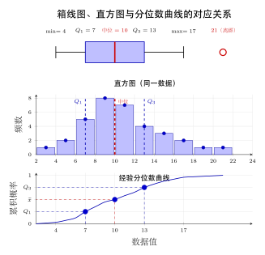
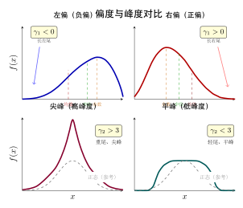

# 第 14 章 描述统计（融合版）

> **难度**：★★★☆☆
> **前置知识**：第 4 章离散随机变量、第 5 章连续随机变量、基本微积分
> **本文件**：融合"原版严格推导 + 重写版高中模板 D 速记 / 套路 / 自测"。保留原版完整正文（学习目标 / 14.1–14.5 / 深度学习应用 / 练习题）+ 在最前置 + 最后追加思维训练。

> **一例速记**：
> **位置度量**：均值 $\bar{x} = \frac{1}{n}\sum x_i$（最小化平方偏差）；中位数 $M$（最小化绝对偏差，稳健）；众数 Mo（最高频率）。
> **散布度量**：样本方差 $s^2 = \frac{1}{n-1}\sum(x_i-\bar{x})^2$；标准差 $s$；$\text{IQR} = Q_3 - Q_1$（稳健）；$\text{MAD} = \frac{1}{n}\sum\vert x_i - \bar{x}\vert$。
> **分位数**：$Q_p$ 满足至少 $p$ 比例数据不超过它；箱线图异常值准则：$< Q_1 - 1.5\,\text{IQR}$ 或 $> Q_3 + 1.5\,\text{IQR}$。
> **形状度量**：偏度 $\gamma_1 = \mu_3/\sigma^3$（右偏 $> 0$，左偏 $< 0$）；超额峰度 $\kappa = \mu_4/\sigma^4 - 3$（尖峰厚尾 $> 0$）。
> **相关性**：Pearson $r \in [-1,1]$，度量线性关系；Spearman $r_s$，度量单调关系（稳健）。

---

## 引入：为什么收入统计用中位数而非均值？

> **题目**：某城市 9 名居民的年收入（万元）为：$5, 6, 7, 8, 9, 10, 11, 12, 200$。
>
> (1) 计算均值 $\bar{x}$ 和中位数 $M$；
> (2) 去掉收入为 200 的富人后，均值和中位数各变化多少？
> (3) 国家统计局在报告"居民平均收入"时，为什么选用中位数？

请先停下来想一想：**哪个指标更能代表普通居民的收入水平？**

直觉回答"均值"？试试计算：$\bar{x} = (5+6+7+8+9+10+11+12+200)/9 = 268/9 \approx 29.8$（万元）。但 9 人中有 8 人的收入低于这个"平均"！中位数 $M = 9$ 万元才是更接近多数人实际情况的描述。

**均值受异常值影响有多大？** 仅一个 200 万元的观测就把均值从"典型值"拉到了让 8/9 的人"低于平均"——这就是描述统计选择的核心权衡。下面把解题内心独白完整还原。

---

## 思维路径还原（如何选择合适的描述统计量）

> "拿到一批数据，**第一步**：看数据的类型。
>
> 是**分类数据**（性别、颜色）？→ 只有众数有意义，均值和中位数无意义。
>
> 是**有序数据**（评分 1-5）？→ 中位数合理，均值可用但需谨慎。
>
> 是**连续数值数据**？→ 进入下一步判断。
>
> **第二步**：有没有极端值（异常值）？快速方法——画箱线图看须之外的点，或计算 $z$ 分数 $\vert (x - \bar{x})/s \vert > 3$ 的点。
>
> 有异常值或分布明显偏态？→ 选中位数（位置），选 IQR 或 MAD（散布）；均值和标准差会被拉偏。
>
> 分布近似对称、无极端值？→ 均值（位置）、标准差（散布）更好，因为它们利用了所有数据信息，数学性质优良（无偏、有效）。
>
> **第三步**：需要刻画形状吗？计算偏度 $\gamma_1$ 和超额峰度 $\kappa$。
>
> $\vert \gamma_1 \vert > 1$：分布明显偏斜，用中位数和 IQR 更合适。
>
> $\kappa \gg 0$：尖峰厚尾（如金融收益率），方差估计不稳定，需要稳健方案。
>
> **第四步**：需要看多变量关系吗？先画散点图，再计算 Pearson $r$（线性关系）或 Spearman $r_s$（非线性单调关系）。
>
> 注意：**$r = 0$ 不意味着独立**，只排除线性相关！相关也不等于因果！
>
> **总结口诀**：类型→异常值→形状→关系，四步走。对称无异常值用均值/标准差；偏态有异常值用中位数/IQR；关系分析先画图后算相关系数。"

---

## 学习目标

学完本章后，你将能够：

- 掌握均值、中位数、众数等位置度量的定义与计算，理解它们在不同分布下的适用场景
- 理解方差、标准差、极差与四分位距等散布度量的含义，能用它们刻画数据的离散程度
- 了解偏度与峰度的含义，能通过这两个指标判断数据分布的形状特征
- 熟练运用直方图、箱线图、QQ图等可视化工具探索数据的分布规律
- 将描述统计应用于深度学习中的数据探索、特征工程与异常检测任务

---

## 14.1 位置度量

### 引入：数据的"中心"在哪里？

在收集到一批数据后，首要任务往往是找到数据的**中心位置**——一个能代表整体水平的典型值。根据数据的性质和使用目的，"中心"有多种定义方式。

设 $x_1, x_2, \ldots, x_n$ 为来自某总体的 $n$ 个观测值。

### 均值

**样本均值**（Sample Mean）是最常用的位置度量：

$$
\bar{x} = \frac{1}{n} \sum_{i=1}^{n} x_i
$$

均值是数据的重心，对数据中的每个点赋予相同权重。

**性质：**

- **线性性**：若 $y_i = a x_i + b$，则 $\bar{y} = a\bar{x} + b$
- **最小化平方偏差**：$\bar{x}$ 是使 $\sum_{i=1}^{n}(x_i - c)^2$ 最小的 $c$
- **对异常值敏感**：一个极端值可以显著改变均值

**加权均值：** 若每个观测 $x_i$ 具有权重 $w_i > 0$，则：

$$
\bar{x}_w = \frac{\sum_{i=1}^{n} w_i x_i}{\sum_{i=1}^{n} w_i}
$$

**总体均值**（期望）是理论对应物：

$$
\mu = \mathbb{E}[X] = \begin{cases} \sum_k k \cdot P(X = k) & \text{（离散）} \\ \int_{-\infty}^{+\infty} x f(x) \, dx & \text{（连续）} \end{cases}
$$

### 中位数

将数据从小到大排序后，**中位数**（Median）是位于中间位置的值：

$$
M = \begin{cases}
x_{((n+1)/2)} & \text{若 } n \text{ 为奇数} \\
\dfrac{x_{(n/2)} + x_{(n/2+1)}}{2} & \text{若 } n \text{ 为偶数}
\end{cases}
$$

其中 $x_{(1)} \leq x_{(2)} \leq \cdots \leq x_{(n)}$ 为**顺序统计量**（order statistics）。

**性质：**

- **对异常值稳健**：改变最大或最小值不影响中位数
- **最小化绝对偏差**：中位数是使 $\sum_{i=1}^{n}|x_i - c|$ 最小的 $c$
- **对称分布时** $M = \mu$

### 众数

**众数**（Mode）是数据中出现频率最高的值。对于连续分布，众数是密度函数的极大值点：

$$
\text{Mo} = \arg\max_x f(x)
$$

- 数据可能存在多个众数（多峰分布）
- 适合描述分类数据或离散数据

### 三者的关系与比较

对于**右偏分布**（正偏）：众数 $<$ 中位数 $<$ 均值

对于**左偏分布**（负偏）：均值 $<$ 中位数 $<$ 众数

对于**对称分布**：众数 $=$ 中位数 $=$ 均值

| 度量 | 优点 | 缺点 | 适用场景 |
|------|------|------|----------|
| 均值 | 利用所有信息，数学性质好 | 对异常值敏感 | 对称、无极端值数据 |
| 中位数 | 稳健，不受极端值影响 | 忽略极端信息 | 偏态数据、含异常值数据 |
| 众数 | 直观，适合分类 | 可能不唯一 | 分类数据、多峰分布 |

### 分位数

**$p$ 分位数**（Quantile）$Q_p$ 满足：至少有 $p$ 比例的数据不超过 $Q_p$，至少有 $1-p$ 比例的数据不小于 $Q_p$。

常用分位数：
- **四分位数**：$Q_1$（25%），$Q_2$（50% = 中位数），$Q_3$（75%）
- **十分位数**：$D_1, D_2, \ldots, D_9$
- **百分位数**：$P_1, P_2, \ldots, P_{99}$

---

## 14.2 散布度量

### 引入：数据有多"分散"？

两组数据可以有相同的均值，却有完全不同的离散程度。散布度量刻画数据偏离中心的程度。

### 方差与标准差

**样本方差**（Sample Variance）：

$$
s^2 = \frac{1}{n-1} \sum_{i=1}^{n} (x_i - \bar{x})^2
$$

分母使用 $n-1$（而非 $n$）是为了得到总体方差的**无偏估计**（将在第15章详细讨论）。

**总体方差**（Population Variance）：

$$
\sigma^2 = \mathbb{E}\!\left[(X - \mu)^2\right]
$$

**标准差**（Standard Deviation）是方差的平方根，与原数据量纲相同：

$$
s = \sqrt{s^2}, \qquad \sigma = \sqrt{\sigma^2}
$$

**计算公式（简化形式）：**

$$
s^2 = \frac{1}{n-1}\left(\sum_{i=1}^{n} x_i^2 - n\bar{x}^2\right)
$$

**变异系数**（Coefficient of Variation，CV）是标准差与均值之比，消除了量纲影响：

$$
CV = \frac{s}{|\bar{x}|} \times 100\%
$$

### 极差

**极差**（Range）是最大值与最小值之差：

$$
R = x_{(n)} - x_{(1)}
$$

极差计算简单，但仅利用两个端点信息，对异常值极敏感。

### 四分位距

**四分位距**（Interquartile Range，IQR）定义为：

$$
\text{IQR} = Q_3 - Q_1
$$

IQR 包含了数据中间 50% 的范围，对异常值具有稳健性，是箱线图的核心度量。

**异常值检测规则（Tukey's fences）：**

$$
\text{下界} = Q_1 - 1.5 \cdot \text{IQR}, \qquad \text{上界} = Q_3 + 1.5 \cdot \text{IQR}
$$

超出此范围的点被标记为**疑似异常值**。

### 平均绝对偏差

**平均绝对偏差**（Mean Absolute Deviation，MAD）：

$$
\text{MAD} = \frac{1}{n}\sum_{i=1}^{n}|x_i - \bar{x}|
$$

相较于方差，MAD 对异常值更加稳健，但数学性质不如方差优良。

### 散布度量的比较

| 度量 | 公式 | 稳健性 | 适用场景 |
|------|------|--------|----------|
| 方差/标准差 | $s^2, s$ | 弱 | 正态分布，统计推断 |
| 极差 | $R$ | 很弱 | 快速估计，质量控制 |
| IQR | $Q_3 - Q_1$ | 强 | 偏态数据，含异常值 |
| MAD | $\frac{1}{n}\sum\vert x_i-\bar{x}\vert$ | 较强 | 稳健统计分析 |

---

## 14.3 形状度量

### 偏度

**偏度**（Skewness）衡量分布关于均值的**不对称程度**。样本偏度的定义为：

$$
\text{Skew} = \frac{1}{n} \sum_{i=1}^{n} \left(\frac{x_i - \bar{x}}{s}\right)^3
$$

这是标准化三阶中心矩。总体偏度为：

$$
\gamma_1 = \mathbb{E}\!\left[\left(\frac{X - \mu}{\sigma}\right)^3\right] = \frac{\mu_3}{\sigma^3}
$$

其中 $\mu_3 = \mathbb{E}[(X-\mu)^3]$ 为三阶中心矩。

**解读：**
- $\gamma_1 = 0$：对称分布（如正态分布）
- $\gamma_1 > 0$：**右偏**（正偏），右尾更长，均值大于中位数
- $\gamma_1 < 0$：**左偏**（负偏），左尾更长，均值小于中位数

**常见分布的偏度：**
- 正态分布：$\gamma_1 = 0$
- 指数分布（参数 $\lambda$）：$\gamma_1 = 2$
- 均匀分布：$\gamma_1 = 0$
- 对数正态分布：$\gamma_1 = (e^{\sigma^2}+2)\sqrt{e^{\sigma^2}-1} > 0$

### 峰度

**峰度**（Kurtosis）衡量分布尾部的**厚薄程度**和峰顶的**尖锐程度**。总体峰度为：

$$
\gamma_2 = \mathbb{E}\!\left[\left(\frac{X - \mu}{\sigma}\right)^4\right] = \frac{\mu_4}{\sigma^4}
$$

其中 $\mu_4 = \mathbb{E}[(X-\mu)^4]$ 为四阶中心矩。

**超额峰度**（Excess Kurtosis）以正态分布（峰度 = 3）为基准：

$$
\kappa = \gamma_2 - 3
$$

**解读：**
- $\kappa = 0$：正态峰（mesokurtic），如正态分布
- $\kappa > 0$：**尖峰厚尾**（leptokurtic），尾部概率更大，如 $t$ 分布
- $\kappa < 0$：**平峰薄尾**（platykurtic），尾部概率更小，如均匀分布

**常见分布的超额峰度：**
- 正态分布：$\kappa = 0$
- $t(k)$ 分布：$\kappa = \frac{6}{k-4}$（$k > 4$），随自由度增加趋近于 0
- 均匀分布：$\kappa = -\frac{6}{5}$
- 拉普拉斯分布：$\kappa = 3$

### 正态性检验的统计量

偏度和峰度是检验数据是否来自正态分布的重要工具。**Jarque-Bera 检验**统计量为：

$$
JB = \frac{n}{6}\left[\text{Skew}^2 + \frac{(\kappa)^2}{4}\right]
$$

在正态假设下，$JB \xrightarrow{d} \chi^2(2)$。

---

## 14.4 数据可视化

### 直方图

**直方图**（Histogram）将数据划分为若干区间（bins），用矩形的面积（或高度）表示各区间的频率（或频数）。

设将数据范围 $[a, b]$ 划分为 $k$ 个等宽区间，每个区间宽度 $h = (b-a)/k$，第 $j$ 个区间 $[a+(j-1)h,\, a+jh)$ 中有 $n_j$ 个数据点，则：

$$
\text{频率密度} = \frac{n_j / n}{h}
$$

直方图面积之和为 1，当 $n \to \infty$，$h \to 0$ 时，直方图收敛到总体的概率密度函数。

**区间数的选择规则：**
- **Sturges 规则**：$k = \lceil 1 + \log_2 n \rceil$
- **Scott 规则**：$h = 3.5s \cdot n^{-1/3}$（最小化均方积分误差）
- **Freedman-Diaconis 规则**：$h = 2 \cdot \text{IQR} \cdot n^{-1/3}$（更稳健）

**核密度估计**（KDE）是直方图的光滑版本：

$$
\hat{f}(x) = \frac{1}{nh} \sum_{i=1}^{n} K\!\left(\frac{x - x_i}{h}\right)
$$

其中 $K(\cdot)$ 为核函数（常用 Gaussian 核），$h$ 为带宽。

### 箱线图

**箱线图**（Box Plot，又称 Box-and-Whisker Plot）用五个数字汇总数据：

$$
\{\min^*, Q_1, Q_2, Q_3, \max^*\}
$$

其中 $\min^*$ 和 $\max^*$ 为去除异常值后的最小最大值（即 Tukey's fences 内的端点）。

**箱线图的构成：**
- **箱体**（Box）：从 $Q_1$ 到 $Q_3$，高度为 IQR
- **中线**（Median line）：$Q_2$ 处的横线
- **须**（Whiskers）：从箱体延伸到 $Q_1 - 1.5\cdot\text{IQR}$ 和 $Q_3 + 1.5\cdot\text{IQR}$ 之内最远的数据点
- **异常值**：须之外的点，用单独符号标出

**箱线图的用途：**
- 快速了解数据分布的位置、散布和偏态
- 对比多组数据的分布差异
- 识别潜在异常值

### QQ 图

**QQ 图**（Quantile-Quantile Plot）通过对比样本分位数与理论分位数，检验数据是否来自某一理论分布（常用正态分布）。

**正态 QQ 图的构造：**

1. 将样本 $x_1, \ldots, x_n$ 从小到大排序，得顺序统计量 $x_{(1)} \leq \cdots \leq x_{(n)}$
2. 计算经验分位数对应的理论正态分位数：

$$
q_i = \Phi^{-1}\!\left(\frac{i - 0.5}{n}\right)
$$

（常用 Blom 修正：$(i - 3/8)/(n + 1/4)$）

3. 以 $q_i$ 为横轴，$x_{(i)}$ 为纵轴画散点图

**解读：**
- 若点大致落在一条直线上，则数据近似正态
- 上方弯曲（heavy upper tail）：右尾比正态厚
- 下方弯曲（heavy lower tail）：左尾比正态厚
- S 形曲线：数据比正态具有更厚的双尾（高峰度）

### 其他常用图形

**茎叶图**（Stem-and-Leaf Plot）：在展示直方图信息的同时保留原始数据值，适合小数据集。

**散点图**（Scatter Plot）：展示两个变量之间的关系，是发现相关性和模式的基本工具。

**累积分布图**（ECDF）：经验累积分布函数：

$$
F_n(x) = \frac{1}{n} \sum_{i=1}^{n} \mathbf{1}[x_i \leq x]
$$

由 Glivenko-Cantelli 定理，$\sup_x |F_n(x) - F(x)| \xrightarrow{a.s.} 0$。

---

## 14.5 多变量数据描述

### 协方差与相关系数

对于 $n$ 对观测 $(x_1, y_1), \ldots, (x_n, y_n)$，**样本协方差**为：

$$
s_{XY} = \frac{1}{n-1} \sum_{i=1}^{n} (x_i - \bar{x})(y_i - \bar{y})
$$

**Pearson 相关系数**消除了量纲影响：

$$
r = \frac{s_{XY}}{s_X s_Y} = \frac{\sum_{i=1}^{n}(x_i - \bar{x})(y_i - \bar{y})}{\sqrt{\sum_{i=1}^{n}(x_i-\bar{x})^2 \cdot \sum_{i=1}^{n}(y_i-\bar{y})^2}}
$$

**性质：**
- $-1 \leq r \leq 1$（Cauchy-Schwarz 不等式保证）
- $r = \pm 1$ 当且仅当 $y_i = ax_i + b$（完全线性关系）
- $r = 0$ 不意味着独立（只排除线性相关）

**Spearman 秩相关系数**（对非线性单调关系更稳健）：

$$
r_s = 1 - \frac{6\sum_{i=1}^{n} d_i^2}{n(n^2-1)}
$$

其中 $d_i$ 为 $x_i$ 与 $y_i$ 的秩之差。

### 协方差矩阵

对于 $p$ 维随机向量 $\mathbf{X} = (X_1, \ldots, X_p)^\top$，**协方差矩阵**（Covariance Matrix）为：

$$
\boldsymbol{\Sigma} = \operatorname{Cov}(\mathbf{X}) = \mathbb{E}\!\left[(\mathbf{X} - \boldsymbol{\mu})(\mathbf{X} - \boldsymbol{\mu})^\top\right]
$$

其中 $\Sigma_{ij} = \operatorname{Cov}(X_i, X_j)$，对角元素 $\Sigma_{ii} = \operatorname{Var}(X_i)$。

**样本协方差矩阵：**

$$
\mathbf{S} = \frac{1}{n-1} \sum_{i=1}^{n} (\mathbf{x}_i - \bar{\mathbf{x}})(\mathbf{x}_i - \bar{\mathbf{x}})^\top = \frac{1}{n-1} \mathbf{X}_c^\top \mathbf{X}_c
$$

其中 $\mathbf{X}_c$ 是中心化后的数据矩阵（每列减去均值）。

协方差矩阵是**半正定对称矩阵**（positive semi-definite symmetric matrix）。

### 相关矩阵

**相关矩阵**（Correlation Matrix）是标准化的协方差矩阵：

$$
\mathbf{R} = \mathbf{D}^{-1/2} \boldsymbol{\Sigma} \mathbf{D}^{-1/2}
$$

其中 $\mathbf{D} = \operatorname{diag}(\sigma_1^2, \ldots, \sigma_p^2)$，$R_{ij} = \rho_{ij} \in [-1, 1]$。

### 多变量可视化

- **散点图矩阵**（Scatter Plot Matrix / Pairs Plot）：对角线为各变量直方图/KDE，非对角线为两两散点图
- **热力图**（Heatmap）：用颜色编码相关矩阵，直观展示变量间的线性关系
- **平行坐标图**（Parallel Coordinates）：适合高维数据的模式识别
- **主成分分析（PCA）投影**：将高维数据投影到二维，保留最大方差方向

---

## 几何示意

### 图 14-1：箱线图 + 直方图 + 分位数对照（一图三视图）



三视图从不同角度展示同一批数据的分布特征：
- **左图（箱线图）**：五数摘要 $\{\min^*, Q_1, Q_2, Q_3, \max^*\}$，直观呈现中心、散布和异常值
- **中图（直方图 + KDE）**：显示频率密度的整体形状，可直观判断偏态方向
- **右图（分位数对照）**：$Q_1$、$Q_2$、$Q_3$ 在直方图上的位置，揭示左右不对称性

### 图 14-2：偏度与峰度示意（左偏 / 对称 / 右偏 + 尖峰 / 平峰对比）



- **上排（偏度）**：左偏分布（均值 $<$ 中位数）、对称分布（均值 $=$ 中位数）、右偏分布（均值 $>$ 中位数）
- **下排（峰度）**：平峰薄尾（$\kappa < 0$，如均匀分布）、正态峰（$\kappa = 0$）、尖峰厚尾（$\kappa > 0$，如 $t$ 分布）

---

## 抽象成方法（套路总结）

### 7 大核心公式速查

| 名称 | 公式 | 关键性质 |
|------|------|----------|
| **样本均值** | $\bar{x} = \frac{1}{n}\sum x_i$ | 最小化 $\sum(x_i-c)^2$，对异常值敏感 |
| **中位数** | $M = x_{((n+1)/2)}$（奇数） | 最小化 $\sum\vert x_i-c\vert$，稳健 |
| **样本方差** | $s^2 = \frac{1}{n-1}\sum(x_i-\bar{x})^2$ | 分母 $n-1$ 保证无偏；单位为原始单位平方 |
| **IQR** | $Q_3 - Q_1$ | 对异常值稳健；正态分布时 $\approx 1.349\sigma$ |
| **偏度** | $\gamma_1 = \mu_3 / \sigma^3$ | 右偏 $> 0$，左偏 $< 0$，对称 $= 0$ |
| **超额峰度** | $\kappa = \mu_4/\sigma^4 - 3$ | $> 0$ 尖峰厚尾，$< 0$ 平峰薄尾 |
| **Pearson $r$** | $r = s_{XY}/(s_X s_Y)$ | $\in [-1,1]$；$r=0$ 不等于独立 |

### "选统计量" 4 步流程

1. **判数据类型**：分类 → 众数；有序 → 中位数；连续数值 → 继续
2. **查异常值**：箱线图或 $|z| > 3$；有异常值 → 中位数 / IQR；无 → 均值 / 标准差
3. **量化形状**：计算 $\gamma_1$（偏度）和 $\kappa$（超额峰度）；$|\gamma_1| > 1$ 建议稳健统计量
4. **分析关系**：先散点图看形态；线性关系用 Pearson $r$；非线性单调用 Spearman $r_s$

---

## 方法变形

### 变形 1：稳健统计

当数据包含异常值或分布严重偏态时，用"稳健"替代方案：

- 均值 → 中位数；标准差 → IQR 或 MAD
- 正态分布下 $\hat{\sigma} = \text{IQR}/1.349$（稳健标准差估计）
- Pearson $r$ → Spearman $r_s$（排秩后计算，异常值影响被抑制）

### 变形 2：加权统计

数据来自不等权重样本（调查抽样、重要性加权等）时：

$$
\bar{x}_w = \frac{\sum w_i x_i}{\sum w_i}, \qquad s_w^2 = \frac{\sum w_i (x_i - \bar{x}_w)^2}{\sum w_i - 1}
$$

加权均值满足线性性 $\overline{ax+b}_w = a\bar{x}_w + b$；$w_i = 1$ 时退化为普通均值。

### 变形 3：分组统计

当原始数据以频率表（分组数据）给出时，设第 $j$ 组组中值为 $m_j$，频率为 $f_j$：

$$
\bar{x} \approx \sum_j f_j m_j, \qquad s^2 \approx \sum_j f_j (m_j - \bar{x})^2
$$

这是连续数据分组处理的近似，组距越小近似越精确。

### 变形 4：相关性度量的推广

- **Kendall's $\tau$**：基于一致对/不一致对计数，比 Spearman 更稳健但计算量更大
- **偏相关系数**（Partial Correlation）：控制第三个变量后，$X$ 与 $Y$ 的净相关：$r_{XY \cdot Z}$
- **点二列相关**：一个连续变量与一个二元变量（0/1）之间的相关
- **距离相关**（Distance Correlation）：$r_{\text{dist}} = 0$ 等价于独立，能检测非线性关系

---

## 本章小结

本章系统介绍了描述统计的核心工具：

1. **位置度量**：均值（最小化平方偏差）、中位数（最小化绝对偏差，对异常值稳健）、众数（最高频率值）；分位数是这些概念的推广。

2. **散布度量**：方差/标准差刻画数据与均值的平均偏离；IQR 和 MAD 是稳健替代；极差简单但脆弱。

3. **形状度量**：偏度（三阶标准矩）描述不对称性；峰度（四阶标准矩）描述尾部厚薄；Jarque-Bera 统计量结合两者用于正态性检验。

4. **可视化**：直方图和 KDE 展示一维分布；箱线图提供五数摘要并标示异常值；QQ 图检验分布假设；散点图和相关热力图探索多变量关系。

5. **多变量描述**：Pearson 相关系数度量线性关系；协方差矩阵是多变量统计的基础结构；散点图矩阵是多变量探索的标准工具。

---

## 思考路标（条件反射）

1. 看到"平均工资"/"平均房价"等社会经济数据 → 立刻问：是均值还是中位数？若右偏严重，中位数更能代表多数人的情况
2. 看到均值和中位数差距大 → 分布有偏斜，或存在异常值；差值方向揭示偏斜方向
3. 看到方差分母 $n-1$ → Bessel 修正，保证无偏性；计算机/总体公式用 $n$，样本估计用 $n-1$
4. 看到标准差的单位 → 与原数据相同；方差的单位是原数据的平方；用变异系数 CV 做无量纲比较
5. 看到偏度 $\gamma_1 > 0$ → 右偏，长尾在右，均值被高值拉大；收入、房价、等待时间常见
6. 看到峰度 $\kappa > 0$ → 尖峰厚尾（leptokurtic）；金融收益率常见，说明极端值比正态更频繁
7. 看到箱线图异常值点 → 先确认是真异常值还是录入错误；再决定保留/删除/稳健处理
8. 看到 QQ 图点大致在直线上 → 数据近似正态；两端弯曲方向揭示厚尾/薄尾特征
9. 看到相关系数 $r = 0$ → 不等于独立！只排除线性关系；可能存在非线性关系（如 $U$ 形）
10. 看到高相关 $r \approx 1$ → 不等于因果！可能是共同原因、辛普森悖论等
11. 看到 IQR 被用于异常值检测 → Tukey's fences: $[Q_1 - 1.5\,\text{IQR},\, Q_3 + 1.5\,\text{IQR}]$；对正态数据约排除 0.7% 的点
12. 看到多变量数据 → 协方差矩阵必须是半正定的；若出现负定，检查数据或计算错误

---

## 易错点

1. **均值 vs 中位数的选择错误**：对明显偏态的数据（收入、房价、等待时间）用均值汇报，会造成大多数人"低于平均"的感知误导；检查：若 $\vert\bar{x} - M\vert / s > 0.3$，优先报告中位数。

2. **$n-1$ vs $n$ 混淆**：样本方差分母用 $n-1$（Bessel 修正，无偏估计）；若用 $n$ 计算会系统性低估总体方差；NumPy 默认 `ddof=0`（用 $n$），统计推断应设 `ddof=1`。

3. **标准差的单位问题**：标准差与原数据同单位（元、厘米等），方差是原数据单位的平方——直接用方差比较不同量纲数据没有意义；应用变异系数 $CV = s/|\bar{x}|$ 做无量纲比较。

4. **偏度方向与均值/中位数关系**：右偏（$\gamma_1 > 0$）时均值 $>$ 中位数 $>$ 众数，而非"均值在左"；记忆口诀：偏向哪边，均值就被那边的长尾拉向哪边。

5. **相关 vs 因果的混淆**：$r(X, Y) \approx 1$ 不意味着 $X$ 导致 $Y$；冰淇淋销量与溺水事故高度相关（共同原因：夏季气温）；建立因果关系需要随机对照实验或因果推断框架，描述统计只能揭示关联。

---

## 典型应用例题

### 例 1：异常值对均值和方差的影响

> **题目**：数据集 $A = \{2, 3, 4, 5, 6\}$，数据集 $B$ 由 $A$ 中最大值 $6$ 替换为 $60$ 得到。
>
> (a) 分别计算 $A$ 和 $B$ 的均值、中位数、样本标准差、IQR。
> (b) 计算异常值（60）对均值的拉偏量（以标准差为单位）。
> (c) 哪些统计量在此替换下完全不变？

**【思路】** 逐项计算，比较变化幅度，理解稳健性。

**【解】**

数据集 $A$（排序后 $2,3,4,5,6$）：

$$
\bar{x}_A = \frac{2+3+4+5+6}{5} = 4, \quad M_A = 4
$$

$$
s_A^2 = \frac{(2-4)^2+(3-4)^2+(4-4)^2+(5-4)^2+(6-4)^2}{4} = \frac{4+1+0+1+4}{4} = 2.5, \quad s_A \approx 1.58
$$

$$
Q_{1,A} = 2.5,\quad Q_{3,A} = 5.5,\quad \text{IQR}_A = 3
$$

数据集 $B$（排序后 $2,3,4,5,60$）：

$$
\bar{x}_B = \frac{2+3+4+5+60}{5} = 14.8, \quad M_B = 4
$$

$$
s_B^2 = \frac{(2-14.8)^2+(3-14.8)^2+(4-14.8)^2+(5-14.8)^2+(60-14.8)^2}{4} = \frac{163.84+139.24+116.64+96.04+2043.04}{4} = 639.7
$$

$$
s_B \approx 25.29,\quad Q_{1,B} = 2.5,\quad Q_{3,B} = 5.5,\quad \text{IQR}_B = 3
$$

**(b)** 异常值 60 使均值从 4 变为 14.8，拉偏量约为 $|14.8 - 4| / 25.29 \approx 0.43$ 个标准差——看似不大，但若用 $A$ 的标准差衡量则为 $(14.8-4)/1.58 \approx 6.8$ 个标准差，说明均值已严重偏离原数据集中心。

**(c)** **中位数**（$M = 4$）和 **IQR**（$= 3$）在替换后**完全不变**，体现稳健统计量对异常值的免疫性。

**【答案】** $\boxed{\text{中位数和 IQR 不变，均值从 4 变为 14.8，标准差从 1.58 变为 25.29}}$

---

### 例 2：偏态分布下统计量的选择

> **题目**：某城市 1000 人的月收入数据（单位：千元）服从对数正态分布 $\ln X \sim N(2, 0.6^2)$。
>
> (a) 计算总体均值 $E[X]$ 和中位数 $M$（用对数正态公式）。
> (b) 计算偏度 $\gamma_1$（对数正态分布的偏度公式）。
> (c) 基于以上结果，哪个统计量更适合报告"典型收入"？

**【思路】** 利用对数正态分布的公式，判断偏斜程度，据此选择统计量。

**【解】**

设 $\ln X \sim N(\mu_0, \sigma_0^2)$，其中 $\mu_0 = 2$，$\sigma_0 = 0.6$。

**(a)** 对数正态分布的期望和中位数：

$$
E[X] = e^{\mu_0 + \sigma_0^2/2} = e^{2 + 0.18} = e^{2.18} \approx 8.85 \text{（千元）}
$$

$$
M = e^{\mu_0} = e^2 \approx 7.39 \text{（千元）}
$$

**(b)** 对数正态分布的偏度：

$$
\gamma_1 = (e^{\sigma_0^2} + 2)\sqrt{e^{\sigma_0^2} - 1} = (e^{0.36} + 2)\sqrt{e^{0.36} - 1} \approx (1.433 + 2)\sqrt{0.433} \approx 3.433 \times 0.658 \approx 2.26
$$

**(c)** 偏度 $\gamma_1 \approx 2.26 \gg 0$，分布严重右偏。均值 8.85 千元高于中位数 7.39 千元约 20%，说明少数高收入者将均值拉高。**中位数 7.39 千元**更能代表大多数人的"典型收入"水平。

**【答案】** $\boxed{E[X] \approx 8.85\text{ 千元},\ M \approx 7.39\text{ 千元},\ \gamma_1 \approx 2.26,\ \text{应选中位数}}$

---

### 例 3：相关系数的计算与解读

> **题目**：5 名学生的数学成绩 $X$ 和物理成绩 $Y$（百分制）如下：
>
> | 学生 | 1 | 2 | 3 | 4 | 5 |
> |------|---|---|---|---|---|
> | 数学 $X$ | 70 | 80 | 90 | 60 | 85 |
> | 物理 $Y$ | 65 | 75 | 88 | 58 | 80 |
>
> (a) 计算 Pearson 相关系数 $r$；
> (b) 计算 Spearman 秩相关系数 $r_s$；
> (c) 某同学说"数学成绩高导致物理成绩高"，评价此说法。

**【思路】** 按公式分步计算，最后讨论相关与因果的区别。

**【解】**

**(a)** 计算均值：

$$
\bar{x} = (70+80+90+60+85)/5 = 77, \quad \bar{y} = (65+75+88+58+80)/5 = 73.2
$$

计算各项偏差乘积及平方：

$$\sum(x_i-\bar{x})(y_i-\bar{y}) = (-7)(-8.2)+3(1.8)+13(14.8)+(-17)(-15.2)+8(6.8)$$
$$= 57.4+5.4+195.4+258.4+54.4 = 571$$

$$\sum(x_i-\bar{x})^2 = 49+9+169+289+64 = 580$$

$$\sum(y_i-\bar{y})^2 = 67.24+3.24+219.04+231.04+46.24 = 566.8$$

$$r = \frac{571}{\sqrt{580 \times 566.8}} = \frac{571}{\sqrt{328744}} \approx \frac{571}{573.36} \approx 0.996$$

**(b)** 数学成绩秩（从小到大）：$60\to 1,\ 70\to 2,\ 80\to 3,\ 85\to 4,\ 90\to 5$，对应学生顺序（1,2,3,4,5）的秩为 $(2,3,5,1,4)$。

物理成绩秩：$58\to 1,\ 65\to 2,\ 75\to 3,\ 80\to 4,\ 88\to 5$，对应学生顺序的秩为 $(2,3,5,1,4)$。

$d_i = 0$ 对所有学生，故：

$$r_s = 1 - \frac{6 \times 0}{5(25-1)} = 1$$

**(c)** 虽然 $r \approx 0.996$ 和 $r_s = 1$ 都极高，但**相关不等于因果**。数学和物理成绩高度相关，可能的共同原因有：学习能力、学习习惯、家庭教育环境等。要验证"数学成绩提高导致物理成绩提高"，需要控制变量的实验设计，而非仅靠观察性相关。

**【答案】** $\boxed{r \approx 0.996,\ r_s = 1}$；高相关不等于因果，评价有误。

---

## 深度学习应用

### 14.A 数据探索（Exploratory Data Analysis）

在训练深度学习模型之前，数据探索是不可跳过的步骤。以下代码展示如何对 MNIST-like 图像数据集进行描述统计分析。

```python
import torch
import torch.nn as nn
import numpy as np
import matplotlib.pyplot as plt
from torchvision import datasets, transforms
from torch.utils.data import DataLoader

# 加载数据集
transform = transforms.ToTensor()
dataset = datasets.MNIST(root='./data', train=True, download=True, transform=transform)
loader = DataLoader(dataset, batch_size=10000, shuffle=False)

# 获取所有像素值
all_pixels = []
all_labels = []
for images, labels in loader:
    # images: [B, 1, 28, 28]
    all_pixels.append(images.view(images.size(0), -1))  # [B, 784]
    all_labels.append(labels)

pixels = torch.cat(all_pixels, dim=0).numpy()  # [N, 784]
labels = torch.cat(all_labels, dim=0).numpy()

# 计算全局描述统计
def describe(x: np.ndarray, name: str = "数据"):
    print(f"\n{name} 描述统计（样本量 n={len(x)}）")
    print(f"  均值    = {x.mean():.4f}")
    print(f"  中位数  = {np.median(x):.4f}")
    print(f"  标准差  = {x.std(ddof=1):.4f}")
    print(f"  最小值  = {x.min():.4f}")
    print(f"  Q1      = {np.percentile(x, 25):.4f}")
    print(f"  Q3      = {np.percentile(x, 75):.4f}")
    print(f"  最大值  = {x.max():.4f}")
    print(f"  IQR     = {np.percentile(x, 75) - np.percentile(x, 25):.4f}")
    # 偏度和峰度
    n = len(x)
    z = (x - x.mean()) / x.std(ddof=1)
    skew = (z**3).mean()
    kurt = (z**4).mean() - 3.0  # 超额峰度
    print(f"  偏度    = {skew:.4f}")
    print(f"  超额峰度= {kurt:.4f}")

# 对每类数字的平均像素亮度进行分析
mean_brightness = pixels.mean(axis=1)  # 每张图的平均亮度
describe(mean_brightness, "图像平均亮度")

# 按类别分组分析
for cls in range(10):
    idx = labels == cls
    describe(mean_brightness[idx], f"类别 {cls}")

# 可视化：直方图 + KDE
fig, axes = plt.subplots(2, 5, figsize=(15, 6))
for cls, ax in enumerate(axes.flat):
    idx = labels == cls
    bright = mean_brightness[idx]
    ax.hist(bright, bins=40, density=True, alpha=0.6, color=f'C{cls}')
    ax.set_title(f'Digit {cls}')
    ax.set_xlabel('Mean Brightness')
ax.set_ylabel('Density')
plt.suptitle('MNIST 各类别亮度分布', fontsize=14)
plt.tight_layout()
plt.savefig('mnist_brightness_hist.png', dpi=150)
plt.show()
```

### 14.B 特征工程中的描述统计

在神经网络训练中，**批归一化**（Batch Normalization）本质上是对每个特征计算批次内的均值和标准差，然后进行标准化：

$$
\hat{x}_i = \frac{x_i - \mu_{\mathcal{B}}}{\sqrt{\sigma_{\mathcal{B}}^2 + \epsilon}}, \quad y_i = \gamma \hat{x}_i + \beta
$$

下面的代码展示如何手动实现 BatchNorm 并与 PyTorch 内置版本对比，加深对其统计含义的理解：

```python
import torch
import torch.nn as nn

class ManualBatchNorm1d(nn.Module):
    """手动实现的 BatchNorm1d，清晰展示描述统计的作用"""

    def __init__(self, num_features: int, eps: float = 1e-5, momentum: float = 0.1):
        super().__init__()
        self.num_features = num_features
        self.eps = eps
        self.momentum = momentum

        # 可学习参数：缩放 γ 和平移 β
        self.gamma = nn.Parameter(torch.ones(num_features))
        self.beta = nn.Parameter(torch.zeros(num_features))

        # 运行时统计（用于推理阶段）
        self.register_buffer('running_mean', torch.zeros(num_features))
        self.register_buffer('running_var', torch.ones(num_features))

    def forward(self, x: torch.Tensor) -> torch.Tensor:
        # x: [B, C] 或 [B, C, L]
        if self.training:
            # 训练时：计算批次内的均值（位置度量）和方差（散布度量）
            batch_mean = x.mean(dim=0)                         # μ_B
            batch_var = x.var(dim=0, unbiased=False)           # σ²_B

            # 更新运行时统计（用指数移动平均）
            self.running_mean = (1 - self.momentum) * self.running_mean + \
                                 self.momentum * batch_mean.detach()
            self.running_var  = (1 - self.momentum) * self.running_var  + \
                                 self.momentum * batch_var.detach()
        else:
            batch_mean = self.running_mean
            batch_var  = self.running_var

        # 标准化（z-score 变换）
        x_hat = (x - batch_mean) / torch.sqrt(batch_var + self.eps)

        # 仿射变换（恢复表达能力）
        return self.gamma * x_hat + self.beta

# 验证手动实现与 PyTorch 内置版本的一致性
torch.manual_seed(42)
x = torch.randn(32, 64)  # batch_size=32, features=64

manual_bn = ManualBatchNorm1d(64)
pytorch_bn = nn.BatchNorm1d(64)

# 同步初始参数
pytorch_bn.weight.data.copy_(manual_bn.gamma.data)
pytorch_bn.bias.data.copy_(manual_bn.beta.data)

manual_out = manual_bn(x)
pytorch_out = pytorch_bn(x)

print(f"最大差异: {(manual_out - pytorch_out).abs().max().item():.2e}")

# 打印批归一化前后的统计变化
print(f"\n归一化前：均值={x.mean():.4f}, 标准差={x.std():.4f}")
print(f"归一化后：均值={manual_out.mean():.4f}, 标准差={manual_out.std():.4f}")
```

### 14.C 异常检测

异常检测（Anomaly Detection）大量应用描述统计原理。下面实现基于自编码器（Autoencoder）的异常检测，并用统计方法分析重建误差的分布：

```python
import torch
import torch.nn as nn
import torch.optim as optim
import numpy as np
import matplotlib.pyplot as plt
from scipy import stats

# 自编码器定义
class Autoencoder(nn.Module):
    def __init__(self, input_dim: int = 784, latent_dim: int = 32):
        super().__init__()
        self.encoder = nn.Sequential(
            nn.Linear(input_dim, 256),
            nn.ReLU(),
            nn.BatchNorm1d(256),
            nn.Linear(256, latent_dim),
        )
        self.decoder = nn.Sequential(
            nn.Linear(latent_dim, 256),
            nn.ReLU(),
            nn.BatchNorm1d(256),
            nn.Linear(256, input_dim),
            nn.Sigmoid(),
        )

    def forward(self, x: torch.Tensor):
        z = self.encoder(x)
        return self.decoder(z)

def compute_reconstruction_errors(model: nn.Module,
                                   loader: torch.utils.data.DataLoader,
                                   device: str = 'cpu') -> np.ndarray:
    """计算所有样本的重建误差（每样本 MSE）"""
    model.eval()
    errors = []
    with torch.no_grad():
        for images, _ in loader:
            images = images.view(images.size(0), -1).to(device)
            recon = model(images)
            # 每个样本的均方误差（位置度量的应用）
            mse = ((recon - images) ** 2).mean(dim=1)
            errors.append(mse.cpu().numpy())
    return np.concatenate(errors)

def anomaly_detection_analysis(errors_normal: np.ndarray,
                                errors_anomaly: np.ndarray):
    """
    基于描述统计的异常检测分析

    策略：在正常数据上拟合重建误差的分布，
    然后将高误差的样本判定为异常
    """
    # 1. 描述统计分析
    print("正常样本重建误差统计：")
    print(f"  均值    = {errors_normal.mean():.6f}")
    print(f"  标准差  = {errors_normal.std():.6f}")
    print(f"  中位数  = {np.median(errors_normal):.6f}")
    print(f"  IQR     = {np.percentile(errors_normal, 75) - np.percentile(errors_normal, 25):.6f}")

    # 2. 用偏度/峰度判断分布形状（重建误差通常右偏）
    z = (errors_normal - errors_normal.mean()) / errors_normal.std()
    skewness = (z**3).mean()
    excess_kurtosis = (z**4).mean() - 3
    print(f"  偏度    = {skewness:.4f}  （>0 表示右偏，符合误差分布预期）")
    print(f"  超额峰度= {excess_kurtosis:.4f}")

    # 3. 设定阈值：均值 + k * 标准差（基于切比雪夫不等式或正态假设）
    # 方法 A：基于正态假设（99.7% 置信区间）
    threshold_3sigma = errors_normal.mean() + 3 * errors_normal.std()

    # 方法 B：基于 IQR（Tukey's fence，更稳健）
    q1, q3 = np.percentile(errors_normal, [25, 75])
    threshold_iqr = q3 + 1.5 * (q3 - q1)

    # 方法 C：基于分位数（直接取正常数据的高百分位）
    threshold_pct = np.percentile(errors_normal, 99)

    print(f"\n阈值对比：")
    print(f"  3σ 法则阈值  = {threshold_3sigma:.6f}")
    print(f"  IQR 法则阈值 = {threshold_iqr:.6f}")
    print(f"  99% 分位数   = {threshold_pct:.6f}")

    # 4. 检测率评估
    for name, thresh in [("3σ", threshold_3sigma),
                          ("IQR", threshold_iqr),
                          ("99%分位", threshold_pct)]:
        fp_rate = (errors_normal > thresh).mean()   # 假阳率（误报率）
        tp_rate = (errors_anomaly > thresh).mean()  # 真阳率（检出率）
        print(f"  {name}：假阳率={fp_rate:.3f}, 检出率={tp_rate:.3f}")

    # 5. 可视化：QQ 图检验重建误差的分布
    fig, axes = plt.subplots(1, 2, figsize=(12, 5))

    # 直方图对比
    axes[0].hist(errors_normal,  bins=60, alpha=0.6, label='正常样本', density=True)
    axes[0].hist(errors_anomaly, bins=60, alpha=0.6, label='异常样本', density=True)
    axes[0].axvline(threshold_3sigma, color='r', linestyle='--', label=f'3σ阈值')
    axes[0].set_xlabel('重建误差（MSE）')
    axes[0].set_ylabel('密度')
    axes[0].set_title('重建误差分布')
    axes[0].legend()

    # 正态QQ图（对数变换后更接近正态）
    log_errors = np.log(errors_normal + 1e-8)
    (osm, osr), (slope, intercept, r) = stats.probplot(log_errors, dist='norm')
    axes[1].scatter(osm, osr, alpha=0.3, s=5)
    axes[1].plot(osm, slope * np.array(osm) + intercept, 'r-', label=f'R²={r**2:.4f}')
    axes[1].set_xlabel('理论正态分位数')
    axes[1].set_ylabel('样本分位数（log误差）')
    axes[1].set_title('正态 QQ 图（对数重建误差）')
    axes[1].legend()

    plt.tight_layout()
    plt.savefig('anomaly_detection_stats.png', dpi=150)
    plt.show()

    return threshold_3sigma

# 演示：生成模拟数据进行异常检测分析
np.random.seed(42)
# 模拟正常样本重建误差（近似对数正态分布）
errors_normal  = np.random.lognormal(mean=-4, sigma=0.5, size=5000)
# 模拟异常样本（重建误差更大）
errors_anomaly = np.random.lognormal(mean=-2, sigma=0.8, size=500)

anomaly_detection_analysis(errors_normal, errors_anomaly)
```

---

## 练习题

**练习 14.1**（位置度量）

设样本数据为：$2, 4, 4, 4, 5, 5, 7, 9$。

(a) 计算样本均值 $\bar{x}$、中位数 $M$、众数 Mo。

(b) 若将最大值 $9$ 替换为 $90$，重新计算三个度量，并讨论哪个度量最稳健。

(c) 证明：对任意常数 $c$，有 $\sum_{i=1}^{n}(x_i - \bar{x})^2 \leq \sum_{i=1}^{n}(x_i - c)^2$。

<details>
<summary>点击展开 练习 14.1 答案</summary>

**(a)** 数据排序：$2, 4, 4, 4, 5, 5, 7, 9$，$n = 8$。

$$\bar{x} = \frac{2+4+4+4+5+5+7+9}{8} = 5, \quad M = \frac{4+5}{2} = 4.5, \quad \text{Mo} = 4$$

**(b)** 将 $9$ 替换为 $90$，新数据为 $2, 4, 4, 4, 5, 5, 7, 90$：

$$\bar{x}' = \frac{121}{8} = 15.125, \quad M' = 4.5, \quad \text{Mo}' = 4$$

中位数和众数完全不变，均值从 5 剧变为 15.125，说明**中位数和众数最稳健**。

**(c)** 展开：

$$\sum(x_i - c)^2 = \sum[(x_i - \bar{x}) + (\bar{x} - c)]^2 = \sum(x_i-\bar{x})^2 + n(\bar{x}-c)^2 \geq \sum(x_i-\bar{x})^2$$

等号当且仅当 $c = \bar{x}$ 时成立。$\blacksquare$

</details>

---

**练习 14.2**（散布度量）

设 $X \sim \text{Uniform}(a, b)$（均匀分布）。

(a) 计算总体方差 $\sigma^2$、IQR 和极差 $R$，用 $a, b$ 表示。

(b) 证明对均匀分布有 $\text{IQR} = R/2$，并说明这在何时成立、何时不成立。

(c) 对于正态分布 $\mathcal{N}(\mu, \sigma^2)$，证明 $\text{IQR} = 2\Phi^{-1}(0.75)\cdot\sigma \approx 1.349\sigma$，因此 $\hat{\sigma} = \text{IQR}/1.349$ 是 $\sigma$ 的稳健估计量。

<details>
<summary>点击展开 练习 14.2 答案</summary>

**(a)** $\sigma^2 = (b-a)^2/12$；$\text{IQR} = Q_{0.75} - Q_{0.25} = (b-a)/2$；$R = b-a$。

**(b)** 均匀分布的分位数线性，故 $\text{IQR} = R/2$ 成立。正态、指数等分布分位数非线性，此等式不成立。

**(c)** $Q_{0.75} - Q_{0.25} = \sigma(\Phi^{-1}(0.75) - \Phi^{-1}(0.25)) = 2\sigma\Phi^{-1}(0.75) \approx 1.349\sigma$，利用了对称性 $\Phi^{-1}(0.25) = -\Phi^{-1}(0.75)$。$\blacksquare$

</details>

---

**练习 14.3**（偏度与峰度）

设 $X \sim \text{Exp}(\lambda)$，概率密度为 $f(x) = \lambda e^{-\lambda x}$（$x > 0$）。

(a) 计算 $\mathbb{E}[X]$、$\operatorname{Var}(X)$、三阶中心矩 $\mu_3 = \mathbb{E}[(X-\mu)^3]$ 和偏度 $\gamma_1$。

(b) 计算四阶中心矩 $\mu_4 = \mathbb{E}[(X-\mu)^4]$ 和超额峰度 $\kappa$。

(c) 已知指数分布的矩母函数 $M(t) = \lambda/(\lambda - t)$（$t < \lambda$），利用此结果验证 (a)(b) 的计算。

<details>
<summary>点击展开 练习 14.3 答案</summary>

**(a)** $\mu = 1/\lambda$，$\sigma^2 = 1/\lambda^2$，$\mu_3 = 2/\lambda^3$，$\gamma_1 = 2$（右偏，不依赖 $\lambda$）。

**(b)** $\mu_4 = 9/\lambda^4$，峰度 $\gamma_2 = 9$，超额峰度 $\kappa = 6$（尖峰厚尾）。

**(c)** $M^{(k)}(0) = k!/\lambda^k$，与各阶矩一致。$\blacksquare$

</details>

---

**练习 14.4**（QQ 图与正态性）

已知 $n$ 个数据来自某分布，其顺序统计量满足经验分位数 $x_{(i)}$ 与正态理论分位数 $q_i = \Phi^{-1}((i-0.5)/n)$ 的线性关系：$x_{(i)} = \mu + \sigma q_i + \varepsilon_i$。

(a) 如果 QQ 图上的点大致沿直线分布，直线的斜率和截距分别估计了什么参数？

(b) 设 QQ 图显示数据点在右上角向上弯曲，这说明数据具有什么样的尾部特征？请从峰度角度解释。

(c) $t(3)$ 分布与 $\mathcal{N}(0,1)$ 相比，其 QQ 图（以正态分布为参考）会呈现什么形状？为什么？

<details>
<summary>点击展开 练习 14.4 答案</summary>

**(a)** 斜率估计**标准差** $\sigma$，截距估计**均值** $\mu$。

**(b)** 右上角向上弯曲表示右尾比正态更厚，即数据有正超额峰度 $\kappa > 0$（heavy-tailed）。

**(c)** $t(3)$ 比正态厚双尾（$\kappa$ 无穷大），QQ 图两端均弯曲外翻（左端向下，右端向上），呈 S 形，是超额峰度为正的典型特征。$\blacksquare$

</details>

---

**练习 14.5**（多变量描述）

设 $(X, Y)$ 是二维随机向量，$\mathbb{E}[X] = \mathbb{E}[Y] = 0$，$\operatorname{Var}(X) = \sigma_X^2$，$\operatorname{Var}(Y) = \sigma_Y^2$，$\operatorname{Cov}(X, Y) = \rho \sigma_X \sigma_Y$。

(a) 写出 $(X, Y)$ 的协方差矩阵 $\boldsymbol{\Sigma}$ 和相关矩阵 $\mathbf{R}$。

(b) 计算 $\boldsymbol{\Sigma}$ 的特征值，并说明为何协方差矩阵是半正定的。

(c) 设 $Z = aX + bY$，用 $a, b, \sigma_X, \sigma_Y, \rho$ 表示 $\operatorname{Var}(Z)$。当 $\rho = 1$ 时，$\operatorname{Var}(Z)$ 化简为什么？

<details>
<summary>点击展开 练习 14.5 答案</summary>

**(a)**

$$\boldsymbol{\Sigma} = \begin{pmatrix} \sigma_X^2 & \rho\sigma_X\sigma_Y \\ \rho\sigma_X\sigma_Y & \sigma_Y^2 \end{pmatrix}, \quad \mathbf{R} = \begin{pmatrix} 1 & \rho \\ \rho & 1 \end{pmatrix}$$

**(b)** $\lambda_{1,2} = \frac{\sigma_X^2+\sigma_Y^2 \pm \sqrt{(\sigma_X^2-\sigma_Y^2)^2 + 4\rho^2\sigma_X^2\sigma_Y^2}}{2} \geq 0$（由 $|\rho| \leq 1$ 保证）。本质上 $\mathbf{v}^\top\boldsymbol{\Sigma}\mathbf{v} = \operatorname{Var}(\mathbf{v}^\top\mathbf{X}) \geq 0$。

**(c)** $\operatorname{Var}(Z) = a^2\sigma_X^2 + 2ab\rho\sigma_X\sigma_Y + b^2\sigma_Y^2$。当 $\rho = 1$ 时，$(a\sigma_X + b\sigma_Y)^2$——标准差线性叠加，$X$ 与 $Y$ 完全正线性相关。$\blacksquare$

</details>

---

## 自测题

**自测 1**　数据集 $\{1, 2, 3, 4, 100\}$，不计算就能断定：均值、中位数、众数中哪个最大？哪个最稳健？

> 💡 提示：均值被 100 拉大（$\bar{x} = 22$），中位数 $= 3$（稳健），众数对于无重复数据不唯一。均值最大，中位数最稳健。

**自测 2**　已知某样本的 $Q_1 = 20$，$Q_3 = 40$，则 IQR $= ?$，Tukey's fences 的上下界是什么？界外的点被标记为？

> 💡 提示：IQR $= 20$；下界 $= 20 - 30 = -10$，上界 $= 40 + 30 = 70$；界外的点为**疑似异常值**。

**自测 3**　某数据的偏度 $\gamma_1 = -1.5$，说明分布是左偏还是右偏？此时均值、中位数、众数的大小关系是？

> 💡 提示：$\gamma_1 < 0$ 为**左偏**；大小关系为均值 $<$ 中位数 $<$ 众数（长尾在左，均值被左尾拉低）。

**自测 4**　两变量的 Pearson 相关系数 $r = 0.1$，Spearman 秩相关系数 $r_s = 0.8$，这说明两变量之间是什么关系？应该用哪个系数？

> 💡 提示：$r$ 低说明线性关系弱；$r_s$ 高说明存在强**单调非线性**关系。此时应优先报告 $r_s$，并画散点图查看具体形态（如指数型增长）。

**自测 5**　样本方差公式 $s^2 = \frac{1}{n-1}\sum(x_i-\bar{x})^2$。若某同学用 $\frac{1}{n}$ 计算，他的结果比真实样本方差偏大还是偏小？偏差比例是多少？

> 💡 提示：用 $\frac{1}{n}$ 计算得到的值比 $\frac{1}{n-1}$ 版本**偏小**，比例为 $\frac{n-1}{n} < 1$。例如 $n=10$ 时，偏小 10%。这就是 Bessel 修正的意义——消除系统性低估。

---

**回头看一眼"一例速记"**：

> 位置：均值（所有信息，对异常值敏感）；中位数（稳健，最小化绝对偏差）；分位数（推广）。
> 散布：$s^2$（$n-1$ 无偏），IQR（稳健，$\approx 1.349\sigma$ 对正态），MAD（稳健绝对偏差）。
> 形状：偏度 $\gamma_1$（右偏 $>0$），超额峰度 $\kappa$（尖峰厚尾 $>0$）。
> 关系：Pearson $r$（线性），Spearman $r_s$（单调），相关 $\ne$ 因果。

如果现在不看笔记，能独立完成例 1 + 例 2 + 自测 3 + 自测 5——本章，你拿下了。

---

## 融合版说明

本版 = **原版（严格大学教材 + 深度学习应用）** + **重写版（高中模板 D 速记 / 套路 / 例题 / 自测）** 融合：

| 段落 | 来源 | 价值 |
|------|------|------|
| 一例速记 + 引入 + 思维路径还原 | 重写版（前置） | 建立直觉 / 反射 |
| 学习目标 + 14.1–14.5 严格正文 | 原版 | 完整推导 |
| 几何示意（2 张 SVG） | 配图 | 可视化 |
| 抽象成方法 + 方法变形 | 重写版（中间） | 套路总结 |
| 本章小结 | 原版 | 公式速查 |
| 思考路标（12 条）+ 易错点（5 条）| 融合两版 | 条件反射 |
| 典型应用例题 3 例 | 重写版 | 演练 |
| 深度学习应用 + PyTorch | 原版 | 工业实战 |
| 练习题 + `<details>` 答案 | 原版改造 | 巩固 |
| 自测题 5 题（带提示） | 重写版 | 额外训练 |

**适用**：一站式学习——先速记建立直觉，看严格推导，做套路总结，看代码实战，做习题巩固，自测验收。
